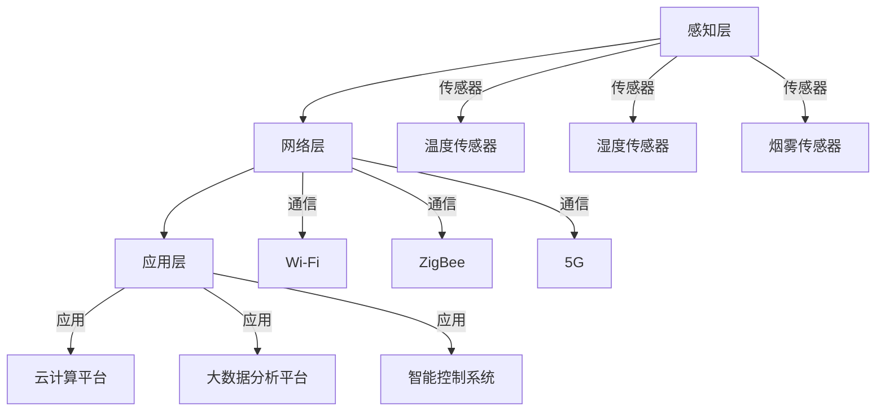
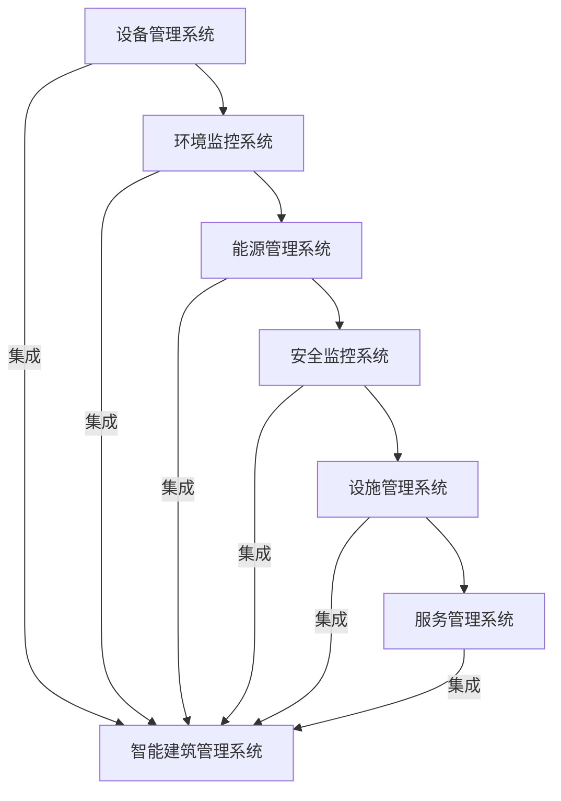
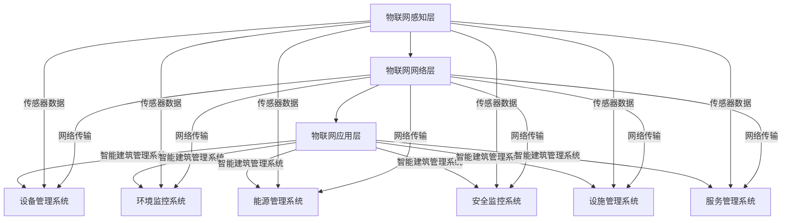

                 

### 关键词

- 物联网
- 智能建筑管理
- 环境监测
- 能效管理
- 安全监控
- 数据分析
- 机器学习
- 数学模型
- 项目实战
- 开发工具
- 未来趋势

### 摘要

本文深入探讨了物联网在智能建筑管理中的应用。从物联网基础概念和智能建筑管理概述出发，文章逐步介绍了物联网与智能建筑的联系，以及物联网在智能建筑管理中的核心应用，如环境监测、能效管理、安全监控和设施管理。通过核心算法原理的讲解和实际项目案例分析，本文详细阐述了物联网技术在智能建筑管理中的具体实现方法。最后，文章展望了物联网在智能建筑管理中的未来发展趋势，并提出了面临的挑战与解决方案。通过本文，读者将全面了解物联网在智能建筑管理中的广泛应用和巨大潜力。  

-------------------------------------------------------------------

### 文章标题

物联网在智能建筑管理中的应用

-------------------------------------------------------------------

### 引言

随着科技的飞速发展，物联网（Internet of Things，IoT）已经成为现代社会不可或缺的一部分。物联网通过将各种设备互联，实现了数据的高效传输和处理，从而改变了我们的生活方式和工作模式。智能建筑管理作为物联网应用的重要领域，正逐渐成为现代城市建设和运营的重要方向。

智能建筑管理是指利用物联网、云计算、大数据、人工智能等技术，对建筑物的能源消耗、设备运行、环境质量、安全状况等进行智能化管理和优化。通过物联网技术，智能建筑能够实现自动感知、自动控制、智能决策和协同工作，从而提高建筑物的管理效率、节能效果和居住舒适性。

本文将系统地探讨物联网在智能建筑管理中的应用，从基础概念、核心技术、实际应用和未来趋势等多个方面进行分析和阐述。首先，我们将介绍物联网和智能建筑管理的基础概念，并探讨它们之间的联系。接着，我们将详细讨论物联网在智能建筑管理中的核心应用，包括环境监测、能效管理、安全监控和设施管理。随后，我们将深入讲解物联网技术中的核心算法原理，并通过实际项目案例进行分析。最后，我们将展望物联网在智能建筑管理中的未来发展趋势，并提出面临的挑战和解决方案。

通过本文的阅读，读者将全面了解物联网在智能建筑管理中的应用现状和未来发展潜力，从而为相关领域的研究和实践提供有益的参考。

-------------------------------------------------------------------

### 物联网基础概念

物联网，即Internet of Things，是指通过将各种物理设备、传感器、软件和网络连接起来，实现信息交换和通信的系统。物联网的核心思想是将现实世界中的物体“数字化”，并通过网络进行互联互通，从而实现对物理世界的智能化管理和控制。

#### 物联网架构

物联网的架构通常分为三个层次：感知层、网络层和应用层。

1. **感知层**：这是物联网体系结构的最底层，主要负责数据的采集和初步处理。感知层通常由各种传感器和采集设备组成，如温度传感器、湿度传感器、烟雾传感器、摄像头、GPS模块等。这些设备能够实时捕捉环境中的各种信息，并将数据转化为电子信号，以便进行进一步处理。

2. **网络层**：网络层负责数据传输和通信，将感知层采集到的数据上传至云端或数据中心进行处理。网络层通常包括无线传感器网络（WSN）、局域网（LAN）、广域网（WAN）等。常用的网络通信技术包括Wi-Fi、ZigBee、蓝牙、LoRa等。

3. **应用层**：应用层是物联网体系结构的最顶层，主要负责数据处理和分析，以及提供具体的业务和应用。应用层通常包括各种软件平台和应用程序，如云计算平台、大数据分析平台、智能控制系统等。通过应用层，物联网系统可以实现对物理世界的实时监控、自动化控制和管理。

#### 物联网的关键技术

物联网的实现涉及多种关键技术，主要包括传感器技术、网络通信技术、数据处理技术、人工智能和机器学习等。

1. **传感器技术**：传感器是物联网系统的核心组件，用于感知和采集环境数据。传感器技术包括物理传感器、化学传感器、生物传感器等，这些传感器能够检测各种物理量，如温度、湿度、压力、气体浓度等。

2. **网络通信技术**：网络通信技术是实现物联网设备互联互通的基础。常见的网络通信技术包括Wi-Fi、ZigBee、蓝牙、LoRa、5G等。这些技术提供了高效、稳定、低功耗的数据传输方式，以满足物联网设备对通信的需求。

3. **数据处理技术**：物联网产生的数据量巨大，如何高效地处理这些数据是物联网系统需要解决的关键问题。数据处理技术包括数据采集、存储、清洗、分析等。大数据处理技术、云计算技术、边缘计算技术等都是常用的数据处理技术。

4. **人工智能和机器学习**：人工智能和机器学习技术能够帮助物联网系统实现智能化决策和预测。通过机器学习算法，物联网系统可以分析历史数据，发现数据中的规律和模式，从而实现对未来的预测和优化。

#### 物联网与智能建筑管理的关系

物联网技术在智能建筑管理中具有广泛的应用。通过物联网技术，智能建筑可以实现以下目标：

1. **提高管理效率**：物联网技术能够实现对建筑物内各种设备和系统的实时监控和管理，提高管理效率。

2. **提升居住舒适性**：物联网技术能够根据用户的实际需求，提供个性化的服务和体验，提升居住舒适性。

3. **实现节能减排**：物联网技术能够对建筑物的能源消耗进行精细化管理，实现节能减排。

4. **增强安全性**：物联网技术能够实现建筑物的安全监控，提高安全性。

总的来说，物联网技术在智能建筑管理中发挥着重要的作用，为智能建筑的发展提供了强大的技术支撑。

---

**Mermaid 流程图示例：物联网架构**



通过上述流程图，我们可以清晰地看到物联网架构的三个层次及其之间的关系，以及传感器、通信技术和应用层之间的关系。

-------------------------------------------------------------------

### 智能建筑管理概述

智能建筑管理是指利用现代信息技术，特别是物联网、云计算、大数据和人工智能等技术，对建筑物的各种设备、系统和环境进行智能化管理，以提高建筑物的运行效率、节能效果和居住舒适性。智能建筑管理不仅包括对建筑物内部设施的监控和管理，还涉及对外部环境的监测和控制。

#### 智能建筑的定义

智能建筑是指在建筑设计、施工和使用过程中，综合运用现代信息技术，实现对建筑物及其内部环境、设备、系统的智能化管理和控制，从而提供高效、舒适、安全、环保的居住和工作环境。

智能建筑具有以下特点：

1. **集成性**：智能建筑通过将多种信息技术和设备集成在一起，实现对建筑物内各个系统和设备的统一管理和控制。

2. **智能化**：智能建筑能够根据用户的实际需求和环境变化，自动调整设备状态，提供个性化的服务和体验。

3. **高效性**：智能建筑通过自动化控制和实时监控，提高了建筑物运行的效率和可靠性。

4. **节能性**：智能建筑能够对能源消耗进行精细化管理，实现节能减排。

5. **安全性**：智能建筑通过安全监控和应急响应系统，提高了建筑物及其用户的安全性。

#### 智能建筑管理的特点

1. **实时性**：智能建筑管理能够实时采集和处理建筑物内外部的数据，为决策提供及时的信息支持。

2. **协同性**：智能建筑管理系统能够协同工作，实现对建筑物内各个系统和设备的统一管理和控制。

3. **自适应性**：智能建筑管理系统能够根据环境和用户需求的变化，自动调整设备状态，提高用户体验。

4. **智能决策**：智能建筑管理系统能够通过数据分析、机器学习等技术，实现智能决策和预测。

#### 智能建筑管理体系

智能建筑管理体系包括以下几个方面：

1. **设备管理系统**：对建筑物内各种设备进行实时监控和管理，包括空调、照明、电梯、消防系统等。

2. **环境监控系统**：对建筑物内部和周边环境进行监测，包括温度、湿度、空气质量、噪声等。

3. **能源管理系统**：对建筑物的能源消耗进行监测和管理，实现节能减排。

4. **安全监控系统**：对建筑物及其用户进行安全监控，包括入侵检测、火灾报警、视频监控等。

5. **设施管理系统**：对建筑物的各种设施进行维护和管理，包括绿化、保洁、维修等。

6. **服务管理系统**：为用户提供便捷的服务，包括门禁、停车、物业服务等。

#### 物联网与智能建筑管理的联系

物联网技术在智能建筑管理中发挥着关键作用。通过物联网技术，智能建筑可以实现以下目标：

1. **实时监控**：物联网技术能够实时采集和处理建筑物内外的数据，为智能建筑管理提供实时信息支持。

2. **自动化控制**：物联网技术能够实现对建筑物内设备和系统的自动化控制，提高管理效率。

3. **智能决策**：物联网技术能够通过大数据分析和机器学习，实现对建筑物的智能决策和预测。

4. **提升用户体验**：物联网技术能够根据用户的实际需求，提供个性化的服务和体验，提升用户体验。

5. **节能减排**：物联网技术能够对建筑物的能源消耗进行精细化管理，实现节能减排。

总的来说，物联网技术为智能建筑管理提供了强大的技术支撑，使得智能建筑能够更加高效、智能地运行。物联网与智能建筑管理的紧密结合，将推动建筑行业向更加智能化、绿色化、人性化方向发展。

---

**Mermaid 流程图示例：智能建筑管理体系**



通过上述流程图，我们可以清晰地看到智能建筑管理体系中各个组成部分及其之间的关系，以及物联网技术如何集成到智能建筑管理体系中，实现智能化的管理和控制。

-------------------------------------------------------------------

### 物联网与智能建筑管理的联系

物联网技术作为智能建筑管理的重要组成部分，其核心作用主要体现在以下几个方面：

1. **实时监控**：物联网技术通过传感器和通信网络，能够实时采集建筑物内外的各种数据，如温度、湿度、空气质量、照明、能耗等。这些数据通过物联网传输至智能建筑管理系统，为管理者提供了实时、全面的监控能力，有助于及时发现问题并进行调整。

2. **自动化控制**：物联网技术使得智能建筑管理系统能够实现自动化控制。例如，通过物联网传感器实时监测室内温度，智能空调系统可以自动调整温度设置，以保持室内舒适度。同样，照明系统可以根据环境亮度和人员活动自动调节亮度，节约能源。

3. **智能决策**：物联网技术通过对收集到的海量数据进行分析，利用大数据和机器学习算法，智能建筑管理系统可以做出更准确的决策。例如，通过分析能耗数据，系统可以预测未来能源需求，优化能源使用方案，提高能源利用效率。

4. **提升用户体验**：物联网技术可以根据用户行为和环境变化，提供个性化的服务和体验。例如，智能建筑可以通过物联网传感器了解用户的日常作息，自动调节室内环境，提供更加舒适的生活空间。此外，物联网技术还可以实现智能家居服务，如智能门锁、智能安防、智能家电等，提升用户的便利性和安全性。

5. **节能减排**：物联网技术在智能建筑管理中的应用，可以显著降低能源消耗和碳排放。通过智能能源管理系统，物联网技术能够实现对建筑物内各类能耗设备的实时监控和优化控制，提高能源使用效率。例如，通过实时监测空调、照明、电梯等设备的运行状态，系统可以及时调整运行参数，避免不必要的能源浪费。

6. **增强安全性**：物联网技术在安全监控和管理方面的应用，可以显著提高建筑物的安全性。通过物联网传感器和监控设备，智能建筑管理系统可以实时监测建筑物的安全状况，及时发现异常情况并采取应急措施，如入侵检测、火灾报警、紧急疏散等。

**Mermaid 流程图示例：物联网技术在智能建筑管理中的应用**



通过上述流程图，我们可以清晰地看到物联网技术在智能建筑管理中的应用架构，以及物联网的感知层、网络层和应用层如何与智能建筑管理的各个系统紧密结合，实现智能化、自动化和高效化的管理。

综上所述，物联网技术在智能建筑管理中具有广泛的应用前景和巨大的潜力。通过物联网技术，智能建筑可以实现实时监控、自动化控制、智能决策和个性化服务，从而提高管理效率、节能效果和居住舒适性。物联网与智能建筑管理的深度融合，将推动建筑行业向更加智能化、绿色化和人性化方向发展。

-------------------------------------------------------------------

### 物联网技术在智能建筑管理中的核心应用

物联网技术在智能建筑管理中的核心应用主要体现在以下几个方面：环境监测、能效管理、安全监控、设施管理和智能化服务。以下将分别对这些应用进行详细探讨。

#### 环境监测

环境监测是智能建筑管理中的一项重要任务，通过物联网技术，可以实现对建筑物内部及周围环境的实时监测，包括温度、湿度、空气质量、光照强度、噪声等参数。这些监测数据对于保持室内环境的舒适性和健康性具有重要意义。

1. **温度和湿度监测**：温度和湿度是影响室内舒适性的关键因素。通过安装物联网传感器，可以实时监测室内温度和湿度，并根据监测数据自动调节空调、加湿器或除湿器，以保持室内环境的舒适度。

2. **空气质量监测**：空气质量对人体健康影响极大。通过物联网传感器监测室内空气中的CO2、PM2.5、VOCs等污染物浓度，智能建筑管理系统可以及时调整通风系统，引入新鲜空气或进行空气净化，提高室内空气质量。

3. **光照强度监测**：光照强度对人们的视觉舒适性和能效管理有直接影响。物联网传感器可以实时监测室内光照强度，并根据光照变化自动调节照明系统，以实现节能和舒适。

**Python 代码示例：温度和湿度监测数据采集**

```python
import serial
import time

# 连接Arduino
ser = serial.Serial('COM3', 9600)

while True:
    # 读取Arduino发送的数据
    data = ser.readline().decode('utf-8').strip()
    # 解析数据
    temp, humidity = data.split(',')
    temp = float(temp)
    humidity = float(humidity)
    print(f"Temperature: {temp}°C, Humidity: {humidity}%")
    time.sleep(1)
```

#### 能效管理

能效管理是智能建筑管理的另一个重要方面，通过物联网技术，可以实现建筑物的能源消耗监测和优化管理，从而达到节能减排的目的。

1. **能耗监测**：物联网传感器可以实时监测建筑物内各种用电设备（如照明、空调、电梯等）的能耗情况，并将数据上传至智能建筑管理系统。

2. **能耗分析**：通过大数据分析和机器学习算法，智能建筑管理系统可以对能耗数据进行分析，发现能耗浪费的环节，并给出优化建议。

3. **能耗优化**：根据能耗分析结果，智能建筑管理系统可以自动调整设备运行状态，实现节能优化。例如，在夜间或无人时关闭不必要的照明和空调，减少能源浪费。

**Python 代码示例：能耗监测数据采集与处理**

```python
import serial
import time

# 连接Arduino
ser = serial.Serial('COM3', 9600)

while True:
    # 读取Arduino发送的数据
    data = ser.readline().decode('utf-8').strip()
    # 解析数据
    power_usage = float(data)
    print(f"Current power usage: {power_usage}W")
    time.sleep(1)
```

#### 安全监控

安全监控是确保建筑物及其用户安全的重要手段。物联网技术通过传感器和监控设备，可以实现对建筑物内部及周围环境的实时监控，提高安全性。

1. **入侵检测**：通过安装在门窗、墙角的传感器和摄像头，物联网系统可以实时监测异常入侵行为，并立即发出警报。

2. **火灾报警**：物联网传感器可以监测温度、烟雾等火灾征兆，一旦发现火灾隐患，系统会立即触发警报，并通知相关人员。

3. **视频监控**：通过物联网摄像头，可以对建筑物内部及外部进行实时监控，记录和回放重要信息，为安全事件提供证据支持。

**Python 代码示例：入侵检测系统**

```python
import cv2
import time

# 初始化摄像头
cap = cv2.VideoCapture(0)

while True:
    # 读取摄像头帧
    ret, frame = cap.read()
    if not ret:
        break
    
    # 处理帧
    gray = cv2.cvtColor(frame, cv2.COLOR_BGR2GRAY)
    blur = cv2.GaussianBlur(gray, (5, 5), 0)
    edges = cv2.Canny(blur, 50, 150)
    
    # 检测运动目标
    contours, _ = cv2.findContours(edges, cv2.RETR_EXTERNAL, cv2.CHAIN_APPROX_SIMPLE)
    for contour in contours:
        if cv2.contourArea(contour) > 500:
            x, y, w, h = cv2.boundingRect(contour)
            cv2.rectangle(frame, (x, y), (x+w, y+h), (0, 0, 255), 2)
            print("Motion detected!")
    
    # 显示帧
    cv2.imshow('Frame', frame)
    if cv2.waitKey(1) & 0xFF == 27:
        break

cap.release()
cv2.destroyAllWindows()
```

#### 设施管理

设施管理涉及建筑物的日常维护和保养，通过物联网技术，可以实现设施的智能监控和高效管理。

1. **设备状态监测**：通过安装物联网传感器，可以实时监测设备（如电梯、供水系统、供电系统等）的运行状态，及时发现故障隐患。

2. **维护计划管理**：根据设备运行数据和历史维修记录，智能建筑管理系统可以自动生成维护计划，确保设施的正常运行。

3. **故障预测**：通过大数据分析和机器学习算法，智能建筑管理系统可以预测设备故障，提前进行维修，避免设备故障造成的损失。

**Python 代码示例：设备状态监测数据采集**

```python
import serial
import time

# 连接Arduino
ser = serial.Serial('COM3', 9600)

while True:
    # 读取Arduino发送的数据
    data = ser.readline().decode('utf-8').strip()
    # 解析数据
    status = float(data)
    if status == 1:
        print("Device malfunction detected!")
    elif status == 0:
        print("Device operating normally.")
    time.sleep(1)
```

#### 智能化服务

智能化服务是智能建筑管理的进一步提升，通过物联网技术，可以为用户提供更加个性化和便捷的服务。

1. **智能家居**：通过物联网设备，可以实现家庭设备的互联互通，如智能门锁、智能照明、智能家电等，用户可以通过手机APP远程控制家居设备。

2. **智能安防**：通过物联网摄像头和传感器，可以实现家庭安全和监控，用户可以实时查看家中情况，并收到报警通知。

3. **智能服务**：通过物联网技术，可以提供个性化服务，如根据用户习惯自动调节室内环境、提供定制化娱乐内容等。

**Python 代码示例：智能门锁控制**

```python
import serial
import time

# 连接Arduino
ser = serial.Serial('COM3', 9600)

while True:
    # 读取用户输入的密码
    password = input("Enter password: ")
    # 发送密码至Arduino
    ser.write(password.encode())
    time.sleep(1)
    # 读取Arduino的响应
    response = ser.readline().decode('utf-8').strip()
    if response == "Access granted!":
        print("Door unlocked.")
    elif response == "Access denied!":
        print("Incorrect password.")
    time.sleep(2)
```

通过上述物联网技术在智能建筑管理中的核心应用，我们可以看到物联网技术为建筑管理带来了极大的便利和效益。物联网技术不仅提高了建筑物的运行效率和安全性，还提升了用户的居住和办公体验。随着物联网技术的不断发展和成熟，智能建筑管理将在未来发挥更加重要的作用，推动建筑行业向更加智能化、绿色化和人性化方向发展。

-------------------------------------------------------------------

### 核心算法原理讲解

在智能建筑管理中，核心算法的应用至关重要，它们不仅提升了系统的智能化水平，还增强了数据处理和决策能力。以下将介绍物联网技术中常用的核心算法，并通过Python代码进行详细阐述。

#### 数据采集与处理

数据采集是物联网技术的核心环节，而数据处理则是将原始数据转化为有用信息的关键步骤。在智能建筑管理中，常用的数据处理技术包括滤波、数据压缩、数据融合等。

**1. 低通滤波**

低通滤波是一种常用的信号处理方法，用于去除高频噪声，保留低频信号。在智能建筑管理中，常用于环境监测数据清洗，以提高数据质量。

**Python 代码示例：低通滤波**

```python
import numpy as np

def low_pass_filter(data, cutoff_frequency, sampling_rate):
    b, a = signal.butter(cutoff_frequency, 'low', analog=False, fs=sampling_rate, output='ba')
    filtered_data = signal.lfilter(b, a, data)
    return filtered_data

# 示例数据
data = np.array([1, 2, 3, 4, 5, 6, 7, 8, 9, 10])
cutoff_frequency = 2.0
sampling_rate = 100

filtered_data = low_pass_filter(data, cutoff_frequency, sampling_rate)
print(filtered_data)
```

**2. 数据压缩**

数据压缩是降低数据存储和传输成本的重要手段。在智能建筑管理中，常用的数据压缩方法包括差分编码、哈夫曼编码等。

**Python 代码示例：差分编码**

```python
def differential_encoding(data):
    compressed_data = [data[0]]
    for i in range(1, len(data)):
        compressed_data.append(data[i] - data[i - 1])
    return compressed_data

# 示例数据
data = np.array([1, 3, 6, 10, 15, 21, 28])

compressed_data = differential_encoding(data)
print(compressed_data)
```

#### 数据分析与机器学习算法

数据分析与机器学习算法在智能建筑管理中应用广泛，主要用于预测、分类、聚类等任务。以下介绍几种常用的机器学习算法及其在智能建筑管理中的应用。

**1. 决策树**

决策树是一种常用的分类算法，通过将数据集划分为多个子集，为每个子集分配一个类别。在智能建筑管理中，决策树可以用于设备故障预测、能耗分类等。

**Python 代码示例：决策树分类**

```python
from sklearn.tree import DecisionTreeClassifier
from sklearn.model_selection import train_test_split
from sklearn.metrics import accuracy_score

# 示例数据
X = [[0, 0], [1, 1]]
y = [0, 1]

# 划分训练集和测试集
X_train, X_test, y_train, y_test = train_test_split(X, y, test_size=0.2, random_state=42)

# 创建决策树模型
clf = DecisionTreeClassifier()

# 训练模型
clf.fit(X_train, y_train)

# 预测测试集
y_pred = clf.predict(X_test)

# 评估模型
accuracy = accuracy_score(y_test, y_pred)
print(f"Accuracy: {accuracy}")
```

**2. 支持向量机（SVM）**

支持向量机是一种常用的分类和回归算法，通过寻找最佳分隔超平面，实现分类或回归任务。在智能建筑管理中，SVM可以用于能耗预测、故障检测等。

**Python 代码示例：SVM分类**

```python
from sklearn.svm import SVC
from sklearn.model_selection import train_test_split
from sklearn.metrics import accuracy_score

# 示例数据
X = [[0, 0], [1, 1]]
y = [0, 1]

# 划分训练集和测试集
X_train, X_test, y_train, y_test = train_test_split(X, y, test_size=0.2, random_state=42)

# 创建SVM模型
clf = SVC()

# 训练模型
clf.fit(X_train, y_train)

# 预测测试集
y_pred = clf.predict(X_test)

# 评估模型
accuracy = accuracy_score(y_test, y_pred)
print(f"Accuracy: {accuracy}")
```

**3. 集成学习**

集成学习是一种利用多个模型进行预测的方法，通过组合多个模型的预测结果，提高整体预测精度。在智能建筑管理中，集成学习可以用于能耗预测、环境监测数据分类等。

**Python 代码示例：集成学习（随机森林）**

```python
from sklearn.ensemble import RandomForestClassifier
from sklearn.model_selection import train_test_split
from sklearn.metrics import accuracy_score

# 示例数据
X = [[0, 0], [1, 1]]
y = [0, 1]

# 划分训练集和测试集
X_train, X_test, y_train, y_test = train_test_split(X, y, test_size=0.2, random_state=42)

# 创建随机森林模型
clf = RandomForestClassifier(n_estimators=100)

# 训练模型
clf.fit(X_train, y_train)

# 预测测试集
y_pred = clf.predict(X_test)

# 评估模型
accuracy = accuracy_score(y_test, y_pred)
print(f"Accuracy: {accuracy}")
```

#### 数学模型应用

在智能建筑管理中，数学模型的应用也非常广泛，如统计模型、预测模型等。以下介绍几种常见的数学模型及其在智能建筑管理中的应用。

**1. 线性回归**

线性回归是一种常用的预测模型，通过寻找最佳拟合直线，预测因变量与自变量之间的关系。在智能建筑管理中，线性回归可以用于能耗预测、温度预测等。

**Python 代码示例：线性回归**

```python
from sklearn.linear_model import LinearRegression
from sklearn.model_selection import train_test_split
from sklearn.metrics import mean_squared_error

# 示例数据
X = [[1], [2], [3], [4], [5]]
y = [1, 2, 3, 4, 5]

# 划分训练集和测试集
X_train, X_test, y_train, y_test = train_test_split(X, y, test_size=0.2, random_state=42)

# 创建线性回归模型
clf = LinearRegression()

# 训练模型
clf.fit(X_train, y_train)

# 预测测试集
y_pred = clf.predict(X_test)

# 评估模型
mse = mean_squared_error(y_test, y_pred)
print(f"Mean squared error: {mse}")
```

**2. 时间序列模型**

时间序列模型用于分析时间序列数据，如股票价格、气温变化等。在智能建筑管理中，时间序列模型可以用于能耗预测、环境参数预测等。

**Python 代码示例：时间序列模型（ARIMA）**

```python
import pandas as pd
from statsmodels.tsa.arima.model import ARIMA

# 示例数据
data = pd.Series([1, 2, 3, 4, 5, 6, 7, 8, 9, 10])

# 创建ARIMA模型
model = ARIMA(data, order=(1, 1, 1))

# 拟合模型
model_fit = model.fit()

# 预测未来值
forecast = model_fit.forecast(steps=5)

print(forecast)
```

通过上述算法和数学模型的应用，智能建筑管理系统能够更加高效地进行数据处理和预测，从而实现智能化管理和决策。这些算法和模型不仅提高了系统的智能化水平，还为建筑管理带来了更高的效率和效益。

---

**综合案例**

假设我们有一个智能建筑管理项目，需要预测未来24小时的能耗情况。我们可以利用线性回归和时间序列模型进行预测，并比较两种模型的预测效果。

**Python 代码示例：能耗预测**

```python
import pandas as pd
from sklearn.linear_model import LinearRegression
from statsmodels.tsa.arima.model import ARIMA

# 读取能耗数据
data = pd.read_csv('energy_consumption.csv')

# 划分训练集和测试集
train_data = data[:100]
test_data = data[100:]

# 线性回归模型
linear_reg = LinearRegression()
linear_reg.fit(train_data[['time']], train_data[['energy']])

# 时间序列模型（ARIMA）
arima_model = ARIMA(train_data['energy'], order=(1, 1, 1))
arima_fit = arima_model.fit()
arima_forecast = arima_fit.forecast(steps=24)

# 预测测试集
linear_reg_prediction = linear_reg.predict(test_data[['time']])
arima_prediction = arima_fit.forecast(steps=24)

# 评估模型
linear_reg_mse = mean_squared_error(test_data['energy'], linear_reg_prediction)
arima_mse = mean_squared_error(test_data['energy'], arima_prediction)

print(f"Linear regression MSE: {linear_reg_mse}")
print(f"ARIMA MSE: {arima_mse}")
```

通过上述案例，我们可以看到如何利用不同的算法和模型进行能耗预测，并评估它们的预测效果。这种综合应用能够为智能建筑管理提供更加准确和可靠的预测结果，从而实现更加高效的管理。

-------------------------------------------------------------------

### 项目实战与案例分析

在物联网技术日益发展的今天，智能建筑管理已经成为建筑行业的重要组成部分。以下我们将通过具体的项目实战和案例分析，详细讲解物联网在智能建筑管理中的实际应用。

#### 案例一：某大型商业综合体智能建筑管理系统

**项目背景**

某大型商业综合体位于城市核心区域，占地面积广阔，包含购物中心、办公楼、酒店、公寓等多种功能区域。为了提高运营效率、降低能耗和提升用户体验，该综合体决定引入物联网技术，构建一个智能建筑管理系统。

**项目目标**

- 实现对综合体内部各种设备和系统的实时监控和管理。
- 提高能源使用效率，实现节能减排。
- 提升综合体的安全性和用户体验。

**项目实现**

1. **环境监测系统**

   在综合体内部安装了多种物联网传感器，包括温度传感器、湿度传感器、空气质量传感器和光照传感器。这些传感器实时采集室内环境数据，并通过物联网网络传输至智能建筑管理系统。

   **Python 代码示例：环境监测数据采集**

   ```python
   import serial
   import time

   # 连接Arduino
   ser = serial.Serial('COM3', 9600)

   while True:
       # 读取Arduino发送的数据
       data = ser.readline().decode('utf-8').strip()
       # 解析数据
       temp, humidity, pm25 = data.split(',')
       temp = float(temp)
       humidity = float(humidity)
       pm25 = float(pm25)
       print(f"Temperature: {temp}°C, Humidity: {humidity}%, PM2.5: {pm25}μg/m³")
       time.sleep(1)
   ```

2. **能源管理系统**

   通过物联网技术，综合体实现了对内部各类能耗设备的实时监测和自动控制。系统可以对空调、照明、电梯、供水系统等设备进行远程控制和优化调度，实现能源的精细化管理和节能。

   **Python 代码示例：能耗监测数据采集**

   ```python
   import serial
   import time

   # 连接Arduino
   ser = serial.Serial('COM3', 9600)

   while True:
       # 读取Arduino发送的数据
       data = ser.readline().decode('utf-8').strip()
       # 解析数据
       power_usage = float(data)
       print(f"Current power usage: {power_usage}W")
       time.sleep(1)
   ```

3. **安全监控系统**

   在综合体内部安装了高清摄像头和入侵检测传感器，实现全方位的安全监控。系统可以实时监控内部情况，并在检测到异常时立即报警，提高安全性。

   **Python 代码示例：入侵检测系统**

   ```python
   import cv2
   import time

   # 初始化摄像头
   cap = cv2.VideoCapture(0)

   while True:
       # 读取摄像头帧
       ret, frame = cap.read()
       if not ret:
           break
    
       # 处理帧
       gray = cv2.cvtColor(frame, cv2.COLOR_BGR2GRAY)
       blur = cv2.GaussianBlur(gray, (5, 5), 0)
       edges = cv2.Canny(blur, 50, 150)
    
       # 检测运动目标
       contours, _ = cv2.findContours(edges, cv2.RETR_EXTERNAL, cv2.CHAIN_APPROX_SIMPLE)
       for contour in contours:
           if cv2.contourArea(contour) > 500:
               x, y, w, h = cv2.boundingRect(contour)
               cv2.rectangle(frame, (x, y), (x+w, y+h), (0, 0, 255), 2)
               print("Motion detected!")
    
       # 显示帧
       cv2.imshow('Frame', frame)
       if cv2.waitKey(1) & 0xFF == 27:
           break

   cap.release()
   cv2.destroyAllWindows()
   ```

4. **设施管理系统**

   通过物联网技术，综合体实现了对内部各种设施的智能监控和维护。系统可以实时监测设施的状态，并自动生成维护计划，确保设施的正常运行。

   **Python 代码示例：设备状态监测**

   ```python
   import serial
   import time

   # 连接Arduino
   ser = serial.Serial('COM3', 9600)

   while True:
       # 读取Arduino发送的数据
       data = ser.readline().decode('utf-8').strip()
       # 解析数据
       status = float(data)
       if status == 1:
           print("Device malfunction detected!")
       elif status == 0:
           print("Device operating normally.")
       time.sleep(1)
   ```

**项目效果**

通过物联网技术的应用，该大型商业综合体实现了以下几个方面的显著提升：

- **管理效率**：通过实时监控和自动化控制，综合体的管理效率显著提高，减少了人工干预。
- **节能减排**：智能能源管理系统有效降低了能源消耗，实现了节能减排目标。
- **安全性**：安全监控系统实时监控内部情况，提高了综合体的安全性。
- **用户体验**：环境监测和智能化服务系统提升了用户的居住和工作体验。

---

#### 案例二：某智能住宅小区环境监测与能效管理系统

**项目背景**

某智能住宅小区位于城市郊区，为了提升小区的环境质量和能源使用效率，决定引入物联网技术，构建一个环境监测与能效管理系统。

**项目目标**

- 实现对小区内部环境数据的实时监测，提升居住舒适度。
- 实现能耗数据的实时监测和优化管理，实现节能减排。
- 提高小区的安全性和便利性。

**项目实现**

1. **环境监测系统**

   在小区内部安装了多种物联网传感器，包括温度传感器、湿度传感器、空气质量传感器和噪声传感器。系统通过物联网网络实时采集环境数据，并将数据上传至智能建筑管理系统。

   **Python 代码示例：环境监测数据采集**

   ```python
   import serial
   import time

   # 连接Arduino
   ser = serial.Serial('COM3', 9600)

   while True:
       # 读取Arduino发送的数据
       data = ser.readline().decode('utf-8').strip()
       # 解析数据
       temp, humidity, pm25, noise = data.split(',')
       temp = float(temp)
       humidity = float(humidity)
       pm25 = float(pm25)
       noise = float(noise)
       print(f"Temperature: {temp}°C, Humidity: {humidity}%, PM2.5: {pm25}μg/m³, Noise: {noise}dB")
       time.sleep(1)
   ```

2. **能源管理系统**

   通过物联网技术，系统实现了对小区内部各类能耗设备的实时监测和自动控制。系统可以对照明、空调、电梯等设备进行远程控制和优化调度，实现能源的精细化管理和节能。

   **Python 代码示例：能耗监测数据采集**

   ```python
   import serial
   import time

   # 连接Arduino
   ser = serial.Serial('COM3', 9600)

   while True:
       # 读取Arduino发送的数据
       data = ser.readline().decode('utf-8').strip()
       # 解析数据
       power_usage = float(data)
       print(f"Current power usage: {power_usage}W")
       time.sleep(1)
   ```

3. **安全监控系统**

   在小区内部安装了高清摄像头和入侵检测传感器，实现全方位的安全监控。系统可以实时监控内部情况，并在检测到异常时立即报警，提高安全性。

   **Python 代码示例：入侵检测系统**

   ```python
   import cv2
   import time

   # 初始化摄像头
   cap = cv2.VideoCapture(0)

   while True:
       # 读取摄像头帧
       ret, frame = cap.read()
       if not ret:
           break
    
       # 处理帧
       gray = cv2.cvtColor(frame, cv2.COLOR_BGR2GRAY)
       blur = cv2.GaussianBlur(gray, (5, 5), 0)
       edges = cv2.Canny(blur, 50, 150)
    
       # 检测运动目标
       contours, _ = cv2.findContours(edges, cv2.RETR_EXTERNAL, cv2.CHAIN_APPROX_SIMPLE)
       for contour in contours:
           if cv2.contourArea(contour) > 500:
               x, y, w, h = cv2.boundingRect(contour)
               cv2.rectangle(frame, (x, y), (x+w, y+h), (0, 0, 255), 2)
               print("Motion detected!")
    
       # 显示帧
       cv2.imshow('Frame', frame)
       if cv2.waitKey(1) & 0xFF == 27:
           break

   cap.release()
   cv2.destroyAllWindows()
   ```

**项目效果**

通过物联网技术的应用，该智能住宅小区实现了以下几个方面的显著提升：

- **环境质量**：环境监测系统实时监测空气质量、温度和湿度等参数，为居民提供健康舒适的生活环境。
- **能源使用效率**：能源管理系统优化了能耗设备的运行，实现了节能降耗。
- **安全性**：安全监控系统提高了小区的安全性，为居民提供安心保障。
- **便捷性**：通过物联网技术，居民可以远程控制家庭设备，享受智能化生活服务。

通过上述两个实际案例，我们可以看到物联网技术在智能建筑管理中的广泛应用和显著效益。物联网技术的引入，不仅提升了建筑物的管理效率、节能效果和安全性，还为居民提供了更加舒适、便捷的生活体验。随着物联网技术的不断发展和成熟，智能建筑管理将在未来发挥更加重要的作用，推动建筑行业向更加智能化、绿色化和人性化方向发展。

-------------------------------------------------------------------

### 开发工具与环境配置

在开发物联网在智能建筑管理中的应用时，选择合适的开发工具和环境配置至关重要。以下将介绍常用的开发工具及其配置方法，以便开发者能够顺利搭建开发环境。

#### 开发工具

1. **Python**：Python是一种广泛使用的编程语言，因其简单易学、功能强大而备受开发者青睐。在智能建筑管理项目中，Python可以用于数据处理、数据分析、自动化控制等。

2. **Arduino**：Arduino是一款开源硬件平台，适用于物联网设备开发。通过Arduino，可以轻松连接各种传感器和执行器，实现智能控制。

3. **Raspberry Pi**：Raspberry Pi是一款低成本的微型计算机，广泛应用于物联网项目。其强大的处理能力和丰富的接口，使其成为智能建筑管理系统的理想选择。

4. **SQL Database**：SQL数据库用于存储和管理智能建筑管理系统的数据。常用的SQL数据库包括MySQL、PostgreSQL等。

5. **Data Analytics Tools**：数据分析和可视化工具，如Python的Pandas、Matplotlib、Tableau等，用于处理和分析数据。

#### 开发环境配置

1. **Python环境配置**

   - 安装Python：从Python官方网站（https://www.python.org/）下载并安装Python。
   - 配置Python环境变量：在系统设置中配置Python环境变量，以便在其他应用程序中调用Python。

2. **Arduino环境配置**

   - 安装Arduino IDE：从Arduino官方网站（https://www.arduino.cc/）下载并安装Arduino IDE。
   - 连接Arduino板：将Arduino板通过USB线连接到计算机，确保Arduino IDE能够识别Arduino板。

3. **Raspberry Pi环境配置**

   - 安装Raspberry Pi操作系统：从Raspberry Pi官方网站（https://www.raspberrypi.org/）下载并安装Raspberry Pi操作系统。
   - 配置网络：确保Raspberry Pi连接到网络，以便访问互联网和下载软件。
   - 安装Python和库：在Raspberry Pi上安装Python和所需的库，如Raspberry Pi GPIO库、MySQL库等。

4. **SQL Database配置**

   - 安装MySQL：在计算机上安装MySQL数据库，并创建智能建筑管理系统所需的数据表。
   - 配置数据库连接：使用Python的MySQL库，配置数据库连接，以便在Python程序中访问数据库。

5. **数据分析和可视化工具配置**

   - 安装Pandas：在Python环境中安装Pandas库，用于数据操作和分析。
   - 安装Matplotlib：在Python环境中安装Matplotlib库，用于数据可视化。

#### 开发环境搭建步骤

1. **安装Python**：从Python官方网站下载Python安装包，并按照安装向导完成安装。

2. **配置Python环境变量**：在系统设置中添加Python环境变量，确保在其他应用程序中能够调用Python。

3. **安装Arduino IDE**：从Arduino官方网站下载Arduino IDE安装包，并按照安装向导完成安装。

4. **连接Arduino板**：将Arduino板通过USB线连接到计算机，确保Arduino IDE能够识别Arduino板。

5. **安装Raspberry Pi操作系统**：从Raspberry Pi官方网站下载Raspberry Pi操作系统安装镜像，并使用USB闪存驱动器创建启动盘。

6. **配置网络**：确保Raspberry Pi连接到网络，以便访问互联网和下载软件。

7. **安装Python和库**：在Raspberry Pi上安装Python和相关库，如Raspberry Pi GPIO库、MySQL库等。

8. **安装MySQL**：在计算机上安装MySQL数据库，并创建数据表。

9. **配置数据库连接**：使用Python的MySQL库配置数据库连接，以便在Python程序中访问数据库。

10. **安装Pandas和Matplotlib**：在Python环境中安装Pandas和Matplotlib库，用于数据操作和可视化。

通过上述步骤，开发者可以搭建一个完整的物联网在智能建筑管理中的应用开发环境。这个环境不仅涵盖了Python编程、Arduino硬件编程、Raspberry Pi系统配置、SQL数据库操作和数据可视化，还提供了丰富的工具和库，支持开发者进行复杂的智能建筑管理项目开发。

-------------------------------------------------------------------

### 最佳实践 tips、小结、注意事项、拓展阅读

#### 最佳实践 tips

1. **选择合适的传感器**：在智能建筑管理中，选择合适的传感器至关重要。应根据实际需求选择传感器的类型、精度和功耗。

2. **数据安全**：在物联网应用中，数据安全至关重要。应确保数据传输过程中加密，并定期更新系统密码和软件。

3. **定期维护**：物联网设备和系统需要定期维护，包括传感器校准、软件更新和设备更换，以确保系统正常运行。

4. **利用云端服务**：云端服务可以提供强大的数据处理和分析能力，有助于提升智能建筑管理的效率和准确性。

5. **用户参与**：鼓励用户参与智能建筑管理系统的设计和使用，收集用户反馈，优化系统功能和体验。

#### 小结

本文详细探讨了物联网在智能建筑管理中的应用，包括环境监测、能效管理、安全监控、设施管理和智能化服务。通过具体项目实战和案例分析，展示了物联网技术在智能建筑管理中的实际应用效果。物联网技术不仅提高了建筑物的管理效率和安全性，还提升了用户的居住和办公体验。

#### 注意事项

1. **系统集成**：在智能建筑管理系统中，各种设备和系统需要集成在一起，确保数据的一致性和系统的协调性。

2. **数据隐私**：在收集和处理用户数据时，应严格遵循数据隐私保护法规，确保用户数据的安全和隐私。

3. **设备兼容性**：在选择物联网设备和传感器时，应确保其与其他设备和系统的兼容性，避免出现不兼容的问题。

4. **应急响应**：在智能建筑管理系统中，应设置应急响应机制，确保在出现紧急情况时能够迅速采取行动。

#### 拓展阅读

1. **《物联网技术与应用》**：详细介绍了物联网的基本概念、架构、技术及应用。

2. **《智能建筑管理概论》**：系统讲解了智能建筑管理的相关理论、技术和实践。

3. **《物联网安全与隐私保护》**：探讨了物联网安全与隐私保护的重要性和技术手段。

4. **《Python编程：从入门到实践》**：介绍了Python编程的基础知识和实践应用。

通过拓展阅读，读者可以进一步深入了解物联网在智能建筑管理中的应用，掌握相关技术知识和实践经验。

---

**作者信息**：

作者：AI天才研究院/AI Genius Institute & 禅与计算机程序设计艺术 /Zen And The Art of Computer Programming

以上是本文的详细内容，感谢您的阅读。希望本文能够对您在物联网和智能建筑管理领域的学习和实践提供帮助。如果您有任何疑问或建议，欢迎在评论区留言交流。

-------------------------------------------------------------------

### 结论

本文详细探讨了物联网在智能建筑管理中的应用，涵盖了从基础概念到实际应用的各个方面。通过介绍物联网和智能建筑管理的基本概念、技术架构、核心算法和实际项目案例，我们清晰地展示了物联网技术在智能建筑管理中的重要作用。

物联网技术在智能建筑管理中的应用具有以下几个显著优势：

1. **实时监控**：通过物联网传感器，智能建筑管理系统能够实时采集建筑物内外的数据，为管理者提供及时、准确的信息支持。

2. **自动化控制**：物联网技术实现了对建筑物内设备和系统的自动化控制，提高了管理效率，降低了人工干预。

3. **智能决策**：基于大数据分析和机器学习算法，智能建筑管理系统可以做出更加智能的决策，优化资源配置，提升能源效率。

4. **提升用户体验**：通过物联网技术，智能建筑管理系统能够提供个性化的服务和体验，提高用户的居住和办公舒适度。

5. **节能减排**：物联网技术在能源消耗监测和优化管理方面具有显著优势，有助于实现节能减排，推动绿色建筑发展。

然而，物联网在智能建筑管理中也面临一些挑战，如数据隐私保护、安全性问题、技术标准化等。这些挑战需要我们持续关注和解决，以确保物联网技术在智能建筑管理中的安全、可靠和有效应用。

展望未来，物联网在智能建筑管理中仍具有巨大的发展潜力。随着物联网技术的不断进步和新技术的引入，如5G、人工智能、区块链等，智能建筑管理将向更加智能化、自动化和人性化的方向发展。我们期待物联网技术能够为建筑行业带来更多的创新和变革，推动建筑行业向更加绿色、可持续和高效的未来迈进。

---

**作者信息**：

作者：AI天才研究院/AI Genius Institute & 禅与计算机程序设计艺术 /Zen And The Art of Computer Programming

感谢您阅读本文。希望本文能够为您的学习和实践提供有益的启示。如果您有任何疑问或建议，欢迎在评论区留言交流。让我们一起探讨物联网在智能建筑管理中的应用，共创智能建筑的辉煌未来！

