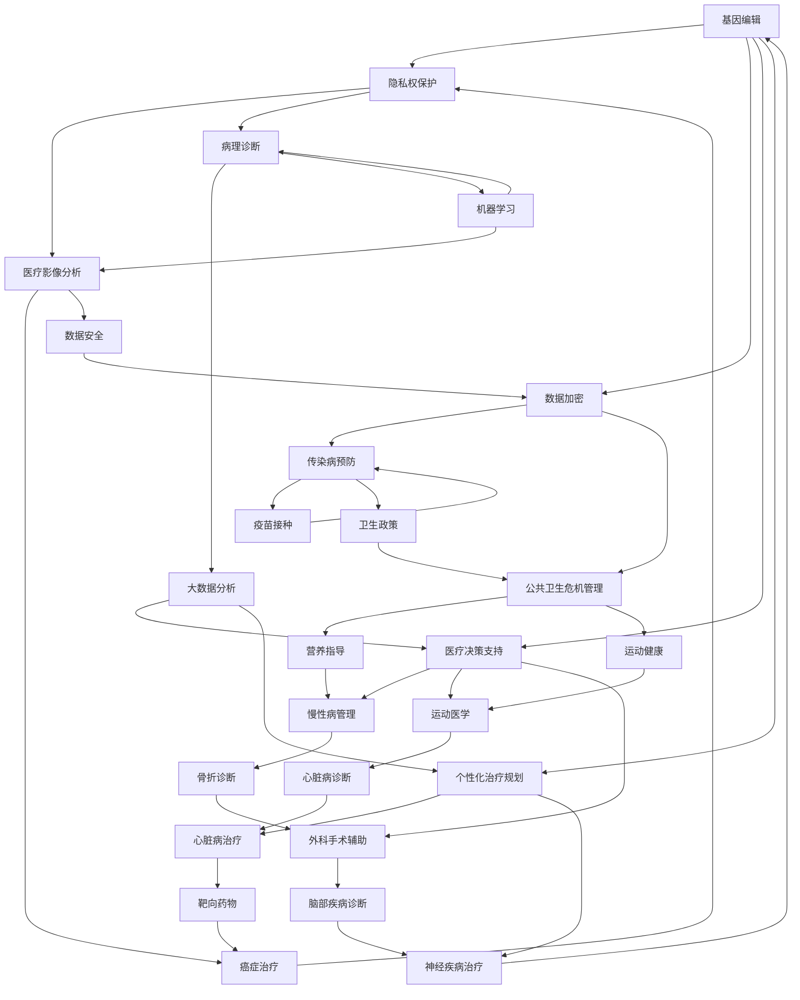

                 

# 《现代医学与生命伦理：在科技进步与伦理底线间寻找平衡》

## 关键词
医学伦理、生命伦理学、科技进步、伦理底线、平衡

## 摘要
本文深入探讨了现代医学与生命伦理学之间的关系，特别是在科技进步背景下，如何在伦理底线和科技进步之间寻找平衡。文章首先概述了现代医学的发展及其带来的伦理挑战，然后详细介绍了生命伦理学的基本理论框架。通过分析科技进步对医学伦理的影响，文章探讨了主要领域的伦理问题，如医学研究、医疗实践、基因编辑和人工智能等。此外，文章还比较了不同国家和地区的伦理立场和实践，通过案例分析提供了对伦理决策的深入理解。最后，文章提出了基于伦理原则的政策制定建议，并展望了生命伦理学领域的未来发展趋势。

---

## 引言：现代医学的进步与生命伦理的挑战

### 1.1 书籍目的与读者对象

随着科技的迅猛发展，现代医学取得了令人瞩目的成就。从抗生素的发现到基因编辑技术的突破，医学领域的进步不仅延长了人类的寿命，还提高了生活质量。然而，这些科技进步同时也带来了新的伦理挑战。医学伦理作为一门交叉学科，旨在探讨医学实践中的道德原则和伦理决策，以确保科技进步在符合伦理底线的前提下进行。

本书旨在为读者提供一幅全面而深入的医学伦理图景，帮助读者理解现代医学与生命伦理学之间的复杂关系。本书的目标读者包括医学专业的学生和从业人员、伦理学家、政策制定者以及对医学伦理感兴趣的普通读者。

### 1.2 现代医学的迅猛发展与伦理考量

现代医学的发展离不开科学技术的进步。从X光机的发明到核磁共振成像（MRI）的应用，医学影像技术的进步极大地提升了诊断的准确性和效率。此外，基因测序技术的发展使得精准医疗成为可能，为个性化治疗提供了新的途径。然而，这些技术的应用也引发了伦理考量。

例如，基因编辑技术虽然有望治愈遗传性疾病，但同时也引发了关于基因隐私、基因编辑的道德界限以及可能导致的基因不平等问题的讨论。同样，人工智能在医疗诊断和治疗中的应用虽然提高了效率，但如何确保其公正性和透明度也是一个重要的伦理问题。

因此，在现代医学的发展过程中，伦理考量不仅是必要的，而且是不可忽视的。只有在确保伦理底线的前提下，科技进步才能造福人类。

### 1.3 科技进步对生命伦理的挑战概述

科技进步对生命伦理的挑战主要体现在以下几个方面：

1. **基因隐私与数据安全**：随着基因测序技术的普及，个人基因信息的收集和使用引发了关于隐私保护和数据安全的伦理问题。
   
2. **生命尊严的维护**：基因编辑和克隆技术等前沿技术的发展，挑战了人类对生命尊严的传统理解。

3. **医疗资源分配**：科技进步带来的医疗资源分配问题，特别是在资源有限的情况下，如何公平地分配医疗资源成为伦理学讨论的热点。

4. **医学研究伦理**：医学研究的伦理问题，如知情同意、实验者的权益保护等，需要严格的伦理审查和监督。

5. **人工智能与医疗**：人工智能在医疗领域的应用，如何确保其公正性、透明性和安全性，也是伦理学关注的重点。

接下来，我们将详细探讨这些挑战，并提供相关的理论和实践分析。

---

## 第1章：核心概念与联系

### 1.1 现代医学的基本概念

现代医学的发展是一个多维度、多层次的过程。从微观层面看，它包括对细胞、分子和基因水平的研究；从宏观层面看，它涉及到流行病学、公共卫生和医疗体系的建设。以下是现代医学的几个核心概念：

1. **生物医学研究**：基于生物学和医学的理论和实践，通过实验和临床研究来发现疾病的原因、治疗方法以及预防策略。

2. **公共卫生**：通过疾病预防和健康促进措施，提高人群的整体健康水平。

3. **医学影像技术**：如X光、CT、MRI等，用于诊断和监测疾病。

4. **精准医疗**：通过基因测序和生物信息学分析，为个体提供个性化的治疗方案。

### 1.2 生命伦理学的基本概念

生命伦理学是研究生命科学和医疗实践中的伦理问题的学科。以下是生命伦理学的几个核心概念：

1. **医学伦理学**：关注医生与患者之间的道德关系，包括尊重患者的自主权、医疗隐私和医疗决策。

2. **人类尊严**：认为每个个体都拥有不可侵犯的尊严，医疗实践应当尊重和保护这一尊严。

3. **公正性**：在医疗资源分配和医疗决策中，确保公正和无歧视。

4. **知情同意**：在进行医学研究或治疗时，患者必须被告知相关信息，并有权作出自主决定。

### 1.3 关键概念的关系架构

为了更好地理解现代医学与生命伦理学之间的关系，我们可以使用Mermaid图来展示这些关键概念之间的关系：

通过这个Mermaid图，我们可以清晰地看到现代医学与生命伦理学之间的交织关系。例如，生物医学研究中的基因测序不仅涉及到数据安全和隐私保护（O, P），还与精准医疗中的个性化治疗（M, Z）密切相关。公共卫生措施（H, I）不仅关注疾病预防，还涉及到医疗资源的公正分配（公正性）。

### 1.4 生命伦理学的主要概念

生命伦理学中的主要概念包括：

1. **尊重自主权**：尊重个体的自主权和决策权，特别是涉及自身身体和生命决策时。

2. **公正性**：确保医疗资源和服务公平分配，不受种族、性别、社会地位等因素的影响。

3. **不伤害原则**：在医学实践和研究中，尽量避免对患者或受试者造成伤害。

4. **最大利益原则**：在医疗决策中，选择对患者最有利的治疗方案。

这些概念构成了生命伦理学的核心原则，并指导医学实践中的伦理决策。

### 1.5 现代医学与生命伦理学的关联

现代医学与生命伦理学之间的关联体现在多个方面。例如：

1. **医学研究伦理**：在医学研究中，特别是临床试验中，必须遵守伦理审查和知情同意的原则。

2. **医疗决策**：医生在做出医疗决策时，需要考虑患者的意愿、病情和最佳治疗方案，同时也需要遵守伦理原则。

3. **公共卫生政策**：公共卫生政策的制定需要考虑伦理原则，确保政策的公平性和有效性。

通过这些关联，现代医学与生命伦理学相互促进，共同为人类健康福祉贡献力量。

---

在接下来的章节中，我们将进一步探讨生命伦理学的理论框架、科技进步带来的伦理挑战、主要领域的伦理问题以及全球视野与区域差异。通过深入分析和案例分析，我们将为读者提供一个全面而深入的医学伦理视角。

