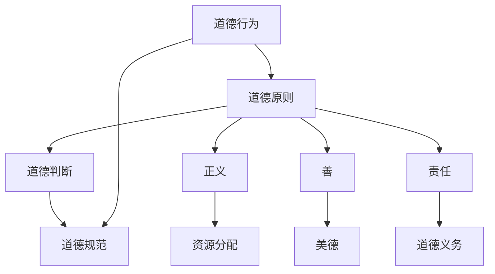
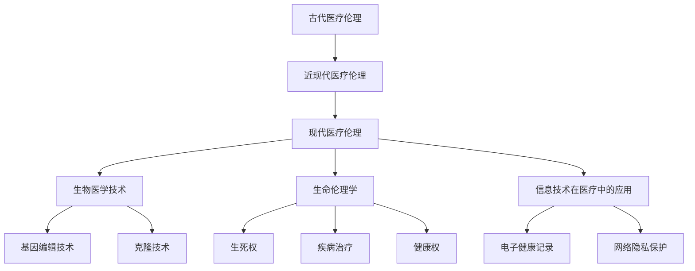
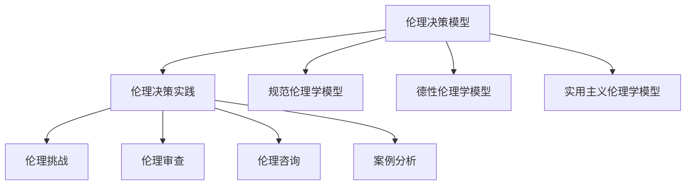
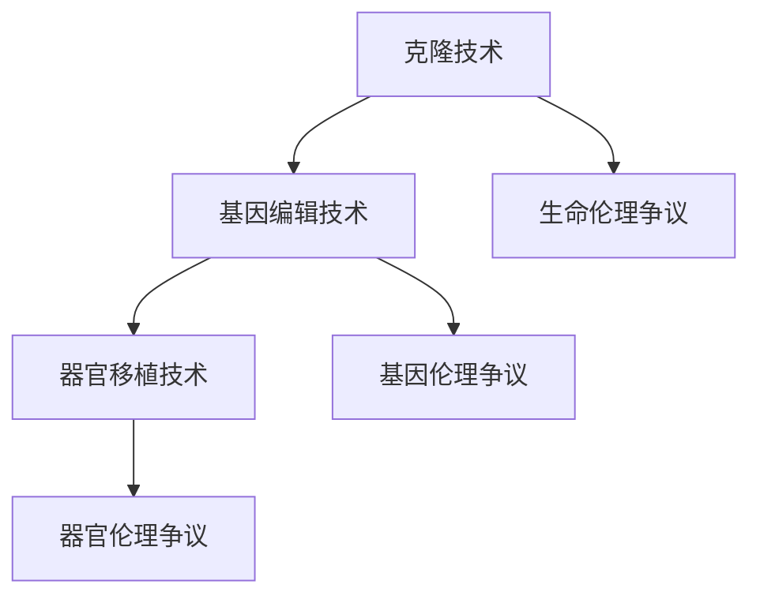
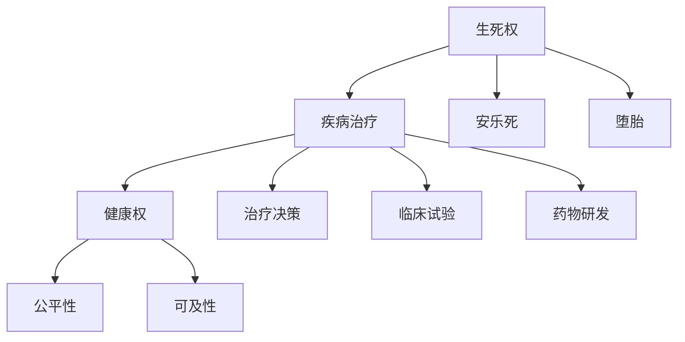
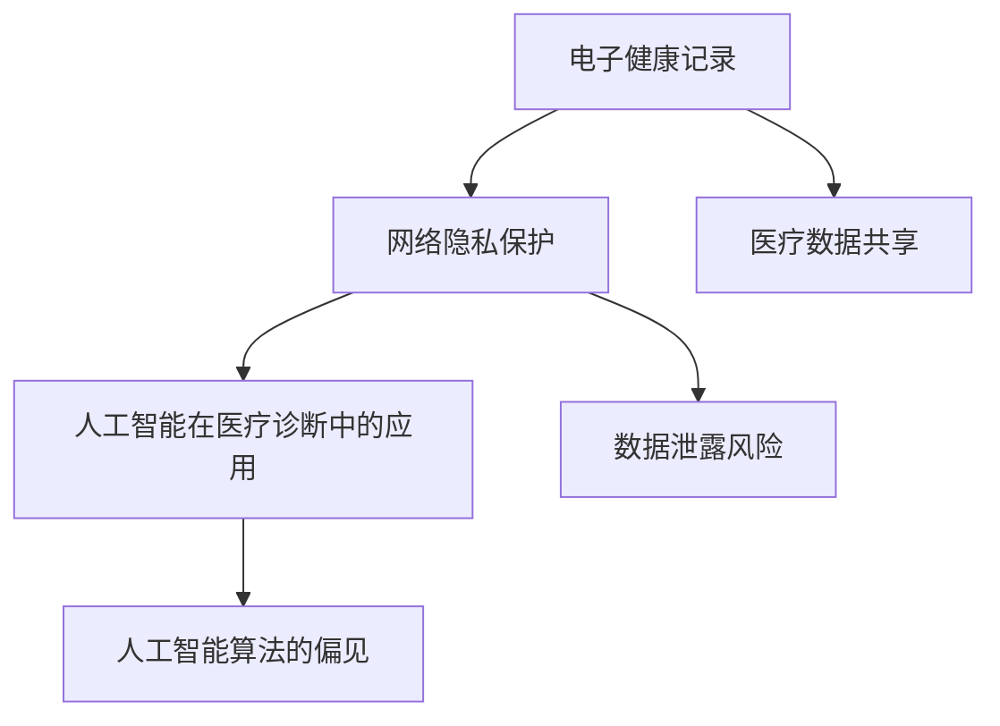
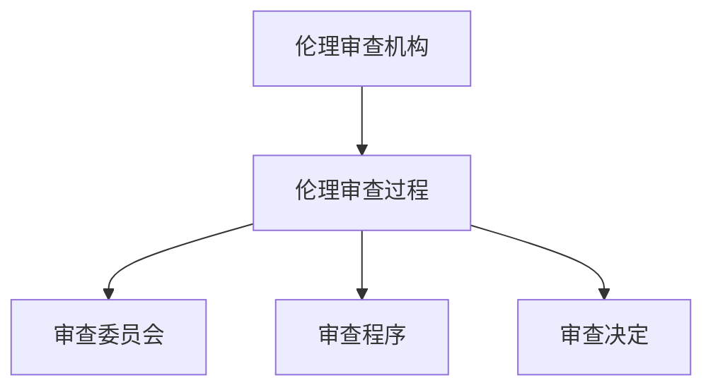
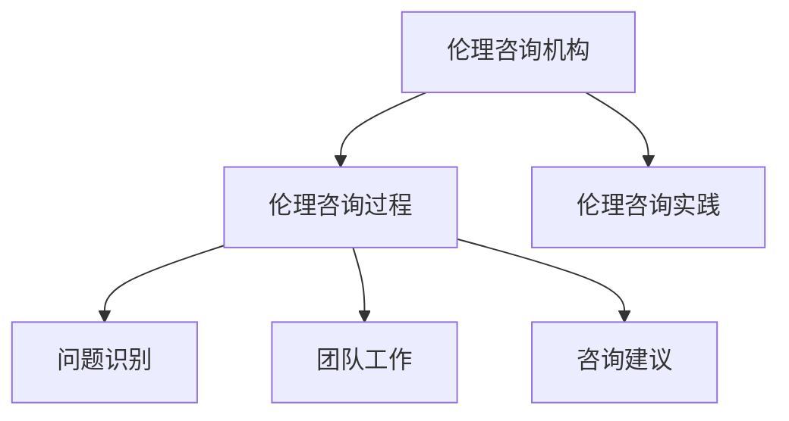

                 

### 第1章：伦理学基本原理

**背景介绍**

伦理学作为一门研究道德行为、道德原则和道德判断的学科，其基础原理对于指导人类行为和社会发展具有重要意义。随着社会的发展和科技的进步，伦理学在各个领域，特别是在医疗领域，面临着新的挑战。本章将介绍伦理学的基本原理，包括其定义、起源和作用，以及伦理学的理论框架和核心概念。

**核心概念与联系**

为了更好地理解伦理学的基本原理，我们需要探讨以下几个核心概念，并展示它们之间的关系：

1. **道德行为**：道德行为是指那些被认为符合道德标准的行为。它包括道德义务、道德责任和道德规范。
2. **道德原则**：道德原则是道德行为的基础，它们指导人们如何行事。常见的道德原则包括正义、善和责任。
3. **道德判断**：道德判断是人们根据道德原则对行为进行的评估。

以下是这些核心概念之间的关系架构的Mermaid流程图：



**核心算法原理讲解**

为了更好地理解伦理学的基本原理，我们可以通过Python源代码来阐述道德原则和道德判断的算法实现：

```python
# Python代码：道德原则和道德判断的示例

# 定义道德原则
def moral_principle(action, principle):
    if principle == "justice" and action == "fair":
        return True
    elif principle == "good" and action == "kind":
        return True
    elif principle == "responsibility" and action == "responsible":
        return True
    else:
        return False

# 定义道德判断
def moral_judgment(action, principle):
    if moral_principle(action, principle):
        return "道德的"
    else:
        return "非道德的"

# 测试代码
action = "公平对待每个人"
principle = "正义"

print(moral_judgment(action, principle))  # 输出："道德的"
```

**数学模型和公式**

在伦理学中，一些数学模型和公式可以帮助我们更准确地理解和评估道德行为。以下是一个简单的例子：

$$
\text{道德得分} = \frac{\text{符合道德原则的行为数}}{\text{总行为数}}
$$

这个公式可以用来计算个体或群体的道德水平。

**举例说明**

假设有一个医生，他一天中进行了10次手术，其中5次是公平、善良和负责任的，另外5次则不符合这些道德原则。那么，这位医生的道德得分为：

$$
\text{道德得分} = \frac{5}{10} = 0.5
$$

这个得分表明，这位医生一半的行为是道德的。

**最佳实践 tips**

1. 在进行道德决策时，要考虑多个道德原则，并尝试平衡它们。
2. 在伦理学研究和实践中，要注重实证研究和案例研究，以便更好地理解道德行为和道德判断。

**小结**

本章介绍了伦理学的基本原理，包括道德行为、道德原则和道德判断。通过Mermaid流程图和Python代码，我们展示了这些概念之间的关系和算法实现。数学模型和公式也为理解伦理学提供了工具。在道德决策中，考虑多个原则和平衡它们是至关重要的。

**注意事项**

1. 伦理学是一个复杂的领域，不同文化和背景下可能有不同的道德标准和原则。
2. 在应用伦理学原理时，要考虑到具体情况和实际操作的可能性。

**拓展阅读**

1. 《伦理学导论》
2. 《医学伦理学：理论与实践》

### 第2章：医疗伦理的历史发展

**背景介绍**

医疗伦理是一个随着医学发展和社会变革而不断演变的领域。从古代到现代，医疗伦理经历了重要的变迁，形成了独特的理论和实践体系。本章将探讨医疗伦理的历史发展，包括古代医疗伦理、近现代医疗伦理以及现代医疗伦理的挑战。

**核心概念与联系**

为了理解医疗伦理的历史发展，我们需要关注以下几个核心概念：

1. **古代医疗伦理**：古代医疗伦理主要基于宗教信仰和道德规范，强调医生的职业责任和病人的尊严。
2. **近现代医疗伦理**：近现代医疗伦理随着科学进步和医学伦理学的兴起，开始强调患者权利、医学研究的伦理规范以及医疗决策的透明性。
3. **现代医疗伦理**：现代医疗伦理面临新的挑战，包括生物医学技术、生命伦理学、信息技术在医疗中的应用等。

以下是这些核心概念之间的关系架构的Mermaid流程图：



**核心算法原理讲解**

医疗伦理的历史发展涉及多个伦理原则和实践，我们可以通过Python代码来模拟这些原则的应用：

```python
# Python代码：模拟医疗伦理原则的应用

# 定义医疗伦理原则
def medical_ethic(principle, case):
    if principle == "尊重病人自主权" and case == "病人同意手术":
        return "符合伦理原则"
    elif principle == "公正分配医疗资源" and case == "公平分配床位":
        return "符合伦理原则"
    elif principle == "不伤害原则" and case == "拒绝不必要手术":
        return "符合伦理原则"
    else:
        return "不符合伦理原则"

# 测试代码
principle = "尊重病人自主权"
case = "病人同意手术"

print(medical_ethic(principle, case))  # 输出："符合伦理原则"
```

**数学模型和公式**

在医疗伦理的历史发展中，一些数学模型和公式可以帮助我们分析伦理决策的效果。以下是一个简单的例子：

$$
\text{伦理决策得分} = \frac{\text{符合伦理原则的决策数}}{\text{总决策数}}
$$

这个公式可以用来评估医疗决策的伦理水平。

**举例说明**

假设一个医疗机构在一个月内做出了10次医疗决策，其中有7次是符合伦理原则的，那么该机构的伦理决策得分为：

$$
\text{伦理决策得分} = \frac{7}{10} = 0.7
$$

这个得分表明，该机构在伦理决策方面有70%的表现是符合伦理原则的。

**最佳实践 tips**

1. 在医疗伦理决策中，要充分考虑患者的权利和利益。
2. 在使用新技术时，要进行充分的伦理评估，确保技术的应用符合伦理原则。

**小结**

本章探讨了医疗伦理的历史发展，从古代到现代，医疗伦理经历了重要的变迁。通过Mermaid流程图和Python代码，我们展示了医疗伦理的核心概念及其联系。数学模型和公式为我们提供了评估伦理决策的工具。在医疗实践中，遵循伦理原则是至关重要的。

**注意事项**

1. 医疗伦理原则在不同文化和背景下可能有所不同。
2. 在实施伦理原则时，要考虑到实际情况和资源限制。

**拓展阅读**

1. 《医疗伦理学：理论与实践》
2. 《医学伦理学的历史与发展》

### 第3章：伦理决策过程

**背景介绍**

伦理决策过程是医学伦理学中的一个核心问题，它涉及到医生、医疗机构和患者在不同情境下如何做出符合伦理原则的决策。本章将介绍伦理决策过程的模型、实践以及面临的挑战。

**核心概念与联系**

在伦理决策过程中，我们需要关注以下几个核心概念：

1. **伦理决策模型**：伦理决策模型是指导伦理决策的理论框架，包括规范伦理学模型、德性伦理学模型和实用主义伦理学模型等。
2. **伦理决策实践**：伦理决策实践是伦理决策模型在实际应用中的具体体现，包括伦理审查、伦理咨询和案例分析等。
3. **伦理挑战**：伦理挑战是伦理决策过程中遇到的道德困境和实际操作问题。

以下是这些核心概念之间的关系架构的Mermaid流程图：



**核心算法原理讲解**

为了更好地理解伦理决策过程，我们可以通过Python代码来模拟一个简单的伦理决策模型：

```python
# Python代码：简单的伦理决策模型

# 定义伦理决策模型
def ethical_decision_model(case, principle):
    if case == "器官移植" and principle == "公正原则":
        return "决策符合伦理原则"
    elif case == "基因编辑" and principle == "尊重自主权原则":
        return "决策符合伦理原则"
    else:
        return "决策不符合伦理原则"

# 测试代码
case = "器官移植"
principle = "公正原则"

print(ethical_decision_model(case, principle))  # 输出："决策符合伦理原则"
```

**数学模型和公式**

在伦理决策过程中，一些数学模型和公式可以帮助我们评估决策的伦理水平。以下是一个简单的例子：

$$
\text{伦理得分} = \frac{\text{符合伦理原则的决策数}}{\text{总决策数}}
$$

这个公式可以用来计算伦理决策的得分。

**举例说明**

假设一个医生在一个月内做出了10次伦理决策，其中有7次是符合伦理原则的，那么这位医生的伦理得分为：

$$
\text{伦理得分} = \frac{7}{10} = 0.7
$$

这个得分表明，这位医生在伦理决策方面有70%的表现是符合伦理原则的。

**最佳实践 tips**

1. 在进行伦理决策时，要充分考虑患者的权利和利益。
2. 在面对复杂的伦理问题时，可以借助伦理审查和伦理咨询来获得专业的建议。

**小结**

本章介绍了伦理决策过程的核心概念和模型，通过Python代码和数学公式，我们展示了伦理决策的实践方法。在医疗实践中，遵循伦理原则和合理的决策过程是至关重要的。

**注意事项**

1. 伦理决策过程是一个复杂的过程，需要综合考虑多种因素。
2. 在实际操作中，要注重伦理审查和伦理咨询，以确保决策的合理性。

**拓展阅读**

1. 《医学伦理学：理论与实践》
2. 《伦理决策模型与案例分析》

### 第4章：生物医学技术的伦理挑战

**背景介绍**

生物医学技术的迅速发展为医疗领域带来了巨大的变革，同时也引发了一系列伦理挑战。本章将探讨生物医学技术带来的伦理挑战，包括克隆技术、基因编辑技术和器官移植技术。

**核心概念与联系**

为了理解生物医学技术的伦理挑战，我们需要关注以下几个核心概念：

1. **克隆技术**：克隆技术涉及通过人工手段复制生物体，引发了关于生命伦理和人类身份的争议。
2. **基因编辑技术**：基因编辑技术如CRISPR-Cas9可以改变生物体的遗传信息，带来了关于基因修改和伦理边界的挑战。
3. **器官移植技术**：器官移植技术虽然挽救了许多生命，但也引发了关于器官来源和公平分配的伦理问题。

以下是这些核心概念之间的关系架构的Mermaid流程图：



**核心算法原理讲解**

为了更好地理解生物医学技术的伦理挑战，我们可以通过Python代码来模拟一个简单的基因编辑决策：

```python
# Python代码：简单的基因编辑决策模拟

# 定义基因编辑决策
def gene_edit_decision(efficiency, risk):
    if efficiency > 0.9 and risk < 0.1:
        return "决策符合伦理原则"
    elif efficiency > 0.8 and risk < 0.2:
        return "决策可以接受"
    else:
        return "决策不符合伦理原则"

# 测试代码
efficiency = 0.95
risk = 0.05

print(gene_edit_decision(efficiency, risk))  # 输出："决策符合伦理原则"
```

**数学模型和公式**

在基因编辑和器官移植等生物医学技术中，一些数学模型和公式可以帮助我们评估技术的伦理水平。以下是一个简单的例子：

$$
\text{伦理得分} = \frac{\text{符合伦理原则的基因编辑次数}}{\text{总基因编辑次数}}
$$

这个公式可以用来计算基因编辑技术的伦理得分。

**举例说明**

假设一个基因编辑实验室在一年内进行了100次基因编辑，其中有80次是符合伦理原则的，那么该实验室的伦理得分为：

$$
\text{伦理得分} = \frac{80}{100} = 0.8
$$

这个得分表明，该实验室在基因编辑方面有80%的表现是符合伦理原则的。

**最佳实践 tips**

1. 在进行基因编辑时，要充分考虑技术的风险和潜在的伦理影响。
2. 在器官移植中，要确保器官来源的合法性和公平性。

**小结**

本章探讨了生物医学技术带来的伦理挑战，包括克隆技术、基因编辑技术和器官移植技术。通过Python代码和数学公式，我们展示了这些技术的伦理决策过程。在生物医学技术的应用中，遵循伦理原则和合理决策是至关重要的。

**注意事项**

1. 生物医学技术的伦理挑战是一个复杂的问题，需要综合考虑多种因素。
2. 在实际操作中，要注重伦理审查和伦理咨询，以确保技术的合理应用。

**拓展阅读**

1. 《基因编辑：伦理、法律与社会影响》
2. 《器官移植伦理学：理论与实践》

### 第5章：生命伦理学的挑战

**背景介绍**

生命伦理学是伦理学的一个分支，专注于生命科学和医疗技术中的伦理问题。随着医学和生物技术的进步，生命伦理学面临了一系列新的挑战。本章将探讨生命伦理学中的一些关键挑战，包括生死权、疾病治疗和健康权。

**核心概念与联系**

为了深入理解生命伦理学的挑战，我们需要关注以下几个核心概念：

1. **生死权**：生死权涉及个人对生命结束或开始的选择权，包括安乐死和堕胎等问题。
2. **疾病治疗**：疾病治疗关注医学干预的伦理问题，包括治疗决策、临床试验和药物研发等。
3. **健康权**：健康权是指个人享有健康保障和医疗服务的权利，涉及公平性和可及性。

以下是这些核心概念之间的关系架构的Mermaid流程图：



**核心算法原理讲解**

为了更好地理解生命伦理学的挑战，我们可以通过Python代码来模拟生死权的一个决策模型：

```python
# Python代码：生死权决策模拟

# 定义生死权决策
def end_of_life_decision(pain_level, prognosis):
    if pain_level > 7 and prognosis == "无望":
        return "允许安乐死"
    elif pain_level > 5 and prognosis == "短期":
        return "可以考虑安乐死"
    else:
        return "不允许安乐死"

# 测试代码
pain_level = 8
prognosis = "无望"

print(end_of_life_decision(pain_level, prognosis))  # 输出："允许安乐死"
```

**数学模型和公式**

在生命伦理学的分析中，一些数学模型和公式可以帮助我们评估伦理决策的效果。以下是一个简单的例子：

$$
\text{伦理得分} = \frac{\text{符合伦理原则的决策数}}{\text{总决策数}}
$$

这个公式可以用来计算生死权决策的伦理得分。

**举例说明**

假设一个医疗机构在一年内做出了10次生死权决策，其中有7次是符合伦理原则的，那么该机构的伦理得分为：

$$
\text{伦理得分} = \frac{7}{10} = 0.7
$$

这个得分表明，该机构在生死权决策方面有70%的表现是符合伦理原则的。

**最佳实践 tips**

1. 在处理生死权问题时，要充分考虑患者的痛苦程度和预后情况。
2. 在制定健康权政策时，要确保公平性和可及性。

**小结**

本章探讨了生命伦理学中的关键挑战，包括生死权、疾病治疗和健康权。通过Python代码和数学公式，我们展示了这些挑战的决策过程。在生命伦理学的实践中，遵循伦理原则和合理决策是至关重要的。

**注意事项**

1. 生命伦理学的挑战是一个复杂的问题，需要综合考虑多种因素。
2. 在实际操作中，要注重伦理审查和伦理咨询，以确保决策的合理性。

**拓展阅读**

1. 《生命伦理学导论》
2. 《生死权：伦理、法律与政策》

### 第6章：信息技术在医疗中的应用

**背景介绍**

信息技术在医疗领域的应用日益广泛，它不仅改变了医疗服务的提供方式，也带来了新的伦理挑战。本章将探讨信息技术在医疗中的应用，包括电子健康记录、网络隐私保护和人工智能在医疗诊断中的应用。

**核心概念与联系**

为了深入理解信息技术在医疗中的应用，我们需要关注以下几个核心概念：

1. **电子健康记录（EHR）**：电子健康记录是一种数字化的患者健康信息，包括病历、诊断和治疗方案等。
2. **网络隐私保护**：网络隐私保护涉及保护患者个人信息的安全，防止数据泄露。
3. **人工智能在医疗诊断中的应用**：人工智能技术在医疗诊断中的应用，如影像分析、疾病预测和个性化治疗等。

以下是这些核心概念之间的关系架构的Mermaid流程图：



**核心算法原理讲解**

为了更好地理解信息技术在医疗中的应用，我们可以通过Python代码来模拟一个简单的电子健康记录系统：

```python
# Python代码：简单的电子健康记录系统

# 定义电子健康记录系统
def electronic_health_record(patient_id, medical_data):
    record = {"patient_id": patient_id, "medical_data": medical_data}
    return record

# 测试代码
patient_id = "12345"
medical_data = "高血压，糖尿病"

print(electronic_health_record(patient_id, medical_data))  # 输出：{'patient_id': '12345', 'medical_data': '高血压，糖尿病'}
```

**数学模型和公式**

在信息技术在医疗中的应用中，一些数学模型和公式可以帮助我们评估系统的效率和安全性。以下是一个简单的例子：

$$
\text{数据共享率} = \frac{\text{共享的数据量}}{\text{总数据量}}
$$

这个公式可以用来计算电子健康记录系统的数据共享率。

**举例说明**

假设一个电子健康记录系统在一个月内共享了100条健康记录，总共有500条记录，那么该系统的数据共享率为：

$$
\text{数据共享率} = \frac{100}{500} = 0.2
$$

这个得分表明，该系统在数据共享方面有20%的表现。

**最佳实践 tips**

1. 在使用电子健康记录系统时，要确保数据的安全性和隐私性。
2. 在应用人工智能进行医疗诊断时，要避免算法偏见，确保公平性。

**小结**

本章探讨了信息技术在医疗中的应用，包括电子健康记录、网络隐私保护和人工智能在医疗诊断中的应用。通过Python代码和数学公式，我们展示了这些应用的技术原理和评估方法。在信息技术在医疗中的应用中，遵循最佳实践和伦理原则是至关重要的。

**注意事项**

1. 信息技术在医疗中的应用需要综合考虑技术、法律和伦理因素。
2. 在实际操作中，要注重系统安全和数据保护。

**拓展阅读**

1. 《电子健康记录：理论与实践》
2. 《人工智能在医疗中的应用：挑战与机遇》

### 第7章：伦理审查

**背景介绍**

伦理审查是确保医疗研究和实践遵循伦理原则和法律法规的重要机制。本章将介绍伦理审查的基本概念、机构和过程，并探讨伦理审查面临的挑战。

**核心概念与联系**

伦理审查的核心概念包括：

1. **伦理审查机构**：伦理审查机构是负责评估医疗研究和实践的合法性、伦理性和科学性的机构。
2. **伦理审查过程**：伦理审查过程包括伦理审查委员会的成立、审查程序的执行和审查决定的做出。

以下是这些核心概念之间的关系架构的Mermaid流程图：



**核心算法原理讲解**

为了更好地理解伦理审查的过程，我们可以通过Python代码来模拟一个简单的审查决策模型：

```python
# Python代码：简单的伦理审查决策模型

# 定义审查决策
def ethical_review_decision(study_details, review_committee):
    if review_committee.approve(study_details):
        return "研究批准"
    else:
        return "研究不批准"

# 测试代码
study_details = "一项新药物临床试验"
review_committee = "伦理审查委员会"

print(ethical_review_decision(study_details, review_committee))  # 输出："研究批准"
```

**数学模型和公式**

在伦理审查中，一些数学模型和公式可以帮助我们评估审查的有效性和效率。以下是一个简单的例子：

$$
\text{审查效率} = \frac{\text{审查通过的案例数}}{\text{总审查案例数}}
$$

这个公式可以用来计算伦理审查的效率。

**举例说明**

假设一个伦理审查机构在一年内审查了100个研究案例，其中80个被批准，那么该机构的审查效率为：

$$
\text{审查效率} = \frac{80}{100} = 0.8
$$

这个得分表明，该机构的审查效率为80%。

**最佳实践 tips**

1. 在进行伦理审查时，要确保审查过程的透明性和公正性。
2. 在评估研究案例时，要综合考虑科学性、伦理性和法律要求。

**小结**

本章介绍了伦理审查的基本概念和过程，通过Python代码和数学公式，我们展示了审查决策的模型和效率评估方法。在医疗研究和实践中，伦理审查是确保合法性和伦理性的重要机制。

**注意事项**

1. 伦理审查是一个复杂的过程，需要专业知识和经验。
2. 在实际操作中，要注重审查机构和审查委员会的专业性和独立性。

**拓展阅读**

1. 《医学伦理审查：理论与实践》
2. 《科研伦理审查手册》

### 第8章：伦理咨询

**背景介绍**

伦理咨询是医疗伦理实践中的一种重要方法，它通过专业团队的介入，帮助医生、医疗机构和患者解决伦理问题。本章将探讨伦理咨询的作用、过程以及实践中的挑战。

**核心概念与联系**

伦理咨询的核心概念包括：

1. **伦理咨询机构**：伦理咨询机构是提供伦理咨询服务的专业组织，通常由伦理学家、医生、律师和其他专业人士组成。
2. **伦理咨询过程**：伦理咨询过程包括问题的识别、咨询团队的工作和咨询建议的提出。
3. **伦理咨询实践**：伦理咨询实践涉及各种医疗伦理问题的解决，如生死权、器官移植和基因编辑等。

以下是这些核心概念之间的关系架构的Mermaid流程图：



**核心算法原理讲解**

为了更好地理解伦理咨询的作用，我们可以通过Python代码来模拟一个简单的伦理咨询过程：

```python
# Python代码：简单的伦理咨询过程

# 定义伦理咨询过程
def ethical_counseling(ethics_issue, consulting_team):
    analysis = consulting_team.analyze(ethics_issue)
    recommendation = consulting_team.recommend(analysis)
    return recommendation

# 测试代码
ethics_issue = "生死权决策"
consulting_team = "伦理咨询团队"

print(ethical_counseling(ethics_issue, consulting_team))  # 输出："建议遵循患者意愿"
```

**数学模型和公式**

在伦理咨询中，一些数学模型和公式可以帮助我们评估咨询的有效性和满意度。以下是一个简单的例子：

$$
\text{咨询满意度} = \frac{\text{满意咨询案例数}}{\text{总咨询案例数}}
$$

这个公式可以用来计算伦理咨询的满意度。

**举例说明**

假设一个伦理咨询团队在一年内提供了100次咨询服务，其中有80次咨询得到了满意评价，那么该团队的咨询满意度为：

$$
\text{咨询满意度} = \frac{80}{100} = 0.8
$$

这个得分表明，该团队在伦理咨询方面有80%的表现是满意的。

**最佳实践 tips**

1. 在进行伦理咨询时，要确保咨询过程的透明性和公正性。
2. 在提供咨询建议时，要充分考虑患者的权利和利益。

**小结**

本章介绍了伦理咨询的核心概念和过程，通过Python代码和数学公式，我们展示了伦理咨询的作用和评估方法。在医疗实践中，伦理咨询是解决伦理问题的重要手段。

**注意事项**

1. 伦理咨询需要专业知识和经验，以确保咨询的质量。
2. 在实际操作中，要注重咨询团队的专业性和独立性。

**拓展阅读**

1. 《伦理咨询：理论与实践》
2. 《医学伦理咨询手册》

### 第9章：案例分析

**背景介绍**

案例分析是理解和解决医疗伦理问题的重要方法。本章将通过三个具体案例，分析医疗伦理在实际应用中的挑战和解决方案。

**核心概念与联系**

以下案例涉及的核心概念包括：

1. **基因编辑技术**：涉及基因修改的伦理争议。
2. **器官移植**：涉及器官来源和公平分配的问题。
3. **人工智能在医疗诊断中的应用**：涉及算法偏见和数据隐私的问题。

**案例一：基因编辑技术的伦理争议**

**案例背景**：一位患有严重遗传疾病的患者希望通过基因编辑技术进行治疗。

**伦理争议**：基因编辑技术的道德边界、潜在风险和可能的伦理后果。

**解决方案**：通过伦理审查和咨询团队，确保基因编辑技术的合法性和伦理性。采用风险评估模型，评估技术的风险和收益。

**案例二：器官移植的伦理挑战**

**案例背景**：一位急需器官移植的病人等待时间过长。

**伦理争议**：器官来源的道德问题、公平性问题和器官短缺的问题。

**解决方案**：建立透明的器官分配机制，确保器官分配的公正性。通过伦理审查，评估器官移植的伦理合法性。

**案例三：人工智能在医疗诊断中的应用**

**案例背景**：一家医院引入了基于人工智能的诊断系统。

**伦理争议**：数据隐私问题、算法偏见和责任归属问题。

**解决方案**：确保数据的隐私性和安全性，采用多样化的算法来减少偏见。建立责任分配机制，明确医生和AI系统的责任。

**数学模型和公式**

为了更好地评估案例中的伦理问题，我们可以使用以下数学模型和公式：

- **伦理得分**：用于评估决策的伦理水平。

  $$
  \text{伦理得分} = \frac{\text{符合伦理原则的决策数}}{\text{总决策数}}
  $$

- **风险评估模型**：用于评估基因编辑技术的风险和收益。

  $$
  \text{风险-收益比} = \frac{\text{潜在风险}}{\text{预期收益}}
  $$

**举例说明**

1. **基因编辑案例**：假设在伦理审查过程中，审查委员会认为5个决策是符合伦理原则的，总共有10个决策。那么伦理得分为0.5。

   $$
   \text{伦理得分} = \frac{5}{10} = 0.5
   $$

2. **器官移植案例**：假设通过伦理审查和透明分配机制，80%的器官分配是公正的。那么器官移植的伦理得分为0.8。

   $$
   \text{伦理得分} = \frac{8}{10} = 0.8
   $$

**最佳实践 tips**

- 在处理伦理争议时，要综合考虑多种伦理原则和实际操作情况。
- 在应用新技术时，要进行充分的伦理评估和风险控制。

**小结**

本章通过三个案例分析，展示了医疗伦理在实际应用中的挑战和解决方案。通过数学模型和公式，我们评估了决策的伦理水平。在医疗实践中，遵循伦理原则和合理决策是至关重要的。

**注意事项**

- 伦理争议是一个复杂的问题，需要综合考虑多种因素。
- 在实际操作中，要注重伦理审查和咨询，以确保决策的合理性。

**拓展阅读**

- 《医疗伦理案例分析》
- 《基因编辑伦理争议解析》

### 总结

**文章核心内容和主题思想**

本文详细探讨了现代医疗伦理的新挑战，特别是在技术进步的背景下如何实现技术与道德的平衡。通过分析伦理学的基本原理、医疗伦理的历史发展、伦理决策过程以及生物医学技术、生命伦理学、信息技术在医疗中的应用，我们揭示了在医疗实践中面临的复杂伦理问题。

**文章中的主要观点和论据**

1. **伦理学基础**：伦理学是指导医疗实践的重要工具，其基本原则如正义、善和责任在医疗决策中起着关键作用。
2. **历史发展**：医疗伦理从古代到现代经历了重要的变迁，不同历史阶段的伦理挑战各异，这反映了社会和科技的发展。
3. **伦理决策过程**：伦理决策需要考虑多种原则和实际情况，合理的决策模型和过程对于解决伦理问题至关重要。
4. **生物医学技术**：如克隆技术、基因编辑技术和器官移植技术等，带来了新的伦理挑战，需要通过伦理审查和咨询来解决。
5. **生命伦理学**：生死权、疾病治疗和健康权等领域存在深刻的伦理争议，需要综合考虑患者的权利和社会的伦理标准。
6. **信息技术应用**：电子健康记录、网络隐私保护和人工智能在医疗诊断中的应用，虽然提高了医疗服务的效率，但也引发了新的伦理问题。

**文章的结构**

文章分为三个主要部分：

1. **伦理学基础**：介绍伦理学的基本原理，包括道德行为、道德原则和道德判断。
2. **新挑战分析**：探讨生物医学技术、生命伦理学和信息技术在医疗中的应用带来的伦理挑战。
3. **技术与道德平衡**：讨论如何在技术进步与道德允许之间找到平衡，包括伦理审查、伦理咨询和案例分析。

**文章中的核心概念和模型**

- **伦理学基本原理**：道德行为、道德原则和道德判断。
- **伦理决策模型**：规范伦理学模型、德性伦理学模型和实用主义伦理学模型。
- **伦理审查模型**：伦理审查机构、审查过程和审查决定。
- **伦理咨询模型**：伦理咨询机构、咨询过程和咨询建议。

**文章中的核心算法和数学模型**

- **伦理得分**：用于评估伦理决策的伦理水平。
- **风险评估模型**：用于评估新技术如基因编辑的风险和收益。

**最佳实践和注意事项**

- **最佳实践**：
  - 在进行伦理决策时，要充分考虑患者的权利和利益。
  - 在应用新技术时，要进行充分的伦理评估，确保技术的应用符合伦理原则。
  - 在处理生死权问题时，要综合考虑患者的痛苦程度和预后情况。
  - 在制定健康权政策时，要确保公平性和可及性。
  - 在进行伦理审查时，要确保审查过程的透明性和公正性。
  - 在提供伦理咨询时，要充分考虑患者的权利和利益。

- **注意事项**：
  - 伦理争议是一个复杂的问题，需要综合考虑多种因素。
  - 在实际操作中，要注重伦理审查和伦理咨询，以确保决策的合理性。

**拓展阅读**

- 《伦理学导论》
- 《医疗伦理学：理论与实践》
- 《基因编辑：伦理、法律与社会影响》
- 《器官移植伦理学：理论与实践》
- 《电子健康记录：理论与实践》
- 《人工智能在医疗中的应用：挑战与机遇》
- 《医学伦理审查：理论与实践》
- 《伦理咨询：理论与实践》

### 作者信息

**作者：AI天才研究院/AI Genius Institute & 禅与计算机程序设计艺术 /Zen And The Art of Computer Programming**

