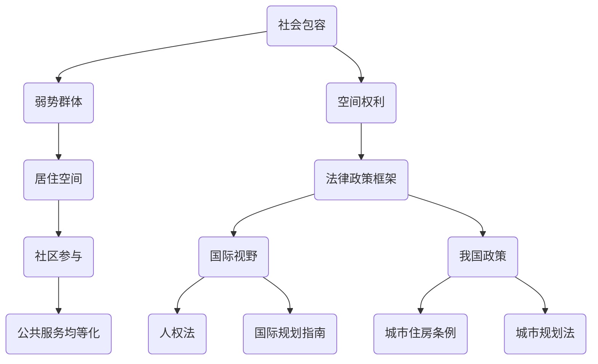

                 

## 现代城市规划中的社会包容：弱势群体的空间权利

> 关键词：现代城市规划、社会包容、弱势群体、空间权利、城市规划挑战

> 摘要：本文深入探讨了现代城市规划中的社会包容问题，特别是关注弱势群体的空间权利。通过分析社会包容的理论基础、弱势群体的居住空间现状及其规划与设计，以及空间权利的法律与政策框架，文章揭示了现代城市规划中面临的挑战和未来发展趋势。同时，通过实际案例分析和未来展望，为促进城市规划中的社会包容性提供了有益的启示和策略。

### 第1章 绪论

#### 1.1 现代城市规划背景

##### 1.1.1 城市规划的发展历程

城市规划作为一门综合性学科，起源于19世纪的英国。早期的城市规划主要集中在解决城市卫生、交通和住宅问题。随着工业化进程的加快，城市规划逐步发展成为一门独立的学科。20世纪以来，城市规划的理论和实践不断丰富，从注重经济和物质空间的规划转向更加关注社会、文化和环境等多方面因素。

##### 1.1.2 当代城市规划的主要挑战

当代城市规划面临着诸多挑战，其中包括城市化进程加快、人口老龄化、气候变化、资源短缺等。城市化进程带来的城市扩张和人口密度增加，对城市规划提出了更高的要求。此外，城市规划还需应对社会经济变革、文化多样性等带来的挑战。

#### 1.2 社会包容的概念

##### 1.2.1 社会包容的定义

社会包容是指社会政策、实践和制度能够确保所有人，无论其社会经济地位、种族、性别、年龄、健康状况等差异，都能平等地享受社会资源和机会。它涉及到公平、正义、多元化和参与等核心价值观。

##### 1.2.2 社会包容的重要性

社会包容对于实现可持续发展和社会和谐至关重要。它不仅能够提升弱势群体的生活质量，促进社会公平，还能增强城市的社会凝聚力和竞争力。

#### 1.3 弱势群体的空间权利

##### 1.3.1 弱势群体的界定

弱势群体是指在社会中处于不利地位、缺乏资源、遭受歧视和排斥的人群，如贫困人群、残疾人、少数民族、老年人等。

##### 1.3.2 空间权利的概念

空间权利是指个人或群体在使用、占用和管理空间方面的权利，包括居住权、出行权、教育资源权等。空间权利的保障是实现社会包容的重要方面。

### 第2章 社会包容的理论基础

#### 2.1 社会正义理论

##### 2.1.1 罗尔斯的正义论

罗尔斯的正义论主张，社会制度和政策应当优先考虑弱势群体的利益，以确保社会公平。罗尔斯提出了著名的“差异原则”，即社会和经济利益应尽可能地在所有人之间平等分配，除非这种不平等有助于提高弱势群体的福利。

##### 2.1.2 纳尔逊·曼德拉的社会正义理念

纳尔逊·曼德拉强调，社会正义是实现人类尊严和社会进步的基础。他认为，社会包容应通过消除歧视、促进多元化和实现平等机会来实现。

#### 2.2 社会学视角下的社会包容

##### 2.2.1 社会排斥与包容的关系

社会排斥是指社会政策、制度和实践对某些群体的不利影响，导致这些群体在社会生活中处于边缘地位。社会排斥与包容是相对的，排斥的存在加剧了社会不平等，而包容则是解决这一问题的途径。

##### 2.2.2 社会包容的理论框架

社会包容的理论框架主要包括以下几个方面：公平与正义、多元与多样性、参与与赋权、可持续性与环境。

### 第3章 弱势群体的居住空间

#### 3.1 弱势群体的居住环境现状

##### 3.1.1 城市贫困社区的空间特征

城市贫困社区通常具有以下空间特征：居住条件差、基础设施不完善、环境恶劣、交通不便等。这些特征严重影响了弱势群体的生活质量。

##### 3.1.2 弱势群体的住房问题

弱势群体的住房问题主要包括住房短缺、住房条件差、住房成本高等。这些问题使得弱势群体难以在城市中获得稳定的居住空间。

#### 3.2 弱势群体居住空间的规划与设计

##### 3.2.1 可持续社区规划

可持续社区规划旨在通过合理规划和使用土地资源，提高社区的环境、经济和社会效益。可持续社区规划应考虑弱势群体的需求，确保其享有良好的居住环境。

##### 3.2.2 弱势群体友好设计

弱势群体友好设计是指在城市规划和建筑设计过程中，充分考虑弱势群体的需求和特点，确保他们能够方便地使用公共设施和服务。

### 第4章 空间权利的法律与政策框架

#### 4.1 国际视野下的空间权利

##### 4.1.1 国际人权法对空间权利的保障

国际人权法规定了个人和群体的空间权利，包括居住权、出行权、教育权等。这些权利为弱势群体提供了法律保障。

##### 4.1.2 国际城市规划指南

国际城市规划指南为城市规划提供了基本原则和指导方针，强调了社会包容性和可持续性的重要性。

#### 4.2 我国空间权利的法律与政策

##### 4.2.1 《城市住房条例》

《城市住房条例》是我国关于住房问题的重要法规，规定了城市住房的基本原则和政策措施，保障了弱势群体的住房权利。

##### 4.2.2 《城市规划法》

《城市规划法》是我国关于城市规划的基本法律，规定了城市规划的编制、审批、实施和监督等方面的内容，为城市规划提供了法律依据。

### 第5章 社会包容的实践探索

#### 5.1 社区参与与规划实践

##### 5.1.1 社区参与的内涵与形式

社区参与是指社区居民参与城市规划和管理的过程。社区参与的形式包括社区会议、咨询委员会、志愿者活动等。

##### 5.1.2 社区参与在弱势群体居住空间规划中的应用

社区参与在弱势群体居住空间规划中的应用，可以提升规划的科学性和可行性，更好地满足弱势群体的需求。

#### 5.2 公共设施与公共服务均等化

##### 5.2.1 公共设施配置的原则

公共设施配置应遵循公平、合理、可持续的原则，确保弱势群体能够方便地使用公共设施。

##### 5.2.2 公共服务的均等化策略

公共服务的均等化策略包括提高公共服务的覆盖率、降低服务成本、优化服务内容等。

### 第6章 案例分析

#### 6.1 案例一：城市更新项目中的社会包容实践

##### 6.1.1 项目背景

本项目旨在通过城市更新项目，改善城市贫困社区的生活条件，提升社会包容性。

##### 6.1.2 实施过程

项目实施过程包括需求调研、规划设计、实施建设、居民反馈等环节。

##### 6.1.3 成果与启示

项目成果显著，提高了社区的环境质量、居民的生活水平和社会凝聚力，为其他城市更新项目提供了有益的借鉴。

#### 6.2 案例二：城市贫困社区的空间权利保护

##### 6.2.1 社区现状分析

社区现状分析包括社区人口、住房条件、公共服务设施等方面的调查。

##### 6.2.2 空间权利保护措施

空间权利保护措施包括改善居住条件、提升公共服务设施、加强法律保障等。

##### 6.2.3 案例效果评估

案例效果评估从居民满意度、社会效益、经济成本等方面进行综合评估，为其他地区提供参考。

### 第7章 未来展望与挑战

#### 7.1 社会包容的未来发展趋势

##### 7.1.1 新技术对城市规划的影响

新技术，如大数据、人工智能等，为城市规划提供了新的手段和工具，有助于提升规划的科学性和包容性。

##### 7.1.2 社会包容与可持续发展

社会包容与可持续发展是现代城市规划的重要目标，两者相辅相成，共同推动城市的可持续发展。

#### 7.2 社会包容面临的挑战与对策

##### 7.2.1 政策执行力问题

政策执行力问题是社会包容面临的重大挑战，需要通过完善法律制度、加强监管等措施来加以解决。

##### 7.2.2 资源分配不均问题

资源分配不均导致社会包容性不足，需要通过政策调整、资源优化配置等措施来改善。

##### 7.2.3 社会参与度不足问题

社会参与度不足影响社会包容的实现，需要通过提高公众意识、加强社区参与等措施来提高社会参与度。

### 结束语

社会包容是现代城市规划的核心价值之一，弱势群体的空间权利是保障社会包容的重要方面。本文通过对社会包容的理论基础、弱势群体的居住空间、空间权利的法律与政策框架以及实际案例的分析，揭示了现代城市规划中的社会包容性挑战和未来发展趋势。希望本文能够为城市规划工作者提供有益的参考和启示，共同推动城市规划中的社会包容性发展。

### 附录

以下是本文中提到的核心概念和实体之间的Mermaid流程图：

### 作者信息

作者：AI天才研究院/AI Genius Institute & 禅与计算机程序设计艺术 /Zen And The Art of Computer Programming

### 参考文献

[1] 罗尔斯. 正义论[M]. 中国社会科学出版社, 2009.
[2] 曼德拉. 社会正义[M]. 上海人民出版社, 2014.
[3] 联合国人居署. 国际城市规划指南[M]. 中国建筑工业出版社, 2012.
[4] 中华人民共和国住房和城乡建设部. 城市住房条例[M]. 中国法制出版社, 2019.
[5] 中华人民共和国城市规划法[M]. 中国法制出版社, 2019.

