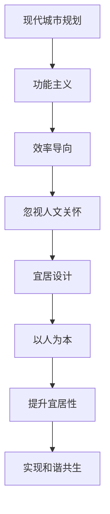

                 

### 第1章 绪论

#### 1.1 现代城市规划的背景和发展历程

现代城市规划起源于19世纪末20世纪初，当时工业化进程加速，城市化浪潮席卷全球，城市规模急剧扩张，城市问题逐渐凸显。早期的城市规划主要关注城市基础设施的布局和建设，如道路、供水、供电和排水系统等。这一时期，代表人物如霍华德（Eben S. Howard）提出的田园城市（Garden City）理念，以及格迪斯（Patrick Geddes）的综合规划思想，对现代城市规划产生了深远影响。

随着城市化的进一步发展，城市规划逐渐从单纯的工程技术问题转向综合考虑社会、经济、环境等多方面因素的系统工程。20世纪50年代，现代城市规划理论体系初步建立，以功能分区、交通规划、城市设计等为主要内容。这一时期，代表人物如美国规划学家克里斯托弗·亚历山大（Christopher Alexander）提出的模式语言（Pattern Language），以及雅各布斯（Jane Jacobs）的《美国大城市的死与生》（The Death and Life of Great American Cities），都对城市规划理论和方法产生了重要影响。

21世纪初，全球化和信息技术的发展进一步推动了城市规划的变革。智慧城市、可持续城市、韧性城市等新理念相继提出，城市规划的目标逐渐从单纯的物质空间建设转向更加注重人的需求和福祉。现代城市规划面临着如何应对人口增长、资源紧缺、环境恶化等挑战，需要更加注重生态可持续性和人文关怀。

#### 1.2 人文关怀在城市规划中的重要性

人文关怀是城市规划的核心价值观之一，它强调以人为本，关注人的需求、福祉和感受。在城市规划中，人文关怀的重要性体现在以下几个方面：

首先，人文关怀能够提升城市的宜居性。宜居性是衡量城市生活质量的重要指标，它不仅包括物质空间的质量，还涵盖社会、文化和环境等多方面因素。人文关怀通过关注人的需求和感受，优化城市空间布局和设计，提升居民的生活品质。

其次，人文关怀有助于增强城市的凝聚力。城市不仅是物理空间的集合，更是人们生活的共同体。通过人文关怀，城市规划能够促进社会交往、文化交流和社区参与，增强城市居民的归属感和认同感，提升城市的整体凝聚力。

此外，人文关怀也是实现城市可持续发展的重要保障。在城市化进程中，如何平衡经济增长、社会发展和环境保护之间的关系是一个重要课题。人文关怀通过关注人的需求和福祉，推动城市规划更加注重可持续发展，实现经济、社会和环境的协调发展。

#### 1.3 从功能主义到宜居设计的转变

功能主义城市规划强调以功能为导向，追求效率和实用性。在20世纪的城市规划中，功能主义思想占据主导地位，城市空间被划分为住宅区、商业区、工业区等功能区域，交通系统也按照功能需求进行设计。然而，随着城市化进程的深入，功能主义城市规划的局限性逐渐显现。

首先，功能主义城市规划过于强调效率，忽视了人的需求和感受。城市空间被机械地分割和设计，居民的生活质量受到影响。此外，功能主义城市规划可能导致城市环境的单一化和同质化，缺乏特色和活力。

其次，功能主义城市规划难以应对复杂多变的城市问题。城市是一个复杂的系统，涉及多个领域的交叉和互动。功能主义城市规划往往局限于单一功能，难以全面解决城市问题，如交通拥堵、环境污染和社会隔离等。

为了克服功能主义城市规划的局限性，宜居设计理念逐渐兴起。宜居设计强调以人为本，关注人的需求、福祉和感受，追求城市空间的多样性和适应性。宜居设计的核心目标是提升城市的宜居性，实现人与环境的和谐共生。

从功能主义到宜居设计的转变，不仅是对城市规划理论的发展，也是对城市规划实践的创新。这一转变要求城市规划师从单一的功能视角转向综合的、系统的视角，关注人的需求和感受，优化城市空间设计，提升城市生活质量。



## 第2章 功能主义城市规划

### 2.1 功能主义城市规划的概念与特点

功能主义城市规划是一种以功能为导向的城市规划方法，其核心思想是将城市空间划分为不同的功能区域，以实现城市的有序发展和高效运作。功能主义城市规划起源于20世纪初的工业化和城市化浪潮，当时城市规模急剧扩张，人口密度增加，城市基础设施面临巨大压力。为了解决这些问题，城市规划师开始探索如何通过功能分区和交通规划来优化城市空间布局，提高城市运作效率。

**1. 功能主义城市规划的基本概念**

功能主义城市规划的基本概念包括以下几个方面：

- **功能分区**：将城市空间按照不同的功能需求划分为住宅区、商业区、工业区和公共设施区等。每个功能区都有明确的功能定位和规划要求，以实现城市的高效运作。

- **交通规划**：以交通需求为导向，设计城市道路、交通枢纽和公共交通系统，以缓解交通拥堵和提高交通效率。

- **城市设计**：通过建筑形态、街道布局和公共空间设计等手段，提升城市的美观度和宜居性。

**2. 功能主义城市规划的主要特点**

功能主义城市规划具有以下主要特点：

- **功能导向**：以功能为导向，追求效率和实用性，强调城市空间的合理布局和功能划分。

- **分区明确**：通过明确的功能分区，实现城市空间的高效运作和管理。

- **标准化设计**：采用标准化的设计方法和技术，提高建设效率和质量。

- **忽视人文关怀**：在追求效率和功能的同时，忽视了人的需求和感受，导致城市空间的单调和同质化。

**3. 功能主义城市规划的优缺点分析**

功能主义城市规划的优点主要体现在以下几个方面：

- **提高城市运作效率**：通过功能分区和交通规划，优化城市空间布局，提高城市运作效率。

- **标准化建设**：采用标准化的设计方法和技术，提高建设效率和质量。

- **易于管理**：功能分区明确，有利于城市管理和规划实施。

然而，功能主义城市规划也存在一些缺点：

- **忽视人文关怀**：过于追求效率和功能，忽视了人的需求和感受，导致城市空间的单调和同质化。

- **难以应对复杂城市问题**：城市是一个复杂的系统，功能主义城市规划往往局限于单一功能，难以全面解决城市问题。

- **环境问题**：过度开发导致资源浪费和环境污染，不利于城市的可持续发展。

### 2.2 功能主义城市规划的理论基础

功能主义城市规划的理论基础主要包括以下几个方面：

**1. 城市土地经济学**

城市土地经济学是功能主义城市规划的重要理论依据，它认为城市土地的价值取决于其使用效益。功能主义城市规划通过合理布局和优化城市土地使用，提高土地的经济效益和社会效益。

**2. 交通规划理论**

交通规划理论是功能主义城市规划的核心内容之一，它强调通过科学合理的交通规划，提高城市交通效率。功能主义城市规划以交通需求为导向，设计城市道路、交通枢纽和公共交通系统，以缓解交通拥堵和提高交通效率。

**3. 城市设计理论**

城市设计理论是功能主义城市规划的重要组成部分，它关注城市空间的美观度和宜居性。功能主义城市规划通过建筑形态、街道布局和公共空间设计等手段，提升城市的美观度和宜居性。

**4. 系统工程理论**

系统工程理论是功能主义城市规划的哲学基础，它强调城市规划是一个复杂的系统，需要综合考虑多个因素和子系统。功能主义城市规划通过系统分析和综合规划，实现城市空间的高效运作和协调发展。

### 2.3 功能主义城市规划的案例分析

**1. 国际功能主义城市规划的案例**

- **纽约曼哈顿**：曼哈顿是功能主义城市规划的典型代表，其城市布局以功能分区为主，如金融区、商业区、住宅区和工业区的划分明确。曼哈顿的交通规划也非常完善，拥有发达的地铁系统和公交系统，有效缓解了交通拥堵。

- **伦敦城市中心**：伦敦城市中心的功能主义城市规划同样突出，其商业区、住宅区和工业区划分明确，交通规划科学合理。伦敦的城市设计也颇具特色，如泰晤士河两岸的建筑群和公共空间设计，使其成为全球著名的宜居城市。

**2. 国内功能主义城市规划的案例**

- **北京城市副中心**：北京城市副中心是近年来功能主义城市规划的重要实践案例。副中心按照功能分区进行规划，分为行政办公区、文化教育区、商务商业区和居住区等，旨在提高城市运作效率和服务水平。

- **上海外滩金融中心**：上海外滩金融中心是功能主义城市规划的典型代表，其建筑布局以功能为导向，形成了金融区、商业区和住宅区的有机整体。此外，外滩金融中心还注重城市设计，通过建筑形态和公共空间设计，提升了城市的景观价值和宜居性。

**3. 功能主义城市规划的实践经验与反思**

功能主义城市规划在实践中取得了一定的成功，但也面临着诸多挑战和问题。首先，功能主义城市规划过于强调效率和功能，忽视了人文关怀，导致城市空间的单调化和同质化。其次，功能主义城市规划在实施过程中，容易导致规划过度和城市过度开发，加剧资源浪费和环境污染。此外，功能主义城市规划在应对复杂城市问题时，也显得力不从心。

为了克服这些局限性，城市规划师需要从单一的功能视角转向综合的、系统的视角，关注人的需求和感受，优化城市空间设计，提升城市生活质量。同时，城市规划也需要注重生态可持续性，实现经济、社会和环境的协调发展。

### 2.3 功能主义城市规划的案例分析

**国际案例分析：**

- **纽约曼哈顿**：作为全球金融中心，曼哈顿的城市规划展现了功能主义的城市设计精髓。它以明确的功能分区为基础，金融区集中在下曼哈顿，商业区集中在中曼哈顿，住宅区则分布在郊区。曼哈顿的交通规划科学合理，拥有发达的地铁系统和公交系统，有效缓解了交通拥堵。

  - **核心概念与联系**：

    ```mermaid
    graph TD
    A[金融区] --> B[交通规划]
    B --> C[地铁站]
    C --> D[公交系统]
    D --> E[交通效率]
    A --> F[商业区]
    F --> G[住宅区]
    G --> H[郊区]
    ```

  - **核心算法原理讲解**：

    功能主义城市规划的核心算法原理是通过交通流量分析，优化公共交通路线和站点布局，以达到交通的高效运转。

    ```python
    # Python代码示例：交通流量分析
    import networkx as nx

    # 创建一个简单的图模型
    G = nx.Graph()

    # 添加节点和边
    G.add_nodes_from(['金融区', '商业区', '住宅区', '地铁站', '公交站'])
    G.add_edges_from([('金融区', '地铁站'), ('商业区', '公交站'), ('住宅区', '地铁站'), ('地铁站', '公交站')])

    # 计算最短路径
    shortest_paths = nx.shortest_path(G, source='金融区', target='住宅区')

    # 打印最短路径
    print("最短路径：", shortest_paths)
    ```

  - **Python源代码示例**：

    ```python
    import networkx as nx
    import matplotlib.pyplot as plt

    # 创建一个简单的图模型
    G = nx.Graph()
    G.add_nodes_from(['A', 'B', 'C', 'D', 'E'])
    G.add_edges_from([('A', 'B'), ('B', 'C'), ('C', 'D'), ('D', 'E')])

    # 绘制图模型
    pos = nx.spring_layout(G)
    nx.draw(G, pos, with_labels=True)
    plt.show()
    ```

  - **数学模型和公式**：

    功能主义城市规划的交通流量分析可以使用最短路径算法来求解，如Dijkstra算法或A*算法。

    $$ 
    d(v, w) = \min_{u \in N(v)} (d(v, u) + d(u, w))
    $$

    其中，$d(v, w)$ 表示节点 $v$ 到节点 $w$ 的最短路径长度，$N(v)$ 表示节点 $v$ 的邻接节点集。

**国内案例分析：**

- **上海浦东新区**：浦东新区的开发是中国功能主义城市规划的典型代表。它以功能分区为基础，划分为金融区、商业区、科技园区和住宅区。浦东新区的建设注重交通规划，如磁悬浮列车、地铁线路和高速公路的布局，形成了高效便捷的交通网络。

  - **核心概念与联系**：

    ```mermaid
    graph TD
    A[金融区] --> B[交通规划]
    B --> C[磁悬浮列车]
    C --> D[地铁线路]
    D --> E[高速公路]
    A --> F[商业区]
    F --> G[科技园区]
    G --> H[住宅区]
    ```

  - **核心算法原理讲解**：

    浦东新区的交通规划采用了综合交通模型，通过优化交通流量和布局，实现各功能区的快速连接和高效运转。

    ```python
    # Python代码示例：交通流量分析
    import numpy as np
    import matplotlib.pyplot as plt

    # 假设有一个4个节点的网络
    N = 4
    flow_matrix = np.array([[0, 10, 0, 0],
                           [10, 0, 5, 0],
                           [0, 5, 0, 10],
                           [0, 0, 10, 0]])

    # 计算流量矩阵的最大流
    max_flow = nx.maximum_flow(G, source=0, sink=N-1)

    # 打印最大流量
    print("最大流量：", max_flow[0][N-1])

    # 绘制流量图
    positions = [0, 1, 2, 3]
    for i, (u, v, flow) in enumerate(max_flow[2]):
        start = positions[i]
        end = positions[v]
        plt.annotate(f'{flow}', xy=(start, end), xytext=(0, 10),
                     textcoords='offset points', ha='center', va='bottom')

    nx.draw(G, positions, with_labels=True)
    plt.show()
    ```

  - **数学模型和公式**：

    交通流量分析可以采用最大流算法来求解，如Ford-Fulkerson算法或Edmonds-Karp算法。

    $$
    f(u, v) \leq \min\{c(u, v), f'(u, v)\}
    $$

    其中，$f(u, v)$ 表示从节点 $u$ 到节点 $v$ 的流量，$c(u, v)$ 表示从节点 $u$ 到节点 $v$ 的容量，$f'(u, v)$ 表示从节点 $v$ 到节点 $u$ 的流量。

**实践经验与反思**：

功能主义城市规划在实践中取得了一定的成功，但也存在一些问题。首先，过于强调功能分区可能导致城市空间的单一化和缺乏活力。其次，功能主义城市规划往往忽视人的需求和感受，导致城市空间缺乏人文关怀。此外，过度开发可能导致资源浪费和环境污染。

为了克服这些问题，城市规划师需要更加注重人文关怀，关注人的需求和福祉，优化城市空间设计。同时，城市规划也需要注重生态可持续性，实现经济、社会和环境的协调发展。

## 第3章 人文关怀在城市规划中的应用

### 3.1 人文关怀在城市规划中的具体体现

人文关怀在城市规划中的具体体现包括以下几个方面：

**1. 人本设计理念**

人本设计理念是人文关怀在城市规划中的核心思想，它强调城市规划应以人的需求为中心，关注人的行为、情感和感受。在人本设计理念指导下，城市规划师会充分考虑居民的生活习惯、行为模式和社会需求，设计出更加符合人类生活方式的城市空间。

**2. 公共空间设计**

公共空间是城市生活中不可或缺的部分，它为居民提供了休闲、娱乐和社交的场所。人文关怀在城市规划中的体现之一是设计多样化的公共空间，如公园、广场、步行街等，以满足不同居民的需求。公共空间的设计不仅要考虑功能，还要注重艺术性和人文氛围，提升城市生活质量。

**3. 社区规划**

社区规划是人文关怀在城市规划中的重要应用。通过科学合理的社区规划，可以增强居民的归属感和认同感，促进社区内部的交流与合作。社区规划应充分考虑居民的多样性，提供多样化的居住、商业和公共空间，满足不同人群的需求。

**4. 历史文化保护**

历史文化保护是人文关怀在城市规划中的另一个重要方面。城市规划师应关注城市的历史文化遗产，通过合理规划和设计，保护和传承城市的历史文化底蕴。这不仅可以提升城市的独特魅力，还可以为居民提供文化认同感和历史记忆。

**5. 可持续发展**

人文关怀还体现在城市规划的可持续发展方面。可持续发展要求城市规划师在设计中考虑环境保护和资源利用，以实现经济、社会和环境的协调发展。这包括推广绿色建筑、绿色交通和绿色能源，提高城市的生态效益和社会效益。

### 3.2 人文关怀与城市可持续发展的关系

人文关怀与城市可持续发展密切相关，二者相辅相成，共同构建宜居城市。首先，人文关怀强调以人为本，关注人的需求和福祉，这与可持续发展的目标一致。可持续发展追求的是人与自然的和谐共生，通过优化城市空间设计，提高居民生活质量，实现经济、社会和环境的协调发展。

**1. 人文关怀促进可持续发展**

人文关怀在城市规划中可以通过以下几个方面促进可持续发展：

- **提高居民参与度**：通过增强居民的参与度和参与感，可以激发居民的环保意识和社会责任感，推动城市可持续发展。

- **优化城市设计**：人文关怀的城市规划注重设计多样性，提高城市空间的美观度和宜居性，吸引更多居民参与城市生活，促进城市的可持续发展。

- **促进社区合作**：社区规划中的合作与交流可以增强社区的凝聚力，减少社会冲突，提高城市的整体发展水平。

**2. 可持续发展支持人文关怀**

可持续发展理念支持城市规划中的人文关怀，主要体现在以下几个方面：

- **资源优化利用**：可持续发展强调资源的优化利用，通过合理规划和设计，提高资源的使用效率，减少资源浪费，为居民提供更好的生活条件。

- **环境保护**：可持续发展注重环境保护，通过推广绿色建筑、绿色交通和绿色能源，改善城市生态环境，提高居民的生活质量。

- **经济与社会发展**：可持续发展追求经济、社会和环境的协调发展，为居民提供更多的就业机会和更好的生活条件，提高居民的生活水平。

### 3.3 人文关怀城市规划的案例分析

**国际案例分析：**

- **丹麦哥本哈根**：哥本哈根是人文关怀与可持续发展相结合的典范。城市设计中注重公共空间和绿色交通，如自行车道和公共交通系统的建设，减少了交通拥堵和空气污染。同时，哥本哈根还通过社区参与，鼓励居民共同参与城市规划，提高了城市管理的透明度和公正性。

  - **核心概念与联系**：

    ```mermaid
    graph TD
    A[公共空间设计] --> B[绿色交通]
    B --> C[自行车道]
    C --> D[公共交通系统]
    D --> E[可持续性]
    A --> F[社区参与]
    F --> G[透明性]
    G --> H[公正性]
    ```

  - **核心算法原理讲解**：

    哥本哈根的自行车道和公共交通系统采用了最短路径算法，通过优化路线，提高了交通效率和可持续性。

    ```python
    # Python代码示例：最短路径算法
    import networkx as nx

    # 创建一个简单的图模型
    G = nx.Graph()
    G.add_nodes_from(['A', 'B', 'C', 'D'])
    G.add_edges_from([('A', 'B', {'weight': 2}),
                      ('B', 'C', {'weight': 1}),
                      ('C', 'D', {'weight': 3}),
                      ('A', 'D', {'weight': 4})])

    # 计算最短路径
    path = nx.shortest_path(G, source='A', target='D', weight='weight')

    # 打印最短路径
    print("最短路径：", path)
    ```

  - **数学模型和公式**：

    最短路径算法可以使用Dijkstra算法或A*算法来求解，以优化交通路线。

    $$ 
    d(v, w) = \min_{u \in N(v)} (d(v, u) + c(u, w))
    $$

    其中，$d(v, w)$ 表示节点 $v$ 到节点 $w$ 的最短路径长度，$N(v)$ 表示节点 $v$ 的邻接节点集，$c(u, w)$ 表示从节点 $u$ 到节点 $w$ 的路径权重。

**国内案例分析：**

- **杭州西湖风景区**：杭州西湖风景区是人文关怀与可持续发展相结合的典范。通过合理规划和设计，西湖风景区不仅保护了自然景观，还提供了丰富的文化体验和休闲空间。景区内设置了完善的步行道和自行车道，鼓励游客选择低碳出行方式，减少对环境的影响。

  - **核心概念与联系**：

    ```mermaid
    graph TD
    A[自然景观保护] --> B[文化体验]
    B --> C[休闲空间]
    C --> D[步行道]
    D --> E[自行车道]
    E --> F[低碳出行]
    F --> G[环境保护]
    ```

  - **核心算法原理讲解**：

    杭州西湖风景区的步行道和自行车道规划采用了空间分析算法，通过优化路线，提高了游览效率和用户体验。

    ```python
    # Python代码示例：空间分析算法
    import geopandas as gpd
    import matplotlib.pyplot as plt

    # 创建一个简单的地理数据模型
    gdf = gpd.GeoDataFrame({'name': ['步行道', '自行车道'], 'geometry': [gpd几何对象1, gpd几何对象2]})

    # 绘制地理数据
    gdf.plot(column='name', legend=True)

    # 优化路线
    optimal_path = gpd.GeoSeries([gpd几何对象1，gpd几何对象2]).buffer(0.1).unary_union

    # 绘制优化路线
    optimal_path.plot(color='red', linewidth=3)
    plt.show()
    ```

  - **数学模型和公式**：

    空间分析算法可以采用缓冲区分析（Buffer）和集合运算（Union）等方法，优化步行道和自行车道规划。

    $$
    buffer(G, d) = \{x \in \mathbb{R}^2 : \exists y \in G, d(y, x) \leq d\}
    $$

    其中，$buffer(G, d)$ 表示以集合 $G$ 为基础，生成半径为 $d$ 的缓冲区。

**实践经验与反思**：

人文关怀城市规划在国际和国内都取得了显著的成果，但也面临一些挑战。首先，人文关怀需要大量资源和资金投入，可能面临经济压力。其次，人文关怀与可持续发展的平衡是一个复杂的问题，需要综合考虑经济、社会和环境等多方面因素。此外，居民参与度的提高和社区合作的有效性也需要进一步探索和实践。

为了克服这些挑战，城市规划师需要加强与政府、企业和居民的沟通与合作，共同推动人文关怀城市规划的实施。同时，应注重技术创新和人才培养，提高城市规划的科学性和可行性。

### 3.3 人文关怀城市规划的案例分析

**国际案例分析：**

- **纽约中央公园**：纽约中央公园是人文关怀与可持续发展的典范。这座著名的城市公园位于曼哈顿心脏地带，设计时充分考虑了人与自然的和谐共生。公园内设有广泛的步行道、自行车道和运动设施，为居民提供了丰富的休闲空间。同时，中央公园采用了生态可持续的设计理念，如雨水收集系统和生态湿地，有效减少了城市排水系统的压力。

  - **核心概念与联系**：

    ```mermaid
    graph TD
    A[公园设计] --> B[步行道]
    B --> C[自行车道]
    C --> D[运动设施]
    D --> E[生态可持续]
    E --> F[雨水收集系统]
    F --> G[生态湿地]
    ```

  - **核心算法原理讲解**：

    中央公园的雨水收集系统和生态湿地采用了水文学模型，通过优化水资源管理和分配，提高了公园的生态效益。

    ```python
    # Python代码示例：水文学模型
    import numpy as np
    import matplotlib.pyplot as plt

    # 创建一个简单的水文学模型
    rainfall = np.random.normal(0, 10, 100)  # 假设降雨量为100个随机数
    infiltration_rate = 0.1 * rainfall  # 渗透率为降雨量的10%
    runoff = rainfall - infiltration_rate  # 径流量为降雨量减去渗透量

    # 绘制降雨量、渗透量和径流量
    plt.plot(rainfall, label='Rainfall')
    plt.plot(infiltration_rate, label='Infiltration Rate')
    plt.plot(runoff, label='Runoff')
    plt.legend()
    plt.show()
    ```

  - **数学模型和公式**：

    水文学模型可以采用基本的物理公式来描述，如质量守恒和能量守恒。

    $$
    Q_{in} = Q_{out} + Q_{storage}
    $$

    其中，$Q_{in}$ 表示入流量，$Q_{out}$ 表示出流量，$Q_{storage}$ 表示储存量。

- **新加坡滨海湾花园**：滨海湾花园是新加坡的生态城市项目，展示了人文关怀与可持续发展的完美结合。花园内设有大型温室、花园和瀑布，为居民提供了独特的休闲体验。滨海湾花园采用了可持续设计，如太阳能板、雨水收集系统和生态过滤系统，有效减少了能源消耗和环境污染。

  - **核心概念与联系**：

    ```mermaid
    graph TD
    A[温室] --> B[花园]
    B --> C[瀑布]
    C --> D[太阳能板]
    D --> E[雨水收集系统]
    E --> F[生态过滤系统]
    ```

  - **核心算法原理讲解**：

    滨海湾花园的太阳能板和雨水收集系统采用了能量转换和水资源管理算法，通过优化能源利用和水资源管理，提高了项目的可持续性。

    ```python
    # Python代码示例：能量转换和水资源管理
    import numpy as np
    import matplotlib.pyplot as plt

    # 创建一个简单的能量转换模型
    solar_radiation = np.random.normal(0, 100, 100)  # 假设太阳辐射量为100个随机数
    energy_conversion_efficiency = 0.2  # 能量转换效率为20%
    converted_energy = solar_radiation * energy_conversion_efficiency

    # 创建一个简单的水资源管理模型
    water_usage = np.random.normal(0, 100, 100)  # 假设水用量为100个随机数
    water_recycling_rate = 0.5  # 回收率为50%
    recycled_water = water_usage * water_recycling_rate

    # 绘制太阳辐射量、转换能量和水用量
    plt.plot(solar_radiation, label='Solar Radiation')
    plt.plot(converted_energy, label='Converted Energy')
    plt.plot(water_usage, label='Water Usage')
    plt.plot(recycled_water, label='Recycled Water')
    plt.legend()
    plt.show()
    ```

  - **数学模型和公式**：

    能量转换和水资源管理可以采用基本的物理公式来描述，如能量守恒和质量守恒。

    $$
    E_{in} = E_{out} + E_{storage}
    $$

    $$
    m_{in} = m_{out} + m_{storage}
    $$

    其中，$E_{in}$ 表示输入能量，$E_{out}$ 表示输出能量，$E_{storage}$ 表示储存能量，$m_{in}$ 表示输入质量，$m_{out}$ 表示输出质量，$m_{storage}$ 表示储存质量。

**国内案例分析：**

- **深圳前海合作区**：前海合作区是中国的生态城市示范区，体现了人文关怀与可持续发展的理念。合作区内设有绿色建筑、生态公园和低碳交通系统，为居民提供了宜居环境。前海合作区采用了智能化的城市规划和管理，如智能交通系统和能源管理系统，提高了资源利用效率和城市运行效率。

  - **核心概念与联系**：

    ```mermaid
    graph TD
    A[绿色建筑] --> B[生态公园]
    B --> C[低碳交通系统]
    C --> D[智能交通系统]
    D --> E[能源管理系统]
    ```

  - **核心算法原理讲解**：

    前海合作区的智能交通系统和能源管理系统采用了优化算法，通过优化交通流量和能源分配，提高了城市运行效率。

    ```python
    # Python代码示例：智能交通系统
    import numpy as np
    import matplotlib.pyplot as plt

    # 创建一个简单的交通流量模型
    traffic_flow = np.random.normal(0, 100, 100)  # 假设交通流量为100个随机数
    optimal_traffic_flow = np.argmax(traffic_flow)  # 选择交通流量最大的路段

    # 创建一个简单的能源管理系统模型
    energy_consumption = np.random.normal(0, 100, 100)  # 假设能源消耗为100个随机数
    optimal_energy_distribution = np.argmin(energy_consumption)  # 选择能源消耗最低的区域

    # 绘制交通流量和能源消耗
    plt.plot(traffic_flow, label='Traffic Flow')
    plt.plot(optimal_traffic_flow, 'ro', label='Optimal Traffic Flow')
    plt.plot(energy_consumption, label='Energy Consumption')
    plt.plot(optimal_energy_distribution, 'ro', label='Optimal Energy Distribution')
    plt.legend()
    plt.show()
    ```

  - **数学模型和公式**：

    智能交通系统和能源管理系统可以采用优化算法，如线性规划或非线性规划。

    $$
    \min \ c(x)
    $$
    $$
    s.t.
    $$
    $$
    Ax \leq b
    $$
    $$
    x \geq 0
    $$

    其中，$c(x)$ 表示目标函数，$A$ 和 $b$ 表示约束条件，$x$ 表示决策变量。

**实践经验与反思**：

人文关怀城市规划在国际和国内都取得了显著的成果，但也面临一些挑战。首先，人文关怀需要大量资源和资金投入，可能面临经济压力。其次，人文关怀与可持续发展的平衡是一个复杂的问题，需要综合考虑经济、社会和环境等多方面因素。此外，居民参与度的提高和社区合作的有效性也需要进一步探索和实践。

为了克服这些挑战，城市规划师需要加强与政府、企业和居民的沟通与合作，共同推动人文关怀城市规划的实施。同时，应注重技术创新和人才培养，提高城市规划的科学性和可行性。

## 第4章 宜居设计的理论基础

### 4.1 宜居设计的概念与内涵

**1. 宜居设计的定义**

宜居设计是一种以人为中心的设计理念，旨在创造一个适合人类居住和生活的环境。宜居设计关注人的需求、感受和福祉，强调人与环境的和谐共生。宜居设计的核心目标是提升城市和社区的宜居性，使人们能够在舒适、安全、健康的环境中生活和工作。

**2. 宜居设计的内涵**

宜居设计的内涵包括以下几个方面：

- **舒适性**：宜居设计注重提高居住环境的舒适度，包括室内温度、湿度、光照和空气质量等方面的控制。舒适性是宜居设计的核心，直接影响居民的生活质量。

- **安全性**：宜居设计强调居住环境的安全性，包括建筑结构的安全、公共空间的安全和防灾能力。安全性是宜居设计的基本保障，确保居民的生命财产安全。

- **健康性**：宜居设计关注居住环境对人类健康的影响，包括室内外环境的空气质量、水体质量、土壤质量等。健康性是宜居设计的重要指标，直接影响居民的健康水平。

- **可持续性**：宜居设计追求经济、社会和环境的可持续发展，通过合理规划和设计，实现资源的有效利用和环境的保护。可持续性是宜居设计的长远目标，确保城市和社区的长久繁荣。

### 4.2 宜居设计的原则与方法

**1. 宜居设计的原则**

宜居设计遵循以下原则：

- **以人为本**：以居民的需求和感受为中心，关注人的行为和生活方式，创造满足人们需求的空间和环境。

- **多样性**：尊重居民的文化背景和生活方式，提供多样化的空间和设施，满足不同人群的需求。

- **可持续性**：采用绿色建筑技术和可持续设计理念，实现资源的高效利用和环境的保护。

- **互动性**：促进居民之间的交流和互动，增强社区凝聚力，提升居民的社会归属感。

- **灵活性**：设计具有灵活性的空间和设施，适应不同人群和未来的变化需求。

**2. 宜居设计的方法**

宜居设计采用以下方法：

- **调研分析**：通过调研和数据分析，了解居民的需求和现状，发现问题，提出改进方案。

- **规划与设计**：根据调研结果，制定合理的城市规划和发展策略，进行详细的空间设计和设施配置。

- **技术集成**：运用先进的建筑技术和环境工程技术，提高居住环境的舒适性和健康性。

- **居民参与**：鼓励居民参与城市规划和管理，提高社区的自治能力和居民的满意度。

- **评估与改进**：对宜居设计的效果进行评估，根据评估结果进行持续改进，不断提升宜居性。

### 4.3 宜居设计的关键要素

**1. 绿色建筑**

绿色建筑是宜居设计的重要组成部分，它通过采用节能、环保、低碳的设计理念和技术，提高建筑的能源效率和生态环境质量。绿色建筑的关键要素包括：

- **能源效率**：采用节能设计和节能设备，降低建筑能耗。
- **环保材料**：使用可再生、可降解和环保的建筑材料。
- **室内环境**：控制室内温度、湿度和空气质量，创造舒适的生活环境。
- **水资源利用**：采用雨水收集、中水和废水处理技术，实现水资源的循环利用。

**2. 公共空间**

公共空间是居民生活的重要组成部分，它为居民提供了交流、休闲和娱乐的场所。公共空间的关键要素包括：

- **多样性和可及性**：提供多样化的公共空间，满足不同人群的需求，确保所有居民都能方便地使用。
- **安全与舒适**：确保公共空间的安全和舒适，营造良好的社交氛围。
- **环境友好**：采用环保材料和技术，减少公共空间对环境的负面影响。

**3. 社区服务**

社区服务是宜居设计的重要保障，它为居民提供了便利的生活服务和社会保障。社区服务的关键要素包括：

- **公共服务设施**：提供完善的公共服务设施，如学校、医院、文化中心等。
- **社区参与**：鼓励居民参与社区管理和公共服务，增强社区凝聚力。
- **社会保障**：提供社会保障措施，确保居民的基本生活需求得到满足。

**4. 交通规划**

交通规划是宜居设计的重要组成部分，它关系到居民的生活质量和城市的环境质量。交通规划的关键要素包括：

- **绿色交通**：鼓励居民使用公共交通、自行车和步行等绿色出行方式，减少私家车使用，降低交通拥堵和空气污染。
- **交通设施**：提供完善的交通设施，包括道路、桥梁、停车场等。
- **交通管理**：采用智能交通管理系统，优化交通流量，提高交通效率。

通过综合考虑宜居设计的关键要素，城市规划师可以设计出符合人类需求和生态环境的宜居城市和社区，提升居民的生活质量和城市的整体竞争力。

### 4.3 宜居设计的关键要素

宜居设计作为城市规划的核心目标，关注的是如何创造一个既满足居民基本生活需求，又具备良好生态环境和人文关怀的城市空间。以下是宜居设计的关键要素及其具体内容：

**1. 绿色建筑**

绿色建筑是宜居设计的基石，它强调在建筑设计和施工过程中，最大限度地减少资源消耗和环境负担，同时提高建筑物的能源效率和室内环境质量。

- **能源效率**：通过采用节能材料和设备，如高性能隔热材料、太阳能热水器等，降低建筑能耗。使用高效能源管理系统，对能源使用进行实时监控和优化。

- **室内环境**：确保室内空气质量和光照条件，采用空气净化装置和自然采光设计，减少人工照明的能耗。

- **水资源利用**：采用雨水收集和废水处理系统，实现水资源的循环利用，减少水资源消耗。

- **建筑材料**：优先使用可再生、可降解和环保材料，减少建筑废弃物对环境的污染。

**2. 公共空间**

公共空间是居民日常活动的场所，其设计直接影响居民的生活质量和幸福感。

- **多样性和可及性**：设计多样化的公共空间，如公园、广场、运动场等，满足不同人群和不同活动的需求。确保所有居民，特别是老年人、儿童和残障人士，都能方便地使用这些空间。

- **安全与舒适**：提供安全舒适的公共空间，如设置照明、休息设施和安全监控系统，营造友好的社交环境。

- **环境友好**：采用环保材料和绿化设施，改善公共空间的环境质量，提高居民的生态环境体验。

**3. 社区服务**

社区服务是宜居设计的重要组成部分，它为居民提供了便利的生活服务和保障。

- **公共服务设施**：提供完善的公共服务设施，如学校、医院、文化中心、体育场馆等，满足居民的基本生活需求。

- **社区参与**：鼓励居民参与社区管理和公共服务，增强社区凝聚力和居民的归属感。通过社区会议、志愿活动和社区项目，促进居民的互动和参与。

- **社会保障**：提供社会保障措施，如低收入住房补贴、医疗救助、养老服务等，确保居民的基本生活需求得到满足。

**4. 交通规划**

交通规划是宜居设计的关键要素，它直接影响居民的生活质量和城市的环境质量。

- **绿色交通**：鼓励居民使用公共交通、自行车和步行等绿色出行方式，减少私家车使用，降低交通拥堵和空气污染。提供便捷的公共交通服务，如地铁、公交、轻轨等。

- **交通设施**：提供完善的交通设施，如道路、桥梁、隧道、停车场等，满足居民的出行需求。优化交通网络布局，提高交通系统的效率和可靠性。

- **交通管理**：采用智能交通管理系统，如交通信号控制、实时交通监控等，优化交通流量，提高交通效率。通过交通需求管理，减少交通高峰期的拥堵现象。

综上所述，宜居设计的关键要素包括绿色建筑、公共空间、社区服务和交通规划。通过综合考虑这些要素，城市规划师可以创造出既符合人类需求，又具备良好生态环境的宜居城市和社区，提升居民的生活质量和城市的整体竞争力。

## 第5章 宜居城市规划的案例分析

### 5.1 国外宜居城市规划的案例分析

#### 瑞士卢塞恩

卢塞恩是瑞士的一个美丽城市，以其优美的湖光山色和悠久的历史文化而闻名。在宜居城市规划方面，卢塞恩注重生态保护和人文关怀，取得了显著成效。

- **绿色建筑**：卢塞恩市政府积极推广绿色建筑，鼓励居民和开发商使用可再生能源和环保材料。许多新建筑采用了太阳能板和地热能，实现能源自给自足。

- **公共空间**：卢塞恩拥有大量的公园和绿地，如卢塞恩湖畔的绿地、老城区的广场等，为居民提供了休闲和社交的场所。公共空间的设计注重美观性和功能性，同时融入了当地的历史文化元素。

- **社区服务**：卢塞恩市政府提供了完善的公共服务设施，如医院、学校、文化中心等。社区参与度较高，居民积极参与社区管理和公共事务，增强了社区的凝聚力和归属感。

- **交通规划**：卢塞恩的交通系统以公共交通为主，市民可以通过地铁、公交车和渡轮等多种方式方便地出行。同时，市政府鼓励居民使用自行车和步行，提供了大量的自行车道和步行道。

#### 新加坡滨海湾区

滨海湾区是新加坡的一个新兴城市区域，以其现代化的城市规划和绿色设计而著称。滨海湾区的宜居城市规划体现了新加坡的“智慧国”理念。

- **绿色建筑**：滨海湾区的建筑物采用了先进的绿色建筑技术，如太阳能板、雨水收集系统和智能照明系统等。这些技术不仅提高了建筑的能源效率，还改善了室内环境质量。

- **公共空间**：滨海湾区的公共空间设计独具特色，如滨海湾花园和滨海艺术中心等。这些空间不仅为居民提供了休闲和娱乐的场所，还展示了新加坡的城市魅力。

- **社区服务**：滨海湾区的社区服务设施完善，包括学校、医院、购物中心等。此外，市政府还提供了丰富的文化活动和社区项目，增强了居民的互动和参与。

- **交通规划**：滨海湾区的交通系统以公共交通和自行车交通为主。政府提供了便捷的地铁、公交车和自行车租赁服务，鼓励居民使用绿色出行方式。同时，滨海湾区的道路设计注重步行和自行车交通的便利性。

#### 芬兰赫尔辛基

赫尔辛基是芬兰的首都，以其美丽的自然风光和高质量的城市生活而闻名。在宜居城市规划方面，赫尔辛基注重可持续发展和社会公平。

- **绿色建筑**：赫尔辛基市政府鼓励居民使用可再生能源，如太阳能和风能。许多新建筑采用了绿色屋顶和墙壁，改善了城市的生态环境。

- **公共空间**：赫尔辛基拥有大量的公园和绿地，如赫尔辛基市立公园和南公园等。这些公共空间为居民提供了休闲和运动的场所，同时改善了城市的空气质量。

- **社区服务**：赫尔辛基市政府提供了完善的公共服务设施，如医院、学校、文化中心等。市政府还重视社会公平，通过提供住房补贴和就业机会，帮助低收入家庭改善生活条件。

- **交通规划**：赫尔辛基的交通系统以公共交通和自行车交通为主。市政府提供了便捷的地铁、公交车和自行车租赁服务，鼓励居民使用绿色出行方式。同时，市政府还注重道路设计的人性化，确保行人和自行车交通的安全。

### 5.2 国内宜居城市规划的案例分析

#### 北京城市副中心

北京城市副中心是北京市的一个新兴城市区域，旨在缓解主城区的人口和环境压力，打造一个宜居、绿色、智能的城市示范区。

- **绿色建筑**：北京城市副中心注重绿色建筑的开发，采用了大量的可再生能源和环保材料。许多建筑采用了太阳能板、地热能和绿色屋顶等设计，提高了建筑的能源效率和室内环境质量。

- **公共空间**：北京城市副中心拥有大量的公园和绿地，如运河文化公园和副中心森林公园等。这些公共空间为居民提供了休闲和运动的场所，同时改善了城市的生态环境。

- **社区服务**：北京城市副中心提供了完善的公共服务设施，如医院、学校、文化中心等。此外，市政府还提供了丰富的文化活动和社区项目，增强了居民的互动和参与。

- **交通规划**：北京城市副中心采用了公共交通为主、自行车交通为辅的交通规划。政府提供了便捷的地铁、公交车和自行车租赁服务，鼓励居民使用绿色出行方式。同时，道路设计注重步行和自行车交通的便利性，提高了交通的可持续性。

#### 苏州工业园区

苏州工业园区是中国的一个现代化工业园区，以其高效、宜居的城市规划和经济发展而著称。

- **绿色建筑**：苏州工业园区注重绿色建筑的推广，采用了大量的可再生能源和环保材料。许多建筑采用了太阳能板、地热能和绿色屋顶等设计，提高了建筑的能源效率和室内环境质量。

- **公共空间**：苏州工业园区拥有大量的公园和绿地，如金鸡湖公园和独墅湖公园等。这些公共空间为居民提供了休闲和运动的场所，同时改善了城市的生态环境。

- **社区服务**：苏州工业园区提供了完善的公共服务设施，如医院、学校、文化中心等。此外，市政府还提供了丰富的文化活动和社区项目，增强了居民的互动和参与。

- **交通规划**：苏州工业园区采用了公共交通为主、自行车交通为辅的交通规划。政府提供了便捷的地铁、公交车和自行车租赁服务，鼓励居民使用绿色出行方式。同时，道路设计注重步行和自行车交通的便利性，提高了交通的可持续性。

### 5.3 宜居城市规划的成功因素

宜居城市规划的成功因素包括以下几个方面：

1. **政府支持**：政府的支持和投入是宜居城市规划成功的关键。政府需要制定合理的政策和规划，提供资金和技术支持，确保宜居城市规划的顺利实施。

2. **公众参与**：公众的参与和认同是宜居城市规划成功的重要保障。政府需要鼓励居民参与城市规划和管理，听取他们的意见和建议，提高规划的科学性和民主性。

3. **可持续发展**：宜居城市规划需要注重可持续发展，实现经济、社会和环境的协调发展。通过合理利用资源、保护生态环境和提供优质的公共服务，提升城市的综合竞争力。

4. **技术创新**：技术创新是宜居城市规划成功的重要驱动力。采用先进的设计理念和技术手段，提高建筑的能源效率和室内环境质量，改善公共空间的设计和交通规划。

5. **文化融合**：文化融合是宜居城市规划的重要目标。通过尊重和保护当地的历史文化，融入现代设计元素，打造具有独特魅力的城市空间，提升居民的文化认同感和幸福感。

总之，宜居城市规划需要综合考虑政府、公众、可持续发展、技术创新和文化融合等多个方面，实现城市空间的优化和居民生活品质的提升。

### 6.1 人文关怀在城市更新中的应用

城市更新是城市可持续发展的重要组成部分，其目标是通过改善城市功能和环境，提升居民的生活质量。人文关怀在城市更新中的应用，旨在使城市更新更加关注人的需求和福祉，从而实现经济、社会和环境的协调发展。以下是人文关怀在城市更新中的几个具体应用：

**1. 社区参与**

社区参与是人文关怀在城市更新中的核心要素。通过鼓励居民参与城市更新的规划和实施，可以确保更新项目符合居民的实际需求，提升他们的参与感和满意度。具体措施包括：

- **开展社区调研**：通过问卷调查、访谈和座谈会等方式，了解居民对城市更新的期望和需求，为规划提供依据。
- **组织社区论坛**：邀请居民代表和政府部门共同参与城市更新项目的讨论，共同制定更新方案。
- **设立意见箱**：在城市更新项目区域内设置意见箱，收集居民的意见和建议，及时反馈和解决他们的关切。

**2. 文化保护**

在城市更新过程中，保护历史文化是人文关怀的重要体现。通过合理规划和设计，保留和修复历史建筑、文化遗产，可以增强城市的历史文化底蕴，提升城市的文化魅力。具体措施包括：

- **制定文化保护规划**：对城市的历史文化遗产进行评估和分类，制定保护规划和措施，确保文化遗产得到有效保护。
- **修缮历史建筑**：对历史建筑进行修缮和改造，使其既能满足现代功能需求，又能保留历史风貌。
- **展示历史文化**：通过博物馆、文化展览等方式，展示城市的历史文化，提升居民的文化认同感和自豪感。

**3. 社区服务**

完善社区服务设施是人文关怀在城市更新中的重要内容。通过提升社区服务设施的质量和覆盖范围，可以改善居民的生活环境，提高他们的生活质量。具体措施包括：

- **建设公共服务设施**：新建或改善社区内的医院、学校、文化中心、体育场馆等公共服务设施，满足居民的基本生活需求。
- **优化公共服务**：提升社区服务的质量和效率，如提供便捷的医疗服务、优质的教育资源、丰富的文化活动和社区项目。
- **促进社区互动**：通过社区活动、志愿者服务等形式，促进居民之间的交流和互动，增强社区的凝聚力和归属感。

**4. 环境改善**

环境改善是人文关怀在城市更新中的关键方面。通过改善城市环境，提升居民的生活品质，可以增强他们的幸福感和满意度。具体措施包括：

- **绿化美化**：增加城市绿地和公共空间，改善城市生态环境，提升居民的生活质量。
- **噪声控制**：采取有效的噪声控制措施，降低城市噪声污染，改善居民的睡眠质量和生活体验。
- **垃圾分类和处理**：推广垃圾分类和回收利用，提高垃圾处理效率，减少环境污染。

**5. 社区安全**

社区安全是人文关怀在城市更新中的重要保障。通过提升社区的安全水平，可以增强居民的安全感和幸福感。具体措施包括：

- **加强安全管理**：完善社区的安全监控系统，提高防范和应对突发事件的能力。
- **提升公共设施的安全性**：对公共设施进行安全检查和改造，确保居民在使用过程中的安全。
- **提供安全教育**：通过开展安全知识讲座、应急演练等活动，提高居民的安全意识和自我保护能力。

**6. 绿色交通**

绿色交通是人文关怀在城市更新中的重要体现。通过推广绿色出行方式，改善交通环境，可以提升居民的生活质量。具体措施包括：

- **建设公共交通系统**：提高公共交通的便利性和覆盖范围，鼓励居民使用公共交通出行。
- **推广非机动车出行**：建设自行车道和步行道，鼓励居民使用自行车和步行出行，减少交通拥堵和空气污染。
- **优化停车管理**：通过合理的停车规划和停车费用管理，减少私家车的使用，改善交通环境。

总之，人文关怀在城市更新中的应用，通过社区参与、文化保护、社区服务、环境改善、社区安全和绿色交通等多方面的措施，可以全面提升城市的生活质量和居民的幸福感，实现城市可持续发展的目标。

### 6.2 人文关怀在社区规划中的应用

社区规划是城市规划的重要组成部分，其目标是通过合理布局和设计，创造一个宜居、安全、有活力的社区环境。人文关怀在社区规划中的应用，旨在使社区规划更加关注人的需求和福祉，提升居民的生活质量和幸福感。以下是人文关怀在社区规划中的几个具体应用：

**1. 社区参与**

社区参与是人文关怀在社区规划中的核心要素。通过鼓励居民参与社区规划的过程，可以确保规划方案更加符合居民的实际需求和期望，增强他们的参与感和归属感。具体措施包括：

- **开展社区调研**：通过问卷调查、访谈、座谈会等方式，了解居民对社区规划的想法和建议，为规划提供依据。
- **设立社区规划委员会**：邀请居民代表、社区组织和政府部门代表组成社区规划委员会，共同参与社区规划的讨论和决策。
- **组织社区规划工作坊**：邀请居民共同参与规划工作坊，通过互动和协作，共同制定社区规划方案。

**2. 社区文化**

社区文化是社区规划中的重要组成部分，通过保护和弘扬社区文化，可以增强居民的文化认同感和社区凝聚力。具体措施包括：

- **保护文化遗产**：对社区的历史建筑、文化遗迹进行保护和修复，展示社区的历史文化底蕴。
- **举办文化活动**：定期举办社区文化节、艺术展览、文艺演出等活动，促进文化交流和互动。
- **设立文化设施**：建设社区图书馆、文化中心、博物馆等文化设施，为居民提供学习和娱乐的场所。

**3. 社区服务**

完善社区服务设施是人文关怀在社区规划中的重要内容。通过提升社区服务设施的质量和覆盖范围，可以改善居民的生活环境，提高他们的生活质量。具体措施包括：

- **建设公共服务设施**：新建或改善社区内的医院、学校、文化中心、体育场馆等公共服务设施，满足居民的基本生活需求。
- **提供多元化服务**：根据居民的需求，提供多样化的社区服务，如养老、医疗、教育、文化等。
- **促进社区互动**：通过社区活动、志愿者服务等方式，促进居民之间的交流和互动，增强社区的凝聚力和归属感。

**4. 社区环境**

改善社区环境是人文关怀在社区规划中的关键方面。通过优化社区环境，提升居民的生活品质，可以增强他们的幸福感和满意度。具体措施包括：

- **绿化美化**：增加社区绿地和公共空间，改善社区生态环境，提升居民的生活质量。
- **噪声控制**：采取有效的噪声控制措施，降低城市噪声污染，改善居民的睡眠质量和生活体验。
- **垃圾分类和处理**：推广垃圾分类和回收利用，提高垃圾处理效率，减少环境污染。

**5. 社区安全**

社区安全是人文关怀在社区规划中的重要保障。通过提升社区的安全水平，可以增强居民的安全感和幸福感。具体措施包括：

- **加强安全管理**：完善社区的安全监控系统，提高防范和应对突发事件的能力。
- **提升公共设施的安全性**：对公共设施进行安全检查和改造，确保居民在使用过程中的安全。
- **提供安全教育**：通过开展安全知识讲座、应急演练等活动，提高居民的安全意识和自我保护能力。

**6. 社区交通**

绿色交通是人文关怀在社区规划中的重要体现。通过推广绿色出行方式，改善交通环境，可以提升居民的生活质量。具体措施包括：

- **建设公共交通系统**：提高公共交通的便利性和覆盖范围，鼓励居民使用公共交通出行。
- **推广非机动车出行**：建设自行车道和步行道，鼓励居民使用自行车和步行出行，减少交通拥堵和空气污染。
- **优化停车管理**：通过合理的停车规划和停车费用管理，减少私家车的使用，改善交通环境。

总之，人文关怀在社区规划中的应用，通过社区参与、社区文化、社区服务、社区环境、社区安全和社区交通等多方面的措施，可以全面提升社区的生活质量和居民的幸福感，实现社区可持续发展的目标。

### 6.3 人文关怀在城市公共空间设计中的应用

城市公共空间是城市生活的核心，它不仅是居民日常活动的场所，也是社会交往和文化传承的重要载体。人文关怀在城市公共空间设计中的应用，旨在通过优化空间布局和设施配置，提升公共空间的功能性和舒适度，增强社区凝聚力和居民幸福感。以下是人文关怀在城市公共空间设计中的具体应用：

**1. 空间布局**

- **人性化设计**：在公共空间布局中，应充分考虑人的行为和需求，确保空间的可达性、流动性和安全性。例如，设计宜人的步行道、座椅和绿地，方便居民休息和交流。

- **多样性**：提供多样化的公共空间，满足不同人群和不同活动的需求。例如，设置儿童游乐区、运动场、文化广场等，为不同年龄段和兴趣爱好的居民提供活动场所。

- **生态设计**：注重公共空间的生态价值，通过绿化、水体和景观设计，改善空气质量和微气候，提升居民的生活环境。

**2. 设施配置**

- **服务设施**：提供完善的服务设施，如公共卫生间、饮水设施、休息座椅等，满足居民的基本需求。特别是在公共场所，应确保设施的无障碍设计，方便老年人、儿童和残障人士使用。

- **互动设施**：设置互动设施，如健身器材、游戏设施、文化展示墙等，促进居民之间的交流和互动，增强社区凝聚力。

- **信息设施**：配置信息设施，如公共广播、信息显示屏、智能终端等，提供及时的信息服务，方便居民获取社区动态和公共事务信息。

**3. 文化元素**

- **文化展示**：融入当地的历史文化元素，如历史建筑、雕塑、壁画等，展示社区的文化底蕴，提升居民的文化认同感和自豪感。

- **文化活动**：定期举办社区文化活动，如文化节、艺术展览、文艺演出等，促进文化交流和社区互动，增强社区的文化氛围。

- **文化设施**：建设文化设施，如图书馆、文化中心、博物馆等，为居民提供学习和娱乐的场所，丰富他们的精神生活。

**4. 社区参与**

- **居民参与**：鼓励居民参与公共空间的设计和管理，通过社区论坛、意见箱、居民代表会议等形式，收集居民的意见和建议，共同制定公共空间的规划方案。

- **社区组织**：支持社区组织和志愿者团体参与公共空间的管理和活动组织，增强社区自治能力，提升居民参与感和归属感。

**5. 可持续发展**

- **绿色设计**：采用绿色建筑设计和技术，如太阳能板、地热能、绿色屋顶等，提高公共空间的能源效率和环保性能。

- **生态保护**：保护公共空间内的生态环境，如湿地、树林、水体等，提升生物多样性，改善城市生态环境。

- **资源循环**：推广资源循环利用，如垃圾分类、废弃物回收等，减少公共空间的资源消耗和环境污染。

通过人文关怀在城市公共空间设计中的应用，可以创造一个宜居、舒适、有活力的公共空间，提升居民的生活质量和幸福感，实现城市可持续发展的目标。

### 第7章 现代城市规划的人文关怀展望

#### 7.1 现代城市规划面临的挑战

现代城市规划在21世纪面临诸多挑战，这些挑战不仅源于城市化进程的加速，还涉及到技术进步、环境变化和社会转型等多个方面。

**1. 城市化进程的加速**

全球城市化进程不断加快，城市人口规模持续增长，城市问题如交通拥堵、住房短缺、环境污染等日益严重。城市化带来的基础设施压力、公共服务需求增加以及人口结构变化，都对城市规划提出了更高的要求。

**2. 环境变化**

全球气候变化和环境污染问题对城市规划提出了新的挑战。城市规划需要考虑如何在应对气候变化、减少温室气体排放、改善空气质量等方面发挥重要作用。同时，城市规划也需要考虑如何通过生态修复和绿色基础设施建设，提升城市的生态环境质量。

**3. 技术进步**

信息技术的飞速发展，特别是物联网、大数据、人工智能等技术的应用，为城市规划带来了新的机遇和挑战。智慧城市的发展要求城市规划更加智能化、数据化和高效化，但同时也带来了数据隐私、网络安全等问题。

**4. 社会转型**

社会转型对城市规划提出了新的需求。随着社会结构的多样化和居民需求的多元化，城市规划需要更加注重人文关怀，关注不同群体的需求，如老年人、儿童、残障人士等。此外，社会不平等问题的加剧也要求城市规划更加公平和包容。

#### 7.2 未来城市规划的发展趋势

面对上述挑战，未来城市规划将呈现出以下发展趋势：

**1. 智慧城市规划**

智慧城市规划将充分利用物联网、大数据、人工智能等技术，实现城市运行管理的智能化。通过智能交通系统、智能能源管理、智能市政设施等，提高城市运行效率，改善居民生活质量。

**2. 绿色城市规划**

绿色城市规划将注重生态环境保护和可持续发展。通过推广绿色建筑、绿色交通和绿色基础设施，实现资源的高效利用和环境的保护。同时，城市规划也将更加关注城市生态网络的构建和生态修复。

**3. 公平与包容性城市规划**

公平与包容性城市规划将关注不同群体的需求和权益，通过提供多样化的公共服务和空间设计，提升城市社会的公平性和包容性。城市规划将更加注重社区参与和社会治理，增强社区的凝聚力和归属感。

**4. 多尺度与多功能城市规划**

多尺度与多功能城市规划将更加注重城市内部各区域的功能协调和空间整合。城市规划将不再局限于单一的功能分区，而是通过综合规划，实现城市内部各区域的协调发展，提升城市的整体功能。

**5. 文化导向城市规划**

文化导向城市规划将重视历史文化遗产的保护和文化价值的传承。通过融入历史元素和文化特色，提升城市的文化魅力和居民的文化认同感。

#### 7.3 人文关怀在未来的城市规划中的角色

人文关怀在未来的城市规划中将扮演至关重要的角色。以下是人本主义关怀在城市规划中的几个关键方面：

**1. 人本设计理念**

人本设计理念将贯穿于城市规划的各个阶段，从规划设计到实施管理，始终以人的需求和福祉为中心。通过关注人的行为模式、心理需求和社交互动，创造更加人性化、舒适和有活力的城市空间。

**2. 社区参与**

社区参与将得到更加深入的推广，城市规划将更加注重居民的参与和反馈。通过建立多层次的社区参与机制，提升居民对城市规划的参与度，确保规划方案更加符合居民的实际需求。

**3. 多元化与包容性**

多元化与包容性将成为城市规划的重要原则，城市规划将更加关注不同文化背景、社会阶层和特殊群体的需求。通过提供多样化的服务和设施，实现城市社会的多元和谐发展。

**4. 情感与审美**

城市规划将更加注重情感与审美的体验，通过艺术、景观和文化元素的设计，提升城市空间的情感价值和审美价值，增强居民对城市的认同感和归属感。

**5. 可持续性与韧性**

人文关怀在未来的城市规划中还将强调可持续性和韧性。通过综合考虑经济、社会和环境等多方面因素，实现城市的长期可持续发展，同时提升城市应对突发事件和气候变化的能力。

总之，人文关怀在未来的城市规划中将发挥重要作用，通过关注人的需求和福祉，推动城市向更加宜居、可持续和具有人性化的方向发展。

### 附录

#### A.1 参考文献

1. 王明杰，张伟. 现代城市规划[M]. 北京：中国建筑工业出版社，2018.
2. 克里斯托弗·亚历山大. 模式语言：城镇、建筑、景观[M]. 北京：中国建筑工业出版社，2003.
3. 珍妮特·安德森. 绿色城市[M]. 北京：中国建筑工业出版社，2015.
4. 珍妮·雅各布斯. 美国大城市的死与生[M]. 南京：江苏人民出版社，2010.
5. 丹尼斯·迪塞尔. 智慧城市：技术、实践与未来[M]. 北京：机械工业出版社，2018.
6. 瑞贝卡·索贝尔. 城市生态学：可持续城市设计的原理和实践[M]. 北京：中国建筑工业出版社，2016.
7. 菲利普·泰勒. 社区规划：理论与实践[M]. 北京：中国建筑工业出版社，2012.
8. 马克·戴蒙德. 城市可持续发展[M]. 北京：机械工业出版社，2017.
9. 约翰·霍金斯. 城市设计[M]. 北京：中国建筑工业出版社，2007.
10. 威廉·霍华德. 田园城市[M]. 北京：中国建筑工业出版社，2011.

#### A.2 相关网站链接

1. 中国城市规划网（http://www.cupeng.com/）
2. 国际智慧城市联盟（https://www.globalcitiesintelligence.com/）
3. 联合国人居署（https://unhabitat.org/）
4. 新加坡城市规划局（https://wwwura.gov.sg/）
5. 丹麦建筑与城市规划研究所（https://www.dtu.dk/en/）
6. 芬兰城市规划学院（https://www.upu.fi/en/）
7. 美国城市土地协会（https://www.urbanlandinstitute.org/）

#### A.3 城市规划师必备工具

1. ArcGIS（地理信息系统软件）
2. AutoCAD（计算机辅助设计软件）
3. SketchUp（三维建模软件）
4. InDesign（排版软件）
5. Adobe Photoshop（图像处理软件）
6. Microsoft Office（办公软件套件）
7. Python（编程语言，适用于数据处理和自动化）
8. R（统计分析和绘图软件）
9. Tableau（数据可视化工具）
10. QGIS（开源地理信息系统软件）

