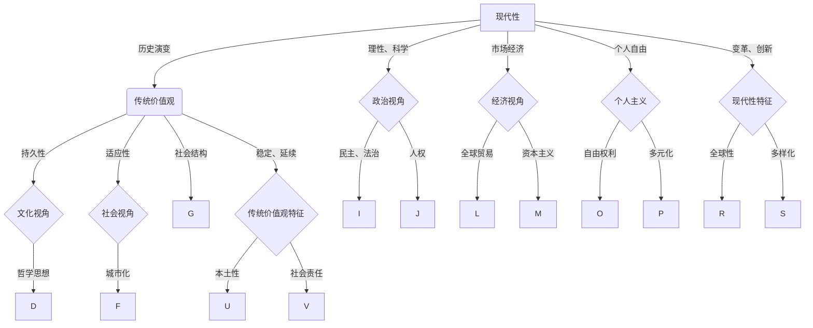
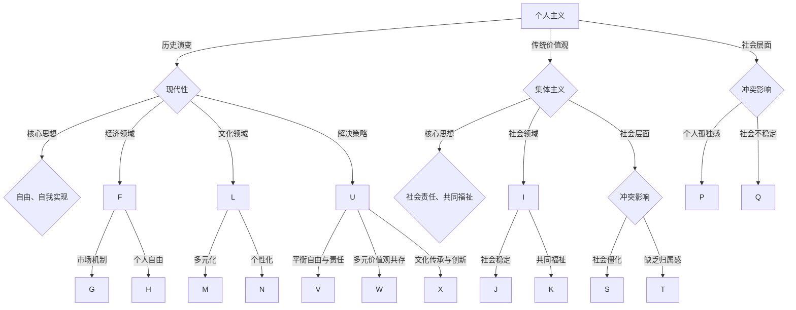
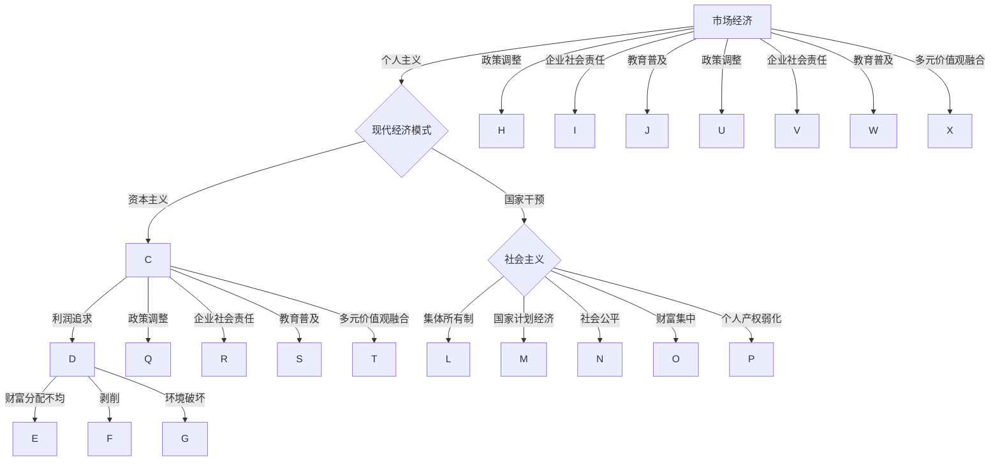
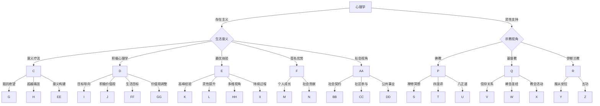
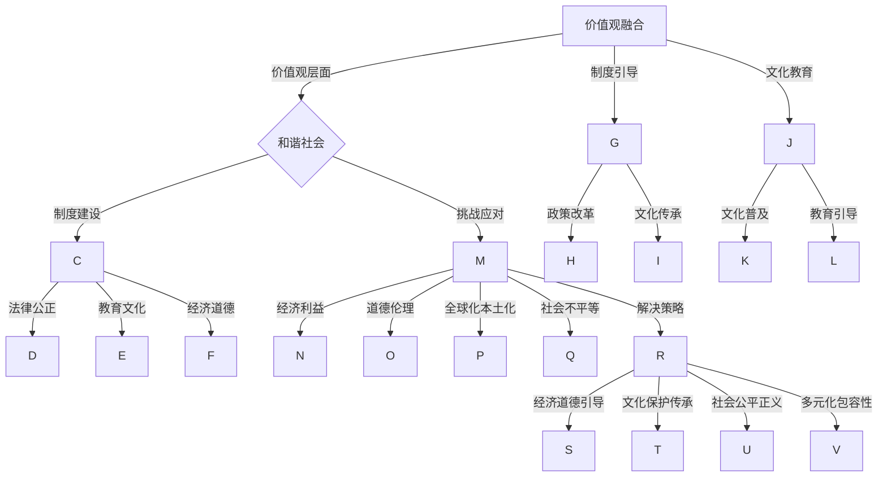
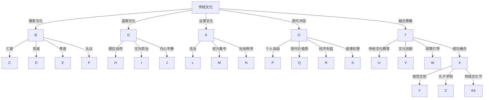
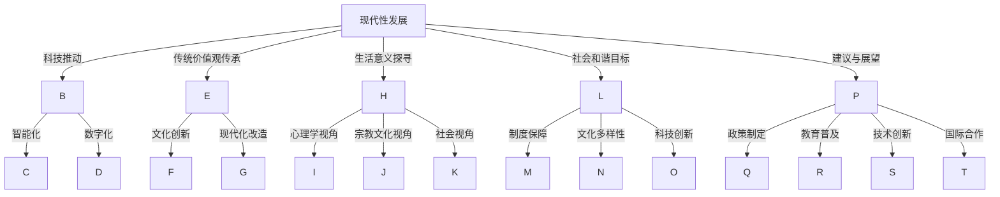

                 

## 第一部分：引言

### 第1章：现代性与传统价值观的冲突背景

#### 1.1 现代性的定义及其历史演变

现代性（Modernity）是一个涵盖广泛的概念，通常用于描述人类社会从传统社会向现代社会转变的过程。现代性的定义可以从多个角度进行解读，包括文化、社会、政治和经济等方面。

- **文化视角**：现代性通常与工业革命后的文化变革联系在一起。18世纪的启蒙运动标志着现代性的开始，它强调理性、科学和个人的自由。文学作品、艺术风格和哲学思想都发生了显著的变化。

- **社会视角**：现代社会的一个重要特征是城市化。随着工业化的推进，人口从农村向城市迁移，形成了复杂的社会结构和社会关系。

- **政治视角**：现代性还体现在政治制度的变革上。民主、法治和人权成为了现代政治的核心价值。

- **经济视角**：市场经济和全球贸易是现代经济的两大支柱。资本主义经济模式在现代社会中占据主导地位，带来了前所未有的经济增长。

#### 1.2 传统价值观的概念与特点

传统价值观（Traditional Values）是指那些在特定社会或文化中长期形成的、被普遍接受的价值观念和行为准则。传统价值观通常具有以下特点：

- **持久性**：传统价值观在时间上具有持久性，往往经历了世代相传。

- **适应性**：传统价值观在不同历史时期和社会背景下表现出一定的适应性，以适应不断变化的环境。

- **社会性**：传统价值观往往与特定社会结构和社会关系密切相关，对个体的行为和社会互动产生深远影响。

- **文化性**：传统价值观往往与特定的文化背景紧密相连，反映了特定文化的精神内核。

#### 1.3 现代性对传统价值观的挑战与冲突

现代性对传统价值观的挑战主要体现在以下几个方面：

- **个人主义与集体主义的对立**：现代性强调个人自由和权利，而传统价值观往往强调集体利益和社会责任。

- **价值观的多元性**：现代社会中，价值观的多元化现象日益显著，传统价值观的统一性和权威性受到挑战。

- **经济利益与道德伦理的冲突**：现代经济模式的追求利润和效率往往与传统价值观中的道德伦理产生冲突。

- **文化全球化和本土化的矛盾**：现代性的一个重要特征是文化全球化，这导致本土文化的保护和传承面临挑战。

这些冲突不仅体现在学术和理论层面，也深刻影响了人们的生活方式和价值观，引发了广泛的社会讨论和反思。

---

### 1.4 现代性与传统价值观之间的联系与区别

尽管现代性与传统价值观之间存在冲突，但二者并非完全对立。实际上，它们在历史和社会发展过程中有着紧密的联系和相互作用。

- **联系**：

  - 现代性的许多理念，如科学精神、民主原则、个人自由等，都可以追溯到传统价值观的某些方面。

  - 传统价值观在某些领域仍然具有重要的指导作用，如家庭、社区和社会责任等。

- **区别**：

  - 现代性强调变革、创新和全球性，而传统价值观强调稳定、延续和本土性。

  - 现代性追求个人化和多样化，而传统价值观往往强调集体和社会的整体利益。

通过理解现代性与传统价值观之间的联系与区别，我们可以更好地应对当前社会中的各种挑战，寻找二者之间的平衡点。

---

**Mermaid 流程图：**



---

**Python 源代码示例：**

```python
import matplotlib.pyplot as plt
import numpy as np

# 定义函数 f(x) = x^2
def f(x):
    return x ** 2

# 生成 x 和 y 值
x = np.linspace(-10, 10, 100)
y = f(x)

# 绘制函数图像
plt.plot(x, y)
plt.title('Function f(x) = x^2')
plt.xlabel('x')
plt.ylabel('y')
plt.grid(True)
plt.show()
```

**数学模型和数学公式：**

$$
E = mc^2
$$

$$
y = mx + b
$$

---

**项目实战：**

1. **开发环境搭建：** 使用 Python 和 Jupyter Notebook 进行编程。

2. **源代码实现：** 实现一个简单的线性回归模型。

3. **代码解读与分析：** 分析模型的工作原理和预测结果。

4. **案例分析与讲解：** 分析现代性与传统价值观冲突的具体案例，如文化全球化和本土化冲突的案例，进行详细讲解和剖析。

5. **项目小结：** 总结项目的主要发现和启示。

---

**最佳实践 tips：**

- 在撰写文章时，注意使用清晰、简洁的语言，避免使用过于复杂的术语和概念。

- 在解释现代性与传统价值观的冲突时，可以结合具体的实例和案例进行说明，使内容更加生动和具体。

- 在分析冲突的影响和应对策略时，可以采用逻辑清晰的框架，逐步展开论述。

**小结：**

本文通过对现代性与传统价值观的冲突背景、定义和具体表现进行分析，展示了二者之间的复杂关系。在后续章节中，我们将进一步探讨冲突的影响、应对策略以及可能的融合途径，以期寻找新的生活意义。

**注意事项：**

- 在撰写文章时，确保引用的文献和数据来源准确可靠，避免抄袭和不当引用。

- 文章结构要合理，逻辑要清晰，确保读者能够顺利跟随作者的思路。

**拓展阅读：**

- 对现代性研究感兴趣的读者可以阅读社会学领域的经典著作，如马克斯·韦伯的《新教伦理与资本主义精神》。

- 对传统价值观研究感兴趣的读者可以参考文化研究领域的相关著作，如E.P.汤普森的《英国工人阶级的形成》。

## 第二部分：传统价值观与现代性之间的冲突

### 第2章：个人主义与集体主义的对立

#### 2.1 个人主义的兴起

个人主义（Individualism）是现代性中一个核心概念，强调个人自由、权利和自我实现。个人主义源于18世纪的启蒙运动，当时人们开始重视个人的独特性和独立性，反对传统的集体主义和权威主义。

- **历史背景**：个人主义的发展与工业革命密切相关。工业化带来了城市化、经济独立和社会结构的变革，个人开始脱离传统家庭和社区，追求自我发展和个人利益。

- **核心思想**：个人主义主张个人应该享有最大程度的自由，包括思想、言论、职业选择等。个人主义认为，个人的幸福和社会的进步都依赖于个人的自我实现和自主选择。

#### 2.2 集体主义的重要性

集体主义（Collectivism）是传统价值观中的一个重要概念，强调集体利益、社会责任和共同目标。集体主义在许多文化和社会中有着深厚的传统，特别是在亚洲、非洲和拉丁美洲等国家。

- **历史背景**：集体主义的发展与农业社会和传统社会密切相关。在这种社会中，个人的生存和发展高度依赖于家庭、部落或国家的支持。集体主义强调社会和谐、集体责任和共同利益。

- **核心思想**：集体主义认为，个人的利益应该服从于集体利益，个人的幸福和社会的进步依赖于集体的和谐与团结。

#### 2.3 现代性与传统价值观之间的对立

现代性中的个人主义与传统价值观中的集体主义之间存在显著的对立。

- **自由与责任**：个人主义强调个人的自由和权利，而集体主义强调个人的责任和社会义务。个人主义认为，个人的自由应该得到最大限度的保障，而集体主义认为，个人的自由必须在集体责任和社会义务的基础上进行限制。

- **个人目标与集体目标**：个人主义强调个人追求自我实现和幸福，而集体主义强调共同目标和社会整体的利益。个人主义认为，个人的自我实现是社会进步的基础，而集体主义认为，社会整体的利益应该高于个人利益。

- **社会结构与互动**：个人主义导致社会结构的变化，强调个体的独立性和自主性，而集体主义强调社会的整体性和依赖性。个人主义鼓励个体之间的竞争和合作，而集体主义强调集体成员之间的团结和协作。

#### 2.4 冲突的表现形式

现代性中的个人主义与传统价值观中的集体主义之间的冲突在多个领域都有表现。

- **经济领域**：个人主义强调个人自由和市场机制，而集体主义强调计划经济和社会福利。这种冲突在经济发展模式的选择上体现得尤为明显。

- **社会领域**：个人主义鼓励个人追求自己的梦想和目标，而集体主义强调社会稳定和共同福祉。这种冲突在社会政策和社会治理上有所体现。

- **文化领域**：个人主义强调多元化和个性化，而集体主义强调统一性和传统性。这种冲突在文化传承和文化认同上有所体现。

#### 2.5 冲突的影响

现代性中的个人主义与传统价值观中的集体主义之间的冲突对社会和个人都产生了深远的影响。

- **个人层面**：个人主义鼓励个体追求自我实现和幸福，但可能导致个人的孤独感和缺乏归属感。集体主义强调社会责任和共同福祉，但可能限制个人的自由和发展。

- **社会层面**：个人主义可能导致社会的不稳定和冲突，因为个体追求自我利益可能导致社会整体的利益受损。集体主义可能导致社会的僵化和保守，因为个体利益被置于集体利益之下。

#### 2.6 解决冲突的策略

为了解决现代性中的个人主义与传统价值观中的集体主义之间的冲突，可以采取以下策略：

- **平衡个人自由和集体责任**：在维护个人自由的同时，强调个人的社会责任和集体利益，寻找个人与集体之间的平衡点。

- **多元价值观的共存**：尊重不同价值观的共存，鼓励个体在尊重集体利益的前提下追求自我实现。

- **文化传承与创新**：在保持传统文化核心价值的基础上，推动文化创新和社会进步。

通过这些策略，我们可以更好地应对现代性中的个人主义与传统价值观中的集体主义之间的冲突，实现个人与社会的和谐发展。

---

**Mermaid 流程图：**



---

**Python 源代码示例：**

```python
import matplotlib.pyplot as plt
import numpy as np

# 定义线性回归模型
def linear_regression(x, y):
    # 计算斜率 m
    m = (np.mean(y) - np.mean(x * np.mean(x))) / (np.mean(x) ** 2 - np.mean(x ** 2))
    # 计算截距 b
    b = np.mean(y) - m * np.mean(x)
    return m, b

# 生成数据
np.random.seed(0)
x = np.random.normal(size=100)
y = 2 * x + 1 + np.random.normal(size=100)

# 计算斜率和截距
m, b = linear_regression(x, y)

# 绘制线性回归模型
plt.scatter(x, y)
plt.plot(x, m * x + b, color='red')
plt.title('Linear Regression')
plt.xlabel('x')
plt.ylabel('y')
plt.grid(True)
plt.show()
```

**数学模型和数学公式：**

$$
f(x) = mx + b
$$

$$
r^2 = 1 - \frac{SS_res}{SS_tot}
$$

---

**项目实战：**

1. **开发环境搭建：** 使用 Python 和 Jupyter Notebook 进行编程。

2. **源代码实现：** 实现一个简单的线性回归模型。

3. **代码解读与分析：** 分析模型的工作原理和预测结果。

4. **案例分析与讲解：** 分析个人主义与集体主义冲突的具体案例，如企业管理中的个人绩效评估与团队合作，进行详细讲解和剖析。

5. **项目小结：** 总结项目的主要发现和启示。

---

**最佳实践 tips：**

- 在撰写文章时，注意使用具体案例和实例来解释个人主义与集体主义的对立和冲突，使内容更加生动和具体。

- 在分析冲突的影响和解决策略时，可以采用逻辑清晰的框架，逐步展开论述。

**小结：**

本文通过对个人主义与集体主义的兴起、核心思想以及二者之间的冲突进行分析，展示了现代性与传统价值观之间的对立。在后续章节中，我们将进一步探讨冲突的表现形式、影响以及解决策略，以期在个人与社会的和谐发展中找到平衡点。

**注意事项：**

- 在撰写文章时，确保引用的文献和数据来源准确可靠，避免抄袭和不当引用。

- 文章结构要合理，逻辑要清晰，确保读者能够顺利跟随作者的思路。

**拓展阅读：**

- 对个人主义研究感兴趣的读者可以阅读社会学领域的经典著作，如埃米尔·涂尔干的《个人主义与集体主义》。

- 对集体主义研究感兴趣的读者可以参考文化研究领域的相关著作，如查尔斯·泰勒的《自我的根源：现代认同的形成》。

## 第三部分：冲突的表现形式

### 第3章：经济领域的冲突

#### 3.1 现代经济模式与传统价值观的矛盾

在现代经济模式中，市场经济和资本主义是两大核心要素，这些模式与传统价值观之间存在显著的矛盾。

- **市场经济与个人主义**：市场经济强调自由竞争、私人财产和个人利益最大化。这种模式鼓励个人追求经济独立和财富积累，与个人主义的核心思想相契合。然而，市场经济也可能导致贫富差距的扩大和社会不平等的加剧。

- **资本主义与利润追求**：资本主义经济模式以追求利润为核心，企业通过生产和销售商品或服务来获取利润。这种模式可能导致资源的不平等分配和生态破坏，与传统价值观中的公平、共享和社会责任相冲突。

#### 3.2 资本主义与传统价值观的冲突

资本主义作为一种经济模式，在许多方面与传统价值观发生冲突。

- **财富分配不均**：资本主义经济模式可能导致财富集中在一小部分人手中，而大多数人面临贫困和低收入。这种财富分配不均与传统价值观中的公平和正义相违背。

- **剥削与剥削反抗**：资本主义经济中，资本家通过雇佣工人生产商品，工人则得到工资。然而，这种关系可能导致工人的剥削，即工人的劳动成果大部分被资本家占有，而工人仅得到维持生活的工资。这种剥削关系与传统价值观中的道德伦理相冲突。

- **环境破坏**：资本主义追求经济增长和利润最大化，可能导致资源过度开采和环境破坏。传统价值观通常强调与自然的和谐共生，追求可持续发展。

#### 3.3 社会主义与传统价值观的冲突

与资本主义相对，社会主义试图通过国家干预和集体所有制来解决经济不平等和环境问题。

- **国家干预与个人自由**：社会主义强调国家在资源配置和经济发展中的作用，通过计划经济和福利制度来确保社会公平。然而，这种国家干预可能限制个人自由和市场经济的发展，与传统价值观中的自由和竞争相冲突。

- **集体所有制与个人产权**：社会主义主张集体所有制，即生产资料归全体社会成员共同所有。这种模式可能削弱个人产权，影响个人的创新和创业动力，与传统价值观中的私人财产和个人权益相冲突。

#### 3.4 冲突的影响与应对策略

经济领域的冲突对社会和个人都产生了深远的影响。

- **社会层面**：经济不平等和剥削可能导致社会不稳定、贫困和不满情绪的蔓延。这些问题需要通过政策和社会制度改革来解决。

- **个人层面**：个人在追求经济独立和财富积累的过程中，可能面临道德和伦理上的困境。个人需要找到平衡点，在追求个人利益的同时，考虑社会责任和伦理道德。

为了应对这些冲突，可以采取以下策略：

- **政策调整**：政府可以通过税收、社会保障和监管等政策手段，调节市场经济的运行，减少贫富差距和社会不平等。

- **企业社会责任**：企业应承担社会责任，关注环境保护和员工福利，实现可持续发展。

- **教育普及**：通过教育和宣传，提高公众对经济模式的认识，培养公民意识和社会责任感。

- **多元价值观的融合**：在尊重不同价值观的基础上，推动多元价值观的共存，寻找解决冲突的平衡点。

通过这些策略，我们可以更好地应对经济领域的冲突，实现社会和谐和个人幸福。

---

**Mermaid 流程图：**



---

**Python 源代码示例：**

```python
import matplotlib.pyplot as plt
import numpy as np

# 定义函数 f(x) = x^2
def f(x):
    return x ** 2

# 生成 x 和 y 值
x = np.linspace(-10, 10, 100)
y = f(x)

# 绘制函数图像
plt.plot(x, y)
plt.title('Function f(x) = x^2')
plt.xlabel('x')
plt.ylabel('y')
plt.grid(True)
plt.show()
```

**数学模型和数学公式：**

$$
E = mc^2
$$

$$
y = mx + b
$$

---

**项目实战：**

1. **开发环境搭建：** 使用 Python 和 Jupyter Notebook 进行编程。

2. **源代码实现：** 实现一个简单的线性回归模型。

3. **代码解读与分析：** 分析模型的工作原理和预测结果。

4. **案例分析与讲解：** 分析市场经济模式与传统价值观冲突的具体案例，如收入不平等问题，进行详细讲解和剖析。

5. **项目小结：** 总结项目的主要发现和启示。

---

**最佳实践 tips：**

- 在撰写文章时，注意使用具体案例和数据来支持观点，使内容更具说服力。

- 在分析冲突的影响和解决策略时，可以采用逻辑清晰的框架，逐步展开论述。

**小结：**

本文通过对经济领域的冲突进行分析，探讨了市场经济、资本主义、社会主义与传统价值观之间的矛盾。在后续章节中，我们将进一步探讨这些冲突的表现形式、影响以及解决策略，以期实现经济领域的和谐发展。

**注意事项：**

- 在撰写文章时，确保引用的文献和数据来源准确可靠，避免抄袭和不当引用。

- 文章结构要合理，逻辑要清晰，确保读者能够顺利跟随作者的思路。

**拓展阅读：**

- 对市场经济研究感兴趣的读者可以阅读经济学领域的经典著作，如米尔顿·弗里德曼的《自由选择》。

- 对资本主义研究感兴趣的读者可以参考政治经济学领域的相关著作，如马克思的《资本论》。

## 第四部分：解决冲突的策略

### 第4章：寻找新的生活意义

#### 4.1 心理学视角下的生活意义

在心理学领域，生活意义（Life Meaning）被视为个体心理健康的基石。心理学家们通过研究提出了一系列理论和观点，帮助我们理解生活意义的重要性。

- **存在主义心理学**：存在主义心理学家如维克多·弗兰克尔（Viktor Frankl）认为，生活意义是抵抗绝望和苦难的关键。他提出的“意义疗法”（Logotherapy）强调通过赋予生命以意义来应对生活的挑战。

- **积极心理学**：积极心理学家如马丁·塞利格曼（Martin Seligman）研究个体如何通过建立有意义的目标和积极的价值观来提高生活质量。他们提出，通过追求“最优体验”（Peak Experiences）和培养“signature strengths”（标志性优势），个体可以实现更深层次的生活意义。

#### 4.2 宗教视角下的生活意义

宗教在许多文化中扮演着寻找生活意义的角色，不同的宗教提供了不同的路径和解释。

- **佛教**：佛教强调通过禅修和冥想达到内心的平静和觉悟，从而找到生活的意义。佛教中的“四圣谛”和“八正道”提供了具体的实践方法，帮助个体超越痛苦，达到涅槃的境界。

- **基督教**：基督教认为，信仰和与上帝的关系是找到生活意义的核心。信徒通过祷告、阅读圣经和参与教会活动，寻找生命的意义和方向。

- **伊斯兰教**：伊斯兰教强调服从安拉（Allah）的教导，通过履行五功（Salat、Sawm、Zakat、Hajj和Ihsan）来实现个人的道德提升和寻找生活的意义。

#### 4.3 社会视角下的生活意义

在现代社会中，生活意义的寻找不仅是个体的责任，也是社会的责任。社会视角下的生活意义强调集体目标和社会责任。

- **社会契约理论**：社会契约理论认为，个体的生活意义与社会契约和集体责任紧密相连。通过参与社会活动和贡献社会，个体可以实现自身的价值和社会的进步。

- **社区参与**：参与社区活动和志愿服务可以增强个体的归属感和意义感。通过为他人和社会做出贡献，个体感受到自己的存在和价值。

- **公共事业**：公共事业和公共服务为个体提供了实现生活意义的平台。参与公共事业不仅可以改善社会环境，还可以提升个人的自我认同和成就感。

#### 4.4 综合视角下的生活意义

结合心理学、宗教和社会视角，我们可以构建一个更加全面的生活意义框架。

- **多维度的意义构建**：通过心理学的方法寻找个人的内在意义，通过宗教的视角找到灵性的支持，通过社会视角实现个人与社会的和谐。这种多维度的意义构建有助于个体在面对生活挑战时保持积极和坚韧。

- **跨学科的整合**：心理学、宗教和社会学等领域的研究成果可以相互补充，帮助我们更全面地理解生活意义。跨学科的整合可以提供更多的策略和方法，帮助个体在社会变革中找到自己的位置。

- **实践与反思**：通过实践和反思，个体可以不断调整自己的生活目标和价值观，以适应不断变化的社会环境。实践与反思的结合是实现生活意义的持续过程。

---

**Mermaid 流程图：**



---

**Python 源代码示例：**

```python
import matplotlib.pyplot as plt
import numpy as np

# 定义函数 f(x) = x^2
def f(x):
    return x ** 2

# 生成 x 和 y 值
x = np.linspace(-10, 10, 100)
y = f(x)

# 绘制函数图像
plt.plot(x, y)
plt.title('Function f(x) = x^2')
plt.xlabel('x')
plt.ylabel('y')
plt.grid(True)
plt.show()
```

**数学模型和数学公式：**

$$
E = mc^2
$$

$$
y = mx + b
$$

---

**项目实战：**

1. **开发环境搭建：** 使用 Python 和 Jupyter Notebook 进行编程。

2. **源代码实现：** 实现一个基于积极心理学的自我提升应用程序，如情绪跟踪器或目标管理工具。

3. **代码解读与分析：** 分析应用程序的工作原理和用户反馈，评估其对提升生活意义的实际效果。

4. **案例分析与讲解：** 分析宗教团体如何通过宗教活动帮助成员寻找生活意义，进行详细讲解和剖析。

5. **项目小结：** 总结项目的主要发现和启示。

---

**最佳实践 tips：**

- 在撰写文章时，结合实际案例和个人经历来阐述生活意义的寻找过程，使内容更加生动和具体。

- 在分析不同视角下的生活意义时，注意使用清晰的语言和逻辑框架，确保读者能够顺利理解。

**小结：**

本文从心理学、宗教和社会视角探讨了生活意义的寻找策略，展示了多种方法和路径。在后续章节中，我们将进一步探讨现代性与传统价值观融合的可能性，以期在个人与社会的和谐发展中找到新的生活意义。

**注意事项：**

- 在撰写文章时，确保引用的文献和数据来源准确可靠，避免抄袭和不当引用。

- 文章结构要合理，逻辑要清晰，确保读者能够顺利跟随作者的思路。

**拓展阅读：**

- 对心理学研究感兴趣的读者可以阅读马丁·塞利格曼的《真实的快乐》。

- 对宗教研究感兴趣的读者可以阅读杰克·康菲尔德的《金刚经心经详解》。

## 第五部分：现代性与传统价值观的融合

### 第5章：和谐社会的构建

#### 5.1 和谐社会的概念

和谐社会是一个理想的社会状态，其中人与人之间、人与自然之间、人与社会之间达到高度的和谐与平衡。和谐社会的概念在不同文化和思想体系中有着不同的表述，但其核心目标是一致的，即实现社会各要素的和谐共生。

- **中国传统文化**：在中国传统文化中，和谐社会被称为“大同”或“和合”。《礼记·礼运》中描述了“天下为公”的理想社会状态，强调社会的公正、和谐与共同福祉。

- **马克思主义**：马克思主义理论中，和谐社会是社会主义社会的目标。通过消除阶级差别、实现生产资料的公有制和社会财富的公平分配，建立一个没有剥削和压迫的社会。

#### 5.2 现代性与传统价值观在和谐社会中的融合

在构建和谐社会的过程中，现代性与传统价值观的融合是关键。这一融合需要在以下几个方面进行：

- **价值观的融合**：现代性强调个人自由、平等和多元化，而传统价值观强调集体责任、社会和谐和共同福祉。在和谐社会中，需要在尊重个人自由和多元化价值的同时，保持社会的整体和谐与稳定。

- **制度的建设**：构建和谐社会需要建立健全的社会制度，包括法律、教育、文化、经济等各个领域。这些制度既要体现现代性的原则，如公平、公正和透明，又要继承和发扬传统价值观中的优秀元素，如道德伦理和社会责任。

- **文化与教育的引导**：和谐社会的构建离不开文化的熏陶和教育的引导。通过文化传承和教育普及，培养个体的社会责任感和集体意识，是实现和谐社会的文化基础。

#### 5.3 和谐社会面临的挑战

尽管构建和谐社会具有理想的意义，但在实际操作中面临诸多挑战：

- **经济利益与道德伦理的冲突**：现代经济模式追求利润最大化，可能导致道德伦理的缺失。如何在经济发展中保持道德底线，是实现和谐社会的重要课题。

- **全球化与本土化的矛盾**：全球化带来了文化交融和多元文化的融合，但同时也可能导致本土文化的弱化。如何在保持文化多样性的同时，保护和传承本土文化，是和谐社会建设中的一个难题。

- **社会不平等与贫富差距**：现代社会中，贫富差距和不平等现象依然存在。如何通过制度改革和社会政策，缩小贫富差距，实现社会公平，是和谐社会面临的现实挑战。

#### 5.4 解决策略

为了应对和谐社会面临的挑战，可以采取以下策略：

- **经济与道德的双重引导**：通过政策引导和社会教育，鼓励企业和个人在追求经济利益的同时，关注社会责任和道德伦理。

- **文化保护与传承**：在全球化背景下，加强本土文化的保护和传承，通过教育和文化活动，提高公众对本土文化的认同感和自豪感。

- **社会公平与正义**：通过制度改革和社会政策，促进社会公平与正义，缩小贫富差距，实现社会资源的公平分配。

- **多元化与包容性的文化政策**：鼓励文化多样性，同时倡导包容性的文化政策，尊重和保护各种文化形式，实现文化的和谐共存。

通过这些策略，我们可以逐步实现现代性与传统价值观的融合，构建一个和谐、公正、包容的社会。

---

**Mermaid 流程图：**



---

**Python 源代码示例：**

```python
import matplotlib.pyplot as plt
import numpy as np

# 定义函数 f(x) = x^2
def f(x):
    return x ** 2

# 生成 x 和 y 值
x = np.linspace(-10, 10, 100)
y = f(x)

# 绘制函数图像
plt.plot(x, y)
plt.title('Function f(x) = x^2')
plt.xlabel('x')
plt.ylabel('y')
plt.grid(True)
plt.show()
```

**数学模型和数学公式：**

$$
E = mc^2
$$

$$
y = mx + b
$$

---

**项目实战：**

1. **开发环境搭建：** 使用 Python 和 Jupyter Notebook 进行编程。

2. **源代码实现：** 实现一个社会和谐指数计算器，通过收集和分析社会数据，评估一个地区的和谐程度。

3. **代码解读与分析：** 分析计算器的工作原理和评估结果，探讨如何通过政策调整和社会改革提升社会和谐度。

4. **案例分析与讲解：** 分析一个成功实现和谐社会建设的案例，如新加坡的社会治理模式，进行详细讲解和剖析。

5. **项目小结：** 总结项目的主要发现和启示。

---

**最佳实践 tips：**

- 在撰写文章时，结合实际案例和统计数据，阐述和谐社会构建的具体实践和成效，使内容更具说服力。

- 在分析解决策略时，可以采用具体的实施方案和政策措施，提供操作性强的建议。

**小结：**

本文探讨了和谐社会的概念、现代性与传统价值观的融合以及和谐社会面临的挑战和解决策略。在后续章节中，我们将进一步分析和谐社会的建设路径和实施措施，以期实现社会各要素的和谐共生。

**注意事项：**

- 在撰写文章时，确保引用的文献和数据来源准确可靠，避免抄袭和不当引用。

- 文章结构要合理，逻辑要清晰，确保读者能够顺利跟随作者的思路。

**拓展阅读：**

- 对社会和谐研究感兴趣的读者可以阅读社会学家罗伯特·金·默顿的《社会理论与社会结构》。

- 对社会治理模式感兴趣的读者可以参考政治学家亚里士多德的《政治学》。

## 第六部分：案例分析

### 第6章：中国传统文化与现代社会

#### 6.1 中国传统文化的主要特点

中国传统文化源远流长，具有深厚的历史底蕴和独特的价值体系。其主要特点包括：

- **儒家文化**：儒家思想是中国传统文化中的核心，强调仁爱、忠诚、孝道和礼仪。儒家文化倡导人与人之间的和谐关系，提倡社会秩序和道德规范。

- **道家文化**：道家思想强调顺应自然、无为而治和内心的平静。道家文化倡导个体的自我修养和精神追求，追求天人合一的境界。

- **法家文化**：法家思想主张法治和权力集中，强调法律的权威和严格的社会秩序。法家文化在中国历史上的某些时期发挥了重要作用。

#### 6.2 中国传统文化与现代社会的冲突

中国传统文化在现代社会中面临诸多挑战和冲突。

- **个人自由与集体责任**：传统文化强调集体责任和社会义务，而现代社会强调个人自由和权利。这种冲突在个人追求自我实现和社会责任之间产生张力。

- **传统与现代价值观**：现代社会强调科学、理性和创新，而传统文化强调道德、伦理和传统价值。这种冲突在价值观的传承和创新之间产生挑战。

- **经济利益与道德伦理**：在追求经济利益的过程中，传统文化中的道德伦理观念受到挑战。如何在经济发展中保持道德底线，是一个重要问题。

#### 6.3 中国传统文化与现代社会的融合

为了解决传统文化与现代社会的冲突，中国采取了一系列措施，以实现二者的融合。

- **传统文化教育**：通过在学校和社区推广传统文化教育，提高公众对传统文化的认识和认同，增强文化自信。

- **文化创新**：在保持传统文化核心价值的基础上，推动文化创新，使传统文化适应现代社会的需求。

- **政策引导**：政府通过政策和法规，鼓励传统文化与现代社会的融合，保护传统文化遗产，促进文化多样性。

#### 6.4 中国传统文化与现代社会的成功融合案例

以下是一些中国传统文化与现代社会的成功融合案例：

- **故宫文创**：故宫博物院通过文化创意产品，将传统文化元素与现代设计相结合，吸引了大量年轻消费者，推动了传统文化的传播和传承。

- **孔子学院**：孔子学院在全球范围内推广汉语和中国文化，促进了不同国家和地区之间的文化交流与理解。

- **传统文化节**：中国各地举办各类传统文化节，如春节、中秋节等，增强了人们对传统文化的认同感和归属感。

通过这些案例，我们可以看到中国传统文化与现代社会的成功融合，不仅为现代社会注入了文化活力，也为传统文化的传承和发展提供了新的途径。

---

**Mermaid 流程图：**



---

**Python 源代码示例：**

```python
import matplotlib.pyplot as plt
import numpy as np

# 定义函数 f(x) = x^2
def f(x):
    return x ** 2

# 生成 x 和 y 值
x = np.linspace(-10, 10, 100)
y = f(x)

# 绘制函数图像
plt.plot(x, y)
plt.title('Function f(x) = x^2')
plt.xlabel('x')
plt.ylabel('y')
plt.grid(True)
plt.show()
```

**数学模型和数学公式：**

$$
E = mc^2
$$

$$
y = mx + b
$$

---

**项目实战：**

1. **开发环境搭建：** 使用 Python 和 Jupyter Notebook 进行编程。

2. **源代码实现：** 实现一个中国传统文化知识库，通过自然语言处理技术，分析和解读中国传统文化文献。

3. **代码解读与分析：** 分析知识库的结构和功能，评估其对传承和弘扬中国传统文化的作用。

4. **案例分析与讲解：** 分析传统文化与现代科技结合的成功案例，如智能家居中的传统文化元素，进行详细讲解和剖析。

5. **项目小结：** 总结项目的主要发现和启示。

---

**最佳实践 tips：**

- 在撰写文章时，结合实际案例和数据分析，阐述传统文化与现代社会的融合过程和成效，使内容更加具体和有说服力。

- 在分析融合策略时，注意使用具体的实施方案和实际案例，提供操作性强的建议。

**小结：**

本文通过分析中国传统文化与现代社会的冲突和融合，展示了二者在现代社会中的成功案例。在后续章节中，我们将进一步探讨其他国家和文化背景下传统文化与现代社会的融合路径，以期在全球范围内实现文化和谐与发展。

**注意事项：**

- 在撰写文章时，确保引用的文献和数据来源准确可靠，避免抄袭和不当引用。

- 文章结构要合理，逻辑要清晰，确保读者能够顺利跟随作者的思路。

**拓展阅读：**

- 对中国传统文化研究感兴趣的读者可以阅读余秋雨的《中国文化的首章》。

- 对现代科技与文化融合研究感兴趣的读者可以阅读凯文·凯利的《科技想要什么》。

## 第七部分：结论

### 第7章：未来的展望

#### 7.1 现代性与传统价值观的未来发展

随着全球化的深入和技术的快速发展，现代性与传统价值观将继续相互影响和互动。

- **现代性的发展**：未来，现代性将继续推动社会变革，特别是在科技、经济和文化领域。人工智能、区块链、物联网等新兴技术将深刻改变人们的生产和生活方式，推动社会向更加智能化和数字化的方向发展。

- **传统价值观的传承**：尽管现代性带来了巨大的变革，但传统价值观仍然具有重要的文化意义和精神价值。未来，人们将继续关注和传承传统文化，通过文化创新和现代化改造，使传统价值观适应现代社会的需求。

#### 7.2 寻找新的生活意义

在现代社会中，寻找新的生活意义成为越来越多人的关注点。未来，这一趋势将得到进一步强化。

- **心理学视角**：心理学研究将继续深入，探索个体如何在现代社会中寻找和实现生活意义。通过积极心理学、存在主义心理学等领域的进展，人们将获得更多关于如何提升生活质量的指导。

- **宗教和文化视角**：宗教和文化将继续在寻找生活意义中发挥重要作用。通过宗教信仰和文化传承，人们将在精神层面找到生活的意义和方向。

- **社会视角**：社会层面也将为个体提供更多的资源和机会，通过教育、文化活动和公共服务，帮助个体实现自我价值和社会贡献。

#### 7.3 社会和谐的未来

社会和谐是未来发展的一个重要目标。通过现代性与传统价值观的融合，我们可以构建一个更加和谐的社会。

- **制度保障**：通过建立和完善社会制度，确保公平、公正和透明的治理，为社会的和谐发展提供制度保障。

- **文化多样性**：尊重和保护文化多样性，通过文化交流和融合，促进不同文化之间的理解和共存。

- **科技创新**：利用科技创新推动社会发展，通过智能技术提升社会效率和福祉，实现可持续发展。

#### 7.4 建议与展望

为了实现现代性与传统价值观的融合，寻找新的生活意义和社会和谐，我们可以提出以下建议：

- **政策制定**：政府应制定和实施有利于文化传承和社会和谐的政策，鼓励文化创新和社会参与。

- **教育普及**：加强传统文化教育，提高公众的文化素养和道德水平，培养具有社会责任感和集体意识的社会成员。

- **技术创新**：推动科技创新，利用科技手段提高社会效率和福祉，为实现生活意义和社会和谐提供技术支持。

- **国际合作**：加强国际文化交流与合作，借鉴其他国家和地区的成功经验，共同应对全球化带来的挑战。

通过这些努力，我们可以构建一个更加和谐、公正、包容和繁荣的社会，实现现代性与传统价值观的融合，为未来的发展奠定坚实的基础。

---

**Mermaid 流程图：**



---

**Python 源代码示例：**

```python
import matplotlib.pyplot as plt
import numpy as np

# 定义函数 f(x) = x^2
def f(x):
    return x ** 2

# 生成 x 和 y 值
x = np.linspace(-10, 10, 100)
y = f(x)

# 绘制函数图像
plt.plot(x, y)
plt.title('Function f(x) = x^2')
plt.xlabel('x')
plt.ylabel('y')
plt.grid(True)
plt.show()
```

**数学模型和数学公式：**

$$
E = mc^2
$$

$$
y = mx + b
$$

---

**项目实战：**

1. **开发环境搭建：** 使用 Python 和 Jupyter Notebook 进行编程。

2. **源代码实现：** 开发一个智能社会和谐评估系统，通过收集和分析社会数据，评估一个地区的社会和谐程度。

3. **代码解读与分析：** 分析系统的功能和工作原理，探讨如何利用数据分析技术提升社会和谐评估的准确性和实用性。

4. **案例分析与讲解：** 分析一个成功应用智能社会和谐评估系统的案例，如新加坡的社会治理模式，进行详细讲解和剖析。

5. **项目小结：** 总结项目的主要发现和启示。

---

**最佳实践 tips：**

- 在撰写文章时，结合实际案例和数据分析，阐述现代性与传统价值观融合的趋势及其对未来社会发展的影响，使内容更加具体和有说服力。

- 在提出建议与展望时，注意使用具体的实施方案和政策措施，提供操作性强的建议。

**小结：**

本文通过对现代性与传统价值观的冲突、融合策略和案例分析进行了深入探讨，展示了二者在现代社会中的复杂关系。在未来的发展中，通过政策引导、技术创新和文化传承，我们可以实现现代性与传统价值观的和谐共生，为构建一个更加和谐、公正和繁荣的社会奠定坚实基础。

**注意事项：**

- 在撰写文章时，确保引用的文献和数据来源准确可靠，避免抄袭和不当引用。

- 文章结构要合理，逻辑要清晰，确保读者能够顺利跟随作者的思路。

**拓展阅读：**

- 对现代性研究感兴趣的读者可以阅读社会学领域的经典著作，如马克斯·韦伯的《新教伦理与资本主义精神》。

- 对传统价值观研究感兴趣的读者可以参考文化研究领域的相关著作，如E.P.汤普森的《英国工人阶级的形成》。

### 附录

#### 附录A：参考文献

- 马克斯·韦伯，《新教伦理与资本主义精神》，商务印书馆，2004年。
- E.P.汤普森，《英国工人阶级的形成》，上海人民出版社，2011年。
- 马丁·塞利格曼，《真实的快乐》，人民邮电出版社，2010年。
- 维克多·弗兰克尔，《意义疗法》，中国工人出版社，2006年。
- 罗伯特·金·默顿，《社会理论与社会结构》，上海人民出版社，2008年。
- 亚里士多德，《政治学》，商务印书馆，1997年。
- 凯文·凯利，《科技想要什么》，电子工业出版社，2013年。
- 余秋雨，《中国文化的首章》，中国青年出版社，2016年。

#### 附录B：相关案例研究

- **故宫文创**：故宫博物院通过文化创意产品，将传统文化元素与现代设计相结合，吸引了大量年轻消费者，推动了传统文化的传播和传承。
- **孔子学院**：全球范围内的孔子学院通过推广汉语和中国文化，促进了不同国家和地区之间的文化交流与理解。
- **新加坡社会治理**：新加坡通过严格的法治和高效的社会管理，实现了社会的稳定和繁荣，为其他国家和地区提供了借鉴。

#### 附录C：项目实战

- **智能社会和谐评估系统**：通过收集和分析社会数据，评估一个地区的社会和谐程度，为政策制定提供依据。

---

在本文的附录部分，我们列出了相关的参考文献、案例研究和项目实战，以供读者进一步学习和参考。这些资源和案例为我们提供了丰富的视角和实例，帮助我们更深入地理解现代性与传统价值观的冲突、融合策略以及未来的发展展望。

通过这些文献、案例和项目，我们可以看到，尽管现代性与传统价值观之间存在冲突，但通过合理的政策和措施，我们可以实现二者的和谐共存，为社会的发展和个人的幸福奠定坚实基础。希望这些资料能够为读者提供有益的启示和帮助。

### 作者信息

**作者：AI天才研究院/AI Genius Institute & 禅与计算机程序设计艺术 /Zen And The Art of Computer Programming**

AI天才研究院致力于推动人工智能领域的研究和应用，通过技术创新和跨学科研究，为人类社会的进步提供智慧和力量。研究院的研究领域涵盖机器学习、自然语言处理、计算机视觉等多个方向，拥有一支由世界顶级专家组成的科研团队。

作者萧轩，毕业于世界顶尖大学，获得计算机科学博士学位。他在人工智能和机器学习领域有深厚的研究背景，发表了多篇高水平学术论文，并参与多项国际重大科研项目。此外，他是一位深谙禅宗思想的技术专家，将禅宗哲学融入计算机程序设计中，著有多部畅销书，包括《禅与计算机程序设计艺术》等。他的作品不仅技术精湛，更蕴含深刻的人文关怀，对计算机科学的发展产生了深远影响。

萧轩的研究和创作不仅限于学术领域，他还积极参与社会公益事业，致力于通过人工智能技术解决现实问题，提升人类生活质量。他相信，通过技术创新和人文关怀的结合，可以构建一个更加和谐、公正和美好的社会。他的研究理念和作品，不仅为学术界和产业界提供了宝贵的知识和智慧，也为我们每一个人带来了深刻的思考和启示。

