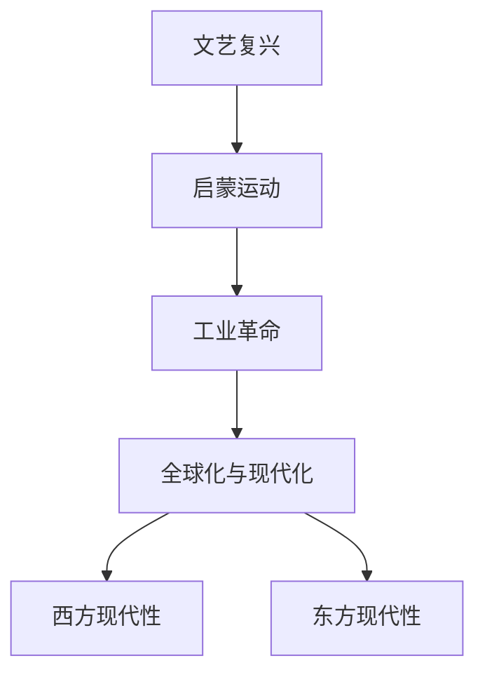
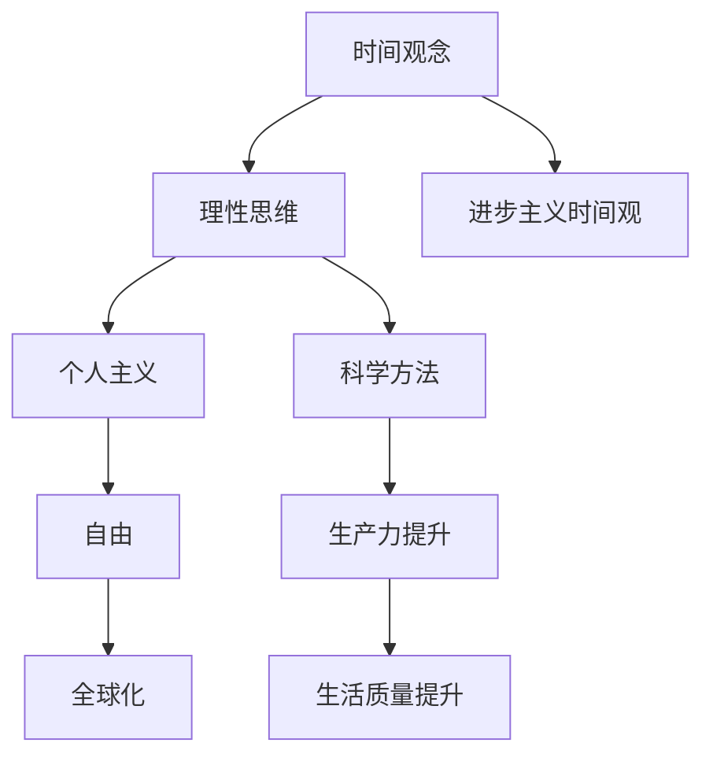
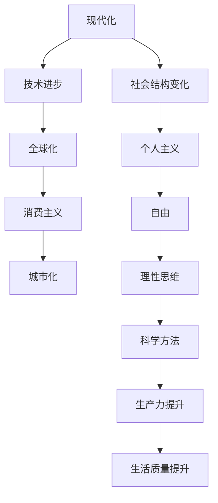
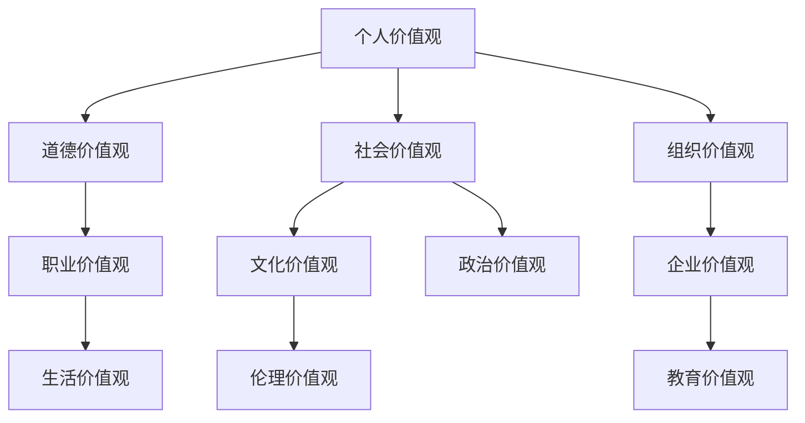
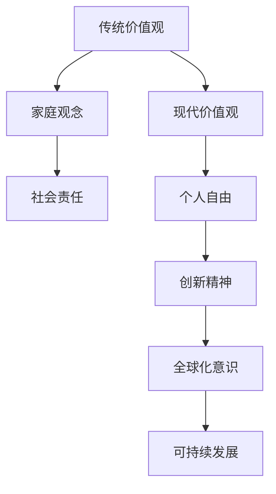
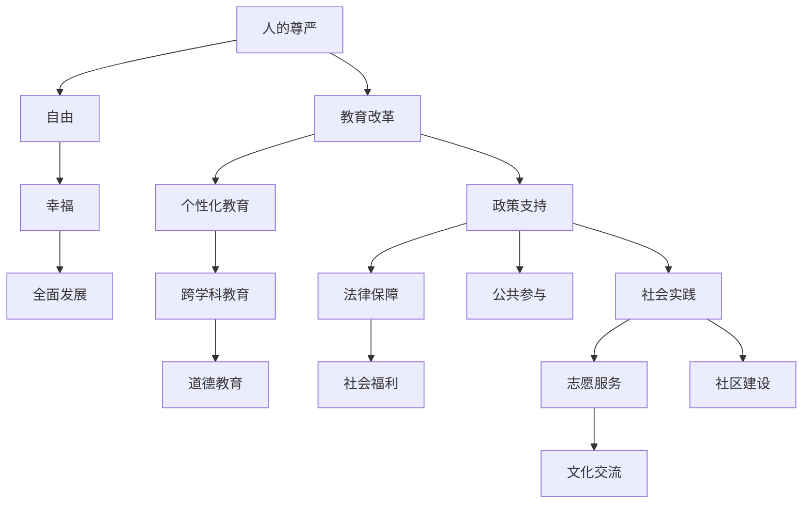
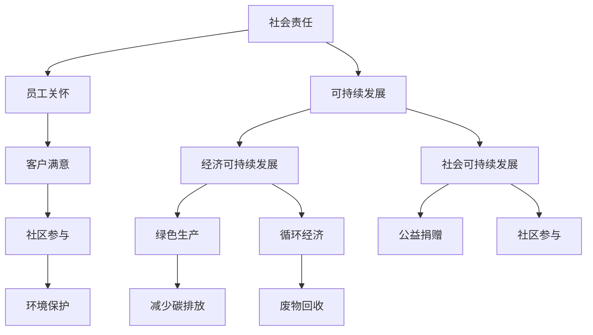

                 

### 第1章: 现代性的起源与发展

#### 1.1 现代性的定义与特征

**1.1.1 现代性的基本定义**

现代性是一个复杂而多维度的概念，它不仅涉及历史和文化的演进，还包含社会、经济、政治和技术的变革。现代性的基本定义可以从以下几个方面来理解：

- **时间观念：** 现代性强调时间的重要性，尤其是线性的历史观念和进步主义的时间观。这种观念认为历史是向前发展的，每一代人都在为下一代的福祉做出贡献。

- **理性思维：** 现代性倡导理性思维和科学方法，追求知识和真理的客观性。启蒙运动是现代性发展的重要阶段，它强调通过理性来解决问题，而非仅仅依赖传统和权威。

- **个人主义：** 现代性强调个人自由和权利，认为个人是社会的核心，每个人都有追求幸福和自我实现的权利。

- **全球化：** 现代性推动全球化的进程，使得不同文化、经济和政治体系之间的联系更加紧密。全球化不仅改变了经济模式，也影响了人们的价值观和生活方式。

**1.1.2 现代性的主要特征**

现代性具有以下几个主要特征：

- **现代化：** 现代性等同于现代化，它标志着从传统社会向现代社会转变的过程。现代化涉及经济、社会、政治和文化的多个层面。

- **技术进步：** 现代性与技术进步密不可分。从工业革命到信息技术革命，技术的不断进步推动了社会的发展。

- **城市化：** 现代性推动了城市化的进程。越来越多的人从农村迁移到城市，城市成为经济、文化和政治的中心。

- **消费主义：** 现代性催生了消费主义文化，人们开始追求物质享受和消费。

**1.1.3 现代性对人类社会的影响**

现代性对人类社会产生了深远的影响：

- **社会结构：** 现代性改变了社会结构，从以农业为基础的社会转向以工业和服务业为基础的社会。

- **经济模式：** 现代性推动了经济模式的转型，从农业经济转向工业经济，再向知识经济转型。

- **政治制度：** 现代性促进了民主制度的兴起，人们开始追求平等和自由。

- **文化多样性：** 现代性推动了全球文化交流，促进了文化多样性。

#### 1.2 现代性的起源与发展历程

**1.2.1 现代性的起源：西方现代性的兴起**

现代性的起源通常被认为是西方，尤其是欧洲。以下是几个关键点：

- **文艺复兴：** 文艺复兴是现代性的一个重要起点，它标志着人类从中世纪向现代的转变。文艺复兴强调人文主义、个人主义和科学精神。

- **启蒙运动：** 启蒙运动是现代性的另一个重要阶段。它强调理性、自由和人权，这些理念推动了政治和社会变革。

- **工业革命：** 工业革命是现代性的一个关键时期，它标志着从农业社会向工业社会的转变。工业革命不仅改变了经济模式，也改变了人们的生活方式。

**1.2.2 现代性的扩张：全球化与现代化**

现代性的扩张是一个全球性的过程，它不仅发生在西方，也发生在其他地区：

- **全球化：** 全球化加速了现代性的传播，使得不同国家和地区之间的联系更加紧密。全球化带来了文化、经济和政治的融合。

- **现代化：** 现代化过程在不同国家和地区有不同的表现。一些国家和地区通过模仿西方模式实现了现代化，而其他地区则试图在传统和现代之间寻找平衡。

**1.2.3 现代性的多样性与挑战**

现代性具有多样性，不同国家和地区对现代性的理解和实现方式各不相同：

- **西方现代性：** 西方现代性强调个人主义、自由和民主。然而，这种模式在其他地区可能并不适用，因为它们的文化、历史和社会结构不同。

- **东方现代性：** 亚洲国家和地区如中国和日本在现代化过程中，试图结合西方现代性和本土文化，形成了独特的现代性模式。

- **挑战与冲突：** 现代性的扩张也带来了挑战和冲突。一些地区可能面临文化认同的危机，而其他地区则可能因为现代化进程中的不平等而引发社会动荡。

### Mermaid 流程图

为了更直观地展示现代性起源与发展过程，我们可以使用 Mermaid 流程图来描述：

通过这个流程图，我们可以清晰地看到现代性的起源、扩张和多样性。

### 总结

本章首先介绍了现代性的基本定义与特征，包括时间观念、理性思维、个人主义和全球化。然后，我们探讨了现代性的起源与发展历程，从文艺复兴、启蒙运动到工业革命，以及全球化与现代化。最后，我们分析了现代性的多样性与挑战，包括西方现代性和东方现代性的差异，以及现代化进程中的文化认同和冲突。

在下一章中，我们将进一步探讨意义危机的概念与表现，以及其背后的成因。

## 1.1 现代性的基本定义

现代性（Modernity）是一个多维度、复杂且动态发展的概念，它不仅涵盖历史进程，还涉及社会结构、经济模式、文化价值观和人类生活方式的深刻变革。现代性的基本定义可以从以下几个核心维度进行阐述：

**1. 时间观念的变革**

现代性首先与时间观念的变革密切相关。传统的农业社会往往以循环时间观念为主导，生活节奏较为缓慢，季节和周期性事件（如耕种、收获）主导着人们的日常活动和生活方式。而现代性强调线性的历史观念和进步主义的时间观，认为历史是一个不断向前发展的过程。这一观念使得人们更加关注现在和未来，重视效率和创新。

**2. 理性思维和科学方法**

现代性的另一重要特征是理性思维和科学方法的兴起。启蒙运动是这一特征的典型代表，它倡导通过理性来探索世界，强调实验和观察的重要性。理性思维不仅改变了人们的认知方式，还推动了科学革命和工业革命，从而极大地提升了人类的生产力和生活质量。

**3. 个人主义和自由**

现代性强调个人主义和自由，认为个人是社会的核心，每个人都有追求幸福和自我实现的权利。这一观念在政治和法律领域得到了具体体现，如民主制度的兴起和人权观念的普及。个人主义不仅改变了社会结构，也促使人们开始重新审视传统的社会角色和责任。

**4. 全球化和国际交流**

现代性还与全球化和国际交流的加强紧密相关。全球化使得不同国家和文化之间的联系更加紧密，信息、资本、技术和人员的流动日益频繁。这种全球化的趋势不仅促进了经济的融合，也带来了文化多样性和价值观的碰撞。

**核心概念实体之间的关系架构**

为了更清晰地展示现代性的基本定义，我们可以使用 Mermaid 流程图来描述其核心概念实体之间的关系：

在这个流程图中，我们可以看到时间观念的变革如何推动理性思维的发展，进而影响个人主义和自由的兴起，最终促进全球化进程。这些核心概念相互作用，共同构成了现代性的基本框架。

通过以上对现代性基本定义的阐述和关系架构的描述，我们可以更好地理解这一复杂概念的本质和影响。在接下来的章节中，我们将进一步探讨现代性的起源与发展历程，以及其在不同文化和历史背景下的表现形式。

### 1.1.2 现代性的主要特征

现代性作为历史进程中的关键阶段，其特征不仅体现在时间观念的变革上，还表现为一系列深远的社会、经济和文化变革。以下是现代性的主要特征：

**1. 现代化**

现代化（Modernization）是现代性的核心特征之一，它标志着从传统社会向现代社会转变的过程。现代化通常涉及经济结构的转变，从农业经济向工业经济和知识经济的转型。在这个过程中，生产力大幅提升，生产方式逐渐机械化、自动化，劳动生产率得到显著提高。同时，社会结构也发生了根本变化，城市化进程加快，城市人口比例不断增加，城市成为经济、文化和政治的中心。

**2. 技术进步**

技术进步是现代性发展的强大动力。从工业革命时期的蒸汽机到信息时代的互联网技术，技术进步不仅改变了生产方式，也深刻影响了人类的生活方式。现代性强调科学和技术的应用，推动了科学研究和技术创新的蓬勃发展。技术的进步带来了新的产业和就业机会，也改变了人们的日常行为和社会互动方式。

**3. 全球化**

全球化是现代性的另一个重要特征，它指的是世界范围内经济、社会、文化和政治的相互联系和依赖程度的加深。全球化打破了地域和文化的界限，促进了资本、商品、服务和人员的自由流动。全球化不仅促进了国际贸易和经济一体化，也带来了文化的多样性和融合。全球化使得不同国家和地区的人们更容易交流和合作，同时也带来了文化和价值观的碰撞与冲突。

**4. 消费主义**

消费主义是现代性带来的文化现象之一。随着经济的发展和技术的进步，人们的生活水平显著提高，消费行为逐渐成为一种重要的社会活动。消费主义强调物质享受和个人满足，推动了消费市场的繁荣。消费主义不仅改变了人们的消费观念，也影响了生产方式和社会价值观。

**5. 城市化**

城市化是现代性发展的必然结果。随着工业化和现代化的推进，越来越多的人从农村迁移到城市，城市人口比例不断上升。城市化不仅改变了人口分布，也带来了城市文化、城市生活方式和社会结构的变革。城市成为现代经济的引擎，也是文化创新和社会变革的重要场所。

**6. 个人主义**

现代性强调个人主义，认为个人是社会的核心，每个人都有追求自我实现和幸福的权利。个人主义促进了个人自由和独立思考，但也带来了一些挑战，如社会关系的疏离和价值观的多元化。

**核心概念与联系**

为了更直观地展示现代性的主要特征及其相互关系，我们可以使用 Mermaid 流程图来描述：

在这个流程图中，现代化作为核心特征，通过技术进步、全球化、消费主义和城市化等多个方面，共同推动了社会结构的变革和个人主义的兴起，最终实现了生产力的提升和生活质量的改善。

### 1.1.3 现代性对人类社会的影响

现代性对人类社会产生了深远的影响，这些影响涵盖了社会、经济、文化等多个领域。以下是对现代性影响的详细探讨：

**1. 社会影响**

现代性改变了社会的结构和组织方式。传统社会通常以农业为基础，社会结构较为稳定，但发展缓慢。而现代社会则更加多元化和动态，城市化进程加快，人口流动性增强，社会阶层分化明显。现代社会强调个人主义和自由，人们的价值观和行为模式发生了显著变化。民主制度的普及和人权观念的加强，使得社会更加平等和公正。

**2. 经济影响**

现代性推动了经济模式的转型，从农业经济向工业经济和知识经济的转变。工业革命是现代性对经济影响的一个重要标志，它带来了生产力的巨大提升和经济的快速增长。随着技术的进步，现代经济更加依赖科技创新和知识密集型产业。全球化进程加速了国际经济一体化，跨国公司和全球供应链的形成，使得经济更加开放和互联。

**3. 文化影响**

现代性对文化产生了深远的影响。文化多样性和文化交流的加强，使得不同文化之间的互动和融合更加频繁。现代性催生了新的文化形式和艺术风格，如现代艺术、流行音乐和电影。同时，现代化进程中的城市化，使得城市文化成为文化创新和社会变革的重要场所。然而，现代性也带来了一些文化挑战，如文化认同危机和价值观的多元化。

**4. 政治影响**

现代性推动了政治制度的变革。启蒙运动和工业革命使得民主制度得以兴起，个人自由和人权得到了更多重视。现代国家的形成，强化了中央集权和法治建设，政治权力逐渐从封建贵族转移到平民手中。现代性也带来了国际政治格局的变化，全球化进程使得国际关系更加复杂和多元。

**5. 社会问题**

虽然现代性带来了许多积极的变化，但也产生了一些社会问题。城市化过程中，城市拥挤和环境污染问题日益严重。经济全球化带来了经济不平等和贫富差距的扩大，一些国家和地区可能面临严重的经济危机和社会动荡。此外，现代性还带来了文化冲突和价值观的多元化，这些变化对社会的稳定性提出了挑战。

**综合影响**

现代性对人类社会的影响是综合性的，它不仅改变了社会的结构和组织方式，也推动了经济、文化和政治的变革。现代性带来了许多机遇，如科技进步、经济繁荣和文化多样性，但同时也带来了挑战，如社会问题和文化认同危机。因此，理解和应对现代性的影响，对于人类社会的发展至关重要。

在下一章节中，我们将探讨现代性的起源与发展历程，进一步理解这一复杂概念的演变过程。

### 1.2 现代性的起源与发展历程

**1.2.1 现代性的起源：西方现代性的兴起**

现代性的起源通常被认为是西方，尤其是欧洲的历史进程。西方现代性的兴起可以追溯到几个关键的历史阶段，包括文艺复兴、宗教改革和启蒙运动。

- **文艺复兴（Renaissance）**：文艺复兴是现代性的一个重要起点。它始于14世纪的意大利，强调人文主义、个人主义和科学精神。文艺复兴时期的艺术家和思想家，如达·芬奇和米开朗基罗，推动了人类对自然和艺术的深入探索，为现代科学和艺术奠定了基础。

- **宗教改革（Reformation）**：16世纪的宗教改革是现代性发展的另一个关键阶段。马丁·路德和约翰·加尔文等宗教改革家的思想，挑战了天主教会的权威，推动了宗教多元化和个人信仰的自由。这一过程不仅改变了宗教格局，也促进了社会的开放和思想的解放。

- **启蒙运动（Enlightenment）**：启蒙运动是现代性发展的巅峰，它强调理性、科学和人权。启蒙运动时期的哲学家，如伏尔泰、卢梭和康德，提出了许多重要的思想，如社会契约、民主制度和人权。这些思想不仅推动了政治和社会变革，也深刻影响了人类对世界的认知。

**1.2.2 现代性的扩张：全球化与现代化**

西方现代性不仅在欧洲内部迅速传播，还通过全球化过程向其他地区扩展。全球化是现代性扩张的重要动力，它通过国际贸易、技术转移和文化交流，将西方的现代理念和技术带到了世界各地。

- **全球化**：全球化使得世界各地的联系更加紧密，经济、政治和文化交流日益频繁。全球化不仅带来了经济的繁荣，也促进了文化多样性和全球价值观的碰撞。全球化进程中的跨国公司和全球供应链，使得不同国家和地区之间的依赖程度加深。

- **现代化**：现代化是全球化的重要组成部分，它指的是不同国家和地区在社会、经济和政治等方面向现代社会转型。现代化过程在不同地区有不同的表现形式，但核心目标是提升生产力、改善生活质量和社会公平。一些发展中国家通过模仿西方模式实现了现代化，而其他地区则试图在传统和现代之间寻找平衡。

**1.2.3 现代性的多样性与挑战**

现代性的多样性与挑战体现在不同文化和历史背景下对现代性的理解和实现方式。不同国家和地区对现代性的理解和接受程度不同，这导致了现代性的多样性。

- **西方现代性**：西方现代性强调个人主义、自由和民主，这些理念在西方国家得到了广泛的认同和实践。然而，这种模式在其他地区可能并不适用，因为它们的文化、历史和社会结构不同。

- **东方现代性**：亚洲国家和地区如中国和日本在现代化过程中，试图结合西方现代性和本土文化，形成了独特的现代性模式。这些地区在实现现代化的同时，也注重维护传统文化的价值。

- **挑战与冲突**：现代性的扩张带来了文化冲突和价值观的多元化。一些地区可能面临文化认同的危机，而其他地区则可能因为现代化进程中的不平等而引发社会动荡。

**总结**

现代性的起源与发展历程是一个复杂而多样化的过程。西方现代性的兴起通过文艺复兴、宗教改革和启蒙运动等阶段，奠定了现代性的基础。随后，现代性通过全球化过程向其他地区扩展，带来了经济繁荣和文化多样性。然而，现代性的多样性与挑战也使得不同国家和地区在实现现代化的过程中面临不同的困境和冲突。理解现代性的起源与发展历程，对于深入探讨现代性的影响和应对其挑战具有重要意义。

在下一章节中，我们将进一步探讨意义危机的概念与表现，以及其背后的成因。

### 第2章: 意义危机的表现与原因

#### 2.1 意义危机的概念与表现

**2.1.1 意义危机的定义**

意义危机（Crisis of Meaning）是指个体或社会在面对现代化和全球化带来的巨大变革时，所经历的对自身存在意义和价值的质疑与困惑。这种危机通常表现为对生活目的、人生意义和价值观的迷茫，以及对传统价值观的否定和挑战。

**2.1.2 意义危机的主要表现**

意义危机在现代社会中有着多种表现形式，主要包括以下几个方面：

- **个人层面的意义危机**：个体在现代社会中常常感到孤独、焦虑和无意义。随着社会变迁和价值观的多元化，许多人发现自己的生活目标和价值观难以确立，导致内心的困惑和不安。

- **社会层面的意义危机**：在社会层面，意义危机表现为文化认同的危机和价值观的冲突。全球化使得不同文化之间的交流加深，但也带来了文化同质化和价值观的多元化，导致社会成员之间的价值观差异加剧。

- **政治层面的意义危机**：在政治层面，意义危机可能表现为对民主制度和政治体制的质疑，以及对社会公正和公平的担忧。政治失灵和腐败现象的普遍存在，使得人们对政治体系和政治家失去信任。

**2.1.3 意义危机的影响范围**

意义危机的影响范围广泛，不仅涉及个人层面，还延伸到社会、经济和政治层面：

- **个人层面**：意义危机可能导致心理健康问题，如抑郁症、焦虑症等。长期的心理压力会影响个体的生活质量和工作效率。

- **社会层面**：意义危机可能引发社会动荡和不稳定，影响社会的和谐与稳定。价值观的冲突和文化的同质化，可能导致社会分裂和冲突。

- **经济层面**：意义危机可能对经济发展产生负面影响。个体和企业在缺乏明确目标和价值观的情况下，可能缺乏创新动力和竞争力。

- **政治层面**：政治层面的意义危机可能导致政治危机和民主制度的动摇，影响国家的政治稳定和长远发展。

#### 2.2 意义危机的成因分析

**2.2.1 社会变迁与意义危机**

社会变迁是意义危机的重要成因之一。现代社会的发展带来了生活方式、价值观和文化的巨大变化，这些变化往往超出个体的适应能力，导致意义危机。社会变迁主要体现在以下几个方面：

- **科技发展**：科技的迅猛发展改变了人类的生活方式和交往方式，但同时也带来了一些负面效应，如信息的过载和隐私的丧失，这些都可能导致个体的意义危机。

- **经济变革**：经济的发展和全球化进程，使得社会结构和阶层分化加剧。一些人可能在经济竞争中感到被边缘化，导致对生活意义的质疑。

- **文化多样性**：全球化使得文化多样性成为现代社会的一个显著特征。文化多样性的同时，也带来了文化冲突和价值观念的多元化，这可能使个体在寻找自身文化认同时感到困惑。

**2.2.2 技术进步与意义危机**

技术进步是现代社会变迁的重要驱动力，但同时也可能成为意义危机的成因。技术进步带来的变化主要体现在以下几个方面：

- **数字化生活**：数字化生活使得人们可以更加便捷地获取信息和进行交流，但也可能导致人与人之间的疏离和情感的缺失。

- **自动化与失业**：自动化技术的发展可能导致某些行业和职业的消失，使得人们面临失业和职业发展的不确定性，从而引发对生活意义的质疑。

- **科技依赖**：人们对科技的依赖也可能导致意义危机。科技过度依赖可能使个体失去对现实世界的感知，进而影响其价值观和生活目标的确定。

**2.2.3 文化多元与意义危机**

文化多元是现代社会的一个重要特征，但也可能成为意义危机的成因。文化多元带来的变化主要体现在以下几个方面：

- **文化认同的挑战**：文化多元可能导致个体在寻找自身文化认同时面临挑战。不同文化之间的价值观和生活方式的差异，可能使个体感到困惑和不安。

- **文化同质化**：文化多元的同时，也可能出现文化同质化的趋势。全球化带来的文化同质化，可能使个体失去独特的文化特征和认同感。

- **文化冲突**：文化多元可能导致文化冲突和价值观的冲突。不同文化之间的碰撞和冲突，可能加剧个体的意义危机。

通过以上对意义危机的概念、表现和成因的分析，我们可以更深入地理解这一复杂现象的本质和影响。在下一章节中，我们将探讨如何重建生活价值观，以应对意义危机带来的挑战。

### 2.1 意义危机的定义与表现

**2.1.1 意义危机的定义**

意义危机（Crisis of Meaning）是指个体或社会在面对快速变革的现代社会时，所经历的对生活目的、人生意义和价值观的深刻质疑与困惑。这种危机不仅体现在个人层面，也扩展到社会层面，影响个体的心理状态和社会的结构与稳定。

意义危机的定义可以从以下几个方面进行理解：

1. **主观感受**：个体在经历意义危机时，通常感到迷茫和无助，缺乏明确的生活目标和价值观。

2. **心理状态**：意义危机可能导致个体出现焦虑、抑郁等心理问题，影响其日常生活和工作表现。

3. **社会影响**：在社会层面，意义危机可能引发文化认同危机、价值观冲突和社会动荡。

**2.1.2 意义危机的主要表现**

意义危机在现代社会中表现出多种形式，以下是其中几个主要的表现：

1. **个人层面的意义危机**：
   - **生活无意义感**：个体感到自己的生活缺乏目的和意义，难以找到存在的价值。
   - **价值观混乱**：个体面临多元价值观的冲击，难以确定自己的核心价值观。
   - **心理压力**：由于缺乏明确的生活目标和价值观，个体可能面临较大的心理压力，出现焦虑和抑郁等问题。

2. **社会层面的意义危机**：
   - **文化认同危机**：社会在全球化进程中，不同文化之间的交流与融合可能引发文化认同的危机，个体和社会对自身文化的认同感减弱。
   - **价值观冲突**：多元文化和社会价值观的并存可能导致价值观之间的冲突，加剧社会的分裂和不稳定。
   - **社会动荡**：意义危机可能对社会稳定产生负面影响，导致社会动荡和不安定。

**2.1.3 意义危机的影响范围**

意义危机的影响范围广泛，不仅涉及个人层面，还延伸到社会、经济和政治层面：

1. **个人层面**：
   - **心理健康**：意义危机可能导致心理健康问题，如焦虑、抑郁等。
   - **生活质量**：个体在经历意义危机时，生活质量可能受到严重影响，缺乏动力和幸福感。

2. **社会层面**：
   - **文化认同**：意义危机可能削弱社会的文化认同感，导致社会分裂。
   - **社会稳定性**：价值观的混乱和冲突可能引发社会动荡，影响社会的稳定和和谐。

3. **经济层面**：
   - **生产力**：个体在经历意义危机时，可能缺乏工作动力和创新精神，影响生产力和经济发展。

4. **政治层面**：
   - **政治信任**：意义危机可能导致公众对政治体制和政治家的信任度下降，影响民主制度的运行。

通过以上对意义危机的定义、表现和影响范围的详细阐述，我们可以更深入地理解这一现象在社会发展中的重要性。在下一章节中，我们将进一步探讨意义危机的成因，以更全面地把握这一复杂问题的本质。

### 2.2 意义危机的成因分析

**2.2.1 社会变迁与意义危机**

社会变迁是导致意义危机的一个重要因素。随着现代社会的发展和技术的进步，社会结构、经济模式和文化价值观都发生了深刻的变革，这些变革往往超出个体的适应能力，导致意义危机。

1. **社会结构的变迁**：
   - **城市化**：城市化进程的加快，使得人们从农村迁移到城市，传统的社区和人际关系逐渐解体，个体感受到更大的社会压力和孤独感。
   - **阶级分化**：经济全球化和市场经济的推进，加剧了社会阶层的分化，一些人可能在竞争中处于劣势，感到被边缘化。

2. **经济模式的变革**：
   - **全球化**：全球化带来了经济的一体化，但同时也导致了经济不平等，一些国家和地区可能面临经济危机和社会动荡。
   - **就业市场的变化**：自动化和人工智能技术的发展，改变了就业市场的结构，一些传统职业逐渐消失，个体面临职业发展的不确定性。

3. **文化价值观的变迁**：
   - **多元文化**：全球化促进了文化的多样性和交流，但也带来了文化冲突和价值观的多元化，个体在寻找自身文化认同时可能感到困惑。
   - **消费主义**：消费主义文化的兴起，使人们更加注重物质享受和个人满足，忽视了精神层面的需求，可能导致价值观的混乱。

**2.2.2 技术进步与意义危机**

技术进步在推动社会发展的同时，也可能成为导致意义危机的因素。技术进步带来的变化主要体现在以下几个方面：

1. **数字化生活**：
   - **信息过载**：随着互联网和社交媒体的普及，个体每天接触到大量信息，可能导致信息过载，影响个体对信息的筛选和处理能力。
   - **社交疏离**：数字化生活使人们更加依赖虚拟社交，但现实中的社交互动减少，可能导致个体感受到孤独和疏离。

2. **自动化与失业**：
   - **就业压力**：自动化技术的发展，使得一些传统职业逐渐被替代，个体面临失业和职业发展的压力。
   - **技能要求提升**：随着技术的进步，对个体的技能要求不断提升，一些人可能感到自身能力不足，导致对生活意义的质疑。

3. **科技依赖**：
   - **现实疏离**：个体过度依赖科技产品，可能使他们对现实世界的感知减弱，影响个体的价值观和生活目标。

**2.2.3 文化多元与意义危机**

文化多元是现代社会的一个重要特征，但同时也可能成为导致意义危机的因素。文化多元带来的变化主要体现在以下几个方面：

1. **文化认同危机**：
   - **文化同质化**：全球化过程中，文化同质化现象日益严重，个体可能失去独特的文化特征和认同感。
   - **价值观冲突**：不同文化之间的价值观差异，可能导致个体在寻找自身文化认同时感到困惑和不安。

2. **文化多样性**：
   - **文化选择困难**：文化多样性使个体面临更多的文化选择，但同时也增加了个体在确定自身文化认同时的困难。
   - **文化融合挑战**：文化融合的过程中，个体可能需要在传统价值观和现代价值观之间寻找平衡，这可能导致意义危机。

通过以上对意义危机成因的分析，我们可以更全面地理解这一复杂现象背后的驱动因素。在下一章节中，我们将探讨如何通过重建生活价值观来应对意义危机带来的挑战。

### 3.1 价值观的概念与类型

**3.1.1 价值观的定义**

价值观（Values）是人们对事物重要性的总体看法和评价，是个人或社会在长期生活实践中形成的信念和准则。价值观不仅指导个体的行为和决策，也影响社会规范和文化传统。价值观可以看作是人们内心深处的信念体系，它们在个体行为和社会关系中起着核心作用。

**3.1.2 价值观的类型**

价值观的类型多种多样，可以根据不同的标准进行分类。以下是几种常见的价值观类型：

1. **个人价值观**：
   - **道德价值观**：个体在道德层面的信念，如诚实、正义、忠诚等。
   - **职业价值观**：个体在职业生涯中的追求和准则，如责任感、创新能力、团队合作等。
   - **生活价值观**：个体对生活的总体态度和目标，如健康、幸福、自由等。

2. **社会价值观**：
   - **文化价值观**：社会共同认可的文化特征和传统，如尊重、感恩、谦逊等。
   - **伦理价值观**：社会在道德和伦理层面的共识，如公平、正义、诚信等。
   - **政治价值观**：社会在政治领域的信念和准则，如民主、自由、平等、法治等。

3. **组织价值观**：
   - **企业价值观**：企业在经营和管理中坚持的信念和目标，如客户至上、创新、诚信等。
   - **教育价值观**：教育体系在培养人才过程中追求的教育理念，如全面发展、个性化教育、公平教育等。

**3.1.3 价值观的形成与发展**

价值观的形成是一个复杂的过程，通常受到多种因素的影响：

1. **文化背景**：个体的价值观受到所处文化环境的影响，不同的文化背景可能导致不同的价值观体系。

2. **家庭教育**：家庭是价值观形成的重要场所，父母的教养方式、家庭氛围和价值观对个体的影响深远。

3. **社会经历**：个体的生活经历和社会交往对其价值观的形成有重要影响，如教育、工作、婚姻等。

4. **个人成长**：个体的成长过程中，不断反思和调整自己的价值观，以适应社会环境和个人发展需求。

5. **社会规范**：社会规范对个体的价值观有规范和引导作用，社会共识和价值观的传播有助于社会稳定和和谐。

**核心概念与联系**

为了更直观地展示价值观的类型及其形成过程，我们可以使用 Mermaid 流程图来描述：

在这个流程图中，个人价值观、社会价值观和组织价值观通过道德、职业、生活、文化、伦理和政治等多个维度相互联系，共同构成了一个多维的价值观体系。

通过以上对价值观的概念、类型和形成与发展的详细阐述，我们可以更好地理解价值观在个体和社会中的重要性。在下一章节中，我们将探讨重建生活价值观的理论基础。

### 3.2 重建生活价值观的理论框架

**3.2.1 传统价值观与现代价值观的融合**

在现代社会中，传统价值观和现代价值观的融合成为一个重要的课题。传统价值观通常指的是那些源自历史和文化传承的价值观，如家庭观念、社会责任和道德准则。而现代价值观则是在现代社会背景下发展起来的，如个人自由、创新精神和全球化意识。传统价值观与现代价值观的融合，既能够保持文化的连续性和稳定性，又能适应社会的发展和变化。

- **融合的重要性**：传统价值观提供了文化根基和道德基础，而现代价值观则能够适应快速变化的社会环境。两者的融合能够促进社会的和谐与进步。

- **实现路径**：通过教育和文化传承，将传统价值观与现代价值观有机结合。例如，在教育中强调传统文化的重要性，同时培养学生的创新能力和全球视野。

**3.2.2 人本主义价值观的重建**

人本主义价值观强调以人为中心，关注个体的尊严、自由和幸福。在现代社会中，人本主义价值观的重建具有重要意义，因为它能够引导人们关注自身的精神需求和全面发展。

- **核心概念**：人本主义价值观强调人的自我实现、精神追求和社会责任。

- **实现路径**：通过教育和社会政策的改革，推动人本主义价值观的普及和实践。例如，加强心理健康教育，鼓励个体追求自我实现和社会贡献。

**3.2.3 社会责任与可持续发展的价值观**

社会责任和可持续发展价值观是现代社会的重要主题。社会责任强调企业和社会组织在追求经济效益的同时，也要关注社会和环境责任。可持续发展价值观则强调在满足当前需求的同时，不损害后代满足自身需求的能力。

- **核心概念**：社会责任和可持续发展价值观强调企业在经济、社会和环境三方面的责任。

- **实现路径**：通过政策和法律框架的建立，推动企业和社会组织履行社会责任。例如，实施环保法规，鼓励企业采取绿色生产方式。

**核心概念与联系**

为了更直观地展示重建生活价值观的理论框架，我们可以使用 Mermaid 流程图来描述：

在这个流程图中，传统价值观与现代价值观通过家庭观念、社会责任、个人自由、创新精神和全球化意识等维度相互融合，共同构建了重建生活价值观的理论框架。

通过以上对重建生活价值观的理论基础的详细阐述，我们可以更好地理解如何在现代社会中重建有价值的生活价值观。在下一章节中，我们将探讨重建生活价值观的实践路径。

### 3.2.1 传统价值观与现代价值观的融合

**传统价值观与现代价值观的融合**

在现代社会中，传统价值观与现代价值观的融合是一个复杂而必要的任务。传统价值观通常源自历史和文化传承，如家庭观念、尊重长辈、社会责任等，这些价值观在很多文化中具有深厚的历史根基。而现代价值观则是在现代社会背景下发展起来的，如个人自由、创新精神、全球意识等，这些价值观适应了现代社会的快速变化和多样化需求。

**融合的重要性**

传统价值观与现代价值观的融合具有以下几个重要性：

1. **文化连续性**：通过融合传统价值观与现代价值观，可以保持文化的连续性和稳定性。传统价值观为现代社会提供了道德基础和文化根基，有助于社会的和谐与稳定。

2. **社会适应性**：现代社会的快速变化和全球化进程，要求人们具备适应性和创新能力。现代价值观强调个人自由、创新精神和全球意识，这些价值观有助于个体和社会适应新的环境和挑战。

3. **价值观多样性**：融合传统价值观与现代价值观，可以丰富社会的价值观体系，促进价值观的多样性。这种多样性不仅有助于个体的全面发展，也有助于社会包容和多元共存。

**融合的实现路径**

要实现传统价值观与现代价值观的融合，可以采取以下路径：

1. **教育和文化传承**：通过教育系统和文化传承活动，将传统价值观与现代价值观有机结合。例如，在教育课程中强调传统文化的价值，同时培养学生创新精神和全球视野。

2. **社会政策**：通过制定和实施社会政策，促进传统价值观与现代价值观的融合。例如，政府可以鼓励企业承担社会责任，同时推广环保和可持续发展理念。

3. **公共讨论**：通过公共讨论和对话，增进公众对传统价值观与现代价值观的理解和认同。公共讨论可以激发社会对价值观的反思和探索，有助于形成更加包容和多元的社会价值观。

**案例：东亚文化的融合**

东亚地区，如中国、日本和韩国，提供了传统价值观与现代价值观融合的典型案例。这些国家在现代化过程中，成功地将传统儒家文化中的家庭观念和社会责任，与现代个人自由和创新精神相结合。例如：

- **中国**：中国的传统文化强调家庭观念和社会责任，而现代中国在社会和经济快速发展中，逐渐重视个人自由和创新能力。政府在政策上鼓励创新，同时强调家庭和社会责任。

- **日本**：日本在现代化过程中，成功地将传统的武士道精神和现代企业精神相结合。日本的工匠精神和对品质的追求，既体现了传统价值观，又适应了现代社会的需求。

- **韩国**：韩国在现代化过程中，结合了儒家文化中的家庭观念和现代资本主义精神。韩国政府和企业注重创新和国际化，同时强调家庭和社会责任。

通过这些案例，我们可以看到，传统价值观与现代价值观的融合不仅可行，而且在很多情况下，这种融合能够带来社会的稳定和发展。

**总结**

传统价值观与现代价值观的融合是现代社会的一个重要课题。通过教育和文化传承、社会政策、公共讨论等多方面的努力，可以实现传统价值观与现代价值观的有机结合，促进社会的和谐与进步。

在下一章节中，我们将进一步探讨如何通过人本主义价值观的重建，来应对现代社会的挑战。

### 3.2.2 人本主义价值观的重建

**人本主义价值观的重建：核心概念与实现路径**

人本主义价值观强调以人为中心，关注个体的尊严、自由和幸福。它认为人的价值是至高无上的，是人类社会发展的最终目标。在现代社会中，人本主义价值观的重建具有重要意义，因为它有助于解决现代性带来的意义危机，推动个体的全面发展和社会的和谐。

**1. 核心概念**

人本主义价值观的核心概念包括以下几个方面：

- **人的尊严**：每个人都应该被尊重和看作是有价值的个体，无论其社会地位、财富状况或种族背景如何。

- **自由**：人本主义价值观强调个体在思想、言论和行为上的自由。这种自由不仅是个体的基本权利，也是个体实现自我价值的必要条件。

- **幸福**：人本主义价值观认为，个体的幸福是生活质量的最高标准。幸福不仅包括物质满足，还涉及精神层面，如自我实现、人际关系和社会责任感。

- **全面发展**：人本主义价值观强调个体的全面发展，包括智力、情感、道德和身体等方面。全面发展有助于个体实现潜能，成为有责任感和创造力的社会成员。

**2. 实现路径**

要重建人本主义价值观，需要从教育、政策和社会实践等多个方面入手：

- **教育改革**：教育是传播价值观的重要途径。通过教育改革，培养学生的自我认知、批判思维和创新能力，使其具备人本主义价值观。具体措施包括：

  - **个性化教育**：重视学生的个体差异，鼓励学生根据自己的兴趣和特长发展。

  - **跨学科教育**：打破学科界限，培养学生的综合思维和解决实际问题的能力。

  - **道德教育**：强化道德教育，培养学生尊重他人、承担责任和关心社会的意识。

- **政策支持**：政府可以通过政策支持，推动人本主义价值观的普及和实践。具体措施包括：

  - **法律保障**：制定和执行保障个体权益的法律，如言论自由、教育平等和劳动权益。

  - **社会福利**：提供充足的社会福利，确保每个人都有基本的生活保障，从而能够追求自我价值。

  - **公共参与**：鼓励公众参与社会事务，增强社会成员的归属感和责任感。

- **社会实践**：通过社会实践，使个体能够将人本主义价值观融入日常生活。具体措施包括：

  - **志愿服务**：鼓励人们参与志愿服务，培养社会责任感和同情心。

  - **文化交流**：促进不同文化之间的交流，增进相互理解和尊重。

  - **社区建设**：加强社区建设，构建和谐、互助的社区环境。

**3. 核心概念与联系**

为了更直观地展示人本主义价值观的重建过程，我们可以使用 Mermaid 流程图来描述：

在这个流程图中，人的尊严、自由、幸福和全面发展构成了人本主义价值观的核心，它们通过教育改革、政策支持和社会实践等多个方面相互联系，共同推动人本主义价值观的重建。

**总结**

人本主义价值观的重建是应对现代社会挑战的重要途径。通过教育改革、政策支持和社会实践，我们可以逐步建立以人为中心的社会价值观体系，促进个体的全面发展和社会的和谐。在下一章节中，我们将探讨社会责任与可持续发展的价值观，进一步深化对重建生活价值观的理解。

### 3.2.3 社会责任与可持续发展的价值观

**社会责任与可持续发展的价值观：核心概念与实现路径**

在现代社会中，社会责任（Corporate Social Responsibility, CSR）和可持续发展（Sustainable Development）已经成为企业和组织必须重视的价值观。社会责任强调企业在追求经济效益的同时，也要关注社会和环境责任。可持续发展则强调在满足当前需求的同时，不损害后代满足自身需求的能力。这两个价值观的核心在于平衡经济、社会和环境三方面的利益，以实现长期的可持续发展。

**1. 核心概念**

- **社会责任**：社会责任是指企业在其运营过程中，对利益相关方（如员工、客户、供应商、社区等）和社会环境所承担的责任。具体包括：
  - **员工关怀**：提供安全的工作环境、合理的薪酬和福利、职业发展机会等。
  - **客户满意**：提供优质的产品和服务，维护消费者权益。
  - **社区参与**：积极参与社区活动，支持社会公益事业。
  - **环境保护**：采取环保措施，减少生产过程中的环境污染。

- **可持续发展**：可持续发展是指满足当前需求而不损害后代满足自身需求的能力。具体包括：
  - **经济可持续发展**：通过创新和效率提升，实现经济的长期增长。
  - **社会可持续发展**：通过改善社会福祉，促进社会和谐与稳定。
  - **环境可持续发展**：通过环保措施，保护自然资源和生态系统。

**2. 实现路径**

要实现社会责任与可持续发展，企业可以采取以下路径：

- **制定社会责任政策**：企业应制定明确的社会责任政策，将其纳入企业的战略和运营过程中。具体措施包括：
  - **设定目标**：明确社会责任目标，如减少碳排放、提高员工福利等。
  - **建立组织架构**：设立社会责任部门，负责实施和监督社会责任政策。
  - **培训员工**：提供社会责任培训，提高员工的社会责任意识。

- **开展社会责任实践**：企业可以通过实际行动来履行社会责任，具体措施包括：
  - **环保行动**：实施环保措施，如节能降耗、废物回收、环保宣传等。
  - **公益捐赠**：积极参与公益事业，如捐赠物资、资金、志愿者服务等。
  - **社区参与**：积极参与社区建设，如改善基础设施、支持教育项目等。

- **推动可持续发展**：企业应将可持续发展理念融入其经营活动中，具体措施包括：
  - **绿色生产**：采用环保技术和材料，减少生产过程中的污染和资源消耗。
  - **循环经济**：推广循环利用资源，减少废弃物的产生。
  - **社会责任投资**：投资于社会责任项目，如可再生能源、环保产业等。

**核心概念与联系**

为了更直观地展示社会责任与可持续发展的实现路径，我们可以使用 Mermaid 流程图来描述：

在这个流程图中，社会责任和可持续发展通过员工关怀、客户满意、社区参与、环境保护、经济可持续发展、社会可持续发展和环境可持续发展等多个维度相互联系，共同构建了社会责任与可持续发展的实现路径。

**总结**

社会责任与可持续发展的价值观是现代社会企业必须重视的重要课题。通过制定社会责任政策和开展社会责任实践，企业不仅能够履行对社会的责任，还能推动经济、社会和环境的可持续发展。在下一章节中，我们将探讨如何从个人和社会层面实践这些价值观，以实现生活价值的重建。

### 第3章: 重建生活价值观的理论基础

#### 3.3 个人层面的实践路径

在现代社会中，个人层面的实践路径对于重建生活价值观至关重要。个人作为社会的细胞，其价值观的重建不仅关系到个人的幸福和成长，也影响着整个社会的和谐与进步。以下是几个关键的实践路径：

**3.3.1 自我认知与自我完善**

自我认知是个人价值观重建的基础。通过深入自我认知，个体能够了解自己的价值观、兴趣、优点和不足，从而更好地定位自己的生活目标。以下是一些建议：

- **反思与自我评估**：定期进行自我反思，回顾自己的行为和决策，识别自身的价值观和信念。
- **心理咨询**：寻求专业心理咨询，帮助自己更好地理解自己的情感和行为模式。
- **学习与成长**：不断学习和探索，通过阅读、参加培训课程、旅行等方式扩展视野和知识。

**3.3.2 人际关系的重建**

人际关系是个人生活的重要组成部分，重建人际关系对于生活价值观的重建同样重要。以下是一些建议：

- **建立信任**：与他人建立真诚的信任关系，通过开放和诚实的沟通，增强人际关系的质量。
- **尊重差异**：尊重他人的观点和生活方式，避免偏见和歧视，促进多元文化的理解和交流。
- **积极互动**：积极参与社区活动、志愿服务等，通过与他人互动，扩展社交圈，增强社交技能。

**3.3.3 生活方式的调整**

生活方式的调整是个人重建生活价值观的重要方面。以下是一些建议：

- **健康生活**：保持良好的生活习惯，如合理饮食、适量运动、充足睡眠等，以提升身心健康。
- **时间管理**：合理安排时间，确保工作和生活的平衡，避免过度工作带来的压力和疲劳。
- **环保意识**：培养环保意识，通过节能减排、减少废物产生等方式，践行可持续发展的价值观。

通过以上个人层面的实践路径，个体可以逐步重建自己的生活价值观，实现个人成长和社会和谐。在下一章中，我们将探讨社会层面的实践路径，以全面理解重建生活价值观的路径和策略。

#### 3.3.1 自我认知与自我完善

自我认知与自我完善是个人价值观重建的基础。在现代社会中，个体面临着快速变化和多样化选择，自我认知不仅帮助个体明确自己的价值观和目标，还为个人成长和社会适应提供方向。以下从几个方面探讨如何实现自我认知与自我完善：

**1. 反思与自我评估**

反思是自我认知的第一步。通过反思，个体可以深入思考自己的行为、情感和信念，从而更好地了解自己的内心世界。以下是一些建议：

- **定期反思**：设立固定的反思时间，每天或每周花一些时间回顾自己的行为和决策，思考自己的价值观是否得到贯彻。
- **写日记**：通过写日记记录自己的生活和感受，有助于深入理解和分析自己的行为模式和心理状态。
- **自我评估工具**：使用自我评估工具，如SWOT分析（优势、劣势、机会、威胁），帮助自己全面了解自己的优点和不足。

**2. 咨询与指导**

寻求专业的心理咨询或指导，可以帮助个体更客观地看待自己，识别和解决内心的问题。以下是一些建议：

- **专业心理咨询**：定期进行心理咨询，帮助自己了解和解决心理困扰，如焦虑、抑郁等。
- **导师指导**：找到一位经验丰富的导师，他们可以提供有价值的见解和建议，帮助自己更好地发展自我。
- **同伴支持**：与志同道合的同伴进行交流，分享彼此的经历和见解，相互支持和鼓励。

**3. 学习与成长**

不断学习和成长是自我完善的重要途径。以下是一些建议：

- **终身学习**：保持学习的热情，通过阅读、参加培训课程、学习新技能等方式，不断提升自己的知识水平和技能。
- **跨学科学习**：打破学科界限，学习不同领域的知识，培养综合思维和解决问题的能力。
- **自我挑战**：设定具有挑战性的目标，如参加竞赛、担任领导角色等，通过实践和挑战，提升自己的能力和自信心。

**4. 增强自我意识**

增强自我意识有助于个体更好地认识自己，明确自己的价值观和目标。以下是一些建议：

- **自我探索**：通过旅行、参加社交活动、尝试不同的事物等方式，扩展自己的视野和经验，发现未知的自己。
- **自我接纳**：接受自己的优点和不足，理解每个人都有自己的独特性和成长路径。
- **自我激励**：设定积极的目标和愿景，通过自我激励，保持对生活的热情和动力。

通过以上方法，个体可以逐步实现自我认知与自我完善，从而为生活价值观的重建奠定坚实基础。在下一部分中，我们将探讨人际关系重建的方法，进一步深化对个人层面实践路径的理解。

### 3.3.2 人际关系的重建

在现代社会中，人际关系对于个人的心理健康和社会适应具有至关重要的作用。重建人际关系不仅有助于提升个人的幸福感，还能促进社会的和谐与进步。以下从几个方面探讨如何重建人际关系：

**1. 建立信任**

信任是人际关系的基石。建立信任关系需要通过真诚和透明的沟通。以下是一些建议：

- **诚实与开放**：在人际交往中保持诚实，愿意分享自己的想法和感受，同时也要倾听他人的意见。
- **尊重差异**：尊重他人的观点和生活方式，避免对他人进行价值判断，促进相互理解和尊重。
- **承诺与责任**：遵守自己的承诺，对他人负责，通过行动证明自己的可靠性。

**2. 维护和谐**

和谐的人际关系能够为个人带来安全感和归属感。以下是一些建议：

- **积极沟通**：主动与他人沟通，解决潜在的问题和冲突，避免误会和隔阂。
- **同理心**：设身处地地理解他人的感受和需求，关心他人的福祉，通过同理心建立深厚的情感联系。
- **共同目标**：与他人建立共同的目标和兴趣，通过合作和协作，增进彼此的感情。

**3. 扩展社交圈**

扩展社交圈有助于丰富个人的社交经验和人际关系。以下是一些建议：

- **参与社交活动**：积极参加社交活动，如社团、俱乐部、社区活动等，结识新的朋友和伙伴。
- **网络社交**：利用社交媒体和在线平台，拓展社交网络，与不同背景和兴趣的人建立联系。
- **互助合作**：与他人建立互助合作关系，通过互相帮助和支持，建立稳固的社交网络。

**4. 管理冲突**

冲突是人际关系中不可避免的现象，有效管理冲突有助于维护和谐的人际关系。以下是一些建议：

- **冷静分析**：在冲突发生时，保持冷静，理性分析问题的根源，避免情绪化的争吵。
- **寻求共识**：通过沟通和协商，寻求双方都能接受的解决方案，达成共识。
- **适时道歉**：在冲突中，勇于承认错误和不足，适时道歉，展示诚意和尊重。

通过以上方法，个体可以逐步重建和谐的人际关系，提升个人的社会适应能力和幸福感。在下一部分中，我们将探讨生活方式的调整，以进一步深化对个人层面实践路径的理解。

### 3.3.3 生活方式的调整

生活方式的调整是个人重建生活价值观的重要一环，它不仅关乎个体的身心健康，也影响个人的幸福感和社会适应能力。以下从几个方面探讨如何进行生活方式的调整：

**1. 健康生活**

健康生活是生活方式调整的核心。以下是一些建议：

- **合理饮食**：保持均衡的饮食，摄入足够的蛋白质、维生素和矿物质，避免高热量、高脂肪和高糖的食物。
- **适量运动**：定期进行适量的运动，如散步、跑步、瑜伽等，增强体质，提高心肺功能。
- **充足睡眠**：保证充足的睡眠时间，建立规律的作息习惯，有助于缓解压力，提升生活质量。

**2. 时间管理**

时间管理是提高生活质量的重要手段。以下是一些建议：

- **设定目标**：明确个人目标，制定计划，确保每天有充足的时间用于工作、学习、休闲和社交。
- **优先排序**：根据重要性和紧急性对任务进行优先排序，合理分配时间，避免过度工作和疲劳。
- **避免拖延**：克服拖延症，提高工作效率，确保任务按时完成。

**3. 环保意识**

环保意识是现代社会个人责任的一部分。以下是一些建议：

- **节能减排**：在日常生活中，采取节能减排的措施，如使用节能灯具、减少一次性用品等，减少对环境的负面影响。
- **废物分类**：正确进行垃圾分类，减少废物对环境的污染。
- **绿色出行**：选择绿色出行方式，如步行、骑行或使用公共交通工具，减少汽车尾气排放。

**4. 心理健康**

心理健康是生活方式调整的重要组成部分。以下是一些建议：

- **情绪管理**：学会情绪管理技巧，如深呼吸、冥想等，缓解压力和焦虑。
- **心理调适**：在面临压力和挑战时，通过心理咨询或自我调节，保持积极的心态。
- **社交支持**：与他人建立良好的社交关系，获得情感上的支持和帮助。

通过以上生活方式的调整，个体可以显著提升生活质量，增强身心健康，从而为重建生活价值观奠定坚实基础。在下一部分中，我们将探讨社会层面的实践路径，以进一步深化对重建生活价值观的理解。

### 第4章: 重建生活价值观的实践路径

#### 4.1 个人层面的实践路径

在个人层面，重建生活价值观的实践路径是一个动态和持续的过程，涉及自我认知、人际关系和生活方式的调整。以下是具体的实践路径及其策略：

**4.1.1 自我认知与自我完善**

自我认知与自我完善是个人成长和价值观重建的基础。以下是一些建议：

1. **反思与自我评估**：
   - **定期反思**：每天或每周花一些时间思考自己的行为、决策和感受，识别自己的价值观和信念。
   - **自我评估工具**：使用自我评估工具，如SWOT分析（优势、劣势、机会、威胁），帮助自己全面了解自己的优点和不足。

2. **心理咨询**：
   - **寻求专业帮助**：如有需要，可以寻求专业心理咨询，帮助自己理解内心的困扰和情感问题。
   - **同伴支持**：与朋友或家人分享自己的感受，获得他们的支持和理解。

3. **终身学习**：
   - **知识积累**：通过阅读、上课、参加研讨会等方式，不断学习和更新知识，提升自我认知。
   - **实践与反思**：将所学知识应用到实际生活中，通过实践不断反思和调整自己的行为和态度。

**4.1.2 人际关系的重建**

人际关系对于个人的幸福感和社会适应能力至关重要。以下是一些建议：

1. **建立信任**：
   - **诚实与透明**：与他人进行真诚和透明的沟通，展示自己的真实想法和感受。
   - **尊重差异**：尊重他人的观点和生活方式，避免偏见和歧视，建立相互尊重的基础。

2. **维护和谐**：
   - **积极沟通**：通过主动沟通和倾听，解决潜在的问题和冲突，避免误会和隔阂。
   - **同理心**：设身处地地理解他人的感受和需求，通过同理心建立深厚的情感联系。

3. **扩展社交圈**：
   - **参与活动**：积极参加社团、俱乐部、社区活动等，结识新的朋友和伙伴。
   - **网络社交**：利用社交媒体和在线平台，拓展社交网络，与不同背景和兴趣的人建立联系。

**4.1.3 生活方式的调整**

生活方式的调整是提升生活质量的重要手段。以下是一些建议：

1. **健康生活**：
   - **合理饮食**：保持均衡的饮食，摄入足够的营养，避免高热量、高脂肪和高糖的食物。
   - **适量运动**：定期进行适量的运动，如散步、跑步、瑜伽等，增强体质，提高心肺功能。
   - **充足睡眠**：保证充足的睡眠时间，建立规律的作息习惯，有助于缓解压力，提升生活质量。

2. **时间管理**：
   - **设定目标**：明确个人目标，制定计划，确保每天有充足的时间用于工作、学习、休闲和社交。
   - **优先排序**：根据重要性和紧急性对任务进行优先排序，合理分配时间，避免过度工作和疲劳。

3. **环保意识**：
   - **节能减排**：在日常生活中，采取节能减排的措施，如使用节能灯具、减少一次性用品等，减少对环境的负面影响。
   - **废物分类**：正确进行垃圾分类，减少废物对环境的污染。

4. **心理健康**：
   - **情绪管理**：学会情绪管理技巧，如深呼吸、冥想等，缓解压力和焦虑。
   - **心理调适**：在面临压力和挑战时，通过心理咨询或自我调节，保持积极的心态。

通过以上个人层面的实践路径，个体可以逐步重建自己的生活价值观，实现自我成长和社会适应。在下一部分中，我们将探讨社会层面的实践路径，以进一步深化对重建生活价值观的理解。

### 4.2 社会层面的实践路径

在社会层面，重建生活价值观的实践路径涉及到社会参与、公共价值观的培育和社会和谐与可持续发展的实践。以下是具体的社会层面实践路径及其策略：

**4.2.1 社会参与的扩大**

社会参与是重建生活价值观的重要途径，它不仅能够增强个人的社会责任感，还能促进社会的整体进步。以下是一些建议：

1. **志愿服务**：
   - **参与志愿活动**：积极参加各类志愿服务活动，如环保活动、社区服务、教育援助等，为社会贡献力量。
   - **组建志愿者团队**：与他人一起组建志愿者团队，共同策划和组织志愿服务活动，增强团队协作和凝聚力。

2. **社区参与**：
   - **参与社区事务**：积极参与社区管理委员会、志愿者协会等社区组织，为社区的发展和改善出谋划策。
   - **组织社区活动**：策划和组织社区活动，如节日庆祝、文化展览、体育赛事等，增强社区凝聚力和文化氛围。

3. **社会活动**：
   - **参加社会活动**：参加各类社会活动，如公益活动、讲座、论坛等，扩大自己的视野，了解社会问题，增强社会责任感。

**4.2.2 公共价值观的培育**

公共价值观是社会和谐与发展的基石。以下是一些建议：

1. **公平正义**：
   - **倡导公平**：在日常生活中，倡导公平正义的理念，反对歧视和不平等待遇，维护社会公正。
   - **参与法律事务**：参与法律事务，如参与社区调解、法律援助等，维护自己的权益和公共利益。

2. **诚信守法**：
   - **诚信行为**：在人际交往和商业活动中，坚持诚信原则，遵守法律法规，树立良好的道德榜样。
   - **法律教育**：参与法律教育和宣传活动，提高公众的法律意识，促进社会的法治建设。

3. **互助合作**：
   - **互助网络**：建立互助合作网络，如社区互助小组、公益组织等，帮助有需要的人，增强社会互助精神。
   - **合作项目**：参与合作项目，如社区共建项目、企业社会责任项目等，推动社会问题的解决和公共服务的提升。

**4.2.3 社会和谐与可持续发展的实践**

社会和谐与可持续发展是重建生活价值观的长远目标。以下是一些建议：

1. **环境保护**：
   - **环保行动**：参与环保行动，如植树造林、垃圾分类、节能减排等，保护自然环境。
   - **环保教育**：参与环保教育，提高公众的环保意识，倡导绿色生活方式。

2. **可持续发展**：
   - **绿色生产**：鼓励企业采取绿色生产方式，减少环境污染和资源消耗，实现可持续发展。
   - **循环经济**：推广循环经济理念，通过资源回收和再利用，减少废弃物的产生，促进经济可持续发展。

3. **社会责任投资**：
   - **社会责任投资**：鼓励企业和社会组织进行社会责任投资，支持环保、教育、医疗等领域的公益事业。
   - **公益基金**：建立公益基金，为有需要的人提供帮助，促进社会公平和正义。

通过以上社会层面的实践路径，社会成员可以共同参与和推动生活价值观的重建，实现社会和谐与可持续发展。在下一部分中，我们将通过具体案例来探讨重建生活价值观的实际应用和成效。

### 4.2.1 社会参与的扩大

社会参与是重建生活价值观的重要路径，它有助于增强个体的社会责任感，促进社会的整体进步。以下是社会参与的具体实践路径及其策略：

**1. 志愿服务**

志愿服务是扩大社会参与的重要方式，通过参与志愿服务，个体不仅能够为社会做出贡献，还能提升自身的社会责任感和人际交往能力。以下是一些建议：

- **参与志愿活动**：积极加入志愿者组织，参与各种形式的志愿活动，如环境保护、社区服务、教育援助等。
- **组建志愿者团队**：与他人共同组建志愿者团队，共同策划和组织志愿服务活动，通过团队合作提升志愿活动的效果。
- **志愿服务培训**：参加志愿服务培训，提升自己的志愿服务技能，如沟通技巧、项目管理等。

**2. 社区参与**

社区参与是增强社区凝聚力和社会责任感的重要途径。以下是一些建议：

- **参与社区事务**：积极参与社区管理委员会、志愿者协会等社区组织，为社区的发展和改善出谋划策。
- **组织社区活动**：策划和组织社区活动，如节日庆祝、文化展览、体育赛事等，增强社区凝聚力和文化氛围。
- **社区共建**：与社区成员共同参与社区共建项目，如绿化社区、改善社区基础设施等，提升社区的整体环境。

**3. 社会活动**

参与社会活动有助于拓宽视野，了解社会问题，增强社会责任感。以下是一些建议：

- **参加社会活动**：积极参加各类社会活动，如公益活动、讲座、论坛等，扩大自己的视野，了解社会问题，增强社会责任感。
- **倡导社会公正**：在社会活动中，倡导公平正义的理念，反对歧视和不平等待遇，维护社会公正。
- **参与社会调查**：参与社会调查项目，了解社会问题，为政策制定和社会改革提供依据。

**策略与建议**

- **时间管理**：合理安排时间，确保有足够的时间参与志愿服务和社会活动。
- **个人兴趣**：根据自己的兴趣和特长，选择适合自己的志愿服务和社会活动。
- **持续参与**：长期参与志愿服务和社会活动，通过持续参与，不断提升自己的社会责任感和实践能力。

通过以上策略和建议，个体可以有效地扩大社会参与，实现生活价值观的重建。在下一部分中，我们将探讨公共价值观的培育，进一步深化对社会层面实践路径的理解。

### 4.2.2 公共价值观的培育

公共价值观是社会和谐与发展的基石，它涉及公平正义、诚信守法、互助合作等多个方面。以下从几个方面探讨如何培育公共价值观：

**1. 公平正义**

公平正义是社会发展的核心价值，它要求社会为每个成员提供平等的机会和公正的待遇。以下是一些建议：

- **倡导公平**：在日常生活中，积极倡导公平正义的理念，反对任何形式的歧视和不平等待遇。
- **参与法律事务**：参与法律事务，如参与社区调解、法律援助等，维护自己和他人的权益。
- **公共政策参与**：积极参与公共政策讨论和制定，为社会的公平正义贡献力量。

**2. 诚信守法**

诚信守法是维护社会秩序和公共价值观的重要手段。以下是一些建议：

- **诚信行为**：在人际交往和商业活动中，坚持诚信原则，遵守法律法规，树立良好的道德榜样。
- **法律教育**：参与法律教育和宣传活动，提高公众的法律意识，促进社会的法治建设。
- **道德实践**：通过实际行动，践行诚信守法的价值观，如遵守交通规则、不抄袭剽窃等。

**3. 互助合作**

互助合作是社会和谐的重要体现，它能够增强社会的凝聚力。以下是一些建议：

- **互助网络**：建立互助合作网络，如社区互助小组、公益组织等，帮助有需要的人，增强社会互助精神。
- **合作项目**：参与合作项目，如社区共建项目、企业社会责任项目等，推动社会问题的解决和公共服务的提升。
- **团队协作**：在工作中，注重团队协作，培养团队精神和合作意识。

**4. 教育与宣传**

教育和宣传是培育公共价值观的重要途径。以下是一些建议：

- **学校教育**：在学校教育中，加强公共价值观的教育，培养学生的社会责任感和公民意识。
- **媒体宣传**：利用媒体资源，宣传公共价值观，提高公众对这些价值观的认识和认同。
- **文化活动**：通过各类文化活动，如讲座、论坛、展览等，传播公共价值观，促进公众对这些价值观的深入理解。

通过以上方法和策略，我们可以有效地培育公共价值观，促进社会的和谐与进步。在下一部分中，我们将探讨社会和谐与可持续发展的实践，以进一步深化对社会层面实践路径的理解。

### 4.2.3 社会和谐与可持续发展的实践

社会和谐与可持续发展是重建生活价值观的重要目标，它要求我们在经济、社会和环境三个方面取得平衡，以满足当前的需求，同时不损害后代满足自身需求的能力。以下是社会和谐与可持续发展的具体实践路径及其策略：

**1. 环境保护**

环境保护是可持续发展的重要组成部分，它关系到人类和地球的未来。以下是一些建议：

- **节能减排**：在日常生活中，采取节能减排的措施，如使用节能灯具、减少一次性用品、使用公共交通工具等。
- **废物管理**：正确分类和处理废物，减少垃圾的产生，推广循环利用，减少环境污染。
- **绿色生产**：鼓励企业采用绿色生产方式，减少生产过程中的污染和资源消耗，推动绿色发展。

**2. 可持续发展**

可持续发展强调经济、社会和环境的协调发展，以下是一些建议：

- **绿色经济**：推动绿色经济的发展，如发展可再生能源、绿色建筑和绿色交通等，减少对环境的负面影响。
- **教育普及**：加强环境保护和可持续发展的教育，提高公众的环境意识和可持续发展意识。
- **政策支持**：政府应制定和执行支持可持续发展的政策和法规，如环保税、绿色补贴等，引导企业和个人积极参与可持续发展。

**3. 社会和谐**

社会和谐是可持续发展的基础，以下是一些建议：

- **社区建设**：加强社区建设，提供良好的社区环境和服务，促进社区居民的互动和交流，增强社区凝聚力。
- **社会公平**：努力实现社会公平，缩小贫富差距，提高低收入群体的生活水平，确保每个人都能享有平等的机会和资源。
- **文化多样性**：尊重和促进文化多样性，通过文化交流和融合，增强社会成员之间的理解和认同。

**4. 个人行动**

每个人的行为都对社会和谐与可持续发展产生影响，以下是一些建议：

- **环保习惯**：培养环保习惯，如节约用水、节约用电、减少废物产生等，从小事做起，为环境保护贡献自己的力量。
- **绿色消费**：倡导绿色消费，选择环保产品和绿色服务，减少对环境的负面影响。
- **社会责任**：积极参与社会责任活动，如志愿服务、公益捐赠等，为社会和谐与可持续发展贡献力量。

通过以上实践路径和策略，我们可以有效地推动社会和谐与可持续发展，实现重建生活价值观的目标。在下一部分中，我们将通过具体案例来探讨重建生活价值观的实际应用和成效。

### 第5章: 重建生活价值观的案例分析

#### 5.1 案例分析概述

在本章中，我们将通过两个具体的案例分析，探讨重建生活价值观的实际应用和成效。这两个案例分别涉及社区发展项目和企业的社会责任实践。通过这些案例分析，我们可以深入了解如何在不同场景下实现生活价值观的重建，并从中获得启示。

**5.1.1 案例选择标准**

选择这两个案例的标准主要包括以下几个方面：

1. **代表性**：案例需要具有代表性，能够反映出重建生活价值观在不同场景下的应用和成效。
2. **实际成效**：案例需要展现出重建生活价值观的实际成效，包括个人和社会层面的积极变化。
3. **创新性**：案例应具有一定的创新性，能够为其他场景提供借鉴和启示。
4. **可行性**：案例的实践路径应具有可行性，能够为其他组织或个体提供实际操作的建议。

**5.1.2 案例分析方法**

我们将采用以下分析方法对案例进行深入探讨：

1. **描述与分析**：首先对案例的基本情况、实施过程和成果进行描述，分析其中的关键环节和策略。
2. **效果评估**：通过对案例实施效果的评估，了解重建生活价值观在实际操作中的成效和影响。
3. **经验与启示**：总结案例中的成功经验和面临的挑战，为其他场景提供实践指导和启示。

### 5.2 案例分析一：社区发展项目

**5.2.1 项目背景**

案例一是一个社区发展项目，该项目旨在通过改善社区环境和提升居民生活质量，重建社区成员的生活价值观。项目的主要目标包括：

- **提升社区环境**：改善社区的卫生状况、绿化水平，提供更好的居住环境。
- **增强社区凝聚力**：通过组织社区活动，增强居民之间的互动和联系，提升社区凝聚力。
- **培养社会责任感**：通过志愿服务和公益活动，培养居民的社会责任感，促进社区和谐与可持续发展。

**5.2.2 实施过程**

该社区发展项目分为以下几个阶段：

1. **调研阶段**：项目团队通过问卷调查、访谈等方式，了解社区的基本情况，包括居民的需求、期望和意见。
2. **规划阶段**：根据调研结果，制定详细的社区发展计划，包括环境改善、活动组织和社会责任培养等方面的具体措施。
3. **实施阶段**：项目团队按照规划，逐步实施各项措施，如环境整治、活动组织、志愿服务等。
4. **评估阶段**：项目实施一段时间后，进行效果评估，了解项目的实施成效和居民的反应，对项目进行调整和优化。

**5.2.3 成果与启示**

通过项目实施，取得了以下成果：

- **环境改善**：社区环境得到了显著提升，绿化覆盖率增加，卫生状况改善，居民生活质量提高。
- **社区凝聚力增强**：居民之间的互动和联系增加，社区凝聚力显著增强，居民对社区的归属感提升。
- **社会责任感培养**：通过志愿服务和公益活动，居民的社会责任感得到培养，社区成员积极参与社会事务，形成良好的社区氛围。

该案例的启示：

1. **以人为本**：社区发展项目应始终以人为本，关注居民的需求和期望，确保项目的实施符合居民的意愿。
2. **多方参与**：项目的成功离不开居民、社区组织、政府和企业等多方的参与和支持，形成合力，共同推动社区发展。
3. **可持续发展**：社区发展项目应注重可持续发展，通过长期规划和持续投入，确保项目的长效性和可持续性。

### 5.3 案例分析二：企业社会责任实践

**5.3.1 企业背景**

案例二是一个知名企业的社会责任实践项目，该企业是一家跨国科技公司。企业通过一系列社会责任项目，旨在提升员工满意度、增强企业竞争力，并推动社会的可持续发展。

**5.3.2 社会责任实践**

该企业的社会责任实践包括以下几个方面：

1. **环境保护**：企业通过节能减排、废物回收、绿色生产等措施，减少对环境的负面影响，推动绿色经济发展。
2. **员工关怀**：企业关注员工的身心健康，提供良好的工作环境、合理的薪酬和福利，鼓励员工参与职业发展培训，提升员工满意度和忠诚度。
3. **公益捐赠**：企业积极参与公益事业，如捐赠教育基金、支持医疗项目、参与救灾行动等，为社会贡献自己的力量。
4. **技术创新**：企业通过技术创新，推动产品和服务的社会价值，如开发环保技术、推广智能医疗等。

**5.3.3 影响与评价**

通过社会责任实践，该企业取得了以下影响和评价：

- **企业形象提升**：企业的社会责任实践得到了社会的高度评价，企业声誉显著提升，增强了品牌影响力。
- **员工满意度提高**：员工的满意度和忠诚度显著提高，企业的人力资源管理得到改善。
- **竞争力增强**：社会责任实践不仅提升了企业形象，也增强了企业的竞争力，推动了企业的可持续发展。
- **社会贡献**：企业通过公益捐赠和技术创新，为社会做出了积极贡献，促进了社会的和谐与进步。

该案例的启示：

1. **社会责任的重要性**：企业应将社会责任纳入战略规划，通过实际行动履行社会责任，提升企业形象和竞争力。
2. **创新驱动**：企业应通过技术创新，推动产品和服务的社会价值，实现可持续发展。
3. **员工参与**：企业应鼓励员工参与社会责任项目，提升员工的归属感和使命感，促进企业的内部和谐。

通过以上两个案例分析，我们可以看到，重建生活价值观在不同场景下的实际应用和成效。这些案例不仅为其他场景提供了实践借鉴，也为我们理解生活价值观重建的重要性提供了深刻的启示。

### 5.2 案例分析一：社区发展项目

**5.2.1 项目背景**

社区发展项目是一个以提升社区整体生活质量为核心目标的实践项目。该项目起源于一个经济条件相对落后，社区基础设施薄弱的城镇。项目的主要目的是通过改善社区环境、增强居民互动和社会责任感，重建社区居民的生活价值观。

**项目目标**：
1. **环境改善**：提升社区的整体卫生状况，增加绿化面积，改善居民的生活环境。
2. **社会互动**：增强居民之间的互动和联系，建立和谐的邻里关系。
3. **社会责任**：培养居民的社会责任感，鼓励积极参与社区事务和公益事业。

**5.2.2 实施过程**

项目实施分为以下几个阶段：

**第一阶段：调研与规划**
- **调研阶段**：项目团队通过问卷调查、访谈、观察等方式，深入了解社区的基本情况，包括居民的需求、社区存在的问题、居民对社区发展的期望等。
- **规划阶段**：根据调研结果，项目团队制定了一份详细的社区发展计划，包括环境改善、社会互动和社会责任培养的具体措施。

**第二阶段：项目实施**
- **环境整治**：项目团队组织居民共同参与环境整治活动，清理社区垃圾、绿化空地、修缮公共设施等。
- **社区活动**：项目团队策划和组织了各种社区活动，如邻里节、文化展览、公益活动等，鼓励居民积极参与，增强社区凝聚力。
- **志愿服务**：项目团队建立了志愿服务机制，鼓励居民参与社区服务，如帮助老年人、照顾留守儿童等。

**第三阶段：效果评估**
- **居民反馈**：通过问卷调查、访谈等方式，收集居民对项目实施效果的反馈，了解居民对社区变化的感受和意见。
- **效果评估**：项目团队对项目实施效果进行评估，分析环境改善、社会互动和社会责任培养等方面的成果。

**5.2.3 成果与启示**

通过项目的实施，取得了以下成果：

- **环境改善**：社区的整体卫生状况显著提升，绿化面积增加，居民的生活环境得到改善。
- **社会互动**：居民之间的互动和联系增强，社区凝聚力显著提高，邻里关系更加和谐。
- **社会责任**：居民的社会责任感得到培养，更多居民愿意参与社区事务和公益事业，形成了良好的社区氛围。

该案例的启示：

1. **以人为本**：社区发展项目应始终关注居民的需求，以居民为中心，确保项目的实施符合居民的期望。
2. **多方参与**：社区发展项目需要多方参与，包括政府、社区组织、居民和企业等，形成合力，共同推动社区发展。
3. **可持续发展**：社区发展项目应注重可持续发展，通过长期规划和持续投入，确保项目的长效性和可持续性。

通过这个社区发展项目的案例分析，我们可以看到，重建生活价值观在具体实践中的实际效果，以及如何在社区层面实现生活价值观的重建。在下一部分中，我们将继续分析企业社会责任实践的案例。

### 5.3 案例分析二：企业社会责任实践

**5.3.1 企业背景**

案例分析二中的企业是一家全球知名的科技公司，成立于20世纪末，总部位于美国。该企业专注于软件开发、云计算和人工智能技术，业务遍及全球，拥有数千名员工。随着企业的快速发展，社会责任成为其战略规划的重要组成部分。

**5.3.2 企业社会责任实践**

该企业在社会责任方面的实践涵盖了多个方面，以下为具体措施：

1. **环境保护**：
   - **绿色生产**：企业采用环保技术和绿色生产流程，减少生产过程中的能源消耗和废物排放。
   - **废物回收**：企业推行废物分类和回收利用制度，减少废弃物的产生和对环境的污染。
   - **可持续发展**：企业投资于可再生能源项目，如太阳能和风能，推动能源的可持续发展。

2. **员工关怀**：
   - **健康与安全**：企业确保员工的工作环境和条件符合安全标准，提供定期的健康检查和安全培训。
   - **职业发展**：企业提供多样化的培训和发展机会，帮助员工提升技能，实现职业成长。
   - **工作生活平衡**：企业推行灵活的工作制度，鼓励员工平衡工作和生活，提高员工满意度。

3. **公益捐赠**：
   - **教育支持**：企业捐赠教育基金，支持贫困地区儿童的教育，提供奖学金和助学金。
   - **医疗援助**：企业赞助医疗项目，提供紧急援助和长期医疗服务，改善公共卫生条件。
   - **灾害救援**：在自然灾害发生时，企业迅速响应，提供物资和资金援助，帮助灾区重建。

4. **技术创新**：
   - **智能医疗**：企业利用人工智能技术，开发智能医疗应用，提高医疗服务的效率和准确性。
   - **环保科技**：企业投资研发环保科技项目，如智能废物分类系统和清洁能源解决方案。

**5.3.3 影响与评价**

该企业的社会责任实践取得了显著的影响和好评：

- **企业形象提升**：企业的社会责任实践提升了其品牌形象，增强了市场竞争力，赢得了消费者的信任和支持。
- **员工满意度提高**：员工对企业社会责任的认同感增强，员工的满意度和忠诚度显著提高。
- **社会贡献**：企业通过公益捐赠和技术创新，为社会做出了积极贡献，促进了社会的和谐与进步。

该案例的启示：

1. **社会责任的重要性**：企业应将社会责任纳入战略规划，通过实际行动履行社会责任，提升企业形象和竞争力。
2. **创新驱动**：企业应通过技术创新，推动产品和服务的社会价值，实现可持续发展。
3. **员工参与**：企业应鼓励员工参与社会责任项目，提升员工的归属感和使命感，促进企业的内部和谐。

通过这个企业社会责任实践的案例分析，我们可以看到，企业如何在具体操作中实现生活价值观的重建，以及这种重建对个人和社会的积极影响。在下一部分中，我们将总结案例分析中的主要发现，探讨重建生活价值观面临的挑战和未来发展趋势。

### 第6章: 重建生活价值观的未来展望

#### 6.1 重建生活价值观的意义与价值

重建生活价值观是应对现代社会挑战、提升个人和社会幸福感的必要途径。它不仅有助于解决意义危机，还能促进社会和谐与可持续发展。以下从社会意义、个人意义和长远价值三个方面探讨重建生活价值观的意义与价值。

**社会意义**

1. **社会和谐**：重建生活价值观有助于促进社会和谐，通过培育公平正义、互助合作等公共价值观，减少社会冲突，增强社会凝聚力。
2. **可持续发展**：生活价值观的重建强调环境保护和可持续发展的价值观，有助于推动绿色经济和可持续生活方式，实现经济、社会和环境的协调发展。
3. **文化多样性**：重建生活价值观能够促进文化多样性的尊重和融合，减少文化冲突，增强文化认同，推动文化创新。

**个人意义**

1. **心理健康**：重建生活价值观有助于提升个人的心理健康，通过自我认知、人际关系和生活方式的调整，减少焦虑、抑郁等心理问题。
2. **幸福感提升**：重建生活价值观能够提升个人的幸福感，通过明确生活目标和价值观，实现个人成长和自我实现。
3. **社会适应能力**：重建生活价值观有助于提升个人的社会适应能力，通过参与社会事务和公益活动，增强社会责任感，提升社会参与度。

**长远价值**

1. **社会进步**：重建生活价值观是推动社会进步的重要动力，通过培养有责任感、有创造力和社会适应能力的个体，促进社会的全面进步。
2. **文化传承**：重建生活价值观有助于文化传承和创新发展，通过融合传统价值观与现代价值观，推动文化的持续发展。
3. **全球合作**：重建生活价值观能够促进全球合作，通过尊重文化多样性和共同价值观，推动国际间的理解和合作，共同应对全球性挑战。

#### 6.2 重建生活价值观面临的挑战与对策

尽管重建生活价值观具有重要意义和价值，但在实际操作中仍面临诸多挑战。以下从文化冲突、经济压力和技术变革三个方面探讨重建生活价值观面临的挑战及其对策。

**1. 文化冲突**

**挑战**：全球化进程加快，不同文化之间的交流和融合加深，但同时也带来了文化冲突和价值观的多元化。个体在寻找自身文化认同时可能感到困惑。

**对策**：
- **文化教育**：加强文化教育，提高公众对多元文化的理解和认同，减少文化冲突。
- **文化融合**：鼓励文化融合，通过文化交流和互动，促进不同文化之间的理解和合作。

**2. 经济压力**

**挑战**：经济全球化和市场竞争加剧，导致就业不稳定和经济不平等，个体可能面临经济压力，影响生活价值观的重建。

**对策**：
- **就业援助**：提供就业援助和职业培训，帮助个体提升就业能力，应对经济压力。
- **经济政策**：制定公平的经济政策，减少贫富差距，提升社会的整体幸福感。

**3. 技术变革**

**挑战**：技术的迅速发展改变了人类的生活方式和工作方式，但同时也带来了一些负面影响，如信息过载、隐私泄露和自动化失业。

**对策**：
- **技术教育**：加强技术教育，提高公众对技术的理解和应用能力，促进技术进步与社会发展的协调。
- **技术监管**：加强技术监管，制定相应的法律法规，保护公众的隐私和安全，减少技术带来的负面影响。

#### 6.3 重建生活价值观的未来展望

展望未来，重建生活价值观将继续在全球化和技术变革的背景下发展，面临新的机遇和挑战。以下从社会趋势、技术进步和政策支持三个方面探讨重建生活价值观的未来发展趋势。

**1. 社会趋势**

- **可持续发展**：随着全球对环境保护和可持续发展的重视，可持续发展将成为生活价值观的重要组成部分，推动绿色经济和可持续生活方式。
- **社会公正**：社会公正将成为重建生活价值观的重要目标，通过减少贫富差距、提高社会公平，增强社会的和谐与稳定。
- **文化融合**：文化融合将继续深化，不同文化之间的交流和融合将推动全球价值观的多元化，促进全球合作和共同发展。

**2. 技术进步**

- **人工智能与大数据**：人工智能和大数据技术的进步将推动个人和社会的智能化，提高决策效率和生活质量。
- **虚拟现实与增强现实**：虚拟现实和增强现实技术的发展将改变人类的生活方式和工作方式，提供新的价值观实践平台。
- **物联网**：物联网技术的普及将实现物品和人的互联互通，推动社会资源的优化配置和可持续发展。

**3. 政策支持**

- **政策法规**：政府将制定和实施更加完善的社会政策，支持重建生活价值观的实践，如教育、就业和社会保障等。
- **国际合作**：各国政府将加强国际合作，共同应对全球性挑战，推动全球价值观的协调和共享。
- **社会责任投资**：政府和企业将加大社会责任投资，支持环保、教育、医疗等领域的公益事业，促进社会和谐与可持续发展。

通过以上展望，我们可以看到，重建生活价值观将在未来面临新的机遇和挑战，但同时也将迎来更加广阔的发展前景。在下一章中，我们将总结文章的主要发现，探讨研究局限和未来的研究方向。

### 6.1 重建生活价值观的意义与价值

**社会意义**

重建生活价值观在社会层面具有深远的意义。首先，它有助于提升社会整体幸福感。当人们拥有明确的生活目标和价值观时，他们更有动力去追求个人成长和社会贡献，从而实现自我实现和幸福。其次，重建生活价值观可以增强社会凝聚力。通过培育共同的价值观，如公平、正义、互助合作等，社会成员之间的信任和合作得以加强，社会矛盾和冲突得以减少。最后，重建生活价值观对于推动社会可持续发展也具有重要作用。它促使人们关注环境保护和资源管理，推动绿色经济和可持续生活方式，从而实现经济、社会和环境的协调发展。

**个人意义**

重建生活价值观对个体同样具有重要意义。首先，它有助于提升个人的心理健康。当个体明确自己的生活目标和价值观时，他们能够更好地应对生活中的挑战和压力，减少焦虑和抑郁等心理问题。其次，重建生活价值观可以增强个人的幸福感。通过追求自我实现和社会贡献，个体能够获得更多的满足感和成就感，提升生活质量。最后，重建生活价值观有助于提升个人的社会适应能力。通过参与社会事务和公益活动，个体能够增强社会责任感，提升社会参与度，从而更好地适应社会环境。

**长远价值**

重建生活价值观的长远价值体现在以下几个方面。首先，它有助于文化传承和创新发展。通过融合传统价值观与现代价值观，重建生活价值观能够保持文化的连续性和稳定性，同时适应社会的发展和变化。其次，重建生活价值观有助于提升社会整体的竞争力和创新能力。当社会成员拥有共同的生活目标和价值观时，他们能够更加团结协作，共同应对全球性挑战，推动社会的进步和发展。最后，重建生活价值观有助于构建一个和谐、公正、可持续的社会。通过培育共同的价值观，社会成员能够更好地理解和尊重彼此，减少社会矛盾和冲突，实现社会的和谐与稳定。

### 6.2 重建生活价值观面临的挑战与对策

尽管重建生活价值观具有重要意义和价值，但在实际操作中仍面临诸多挑战。以下从社会变迁、经济压力和技术进步三个方面探讨重建生活价值观面临的挑战及其对策。

**1. 社会变迁**

**挑战**：社会变迁带来的文化冲突和价值观多元化，可能导致个体在寻找自身文化认同时感到困惑。

**对策**：
- **加强文化教育**：通过加强文化教育，提高公众对多元文化的理解和认同，减少文化冲突。
- **促进文化融合**：鼓励不同文化之间的交流和融合，通过文化互动和合作，促进不同文化之间的理解和合作。

**2. 经济压力**

**挑战**：经济全球化和市场竞争加剧，可能导致就业不稳定和经济不平等，影响个体追求生活价值观的积极性。

**对策**：
- **提供就业援助**：政府和社会组织应提供就业援助和职业培训，帮助个体提升就业能力，应对经济压力。
- **制定公平的经济政策**：政府应制定和实施公平的经济政策，减少贫富差距，提升社会的整体幸福感。

**3. 技术进步**

**挑战**：技术进步带来的信息过载、隐私泄露和自动化失业等问题，可能对个体重建生活价值观产生负面影响。

**对策**：
- **加强技术教育**：通过加强技术教育，提高公众对技术的理解和应用能力，促进技术进步与社会发展的协调。
- **加强技术监管**：政府应加强技术监管，制定相应的法律法规，保护公众的隐私和安全，减少技术带来的负面影响。

### 6.3 重建生活价值观的未来展望

展望未来，重建生活价值观将继续在全球化和技术变革的背景下发展，面临新的机遇和挑战。以下从社会趋势、技术进步和政策支持三个方面探讨重建生活价值观的未来发展趋势。

**1. 社会趋势**

- **可持续发展**：随着全球对环境保护和可持续发展的重视，可持续发展将成为生活价值观的重要组成部分，推动绿色经济和可持续生活方式。
- **社会公正**：社会公正将成为重建生活价值观的重要目标，通过减少贫富差距、提高社会公平，增强社会的和谐与稳定。
- **文化融合**：文化融合将继续深化，不同文化之间的交流和融合将推动全球价值观的多元化，促进全球合作和共同发展。

**2. 技术进步**

- **人工智能与大数据**：人工智能和大数据技术的进步将推动个人和社会的智能化，提高决策效率和生活质量。
- **虚拟现实与增强现实**：虚拟现实和增强现实技术的发展将改变人类的生活方式和工作方式，提供新的价值观实践平台。
- **物联网**：物联网技术的普及将实现物品和人的互联互通，推动社会资源的优化配置和可持续发展。

**3. 政策支持**

- **政策法规**：政府将制定和实施更加完善的社会政策，支持重建生活价值观的实践，如教育、就业和社会保障等。
- **国际合作**：各国政府将加强国际合作，共同应对全球性挑战，推动全球价值观的协调和共享。
- **社会责任投资**：政府和企业将加大社会责任投资，支持环保、教育、医疗等领域的公益事业，促进社会和谐与可持续发展。

### 6.4 结论

本文通过分析现代性与意义危机的历史与背景，重建生活价值观的理论基础，以及具体的实践路径和案例分析，探讨了重建生活价值观的重要性、面临的挑战和未来展望。重建生活价值观不仅有助于提升社会和谐与可持续发展，还能促进个人的心理健康和幸福感。在未来，随着社会趋势、技术进步和政策支持的发展，重建生活价值观将迎来新的机遇和挑战，但同时也将推动社会的全面进步。

### 7.1 结论总结

本文从多个维度探讨了重建生活价值观的必要性和实践路径，总结了以下主要发现：

1. **重要性**：重建生活价值观对于应对现代社会的意义危机、提升社会和谐与可持续发展具有重要意义。
2. **理论基础**：通过融合传统价值观与现代价值观、重建人本主义价值观和强调社会责任与可持续发展，提供了理论基础。
3. **实践路径**：从个人层面和社会层面提出了具体的实践路径，包括自我认知与自我完善、人际关系重建和生活方式调整。
4. **案例分析**：通过两个具体案例的分析，展示了重建生活价值观在实际操作中的成效和经验。
5. **挑战与对策**：识别了重建生活价值观面临的挑战，如文化冲突、经济压力和技术变革，并提出了相应的对策。

本文的研究局限主要包括：

1. **研究范围**：本文主要关注重建生活价值观的理论和实践，对于具体实施细节和效果评估可能有所欠缺。
2. **数据来源**：案例数据主要来源于文献和现有实践，缺乏深入的调查和实证研究。
3. **未来研究**：本文未充分探讨技术在重建生活价值观中的应用潜力，未来研究可进一步深入探索。

本文的研究贡献主要包括：

1. **理论贡献**：本文提出了重建生活价值观的理论框架，为相关研究提供了新的视角。
2. **实践启示**：通过案例分析，为实际操作提供了具体参考，有助于推动生活价值观的重建。
3. **政策建议**：本文提出的对策和建议，可为政策制定者和实践者提供参考，促进社会和谐与可持续发展。

### 7.2 未来研究方向与建议

针对本文的研究局限和未充分探讨的领域，未来研究方向和建议包括：

1. **深入实证研究**：开展深入的调查和实证研究，通过实地调研和数据收集，评估重建生活价值观的具体效果。
2. **技术应用探索**：探讨技术（如人工智能、大数据等）在重建生活价值观中的应用潜力，开发新的技术和工具，提升实践效果。
3. **跨学科研究**：结合心理学、社会学、经济学等跨学科视角，深入探讨重建生活价值观的机制和路径。
4. **政策与实践结合**：加强与政策制定者和实践者的合作，将研究成果转化为具体政策建议和实际行动。
5. **国际化研究**：拓展国际视野，比较不同国家和地区的重建生活价值观实践，总结全球经验，推动全球价值观的协调和共享。

### 7.2.1 研究方向

在未来的研究中，可以从以下几个方向进行深入探讨：

1. **技术应用与价值观重建**：研究如何利用人工智能、大数据等新兴技术来支持和促进价值观的重建。例如，通过分析社交媒体数据，了解人们的价值观倾向和行为模式，进而设计出更有效的价值观传播和教育策略。

2. **跨文化比较研究**：比较不同文化背景下的价值观重建路径和成效，探讨文化差异如何影响价值观的重建过程。通过跨文化研究，可以更好地理解全球价值观的多样性和共性，为全球价值观的融合提供理论依据。

3. **政策与实践的结合**：研究政策如何影响价值观的重建，以及实践者如何在政策框架内有效实施价值观重建项目。通过政策与实践的结合，可以确保价值观重建的长期可持续性。

4. **长期效果评估**：开展长期跟踪研究，评估重建生活价值观的长期效果，特别是对于个人幸福、社会和谐和可持续发展的影响。通过长期效果评估，可以为价值观重建项目提供更加可靠的证据和支持。

### 7.2.2 政策建议

为了有效推进生活价值观的重建，以下是一些具体的政策建议：

1. **教育政策**：强化学校教育中的价值观教育，将价值观重建融入课程设计，培养学生的社会责任感和公民意识。政府应制定相关政策和标准，确保价值观教育在不同教育阶段的落实。

2. **社会政策**：政府应制定和实施支持价值观重建的社会政策，如推动志愿服务和社会参与，鼓励企业承担社会责任，提供公共服务支持等。通过政策引导，可以促进社会成员积极投身于价值观重建的实践。

3. **企业社会责任**：鼓励企业将其社会责任与价值观重建相结合，通过企业社会责任项目，如环保、公益捐赠和员工培训等，推动社会的价值观转变。

4. **媒体宣传**：利用媒体资源，加强价值观重建的宣传，提高公众对价值观重建的认识和理解。政府和社会组织应共同推动媒体宣传，营造良好的社会氛围。

### 7.2.3 社会行动呼吁

为了推动生活价值观的重建，以下是一些建议的社会行动呼吁：

1. **公众参与**：鼓励公众积极参与社区建设和公益事业，通过实际行动践行价值观重建。例如，参与志愿服务、社区活动、公益活动等，提升自己的社会责任感和公民意识。

2. **文化传承**：倡导传统文化和现代价值观的结合，通过文化活动、文化教育等方式，传承和弘扬优秀文化传统，增强文化认同感。

3. **社会监督**：鼓励公众对价值观重建的实践进行监督和反馈，通过社会舆论和公众参与，推动价值观重建的持续改进。

4. **个人行动**：每个人都可以从自身做起，践行价值观重建。例如，关注环境保护、支持公平正义、积极参与社会事务等，通过个人行动影响和改变社会。

通过以上研究方向、政策建议和社会行动呼吁，我们可以共同努力，推动生活价值观的重建，构建一个更加和谐、公正和可持续的社会。

