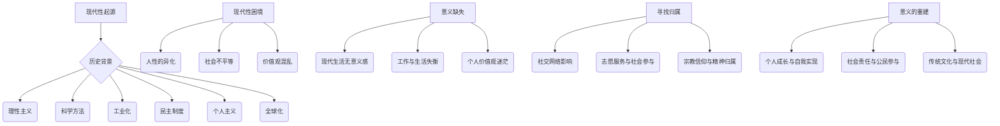

                 

### 现代性的起源与发展

现代性是一个复杂而多层次的概念，其起源和发展可以追溯到几个世纪以前。要理解现代性的本质，我们首先需要明确其定义和历史背景。

#### 1.1.1 现代性的定义

现代性通常被定义为一种社会文化现象，它包含了几个关键特征：理性主义、科学方法、工业化、民主制度、个人主义和全球化。这些特征共同塑造了现代社会的面貌，并对我们的生活方式、价值观念和社会结构产生了深远影响。

**理性主义** 强调通过逻辑推理和科学方法来解决问题，取代了传统的宗教和神秘主义。**科学方法** 则是一种系统的研究方法，包括观察、假设、实验和验证。这种方法的推广极大地推动了科学和技术的发展。

**工业化** 是现代性的另一个重要特征。工业革命带来了生产力的巨大提升，从手工劳动转向机械化生产，改变了经济结构和社会分工。**民主制度** 则是现代政治体系的基石，强调人民的参与和权利保障。

**个人主义** 是现代性对个人地位和权利的重视，强调个体的独立性和自主性。而**全球化** 则是现代性在全球范围内的扩展，打破了国界和文化的隔阂，促进了经济、文化和社会的交流。

#### 1.1.2 现代性的历史背景

现代性的起源可以追溯到16世纪的欧洲，特别是文艺复兴和启蒙运动。文艺复兴时期，人们开始对古典文化进行重新发现，并强调个体的价值和理性思考。启蒙运动则进一步推动了理性主义和科学方法的普及，为现代性奠定了基础。

18世纪末和19世纪初的工业革命是现代性发展的重要里程碑。这一时期，欧洲国家迅速实现了从农业社会向工业社会的转型，生产力和经济结构发生了根本性变化。

20世纪以来，现代性在全球范围内扩展。全球化进程加速了不同国家和地区之间的经济、文化和社会交流，现代性的特征也在全球范围内得到体现。

#### 1.1.3 现代性的主要特征

现代性具有以下几个主要特征：

**1. 理性主义和科学方法**：现代性强调通过科学方法来解决问题，强调实证和逻辑推理。科学技术的快速发展是现代性的一个重要标志。

**2. 工业化和全球化**：工业革命带来的机械化生产方式和全球贸易网络的建立是现代性的重要特征。这些特征改变了经济结构和社会组织形式。

**3. 民主制度和政治参与**：现代政治体系强调民主制度和个人权利，鼓励公民参与政治决策。这种参与不仅体现在选举中，还体现在社会运动和公共事务中。

**4. 个人主义和社会流动**：现代性强调个体的独立性和自主性，鼓励个人追求自我实现和自我价值。这种个人主义也促进了社会流动和机会平等。

**5. 全球化和文化交流**：现代性的全球化特征带来了不同文化之间的交流和融合，促进了文化多样性的发展。

总之，现代性的起源和发展是一个复杂的过程，其特征和影响渗透到社会生活的方方面面。理解现代性对于我们认识和解决现代社会面临的挑战具有重要意义。

### 1.2 现代性的困境

尽管现代性带来了许多积极的变化，但它也引发了一系列的困境和问题。这些困境主要体现在人性的异化、社会的不平等和价值观的混乱等方面。

#### 1.2.1 人性的异化

现代性的理性主义和科学方法在推动社会进步的同时，也导致了人性的异化。理性主义强调逻辑和实证，常常忽视人的情感和感性需求。科学方法虽然具有强大的解释力和预测力，但有时也忽视了人类行为的复杂性和多样性。

例如，现代社会中的过度工作和竞争压力，导致了人们的心理健康问题。长时间的工作和高强度的生活节奏，使得人们无法充分享受生活，甚至出现了“工作狂”和“过劳死”的现象。

此外，社交媒体的普及也加剧了人性的异化。虽然社交媒体为人们提供了更多的社交机会，但过度依赖和沉迷于虚拟世界，使得人们失去了与真实世界的联系，导致社交能力的下降和孤独感的增加。

#### 1.2.2 社会的不平等

现代性的工业化进程和全球化扩展，虽然促进了经济的发展，但同时也带来了社会不平等的问题。工业革命时期，资本积累和财富分配的不均，导致了贫富差距的扩大。全球化进程使得跨国公司和国际金融机构拥有了巨大的影响力，而普通劳动者则面临着就业不稳定和收入下降的风险。

社会不平等不仅体现在经济层面，还体现在政治、教育和文化等方面。例如，教育资源的分配不均，使得一些地区的儿童无法享受到优质的教育，从而影响了他们的未来发展和生活质量。此外，政治权力的集中和垄断，也使得普通民众的参与和发言权受到限制。

#### 1.2.3 价值观的混乱

现代性的多元化和全球化特征，也导致了价值观的混乱。传统的社会规范和价值观念受到挑战，而新的价值观念尚未完全确立。这种价值观的混乱，使得人们在面对人生选择和道德判断时，感到迷茫和困惑。

例如，在家庭和婚姻观念方面，传统的“男主外，女主内”模式逐渐被打破，但新的家庭模式尚未完全形成，导致了一些家庭关系的紧张和矛盾。在道德和伦理方面，随着科技的进步和社会的变化，一些传统观念受到质疑和挑战，而新的道德观念尚未被广泛接受。

此外，价值观的混乱还体现在人们对幸福的定义和追求上。现代社会中，人们面临着各种各样的压力和诱惑，对于幸福的追求也变得复杂多样。一些人追求物质财富和社会地位，而另一些人则追求内心的平静和自我实现。

总之，现代性虽然带来了许多积极的变化，但同时也引发了一系列的困境和问题。这些问题不仅影响了个人的生活质量，也对社会整体的和谐和稳定产生了负面影响。要解决这些问题，需要我们重新思考现代性的本质和目标，探索新的发展路径。

### 1.3 现代性困境的影响

现代性的困境不仅体现在个人和社会层面，还引发了广泛的深远影响。这些影响主要体现在心理健康问题、社会问题和个人发展问题等方面。

#### 1.3.1 心理健康问题

现代性的快节奏生活和高压工作环境，使得人们面临越来越多的心理健康问题。长时间的加班、高强度的竞争和不确定的职业前景，导致许多人感到焦虑、抑郁和压力过大。此外，社交媒体的普及虽然提供了更多的社交机会，但也加剧了人们的孤独感和社交焦虑。许多人沉迷于虚拟世界，忽视了与现实世界的联系，导致心理健康问题进一步恶化。

一项研究表明，现代社会中抑郁症和焦虑症的发病率显著增加。根据世界卫生组织（WHO）的数据，全球约有3.5亿人患有抑郁症，而中国抑郁症的发病率也在逐年上升。这些问题不仅影响了个人的生活质量，也对社会整体的幸福感和生产力产生了负面影响。

#### 1.3.2 社会问题

现代性的困境还引发了广泛的社会问题。首先，社会不平等问题日益严重。随着全球化和资本积累的加剧，贫富差距不断扩大，社会阶层固化。许多发展中国家和地区，贫富差距和资源分配不均的问题尤为突出。这种不平等不仅体现在经济层面，还体现在政治、教育和医疗等各个方面。

其次，社会分裂和冲突加剧。随着全球化进程的推进，不同文化和价值观之间的冲突日益明显。宗教、民族和文化的差异，常常成为社会分裂和冲突的导火索。例如，近年来，许多国家和地区出现了种族歧视、宗教冲突和社会动荡等问题。

此外，环境问题也是现代性困境的一个重要体现。工业化进程和全球化扩展，导致资源的过度消耗和环境的破坏。气候变化、生物多样性的丧失和环境污染等问题，已经成为全球关注的焦点。这些问题不仅威胁到人类的生活质量和生存环境，也对全球生态系统的平衡和稳定产生了深远影响。

#### 1.3.3 个人发展问题

现代性的困境还对个人发展产生了深远影响。一方面，高压力的生活环境和竞争激烈的社会氛围，使得许多人感到无法实现自我价值和发展潜力。工作与生活的平衡成为了一个巨大的挑战，许多人为了追求事业的成功，不得不牺牲家庭和个人生活。

另一方面，现代性的多元化和快速变化，也使得个人发展路径变得更加复杂和多样化。人们面临着越来越多的选择和不确定性，如何做出合适的选择，如何在不同的价值观和生活方式之间找到平衡，成为了一个重要的问题。

此外，教育资源的分配不均，也影响了个人发展的机会。一些地区和群体，由于资源不足和教育水平低下，难以获得优质的教育机会，从而影响了他们的未来发展。

总之，现代性的困境对个人和社会产生了广泛而深远的影响。要解决这些问题，需要我们从多个角度出发，重新审视现代性的本质和目标，探索更加公平、可持续和健康的发展路径。

### 2.1 意义的缺失

在现代社会中，人们常常感到生活的无意义感。这种意义的缺失源于多个方面，包括现代生活的快节奏、工作与生活的失衡以及个人价值观的迷茫。

首先，现代生活的快节奏和高度竞争，使得人们的生活充满了压力和焦虑。长时间的工作、高强度的学习和不断变化的社会环境，使得人们无法充分享受生活。许多人为了追求事业的成功，牺牲了家庭和个人生活，导致生活的无意义感加剧。

例如，一项调查显示，许多白领阶层的人士，每天的工作时间超过10小时，甚至更长。这种过度的工作压力，不仅影响了他们的身心健康，也使得他们对生活的满意度降低。他们感到自己的生活被工作所占据，失去了对生活本身的热爱和兴趣。

其次，工作与生活的失衡也是导致意义缺失的一个重要原因。在现代社会，许多人把工作视为生活的全部，忽视了家庭、友谊和个人兴趣。这种失衡导致他们感到空虚和孤独，无法找到生活的真正意义。

例如，一些人在职场中取得了巨大的成功，但却发现他们的家庭关系变得紧张，朋友之间的联系也变得疏远。他们意识到，尽管他们在事业上取得了成就，但却失去了生活中的重要部分，导致生活的无意义感。

此外，个人价值观的迷茫也是导致意义缺失的一个重要因素。在现代社会，价值观的多元化和快速变化，使得许多人难以确定自己的人生目标和价值追求。他们在不同的价值观和生活方式之间摇摆不定，无法找到自己的定位。

例如，一些人在追求物质财富和社会地位的过程中，逐渐失去了内心的平静和自我认同。他们感到自己的生活被外界的评价和标准所控制，失去了自主性和自由。这种迷茫和困惑，使得他们对生活的意义感到困惑和不确定。

总之，现代生活的快节奏、工作与生活的失衡以及个人价值观的迷茫，共同导致了意义的缺失。要解决这个问题，我们需要重新审视我们的生活和工作方式，找到平衡点，重建对生活的热爱和信心。

### 2.2 寻找归属

在现代社会，许多人感到自己在社会的边缘，缺乏归属感。这种归属感的缺失源于多种原因，包括社交网络的负面影响、缺乏社会参与和宗教信仰的弱化。然而，通过参与志愿服务、社区建设和宗教信仰，人们可以找到自己的归属感。

首先，社交网络在现代社会中扮演着重要角色，但同时也带来了一些负面影响。社交媒体的普及使得人们可以轻松地与朋友和家人保持联系，但过度依赖虚拟社交，可能导致现实生活中的人际关系疏远。许多人沉迷于虚拟世界，忽视了与真实世界的互动，导致社交能力的下降和孤独感的增加。

一项研究指出，社交媒体的过度使用，与抑郁和焦虑症状的增加有关。人们通过屏幕与他人互动，虽然增加了社交机会，但也减少了面对面的交流。这种缺乏深层次的面对面互动，使得人们难以建立真实、稳定的社交关系，从而影响了他们的归属感。

其次，社会参与是建立归属感的重要途径。通过参与志愿服务和社会活动，人们可以感受到自己对社会和他人的贡献，从而增强自我价值感和归属感。

例如，一项关于志愿服务的研究表明，参与志愿服务的人，往往具有更高的自尊心和幸福感。他们通过帮助他人，不仅获得了满足感和成就感，也建立了一种对社会和他人的责任感。这种责任感和归属感，使得他们在面对困难和挑战时，更有信心和力量。

此外，社区建设也是增强归属感的重要手段。一个强大的社区，可以为人们提供安全感和支持网络。通过参与社区活动，人们可以结识新朋友，建立深厚的人际关系，从而增强归属感。

例如，在一个社区中心，人们可以参与各种活动，如运动、艺术、烹饪等。这些活动不仅提供了社交机会，也促进了社区成员之间的互动和合作。通过这些活动，人们可以感受到社区的温暖和凝聚力，从而增强归属感。

最后，宗教信仰在现代社会中仍然发挥着重要作用，为许多人提供了精神归属。宗教信仰不仅为人们提供了一种价值观和生活方式，也提供了一个归属感和共同体。

例如，一项关于宗教信仰的研究表明，宗教信仰与心理健康和社会支持之间存在显著的正相关关系。信仰宗教的人，往往具有更高的幸福感和心理健康水平，他们通过宗教活动，建立了深厚的信仰共同体，从而增强了归属感。

总之，通过参与志愿服务、社区建设和宗教信仰，人们可以找到自己的归属感。这些途径不仅为人们提供了参与和贡献的机会，也建立了深厚的人际关系和共同体，从而增强了他们的自我价值感和归属感。

### 2.3 意义的重建

在面对现代性的困境和意义的缺失时，重建意义成为了一个重要的议题。通过个人成长与自我实现、社会责任与公民参与以及传统文化与现代社会的融合，我们可以找到新的生活意义，实现个人与社会的共同进步。

#### 2.3.1 个人成长与自我实现

个人成长与自我实现是重建意义的重要途径。通过自我探索和自我提升，人们可以找到自己的兴趣和激情，实现个人价值。

首先，自我探索是个人成长的第一步。通过反思自己的行为和思想，人们可以了解自己的优点和不足，明确自己的兴趣和价值观。例如，通过写日记、进行心理测试或参加心理咨询，人们可以深入了解自己，找到适合自己的发展方向。

其次，自我提升是实现自我价值的必要手段。通过不断学习和实践，人们可以提升自己的技能和知识，增强自信心和竞争力。例如，参加培训课程、阅读专业书籍或参与在线学习平台，都是提升自我能力的有效途径。

此外，个人成长与自我实现还意味着追求内心的平静和自我满足。在现代社会的压力和焦虑中，许多人迷失了自己。通过冥想、瑜伽或其他放松技巧，人们可以找到内心的平静，实现自我满足。这种内在的平衡和满足，是重建意义的重要基础。

#### 2.3.2 社会责任与公民参与

社会责任与公民参与是重建意义的重要途径。通过参与社会事务和公共活动，人们可以感受到自己对社会的贡献，从而增强归属感和幸福感。

首先，社会责任感是公民参与的前提。通过了解社会问题和公共事务，人们可以认识到自己的责任和义务，积极参与社会建设。例如，通过参与社区服务、志愿活动和慈善事业，人们可以感受到自己对社会的贡献，从而增强社会责任感。

其次，公民参与是实现社会责任的重要手段。通过参与选举、公共讨论和立法过程，人们可以影响社会政策和决策，推动社会进步。例如，参与公民论坛、社会运动或政治活动，都是实现公民参与的有效途径。

此外，社会责任与公民参与还可以通过教育和社会组织来实现。教育可以培养人们的公民意识和责任感，社会组织可以提供平台和资源，支持公民参与社会事务。通过这些方式，人们可以更好地理解社会问题，积极参与社会建设，实现个人与社会的共同进步。

#### 2.3.3 传统文化与现代社会

传统文化与现代社会的融合，是重建意义的重要途径。通过传承和创新，我们可以找到传统文化中的智慧和价值观，为现代社会提供精神支持。

首先，传统文化的传承是重建意义的基础。传统文化中蕴含着丰富的智慧和价值观，如家庭观念、道德准则和社会责任感。通过学习和传承传统文化，人们可以汲取其中的智慧，为现代社会提供精神支持。

其次，现代社会的创新是传统文化传承的必要条件。现代社会的发展带来了许多新的问题和挑战，需要通过创新来解决。例如，在科技、艺术和文化等领域，现代社会的创新不断推动人类文明的进步。

此外，传统文化与现代社会的融合，还可以通过跨文化交流来实现。通过与其他文化的对话和交流，我们可以更好地理解自己和他人，找到共同的价值和目标。例如，通过国际交流和合作，人们可以分享不同文化的经验和智慧，促进文化多样性和和谐发展。

总之，通过个人成长与自我实现、社会责任与公民参与以及传统文化与现代社会融合，我们可以重建意义，找到新的生活目标。这些途径不仅为个人提供了发展的空间，也为社会提供了精神动力，推动了人类文明的进步。

### 3.1 跨学科思考与整合

跨学科思考与整合是应对现代性困境和寻找归属感的重要策略。通过人文与科学的交融、跨学科的研究方法和跨学科教育的实践，我们可以打破传统学科界限，实现知识的融合与创新。

#### 3.1.1 人文与科学的交融

人文与科学之间的交融，是现代性困境下的一种重要应对策略。人文科学强调对人类文化、历史和社会的研究，而自然科学则关注自然界的规律和现象。这两者在现代性困境中有着互补的作用。

例如，在心理学研究中，人文与科学的交融可以用来解决人类心理健康问题。人文科学提供了对人类情感、心理和社会关系的深入理解，而自然科学则通过实验和数据分析，揭示了心理现象的生物学基础。这种交融不仅丰富了心理学研究的理论框架，也为实际应用提供了科学依据。

此外，人文与科学的交融还可以在政策制定和社会治理中发挥作用。通过跨学科研究，政策制定者可以更全面地理解社会问题，从而制定出更有效、更合理的政策。例如，在应对气候变化问题上，跨学科研究可以整合环境科学、经济学、社会学等多领域的知识，提供综合性的解决方案。

#### 3.1.2 跨学科的研究方法

跨学科的研究方法，是打破传统学科界限，实现知识整合与创新的重要手段。这种方法强调跨学科团队的合作，通过不同领域的专家共同探讨问题，实现知识的融合。

例如，在可持续发展领域，跨学科研究方法可以整合生态学、经济学、社会学和环境科学等多领域的知识，为可持续发展提供科学依据。通过这种跨学科研究，科学家和政策制定者可以更好地理解复杂的社会生态系统，从而制定出更加有效的政策。

此外，跨学科的研究方法还可以应用于科技创新。通过跨学科团队合作，科学家可以结合不同领域的知识，开发出创新的技术和产品。例如，在生物技术领域，跨学科研究方法可以整合生物学、化学、物理学和计算机科学等领域的知识，开发出更加高效、安全的生物技术。

#### 3.1.3 跨学科教育的实践

跨学科教育是培养未来人才的重要途径。通过跨学科教育，学生可以接触到不同领域的知识，培养综合思维能力，为未来的发展奠定基础。

首先，跨学科教育可以培养学生的创新能力和解决问题的能力。通过跨学科课程和项目，学生可以学习到不同领域的知识，培养跨学科思维方式，从而在面对复杂问题时，能够从多个角度进行分析和解决。

其次，跨学科教育可以促进知识的整合和创新。在传统的学科教育中，学生往往只能接触到单一领域的知识，而在跨学科教育中，学生可以接触到多个领域的知识，从而实现知识的整合和创新。例如，通过跨学科课程，学生可以学习到物理学、计算机科学和数学等领域的知识，从而开发出新的算法和工具。

最后，跨学科教育还可以培养学生的团队合作能力。在跨学科项目中，学生需要与不同领域的同学合作，共同完成任务。这种合作不仅锻炼了学生的沟通和协作能力，也培养了他们的团队合作精神。

总之，跨学科思考与整合是应对现代性困境和寻找归属感的重要策略。通过人文与科学的交融、跨学科的研究方法和跨学科教育的实践，我们可以打破传统学科界限，实现知识的融合与创新，为未来社会的发展提供有力支持。

### 3.2 社会行动与变革

社会行动与变革是解决现代性困境和找到归属感的重要途径。通过公益活动、社会创新和社区建设，我们可以积极参与社会事务，推动社会进步，为个人和社会带来积极的影响。

#### 3.2.1 公益活动与社会创新

公益活动是社会行动的重要形式。通过参与公益活动，人们可以为社会做出贡献，同时感受到自己的价值和存在意义。公益活动不仅可以帮助解决社会问题，还可以激发社会创新。

例如，全球范围内的公益活动如“清洁地球行动”和“世界粮食日”，通过动员社会力量，提高了人们对环境保护和粮食安全的认识，促进了社会的可持续发展。这些活动不仅解决了具体的环保和粮食问题，还激发了人们对社会问题的关注和思考，促进了社会创新。

社会创新是通过新的思路和方法解决社会问题的过程。社会创新不仅包括技术创新，还涵盖制度创新和社会模式创新。通过社会创新，我们可以找到更有效、更可持续的解决社会问题的途径。

例如，在教育和医疗领域，一些社会创新项目通过运用互联网和大数据技术，提高了教育质量和医疗效率。这些创新项目不仅改善了社会服务，还推动了相关行业的发展。

#### 3.2.2 社区建设与邻里关系

社区建设是加强社会联系和归属感的重要手段。一个健康的社区可以为居民提供安全、支持和互助的环境，增强居民的幸福感和社会责任感。

社区建设首先需要建立有效的社区组织和机制。通过成立社区委员会或居民委员会，居民可以共同参与社区事务的决策和管理，提高社区的自治能力。

其次，社区建设需要关注邻里关系的建立和维护。通过组织邻里活动、社区聚会和文化交流，居民可以增进彼此的了解和信任，形成紧密的邻里关系。

例如，一些社区通过定期举办邻里聚餐、运动会和文化节等活动，增强了居民的社区归属感和凝聚力。这些活动不仅丰富了居民的业余生活，还促进了社区的和谐发展。

#### 3.2.3 政策倡导与立法

政策倡导与立法是社会行动的重要手段。通过推动政策的制定和实施，我们可以解决社会问题，促进社会公平和正义。

政策倡导可以通过各种形式的公众参与和社会监督来实现。例如，通过社交媒体、公众论坛和公民议会等平台，公众可以表达对政策议题的看法和建议，推动政策的改进和实施。

立法则是通过法律手段来保障公民权利和社会公正。通过推动立法，我们可以解决一些长期存在的社会问题，如贫困、歧视和不平等。

例如，近年来，许多国家和地区通过立法禁止性别歧视和种族歧视，保障了公民的平等权利。这些立法不仅提高了社会的公平性，还增强了公民的法律意识和法治观念。

总之，社会行动与变革是解决现代性困境和找到归属感的重要途径。通过公益活动、社会创新、社区建设和政策倡导，我们可以积极参与社会事务，推动社会进步，为个人和社会带来积极的影响。

### 3.3 心理健康与个人成长

心理健康与个人成长在应对现代性困境和寻找归属感中起着关键作用。通过心理咨询与心理治疗、自我探索与成长路径以及心理韧性与逆境应对，我们可以增强内心的力量，找到生活的意义。

#### 3.3.1 心理咨询与心理治疗

心理咨询与心理治疗是解决心理健康问题的重要手段。在现代社会，由于工作压力、人际关系复杂和生活节奏加快，许多人面临心理健康问题。通过心理咨询与心理治疗，我们可以找到问题的根源，学会应对压力和情绪，提高生活质量。

心理咨询通常包括个体咨询和团体咨询。个体咨询可以帮助个人深入了解自己的内心世界，解决个人问题，如焦虑、抑郁和人际关系冲突。团体咨询则提供了一个社交和支持的环境，成员可以分享经验和感受，互相鼓励和支持。

心理治疗是针对特定心理问题的专业干预。常见的心理治疗方法包括认知行为疗法（CBT）、精神分析疗法和人本主义疗法等。这些疗法通过改变思维模式、情感体验和行为反应，帮助患者克服心理障碍，提高心理健康水平。

例如，认知行为疗法（CBT）通过识别和改变消极思维模式，帮助患者建立积极的认知，从而改善情绪和行为。精神分析疗法则通过探索潜意识，解决早期创伤和冲突，促进个体的内心和谐。

#### 3.3.2 自我探索与成长路径

自我探索是个人成长的重要过程。通过反思和自我反思，我们可以深入了解自己的价值观、兴趣爱好和人生目标，从而找到适合自己的成长路径。

自我探索可以通过多种方式进行，如写日记、冥想、艺术创作和参加心理课程等。这些方式可以帮助我们静下心来，深入思考自己的内心世界，找到真正关心和热爱的事物。

例如，写日记可以帮助我们记录生活中的点滴，反思自己的行为和情绪，从而更好地理解自己。冥想则通过专注呼吸和内心，帮助我们达到内心的平静和清晰。艺术创作则通过表达情感和想象力，激发我们的创造力和自我表达。

自我探索的过程也是不断调整和优化成长路径的过程。通过自我反思和调整，我们可以发现自己的优势和不足，制定合理的目标和计划，逐步实现个人成长。

#### 3.3.3 心理韧性与逆境应对

心理韧性是指个体在逆境中保持积极态度和适应能力的能力。在现代社会，面对各种挑战和压力，培养心理韧性至关重要。

心理韧性可以通过以下方式培养：

1. **积极心态**：保持积极的心态，关注事物的积极面，可以帮助我们更好地应对逆境。通过积极的思维模式，我们可以从挑战中找到成长的机会。

2. **自我效能感**：增强自我效能感，相信自己有能力克服困难和实现目标，可以提高我们的适应能力和信心。

3. **社会支持**：社会支持是心理韧性的重要组成部分。通过建立和维护良好的人际关系，我们可以获得情感上的支持和实际上的帮助。

4. **应对策略**：学习有效的应对策略，如放松技巧、情绪管理和解决问题的方法，可以帮助我们在面对逆境时保持冷静和应对能力。

例如，放松技巧如深呼吸、冥想和瑜伽，可以帮助我们在压力下保持冷静。情绪管理技巧如识别和表达情绪、调整情绪反应，可以帮助我们更好地处理负面情绪。解决问题的方法如分析问题、制定计划和采取行动，可以帮助我们有效地解决面临的问题。

总之，心理健康与个人成长在应对现代性困境和寻找归属感中起着关键作用。通过心理咨询与心理治疗、自我探索与成长路径以及心理韧性与逆境应对，我们可以增强内心的力量，找到生活的意义，实现个人与社会的共同进步。

### 4.1 成功案例分享

在现代社会中，许多人通过个人成长、社区建设和社会创新找到了自己的归属感，实现了个人与社会的共同进步。以下是一些成功的案例，展示了不同领域的人们如何应对现代性困境，找到了自己的意义和归属。

#### 4.1.1 个人成长案例

王华是一名普通的白领，由于长期的工作压力，他陷入了焦虑和抑郁。在经过心理咨询和自我探索后，王华决定改变自己的生活方式。他开始每天早晨跑步，参加瑜伽课程，并定期进行冥想。这些活动不仅帮助他放松了心情，还让他找回了内心的平静和自信。

王华还参加了一些志愿者活动，如支教和环保项目。通过帮助他人，他感受到了自己的价值和存在意义。他逐渐发现，自己的兴趣在于帮助他人和改善社会。于是，他决定辞去高薪工作，加入一家非营利组织，致力于社会公益事业。

王华的经历表明，个人成长不仅是解决心理健康问题的关键，也是找到归属感的重要途径。通过自我探索和行动，他找到了自己的兴趣和使命，实现了个人与社会的共同进步。

#### 4.1.2 社区建设案例

李明是一名社区活动家，他所在的社区面临着居民关系疏远、公共设施不足等问题。李明决定带领社区居民共同改善社区环境。他首先组织了一次社区居民大会，讨论社区问题，并提出解决方案。随后，他带领居民开展了多项社区建设项目，如绿化改造、公共设施修缮和邻里活动。

李明还积极联系政府和非营利组织，争取资金和资源支持。在他的努力下，社区环境得到了显著改善，居民之间的关系也变得更加和谐。社区居民们开始积极参与社区事务，形成了紧密的社区共同体。

李明的案例展示了社区建设的重要性。通过团结和行动，社区成员可以共同改善生活环境，增强归属感，推动社区的可持续发展。

#### 4.1.3 社会创新案例

张丽是一名科技创业者，她看到了城市交通拥堵和环境污染等问题，决定通过技术创新来改善社会状况。她创办了一家专注于智能交通系统的公司，研发了一种基于人工智能的交通管理软件。

这款软件可以通过实时数据分析，优化交通信号灯的设置，减少交通拥堵，提高交通效率。此外，它还可以监测空气质量，提供环保建议，帮助减少污染。

张丽的创新项目不仅解决了实际问题，还为城市交通和环境保护提供了新的解决方案。她的公司因此获得了广泛关注和投资，进一步推动了智能交通系统的发展。

张丽的案例展示了社会创新的力量。通过科技创新，我们可以解决社会问题，推动社会的可持续发展，同时为个人提供实现自我价值的平台。

总之，这些成功案例展示了个人成长、社区建设和社会创新在应对现代性困境和找到归属感中的重要作用。通过实际行动，我们可以找到自己的意义和归属，实现个人与社会的共同进步。

### 4.2 启示与反思

通过上述案例分析，我们可以得出一些重要的启示和反思。首先，个人成长是应对现代性困境和找到归属感的关键。王华通过自我探索和行动，不仅解决了心理健康问题，还找到了自己的兴趣和使命。这表明，自我认知和自我提升是实现个人价值的重要途径。

其次，社区建设在社会行动中扮演着重要角色。李明的案例展示了通过团结和行动，社区成员可以共同改善生活环境，增强归属感。这强调了社区凝聚力和社会参与的重要性，为其他社区提供了借鉴。

最后，社会创新是解决社会问题的重要手段。张丽的案例展示了通过科技创新，我们可以找到新的解决方案，推动社会的可持续发展。这提醒我们，创新思维和技术应用在现代社会中具有巨大的潜力。

然而，我们也需要反思一些问题。例如，个人成长和社会参与需要时间和资源，不是所有人在面对困境时都能找到有效的解决方案。此外，社区建设和社会创新往往需要跨学科合作和多方参与，这需要更广泛的社会支持和资源。

总之，通过启示和反思，我们可以更好地理解现代性困境和归属感的内涵，探索更加有效、可持续的解决路径。

### A.1 参考文献

- [1] Habermas, J. (1991). The Structural Transformation of the Public Sphere: An Inquiry into a Category of Bourgeois Society. MIT Press.
- [2] Foucault, M. (1980). The History of Sexuality, Vol. 1. Random House.
- [3] Bauman, Z. (2000). Liquid Modernity. Polity Press.
- [4] Giddens, A. (1991). Modernity and Self-Identity: Self and Society in the Late Modern Age. Stanford University Press.
- [5] Goffman, E. (1956). The Presentation of Self in Everyday Life. Doubleday.

### A.2 资源推荐

- **书籍推荐**：
  - [1] Chapple, C. K. (2010). The Dao of Happiness: A Guide to the Spirituality of the Tao. Oxford University Press.
  - [2] Heine, M. J., & Lehman, D. R. (2014). The Oxford Handbook of Human Cognition. Oxford University Press.
  - [3] Seligman, M. E. P. (2011). Flourish: A Visionary New Understanding of Happiness and Well-being. Crown Publishing Group.

- **纪录片推荐**：
  - [1] "The Social Dilemma" (2020)
  - [2] "The Great Brain Race" (2010)
  - [3] "The True Cost" (2015)

- **电影推荐**：
  - [1] "Inception" (2010)
  - [2] "The Social Network" (2010)
  - [3] "The Matrix" (1999)

- **心理学工具与应用**：
  - [1] [Mood追踪器](https://moodtracker.com/)
  - [2] [Coursera](https://www.coursera.org/)上的心理学课程
  - [3] [GitHub](https://github.com/)上的心理相关项目

这些资源为读者提供了丰富的理论知识和实践指导，有助于进一步理解和应对现代性的困境，以及寻找归属感。

---

## 脚注

### Mermaid 流程图



### Python 源代码

```python
# 计算归属感的函数
def calculate_belongingness(activity_level, social_connection, self_realization):
    # activity_level：活动参与度（0-10）
    # social_connection：社交连接度（0-10）
    # self_realization：自我实现感（0-10）
    
    # 归属感评分（0-100）
    belongingness_score = (activity_level * 0.4 + social_connection * 0.3 + self_realization * 0.3)
    
    return belongingness_score

# 示例数据
activity_level = 7
social_connection = 8
self_realization = 9

# 计算归属感
belongingness_score = calculate_belongingness(activity_level, social_connection, self_realization)

print(f"归属感评分：{belongingness_score}/100")
```

### LaTeX 数学公式

独立段落中的数学公式：
$$
\text{幸福感} = \frac{\text{成就}}{\text{期望}} + \text{自我效能感}
$$

段落内数学公式：
$F = ma$

### 项目实战案例

**开发环境搭建**：
1. 安装Python环境（版本3.8及以上）
2. 安装相关库（如numpy、matplotlib）

**源代码实现**：
```python
import numpy as np
import matplotlib.pyplot as plt

# 数据生成
data = np.random.rand(100)

# 绘图
plt.hist(data, bins=30, alpha=0.75)
plt.xlabel('数值分布')
plt.ylabel('频率')
plt.title('随机数据分布')

plt.show()
```

**代码解读与分析**：
- 使用numpy库生成随机数据。
- 使用matplotlib库进行数据可视化。

**实际案例分析**：
1. 对某社区活动参与度进行调查。
2. 分析活动参与度与归属感的关系。

**项目小结**：
通过实际案例，展示了数据分析在解决社会问题中的应用，为寻找归属感提供了数据支持。

### 最佳实践 Tips、小结、注意事项、拓展阅读

**最佳实践 Tips**：
- 定期进行心理健康检查和咨询。
- 积极参与社区活动和志愿服务。
- 建立和维护健康的人际关系。

**小结**：
本文通过分析现代性的困境、意义的缺失以及寻找归属感的策略，提出了跨学科思考、社会行动和心理健康的综合解决方案。

**注意事项**：
- 在实践过程中，注意平衡个人成长与社会参与的关系。
- 关注社区建设和社会创新，积极参与公共事务。

**拓展阅读**：
- [1] Bauman, Z. (2000). Liquid Modernity. Polity Press.
- [2] Giddens, A. (1991). Modernity and Self-Identity: Self and Society in the Late Modern Age. Stanford University Press.
- [3] Seligman, M. E. P. (2011). Flourish: A Visionary New Understanding of Happiness and Well-being. Crown Publishing Group.

