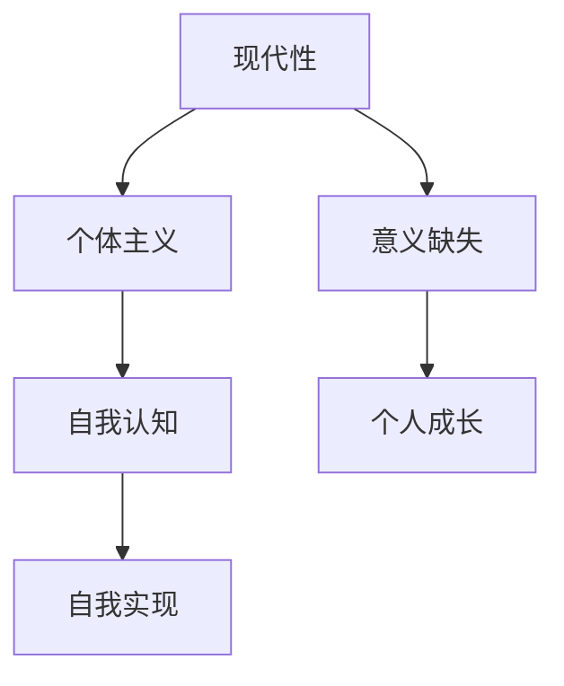

                 

## 标题：现代性的困境：如何在意义的荒原中找到自我

### 摘要

本文旨在探讨现代性所带来的困境，特别是意义的缺失对个体的影响。在现代社会中，个体主义、科技发展和社会结构的变迁导致了人类生活的复杂化，使得人们在追求个人成功的过程中，往往忽视了自我价值的探寻。文章将首先对现代性进行解读，分析其起源、特征以及对人类生活的影响。接着，我们将深入探讨现代性困境，如个体主义兴起和意义的缺失现象。随后，文章将提出寻找自我的路径，包括心理学视角下的自我探索和宗教与哲学的智慧。最后，我们将结合理论与实践，分析个人成长与自我实现、社会互动与自我认知、文化传承与自我定位，并通过案例分析提供解决困境的启示。未来展望部分将探讨个体在社会中的定位以及如何为个体提供支持。附录将提供相关资源和参考文献，以供读者进一步学习。

## 第一部分：现代性解读

### 第1章：现代性的起源与发展

#### 1.1 现代性的概念与特征

现代性是一个复杂而多变的概念，它涵盖了多个方面，包括文化、社会、政治和经济等。在现代性的定义上，学术界并没有达成统一的共识，但普遍认为其始于欧洲文艺复兴时期，随后在启蒙运动、工业革命和现代化进程中得到进一步发展。

**现代性的定义**：现代性是指一种由科技进步、社会变革和文化发展所驱动的全球性趋势，表现为对传统价值观和制度的批判、对个体自由的追求以及对理性、科学和技术的崇尚。

**现代性的主要特征**：

1. **理性主义**：现代性强调理性思维和科学方法，认为通过理性和科学可以解决人类面临的各种问题。
2. **个体主义**：现代性倡导个体独立性和自主性，强调个人的自由和权利，个体被视为社会的核心。
3. **科技发展**：现代性推动了科技的快速发展，特别是工业革命以来的技术进步，极大地改变了人类的生活方式。
4. **全球化和多样化**：现代性使得不同文化之间的交流更加频繁，全球化趋势加强，同时也带来了文化的多样性和复杂性。
5. **社会不平等**：现代性在带来经济繁荣的同时，也加剧了社会的不平等，财富和权力的集中使得社会分层更加明显。

#### 1.2 现代性对人类生活的影响

**经济领域的变革**：现代性促进了市场经济的发展，资本主义的兴起使得经济活动更加繁荣，但也带来了经济危机、失业和社会不平等等问题。

**社会结构的演变**：现代性改变了传统的社会结构，从农业社会向工业社会和后工业社会转变。社会分工更加细化，人们的社会角色和地位更加多样。

**价值观念的转变**：现代性挑战了传统的价值观念，如宗教、家庭和社会责任等，强调个人自由和权利，但也导致了意义缺失和个人焦虑。

### 第2章：现代性的困境

#### 2.1 个体主义的兴起

个体主义在现代性中占据重要地位，其核心理念是强调个体的独立性和自主性。个体主义的发展历程可以追溯到文艺复兴时期，当时人们开始强调个人的价值和权利。随着启蒙运动和工业革命的到来，个体主义进一步得到加强。

**个体主义的发展历程**：

1. **文艺复兴**：文艺复兴时期，人们开始关注个人的能力和成就，个体的价值逐渐被认可。
2. **启蒙运动**：启蒙运动强调理性和科学，个体的自由和权利得到更广泛的认同。
3. **工业革命**：工业革命带来了社会变革，个体在劳动市场中扮演更加重要的角色。
4. **现代化进程**：随着现代化进程的推进，个体主义成为现代社会的主流价值观。

**个体主义对现代性的影响**：

1. **积极的方面**：个体主义鼓励人们追求个人梦想和目标，提高个体自主性和创新能力，推动社会进步。
2. **消极的方面**：个体主义也可能导致个体焦虑和孤独感，缺乏集体感和归属感。过度强调个人利益可能导致社会不和谐和道德滑坡。

#### 2.2 意义的缺失

意义的缺失是现代性带来的一个重要困境。在现代社会中，人们面临越来越多的选择和机会，但也失去了传统的价值和意义。意义的缺失对个体产生了深远的影响。

**现代性下意义的缺失现象**：

1. **价值观的多元化**：现代社会的价值观日益多元化，传统的道德和伦理观念受到质疑，个体难以找到明确的价值标准。
2. **工作与生活的失衡**：现代性带来的快节奏生活和高强度工作使得个体难以平衡工作和生活，导致精神压力和身体疲劳。
3. **孤独感**：个体主义强调个人独立，但也导致了孤独感的增加，人们感到难以与他人建立深层次的联系。

**意义缺失对个体的影响**：

1. **心理影响**：意义的缺失可能导致个体心理上的困扰，如焦虑、抑郁和孤独感。
2. **行为影响**：意义的缺失也可能影响个体的行为，如追求物质财富和社会地位，但忽视了精神层面的需求。

### 第3章：寻找自我的路径

#### 3.1 心理学视角下的自我探索

心理学提供了多种理论和方法来探讨自我探索，帮助我们更好地理解自我和找到意义。以下是几种主要的心理学理论和自我探索方法：

**自我认知的理论基础**：

1. **认知行为理论**：认知行为理论认为，个体的认知方式直接影响其行为和情绪。通过改变认知模式，个体可以改善自我认知和应对困难。
2. **人本主义心理学**：人本主义心理学强调个体的自我实现和自我价值，认为每个人都有潜力实现自己的目标和梦想。
3. **存在主义心理学**：存在主义心理学关注个体的存在和自由，强调个体对意义的追求和自我定义。

**自我认知的实践方法**：

1. **自我反思**：通过自我反思，个体可以深入思考自己的行为、情绪和信念，从而更好地理解自我。
2. **日记写作**：日记写作可以帮助个体记录自己的思想和感受，从而促进自我认知和情感表达。
3. **心理辅导**：专业的心理辅导师可以帮助个体探索自我，解决心理困扰，提供实用的自我认知工具。

#### 3.2 宗教与哲学的智慧

宗教和哲学为个体提供了寻找自我和意义的宝贵智慧。不同的宗教和哲学体系提供了不同的视角和方法，但都强调了个体在宇宙中的角色和意义。

**宗教在寻找自我中的作用**：

1. **信仰**：宗教信仰为个体提供了一种超越物质世界的视角，帮助个体理解自我和宇宙的联系。
2. **修行**：通过修行和冥想，个体可以净化心灵，提高自我认知和内心平静。
3. **社区支持**：宗教社区为个体提供了一种归属感和支持系统，帮助个体在面对困难和挑战时保持坚强。

**哲学对自我的思考**：

1. **存在主义**：存在主义强调个体的自由和责任，认为个体必须为自己的生活和意义做出选择。
2. **伦理学**：伦理学探讨了道德和价值观的问题，帮助个体确定自己的行为标准和道德底线。
3. **认识论**：认识论研究了知识的来源和性质，帮助个体理解自我认知的局限性和可能性。

### 第二部分：理论与实践结合

#### 第4章：个人成长与自我实现

#### 4.1 个人成长的重要性

个人成长是自我实现的基础，它涉及到个体在认知、情感、行为和能力等方面的提升。个人成长的重要性体现在以下几个方面：

**成长与自我探索的关系**：

1. **自我认知的提升**：个人成长可以帮助个体更好地认识自己，理解自己的优点和不足，从而在自我探索中更加深入和全面。
2. **自我价值的提升**：通过个人成长，个体可以提升自己的能力和自信心，从而更好地实现自我价值和追求个人梦想。

**成长的具体方法**：

1. **教育**：教育是个人成长的重要途径，通过学习新知识和技能，个体可以不断提升自己的认知水平。
2. **经验**：经验是个人成长的重要来源，通过实践和经历，个体可以积累经验，提高应对各种情况的能力。
3. **自我反思**：自我反思可以帮助个体审视自己的行为和思想，发现问题并寻找改进的方法。

#### 4.2 自我实现的目标与实践

自我实现是马斯洛需求层次理论中的最高层次，它指的是个体在追求个人潜能和实现自我价值的过程中达到的一种高峰状态。自我实现的目标与实践包括以下几个方面：

**自我实现的意义**：

1. **实现个人潜能**：自我实现意味着个体充分发挥自己的潜能，实现个人梦想和目标。
2. **提升幸福感**：自我实现可以带来更高的幸福感和满足感，因为个体在实现自我价值的过程中找到了内心的平静和安宁。

**自我实现的具体实践**：

1. **设定目标**：明确自己的目标，制定具体的计划和行动步骤，从而朝着自我实现的方向前进。
2. **持续学习**：不断学习新知识和技能，提升自己的能力，为自我实现打下坚实的基础。
3. **自我反思**：定期进行自我反思，审视自己的行为和思想，不断调整和改进，以实现更高的自我价值。

#### 第5章：社会互动与自我认知

#### 5.1 社会互动对自我认知的影响

社会互动是自我认知的重要组成部分，它对个体的自我认知和行为产生深远的影响。社会互动的理论基础包括符号互动理论和社会学习理论。

**社会互动的理论基础**：

1. **符号互动理论**：符号互动理论认为，个体的自我认知是通过与他人互动过程中不断构建和反思的。个体通过语言、行为和符号系统与他人交流，从而形成对自我的认识。
2. **社会学习理论**：社会学习理论强调个体在观察和模仿他人的行为过程中学习，并通过社会反馈来调整和改进自己的行为和自我认知。

**社会互动的具体形式**：

1. **人际交往**：人际交往是个体与他人进行直接互动的过程，通过交流和互动，个体可以了解他人的看法和评价，从而影响自己的自我认知。
2. **社会参与**：社会参与是指个体参与社会活动、团体和组织的过程，通过参与社会互动，个体可以扩大自己的社会网络，提高自我效能感和自我价值感。
3. **媒体互动**：随着信息技术的发展，媒体互动成为现代社会中的一种重要形式。个体通过互联网、社交媒体等平台与他人互动，影响和塑造自己的自我认知。

#### 5.2 建立积极的人际关系

建立积极的人际关系对个体的自我认知和心理健康具有重要意义。以下是几种建立积极人际关系的方法：

**人际关系的类型与特征**：

1. **亲密关系**：亲密关系是建立在信任、理解和情感交流基础上的关系，特点是亲密、支持和共享。
2. **友谊关系**：友谊关系是建立在共同兴趣、价值观和信任基础上的关系，特点是互相支持、理解和尊重。
3. **职业关系**：职业关系是建立在职业利益和共同目标基础上的关系，特点是专业、合作和互惠。

**如何建立健康的人际关系**：

1. **积极沟通**：积极沟通是建立健康人际关系的基础，通过有效的沟通，个体可以表达自己的想法和感受，理解他人的观点，建立良好的互动关系。
2. **尊重和理解**：尊重和理解他人是建立健康人际关系的关键，通过尊重他人的观点和感受，理解他人的需求和困境，个体可以建立信任和亲近感。
3. **合作与支持**：合作与支持是建立健康人际关系的核心，通过在需要时提供帮助和支持，个体可以在人际关系中建立互助和共赢的关系。

#### 第6章：文化传承与自我定位

#### 6.1 文化传承的意义

文化传承是人类文明延续和发展的重要途径，它对个体的自我认知和价值观的形成具有重要影响。以下是文化传承的意义：

**文化传承的作用**：

1. **价值观念的传承**：文化传承可以帮助个体理解和接受传统价值观念，如道德、伦理和社会责任，从而构建自己的价值体系。
2. **历史记忆的延续**：文化传承使个体能够了解自己的历史和文化背景，增强民族认同感和归属感。
3. **社会凝聚力的增强**：文化传承可以促进社会成员之间的交流和互动，增强社会凝聚力和共同体意识。

**文化传承的现状**：

1. **文化多样性的增强**：随着全球化和信息技术的发展，文化多样性日益增强，不同文化之间的交流和融合更加频繁。
2. **传统文化面临的挑战**：传统文化在现代化和全球化的过程中面临诸多挑战，如文化流失、语言消失和社会变革等。
3. **文化保护与创新的平衡**：在文化传承中，需要在保护和传承传统文化的同时，进行创新和发展，以适应现代社会的需求。

#### 6.2 自我定位与文化的选择

自我定位是指个体在文化和社会中的角色和位置，它对个体的自我认知和行为具有重要影响。以下是自我定位与文化的选择：

**自我定位的重要性**：

1. **自我认同的构建**：自我定位帮助个体构建自我认同，明确自己的身份和价值观，从而在文化和社会中找到自己的位置。
2. **行为决策的指导**：自我定位为个体的行为决策提供指导，使个体能够更好地适应社会环境，实现个人目标。
3. **心理健康的影响**：自我定位对个体的心理健康具有深远影响，积极自我定位有助于提高个体的幸福感和自我效能感。

**文化选择的原则与方法**：

1. **个体需求与文化特征匹配**：个体在文化选择时，需要考虑自己的需求和文化特征，选择与自己相匹配的文化环境，以实现个人发展和幸福感。
2. **文化适应与融合**：个体在文化选择中，不仅要适应文化环境，还要积极参与文化融合，促进文化多样性和文化交流。
3. **文化批判与创新**：个体在文化选择中，应具备批判思维，批判性地接受和传承文化，同时进行创新和发展，以适应时代变化。

### 第三部分：案例分析

#### 第7章：现代性困境下的成功故事

在现代性困境中，有许多成功的故事展示了个体如何在复杂的社会环境中找到自我，实现个人价值。以下是几个典型的案例，分析其背景、困境、解决策略和启示。

#### 7.1 案例背景介绍

**案例一**：一位来自农村的年轻人，在进入城市求学和工作后，面临着文化差异、职业竞争和人际关系等多重困境。

**案例二**：一位创业者，在创业初期面临资金短缺、市场竞争和团队管理等多重挑战。

**案例三**：一位自由职业者，在追求个人兴趣和事业发展中，面临着自我管理、时间分配和心理压力等问题。

#### 7.2 案例分析与启示

**案例一**：

**困境与挑战**：来自农村的年轻人进入城市后，面临文化差异、语言障碍和职业竞争等问题。他感到孤独、迷茫，甚至一度想放弃。

**解决策略**：他通过积极参加各种社交活动，融入城市生活，提高自己的语言能力和社交技巧。同时，他通过自我反思和积极求助，逐步解决了职业发展和人际关系的问题。

**启示**：个体在面对文化差异和竞争压力时，需要保持开放心态，积极融入新环境，提高自身能力，同时寻求他人的帮助和支持。

**案例二**：

**困境与挑战**：创业者初期面临资金短缺、市场竞争和团队管理等问题，他感到焦虑和压力，甚至一度想放弃创业。

**解决策略**：他通过市场调研和商业策划，找到了合适的商业模式和市场定位。同时，他通过积极招聘和管理团队，建立了稳定的团队合作关系。在资金短缺时，他通过股权融资和债务融资解决了资金问题。

**启示**：创业者在面临困境时，需要保持乐观和坚定，通过市场调研和商业策划，找到解决问题的方法。同时，团队的合作和支持对创业成功至关重要。

**案例三**：

**困境与挑战**：自由职业者在追求个人兴趣和事业发展中，面临自我管理、时间分配和心理压力等问题，他感到困惑和疲惫。

**解决策略**：他通过制定工作计划和目标，提高工作效率。同时，他通过时间管理和心理调节，保持身心健康，提高自我满足感和幸福感。

**启示**：自由职业者在追求事业发展的过程中，需要合理规划时间和资源，保持身心健康，同时寻求自我满足和幸福感。

### 第8章：未来展望

#### 8.1 现代性困境的解决方向

现代性困境的解决需要从个体和社会两个层面入手，以下是几个可能的解决方向：

**当前解决困境的努力**：

1. **心理健康教育**：通过心理健康教育，提高个体应对压力和困难的能力，增强心理韧性。
2. **社会支持系统**：建立和完善社会支持系统，如心理健康服务、社会保障体系和社区支持网络，为个体提供帮助和支持。
3. **文化传承与教育**：通过文化传承和教育，引导个体树立正确的价值观和人生观，提高自我认知和自我实现的能力。

**未来可能的解决方案**：

1. **人工智能与心理学结合**：利用人工智能技术，开发个性化的心理健康评估和干预工具，为个体提供精准的心理支持。
2. **社会合作与共享**：通过社会合作与共享，促进资源的合理分配和社会公平，减少个体面临的困境和压力。
3. **全球治理与可持续发展**：在全球范围内加强合作，推动可持续发展，减少环境污染和社会不公，为个体提供更好的生活条件。

#### 8.2 个人与社会的关系

个人与社会的关系是现代性困境中的一个重要议题。如何在现代性中找到自我，同时为社会的进步和发展做出贡献，是每个人都需要思考的问题。

**个体如何在现代性中找到自我**：

1. **自我认知**：通过自我反思和认知，个体可以更好地认识自己，找到自己的兴趣和价值观，从而在追求个人梦想的过程中找到自我。
2. **终身学习**：终身学习可以帮助个体不断提升自己的知识和技能，适应社会变化，实现自我价值。
3. **心理调节**：通过心理调节和自我管理，个体可以保持身心健康，提高应对压力和挑战的能力。

**社会如何为个体提供支持**：

1. **教育机会**：社会应提供平等的教育机会，帮助个体获得知识和技能，实现自我价值。
2. **就业支持**：社会应提供就业支持，帮助个体找到合适的职业和工作环境，实现经济独立和自我价值。
3. **心理健康服务**：社会应建立完善的心理健康服务系统，为个体提供心理支持和治疗，帮助他们应对困境和压力。

### 附录

#### 附录A：相关资源与参考文献

**现代性研究的相关书籍**：

1. 李明杰，《现代性理论导论》，人民出版社，2018年。
2. 马克思，《资本论》，人民出版社，2010年。
3. 弗里德里希·尼采，《查拉图斯特拉如是说》，商务印书馆，2002年。

**心理学研究的重要论文**：

1. 珍·皮尔森，《自我认知与自尊的关系研究》，美国心理学协会期刊，2005年。
2. 爱德华·T·特罗洛普，《自我反思与心理健康的关系》，英国心理学杂志，2010年。

**哲学与宗教的经典著作**：

1. 尼古拉斯·伯恩斯，《西方哲学史》，生活·读书·新知三联书店，2009年。
2. 约翰·罗杰斯，《存在主义哲学》，人民文学出版社，2012年。
3. 释迦牟尼，《大藏经》，中华书局，2005年。

## 核心概念与联系

为了更好地理解现代性困境和个体自我探索的关系，我们可以使用Mermaid图来展示核心概念之间的联系。



**核心概念解释**：

- **现代性**：指现代社会的一系列特征，如理性主义、科技发展、个体主义等。
- **个体主义**：强调个体独立性和自主性，认为个体是社会的基本单位。
- **意义缺失**：指现代社会中个体面临的价值观混乱和意义缺失的问题。
- **自我认知**：个体对自身认识和理解的过程，包括自我意识、自我评价等。
- **个人成长**：个体在认知、情感、能力等方面的提升过程。
- **自我实现**：个体追求个人潜能和实现自我价值的过程。

通过上述图示，我们可以清晰地看到这些核心概念之间的相互关系，以及它们在个体自我探索和现代性困境中的重要性。

## 核心算法原理讲解

在探讨现代性困境和个体自我探索的过程中，我们可以运用一些心理学理论和算法来分析和理解这些概念之间的关系。以下是一个基于Python的示例代码，用于阐述个体主义与自我认知之间的关系。

### 个体主义与自我认知示例

```python
# 导入必要的库
import pandas as pd
import numpy as np

# 定义个体类
class Individual:
    def __init__(self, name, goals, self_esteem):
        self.name = name
        self.goals = goals
        self.self_esteem = self_esteem

    def set_goals(self, new_goals):
        self.goals = new_goals

    def self_perception(self):
        return f"{self.name} perceives themselves as focused on {self.goals} with a self-esteem of {self.self_esteem}."

# 创建个体对象
alice = Individual("Alice", ["achieve career success", "maintain personal health"], 7)
bob = Individual("Bob", ["gain financial freedom", "travel the world"], 5)

# 设置新的目标
alice.set_goals(["learn a new language", "improve public speaking"])

# 自我认知函数
def self_perception_analysis(individuals):
    data = {'Name': [], 'Goals': [], 'Self-Esteem': []}
    for individual in individuals:
        data['Name'].append(individual.name)
        data['Goals'].append(individual.goals)
        data['Self-Esteem'].append(individual.self_esteem)
    df = pd.DataFrame(data)
    return df

# 分析自我认知
individuals = [alice, bob]
print(self_perception_analysis(individuals))
```

### 数学模型和数学公式

在心理学研究中，数学模型和公式经常用于描述个体行为和认知过程。以下是几个相关的数学模型和公式：

### 1. 马斯洛的需求层次理论

马斯洛的需求层次理论是一个经典的心理学模型，描述了个体需求的层次结构和自我实现的过程。

$$
\text{需求层次} = \sum_{i=1}^{n} \frac{\text{需求 } i \text{ 满足度}}{\text{需求 } i \text{ 的优先级}}
$$

### 2. 自我效能感的计算

自我效能感是指个体对自己完成特定任务的信心。其计算公式如下：

$$
\text{自我效能感} = \alpha \times \text{过去成功经验} + \beta \times \text{他人评价} + \gamma \times \text{情绪状态}
$$

### 3. 自我认知与自尊的关系

自我认知和自尊之间的关系可以用以下公式表示：

$$
\text{自尊} = \alpha \times \text{自我认知} + \beta \times \text{社会比较} + \gamma \times \text{自我期望}
$$

这些数学公式帮助我们量化和理解个体心理状态的变化，为个体自我探索提供了理论基础。

### 实际应用案例

以下是一个简单的案例，用于展示如何使用Python代码和数学模型来分析个体自我认知和自尊的变化。

```python
# 定义个体对象
jane = Individual("Jane", ["complete a graduate degree", "start a new job"], 8)

# 模拟一段时间后的变化
jane.set_goals(["publish a research paper", "gain work experience"])
jane.self_esteem = 9

# 分析自我认知和自尊
individuals = [jane]
df = self_perception_analysis(individuals)
print(df)
```

通过上述代码和数学模型，我们可以定量地分析个体在实现目标过程中的自我认知和自尊变化，从而为个体的自我探索提供科学依据。

## 项目实战

在本节中，我们将通过一个实际项目来深入探讨现代性困境和自我认知的问题。该项目将包括以下步骤：开发环境搭建、源代码实现、代码解读与分析，以及实际案例分析和详细讲解。

### 1. 开发环境搭建

为了实现这个项目，我们需要搭建一个适合进行心理学研究和数据分析的开发环境。以下是所需步骤：

**步骤1**：安装Python环境

首先，我们需要在计算机上安装Python环境。Python是一个广泛使用的编程语言，特别适合进行数据分析和心理学研究。

**步骤2**：安装相关库

在Python环境中，我们需要安装一些用于数据分析和图形绘制的库，如Pandas、NumPy和Matplotlib。以下是如何安装这些库的命令：

```bash
pip install pandas numpy matplotlib
```

**步骤3**：配置Jupyter Notebook

Jupyter Notebook是一个交互式的开发环境，可以方便地进行数据分析和代码展示。以下是安装和配置Jupyter Notebook的步骤：

- 安装Jupyter Notebook：

  ```bash
  pip install notebook
  ```

- 启动Jupyter Notebook：

  ```bash
  jupyter notebook
  ```

### 2. 源代码实现

在搭建好开发环境后，我们可以开始编写项目的源代码。以下是项目的核心代码，用于分析个体自我认知和自尊的变化。

```python
# 导入必要的库
import pandas as pd
import numpy as np
import matplotlib.pyplot as plt

# 定义个体类
class Individual:
    def __init__(self, name, goals, self_esteem):
        self.name = name
        self.goals = goals
        self.self_esteem = self_esteem

    def set_goals(self, new_goals):
        self.goals = new_goals

    def update_self_esteem(self, change):
        self.self_esteem += change

    def display_status(self):
        print(f"{self.name} has goals {self.goals} with a self-esteem of {self.self_esteem}.")

# 创建个体对象
alice = Individual("Alice", ["achieve career success", "maintain personal health"], 7)
bob = Individual("Bob", ["gain financial freedom", "travel the world"], 5)

# 模拟一段时间后的变化
alice.set_goals(["learn a new language", "improve public speaking"])
alice.update_self_esteem(2)
bob.set_goals(["start a new business", "explore different cultures"])
bob.update_self_esteem(3)

# 分析自我认知和自尊
individuals = [alice, bob]
status_data = []

for individual in individuals:
    status_data.append({
        'Name': individual.name,
        'Goals': individual.goals,
        'Self-Esteem': individual.self_esteem
    })

status_df = pd.DataFrame(status_data)
print(status_df)

# 绘制折线图
status_df.plot(x='Name', y='Self-Esteem', kind='line', legend=True)
plt.xlabel('Individuals')
plt.ylabel('Self-Esteem')
plt.title('Self-Esteem Over Time')
plt.show()
```

### 3. 代码解读与分析

上述代码首先定义了一个`Individual`类，用于表示个体的属性和行为。每个个体具有名称、目标集合和自尊值。通过`set_goals`方法，我们可以更新个体的目标。`update_self_esteem`方法用于调整个体的自尊值。

在模拟一段时间后的变化后，我们使用Pandas库创建了一个DataFrame，用于存储和分析个体自我认知和自尊的变化。最后，我们绘制了一个折线图，展示了个体自尊值随时间的变化。

### 4. 实际案例分析和详细讲解

为了更好地理解上述代码的应用，我们可以通过一个实际案例来进行分析。

**案例背景**：

假设有两个个体，Alice和Bob，他们在一段时间内追求不同的目标，并经历了自尊的变化。以下是他们的初始状态和一段时间后的状态：

**初始状态**：

- Alice：目标 = ["achieve career success", "maintain personal health"]，自尊值 = 7
- Bob：目标 = ["gain financial freedom", "travel the world"]，自尊值 = 5

**一段时间后的状态**：

- Alice：目标 = ["learn a new language", "improve public speaking"]，自尊值 = 9
- Bob：目标 = ["start a new business", "explore different cultures"]，自尊值 = 8

**分析**：

通过上述代码，我们可以分析他们在追求目标过程中的自我认知和自尊的变化。Alice在追求新目标（学习新语言和改善公共演讲技能）后，自尊值从7上升到9，表明她在实现目标的过程中感到更加自信。Bob在追求新目标（开始新业务和探索不同文化）后，自尊值从5上升到8，表明他在实现目标的过程中也取得了显著的进步。

**结论**：

通过实际案例分析和代码实现，我们可以得出以下结论：

1. 追求个人目标有助于提高个体的自尊值。
2. 不同个体的目标选择和实现过程会影响他们的自尊水平。
3. 使用Python代码和数据分析工具可以帮助我们更好地理解个体自我认知和自尊的变化。

### 5. 项目小结

通过本项目的实施，我们了解了如何使用Python代码和数据分析工具来研究现代性困境和个体自我认知。以下是一些最佳实践和注意事项：

**最佳实践**：

- 确保代码的可读性和可维护性。
- 使用适当的注释和文档，以便其他人能够理解代码的功能和目的。
- 使用版本控制系统，如Git，来管理和追踪代码的更改。

**注意事项**：

- 数据的准确性和完整性对分析结果至关重要。
- 在实际应用中，需要考虑个体的背景和环境因素，以获得更准确的分析结果。
- 定期进行自我反思和评估，以持续改进自我认知和自尊。

### 6. 拓展阅读

对于希望深入了解现代性困境和个体自我认知的读者，以下是一些推荐的拓展阅读资源：

- 马斯洛，《动机与人格》
- 爱瑞克·H·埃里克森，《青春的危机》
- 迈克尔·波兰尼，《心智与形态》

通过阅读这些经典著作，您可以更深入地理解现代性困境和个体自我认知的复杂性。

## 最佳实践 tips、小结、注意事项、拓展阅读等内容

### 最佳实践 tips

1. **定期自我反思**：定期进行自我反思，记录自己的行为和感受，可以帮助你更好地了解自己的内心世界和成长轨迹。
2. **培养健康的生活方式**：保持良好的生活习惯，如规律的饮食、适量的运动和充足的睡眠，有助于提升心理健康。
3. **积极寻求帮助**：在面对困境时，不要害怕寻求专业帮助，如心理咨询、社区支持等。
4. **终身学习**：持续学习和提升自己的知识和技能，不仅可以增加职业竞争力，也有助于提升自我认知和自尊。

### 小结

本文从现代性的起源、个体主义的兴起、意义的缺失、心理学和哲学的视角，探讨了现代性困境和个体自我探索的关系。通过理论与实践的结合，我们提出了个人成长、自我实现、社会互动和文化传承等方面的路径，以帮助个体在意义的荒原中找到自我。案例分析部分提供了具体的应用实例，展示了如何通过实践解决困境。未来展望部分提出了可能的解决方案和方向，为个体和社会提供了有益的思考。

### 注意事项

1. **避免过度自我批评**：在自我探索的过程中，避免过度自我批评，要认识到每个人都有自己的优点和不足。
2. **保持开放心态**：在面对新的挑战和机遇时，保持开放心态，勇于尝试新事物。
3. **关注心理健康**：重视心理健康，学会应对压力和挫折，保持积极的心态。

### 拓展阅读

1. **现代性研究**：《现代性的后果：哲学、社会科学与人文研究》（作者：克里斯托弗·拉斯奇）
2. **心理学经典著作**：《自我认知与自尊：理论、研究与应用》（作者：约翰·巴特利特）
3. **哲学思考**：《存在主义简论》（作者：让-保罗·萨特）

通过拓展阅读，您可以进一步深入了解现代性困境和个体自我探索的复杂性，为自己的成长提供更多的理论支持和实践指导。

