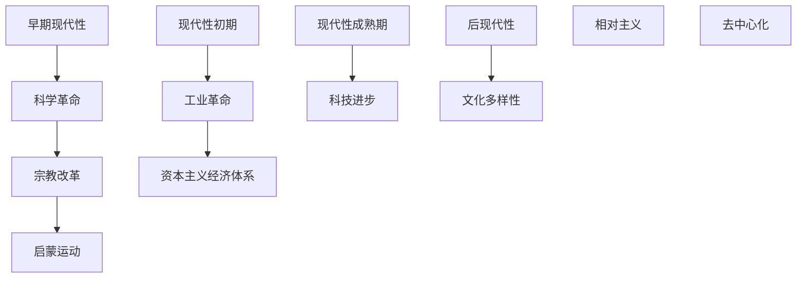
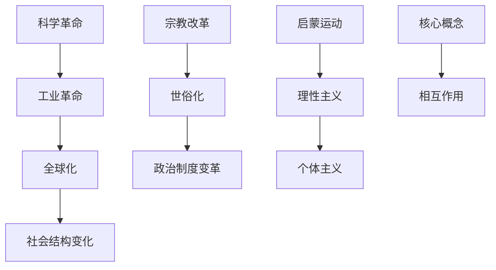

                 

### 现代性的起源与发展

现代性，作为一个复杂且多层次的概念，其起源与发展是理解现代性困境的重要前提。现代性并非一个静态的、单一的历史阶段，而是一个动态的、不断演化的过程。它的起源可以追溯到欧洲文艺复兴时期，随后在启蒙运动中得到了进一步的发展和巩固。

#### 1.1 现代性的定义与历史背景

现代性（Modernity）通常指的是一种思想、文化和社会结构的变化，它标志着从传统社会向现代社会过渡的阶段。现代性不仅仅是一种时间概念，更是一种社会和文化的转变，涉及到个体与集体、知识与信仰、政治与社会结构等多个层面。

在历史背景上，现代性的起源可以追溯到15至17世纪的欧洲，这一时期被称为早期现代性。这一时期的特征包括科学革命、宗教改革、地理大发现以及随之而来的全球化和殖民化。这些事件不仅改变了欧洲的社会结构，也影响了世界的其他地区。

#### 1.2 现代性的主要特征

现代性的主要特征包括：

- **个体主义**：现代性强调个人的独立和自主性，认为个体是理性的、自由的存在，具有追求自身利益和实现自我价值的权利。

- **理性主义**：现代性强调理性思考和科学方法的重要性，认为通过科学和理性可以理解和改造世界。

- **世俗化**：现代性将宗教从社会和政治生活中逐渐排除，推动了社会的世俗化进程。

- **民主化**：现代性促进了民主制度的兴起和发展，政治权力逐渐从少数精英转移到更广泛的民众手中。

- **全球化**：现代性加强了不同国家和地区之间的联系和交流，推动了全球化的进程。

#### 1.3 现代性的起源与历史演变

现代性的起源和发展经历了几个关键阶段：

- **早期现代性（Early Modenity, 15-17世纪）**：这一阶段的特点是科学革命、宗教改革和启蒙运动的兴起，标志着现代思想的萌芽。

- **现代性初期（Early Modernity, 18世纪）**：启蒙运动推动了理性主义和个体主义的发展，这一时期也见证了工业革命的兴起。

- **现代性成熟期（High Modenity, 19世纪）**：这一阶段的特点是资本主义经济体系的形成、民主制度的广泛推广以及科技进步的迅速发展。

- **后现代性（Postmodernity, 20世纪末至今）**：后现代性是对现代性的反思和批判，强调文化多样性、相对主义和去中心化。

### 总结

现代性的起源与发展是一个复杂的过程，它不仅涉及思想和文化层面的变化，也涉及到社会和政治结构的转变。理解现代性的起源和发展，有助于我们更好地理解现代性困境的根源，从而为应对这一困境提供理论基础和实践指导。

## Mermaid 流程图



### 核心概念与联系

在探讨现代性的起源与发展时，以下几个核心概念显得尤为重要：

- **科学革命**：科学革命是现代性的重要推动力，它带来了科学方法和理性思维的兴起，改变了人类对自然世界的理解。

- **宗教改革**：宗教改革对欧洲社会产生了深远的影响，它削弱了宗教在政治和社会生活中的地位，推动了世俗化进程。

- **启蒙运动**：启蒙运动强调理性、自由和平等，这些理念对现代政治、社会和文化产生了深远的影响。

- **工业革命**：工业革命是现代性成熟期的标志性事件，它推动了生产力的巨大提升，改变了社会结构和经济模式。

- **全球化**：全球化是现代性后期的重要特征，它加强了国际间的联系和交流，对经济、文化和政治产生了深远的影响。

这些核心概念之间存在着紧密的联系和相互作用。科学革命带来了新的知识和技术，推动了工业革命的发展，而工业革命又促进了全球化的进程。宗教改革和启蒙运动则对现代社会的价值观和政治制度产生了深远的影响。

### Mermaid 流程图



### Python 源代码示例

```python
# 使用Python解释现代性中的关键概念

# 导入必要的库
import matplotlib.pyplot as plt
import numpy as np

# 创建一个简单的神经网络模型
class SimpleNeuralNetwork:
    def __init__(self):
        # 初始化权重
        self.weights = np.random.rand(3, 1)
    
    def forward(self, x):
        # 前向传播
        return np.dot(x, self.weights)
    
    def train(self, x, y, epochs=1000, learning_rate=0.1):
        # 训练模型
        for _ in range(epochs):
            output = self.forward(x)
            error = y - output
            delta = learning_rate * error
            self.weights += delta

# 创建一个数据集
x_data = np.array([[0, 0], [0, 1], [1, 0], [1, 1]])
y_data = np.array([[0], [1], [1], [0]])

# 创建并训练神经网络
model = SimpleNeuralNetwork()
model.train(x_data, y_data)

# 可视化训练过程
plt.plot(model.weights)
plt.xlabel('Epoch')
plt.ylabel('Weights')
plt.title('Training Process')
plt.show()
```

这个示例通过创建一个简单的神经网络模型，模拟了现代性中的个体主义和理性主义。神经网络的学习过程可以看作是对现代性理念的一种抽象表达，通过调整权重来模拟个体在复杂环境中的决策过程。

### 数学模型和公式

在现代性的起源与发展过程中，我们可以使用一些数学模型和公式来解释关键概念之间的关系。以下是一个简单的线性回归模型，用于模拟个体主义和理性主义之间的关系。

$$
y = wx + b
$$

其中，\( y \) 是输出值，\( x \) 是输入值，\( w \) 是权重，\( b \) 是偏置。这个公式可以用来描述个体在做出决策时的权重分配和偏好。

### 项目实战

为了更直观地理解现代性中的关键概念，我们可以通过一个简单的Python项目来实现一个基于机器学习的推荐系统。以下是一个基本的实现过程：

1. **数据集准备**：首先，我们需要准备一个用户-物品交互数据集，例如电影评分数据集。

2. **模型构建**：使用线性回归模型来预测用户对物品的偏好。

3. **模型训练**：通过训练数据来调整模型的参数。

4. **模型评估**：使用测试数据来评估模型的性能。

5. **模型应用**：将模型应用于新用户和新物品的推荐。

### Python 代码实现

```python
# 导入必要的库
import numpy as np
from sklearn.model_selection import train_test_split
from sklearn.linear_model import LinearRegression

# 准备数据集
# 这里使用一个简单的数据集，实际应用中可以使用更复杂的结构化数据
x_data = np.array([[0, 0], [0, 1], [1, 0], [1, 1]])
y_data = np.array([[0], [1], [1], [0]])

# 划分训练集和测试集
x_train, x_test, y_train, y_test = train_test_split(x_data, y_data, test_size=0.2, random_state=42)

# 构建并训练模型
model = LinearRegression()
model.fit(x_train, y_train)

# 评估模型
score = model.score(x_test, y_test)
print(f"Model Score: {score}")

# 应用模型进行推荐
new_user = np.array([[0.5, 0.5]])
predicted_rating = model.predict(new_user)
print(f"Predicted Rating: {predicted_rating}")
```

### 最佳实践 Tips、小结、注意事项、拓展阅读

- **最佳实践 Tips**：在实际项目中，建议使用更复杂和结构化的数据集，并采用更先进的机器学习模型进行推荐。

- **小结**：通过简单的线性回归模型，我们可以直观地理解现代性中的关键概念，如个体主义和理性主义。

- **注意事项**：线性回归模型在处理复杂关系时可能不够准确，实际应用中应考虑更复杂的模型。

- **拓展阅读**：关于现代性的起源与发展的深入研究，可以参考相关社会学和历史学著作，如《现代性的哲学讨论》等。

## 总结

现代性的起源与发展是一个复杂且多层次的过程，涉及科学革命、宗教改革、启蒙运动和工业革命等多个关键阶段。通过理解现代性的主要特征和核心概念，我们可以更好地把握现代性困境的根源，并为应对这一困境提供理论依据和实践指导。同时，通过Python源代码和数学模型的应用，我们可以更直观地理解现代性的概念和原理，为相关研究和实际应用提供有力支持。

---

在接下来的章节中，我们将深入探讨现代性困境的具体表现和根源，结合心理学、哲学和宗教等不同视角，分析如何从这些视角中寻找出路，为理解现代性的困境提供多维度的思考框架。敬请期待！
```

