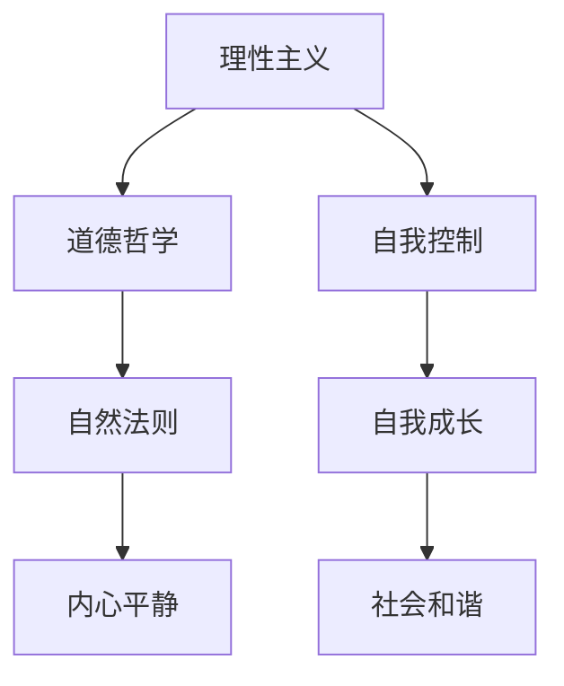

                 

### 基本概念与核心思想

斯多葛主义（Stoicism）起源于古希腊，是一种以理性、道德和内心平静为核心哲学思想的学派。其创始人芝诺（Zeno of Citium）在公元前3世纪创立了斯多葛学派，该学派在后来的几个世纪里影响了众多哲学家和思想家。斯多葛主义的核心思想可以归纳为以下几点：

首先，**理性主义**是斯多葛主义的基石。斯多葛主义者认为，理性是人类独特的本质特征，是人类生活的指南。通过理性的思考和判断，人们可以超越感性欲望和情绪的困扰，实现内心的平静和自我控制。理性不仅是知识的来源，也是道德的评判标准。

其次，**道德哲学**在斯多葛主义中占据重要地位。斯多葛主义者追求美德，特别是正义、勇气和节制。正义意味着公正地对待他人，不偏袒任何一方；勇气则是在面对困难和挑战时不退缩，坚持自己的信念；节制则是指控制欲望，保持适度的生活习惯。这些美德不仅有助于个人的成长，也是构建和谐社会的基石。

第三，**自然法则**是斯多葛主义的重要原则之一。斯多葛主义者认为，宇宙是一个有秩序的整体，人类应当顺应自然法则，接受命运的安排。这意味着，斯多葛主义者主张一种被动接受命运的态度，而不是试图改变不可改变的事物。

在现代，斯多葛主义经历了一次复兴。许多现代人面对工作和生活的压力，开始寻找应对焦虑和不安的方法。斯多葛主义提供了一种哲学框架，帮助人们理解并接受现实，培养内心的平静和理性思考能力。本文将深入探讨斯多葛主义的基本概念和核心思想，并结合现代生活的背景，介绍如何将斯多葛主义应用于日常生活和工作中。

为了更好地理解斯多葛主义，我们可以通过一个简单的Mermaid流程图来展示其核心概念之间的关系：

这个流程图展示了斯多葛主义的核心概念是如何相互关联的。理性主义是基础，通过理性思考和判断，人们可以实现自我控制，追求道德美德，并顺应自然法则，最终达到内心的平静和社会的和谐。

在下一节中，我们将详细探讨斯多葛主义的历史背景和发展历程，以及其与古希腊哲学的关系。这将帮助我们更好地理解斯多葛主义的起源和演变，为进一步的探讨打下基础。

### 历史背景与发展历程

斯多葛主义起源于古希腊，其创始人芝诺（Zeno of Citium）在公元前3世纪创立了斯多葛学派。芝诺本身是一位商人，后来成为苏格拉底的学生克塞诺克拉底（Xenocrates）的弟子。受到亚里士多德哲学的影响，芝诺提出了自己的哲学体系，即斯多葛主义。

#### 古希腊斯多葛主义

在古希腊，斯多葛主义经历了几个重要的发展阶段。早期的斯多葛主义（也称为“前斯多葛主义”）强调理性和道德，主张人类应该通过理性来指导生活，追求内在的平和与幸福。这一时期的代表人物包括芝诺本人、塞尼卡（Seneca）和克利托斯（Crates）。

晚期斯多葛主义则更加深入地探讨了道德哲学和自然法则。晚期斯多葛主义的代表人物包括罗马皇帝马可·奥勒留（Marcus Aurelius）和塞内卡（Seneca the Younger）。他们强调了人的内心平静，提倡接受命运的安排，并通过理性思考来应对生活中的困难和挑战。

#### 罗马时期的斯多葛主义

罗马时期是斯多葛主义发展的黄金时期。斯多葛主义在罗马帝国的社会和文化中得到了广泛传播，对许多罗马哲学家和政治家产生了深远影响。马可·奥勒留是晚期斯多葛主义的代表人物之一，他的著作《沉思录》（Meditations）是斯多葛主义的重要文献，对后世产生了深远的影响。

塞内卡是另一位重要的罗马斯多葛主义者，他不仅是一位哲学家，还是罗马帝国的政治家。塞内卡的作品包括《论情绪》（On the Shortness of Life）等，这些作品探讨了如何通过理性思考和道德实践来应对生活中的困境。

#### 斯多葛主义的现代复兴

在20世纪，斯多葛主义经历了一次复兴。美国心理学家威廉·詹姆斯（William James）和德国哲学家艾克哈特·托勒（Eckhart Tolle）等人的作品重新引入了斯多葛主义的理念，使其在现代心理学和哲学领域得到了广泛关注。

威廉·詹姆斯在其著作《心理学原理》（Principles of Psychology）中提到斯多葛主义，认为它提供了一种应对生活中不确定性和焦虑的有效方法。艾克哈特·托勒则在《新世界》（The Power of Now）中强调了内心平静的重要性，提出了“临在”（presence）的概念，这也可以被视为斯多葛主义在现代的一种表现形式。

此外，许多现代心理学家和思想家，如马克·雷德利（Mark Reinhart）和斯蒂芬·麦克马洪（Stephen M. McInerney）等，通过研究和实践，进一步推广了斯多葛主义，将其应用于个人成长和心理健康领域。

综上所述，斯多葛主义从古希腊到现代经历了一系列的发展和演变。它在不同的历史时期和社会背景下，不断被重新解读和应用，但其核心思想——理性、道德和内心平静——始终贯穿其中。在下一节中，我们将探讨斯多葛主义的核心思想与现代生活的联系，以及如何在现代社会中实践这些思想。

### 斯多葛主义与现代生活的联系

在现代社会，斯多葛主义提供了一种有效的应对焦虑和压力的方法。随着工作压力的增加、人际关系的复杂性以及社会竞争的加剧，许多人感到焦虑和不安。斯多葛主义通过强调理性、道德和内心平静，为现代人提供了一种缓解焦虑和压力的哲学框架。

#### 现代焦虑的来源

现代社会的焦虑主要来源于以下几个方面：

1. **工作压力**：现代职场竞争激烈，许多人面临着高强度的工作压力。加班、职业晋升、薪酬等问题都可能导致焦虑和压力。
2. **人际关系**：在社交媒体和虚拟世界中，人际关系变得更加复杂。人们可能在社交平台上感到被忽视或排斥，或者在现实生活中面临人际矛盾和冲突。
3. **生活期望**：随着物质条件的改善，人们对生活的期望也在不断提高。然而，这种期望往往导致人们追求更多，从而产生焦虑和不满。

#### 斯多葛主义的解决方法

斯多葛主义提供了一系列方法来应对现代焦虑：

1. **减少物质追求**：斯多葛主义认为，物质追求并不是幸福的源泉。通过减少对物质的追求，人们可以减少欲望，从而减轻焦虑。这并不意味着完全放弃物质生活，而是追求足够而非更多。
   
2. **培养内心平静**：斯多葛主义强调内心平静的重要性。通过理性思考和自我控制，人们可以减少情绪波动，保持内心的平静。这种方法可以帮助人们在面对挑战时保持冷静和理智，从而更好地应对压力。

3. **接受现实**：斯多葛主义认为，接受现实是内心平静的基础。人们应当接受无法改变的事实，专注于可以控制的事物。这种态度有助于减少焦虑和不满，提高生活质量。

4. **道德实践**：斯多葛主义提倡道德实践，如正义、勇气和节制。通过追求道德美德，人们可以在生活中建立正确的价值观，减少焦虑和压力。

#### 实践斯多葛主义的例子

以下是一些如何在现代生活中实践斯多葛主义的例子：

1. **面对工作压力**：当面对高强度的工作压力时，可以采用理性思考的方法。首先，识别自己的情绪和焦虑来源，然后分析这些情绪的原因。通过理解问题的本质，可以找到更有效的解决方案，而不是仅仅应对表面的压力。

2. **处理人际关系**：在处理复杂的人际关系时，可以采用道德实践的技巧。例如，在面对冲突时，保持公正和理性，尽量避免情绪化的反应。通过理性对话，可以更好地理解对方，找到解决问题的方法。

3. **接受生活现实**：在生活中，难免会遇到一些无法改变的事实。例如，亲人离世或失业等。面对这些事实，可以尝试接受现实，专注于可以控制的事物。通过这种方式，可以减少焦虑，更好地应对生活中的挑战。

4. **培养内心平静**：可以通过冥想和反思来培养内心平静。每天花一些时间进行冥想，专注于呼吸和当下的感受，可以帮助人们从焦虑和压力中解脱出来。此外，定期记录反思日志，可以帮助人们更好地理解自己的情绪和行为模式。

总之，斯多葛主义提供了一种哲学框架，帮助现代人应对焦虑和压力。通过理性思考、道德实践和内心平静，人们可以在现代生活中找到平衡和满足。在下一节中，我们将探讨斯多葛主义的实践指南，帮助读者进一步了解如何将这一哲学思想应用到日常生活中。

### 实践斯多葛主义的步骤

要将斯多葛主义的理念应用到日常生活中，需要一系列明确的步骤和方法。以下是一些具体的方法，可以帮助个人逐步培养理性思考、道德实践和内心平静。

#### 培养理性思考

1. **识别情绪**：首先，要认识到自己的情绪，并学会区分正面情绪和负面情绪。负面情绪如焦虑、愤怒和沮丧，往往源自对现实的错误理解。通过识别这些情绪，可以更好地理解自己的内心状态。

2. **理性分析**：在识别情绪后，进行理性分析。分析情绪背后的原因，并思考这些情绪是否合理。例如，如果感到焦虑，思考是什么导致了这种情绪，以及是否有必要感到如此焦虑。

3. **反思日志**：记录自己的思考过程和结果。通过反思日志，可以更好地理解自己的思维模式，发现并纠正错误的想法。这种方法有助于培养自我意识和理性思考的能力。

4. **理性对话**：与他人交流时，保持理性。避免情绪化的争吵，而是通过理性对话来解决分歧。这不仅能减少冲突，还能提高解决问题的效率。

#### 追求道德美德

1. **正义**：在日常生活中，追求正义意味着公正地对待他人，遵守法律和道德规范。例如，在工作中，要诚实守信，不偏袒任何一方。

2. **勇气**：勇气是在面对困难和挑战时，不退缩，坚持自己的信念。在日常生活中，这可以表现为在面对不公时勇敢地站出来，或者在工作任务中勇于承担责任。

3. **节制**：节制是指控制欲望，保持适度的生活习惯。例如，不过度消费，合理安排时间和资源，以及保持健康的饮食习惯。

4. **角色扮演**：在遇到道德困境时，尝试从他人的角度思考问题。通过角色扮演，可以更好地理解对方的立场和感受，从而找到更合理的解决方案。

5. **行为规范**：制定个人行为准则，明确自己的道德底线和行为标准。这有助于在面对道德抉择时，迅速做出正确的选择。

#### 管理情绪

1. **情绪日记**：记录自己的情绪变化。通过情绪日记，可以更好地理解情绪的周期性和原因，从而找到有效的情绪管理方法。

2. **深呼吸**：在感到紧张或焦虑时，进行深呼吸练习。深呼吸可以帮助放松身心，减轻情绪波动。

3. **冥想练习**：定期进行冥想练习，专注于呼吸和当下的感受。冥想有助于培养内心的平静，提高情绪稳定性。

4. **积极思考**：在面对挑战时，尝试从积极的角度思考。通过积极思考，可以减少负面情绪，提高应对困难的能力。

#### 构建内心的宁静

1. **寻找内心的平静**：通过冥想、深呼吸和反思，寻找内心的平静。内心的平静不仅有助于心理健康，还能提高生活质量和幸福感。

2. **感恩练习**：每天花时间反思并感激生活中的美好事物。感恩练习可以帮助人们从积极的角度看待生活，减少焦虑和不满。

3. **健康的生活方式**：保持健康的生活方式，包括合理饮食、规律锻炼和充足睡眠。健康的身体是心理健康的基础。

通过以上步骤，个人可以逐步培养理性思考、道德实践和内心平静。这不仅有助于应对现代生活中的焦虑和压力，还能提高个人的生活质量和幸福感。在下一节中，我们将通过具体的案例，展示如何在实际生活中应用斯多葛主义。

### 实际案例：职场中的斯多葛主义实践

在职场中，斯多葛主义可以作为一种强大的工具，帮助人们应对工作压力和挑战。以下是一个具体的案例，展示了一位职场人士如何通过理性思考和道德实践，成功地应用斯多葛主义原则，解决了工作上的困境。

#### 案例背景

李明是一名大型互联网公司的项目经理，负责管理多个关键项目。由于公司发展迅速，李明的工作压力非常大。他常常需要在短时间内完成多个任务，同时还要处理团队成员之间的冲突。随着时间的推移，李明感到越来越疲惫和焦虑，影响了他的工作效率和心理健康。

#### 案例分析

1. **识别情绪**：李明首先意识到自己的情绪问题，他开始记录自己的情绪变化和焦虑来源。通过情绪日记，他发现大部分焦虑来源于任务量过大和团队沟通不畅。

2. **理性分析**：李明进行理性分析，思考这些焦虑背后的原因。他意识到，尽管任务量很大，但并不是所有任务都对他个人至关重要。此外，团队沟通不畅部分是因为缺乏明确的沟通策略和目标。

3. **制定理性策略**：
   - **优先级管理**：李明开始将任务按照优先级排序，只关注最重要的任务，并将一些次要任务委托给团队成员。这种方法帮助他减少了直接的压力，同时也培养了团队成员的自主性和责任感。
   - **改进沟通策略**：李明制定了一个详细的沟通计划，包括定期的团队会议、任务跟进和反馈机制。通过明确的沟通策略，团队成员之间的协作更加顺畅，李明也更容易了解项目的进展和问题。

4. **道德实践**：
   - **正义**：在处理团队成员之间的冲突时，李明始终坚持公正的原则，不偏袒任何一方。他通过理性对话，帮助团队成员理解对方的立场，并找到共同的解决方案。
   - **勇气**：在面对团队中的困难和挑战时，李明表现出勇气和决心。他不仅勇于承认自己的错误，还勇于面对问题，寻找改进的方法。

5. **内心平静**：
   - **冥想和深呼吸**：为了缓解焦虑，李明每天花时间进行冥想和深呼吸练习。这些练习帮助他保持内心的平静，减少情绪波动。
   - **积极思考**：李明学会了从积极的角度看待工作和生活。他开始专注于工作带来的成就和满足感，而不是仅仅关注压力和挑战。

#### 案例结果

通过理性思考和道德实践，李明成功地应对了工作压力和挑战。他的工作效率和团队协作得到了显著提升，团队成员之间的关系也变得更加和谐。更重要的是，李明感到自己的心理健康得到了改善，焦虑感明显减少。

#### 案例总结

李明的案例展示了如何在职场中应用斯多葛主义的理念，通过理性思考、道德实践和内心平静，应对工作中的压力和挑战。以下是一些关键点：

- **理性优先级管理**：通过优先级管理，可以减少直接的压力，提高工作效率。
- **改善沟通策略**：明确的沟通计划有助于提高团队协作效率，减少冲突。
- **道德实践**：坚持正义、勇气和节制，有助于建立和谐的工作环境。
- **内心平静**：通过冥想和深呼吸，可以缓解焦虑，提高情绪稳定性。

通过这些方法，职场人士可以在繁忙的工作中找到平衡，实现内心的平静和自我成长。

### 总结与扩展

斯多葛主义提供了一种应对现代生活焦虑和压力的哲学框架。通过理性思考、道德实践和内心平静，人们可以更好地应对职场和生活中的各种挑战。本文通过历史背景、实践指南和实际案例，详细探讨了斯多葛主义的基本概念和现代应用。

首先，斯多葛主义起源于古希腊，经历了几个重要的发展阶段，并在罗马时期达到了巅峰。现代斯多葛主义经历了一次复兴，许多现代心理学家和思想家重新解读和应用这一哲学思想。

其次，本文介绍了斯多葛主义的核心思想，包括理性主义、道德哲学和自然法则。这些思想帮助人们理解并接受现实，培养内心的平静和理性思考能力。

最后，通过具体的实践指南和实际案例，本文展示了如何将斯多葛主义应用于日常生活中，包括职场压力管理、人际关系处理和情绪调节。

未来，斯多葛主义可以进一步应用于各个领域，如教育、医疗和公共事务。通过推广和实践，斯多葛主义将为更多人带来内心的平静和幸福感。

### 推荐阅读与进一步研究

对于希望深入了解斯多葛主义及其现代应用的读者，以下是一些推荐的书籍和资源：

1. **《沉思录》（Meditations）**：由罗马皇帝马可·奥勒留所著，是斯多葛主义的重要文献，探讨了如何通过理性思考和道德实践应对生活中的困境。

2. **《论情绪》（On the Shortness of Life）**：塞尼卡的作品，深入探讨了人类生活短暂且不可预知的特点，以及如何通过理性看待生命的短暂。

3. **《心理学原理》（Principles of Psychology）**：威廉·詹姆斯的著作，介绍了斯多葛主义对心理学的影响，并提出了一些实用的方法来应对现代生活中的焦虑。

4. **《新世界》（The Power of Now）**：艾克哈特·托勒的作品，探讨了“临在”的概念，这可以被视为斯多葛主义在当代的一种表现形式。

5. **《斯多葛主义：现代生活的指南》（Stoicism: Modern Life's Guide）**：斯蒂芬·麦克马洪的著作，详细介绍了如何将斯多葛主义的理念应用于现代生活中。

6. **在线课程和研讨会**：许多在线平台如Coursera、Udemy等提供了关于斯多葛主义和个人成长的课程和研讨会，可以帮助读者更深入地了解这一哲学思想。

通过阅读这些书籍和资源，读者可以进一步探索斯多葛主义的深度和广度，并将其应用于个人生活和工作中，以实现内心的平静和自我成长。

