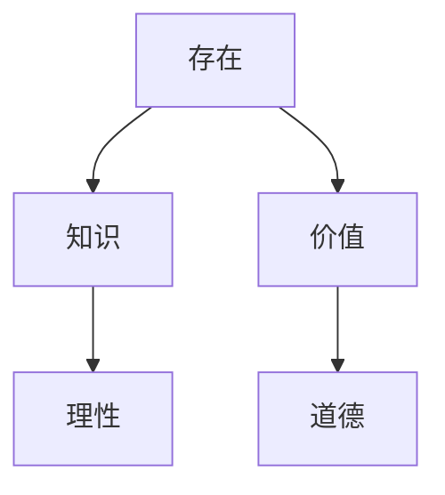

                 

# 现代生活中的哲学应用：实用智慧指南

> 关键词：哲学应用、实用智慧、逻辑思维、决策、人际关系、心理健康、创造力、科技进步

> 摘要：本文旨在探讨哲学在现代社会中的广泛应用，通过分析哲学的核心概念与联系，揭示哲学在日常生活、工作以及心理健康等领域的实用价值。文章将从哲学的概述与历史、核心概念与联系、哲学在现代社会中的应用、哲学思考的实践以及哲学的未来五个部分进行阐述，旨在为读者提供一份现代生活中的实用智慧指南。

## 第一部分：哲学的基础与应用

### 第1章：哲学的概述与历史

#### 1.1 哲学的本质与意义

**哲学的定义**：哲学是一门探讨人类存在、知识、价值、理性等基本问题的学科，是关于世界本质、人类本性和生活意义的思考。

**哲学的研究对象**：哲学研究的对象包括自然界、社会、人类思维以及人类自身。

**哲学在现代社会中的作用**：哲学在现代社会中起着重要的作用，它不仅为我们的日常生活提供指导，还在科技发展、道德伦理、社会变革等方面发挥关键作用。

#### 1.2 西方哲学的主要流派

**古典哲学**：以古希腊哲学家柏拉图为代表，主张理性思考和追求真理。

**中世纪哲学**：以基督教哲学为代表，强调信仰和宗教的重要性。

**近现代哲学**：以德国哲学家康德、黑格尔等人为代表，强调批判思维和理性主义。

#### 1.3 东方哲学的智慧

**儒家哲学**：以孔子为代表，强调仁爱、礼仪、道德和人际关系。

**道家哲学**：以老子为代表，强调无为而治、道法自然。

**佛教哲学**：以佛陀为代表，强调因果报应、生死轮回和修行。

## 第二部分：哲学的核心概念与联系

### 第2章：哲学的核心概念与联系

#### 2.1 存在论

**存在的本质**：存在是哲学中的一个基本问题，主要探讨什么是存在，存在的本质是什么。

**存在论的主要流派**：包括唯物主义、唯心主义、现象学等。

**存在论与人类生活的关系**：存在论对人类的价值观、世界观和生活方式产生深远影响。

#### 2.2 知识论

**知识的本质**：知识是哲学中另一个基本问题，主要探讨什么是知识，知识是如何获得的。

**知识的分类**：包括感性知识、理性知识、信仰知识等。

**知识与信仰、信念的关系**：知识、信仰和信念在哲学中有着密切的联系。

#### 2.3 伦理学

**伦理学的本质**：伦理学是研究道德规范、道德判断和道德行为的学科。

**伦理学的主要流派**：包括功利主义、义务论、情感主义等。

**伦理学在现代社会中的应用**：伦理学在法律、政治、医疗等领域发挥着重要作用。

## 第三部分：哲学在现代社会中的应用

### 第3章：哲学与日常生活

**哲学如何影响我们的决策**：哲学帮助我们理性思考，做出明智的决策。

**哲学如何帮助我们面对生活中的挑战**：哲学提供了一种思考问题的方法，使我们能够更好地应对生活中的挑战。

**哲学在人际关系中的应用**：哲学帮助我们理解人际关系，建立和谐的人际关系。

### 第3章：哲学与工作

**哲学如何指导我们的职业选择**：哲学帮助我们认识自我，选择适合自己的职业。

**哲学如何提高工作效率**：哲学提供了一种思维方式，使我们能够更高效地工作。

**哲学在企业管理中的应用**：哲学为企业管理提供了一种指导思想，帮助企业实现可持续发展。

### 第3章：哲学与心理健康

**哲学如何帮助我们理解心理健康**：哲学帮助我们认识心理健康的本质，理解心理健康的重要性。

**哲学如何改善我们的心理健康**：哲学提供了一种心理调适的方法，有助于改善我们的心理健康。

**哲学在心理咨询中的应用**：哲学为心理咨询提供了一种理论基础，有助于解决心理问题。

## 第四部分：哲学思考的实践

### 第4章：哲学思考的实践

**哲学思考的方法**：包括直觉思维、理性思维、批判性思维等。

**哲学思考的实践**：通过哲学对话、哲学日记、哲学写作等实践活动，培养哲学思考能力。

**哲学思考与创造力**：哲学思考有助于激发创造力，提高创新能力。

## 第五部分：哲学的未来

### 第5章：哲学的未来

**哲学与科技进步**：探讨哲学在人工智能、科技伦理等领域的应用，分析科技进步对哲学的影响。

**哲学与社会变革**：分析哲学在社会变革中的作用，探讨社会变革中的哲学问题。

**哲学教育的未来**：探讨哲学教育的重要性，分析哲学教育的现状与挑战，展望哲学教育的未来发展趋势。

## 附录

### 附录 A：哲学常用术语与概念

#### A.1 哲学常用术语

- **存在**：指事物在时空中的存在状态。
- **知识**：指人们对客观世界的认识和理解。
- **价值**：指人们对事物的评价和取舍。

#### A.2 哲学主要概念实体及其关系架构 Mermaid 流程图

### 附录 B：哲学经典著作推荐

#### B.1 西方哲学经典著作

- **《论人类不平等的起源和基础》**：卢梭
- **《存在与时间》**：海德格尔
- **《纯粹理性批判》**：康德

#### B.2 东方哲学经典著作

- **《论语》**：孔子
- **《道德经》**：老子
- **《金刚经》**：佛陀

### 附录 C：哲学思考工具与方法

#### C.1 思维导图

思维导图是一种图形化的思维工具，有助于梳理思路，提高思维效率。

#### C.2 案例分析

案例分析是一种研究方法，通过分析实际案例，探讨哲学原理在现实生活中的应用。

#### C.3 辩论技巧

辩论技巧是一种沟通技巧，通过辩论，锻炼思维能力，提高表达能力。

### 作者：AI天才研究院/AI Genius Institute & 禅与计算机程序设计艺术 /Zen And The Art of Computer Programming

通过本文，我们深入探讨了哲学在现代社会中的广泛应用，揭示了哲学在日常生活、工作以及心理健康等领域的实用价值。哲学不仅为我们的决策提供指导，还在提高工作效率、建立人际关系、改善心理健康等方面发挥着重要作用。未来，哲学将继续与科技进步、社会变革等紧密结合，为人类的发展提供智慧支持。让我们一起运用哲学的智慧，开启现代生活中的实用智慧之旅。

