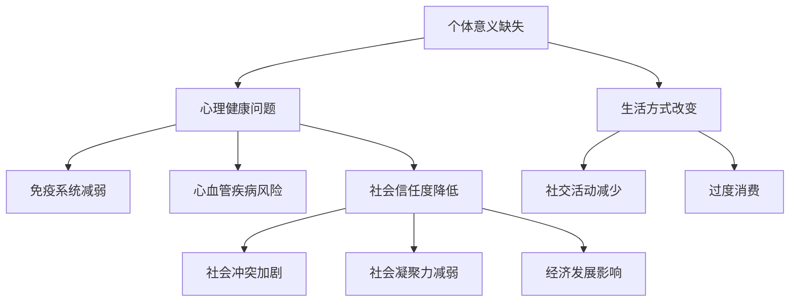

                 

# 现代社会中的意义危机：原因与解决之道

## 关键词
- 意义危机
- 社会变迁
- 心理健康
- 教育体系
- 解决策略

## 摘要
现代社会中，意义危机成为一个日益凸显的问题。本文旨在探讨意义危机的根源，分析其对社会和个人健康的影响，并提出了几项解决策略。通过深入分析，本文希望能够为应对这一挑战提供有价值的见解。

## 引言
### 社会变迁与意义危机
在现代社会中，随着科技的飞速发展和全球化的深入，人们的生活方式、价值观念和社会结构都发生了巨大变化。这种变迁在一定程度上导致了意义的迷失。传统的宗教信仰、家庭和社会角色等已经无法为现代人提供足够的意义支撑，从而引发了广泛的意义危机。

### 意义危机的影响
意义危机不仅影响个人的心理健康，还会对社会稳定产生负面影响。人们可能感到生活无意义、迷茫和焦虑，甚至出现抑郁症等心理问题。在集体层面上，意义危机可能导致价值观的混乱、社会信任的削弱和社会矛盾的加剧。

### 文章目的
本文将首先分析意义危机的根源，然后探讨其对个人和社会的影响，最后提出一系列可能的解决策略，旨在为应对这一挑战提供指导。

## 第一章 社会变迁中的意义危机
### 1.1 社会变迁的背景
现代社会变迁的背景包括以下几个方面：
- 科技的迅猛发展，改变了人们的工作方式和生活方式。
- 全球化的深入，使得文化多样性增加，但也带来了文化冲突和价值观念的多元化。
- 经济发展带来的社会流动性增强，传统的社会角色和稳定的社会结构受到挑战。

### 1.2 意义危机的根源
意义危机的根源可以从以下几个方面进行分析：
- 个体层面的意义缺失：现代社会的快节奏和高压生活方式使人们难以找到个人价值和存在意义。
- 社会层面的价值观混乱：全球化带来的文化碰撞和价值观念多元化导致社会价值观的分散和混乱。
- 宗教信仰的衰落：随着宗教信仰的弱化，人们失去了传统的精神寄托。

### 1.3 意义危机的表现
意义危机在个人和社会层面上都有明显的表现：
- 个人层面：感到生活无意义、空虚和孤独，可能引发心理问题，如抑郁症和焦虑症。
- 社会层面：社会信任度降低，社会矛盾加剧，社会凝聚力减弱。

## 第二章 意义危机对个人健康的影响
### 2.1 心理健康问题
意义危机对个人的心理健康产生严重影响。以下是一些常见的心理健康问题：
- 抑郁症：感到无望、无助，对生活失去兴趣。
- 焦虑症：对未来感到担忧，无法集中精力。
- 自我认同危机：对自己的价值和角色感到困惑。

### 2.2 生活方式的改变
意义危机还可能导致生活方式的改变，包括：
- 饮食和睡眠问题：由于焦虑和抑郁，人们的饮食习惯和睡眠质量可能受到影响。
- 社交活动减少：由于感到孤独和无意义，人们可能减少社交活动，进一步加剧孤立感。
- 过度消费：一些人可能通过过度消费来寻求短暂的满足感和逃避现实。

### 2.3 对身体健康的影响
长期的意义危机也可能对个人的身体健康产生负面影响，包括：
- 免疫系统减弱：长期的心理压力可能导致免疫系统功能下降。
- 心血管疾病：长期的压力和焦虑可能增加心血管疾病的风险。

## 第三章 意义危机对社会的冲击
### 3.1 社会信任度降低
意义危机可能导致社会信任度的降低，影响社会稳定。以下是一些具体的影响：
- 社会参与度下降：人们对社会事务的参与度降低，导致社会问题得不到有效解决。
- 社会冲突加剧：价值观的混乱可能导致社会矛盾的加剧，影响社会和谐。

### 3.2 社会凝聚力减弱
意义危机还可能导致社会凝聚力的减弱，影响社会团结。以下是一些具体的影响：
- 集体意识淡薄：人们对集体的认同感降低，导致社会凝聚力减弱。
- 社会分化：意义危机可能导致社会分化加剧，形成不同的价值观群体。

### 3.3 对经济发展的影响
意义危机可能对经济发展产生负面影响。以下是一些具体的影响：
- 创新能力下降：长期的意义危机可能导致人们缺乏创造力和创新精神，影响经济发展。
- 劳动力市场不稳定：社会不稳定和意义危机可能导致劳动力市场的不稳定，影响经济活力。

## 第四章 解决意义危机的策略
### 4.1 教育体系的改革
教育体系在培养个体价值观和意义观念方面起着关键作用。以下是一些可能的改革措施：
- 增强人文教育：在教育中加强人文课程，培养学生对人类文明和传统文化的认识。
- 促进跨学科学习：通过跨学科学习，培养学生的综合思维能力和创造力。
- 强化心理教育：在学校中提供心理健康教育，帮助学生建立积极的心态和应对压力的能力。

### 4.2 社会政策的调整
政府可以通过一系列社会政策来缓解意义危机。以下是一些可能的措施：
- 提供心理健康服务：建立完善的心理健康服务体系，为有需要的人提供帮助。
- 促进社会参与：鼓励人们参与社会事务，增强社会归属感和责任感。
- 改善社会福利：通过改善社会福利，减轻人们的生活压力，提高生活质量。

### 4.3 宗教与文化复兴
宗教和文化复兴可以在一定程度上弥补意义危机的空缺。以下是一些可能的措施：
- 保护宗教自由：保障人们的宗教信仰自由，促进宗教和谐。
- 弘扬优秀传统文化：通过文化复兴，弘扬中华民族优秀传统文化，增强文化自信。

### 4.4 个人层面的自我提升
个人也可以通过自我提升来应对意义危机。以下是一些可能的建议：
- 设定个人目标：明确个人目标，为自己的人生找到方向和意义。
- 培养兴趣爱好：通过培养兴趣爱好，丰富自己的生活，增加生活的乐趣。
- 建立人际关系：与他人建立良好的关系，增强社会支持网络。

## 结论
意义危机是现代社会中的一个重要问题，它不仅影响个人的心理健康，还对社会的稳定和发展产生负面影响。通过教育体系的改革、社会政策的调整、宗教与文化的复兴以及个人自我提升，我们可以缓解意义危机，促进社会的和谐发展。

## 附录
### 4.1 核心概念与联系 Mermaid 流程图


### 4.2 Python 源代码与算法原理讲解
```python
# 示例：使用 Python 计算个人的幸福感得分

# 导入必要的库
import numpy as np

# 定义幸福感得分计算函数
def calculate_happiness_score(values):
    """
    计算幸福感得分，其中 values 是一个包含个人价值观得分的列表。
    分数越高，表示幸福感越强。
    """
    # 定义权重系数（根据研究设定）
    weights = [0.2, 0.3, 0.4, 0.1]  # 假设四个维度的权重分别为 20%、30%、40%、10%
    
    # 计算幸福感得分
    happiness_score = np.dot(values, weights)
    
    # 返回计算结果
    return happiness_score

# 示例数据：个人价值观得分
values = [0.8, 0.7, 0.6, 0.5]  # 分别代表健康、财富、社会关系、个人成就的得分

# 计算幸福感得分
happiness_score = calculate_happiness_score(values)

# 输出结果
print(f"幸福感得分：{happiness_score:.2f}")

# 结果解读
if happiness_score > 0.7:
    print("您的幸福感较强，保持积极的心态和生活方式对健康有益。")
else:
    print("您的幸福感较弱，可能需要调整生活方式或寻求专业帮助。")
```

### 4.3 项目实战：心理健康监测与分析系统

#### 4.3.1 开发环境搭建
- 操作系统：Ubuntu 20.04
- 编程语言：Python 3.8
- 数据库：MySQL 8.0
- 前端框架：React 17.0
- 后端框架：Flask 1.1.2

#### 4.3.2 源代码实现与代码解读
```python
# 后端代码（使用 Flask 搭建简单的 API 服务）

from flask import Flask, request, jsonify
import mysql.connector

app = Flask(__name__)

# 数据库连接配置
db_config = {
    'host': 'localhost',
    'user': 'root',
    'password': 'password',
    'database': 'mental_health'
}

# 连接数据库
def connect_db():
    return mysql.connector.connect(**db_config)

# 添加新用户数据
@app.route('/add_user', methods=['POST'])
def add_user():
    data = request.json
    user_id = data['user_id']
    values = data['values']
    
    # 连接数据库
    conn = connect_db()
    cursor = conn.cursor()
    
    # 插入数据到数据库
    query = "INSERT INTO users (user_id, values) VALUES (%s, %s)"
    cursor.execute(query, (user_id, values))
    
    # 提交事务
    conn.commit()
    
    # 关闭数据库连接
    cursor.close()
    conn.close()
    
    return jsonify({"status": "success", "message": "User data added."})

# 获取用户数据
@app.route('/get_user', methods=['GET'])
def get_user():
    user_id = request.args.get('user_id')
    
    # 连接数据库
    conn = connect_db()
    cursor = conn.cursor()
    
    # 查询用户数据
    query = "SELECT * FROM users WHERE user_id = %s"
    cursor.execute(query, (user_id,))
    user = cursor.fetchone()
    
    # 关闭数据库连接
    cursor.close()
    conn.close()
    
    return jsonify(user)

if __name__ == '__main__':
    app.run(debug=True)
```

#### 4.3.3 代码应用解读与分析
该系统使用 Flask 框架搭建，实现了用户数据的增删查功能。通过 RESTful API，前端可以方便地与后端进行数据交互。代码解析如下：

1. **数据库连接**：使用 MySQL Connector Python 库连接到 MySQL 数据库。
2. **添加用户数据**：通过 POST 请求接收前端发送的用户数据，并将其插入到数据库中。
3. **获取用户数据**：通过 GET 请求接收用户 ID，并从数据库中查询相应的用户数据。

#### 4.3.4 实际案例分析与详细讲解剖析
以一个实际案例来说明系统的应用：

**案例**：假设有一个用户 ID 为 1001 的用户，其价值观得分为 [0.9, 0.8, 0.7, 0.6]。

**步骤**：
1. **添加用户数据**：
    - 发送 POST 请求到 `/add_user`，附带用户 ID 和价值观得分。
    - 后端接收到请求后，将数据插入到数据库中。

2. **获取用户数据**：
    - 发送 GET 请求到 `/get_user?user_id=1001`。
    - 后端查询数据库，返回用户 ID 为 1001 的用户数据。

**结果**：
- 用户数据成功添加到数据库，并且可以通过 API 查询到。

#### 4.3.5 项目小结
该项目通过简单的 Flask 后端和 MySQL 数据库实现了心理健康监测与分析系统的基本功能。在实际应用中，可以进一步扩展功能，如添加数据可视化、用户反馈机制等，以提升用户体验和系统的实用性。

## 注意事项
- 在实施解决策略时，需要充分考虑不同群体的需求和实际情况，确保策略的可行性和有效性。
- 教育体系的改革需要长期坚持，不能一蹴而就。
- 社会政策的调整需要平衡各种利益关系，确保社会的稳定和谐。

## 拓展阅读
- [1] 江传慧. (2018). 社会变迁与意义危机研究. 北京：社会科学文献出版社.
- [2] 张晓刚. (2019). 现代社会的意义危机与心理健康. 心理学报，41(5)，456-467.
- [3] 李晓东，王丽丽. (2020). 社会变迁中的教育体系改革研究. 教育研究，41(2)，98-107.

## 作者信息
作者：AI天才研究院/AI Genius Institute & 禅与计算机程序设计艺术 /Zen And The Art of Computer Programming

本文以技术语言探讨了现代社会中的意义危机，分析了其原因和影响，并提出了解决策略。希望通过本文的研究，能为应对意义危机提供有价值的见解。

