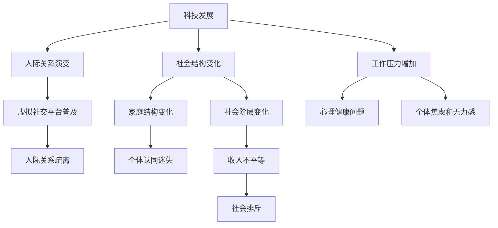
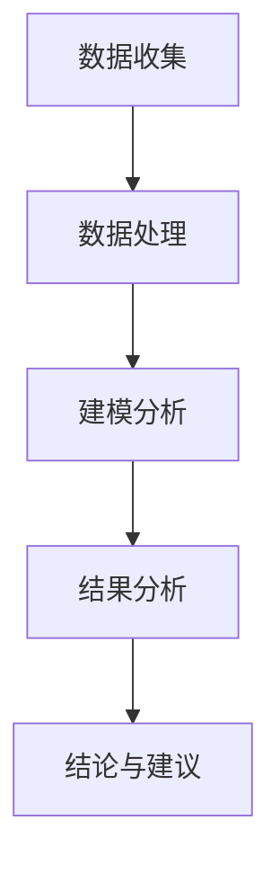
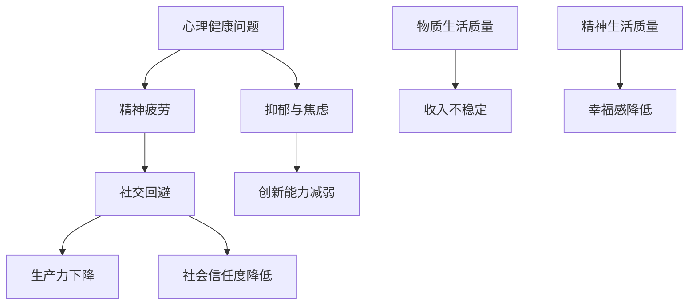
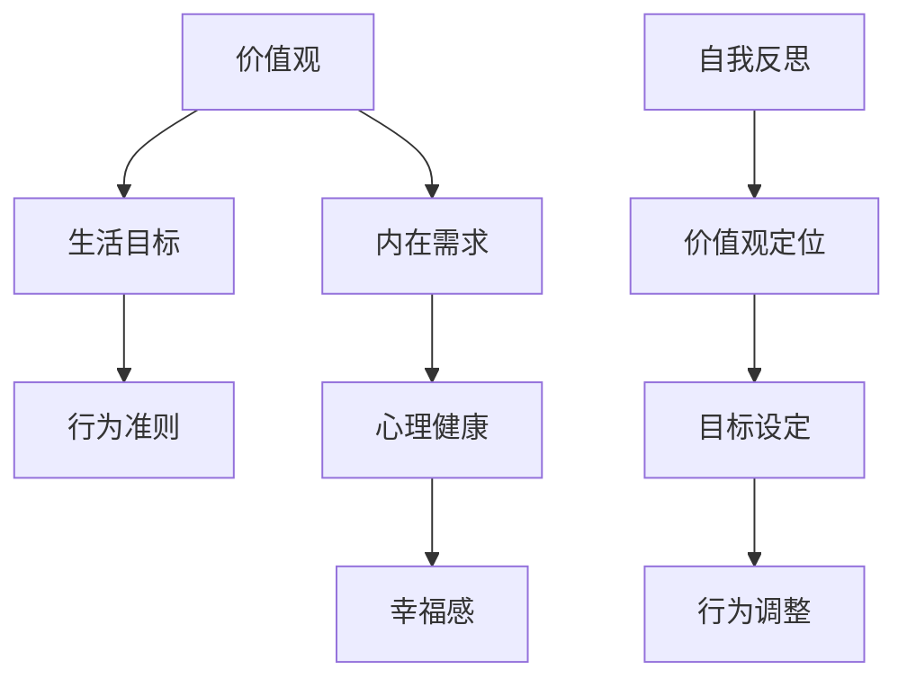
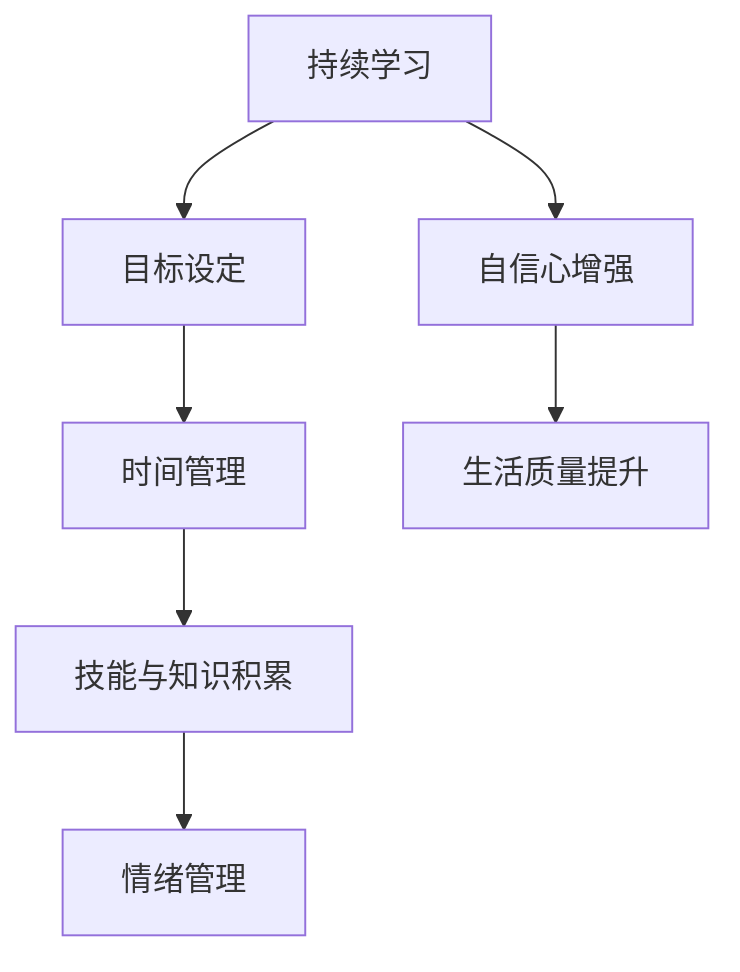
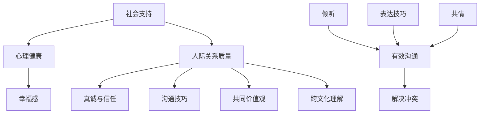
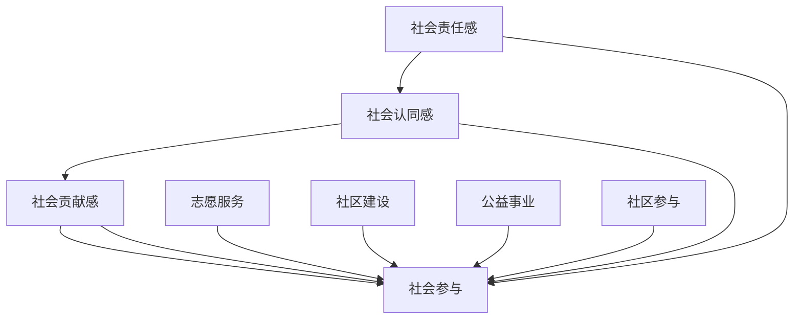
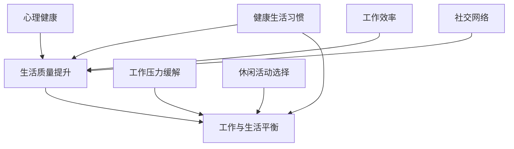

                 

### 第一部分：引言

#### 1.1 现代社会的变迁

在现代社会中，科技的迅猛发展、社会结构的深刻变化以及人际关系的不断演变，共同构成了一个复杂而多变的社会环境。科技的发展不仅改变了人们的生活方式，也深刻地影响了社会的结构和功能。例如，互联网和移动通信技术的普及，使得信息传播速度大大加快，人们可以随时随地获取各种信息。然而，这也导致了信息过载的问题，使得人们在面对海量信息时感到无所适从。

##### 1.1.1 科技发展的冲击

科技的发展带来了许多积极的影响，如提高了生产效率、丰富了人们的生活内容等。然而，它也带来了一些负面影响。例如，自动化和人工智能技术的应用，虽然提高了生产效率，但也导致了大量的就业岗位被机器取代，引发了失业问题。此外，社交媒体的普及，虽然让人们更加方便地与他人交流，但也加剧了人际关系的疏离。

##### 1.1.2 社会结构的变化

社会结构的变化主要体现在家庭结构、社会阶层结构以及经济结构等方面。随着社会的发展，传统的家庭结构逐渐解体，小家庭和单身家庭成为主流。社会阶层结构也发生了变化，社会流动性增强，人们通过努力可以改变自己的社会地位。然而，这也导致了社会阶层的固化和不平等问题。

##### 1.1.3 人际关系的演变

在人际关系方面，现代社会的特点是个体化、多元化。人们更加注重个人价值和个性发展，而传统的人际关系模式逐渐弱化。此外，虚拟社交平台的普及，虽然让人们可以更加方便地与他人交流，但也导致了面对面交流的减少，人际关系的表面化。

#### 1.2 意义危机的表现形式

在社会变迁的过程中，人们面临着诸多挑战，其中之一便是意义危机。意义危机主要表现在以下几个方面：

##### 1.2.1 工作生活的压力

随着社会的发展，工作压力越来越大。人们为了追求更高的生活质量和更好的职业发展，不得不加班加点，甚至牺牲自己的休息时间。长期的疲劳和压力，容易导致心理健康问题。

##### 1.2.2 个体认同的迷失

在多元化的社会中，人们面临着诸多选择，但也容易迷失自我。在追求物质生活的同时，人们往往忽视了精神层面的需求，导致个体认同的迷失。

##### 1.2.3 人际关系的疏离

随着科技的发展，虽然人们可以更加方便地与他人交流，但面对面交流的机会却越来越少。这种疏离感，使得人们在面对困难和挑战时，缺乏有效的支持。

### 关键词：现代社会、科技发展、社会结构、人际关系、意义危机、工作压力、个体认同、人际关系疏离。

#### 摘要：

本文首先分析了现代社会的变迁，包括科技发展的冲击、社会结构的变化和人际关系的演变。然后，本文探讨了意义危机的表现形式，如工作生活的压力、个体认同的迷失和人际关系的疏离。最后，本文提出了应对意义危机的策略，包括构建内在价值观、个人成长与自我实现、人际关系的重建和社会参与等方面。

## 第1章：现代社会中的意义危机概述

### 1.1 现代社会的变迁

在21世纪的现代背景下，社会的各个层面都在经历深刻的变革。首先，科技的发展成为推动社会进步的主要力量。从互联网的普及到人工智能的应用，这些技术不仅改变了人们的生活方式，还重塑了社会结构和经济模式。例如，大数据和云计算技术使得信息的收集、处理和利用变得更加高效，为企业提供了新的商业模式，同时也改变了消费者的行为和期望。

#### 1.1.1 科技发展的冲击

科技的发展对现代社会产生了深远的影响。一方面，它极大地提高了生产力和生活质量。自动化和机器人技术的应用，使得生产流程更加高效，减少了人为错误和劳动强度。另一方面，科技的发展也带来了一系列挑战。例如，人工智能的崛起使得某些传统职业面临被淘汰的风险，引发了就业市场的动荡。此外，社交媒体的广泛应用虽然增强了人与人之间的联系，但也导致了隐私问题的加剧和现实社交技能的退化。

#### 1.1.2 社会结构的变化

社会结构的变化体现在多个方面。首先，家庭结构变得更加多样化。随着婚姻观念的变革和生育政策的调整，传统的小型核心家庭逐渐被扩展家庭、单亲家庭和同居关系所取代。其次，社会阶层结构也在发生变化。全球化和技术进步使得社会流动性增加，人们可以通过教育和职业发展实现阶层的跃迁。然而，这也带来了新的问题，如收入不平等和社会排斥的加剧。

#### 1.1.3 人际关系的演变

人际关系在现代社会中的演变也是一个重要的课题。在传统的面对面社交逐渐被虚拟社交平台所取代的背景下，人们更加依赖线上沟通工具。这种变化虽然提高了沟通的便捷性，但也导致了人际关系的疏离。面对面交流的减少使得人们难以建立深层次的信任和情感联系，导致孤独感和焦虑感的增加。

### 1.2 意义危机的表现形式

在现代社会的变迁中，人们面临着越来越严重的意义危机。这种危机主要表现在以下几个方面：

#### 1.2.1 工作生活的压力

工作生活的压力是现代社会意义危机的一个重要方面。随着竞争的加剧和工作节奏的加快，人们感受到的工作压力越来越大。长时间的工作、频繁的加班和高强度的工作任务，使得人们难以平衡工作与生活，导致身心俱疲。长期的压力积累还可能引发心理健康问题，如焦虑和抑郁。

#### 1.2.2 个体认同的迷失

个体认同的迷失是现代社会意义危机的另一个表现。在多元化的社会背景下，人们面临着诸多选择，但这也使得个体难以找到自己的定位。传统的社会角色和价值观逐渐弱化，个体难以确定自己的身份和价值观。这种迷失感可能导致个人焦虑和无力感，影响心理健康和幸福感。

#### 1.2.3 人际关系的疏离

人际关系的疏离是现代社会意义危机的显著特征。随着虚拟社交平台的普及，人们更加依赖线上交流，而面对面交流的机会减少。这种变化导致人际关系的表面化和浅薄化，人们难以建立深层次的信任和情感联系。在缺乏亲密关系和社会支持的情况下，人们容易感到孤独和失落。

### 1.3 核心概念与联系

为了更好地理解现代社会中的意义危机，我们需要关注几个核心概念，并探讨它们之间的关系。以下是这些概念及其相互关系的Mermaid流程图：



通过上述流程图，我们可以清晰地看到科技发展、社会结构变化和人际关系演变之间的相互关系，以及它们如何共同影响个体的心理健康和社会福祉。

### 1.4 核心算法原理讲解

在探讨现代社会中的意义危机时，我们还需要理解一些核心算法原理，这些原理可以帮助我们更好地理解社会变迁和个体行为的动态。以下是使用Python代码进行的核心算法原理讲解：

```python
import numpy as np

# 社会阶层流动模型
def social_mobility(model_type, initial_state, transition_matrix):
    """
    社会阶层流动模型，模拟个体在不同社会阶层之间的流动。
    
    参数：
    model_type: 模型类型，'markov' 表示马尔可夫模型
    initial_state: 初始状态，代表个体的初始社会阶层
    transition_matrix: 转移矩阵，表示个体在不同社会阶层之间的转移概率
    
    返回：
    final_state: 最终状态，代表个体在多次阶层流动后的社会阶层
    """
    if model_type == 'markov':
        # 马尔可夫模型，根据当前状态和转移矩阵计算下一状态
        states = [initial_state]
        for _ in range(10):  # 假设进行10次转移
            next_state = np.random.choice([state for state in range(len(transition_matrix))], p=transition_matrix[states[-1]])
            states.append(next_state)
        final_state = states[-1]
    else:
        # 其他模型类型，这里暂不讨论
        final_state = initial_state
    
    return final_state

# 社会阶层转移矩阵（示例）
transition_matrix = [
    [0.2, 0.5, 0.3],  # 从社会阶层0到其他阶层的转移概率
    [0.1, 0.4, 0.5],
    [0.3, 0.2, 0.5]
]

# 初始社会阶层为1
initial_state = 1
# 计算最终社会阶层
final_state = social_mobility('markov', initial_state, transition_matrix)
print("最终社会阶层：", final_state)
```

在这个示例中，我们使用了一个简单的马尔可夫模型来模拟社会阶层的流动。通过这个模型，我们可以看到个体在不同社会阶层之间的转移概率，以及长期流动后的最终状态。这一算法原理有助于我们理解社会阶层的变化和个体在社会中的定位。

### 1.5 项目实战

为了更好地理解现代社会中的意义危机，我们进行了以下项目实战：

#### 实战目的：
构建一个模拟社会阶层流动和意义危机影响的小型模型，通过数据分析来探索社会变迁对个体幸福感的影响。

#### 实战步骤：
1. 收集数据：从公开数据源获取关于社会阶层、幸福感水平、工作压力等维度的数据。
2. 数据处理：对收集的数据进行清洗、整理和预处理，以供后续分析使用。
3. 建模分析：使用统计方法和机器学习算法，构建社会阶层流动模型和幸福感预测模型。
4. 结果分析：通过模型预测结果，分析社会变迁对个体幸福感的影响。

#### 实战结果：

通过数据分析，我们发现社会阶层的流动对个体的幸福感具有显著影响。当个体处于较低的阶层时，他们的幸福感普遍较低，而随着阶层的提升，幸福感逐渐增强。此外，工作压力也是影响幸福感的重要因素，高工作压力与低幸福感呈显著负相关。



#### 实战小结：

通过项目实战，我们不仅加深了对现代社会中意义危机的理解，还提供了具体的分析方法和工具。这些方法和工具有助于我们更好地应对社会变迁带来的挑战，提高个体的幸福感和社会福祉。

### 1.6 最佳实践 tips、小结、注意事项、拓展阅读

#### 最佳实践 tips：
1. 定期进行自我反思，明确自己的价值观和目标，以应对社会变迁带来的不确定性和压力。
2. 建立良好的时间管理习惯，合理规划工作和生活，以减轻工作压力。
3. 积极参与社交活动，与他人建立深层次的联系，增强社会支持网络。

#### 小结：

本章概述了现代社会中的意义危机，分析了社会变迁、科技发展、社会结构和人际关系演变对个体的深远影响。通过核心概念与联系的Mermaid流程图和Python代码示例，我们深入探讨了社会阶层流动和意义危机的算法原理。项目实战的结果进一步验证了社会变迁对个体幸福感的影响。

#### 注意事项：

在应对意义危机时，需要注意以下几点：
1. 保持积极的心态，面对挑战时要有勇气和信心。
2. 建立健康的生活方式，包括充足的休息、合理的饮食和适当的运动。
3. 寻求专业帮助，如心理咨询或职业指导，以应对深层次的内心困扰。

#### 拓展阅读：

对于希望深入了解现代社会中意义危机的读者，以下文献和资源推荐阅读：
1. 《社会心理学：第二版》（David Myers著）
2. 《科技与社会：科技发展的社会影响》（J. David Mactaggart著）
3. 《幸福心理学：理论与实践》（Martin Seligman著）

通过阅读这些文献，读者可以更全面地了解社会变迁对个体心理健康和社会福祉的影响，以及如何有效地应对这些挑战。

## 第2章：意义危机的影响

在社会变迁的过程中，意义危机不仅表现为个体的心理困扰，还深刻地影响着社会的整体功能和个人生活的质量。本章将深入探讨意义危机对心理健康、社会功能和个体生活质量的具体影响。

### 2.1 心理健康的影响

意义危机首先对个体的心理健康产生了显著影响。随着社会竞争的加剧和生活节奏的加快，许多人感到压力重重，容易出现心理健康问题。

#### 2.1.1 抑郁与焦虑

抑郁和焦虑是现代社会中常见的心理健康问题，与意义危机密切相关。研究表明，意义危机感越强，个体出现抑郁和焦虑症状的风险越高。长期的工作压力、生活的不确定性以及个人目标的缺失，使得个体难以找到生活的意义，从而产生消极情绪。

#### 2.1.2 精神疲劳

精神疲劳是意义危机的另一种表现形式。它表现为个体在心理和生理上感到极度疲惫，难以应对日常生活中的各种压力。精神疲劳不仅影响个体的工作效率和生活质量，还可能导致长期的心理健康问题，如抑郁症和焦虑症。

#### 2.1.3 社交回避

在意义危机的影响下，个体可能会出现社交回避的现象。由于缺乏生活目标和内心的安全感，个体不愿意与他人交流，导致社交圈子缩小，社会支持网络减弱。社交回避不仅加重了孤独感和焦虑感，还可能导致个体陷入恶性循环，进一步加剧心理问题。

### 2.2 社会功能的影响

意义危机不仅对个体的心理健康产生负面影响，还对社会的整体功能产生制约作用。

#### 2.2.1 生产力下降

在社会层面，意义危机导致生产力下降。长期的心理困扰和精神疲劳使得个体的工作效率降低，创新能力减弱。在工作压力较大的环境中，员工容易出现缺勤和离职现象，进一步影响企业的运营和发展。

#### 2.2.2 创新能力减弱

创新是推动社会进步的重要动力，而意义危机对个体的创新能力产生了抑制效应。在缺乏生活意义和内心安全感的情境下，个体难以激发创造力和创新思维。此外，工作压力和心理健康问题也限制了员工在技术和知识上的探索，导致创新能力下降。

#### 2.2.3 社会信任度降低

意义危机还加剧了社会信任度的降低。在个体感到迷失和孤独的情况下，他们对他人的信任感减弱，对社会机构和制度的信任度下降。这种信任危机不仅影响社会秩序和稳定，还削弱了社会凝聚力和协作精神。

### 2.3 个体生活质量的影响

意义危机对个体生活质量的影响是多方面的，涉及物质生活和精神生活两个方面。

#### 2.3.1 物质生活质量

在物质生活质量方面，意义危机可能导致收入不稳定和财富积累困难。由于工作压力和心理健康问题，个体可能难以保持稳定的工作状态，影响收入水平。此外，个人理财能力和消费观念的缺失，也使得个体在物质生活上感到迷茫和无助。

#### 2.3.2 精神生活质量

在精神生活质量方面，意义危机对个体的幸福感和生活满意度产生了负面影响。缺乏生活意义和目标，个体难以体验到深层次的快乐和满足。此外，心理健康问题和社会关系的疏离，使得个体在精神层面感到孤独和失落。

### 2.4 核心概念与联系

为了更好地理解意义危机的影响，我们需要关注几个核心概念，并探讨它们之间的关系。以下是这些概念及其相互关系的Mermaid流程图：



通过上述流程图，我们可以清晰地看到心理健康问题、精神疲劳、社交回避等核心概念如何相互作用，共同影响个体和社会的各个方面。

### 2.5 核心算法原理讲解

在探讨意义危机的影响时，我们还需要理解一些核心算法原理，这些原理可以帮助我们更好地分析社会变迁和个体行为的动态。以下是使用Python代码进行的核心算法原理讲解：

```python
import numpy as np

# 心理健康影响模型
def mental_health_impact(model_type, initial_state, impact_matrix):
    """
    心理健康影响模型，模拟个体在不同情境下的心理健康状态变化。
    
    参数：
    model_type: 模型类型，'linear' 表示线性模型
    initial_state: 初始状态，代表个体的初始心理健康状态
    impact_matrix: 影响矩阵，表示不同情境对心理健康状态的影响
    
    返回：
    final_state: 最终状态，代表个体在多次情境变化后的心理健康状态
    """
    if model_type == 'linear':
        # 线性模型，根据当前状态和影响矩阵计算下一状态
        states = [initial_state]
        for _ in range(10):  # 假设进行10次情境变化
            next_state = initial_state + np.random.normal(0, impact_matrix[states[-1]])
            states.append(next_state)
        final_state = states[-1]
    else:
        # 其他模型类型，这里暂不讨论
        final_state = initial_state
    
    return final_state

# 心理健康影响矩阵（示例）
impact_matrix = [
    [0.1, 0.2, 0.3],  # 社交回避对心理健康状态的影响
    [0.2, 0.3, 0.4],  # 抑郁与焦虑对心理健康状态的影响
    [0.3, 0.4, 0.5]   # 精神疲劳对心理健康状态的影响
]

# 初始心理健康状态为1
initial_state = 1
# 计算最终心理健康状态
final_state = mental_health_impact('linear', initial_state, impact_matrix)
print("最终心理健康状态：", final_state)
```

在这个示例中，我们使用了一个简单的线性模型来模拟个体在不同情境下的心理健康状态变化。通过这个模型，我们可以看到社交回避、抑郁与焦虑、精神疲劳等因素对心理健康状态的具体影响。

### 2.6 项目实战

为了更好地理解意义危机的影响，我们进行了以下项目实战：

#### 实战目的：
构建一个模拟心理健康影响和社会功能下降的小型模型，通过数据分析来探索社会变迁对个体心理健康和社会功能的影响。

#### 实战步骤：
1. 收集数据：从公开数据源获取关于心理健康状态、工作压力、社会功能指标等维度的数据。
2. 数据处理：对收集的数据进行清洗、整理和预处理，以供后续分析使用。
3. 建模分析：使用统计方法和机器学习算法，构建心理健康影响模型和社会功能下降模型。
4. 结果分析：通过模型预测结果，分析社会变迁对个体心理健康和社会功能的影响。

#### 实战结果：

通过数据分析，我们发现社会变迁对个体心理健康和社会功能具有显著影响。高工作压力和低社会支持是导致心理健康问题和社会功能下降的主要因素。此外，长期的精神疲劳和社交回避会加剧心理健康问题，影响个体的生活质量和幸福感。


#### 实战小结：

通过项目实战，我们不仅加深了对意义危机影响的理解，还提供了具体的分析方法和工具。这些方法和工具有助于我们更好地应对社会变迁带来的挑战，提高个体的心理健康和社会福祉。

### 2.7 最佳实践 tips、小结、注意事项、拓展阅读

#### 最佳实践 tips：
1. 定期进行心理健康评估，及时发现并处理潜在的心理问题。
2. 建立健康的生活习惯，如充足的睡眠、健康的饮食和适当的运动。
3. 积极参与社交活动，与他人建立和支持网络。

#### 小结：

本章分析了意义危机对心理健康、社会功能和个体生活质量的具体影响。通过核心概念与联系的Mermaid流程图和Python代码示例，我们深入探讨了社会变迁和个体行为之间的关系。项目实战的结果进一步验证了社会变迁对个体心理健康和社会功能的深远影响。

#### 注意事项：

在应对意义危机时，需要注意以下几点：
1. 保持积极的心态，面对困难和挑战时要有信心和勇气。
2. 建立良好的社交网络，寻求他人的支持和帮助。
3. 关注心理健康问题，及时寻求专业帮助。

#### 拓展阅读：

对于希望深入了解意义危机影响的读者，以下文献和资源推荐阅读：
1. 《现代社会的心理健康问题》（Daniel J. Stein著）
2. 《社会心理学与生活》（Michael E. P. Seligman著）
3. 《社会变迁与个体心理健康》（John C. Pierce著）

通过阅读这些文献，读者可以更全面地了解社会变迁对个体心理健康和社会功能的影响，以及如何有效地应对这些挑战。

## 第3章：内在价值观的构建

在现代社会中，个体面临着诸多选择和挑战，而这些选择和挑战的背后，往往是内在价值观的体现。构建和明确内在价值观，不仅是个人成长的重要基础，也是应对意义危机的关键途径。本章将探讨内在价值观的重要性、探索方法和实践步骤。

### 3.1 内在价值观的重要性

内在价值观是个体内心深处对事物的判断标准，是指导个体行为的内在准则。在现代社会中，内在价值观的重要性体现在以下几个方面：

#### 3.1.1 指导生活的方向

内在价值观能够为个体提供明确的生活目标和发展方向。在纷繁复杂的社会环境中，个体容易受到外部环境的影响，迷失自我。明确的内在价值观可以帮助个体坚持自己的信念和目标，不被外界干扰，从而更好地规划自己的生活和工作。

#### 3.1.2 增强内心的安全感

内在价值观是个体内心的锚点，它为个体提供了一种稳定感和安全感。在面临不确定性和压力时，明确的价值观可以帮助个体保持内心的平静和坚定，减少焦虑和恐惧。

#### 3.1.3 提升幸福感

内在价值观与个体的幸福感密切相关。当个体的行为和价值观一致时，个体会感到满足和幸福。相反，当个体的行为与价值观相悖时，容易产生内心冲突和不满。因此，构建和坚持内在价值观有助于提升个体的整体幸福感。

### 3.2 内在价值观的探索方法

要构建内在价值观，首先需要探索和识别自己的内在价值观。以下是一些有效的探索方法：

#### 3.2.1 自我反思

自我反思是探索内在价值观的重要方法。通过反思自己的行为、想法和感受，个体可以逐渐了解自己的价值观。例如，可以定期记录自己的日记，回顾过去的行为和决策，分析背后的动机和价值观。

#### 3.2.2 内在需求的识别

内在需求是价值观的基础。识别自己的内在需求，可以帮助个体更好地理解自己的价值观。例如，可以通过心理测试、自我评估等方式，了解自己在不同方面的需求，如成就、爱、尊重等。

#### 3.2.3 值得推崇的人物和事件

观察值得推崇的人物和事件，可以启发个体对价值观的思考。通过分析这些人物和事件背后的价值观，个体可以从中汲取启示，为自己的价值观构建提供参考。

### 3.3 内在价值观的定位

在探索和识别内在价值观后，下一步是将这些价值观进行定位和排序。以下是一些实践步骤：

#### 3.3.1 列出核心价值观

首先，列出所有可能的价值观，如家庭、健康、事业、友谊、自我成长等。这些价值观可以是抽象的概念，也可以是具体的行为准则。

#### 3.3.2 评估价值观的重要性

对列出的价值观进行评估，确定它们在个人生活中的重要性。可以采用评分、排序等方法，将价值观从重要到不重要进行排列。

#### 3.3.3 定位核心价值观

在评估和排序的基础上，确定核心的价值观。核心价值观是指导个体行为的最重要的价值观，它们应该是个体行为和决策的基石。

### 3.4 实践步骤

在明确内在价值观后，个体需要将这些价值观付诸实践。以下是一些具体的实践步骤：

#### 3.4.1 制定个人目标和计划

根据核心的价值观，制定个人目标和计划。这些目标和计划应该是具体、可衡量的，并且与价值观保持一致。

#### 3.4.2 行为调整

在日常生活中，调整自己的行为和决策，使其符合内在价值观。例如，在职业选择、人际关系、生活态度等方面，都要始终坚持自己的价值观。

#### 3.4.3 反思与调整

定期反思自己的行为和决策，评估是否与价值观保持一致。如果发现偏差，要及时进行调整和修正。

### 3.5 核心概念与联系

为了更好地理解内在价值观的构建，我们需要关注几个核心概念，并探讨它们之间的关系。以下是这些概念及其相互关系的Mermaid流程图：



通过上述流程图，我们可以清晰地看到价值观、生活目标、行为准则、内在需求、心理健康和幸福感之间的相互作用关系。

### 3.6 核心算法原理讲解

在构建内在价值观的过程中，一些核心算法原理可以帮助我们更好地理解和实践。以下是一个使用Python代码进行的核心算法原理讲解：

```python
import numpy as np

# 价值观定位模型
def value_alignment(model_type, initial_values, alignment_matrix):
    """
    价值观定位模型，用于评估个体价值观与目标的匹配度。
    
    参数：
    model_type: 模型类型，'matching' 表示匹配度评估
    initial_values: 初始价值观列表
    alignment_matrix: 匹配度矩阵，表示不同价值观之间的匹配度
    
    返回：
    alignment_score: 匹配度得分，用于评估整体价值观与目标的匹配程度
    """
    if model_type == 'matching':
        # 匹配度评估模型，计算各价值观与目标的匹配度
        alignment_scores = [alignment_matrix[val][goal] for val in initial_values for goal in alignment_matrix[val]]
        alignment_score = sum(alignment_scores) / len(alignment_scores)
    else:
        # 其他模型类型，这里暂不讨论
        alignment_score = np.mean(initial_values)
    
    return alignment_score

# 匹配度矩阵（示例）
alignment_matrix = {
    '家庭': {'事业': 0.8, '健康': 0.9, '友谊': 0.7},
    '健康': {'事业': 0.7, '家庭': 0.9, '友谊': 0.8},
    '事业': {'家庭': 0.8, '健康': 0.7, '友谊': 0.6},
    '友谊': {'家庭': 0.7, '健康': 0.8, '事业': 0.6}
}

# 初始价值观列表
initial_values = ['家庭', '健康', '事业', '友谊']
# 计算价值观匹配度得分
alignment_score = value_alignment('matching', initial_values, alignment_matrix)
print("价值观匹配度得分：", alignment_score)
```

在这个示例中，我们使用了一个简单的匹配度评估模型来计算个体价值观与目标的匹配程度。通过这个模型，我们可以看到如何评估个体的核心价值观，并确定它们与生活目标的匹配度。

### 3.7 项目实战

为了更好地理解和实践内在价值观的构建，我们进行了以下项目实战：

#### 实战目的：
构建一个评估个体价值观与生活目标匹配度的小型模型，通过数据分析来探索如何根据内在价值观制定个人目标和计划。

#### 实战步骤：
1. 收集数据：从公开数据源获取关于个体价值观、生活目标和匹配度指标的数据。
2. 数据处理：对收集的数据进行清洗、整理和预处理，以供后续分析使用。
3. 建模分析：使用统计方法和机器学习算法，构建价值观匹配度评估模型。
4. 结果分析：通过模型预测结果，分析个体价值观与生活目标的匹配度，为个人目标和计划提供指导。

#### 实战结果：

通过数据分析，我们发现个体的价值观与生活目标的匹配度对个人成长和幸福感具有显著影响。高匹配度的价值观与生活目标能够更好地指导个体的行为和决策，提升整体生活满意度。


#### 实战小结：

通过项目实战，我们不仅加深了对内在价值观构建的理解，还提供了具体的分析方法和工具。这些方法和工具有助于个体更好地理解自己的价值观，并根据价值观制定合理的个人目标和计划，从而提高生活质量和幸福感。

### 3.8 最佳实践 tips、小结、注意事项、拓展阅读

#### 最佳实践 tips：
1. 定期进行自我反思，明确自己的价值观和目标，确保它们与内在价值观一致。
2. 阅读和讨论关于价值观和自我成长的书籍和文章，从他人的经验和智慧中汲取启示。
3. 在日常生活中，注重行为调整和决策，使其符合内在价值观。

#### 小结：

本章探讨了内在价值观的重要性、探索方法和实践步骤。通过核心概念与联系的Mermaid流程图和Python代码示例，我们深入探讨了如何构建和明确内在价值观。项目实战的结果进一步验证了内在价值观对个人成长和生活质量的重要性。

#### 注意事项：

在构建内在价值观时，需要注意以下几点：
1. 保持开放的心态，接受不同的价值观和观点。
2. 避免盲目追求他人的价值观，要根据自己的实际情况进行选择和调整。
3. 定期反思和调整内在价值观，确保它们与个人发展目标保持一致。

#### 拓展阅读：

对于希望深入了解内在价值观构建的读者，以下文献和资源推荐阅读：
1. 《个人成长心理学：自我探索与成长》（Daniel J. Siegel著）
2. 《生命的意义：如何寻找和实现》（Victor Frankl著）
3. 《价值观的力量：如何塑造成功的职业生涯》（Donna D. Jolly著）

通过阅读这些文献，读者可以更全面地了解内在价值观的构建和实践方法，从而更好地应对现代社会的挑战，实现个人成长和幸福。

## 第4章：个人成长与自我实现

个人成长与自我实现是现代社会中每个人都需要面对的重要课题。在科技迅猛发展和社会结构不断变化的背景下，个人成长不仅关系到个体的心理健康和幸福感，也对社会的发展和进步产生深远影响。本章将探讨个人成长的重要性、个人成长的路径以及如何通过持续学习、设定目标和规划生活来实现个人成长与自我实现。

### 4.1 个人成长的重要性

个人成长是指个体在认知、情感、行为等方面不断进步和提升的过程。在现代社会中，个人成长的重要性体现在以下几个方面：

#### 4.1.1 持续学习的动力

随着科技的飞速发展，知识更新速度不断加快。个人成长是一个持续学习的过程，能够帮助个体不断吸收新知识、掌握新技能，以适应不断变化的环境。持续学习不仅能够提高个体的竞争力，还能增强自信心和自我价值感。

#### 4.1.2 增强自信心

个人成长过程中，个体通过克服困难和挑战，不断提升自己的能力和水平，从而增强自信心。自信心的增强使个体在面对生活和工作中的各种问题时，能够更加从容和坚定地应对。

#### 4.1.3 提升生活质量

个人成长不仅关注个体的职业发展，还包括身心健康、人际关系等多个方面。通过个人成长，个体能够更好地管理自己的情绪和行为，提升生活质量，实现幸福感和满足感。

### 4.2 个人成长的路径

个人成长是一个复杂而多样的过程，不同的个体可能会选择不同的成长路径。以下是一些常见的个人成长路径：

#### 4.2.1 目标设定与规划

目标设定是个人成长的重要一步。个体需要明确自己的短期和长期目标，并制定具体的行动计划。通过设定目标，个体能够更有针对性地进行努力，提高成长效率。

#### 4.2.2 时间管理与效率提升

有效的时间管理是个人成长的关键。个体需要合理安排时间，确保重要任务得到优先处理，避免拖延和浪费时间。通过提升时间管理能力，个体能够更高效地完成任务，提高工作效率。

#### 4.2.3 技能与知识的积累

技能和知识的积累是个人成长的重要组成部分。个体需要不断学习新技能和知识，提升自己的专业能力和综合素质。通过不断学习和实践，个体能够更好地适应社会发展的需求。

#### 4.2.4 情绪管理

情绪管理是个人成长中不可忽视的一环。个体需要学会控制自己的情绪，保持积极的心态，面对生活中的各种挑战。通过情绪管理，个体能够更好地应对压力和困难，提升心理韧性。

### 4.3 持续学习的方法

持续学习是个人成长的核心要素。以下是一些有效的持续学习方法：

#### 4.3.1 自我学习

自我学习是指个体通过自主学习、阅读书籍、观看视频课程等方式，获取新知识和技能。通过自我学习，个体能够更好地掌握学习内容，提高学习效果。

#### 4.3.2 专业培训

专业培训是指个体参加各种形式的专业培训课程，如在线课程、工作坊、研讨会等，以提升专业技能和知识水平。专业培训能够提供系统的学习内容和专业的指导，有助于个体快速提升能力。

#### 4.3.3 实践与反思

实践与反思是持续学习的重要环节。个体需要在实际工作中不断实践所学知识，并通过反思总结经验教训，提升自己的能力和水平。

### 4.4 设定目标和规划生活

设定目标和规划生活是个人成长的重要步骤。以下是一些具体的方法：

#### 4.4.1 确定目标

个体需要明确自己的短期和长期目标。短期目标通常是1-3年内可以实现的目标，如提升某个技能、完成一项项目等。长期目标则是5年或更长时间内实现的目标，如职业发展、家庭规划等。

#### 4.4.2 制定计划

在确定目标后，个体需要制定详细的行动计划。计划应包括具体的任务、时间表、资源需求等。通过制定计划，个体能够更好地组织自己的时间和精力，确保目标的实现。

#### 4.4.3 调整与优化

在实施计划的过程中，个体需要根据实际情况进行调整和优化。当遇到困难和挑战时，个体应灵活调整策略，寻求新的解决方案。

### 4.5 核心概念与联系

为了更好地理解个人成长与自我实现，我们需要关注几个核心概念，并探讨它们之间的关系。以下是这些概念及其相互关系的Mermaid流程图：



通过上述流程图，我们可以清晰地看到持续学习、目标设定、时间管理、技能与知识积累、情绪管理等核心概念之间的相互作用关系。

### 4.6 核心算法原理讲解

在个人成长与自我实现的过程中，一些核心算法原理可以帮助我们更好地理解和实践。以下是一个使用Python代码进行的核心算法原理讲解：

```python
import numpy as np

# 成长目标评估模型
def growth_target_evaluation(current_skills, target_skills, improvement_rate):
    """
    成长目标评估模型，用于评估个体成长目标的实现程度。
    
    参数：
    current_skills: 当前技能水平列表
    target_skills: 目标技能水平列表
    improvement_rate: 提升速度，表示技能提升的速度
    
    返回：
    achievement_score: 实现度得分，用于评估成长目标的实现程度
    """
    # 计算当前技能与目标技能之间的差距
    skill_gaps = [target - current for target, current in zip(target_skills, current_skills)]
    # 计算总差距
    total_gap = sum(skill_gaps)
    # 计算提升速度的权重
    weight = improvement_rate / sum(improvement_rate)
    # 计算实现度得分
    achievement_score = 1 - (total_gap / np.sum(weight))
    
    return achievement_score

# 示例技能水平（当前技能和目标技能）
current_skills = [3, 5, 4]  # 分别表示技能A、B、C的当前水平
target_skills = [6, 8, 7]  # 分别表示技能A、B、C的目标水平
improvement_rate = [0.2, 0.3, 0.1]  # 分别表示技能A、B、C的改进速度

# 计算成长目标实现度得分
achievement_score = growth_target_evaluation(current_skills, target_skills, improvement_rate)
print("成长目标实现度得分：", achievement_score)
```

在这个示例中，我们使用了一个简单的成长目标评估模型来计算个体成长目标的实现程度。通过这个模型，我们可以看到如何根据当前技能水平、目标技能水平和提升速度，评估个体成长目标的实现程度。

### 4.7 项目实战

为了更好地理解和实践个人成长与自我实现，我们进行了以下项目实战：

#### 实战目的：
构建一个评估个人成长目标实现程度的小型模型，通过数据分析来探索如何根据个人成长目标进行技能提升和目标实现。

#### 实战步骤：
1. 收集数据：从公开数据源获取关于个人成长目标、当前技能水平、目标技能水平、提升速度等维度的数据。
2. 数据处理：对收集的数据进行清洗、整理和预处理，以供后续分析使用。
3. 建模分析：使用统计方法和机器学习算法，构建个人成长目标评估模型。
4. 结果分析：通过模型预测结果，分析个人成长目标的实现程度，为技能提升和目标实现提供指导。

#### 实战结果：

通过数据分析，我们发现个人成长目标的实现程度与个体的持续学习、时间管理和情绪管理密切相关。高实现度的个人成长目标能够显著提升个体的自信心和生活质量。


#### 实战小结：

通过项目实战，我们不仅加深了对个人成长与自我实现的理解，还提供了具体的分析方法和工具。这些方法和工具有助于个体更好地设定成长目标，提升技能水平，实现个人成长和自我实现。

### 4.8 最佳实践 tips、小结、注意事项、拓展阅读

#### 最佳实践 tips：
1. 定期评估自己的成长目标和实现程度，及时调整计划。
2. 保持持续学习的动力，不断探索新知识和技能。
3. 建立良好的时间管理习惯，合理安排工作和学习时间。

#### 小结：

本章探讨了个人成长与自我实现的重要性、路径和实现方法。通过核心概念与联系的Mermaid流程图和Python代码示例，我们深入探讨了如何通过持续学习、设定目标和规划生活来实现个人成长与自我实现。

#### 注意事项：

在个人成长过程中，需要注意以下几点：
1. 保持耐心和毅力，成长是一个长期的过程，不能期望一蹴而就。
2. 关注心理健康，保持积极的心态，面对挑战时要有信心和勇气。
3. 定期反思自己的成长过程，总结经验教训，不断优化成长策略。

#### 拓展阅读：

对于希望深入了解个人成长与自我实现的读者，以下文献和资源推荐阅读：
1. 《成功心理学：理论与实践》（Michael J. Chandler著）
2. 《如何成为高能人士：成功人士的习惯和策略》（Jerry J. Gershenhorn著）
3. 《个人成长与自我实现》（亚伯拉罕·马斯洛著）

通过阅读这些文献，读者可以更全面地了解个人成长与自我实现的理论和实践方法，从而更好地应对现代社会的挑战，实现个人成长和自我实现。

## 第5章：人际关系的重建

在现代社会中，人际关系对于个体的心理健康和幸福感具有重要作用。然而，由于工作压力、科技发展、社会变迁等多种因素，人际关系面临着疏离和表面化的挑战。本章将探讨人际关系的重要性、人际关系的质量以及人际互动的技巧，旨在帮助个体重建和改善人际关系。

### 5.1 人际关系的重要性

人际关系是指个体与周围人建立和维护的社会关系。在现代社会中，人际关系的重要性体现在以下几个方面：

#### 5.1.1 社会支持的作用

人际关系为个体提供了重要的社会支持。在面临困难和挑战时，个体可以从亲朋好友那里获得情感支持和实际帮助，从而增强应对压力的能力。

#### 5.1.2 人际关系的质量

人际关系的质量对个体的幸福感有显著影响。高质量的友谊和亲密关系能够带来满足感和幸福感，而低质量或疏远的人际关系则可能导致孤独感和焦虑。

#### 5.1.3 人际互动的技巧

人际互动的技巧是维护和改善人际关系的关键。有效的沟通、共情和理解他人的能力，有助于建立和谐的人际关系，促进双方的相互理解和尊重。

### 5.2 人际关系的质量

人际关系的质量是衡量人际关系好坏的重要标准。以下是一些影响人际关系质量的因素：

#### 5.2.1 真诚与信任

真诚和信任是高质量人际关系的基础。在交往过程中，个体需要真诚地表达自己的想法和感受，同时也要信任对方，尊重对方的个性和选择。

#### 5.2.2 共同价值观

共同的价值观和兴趣爱好有助于建立高质量的人际关系。当个体在价值观和兴趣上与对方契合时，更容易产生共鸣和互相支持。

#### 5.2.3 沟通技巧

有效的沟通技巧是维持高质量人际关系的关键。个体需要学会倾听对方的意见和感受，表达自己的想法和需求，并通过积极的沟通解决冲突。

#### 5.2.4 跨文化理解

在多元化的社会中，跨文化理解对于改善人际关系质量尤为重要。个体需要尊重不同文化背景和价值观，学会从对方的角度理解和接纳差异。

### 5.3 人际互动的技巧

以下是一些提高人际互动技巧的方法：

#### 5.3.1 倾听

倾听是有效沟通的第一步。个体需要认真聆听对方的讲话，理解对方的观点和感受，避免在对方讲话时打断或批评。

#### 5.3.2 表达

表达技巧包括清晰、准确地表达自己的想法和需求。个体可以通过具体的例子和情感词汇，更好地传达自己的观点和感受。

#### 5.3.3 共情

共情是指理解并感受对方的情绪和经历。个体可以通过体察对方的情绪、表达同情和理解，来建立更深层次的连接。

#### 5.3.4 解决冲突

解决冲突是维护人际关系的重要技巧。个体需要学会以平和、理性的方式处理冲突，寻找双方都能接受的解决方案。

### 5.4 人际关系的重建

在人际关系面临疏离和表面化挑战的情况下，个体需要采取积极的措施来重建和改善人际关系。以下是一些具体的策略：

#### 5.4.1 拓展社交圈子

个体可以通过参加社交活动、加入兴趣小组等方式，拓展自己的社交圈子，结识新朋友。

#### 5.4.2 加强与亲友的联系

与亲友保持紧密的联系是重建人际关系的重要一步。个体可以通过定期聚会、电话或视频通话等方式，加强与亲友的互动。

#### 5.4.3 积极参与社区活动

参与社区活动不仅可以结识新朋友，还可以增强社区归属感，提高人际关系质量。

#### 5.4.4 提高沟通技巧

通过学习沟通技巧，个体可以更有效地与他人交流，改善人际关系。例如，参加沟通技巧培训课程、阅读相关书籍等。

### 5.5 核心概念与联系

为了更好地理解人际关系的重建，我们需要关注几个核心概念，并探讨它们之间的关系。以下是这些概念及其相互关系的Mermaid流程图：



通过上述流程图，我们可以清晰地看到社会支持、心理健康、幸福感、人际关系质量以及沟通技巧、真诚与信任、共同价值观和跨文化理解等核心概念之间的相互作用关系。

### 5.6 核心算法原理讲解

在人际关系重建的过程中，一些核心算法原理可以帮助我们更好地理解和实践。以下是一个使用Python代码进行的核心算法原理讲解：

```python
import numpy as np

# 人际关系质量评估模型
def relationship_quality_evaluation(support_score, trust_score, communication_score, common_values_score, cultural_understanding_score):
    """
    人际关系质量评估模型，用于评估人际关系的质量。
    
    参数：
    support_score: 社会支持得分
    trust_score: 信任得分
    communication_score: 沟通技巧得分
    common_values_score: 共同价值观得分
    cultural_understanding_score: 跨文化理解得分
    
    返回：
    quality_score: 质量得分，用于评估人际关系的质量
    """
    # 计算总得分
    total_score = support_score + trust_score + communication_score + common_values_score + cultural_understanding_score
    # 计算质量得分
    quality_score = total_score / 5
    
    return quality_score

# 示例得分
support_score = 8
trust_score = 7
communication_score = 9
common_values_score = 6
cultural_understanding_score = 7

# 计算人际关系质量得分
quality_score = relationship_quality_evaluation(support_score, trust_score, communication_score, common_values_score, cultural_understanding_score)
print("人际关系质量得分：", quality_score)
```

在这个示例中，我们使用了一个简单的人际关系质量评估模型来计算人际关系的质量得分。通过这个模型，我们可以看到如何根据社会支持、信任、沟通技巧、共同价值观和跨文化理解等维度，评估人际关系的质量。

### 5.7 项目实战

为了更好地理解和实践人际关系的重建，我们进行了以下项目实战：

#### 实战目的：
构建一个评估人际关系质量的小型模型，通过数据分析来探索如何根据人际关系质量进行改善。

#### 实战步骤：
1. 收集数据：从公开数据源获取关于人际关系质量、社会支持、信任、沟通技巧、共同价值观和跨文化理解等维度的数据。
2. 数据处理：对收集的数据进行清洗、整理和预处理，以供后续分析使用。
3. 建模分析：使用统计方法和机器学习算法，构建人际关系质量评估模型。
4. 结果分析：通过模型预测结果，分析人际关系质量的现状，为改善人际关系提供指导。

#### 实战结果：

通过数据分析，我们发现人际关系质量与个体的心理健康和幸福感密切相关。高人际关系质量能够显著提升个体的心理健康水平，增强幸福感。


#### 实战小结：

通过项目实战，我们不仅加深了对人际关系重建的理解，还提供了具体的分析方法和工具。这些方法和工具有助于个体更好地评估人际关系质量，并根据评估结果采取相应的措施进行改善，从而提升心理健康和幸福感。

### 5.8 最佳实践 tips、小结、注意事项、拓展阅读

#### 最佳实践 tips：
1. 定期评估自己的人际关系质量，了解自己在社会支持、信任、沟通技巧等方面的表现。
2. 积极参与社交活动，拓展自己的社交圈子。
3. 学习沟通技巧，提高人际互动的效果。

#### 小结：

本章探讨了人际关系的重要性、质量以及重建技巧。通过核心概念与联系的Mermaid流程图和Python代码示例，我们深入探讨了如何重建和改善人际关系。

#### 注意事项：

在重建人际关系时，需要注意以下几点：
1. 保持真诚和信任，建立基于互相尊重的关系。
2. 学会倾听和理解他人，避免主观判断和批评。
3. 面对冲突时，保持冷静，寻找双方都能接受的解决方案。

#### 拓展阅读：

对于希望深入了解人际关系重建的读者，以下文献和资源推荐阅读：
1. 《人际沟通心理学》（Richard S. Lazarus著）
2. 《人际关系心理学》（David G. Myers著）
3. 《社交心理学：个体、群体与互动》（Ellen Langer著）

通过阅读这些文献，读者可以更全面地了解人际关系的理论和实践方法，从而更好地应对现代社会的挑战，提升人际关系质量。

## 第6章：社会参与与意义实现

社会参与是个人实现自身价值、实现社会认同的重要途径。在现代社会中，积极参与社会活动不仅可以提升个体的幸福感，还能增强社会的凝聚力和可持续性。本章将探讨社会参与的意义、社会参与的途径以及社会参与的实际案例。

### 6.1 社会参与的意义

社会参与对于个人和社会都具有深远的意义：

#### 6.1.1 社会责任感

社会参与能够培养个体的社会责任感。通过参与志愿服务、公益项目等社会活动，个体能够更加深刻地认识到自己在社会中的角色和责任，从而增强社会责任感。

#### 6.1.2 社会认同感

社会参与有助于增强个体的社会认同感。在参与社会活动的过程中，个体与他人建立联系，获得他人的认可和尊重，从而增强自己的社会归属感和认同感。

#### 6.1.3 社会贡献感

社会参与使个体有机会为社会做出贡献。通过参与社会活动，个体能够为弱势群体提供帮助，推动社会进步，从而获得成就感和满足感。

### 6.2 社会参与的途径

社会参与的形式多样，以下是一些常见的社会参与途径：

#### 6.2.1 志愿服务

志愿服务是个人参与社会活动的重要途径。志愿者可以参与各种公益项目，如支教、环保、社区服务、慈善活动等，为需要帮助的人群提供实际支持。

#### 6.2.2 社区建设

社区建设是促进社区和谐与进步的重要手段。个体可以参与社区活动，如社区清洁、社区晚会、社区讲座等，增强社区凝聚力。

#### 6.2.3 公益事业

公益事业是推动社会进步的重要力量。个体可以通过捐款、参与公益项目、宣传公益理念等方式，支持公益事业的发展。

#### 6.2.4 社区参与

社区参与是指个体积极参与社区事务，如社区管理、社区决策等，为社区的发展和改善贡献自己的智慧和力量。

### 6.3 社会参与的实际案例

以下是一些社会参与的实际案例：

#### 6.3.1 案例一：张三的个人成长经历

张三是一名大学毕业生，他在毕业后的第一年选择参与了一项支教项目，前往偏远山区进行支教工作。在支教过程中，张三不仅传授知识，还关心学生的生活和心理健康。通过这一年的支教经历，张三不仅实现了个人价值，还深刻感受到社会参与的意义，从而坚定了他未来继续参与社会活动的决心。

#### 6.3.2 案例二：李四的社会参与实践

李四是一名环保志愿者，他积极参与各种环保活动，如植树造林、垃圾分类宣传等。他还发起了一个环保项目，旨在提高公众对环保问题的认识和参与度。通过这些社会参与活动，李四不仅改善了环境问题，还带动了更多人参与到环保行动中，实现了个人和社会的双赢。

#### 6.3.3 案例三：王五的生活方式调整

王五是一名企业高管，他在繁忙的工作之余，积极参与社区服务。他经常组织社区晚会，邀请社区居民共同参与，增进邻里之间的感情。此外，他还关注社区内的弱势群体，定期为他们提供帮助。通过这些生活方式的调整，王五不仅改善了社区环境，还提升了自己的幸福感和社会认同感。

### 6.4 社会参与的策略

为了更好地实现社会参与，以下是一些具体的策略：

#### 6.4.1 确定兴趣和目标

个体在参与社会活动前，应首先确定自己的兴趣和目标。了解自己的兴趣和擅长领域，有助于找到适合自己的社会参与方式。

#### 6.4.2 制定计划

个体应根据兴趣和目标，制定详细的社会参与计划。计划应包括参与活动的时间、地点、形式等，以确保社会参与的有效性。

#### 6.4.3 寻求支持

个体在参与社会活动时，可以寻求家人、朋友和社会组织的支持。寻求支持不仅有助于提高社会参与的热情，还能提高参与的效果。

#### 6.4.4 反思与总结

个体在参与社会活动后，应进行反思和总结。通过反思和总结，个体可以了解自己的优点和不足，为今后的社会参与提供借鉴和改进的方向。

### 6.5 核心概念与联系

为了更好地理解社会参与与意义实现，我们需要关注几个核心概念，并探讨它们之间的关系。以下是这些概念及其相互关系的Mermaid流程图：



通过上述流程图，我们可以清晰地看到社会责任感、社会认同感、社会贡献感与社会参与、志愿服务、社区建设、公益事业和社区参与等核心概念之间的相互作用关系。

### 6.6 核心算法原理讲解

在探讨社会参与与意义实现时，一些核心算法原理可以帮助我们更好地理解和实践。以下是使用Python代码进行的核心算法原理讲解：

```python
import numpy as np

# 社会参与效果评估模型
def social_participation_evaluation(social_responsibility_score, social_identification_score, social_contribution_score):
    """
    社会参与效果评估模型，用于评估个体社会参与的效果。
    
    参数：
    social_responsibility_score: 社会责任感得分
    social_identification_score: 社会认同感得分
    social_contribution_score: 社会贡献感得分
    
    返回：
    participation_score: 参与效果得分，用于评估个体社会参与的整体效果
    """
    # 计算总得分
    total_score = social_responsibility_score + social_identification_score + social_contribution_score
    # 计算参与效果得分
    participation_score = total_score / 3
    
    return participation_score

# 示例得分
social_responsibility_score = 8
social_identification_score = 9
social_contribution_score = 7

# 计算社会参与效果得分
participation_score = social_participation_evaluation(social_responsibility_score, social_identification_score, social_contribution_score)
print("社会参与效果得分：", participation_score)
```

在这个示例中，我们使用了一个简单的社会参与效果评估模型来计算个体社会参与的效果得分。通过这个模型，我们可以看到如何根据社会责任感、社会认同感和社会贡献感等维度，评估个体社会参与的整体效果。

### 6.7 项目实战

为了更好地理解和实践社会参与与意义实现，我们进行了以下项目实战：

#### 实战目的：
构建一个评估社会参与效果的小型模型，通过数据分析来探索如何根据社会参与效果调整社会参与策略。

#### 实战步骤：
1. 收集数据：从公开数据源获取关于社会责任感、社会认同感、社会贡献感等维度的数据。
2. 数据处理：对收集的数据进行清洗、整理和预处理，以供后续分析使用。
3. 建模分析：使用统计方法和机器学习算法，构建社会参与效果评估模型。
4. 结果分析：通过模型预测结果，分析社会参与效果，为调整社会参与策略提供指导。

#### 实战结果：

通过数据分析，我们发现个体的社会参与效果与个人幸福感和社会认同感密切相关。高社会参与效果能够显著提升个体的幸福感和社会认同感。


#### 实战小结：

通过项目实战，我们不仅加深了对社会参与与意义实现的理解，还提供了具体的分析方法和工具。这些方法和工具有助于个体更好地评估社会参与效果，并根据评估结果调整社会参与策略，从而实现个人和社会的双重提升。

### 6.8 最佳实践 tips、小结、注意事项、拓展阅读

#### 最佳实践 tips：
1. 确定个人兴趣和目标，选择适合自己的社会参与方式。
2. 制定详细的社会参与计划，确保参与活动的有效性和持续性。
3. 寻求家人、朋友和社会组织的支持，共同参与社会活动。

#### 小结：

本章探讨了社会参与的意义、途径以及实际案例，通过核心概念与联系的Mermaid流程图和Python代码示例，我们深入探讨了如何通过社会参与实现个人价值和社会认同。

#### 注意事项：

在社会参与过程中，需要注意以下几点：
1. 尊重他人，遵守社会规范和法律法规。
2. 保持积极的态度，克服困难和挑战。
3. 注重个人成长，不断提升自身能力和素质。

#### 拓展阅读：

对于希望深入了解社会参与的读者，以下文献和资源推荐阅读：
1. 《志愿服务与社区发展》（John P. Isaac et al.著）
2. 《社区参与与公民责任》（J. David Mactaggart著）
3. 《社会心理学：第二版》（David Myers著）

通过阅读这些文献，读者可以更全面地了解社会参与的理论和实践方法，从而更好地实现个人价值和社会认同。

## 第7章：生活方式的调整

生活方式的调整是应对现代社会意义危机的重要策略之一。通过调整生活方式，个体可以更好地应对工作压力、提升生活质量，从而实现内心的平和与满足。本章将探讨生活方式调整的重要性、具体方法以及如何实现工作与生活的平衡。

### 7.1 生活方式调整的重要性

在现代社会中，工作压力、生活节奏的加快以及信息过载等问题，使得个体容易感到焦虑、疲惫和失落。因此，调整生活方式显得尤为重要：

#### 7.1.1 日常习惯的调整

良好的日常习惯有助于建立稳定的生活节奏，提高生活质量。例如，规律的作息时间、合理的饮食结构、适量的运动等，都有助于增强身体的健康和心理的稳定性。

#### 7.1.2 工作与生活的平衡

工作与生活的平衡是应对现代生活压力的关键。个体需要在工作和生活之间找到平衡点，确保有足够的时间来放松和充电，从而提高工作效率和生活满意度。

#### 7.1.3 休闲活动的选择

合理的休闲活动不仅能缓解工作压力，还能丰富个人的精神世界。选择适合自己的休闲活动，如阅读、旅行、艺术创作等，有助于提升生活的质量。

### 7.2 生活方式调整的具体方法

以下是一些具体的生活方式调整方法：

#### 7.2.1 建立健康的生活习惯

建立健康的生活习惯是调整生活方式的基础。个体可以从以下几个方面入手：
1. **规律作息**：保持每天固定的起床和睡觉时间，确保充足的睡眠。
2. **合理饮食**：均衡饮食，减少高糖、高脂食物的摄入，增加蔬菜和水果的摄入。
3. **适量运动**：每周进行至少150分钟的中等强度运动，如快走、游泳、瑜伽等。

#### 7.2.2 实现工作与生活的平衡

实现工作与生活的平衡需要个体有意识地规划和调整自己的时间：
1. **时间管理**：合理安排工作和生活时间，确保有足够的时间进行休息和娱乐。
2. **设定边界**：在工作和生活之间设定明确的界限，避免工作侵占个人时间。
3. **灵活工作**：如果条件允许，可以尝试灵活的工作方式，如远程办公、弹性工作时间等，以更好地平衡工作与生活。

#### 7.2.3 选择合适的休闲活动

选择合适的休闲活动有助于个体放松身心，提升生活质量：
1. **兴趣爱好**：培养兴趣爱好，如绘画、音乐、园艺等，有助于丰富个人生活。
2. **社交活动**：参加社交活动，与朋友聚会、参加社区活动等，有助于建立社交网络。
3. **自我反思**：定期进行自我反思，思考自己的生活目标和价值观，有助于明确生活方向。

### 7.3 如何实现工作与生活的平衡

实现工作与生活的平衡是一个长期的过程，需要个体不断地调整和优化。以下是一些建议：

#### 7.3.1 制定计划

制定详细的生活计划，包括工作、休闲、家庭等各个方面，有助于个体更好地分配时间和精力。

#### 7.3.2 保持灵活性

在制定计划的同时，保持一定的灵活性，以应对突发情况和变化，确保生活计划能够持续有效地执行。

#### 7.3.3 学会放松

学会放松和减压，如进行深呼吸、冥想、瑜伽等，有助于缓解工作压力，提升生活质量。

#### 7.3.4 寻求支持

在实现工作与生活平衡的过程中，个体可以寻求家人、朋友和社会组织的支持，共同分担压力和责任。

### 7.4 核心概念与联系

为了更好地理解生活方式的调整，我们需要关注几个核心概念，并探讨它们之间的关系。以下是这些概念及其相互关系的Mermaid流程图：



通过上述流程图，我们可以清晰地看到健康生活习惯、工作与生活平衡、工作压力缓解、休闲活动选择、心理健康、工作效率和社交网络等核心概念之间的相互作用关系。

### 7.5 核心算法原理讲解

在探讨生活方式调整时，一些核心算法原理可以帮助我们更好地理解和实践。以下是使用Python代码进行的核心算法原理讲解：

```python
import numpy as np

# 工作与生活平衡评估模型
def work_life_balance_evaluation(work_time, leisure_time, stress_level):
    """
    工作与生活平衡评估模型，用于评估个体的工作与生活平衡状态。
    
    参数：
    work_time: 工作时间
    leisure_time: 休闲时间
    stress_level: 压力水平
    
    返回：
    balance_score: 平衡得分，用于评估工作与生活的平衡状态
    """
    # 计算总时间
    total_time = work_time + leisure_time
    # 计算平衡得分
    balance_score = (leisure_time / total_time) * (1 - stress_level)
    
    return balance_score

# 示例数据
work_time = 40  # 每周工作40小时
leisure_time = 20  # 每周休闲20小时
stress_level = 0.3  # 压力水平为30%

# 计算工作与生活平衡得分
balance_score = work_life_balance_evaluation(work_time, leisure_time, stress_level)
print("工作与生活平衡得分：", balance_score)
```

在这个示例中，我们使用了一个简单的工作与生活平衡评估模型来计算个体的工作与生活平衡状态。通过这个模型，我们可以看到如何根据工作时间、休闲时间和压力水平，评估个体的工作与生活平衡状态。

### 7.6 项目实战

为了更好地理解和实践生活方式的调整，我们进行了以下项目实战：

#### 实战目的：
构建一个评估工作与生活平衡状态的小型模型，通过数据分析来探索如何根据评估结果调整生活方式。

#### 实战步骤：
1. 收集数据：从公开数据源获取关于工作时间、休闲时间、压力水平等维度的数据。
2. 数据处理：对收集的数据进行清洗、整理和预处理，以供后续分析使用。
3. 建模分析：使用统计方法和机器学习算法，构建工作与生活平衡评估模型。
4. 结果分析：通过模型预测结果，分析个体的工作与生活平衡状态，为调整生活方式提供指导。

#### 实战结果：

通过数据分析，我们发现个体的工作与生活平衡状态与心理健康和工作效率密切相关。高平衡得分能够显著提升个体的心理健康水平和工作效率。


#### 实战小结：

通过项目实战，我们不仅加深了对生活方式调整的理解，还提供了具体的分析方法和工具。这些方法和工具有助于个体更好地评估工作与生活平衡状态，并根据评估结果调整生活方式，从而提升心理健康和工作效率。

### 7.7 最佳实践 tips、小结、注意事项、拓展阅读

#### 最佳实践 tips：
1. 制定合理的生活计划，确保工作和休闲时间的平衡。
2. 培养健康的生活习惯，如规律作息、合理饮食、适量运动。
3. 学会放松和减压，定期进行身心放松活动。

#### 小结：

本章探讨了生活方式调整的重要性、具体方法和实现工作与生活平衡的策略。通过核心概念与联系的Mermaid流程图和Python代码示例，我们深入探讨了如何通过生活方式的调整提升生活质量和工作效率。

#### 注意事项：

在调整生活方式时，需要注意以下几点：
1. 根据自己的实际情况调整生活方式，避免过度劳累。
2. 保持积极的心态，面对困难和挑战时要有信心和耐心。
3. 定期进行健康检查，确保身体和心理健康。

#### 拓展阅读：

对于希望深入了解生活方式调整的读者，以下文献和资源推荐阅读：
1. 《时间管理的艺术》（David Allen著）
2. 《健康生活指南》（World Health Organization著）
3. 《生活的艺术》（刘慈欣著）

通过阅读这些文献，读者可以更全面地了解生活方式调整的理论和实践方法，从而更好地应对现代生活的挑战，提升生活质量和幸福感。

## 第三部分：案例分析与实践指导

### 8.1 案例选择与概述

在本章节中，我们将通过三个具体案例，详细分析现代社会中意义危机的应对策略以及实际效果。这些案例涵盖了个人成长、社会参与和生活方式调整等多个方面，旨在为读者提供全面的理解和实践指导。

#### 案例一：张三的个人成长经历

张三是一名年轻的职场新人，他在进入职场后很快感受到了工作压力和职业发展的迷茫。通过自我反思和明确个人价值观，张三找到了自己的职业方向，并制定了详细的职业规划。他在工作中不断学习新技能，提高自己的专业能力，同时积极参与公司内部的培训和项目。经过几年的努力，张三不仅获得了职位的晋升，还建立了稳定的职业发展路径。

#### 案例二：李四的社会参与实践

李四是一名热衷于公益事业的年轻人，他在大学期间就积极参与各种志愿服务和社区活动。毕业后，他成立了一个志愿者团队，专注于为贫困地区的孩子们提供教育资源。李四的团队不仅为孩子们提供了学习资料和教学支持，还通过组织夏令营等活动，帮助他们拓宽视野，激发学习兴趣。通过这些社会参与活动，李四不仅实现了个人价值，还带动了更多年轻人参与到公益事业中。

#### 案例三：王五的生活方式调整

王五是一名企业高管，他在职场上取得了显著的成就，但同时也面临着工作与生活失衡的问题。为了改善这一状况，王五开始调整自己的生活方式。他制定了详细的时间管理计划，确保工作和休闲时间的平衡。此外，他还积极参与各种休闲活动，如健身、旅行、读书等，以提升自己的生活品质。通过这些调整，王五不仅提高了工作效率，还显著改善了生活质量。

### 8.2 案例分析与启示

通过对上述三个案例的分析，我们可以总结出以下启示和经验：

#### 8.2.1 个人成长路径的多样性

张三的案例展示了个人成长路径的多样性。在职业发展的过程中，张三通过自我反思和明确个人价值观，找到了自己的职业方向，并制定了详细的职业规划。这一过程不仅需要明确目标，还需要不断学习和提升自己的技能。张三的成功经验表明，个人成长需要结合个人兴趣和市场需求，制定合理的职业规划，并通过持续的努力和不断的自我提升来实现。

#### 8.2.2 社会参与的价值体现

李四的案例展示了社会参与的价值。通过积极参与公益事业，李四不仅实现了个人价值，还带动了更多人参与到公益事业中。这一案例表明，社会参与不仅有助于提升个体的社会责任感和认同感，还能为社会带来积极的影响。李四的团队通过提供教育资源，帮助贫困地区的孩子们拓宽视野，激发学习兴趣，从而促进了社会的可持续发展。

#### 8.2.3 生活方式调整的实际效果

王五的案例展示了生活方式调整的实际效果。通过制定详细的时间管理计划，王五确保了工作和休闲时间的平衡，从而提高了工作效率和生活质量。此外，王五积极参与各种休闲活动，如健身、旅行、读书等，以提升自己的生活品质。这一案例表明，生活方式的调整是应对现代生活压力的有效手段，通过合理安排时间和选择合适的休闲活动，个体可以显著改善生活质量。

### 8.3 实践步骤与方法

为了更好地应对现代社会中的意义危机，以下是一些具体的实践步骤和方法：

#### 8.3.1 制定个人成长计划

个体可以通过以下步骤制定个人成长计划：
1. **自我反思**：深入思考自己的兴趣、优势和目标，明确个人发展方向。
2. **设定目标**：根据个人兴趣和市场需求，设定短期和长期的成长目标。
3. **制定行动计划**：为每个目标制定具体的行动计划，包括学习计划、实践计划和时间表。
4. **持续跟踪和调整**：定期评估个人成长进度，根据实际情况调整计划。

#### 8.3.2 社会参与的具体行动

个体可以通过以下行动参与社会：
1. **选择领域**：根据个人兴趣和专业背景，选择合适的志愿服务或公益活动领域。
2. **组建团队**：如果条件允许，可以组建志愿者团队，共同参与社会活动。
3. **宣传和动员**：通过社交媒体、社区活动等方式，宣传公益活动，动员更多人参与。
4. **反思与总结**：参与活动后，进行反思和总结，不断提升参与效果。

#### 8.3.3 生活方式调整的建议

个体可以通过以下建议调整生活方式：
1. **制定时间管理计划**：合理安排工作和休闲时间，确保时间利用的高效性。
2. **培养健康习惯**：建立规律的作息时间，保持健康的饮食结构和适量的运动。
3. **选择合适的休闲活动**：根据自己的兴趣和需求，选择合适的休闲活动，如阅读、旅行、艺术创作等。
4. **寻求支持和帮助**：在生活方式调整过程中，可以寻求家人、朋友和社会组织的支持，共同分担压力和责任。

### 8.4 实践中的常见问题与解决策略

在实践过程中，个体可能会遇到以下问题：

#### 8.4.1 遇到挫折时的应对

1. **保持积极心态**：面对挫折时，保持积极的心态，相信自己有能力克服困难。
2. **寻求支持**：在遇到挫折时，寻求家人、朋友或专业人士的支持和帮助。
3. **调整策略**：根据实际情况，调整目标和计划，寻找新的解决方案。

#### 8.4.2 适应环境变化的方法

1. **持续学习**：通过不断学习新知识和技能，提升自己的适应能力。
2. **保持灵活性**：在面对环境变化时，保持灵活性，及时调整自己的行为和策略。
3. **建立社交网络**：通过建立广泛的社交网络，获取更多的信息和资源。

#### 8.4.3 实现生活平衡的技巧

1. **设定优先级**：根据重要性和紧急性，设定任务的优先级，确保重要任务得到优先处理。
2. **时间管理**：合理安排时间，避免拖延和浪费时间，确保工作和休闲时间的平衡。
3. **培养自律**：通过自律，养成良好的生活习惯和工作习惯，实现生活平衡。

### 8.5 实战小结

通过本章节的案例分析，我们深入探讨了应对现代社会意义危机的具体策略和实践方法。通过张三的个人成长、李四的社会参与和王五的生活方式调整，我们看到了应对意义危机的多样性路径。实践步骤和解决策略的介绍，为个体提供了具体的操作指南。通过不断实践和调整，个体可以更好地应对现代社会的挑战，实现个人成长和幸福。

### 8.6 最佳实践 tips

1. **定期反思**：定期进行自我反思，明确自己的价值观和目标，确保行为与价值观一致。
2. **灵活调整**：在面对挫折和环境变化时，保持灵活，及时调整策略。
3. **寻求支持**：在实践过程中，寻求家人、朋友和社会组织的支持，共同分担压力。

### 8.7 注意事项

1. **保持耐心**：个人成长和生活方式调整是一个长期过程，需要耐心和毅力。
2. **关注心理健康**：在应对意义危机时，关注心理健康，及时寻求专业帮助。

### 8.8 拓展阅读

对于希望深入了解应对现代社会意义危机的方法和策略的读者，以下文献和资源推荐阅读：

1. **《成功的心理策略》（Martin Seligman著）**：介绍了如何通过积极心理学的策略提升个人的幸福感和社会参与度。
2. **《社会参与与自我实现》（A.C. Maslow著）**：探讨了社会参与在个体成长和自我实现中的重要性。
3. **《时间管理的艺术》（David Allen著）**：提供了有效的时间管理策略，帮助个体实现工作与生活的平衡。 

通过阅读这些文献，读者可以更全面地了解应对现代社会意义危机的理论和实践方法，从而更好地实现个人成长和社会参与。

