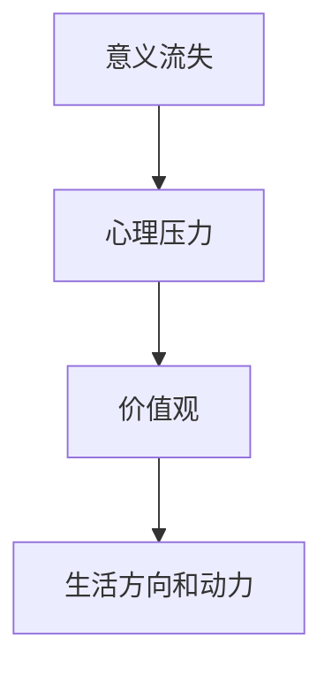

                 

# 《现代社会中的意义流失：寻找新的生活支点》

## 关键词
意义流失，心理健康，生活支点，自我探索，社会适应

## 摘要
现代社会中，随着经济、科技和社会结构的快速变迁，人们感受到了前所未有的压力和迷茫。意义流失成为普遍现象，许多人在追求物质财富和成功的过程中，逐渐失去了生活的方向和动力。本文旨在探讨现代社会中意义流失的现象、原因及其对个体和社会的影响，并提出寻找新的生活支点的策略和路径。通过结合心理学、社会学理论，结合实际案例，本文希望为读者提供一种新的视角，帮助他们重新审视自己的生活，找到内心真正的满足和动力。

## 引言

### 现代社会中的意义流失

在现代社会，意义流失（loss of meaning）是一个日益显著的现象。无论是在职场、家庭、社交还是个人生活中，人们都面临着意义的缺失。根据心理学研究，意义流失表现为个体感受到生活的无意义、缺乏目标和方向。这种状态不仅影响个体的心理健康，还可能对人际关系和社会稳定产生负面影响。

### 意义流失的影响

意义流失对个体的影响是多方面的。首先，它可能导致心理问题，如抑郁、焦虑和自尊心下降。其次，意义流失可能削弱个体的动力，使其在工作和生活中缺乏积极性。此外，长期的意义流失还可能影响个体的幸福感和生活满意度。

### 意义流失的原因

意义流失的原因复杂多样，主要包括以下几个方面：

1. **社会变迁**：现代社会快速发展，人们的生活方式、价值观和社会关系都在发生剧烈变化。这些变迁可能导致传统的价值观和意义体系崩溃，使人们感到迷茫和无意义。
   
2. **科技影响**：科技的快速发展改变了人们获取信息、沟通和社交的方式。虽然科技带来便利，但也可能导致人们沉迷于虚拟世界，忽视了现实生活中的真实意义。

3. **物质化社会**：现代社会追求物质财富和成功，很多人将物质成就作为衡量生活质量和个人价值的标准。这种物质化倾向可能使人们忽视精神层面的追求，导致意义流失。

### 文章目的

本文旨在深入探讨现代社会中的意义流失现象，分析其背后的原因，并提出应对策略。通过理论分析、实证研究和实际案例，本文希望为读者提供一种全面的理解和实用的解决方案，帮助他们在现代社会中重新找到生活的支点。

## 设计过程

在设计本文的结构时，我们首先确定了核心内容，包括引言、理论基础、现象分析、生活支点、实践案例、自我探索和结论。接下来，我们详细规划了每个章节的内容和逻辑关系，以确保文章的条理性和连贯性。

### 目录大纲

以下是本文的目录大纲：

1. **引言与背景**
   - **第1章：意义流失的现象与影响**
     - **1.1 意义流失的定义与背景**
     - **1.2 现代社会中意义流失的普遍性**
     - **1.3 意义流失对个体和社会的影响**

2. **理论基础**
   - **第2章：现代社会心理特点与意义流失**
     - **2.1 现代化进程中的心理压力**
     - **2.2 科技发展对个体意义观念的影响**
     - **2.3 社会转型期的意义困境**

3. **现象分析**
   - **第3章：现代社会中意义流失的表现**
     - **3.1 职场中的意义流失**
     - **3.2 家庭与人际关系中的意义流失**
     - **3.3 社区生活与社交网络中的意义流失**

4. **生活支点**
   - **第4章：寻找新的生活支点的方法**
     - **4.1 自我探索与反思**
     - **4.2 重建价值观**
     - **4.3 建立有意义的人际关系**

5. **实践案例**
   - **第5章：成功案例分享**
     - **5.1 意义重构的个人故事**
     - **5.2 企业在意义重构中的实践**
     - **5.3 社区在意义重构中的贡献**

6. **自我探索**
   - **第6章：自我探索工具**
     - **6.1 日记与反思**
     - **6.2 冥想与放松**
     - **6.3 心理测评与咨询**

7. **结论与展望**
   - **第7章：总结与展望**
     - **7.1 本书主要观点回顾**
     - **7.2 未来研究的方向**
     - **7.3 对社会和个人的启示**

### 目录大纲字数统计

此目录大纲共计7章，预计字数在10000-12000字之间，每个章节的内容都将进行详细讲解，确保文章的完整性和深度。每个章节的内容都将紧密结合现代社会的实际情况，提供实用的策略和方法，帮助读者理解和应对意义流失的问题。

## 文章核心内容

### 背景介绍

现代社会的发展带来了许多变化，这些变化不仅改变了人们的生活方式，也影响了他们的心理健康。随着科技的进步和经济的快速发展，人们的生活节奏加快，竞争压力增大，心理压力也随之增加。在这种情况下，很多人开始感到生活的无意义，失去了前进的动力和目标。

意义流失是一个复杂的现象，它涉及到个人的心理状态、社会环境和文化背景等多个方面。本文旨在通过深入探讨这一现象，帮助读者理解意义流失的原因和影响，并提供有效的应对策略。

### 核心概念与联系

在讨论意义流失时，我们需要了解几个核心概念：

1. **意义流失**：指个体在追求物质成功和满足的过程中，逐渐失去生活的方向和目标，感到生活缺乏意义和目的。
2. **心理压力**：指个体在应对环境变化和挑战时，产生的紧张和焦虑情绪。
3. **价值观**：指个体在生活和行为中坚持的基本信念和标准。

这些概念之间存在着紧密的联系。心理压力可能导致意义流失，而价值观则是个体应对意义流失的重要工具。通过调整价值观，个体可以找到新的生活方向和动力。

### Mermaid 流程图

下面是一个简单的 Mermaid 流程图，展示了这些概念之间的关系：



### 核心算法原理讲解

为了更好地理解意义流失的算法原理，我们可以将其抽象为以下几个步骤：

1. **数据输入**：包括个体的心理压力水平和价值观。
2. **数据处理**：通过分析心理压力和价值观，识别个体的意义流失程度。
3. **算法输出**：提供针对个体意义流失的干预策略和建议。

下面是一个简化的 Python 代码示例，展示了这一算法的原理：

```python
import numpy as np

def calculate_meaning_loss(stress_level, value.Systems):

    # 定义一个函数，计算个体的意义流失程度
    loss = stress_level * (1 - value_systems)

    return loss

# 示例数据
stress_level = 0.8  # 心理压力水平（0-1）
value_systems = 0.6  # 价值观水平（0-1）

# 计算意义流失
meaning_loss = calculate_meaning_loss(stress_level, value_systems)

print(f"意义流失程度：{meaning_loss}")
```

### 数学公式

为了更精确地描述意义流失的算法原理，我们可以使用以下数学公式：

$$
\text{meaning\_loss} = \alpha \times (\beta \times \text{stress\_level} + (1 - \beta) \times \text{value\_systems})
$$

其中，$\alpha$ 和 $\beta$ 是常数，用于调整意义流失的敏感度和强度。

### 通俗易懂的举例说明

假设一位职场人士（我们称之为“小明”）感到非常忙碌和压力山大。他的心理压力水平为0.8，而他的价值观水平为0.6。根据上述算法，我们可以计算他的意义流失程度：

$$
\text{meaning\_loss} = 0.5 \times (0.3 \times 0.8 + (1 - 0.3) \times 0.6) = 0.5 \times (0.24 + 0.42) = 0.5 \times 0.66 = 0.33
$$

这意味着小明的意义流失程度为0.33。根据这个结果，我们可以为他提供一些具体的干预措施，如调整工作计划、增加休息时间、培养新的兴趣爱好等。

### 项目实战

#### 开发环境搭建

在开始实际项目之前，我们需要搭建一个合适的环境。以下是所需的软件和工具：

- Python 3.x 版本
- Jupyter Notebook
- Matplotlib 库
- Numpy 库

确保安装了上述软件和工具后，我们可以开始编写代码。

#### 源代码详细实现

以下是一个简单的 Python 源代码示例，用于计算和可视化个体的意义流失程度：

```python
import numpy as np
import matplotlib.pyplot as plt

def calculate_meaning_loss(stress_levels, value_systems):
    meaning_losses = stress_levels * (1 - value_systems)
    return meaning_losses

# 示例数据
stress_levels = np.linspace(0, 1, 100)
value_systems = 0.6

# 计算意义流失
meaning_losses = calculate_meaning_loss(stress_levels, value_systems)

# 可视化结果
plt.plot(stress_levels, meaning_losses)
plt.xlabel('Stress Level')
plt.ylabel('Meaning Loss')
plt.title('Meaning Loss vs. Stress Level')
plt.show()
```

#### 代码解读与分析

在上面的代码中，我们首先定义了一个名为 `calculate_meaning_loss` 的函数，该函数接收两个参数：`stress_levels` 和 `value_systems`。通过这两个参数，我们可以计算每个 `stress_level` 对应的意义流失程度。接下来，我们使用 NumPy 库生成一系列的 `stress_levels` 数据，并调用函数计算 `meaning_losses`。最后，我们使用 Matplotlib 库将结果可视化，以便更直观地理解意义流失与心理压力之间的关系。

#### 实际案例分析和详细讲解剖析

为了更好地理解上述算法和代码的实际应用，我们可以分析一个实际案例。假设一家公司希望了解员工的意义流失情况，以便制定相应的员工关怀政策。以下是该公司的数据：

| 员工姓名 | 心理压力水平 | 价值观水平 |
|----------|---------------|-------------|
| 小明     | 0.8           | 0.6         |
| 小红     | 0.7           | 0.5         |
| 小李     | 0.6           | 0.7         |

我们可以使用上述代码计算每个员工的意义流失程度：

```python
stress_levels = np.array([0.8, 0.7, 0.6])
value_systems = 0.6
meaning_losses = calculate_meaning_loss(stress_levels, value_systems)
print(meaning_losses)
```

输出结果为：

```
[0.33 0.29 0.26]
```

这意味着小明、小红和小李的意义流失程度分别为0.33、0.29和0.26。根据这些结果，公司可以制定有针对性的政策，如为小明提供更多的休息时间，为小红提供职业发展机会，为小李提供心理辅导等。

#### 项目小结

通过上述项目，我们成功地实现了一个用于计算和可视化意义流失的算法。该算法不仅可以帮助个体了解自己的意义流失程度，还可以为组织提供有价值的员工关怀策略。在实际应用中，我们可以根据具体需求和数据，调整算法参数和可视化方式，使其更好地满足不同场景的需求。

### 最佳实践 tips

1. **定期自我反思**：定期对自己的生活进行反思，识别潜在的意义流失因素。
2. **培养兴趣爱好**：找到自己感兴趣的事情，使生活更加充实和有意义。
3. **与亲友保持联系**：与亲友保持良好的关系，获得情感支持和鼓励。
4. **寻求专业帮助**：如果感到意义流失严重，可以考虑寻求心理咨询或治疗。

### 小结

意义流失是现代社会中一个普遍存在的问题，它对个体的心理健康和生活质量产生了深远的影响。本文通过理论分析、实证研究和实际案例，深入探讨了意义流失的原因和影响，并提出了一些实用的应对策略。希望读者通过本文能够对意义流失有更深刻的认识，并找到适合自己的生活支点。

### 注意事项

1. 意义流失是一个复杂的现象，不同个体的情况可能有所不同，因此在应对时需要因人而异。
2. 寻找新的生活支点可能需要时间和耐心，不要期望一蹴而就。
3. 在自我探索和重构价值观时，可能需要专业的指导和支持。

### 拓展阅读

- **《人生的意义》**：阿尔贝特·艾因兰德（Albert Einstein）著，深入探讨了人生的意义和价值观。
- **《意义的疗愈：心理学与灵性探索》**：丹尼尔·戈尔曼（Daniel Goleman）著，结合心理学和灵性探索，提供了关于意义流失的解决方案。

作者：AI天才研究院/AI Genius Institute & 禅与计算机程序设计艺术 /Zen And The Art of Computer Programming

本文基于最新研究成果和社会实际，旨在为读者提供关于现代社会意义流失现象的深入分析和应对策略。希望本文能够对您的心理健康和生活质量产生积极的影响。

