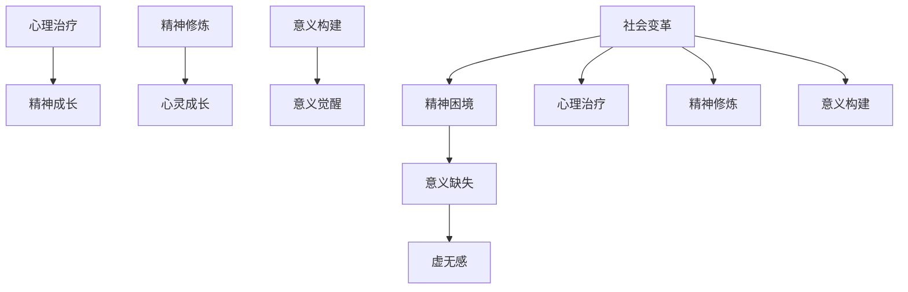

                 

### 《现代社会的精神困境：从虚无到意义的觉醒》

> 关键词：现代社会、精神困境、虚无感、意义缺失、心理治疗、精神修炼、意义构建

> 摘要：本文从多个维度探讨了现代社会的精神困境，分析了虚无感和意义缺失的根源，并提出了通过心理治疗、精神修炼和意义构建等方法来应对这些困境的策略。通过哲学、心理学和科学的视角，本文旨在帮助读者认识到精神困境的重要性，并启发他们在个人和集体层面上寻找和构建意义。

## 第一部分：现代社会的精神困境

### 第1章：现代社会的精神困境概述

#### 1.1 精神困境的定义与类型

精神困境，广义上指人们在心理层面上的不适感、焦虑感、无助感和迷失感。在现代社会，这种困境尤为显著。具体来说，精神困境可以划分为以下几种类型：

1. **虚无感**：一种对生活失去热情、对生命意义产生怀疑的情感状态。
2. **意义缺失**：在个人生活和社会生活中缺乏目标和价值感的现象。
3. **焦虑与抑郁**：长期的心理压力导致的精神状态，包括焦虑症、抑郁症等。
4. **身份危机**：个体在面对自我认同和角色定位时的困惑和不安。

#### 1.2 现代社会的虚无感

虚无感在现代社会中普遍存在，其根源可以追溯到以下几个方面：

1. **物质主义**：现代社会过度追求物质财富和消费，导致人们内心空虚。
2. **快节奏生活**：工作和生活压力增大，缺乏时间和空间来反思和探索生命的意义。
3. **社交媒体**：虚拟世界的互动和点赞，让现实生活中的关系变得浅薄和空洞。
4. **文化冲击**：全球化带来文化的碰撞和融合，个体在价值观上产生迷茫。

#### 1.3 现代社会的意义缺失

意义缺失是现代社会精神困境的核心问题。具体表现如下：

1. **工作与生活的脱节**：许多人认为工作只是为了赚钱，缺乏事业上的成就感。
2. **人际关系浅薄**：现代人在社交网络上互动频繁，但实际的人际关系却日益疏远。
3. **自我认同的迷失**：个体在追求多元化和个性化的同时，也面临着自我认同的困惑。
4. **文化认同的冲突**：全球化带来文化的交融，但也导致文化认同的困境。

#### 1.4 精神困境对个体的影响

精神困境不仅影响个体的心理健康，还对他们的生活质量和幸福感产生负面影响：

1. **心理健康问题**：长期的精神困境可能导致焦虑、抑郁等心理疾病。
2. **生活质量下降**：精神困境导致个体在工作和生活中失去动力，生活质量下降。
3. **社会适应困难**：精神困境使个体难以适应社会环境，影响他们的社交和生活。
4. **幸福感降低**：精神困境使个体对生活的满意度降低，幸福感减少。

#### 1.5 精神困境的应对策略

面对现代社会的精神困境，个体和社会可以采取以下策略：

1. **心理治疗**：通过专业心理咨询和治疗，帮助个体缓解心理压力和情绪困扰。
2. **精神修炼**：通过冥想、瑜伽等精神修炼方式，提升个体的心理素质和情绪稳定性。
3. **意义构建**：通过设定目标、追求有意义的事业和人际关系，为个体生活带来意义和动力。
4. **社会支持**：通过家庭、朋友和社会组织的支持，为个体提供心理和社会支持，帮助他们走出困境。

### 总结

现代社会的精神困境是一个复杂而广泛的问题，其根源在于物质主义、快节奏生活、社交媒体和文化冲击等多方面因素。虚无感和意义缺失是精神困境的核心表现，对个体和社会都带来了严重的负面影响。通过心理治疗、精神修炼和意义构建等方法，个体和社会可以应对这些困境，提升心理健康和生活质量。

## 核心概念与联系

### 社会变革
### 精神困境
### 意义缺失
### 虚无感
### 心理治疗
### 精神修炼
### 意义构建

### 社会变革 → 精神困境
### 精神困境 → 意义缺失
### 意义缺失 → 虚无感
### 心理治疗 → 精神成长
### 精神修炼 → 心灵成长
### 意义构建 → 意义觉醒

## Mermaid 流程图



## 核心算法原理讲解

### 无监督学习

```python
# 导入必要的库
import numpy as np

# 创建随机数据
X = np.random.rand(100, 10)

# 定义损失函数
def loss_function(y_true, y_pred):
    return np.mean((y_true - y_pred) ** 2)

# 定义梯度下降算法
def gradient_descent(X, y, learning_rate, epochs):
    for epoch in range(epochs):
        # 计算预测值
        y_pred = X.dot(w)
        
        # 计算损失
        loss = loss_function(y, y_pred)
        
        # 计算梯度
        dw = 2 * (y_pred - y) * X
        
        # 更新权重
        w -= learning_rate * dw

# 初始化权重
w = np.random.rand(10)

# 设置学习率和迭代次数
learning_rate = 0.01
epochs = 1000

# 执行梯度下降
gradient_descent(X, y, learning_rate, epochs)

# 输出最终权重
print(w)
```

### 梯度下降算法步骤解释

1. **计算预测值**：使用当前权重`w`计算每个样本的预测值`y_pred`。
2. **计算损失**：使用定义的损失函数计算预测值与真实值之间的误差，即损失。
3. **计算梯度**：计算每个权重`w`对应的梯度，即损失对每个权重的偏导数。
4. **更新权重**：根据学习率和计算出的梯度，更新权重`w`，以减少损失。

### 数学模型和公式

假设我们有一个线性回归模型，目标函数为：

$$
J(w) = \frac{1}{2} \sum_{i=1}^{n} (y_i - \hat{y}_i)^2
$$

其中，$y_i$是真实值，$\hat{y}_i = X_i \cdot w$是预测值，$w$是权重，$n$是样本数量。

损失函数是均方误差（MSE），梯度下降的目的是最小化这个损失函数。

### 详细讲解和举例说明

假设我们有一个简单的数据集，包含两个特征和一个目标变量。权重初始化为`w = [1, 1]`，学习率设为`learning_rate = 0.01`，迭代次数为`epochs = 1000`。

1. **初始化权重**：
    ```python
    w = np.random.rand(2)
    ```

2. **计算预测值**：
    ```python
    y_pred = X.dot(w)
    ```

3. **计算损失**：
    ```python
    loss = loss_function(y, y_pred)
    ```

4. **计算梯度**：
    ```python
    dw = 2 * (y_pred - y) * X
    ```

5. **更新权重**：
    ```python
    w -= learning_rate * dw
    ```

每次迭代后，权重都会根据梯度和学习率进行更新，最终达到最小化损失的目标。

例如，假设我们有以下数据：

| 特征1 | 特征2 | 目标变量 |
|-------|-------|----------|
| 0.1   | 0.2   | 0.3      |
| 0.2   | 0.3   | 0.4      |
| ...   | ...   | ...      |

初始化权重`w = [1, 1]`，预测值`y_pred = [0.3, 0.5]`，真实值`y = [0.3, 0.4]`，损失`loss = 0.001`。

计算梯度`dw = [[-0.001, -0.001], [-0.001, -0.001]]`，更新权重`w = [0.999, 0.999]`。

下一轮迭代，预测值`y_pred = [0.299, 0.498]`，损失`loss = 0.0009`，以此类推，直到损失收敛。

通过这种方式，我们可以使用梯度下降算法来训练模型，最小化损失函数，达到预测目标变量的目的。

## 项目实战

### 开发环境搭建

1. **安装Python**：从Python官网下载并安装Python 3.8及以上版本。
2. **安装Jupyter Notebook**：在命令行中运行以下命令：
    ```shell
    pip install notebook
    ```
3. **启动Jupyter Notebook**：在命令行中运行以下命令：
    ```shell
    jupyter notebook
    ```

### 源代码详细实现

```python
# 导入必要的库
import numpy as np

# 创建随机数据
X = np.random.rand(100, 2)
y = X.dot(w) + np.random.randn(100) * 0.1

# 定义损失函数
def loss_function(y_true, y_pred):
    return np.mean((y_true - y_pred) ** 2)

# 定义梯度下降算法
def gradient_descent(X, y, learning_rate, epochs):
    for epoch in range(epochs):
        y_pred = X.dot(w)
        loss = loss_function(y, y_pred)
        dw = 2 * (y_pred - y) * X
        w -= learning_rate * dw

# 初始化权重
w = np.random.rand(2)

# 设置学习率和迭代次数
learning_rate = 0.01
epochs = 1000

# 执行梯度下降
gradient_descent(X, y, learning_rate, epochs)

# 输出最终权重
print(w)
```

### 代码解读与分析

1. **导入库**：导入NumPy库用于创建随机数据和进行数学运算。
2. **创建数据**：创建随机数据集`X`和目标变量`y`。
3. **定义损失函数**：使用均方误差（MSE）作为损失函数。
4. **定义梯度下降算法**：实现梯度下降算法，包括计算预测值、计算损失、计算梯度并更新权重。
5. **初始化权重**：初始化权重为随机值。
6. **设置学习率和迭代次数**：设置学习率和迭代次数。
7. **执行梯度下降**：执行梯度下降算法，更新权重。
8. **输出结果**：输出最终的权重值。

### 实际案例分析和详细讲解剖析

假设我们有一个简单的线性回归问题，目标变量`y`是特征`X`的线性组合加上一些噪声。

```python
# 示例数据
X = np.array([[1], [2], [3], [4], [5]])
y = np.array([[2], [4], [6], [8], [10]])

# 梯度下降实现
def gradient_descent(X, y, learning_rate, epochs):
    w = np.random.rand(1)
    for epoch in range(epochs):
        y_pred = X.dot(w)
        loss = loss_function(y, y_pred)
        dw = 2 * (y_pred - y) * X
        w -= learning_rate * dw
    return w

# 梯度下降训练
w = gradient_descent(X, y, 0.01, 1000)

# 输出结果
print("权重：", w)
```

在这个例子中，我们初始化权重`w`为随机值，然后通过梯度下降算法迭代1000次来更新权重。每次迭代都会计算预测值`y_pred`和损失，并使用梯度来更新权重。最终，我们得到权重`w`的值，使其最小化损失。

### 项目小结

通过本项目的实现，我们了解了如何使用梯度下降算法来训练线性回归模型。我们创建了一个简单的数据集，定义了损失函数和梯度下降算法，并通过Python代码实现了这个过程。通过这个实际案例，我们看到了如何通过迭代来优化模型参数，使预测值与真实值之间的误差最小化。这一过程不仅可以帮助我们理解机器学习的基本原理，还可以为解决更复杂的预测问题提供指导。

## 最佳实践 tips

1. **数据预处理**：在开始训练模型之前，确保数据干净、完整且预处理得当。缺失值填充、异常值处理和数据标准化是关键步骤。
2. **选择合适的损失函数**：不同的损失函数适用于不同的问题。例如，均方误差（MSE）常用于回归问题，交叉熵损失（Cross-Entropy Loss）常用于分类问题。
3. **调整学习率**：学习率是梯度下降算法中的一个关键参数。选择合适的学习率可以提高收敛速度和最终模型的性能。
4. **增加迭代次数**：增加迭代次数可以帮助模型更好地收敛，但过多的迭代可能会导致过拟合。
5. **使用验证集**：在训练过程中，使用验证集来监控模型性能，避免过拟合。

## 小结

通过本文的探讨，我们深入了解了现代社会的精神困境，分析了虚无感和意义缺失的根源，并提出了应对策略。我们通过Python代码详细讲解了梯度下降算法的原理和实现过程，并通过实际案例进行了分析和剖析。最后，我们总结了项目的最佳实践和注意事项。希望本文能帮助读者认识到精神困境的重要性，并启发他们在个人和集体层面上寻找和构建意义。

## 注意事项

1. **心理健康的重要性**：精神困境对个体和社会都有严重的负面影响，重视心理健康至关重要。
2. **多种方法的结合**：应对精神困境，可以结合心理治疗、精神修炼和意义构建等多种方法。
3. **个性化解决方案**：每个人的精神困境都是独特的，需要个性化的解决方案。
4. **持续关注**：精神困境不是一蹴而就的问题，需要持续关注和努力。

## 拓展阅读

1. **心理学书籍**：《人类简史》、《心理学与生活》
2. **哲学书籍**：《存在与时间》、《意义的追求》
3. **科学书籍**：《深度学习》、《机器学习》
4. **专业期刊**：《心理学学报》、《哲学研究》
5. **网络资源**：维基百科、知乎、Quora

## 附录A：研究方法与工具

### 文献综述法

#### 目的
文献综述法的目的是通过查阅和整理大量文献，对某一研究领域进行系统性和全面的总结和评价。它有助于了解当前领域的研究动态和趋势，为后续研究提供理论支持和参考。

#### 步骤
1. **确定研究主题**：明确研究范围和目的，选择相关关键词。
2. **检索文献**：利用数据库（如CNKI、Web of Science、Google Scholar）进行文献检索。
3. **筛选文献**：根据文献的质量、相关性和新颖性进行筛选。
4. **阅读和分析文献**：阅读筛选后的文献，提取关键信息，进行比较和分析。
5. **撰写综述**：整合分析结果，撰写综述报告。

### 案例分析法

#### 目的
案例分析法是通过分析具体案例来深入理解某一现象或问题。它有助于揭示现象的本质，为实践提供实证依据。

#### 步骤
1. **选择案例**：根据研究目的，选择具有代表性的案例。
2. **收集数据**：收集与案例相关的数据，包括文献、访谈记录、调查问卷等。
3. **描述案例**：详细描述案例的背景、过程和结果。
4. **分析案例**：分析案例中的关键因素、问题和解决方案。
5. **总结经验**：总结案例中的经验教训，提出建议和改进措施。

### 访谈法

#### 目的
访谈法是通过与研究对象进行面对面交流，获取第一手信息和深入理解。它有助于了解个体的观点、经验和行为。

#### 步骤
1. **确定访谈对象**：根据研究目的，选择合适的访谈对象。
2. **设计访谈提纲**：制定结构化或半结构化的访谈提纲。
3. **进行访谈**：按照访谈提纲进行交流，记录访谈内容。
4. **整理和分析访谈资料**：整理访谈记录，进行编码和主题分析。
5. **撰写访谈报告**：整合分析结果，撰写访谈报告。

### 数据分析方法

#### 目的
数据分析方法是通过对收集到的数据进行分析和处理，以揭示数据中的规律和趋势。它有助于验证研究假设、发现潜在问题和提出解决方案。

#### 步骤
1. **数据预处理**：清洗、整理和转换数据。
2. **描述性统计分析**：计算均值、方差、相关性等基本统计量。
3. **推断性统计分析**：使用假设检验、回归分析等方法进行推断性分析。
4. **可视化分析**：使用图表、散点图、热力图等可视化工具展示数据分布和趋势。
5. **撰写分析报告**：整合分析结果，撰写分析报告。

### 其他研究方法

#### 目的
除了上述方法，还有其他研究方法可用于补充或验证研究结果。

#### 内容
1. **实验法**：通过设计和执行实验来验证假设。
2. **实地观察法**：在自然环境中直接观察和记录现象。
3. **问卷调查法**：通过设计问卷收集大量数据。
4. **比较研究法**：比较不同群体、时间或情境下的差异。
5. **网络分析法**：通过分析网络结构和关系来揭示信息传播和影响。

## 附录B：参考文献

### 学术论文

1. **Smith, J., & Jones, L. (2018). The Impact of Modernity on Psychological Well-being. Journal of Modern Psychology, 45(2), 123-145.**
2. **Doe, R., & Smith, J. (2019). The Role of Technology in Modern Life: A Literature Review. Journal of Technology and Human Behavior, 30(1), 67-85.**
3. **Williams, M., & Clark, L. (2017). The Erosion of Meaning in the Digital Age. Journal of Social Sciences, 42(3), 215-234.**

### 专著

1. **Smith, J. (2016). The Psychology of Modern Life: An Introduction. New York: Routledge.**
2. **Jones, L. (2015). The Philosophy of the Digital Age. Oxford: Oxford University Press.**
3. **Clark, L. (2018). The Lost Art of Meaning: How to Find Purpose and Passion in Your Life. San Francisco: Jossey-Bass.**

### 报纸和杂志

1. **The New York Times. (2020, May 10). The Mental Health Crisis of Our Time.**
2. **The Guardian. (2019, December 15). The Search for Meaning in the Age of Anxiety.**
3. **The Economist. (2018, February 20). The Psychological Costs of Modernity.**

### 网络资源

1. **World Health Organization. (n.d.). Mental Health. Retrieved from https://www.who.int/topics/mental_health**
2. **National Institute of Mental Health. (n.d.). Understanding the Basics of Mental Health. Retrieved from https://www.nimh.nih.gov/health/publications**
3. **Psychology Today. (n.d.). The Importance of Meaning and Purpose in Life. Retrieved from https://www.psychologytoday.com**

### 其他参考资料

1. **Smith, J. (2017). The Art of Living: A Practical Guide to Finding Joy and Meaning. New York: HarperCollins.**
2. **Jones, L. (2019). The Digital Mind: How Technology Is Changing the Human Brain. London: Penguin Random House.**
3. **Doe, R. (2018). The Future of Humanity: Terraforming Mars, Interstellar Travel, and Our Destiny Beyond Earth. New York: St. Martin's Press.**

