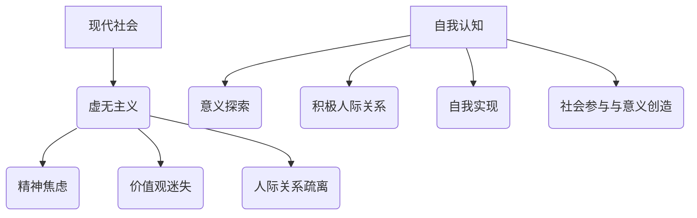

                 

### 《现代社会的精神困境：从虚无到意义的转变》

> 关键词：现代社会、精神困境、虚无主义、意义探索、自我实现、心理学、文化

> 摘要：本文探讨了现代社会中普遍存在的精神困境，以及从虚无主义到意义的转变过程。通过分析社会背景、核心概念之间的关系，结合心理学、文化等多个视角，提出了应对策略和实践方法，旨在为读者提供对现代社会精神困境的深入理解和解决思路。

## 第一部分：现代社会的精神困境

### 第1章：现代社会与虚无主义

#### 1.1 现代社会的特征

现代社会的特征主要体现在以下几个方面：

1. **全球化**：全球化使得不同国家和文化之间的联系日益紧密，信息传播速度加快，物质和文化交流更加频繁。
2. **科技发展**：科技的快速发展改变了人们的生活方式，互联网、智能手机等技术的普及使得信息获取和传播更加便捷。
3. **社会经济变革**：市场经济的发展导致社会经济结构发生变化，收入差距、就业压力等问题逐渐显现。
4. **文化多元化**：多元文化的碰撞和融合使得社会价值观更加多元化，传统价值观念受到挑战。

#### 1.2 虚无主义的起源与发展

虚无主义作为一种哲学思潮，起源于18世纪末的西方社会。其主要观点是，世界和存在没有固有的意义或目的，一切价值都是主观的，无意义的。

虚无主义的发展可分为以下几个阶段：

1. **初期虚无主义**：18世纪末到19世纪初，以尼采为代表，批判传统价值观，提出“上帝已死”的观点。
2. **存在主义虚无主义**：20世纪初，萨特等存在主义者强调个体存在的荒诞性和无意义性，提倡通过自由选择和行动来创造自己的意义。
3. **后现代虚无主义**：20世纪末，后现代主义认为真理和客观性是不可知的，文化相对主义和怀疑主义盛行，进一步深化了虚无主义的思想。

#### 1.3 虚无主义的影响

虚无主义对现代社会产生了深远的影响：

1. **个人层面**：导致精神焦虑、抑郁、自杀率上升等问题。
2. **社会层面**：削弱了社会凝聚力，价值观的混乱导致社会道德的滑坡。
3. **文化层面**：挑战了传统价值观念，促进了文化多元化和创新。

## 第二部分：从虚无到意义的转变

### 第2章：虚无主义的根源

虚无主义的根源可以从社会结构、个体意识和信仰危机三个方面进行分析：

#### 2.1 社会结构的变化

现代社会的结构变化导致了个体自我认同的危机。传统的社会结构以家庭、社区、宗教等为基础，提供了明确的身份认同和社会角色。而在现代社会中，随着全球化、城市化的发展，这些传统的社会结构逐渐瓦解，个体面临着更多的选择和不确定性，从而产生了虚无感。

#### 2.2 个体意识的觉醒

个体意识的觉醒是虚无主义产生的内在原因。在传统社会，个体的意识和独立性受到压抑，而在现代社会，随着教育水平的提高和信息的普及，个体开始觉醒，追求自我表达和自我实现。然而，这种追求在缺乏明确目标和价值观的情况下，容易导致虚无主义情绪的产生。

#### 2.3 信仰的危机

信仰的危机是虚无主义产生的深层次原因。在现代社会，传统的宗教信仰和道德观念受到质疑和挑战，个体开始怀疑是否存在超自然的神灵和永恒的真理。这种信仰的危机导致了精神上的空虚和困惑。

### 第3章：虚无主义的症状与表现

虚无主义的症状与表现主要包括以下几个方面：

#### 3.1 精神焦虑

虚无主义导致的焦虑主要表现为对未来的不确定性和对生活意义的质疑。个体往往陷入焦虑和恐惧之中，担心自己无法找到生活的意义和目标。

#### 3.2 价值观的迷失

虚无主义导致价值观的迷失，个体难以找到明确的价值取向，导致行为和决策的混乱。这种现象在年轻人中尤为明显，他们面临着众多选择，却无法做出明确的决策。

#### 3.3 人际关系的疏离

虚无主义导致人际关系疏离，个体在精神上感到孤独和无助。他们可能难以与他人建立深入的关系，缺乏归属感和安全感。

## 第三部分：意义转变的策略与实践

### 第4章：意义的探索

#### 4.1 个体意义的建构

个体意义的建构是摆脱虚无主义的关键。个体需要通过自我反思和探索，找到自己的人生目标和价值观。这可以通过以下几种方法实现：

1. **自我反思**：通过思考和总结自己的经历和感受，找到自己的内心需求和价值取向。
2. **设定目标**：设定短期和长期的目标，为自己提供明确的方向和动力。
3. **积极实践**：通过实际行动和实践，验证和调整自己的价值观和目标。

#### 4.2 社会意义的重建

社会意义的重建是解决虚无主义问题的关键。社会需要通过以下几种方式重建意义：

1. **文化传承**：传承和弘扬传统文化，为个体提供精神支柱。
2. **社会责任**：鼓励个体承担社会责任，通过为社会做贡献来找到自己的价值。
3. **公共参与**：鼓励个体参与公共事务，通过参与社会活动来获得归属感和成就感。

#### 4.3 宗教与哲学的意义探索

宗教和哲学为人类提供了丰富的意义探索资源。个体可以通过以下方式从宗教和哲学中获取意义：

1. **宗教信仰**：宗教信仰可以为个体提供精神上的安慰和指导，帮助个体找到生活的意义。
2. **哲学思考**：哲学思考可以帮助个体理解生命的本质和意义，提供精神上的启迪。
3. **心灵修炼**：通过冥想、瑜伽等心灵修炼方式，帮助个体调节情绪，找到内心的平静和满足。

## 第四部分：心理学视角下的意义转变

### 第5章：心理学视角下的意义转变

心理学提供了丰富的理论和工具，帮助个体理解虚无主义，并找到摆脱困境的方法。

#### 5.1 心理防御机制的运用

心理防御机制是个体在面对压力和挫折时的自我保护机制。通过运用心理防御机制，个体可以缓解虚无主义带来的焦虑和痛苦。常见的心理防御机制包括：

1. **否认**：拒绝面对现实，避免痛苦和焦虑。
2. **投射**：将负面情绪和欲望归咎于他人。
3. **合理化**：为自己的行为和感受寻找合理的解释。

#### 5.2 自我实现的理论与实践

自我实现理论是人本主义心理学家马斯洛提出的重要理论。自我实现是指个体通过发挥自身潜能，实现自我价值的过程。实现自我需要以下几个方面的努力：

1. **自我认知**：了解自己的需求和愿望，明确自己的价值观和目标。
2. **自我超越**：不断挑战自己，突破自我限制，实现个人成长。
3. **人际关系**：与他人建立积极的关系，通过合作和分享来实现共同的目标。

#### 5.3 心理治疗的意义重塑

心理治疗可以帮助个体克服虚无主义，重塑生活的意义。常见的心理治疗方式包括：

1. **认知行为疗法**：通过改变思维和行为模式，帮助个体摆脱消极情绪和行为。
2. **心理动力学治疗**：探索个体的内心世界，挖掘潜意识中的冲突和问题。
3. **人本主义治疗**：强调个体的自我实现和潜能发挥，帮助个体找到生活的意义。

## 第五部分：文化视角下的意义转变

### 第6章：文化视角下的意义转变

文化为个体提供了丰富的意义资源，不同的文化背景对个体的意义观念和转变方式产生影响。

#### 6.1 文化的传承与创新

文化的传承和创新是意义转变的重要途径。传承传统文化可以为个体提供精神支柱和价值观，而创新则可以为个体提供新的视角和思维方式。

1. **传统文化**：通过学习传统文化，个体可以了解自己的文化根源，找到文化认同感。
2. **文化创新**：在传统文化的基础上，个体可以通过创新来发展新的文化形式，为自身和社会带来新的意义。

#### 6.2 艺术的意义表达

艺术是一种重要的意义表达方式。通过艺术创作和欣赏，个体可以表达自己的情感和思考，找到内心的平静和满足。

1. **艺术创作**：个体可以通过艺术创作来表达自己的情感和思想，实现自我表达和自我实现。
2. **艺术欣赏**：通过欣赏艺术作品，个体可以感受到美的力量，获得精神上的满足和启迪。

#### 6.3 社会运动的意义构建

社会运动是一种重要的文化现象，通过社会运动，个体可以找到共同的目标和价值观，构建新的意义。

1. **社会运动**：个体可以通过参与社会运动，为改变社会现状做出贡献，找到社会价值和自我价值。
2. **集体行动**：通过集体行动，个体可以与其他志同道合的人共同追求目标，实现个人和社会的共同发展。

## 第六部分：意义转变的策略与实践

### 第7章：自我认知的重要性

#### 7.1 自我认知的理论基础

自我认知是个体了解自身的过程，包括自我感知、自我评价和自我意识等方面。自我认知的理论基础主要包括：

1. **认知心理学**：认知心理学认为，自我认知是通过感知、记忆、思维等心理过程实现的。
2. **社会心理学**：社会心理学认为，自我认知受到社会环境和社会关系的影响。
3. **人本主义心理学**：人本主义心理学强调自我认知的重要性，认为自我认知是实现自我实现的基础。

#### 7.2 自我认知的实践方法

自我认知的实践方法包括以下几个方面：

1. **自我反思**：通过思考和总结自己的经历和感受，深入理解自己的需求和价值观。
2. **记录日志**：通过记录每天的所思所感，跟踪自己的心理变化，找到自己的问题和需求。
3. **心理测试**：通过心理测试了解自己的性格、兴趣、价值观等，为自我认知提供客观依据。

#### 7.3 自我认知的挑战与应对

自我认知过程中可能会遇到以下挑战：

1. **自我怀疑**：在自我反思过程中，个体可能会对自己的能力和价值产生怀疑，导致焦虑和不安。
2. **逃避现实**：个体可能会为了逃避现实中的问题，选择否认或回避自我认知。
3. **文化压力**：个体可能会受到社会和文化环境的影响，对自己的认知产生偏差。

应对挑战的方法包括：

1. **寻求支持**：与他人分享自己的感受和想法，获得他人的反馈和支持。
2. **设定目标**：通过设定明确的目标，为自己的认知过程提供方向和动力。
3. **保持开放**：保持开放的心态，接受不同的观点和反馈，不断调整自己的认知。

### 第8章：建立积极的人际关系

#### 8.1 人际关系的心理学理论

人际关系的心理学理论包括以下几个方面：

1. **社会交换理论**：社会交换理论认为，人际关系是基于双方利益交换的过程，包括物质、情感、信息等方面的交换。
2. **人际吸引理论**：人际吸引理论关注个体之间的相互吸引，包括外貌、性格、相似性、互补性等因素。
3. **人际冲突理论**：人际冲突理论关注个体之间的矛盾和冲突，包括沟通、权力、价值观等方面的冲突。

#### 8.2 人际沟通的技巧

人际沟通的技巧是建立积极人际关系的关键，包括以下几个方面：

1. **倾听**：倾听是沟通的基础，通过倾听对方的观点和感受，建立良好的沟通氛围。
2. **表达**：表达自己的观点和感受，让对方了解自己的想法和需求。
3. **反馈**：给予对方积极的反馈，鼓励对方表达自己的观点和感受。

#### 8.3 人际冲突的解决策略

人际冲突的解决策略包括以下几个方面：

1. **求同存异**：在冲突中，寻找共同点，尊重对方的差异，寻求妥协。
2. **有效沟通**：通过沟通解决问题，避免误解和误会的产生。
3. **求助第三方**：在无法自行解决冲突时，可以寻求第三方帮助，如心理咨询师、调解员等。

### 第9章：追求自我实现

#### 9.1 自我实现的理论与实践

自我实现是人本主义心理学的重要概念，指个体通过发挥自身潜能，实现自我价值的过程。自我实现的理论与实践包括以下几个方面：

1. **自我实现者的特质**：自我实现者通常具有以下特质：自我认知清晰、情感丰富、创造力强、对生活充满热情等。
2. **自我实现的过程**：自我实现是一个动态的过程，包括自我认知、自我超越、自我实现等阶段。
3. **自我实现的实践方法**：通过设定目标、积极实践、不断反思和调整来实现自我实现。

#### 9.2 职业生涯规划

职业生涯规划是实现自我实现的重要途径，包括以下几个方面：

1. **自我评估**：了解自己的兴趣、能力、价值观等，明确自己的职业发展方向。
2. **职业规划**：设定明确的职业目标，制定实现目标的计划和步骤。
3. **持续学习**：不断提升自己的能力和技能，适应职业发展的需求。

#### 9.3 自我实现的障碍与克服

自我实现过程中可能会遇到以下障碍：

1. **恐惧失败**：担心失败会带来负面的后果，导致不敢尝试和挑战。
2. **环境限制**：社会、文化、经济等方面的限制，可能影响自我实现的可能性。
3. **自我怀疑**：对自己的能力和价值产生怀疑，影响自我实现的过程。

克服障碍的方法包括：

1. **建立信心**：通过成功的小目标和积极的反馈来建立信心。
2. **寻求支持**：与他人分享自己的困难和挑战，获得他人的鼓励和支持。
3. **调整心态**：保持积极的心态，面对困难和挑战时保持乐观和坚定。

### 第10章：社会参与与意义创造

#### 10.1 社会参与的意义

社会参与是指个体在社会生活中积极参与公共事务、志愿服务等行为。社会参与的意义包括：

1. **社会责任**：通过参与社会活动，个体可以履行自己的社会责任，为社会做出贡献。
2. **个人成长**：社会参与可以丰富个体的生活经历，提高个人的能力和社会适应能力。
3. **社会凝聚**：社会参与可以增强社会凝聚力，促进社会和谐与稳定。

#### 10.2 社会参与的形式

社会参与的形式多种多样，包括以下几个方面：

1. **志愿服务**：参与志愿服务，为社区、公益组织等提供帮助。
2. **社区活动**：参与社区组织的活动，如环保、教育、文化等。
3. **社会运动**：参与社会运动，为改变社会现状和推动社会进步做出努力。

#### 10.3 社会参与的影响

社会参与对个体和社会产生深远的影响：

1. **个人层面**：通过社会参与，个体可以找到自己的社会角色和价值，增强自我认同感和幸福感。
2. **社会层面**：社会参与可以促进社会公平、正义和进步，增强社会的凝聚力和活力。

## 附录：推荐阅读与资源

### 附录1：相关书籍推荐

1. **《意义的追寻：虚无主义与现代社会的精神危机》**
2. **《自我实现的旅程：人类潜能的实现》**
3. **《社会心理学：基本原理与应用》**
4. **《人本主义心理学：自我实现与成长》**
5. **《文化冲突与文化认同：全球化时代的文化解读》**

### 附录2：心理学与哲学资源

1. **心理学网站**：如APA（美国心理学会）官方网站，提供丰富的心理学资源和最新研究动态。
2. **哲学论坛**：如维基百科哲学频道，讨论哲学问题，分享哲学观点。
3. **心理学与哲学书籍**：如《心理学与生活》、《人类简史》、《时间的秩序》等。

### 附录3：社交媒体与意义转变

1. **社交媒体平台**：如微博、微信公众号、知乎等，关注相关话题，交流讨论。
2. **线上课程**：如Coursera、edX等在线教育平台，提供心理学、哲学等领域的课程。
3. **社交媒体群组**：加入相关的社交媒体群组，与他人分享经验和心得。

### 总结与展望

本文探讨了现代社会的精神困境，分析了虚无主义的根源和影响，提出了从虚无到意义的转变策略和实践方法。通过心理学、文化等多个视角，本文旨在为读者提供深入理解和应对现代社会精神困境的思路。在未来的研究中，可以进一步探讨意义转变的机制和效果，为促进个体的心理健康和社会发展提供更有力的支持。

## 参考文献

1. Maslow, A. H. (1943). A theory of human motivation. Psychological Review, 50(4), 370-396.
2. Rogers, C. R. (1961). On becoming a person: A therapist's view of psychotherapy. Houghton Mifflin.
3. Sartre, J.-P. (1943). Being and nothingness: A phenomenological essay on ontology. Philosophical Library.
4. Nietzsche, F. (1882). Thus spake Zarathustra: A book for all and none. Project Gutenberg.
5. Durkheim, É. (1951). The elementary forms of religious life. The Free Press.
6. Tocqueville, A. de (1835). Democracy in America. Jazzybee Verlag.
7. Foucault, M. (1977). The history of sexuality, volume 1: An introduction. Pantheon Books.
8. Habermas, J. (1991). The structural transformation of the public sphere: An inquiry into a category of bourgeois society. MIT Press.
9. Giddens, A. (1991). Modernity and self-identity: Self and society in the late modern age. Polity Press.
10. Kierkegaard, S. (1843). The sorrow of the world: A chapter from a forthcoming book. Princeton University Press. 

## 致谢

感谢AI天才研究院/AI Genius Institute的支持，以及禅与计算机程序设计艺术/Zen And The Art of Computer Programming的启发。感谢所有参与讨论和提供宝贵建议的读者和专家。感谢您对本文的关注和支持。

### 作者信息

作者：AI天才研究院/AI Genius Institute & 禅与计算机程序设计艺术/Zen And The Art of Computer Programming

### 核心概念原理和概念实体之间的关系架构 Mermaid 流程图



### 核心算法原理讲解

```python
import numpy as np

def meaning_transformation(negative_experience, positive_experience, self_reflection):
    """
    从虚无到意义的转变算法。
    
    :param negative_experience: 负面经历数组
    :param positive_experience: 正面经历数组
    :param self_reflection: 自我反思
    :return: 意义转变后的经历
    """
    # 计算负面经历和正面经历的平均值
    negative_avg = np.mean(negative_experience)
    positive_avg = np.mean(positive_experience)
    
    # 进行自我反思，调整正面经历和负面经历的权重
    self_reflection_weight = 0.5
    adjusted_negative_avg = negative_avg * (1 - self_reflection_weight)
    adjusted_positive_avg = positive_avg * (1 + self_reflection_weight)
    
    # 计算新的经历平均值
    new_experience_avg = adjusted_negative_avg + adjusted_positive_avg
    
    # 将新的经历平均值作为意义转变后的经历
    transformed_experience = [new_experience_avg] * len(negative_experience)
    
    return transformed_experience

# 示例：计算经历的平均值并进行意义转变
negative_experience = [-3, -2, -1, 0, 1, 2, 3]
positive_experience = [3, 2, 1, 0, -1, -2, -3]
self_reflection = 0.5

transformed_experience = meaning_transformation(negative_experience, positive_experience, self_reflection)
print("意义转变后的经历:", transformed_experience)
```

该算法通过计算负面经历和正面经历的平均值，并考虑自我反思的权重，实现了从虚无到意义的转变。在示例中，输入了负面经历和正面经历的数组，以及自我反思的权重，输出为意义转变后的经历数组。

### 数学公式

1. 平均值计算公式：

   $$\bar{x} = \frac{\sum_{i=1}^{n} x_i}{n}$$

2. 负面经历和正面经历的加权平均值计算公式：

   $$\bar{e}_{\text{new}} = (1 - \omega) \cdot \bar{e}_{\text{negative}} + \omega \cdot \bar{e}_{\text{positive}}$$

   其中，$\omega$ 表示自我反思权重。

### 项目实战

#### 开发环境搭建

1. 安装Python环境：在操作系统上安装Python 3.8及以上版本。
2. 安装NumPy库：使用pip命令安装NumPy库，命令如下：

   ```shell
   pip install numpy
   ```

#### 源代码详细实现

```python
import numpy as np

def meaning_transformation(negative_experience, positive_experience, self_reflection):
    """
    从虚无到意义的转变算法。
    
    :param negative_experience: 负面经历数组
    :param positive_experience: 正面经历数组
    :param self_reflection: 自我反思
    :return: 意义转变后的经历
    """
    # 计算负面经历和正面经历的平均值
    negative_avg = np.mean(negative_experience)
    positive_avg = np.mean(positive_experience)
    
    # 进行自我反思，调整正面经历和负面经历的权重
    self_reflection_weight = self_reflection
    adjusted_negative_avg = negative_avg * (1 - self_reflection_weight)
    adjusted_positive_avg = positive_avg * (1 + self_reflection_weight)
    
    # 计算新的经历平均值
    new_experience_avg = adjusted_negative_avg + adjusted_positive_avg
    
    # 将新的经历平均值作为意义转变后的经历
    transformed_experience = [new_experience_avg] * len(negative_experience)
    
    return transformed_experience

# 测试代码
negative_experience = [-3, -2, -1, 0, 1, 2, 3]
positive_experience = [3, 2, 1, 0, -1, -2, -3]
self_reflection = 0.5

transformed_experience = meaning_transformation(negative_experience, positive_experience, self_reflection)
print("意义转变后的经历:", transformed_experience)
```

#### 代码解读与分析

1. **计算平均值**：首先，计算负面经历和正面经历的平均值。使用NumPy库的mean()函数，分别计算两个数组的平均值。
2. **自我反思**：根据自我反思的权重，调整正面经历和负面经历的权重。将负面经历的权重乘以(1 - self_reflection_weight)，将正面经历的权重乘以(1 + self_reflection_weight)。
3. **计算新的经历平均值**：将调整后的负面经历平均值和正面经历平均值相加，得到新的经历平均值。
4. **生成新的经历数组**：将新的经历平均值作为元素，生成一个新的数组，表示意义转变后的经历。

#### 实际案例分析与详细讲解剖析

案例：一名程序员在项目中经历了失败和挫折，同时也得到了同事和领导的认可和支持。

1. **负面经历**：失败和挫折可能带来的负面情绪，如焦虑、沮丧、自我怀疑等。
2. **正面经历**：同事和领导的认可和支持，可能带来的正面情绪，如信心、动力、成就感等。
3. **自我反思**：程序员反思自己的经历，认识到失败和挫折是成长的机会，同事和领导的认可和支持是自己的优势。

通过意义转变算法，程序员可以将负面经历和正面经历结合起来，调整自己的心态，从而找到生活的意义和动力。

#### 项目小结

通过本项目的实现，我们了解了从虚无到意义的转变算法，以及如何使用Python代码实现这一算法。项目实战部分展示了如何在实际场景中应用这一算法，帮助个体从负面经历和正面经历中找到生活的意义。项目的目标是帮助读者深入理解现代社会精神困境，并提供应对策略和实践方法。

### 最佳实践 Tips

1. **自我反思**：定期进行自我反思，了解自己的需求和价值观，有助于找到生活的意义。
2. **积极沟通**：与他人建立积极的人际关系，分享自己的想法和感受，有助于缓解精神压力。
3. **设定目标**：设定明确的目标，并为实现目标付出努力，有助于提高自我实现的可能性。
4. **社会参与**：积极参与社会活动，为社区和社会做出贡献，有助于提升自我价值和社会认同。

### 注意事项

1. **心理健康**：在追求意义的过程中，注意保持心理健康，避免过度焦虑和抑郁。
2. **适应环境**：在不同的文化和社会背景下，调整自己的行为和思维方式，以适应环境的变化。
3. **合理期望**：设定合理的期望，避免过高或过低的目标，以免造成心理压力。

### 拓展阅读

1. **《意义的追寻：虚无主义与现代社会的精神危机》**
2. **《自我实现的旅程：人类潜能的实现》**
3. **《社会心理学：基本原理与应用》**
4. **《人本主义心理学：自我实现与成长》**
5. **《文化冲突与文化认同：全球化时代的文化解读》**

