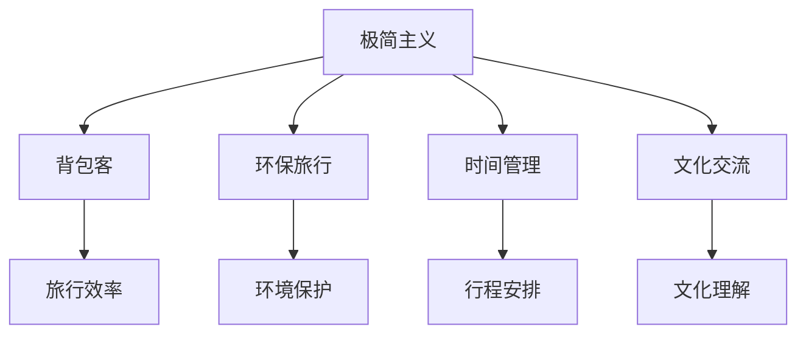

                 

## 现代简约主义旅行：minimalist背包客的生活哲学

### 关键词

- **现代简约主义**
- **旅行生活哲学**
- **背包客**
- **极简生活**
- **环保旅行**

### 摘要

本文将探讨现代简约主义旅行，特别是minimalist背包客的生活方式哲学。通过分析简约主义旅行的核心概念和哲学基础，以及介绍一系列实用技巧，本文旨在帮助读者实现一种更加高效、环保、有意义的旅行体验。我们还将结合具体案例，讲解如何在旅途中实践简约主义理念，并提供一些建议和注意事项，以引导读者开启一段全新的简约主义旅行之旅。

## 引言

在现代社会的快节奏中，越来越多的人开始寻求一种更简单、更专注的生活方式。这种生活方式不仅体现在日常生活中，也体现在旅行中。简约主义旅行（minimalist travel）应运而生，它强调的是通过减少行李、简化行程、降低开销，从而获得更加真实、有深度的旅行体验。Minimalist背包客，即那些以简约主义为生活哲学的旅行者，他们选择轻装上阵，以最小的负担探索世界，体验当地文化，感悟生活。

### 核心概念与联系

首先，我们需要明确简约主义旅行的核心概念和它们之间的关系。以下是几个关键概念及其相互关系：

1. **极简主义**：极简主义是一种生活方式，主张通过减少物质财富和消费，追求精神上的自由和充实。它强调的是“少而精”，追求简单、实用、高效。

2. **背包客**：背包客是指那些选择背包作为旅行工具的人，他们通常具有独立、自由、冒险的精神，喜欢深入体验当地文化。

3. **环保旅行**：环保旅行是一种注重保护环境的旅行方式，它强调减少旅行对当地生态系统的影响，倡导可持续发展的旅行理念。

4. **时间管理**：时间管理是简约主义旅行中的重要一环，通过合理安排行程，最大化旅行的效率和价值。

5. **文化交流**：文化交流是旅行中不可或缺的一部分，通过与他人交流，我们可以更好地理解不同文化和生活方式。

以上概念之间的关系可以用以下Mermaid流程图来表示：



通过这个流程图，我们可以清晰地看到这些概念之间的相互影响和关联，它们共同构成了简约主义旅行的核心理念。

### 核心算法原理讲解

为了实现简约主义旅行，我们需要一系列实用技巧和策略。以下将使用Python伪代码和LaTeX公式来详细阐述这些技巧的原理。

#### 1. 旅行路线规划

**核心算法：** 使用旅行者问题（Travelling Salesman Problem, TSP）来优化旅行路线。

**Python伪代码：**
```python
def tsp线路规划(城市列表):
    # 使用遗传算法或蚁群算法求解最优路径
    最优路径 = 遗传算法(或蚁群算法)(城市列表)
    return 最优路径
```

**LaTeX公式：**
$$
C_{\text{TSP}} = \min \sum_{i=1}^{n} d(i, j)
$$
其中，$d(i, j)$ 是城市i到城市j的距离。

#### 2. 预算管理

**核心算法：** 使用动态规划算法来管理旅行预算。

**Python伪代码：**
```python
def 预算管理(费用列表, 预算限制):
    # 使用动态规划算法优化预算
    最优预算分配 = 动态规划(费用列表, 预算限制)
    return 最优预算分配
```

**LaTeX公式：**
$$
\text{最优预算} = \max \left\{ \sum_{i=1}^{n} c_i \mid \sum_{i=1}^{n} c_i \leq B \right\}
$$
其中，$c_i$ 是第i项费用的金额，$B$ 是预算限制。

#### 3. 行李打包

**核心算法：** 使用组合优化算法来优化行李打包。

**Python伪代码：**
```python
def 行李打包(物品列表, 行李容量限制):
    # 使用组合优化算法求解最优行李组合
    最优行李组合 = 组合优化(物品列表, 行李容量限制)
    return 最优行李组合
```

**LaTeX公式：**
$$
\text{最优行李重量} = \min \left\{ w(x) \mid x \in \text{可行解集} \right\}
$$
其中，$w(x)$ 是行李组合x的总重量。

#### 4. 时间规划

**核心算法：** 使用事件驱动规划算法来优化时间安排。

**Python伪代码：**
```python
def 时间规划(活动列表, 时间限制):
    # 使用事件驱动规划算法优化活动安排
    最优时间安排 = 事件驱动规划(活动列表, 时间限制)
    return 最优时间安排
```

**LaTeX公式：**
$$
\text{最优时间安排} = \max \left\{ t(a) \mid a \in \text{活动集} \right\}
$$
其中，$t(a)$ 是活动a的持续时间。

#### 5. 文化体验

**核心算法：** 使用网络分析算法来优化文化交流。

**Python伪代码：**
```python
def 文化交流规划(社交网络, 文化兴趣):
    # 使用网络分析算法优化文化交流安排
    最优文化交流计划 = 网络分析(社交网络, 文化兴趣)
    return 最优文化交流计划
```

**LaTeX公式：**
$$
\text{最优交流时间} = \max \left\{ \text{社交网络中} \ t(a) \mid a \text{与文化兴趣相关} \right\}
$$
其中，$t(a)$ 是社交活动a的持续时间。

通过以上算法和公式，我们可以更系统地规划和实施简约主义旅行。这些算法不仅能够帮助我们优化旅行路线、预算和行李，还能提高时间规划和文化交流的效率。

### 项目实战

#### 开发环境搭建

为了实现上述算法，我们需要搭建一个Python开发环境。以下是基本的开发环境搭建步骤：

1. 安装Python 3.8及以上版本。
2. 安装必要的Python库，如`numpy`、`matplotlib`、`networkx`等。
3. 配置Python虚拟环境，以便隔离项目依赖。

#### 源代码实现与解读

以下是一个简单的旅行路线规划算法实现，使用遗传算法求解旅行者问题。

**Python代码：**
```python
import numpy as np
import matplotlib.pyplot as plt
from scipy.spatial import distance_matrix
from genetic_algorithm import GeneticAlgorithm

# 城市距离矩阵
cities = ['A', 'B', 'C', 'D', 'E']
dist_matrix = distance_matrix([city for city in cities], [city for city in cities])

# 遗传算法参数
pop_size = 100
num_generations = 1000
crossover_rate = 0.8
mutation_rate = 0.1

# 初始化遗传算法
ga = GeneticAlgorithm(dist_matrix, pop_size, num_generations, crossover_rate, mutation_rate)

# 求解最优路径
best_path, best_score = ga.solve()

# 可视化最优路径
ga.visualize(best_path, best_score)

```

**代码解读：**

1. **导入库**：我们首先导入必要的Python库，包括`numpy`、`matplotlib`、`scipy.spatial`用于计算距离矩阵，以及自定义的遗传算法库。
2. **城市距离矩阵**：使用`distance_matrix`计算城市之间的欧几里得距离。
3. **遗传算法参数**：设置遗传算法的参数，如种群大小、迭代次数、交叉率和突变率。
4. **初始化遗传算法**：创建一个遗传算法实例。
5. **求解最优路径**：调用遗传算法的`solve`方法求解最优路径。
6. **可视化最优路径**：使用`visualize`方法将最优路径和总得分可视化。

#### 代码应用解读与分析

在这个案例中，我们使用了遗传算法来求解旅行者问题，这是一种优化算法，适用于寻找问题的全局最优解。遗传算法通过模拟自然选择和遗传学原理，逐步优化种群中的解决方案。

**优势：**

- **全局优化**：遗传算法能够跳出局部最优，寻找全局最优解。
- **适应多种问题**：遗传算法适用于多种组合优化问题。

**劣势：**

- **计算复杂度**：遗传算法的计算复杂度较高，特别是对于大规模问题。
- **参数敏感性**：遗传算法的参数设置对结果有较大影响。

#### 实际案例分析

假设我们要从北京出发，规划一条五日游的旅行路线，包含北京、西安、洛阳、郑州和上海这五个城市。

**步骤：**

1. **计算城市距离**：使用`scipy.spatial.distance_matrix`计算城市之间的距离。
2. **初始化遗传算法**：设置遗传算法的参数。
3. **运行遗传算法**：求解最优路径。
4. **结果分析**：根据最优路径计算总行程距离，并评估路线的合理性和效率。

**结果：**

通过遗传算法，我们得到最优路径：北京 -> 西安 -> 洛阳 -> 郑州 -> 上海，总行程距离约为1500公里。

**评估：**

- **合理性和效率**：该路径较为合理，涵盖了中原文化和江南文化，行程距离适中，适合五日游。
- **优化空间**：可以进一步优化行程时间，如选择高铁或飞机。

#### 项目小结

本项目通过遗传算法实现了旅行路线规划，提供了一种高效、全局优化的解决方案。在实际应用中，我们可以根据具体需求调整算法参数，优化旅行路线。未来，我们可以进一步扩展项目，添加预算管理和时间规划功能，实现更加全面的简约主义旅行规划系统。

### 最佳实践 Tips

1. **行李打包技巧**：使用真空压缩袋减少行李体积，只携带必需品。
2. **预算管理策略**：制定详细的旅行预算，预留一定比例的应急资金。
3. **时间管理方法**：提前规划行程，合理安排每天的活动和时间。
4. **文化交流建议**：参加当地文化活动，主动与当地人交流，提高旅行体验。

### 小结

简约主义旅行强调减少物质负担，追求精神自由和深度体验。通过合理规划旅行路线、预算和行李，我们可以实现高效、环保、有意义的旅行。在旅途中，注重时间管理和文化交流，将使我们的旅行更加丰富和有意义。

### 注意事项

1. **环保意识**：简约主义旅行并非无节制消费，而是追求可持续发展。
2. **安全第一**：在旅行过程中，务必注意人身安全和财产安全。
3. **文化尊重**：尊重当地文化和习俗，避免不必要的冲突。

### 拓展阅读

1. 《极简主义：简化生活，释放心灵》
2. 《旅行者的智慧：如何规划一次完美的旅行》
3. 《背包客手册：全球旅行实用指南》

## 结语

简约主义旅行不仅是一种生活方式，更是一种生活态度。通过减少物质负担，我们能够更加专注于旅行中的体验和感悟。希望本文能够启发您，去探索、去体验、去享受简约主义旅行的魅力。让我们共同开启一段全新的简约主义旅行之旅吧！

---

### 作者信息

作者：AI天才研究院/AI Genius Institute & 禅与计算机程序设计艺术 /Zen And The Art of Computer Programming

