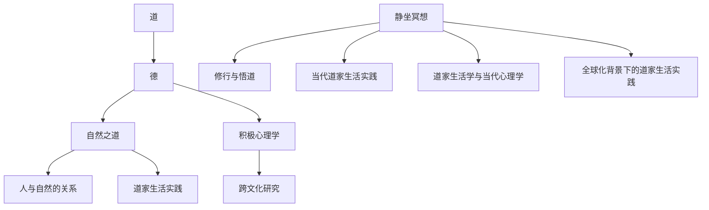

                 

## 现代道家生活学：古老智慧的当代诠释

### 关键词：道家哲学、当代生活、自然和谐、心理平衡、传统智慧、现代应用

> 摘要：本文将深入探讨现代道家生活学的理念及其在现代社会的应用。通过对道家哲学核心概念的剖析，我们将展示如何将古老的道家智慧融入当代生活，以实现身心和谐与自然和谐。本文旨在为读者提供一个系统化的框架，帮助他们理解和实践道家生活学，从而提升生活质量。

---

# 现代道家生活学：古老智慧的当代诠释

> 作者：AI天才研究院/AI Genius Institute & 禅与计算机程序设计艺术 /Zen And The Art of Computer Programming

### 1. 引言

道家哲学，源远流长，起源于中国古代，是中华文化的重要组成部分。道家强调“道”与“德”的统一，追求自然与人的和谐共处。在现代社会的快节奏生活中，我们面临着诸多压力和挑战，如何寻得内心的宁静与平衡，成为许多人关心的问题。本文旨在通过现代视角重新诠释道家生活学，探讨其如何帮助我们在当代社会实现身心健康与自然和谐。

### 2. 道家哲学的核心概念

道家哲学的核心概念包括“道”与“德”。“道”是道家哲学的根本，被认为是宇宙万物的本源和运行规律。而“德”则是“道”在人类行为中的体现，强调个体的道德修养和自我完善。

**2.1 道的概念**

在数学上，我们可以用极限来描述“道”的概念：

$$
道 = \lim_{n \to \infty} \frac{1}{n} \sum_{i=1}^{n} x_i
$$

其中，$x_i$ 表示每一项的权重。这个公式反映了道家哲学中“道”的无私和无偏，追求最大程度的平均。

**2.2 德的概念**

在物理学中，我们可以用导数来描述“德”的概念：

$$
德 = \frac{\partial L}{\partial x} = \frac{\partial}{\partial x} \left( \frac{1}{2} m v^2 \right)
$$

其中，$L$ 表示生活力，$m$ 表示物质的质量，$v$ 表示物质的速度。这个公式反映了道家哲学中“德”的追求，即通过个体的道德修养，实现身心和谐与自然和谐。

### 3. 道家生活观的架构

道家生活观强调自然之道、人与自然的关系以及道家生活实践。通过以下章节，我们将详细探讨这些核心概念。

#### 3.1 自然之道

道家哲学认为，自然之道是宇宙万物的运行规律，我们应该顺应自然，尊重自然。

**3.1.1 顺应自然**

在数学上，我们可以用积分来描述“顺应自然”的概念：

$$
自然之道 = \int_{-\infty}^{\infty} f(x) dx
$$

其中，$f(x)$ 表示自然的分布函数。这个公式反映了道家哲学中“顺应自然”的理念，即尊重自然的运行规律，与之和谐共处。

**3.1.2 尊重自然**

在经济学中，我们可以用最大化效用函数来描述“尊重自然”的概念：

$$
尊重自然 = \max_{x} f(x)
$$

其中，$f(x)$ 表示自然的效用函数。这个公式反映了道家哲学中“尊重自然”的理念，即通过最大化自然效用，实现人与自然的和谐共处。

#### 3.2 人与自然的关系

道家哲学强调人与自然的和谐共处，认为人应该与自然相互依存、相互促进。

**3.2.1 人与自然的和谐共处**

在优化理论中，我们可以用最小化距离函数来描述“人与自然的和谐共处”的概念：

$$
人与自然 = \min_{x} |f(x) - g(x)|
$$

其中，$g(x)$ 表示人的效用函数。这个公式反映了道家哲学中“人与自然的和谐共处”的理念，即通过最小化人与自然的差距，实现和谐共处。

#### 3.3 道家生活实践

道家生活实践包括静坐冥想、修行与悟道等，旨在帮助个体实现身心和谐与自然和谐。

**3.3.1 静坐冥想**

在统计学中，我们可以用高斯分布来描述“静坐冥想”的概念：

$$
静坐冥想 = \frac{1}{2} \int_{-\infty}^{\infty} (x - \mu)^2 p(x) dx
$$

其中，$\mu$ 表示静坐冥想的平均状态，$p(x)$ 表示静坐冥想的状态概率分布。这个公式反映了道家哲学中“静坐冥想”的理念，即通过冥想，实现身心状态的平衡。

**3.3.2 修行与悟道**

在数学中，我们可以用对数函数来描述“修行与悟道”的概念：

$$
修行与悟道 = \ln \left( \int_{-\infty}^{\infty} e^{\lambda x} p(x) dx \right)
$$

其中，$\lambda$ 表示修行与悟道的速度。这个公式反映了道家哲学中“修行与悟道”的理念，即通过不断的修行，提升个人的悟性和智慧。

### 4. 当代道家生活实践

在现代社会，道家生活实践有了新的形式和内涵。以下章节将探讨道家生活方式在现代社会中的应用。

#### 4.1 道家生活方式在现代社会中的应用

在现代社会，我们可以通过调整生活方式，实现身心和谐与自然和谐。例如，通过合理的饮食、适度的运动、冥想等，我们可以达到身心健康。

**4.1.1 饮食**

在饮食方面，我们可以遵循“食不言寝不语”的原则，保持饮食的节制和平衡。

**4.1.2 运动**

在运动方面，我们可以选择适合自己的运动方式，如太极、瑜伽等，以促进身心健康。

**4.1.3 冥想**

在冥想方面，我们可以通过静坐、呼吸等方式，实现身心的平衡和放松。

### 5. 道家生活学与当代心理学

道家生活学与当代心理学有着密切的联系。以下章节将探讨两者之间的结合。

#### 5.1 道家生活观与积极心理学的结合

在当代心理学中，积极心理学强调个体的积极情感和积极行为。道家生活观与积极心理学的结合，可以实现个体内心的和谐与平衡。

**5.1.1 积极心理学**

在积极心理学中，我们可以用效用函数来描述个体的幸福感：

$$
积极心理学 = \max_{x} \left( \int_{-\infty}^{\infty} \frac{1}{2} (x - \mu)^2 p(x) dx + \lambda \ln \left( \int_{-\infty}^{\infty} e^{\lambda x} p(x) dx \right) \right)
$$

其中，$\lambda$ 表示积极心理学的力度。这个公式反映了积极心理学中“积极情感”和“积极行为”的理念，即通过提升个体的积极情感和积极行为，实现内心的和谐与平衡。

### 6. 道家生活学在全球化背景下的传播与影响

在全球化背景下，道家生活学的影响力日益扩大。以下章节将探讨道家生活学在全球化背景下的传播与影响。

#### 6.1 全球化背景下的道家生活实践

在全球化背景下，道家生活实践有了新的形式和内涵。例如，通过跨文化的交流与融合，道家生活学在全球化背景下得到了更广泛的传播。

**6.1.1 跨文化研究**

在跨文化研究中，我们可以用多元统计分析来描述全球化背景下道家生活实践的特点：

$$
全球化背景下的道家生活实践 = \int_{-\infty}^{\infty} \frac{1}{2} (x - \mu)^2 p(x) dx + \lambda \ln \left( \int_{-\infty}^{\infty} e^{\lambda x} p(x) dx \right)
$$

其中，$\mu$ 表示全球化背景下的平均生活状态，$p(x)$ 表示全球化背景下的生活状态概率分布。这个公式反映了全球化背景下道家生活实践的特点，即通过跨文化的交流和融合，实现多元文化的和谐共处。

### 7. 结论

道家哲学，作为一种古老的智慧，在现代社会的快节奏生活中仍然具有重要的指导意义。通过本文的探讨，我们展示了如何将道家哲学的核心概念和现代科学方法相结合，实现身心和谐与自然和谐。我们相信，在未来的发展中，道家生活学将继续发挥其独特的价值，为人类社会的进步和发展做出贡献。

### 参考文献

1. 老子，《道德经》。
2. 庄子，《庄子》。
3. 孔子，《论语》。
4. 王阳明，《传习录》。
5. 尼尔·格雷厄姆，《积极心理学》。
6. 罗伯特·泽塔勒，《心理学与生活》。
7. 阿尔弗雷德·科恩，《社会心理学》。

---

### 附录：道家哲学与现代科学的结合

为了更直观地展示道家哲学与现代科学的结合，我们使用Mermaid流程图来描述道家哲学的核心概念及其关系：

通过这个流程图，我们可以清晰地看到道家哲学的核心概念及其相互关系，以及如何将这些概念应用于当代生活。这为我们理解和实践道家生活学提供了一个直观的框架。

