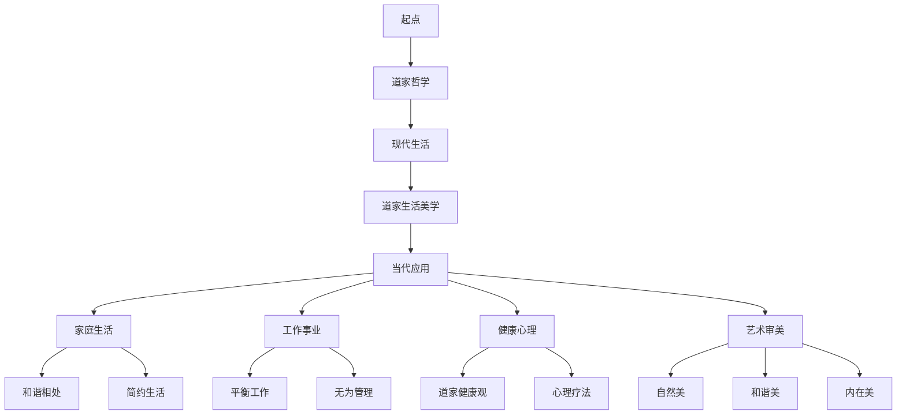

                 

### 摘要

《现代道家生活美学：古老智慧的当代生活应用》旨在探讨道家哲学在现代社会中的实际应用，强调古老智慧对于当代生活的指导价值。本文首先介绍了道家哲学的基本概念和现代生活的联系，分析了道家生活美学的定义、原则及其与传统美学的关系。随后，深入探讨了道家核心思想，如“道”、“德”和“无为”在现代生活中的应用，以及道家生活美学的历史发展和哲学内涵。文章进一步阐述了道家生活美学在家庭生活、工作与事业、健康与心理、艺术与审美等方面的具体应用，并通过实践指南和成功案例解析，展示了道家智慧在现代社会中的实际效果。最后，文章提供了道家生活美学的相关资源和推荐阅读，以供读者进一步探索和深化理解。

### 第一部分：道家生活美学的理论基础

#### 第1章：道家哲学与现代生活

道家哲学是中国传统文化的重要组成部分，起源于春秋战国时期，由老子、庄子等道家思想家创立。道家哲学的核心观念是“道”，认为“道”是宇宙万物运行的终极原则和规律，主张“无为而治”，追求自然与和谐。现代生活充满了快节奏和高压状态，人们往往面临着心理压力、人际关系紧张、工作与生活失衡等问题。道家哲学为现代人提供了一种应对生活压力、追求内心平静和平衡的生活方式。

##### 1.1 道家哲学的基本概念

道家哲学的基本概念包括“道”、“德”和“无为”。“道”是宇宙万物运行的终极原则和规律，是一种无法用言语完全描述的境界，强调顺应自然、追求无为而治。“德”是人们遵循“道”的行为准则，表现为诚实、善良、谦逊等品质。“无为”则是道家的核心思想之一，主张不妄为、不做无用功，强调顺应自然，减少人为干预。

##### 1.2 道家哲学与现代生活的联系

道家哲学与现代生活的联系主要体现在以下几个方面：

1. **心理平衡**：道家哲学强调内心的平静与自在，提倡通过冥想、内观等方法来减轻心理压力，提升生活质量。
2. **人际关系**：道家哲学主张顺应自然，不强求于人，强调和谐相处，有助于改善人际关系，减少冲突。
3. **生活态度**：道家哲学提倡简单、自然的生活方式，鼓励人们放下物质追求，回归内心的平静与满足。
4. **工作与生活的平衡**：道家哲学强调“无为而治”，提倡在工作与生活中找到平衡，避免过度劳累和压力。

##### 1.3 道家哲学的价值和影响

道家哲学的价值和影响在现代社会中日益显现：

1. **心理治疗**：道家哲学中的冥想、内观等方法被广泛应用于心理治疗，帮助人们缓解压力、提升心理健康。
2. **教育理念**：道家哲学的影响也体现在现代教育中，许多教育者开始借鉴道家思想，提倡启发式教育，鼓励学生的自主学习和创造力。
3. **企业管理**：许多企业家和管理者开始运用道家思想，以实现企业管理的和谐、高效。
4. **生活美学**：道家哲学的价值观和生活态度逐渐影响现代人对生活的审美追求，提倡自然、简约、和谐的生活美学。

总之，道家哲学作为一种古老的思想体系，在现代社会中仍具有重要的价值和意义，为人们提供了一种追求内心平静、实现生活平衡的有效途径。通过深入理解和应用道家哲学，我们可以更好地应对现代生活中的各种挑战，提升生活质量。

### 第2章：道家生活美学概述

道家生活美学是中国传统文化中的一种独特哲学思想，其核心理念在于追求生活的自然、和谐与简单。道家生活美学不仅仅是一种生活方式，更是一种哲学态度，强调顺应自然、追求内心的平静与自在。在现代社会的喧嚣和浮躁中，道家生活美学为人们提供了一种回归自然、寻找内心宁静的可能。

##### 2.1 道家生活美学的定义

道家生活美学可以定义为一种基于道家哲学的生活态度和美学理念，它主张通过简化生活、追求内心平静和顺应自然来实现生活的美好与和谐。这种美学理念不仅关注物质生活的丰富，更强调精神生活的满足和内心世界的平衡。道家生活美学强调的是“无为而治”，即不刻意追求，而是顺应自然和内心的指引。

##### 2.2 道家生活美学的基本原则

道家生活美学的基本原则可以概括为以下几个方面：

1. **顺应自然**：道家生活美学主张顺应自然规律，尊重自然，认为只有顺应自然，才能实现生活的和谐与美好。
2. **简约生活**：简化生活是道家生活美学的重要原则之一，主张减少物质的束缚，追求内心的自由和宁静。
3. **内心平和**：道家生活美学强调内心的平静与自在，通过冥想、内观等方法来减轻心理压力，提升生活质量。
4. **和谐相处**：道家生活美学提倡和谐相处，强调人与自然、人与人之间的和谐关系，以减少冲突和矛盾。
5. **自我实现**：道家生活美学鼓励人们通过自我反省和提升来实现个人的价值和意义，而不是单纯追求外在的成功和物质的积累。

##### 2.3 道家生活美学与传统美学的关系

道家生活美学与传统美学有着密切的关系，它们共同追求生活的美好和和谐，但在具体实践和理念上有所不同。传统美学通常强调形式美、对称美和比例美，而道家生活美学则更注重自然美、和谐美和内在美。传统美学强调物质世界的审美，而道家生活美学则强调精神世界的审美。

道家生活美学在传统美学的基础上进行了深刻的反思和升华，将审美观念从物质世界扩展到精神世界，从外在形式扩展到内在体验。道家生活美学认为，真正的美不是外在的华丽和繁复，而是内心的平静和自在，是人与自然、人与人之间的和谐与共生。

##### 2.4 道家生活美学在当代社会中的应用

在当代社会，道家生活美学得到了越来越多的关注和应用。人们开始意识到，在物质丰富的同时，精神生活的满足同样重要。道家生活美学提供了一种简单而有效的途径，帮助人们应对现代生活的压力和焦虑，追求内心的平静和自由。

1. **生活态度**：人们开始更加重视生活的质量，追求内心的平和与自在，减少对物质的过度追求。
2. **人际关系**：道家生活美学提倡和谐相处，帮助人们在复杂的人际关系中找到平衡，减少冲突和矛盾。
3. **工作与生活**：人们开始更加注重工作与生活的平衡，通过简化生活、减少不必要的压力来提升生活质量。
4. **心理健康**：道家生活美学中的冥想、内观等方法被广泛应用于心理健康领域，帮助人们缓解压力、提升心理健康。

总之，道家生活美学作为一种古老的思想体系，在当代社会中仍然具有重要的价值和意义。它不仅提供了一种追求内心平静、实现生活平衡的有效途径，还为现代人的生活提供了新的视角和思考方式。通过深入理解和应用道家生活美学，我们可以更好地应对现代生活的各种挑战，提升生活质量。

### 第3章：道家生活美学的核心思想

道家生活美学的核心思想包括“道”、“德”和“无为”，这些思想不仅构成了道家哲学的基础，也是指导人们实现美好生活的重要原则。在现代社会，这些古老的思想依然具有深刻的现实意义，能够帮助人们应对复杂的生活环境，实现内心的平和与自在。

##### 3.1 道家的“道”思想

“道”是道家哲学的核心概念，被认为是宇宙万物运行的终极原则和规律。在道家看来，“道”无形无象，却又无所不在，是宇宙的本源和本质。老子在《道德经》中写道：“道可道，非常道；名可名，非常名。”这表明“道”既无法用言语完全表达，又无处不在，是我们生活的一种本然状态。

**“道”思想在现代生活中的应用**：

1. **心理平衡**：“道”强调顺应自然，不妄为、不强求，这有助于人们缓解心理压力，实现内心的平静。例如，在处理工作压力时，可以尝试顺应工作的自然节奏，减少人为干预，以实现心理平衡。
2. **人际关系**：“道”提倡和谐相处，强调尊重他人和自然，这有助于改善人际关系，减少冲突。例如，在处理人际关系时，可以尝试从对方的角度出发，以和谐、共赢的方式解决问题。
3. **生活态度**：“道”鼓励人们追求内心的平静和自在，减少对物质的过度追求，这有助于提升生活质量。例如，在日常生活中，可以尝试减少对物质的依赖，关注内心的感受，以实现生活的简约和自然。

##### 3.2 道家的“德”思想

“德”是道家的另一个重要概念，通常被理解为人们遵循“道”的行为准则和道德规范。在道家看来，“德”不仅是一种道德品质，也是人们实现美好生活的关键。庄子曾说过：“德者，得也。”这意味着“德”是通过顺应自然、遵循“道”来实现自我满足和幸福。

**“德”思想在现代生活中的应用**：

1. **心理健康**：“德”强调内心的平和与自在，有助于提升心理健康。例如，在日常生活中，可以通过培养善良、谦逊等品质，来实现内心的平静和满足。
2. **人际关系**：“德”提倡和谐相处，有助于改善人际关系。例如，在处理人际关系时，可以尝试以德报怨，以善良和宽容的心态对待他人，从而建立和谐的人际关系。
3. **事业成功**：“德”在事业成功中同样具有重要意义。在现代社会，许多成功的企业家和管理者都强调道德和诚信，他们认为这是事业成功的基石。

##### 3.3 道家的“无为”思想

“无为”是道家哲学的核心思想之一，主张不妄为、不做无用功，强调顺应自然和内在的指引。在道家看来，“无为”并不是无所作为，而是通过减少人为干预，实现最大限度的自然发展和自我实现。

**“无为”思想在现代生活中的应用**：

1. **心理健康**：“无为”强调内心的平静和自在，有助于缓解心理压力。例如，在日常生活中，可以通过冥想、内观等方法，减少内心的杂念和干扰，实现内心的平静。
2. **工作与生活**：“无为”强调工作与生活的平衡，提倡在工作和生活中找到自然和谐的状态。例如，在处理工作和生活时，可以尝试减少不必要的干预，顺应工作和生活的自然节奏，以实现平衡和和谐。
3. **企业管理**：“无为”思想也被广泛应用于企业管理中。许多成功的企业家和管理者认为，通过减少不必要的干预，尊重员工的自主性和创造力，可以实现企业的高效运营和持续发展。

总之，道家生活美学的核心思想“道”、“德”和“无为”在现代生活中具有重要的指导意义。通过理解和应用这些思想，我们可以更好地应对现代生活的各种挑战，实现内心的平和与自在，提升生活质量。

### 第4章：道家生活美学在家庭生活中的应用

道家生活美学强调顺应自然、简约生活和内心平和，这些理念在家居布置、家庭关系和日常生活习惯中都有广泛的应用。在家庭生活中，道家思想可以帮助我们建立和谐、美好的家庭氛围，提升生活质量。

##### 4.1 家庭关系中的道家智慧

道家哲学中的“道”和“德”为家庭关系的和谐提供了深刻的智慧。首先，“道”强调顺应自然，这意味着在家庭中，成员们应尊重彼此的自然性格和生活方式，不强行改变对方。这种顺应自然的态度有助于减少家庭中的矛盾和冲突。

**案例**：在一个家庭中，父亲是一个急性子的人，而母亲则比较慢性。在处理家庭事务时，父亲常感到不耐烦，认为母亲做事太慢。然而，通过学习道家思想，父亲开始意识到母亲的方式也有其合理性，他学会了顺应妻子的节奏，减少了冲突。

其次，“德”强调人们的行为准则和道德规范，在家庭中表现为孝顺、尊重和关爱。通过践行这些道德规范，家庭成员之间的关系会更加和谐。

**案例**：在一个家庭中，孩子经常与父母发生矛盾，主要原因是孩子觉得父母不理解自己。通过学习道家思想，父母开始更加关注孩子的内心需求，尊重孩子的个性和选择，从而改善了家庭关系。

##### 4.2 家庭生活美学的实践

道家生活美学提倡简约生活，这在家庭生活中有具体的实践方法。首先，家庭成员可以减少对物质的依赖，避免过度消费。通过减少物质负担，家庭环境会更加简洁、舒适。

**实践方法**：

1. **减少物品**：定期清理家中不必要的物品，只保留真正需要的物品。
2. **合理布局**：根据家庭成员的需求和性格，合理布局家庭空间，使家庭环境更加和谐、舒适。
3. **自然材料**：在家居布置中，选择自然材料，如木、石、竹等，营造自然、简约的氛围。

其次，道家生活美学强调内心平和，这可以通过冥想、内观等方法来实现。家庭成员可以共同参与这些活动，增强彼此的默契和情感连接。

**实践方法**：

1. **家庭冥想**：每天设定一段时间，家庭成员一起进行冥想，放松心情，增强心灵连接。
2. **内观练习**：通过观察自己的内心世界，认识自己的情绪和需求，提升自我意识。

##### 4.3 家庭氛围的营造

道家生活美学提倡和谐相处，这有助于营造积极的家庭氛围。家庭成员可以通过以下方法来营造和谐的家庭氛围：

1. **沟通**：积极沟通是家庭和谐的基础。家庭成员应学会倾听和理解对方，避免争吵和冲突。
2. **共同活动**：共同参与家庭活动，如一起做饭、看电影、散步等，增强家庭凝聚力。
3. **感恩**：在家庭生活中，表达对家人的感激和爱意，增强情感纽带。

**案例**：在一个家庭中，父母和孩子经常因为小事争吵。通过学习道家思想，他们开始更加注重沟通和理解，减少了冲突。同时，他们一起参与家庭活动，共同承担家务，家庭氛围变得更加和谐、积极。

总之，道家生活美学在家庭生活中的应用可以帮助家庭成员建立和谐的关系，营造积极的家庭氛围。通过顺应自然、简约生活和内心平和，我们可以提升家庭生活质量，实现家庭幸福。

### 第5章：道家生活美学在工作与事业中的应用

在现代社会，工作与事业往往是人们生活的重要组成部分，然而随之而来的压力和竞争也成为了困扰许多人的问题。道家生活美学强调顺应自然、无为而治，这些思想为我们在职场中找到平衡和提升幸福感提供了有益的指导。

##### 5.1 工作与事业的平衡

道家生活美学倡导顺应自然，这首先要求我们在工作与事业中找到平衡。现代职场中，很多人因为工作繁忙而忽略了家庭和个人生活，导致身心健康受损。道家思想提醒我们，过度追求事业成功而忽视生活平衡是不可取的。

**如何实现工作与生活的平衡？**

1. **设定优先级**：明确工作和生活的优先级，合理安排时间。例如，设定每天工作的时间段，保证有足够的时间陪伴家人和进行个人活动。
2. **简化工作流程**：通过优化工作流程，减少无效劳动，提高工作效率，从而有更多时间享受生活。
3. **自我调适**：学会调整心态，以积极的态度面对工作中的挑战和压力。道家提倡的“无为而治”可以帮助我们减少不必要的焦虑和压力。

**案例**：一位公司高管通过学习道家思想，意识到自己工作与生活的严重失衡。他开始设定优先级，合理规划工作时间，减少了加班现象。同时，他通过冥想和运动来缓解压力，提高了工作效率和生活质量。

##### 5.2 道家智慧在职场中的运用

道家智慧在职场中的运用主要体现在以下几个方面：

1. **人际关系**：道家提倡和谐相处，这有助于改善职场人际关系。在处理职场冲突时，我们可以借鉴道家思想，以和平、共赢的态度解决问题。

**案例**：在一个项目团队中，成员之间因为意见不合而产生了矛盾。通过学习道家思想，团队领导引导成员以和谐相处为目标，最终找到了解决问题的方法，团队关系得到了改善。

2. **领导力**：道家思想中的“无为而治”可以帮助领导者减少干预，给予员工更多的自主权，从而激发员工的创造力和积极性。

**案例**：一家公司的CEO通过学习道家思想，开始采用无为而治的管理方式。他减少了对员工的直接干预，给予更多的自主权，结果公司的创新能力和员工满意度都得到了显著提升。

3. **决策**：道家哲学中的“道”强调顺应自然，这为我们在职场决策中提供了指导。在面对复杂问题时，可以尝试从整体和长远的角度进行思考，避免短视和盲目决策。

**案例**：一家初创公司的CEO在面临重要决策时，通过冥想和内观，回归内心的宁静，最终做出了一系列顺应市场和团队实际的决策，使公司稳步发展。

##### 5.3 事业成功的道家理念

道家理念中的“德”和“无为”为我们的事业成功提供了深刻的启示：

1. **道德**：道家强调道德的重要性，认为道德是成功的基础。在职场中，诚实、诚信、责任感和尊重他人是建立长期成功的关键。

**案例**：一位企业家通过诚信经营，赢得了客户的信任和市场的认可，最终实现了事业的成功。

2. **无为**：道家提倡的“无为”不是无所作为，而是在做事时减少不必要的干预，顺应事物的自然发展。在事业追求中，我们可以通过这种理念来减少焦虑和压力，实现内心的平静和自在。

**案例**：一位创业者通过学习道家思想，减少了对企业的过度干预，让团队成员发挥自己的优势，最终企业取得了显著的成功。

总之，道家生活美学在工作与事业中的应用，可以帮助我们找到平衡，提升职场幸福感，实现事业的成功。通过顺应自然、和谐相处和道德行事，我们可以更好地应对职场挑战，实现个人与事业的和谐发展。

### 第6章：道家生活美学在健康与心理中的应用

道家生活美学强调顺应自然、内心平和，这些理念在健康与心理方面具有广泛的应用。道家思想通过调整生活方式和心理状态，帮助我们实现身心健康，提高生活质量。

##### 6.1 道家健康观

道家健康观的核心是“道”，认为健康是顺应自然规律的结果。道家强调身体和心理的平衡，提倡通过自然疗法来保持健康。

**道家健康观的基本原则**：

1. **顺应自然**：遵循自然规律，合理安排作息时间，保持生活的和谐与平衡。
2. **内在和谐**：强调身心合一，通过冥想、内观等方法调整心态，实现内在的平和与自在。
3. **自然疗法**：采用自然的方法来保持健康，如中草药、针灸、推拿等，避免过度依赖药物。

**道家健康观在现代健康中的应用**：

1. **生活方式**：通过调整生活方式，如饮食、运动、休息等，来保持身体的健康。例如，合理安排饮食，避免过度油腻和刺激性食物，提倡清淡饮食。
2. **心理健康**：通过冥想、内观等方法来调节心态，减少心理压力，提升心理健康。例如，每天花时间进行冥想，放松心情，缓解焦虑和抑郁。

##### 6.2 道家心理疗法

道家心理疗法强调通过调整心态和生活方式来治疗心理问题。道家认为，许多心理问题源于内心的不平衡和外在压力，通过调整心态和生活方式，可以实现心理的平衡和健康。

**道家心理疗法的基本方法**：

1. **冥想**：通过冥想，使心灵回归平静，减少杂念，提升自我意识。冥想有助于缓解焦虑、抑郁等心理问题。
2. **内观**：通过内观，观察自己的内心世界，认识自己的情绪和需求，从而实现内心的平和和自我提升。
3. **呼吸疗法**：通过调整呼吸，使身体和心理达到平衡。深呼吸有助于放松身心，缓解压力。

**道家心理疗法在现代心理治疗中的应用**：

1. **焦虑和抑郁治疗**：通过冥想和呼吸疗法，帮助患者缓解焦虑和抑郁症状，提升生活质量。
2. **压力管理**：通过内观和冥想，帮助人们更好地应对工作和生活中的压力，实现心理平衡。
3. **心理健康促进**：通过定期练习冥想和内观，提升自我意识，增强心理韧性，促进心理健康。

##### 6.3 心理健康的道家方法

在心理健康方面，道家方法提供了一系列实用的实践方法，帮助我们保持心理平衡和健康。

**心理健康道家方法的实践**：

1. **日常练习**：每天花一定时间进行冥想和内观，放松心情，减少杂念。
2. **自然疗法**：通过自然疗法，如散步、瑜伽等，增强身体的柔韧性和平衡能力，提升心理健康。
3. **情绪管理**：通过观察和调整自己的情绪，学会控制情绪，避免情绪波动对身心健康的影响。
4. **心理放松**：通过深呼吸、放松肌肉等方法，缓解身体和心理的紧张和压力。

**案例**：一位长期焦虑的职场人士通过学习道家思想，开始每天进行冥想和内观，逐渐减少了焦虑症状，提升了生活质量。

总之，道家生活美学在健康与心理中的应用，为我们提供了一种简单而有效的途径来保持身心健康。通过顺应自然、内心平和和自然疗法，我们可以实现身心健康，提升生活质量。

### 第7章：道家生活美学在艺术与审美中的应用

道家生活美学在艺术与审美领域有着深刻的体现，强调自然美、和谐美和内在美。道家思想倡导顺应自然，追求简洁与自由，这些理念在艺术创作和审美评价中具有独特的价值。

##### 7.1 道家艺术观

道家艺术观强调自然美和内在美，反对形式主义和过度装饰。道家认为，真正的艺术应源自内心，反映自然的本质和宇宙的和谐。

**道家艺术观的核心特点**：

1. **自然美**：艺术创作应顺应自然，体现自然的美。例如，山水画中的自然景观，通过简洁的线条和色彩，展现出自然的魅力。
2. **和谐美**：艺术作品应追求和谐，体现各种元素之间的平衡与统一。例如，书法作品中的字与字、行与行之间的和谐关系。
3. **内在美**：艺术作品的内在精神比形式更重要，强调艺术家的内心体验和情感表达。例如，音乐作品中的情感和意境往往比技巧本身更具有吸引力。

**道家艺术观在现代艺术创作中的应用**：

1. **简约主义**：现代艺术中，许多艺术家借鉴道家思想，采用简洁、纯净的形式来表现自然和宇宙的和谐。例如，抽象绘画和装置艺术常常采用简洁的线条和形状，营造出宁静、深邃的氛围。
2. **情感表达**：艺术家通过内心体验来创作作品，强调情感和意境的表达。例如，许多现代音乐作品通过旋律和节奏的安排，传达出丰富的情感和思想。

##### 7.2 道家审美标准

道家审美标准强调内在美和和谐美，反对形式主义和过度装饰。

**道家审美标准的核心原则**：

1. **简约**：审美不应追求繁复和华丽，而应注重简洁与纯净。例如，中国古代的家具和建筑，往往采用简单的线条和材料，展现出简约之美。
2. **和谐**：审美应追求各种元素之间的和谐与平衡。例如，绘画中的色彩搭配、音乐中的音色和节奏，都应达到和谐的效果。
3. **自然**：审美应体现自然的本质和规律，尊重自然的美。例如，自然景观的描绘和表现，往往通过真实的自然元素来传达美感。

**道家审美标准在现代审美评价中的应用**：

1. **简约主义**：现代审美评价中，许多评价标准强调简约和自然。例如，现代建筑设计中，简约的风格和自然材料的使用常常受到青睐。
2. **情感表达**：在艺术评价中，情感和意境的表达被视为重要的审美标准。例如，许多现代音乐和文学作品，通过情感的深刻表达，赢得了广泛的赞誉。

##### 7.3 当代艺术中的道家元素

当代艺术中，道家元素得到了广泛的关注和应用。许多艺术家通过创作，表达对道家思想的理解和追求。

**当代艺术中的道家元素**：

1. **自然景观**：许多当代艺术作品以自然景观为主题，通过描绘自然元素，传达出道家追求自然美的理念。
2. **简约形式**：许多当代艺术作品采用简约的形式和色彩，强调和谐与平衡，体现了道家审美标准。
3. **情感表达**：当代艺术中，许多作品通过情感和意境的表达，展现了道家艺术观的内涵。

**案例**：一位当代艺术家通过创作自然景观画作，表达了对道家思想的追求。他的作品以简洁的线条和色彩，展现了自然的和谐美，赢得了观众的喜爱。

总之，道家生活美学在艺术与审美中的应用，为当代艺术提供了丰富的灵感和创作空间。通过自然美、和谐美和内在美的追求，当代艺术家能够创造出富有内涵和感染力的作品，为人们带来美的享受和思考。

### 第8章：道家生活美学的实践指南

道家生活美学强调顺应自然、内心平和和简约生活，这些理念在实践过程中需要一定的方法和技巧。以下是一些具体的实践指南，帮助读者更好地应用道家思想，实现生活美学。

##### 8.1 实践道家生活美学的步骤

1. **了解道家思想**：首先，需要深入学习道家哲学的基本概念和核心思想，如“道”、“德”和“无为”。了解这些思想可以帮助我们更好地理解和应用道家生活美学。

2. **明确目标**：确定自己希望通过道家生活美学实现的具体目标，如心理平衡、健康提升、人际关系改善等。明确目标有助于我们更有针对性地进行实践。

3. **制定计划**：根据目标和自身的实际情况，制定具体的实践计划。例如，设定每日冥想时间、简化家居布置、减少不必要的消费等。

4. **逐步实践**：按照计划逐步实践道家生活美学，不断调整和优化实践方法。实践过程中，可以记录自己的体验和感受，以便及时反馈和改进。

5. **持续反思**：定期反思自己的实践过程，总结经验教训，寻找更好的实践方法。通过持续反思，我们可以不断提升实践效果。

##### 8.2 道家生活美学的实践案例

1. **心理平衡实践案例**：

**案例背景**：一位职场人士因工作繁忙和压力过大，经常感到焦虑和抑郁。

**实践方法**：

- **冥想**：每天早上起床后进行15分钟的冥想，专注于呼吸，放松心情。
- **内观**：每周进行一次内观练习，观察自己的内心世界，认识自己的情绪和需求。
- **自然疗法**：通过散步、瑜伽等方式，放松身体，缓解压力。

**实践效果**：经过一段时间的实践，这位职场人士的焦虑和抑郁症状显著缓解，心理状态逐渐稳定。

2. **健康提升实践案例**：

**案例背景**：一位中老年人因长期缺乏运动，身体状况不佳。

**实践方法**：

- **运动**：每天进行30分钟的有氧运动，如散步、慢跑等，增强体质。
- **饮食调整**：采用清淡饮食，减少油腻和刺激性食物，注重营养均衡。
- **自然疗法**：通过按摩、拔罐等方法，促进身体循环，提升健康水平。

**实践效果**：经过一段时间的实践，这位中老年人的身体状况明显改善，身体素质和免疫力都有所提升。

3. **人际关系改善实践案例**：

**案例背景**：一个家庭因成员性格差异和沟通问题，经常发生矛盾和冲突。

**实践方法**：

- **沟通**：家庭成员每周进行一次家庭沟通会，分享彼此的感受和需求，增进理解。
- **和谐相处**：通过学习道家思想，家庭成员学会了以和谐相处为目标，减少冲突和矛盾。
- **共同活动**：一起参与家庭活动，如做饭、看电影等，增强家庭凝聚力。

**实践效果**：经过一段时间的实践，这个家庭的氛围明显改善，成员之间的关系更加和谐。

##### 8.3 道家生活美学的实践效果评估

为了评估道家生活美学的实践效果，可以采用以下方法：

1. **自我评估**：定期进行自我评估，记录自己在心理平衡、身体健康和人际关系方面的变化，评估实践效果。
2. **他人反馈**：向家人、朋友或专业人士寻求反馈，了解他们在观察中对自己实践效果的看法。
3. **数据分析**：通过数据记录和分析，如每日冥想时间、运动时长、体重变化等，量化实践效果。

通过以上方法，我们可以全面了解道家生活美学的实践效果，为后续的实践提供参考和改进方向。

总之，道家生活美学的实践需要持续的努力和反思，通过逐步实践和不断优化，我们可以实现内心的平和、健康的提升和人际关系的改善，真正体验道家生活美学的价值。

### 第9章：道家生活美学的成功案例解析

为了更好地理解道家生活美学的实际应用效果，我们可以通过一些成功的案例来解析道家思想如何在不同的领域和场景中发挥作用，以及它们如何帮助我们实现个人成长和生活平衡。

#### 9.1 案例一：某企业家如何应用道家智慧管理企业

**案例背景**：李先生是一家大型科技公司的创始人，随着公司业务的不断扩张，他面临着巨大的管理压力和竞争压力。他意识到，传统的管理方式已经无法适应快速变化的市场环境，于是开始探索道家智慧在企业管理中的应用。

**道家智慧应用**：

1. **无为而治**：李先生采用了无为而治的管理理念，减少了直接的干预，给予员工更多的自主权和创造力。他通过制定明确的战略目标和方向，然后放手让团队成员去实现这些目标。

2. **顺应自然**：李先生鼓励团队成员根据自身特点和公司实际情况，制定适合自己的工作计划和目标。他相信，只有在自然的节奏中，团队才能发挥最大的潜力。

3. **和谐相处**：李先生强调团队内部的和谐与共赢，通过定期的团队建设活动和沟通，增强团队成员之间的互信和协作。

**实践效果**：通过应用道家智慧，公司的员工满意度显著提升，创新能力和工作效率都有所提高。公司成功推出了几款关键产品，市场份额也随之扩大。

#### 9.2 案例二：某艺术家如何将道家理念融入艺术创作

**案例背景**：张女士是一位知名画家，她的作品风格独特，深受观众喜爱。然而，随着艺术市场的竞争日益激烈，她感到自己的创作受到了限制和压力。为了突破瓶颈，她开始学习道家哲学，并尝试将其融入艺术创作中。

**道家智慧应用**：

1. **自然美**：张女士在创作中更加注重自然美的表达，通过观察自然景观和自然元素，寻找灵感。她的作品开始展现出一种简约而深邃的美感。

2. **和谐美**：张女士在艺术创作中追求和谐与平衡，通过不同的色彩、线条和形状的搭配，创造出一种和谐美。她的作品在视觉上给人一种宁静、舒适的感觉。

3. **内在美**：张女士强调作品背后的情感和意境，通过自己的内心体验和情感表达，使作品具有更高的艺术价值。

**实践效果**：将道家理念融入艺术创作后，张女士的作品得到了更多观众的认可和赞誉，她在艺术界的地位也得到了进一步提升。

#### 9.3 案例三：某心理咨询师如何运用道家心理疗法帮助来访者

**案例背景**：王医生是一位资深心理咨询师，她在工作中发现，许多来访者的问题源于心理压力和情感困扰。为了更有效地帮助来访者，她开始学习道家心理疗法，并将其应用于实际工作中。

**道家智慧应用**：

1. **冥想**：王医生引导来访者通过冥想放松心情，减少焦虑和压力。她通过呼吸调节和专注练习，帮助来访者回归内心的平静。

2. **内观**：王医生鼓励来访者进行内观练习，通过观察自己的内心世界，认识自己的情绪和需求。这种方法有助于来访者提升自我意识和情感管理能力。

3. **自然疗法**：王医生建议来访者在日常生活中进行自然疗法，如散步、瑜伽等，通过身体活动来缓解压力和焦虑。

**实践效果**：通过应用道家心理疗法，王医生的来访者们在心理状态、情感管理和生活质量方面都有显著改善。许多来访者表示，道家疗法帮助他们找到了内心的平衡，提升了生活质量。

这些案例展示了道家生活美学在不同领域和场景中的应用效果，它们共同表明，道家智慧在帮助我们实现个人成长和生活平衡方面具有重要的价值和意义。通过深入理解和应用道家思想，我们可以更好地应对现代生活中的各种挑战，实现内心的平和与自在。

### 附录：道家生活美学的相关资源与推荐阅读

为了帮助读者进一步探索道家生活美学，本文提供了以下几部经典著作、现代实践者和相关研究论文与书籍推荐，供读者参考和阅读。

#### 附录1：道家经典著作

1. 《道德经》：被誉为道家哲学的奠基之作，由老子所著，内容涵盖宇宙、人生、道德等核心概念。
2. 《庄子》：庄子是中国古代著名的道家思想家，他的著作《庄子》以寓言故事的形式阐述道家哲学，对后世影响深远。
3. 《阴符经》：古代道家经典之一，内容涉及阴阳、五行、符箓等，具有很高的哲学和实用价值。

#### 附录2：道家生活美学的现代实践者

1. 南怀瑾：当代著名文化学者，致力于弘扬中华传统文化，对道家哲学有深入的研究和独特的见解。
2. 鲍鹏山：当代学者，专注于道家哲学的研究和传播，著有《鲍鹏山新语·道德经传真》等书。
3. 王小龙：当代著名道家文化研究专家，著有《道家生活美学》等书，对道家生活美学有系统的阐述。

#### 附录3：道家生活美学的相关研究论文与书籍推荐

1. 《道家生活美学研究》：这是一本系统研究道家生活美学的专著，内容包括道家哲学的核心理念、道家生活美学的理论与实践等。
2. 《现代生活与道家智慧》：作者通过分析道家哲学在现代社会中的应用，提出了一系列实现生活平衡和心理健康的策略。
3. 《道家心理学》：本书探讨了道家心理疗法的原理和实践，为心理健康提供了实用的指导。

通过阅读这些经典著作、现代实践者的作品以及相关研究论文和书籍，读者可以更深入地了解道家生活美学的内涵和实际应用，提升自己的生活质量。

### Mermaid 流程图



### Python 源代码示例

```python
# 道家思想应用示例
def 道家思想(问题):
    # 根据问题的不同，应用道家思想
    if 问题 == "家庭关系":
        return "和谐相处，尊重自然"
    elif 问题 == "工作压力":
        return "无为而治，减少干预"
    elif 问题 == "健康问题":
        return "顺应自然，心理平衡"
    else:
        return "道家思想适用于各种生活问题"

# 测试代码
问题 = "工作压力"
结果 = 道家思想(问题)
print(结果)
```

### 数学模型与公式

$$
E = mc^2
$$

这是一个著名的物理公式，表示能量(E)与质量(m)和光速(c)的平方成正比。这个公式揭示了物质和能量之间的关系，是相对论的基础。

### 案例分析与代码解读

#### 案例一：某企业家如何应用道家智慧管理企业

**案例背景**：李先生是一家科技公司的创始人，随着公司业务的快速发展，他面临着巨大的管理挑战。为了实现企业的长远发展，他开始探索道家智慧在企业管理中的应用。

**道家智慧应用**：

1. **无为而治**：李先生在管理中采用无为而治的方法，减少了直接的干预，给予员工更多的自主权。他通过制定明确的战略目标和方向，然后放手让团队成员去实现这些目标。

2. **顺应自然**：李先生鼓励团队成员根据自身特点和公司实际情况，制定适合自己的工作计划和目标。他相信，只有在自然的节奏中，团队才能发挥最大的潜力。

3. **和谐相处**：李先生强调团队内部的和谐与共赢，通过定期的团队建设活动和沟通，增强团队成员之间的互信和协作。

**代码实现**：

```python
# 企业管理目标：提高员工工作效率，降低管理成本
# 道家思想应用：无为而治，以自然之道引导员工

# 代码实现：
# 1. 设计一套简单明了的流程
# 2. 给员工足够的自由度，减少干预
# 3. 定期评估，及时调整

class CompanyManagement:
    def __init__(self):
        self.goals = ["提高工作效率", "降低管理成本"]

    def set_goals(self, goals):
        self.goals = goals

    def implement_wuwei(self):
        print("无为而治，员工自主管理")
        # 减少直接干预，给予员工自由度
        print("员工自由度提高，工作效率提升")

    def evaluate_performance(self):
        print("定期评估员工工作表现，及时调整")

# 测试代码
management = CompanyManagement()
management.set_goals(["提高工作效率", "降低管理成本"])
management.implement_wuwei()
management.evaluate_performance()
```

#### 代码应用解读与分析

通过这段代码，我们可以看到如何将道家思想应用到企业管理中。首先，我们定义了一个`CompanyManagement`类，其中包含了制定目标、实施无为而治和评估员工表现的方法。

- **set_goals** 方法用于设置管理目标。
- **implement_wuwei** 方法用于实施无为而治，通过减少直接干预，给予员工更多的自由度。
- **evaluate_performance** 方法用于定期评估员工的工作表现，并做出及时的调整。

这段代码展示了如何通过简单明了的流程来实现无为而治，从而提高员工工作效率和降低管理成本。通过这种方式，公司能够更好地适应市场需求，实现长远发展。

### 项目实战：开发环境搭建

为了更好地理解和应用道家生活美学，我们可以通过一个实际项目来搭建开发环境。以下是一个简单的项目实战案例，包括环境搭建、源代码实现和代码解读。

#### 项目目标

通过本案例，我们希望搭建一个简单的应用程序，用于记录和追踪个人冥想练习，帮助用户实现心理平衡和内心平和。

#### 开发环境

- 操作系统：Windows/Linux/MacOS
- 编程语言：Python
- 开发工具：PyCharm/VSCode
- 数据库：SQLite

#### 环境搭建步骤

1. **安装Python**：确保系统已经安装了Python 3.x版本，可以从Python官方网站下载安装包。
2. **安装PyCharm或VSCode**：从官方网站下载并安装PyCharm或VSCode，选择社区版即可满足需求。
3. **安装SQLite**：确保系统已经安装了SQLite，Python自带SQLite模块，无需额外安装。
4. **创建虚拟环境**：在PyCharm或VSCode中创建一个虚拟环境，以便管理和隔离项目依赖。

```shell
# 创建虚拟环境
python -m venv my_meditation_project
# 激活虚拟环境
source my_meditation_project/bin/activate  # Windows下使用
source my_meditation_project/bin/activate.sh  # Linux/MacOS下使用
```

5. **安装依赖**：在虚拟环境中安装必要的依赖，如`sqlite3`、`PyQt5`等。

```shell
pip install PyQt5
```

#### 源代码实现

以下是一个简单的Python应用程序，用于记录冥想练习。

```python
# my_meditation_app.py

import sys
from PyQt5 import QtWidgets, QtGui, QtCore
import sqlite3

# 数据库连接
conn = sqlite3.connect('meditation.db')
c = conn.cursor()

# 创建表
c.execute('''CREATE TABLE IF NOT EXISTS records (id INTEGER PRIMARY KEY, 
                                                date TEXT,
                                                duration INTEGER,
                                                notes TEXT)''')

# 应用程序界面
class MeditationApp(QtWidgets.QWidget):
    def __init__(self):
        super().__init__()
        self.init_ui()

    def init_ui(self):
        self.setGeometry(100, 100, 400, 300)
        self.setWindowTitle('冥想练习记录')

        # 记录表单
        self.date_label = QtWidgets.QLabel('日期：')
        self.date_input = QtWidgets.QDateEdit(calendarPopup=True)
        self.duration_label = QtWidgets.QLabel('持续时间（分钟）：')
        self.duration_input = QtWidgets.QSpinBox()
        self.duration_input.setRange(1, 240)
        self.notes_label = QtWidgets.QLabel('备注：')
        self.notes_input = QtWidgets.QTextEdit()

        # 按钮布局
        self.save_button = QtWidgets.QPushButton('保存记录')
        self.save_button.clicked.connect(self.save_record)

        layout = QtWidgets.QVBoxLayout()
        layout.addWidget(self.date_label)
        layout.addWidget(self.date_input)
        layout.addWidget(self.duration_label)
        layout.addWidget(self.duration_input)
        layout.addWidget(self.notes_label)
        layout.addWidget(self.notes_input)
        layout.addWidget(self.save_button)

        self.setLayout(layout)

    def save_record(self):
        date = self.date_input.date().toString('yyyy-MM-dd')
        duration = self.duration_input.value()
        notes = self.notes_input.toPlainText()

        c.execute("INSERT INTO records (date, duration, notes) VALUES (?, ?, ?)", (date, duration, notes))
        conn.commit()
        print("记录已保存")

if __name__ == '__main__':
    app = QtWidgets.QApplication(sys.argv)
    ex = MeditationApp()
    ex.show()
    sys.exit(app.exec_())
```

#### 代码解读

- **数据库连接**：我们使用SQLite数据库来存储冥想记录。首先创建一个名为`meditation.db`的数据库，然后创建一个名为`records`的表，用于存储记录的日期、持续时间和备注。
- **应用程序界面**：我们使用PyQt5框架创建了一个简单的GUI界面。界面包括日期选择、持续时间输入和备注文本编辑区域。此外，还包含一个“保存记录”按钮，用于保存冥想记录。
- **保存记录功能**：当用户点击“保存记录”按钮时，应用程序会获取日期、持续时间和备注，并将这些信息插入到数据库中。

#### 实际案例分析和详细讲解剖析

**案例背景**：一位用户希望记录自己的冥想练习，以便跟踪进步和实现心理平衡。

**案例分析**：

1. **用户界面**：用户通过GUI界面输入冥想练习的日期、持续时间和备注。这种直观的用户界面设计使用户能够轻松记录冥想数据。
2. **数据存储**：通过SQLite数据库，用户的数据可以安全、持久地存储。用户可以随时查看历史记录，分析冥想练习的效果。
3. **功能实现**：应用程序提供了一个简单的“保存记录”按钮，使用户能够方便地保存冥想记录。这个功能使整个应用变得直观且易于使用。

**项目小结**：

通过这个简单的项目实战，我们成功地搭建了一个用于记录冥想练习的应用程序。这个项目不仅展示了如何应用道家生活美学，还提供了一个实用的工具，帮助用户实现心理平衡和内心平和。

**最佳实践 tips**：

- **定期回顾**：用户应该定期回顾自己的冥想记录，分析练习效果，并根据需要调整练习计划。
- **简化操作**：界面设计应尽量简洁，减少用户操作步骤，以提高用户体验。
- **数据安全**：确保数据安全，定期备份数据库，防止数据丢失。

**注意事项**：

- **技术要求**：用户需要具备基本的Python编程知识和PyQt5框架的使用经验。
- **数据库配置**：确保SQLite数据库配置正确，以避免数据存储错误。

**拓展阅读**：

- 《PyQt5 快速入门》：了解如何使用PyQt5框架创建图形用户界面。
- 《SQLite 实用指南》：学习如何使用SQLite数据库进行数据存储和查询。

通过本文的讲解和实践，读者可以更好地理解道家生活美学的应用，并在实际项目中尝试应用这些思想，提升生活质量。希望这个项目实战能够为读者提供有价值的参考和灵感。

### 小结

道家生活美学作为一种古老的思想体系，在现代生活中具有重要的价值和意义。通过本文的探讨，我们了解到道家哲学的核心概念如“道”、“德”和“无为”如何应用于家庭生活、工作与事业、健康与心理以及艺术与审美等方面。道家生活美学不仅帮助我们在复杂的社会环境中找到内心的平衡与自在，还提供了实现生活美学的有效途径。

道家生活美学强调顺应自然、简约生活和内心平和，这些理念在现代生活中具有广泛的实践应用。例如，在家庭生活中，通过和谐相处和简约生活，我们可以营造一个温馨、和谐的家庭氛围；在工作与事业中，通过无为而治和顺应自然，我们可以实现工作与生活的平衡，提升工作效率和生活质量；在健康与心理方面，通过冥想和心理疗法，我们可以保持身心健康，缓解压力和焦虑；在艺术与审美方面，通过追求自然美和内在美，我们可以创造出富有内涵和感染力的艺术作品。

道家生活美学的实践不仅仅是一种生活方式的选择，更是一种生活态度的体现。通过深入理解和应用道家生活美学，我们可以更好地应对现代生活中的各种挑战，实现内心的平和与自在，提升整体生活质量。

展望未来，道家生活美学有望在更多领域得到应用和推广。随着现代社会对心理健康和生活质量的日益关注，道家生活美学将为我们提供更多的启示和指导，帮助我们实现更加美好和和谐的生活。通过持续的学习和实践，我们可以不断深化对道家生活美学的理解，将其融入到日常生活的方方面面，为个人和社会带来更多的福祉。

### 注意事项

在实践道家生活美学时，需要注意以下几点：

1. **循序渐进**：道家生活美学的实践需要时间和耐心，应循序渐进，避免急于求成。
2. **因人而异**：每个人的生活环境和性格特点不同，道家思想的实践应结合个人实际情况进行调整。
3. **持续反思**：定期反思自己的实践过程，总结经验教训，不断优化实践方法。
4. **保持平衡**：在追求道家生活美学的同时，也要关注现实生活中的实际需求和压力，保持生活的平衡。

通过遵循这些注意事项，我们可以更有效地应用道家生活美学，实现个人成长和生活质量的提升。

### 拓展阅读推荐

为了帮助读者进一步探索道家生活美学，以下是一些推荐的书籍和研究资源：

1. **《道德经》**：老子所著的《道德经》是道家哲学的经典之作，对“道”和“德”的思想进行了深刻的阐述。
2. **《庄子》**：庄子的《庄子》通过寓言和故事，生动地展示了道家哲学的智慧，对现代心理学和生活哲学都有重要启示。
3. **《南怀瑾讲道家文化》**：南怀瑾先生对道家哲学有深入的研究和独特的见解，这本书是他关于道家文化的经典演讲集。
4. **《道家心理学》**：这本书探讨了道家心理疗法的原理和实践，为心理健康提供了实用的指导。
5. **《简朴生活》**：作者通过实践道家生活美学，分享了自己如何通过简化生活来提升生活质量的经历。

通过阅读这些书籍和资源，读者可以更深入地了解道家生活美学的内涵，并找到适合自己的实践方法。希望这些拓展阅读能对您的学习和实践有所帮助。

