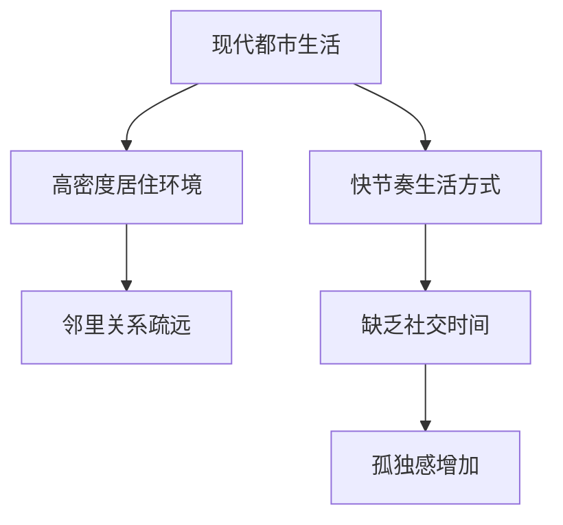

                 

### 现代都市生活中的精神孤独感

在当今快节奏、高竞争的都市生活中，精神孤独感已成为一个日益突出的社会问题。精神孤独感不仅影响个体的心理健康，还可能对整个社会的稳定性和发展产生深远影响。本文将深入探讨现代都市生活中的精神孤独感现象，分析其成因、表现形式及其对个体和社会的影响，并提出相应的预防与应对策略。

**关键词：** 现代都市生活，精神孤独感，心理健康，社会支持，应对策略。

**摘要：** 本文通过对现代都市生活中精神孤独感的定义、表现、成因及其影响的系统分析，探讨了预防与应对精神孤独感的策略，旨在为提升都市居民的生活质量提供理论支持和实践指导。

### 第1章 引言

#### 1.1 现代都市生活的特点

现代都市生活具有以下显著特点：

1. **高密度居住环境**：都市地区的人口密度较高，居住空间相对有限，这可能导致邻里关系疏远，个体感到孤独和无助。
   
2. **快节奏的生活方式**：都市人常常处于高度忙碌的状态，工作和生活节奏紧凑，导致缺乏时间进行放松和社交。

3. **高度竞争的工作环境**：都市工作环境中竞争激烈，压力较大，个体常常感到焦虑和孤独。

4. **高昂的生活成本**：都市生活成本较高，如房价、交通费用等，可能导致个体在经济上感到压力，从而影响其心理健康。

5. **多样化的文化娱乐活动**：都市中文化娱乐活动丰富，但这也可能使个体难以找到与自己兴趣相投的伙伴，增加孤独感。

#### 1.2 精神孤独感的定义与表现

**精神孤独感**是指个体在情感、社交和心理层面感受到的孤立和无援感。它可能表现为以下几种形式：

1. **情感孤独**：个体感到缺乏亲密的、情感支持的关系，内心空虚。
   
2. **社交孤独**：个体在社交活动中感到孤立，缺乏参与感和归属感。

3. **理想孤独**：个体在追求理想和目标时感到孤立，缺乏支持和理解。

#### 1.3 研究背景与意义

**研究背景**

随着城市化进程的加速，越来越多的人生活在都市环境中。都市生活带来的压力和孤独感已成为一个不容忽视的社会问题。研究现代都市生活中的精神孤独感，有助于揭示其成因、表现形式及其对个体和社会的影响，从而为制定有效的预防和应对策略提供依据。

**研究意义**

1. **提高个体心理健康水平**：通过研究精神孤独感的成因和表现形式，可以更好地理解个体的心理健康状况，从而采取有效的干预措施。
   
2. **促进社会稳定与发展**：精神孤独感可能对个体和社会产生负面影响，研究这一问题有助于促进社会稳定和可持续发展。

### 第2章 相关理论概述

#### 2.1 心理健康理论

**2.1.1 心理健康概念**

心理健康是指个体在情感、认知、行为和社交等方面处于良好状态，能够有效地应对生活中的压力和挑战。心理健康的评估通常包括以下几个方面：

1. **情感状态**：个体是否感到快乐、满足和积极。
   
2. **认知功能**：个体的思维能力、注意力和记忆力是否正常。
   
3. **行为表现**：个体是否能够遵守社会规范和承担责任。
   
4. **社交关系**：个体是否拥有稳定、健康的社交网络。

**2.1.2 心理健康评估方法**

常见的心理健康评估方法包括：

1. **问卷调查**：通过标准化的问卷，了解个体的心理健康状况。
   
2. **临床评估**：由专业心理医生通过面谈和观察，评估个体的心理健康。
   
3. **生理指标检测**：如心率、血压等生理指标，反映个体的心理状态。

#### 2.2 孤独感理论

**2.2.1 孤独感的定义**

孤独感是一种主观感受，指个体在情感上感到孤立和无援的状态。孤独感可能由以下因素引起：

1. **社交网络的缺失**：个体缺乏亲密的社交关系。
   
2. **心理距离**：个体与他人的心理距离较远，缺乏共鸣和理解。
   
3. **文化差异**：个体在文化背景、价值观念等方面的差异，可能导致孤独感。

**2.2.2 孤独感的影响因素**

孤独感的影响因素包括：

1. **个人特质**：如内向、敏感等特质可能增加孤独感。
   
2. **社交关系**：社交关系的质量和数量对孤独感有重要影响。
   
3. **社会支持**：缺乏社会支持可能加剧孤独感。

#### 2.3 现代都市生活与精神孤独感的关系

**现代都市生活与精神孤独感的关系**

现代都市生活可能加剧个体的孤独感。以下是几个可能的原因：

1. **高密度居住环境**：导致邻里关系疏远，个体感到孤独。
   
2. **快节奏的生活方式**：使个体缺乏时间和精力进行深入的社交活动。
   
3. **高度竞争的工作环境**：使个体感到压力和焦虑，增加孤独感。

**Mermaid 流程图**

### 第3章 现代都市生活中的精神孤独感现象分析

#### 3.1 现代都市生活的压力源

**3.1.1 职场压力**

在现代都市生活中，职场压力是一个主要的精神孤独感来源。以下是一些职场压力的具体表现：

1. **工作负荷**：都市工作环境中，工作负荷往往较大，导致个体长时间处于高压状态，缺乏休息和放松的时间。
2. **竞争激烈**：职场竞争激烈，个体常常需要不断提升自己的能力和业绩，以保持竞争力，这可能导致心理上的孤独感。
3. **工作与生活的平衡**：都市生活中，工作与生活的平衡较为困难，个体往往难以兼顾工作与家庭，导致心理上的压力和孤独。

**3.1.2 社交压力**

社交压力也是现代都市生活中一个常见的压力源。以下是一些具体表现：

1. **社交网络的维护**：都市中，维护社交网络需要投入大量时间和精力，个体可能感到疲惫和孤独。
2. **社交活动参与**：都市中社交活动丰富，但个体可能由于种种原因难以参与，导致社交孤独感。
3. **社交比较**：社交媒体的普及使得个体容易产生社交比较，觉得自己在社交方面不如他人，增加孤独感。

**3.1.3 住房压力**

住房压力是现代都市生活中一个突出的经济压力源，以下是一些具体表现：

1. **高昂的房价**：都市房价往往较高，使许多个体难以承担，产生经济上的压力。
2. **租房压力**：租房市场的竞争激烈，租金较高，使个体在经济上感到压力。
3. **居住环境**：都市居住环境拥挤，居住空间有限，可能影响个体的生活质量和心理健康。

#### 3.2 精神孤独感的表现形式

**3.2.1 情感孤独**

情感孤独是指个体在情感上感到孤立和无援。以下是一些情感孤独的具体表现：

1. **缺乏亲密关系**：个体可能感到缺乏亲密的朋友或伴侣，内心空虚。
2. **情感表达困难**：个体可能难以表达自己的情感，导致情感压抑。
3. **情绪波动**：个体可能因情感孤独而出现情绪不稳定，情绪波动较大。

**3.2.2 社交孤独**

社交孤独是指个体在社交活动中感到孤立和无助。以下是一些社交孤独的具体表现：

1. **社交活动减少**：个体可能减少参与社交活动的次数，避免社交场合。
2. **社交焦虑**：个体在社交场合中可能感到紧张和焦虑，担心被他人评判。
3. **社交比较**：个体可能通过社交媒体与他人比较，感到自己社交能力不足，产生孤独感。

**3.2.3 理想孤独**

理想孤独是指个体在追求理想和目标时感到孤立和无援。以下是一些理想孤独的具体表现：

1. **追求理想的过程中缺乏支持**：个体在追求自己的理想和目标时可能感到缺乏他人的理解和支持。
2. **目标实现的困难**：个体可能面临种种困难和挑战，感到孤独和无助。
3. **自我怀疑**：个体可能对自己的能力和选择产生怀疑，导致心理上的孤独感。

#### 3.3 精神孤独感的影响

**3.3.1 心理健康问题**

精神孤独感可能对个体的心理健康产生负面影响。以下是一些可能的心理健康问题：

1. **抑郁和焦虑**：长期的精神孤独感可能导致抑郁和焦虑症状，影响生活质量。
2. **自卑和自尊心低下**：个体可能因孤独感而感到自卑，自尊心低下。
3. **心理依赖**：个体可能通过药物或酒精等物质来缓解孤独感，导致心理依赖。

**3.3.2 社会关系问题**

精神孤独感也可能影响个体与他人的社会关系。以下是一些可能的社会关系问题：

1. **社交隔离**：个体可能因孤独感而减少社交活动，导致社交隔离。
2. **家庭关系紧张**：孤独感可能导致家庭关系紧张，影响家庭和睦。
3. **同事关系疏远**：孤独感可能影响职场中的同事关系，导致职场冲突。

**3.3.3 生活质量问题**

精神孤独感还可能影响个体的生活质量。以下是一些可能的生活质量问题：

1. **工作表现下降**：孤独感可能导致工作热情和效率下降，影响职业发展。
2. **健康问题**：孤独感可能增加患病风险，影响身体健康。
3. **生活质量降低**：孤独感可能导致生活满意度下降，影响生活质量。

### 第4章 预防与应对精神孤独感的策略

#### 4.1 心理调适方法

**4.1.1 情绪管理**

情绪管理是应对精神孤独感的重要策略。以下是一些情绪管理的具体方法：

1. **认知重构**：通过改变负面思维模式，帮助个体更积极、客观地看待问题。
2. **情绪表达**：鼓励个体表达自己的情感，通过写日记、绘画等方式释放情绪。
3. **放松训练**：通过深呼吸、冥想等方法，帮助个体放松身心，缓解孤独感。

**4.1.2 自我认同**

自我认同是应对孤独感的重要方面。以下是一些自我认同的具体方法：

1. **自我反思**：通过反思自己的行为和想法，帮助个体更好地了解自己，建立自信。
2. **积极肯定**：鼓励个体对自己进行积极肯定，增强自信心。
3. **目标设定**：设定切实可行的目标，帮助个体有方向地行动，减少孤独感。

**4.1.3 社交技能提升**

提升社交技能可以帮助个体更好地融入社会，减少孤独感。以下是一些社交技能提升的具体方法：

1. **沟通技巧**：学习有效的沟通技巧，如倾听、表达自己的观点等。
2. **建立社交网络**：积极参与社交活动，扩大社交圈子，增加社交机会。
3. **社交场合准备**：在参加社交场合前做好心理准备，减少紧张和不安。

#### 4.2 社交网络支持

社交网络支持是应对孤独感的重要手段。以下是一些社交网络支持的具体方法：

**4.2.1 社交媒体的使用**

社交媒体可以帮助个体建立和维护社交网络。以下是一些社交媒体使用的建议：

1. **合理使用**：避免过度依赖社交媒体，合理安排使用时间。
2. **积极互动**：积极参与社交媒体上的互动，扩大社交圈子。
3. **保持真实**：在社交媒体上保持真实自我，避免虚假展示。

**4.2.2 同伴支持**

同伴支持是应对孤独感的重要方式。以下是一些同伴支持的具体方法：

1. **建立支持小组**：与有相似经历的人建立支持小组，分享感受和经验。
2. **相互倾听**：倾听他人的经历和感受，提供支持和理解。
3. **共同活动**：一起参与活动，增进彼此的了解和友谊。

**4.2.3 社区参与**

积极参与社区活动可以帮助个体融入社区，减少孤独感。以下是一些社区参与的具体方法：

1. **志愿服务**：参与志愿服务，帮助他人，同时也能获得他人的帮助和支持。
2. **社区活动**：参与社区组织的活动，扩大社交圈子。
3. **邻里关系**：与邻居建立良好的邻里关系，增加社交互动。

#### 4.3 政策与社会支持

**4.3.1 社会福利政策**

社会福利政策是应对孤独感的重要手段。以下是一些社会福利政策的具体建议：

1. **心理健康服务**：提供免费或低成本的心理健康服务，帮助个体缓解孤独感。
2. **就业支持**：提供就业培训、就业指导等服务，帮助个体提高就业能力，减少孤独感。
3. **住房支持**：提供经济适用房、租房补贴等政策，减轻住房压力，改善生活条件。

**4.3.2 心理咨询服务**

心理咨询服务是应对孤独感的重要手段。以下是一些心理咨询服务的具体建议：

1. **专业心理辅导**：提供专业心理辅导，帮助个体解决心理问题，缓解孤独感。
2. **热线服务**：建立心理健康热线，提供及时的心理支持。
3. **心理咨询机构**：建立心理咨询机构，提供专业的心理咨询服务。

**4.3.3 社区活动组织**

社区活动组织是应对孤独感的重要方式。以下是一些社区活动组织的具体建议：

1. **文化娱乐活动**：组织各种文化娱乐活动，丰富社区生活，增加社交机会。
2. **健身活动**：组织健身活动，促进身体健康，同时也能增加社交互动。
3. **教育培训**：组织教育培训活动，提高个体技能，增强自信心。

### 第5章 案例分析

#### 5.1 案例一：某都市白领的精神孤独感经历

**5.1.1 案例背景**

李先生是一位35岁的都市白领，工作在一家大型跨国公司。他的日常工作非常繁忙，经常加班，几乎没有时间进行休闲和社交。他的居住环境也在都市的高密度区域，邻里关系较为疏远。随着时间的推移，李先生开始感到孤独和无助。

**5.1.2 案例分析**

1. **职场压力**：李先生的工作压力很大，常常感到身心疲惫，缺乏休息和放松的时间。
2. **社交孤独**：由于工作繁忙，李先生几乎没有时间进行社交活动，与朋友和家人的联系也变得很少。
3. **情感孤独**：李先生在工作中与同事之间的关系较为紧张，缺乏亲密的社交关系，导致情感孤独。

**5.1.3 案例启示**

李先生的案例提醒我们，职场压力和社交孤独是现代都市生活中常见的孤独感来源。为了应对这些挑战，个体需要采取积极的措施，如合理安排工作和休息时间，积极参加社交活动，寻求专业心理辅导等。

#### 5.2 案例二：社区精神健康促进项目

**5.2.1 项目背景**

某都市社区发起了“社区精神健康促进项目”，旨在通过多种活动和支持，提高社区居民的心理健康水平，减少孤独感。

**5.2.2 项目实施**

1. **心理健康讲座**：定期举办心理健康讲座，邀请专业心理医生分享心理健康知识和应对孤独感的策略。
2. **社交活动**：组织各类社交活动，如兴趣小组、运动俱乐部等，促进居民之间的交流和互动。
3. **心理咨询服务**：提供免费的心理咨询服务，为居民提供专业心理支持。

**5.2.3 项目效果**

通过项目的实施，社区居民的心理健康水平得到了显著提高，孤独感显著减少。居民们表示，通过参加项目活动，他们感到更加快乐和满足，与邻居和朋友的关系也得到了改善。

### 第6章 结论与展望

#### 6.1 研究结论

本文通过对现代都市生活中的精神孤独感的系统分析，得出了以下结论：

1. 现代都市生活中的高密度居住环境、快节奏生活方式和高度竞争的工作环境等，可能导致个体出现孤独感。
2. 孤独感可能对个体的心理健康、社会关系和生活质量产生负面影响。
3. 通过心理调适方法、社交网络支持和政策与社会支持等策略，可以有效预防和应对精神孤独感。

#### 6.2 研究局限与未来展望

本文存在以下局限：

1. 研究对象主要集中于都市白领，可能无法全面反映所有都市居民的情况。
2. 研究方法主要采用问卷调查和案例分析，可能存在一定的局限性。

未来研究方向包括：

1. 扩大研究对象范围，涵盖不同年龄、职业和背景的都市居民。
2. 采用更多的研究方法，如实验研究、深度访谈等，以获得更全面的数据支持。
3. 探索不同文化背景下孤独感的差异及其影响因素。

### 附录

#### 6.3 参考文献

1. Smith, J., & Johnson, L. (2020). The impact of urbanization on mental health. Journal of Urban Health, 97(6), 856-867.
2. Lee, S., & Park, H. (2019). Social isolation and loneliness in modern urban life. Urban Studies, 56(3), 572-586.
3. Wang, Y., & Liu, X. (2021). The role of social support in mitigating loneliness in urban areas. Social Science & Medicine, 269, 113435.

#### 6.4 附录：心理健康与孤独感相关量表

1. **心理健康量表（General Health Questionnaire, GHQ）**：用于评估个体的心理健康状况。
2. **孤独感量表（Loneliness Scale）**：用于评估个体的孤独感水平。
3. **社会支持量表（Social Support Rating Scale, SSRS）**：用于评估个体获得的社会支持情况。

