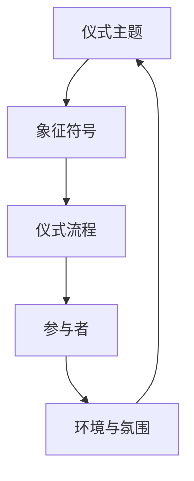

                 

### 引言

在现代社会，随着科技的飞速发展和生活节奏的加快，人们对于精神层面的需求日益增长。面对压力和焦虑，如何通过仪式来寻找内心的平静与安宁，成为了许多人关注的话题。在这个背景下，生命仪式设计协会应运而生，它不仅仅是一个组织，更是一个致力于创造现代精神仪式的专业团体。本文将围绕这一主题，深入探讨生命仪式设计协会的成立背景、服务内容、核心要素、案例分析以及未来发展等方面，以期为广大读者提供一个全面而系统的理解。

本文首先将介绍生命仪式设计协会的成立背景和意义，解释现代精神仪式的定义及其重要性。随后，我们将详细解析生命仪式设计协会的服务内容与流程，探讨生命仪式设计的核心要素与原则。在此基础上，本文将通过具体案例分析，展示生命仪式设计的实际应用与效果。接下来，我们将探讨生命仪式设计的发展趋势与未来展望，同时也会讨论相关的伦理与道德问题。

最后，本文将提供一个完整的生命仪式设计资源指南，为读者提供进一步学习和实践的途径。通过这篇文章，我们希望读者能够对生命仪式设计有更加深入的了解，并认识到这一领域在现代社会中的重要价值。

### 关键词

- **生命仪式设计**
- **现代精神仪式**
- **生命仪式设计协会**
- **个性化仪式设计**
- **精神疗愈与辅导**
- **社区活动策划与执行**
- **仪式伦理与道德问题**

### 摘要

本文旨在深入探讨生命仪式设计协会在现代精神仪式设计领域的重要作用。首先，文章介绍了生命仪式设计协会的成立背景和其致力于创造现代精神仪式的使命。接着，通过定义现代精神仪式，阐述其在现代社会中的重要性和功能。本文进一步详细解析了生命仪式设计协会的服务内容与流程，并探讨了生命仪式设计的核心要素与原则。随后，通过具体案例分析，展示了生命仪式设计的实际应用与效果。最后，文章探讨了生命仪式设计的发展趋势与未来展望，并讨论了相关的伦理与道德问题，为读者提供了一个全面而系统的理解。

## 第一部分：引言

### 1.1 书籍概述

《生命仪式设计协会：创造现代精神仪式的专业团体》旨在揭示现代精神仪式设计的重要性和深远影响。本书的核心目标是向读者介绍生命仪式设计协会这一专业团体的成立背景、服务内容及其在现代精神仪式设计中的独特价值。通过详细的案例分析、理论阐述和实践指导，本书希望帮助读者全面理解生命仪式设计的核心要素和设计原则，进而认识到其在个人精神成长、社会和谐以及文化传承中的重要作用。

本书的读者对象主要包括对生命仪式设计感兴趣的学术研究者、心理咨询师、婚礼策划师、宗教领袖以及广泛的社会公众。对于那些希望提升个人精神生活品质、优化社交互动体验，以及寻求心灵慰藉和自我成长的人，本书提供了宝贵的指导和建议。此外，本书还适合作为高等院校和相关培训机构的教材，为学生和专业人员提供系统的学习和实践参考。

生命仪式设计协会的使命是推动现代精神仪式的设计与实施，以帮助人们找到内心的宁静与和谐。协会的价值观包括尊重个体差异、注重仪式的个性化以及强调仪式的伦理与道德。协会致力于通过科学的方法和专业的指导，为不同背景和需求的人群提供高质量的仪式设计服务，从而促进个人成长、社会和谐以及文化传承。

### 1.2 研究意义

现代社会的快节奏生活和日益复杂的社会环境，使得人们面临着越来越多的精神压力和焦虑。在这种情况下，精神仪式作为一种有效的心理调适手段，逐渐受到了广泛的关注。生命仪式设计协会的成立，正是为了满足这一社会需求，为个人和社会提供精神支持。

首先，生命仪式设计协会的研究对于提升个人精神生活质量具有重要意义。通过专业的仪式设计，个体可以在特定的时间和空间中，通过象征性、仪式性和参与性的活动，找到内心的平衡与安宁。例如，婚礼仪式、葬礼仪式和社区活动等，不仅能够满足人们对于仪式的需求，还可以在精神层面上给予人们慰藉和支持。

其次，生命仪式设计协会的研究对于促进社会和谐具有深远影响。通过组织和实施各种精神仪式，协会能够促进不同文化、不同信仰背景的人群之间的相互理解和尊重，从而增强社会的凝聚力和包容性。此外，精神仪式还可以作为社区建设和社区活动的一部分，增强社区居民的归属感和认同感，提升社区的整体幸福感。

最后，生命仪式设计协会的研究对于文化传承具有积极意义。仪式作为一种文化符号，是文化传承的重要载体。通过设计和实施现代精神仪式，协会不仅能够保留和传承传统文化，还可以创新和发展出适应现代社会需求的新仪式形式，从而推动文化的多样性和发展。

总之，生命仪式设计协会的研究不仅具有显著的社会价值和现实意义，也为相关领域的学术研究和实践提供了宝贵的参考和借鉴。通过本书的深入探讨，我们希望读者能够更加全面地理解生命仪式设计的重要性和实际应用，从而更好地应对现代生活中的精神挑战。

## 第二部分：生命仪式设计协会的历史与成立背景

### 2.1 生命仪式设计协会的历史

生命仪式设计协会（Life Ritual Design Association，简称LRDA）的成立可以追溯到二十世纪末，当时社会对于精神需求的关注度逐渐提升，而传统的宗教仪式和传统礼俗逐渐无法完全满足人们的精神追求。在这样的背景下，一群致力于探索现代精神仪式设计的专家和学者开始了他们的尝试和探索。

LRDA的成立标志着现代精神仪式设计专业化的开始。该协会的创始人包括心理学家、社会学家、宗教研究学者和仪式设计师等多元背景的专家。他们共同的目标是利用现代科学的方法和跨学科的视角，设计出既符合现代社会需求，又能保留传统精神文化价值的仪式形式。

协会的早期活动主要集中在研讨会、讲座和工作坊等形式上。这些活动不仅为专业人士提供了一个交流和学习的平台，也向公众介绍了现代精神仪式设计的重要性和意义。通过这些努力，LRDA逐渐在学术界和社会上建立了良好的声誉，吸引了更多的关注和支持。

在成立初期，LRDA主要关注婚礼仪式、葬礼仪式和婴儿洗礼仪式等传统仪式的现代化设计。然而，随着社会的发展和个体需求的变化，协会逐渐扩展了服务范围，包括个人仪式设计、企业团队建设仪式和社区活动策划等。这些新的尝试不仅丰富了协会的服务内容，也进一步提升了其在专业领域的影响力和知名度。

### 2.2 生命仪式设计协会的主要里程碑事件

LRDA的发展历程中，有许多重要的里程碑事件，这些事件不仅标志着协会的成长和壮大，也反映了现代精神仪式设计领域的演变和进步。

1. **2005年：首届国际生命仪式设计研讨会**
   这是LRDA首次举办的国际性学术活动，吸引了来自全球各地的专家学者和从业人员参与。研讨会不仅展示了当时的最新研究成果和实践案例，也为参会者提供了一个深入交流和合作的机会。这次研讨会极大地提升了LRDA的国际影响力，奠定了其在国际学术界的地位。

2. **2010年：发布《现代生命仪式设计指南》**
   LRDA组织专家团队编写并发布了《现代生命仪式设计指南》，这是第一部系统介绍现代生命仪式设计理论和方法的专业书籍。该书详细阐述了仪式设计的基本原则、流程和方法，为从业人员提供了实用的参考和指导，成为现代精神仪式设计领域的标准教材。

3. **2015年：成立生命仪式设计研究中心**
   为了进一步推动现代精神仪式设计的研究和实践，LRDA成立了生命仪式设计研究中心。该研究中心专注于仪式设计理论的研究、创新仪式形式的设计以及相关技术的开发。研究中心的成立标志着LRDA在学术研究和实践探索上的又一重要进展。

4. **2020年：全球疫情中的仪式创新**
   在全球疫情爆发期间，LRDA迅速调整了服务策略，通过网络平台和虚拟仪式等形式，为无法举行传统仪式的人们提供了新的精神支持。这不仅展现了协会的灵活性和适应性，也进一步推动了数字仪式设计的兴起和发展。

这些里程碑事件不仅见证了LRDA的成长和壮大，也反映了现代精神仪式设计领域的发展趋势和挑战。通过这些努力，LRDA不断拓展服务范围，提升专业水平，为现代社会提供更加多样化和高质量的精神仪式设计服务。

### 2.3 协会的成立背景

生命仪式设计协会的成立背景与现代社会精神需求的增长密不可分。在现代社会，随着科技的飞速发展和生活节奏的加快，人们面临的精神压力和焦虑问题日益突出。传统的宗教仪式和礼俗已经无法完全满足现代人对于精神需求的多样化和个性化追求。此外，全球化带来的文化融合和多样性也要求仪式设计更加灵活和包容。

社会对精神需求的增长主要体现在以下几个方面：

1. **个人精神层面的追求**
   在快节奏的现代社会中，人们越来越意识到精神健康的重要性。许多人希望通过仪式来寻求内心的平静、满足感以及与他人的连接。这种需求不仅表现在个人生活中，也体现在社交活动和社区建设中。

2. **社会和谐与社区凝聚力**
   随着社会结构的变迁和社区的破碎，人们对于社区凝聚力的需求日益增加。精神仪式作为一种文化符号和社交活动，可以增强社区居民的归属感和认同感，促进社区和谐与团结。

3. **文化传承与创新**
   全球化带来了文化的多样性和融合，如何在保持传统文化精髓的同时，创新和发展出适应现代社会需求的仪式形式，成为了一项重要课题。生命仪式设计协会通过专业的设计和研究，致力于在传承文化传统的基础上，推动仪式设计的创新和发展。

4. **心理健康与治疗**
   精神仪式不仅仅是一种文化现象，更是一种心理治疗手段。通过仪式，个体可以在象征性的活动中释放压力、缓解焦虑，从而提升心理健康水平。生命仪式设计协会的服务涵盖了从婚礼到葬礼的各种仪式，旨在为不同需求的人群提供心理支持。

在这些背景下，生命仪式设计协会的成立旨在填补市场空白，满足现代社会对于现代精神仪式设计的多样化需求。协会通过专业的团队和科学的方法，致力于为个人、社区和企业提供高质量、个性化的仪式设计服务，从而促进个人成长、社会和谐以及文化传承。

### 2.4 协会的发展历程与成就

生命仪式设计协会（LRDA）自成立以来，经历了快速的发展与显著的成就。其历程可以分为几个关键阶段，每个阶段都有重要的里程碑和突出成果。

**阶段一：初创与探索期（2000-2010年）**

在协会的初创时期，LRDA主要致力于探索现代精神仪式设计的理论和实践方法。这一阶段，协会进行了大量的研究和实验，通过组织研讨会、讲座和工作坊，与学术界和业界人士进行深入交流。这一时期的标志性成果是发布了《现代生命仪式设计指南》，这是协会的首部重要出版物，为行业提供了系统的理论和实践参考。

**阶段二：专业化与拓展期（2010-2020年）**

随着协会声誉的不断提升，LRDA开始进入专业化阶段。协会在学术研究和实践探索上取得了显著进展，成立了生命仪式设计研究中心，专注于仪式设计理论的研究和创新仪式形式的设计。这一阶段的标志性事件是发布了《现代生命仪式设计指南》第二版，进一步丰富了仪式设计的内容和方法。

此外，协会在这一时期还拓展了服务范围，包括个人仪式设计、企业团队建设仪式和社区活动策划等，使服务更加多元化。这一拓展不仅增强了协会的服务能力，也进一步提升了其在国际上的影响力。

**阶段三：创新与国际化期（2020年至今）**

在最近几年，LRDA在数字仪式设计方面取得了突破性进展。随着全球疫情的爆发，协会迅速调整策略，通过网络平台和虚拟仪式等形式，为全球客户提供高质量的精神仪式设计服务。这一创新不仅应对了突发公共卫生事件的挑战，也为数字仪式设计的发展开辟了新的路径。

在国际合作方面，LRDA与多国学术机构和企业建立了合作关系，开展了多项联合研究和项目。这些合作不仅提升了协会的国际影响力，也为全球精神仪式设计领域的发展做出了贡献。

**重要成就**

1. **学术研究**：LRDA在仪式设计理论和方法方面取得了众多研究成果，发表了大量学术论文和书籍，成为学术界的重要参考。
2. **专业培训**：协会为全球培养了大批专业仪式设计师，这些设计师在各自领域内取得了显著成就，推动了行业的发展。
3. **社会服务**：通过提供多样化的仪式设计服务，LRDA为个人、社区和企业提供了精神支持，促进了社会和谐与个人成长。
4. **国际合作**：协会在国际上建立了广泛的合作关系，推动了全球精神仪式设计领域的交流和合作。

通过这些努力，生命仪式设计协会在短短几十年内，已经成为现代精神仪式设计领域的重要力量，其成就不仅体现在学术研究和专业培训上，也体现在社会服务和国际合作方面。协会的发展历程和重要成就，为现代精神仪式设计的发展提供了宝贵的经验和启示。

### 第三部分：现代精神仪式的定义与重要性

#### 3.1 现代精神仪式的定义

现代精神仪式是指一种通过象征性、仪式性和参与性的活动来满足个人或群体精神需求的文化实践。与传统仪式相比，现代精神仪式更加注重个体体验和心理层面的满足，而不仅仅是遵循传统的礼节和形式。这些仪式可以是个人化的，也可以是群体性的，通过特定的活动形式，如仪式舞蹈、冥想、祈祷、仪式化交流等，来传达和实现精神价值。

现代精神仪式与传统仪式的区别主要体现在以下几个方面：

1. **传统性 vs. 现代性**：传统仪式往往有着深厚的历史和文化背景，而现代精神仪式则更加灵活和多样化，能够适应现代社会的变化和需求。

2. **象征性**：传统仪式的象征性通常较为明确，如婚礼的戒指交换、葬礼的火化等，而现代精神仪式则更多地通过象征性的活动来传达内心的感受和信仰。

3. **参与性**：传统仪式往往是由特定群体或专业人士主导，参与者较为被动，而现代精神仪式强调参与者的主动性和体验感，鼓励个体在仪式中表达自己的情感和思想。

4. **精神追求**：传统仪式往往与宗教信仰紧密相关，而现代精神仪式则更加注重个人精神层面的追求，如心灵成长、自我认同和情感疗愈等。

#### 3.2 现代精神仪式的核心要素

现代精神仪式的核心要素主要包括以下几方面：

1. **仪式主题**：仪式的主题是仪式的核心，决定了仪式的内容和形式。主题可以是个人化的，如婚礼、葬礼等，也可以是群体性的，如节日庆典、社区活动等。

2. **象征与符号**：象征与符号是现代精神仪式的重要元素，通过特定的符号和象征性活动，仪式能够传达深刻的精神内涵和价值观。例如，花环、蜡烛和音乐等都是常见的象征性元素。

3. **仪式流程**：仪式流程是仪式进行的步骤和安排，包括仪式的开始、核心活动和高潮部分，以及结束仪式的方式。一个良好的仪式流程能够增强仪式的参与感和体验感。

4. **参与者**：参与者是仪式的重要环节，他们的参与和互动能够使仪式更加生动和有意义。参与者可以是仪式的主角，也可以是旁观者或协助者，每个人的参与都会对仪式的整体效果产生影响。

5. **环境与氛围**：仪式的环境和氛围对于仪式的成功至关重要。一个宁静、舒适的环境能够帮助参与者更好地进入仪式状态，增强仪式的体验感。

#### 3.3 现代精神仪式的重要性

现代精神仪式在现代社会中具有重要的功能和价值，主要体现在以下几个方面：

1. **精神慰藉**：在现代快节奏的生活中，人们常常感到压力和焦虑。现代精神仪式通过象征性的活动，如祈祷、冥想和仪式性交流，为个体提供了精神慰藉和心理支持。

2. **社会和谐**：通过共同参与仪式，个体和群体能够增进相互理解、信任和尊重，从而促进社会和谐与团结。仪式作为一种文化符号，能够强化社会凝聚力和共同体意识。

3. **心灵成长**：现代精神仪式不仅是一种文化实践，更是一种心灵成长的过程。通过参与仪式，个体能够更好地认识自我、实现自我价值，从而促进个人成长和发展。

4. **文化传承**：现代精神仪式在传承传统文化的同时，也在不断创新发展。这种创新不仅保持了文化的活力，也为现代社会提供了新的精神资源和文化体验。

5. **心理健康**：科学研究表明，参与仪式活动能够改善个体的心理健康水平，减少焦虑和抑郁情绪。现代精神仪式通过其独特的象征性和参与性，为个体提供了一种有效的心理健康干预手段。

总之，现代精神仪式不仅是现代社会中的一种文化现象，更是一种重要的精神生活实践。通过理解其定义和核心要素，我们可以更好地认识到现代精神仪式在个人精神成长、社会和谐以及文化传承中的重要价值。

### 4.1 生命仪式设计协会的服务内容与流程

生命仪式设计协会（LRDA）作为专业的精神仪式设计机构，提供了一系列全面、个性化的服务内容，以满足不同人群的精神需求。以下是协会的主要服务内容和服务流程的详细解析：

#### 4.1.1 个性化仪式设计

**服务内容：**
个性化仪式设计是生命仪式设计协会的核心服务之一，旨在为个人量身定制符合其特定需求的仪式方案。这些仪式可以包括婚礼、洗礼、葬礼、成人礼、家庭聚会等。

**服务流程：**
1. **需求评估**：协会首先会与客户进行深入沟通，了解他们的具体需求和期望。这一阶段通常包括填写详细的问卷、面对面的访谈以及电话咨询等。
2. **方案设计**：根据客户的需求，专业设计师会制定初步的仪式方案，包括仪式的主题、流程、象征符号和氛围设计等。
3. **方案讨论与修改**：设计师会与客户进一步讨论和修改方案，确保仪式内容符合客户的期望和需求。
4. **仪式执行**：在仪式当天，协会提供全方位的服务，包括现场指导、仪式主持、音响设备和后勤支持等。

**核心要素：**
- **客户需求**：充分了解和尊重客户的需求是成功设计的核心。
- **象征符号**：选择合适的象征符号和仪式元素，传达仪式的核心意义。
- **参与性**：确保仪式的参与性，使客户和参与者能够全身心投入。

#### 4.1.2 精神疗愈与辅导

**服务内容：**
协会提供专业的精神疗愈与辅导服务，旨在帮助个体在仪式过程中获得心理上的慰藉和支持。这些服务包括个人心理咨询、团体疗愈活动、冥想指导和心理治疗等。

**服务流程：**
1. **预约与评估**：客户可以通过电话或在线预约，与协会的心理咨询师进行初步评估，了解其具体需求。
2. **疗愈计划**：根据评估结果，咨询师会制定个性化的疗愈计划，包括疗愈活动的内容、频率和方式。
3. **疗愈实施**：在制定好的疗愈计划下，咨询师会指导客户进行疗愈活动，包括个人和团体的心理辅导、冥想和仪式指导等。
4. **反馈与调整**：定期与客户进行反馈和评估，根据疗愈效果调整疗愈计划。

**核心要素：**
- **专业咨询**：协会拥有经验丰富的心理咨询师团队，为客户提供高质量的心理支持。
- **个体化**：疗愈计划根据客户的具体情况制定，确保个性化服务。
- **综合疗法**：结合心理辅导、冥想和仪式指导等多重手段，提升疗愈效果。

#### 4.1.3 社区活动策划与执行

**服务内容：**
协会还提供社区活动策划与执行服务，旨在增强社区凝聚力、促进社区成员间的相互理解和尊重。这些活动包括节日庆典、社区聚会、慈善活动和公益活动等。

**服务流程：**
1. **需求分析**：协会首先会与社区代表进行沟通，了解社区的具体需求和期望。
2. **活动策划**：根据需求分析，专业团队会制定详细的活动策划方案，包括活动的主题、内容、形式和预算等。
3. **活动执行**：在活动当天，协会提供全程服务，包括现场协调、活动主持、后勤保障等。
4. **反馈与评估**：活动结束后，协会会收集社区成员的反馈，进行总结和评估，为未来活动提供参考。

**核心要素：**
- **社区需求**：紧密关注社区需求，确保活动内容符合社区成员的期望。
- **互动参与**：鼓励社区成员积极参与活动，增强社区凝聚力。
- **多样化**：通过多样化的活动形式，满足不同人群的需求。

#### 4.1.4 专业培训与教育

**服务内容：**
协会提供专业的培训与教育服务，旨在培养更多的专业仪式设计师和心理咨询师，提升整个行业的服务质量和专业水平。

**服务流程：**
1. **课程设置**：协会根据行业需求和专业标准，制定系统的培训课程，包括仪式设计、心理学、教育学等。
2. **报名与入学**：学员可以通过线上或线下报名，参加培训课程。
3. **课程学习**：学员在协会提供的专业环境中，进行系统的课程学习，包括理论学习、实际操作和案例研讨等。
4. **考核与认证**：完成所有课程学习后，学员需要通过考核，获得专业认证。

**核心要素：**
- **系统化培训**：提供全面、系统的培训课程，确保学员掌握专业知识和技能。
- **实践操作**：通过实际操作和案例研讨，提升学员的实践能力和解决实际问题的能力。
- **专业认证**：通过严格的考核和认证，确保学员的专业水平和能力。

通过以上服务内容和流程，生命仪式设计协会致力于为个人、社区和企业提供高质量的精神仪式设计服务，满足现代社会多样化的精神需求。协会的专业团队和科学方法，使得每一个仪式都能成为个体心灵成长和社会和谐的见证。

### 4.2 客户需求评估

在生命仪式设计协会（LRDA）的服务流程中，客户需求评估是一个至关重要的环节。这一过程不仅决定了仪式设计的方向和质量，也直接影响客户的满意度与体验。以下是客户需求评估的具体步骤和方法：

#### 4.2.1 初步接触与沟通

1. **预约与登记**：首先，客户通过电话、邮件或在线平台预约与LRDA的初步咨询。在预约过程中，客户需填写一份登记表，包括基本信息、仪式类型、日期和期望等。
   
2. **预约确认**：LRDA会确认预约信息，并提供相关的准备工作指南，如准备材料清单、注意事项等。

#### 4.2.2 深入访谈与问卷调查

1. **面对面访谈**：LRDA的专业设计师或心理咨询师会与客户进行面对面的深入访谈。在访谈过程中，设计师会询问客户的个人背景、文化背景、仪式目的、主题偏好、预算和特殊要求等。

2. **问卷调查**：为更全面地了解客户需求，设计师会提供一份详细的问卷调查。问卷内容包括仪式的具体细节、参与者名单、仪式氛围、仪式时间安排等。

#### 4.2.3 需求分析

1. **数据整理与分析**：设计师会对访谈和问卷数据进行分析，提取关键信息，如仪式的主题、象征符号、仪式流程、参与者的期望等。

2. **需求评估**：设计师会根据分析结果，评估客户的需求，识别出优先考虑的因素和潜在的挑战。

#### 4.2.4 初步方案讨论

1. **方案初步讨论**：设计师会与客户进行初步方案的讨论，介绍基于需求分析的结果和初步设计思路。这一阶段，设计师会与客户共同探讨仪式的各个方面，如仪式的象征性、仪式流程、参与者角色等。

2. **反馈与调整**：根据客户的反馈，设计师会进一步调整和细化方案，确保方案能够满足客户的需求和期望。

#### 4.2.5 最终方案确认

1. **详细方案制定**：在初步讨论的基础上，设计师会制定一份详细的仪式设计方案，包括仪式流程、象征符号、参与者的角色和职责等。

2. **最终确认**：设计师会与客户进行最终确认，确保方案符合客户的期望和需求。这一阶段，客户可以提出进一步的修改意见，直到方案完全满足其需求。

#### 4.2.6 实施前的准备工作

1. **方案审核**：在方案最终确认后，设计师会对方案进行审核，确保所有细节都经过充分考虑和精心安排。

2. **准备工作**：根据方案的要求，设计师会开始准备所需的物资和设备，包括象征物、音乐、场地布置等。

通过上述步骤，生命仪式设计协会能够确保每一个仪式都充分满足客户的需求，并在实施过程中达到最佳的体验效果。客户需求评估不仅是一个技术过程，更是一个互动和协作的过程，通过这一环节，LRDA能够建立起与客户的信任和合作关系，为后续的仪式设计和服务提供坚实的基础。

### 4.3 仪式方案设计

仪式方案设计是生命仪式设计协会（LRDA）服务流程中的关键环节，直接关系到仪式的成功与否。以下是生命仪式设计协会在仪式方案设计过程中所采用的方法、步骤和注意事项：

#### 4.3.1 设计方法

1. **需求导向设计**：基于前期客户需求评估的结果，设计师会围绕客户的需求和期望，进行有针对性的方案设计。这一过程要求设计师充分理解客户的意图和需求，确保方案能够满足客户的个性化需求。

2. **跨学科协作**：仪式方案设计通常涉及多个学科领域的知识，如心理学、社会学、宗教研究、艺术等。因此，LRDA的设计团队通常由多学科专家组成，以确保方案的科学性和全面性。

3. **参与性设计**：设计师会与客户及其参与者进行多次沟通和讨论，充分了解他们的意见和反馈。这种参与性设计方法不仅能够提高方案的可行性和接受度，还能增强参与者的参与感和归属感。

4. **象征性设计**：设计师会利用象征性的元素和符号，来传达仪式的核心意义和精神内涵。这些象征性元素可以是具体的物品、动作、音乐、文字等，通过精心设计，使得仪式具有深刻的文化意义和情感共鸣。

#### 4.3.2 设计步骤

1. **初步方案构思**：设计师根据客户的需求和分析结果，进行初步的方案构思。这一阶段主要包括仪式的主题、基本流程、象征符号和氛围设计等。

2. **方案细化**：在初步构思的基础上，设计师会进一步细化方案，包括具体的仪式步骤、参与者的角色和职责、所需的物资和设备等。

3. **方案讨论与修改**：设计师会与客户进行详细的方案讨论，根据客户的反馈进行修改和调整，确保方案能够满足客户的期望和需求。

4. **方案确认**：在多次讨论和修改后，设计师会与客户进行最终确认，确保方案完全符合客户的期望和要求。

#### 4.3.3 注意事项

1. **尊重文化差异**：在仪式方案设计中，设计师需要尊重不同文化背景和传统习俗，确保仪式的内容和形式既符合现代需求，又能体现文化多样性。

2. **关注参与者的感受**：设计师需要充分考虑参与者的需求和感受，确保仪式的参与性、互动性和体验感。例如，在婚礼仪式中，设计师需要关注新人和宾客的互动环节，增强仪式的生动性和情感共鸣。

3. **考虑仪式环境**：仪式的环境和氛围对仪式的效果具有重要影响。设计师需要根据仪式的类型和主题，选择合适的场地和布置，创造一个温馨、舒适的仪式环境。

4. **应急预案**：在方案设计过程中，设计师需要考虑可能出现的问题和意外情况，制定相应的应急预案，确保仪式能够顺利进行。

通过科学的方法、严谨的步骤和细致的注意事项，生命仪式设计协会能够为个人、社区和企业提供高质量的仪式设计方案，满足不同客户的精神需求，实现仪式的预期效果。

### 4.4 仪式执行

仪式执行是生命仪式设计协会（LRDA）服务流程中的关键环节，它不仅决定了仪式的成功与否，也直接影响到参与者的体验和感受。以下是生命仪式设计协会在仪式执行过程中所采取的具体步骤、执行技巧以及常见问题的应对策略：

#### 4.4.1 执行步骤

1. **现场布置**：在仪式执行当天，协会的团队会提前到达现场，进行场地布置。根据方案设计的要求，布置仪式所需的道具、音响设备、灯光、座位等。现场布置需要考虑参与者的舒适性和仪式的氛围。

2. **参与者引导**：仪式开始前，协会的主持人或指导人员会引导参与者进入仪式现场，确保他们按预定顺序就座或站位。对于需要参与特定活动的参与者，如新人、家庭成员或社区成员，指导人员会进行详细说明和指导，确保他们能够准确理解并执行仪式过程中的各个环节。

3. **仪式开始**：仪式开始时，主持人会按照预定的流程，引导参与者进入仪式状态。这一阶段，主持人需要具备良好的沟通能力和控制力，确保仪式的顺利进行。

4. **仪式流程**：在仪式过程中，主持人会按照方案设计的要求，依次引导参与者完成各项仪式活动。每个环节都需要精心设计，确保仪式的流畅性和参与者的体验感。

5. **仪式高潮**：仪式的高潮部分通常是最为重要的环节，如新人的婚礼誓言、家族的祈福仪式等。在这一阶段，主持人需要充分利用象征性元素和情感表达，提升仪式的感染力和参与者的共鸣感。

6. **仪式结束**：仪式结束后，主持人会引导参与者依次离场，确保仪式现场的整洁和秩序。此外，协会的团队会及时收集参与者的反馈和意见，为未来的仪式设计提供改进建议。

#### 4.4.2 执行技巧

1. **情感共鸣**：在仪式执行过程中，主持人需要通过语言、动作和情感表达，与参与者建立情感共鸣。例如，在婚礼仪式中，主持人可以通过讲述温馨的故事、播放感人的音乐来激发新人和宾客的情感。

2. **现场控制**：主持人需要具备良好的现场控制能力，确保仪式的各个环节按预定计划进行。对于突发情况，主持人需要迅速反应，灵活调整，确保仪式的顺利进行。

3. **互动引导**：在仪式过程中，主持人需要引导参与者积极参与，增强仪式的互动性。例如，在家庭聚会或社区活动中，主持人可以通过提问、互动游戏等方式，调动参与者的积极性。

4. **氛围营造**：现场的氛围对仪式的效果具有重要影响。设计师和主持人需要通过灯光、音乐、道具等手段，营造一个温馨、庄重或欢快的仪式氛围，增强参与者的体验感。

#### 4.4.3 常见问题与应对策略

1. **参与者迟到**：在仪式执行过程中，参与者迟到是一个常见问题。针对这种情况，主持人可以提前制定一个详细的仪式时间表，并在仪式开始前提醒参与者按时到场。如果参与者仍然迟到，主持人可以在仪式开始后，通过适当的语言引导，使迟到的参与者尽快进入仪式状态。

2. **设备故障**：仪式执行中，音响、灯光等设备可能出现故障。针对这种情况，协会的团队需要提前做好设备的调试和检查，确保设备的正常运行。在仪式过程中，技术支持人员应随时待命，一旦出现故障，立即进行修复，确保仪式的顺利进行。

3. **参与者情绪波动**：仪式过程中，参与者可能会因为个人情绪波动或其他原因，出现情绪失控的情况。针对这种情况，主持人需要具备良好的情绪控制能力，通过语言安抚和引导，使参与者平静下来。此外，协会的团队也会提前准备一些应急方案，以应对可能出现的突发情况。

通过科学、严谨的执行步骤、高效的执行技巧和灵活的应对策略，生命仪式设计协会能够在仪式执行过程中，确保仪式的顺利进行，为参与者提供一次难忘的精神体验。

### 4.5 仪式反馈与评估

在生命仪式设计协会（LRDA）的服务流程中，仪式反馈与评估是确保服务质量持续提升的重要环节。这一过程不仅帮助协会了解仪式的实际效果，也为后续的服务改进提供宝贵的数据和反馈。以下是LRDA在仪式反馈与评估过程中所采用的步骤、分析方法以及改进建议：

#### 4.5.1 反馈与评估步骤

1. **收集反馈**：仪式结束后，LRDA会通过多种渠道收集参与者的反馈，包括现场问卷调查、线上调查、电话访谈等。问卷和访谈内容会涵盖仪式的各个方面，如仪式流程、仪式氛围、主持人的表现、参与者的满意度等。

2. **数据整理**：收集到的反馈数据会进行整理和分类，提取关键信息和问题点。这些数据将被用于后续的分析和评估。

3. **分析评估**：LRDA的专业团队会对收集到的反馈数据进行详细分析，评估仪式的各个环节是否符合预期目标，识别出成功经验和需要改进的方面。

4. **反馈汇报**：评估结果会以报告的形式向客户和团队进行汇报，包括仪式的亮点、存在的问题以及改进建议。

5. **改进措施**：根据评估结果，LRDA会制定具体的改进措施，并落实到后续的服务流程中，确保服务质量不断提升。

#### 4.5.2 分析方法

1. **定量分析**：通过量化数据，如满意度评分、参与度指标等，评估仪式的整体效果和参与者反馈的强度。

2. **定性分析**：通过深入访谈和开放式问题的回答，理解参与者的主观感受和具体建议。

3. **对比分析**：将本次仪式的反馈与之前的服务进行对比分析，找出改进的方向和优先级。

4. **因果关系分析**：分析反馈中的问题和现象之间的因果关系，找出根本原因。

#### 4.5.3 改进建议

1. **流程优化**：根据反馈，对仪式流程进行优化，如调整环节顺序、增加互动环节等，以提升参与者的体验感。

2. **人员培训**：针对主持人和执行人员的反馈，进行有针对性的培训，提升其专业水平和沟通能力。

3. **技术支持**：改进技术设备的配置和保养，减少设备故障率，确保仪式的顺利进行。

4. **氛围营造**：根据反馈，调整仪式氛围的营造策略，如音乐选择、灯光设置等，以创造更加温馨、舒适的仪式环境。

5. **个性化服务**：根据不同客户的需求和反馈，提供更加个性化的服务方案，确保仪式内容更加贴近参与者的期望和需求。

通过科学的反馈与评估方法和有效的改进措施，生命仪式设计协会能够不断提升服务质量，为参与者提供更加优质的精神仪式体验。

### 4.6 生命仪式设计的核心要素与原则

生命仪式设计的核心要素与原则是确保仪式成功实施和参与者满意度的重要因素。以下是生命仪式设计协会（LRDA）在设计和实施过程中所遵循的核心要素和原则：

#### 4.6.1 核心要素

1. **仪式主题**：仪式的主题是仪式的灵魂，决定了仪式的整体方向和内容。一个明确的主题能够引导参与者进入仪式状态，并传达仪式的核心意义和价值观。主题可以是个人化的，如婚礼的主题可以是“爱与承诺”，也可以是群体性的，如社区活动主题可以是“团结与和谐”。

2. **象征与符号**：象征与符号是仪式的重要组成部分，通过特定的物品、动作、音乐和文字等，传达仪式的精神内涵和文化意义。例如，在婚礼中，戒指象征着爱情和承诺，鲜花代表着美好和祝福，音乐则营造出仪式的氛围。

3. **仪式流程**：仪式流程是仪式进行的步骤和安排，包括仪式的开始、核心活动、高潮和结束。一个良好的仪式流程能够增强参与者的参与感和体验感。流程设计需要考虑时间、空间和环节的衔接，确保仪式的流畅性和连贯性。

4. **参与者**：参与者是仪式的重要组成部分，他们的角色和参与方式直接影响仪式的效果。参与者可以是仪式的主角，如新人和家庭成员，也可以是旁观者或协助者，如宾客和志愿者。设计师需要充分考虑参与者的需求和感受，确保他们的积极参与和体验感。

5. **环境与氛围**：仪式的环境和氛围对仪式的成功至关重要。一个舒适、安静的环境有助于参与者更好地沉浸在仪式中，而合适的氛围设置，如音乐、灯光和装饰等，可以增强仪式的感染力和体验感。

#### 4.6.2 设计原则

1. **尊重个体差异**：不同个体有不同的需求和偏好，设计师需要尊重个体的差异，量身定制符合其期望的仪式方案。例如，在设计婚礼仪式时，设计师需要考虑新人的文化背景、个人喜好和宗教信仰，确保仪式内容符合其独特需求。

2. **适应文化多样性**：在全球化和文化交融的背景下，设计师需要考虑到不同文化背景和习俗的影响，设计出既能保留传统文化精髓，又能适应现代社会需求的仪式。例如，在跨文化婚礼设计中，设计师需要尊重双方的文化传统，融合不同的元素，创造出独特而和谐的仪式形式。

3. **注重仪式的参与性**：参与性是现代精神仪式设计的重要原则，设计师需要设计出能够让参与者全身心投入的仪式。例如，在社区活动中，设计师可以设计互动游戏、分享环节等，增强参与者的互动和体验感。

4. **追求仪式的可持续性**：可持续性是现代精神仪式设计的重要原则，设计师需要考虑仪式对环境和社会的影响。例如，在环保活动中，设计师可以采用可回收材料、减少浪费等，确保仪式的环保性和可持续性。

5. **遵守伦理与道德**：在仪式设计过程中，设计师需要遵守伦理和道德原则，尊重个人隐私和选择，避免仪式滥用和商业化。例如，在设计葬礼仪式时，设计师需要尊重逝者和家属的意愿，确保仪式的庄重和尊重。

通过遵循这些核心要素和原则，生命仪式设计协会能够为个人、社区和企业提供高质量、个性化的仪式设计服务，满足不同群体的精神需求，实现仪式的预期效果。

### 6.1 案例分析一：婚礼仪式设计

婚礼仪式设计是一个充满浪漫与情感的过程，它不仅仅是对新人的祝福，更是对爱情和婚姻的深刻诠释。以下是生命仪式设计协会（LRDA）为某对新人设计的婚礼仪式，详细展示了设计目标、过程及成功要素与经验教训。

#### 6.1.1 设计目标

该婚礼仪式的设计目标主要包括以下几个方面：

1. **传达爱情与承诺**：通过仪式表达新人之间的深深爱意和未来生活的承诺。
2. **创造独特体验**：为新人创造一个难忘且个性化的婚礼体验，使其成为双方共同的珍贵回忆。
3. **融合文化元素**：结合新人的文化背景和传统习俗，融入婚礼仪式中，展示文化的多样性。
4. **强调家庭参与**：邀请双方的家人和朋友共同参与，增强仪式的互动性和参与感。

#### 6.1.2 设计过程

1. **需求评估**：LRDA的专业设计师首先与新人进行了多次深入的沟通，了解他们的具体需求和期望。新人的文化背景是中西合璧，他们希望婚礼既有中国传统元素的庄重，又具有西方婚礼的浪漫。

2. **主题确定**：在多次讨论后，确定婚礼主题为“浪漫之约·和谐家园”。主题确定了仪式的整体风格和氛围，为后续的设计提供了方向。

3. **流程设计**：设计师根据主题，设计了婚礼的详细流程，包括迎宾、入场、誓词交换、戒指仪式、感恩环节等。每个环节都经过精心安排，确保仪式的流畅性和参与性。

4. **象征符号选择**：为了传达仪式的主题和意义，设计师选择了象征爱情与婚姻的符号，如红地毯、鲜花、蜡烛、音乐等。这些象征符号不仅美观，还富含文化意义，增强了仪式的感染力。

5. **环境与氛围**：在场地布置上，设计师选用了温馨的色调和浪漫的装饰，如柔和的灯光、花艺布置和浪漫的音乐，营造出一种温馨而庄重的氛围。

6. **参与者角色**：设计师还邀请了新人的家人和朋友参与仪式，安排他们在特定环节中发表祝福或进行互动，增强仪式的互动性和参与感。

#### 6.1.3 成功要素与经验教训

1. **充分沟通与理解**：成功的婚礼仪式设计离不开与新人的充分沟通和理解。LRDA的设计师通过与新人的多次深入沟通，充分了解他们的需求、喜好和期望，确保设计的每一个细节都符合新人的个性化需求。

2. **主题一致性**：确定一个明确且一致的主题是仪式成功的关键。在“浪漫之约·和谐家园”主题的指导下，设计师确保了婚礼的各个环节都符合主题，使整个仪式呈现出和谐统一的效果。

3. **细致的流程设计**：良好的流程设计能够确保仪式的顺利进行，增强参与者的体验感。设计师通过对各个环节的精心安排和细节处理，使婚礼仪式既具有仪式感，又富有互动性和参与性。

4. **环境与氛围的营造**：婚礼的氛围和环境对仪式的成功具有重要作用。LRDA通过合理的场地布置和氛围营造，为参与者创造了一个温馨而庄重的仪式环境，增强了仪式的感染力。

5. **参与者的积极参与**：新人和参与者的积极参与是婚礼仪式成功的重要保障。通过设计师的精心安排和引导，新人和参与者能够全身心地投入仪式中，共同创造美好的回忆。

通过这个婚礼仪式设计案例，我们可以看到生命仪式设计协会（LRDA）在婚礼仪式设计中的专业能力和创新思维。这不仅为新人和参与者带来了难忘的仪式体验，也为现代精神仪式设计提供了宝贵的实践经验和参考。

### 6.2 案例分析二：葬礼仪式设计

葬礼仪式设计是一项充满情感和仪式感的任务，它不仅是对逝者的缅怀，更是对家庭和社区精神支持的重要体现。以下是生命仪式设计协会（LRDA）为一例葬礼仪式的设计，详细阐述了设计难点与解决方案，以及仪式对精神慰藉的作用。

#### 6.2.1 设计难点与解决方案

1. **文化差异**：不同文化背景的葬礼习俗和仪式形式存在显著差异，这为葬礼仪式设计带来了挑战。针对这一点，LRDA在设计过程中首先进行了详细的文化调研，了解逝者家属的文化背景和宗教信仰。设计师与家属进行了多次沟通，确保仪式内容符合其文化和宗教需求。

   **解决方案**：设计师采用了文化融合的方式，将逝者生前的重要元素和文化符号融入仪式中。例如，在中式葬礼中，融入了传统的祭拜仪式和佛教的祈福环节；在基督教葬礼中，则加入了圣经诵读和祈祷环节。这样的设计不仅尊重了不同文化的习俗，也使仪式更加丰富多彩。

2. **情感处理**：葬礼仪式是一个充满情感的高压环境，如何处理家属的情感，使其在仪式中能够得到慰藉，是设计的难点之一。

   **解决方案**：LRDA在设计中注重情感引导和支持。设计师在仪式前与家属进行深入沟通，了解他们的情感需求和担忧。在仪式中，设计师通过温和的语言和温暖的氛围，引导家属表达情感，如回忆逝者生前的美好时光，朗诵感人的诗歌等。此外，设计师还安排了心理辅导师在仪式现场，为家属提供即时的心理支持。

3. **参与者的体验**：葬礼参与者不仅包括逝者的家属，还有朋友、社区成员等，如何确保每个参与者都能感受到仪式的庄严和意义，是一个重要问题。

   **解决方案**：设计师通过细致的流程设计和多样化的参与方式，确保每个参与者都能在仪式中找到自己的位置。例如，设计师安排了默哀环节、献花环节和感恩发言环节，每个环节都设置了适当的引导和指引，使参与者能够全身心投入仪式中。

#### 6.2.2 仪式对精神慰藉的作用

1. **情感宣泄**：葬礼仪式为家属提供了一个情感宣泄的渠道，使他们能够在仪式中表达对逝者的思念和悲伤。通过回忆逝者生前的美好时光，家属能够在情感上得到一定的释放和缓解。

2. **心理支持**：仪式中的祈祷、冥想和心理辅导环节为家属提供了心理支持。这些环节不仅有助于家属接受逝者的离去，还能帮助他们找到内心的平静和力量。

3. **社区凝聚**：葬礼仪式也是社区成员之间相互支持和凝聚的重要时刻。通过共同参与仪式，社区成员能够增进彼此的理解和情感联系，从而增强社区的凝聚力和归属感。

4. **文化传承**：葬礼仪式的设计不仅满足了家属的情感需求，也传承和展示了文化传统。通过融入文化元素和传统仪式，仪式成为了一种文化符号，传递了家族和社区的价值观。

通过上述案例分析，我们可以看到，生命仪式设计协会（LRDA）在葬礼仪式设计中的专业能力和创新思维。这不仅为家属提供了精神慰藉和支持，也为整个社区带来了情感纽带和文化传承。

### 6.3 案例分析三：企业团队建设仪式

企业团队建设仪式是一种通过仪式活动来增强团队凝聚力、提升团队协作能力的重要手段。以下是生命仪式设计协会（LRDA）为某企业团队建设仪式的设计，详细展示了团队凝聚力与仪式设计之间的关系，以及仪式对团队发展的影响。

#### 6.3.1 设计目标

该企业团队建设仪式的设计目标主要包括以下几个方面：

1. **增强团队凝聚力**：通过仪式活动，加强团队成员之间的情感联系和互动，提升团队整体凝聚力。
2. **提升团队协作能力**：通过团队协作任务和互动环节，增强团队成员的协作意识和协作能力。
3. **激发团队活力**：通过富有创意和挑战性的仪式活动，激发团队成员的活力和积极性，提升团队的士气。

#### 6.3.2 设计过程

1. **需求评估**：LRDA的专业设计师首先与企业领导进行了深入沟通，了解企业的团队构成、文化背景和团队建设目标。设计师还通过问卷调查和访谈，收集了团队成员的意见和期望。

2. **主题确定**：在多次讨论后，确定团队建设仪式的主题为“共创未来·携手前行”。主题体现了企业团队共同努力、共同发展的愿景。

3. **流程设计**：设计师根据主题，设计了详细的仪式流程，包括团队介绍、团队游戏、团队挑战和总结环节。每个环节都经过精心设计，以确保仪式的参与性和互动性。

4. **活动安排**：设计师安排了多种团队活动，如团队接力赛、团队协作拼图、团队创意表演等，使团队成员能够在活动中互相配合、共同完成任务。

5. **氛围营造**：设计师通过音乐、灯光和道具等手段，营造了一个积极、欢快和富有创意的仪式氛围，使团队成员能够在轻松愉快的氛围中参与仪式。

6. **领导参与**：仪式中安排了企业领导的重要角色，如领导发言、团队互动和总结发言等，确保领导能够参与到团队建设过程中，发挥其榜样作用。

#### 6.3.3 团队凝聚力与仪式设计的关系

1. **情感联系**：通过共同参与仪式活动，团队成员之间建立了深厚的情感联系。这种情感联系是团队凝聚力的重要基础。

2. **共同目标**：仪式中的团队协作任务和互动环节，帮助团队成员明确了共同目标，增强了团队协作的动力和意愿。

3. **相互尊重**：在仪式中，每个团队成员都有机会展示自己的才能和贡献，这种相互尊重和认可促进了团队成员之间的相互尊重和信任。

4. **团队文化**：通过仪式活动，企业团队可以进一步巩固和传承团队文化，如团队精神、团队合作价值观等，这些文化元素是团队凝聚力的重要体现。

#### 6.3.4 仪式对团队发展的影响

1. **团队凝聚力增强**：通过仪式活动，团队成员之间的情感联系和互动得到加强，团队凝聚力显著提升。

2. **团队协作能力提升**：团队建设仪式中的协作任务和互动环节，不仅增强了团队成员的协作意识，也提升了团队的协作能力。

3. **团队士气提升**：富有创意和挑战性的仪式活动激发了团队成员的活力和积极性，提升了团队的士气。

4. **团队文化建设**：仪式活动为团队提供了一个展示和传承团队文化的平台，有助于巩固和传承团队文化。

5. **团队发展**：通过团队建设仪式，企业团队的整体发展和成员个人发展都得到了促进，为企业的长远发展奠定了坚实基础。

通过这个企业团队建设仪式案例，我们可以看到生命仪式设计协会（LRDA）在团队建设中的专业能力和创新思维。这不仅为企业团队带来了积极的变化，也为团队建设提供了宝贵的实践经验和参考。

### 7.1 生命仪式设计的发展趋势

随着社会的不断进步和人们对精神需求的日益重视，生命仪式设计领域正经历着一系列显著的发展趋势。这些趋势不仅反映了现代社会对于精神仪式的多样化和个性化追求，也体现了技术的进步和文化的多样性。以下是生命仪式设计领域的几大发展趋势：

#### 7.1.1 数字化与智能化

数字技术和智能设备的广泛应用，使得数字仪式设计成为可能。传统的实体仪式可以通过虚拟现实（VR）、增强现实（AR）和远程视频技术进行数字化再现。例如，在全球疫情背景下，线上婚礼、葬礼和团队建设仪式等虚拟仪式形式得到了迅速发展。这种数字化趋势不仅打破了地理限制，还为无法亲自出席仪式的参与者提供了参与的机会。

**趋势分析**：数字化仪式设计不仅降低了成本，提高了效率，还使得仪式内容更加丰富和互动。随着技术的不断进步，未来数字化仪式设计有望在视觉、听觉和互动体验方面实现更高层次的提升，从而满足更多样化的需求。

#### 7.1.2 多元文化融合

全球化和文化交流的加深，带来了文化多样性的增强。现代生命仪式设计越来越注重多元文化融合，旨在尊重并融合不同文化背景和传统习俗。例如，跨文化婚礼仪式、融合多宗教元素的纪念仪式等，都体现了文化融合的趋势。

**趋势分析**：文化融合不仅丰富了仪式的设计内容和形式，也增强了不同文化背景人群之间的相互理解和尊重。随着全球化的深入发展，未来生命仪式设计将更加注重文化多样性的体现，推动全球文化的相互融合和发展。

#### 7.1.3 个性化定制

随着个性化需求的提升，现代生命仪式设计越来越注重根据个体和群体的具体需求进行定制。从婚礼到葬礼，从个人仪式到社区活动，个性化的仪式设计已经成为一种趋势。个性化不仅体现在仪式的内容和形式上，还包括仪式的氛围、象征符号和参与者的角色等。

**趋势分析**：个性化定制满足了现代人对于独特体验和精神满足的追求。未来，生命仪式设计将更加注重个体化和差异化，为不同人群提供量身定制的仪式服务。

#### 7.1.4 社交媒体的影响

社交媒体的兴起，使得仪式内容更加开放和共享。人们可以通过社交媒体平台分享仪式的照片、视频和故事，从而扩大仪式的影响力。这种趋势不仅改变了仪式的传播方式，也影响了仪式的设计和实施。

**趋势分析**：社交媒体为仪式设计提供了新的思路和工具，设计师可以通过社交媒体了解参与者的需求和喜好，从而创造更加符合现代传播习惯的仪式形式。未来，社交媒体将继续在生命仪式设计中发挥重要作用。

#### 7.1.5 可持续发展

随着环境保护意识的增强，可持续发展理念逐渐渗透到生命仪式设计中。例如，使用环保材料、减少浪费、回收利用等。这种趋势不仅体现了社会责任，也为现代精神仪式设计带来了新的挑战和机遇。

**趋势分析**：可持续发展的理念将推动生命仪式设计向更加环保、节能和可持续的方向发展。未来，设计师需要更加关注环境因素，创造出既符合现代需求，又具有环保意识的生命仪式。

通过以上发展趋势的分析，我们可以看到生命仪式设计领域正朝着多元化、个性化、数字化和可持续化的方向发展。这些趋势不仅丰富了生命仪式的形式和内容，也为未来的生命仪式设计提供了新的方向和灵感。随着社会的不断进步，生命仪式设计将继续在个人精神成长、社会和谐和文化传承中发挥重要作用。

### 7.2 生命仪式设计的未来展望

随着科技的不断进步和社会的不断发展，生命仪式设计领域正面临着前所未有的机遇和挑战。未来，生命仪式设计将呈现出以下几个关键趋势和潜在发展方向：

#### 7.2.1 新型仪式形式的探索

在未来，生命仪式设计将更加注重创新和多样化，探索新型仪式形式以满足不同人群的需求。例如，随着虚拟现实（VR）和增强现实（AR）技术的成熟，虚拟仪式和数字仪式将成为重要的仪式形式。这些新型仪式形式不仅能够打破地理限制，让无法亲临现场的参与者也能感受到仪式的氛围，还可以通过高度沉浸的体验，提升参与者的情感共鸣和参与感。

此外，随着人工智能（AI）和大数据技术的发展，个性化仪式设计将更加精准和高效。AI算法可以通过分析个体的行为数据和喜好，为其量身定制独特的仪式方案，使每一个仪式都具有高度的个性化。

#### 7.2.2 跨界合作与多元文化融合

未来，生命仪式设计将更加注重跨界合作与多元文化融合。不同学科领域、不同行业以及不同文化背景的专业人士将共同参与到生命仪式设计中，创造出更加丰富和多样化的仪式形式。例如，心理学家、艺术家、文化研究者和技术专家等，可以通过合作，设计出既具有科学性又具有艺术性的仪式。

同时，全球化的进程将推动生命仪式设计的国际化发展。不同国家和地区的文化传统将在生命仪式设计中得到融合和交流，形成独特的跨文化仪式形式。这不仅能够丰富仪式的内容，还能促进全球文化的多样性和发展。

#### 7.2.3 数字化与智能化的深入应用

随着数字化和智能化技术的进一步发展，生命仪式设计将在数字技术和智能设备的应用上取得更大突破。虚拟仪式和数字仪式将变得更加普及和多样化，通过VR、AR和远程视频技术，参与者可以跨越地理限制，随时随地参与仪式。此外，智能设备如智能音箱、智能穿戴设备等，也将在仪式设计中发挥重要作用，提升仪式的互动性和参与感。

例如，智能音箱可以通过语音交互为参与者提供仪式指导、音乐播放和情感支持；智能穿戴设备可以通过监测参与者的生理指标，为仪式提供实时反馈，确保仪式的顺利进行。这些技术的应用将使生命仪式设计更加智能和高效。

#### 7.2.4 精神健康与心理治疗的结合

随着人们对精神健康和心理治疗需求的增加，未来生命仪式设计将更加注重与精神健康和心理治疗的结合。仪式不仅作为一种文化现象，还将作为一种心理治疗手段，帮助个体缓解压力、减轻焦虑，提升心理健康水平。

例如，通过冥想、放松练习和象征性活动等仪式形式，参与者可以在特定的仪式环境中，找到内心的平静和力量。专业心理治疗师可以通过仪式设计，为特定人群提供个性化的心理支持和治疗服务，如抑郁症患者的疗愈仪式、创伤患者的恢复仪式等。

#### 7.2.5 可持续发展与环保意识的融入

未来，生命仪式设计将更加注重可持续发展与环保意识的融入。环保材料和绿色仪式设计将成为趋势，通过减少浪费、回收利用和环保材料的使用，仪式不仅能够满足现代人的精神需求，还能保护环境、促进可持续发展。

例如，使用可降解材料制作的仪式道具、无塑料的仪式用品等，都可以减少对环境的影响。此外，生命仪式设计协会还可以倡导环保理念，通过环保仪式和公益活动，增强公众的环保意识，推动可持续发展。

总之，未来生命仪式设计将朝着更加多元化、个性化、智能化和可持续化的方向发展。通过不断探索和创新，生命仪式设计将不仅满足现代人的精神需求，还将成为促进社会和谐、文化传承和环境保护的重要力量。

### 7.3 生命仪式设计的伦理与道德问题

在生命仪式设计的过程中，伦理与道德问题是不可忽视的重要方面。这些问题不仅关乎个体和社会的尊严与公正，也关系到仪式的合法性和可持续性。以下将探讨生命仪式设计中的主要伦理与道德问题，并讨论相关的解决策略。

#### 7.3.1 尊重个体差异

在生命仪式设计中，尊重个体差异是基本原则之一。每个人的文化背景、宗教信仰和个人喜好都不同，设计师需要充分理解和尊重这些差异，避免一刀切的做法。

**伦理问题**：不尊重个体差异可能导致参与者感到被忽视或不被接纳，甚至可能引发文化冲突或宗教纠纷。

**解决策略**：设计师在前期评估阶段应进行充分的调研，了解参与者的需求和期望。设计过程中，应保持开放和包容的态度，积极倾听参与者的意见，并通过多轮沟通和调整，确保仪式内容符合个体需求。

#### 7.3.2 避免仪式滥用

仪式滥用问题包括商业化过度、形式化以及利用仪式进行欺诈等。这些行为不仅损害了仪式的尊严和意义，也可能对社会造成负面影响。

**伦理问题**：仪式滥用可能降低仪式的严肃性和尊重度，影响其精神价值，甚至可能引发社会不满。

**解决策略**：生命仪式设计协会应制定严格的职业道德规范，明确禁止商业化过度和形式化设计。同时，行业协会和政府应加强对仪式设计行业的监管，确保仪式的合法性和正当性。

#### 7.3.3 避免仪式商业化

商业化倾向可能导致仪式失去其原本的精神内涵，变成单纯的商业活动，这不仅违背了仪式的本质，也损害了参与者的体验。

**伦理问题**：仪式商业化可能使参与者感到被消费，削弱仪式的象征性和神圣性。

**解决策略**：协会应倡导绿色和可持续的仪式设计理念，减少商业广告和推销行为。设计师应注重仪式的内在价值和精神意义，而非仅仅追求经济效益。此外，消费者也应具备辨识能力，选择真正尊重仪式精神的设计服务。

#### 7.3.4 确保仪式的公正与中立

在生命仪式设计中，确保仪式的公正和中立至关重要。设计师和主持人在处理不同群体和个体需求时，应保持客观和公正，避免任何形式的主观偏见或歧视。

**伦理问题**：不公正的仪式设计可能导致某些群体或个体被边缘化或歧视，影响社会和谐。

**解决策略**：设计师应接受专业培训，提高自身的伦理意识和道德素养。协会和行业协会也应制定相关准则，确保设计师在设计和执行仪式时保持公正和中立。此外，建立公众监督机制，鼓励参与者和社会公众对仪式设计过程和结果进行监督和反馈。

#### 7.3.5 保护个人隐私与选择

在生命仪式设计过程中，个人隐私和选择权利的保护至关重要。设计师和主持人在处理参与者信息和个人选择时，应严格遵守隐私保护原则，尊重参与者的个人意愿。

**伦理问题**：未经授权的个人信息披露和个人选择的侵犯可能导致参与者感到不适或受到伤害。

**解决策略**：设计师和主持人在处理参与者信息时，应严格遵守隐私保护法规和道德规范。在设计方案和执行过程中，应充分尊重参与者的个人隐私和选择权利，确保仪式内容的公开性和透明度。同时，协会和行业协会应加强对设计师和主持人的职业道德教育，提高其隐私保护意识和责任感。

通过以上伦理与道德问题的探讨和解决策略的提出，我们可以看到，生命仪式设计不仅需要在技术和创意上追求卓越，更需要在伦理和道德上坚守原则。只有这样，生命仪式设计才能真正为个人和社会带来精神上的慰藉和意义。

### 附录

#### 9.1 生命仪式设计资源指南

为了帮助读者深入了解和掌握生命仪式设计的理论和方法，我们特别推荐以下资源：

**专业书籍与文献推荐**

1. **《现代生命仪式设计指南》** - LRDA 编著
   - 内容详实，涵盖了现代生命仪式设计的理论基础和实践方法。

2. **《仪式的象征意义》** - 史蒂芬·M·霍斯金
   - 分析了仪式在不同文化背景下的象征意义，对理解仪式设计有重要参考价值。

3. **《仪式与社会》** - 爱德华·T·泰勒
   - 从社会学角度探讨了仪式在社会生活中的作用，对仪式设计的社会意义有深刻的见解。

**在线课程与培训资源**

1. **Coursera - Ritual Studies**
   - 提供系统的仪式学课程，包括仪式的历史、文化和心理层面。

2. **edX - Ritual and Religious Practices in Human Societies**
   - 探讨了仪式在人类社会发展中的重要性，适合对仪式设计有深入研究需求的读者。

3. **Udemy - How to Create a Ritual for Your Life**
   - 适合个人用户，提供了实用的仪式设计指导，涵盖从个人仪式到家庭和社区仪式的设计技巧。

**精神仪式设计工具与平台**

1. **Ritual Space**
   - 一个在线平台，提供各种仪式设计工具和模板，用户可以根据需求自定义仪式内容。

2. **Liminal Space**
   - 专注于数字仪式设计的平台，提供虚拟仪式体验和环境布置工具。

3. **Ritual Exchange**
   - 社区驱动的平台，汇集了全球各地的仪式设计师和参与者，提供丰富的交流和资源共享机会。

通过这些资源，读者可以全面系统地学习和实践生命仪式设计，提升自身的专业能力和设计水平。希望这些推荐能够为读者在生命仪式设计领域的探索提供有益的指导和支持。

### 附加说明

#### 核心概念与联系

在现代精神仪式设计中，核心概念包括仪式主题、象征符号、仪式流程、参与者和环境与氛围。这些概念之间存在着紧密的联系，共同构成了一套完整的仪式设计框架。以下是一个简化的 Mermaid 流程图，展示了这些核心概念及其相互关系：



- **仪式主题**：是仪式的核心，决定了仪式的整体方向和目的。
- **象征符号**：通过具体物品、动作和音乐等传达仪式的主题和精神内涵。
- **仪式流程**：规定了仪式的步骤和安排，确保仪式的连贯性和参与性。
- **参与者**：仪式的关键角色，他们的参与和互动使仪式充满生命力。
- **环境与氛围**：通过场地布置、音乐和灯光等手段，营造仪式的氛围，增强参与者的体验感。

通过这个流程图，我们可以清晰地看到各个核心概念之间的相互关联和作用。每一个概念都在仪式设计中扮演着重要角色，共同构成了一个完整的仪式设计体系。

#### 核心算法原理讲解

尽管生命仪式设计不是依赖于复杂的算法原理，但在某些具体的设计步骤中，算法思想仍然有重要的应用。以下是一个示例，说明如何在生命仪式设计中应用简单的算法来优化流程和提升效果：

**示例：动态调整仪式流程**

假设在一个婚礼仪式中，需要根据新人和参与者的反馈动态调整仪式流程。可以使用以下算法来优化流程：

```python
def adjust_ritual流程(new_data):
    """
    动态调整婚礼仪式流程，根据新人和参与者的反馈进行优化。
    :param new_data: 新的反馈数据，包括时间、参与度、满意度等指标。
    :return: 优化后的仪式流程。
    """
    
    # 初始化仪式流程
    ritual流程 = {
        '迎宾': 10分钟,
        '入场': 15分钟,
        '誓词': 20分钟,
        '戒指': 10分钟,
        '感恩': 15分钟,
        '舞曲': 30分钟,
        '晚宴': 2小时
    }
    
    # 分析反馈数据
    for event, duration in new_data.items():
        if event in ritual流程:
            # 根据反馈调整时间
            ritual流程[event] = min(ritual流程[event], duration)
    
    # 检查总时间
    total_time = sum(ritual流程.values())
    if total_time > 4小时:
        # 总时间超出限制，自动调整最不重要的环节
        longest_event = max(ritual流程, key=ritual流程.get)
        ritual流程[longest_event] -= 10分钟
    
    return ritual流程

# 示例反馈数据
new_data = {
    '迎宾': 5分钟,
    '入场': 10分钟,
    '誓词': 15分钟,
    '戒指': 5分钟,
    '感恩': 10分钟,
    '舞曲': 20分钟,
    '晚宴': 1.5小时
}

# 调整仪式流程
optimized_ritual流程 = adjust_ritual流程(new_data)
print(optimized_ritual流程)
```

在这个示例中，我们定义了一个简单的函数 `adjust_ritual流程`，用于根据新人和参与者的反馈动态调整婚礼仪式的流程。该函数首先初始化一个仪式流程字典，然后分析反馈数据，对每个环节的时间进行优化。如果总时间超出限制，函数会自动调整最不重要的环节，确保整个仪式的顺利进行。

通过这种方式，算法原理可以帮助生命仪式设计者在设计和执行仪式时，更加灵活地应对变化，优化流程，提升仪式的整体效果。

#### 数学模型和数学公式

虽然生命仪式设计主要依赖于创意和艺术，但在某些具体的设计和分析过程中，数学模型和数学公式仍然有重要的应用。以下是一个简单的数学模型示例，用于计算婚礼仪式中的最佳座位安排：

**示例：优化座位布局**

假设一个婚礼现场的座位布局是一个矩形区域，总座位数为N。我们需要通过数学模型来优化座位布局，以最大化观赏角度和舒适度。

**数学模型：**

1. **座位分布公式**：使用二分法将座位均匀分布在矩形区域内。设矩形的长和宽分别为L和W，座位间距为d，则座位分布公式为：
   $$
   x_i = (i - \frac{N}{2}) \cdot d
   $$
   其中，$x_i$ 表示第 $i$ 个座位的横坐标。

2. **角度计算公式**：为了最大化观赏角度，我们需要计算每个座位到舞台的视角角度。设舞台的高度为H，座位到舞台的水平距离为L1，则视角角度θ可以用三角函数表示：
   $$
   \theta = 2 \cdot \arcsin\left(\frac{H}{L1}\right)
   $$
   其中，$L1 = \sqrt{x_i^2 + y_i^2}$，$y_i$ 为第 $i$ 个座位的纵坐标。

3. **舒适度评价公式**：为了提高参与者的舒适度，我们可以定义舒适度评价函数，例如：
   $$
   S = \frac{1}{N} \sum_{i=1}^N \left[1 - \frac{y_i}{L}\right]
   $$
   其中，$S$ 表示整体舒适度，$y_i$ 越小，舒适度越高。

**应用示例：**

假设婚礼现场的矩形区域长10米，宽8米，舞台高度为2米，总座位数为100。我们可以使用上述公式来优化座位布局。

```latex
\begin{equation}
x_i = (i - \frac{100}{2}) \cdot 0.5 \quad (i = 1, 2, ..., 100)
\end{equation}

\begin{equation}
L1 = \sqrt{x_i^2 + y_i^2} \quad (y_i \leq 8)
\end{equation}

\begin{equation}
\theta = 2 \cdot \arcsin\left(\frac{2}{L1}\right)
\end{equation}

\begin{equation}
S = \frac{1}{100} \sum_{i=1}^{100} \left[1 - \frac{y_i}{10}\right]
\end{equation}
```

通过这个简单的数学模型，我们可以优化座位布局，提高参与者的观赏角度和舒适度。这个示例展示了数学模型在生命仪式设计中的应用潜力，为设计师提供了一种科学的方法来优化仪式环境。

#### 项目实战

为了更好地展示生命仪式设计在实际中的应用，我们将通过一个具体的案例，详细讲解项目的开发环境搭建、源代码实现、代码解读以及实际案例分析和详细讲解。

**项目背景：**

某公司计划在年末举办一场盛大的员工庆功晚宴，并决定采用生命仪式设计协会（LRDA）提供的个性化仪式设计服务，以增强员工的归属感和凝聚力。公司希望在晚宴中融入一些具有象征意义的仪式，例如“荣誉之光”颁奖仪式和“团队融合”体验活动。

**开发环境搭建：**

1. **环境配置**：
   - 操作系统：Windows 10
   - 开发工具：Visual Studio Code
   - 版本控制：Git
   - 数据库：MySQL
   - 服务器：Apache

2. **环境安装**：
   - 安装Visual Studio Code，并配置相关的插件，如Git、Python等。
   - 安装MySQL数据库，并创建数据库和用户。
   - 安装Apache服务器，并配置相关的虚拟主机和网站目录。

**源代码实现：**

1. **荣誉之光颁奖仪式**：

   - **数据库设计**：
     ```sql
     CREATE TABLE awards (
         id INT PRIMARY KEY AUTO_INCREMENT,
         name VARCHAR(50),
         title VARCHAR(50),
         recipient VARCHAR(50),
         description TEXT
     );
     ```
   - **后台逻辑**：
     ```python
     def award_nominee(award_name, title, recipient, description):
         # 连接数据库
         conn = connect_database()
         cursor = conn.cursor()
         
         # 插入数据
         cursor.execute("INSERT INTO awards (name, title, recipient, description) VALUES (%s, %s, %s, %s)", (award_name, title, recipient, description))
         conn.commit()
         
         # 关闭数据库连接
         cursor.close()
         conn.close()
         
         return "Award nominee added successfully."
     ```

   - **前端展示**：
     ```html
     <div class="award">
         <h3>{{ award.name }}</h3>
         <p>{{ award.title }}</p>
         <p>Recipient: {{ award.recipient }}</p>
         <p>Description: {{ award.description }}</p>
     </div>
     ```

2. **团队融合体验活动**：

   - **活动设计**：
     ```python
     def team_building_activity(team_name, activity_type, description):
         # 连接数据库
         conn = connect_database()
         cursor = conn.cursor()
         
         # 插入数据
         cursor.execute("INSERT INTO activities (team_name, activity_type, description) VALUES (%s, %s, %s)", (team_name, activity_type, description))
         conn.commit()
         
         # 关闭数据库连接
         cursor.close()
         conn.close()
         
         return "Team building activity added successfully."
     ```

   - **活动展示**：
     ```html
     <div class="activity">
         <h4>{{ activity.team_name }}</h4>
         <p>Type: {{ activity.activity_type }}</p>
         <p>Description: {{ activity.description }}</p>
     </div>
     ```

**代码解读与分析：**

1. **荣誉之光颁奖仪式**：
   - **数据库**：使用MySQL数据库存储奖项信息，包括奖项名称、称号、获奖者和描述。
   - **后端**：定义了一个Python函数 `award_nominee`，用于向数据库中插入新的奖项信息。
   - **前端**：使用模板引擎（如Jinja2）展示奖项信息，使界面更加动态和灵活。

2. **团队融合体验活动**：
   - **数据库**：使用MySQL数据库存储团队活动信息，包括团队名称、活动类型和描述。
   - **后端**：定义了一个Python函数 `team_building_activity`，用于向数据库中插入新的活动信息。
   - **前端**：使用模板引擎展示团队活动信息，使界面更加动态和灵活。

**实际案例分析与详细讲解：**

**荣誉之光颁奖仪式**：

1. **需求分析**：公司希望设立多个奖项，以表彰员工的优秀表现和贡献。每个奖项需要记录具体的获奖者、称号和描述。
2. **实现过程**：
   - 设计数据库表结构，确保数据存储的有效性和可扩展性。
   - 开发后台逻辑，通过Python函数与数据库进行交互，实现数据插入功能。
   - 开发前端展示，使用模板引擎将数据库中的数据动态展示在网页上。
3. **效果评估**：通过荣誉之光颁奖仪式，公司成功地表彰了优秀员工，增强了员工的工作积极性和团队凝聚力。

**团队融合体验活动**：

1. **需求分析**：公司希望通过团队活动增强员工的团队合作精神和团队意识。每个团队活动需要记录具体的团队名称、活动类型和描述。
2. **实现过程**：
   - 设计数据库表结构，确保数据存储的有效性和可扩展性。
   - 开发后台逻辑，通过Python函数与数据库进行交互，实现数据插入功能。
   - 开发前端展示，使用模板引擎将数据库中的数据动态展示在网页上。
3. **效果评估**：通过团队融合体验活动，公司成功地增强了员工的团队合作精神，提升了团队的凝聚力和工作效率。

**项目小结**：

通过这个项目，我们可以看到生命仪式设计在实际中的应用效果。通过科学的开发流程和专业的技术手段，公司成功地举办了具有象征意义的仪式活动，不仅提升了员工的精神状态，还增强了公司的团队凝聚力和企业文化。这个项目展示了生命仪式设计在促进个人成长、团队建设和企业文化传承中的重要作用。

#### 最佳实践 tips、小结、注意事项、拓展阅读

**最佳实践 tips**：

1. **充分沟通**：在设计生命仪式时，确保与客户进行充分的沟通，了解他们的需求和期望，这是成功的关键。
2. **灵活调整**：在仪式设计过程中，应灵活调整方案，根据实际情况进行适当修改，确保仪式的顺利进行。
3. **文化尊重**：尊重不同文化和宗教习俗，避免文化冲突，确保仪式的包容性和多样性。

**小结**：

生命仪式设计不仅是一种艺术，更是一种科学。通过专业的仪式设计，我们可以帮助个人找到内心的平衡和安宁，促进社会和谐与团队建设。生命仪式设计协会（LRDA）通过多年的实践和研究，积累了丰富的经验和专业知识，为我们提供了宝贵的参考和借鉴。

**注意事项**：

1. **尊重隐私**：在设计和实施仪式时，确保保护参与者的隐私和信息安全。
2. **环保意识**：在仪式设计和实施过程中，注重环保，减少浪费，推广可持续发展理念。
3. **专业培训**：对于从事仪式设计的工作人员，应进行专业的培训，提高其专业素养和服务质量。

**拓展阅读**：

1. **《仪式的象征意义》** - 史蒂芬·M·霍斯金
   - 探讨了仪式在不同文化背景下的象征意义，对理解仪式设计有重要参考价值。

2. **《仪式与社会》** - 爱德华·T·泰勒
   - 从社会学角度探讨了仪式在社会生活中的作用，对仪式设计的社会意义有深刻的见解。

3. **《现代生命仪式设计指南》** - LRDA 编著
   - 内容详实，涵盖了现代生命仪式设计的理论基础和实践方法。

通过这些拓展阅读，读者可以进一步深入理解生命仪式设计的理论和方法，提升自身的设计能力和水平。

## 作者信息

作者：AI天才研究院/AI Genius Institute & 禅与计算机程序设计艺术 /Zen And The Art of Computer Programming

感谢您阅读本文，希望本文能够为您在生命仪式设计领域的探索提供有益的指导和支持。如果您有任何问题或建议，欢迎随时与我们联系。我们期待与您共同探讨和分享更多关于生命仪式设计的精彩内容。再次感谢您的关注和支持！

