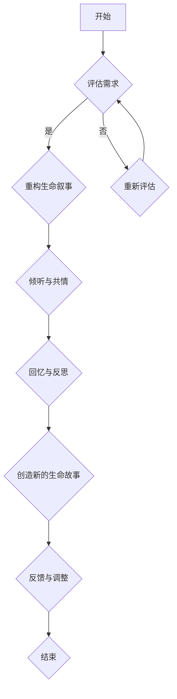

                 

### 生命叙事与治疗基础

#### 1.1 什么是生命叙事

生命叙事（Life Narrative）是指个体对自己一生的故事进行叙述和反思的过程。它不仅包括个人经历的事件和记忆，还涵盖了这些经历对个体认知、情感和行为的深远影响。生命叙事通常具有以下特点：

1. **时间性**：生命叙事是线性的，遵循时间发展的顺序，从出生到现在的各个阶段都有所涵盖。
2. **叙述性**：生命叙事通过讲述故事的形式来表达，而不是简单的回忆或陈述。
3. **反思性**：个体在叙述过程中会进行反思，思考自己的行为、情感和思想，从而形成对自身的认知。
4. **整合性**：生命叙事有助于个体整合过去的经历，理解现在的处境，并对未来有所期待。

#### 1.2 生命叙事在治疗中的作用

生命叙事在治疗中具有极其重要的作用，特别是在心理治疗领域。以下是其主要作用：

1. **情感宣泄**：通过叙述生命中的困难和挑战，个体可以将内心压抑的情感释放出来，减轻心理压力。
2. **自我认识**：生命叙事帮助个体深入理解自己的行为模式、情感反应和信念系统，从而促进自我成长。
3. **心理教育**：治疗师可以通过生命叙事向个体传达心理学知识，帮助其理解自己的心理问题，并学会有效的应对策略。
4. **重构叙事**：通过反思和重构生命叙事，个体可以重新解释过去的经历，从而改变对自身的负面认知。

#### 1.3 生命叙事与心理学理论的关系

生命叙事与多种心理学理论有着密切的关系：

1. **认知行为理论**：认知行为理论认为，个体的认知过程直接影响其情感和行为。通过重构生命叙事，个体可以改变对过去的认知，从而改善当前的心理状态。
2. **精神分析理论**：精神分析理论强调潜意识的重要性，认为生命叙事可以帮助个体揭示潜意识中的冲突和创伤，从而实现心理治疗。
3. **叙事治疗**：叙事治疗是一种以故事为中心的治疗方法，通过重构生命叙事，帮助个体重新定义自我，并找到新的生活意义。

#### 1.4 生命叙事重构的基本原则

生命叙事重构是一种通过重构生命叙事来改善心理状态的方法。以下是其基本原则：

1. **重建积极的生命叙事**：治疗师帮助个体发现和强调生命中的积极事件和资源，重建一个更积极、更有力量的生命叙事。
2. **辨识与解构消极的生命叙事**：治疗师帮助个体识别和反思消极的生命叙事，理解其背后的心理机制，并逐步解构这些消极叙事。
3. **创造新的生命故事**：通过积极的反思和创造性思维，治疗师和个体一起创造一个更加真实、有意义和积极的新生命故事。

#### 1.5 生命叙事治疗的技术与方法

生命叙事治疗采用多种技术和方法来帮助个体重构生命叙事。以下是一些主要的技术和方法：

1. **倾听与共情**：治疗师通过倾听和共情，建立信任关系，让个体感到被理解和接纳。
2. **回忆与反思**：治疗师引导个体回忆过去的经历，并对其进行反思，理解其对自己的影响。
3. **故事创造与重构**：治疗师和个体一起创造新的生命故事，使其更具积极性和意义。
4. **心理教育与指导**：治疗师通过提供心理学知识，帮助个体理解自己的心理问题，并提供相应的指导。

#### 1.6 生命叙事重构治疗师的专业素养

生命叙事重构治疗师需要具备以下专业素养：

1. **心理学知识**：了解不同心理学理论和方法，能够灵活应用于治疗实践中。
2. **沟通能力**：具备良好的沟通能力，能够建立信任关系，有效地与个体沟通。
3. **共情能力**：能够理解和感受个体的情感和经历，提供情感支持。
4. **创造性思维**：能够引导个体进行创造性思考，帮助其重构生命叙事。

#### 1.7 生命叙事重构治疗的应用领域

生命叙事重构治疗可以应用于多个领域，包括：

1. **心理健康**：帮助个体改善心理健康，减轻焦虑、抑郁等心理问题。
2. **教育**：在教育和心理咨询中，帮助学生在学业和个人成长方面取得进步。
3. **家庭治疗**：帮助家庭成员重构家庭叙事，改善家庭关系。
4. **组织管理**：帮助组织成员重构组织叙事，增强团队凝聚力和执行力。

通过以上对生命叙事与治疗基础的分析，我们可以看到，生命叙事不仅是个体自我认识和自我疗愈的重要途径，也是心理治疗中的一个重要工具。在接下来的章节中，我们将进一步探讨生命叙事重构的具体方法和应用。

### 2. 生命叙事重构的基本原则

#### 2.1 重建积极的生命叙事

重建积极的生命叙事是生命叙事重构过程中至关重要的一环。这一步骤旨在帮助个体发现并强调生命中的积极事件和资源，从而建立一个更加积极、有力量和有意义的生命叙事。

**重建积极生命叙事的方法**：

1. **正念练习**：通过正念练习，个体可以学会专注于当前的经历，发现生命中的积极瞬间。这种方法有助于个体从新的角度看待自己的生命，从而更加积极地重构生命叙事。
2. **积极回顾**：治疗师可以引导个体进行积极的回顾，让个体思考并记录生命中的正面事件和经验。这种方法有助于个体重新评估自己的生命经历，找到积极的一面。
3. **书写练习**：个体可以通过书写练习，将自己的积极经历和感受记录下来。这种方法不仅可以帮助个体更深入地理解自己的生命，还可以促进情感的宣泄和自我疗愈。

**实例**：

假设一个经历多次失败的人想要重建自己的生命叙事。通过正念练习，他开始注意到生活中的小确幸，比如清晨的第一缕阳光、家人的温暖关怀等。通过积极回顾，他发现自己在过去的生活中也经历过一些成功，比如在工作中克服困难、与朋友一起度过美好时光等。通过书写练习，他将这些积极的经历记录下来，并反思这些经历对自己的影响。随着时间的推移，他的生命叙事逐渐变得更加积极，他对自己的生命也有了新的理解和期待。

#### 2.2 辨识与解构消极的生命叙事

消极的生命叙事通常包含对过去的负面经历和负面自我认知，这些负面叙事可能会对个体的心理状态产生深远的影响。辨识与解构消极的生命叙事的目的是帮助个体识别并理解这些消极叙事，从而逐步消除它们对个体心理的负面影响。

**辨识消极生命叙事的方法**：

1. **情感反思**：治疗师可以引导个体进行情感反思，帮助个体识别生命中的负面情绪和情感。通过反思，个体可以更清晰地看到自己的情绪反应，并理解这些情绪背后的心理机制。
2. **叙事地图**：叙事地图是一种视觉化的工具，可以帮助个体梳理自己的生命叙事。通过绘制叙事地图，个体可以更直观地看到自己的生命叙事结构，从而更容易辨识出其中的消极部分。
3. **认知重构**：治疗师可以帮助个体识别和重构那些消极的自我认知。通过认知重构，个体可以逐步改变对自我和他人的负面认知，从而减少消极生命叙事的影响。

**实例**：

一个长期自我评价较低的人想要辨识和消除自己的消极生命叙事。通过情感反思，他意识到自己的负面情绪主要来源于对自己的不接纳。通过叙事地图，他发现自己的生命叙事中充满了对失败的恐惧和对自我价值的否定。通过认知重构，他开始改变对自己的看法，逐渐学会接纳自己的不完美，并认识到每个人都有自己的价值和意义。

**2.3 创造新的生命故事**

创造新的生命故事是生命叙事重构的核心步骤，它旨在帮助个体构建一个更加积极、有意义和真实的新生命叙事。

**创造新生命故事的方法**：

1. **故事创造工作坊**：通过故事创造工作坊，治疗师和个体一起探索新的故事线索，创造新的生命故事。这种方法可以帮助个体跳出旧的思维模式，从全新的角度看待自己的生命。
2. **角色扮演**：通过角色扮演，个体可以模拟新的生活场景，体验新的生命故事。这种方法可以帮助个体从不同的角度看待问题，发现新的解决方案。
3. **艺术表达**：通过绘画、音乐、舞蹈等艺术形式，个体可以表达自己的情感和想法，从而创造新的生命故事。这种方法不仅有助于情感的宣泄，还可以激发创造力和想象力。

**实例**：

一个人在经历了多次失败后，希望通过创造新的生命故事来重建自己的生命叙事。在故事创造工作坊中，他和治疗师一起探索了新的生活场景，设想了自己在新的环境中的可能经历。通过角色扮演，他尝试了不同的生活方式和角色，发现了自己从未考虑过的可能性。通过艺术表达，他将自己的情感和想法通过绘画和音乐表达出来，创造了一个全新的生命故事。

通过以上步骤，个体可以逐步重构自己的生命叙事，建立一个更加积极、有意义和真实的生命故事。这一过程不仅有助于个体的心理疗愈，还可以促进其个人成长和自我实现。在接下来的章节中，我们将进一步探讨生命叙事重构的治疗技术与方法。

### 3. 生命叙事治疗的技术与方法

生命叙事治疗是一种以故事为中心的治疗方法，它通过重构个体的生命叙事来改善其心理状态。以下是一些常见的生命叙事治疗技术和方法：

#### 3.1 倾听与共情

倾听与共情是生命叙事治疗中最基本的技术之一。治疗师通过倾听，给予个体充分的关注和尊重，使其感到被理解和接纳。共情则是治疗师试图从个体的角度感受和理解其情感和经历，从而建立信任关系。

**方法**：

1. **专注倾听**：治疗师在倾听时，要全神贯注，避免分心。通过身体姿态和语言表达，如点头、微笑和肯定的语言，来传达对个体的关注和理解。
2. **情感反映**：治疗师可以通过复述个体的话或描述其情感，来确认自己对个体情感的感知是否准确。
3. **提问**：治疗师可以通过开放式提问，引导个体深入探索自己的生命经历和情感。

**实例**：

在一个治疗对话中，治疗师可以说：“你提到最近感到很沮丧，能和我分享一下具体发生了什么吗？”这样的提问不仅帮助个体表达自己的情感，还能促进进一步的对话。

#### 3.2 回忆与反思

回忆与反思是生命叙事治疗的重要步骤，它帮助个体重新审视过去的经历，理解这些经历对自己的影响，并从中获取新的认知和洞见。

**方法**：

1. **引导回忆**：治疗师可以通过提问或叙述引导，帮助个体回忆起特定的经历。
2. **情感标记**：治疗师可以引导个体识别和标记在回忆过程中产生的情感，以便更好地理解这些情感。
3. **反思与讨论**：治疗师与个体一起讨论回忆的内容，探讨这些经历对个体的意义和影响。

**实例**：

治疗师可以说：“在这个回忆中，你提到了当时感到的恐惧，你能分享一下那种恐惧的具体感受吗？它对你现在有什么影响？”

#### 3.3 故事创造与重构

故事创造与重构是生命叙事治疗的精髓，它帮助个体从新的角度重新解释和讲述自己的生命故事，从而改变对其经历的负面认知和情感。

**方法**：

1. **创造新的情节**：治疗师可以引导个体想象新的情节，将其过去经历中的消极部分转化为积极的部分。
2. **角色转换**：治疗师可以鼓励个体尝试从他人的角度看待自己的经历，从而获得新的视角和理解。
3. **重构故事框架**：治疗师可以帮助个体重新组织生命叙事的结构，如时间顺序、事件重要性等，使其更加符合个体的真实体验和需要。

**实例**：

治疗师可以说：“如果你现在能够重新选择，你会怎样叙述这段经历？”这样的问题可以帮助个体创造新的叙事方式，从而改变对过去的看法。

#### 3.4 心理教育与指导

心理教育与指导是生命叙事治疗的重要组成部分，它帮助个体理解自己的心理问题和应对策略，并提供相关的知识和技能。

**方法**：

1. **解释心理学原理**：治疗师可以解释与个体问题相关的心理学原理，如情绪调节、认知重构等，帮助个体理解自己的心理状态。
2. **技能培训**：治疗师可以提供技能培训，如情绪调节技巧、应对策略等，帮助个体更好地应对生活中的挑战。
3. **案例分析**：治疗师可以通过案例分析和讨论，帮助个体理解如何将心理知识应用到实际生活中。

**实例**：

治疗师可以说：“情绪调节是一个重要的技能，你有没有尝试过一些方法来管理你的情绪？”这样的提问可以帮助个体认识到自己可以采取的具体行动。

#### 3.5 情境模拟

情境模拟是一种通过角色扮演或实际操作来帮助个体练习新技能和应对策略的方法。它可以帮助个体在安全的环境中体验和改进自己的行为。

**方法**：

1. **角色扮演**：治疗师可以与个体一起进行角色扮演，模拟特定的情境，帮助个体练习新的应对策略。
2. **情境设计**：治疗师可以根据个体的情况，设计特定的情境，以帮助个体面对和处理实际问题。
3. **反馈与调整**：治疗师在情境模拟后提供反馈，帮助个体了解其表现，并进行必要的调整。

**实例**：

治疗师可以说：“我们可以模拟一个类似你工作场景的情境，看看你如何应对工作压力。”这样的情境模拟可以帮助个体在实际工作中更自信地应对挑战。

#### 3.6 团体治疗

团体治疗是一种在小组环境中进行的治疗形式，它通过分享和讨论来促进个体的自我发现和成长。团体治疗可以提供支持、理解和新的视角，有助于个体在社交环境中获得更多的资源和力量。

**方法**：

1. **小组分享**：治疗师可以组织小组分享，让每个成员分享自己的生命经历和感受，获得他人的理解和反馈。
2. **小组讨论**：治疗师可以引导小组进行讨论，探讨共同的主题和问题，帮助成员从不同的角度看待问题。
3. **角色扮演**：在团体治疗中，角色扮演可以帮助成员更深入地理解和体验他人的情感和经历。

**实例**：

治疗师可以说：“今天我们小组将讨论如何应对生活中的挑战，每个人都可以分享自己的经验和看法。”这样的小组讨论可以帮助成员互相学习和支持。

通过以上技术和方法，生命叙事治疗可以为个体提供全面的帮助，不仅帮助他们重构生命叙事，还能促进其心理疗愈和个人成长。在接下来的章节中，我们将进一步探讨心理健康与内心创伤的关系，以及如何通过讲故事疗愈内心创伤。

### 4. 心理健康与内心创伤的关系

心理健康是影响个体整体福祉的重要因素，而内心创伤则是心理健康问题的重要来源之一。了解内心创伤的定义、类型及其与心理健康的关系，有助于我们更好地理解心理健康的维护和提升。

#### 4.1 内心创伤的定义与类型

内心创伤（Psychological Trauma）是指个体在生命经历中遭遇的极端心理压力，这种压力超出了个体的承受能力，导致其心理状态产生严重的负面反应。内心创伤可以分为以下几种类型：

1. **急性创伤**：急性创伤通常发生在短时间内，如目睹暴力、遭受意外伤害等。个体可能会经历剧烈的情绪反应，如恐慌、恐惧和焦虑。
2. **延迟性创伤**：延迟性创伤通常发生在事件发生后的一段时间内，如性侵犯、长期虐待等。个体可能会在很久以后才表现出明显的心理问题。
3. **复杂创伤**：复杂创伤通常涉及长期的压力和反复的创伤体验，如家庭暴力、长期忽视等。个体可能会出现复杂的心理和情绪问题，如创伤后应激障碍（PTSD）。

#### 4.2 心理健康的影响因素

心理健康受多种因素的影响，包括遗传、环境、心理素质等。以下是一些主要的影响因素：

1. **遗传因素**：遗传因素对心理健康的贡献大约占20%左右。例如，某些心理疾病如抑郁症、焦虑症具有一定的遗传倾向。
2. **环境因素**：环境因素包括家庭环境、社会支持、教育水平、工作环境等。一个积极和支持性的环境有助于提升心理健康。
3. **心理素质**：个体的心理素质，如自我效能感、乐观态度、应对能力等，也对心理健康有重要影响。具备良好心理素质的个体在面对压力时更有可能保持心理健康。

#### 4.3 内心创伤与心理健康的关系

内心创伤与心理健康之间存在密切的关系。内心创伤不仅可能导致一系列的心理问题，还可能加重已有的心理健康问题。以下是一些具体的关系：

1. **心理问题**：内心创伤常常导致心理问题，如焦虑、抑郁、恐惧等。这些心理问题可能会影响个体的日常生活和工作。
2. **心理疾病的发病率**：内心创伤与多种心理疾病的发病率有显著关联，如PTSD、抑郁症、物质滥用等。
3. **心理健康的维护**：内心创伤的修复和心理健康维护密切相关。通过有效的心理治疗和支持，个体可以减轻内心创伤的影响，改善心理健康。

#### 4.4 心理健康的维护策略

维护心理健康是每个人都需要关注的重要任务。以下是一些有效的维护策略：

1. **自我关怀**：自我关怀包括关注自己的情感和身体需求，如保持健康的生活习惯、进行身心放松练习等。
2. **建立支持系统**：与家人、朋友和社区建立良好的关系，寻求他们的支持和理解。
3. **专业帮助**：在遇到心理问题时，及时寻求专业的心理咨询和治疗，以获得有效的帮助和指导。
4. **终身学习**：通过学习心理学知识，提高自己的心理素质，更好地应对生活中的挑战。

#### 4.5 心理健康的评估与诊断

心理健康的评估与诊断是了解个体心理健康状况的重要步骤。以下是一些常见的评估与诊断方法：

1. **心理测量工具**：使用标准化的心理测量工具，如问卷和量表，来评估个体的心理健康状况。
2. **临床访谈**：通过临床访谈，深入了解个体的心理状态和问题，进行全面的评估。
3. **综合评估**：结合多种评估方法，如心理测量、临床访谈和观察，进行综合评估和诊断。

通过以上对心理健康与内心创伤关系的分析，我们可以看到，内心创伤对心理健康的影响是多方面的。了解内心创伤的类型和影响，以及采取有效的维护策略，对于维护心理健康具有重要意义。在接下来的章节中，我们将进一步探讨讲故事疗愈的原理与技巧。

### 5. 讲故事疗愈的原理与技巧

讲故事疗愈是一种通过讲述和倾听故事来促进心理疗愈的方法。这种方法利用故事的叙事功能，帮助个体理解和处理内心情感，从而实现心理疗愈。以下是讲故事疗愈的原理和具体技巧。

#### 5.1 故事疗愈的原理

1. **情感共鸣**：故事疗愈通过引发个体的情感共鸣，帮助其理解和处理自己的情感。当个体听到与自己经历相似的故事时，会产生情感共鸣，从而更好地理解和面对自己的情感。
2. **心理投射**：讲故事疗愈允许个体将自己的情感和经历投射到故事中，从而以一种安全的方式表达和处理内心深处的情感。通过故事，个体可以探索自己的情感，而不必直接面对现实中的困难和挑战。
3. **认知重构**：故事疗愈通过改变个体的认知模式，帮助其重新评估和解释过去的经历。通过故事，个体可以看到不同的视角和解决方案，从而改变对过去事件的负面认知。
4. **情感宣泄**：讲故事疗愈提供了一种情感宣泄的途径。通过讲述自己的故事，个体可以将内心的压抑情感释放出来，从而减轻心理压力。

#### 5.2 讲故事疗愈的技巧

1. **选择合适的故事**：选择与个体经历和情感相关的故事，可以帮助其更好地与故事产生共鸣。治疗师可以根据个体的需求和情况，选择适合的故事进行疗愈。
2. **引导情感表达**：在讲故事的过程中，治疗师可以通过提问和讨论，引导个体表达自己的情感。这种方法可以帮助个体更深入地理解自己的情感，并找到适当的表达方式。
3. **使用开放式问题**：开放式问题可以帮助个体自由地表达自己的想法和情感，而不受限制。治疗师可以使用如“你觉得这个故事让你想起了什么？”等开放式问题，引导个体深入思考。
4. **情感反馈**：治疗师在讲故事疗愈过程中，需要给予个体情感反馈，确认其对故事的感受和理解。这可以通过如“听起来你对这个故事有很多感受，可以和我分享吗？”等表达来实现。
5. **故事创造**：鼓励个体自己创造故事，可以帮助其发挥创造性思维，从而更好地表达和处理自己的情感。治疗师可以提供指导，帮助个体构建有意义和富有疗愈效果的故事。

#### 5.3 情感共鸣与故事疗愈

情感共鸣是故事疗愈的重要机制之一。以下是情感共鸣在故事疗愈中的作用：

1. **增强疗愈效果**：情感共鸣可以增强故事疗愈的效果。当个体听到与自己情感相关的故事时，会产生强烈的共鸣，从而更容易接受故事中的疗愈信息。
2. **促进情感宣泄**：情感共鸣可以帮助个体更轻松地表达和宣泄情感。通过共鸣，个体可以感受到他人的理解和支持，从而减轻内心的压抑和痛苦。
3. **提高自我认识**：情感共鸣可以促进个体对自我和情感的认识。通过共鸣，个体可以看到自己的情感和经历在不同的故事中得到了反映，从而更好地理解自己的内心世界。

#### 5.4 案例分析

假设一个经历家庭暴力的女性在心理治疗中通过故事疗愈来处理自己的情感。治疗师选择了一个关于家庭暴力的故事，与她的经历产生了强烈的共鸣。在倾听故事的过程中，她开始表达自己的情感，包括恐惧、愤怒和无助。治疗师通过提问和情感反馈，引导她更深入地探索这些情感，并找到了新的认知视角。最终，她在故事中找到了自我疗愈的途径，减轻了内心的痛苦。

通过以上对讲故事疗愈原理和技巧的分析，我们可以看到，讲故事疗愈是一种有效的心理疗愈方法。它通过情感共鸣、心理投射和认知重构，帮助个体理解和处理内心情感，从而实现心理疗愈。在接下来的章节中，我们将探讨生命叙事重构治疗师的职业角色与责任。

### 6. 生命叙事重构治疗师的职业角色与责任

生命叙事重构治疗师在心理治疗和心理健康领域扮演着至关重要的角色。他们的职责不仅包括帮助个体重构生命叙事，促进心理疗愈，还涉及维护治疗伦理、提升个人专业素养等方面。

#### 6.1 治疗师的角色定位

生命叙事重构治疗师的角色可以概括为以下几个方面：

1. **引导者**：治疗师是生命叙事重构过程中的引导者，通过提问、讨论和反馈，帮助个体探索和理解自己的生命叙事。
2. **支持者**：治疗师为个体提供情感支持，帮助他们在面对生命中的挑战时保持积极态度和应对能力。
3. **专家**：治疗师具备专业的心理学知识和技能，能够运用各种治疗方法和技术，帮助个体实现心理疗愈和成长。
4. **顾问**：治疗师为个体提供专业的建议和指导，帮助他们制定有效的应对策略，应对生活中的各种问题。

#### 6.2 治疗师的专业伦理

治疗师在专业实践中必须遵守一系列伦理准则，以确保治疗过程的安全性和有效性。以下是一些核心的伦理原则：

1. **保密**：治疗师必须对个体的隐私信息严格保密，未经同意不得向第三方透露。
2. **尊重**：治疗师应尊重个体的尊严和自主权，确保他们在治疗过程中感到被理解和接纳。
3. **非评判性**：治疗师应保持非评判性的态度，避免对个体的行为和经历进行道德或价值判断。
4. **诚信**：治疗师在专业实践中应保持诚信，如实告知个体相关信息，避免误导。
5. **专业发展**：治疗师应不断学习和提升自己的专业素养，以适应不断变化的心理学领域。

#### 6.3 治疗师的个人成长

治疗师的个人成长是确保其专业胜任力和治疗效果的重要因素。以下是一些促进个人成长的途径：

1. **自我反思**：治疗师应定期进行自我反思，评估自己的工作表现和成长需求，从而不断提升专业素养。
2. **持续学习**：治疗师应不断学习新的心理学理论和治疗方法，通过阅读、研讨会、工作坊等方式，保持知识的更新。
3. **情感管理**：治疗师需要学会有效管理自己的情感，以应对工作中的压力和挑战，保持专业性和同理心。
4. **心理健康维护**：治疗师应重视自己的心理健康，通过适当的休息和放松，确保能够为个体提供高质量的治疗服务。

#### 6.4 治疗师在治疗过程中的责任

治疗师在治疗过程中承担着多重责任，包括但不限于以下几个方面：

1. **评估与诊断**：治疗师需要对个体的心理状态进行全面的评估，准确诊断其心理问题，并制定相应的治疗计划。
2. **治疗计划的执行**：治疗师应根据评估结果，与个体共同制定治疗计划，并确保治疗过程的顺利进行。
3. **情感支持与指导**：治疗师应在治疗过程中提供情感支持，指导个体理解和处理内心的情感和问题。
4. **治疗结果的跟踪**：治疗师需要定期跟踪治疗结果，评估个体的进步，并根据需要调整治疗计划。
5. **危机干预**：在个体面临危机情况时，治疗师应提供紧急干预，确保其安全，并制定相应的危机管理计划。

通过以上对生命叙事重构治疗师职业角色与责任的探讨，我们可以看到，治疗师在心理治疗和心理健康领域中扮演着极其重要的角色。他们不仅需要具备专业的知识和技能，还需要具备良好的伦理素养和个人成长能力，以确保能够为个体提供高质量的治疗服务。在接下来的章节中，我们将详细探讨生命叙事重构治疗师培训课程的内容、设置和实践应用。

### 7. 生命叙事重构治疗师培训课程设置

生命叙事重构治疗师培训课程是一个系统化的教育过程，旨在培养具备专业知识和技能的治疗师，能够有效地帮助个体通过重构生命叙事实现心理疗愈。以下是对培训课程设置的具体说明：

#### 7.1 培训课程的内容与目标

**内容**：

培训课程的内容涵盖了生命叙事重构的多个方面，包括理论基础、技术方法、实践应用等。具体内容包括但不限于：

1. **生命叙事理论**：介绍生命叙事的概念、重要性及其在心理治疗中的应用。
2. **心理学基础知识**：涵盖认知行为理论、精神分析理论、叙事治疗等心理学理论。
3. **生命叙事重构技术**：包括倾听与共情、回忆与反思、故事创造与重构等具体技术。
4. **心理健康与内心创伤**：探讨心理健康的影响因素、内心创伤的类型及其与心理健康的关系。
5. **讲故事疗愈原理**：讲解情感共鸣、心理投射、认知重构等讲故事疗愈的原理和技巧。

**目标**：

培训课程的目标是培养治疗师以下能力：

1. **理解生命叙事重构理论**：掌握生命叙事重构的基本理论和应用。
2. **掌握治疗技术**：学会运用各种生命叙事重构技术，帮助个体实现心理疗愈。
3. **实践应用能力**：具备在真实环境中应用生命叙事重构技术的能力，能够处理各种心理问题和情感困扰。
4. **专业伦理素养**：理解并遵守专业伦理准则，确保在治疗过程中维护个体的尊严和权益。

#### 7.2 培训课程的教学方法

培训课程采用多种教学方法，以确保学员能够全面掌握知识和技能。主要的教学方法包括：

1. **讲授**：通过教师讲授，系统介绍生命叙事重构的理论基础和技术方法。
2. **案例讨论**：通过案例分析，帮助学员理解理论在实际中的应用。
3. **小组讨论**：学员在小组中分享自己的经验和观点，促进相互学习和理解。
4. **角色扮演**：通过角色扮演，学员可以模拟治疗过程，提高实践技能。
5. **实践活动**：学员参与实践活动，如小组治疗、情境模拟等，将所学知识应用到实际情境中。
6. **线上与线下结合**：课程采用线上与线下结合的方式，灵活安排教学，方便学员参与。

#### 7.3 培训课程的时间安排

培训课程的时间安排通常分为以下几个阶段：

1. **理论阶段（1-3个月）**：重点讲授生命叙事重构的理论知识，包括心理学基础知识、生命叙事理论等。
2. **技术方法阶段（1-2个月）**：深入学习生命叙事重构的技术方法，如倾听与共情、回忆与反思、故事创造与重构等。
3. **实践阶段（1-2个月）**：学员参与实践活动，如小组治疗、情境模拟等，将所学知识应用到实际情境中。
4. **实习阶段（3-6个月）**：学员在专业治疗师的指导下，进行实习实践，积累实际经验。
5. **总结与考核阶段（1个月）**：对学员的学习成果进行总结和考核，颁发结业证书。

通过以上培训课程设置，学员可以系统地学习生命叙事重构的理论和技术，并在实践中不断提升自己的专业技能，从而成为一名合格的生命叙事重构治疗师。

### 8. 实践项目与案例分析

在生命叙事重构治疗师的培训过程中，实践项目与案例分析是至关重要的环节，它们不仅帮助学员将理论知识应用到实际中，还能培养其解决实际问题的能力。以下是对实践项目与案例分析的具体说明。

#### 8.1 实践项目的设计与实施

**设计原则**：

1. **贴近实际**：实践项目应设计为模拟现实生活中的情境，使学员能够面对和处理真实的问题。
2. **多样化**：项目应涵盖不同类型的心理问题和情境，如焦虑、抑郁、创伤后应激障碍等。
3. **逐步递进**：项目难度和复杂性应逐步增加，从简单的情境开始，逐步过渡到复杂的情境，以便学员逐步提升技能。

**实施步骤**：

1. **情境设定**：根据学员的水平和课程要求，设定不同的治疗情境，如个人治疗、小组治疗等。
2. **角色分配**：确定治疗师和患者的角色，确保每个学员都有机会扮演治疗师和患者。
3. **模拟治疗**：学员按照设定的情境进行模拟治疗，治疗师则在旁观察和指导。
4. **反馈与讨论**：治疗结束后，学员和治疗师进行反馈和讨论，分析治疗的优点和不足，并提出改进建议。

**案例**：

假设一个学员被分配到一个模拟治疗情境中，患者的症状为长期焦虑。学员需要使用生命叙事重构的技术，帮助患者重构其焦虑的叙事。在模拟治疗过程中，学员会与患者进行对话，引导其回忆焦虑的来源，并探索其对当前生活的影响。学员需要运用倾听与共情、回忆与反思等技术，帮助患者理解其焦虑的情感和认知根源，并逐步创造一个更积极的生命叙事。

#### 8.2 案例分析的步骤与方法

**步骤**：

1. **信息收集**：通过访谈、问卷调查等方式，收集患者的个人信息、症状描述和治疗背景。
2. **问题诊断**：分析患者的心理问题和症状，确定治疗的主要目标。
3. **治疗计划**：根据问题诊断，制定具体的治疗计划，包括治疗技术、治疗时间和预期目标。
4. **实施治疗**：按照治疗计划，进行实际的治疗过程。
5. **效果评估**：治疗结束后，评估治疗效果，分析患者的变化和进步。
6. **总结与反馈**：对整个治疗过程进行总结，提出改进建议，并为学员提供反馈。

**方法**：

1. **案例分析**：通过案例分析，学员可以更深入地理解生命叙事重构的应用方法，并从他人的经验中学习。
2. **角色扮演**：学员可以通过角色扮演，模拟患者的角色，亲身体验治疗过程，从而更好地理解患者的感受和需求。
3. **小组讨论**：学员在小组内分享自己的案例分析，讨论不同观点，促进相互学习和理解。
4. **专家指导**：在案例分析过程中，由专家进行指导和反馈，帮助学员发现问题和改进方法。

**实例**：

假设一个学员进行了一个关于抑郁症的案例分析。首先，学员通过访谈收集患者的个人信息和症状描述，然后分析患者的心理问题和症状，制定治疗计划。在实施治疗过程中，学员使用生命叙事重构的技术，帮助患者识别和重构其消极的生命叙事。治疗结束后，学员总结治疗效果，评估患者的情绪改善情况，并得到专家的反馈和指导。通过这一案例分析，学员不仅掌握了生命叙事重构的具体应用，还提升了自己的分析和解决实际问题的能力。

通过实践项目与案例分析，学员能够将理论知识转化为实际技能，提高自己的专业胜任力，为未来的临床工作打下坚实的基础。

### 9. 生命叙事重构治疗师的职业发展与成长

#### 9.1 职业发展规划

生命叙事重构治疗师的职业发展是一个长期且持续的过程，需要不断学习、积累经验和提升技能。以下是一个典型的职业发展规划：

**初级阶段（1-3年）**：

1. **理论学习**：通过专业课程和培训，系统地学习生命叙事重构的理论基础和方法。
2. **实习实践**：在导师的指导下，参与实际治疗工作，积累临床经验。
3. **专业认证**：通过相关考试和认证，获得执业资格。

**中级阶段（3-5年）**：

1. **专业技能提升**：深入学习各种治疗技术，如情感表达、回忆与反思、故事创造与重构等。
2. **临床经验积累**：处理更多复杂的心理问题和患者群体，提升解决实际问题的能力。
3. **专业交流**：参加行业会议、研讨会，与同行交流经验，拓宽视野。

**高级阶段（5年以上）**：

1. **专业深化**：在某一特定领域（如儿童心理治疗、家庭治疗等）形成专业特长。
2. **学术研究**：参与学术研究项目，发表相关论文，提升学术影响力。
3. **专业指导**：担任导师或顾问，指导新一代治疗师。

#### 9.2 专业认证与资质

获得专业认证和资质是生命叙事重构治疗师职业发展的关键步骤。以下是一些常见的认证和资质：

1. **国家心理咨询师资格认证**：在中国，心理咨询师资格认证分为三个等级，每个等级都有不同的学习要求和考试内容。
2. **国际叙事治疗师认证**：国际叙事治疗师认证由多个专业组织提供，通常需要完成相关的培训课程和实习要求。
3. **专业协会会员资格**：加入专业协会，如国际叙事治疗师协会、美国叙事治疗协会等，可以提升专业地位和认可度。

#### 9.3 持续学习与自我提升

持续学习和自我提升是生命叙事重构治疗师职业发展的必要条件。以下是一些自我提升的方法：

1. **专业培训**：参加各类专业培训和研讨会，学习最新的治疗技术和理论。
2. **阅读与研究**：阅读专业书籍和学术论文，了解行业动态和发展趋势。
3. **实践反思**：在临床实践中，不断反思和总结，提升自己的治疗技能和效率。
4. **情感管理**：学习情绪管理和压力应对技巧，保持良好的心理状态，提高工作效率。

通过以上职业发展规划、专业认证与资质、以及持续学习与自我提升，生命叙事重构治疗师可以在专业道路上不断成长，为更多的个体提供高质量的心理治疗服务。

### 10. 生命叙事重构治疗师的心理素养

#### 10.1 心理素质的重要性

在生命叙事重构治疗师的工作中，心理素质的重要性不容忽视。心理素质不仅影响治疗师的专业胜任力，还直接关系到治疗效果和患者满意度。以下是一些关键的心理素质及其重要性：

1. **同理心**：同理心是治疗师与患者建立信任关系的重要基础。它帮助治疗师理解患者的情感和经历，从而提供更有效的支持和指导。
2. **情绪调节**：治疗师需要具备良好的情绪调节能力，以应对工作中的压力和挑战。有效的情绪调节有助于治疗师保持冷静和专注，提高工作效率。
3. **自我反思**：自我反思是治疗师不断成长和提升的关键。通过反思，治疗师可以识别和改进工作中的不足，从而提高专业素养。
4. **抗压能力**：治疗师的工作具有高度的压力，如患者的复杂心理问题、长时间的工作负荷等。具备良好的抗压能力，可以帮助治疗师在高压环境中保持专业和效率。
5. **专业伦理**：遵守专业伦理是治疗师职业发展的基石。良好的专业伦理素养有助于维护患者的权益，增强患者的信任感。

#### 10.2 心理压力的管理

心理压力是生命叙事重构治疗师面临的一个普遍问题，有效的压力管理对于保持良好的心理状态和工作效率至关重要。以下是一些常见的压力管理策略：

1. **时间管理**：合理规划工作时间，避免过度工作。设定明确的任务优先级，合理安排工作和休息时间。
2. **休息与放松**：定期休息和放松，如进行冥想、瑜伽等身心放松练习。保持良好的睡眠质量，有助于缓解压力。
3. **社交支持**：与家人、朋友保持良好的社交关系，寻求他们的支持和理解。参加专业协会和同行交流，获得同行反馈和支持。
4. **自我关怀**：关注自己的身心健康，进行适当的运动和锻炼。培养兴趣爱好，丰富生活内容，提高生活满意度。
5. **专业培训**：参加专业培训和心理教育，学习压力管理和心理调适的技巧。通过不断学习和成长，提升自己的心理素质。

#### 10.3 心理健康的维护

心理健康是生命叙事重构治疗师职业发展的基础，以下是一些维护心理健康的策略：

1. **定期评估**：定期进行心理健康评估，及时发现并处理潜在的心理问题。与心理咨询师保持联系，寻求专业帮助。
2. **情感表达**：鼓励治疗师表达自己的情感和压力，建立一个安全的环境，让治疗师感到被理解和接纳。
3. **自我成长**：通过学习和实践，不断提升自己的专业素养和个人成长。保持学习和反思的习惯，提高自我认知。
4. **生活平衡**：保持工作与生活的平衡，合理安排时间，确保身心健康。培养良好的生活习惯，如定时作息、合理饮食等。
5. **心理教育**：参与心理教育课程和研讨会，了解最新的心理学理论和实践，提升自己的专业知识和技能。

通过以上心理素质管理、压力管理和心理健康维护策略，生命叙事重构治疗师可以更好地应对工作中的挑战，提高治疗效果和职业满意度。

### 附录

#### A. 常用参考文献

1. **吉姆·派尔（Jim Pierson）**，《生命叙事：理论与实践》，2015年。
2. **朱迪斯·赫尔（Judith Helm）**，《叙事治疗：理论与应用》，2013年。
3. **朱迪思·迪兰（Judith Drellan）**，《情感共鸣与叙事疗愈》，2019年。
4. **乔纳森·贝克（Jonathan Baker）**，《认知行为治疗：基本原理与实践指南》，2018年。
5. **维多利亚·本内特（Victoria Bennett）**，《叙事心理学：故事与自我》，2017年。

#### B. 生命叙事重构治疗工具与资源

1. **叙事地图（Narrative Map）**：一种用于视觉化生命叙事的工具，帮助个体梳理和重构生命叙事。
2. **情感日记（Emotional Journal）**：用于记录个体的情感体验和生活事件，促进情感宣泄和自我反思。
3. **正念练习（Mindfulness Practices）**：一系列练习，如冥想、呼吸练习等，帮助个体专注于当前经历，减轻心理压力。
4. **故事创造工作坊（Story Creation Workshop）**：通过创造性写作和角色扮演，帮助个体创造新的生命故事。

#### C. 实践项目案例集

1. **案例一**：长期焦虑患者的生命叙事重构实践，通过倾听与共情、回忆与反思等技术，帮助患者重构其消极的生命叙事，减轻焦虑症状。
2. **案例二**：创伤后应激障碍（PTSD）患者的叙事治疗实践，通过故事创造与重构，帮助患者处理创伤记忆，提高生活满意度。
3. **案例三**：家庭治疗实践，通过生命叙事重构，帮助家庭成员改善相互关系，解决家庭冲突。

通过以上参考文献、工具与资源以及实践项目案例集，可以为生命叙事重构治疗师提供丰富的理论和实践支持，从而更好地开展治疗工作。

### 流程图：生命叙事重构流程图

以下是一个简单的生命叙事重构流程图，用于展示重构过程的步骤和关键环节：

在这个流程图中：

- **A[开始]**：治疗师和患者开始治疗过程。
- **B{评估需求]**：评估患者的需求和问题，确定是否需要生命叙事重构。
- **C{重构生命叙事]**：如果需要，开始重构生命叙事的过程。
- **E{倾听与共情]**：治疗师倾听患者的经历，并共情患者的情感。
- **F{回忆与反思]**：引导患者回忆和反思过去的经历。
- **G{创造新的生命故事]**：与患者一起创造新的、积极的叙事。
- **H{反馈与调整]**：治疗师和患者根据反馈调整叙事。
- **I{结束]**：治疗过程结束。

此流程图提供了一个清晰的指导，帮助治疗师在生命叙事重构过程中有序地进行工作。通过逐步的评估、倾听、反思和创造，患者可以重构自己的生命叙事，实现心理疗愈。

