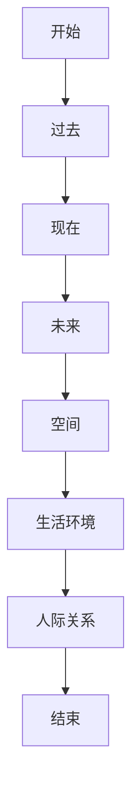
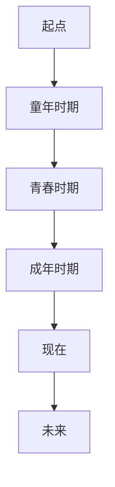

                 

# 生命叙事重构治疗：通过讲故事疗愈内心创伤的心理咨询

## 关键词
- 叙事治疗
- 心理咨询
- 内心创伤
- 生命叙事
- 讲故事疗法

## 摘要
本文将深入探讨生命叙事重构治疗，这是一种通过讲述故事来疗愈内心创伤的心理咨询方法。我们将从叙事治疗的起源和基本概念入手，逐步解析其核心技术、重构策略、应用场景，并详细分析其实践操作流程。最后，通过案例分析，展示叙事治疗在现实中的有效性和创新性。

## 目录

### 第一部分：叙事治疗理论框架

### 第1章：叙事治疗的起源与基本概念

#### 1.1 叙事治疗的定义与核心理念
#### 1.2 叙事治疗与心理治疗的关系
#### 1.3 叙事治疗的发展历程

### 第2章：叙事治疗的核心技术

#### 2.1 叙事性身份认同的构建
##### 2.1.1 内部对话与叙事重构
##### 2.1.2 讲故事的力量
##### 2.1.3 叙事中的时间与空间

### 第3章：生命叙事的重构策略

#### 3.1 生命叙事的识别与评估
##### 3.1.1 叙事图与叙事地图
##### 3.1.2 生命故事的评估标准
##### 3.1.3 生命故事的诊断

### 第4章：叙事治疗的应用场景

#### 4.1 心理创伤的治疗
##### 4.1.1 心理创伤的叙事治疗策略
##### 4.1.2 心理创伤叙事治疗的案例分析

### 第5章：叙事治疗中的伦理与伦理问题

#### 5.1 叙事治疗的伦理原则
##### 5.1.1 尊重与保密
##### 5.1.2 专业责任与边界设定
##### 5.1.3 伦理困境与应对策略

### 第二部分：叙事治疗的实践操作

### 第6章：叙事治疗的工作流程

#### 6.1 预约与初次会面
##### 6.1.1 患者选择与评估
##### 6.1.2 治疗目标设定
##### 6.1.3 会面安排与沟通技巧

### 第7章：叙事治疗的技术应用

#### 7.1 讲故事疗法
##### 7.1.1 讲故事的基本原则
##### 7.1.2 讲故事治疗的具体步骤
##### 7.1.3 讲故事治疗的案例分析

### 第8章：叙事治疗的评估与反馈

#### 8.1 治疗进展评估
##### 8.1.1 叙事治疗评估的方法与工具
##### 8.1.2 治疗效果评估与反馈
##### 8.1.3 治疗调整与改进

### 第9章：叙事治疗的综合应用

#### 9.1 家庭治疗
##### 9.1.1 家庭叙事治疗的原理与策略
##### 9.1.2 家庭叙事治疗的案例分享

#### 9.2 团体治疗
##### 9.2.1 团体叙事治疗的模式与流程
##### 9.2.2 团体叙事治疗的案例分析

### 第三部分：叙事治疗实例与案例分析

### 第10章：叙事治疗案例精选

#### 10.1 案例一：创伤后应激障碍的治疗
##### 10.1.1 案例背景
##### 10.1.2 治疗过程
##### 10.1.3 治疗效果评估

#### 10.2 案例二：抑郁症的叙事治疗
##### 10.2.1 案例背景
##### 10.2.2 治疗过程
##### 10.2.3 治疗效果评估

### 第11章：叙事治疗的创新与发展

#### 11.1 新技术下的叙事治疗
##### 11.1.1 互联网与叙事治疗的结合
##### 11.1.2 人工智能在叙事治疗中的应用
##### 11.1.3 未来叙事治疗的发展趋势

## 附录

### 附录A：叙事治疗常用工具与资源

#### A.1 叙事治疗相关书籍推荐
#### A.2 叙事治疗专业网站与论坛
#### A.3 叙事治疗工具与应用软件推荐

## 第一部分：叙事治疗理论框架

### 第1章：叙事治疗的起源与基本概念

#### 1.1 叙事治疗的定义与核心理念

叙事治疗（Narrative Therapy）起源于20世纪70年代的澳大利亚，由心理学家Michael White和David Epston创立。叙事治疗认为，个体的身份和经历是通过一系列的故事构建而成的，这些故事不仅塑造了我们的认知和行为模式，也影响着我们的情绪和心理健康。

叙事治疗的核心理念是“叙事性自我”（narrative self），即个体的自我认知和身份是由一系列生命叙事构成的。这些叙事不仅包括个人的历史和经历，还包括个体与社会、文化之间的关系。通过叙事治疗，咨询师和患者共同探索和重构这些叙事，从而改变个体的自我认知和情绪状态。

在叙事治疗中，咨询师的角色是“伙伴”（partner），而非传统的“权威者”（authority）。咨询师通过与患者的合作，帮助患者重新审视自己的生命叙事，识别和挑战负面叙事，并构建积极的、具有治愈力量的新叙事。

#### 1.2 叙事治疗与心理治疗的关系

叙事治疗是心理治疗的一种形式，但它与传统的心理治疗有着显著的不同。传统的心理治疗侧重于解决患者内心的冲突，通过揭示潜意识来改变患者的行为和情感。而叙事治疗则强调外在叙事的重要性，认为个体的心理健康问题往往源于个体与其生活环境的互动，通过重构生命叙事来改变个体的自我认知和行为模式。

叙事治疗与心理治疗的关系可以理解为互补的关系。在治疗过程中，咨询师可能会结合使用多种治疗技术，包括认知行为疗法、人本主义治疗等，以达到最佳的治疗效果。

#### 1.3 叙事治疗的发展历程

叙事治疗自创立以来，经历了多个发展阶段。在早期，叙事治疗主要关注个人叙事的重构。随着实践的深入，叙事治疗逐渐扩展到家庭治疗和团体治疗。此外，叙事治疗也开始与其他治疗方法相结合，形成了一系列新的治疗模式。

在21世纪，叙事治疗进入了新的发展阶段。随着技术的进步，互联网和人工智能开始应用于叙事治疗。例如，一些在线平台和应用程序提供叙事治疗服务，患者可以通过虚拟现实技术进行叙事重构。此外，人工智能也用于分析患者的生命叙事，提供个性化的治疗建议。

### 第2章：叙事治疗的核心技术

#### 2.1 叙事性身份认同的构建

叙事性身份认同（narrative identity）是指个体通过生命叙事来认识自我、建立自我认同的过程。在叙事治疗中，构建叙事性身份认同是核心任务之一。咨询师通过与患者的互动，帮助患者识别和重构负面叙事，构建积极的叙事性身份认同。

叙事性身份认同的构建包括以下几个步骤：

1. **识别负面叙事**：咨询师帮助患者识别其生命叙事中的负面元素，如无助、无价值等。通过识别负面叙事，患者可以意识到这些叙事对其行为和情绪的影响。

2. **重构负面叙事**：咨询师与患者共同探讨如何重构负面叙事，使其更加积极和具有治愈力量。这可能包括改变叙事的视角、重新定义事件的意义等。

3. **构建积极叙事**：咨询师帮助患者构建积极的、具有治愈力量的叙事，如成就、成功、成长等。这些积极叙事有助于患者建立自信和积极的自我认知。

#### 2.1.1 内部对话与叙事重构

内部对话（internal dialogue）是指个体在内心进行的自我对话和思考过程。在叙事治疗中，内部对话被视为重要的治疗工具。咨询师通过与患者的互动，帮助患者识别和改变其内部的负面对话。

内部对话与叙事重构的关系可以理解为：内部对话是叙事的重构基础，而叙事重构则是改变内部对话的方式。通过重构负面叙事，患者可以改变其内部对话，从而改善其心理健康。

以下是一个简单的Python代码示例，用于展示内部对话与叙事重构的过程：

```python
# 识别负面叙事
negative_narrative = "我总是失败，一无是处。"

# 重构负面叙事
reconstructed_narrative = "我曾经失败过，但我从失败中学会了成长。"

# 打印重构后的叙事
print(reconstructed_narrative)
```

#### 2.1.2 讲故事的力量

讲故事（storytelling）是叙事治疗的重要技术之一。通过讲故事，患者可以表达自己的经历、情感和想法。咨询师可以通过倾听患者的讲故事，了解患者的内心世界，并提供支持和建议。

讲故事的力量在于：

1. **情感表达**：讲故事可以帮助患者表达自己的情感，特别是那些难以用语言描述的情感。

2. **认知重构**：通过讲述自己的故事，患者可以重新审视自己的经历，从而改变对事件的认知和看法。

3. **自我反思**：讲故事是一种自我反思的方式，有助于患者认识到自己的内在资源和潜力。

以下是一个简单的Python代码示例，用于展示讲故事的力量：

```python
# 讲故事示例
story = """
我曾经在一次重要的比赛中失利，我感到非常沮丧。但是，我从这次失败中学到了很多，我学会了如何面对失败，并从中找到成长的机会。
"""

# 打印故事
print(story)
```

#### 2.1.3 叙事中的时间与空间

叙事中的时间与空间是叙事治疗中的重要概念。时间在叙事中起到了组织记忆和经验的作用，空间则代表了个体在生活环境和人际关系中的位置。

在叙事治疗中，咨询师可以帮助患者：

1. **重新组织时间**：通过改变叙事的时间顺序，患者可以重新审视自己的过去、现在和未来，从而改变对时间的认知。

2. **重新定义空间**：通过重新定义个体在生活环境和人际关系中的位置，患者可以改变对自己与他人的关系的看法。

以下是一个简单的Mermaid流程图，用于展示叙事中的时间与空间：



### 第3章：生命叙事的重构策略

#### 3.1 生命叙事的识别与评估

生命叙事的识别与评估是叙事治疗的重要步骤。通过识别和评估患者的生命叙事，咨询师可以了解患者的内心世界，为治疗提供依据。

识别生命叙事的方法包括：

1. **开放式提问**：咨询师通过开放式提问，引导患者讲述自己的生命故事。

2. **叙事地图**：咨询师使用叙事地图，帮助患者梳理其生命叙事的脉络。

3. **叙事图**：咨询师使用叙事图，帮助患者识别生命叙事中的关键节点和关系。

以下是一个简单的叙事地图示例：


#### 3.1.1 叙事图与叙事地图

叙事图（narrative map）和叙事地图（narrative diagram）是帮助患者识别生命叙事的有力工具。叙事图是一种视觉化的工具，用于展示生命叙事中的关键事件和关系。叙事地图则是一种结构化的工具，用于梳理生命叙事的脉络。

以下是一个简单的叙事图示例：



#### 3.1.2 生命故事的评估标准

在叙事治疗中，对生命故事的评估标准包括以下几个方面：

1. **叙事的结构性**：叙事是否具有清晰的开头、中间和结尾。

2. **叙事的情感表达**：叙事中是否表达了患者的真实情感。

3. **叙事的连贯性**：叙事中是否逻辑清晰，没有矛盾。

4. **叙事的创新性**：叙事是否具有创新性，能够为患者带来新的认知和体验。

#### 3.1.3 生命故事的诊断

通过对生命故事的评估，咨询师可以初步诊断患者的情况。生命故事的诊断包括以下几个方面：

1. **叙事的主题**：叙事中是否存在着主导的主题，如无助、无望等。

2. **叙事的情感色彩**：叙事中是否充满了负面情感，如焦虑、悲伤等。

3. **叙事的行为影响**：叙事中的行为是否对患者的日常生活产生了负面影响。

### 第4章：叙事治疗的应用场景

#### 4.1 心理创伤的治疗

心理创伤的治疗是叙事治疗的一个重要应用场景。通过叙事治疗，咨询师可以帮助患者识别和重构心理创伤的叙事，从而减轻创伤的影响。

心理创伤叙事治疗的主要策略包括：

1. **识别创伤叙事**：咨询师帮助患者识别其生命叙事中的创伤元素。

2. **重构创伤叙事**：咨询师与患者共同探讨如何重构创伤叙事，使其更加积极和具有治愈力量。

3. **情感释放**：咨询师通过倾听和共情，帮助患者释放内心的负面情感。

以下是一个简单的Python代码示例，用于展示心理创伤叙事治疗的过程：

```python
# 识别创伤叙事
traumatic_narrative = "我经历了严重的暴力事件，我感到非常害怕和痛苦。"

# 重构创伤叙事
reconstructed_narrative = "虽然我经历了暴力事件，但我已经学会了如何面对恐惧和痛苦，我现在的生活更加积极和有意义。"

# 打印重构后的叙事
print(reconstructed_narrative)
```

#### 4.1.1 心理创伤的叙事治疗策略

心理创伤的叙事治疗策略包括以下几个方面：

1. **创伤叙事的识别**：咨询师通过开放式提问和倾听，帮助患者识别其生命叙事中的创伤元素。

2. **创伤叙事的重构**：咨询师与患者共同探讨如何重构创伤叙事，使其更加积极和具有治愈力量。

3. **情感释放**：咨询师通过倾听和共情，帮助患者释放内心的负面情感。

4. **认知重构**：咨询师帮助患者改变其对创伤事件的认知，从而减轻创伤的影响。

#### 4.1.2 心理创伤叙事治疗的案例分析

以下是一个心理创伤叙事治疗的案例分析：

**案例背景**：患者小李在一次交通事故中失去了亲人，他感到非常痛苦和悲伤，常常陷入负面情绪。

**治疗过程**：

1. **识别创伤叙事**：咨询师通过开放式提问，引导小李讲述他在事故中的经历，并识别其生命叙事中的创伤元素。

2. **重构创伤叙事**：咨询师与小李共同探讨如何重构创伤叙事，使其更加积极和具有治愈力量。例如，咨询师可能会建议小李重新定义事故的意义，将其视为一个提醒他珍惜生命和亲情的契机。

3. **情感释放**：咨询师通过倾听和共情，帮助小李释放内心的负面情感。例如，咨询师可能会鼓励小李表达他的悲伤和恐惧，并倾听他的感受。

4. **认知重构**：咨询师帮助小李改变其对事故事件的认知。例如，咨询师可能会建议小李将事故视为一个不幸的事件，但也是一个让他更加珍惜生命和亲情的契机。

**治疗效果评估**：

1. **情绪改善**：通过治疗，小李的负面情绪有所减轻，他能够更好地面对生活中的挑战。

2. **行为改善**：小李开始更加积极地参与社交活动，与家人和朋友的关系也得到了改善。

3. **自我认知提升**：小李对自己的生命有了更深刻的理解，他开始珍惜每一个瞬间，并更加热爱生活。

### 第5章：叙事治疗中的伦理与伦理问题

#### 5.1 叙事治疗的伦理原则

叙事治疗作为心理治疗的一种形式，同样需要遵守伦理原则。叙事治疗的伦理原则包括以下几个方面：

1. **尊重与保密**：咨询师需要尊重患者的隐私和个人信息，确保治疗过程中的保密性。

2. **专业责任与边界设定**：咨询师需要遵守专业伦理，确保治疗过程中的专业性和边界。

3. **伦理困境与应对策略**：在治疗过程中，咨询师可能会遇到伦理困境，如患者提出不适当的要求或行为。咨询师需要具备应对伦理困境的能力，确保治疗的有效性和患者的安全。

#### 5.1.1 尊重与保密

尊重与保密是叙事治疗的重要伦理原则。咨询师需要尊重患者的隐私和个人信息，确保治疗过程中的保密性。这意味着：

1. **尊重患者的权利**：咨询师需要尊重患者的自主权和决策权，确保患者在治疗过程中的参与度。

2. **保密原则**：咨询师需要遵守保密原则，不得向第三方透露患者的个人信息和病史。

3. **安全措施**：咨询师需要采取安全措施，如加密通信、保密协议等，确保患者的个人信息不被泄露。

#### 5.1.2 专业责任与边界设定

专业责任与边界设定是叙事治疗的另一个重要伦理原则。咨询师需要具备专业知识和技能，确保治疗过程中的专业性和边界。这意味着：

1. **专业知识**：咨询师需要具备扎实的专业知识，包括心理学、叙事治疗理论等，以确保治疗的有效性。

2. **边界设定**：咨询师需要设定合理的治疗边界，如时间、地点、费用等，确保治疗过程中的规范性和专业性。

3. **应对困境**：在治疗过程中，咨询师可能会遇到各种伦理困境，如患者提出不适当的要求或行为。咨询师需要具备应对伦理困境的能力，确保治疗的有效性和患者的安全。

#### 5.1.3 伦理困境与应对策略

在叙事治疗过程中，咨询师可能会遇到各种伦理困境。以下是一些常见的伦理困境及应对策略：

1. **患者提出不适当的要求**：如要求咨询师参与患者的私生活。应对策略：咨询师需要明确拒绝患者的请求，同时解释原因，确保患者的理解和接受。

2. **患者出现紧急情况**：如患者出现自杀倾向。应对策略：咨询师需要立即采取紧急措施，如通知家属、联系专业机构等，确保患者的安全。

3. **患者对咨询师的不信任**：如患者对咨询师的治疗方法持怀疑态度。应对策略：咨询师需要耐心倾听患者的问题和疑虑，解释治疗方法，建立信任关系。

### 第二部分：叙事治疗的实践操作

#### 第6章：叙事治疗的工作流程

叙事治疗的工作流程主要包括预约与初次会面、治疗计划的制定、治疗实施和治疗效果评估等环节。以下将详细阐述这些环节的具体内容和注意事项。

#### 6.1 预约与初次会面

预约与初次会面是叙事治疗的第一步，其重要性不容忽视。通过预约和初次会面，咨询师可以了解患者的背景和需求，为后续的治疗打下良好的基础。

**预约流程**：

1. **初步沟通**：咨询师通过电话、电子邮件或在线平台与患者进行初步沟通，了解患者的需求和问题。

2. **预约确认**：咨询师与患者确认预约时间、地点和方式，确保患者能够按时参加治疗。

3. **预约确认函**：咨询师发送预约确认函，内容包括治疗时间、地点、咨询师信息等，以便患者做好准备。

**初次会面注意事项**：

1. **建立信任关系**：初次会面是建立咨询师与患者之间信任关系的关键时刻。咨询师需要以真诚、尊重和关心的方式与患者沟通，使患者感受到安全和支持。

2. **了解患者背景**：咨询师需要通过开放式提问，了解患者的个人背景、成长经历、心理状态等，为后续的治疗提供信息。

3. **确定治疗目标**：咨询师与患者共同讨论治疗目标，明确治疗的预期效果和具体要求。

#### 6.2 治疗计划的制定

治疗计划的制定是叙事治疗的重要环节。通过治疗计划的制定，咨询师可以明确治疗的方向和方法，确保治疗的针对性和有效性。

**治疗计划的内容**：

1. **治疗目标**：明确治疗的具体目标，如减轻患者的负面情绪、提高自我认知等。

2. **治疗策略**：根据患者的需求和问题，制定相应的治疗策略，如叙事重构、情感释放、认知重构等。

3. **治疗时间表**：确定治疗的周期和每次治疗的时间，确保治疗的连续性和稳定性。

4. **治疗评估**：制定治疗评估的标准和方法，以便在治疗过程中及时了解患者的进展和效果。

**制定治疗计划的注意事项**：

1. **个性化**：治疗计划需要根据患者的具体情况和需求制定，确保治疗的个性化和针对性。

2. **可操作性**：治疗计划需要具体、明确，确保咨询师和患者能够按照计划执行。

3. **灵活性**：治疗计划需要具有一定的灵活性，以应对治疗过程中可能出现的变化和挑战。

#### 6.3 治疗实施

治疗实施是叙事治疗的实际操作阶段。通过治疗实施，咨询师和患者共同探索和重构生命叙事，实现治疗目标。

**治疗实施的过程**：

1. **叙事重构**：咨询师与患者共同回顾和重构生命叙事，识别和挑战负面叙事，构建积极的叙事。

2. **情感释放**：咨询师通过倾听、共情和支持，帮助患者释放内心的负面情感，如焦虑、悲伤等。

3. **认知重构**：咨询师帮助患者改变对事件的认知，如重新定义事件的意义，建立积极的心理模型。

4. **练习与应用**：咨询师引导患者将治疗过程中的收获应用到日常生活中，如练习情感管理、认知重构等。

**治疗实施的注意事项**：

1. **尊重患者**：咨询师需要尊重患者的感受和选择，确保治疗过程中的患者参与度和主动性。

2. **保持专业**：咨询师需要保持专业态度，确保治疗过程中的专业性和伦理性。

3. **及时反馈**：咨询师需要及时了解患者的反馈，调整治疗策略，确保治疗的有效性。

#### 6.4 治疗效果评估

治疗效果评估是叙事治疗的重要环节。通过治疗效果评估，咨询师可以了解患者的治疗进展和效果，为后续的治疗提供参考。

**治疗效果评估的方法**：

1. **自我评估**：患者根据自己的感受和变化进行自我评估，如情绪改善、认知重构等。

2. **咨询师评估**：咨询师根据治疗过程中的观察和反馈，对患者的治疗进展进行评估。

3. **心理测量工具**：咨询师可以使用心理测量工具，如问卷、量表等，对患者的心理健康状况进行评估。

**治疗效果评估的注意事项**：

1. **客观性**：治疗效果评估需要客观、准确，避免主观判断。

2. **全面性**：治疗效果评估需要全面考虑患者的心理、情绪、行为等多方面因素。

3. **及时性**：治疗效果评估需要及时进行，以便咨询师能够根据评估结果调整治疗策略。

### 第7章：叙事治疗的技术应用

叙事治疗的技术应用是其实践操作的重要组成部分。本章将介绍叙事治疗中常用的技术，包括讲故事疗法、叙事图和叙事地图等，并探讨其在治疗中的应用。

#### 7.1 讲故事疗法

讲故事疗法是叙事治疗的核心技术之一。通过讲述自己的故事，患者可以表达自己的情感、经历和想法，从而更好地理解自己，重构生命叙事。

**讲故事疗法的原则**：

1. **开放式提问**：咨询师通过开放式提问，引导患者讲述自己的故事，如“你能告诉我你小时候的一个难忘经历吗？”

2. **倾听与共情**：咨询师需要认真倾听患者的故事，并表达共情，如“我能理解你当时的感受。”

3. **情感表达**：咨询师鼓励患者表达自己的情感，如快乐、悲伤、愤怒等。

4. **叙事重构**：咨询师与患者共同探讨如何重构故事，使其更加积极、有意义。

**讲故事疗法的步骤**：

1. **建立信任关系**：咨询师与患者建立信任关系，确保患者愿意分享自己的故事。

2. **引导讲述**：咨询师通过开放式提问，引导患者讲述自己的故事。

3. **情感表达**：咨询师鼓励患者表达自己的情感，并提供支持。

4. **叙事重构**：咨询师与患者共同探讨如何重构故事，使其更加积极、有意义。

5. **总结反馈**：咨询师对患者的讲述进行总结，并提供反馈。

**讲故事疗法的案例分析**：

**案例背景**：患者小张因离婚感到痛苦和困惑，他希望通过叙事治疗缓解情绪。

**治疗过程**：

1. **建立信任关系**：咨询师与小张建立信任关系，确保小张愿意分享自己的故事。

2. **引导讲述**：咨询师通过开放式提问，引导小张讲述自己的离婚经历。

3. **情感表达**：咨询师鼓励小张表达自己的情感，如悲伤、愤怒等。

4. **叙事重构**：咨询师与小张共同探讨如何重构离婚叙事，使其更加积极、有意义。

5. **总结反馈**：咨询师对小张的讲述进行总结，并提供反馈，帮助小张更好地理解自己。

**治疗效果**：

通过讲故事疗法，小张的情绪逐渐稳定，他开始重新审视自己的生活和未来，并制定了积极的生活计划。

#### 7.2 叙事图

叙事图是一种视觉化的工具，用于展示生命叙事的结构和关系。通过叙事图，咨询师和患者可以更清晰地理解生命叙事，识别关键事件和关系，从而更好地进行叙事重构。

**叙事图的应用**：

1. **生命叙事的识别**：咨询师通过叙事图帮助患者识别生命叙事中的关键事件和关系。

2. **叙事重构**：咨询师与患者共同探讨如何重构叙事，使其更加积极和有意义。

3. **治疗效果评估**：咨询师通过叙事图对治疗效果进行评估，了解患者的生命叙事变化。

**叙事图的绘制方法**：

1. **确定主题**：确定叙事图的中心主题，如“我的成长历程”。

2. **绘制事件**：在叙事图上绘制关键事件，如出生、童年、成年等。

3. **标注关系**：在事件之间标注关系，如因果关系、影响关系等。

4. **添加情感**：在事件和关系上添加情感标签，如快乐、悲伤、愤怒等。

**叙事图的案例分析**：

**案例背景**：患者小李因工作压力感到焦虑和疲惫。

**治疗过程**：

1. **识别生命叙事**：咨询师通过叙事图帮助小李识别生命叙事中的关键事件和关系。

2. **叙事重构**：咨询师与小李共同探讨如何重构工作叙事，使其更加积极和有意义。

3. **治疗效果评估**：咨询师通过叙事图对治疗效果进行评估，了解小李的生命叙事变化。

**治疗效果**：

通过叙事图的应用，小李对自己的工作有了更清晰的认识，他开始重新规划自己的职业生涯，并制定了减少工作压力的措施。

#### 7.3 叙事地图

叙事地图是一种结构化的工具，用于梳理生命叙事的脉络。通过叙事地图，咨询师和患者可以更系统地了解生命叙事，识别关键节点和关系，从而更好地进行叙事重构。

**叙事地图的应用**：

1. **生命叙事的梳理**：咨询师通过叙事地图帮助患者梳理生命叙事的脉络，识别关键节点和关系。

2. **叙事重构**：咨询师与患者共同探讨如何重构叙事，使其更加积极和有意义。

3. **治疗效果评估**：咨询师通过叙事地图对治疗效果进行评估，了解患者的生命叙事变化。

**叙事地图的绘制方法**：

1. **确定主题**：确定叙事地图的中心主题，如“我的生命历程”。

2. **绘制生命阶段**：在叙事地图上绘制生命阶段，如童年、青年、中年等。

3. **标注关键事件**：在生命阶段上标注关键事件，如生日、结婚、失业等。

4. **连接关系**：用线条连接关键事件，表示事件之间的关系，如因果关系、影响关系等。

5. **添加情感**：在关键事件和关系上添加情感标签，如快乐、悲伤、愤怒等。

**叙事地图的案例分析**：

**案例背景**：患者小王因家庭矛盾感到痛苦和困惑。

**治疗过程**：

1. **梳理生命叙事**：咨询师通过叙事地图帮助小王梳理生命叙事的脉络，识别关键节点和关系。

2. **叙事重构**：咨询师与小王共同探讨如何重构家庭叙事，使其更加积极和有意义。

3. **治疗效果评估**：咨询师通过叙事地图对治疗效果进行评估，了解小王的生命叙事变化。

**治疗效果**：

通过叙事地图的应用，小王对自己的家庭有了更清晰的认识，他开始重新审视自己的行为和态度，并找到了解决家庭矛盾的方法。

### 第8章：叙事治疗的评估与反馈

#### 8.1 治疗进展评估

治疗进展评估是叙事治疗的重要环节，通过评估患者的治疗进展，咨询师可以了解患者的改变情况，调整治疗策略，确保治疗的有效性。

**治疗进展评估的方法**：

1. **自我评估**：患者根据自己的感受和变化进行自我评估，如情绪改善、认知重构等。

2. **咨询师评估**：咨询师根据治疗过程中的观察和反馈，对患者的治疗进展进行评估。

3. **心理测量工具**：咨询师可以使用心理测量工具，如问卷、量表等，对患者的心理健康状况进行评估。

**治疗进展评估的注意事项**：

1. **客观性**：治疗进展评估需要客观、准确，避免主观判断。

2. **全面性**：治疗进展评估需要全面考虑患者的心理、情绪、行为等多方面因素。

3. **及时性**：治疗进展评估需要及时进行，以便咨询师能够根据评估结果调整治疗策略。

#### 8.2 治疗效果评估

治疗效果评估是叙事治疗的另一个重要环节，通过治疗效果评估，咨询师可以了解患者的总体治疗效果，为后续的治疗提供参考。

**治疗效果评估的方法**：

1. **患者满意度**：患者对治疗过程的满意度和治疗效果的满意度。

2. **治疗目标达成度**：治疗目标的达成情况，如情绪改善、认知重构等。

3. **心理测量工具**：使用心理测量工具，如问卷、量表等，评估患者的心理健康状况。

**治疗效果评估的注意事项**：

1. **长期性**：治疗效果评估需要考虑治疗的长远效果，而不仅仅是短期的改善。

2. **个性化**：治疗效果评估需要根据患者的具体情况进行个性化评估，避免一刀切。

3. **全面性**：治疗效果评估需要全面考虑患者的心理、情绪、行为等多方面因素。

#### 8.3 治疗反馈与调整

治疗反馈与调整是叙事治疗的重要组成部分，通过治疗反馈，咨询师可以了解患者的感受和建议，调整治疗策略，提高治疗效果。

**治疗反馈的来源**：

1. **患者反馈**：患者对治疗过程和效果的直接反馈。

2. **家属反馈**：患者家属对治疗过程和效果的观察和反馈。

3. **咨询师反馈**：咨询师对治疗过程和效果的自我反思和反馈。

**治疗反馈的处理**：

1. **积极反馈**：对患者的积极反馈，咨询师需要肯定患者的努力和进步。

2. **消极反馈**：对患者的消极反馈，咨询师需要了解问题的原因，并采取措施解决问题。

3. **调整治疗策略**：根据反馈结果，咨询师需要调整治疗策略，确保治疗的有效性。

**治疗反馈的注意事项**：

1. **及时性**：治疗反馈需要及时进行，以便咨询师能够及时调整治疗策略。

2. **真诚性**：治疗反馈需要真诚、诚恳，避免虚假的表扬或批评。

3. **针对性**：治疗反馈需要针对具体问题进行，避免泛泛而谈。

### 第9章：叙事治疗的综合应用

#### 9.1 家庭治疗

家庭治疗是叙事治疗的综合应用之一，通过家庭成员的共同参与，帮助家庭成员解决心理问题和改善家庭关系。

**家庭治疗的原则**：

1. **整体性**：家庭是一个整体，家庭治疗需要考虑家庭成员之间的互动关系。

2. **参与性**：家庭成员的积极参与是家庭治疗成功的关键。

3. **协作性**：咨询师与家庭成员之间的协作，共同制定治疗目标和策略。

**家庭治疗的步骤**：

1. **建立信任关系**：咨询师与家庭成员建立信任关系，确保家庭成员愿意参与治疗。

2. **了解家庭背景**：咨询师通过倾听和观察，了解家庭成员的背景、关系和问题。

3. **共同制定目标**：咨询师与家庭成员共同制定治疗目标，明确治疗的方向和策略。

4. **治疗实施**：咨询师与家庭成员共同实施治疗，包括叙事重构、情感释放、认知重构等。

5. **治疗效果评估**：咨询师与家庭成员共同评估治疗效果，调整治疗策略。

**家庭治疗的案例分析**：

**案例背景**：一个家庭因为家庭成员之间的矛盾和冲突，导致家庭关系紧张。

**治疗过程**：

1. **建立信任关系**：咨询师与家庭成员建立信任关系，确保家庭成员愿意参与治疗。

2. **了解家庭背景**：咨询师通过倾听和观察，了解家庭成员的背景、关系和问题。

3. **共同制定目标**：咨询师与家庭成员共同制定治疗目标，明确治疗的方向和策略。

4. **治疗实施**：咨询师与家庭成员共同实施治疗，包括叙事重构、情感释放、认知重构等。

5. **治疗效果评估**：咨询师与家庭成员共同评估治疗效果，调整治疗策略。

**治疗效果**：

通过家庭治疗，家庭成员之间的矛盾和冲突得到缓解，家庭关系得到改善，家庭成员的心理健康水平也有所提升。

#### 9.2 团体治疗

团体治疗是叙事治疗的另一种综合应用，通过团体成员的共同参与，帮助成员解决心理问题和提升心理健康。

**团体治疗的原则**：

1. **共同性**：团体成员面临的困扰和挑战具有共同性，团体治疗能够提供共同的支持和鼓励。

2. **互动性**：团体成员之间的互动和交流是团体治疗的重要组成部分。

3. **多元化**：团体治疗需要考虑成员的多样性，确保治疗的适应性和有效性。

**团体治疗的步骤**：

1. **组建团体**：咨询师根据成员的需求和问题，组建合适的团体。

2. **建立规则**：咨询师与团体成员共同制定团体规则，确保团体的秩序和氛围。

3. **共同制定目标**：咨询师与团体成员共同制定治疗目标，明确治疗的方向和策略。

4. **治疗实施**：咨询师与团体成员共同实施治疗，包括叙事重构、情感释放、认知重构等。

5. **治疗效果评估**：咨询师与团体成员共同评估治疗效果，调整治疗策略。

**团体治疗的案例分析**：

**案例背景**：一个由抑郁症患者组成的团体，成员们面临着相似的困扰和挑战。

**治疗过程**：

1. **组建团体**：咨询师根据成员的需求和问题，组建了由抑郁症患者组成的团体。

2. **建立规则**：咨询师与团体成员共同制定了团体规则，确保团体的秩序和氛围。

3. **共同制定目标**：咨询师与团体成员共同制定了治疗目标，明确治疗的方向和策略。

4. **治疗实施**：咨询师与团体成员共同实施治疗，包括叙事重构、情感释放、认知重构等。

5. **治疗效果评估**：咨询师与团体成员共同评估治疗效果，调整治疗策略。

**治疗效果**：

通过团体治疗，抑郁症患者的负面情绪得到缓解，他们开始重新审视自己的生活，并找到了积极面对生活的力量。

### 第10章：叙事治疗案例精选

#### 10.1 案例一：创伤后应激障碍的治疗

**案例背景**：患者小王在一场严重的车祸中失去了亲人，之后出现了创伤后应激障碍（PTSD），表现为反复的噩梦、情绪低落、易怒等。

**治疗过程**：

1. **初次会面**：咨询师与小王建立了信任关系，了解了他的背景和需求。

2. **识别创伤叙事**：咨询师通过开放式提问，帮助小王识别其生命叙事中的创伤元素。

3. **重构创伤叙事**：咨询师与小王共同探讨如何重构创伤叙事，使其更加积极和有意义。

4. **情感释放**：咨询师通过倾听和共情，帮助小王释放内心的负面情感。

5. **认知重构**：咨询师帮助小王改变对创伤事件的认知，重新定义事件的意义。

6. **治疗效果评估**：咨询师定期评估小王的治疗进展，并根据反馈调整治疗策略。

**治疗效果**：

通过叙事治疗，小王的情绪逐渐稳定，他的噩梦减少，情绪低落和易怒的情况也有所改善。他开始重新审视自己的生活，并找到了积极面对生活的勇气。

#### 10.2 案例二：抑郁症的治疗

**案例背景**：患者小李因长期的工作压力和生活困扰，出现了严重的抑郁症，表现为情绪低落、失眠、食欲不振等。

**治疗过程**：

1. **初次会面**：咨询师与小李建立了信任关系，了解了她的背景和需求。

2. **识别生命叙事**：咨询师通过开放式提问，帮助小李识别其生命叙事中的负面元素。

3. **重构生命叙事**：咨询师与小李共同探讨如何重构生命叙事，使其更加积极和有意义。

4. **情感释放**：咨询师通过倾听和共情，帮助小李释放内心的负面情感。

5. **认知重构**：咨询师帮助小李改变对事件的认知，重新定义事件的意义。

6. **治疗效果评估**：咨询师定期评估小李的治疗进展，并根据反馈调整治疗策略。

**治疗效果**：

通过叙事治疗，小李的情绪逐渐稳定，她的情绪低落和失眠的情况得到明显改善。她开始重新审视自己的生活，并找到了积极面对生活的动力。

### 第11章：叙事治疗的创新与发展

#### 11.1 新技术下的叙事治疗

随着科技的不断发展，互联网和人工智能开始应用于叙事治疗，为传统叙事治疗带来了新的机遇和挑战。

**互联网在叙事治疗中的应用**：

1. **在线咨询**：通过互联网平台，咨询师可以提供在线咨询，为患者提供便捷的治疗服务。

2. **虚拟咨询室**：咨询师可以在虚拟咨询室中与患者进行面对面的交流，使用虚拟现实技术增强治疗体验。

3. **在线社区**：患者可以在在线社区中分享自己的故事，获得支持和建议，同时也可以为其他患者提供帮助。

**人工智能在叙事治疗中的应用**：

1. **叙事分析**：人工智能可以分析患者的生命叙事，识别关键事件和情感，为咨询师提供治疗建议。

2. **个性化治疗**：人工智能可以根据患者的具体情况和需求，提供个性化的治疗计划和策略。

3. **情感识别**：人工智能可以通过语音和文本分析，识别患者的情感状态，为咨询师提供情感支持。

**新技术对叙事治疗的影响**：

1. **提高治疗效率**：新技术可以帮助咨询师更高效地识别和分析患者的生命叙事，提高治疗效率。

2. **扩大治疗范围**：新技术可以突破地域限制，为更多患者提供治疗服务，扩大叙事治疗的受众范围。

3. **提升治疗体验**：新技术可以提供更加丰富和多样化的治疗体验，增强患者的治疗参与度和满意度。

#### 11.2 未来叙事治疗的发展趋势

未来叙事治疗的发展趋势将受到新技术的影响，同时也将面临新的挑战和机遇。

**发展趋势**：

1. **数字化治疗**：随着互联网和人工智能的普及，数字化治疗将成为叙事治疗的主要形式，为患者提供更加便捷和个性化的服务。

2. **多元治疗模式**：叙事治疗将与其他治疗方法相结合，形成多元化的治疗模式，满足不同患者的需求。

3. **跨学科合作**：叙事治疗将与其他学科，如心理学、社会学、医学等，进行跨学科合作，推动叙事治疗的理论和实践发展。

**挑战与机遇**：

1. **数据隐私与安全**：新技术带来的数据隐私和安全问题是叙事治疗需要面临的挑战。

2. **专业人才缺乏**：随着数字化治疗的普及，专业人才的需求将增加，但专业人才的培养和储备仍然是一个挑战。

3. **治疗伦理**：新技术在叙事治疗中的应用需要遵守伦理原则，确保治疗的有效性和患者的权益。

### 附录A：叙事治疗常用工具与资源

#### A.1 叙事治疗相关书籍推荐

1. **《叙事治疗理论与实践》**：由Michael White和David Epston所著，是叙事治疗的经典之作，详细介绍了叙事治疗的核心理念和技术。

2. **《叙事治疗的实践技巧》**：由James White所著，提供了丰富的实践技巧和案例，有助于咨询师掌握叙事治疗的实际应用。

3. **《叙事治疗：理论与实践》**：由David Epston和Michael White所著，深入探讨了叙事治疗的理论基础和实际操作。

#### A.2 叙事治疗专业网站与论坛

1. **叙事治疗国际协会（NFA）**：提供叙事治疗的最新研究、培训和教育资源。

2. **叙事治疗论坛**：一个专门讨论叙事治疗理论和实践的专业论坛，汇集了国内外叙事治疗专家和从业者的交流。

3. **叙事治疗社区**：一个在线社区，患者和咨询师可以分享自己的故事和经验，相互支持和鼓励。

#### A.3 叙事治疗工具与应用软件推荐

1. **叙事地图工具**：如MindMeister，可以帮助咨询师和患者绘制生命叙事地图，直观地展示叙事结构。

2. **情感识别工具**：如Google Cloud Natural Language API，可以帮助咨询师分析患者的情感状态，为治疗提供支持。

3. **虚拟咨询室软件**：如Zoom，提供虚拟咨询室功能，方便咨询师和患者进行远程治疗。

### 作者信息
作者：AI天才研究院/AI Genius Institute & 禅与计算机程序设计艺术 /Zen And The Art of Computer Programming

本文详细介绍了生命叙事重构治疗的核心理念、核心技术、重构策略、应用场景和实践操作，通过案例分析展示了其在心理创伤治疗和抑郁症治疗中的有效性。同时，本文还探讨了叙事治疗的创新与发展，以及常用工具与资源。希望本文能为心理咨询师和治疗师提供有益的参考，为患者的心理健康疗愈之路提供帮助。

