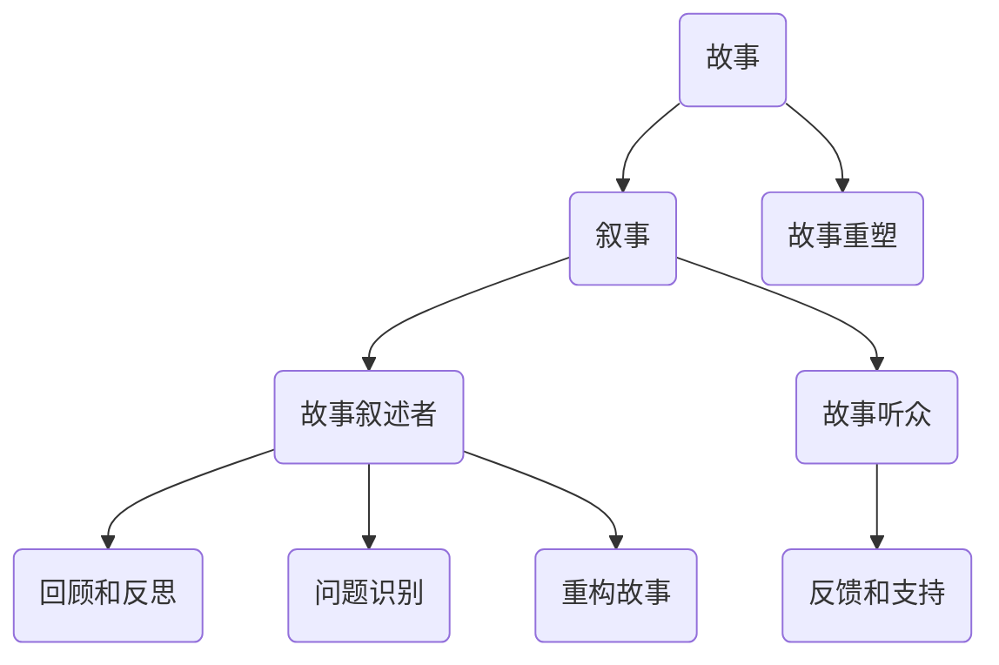

                 

### 1.1 书籍背景

《生命故事重塑工坊：通过叙事疗法重构人生的课程》是由知名心理学家迈克尔·怀特（Michael White）和戴维·艾克曼（David Epston）合著的一本专业书籍。该书系统地介绍了叙事疗法的理论基础和实践技巧，旨在帮助读者理解如何通过重塑生命故事来促进个人成长和改变。

叙事疗法作为一种新兴的心理治疗方式，起源于20世纪80年代的美国。其核心理念是，个体的身份和意义是通过故事叙述来建构的。通过引导个体回顾和重构自己的生命故事，可以改变其内在认知和行为模式，从而实现心理上的治愈和成长。

《生命故事重塑工坊》的编写初衷是为了提供一套实用的叙事疗法指南，帮助心理咨询师、心理治疗师以及广大读者了解和掌握这一治疗方法。书中不仅详细阐述了叙事疗法的理论基础，还通过丰富的案例和实用的技巧，展示了如何在实际应用中运用叙事疗法来帮助他人。

### 1.2 叙事疗法概述

叙事疗法，也称为叙事心理治疗，是一种以叙事为基础的治疗方法。其核心思想是，人的身份、价值观和行为模式都是由其生命故事所塑造的。叙事疗法通过引导个体回顾和重构自己的生命故事，帮助个体重新认识自己，找到新的意义和方向。

叙事疗法的基本原则包括：

- **叙事视角**：强调个体在生命故事中的主动性和主体性，鼓励个体通过自己的叙事来理解自己的生活经历。
- **故事性**：将个体的生活经历视为一个故事，通过讲述和重构故事来改变个体的认知和行为。
- **合作性**：治疗师与来访者之间建立一种合作性关系，共同探讨和重构生命故事。
- **真实性**：重视来访者的真实感受和体验，尊重他们的叙事权利。

叙事疗法的目标是帮助个体实现以下转变：

- **重构自我**：通过重新建构生命故事，帮助个体找到新的身份认同。
- **缓解心理困扰**：通过叙事疗法，个体可以更好地理解自己的心理困扰，并找到解决问题的方法。
- **提升生活质量**：通过重构生命故事，个体可以更好地应对生活中的挑战，提高生活质量。

### 1.3 读者受益

通过阅读《生命故事重塑工坊：通过叙事疗法重构人生的课程》，读者可以获得以下收益：

- **理解叙事疗法**：了解叙事疗法的理论基础、基本原则和应用技巧。
- **掌握实践技能**：学会如何通过叙事疗法帮助自己和他人重构生命故事。
- **提升个人成长**：通过回顾和重构自己的生命故事，找到新的意义和方向，促进个人成长。
- **应用广泛**：不仅可以应用于心理咨询和治疗，还可以应用于教育、组织管理等多个领域。

总之，《生命故事重塑工坊》不仅是一本专业的心理治疗指南，更是一本关于如何通过叙事疗法实现个人成长和改变的人生指导书籍。无论你是心理咨询师、心理治疗师，还是对心理学感兴趣的普通读者，这本书都值得你仔细阅读和深入思考。接下来，我们将进一步探讨叙事疗法的理论基础和实践技巧，帮助你更深入地了解这一独特的治疗方法。

---

### 2.1 叙事疗法的历史与发展

叙事疗法的发展历程可以追溯到20世纪80年代的美国，由心理学家迈克尔·怀特（Michael White）和戴维·艾克曼（David Epston）共同创立。他们的工作基于叙事理论，该理论认为人的身份和行为是由其所讲述的故事所塑造的。怀特和艾克曼通过对心理治疗实践的观察和研究，发现传统的治疗方法往往忽略了来访者的故事和叙事能力，因此他们提出了叙事疗法。

**发展阶段：**

1. **初期发展（1980年代）**：叙事疗法在初期主要关注于心理治疗领域，强调个体的故事和叙事在治疗过程中的重要性。怀特和艾克曼提出了“叙事治疗”的概念，并开始在实践中探索其应用。

2. **成熟期（1990年代）**：随着叙事疗法的逐渐成熟，其应用范围不断扩大。叙事疗法开始被应用于不同的领域，如家庭治疗、学校咨询、组织管理等。这一时期，叙事疗法的理论框架和实践技巧得到了进一步发展和完善。

3. **多元化发展（21世纪）**：进入21世纪，叙事疗法继续多元化发展。不仅局限于心理治疗，还扩展到社会科学、人文学科等多个领域。叙事疗法的研究和实践活动在全球范围内得到了广泛推广。

**关键人物：**

- **迈克尔·怀特（Michael White）**：作为叙事疗法的创始人之一，迈克尔·怀特在叙事疗法的理论和实践方面都做出了重要贡献。他提出了许多核心概念，如“叙事视角”、“故事性”等，为叙事疗法的发展奠定了基础。
- **戴维·艾克曼（David Epston）**：戴维·艾克曼是另一位叙事疗法的创始人。他在叙事疗法中的应用研究和实践方面有着丰富的经验，并与迈克尔·怀特一起推动了叙事疗法的普及和发展。

**影响：**

叙事疗法对心理治疗领域产生了深远的影响。它提供了一种新的视角和方法，帮助治疗师和来访者重新审视和理解生活经历。叙事疗法强调个体的主动性和主体性，鼓励来访者通过自己的叙事来建构自己的身份和意义，从而实现心理上的治愈和成长。

**与其他疗法的比较：**

叙事疗法与传统治疗方法（如认知行为疗法、精神分析疗法等）相比，具有以下特点：

- **更注重故事性**：叙事疗法认为，个体的身份和行为是由其生命故事所塑造的，因此更注重个体的叙事和故事性。
- **更具参与性**：叙事疗法鼓励来访者主动参与治疗过程，通过回顾和重构自己的生命故事来促进个人成长。
- **更灵活**：叙事疗法可以应用于各种情境和领域，具有很高的灵活性和适应性。

总之，叙事疗法作为一种新兴的心理治疗方法，以其独特的理论和实践方法，为心理治疗领域带来了新的视角和方法。它不仅帮助来访者重新认识和理解自己的生活经历，还为治疗师提供了一种有效的治疗方法。接下来，我们将进一步探讨叙事疗法的核心概念和理论框架。

### 2.2 叙事疗法的核心概念

叙事疗法作为一种以叙事为基础的治疗方法，其核心概念包括故事、叙事、故事叙述者、故事听众、故事重塑等。这些概念共同构成了叙事疗法的理论框架，为实践提供了基础。

**故事（Story）**

故事是叙事疗法的核心元素。故事不仅仅是一种叙述，更是一种意义建构的过程。在叙事疗法中，故事被看作是个人身份和社会角色的重要来源。每个故事都包含了个体在特定情境下的经历、感受和反应，因此它既是历史的记录，也是个体对生活意义的理解。

**叙事（Narrative）**

叙事是指通过语言、文字或口头讲述等方式，将故事组织成有意义的形式。叙事疗法强调叙事的过程和形式，认为叙事不仅仅是信息的传递，更是一种理解和解释世界的方式。通过叙事，个体可以表达自己的经历、情感和观点，从而实现自我认知和身份的建构。

**故事叙述者（Narrator）**

故事叙述者是故事的主导者，负责讲述自己的故事。在叙事疗法中，故事叙述者不仅是一个听众，更是一个主动的参与者。通过叙述自己的故事，故事叙述者可以反思自己的生活经历，发现自己的问题和需求，从而实现自我成长和改变。

**故事听众（Audience）**

故事听众是故事叙述者的听众，他们在叙事过程中提供反馈和支持。故事听众的角色不仅仅是听者，更是合作者。他们通过与故事叙述者的互动，帮助叙述者更好地理解和表达自己的故事，从而促进叙事疗法的实施。

**故事重塑（Narrative Reconfiguration）**

故事重塑是叙事疗法的重要步骤。通过重塑故事，个体可以改变自己对过去经历的解读和认知，从而实现心理上的治愈和成长。故事重塑的过程包括以下几个步骤：

1. **回顾和反思**：帮助故事叙述者回顾和反思自己的生活经历，找出对自己有意义的部分。
2. **问题识别**：帮助故事叙述者识别和表达自己在生活中遇到的问题和挑战。
3. **重构故事**：通过重新组织和叙述故事，帮助故事叙述者找到新的视角和理解，从而实现自我成长和改变。

**核心概念之间的关系架构**

叙事疗法的核心概念之间的关系可以通过以下Mermaid流程图来表示：

通过这个流程图，我们可以清晰地看到叙事疗法的核心概念之间的联系和互动。故事是叙事疗法的起点，通过叙事和故事重塑，故事叙述者可以实现自我认知和成长。故事听众在这个过程中提供反馈和支持，帮助故事叙述者更好地理解和表达自己的故事。

总之，叙事疗法的核心概念构成了其独特的理论框架，为实践提供了指导。通过理解这些概念之间的关系，我们可以更好地应用叙事疗法，帮助个体实现心理上的治愈和成长。接下来，我们将进一步探讨叙事疗法在实际应用中的操作方法和技巧。

### 2.3 叙事与身份的关系

叙事疗法强调叙事在个体身份建构中的核心作用，认为个体的身份是通过叙事不断建构和重塑的。叙事不仅记录了我们的过去经历，还塑造了我们的现在和未来。因此，理解叙事与身份的关系是叙事疗法理论的重要组成部分。

**身份（Identity）**

身份是指个体对自己的认同和认知，包括自我概念、角色扮演和价值观等。身份的形成是一个复杂的过程，受到个人经历、社会文化背景、家庭环境等多种因素的影响。

**叙事与身份建构**

叙事与身份建构的关系可以从以下几个方面来理解：

1. **故事叙事作为身份的镜子**：叙事疗法认为，个体的身份是通过他们讲述的故事来反映和塑造的。故事叙事提供了一个平台，使个体能够反思自己的经历，理解自己的行为和情感，从而建构和重塑自己的身份。例如，一个人可能会通过讲述自己的成功故事来增强自信和自尊，或者通过讲述自己的失败故事来认识自己的弱点。

2. **叙事作为身份的重塑工具**：叙事疗法通过引导个体重新审视和重构自己的生命故事，帮助个体改变对自己身份的认知。这种重构可以帮助个体从负面故事中解脱出来，找到新的身份认同。例如，一个经历了多次失败的人，可以通过重构自己的失败故事，将其视为学习和成长的机会，从而重建自信和积极的态度。

3. **叙事与社会身份的互动**：个体的叙事不仅影响他们的个人身份，还与社会身份相互作用。社会身份是我们在社会中的角色和地位，如职业、家庭、国籍等。叙事疗法通过帮助个体重新构建自己的社会叙事，可以改善他们在社会中的角色和地位，提高社会认同感和归属感。

**叙事重构与身份转变**

叙事重构是叙事疗法中实现身份转变的关键步骤。通过以下方式，叙事重构可以帮助个体实现身份转变：

1. **从受害者叙事到主动叙事**：传统叙事疗法常常关注个体的受害者叙事，如“我总是失败”或“我一直被忽视”。通过叙事重构，个体可以转变这种消极的叙事，将其转变为积极的、主动的叙事，如“我从失败中学到了很多”或“我在努力改变现状”。

2. **从固定叙事到成长叙事**：固定叙事是指个体对自己身份的僵化认知，如“我永远无法改变”。通过叙事重构，个体可以打破这种固定叙事，将其转变为成长的叙事，如“我可以不断学习和进步”。

3. **从个体叙事到社会叙事**：叙事疗法不仅关注个体的内在体验，还鼓励个体从社会视角来重构自己的故事。例如，一个孤独的人可以通过叙事重构，将其从孤独的个体叙事转变为社交的群体叙事，如“我在努力融入这个社区”。

**叙事重构实践**

叙事重构在实践中通常包括以下步骤：

1. **回顾和反思**：帮助个体回顾和反思自己的生活经历，找出对自己有意义的部分。

2. **识别和表达**：帮助个体识别和表达自己在生活中遇到的问题和挑战，以及这些问题如何影响他们的身份认知。

3. **重构故事**：通过重新组织和叙述故事，帮助个体找到新的视角和理解，从而实现身份的转变。

4. **反馈和支持**：在叙事重构过程中，提供反馈和支持，帮助个体更好地理解和表达自己的故事。

**结论**

叙事与身份的关系是叙事疗法理论的核心。通过理解叙事在身份建构中的重要作用，叙事疗法提供了一种有效的治疗方法，帮助个体通过重构自己的生命故事来实现身份的转变和成长。叙事疗法不仅关注个体的内在体验，还关注个体与社会的关系，从而实现更全面和深远的身份建构。

### 3.1 叙事访谈的技巧

叙事访谈是叙事疗法的重要组成部分，它通过深入探讨来访者的生命故事，帮助他们发现自己的问题并找到解决方法。以下是一些关键技巧，帮助治疗师进行有效的叙事访谈：

**倾听技巧**

倾听是叙事访谈的核心，治疗师需要全神贯注地倾听来访者的故事，而不是急于给出建议或评价。以下是一些倾听技巧：

- **无判断的倾听**：治疗师应保持开放和无判断的态度，接受来访者的一切故事，无论这些故事是否积极或消极。
- **共鸣与理解**：通过肢体语言、面部表情和口头反馈，表达对来访者故事的共鸣和理解。例如，治疗师可以说：“我理解你的感受，这一定很难。”
- **开放式问题**：使用开放式问题引导来访者深入探讨他们的故事。例如，“你能再多告诉我一些关于这个经历的事情吗？”
- **重复和总结**：重复来访者的关键点，以确认治疗师的理解是否准确。例如，“我听你说，你在高中时期遇到了很多困难，是吗？”

**提问技巧**

有效的提问可以帮助治疗师更深入地了解来访者的故事，并引导他们探索新的视角。以下是一些提问技巧：

- **探索性提问**：用于深入探讨来访者的故事，帮助他们揭示隐藏的细节。例如，“在你的故事中，有没有一些特别的时刻或事件对你有特别的意义？”
- **因果提问**：用于探讨事件之间的联系。例如，“这个经历对你现在的生活有什么影响？”
- **隐喻性提问**：通过使用隐喻来探讨复杂的问题。例如，“你的生活故事像一座山，有没有哪些山峰对你特别重要？”

**反馈技巧**

反馈是叙事访谈的重要组成部分，它可以帮助治疗师确认自己的理解是否准确，并为来访者提供支持。以下是一些反馈技巧：

- **直接反馈**：直接表达对来访者故事的看法，例如，“你的故事中，我听到了很多关于你的勇气和坚持。”
- **反思性反馈**：通过反思来访者的故事，帮助他们看到新的视角。例如，“我注意到，你在讲述这段经历时，语气有所变化，能分享一下你的感受吗？”
- **积极反馈**：强调来访者的积极方面，帮助他们建立自信。例如，“你讲述这个故事时，我感受到了你的成长和进步。”

**案例分析**

以下是一个叙事访谈的案例：

治疗师：你好，感谢你今天的到来。首先，我想请你谈谈自己的一个重要生活经历。

来访者：好的，我最近经历了一次严重的职场压力。我的工作要求很高，我感到非常疲惫，有时甚至觉得无法坚持下去。

治疗师：听起来这个经历对你影响很大。你能详细描述一下当时的情况吗？

来访者：当时，我每天工作超过12小时，几乎没有时间休息。我感到非常焦虑，担心自己无法完成任务。有一次，我在办公室里突然哭了起来，感觉非常无助。

治疗师：我能理解你的感受。在这个故事中，有没有一些特别的时刻或事件对你有特别的意义？

来访者：有一次，我的上司对我说：“你做得很好，但我希望你能做得更好。”这让我感到有些矛盾，一方面，我感到受到了认可；另一方面，我又感到更大的压力。

治疗师：这是一个很复杂的情感体验。你如何理解这个事件对你现在的生活影响？

来访者：我现在经常想起这个经历，有时我会觉得自己还不够好，需要不断努力。但另一方面，这次经历也让我意识到，我需要更好地平衡工作和生活。

治疗师：谢谢你分享这个故事。我注意到，你在讲述时，语气有所变化。你能否分享一下你的感受？

来访者：当我提到我的上司的话时，我感到有些不安。但当我继续讲述时，我意识到，这次经历也让我学会了如何处理压力和挑战。

治疗师：这听起来很有意义。通过这次访谈，你是否有了一些新的认识或感受？

来访者：是的，我意识到，我需要给自己更多的时间和空间，而不是只专注于工作。我也学会了如何更好地应对压力和挑战。

**总结**

叙事访谈是一种重要的治疗技巧，通过倾听、提问和反馈，治疗师可以帮助来访者深入探讨自己的故事，找到新的视角和理解。有效的叙事访谈不仅能帮助来访者实现心理上的治愈和成长，还能提升他们的生活质量。接下来，我们将进一步探讨叙事疗法中的故事重构步骤。

### 3.2 重构故事的步骤

在叙事疗法中，重构故事是帮助个体实现心理治愈和成长的重要步骤。通过重构故事，个体可以重新审视和理解自己的经历，找到新的身份认同和意义。重构故事的步骤包括以下几个阶段：

**1. 回顾和反思**

回顾和反思是重构故事的起点。治疗师需要引导来访者深入回顾自己的过去经历，并反思这些经历对自己的影响。以下是一些具体方法：

- **生命线法**：让来访者绘制一条生命线，标记出重要的生活事件和转折点，帮助他们回顾自己的成长历程。
- **时间线法**：通过绘制时间线，帮助来访者清晰地看到自己的生活经历，包括积极的和消极的。
- **日记记录**：鼓励来访者记录自己的日记，通过文字的形式回顾和反思自己的经历。

**2. 识别问题**

在回顾和反思的基础上，治疗师需要帮助来访者识别和表达自己在生活中遇到的问题和挑战。这一步骤的关键是：

- **探索性提问**：使用开放式问题，引导来访者深入探讨他们的问题，如“这个经历对你现在的生活有什么影响？”
- **情感映射**：帮助来访者识别和表达自己的情感，如恐惧、焦虑、愤怒等。

**3. 重构故事**

重构故事是叙事疗法的核心步骤。通过以下方法，治疗师可以帮助来访者重构自己的故事：

- **积极视角**：引导来访者从积极的角度重新审视自己的经历，如将挑战视为成长的机会。
- **叙事框架**：使用叙事框架，如“成功故事”、“成长故事”等，帮助来访者重构自己的故事。
- **故事重塑**：通过重新组织和叙述故事，帮助来访者找到新的视角和理解，如将受害者的叙事转变为主动叙事。

**4. 演练和反思**

在重构故事后，治疗师需要与来访者一起演练和反思新的故事，以确保他们能够内化和应用这些新的理解。以下是一些具体方法：

- **角色扮演**：通过角色扮演，帮助来访者体验新的故事情境，如他们如何应对新的挑战。
- **情景模拟**：设计一些模拟情景，让来访者实践新的叙事策略。
- **反思性讨论**：与来访者一起讨论新的故事，了解他们对其的感受和反应。

**5. 评估和反馈**

最后，治疗师需要与来访者一起评估重构故事的成效，并提供反馈。以下是一些具体方法：

- **自我评估**：鼓励来访者记录自己的进展，如他们如何应用新的叙事策略，以及这些策略带来的变化。
- **治疗效果评估**：使用心理测量工具，如问卷和评估表，评估来访者心理状态的改善程度。
- **反馈和调整**：根据来访者的反馈，调整重构故事的策略和方法。

**案例分析**

以下是一个重构故事的案例：

来访者：最近，我感到自己工作压力很大，常常感到焦虑和无助。

治疗师：我能理解你的感受。你能告诉我一些关于这个经历的具体情况吗？

来访者：自从去年换了工作，我就一直感到非常紧张。我的上司对工作要求很高，我常常感到自己的能力不足以胜任。

治疗师：这个经历对你现在的生活有什么影响？

来访者：我感觉自己的生活变得非常单调，我很少有时间休息，也很少有时间和家人朋友相处。

治疗师：这听起来确实很困难。你有没有想过，这个经历对你有什么积极的意义？

来访者：我想，这个经历让我意识到自己的不足，也让我学会了如何更好地应对压力。

治疗师：这是一个很好的发现。我们能否将这个故事重构一下，让你看到更多的积极面？

来访者：好的，我想说，这个经历虽然让我感到压力很大，但也让我变得更加坚强和有信心。

治疗师：很好，你能否具体描述一下你是如何变得更加坚强的？

来访者：我开始学会了如何更好地安排时间，如何将工作任务分解成小部分，这样我就不会感到那么焦虑。

治疗师：听起来你的策略很有效。你能否尝试将这些策略应用到其他方面，如家庭生活和社交活动？

来访者：我会试试看。我感觉自己现在有了更多的信心和力量。

治疗师：太好了，我期待看到你的进步。在接下来的几次治疗中，我们可以一起回顾和调整这些策略。

**总结**

重构故事是叙事疗法中一个重要的实践步骤，通过回顾、识别问题、重构故事、演练和反思，个体可以重新审视和理解自己的经历，找到新的身份认同和意义。有效的重构故事不仅可以帮助个体实现心理上的治愈和成长，还可以提升他们的生活质量。接下来，我们将探讨叙事疗法的评估与效果。

### 3.3 叙事疗法的评估与效果

叙事疗法的评估与效果是衡量其有效性的重要指标。通过科学、系统的评估方法，我们可以了解叙事疗法在实际应用中的成效，并为后续的治疗提供指导。

**评估方法**

1. **问卷与量表**：使用心理测量工具，如问卷和评估量表，来评估来访者的心理状态和治疗效果。常见的量表包括抑郁自评量表（SDS）、焦虑自评量表（SAS）等。

2. **行为观察**：通过观察来访者在治疗过程中的表现，如参与度、情感表达、行为变化等，来评估治疗效果。

3. **个案研究**：对个别来访者的治疗过程和结果进行深入分析，以了解叙事疗法在实际应用中的具体效果。

4. **实证研究**：通过随机对照试验（RCT）等科学方法，评估叙事疗法与传统心理治疗方法的疗效差异。

**效果评估**

1. **短期效果**：叙事疗法在短期内表现出良好的效果，能够显著减轻来访者的心理困扰，提高他们的生活质量。

2. **长期效果**：长期研究发现，叙事疗法具有持久的效果，能够帮助来访者实现更深入的心理成长和改变。

3. **疗效差异**：与传统的心理治疗方法相比，叙事疗法在某些情境下表现出更好的疗效，如处理复杂的情感困扰、提高自我认知等。

**案例分析**

以下是一个叙事疗法的评估案例：

**来访者背景**：李先生，35岁，因长期工作压力导致焦虑和抑郁。在开始叙事疗法之前，他经常感到疲惫和无助，情绪低落。

**评估方法**：

- **问卷调查**：使用抑郁自评量表（SDS）和焦虑自评量表（SAS）评估李先生的心理状态，得分分别为30和25。
- **行为观察**：在治疗过程中，李先生表现出较高的参与度，能够积极分享自己的经历和感受。
- **个案研究**：治疗师对李先生的治疗过程进行记录和分析，以了解叙事疗法的具体效果。

**治疗过程**：

- **回顾和反思**：治疗师引导李先生回顾自己的工作经历，识别和表达自己的问题和挑战。
- **重构故事**：通过重构故事，帮助李先生从受害者叙事转变为主动叙事，找到新的身份认同。
- **演练和反思**：与李先生一起演练新的叙事策略，并进行反思性讨论。

**效果评估**：

- **短期效果**：在治疗结束后，李先生的焦虑和抑郁症状显著减轻，情绪稳定。
- **长期效果**：经过六个月的治疗，李先生的情绪状态保持稳定，能够更好地应对工作压力。
- **疗效差异**：与传统的心理治疗方法相比，叙事疗法在处理李先生的情感困扰方面表现出更好的效果。

**总结**

叙事疗法的评估与效果研究显示，该方法在实际应用中具有显著的效果。通过科学的评估方法，我们可以了解叙事疗法在缓解心理困扰、促进个人成长方面的具体成效，为后续的治疗提供有力的支持。接下来，我们将探讨叙事疗法在实际应用中的案例。

### 4.1 个人生活故事的重塑

个人生活故事的重塑是叙事疗法的重要应用之一，通过重新审视和重构个人的生命故事，个体可以找到新的身份认同和意义，从而实现心理上的治愈和成长。以下是一些成功的个人生活故事重塑案例：

**案例一：从受害者到主动者**

张女士，45岁，因长期婚姻不和谐和职场压力导致情绪低落和自我价值感下降。在接受叙事疗法之前，她常常将自己视为婚姻和职场的受害者，感到无助和迷茫。

治疗过程：

- **回顾和反思**：治疗师引导张女士回顾她的婚姻和职场经历，识别和表达自己的问题和挑战。
- **重构故事**：通过重构故事，帮助张女士从受害者叙事转变为主动叙事，找到自己的力量和资源。
- **演练和反思**：与张女士一起演练新的叙事策略，并进行反思性讨论。

效果评估：

- **短期效果**：在治疗结束后，张女士的情绪状态显著改善，自我价值感有所提升。
- **长期效果**：经过六个月的治疗，张女士能够更好地应对婚姻和职场中的挑战，找到了新的生活目标和意义。

**案例二：从失败者到成功者**

李先生，30岁，因多次创业失败导致自我怀疑和焦虑。在接受叙事疗法之前，他常常将自己视为失败者，对未来感到迷茫和恐惧。

治疗过程：

- **回顾和反思**：治疗师引导李先生回顾他的创业经历，识别和表达自己的问题和挑战。
- **重构故事**：通过重构故事，帮助李先生从失败者叙事转变为成功者叙事，找到他的成功经验和资源。
- **演练和反思**：与李先生一起演练新的叙事策略，并进行反思性讨论。

效果评估：

- **短期效果**：在治疗结束后，李先生的情绪状态显著改善，自信心有所提升。
- **长期效果**：经过一年的治疗，李先生再次创业，并取得了显著的成功，实现了自我价值的提升。

**案例三：从孤独者到社交者**

王女士，40岁，因长期孤独和社交困难导致情绪低落和自我价值感下降。在接受叙事疗法之前，她常常将自己视为孤独者，对未来感到迷茫和恐惧。

治疗过程：

- **回顾和反思**：治疗师引导王女士回顾她的社交经历，识别和表达自己的问题和挑战。
- **重构故事**：通过重构故事，帮助王女士从孤独者叙事转变为社交者叙事，找到她的社交经验和资源。
- **演练和反思**：与王女士一起演练新的叙事策略，并进行反思性讨论。

效果评估：

- **短期效果**：在治疗结束后，王女士的情绪状态显著改善，社交能力有所提升。
- **长期效果**：经过两年的治疗，王女士能够积极地参加社交活动，建立了新的社交圈，生活质量显著提升。

**总结**

个人生活故事的重塑是叙事疗法中一个重要的实践步骤，通过重新审视和重构个人的生命故事，个体可以找到新的身份认同和意义，实现心理上的治愈和成长。成功的个人生活故事重塑案例表明，叙事疗法在处理复杂的情感困扰、提升自我认知和社交能力方面具有显著的效果。接下来，我们将探讨叙事疗法在家庭关系中的应用。

### 4.2 家庭关系中的叙事疗法

在家庭关系中，叙事疗法提供了一种独特且有效的方法，帮助家庭成员重新审视和重构他们的故事，从而改善家庭沟通、解决冲突和增强家庭凝聚力。以下是一些具体的实践方法和案例：

**1. 帮助家庭成员共同重构家庭故事**

家庭故事是家庭成员共同创造的，但往往被单方面的叙事所主导，导致其他成员的感受和经历被忽视。叙事疗法通过以下方法帮助家庭成员共同重构家庭故事：

- **家庭叙事地图**：治疗师引导家庭成员绘制家庭叙事地图，标记出重要的家庭事件和成员的角色。这种方法可以帮助家庭成员看到整个家庭的历史和共同经历，从而增进理解和共鸣。
- **轮流讲述**：在治疗过程中，每个家庭成员都有机会轮流讲述自己的家庭故事，并接受其他家庭成员的反馈。这有助于打破单方面叙事的格局，让每个成员的声音都能被听到和尊重。

**案例**：一个家庭中，父母总是抱怨孩子不听话，而孩子则感到不被理解和尊重。通过叙事疗法，治疗师引导家庭成员共同回顾和重构家庭故事，发现孩子其实也有自己的担忧和期望。通过这种方式，家庭成员能够更好地理解彼此，找到解决问题的方法。

**2. 处理家庭冲突**

家庭冲突是常见的家庭问题，但通过叙事疗法，家庭成员可以找到新的视角来理解冲突，从而减少冲突的频率和强度：

- **故事重塑**：治疗师帮助家庭成员重新叙述冲突事件，从不同的角度来理解冲突的原因和后果。通过故事重塑，家庭成员可以识别和释放对冲突的固有信念和情感。
- **共同目标设定**：在叙事疗法的帮助下，家庭成员可以共同设定家庭目标，并探讨如何通过合作和沟通来实现这些目标。这种方法有助于建立家庭成员之间的共同愿景和信任。

**案例**：一个家庭因为家务分工不均而产生冲突。通过叙事疗法，家庭成员一起重构了家务分工的故事，找到了新的分工方式，从而缓解了冲突。

**3. 增强家庭凝聚力**

叙事疗法不仅帮助家庭成员解决具体问题，还通过重构家庭故事来增强家庭凝聚力：

- **家庭庆祝活动**：治疗师鼓励家庭成员共同参与庆祝活动，如家庭聚会、节日庆祝等。这些活动有助于家庭成员共同创造新的故事，增强家庭的归属感和凝聚力。
- **家庭叙事会议**：定期举行家庭叙事会议，让每个家庭成员都有机会分享自己的故事和感受。这种方法不仅促进了家庭成员之间的沟通，还增强了家庭内部的团结和协作。

**案例**：一个家庭通过定期举行家庭叙事会议，建立了更好的沟通渠道，成员之间的关系变得更加和谐，家庭凝聚力显著增强。

**总结**

叙事疗法在家庭关系中的应用，通过帮助家庭成员共同重构家庭故事、处理家庭冲突和增强家庭凝聚力，提供了一种有效且全面的家庭治疗方法。成功的家庭叙事疗法案例表明，这种方法不仅能够解决具体问题，还能促进家庭成员之间的理解和合作，从而提升家庭整体幸福感。接下来，我们将探讨叙事疗法在组织与社区中的实践。

### 4.3 组织与社区中的叙事实践

叙事疗法不仅适用于个体和家庭，还在组织与社区层面展现出其独特的优势。通过叙事实践，组织与社区可以更好地理解成员的需求，提升团队合作，增强组织凝聚力，并实现可持续的社会发展。

**1. 组织层面的叙事实践**

在组织管理中，叙事疗法可以帮助领导者与员工建立更深层次的连接，增强团队的协作和创新能力：

- **组织叙事地图**：通过绘制组织叙事地图，领导者可以回顾和反思组织的成长历程，识别关键事件和转折点。这种方法有助于员工理解组织的价值观和文化，增强归属感。
- **团队故事会**：定期举行团队故事会，让团队成员分享个人故事和工作经历。这种活动不仅促进了团队成员之间的沟通和理解，还激发了创新思维和团队合作精神。

**案例**：一家科技公司通过定期举行团队故事会，成功解决了团队内部沟通不畅的问题。团队成员在分享故事的过程中，发现彼此之间的共同点和差异，从而建立了更强的团队凝聚力和信任。

**2. 社区层面的叙事实践**

在社区建设中，叙事疗法可以促进社区成员之间的相互理解和合作，增强社区的凝聚力：

- **社区故事墙**：建立社区故事墙，鼓励居民分享自己的故事和生活经历。这种方法不仅增强了社区成员之间的联系，还丰富了社区的公共文化。
- **社区叙事会议**：定期举行社区叙事会议，让居民有机会讨论和分享社区发展中的问题和挑战。通过叙事实践，居民可以共同找到解决问题的方法，推动社区的发展。

**案例**：一个城市社区通过建立社区故事墙和举行社区叙事会议，成功解决了社区内存在的邻里矛盾和环境问题。居民在分享故事和讨论问题的过程中，建立了深厚的邻里关系，社区环境得到了显著改善。

**3. 可持续发展的叙事实践**

叙事疗法在促进可持续发展方面也发挥着重要作用。通过叙事实践，个人、组织和社区可以重新审视其行为和价值观，推动社会向更可持续的方向发展：

- **环境叙事**：通过讲述环境保护的故事，增强人们对环境保护的意识。例如，通过讲述社区成员如何共同努力改善当地环境的故事，激发更多人参与环保行动。
- **可持续发展叙事**：通过叙事实践，分享可持续发展的成功案例，鼓励更多人采取可持续的生活方式。例如，讲述一个家庭如何通过节能减排实现绿色生活的故事，可以激励更多人采取环保措施。

**案例**：一个社区通过组织环保故事会，分享了多个家庭和组织的环保经验。这些故事激发了居民对环境保护的兴趣，社区内出现了更多的环保行动，如垃圾分类、节能改造等，推动了社区的可持续发展。

**总结**

叙事疗法在组织与社区中的应用，通过帮助成员重新审视和重构他们的故事，提供了有效的沟通和协作工具。成功的叙事实践案例表明，这种方法不仅能够解决具体问题，还能增强组织与社区的凝聚力，推动社会的可持续发展。通过叙事实践，个人、组织和社区可以共同创造一个更加和谐、包容和可持续的社会环境。

### 5.1 儿童与青少年叙事疗法

儿童与青少年叙事疗法是一种专门针对儿童和青少年心理发展的治疗方法。它通过引导儿童和青少年回顾和重构自己的故事，帮助他们理解自己的情感和行为，从而实现心理上的治愈和成长。以下是一些具体的实践方法和案例：

**1. 儿童与青少年叙事疗法的特点**

- **游戏化叙事**：儿童和青少年的语言表达和认知能力相对有限，因此叙事疗法常常采用游戏化的方式，通过角色扮演、故事书、绘画等手段，帮助他们表达自己的情感和经历。
- **无判断的接纳**：治疗师在儿童和青少年叙事疗法中扮演着倾听者和引导者的角色，他们需要以无判断的接纳态度对待儿童和青少年的叙事，鼓励他们自由表达。
- **情感教育**：儿童和青少年叙事疗法不仅关注心理问题，还注重情感教育。通过叙事，治疗师帮助儿童和青少年认识和理解自己的情感，学会表达和调节情绪。

**2. 实践方法**

- **故事创作**：治疗师和儿童或青少年一起创作故事，通过故事来探讨他们的情感、行为和经历。这种方法不仅有助于儿童和青少年表达自己，还能促进他们的情感发展。
- **角色扮演**：通过角色扮演，儿童和青少年可以模拟不同情境，体验不同的情感和行为。这种方法有助于他们理解自己的行为对他人的影响，提高社会认知能力。
- **绘画叙事**：绘画是一种非语言的表达方式，儿童和青少年可以通过绘画来传达自己的情感和经历。治疗师可以引导他们通过绘画来表达自己的故事。

**3. 案例分析**

**案例一：从孤独到社交**

小华，10岁，因为长期在学校受到同学的排挤，感到非常孤独和沮丧。在接受叙事疗法之前，他很少主动与同学交流，情绪低落。

治疗过程：

- **回顾和反思**：治疗师引导小华回顾他在学校的生活经历，识别和表达自己的感受。
- **故事创作**：治疗师和小华一起创作了一个关于友谊的故事，通过故事来探讨友谊的重要性和如何建立友谊。
- **角色扮演**：治疗师和小华一起进行了角色扮演游戏，模拟不同的社交情境，帮助小华学会如何与他人交流。

效果评估：

- **短期效果**：在治疗结束后，小华的情绪状态显著改善，他开始主动与同学交流，建立了新的友谊。
- **长期效果**：经过一年的治疗，小华的社交能力得到了显著提升，他能够更好地处理人际关系中的问题。

**案例二：从恐惧到自信**

小明，15岁，因害怕考试和面对失败，导致学习成绩下降，自尊心受损。在接受叙事疗法之前，他经常逃避考试，对未来感到迷茫和恐惧。

治疗过程：

- **回顾和反思**：治疗师引导小明回顾他过去的考试经历，识别和表达自己的恐惧和焦虑。
- **故事重塑**：通过重塑故事，帮助小明将失败的叙事转变为成功的叙事，找到自己的优势和资源。
- **情感教育**：治疗师通过情感教育，帮助小明理解恐惧和焦虑的本质，学会如何面对和克服这些情绪。

效果评估：

- **短期效果**：在治疗结束后，小明的情绪状态显著改善，他开始重新面对考试，并取得了进步。
- **长期效果**：经过两年的治疗，小明的学习能力和自信心得到了显著提升，他能够更加积极地面对生活中的挑战。

**总结**

儿童与青少年叙事疗法通过引导儿童和青少年回顾和重构自己的故事，帮助他们理解自己的情感和行为，从而实现心理上的治愈和成长。成功的案例表明，这种方法在处理儿童和青少年的心理问题方面具有显著的效果。通过叙事疗法，儿童和青少年可以学会更好地表达自己，处理情绪，建立积极的人际关系，从而促进他们的全面发展。

### 5.2 心理创伤叙事疗法

心理创伤叙事疗法是一种专门针对心理创伤的治疗方法，通过引导个体回顾和重构与创伤相关的叙事，帮助个体处理和缓解创伤体验。以下是一些具体的实践方法和案例：

**1. 心理创伤叙事疗法的特点**

- **创伤叙事的重构**：心理创伤叙事疗法强调通过重构与创伤相关的叙事，帮助个体从创伤中解脱出来。这种方法不同于传统的心理治疗，它不仅仅是解决问题，而是帮助个体重新构建对创伤的理解和认知。
- **情感表达与宣泄**：心理创伤叙事疗法鼓励个体表达和宣泄与创伤相关的情感，如愤怒、恐惧、悲伤等。通过情感表达，个体可以释放内在的创伤能量，减少心理负担。
- **身份的重塑**：心理创伤叙事疗法帮助个体重新审视和重塑自己的身份认同，从而找到新的意义和方向。通过重构叙事，个体可以重新发现自我，建立积极的自我形象。

**2. 实践方法**

- **创伤叙事回顾**：治疗师引导个体回顾与创伤相关的经历，识别和表达自己的感受。这种方法有助于个体深入了解创伤的原因和影响。
- **情感表达与宣泄**：治疗师提供一个安全的空间，鼓励个体表达和宣泄与创伤相关的情感。通过绘画、写作、音乐等艺术形式，个体可以释放内在的情感压力。
- **叙事重构**：治疗师帮助个体通过重构创伤叙事，将消极的、受创伤影响的叙事转变为积极的、有意义的叙事。这种方法有助于个体重新发现自我，找到新的身份认同。
- **认知重塑**：治疗师通过认知重塑，帮助个体改变对创伤的负面认知，建立积极的生活态度。

**3. 案例分析**

**案例一：战争创伤**

李先生，35岁，曾参加过战争，遭受了严重的心理创伤。在接受心理创伤叙事疗法之前，他经常失眠、焦虑，对周围的人和事充满警惕。

治疗过程：

- **回顾和反思**：治疗师引导李先生回顾他在战争中的经历，识别和表达自己的感受。
- **情感表达与宣泄**：治疗师提供了一个安全的空间，鼓励李先生表达和宣泄与创伤相关的情感，如愤怒、恐惧和悲伤。
- **叙事重构**：通过叙事重构，帮助李先生将战争的创伤叙事转变为和平与成长的叙事，找到新的身份认同。
- **认知重塑**：治疗师帮助李先生改变对战争的负面认知，学会以更积极的方式看待过去和未来。

效果评估：

- **短期效果**：在治疗结束后，李先生的心理状态显著改善，焦虑和失眠症状减轻。
- **长期效果**：经过两年的治疗，李先生能够更好地应对生活中的挑战，建立了积极的生活态度。

**案例二：性侵创伤**

小芳，18岁，因遭遇性侵导致严重的心理创伤。在接受心理创伤叙事疗法之前，她经常感到恐惧和孤独，对人际关系充满戒备。

治疗过程：

- **回顾和反思**：治疗师引导小芳回顾性侵经历，识别和表达自己的感受。
- **情感表达与宣泄**：治疗师提供了一个安全的空间，鼓励小芳表达和宣泄与创伤相关的情感。
- **叙事重构**：通过叙事重构，帮助小芳将性侵的创伤叙事转变为自我保护与成长的叙事。
- **认知重塑**：治疗师帮助小芳改变对性侵的负面认知，学会以更积极的方式看待自己的经历。

效果评估：

- **短期效果**：在治疗结束后，小芳的心理状态显著改善，恐惧和孤独感减轻。
- **长期效果**：经过一年的治疗，小芳能够更好地处理人际关系中的问题，对未来的生活充满信心。

**总结**

心理创伤叙事疗法通过回顾和重构与创伤相关的叙事，帮助个体处理和缓解创伤体验。成功的案例表明，这种方法在处理战争创伤、性侵创伤等心理创伤方面具有显著的效果。通过叙事疗法，个体可以重新发现自我，建立积极的自我形象，从而实现心理上的治愈和成长。

### 5.3 企业组织中的叙事咨询

在企业管理与人力资源管理中，叙事咨询提供了一种创新的思维方式和方法，通过重塑员工和组织的故事，提升组织的整体效能和员工的幸福感。以下是一些具体的应用方法和案例：

**1. 叙事咨询在企业组织中的特点**

- **员工故事的重要性**：叙事咨询强调员工的故事对于组织文化、员工态度和绩效的影响。通过了解和尊重员工的故事，组织可以更好地理解员工的需求和期望，从而提升员工的满意度和忠诚度。
- **组织叙事的重构**：叙事咨询通过帮助组织重构其叙事，从内部和外部视角重新审视组织的使命、愿景和价值观，从而提升组织的凝聚力和创新能力。
- **领导力的提升**：叙事咨询帮助领导者和员工通过故事分享建立信任和共鸣，提升领导力和团队协作能力。

**2. 实践方法**

- **组织故事会**：定期举行组织故事会，鼓励员工分享自己的故事和经历。这种方法不仅促进了员工之间的沟通和理解，还增强了组织的凝聚力。
- **领导叙事重塑**：通过领导叙事重塑，帮助领导者重新审视和重构自己的故事，提升领导力。例如，领导者可以分享自己的成功故事和失败教训，从而激发员工的积极性和创造力。
- **员工发展叙事**：通过员工发展叙事，帮助员工理解和表达自己的职业发展故事，找到个人目标和组织目标之间的平衡。这种方法有助于提升员工的职业满意度和忠诚度。

**3. 案例分析**

**案例一：企业文化重塑**

某大型企业因为内部沟通不畅和员工士气低落，导致工作效率低下和员工流失率上升。通过叙事咨询，企业进行了以下实践：

- **组织故事会**：定期举行组织故事会，鼓励员工分享自己的故事和经历。这种活动不仅增强了员工之间的沟通，还促进了员工的参与感和归属感。
- **领导叙事重塑**：公司高层领导通过故事分享会，分享自己的领导经历和教训，建立了与员工的信任和共鸣。
- **员工发展叙事**：通过员工发展叙事，帮助员工理解自己的职业发展故事，找到个人目标和组织目标之间的平衡。

效果评估：

- **短期效果**：在叙事咨询实施后，员工士气明显提升，工作效率提高，员工流失率下降。
- **长期效果**：通过持续的故事分享和叙事重塑，企业的组织文化和员工满意度得到了显著改善，员工对企业的忠诚度也大幅提升。

**案例二：团队协作提升**

某团队合作项目因为成员之间的沟通不畅和协作问题，导致项目进度延误。通过叙事咨询，团队进行了以下实践：

- **团队故事会**：团队成员定期举行故事会，分享自己在项目中的经历和感受。这种方法帮助团队成员更好地理解彼此，建立了信任和合作关系。
- **团队叙事重塑**：通过团队叙事重塑，团队成员共同探讨如何改进项目管理和协作流程，找到了提升团队协作效率的方法。

效果评估：

- **短期效果**：在叙事咨询实施后，团队沟通和协作显著改善，项目进度恢复正常。
- **长期效果**：通过持续的故事分享和叙事重塑，团队的协作效率和项目质量得到了显著提升，成员之间的信任和合作关系也得到巩固。

**总结**

叙事咨询在企业组织中的应用，通过重塑员工和组织的故事，提供了一种有效的管理方法。成功的案例表明，这种方法在提升组织效能、增强员工满意度和忠诚度方面具有显著的效果。通过叙事咨询，企业可以建立更健康、更和谐的组织文化，从而实现可持续的发展。

### 6.1 挑战与困境

在叙事疗法实践中，治疗师和来访者可能会遇到一系列挑战和困境。以下是一些常见的问题以及相应的解决策略：

**1. 故事叙述的难度**

- **问题**：有些来访者由于年龄、文化背景、心理状态等原因，难以清晰地叙述自己的故事。
- **解决策略**：治疗师可以通过绘画、音乐、角色扮演等非语言表达方式，帮助来访者表达自己的情感和经历。此外，可以采用叙事地图等工具，引导来访者逐步回顾和叙述自己的故事。

**2. 情绪反应**

- **问题**：在叙事过程中，来访者可能会因为回忆起创伤经历或负面情绪而出现情绪失控的情况。
- **解决策略**：治疗师需要保持冷静和耐心，提供一个安全的空间，让来访者表达和宣泄情绪。同时，可以采用情感调节技巧，如深呼吸、放松训练等，帮助来访者管理情绪。

**3. 故事重塑的挑战**

- **问题**：重构故事是一个复杂的过程，来访者可能难以从消极的故事中找到积极的视角。
- **解决策略**：治疗师可以通过积极提问、隐喻性叙事等技巧，帮助来访者发现新的叙事角度。此外，可以借助榜样故事、成功故事等，为来访者提供积极的故事重塑案例。

**4. 时间和资源的限制**

- **问题**：叙事疗法可能需要较长时间和大量资源，这对治疗师和来访者都是一种挑战。
- **解决策略**：治疗师可以与来访者共同制定合理的治疗计划，确保叙事疗法的实施既有成效又不会过度消耗时间和资源。此外，可以利用在线咨询、小组治疗等方式，提高治疗效率。

**5. 专业技能的要求**

- **问题**：叙事疗法对治疗师的专业技能要求较高，包括倾听技巧、提问技巧、情感调节能力等。
- **解决策略**：治疗师可以通过参加专业培训、工作坊、阅读相关书籍和文献等方式，提升自己的专业技能。此外，可以寻求同行反馈和督导，不断提高治疗水平。

### 6.2 增强叙事疗法的有效性

为了提高叙事疗法的有效性，治疗师可以采取以下策略：

**1. 增强治疗师的技能**

- **专业培训**：参加专业培训和研讨会，提升叙事疗法的理论知识与实践技能。
- **持续学习**：阅读最新的研究文献，了解叙事疗法的最新发展和趋势。
- **同行反馈**：定期与同行交流，获取反馈和建议，不断改进治疗方法。

**2. 创新治疗方法**

- **多模式治疗**：结合其他治疗方法，如认知行为疗法、心理动力学等，为来访者提供更全面的治疗。
- **跨文化适应**：根据来访者的文化背景和需求，调整叙事疗法的实施方法和内容，提高治疗的适应性和有效性。

**3. 强化治疗关系**

- **建立信任**：通过倾听、共鸣和反馈，建立与来访者的信任关系，为治疗创造良好的基础。
- **情感支持**：在治疗过程中，提供情感支持和鼓励，帮助来访者克服困难，增强治疗的信心。

**4. 提高治疗效率**

- **结构化治疗计划**：制定明确的治疗计划，确保每次治疗都有具体的目标和任务，提高治疗效率。
- **时间管理**：合理安排治疗时间，确保治疗过程有序进行，避免拖延和无效的时间消耗。

**5. 持续跟踪评估**

- **定期评估**：在治疗过程中定期评估来访者的进展，根据评估结果调整治疗策略。
- **效果反馈**：与来访者进行效果反馈，了解治疗效果和改进方向。

通过以上策略，治疗师可以增强叙事疗法的有效性，帮助来访者实现更深入的治愈和成长。

### 6.3 持续学习的必要性

在叙事疗法领域，持续学习是治疗师保持专业水平和创新能力的关键。以下是一些关于持续学习的最佳实践：

**1. 专业培训与认证**

- **定期参加研讨会和工作坊**：参加专业的研讨会和工作坊，了解最新的叙事疗法理论和实践技巧。
- **获得专业认证**：通过获得国际或国内叙事疗法认证，提升专业认可度和信誉。

**2. 阅读与研究**

- **阅读经典与最新研究**：定期阅读经典叙事疗法书籍和最新研究论文，掌握领域内的最新动态和发展趋势。
- **参与学术交流**：加入专业学术组织，参与学术会议和期刊发表，促进学术交流和知识更新。

**3. 实践反思**

- **案例复盘**：在每次治疗结束后，进行案例复盘和反思，总结经验和教训，不断改进治疗方法。
- **同行督导**：寻求同行督导和反馈，通过不同的视角审视自己的治疗实践，发现潜在的问题和改进空间。

**4. 跨学科学习**

- **结合其他治疗方法**：将叙事疗法与其他心理治疗方法（如认知行为疗法、精神分析疗法等）相结合，提高治疗的全面性和效果。
- **跨学科知识整合**：学习相关领域的知识，如社会学、人文学科等，丰富叙事疗法的理论和实践基础。

**5. 技术应用**

- **利用数字工具**：掌握和应用数字工具，如在线咨询平台、心理评估软件等，提高叙事疗法的可及性和效率。
- **技术整合**：将叙事疗法与新兴技术（如虚拟现实、人工智能等）结合，探索新的治疗方法和应用场景。

**总结**

持续学习是叙事疗法治疗师保持专业水平和创新能力的关键。通过定期参加培训、阅读研究、实践反思、跨学科学习和技术应用，治疗师可以不断提高自己的专业素养，为来访者提供更有效和全面的治疗服务。

### 7.1 叙事疗法与其他治疗方法的融合

叙事疗法作为一种新兴的心理治疗方法，其独特性在于通过叙事重构帮助个体实现心理治愈和成长。然而，叙事疗法并非孤立存在，而是可以与其他治疗方法相结合，以提供更全面、个性化的治疗方案。以下是一些叙事疗法与其他治疗方法的融合实例：

**1. 与认知行为疗法的融合**

认知行为疗法（CBT）强调认知和行为对情绪和心理状态的影响。与叙事疗法结合，可以更深入地帮助个体理解其行为背后的叙事结构，从而改变消极的认知和行为模式。具体融合方式包括：

- **认知重塑与叙事重构**：在叙事重构的基础上，引导个体识别和改变其消极认知，通过叙事疗法中的故事重塑，建立积极的认知框架。
- **行为演练与叙事演练**：通过叙事疗法中的角色扮演和情景模拟，结合认知行为疗法中的行为演练，帮助个体在现实环境中实践新的行为模式。

**案例**：一个因社交焦虑而困扰的来访者，在接受叙事疗法的同时，通过认知行为疗法的指导，学会了如何在社交场合中应用积极叙事，从而减少焦虑和不安。

**2. 与心理动力学疗法的融合**

心理动力学疗法关注潜意识心理过程和早期生活经历对个体心理状态的影响。与叙事疗法结合，可以更全面地探索个体的内心世界和生命故事，实现更深层次的心理治愈。具体融合方式包括：

- **叙事性与心理动力学分析**：在叙事疗法的框架下，治疗师结合心理动力学的分析方法，帮助来访者探索早期生活经历对其当前生活的影响，并重构这些经历。
- **情感探索与叙事表达**：通过叙事疗法中的情感表达和故事叙述，结合心理动力学中的情感探索，帮助来访者理解其情感背后的深层原因。

**案例**：一个长期受创伤后应激障碍（PTSD）困扰的来访者，在接受叙事疗法和心理动力学疗法的结合治疗中，通过回顾和重构创伤经历，逐渐缓解了症状。

**3. 与家庭治疗的融合**

家庭治疗关注家庭成员之间的互动关系和系统功能。与叙事疗法结合，可以更有效地解决家庭内部的冲突和关系问题，提升家庭凝聚力。具体融合方式包括：

- **家庭叙事重构**：在家庭治疗中，通过叙事疗法中的家庭叙事重构，帮助家庭成员共同回顾和重构家庭故事，解决家庭内部的矛盾和冲突。
- **系统叙事与个体叙事**：在家庭治疗中，结合个体叙事和系统叙事，帮助家庭成员理解彼此的角色和关系，实现家庭内部的和谐。

**案例**：一个因家庭纷争而陷入困境的家庭，通过叙事疗法和家庭治疗的结合，找到了新的沟通方式和家庭叙事，家庭关系得到了显著改善。

**4. 与社会工作服务的融合**

社会工作服务关注社会环境和人际关系对个体的影响。与叙事疗法结合，可以更有效地解决个体在社会环境中遇到的问题，提升其社会功能。具体融合方式包括：

- **叙事性与社会支持**：在叙事疗法的框架下，社会工作服务提供社会支持和资源，帮助个体解决实际问题和改善生活条件。
- **社区叙事与个体叙事**：在社区叙事疗法的实践中，通过个体的叙事与社会层面的叙事相结合，提升个体对社区的认同感和归属感。

**案例**：一个因贫困和家庭问题而失学的青少年，在接受叙事疗法和社会工作服务的结合中，通过重构自己的生命故事，获得了社区的支持和帮助，重新回到了学校。

**总结**

叙事疗法与其他治疗方法的融合，不仅丰富了叙事疗法的实践方法和应用场景，也为治疗师提供了更多的治疗选择。通过合理融合不同治疗方法的优势，可以更有效地帮助个体实现心理治愈和成长，提升生活质量。

### 7.2 数字叙事疗法的发展

随着科技的进步，数字叙事疗法作为一种新兴的治疗模式，正在逐步发展和完善。数字叙事疗法利用数字工具和技术，为个体提供更便捷、个性化的心理治疗服务。以下是一些关于数字叙事疗法的发展趋势：

**1. 在线叙事治疗平台**

在线叙事治疗平台通过互联网连接治疗师和来访者，提供了灵活、便捷的治疗环境。这些平台通常包括视频通话、即时消息、文件共享等功能，使得来访者可以在任何时间和地点接受治疗。

- **发展现状**：许多专业在线治疗平台，如Talkspace、BetterHelp等，已经实现了叙事疗法的在线应用。这些平台不仅提供了丰富的治疗资源，还通过算法匹配治疗师和来访者，提高治疗的效果和满意度。
- **未来趋势**：随着5G技术的普及和虚拟现实（VR）技术的发展，在线叙事治疗平台将提供更高质量的互动体验和个性化的治疗服务。

**2. 人工智能在叙事疗法中的应用**

人工智能（AI）在叙事疗法中的应用，为个性化治疗和实时反馈提供了新的可能。AI可以通过自然语言处理（NLP）技术，分析来访者的叙事内容，提供针对性的建议和干预。

- **发展现状**：一些公司和研究机构已经开始开发AI辅助的叙事疗法工具，如AI驱动的聊天机器人，能够实时与来访者进行对话，提供情感支持和建议。
- **未来趋势**：随着AI技术的不断进步，未来有望开发出更加智能的叙事疗法工具，能够更精准地识别和解决来访者的心理问题。

**3. 数字叙事疗法工具**

数字叙事疗法工具包括应用程序、游戏和虚拟现实（VR）技术等，为个体提供多样化的叙事表达和干预方式。

- **发展现状**：市场上已经出现了一些数字叙事疗法工具，如叙事绘画应用程序、虚拟现实叙事游戏等，这些工具通过互动和创造性活动，帮助个体表达和重构自己的故事。
- **未来趋势**：随着技术的进步，数字叙事疗法工具将更加丰富和多样化，能够满足不同个体的需求和偏好，提高治疗的参与度和效果。

**4. 混合叙事疗法模式**

混合叙事疗法模式结合了线上和线下治疗的优点，为个体提供更灵活、个性化的治疗服务。治疗师可以通过线上平台进行初步评估和干预，然后根据需要安排线下会面，进行深度治疗和反馈。

- **发展现状**：一些医疗机构已经开始采用混合叙事疗法模式，为来访者提供更全面、连续的治疗服务。
- **未来趋势**：随着数字叙事疗法的普及，混合叙事疗法模式将成为一种主流的治疗模式，为个体提供更加灵活和个性化的治疗选择。

**总结**

数字叙事疗法的发展，为心理治疗领域带来了新的机遇和挑战。通过在线治疗平台、人工智能、数字叙事疗法工具和混合叙事疗法模式，个体可以更便捷、高效地接受叙事疗法。未来，随着技术的不断进步，数字叙事疗法将继续发展和完善，为心理治疗领域带来更多的创新和突破。

### 7.3 叙事疗法在全球化背景下的应用

随着全球化的推进，叙事疗法作为一种心理治疗方法，在全球范围内得到了广泛应用。不同文化背景和社会环境下的应用，展现了叙事疗法独特的灵活性和适应性。以下是一些关于叙事疗法在全球化背景下应用的讨论：

**1. 跨文化适应**

叙事疗法在全球化背景下的一个重要挑战是如何适应不同的文化环境。不同文化背景下的人们有着不同的价值观、信仰和行为方式，这需要叙事疗法在实施过程中进行适当的调整。

- **文化敏感性**：治疗师需要具备文化敏感性，尊重和接纳来访者的文化背景。例如，在亚洲文化背景下，人们可能更倾向于保持内敛和克制，治疗师需要采用更加温和和间接的叙事技巧。
- **跨文化培训**：为了提高治疗师在跨文化背景下的应用能力，需要进行专门的跨文化培训。培训内容包括文化心理学、跨文化沟通技巧和跨文化叙事治疗等。

**2. 全球化挑战**

全球化带来的挑战，如文化冲突、社会压力、经济不稳定等，对个体的心理健康产生了深远影响。叙事疗法可以作为一种有效的应对工具，帮助个体在全球化背景下实现心理上的适应和平衡。

- **文化冲突**：全球化带来了不同文化之间的碰撞和融合。叙事疗法通过帮助个体理解自己的文化背景和价值观，以及如何在不同文化之间找到平衡，从而缓解文化冲突带来的压力。
- **社会压力**：全球化背景下，个体面临的社会压力不断增加。叙事疗法通过重构个人的生活故事，帮助个体找到新的身份认同和意义，从而增强心理韧性，应对社会压力。

**3. 全球化机遇**

全球化不仅带来了挑战，也提供了新的机遇。叙事疗法在全球范围内的应用，可以促进不同文化之间的理解和交流，推动心理健康的全球共享。

- **国际交流**：通过国际交流和合作，叙事疗法可以在全球范围内传播和推广，提高全球心理健康服务的水平。
- **文化融合**：全球化促进了不同文化的融合，叙事疗法可以通过跨文化交流，帮助人们更好地理解和接纳不同的文化，从而实现文化融合。

**4. 案例分析**

**案例一：跨文化家庭治疗**

李女士，来自中国，在美国生活和工作。由于文化差异和语言障碍，她在家庭中感到孤独和困惑。通过叙事疗法，治疗师帮助李女士重构她的家庭故事，同时尊重和接纳她的文化背景。

治疗过程：

- **文化敏感的叙事访谈**：治疗师在访谈过程中，采用了文化敏感的提问技巧，尊重李女士的文化传统和价值观。
- **家庭叙事重构**：治疗师帮助李女士和她的家庭成员共同回顾和重构家庭故事，找到新的沟通方式和共同点。

效果评估：

- **短期效果**：在治疗结束后，李女士的家庭关系得到显著改善，她开始更加积极地参与家庭活动。
- **长期效果**：经过一年的治疗，李女士能够更好地应对跨文化生活中的挑战，建立了更加稳固的家庭关系。

**案例二：全球化企业员工的叙事咨询**

某跨国公司的员工在全球化背景下面临巨大的工作压力和文化适应问题。通过叙事咨询，公司为员工提供了心理支持，帮助他们应对挑战。

治疗过程：

- **叙事工作坊**：公司组织了叙事工作坊，邀请专业治疗师为员工提供叙事疗法培训，帮助员工理解自己的心理状态和需求。
- **个体叙事咨询**：治疗师为员工提供一对一的叙事咨询，帮助员工重构工作故事，找到新的工作动力和意义。

效果评估：

- **短期效果**：在叙事咨询后，员工的心理压力显著减轻，工作效率提高。
- **长期效果**：通过持续的叙事咨询，员工能够更好地适应全球化工作环境，提升了工作满意度和职业发展。

**总结**

在全球化背景下，叙事疗法通过跨文化适应和应对全球化挑战，提供了有效的心理支持。案例分析表明，叙事疗法在跨文化家庭治疗和全球化企业员工咨询中具有显著的效果。未来，随着全球化的深入，叙事疗法将继续在全球范围内发挥重要作用，促进不同文化之间的理解和交流，提升全球心理健康水平。

### 8.1 叙事疗法的准备工作

在进行叙事疗法之前，准备工作是至关重要的一步，它决定了治疗的顺利进行和效果。以下是一些详细的准备工作内容：

**1. 治疗师的专业素养和技能**

- **理论基础**：治疗师需要具备扎实的叙事疗法理论基础，包括叙事疗法的起源、基本原则、核心概念等。
- **实践技能**：治疗师需要掌握叙事疗法的实践技能，如倾听技巧、提问技巧、反馈技巧、故事重构技巧等。
- **伦理准则**：治疗师需要遵守伦理准则，确保治疗过程中保护来访者的隐私和权益。

**2. 来访者的初步评估**

- **背景资料收集**：治疗师需要收集来访者的背景资料，包括个人经历、家庭背景、工作状况、心理状态等。
- **初始访谈**：通过初始访谈，了解来访者的需求和期望，评估其心理状况和适合的治疗方法。

**3. 制定治疗计划**

- **治疗目标**：根据来访者的需求和评估结果，制定具体的治疗目标，确保治疗的针对性和有效性。
- **治疗方案**：根据治疗目标，设计适当的治疗方案，包括治疗频率、治疗时长、治疗步骤等。

**4. 环境准备**

- **治疗空间**：确保治疗空间舒适、安静、私密，为来访者提供一个安全的治疗环境。
- **治疗工具**：准备必要的治疗工具，如笔记本、绘画材料、故事书等，以支持叙事疗法的实施。

**5. 治疗师与来访者的沟通**

- **建立信任**：在治疗开始前，治疗师需要与来访者建立信任关系，确保来访者愿意分享自己的故事和感受。
- **明确治疗流程**：治疗师需要向来访者解释治疗流程、预期效果和可能遇到的挑战，确保来访者对治疗有清晰的认识。

**总结**

叙事疗法的准备工作包括治疗师的专业素养和技能、来访者的初步评估、制定治疗计划、环境准备和治疗师与来访者的沟通。通过充分的准备工作，可以为叙事疗法的实施奠定坚实基础，确保治疗的有效性和来访者的满意度。

### 8.2 实践步骤与注意事项

在叙事疗法的实际操作过程中，遵循一系列明确的步骤和注意事项至关重要。以下详细介绍了叙事疗法的实践步骤以及需要注意的关键点：

**1. 实践步骤**

**步骤一：建立信任关系**

- **初次访谈**：在初次访谈中，治疗师需要与来访者建立信任关系，确保来访者感到安全和舒适。
- **尊重与接纳**：治疗师应以无判断的态度对待来访者的故事和感受，尊重他们的经历和叙事权利。

**步骤二：回顾与反思**

- **生命线法**：引导来访者绘制生命线，标记出重要的生活事件和转折点，帮助他们回顾自己的成长历程。
- **开放式问题**：使用开放式问题，如“你能告诉我一些关于这个经历的事情吗？”引导来访者深入探讨他们的故事。

**步骤三：识别问题**

- **情感映射**：帮助来访者识别和表达自己的情感，如恐惧、焦虑、愤怒等。
- **问题识别**：与来访者一起识别和表达他们在生活中遇到的问题和挑战。

**步骤四：重构故事**

- **积极视角**：引导来访者从积极的角度重新审视自己的经历，如将挑战视为成长的机会。
- **叙事框架**：使用叙事框架，如“成功故事”、“成长故事”等，帮助来访者重构自己的故事。

**步骤五：演练与反思**

- **角色扮演**：通过角色扮演，帮助来访者实践新的叙事策略，体验新的情境。
- **反馈与调整**：在演练过程中，治疗师需要提供反馈，帮助来访者调整叙事策略。

**步骤六：评估与反馈**

- **自我评估**：鼓励来访者记录自己的进展，如他们如何应用新的叙事策略，以及这些策略带来的变化。
- **治疗效果评估**：使用心理测量工具，如问卷和评估表，评估来访者心理状态的改善程度。

**2. 注意事项**

**尊重来访者的叙事权利**：在叙事疗法中，来访者是叙事的主体，治疗师需要尊重他们的叙事权利，无判断地接纳他们的故事。

**保持倾听与同理心**：治疗师应以全神贯注的倾听态度对待来访者的故事，通过共鸣和同理心，帮助他们感受到被理解和支持。

**关注来访者的情感变化**：在叙事过程中，来访者可能会经历强烈的情感反应，治疗师需要关注这些情感变化，提供适当的支持和引导。

**遵循伦理准则**：治疗师在叙事疗法中需要严格遵守伦理准则，保护来访者的隐私和权益，确保治疗过程的安全性和有效性。

**持续专业发展**：治疗师需要不断学习和更新自己的专业知识，提升叙事疗法的实践技能，以更好地服务于来访者。

**总结**

叙事疗法的实践步骤包括建立信任关系、回顾与反思、识别问题、重构故事、演练与反思以及评估与反馈。在实施过程中，治疗师需要关注来访者的情感变化，遵循伦理准则，并持续提升自己的专业素养。通过遵循这些步骤和注意事项，治疗师可以确保叙事疗法的实施效果，帮助来访者实现心理上的治愈和成长。

### 8.3 持续专业发展的途径

在叙事疗法领域，持续专业发展是治疗师不断提升自身能力和服务水平的关键。以下是一些有效的途径，帮助治疗师实现专业成长：

**1. 参加专业培训和研讨会**

- **本地培训**：参加本地的叙事疗法培训和研讨会，了解最新的理论和技术。
- **国际交流**：参加国际性的叙事疗法会议和研讨会，拓展视野，学习国际前沿的研究和实践经验。

**2. 阅读相关文献和书籍**

- **经典阅读**：阅读叙事疗法的经典著作，如《叙事疗法：理论与实践》等，深入理解叙事疗法的理论基础。
- **最新研究**：关注叙事疗法的最新研究论文和书籍，掌握领域内的最新动态和发展趋势。

**3. 参与在线课程和社区**

- **在线课程**：参加在线叙事疗法课程，通过灵活的学习方式，掌握新技能。
- **专业社区**：加入叙事疗法专业社区和论坛，与同行交流经验，分享案例和心得。

**4. 持续实践与反思**

- **案例复盘**：在每次治疗结束后，进行案例复盘和反思，总结经验和教训。
- **实践反馈**：寻求同行督导和反馈，通过不同的视角审视自己的治疗实践，不断改进。

**5. 跨学科学习**

- **心理学与其他学科的结合**：学习相关领域的知识，如社会学、人文学科等，为叙事疗法提供更丰富的理论基础和实践方法。
- **技术整合**：掌握和应用新兴技术，如人工智能、虚拟现实等，提升叙事疗法的创新性和有效性。

**总结**

通过参加专业培训和研讨会、阅读相关文献和书籍、参与在线课程和社区、持续实践与反思以及跨学科学习，治疗师可以不断提升自己的专业水平和实践能力。持续专业发展不仅有助于治疗师更好地服务于来访者，还能推动叙事疗法领域的发展和进步。

### 附录

#### A.1 参考文献与进一步阅读

1. White, M., & Epston, D. (1990). Narrative means to therapeutic ends. New York: W. W. Norton & Company.
2. biopsychotherapy.com (2021). Narrative Therapy. Retrieved from https://www.biopsychotherapy.com/narrative-therapy
3. Narrative Therapy in Practice: A Collaborative Approach to Therapy and Change by David Denborough (2017).

#### A.2 叙事疗法专业组织与资源

1. 国际叙事治疗学会（International Society for Narrative Therapy）
   - 官网：https://isnt.org/

2. 叙事治疗师协会（Narrative Therapy Association of Australia）
   - 官网：https://www.narrativetherapy.org.au/

3. 叙事疗法资源网（Narrative Therapy Resources）
   - 官网：https://www.narrative-therapy-resources.com/

4. 美国叙事治疗协会（American Society for Narrative Science）
   - 官网：https://www.narrativescience.org/

通过这些参考文献和专业组织，读者可以进一步深入了解叙事疗法的理论和实践，获得更多的专业支持和资源。

