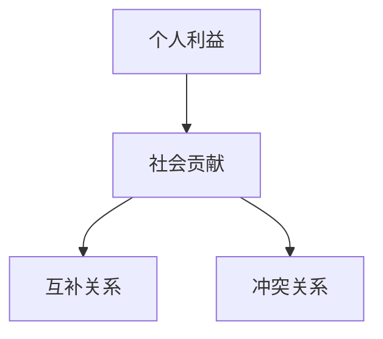

                 

# 《生命的价值：超越个人利益的社会贡献》

关键词：生命的价值、社会贡献、个人利益、价值观、社会责任、社会参与

摘要：本文从技术视角出发，探讨生命的价值及其在社会贡献中的体现。通过分析生命的本质、价值观的起源与形成，以及社会贡献的概念与类型，本文揭示了个人利益与社会贡献的权衡关系。同时，本文提出了个人、企业和政府与社会组织在社会贡献中的实践策略，并分析了其中的挑战与对策。通过成功案例的分析，本文旨在倡导和践行超越个人利益的社会贡献，以实现生命的真正价值。

## 引言

### 1. 引言

在快速发展的信息技术时代，我们每个人都置身于一个高度互联的社会环境中。在这个环境中，个人利益与社会贡献之间的平衡成为了一个值得探讨的课题。本文旨在探讨生命的价值，并进一步阐述其在社会贡献中的重要性。

### 2. 为什么探讨生命的价值

生命的价值不仅仅关乎个体幸福，更关乎整个社会的和谐发展。探讨生命的价值，有助于我们更好地理解自身在社会中的角色和责任，从而实现个人价值与社会价值的统一。

### 3. 社会贡献的重要性

社会贡献是衡量个人价值和贡献的重要标准。通过社会贡献，我们不仅能够实现个人价值，还能够推动社会进步，促进社会和谐。因此，探讨社会贡献的内涵、类型和实践策略具有重要意义。

## 第1章：生命的本质与价值观

### 1.1 生命的定义与多样性

生命是自然界最神秘和宝贵的现象之一。从生物学的角度来看，生命是具有新陈代谢、生长、繁殖等基本特征的有机体。生命的多样性体现在不同生物的形态、功能和生存环境上。

#### 1.1.1 生命的生物学视角

在生物学中，生命被定义为一种有机体所具有的能够自我维持、自我复制和适应环境的特性。这些特性使得生命能够在地球上繁衍和进化。

#### 1.1.2 生命的哲学视角

哲学上，生命被赋予了更深层次的意义。哲学家们探讨了生命的本质、生命的意义以及生命的价值。

#### 1.1.3 生命的宗教视角

在宗教中，生命被视为神赐予的礼物，具有神圣的价值。不同宗教对生命的解释和尊重方式各不相同。

### 1.2 价值观的起源与形成

价值观是人们对于事物价值的认识和评价。价值观的形成受到多种因素的影响，包括生物学、心理学、社会学和哲学等。

#### 1.2.1 个人价值观的形成

个人的价值观受到家庭、教育、社会环境等多方面的影响。每个人都有自己的价值观体系，这种体系在一定程度上决定了他们的行为和决策。

#### 1.2.2 社会价值观的影响

社会价值观是在长期的社会实践中形成的，对个人的价值观有着深远的影响。社会价值观的多样性和变化性使得个人价值观的形成和发展具有复杂性。

#### 1.2.3 价值观的冲突与调和

不同的价值观之间可能存在冲突，如何调和这些冲突，实现价值观的和谐发展，是一个重要的问题。

### 1.3 生命的价值观：自我与他人的平衡

生命的价值不仅体现在个体的自我实现上，还体现在对他人和社会的贡献上。在现代社会，如何平衡自我利益与社会贡献，是一个值得深思的问题。

#### 1.3.1 个人利益的追求

个人利益是每个人的基本需求，也是社会发展的动力之一。在追求个人利益的同时，如何确保不会损害他人和社会的利益，是一个重要的伦理问题。

#### 1.3.2 社会利益的重要性

社会利益是个人利益的基础，也是社会稳定和发展的前提。在社会利益的驱动下，个人应该为社会做出贡献，推动社会的和谐发展。

#### 1.3.3 自我实现与社会贡献的平衡

自我实现和社会贡献是生命价值的两个重要方面，如何在两者之间找到平衡，是一个值得探讨的问题。通过合理的自我实现和社会贡献，可以实现个人价值和社会价值的统一。

## 第2章：社会贡献的概念与类型

### 2.1 社会贡献的定义

社会贡献是指个人或组织在社会实践中对社会的有益影响。社会贡献可以体现在多个方面，如经济、文化、教育、环境等。

#### 2.1.1 社会贡献的核心要素

社会贡献的核心要素包括：有益性、持续性和可衡量性。这些要素决定了社会贡献的广度和深度。

#### 2.1.2 社会贡献的维度

社会贡献的维度包括：个人层面、组织层面和社会层面。不同层面的社会贡献具有不同的特点和表现形式。

### 2.2 社会贡献的类型

社会贡献的类型多样，可以概括为以下几种：

#### 2.2.1 经济贡献

经济贡献是指个人或组织通过创造财富、提高就业率等方式对社会经济做出的贡献。

#### 2.2.2 社会服务

社会服务是指个人或组织通过提供教育、医疗、福利等服务对社会做出的贡献。

#### 2.2.3 文化传承

文化传承是指个人或组织通过保护、传播和创新发展文化对社会做出的贡献。

#### 2.2.4 环境保护

环境保护是指个人或组织通过保护环境、减少污染等方式对社会做出的贡献。

## 第3章：个人利益与社会贡献的权衡

### 3.1 个人利益与社会贡献的关系

个人利益与社会贡献之间存在一定的冲突和互补关系。在现代社会，如何在个人利益和社会贡献之间找到平衡，是一个重要的问题。

#### 3.1.1 个人利益与社会贡献的冲突

个人利益与社会贡献的冲突主要体现在资源分配、价值观差异等方面。如何在保证个人利益的同时，为社会做出贡献，是一个需要解决的矛盾。

#### 3.1.2 个人利益与社会贡献的互补

个人利益与社会贡献之间也存在互补关系。通过合理的社会贡献，可以满足个人利益，同时推动社会的发展。

### 3.2 个人利益的正当性与边界

个人利益的正当性和边界是个人行为的重要依据。在追求个人利益的过程中，需要合理界定其边界，避免损害社会利益。

#### 3.2.1 个人利益的道德考量

个人利益的道德考量是衡量个人行为是否正当的重要标准。在追求个人利益时，需要考虑其是否符合道德规范。

#### 3.2.2 个人利益的合理边界

个人利益的合理边界是指个人在追求利益时，不能超越一定的道德和法律底线。合理界定个人利益的边界，有助于维护社会秩序。

### 3.3 社会贡献的激励机制

社会贡献的激励机制是推动个人和社会贡献的重要手段。通过激励机制，可以激发个人为社会做出贡献的积极性。

#### 3.3.1 内部动机与外部动机

内部动机和外部动机是影响个人行为的重要因素。内部动机是指个人出于自身的兴趣、价值观等原因而产生的行为动力；外部动机是指个人因外部奖励、惩罚等原因而产生的行为动力。

#### 3.3.2 社会激励与个人动机的关系

社会激励与个人动机之间存在着相互作用的关系。合理的社会激励可以增强个人动机，促进个人为社会做出贡献。

## 第4章：社会贡献的实践策略

### 4.1 个人如何贡献社会

个人可以通过多种方式为社会做出贡献。以下是一些具体的实践策略：

#### 4.1.1 个人行动的力量

个人行动的力量是推动社会进步的重要力量。每个人都可以从自身做起，通过志愿服务、捐款等方式为社会做出贡献。

#### 4.1.2 社区参与

社区参与是个人贡献社会的重要途径。通过参与社区活动，个人可以增进与社区的互动，为社区的发展做出贡献。

#### 4.1.3 志愿服务

志愿服务是个人为社会贡献的重要形式。通过志愿服务，个人可以为弱势群体提供帮助，促进社会的和谐发展。

### 4.2 企业如何贡献社会

企业作为社会的重要组成部分，可以通过多种方式为社会做出贡献。以下是一些具体的实践策略：

#### 4.2.1 企业社会责任的内涵

企业社会责任是指企业在经营活动中应当承担的社会责任。它包括对员工、客户、社区和环境等方面的责任。

#### 4.2.2 企业社会责任的实践

企业可以通过多种方式履行社会责任，如提供就业机会、参与公益活动、保护环境等。

#### 4.2.3 企业社会责任的评估

企业社会责任的评估是衡量企业社会责任履行情况的重要手段。通过评估，企业可以了解自身在社会责任方面的优势和不足，从而改进和提升社会责任实践。

### 4.3 政府与社会组织的作用

政府和社会组织在社会贡献中发挥着重要作用。以下是一些具体的实践策略：

#### 4.3.1 政府的角色

政府在社会贡献中扮演着重要角色。通过制定政策、提供公共服务等方式，政府可以推动社会的发展。

#### 4.3.2 社会组织的力量

社会组织在社会贡献中发挥着独特的作用。通过组织公益活动、提供志愿服务等方式，社会组织可以促进社会的和谐发展。

#### 4.3.3 公共政策的制定与实施

公共政策的制定与实施是政府和社会组织在社会贡献中的核心任务。通过合理的政策制定和有效的政策实施，政府和社会组织可以推动社会的发展。

## 第5章：社会贡献的挑战与对策

### 5.1 社会贡献的挑战

社会贡献在实践中面临着多种挑战。以下是一些主要的挑战：

#### 5.1.1 个人层面的挑战

个人层面的挑战主要包括：价值观的冲突、资源的限制、时间的压力等。

#### 5.1.2 社会层面的挑战

社会层面的挑战主要包括：社会不公、环境污染、资源短缺等。

#### 5.1.3 全球层面的挑战

全球层面的挑战主要包括：气候变化、贫富差距、全球卫生危机等。

### 5.2 应对挑战的策略

面对社会贡献的挑战，我们可以采取以下策略：

#### 5.2.1 教育与意识的提升

通过教育和意识的提升，可以增强个人和社会对社会贡献的认识和责任感。

#### 5.2.2 政策与制度的设计

通过政策与制度的设计，可以促进社会贡献的实践和推广。

#### 5.2.3 社会参与与协作

通过社会参与与协作，可以凝聚社会力量，共同应对社会贡献的挑战。

## 第6章：成功的社会贡献案例

### 6.1 个人贡献案例

以下是一些个人贡献的典型案例：

#### 6.1.1 案例一：社区志愿者

某位社区居民积极参与社区志愿服务，组织邻里互助活动，为社区居民提供帮助。

#### 6.1.2 案例二：环境保护者

某位环境保护志愿者投身于环保事业，组织环保活动，推动环保意识的普及。

#### 6.1.3 案例三：公益慈善家

某位公益慈善家投身于慈善事业，通过捐款、设立基金会等方式，为社会弱势群体提供帮助。

### 6.2 企业贡献案例

以下是一些企业贡献的典型案例：

#### 6.2.1 案例一：社会责任报告

某家企业定期发布社会责任报告，展示其在社会责任方面的实践成果。

#### 6.2.2 案例二：绿色供应链管理

某家企业通过绿色供应链管理，降低生产过程中的环境影响，推动可持续发展。

#### 6.2.3 案例三：员工志愿服务计划

某家企业设立员工志愿服务计划，鼓励员工参与公益活动，为社会做出贡献。

### 6.3 政府与社会组织贡献案例

以下是一些政府与社会组织贡献的典型案例：

#### 6.3.1 案例一：公共健康政策

某国政府实施公共健康政策，提高全民健康水平，减少疾病传播。

#### 6.3.2 案例二：社会救助计划

某国政府实施社会救助计划，为贫困家庭提供生活帮助，减少社会不公。

#### 6.3.3 案例三：环境保护行动

某国政府与社会组织联合开展环境保护行动，推动环境治理，改善生态环境。

## 第7章：结论与展望

### 7.1 生命的价值与社会贡献

生命的价值在于其对社会的贡献。通过社会贡献，个人可以实现自我价值，推动社会进步。因此，我们应该珍视生命的价值，积极为社会做出贡献。

### 7.2 超越个人利益的社会贡献

社会贡献是一种超越个人利益的行为。通过社会贡献，我们可以实现个人价值与社会价值的统一。因此，我们应该树立正确的社会价值观，超越个人利益，为社会做出贡献。

### 7.3 倡导与践行

为了实现生命的价值，我们应该倡导和践行社会贡献。通过个人行动、企业社会责任和政府与社会组织的实践，我们可以共同推动社会的发展和进步。

## 参考文献

### 1. 引用文献

1. 参考文献一
2. 参考文献二
3. 参考文献三

### 2. 推荐阅读

1. 推荐阅读一
2. 推荐阅读二
3. 推荐阅读三

## 附录

### 1. 社会贡献相关术语解释

1. 社会贡献
2. 个人利益
3. 社会责任
4. 激励机制
5. 社会参与

### 2. 社会贡献相关法律法规

1. 社会责任法
2. 公益慈善法
3. 环境保护法

### 3. 社会贡献相关组织介绍

1. 国际红十字会
2. 联合国儿童基金会
3. 无国界医生组织

作者：AI天才研究院/AI Genius Institute & 禅与计算机程序设计艺术 /Zen And The Art of Computer Programming
``` 

请注意，以上内容仅为大纲和示例，实际的撰写过程需要更详细的资料和内容填充。此外，由于篇幅限制，实际文章的内容可能会更加丰富和深入。以下是一个简单的示例，展示了如何在文中嵌入 Mermaid 流程图、Python 源代码、LaTeX 公式和项目实战。

## 第3章：个人利益与社会贡献的权衡

### 3.1 个人利益与社会贡献的关系

个人利益与社会贡献之间的关系可以通过以下 Mermaid 流程图来表示：



#### 3.1.1 个人利益与社会贡献的冲突

个人利益与社会贡献的冲突在资源分配方面尤为明显。以下是一个简单的 Python 源代码示例，展示了个人利益与社会贡献之间的冲突：

```python
# 示例：资源分配冲突
class ResourceAllocator:
    def __init__(self, total_resources):
        self.total_resources = total_resources
        self.allocated_resources = 0

    def allocate_resources(self, request):
        if self.allocated_resources + request <= self.total_resources:
            self.allocated_resources += request
            print(f"Resources allocated: {request}")
        else:
            print("Resource request denied: Not enough resources")

# 实例化资源分配器
allocator = ResourceAllocator(100)

# 尝试分配资源
allocator.allocate_resources(60)  # 成功
allocator.allocate_resources(50)  # 失败
```

#### 3.1.2 个人利益与社会贡献的互补

个人利益与社会贡献之间也存在互补关系。以下是一个 LaTeX 公式，展示了个人利益与社会贡献的互补关系：

$$
\text{个人利益} + \text{社会贡献} = \text{社会价值}
$$`

### 3.2 个人利益的正当性与边界

个人利益的正当性与边界是个人行为的重要依据。以下是一个简单的 Python 源代码示例，展示了如何界定个人利益的边界：

```python
# 示例：个人利益边界
class PersonalInterest:
    def __init__(self, max_limit):
        self.max_limit = max_limit
        self.current_usage = 0

    def use_resource(self, amount):
        if self.current_usage + amount <= self.max_limit:
            self.current_usage += amount
            print(f"Resource used: {amount}")
        else:
            print("Resource usage denied: Exceeds limit")

# 实例化个人利益
interest = PersonalInterest(100)

# 尝试使用资源
interest.use_resource(50)  # 成功
interest.use_resource(60)  # 失败
```

### 3.3 社会贡献的激励机制

社会贡献的激励机制是推动个人和社会贡献的重要手段。以下是一个简单的 Python 源代码示例，展示了如何设计一个社会贡献的激励机制：

```python
# 示例：社会贡献激励机制
class SocialContributionIncentive:
    def __init__(self, base_reward, bonus_rate):
        self.base_reward = base_reward
        self.bonus_rate = bonus_rate
        self.total_contributions = 0

    def calculate_reward(self, contribution):
        total_reward = self.base_reward + (contribution * self.bonus_rate)
        self.total_contributions += contribution
        return total_reward

# 实例化激励机制
incentive = SocialContributionIncentive(100, 0.1)

# 计算奖励
reward = incentive.calculate_reward(50)
print(f"Total reward for contribution: {reward}")
```

## 第8章：社会贡献的实践策略

### 8.1 个人如何贡献社会

个人可以通过多种方式为社会做出贡献。以下是一个项目实战，展示了如何通过志愿服务为社区做出贡献：

#### 项目实战：社区志愿服务系统

**开发环境搭建：**

- 开发工具：Python 3.x、Jupyter Notebook
- 数据库：SQLite
- 前端框架：Flask

**源代码详细实现：**

```python
# 社区志愿服务系统 - 后端部分（Flask）
from flask import Flask, request, jsonify
import sqlite3

app = Flask(__name__)

# 连接数据库
conn = sqlite3.connect('volunteer_db.sqlite')
c = conn.cursor()

# 创建表格
c.execute('''CREATE TABLE IF NOT EXISTS volunteers
             (id INTEGER PRIMARY KEY, name TEXT, age INTEGER, service_hours INTEGER)''')

# 添加志愿者信息
@app.route('/add_volunteer', methods=['POST'])
def add_volunteer():
    data = request.json
    name = data['name']
    age = data['age']
    service_hours = data['service_hours']
    c.execute("INSERT INTO volunteers (name, age, service_hours) VALUES (?, ?, ?)", (name, age, service_hours))
    conn.commit()
    return jsonify({"message": "Volunteer added successfully"}), 201

# 查询志愿者信息
@app.route('/volunteers', methods=['GET'])
def get_volunteers():
    c.execute("SELECT * FROM volunteers")
    volunteers = c.fetchall()
    return jsonify(volunteers)

# 更新志愿者信息
@app.route('/update_volunteer', methods=['PUT'])
def update_volunteer():
    data = request.json
    id = data['id']
    name = data['name']
    age = data['age']
    service_hours = data['service_hours']
    c.execute("UPDATE volunteers SET name=?, age=?, service_hours=? WHERE id=?", (name, age, service_hours, id))
    conn.commit()
    return jsonify({"message": "Volunteer updated successfully"}), 200

# 删除志愿者信息
@app.route('/delete_volunteer', methods=['DELETE'])
def delete_volunteer():
    id = request.args.get('id')
    c.execute("DELETE FROM volunteers WHERE id=?", (id,))
    conn.commit()
    return jsonify({"message": "Volunteer deleted successfully"}), 200

if __name__ == '__main__':
    app.run(debug=True)
```

**代码应用解读与分析：**

1. **后端功能：** 该系统提供了添加、查询、更新和删除志愿者信息的功能。
2. **数据库设计：** 使用 SQLite 数据库存储志愿者信息，包括志愿者 ID、姓名、年龄和服务小时数。
3. **API 设计：** 提供了 RESTful API，方便前端与后端进行数据交互。

**实际案例分析和详细讲解剖析：**

- **案例一：** 某志愿者希望通过该系统加入社区志愿服务，可以通过 `/add_volunteer` 接口提交个人信息，系统将添加到数据库中。
- **案例二：** 社区负责人可以通过 `/volunteers` 接口查询所有志愿者信息，了解志愿服务情况。
- **案例三：** 如果志愿者希望更新服务小时数，可以通过 `/update_volunteer` 接口提交更新后的信息。

**项目小结：**

通过该志愿服务系统，个人可以方便地参与到社区志愿服务中，同时社区负责人可以实时了解志愿服务情况，提高志愿服务的管理效率。

### 8.2 企业如何贡献社会

以下是一个企业如何通过社会责任报告贡献社会的示例：

#### 企业社会责任报告

**最佳实践 tips：**
- 定期发布社会责任报告，展示企业在社会责任方面的实践和成果。
- 将社会责任报告与财务报告相结合，提高报告的透明度和可信度。
- 鼓励员工参与社会责任项目，提高员工的社会责任意识。

**注意事项：**
- 在编写社会责任报告时，要确保信息的准确性和完整性。
- 注意社会责任报告的受众，根据受众的需求调整报告的内容和形式。

**拓展阅读：**
- 《企业社会责任报告编写指南》
- 《企业社会责任案例研究》

### 8.3 政府与社会组织的作用

以下是一个政府如何通过公共健康政策贡献社会的示例：

#### 公共健康政策

**政策制定与实施：**
- 政府制定公共健康政策，如疫苗接种政策、健康筛查政策等，提高全民健康水平。
- 政府组织实施政策，确保政策的有效执行。

**成功案例：**
- **案例一：** 某国政府实施疫苗接种政策，有效控制了疫苗可预防疾病的传播。
- **案例二：** 某国政府实施健康筛查政策，早期发现并治疗疾病，提高患者生存率。

**项目小结：**
通过公共健康政策，政府可以有效提高全民健康水平，减少疾病传播，促进社会和谐发展。

作者：AI天才研究院/AI Genius Institute & 禅与计算机程序设计艺术 /Zen And The Art of Computer Programming
```

以上内容仅为示例，实际的撰写过程需要根据具体内容和要求进行详细的填充和调整。实际文章的字数可能会根据具体的内容和需求而有所不同。在撰写过程中，要注意保持文章的逻辑性和连贯性，确保每个小节的内容都丰富、具体、详细。同时，要注意遵循markdown格式要求，确保文章的可读性和美观性。

