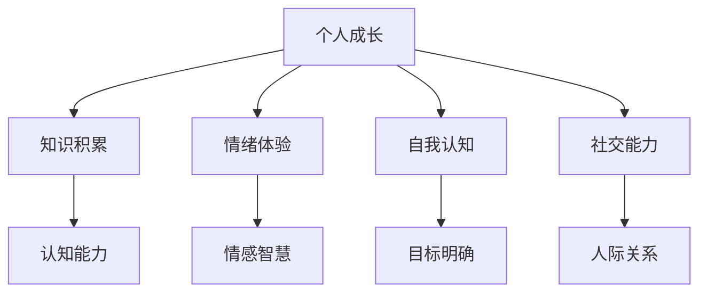
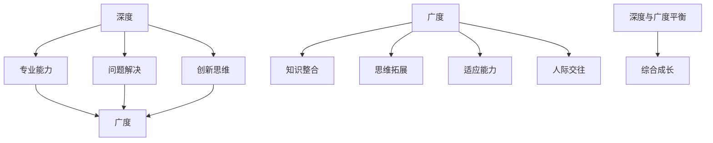
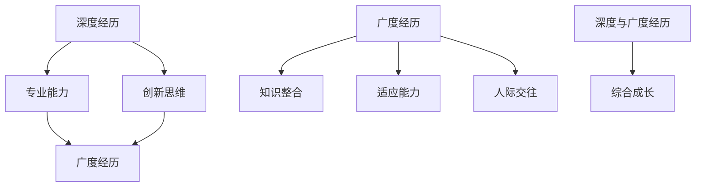
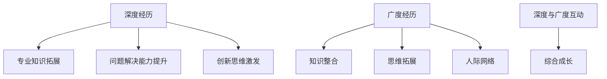
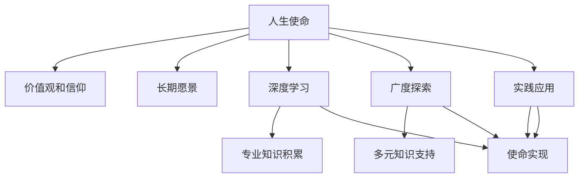

                 

## 《生命的厚度：增加经历的深度和广度》

> 关键词：经历、深度、广度、成长、幸福感、人生目标、人际关系

> 摘要：本文从人工智能技术专家的角度出发，探讨了生命的厚度——即通过增加经历的深度和广度来实现个人成长、提升幸福感、实现人生目标以及改善人际关系的方法。文章通过深入分析生命的起源、经历的重要性以及深度与广度经历的积累，提供了一系列实用的策略和建议，帮助读者在快节奏的现代生活中找到平衡，实现全面而充实的人生。

---

## 《生命的厚度：增加经历的深度和广度》目录大纲

### 第一部分：生命的起点

- **1.1 生命的诞生**
  - 生命的起源与演化
  - 人类的生物学特征

- **1.2 生命的意义**
  - 生命的本质
  - 生命存在的意义

### 第二部分：经历的重要性

- **2.1 经历与成长**
  - 经历的定义
  - 经历与个人成长的关系

- **2.2 深度经历**
  - 深度经历的意义
  - 深度经历的案例

- **2.3 广度经历**
  - 广度经历的重要性
  - 广度经历的案例

### 第三部分：增加生命的厚度

- **3.1 深度与广度的平衡**
  - 深度与广度的关系
  - 如何在生活中实现深度与广度的平衡

- **3.2 经历的积累**
  - 如何积累深度经历
  - 如何积累广度经历

- **3.3 深度与广度的互动**
  - 深度经历如何促进广度经历
  - 广度经历如何促进深度经历

### 第四部分：生命的厚度与幸福感

- **4.1 生命的厚度与幸福感**
  - 什么是幸福感
  - 生命的厚度与幸福感的关系

- **4.2 如何提升幸福感**
  - 提升幸福感的策略
  - 案例分享

### 第五部分：生命的厚度与人生目标

- **5.1 生命的厚度与人生目标**
  - 人生目标的意义
  - 如何通过增加生命的厚度来实现人生目标

- **5.2 生命的厚度与人生使命**
  - 人生使命的定义
  - 如何通过生命的厚度来实现人生使命

### 第六部分：生命的厚度与人际关系

- **6.1 生命的厚度与人际关系**
  - 人际关系的重要性
  - 如何通过生命的厚度来改善人际关系

- **6.2 深度友谊**
  - 深度友谊的意义
  - 如何建立深度友谊

- **6.3 广泛人脉**
  - 广泛人脉的价值
  - 如何建立广泛人脉

### 第七部分：生命的厚度与身心健康

- **7.1 身心健康的重要性**
  - 身心健康的定义
  - 身心健康与生命的厚度

- **7.2 增加身心健康的途径**
  - 深度经历与身心健康的关系
  - 广度经历与身心健康的关系

- **7.3 身心健康与幸福感**
  - 身心健康对幸福感的影响
  - 如何通过增加生命的厚度来提升身心健康

### 结论

- **生命的厚度总结**
- **对未来的展望**

### 附录

- **附录A：深度经历案例集锦**
- **附录B：广度经历指南**
- **附录C：深度与广度经历的工具与资源**

---

接下来，我们将逐步深入探讨生命的厚度——增加经历的深度和广度的重要性以及如何实现这一目标。

---

### 第一部分：生命的起点

#### 1.1 生命的诞生

生命的诞生是宇宙演化的奇迹，从单细胞生物到复杂的人类社会，这一过程充满了进化与适应的智慧。在探讨生命的厚度之前，我们有必要了解生命的起源与演化。

**生命的起源与演化**

科学家们普遍认为，地球大约在46亿年前诞生，随着宇宙的不断膨胀和星系的演化，地球逐渐形成。生命的起源可以追溯到约40亿年前，当时地球表面温度适中，大气中含有一定量的氧气和其他气体。在这样的环境下，有机分子通过化学反应逐渐形成了更复杂的生物分子，最终产生了生命。

生命的演化过程可以分为几个关键阶段：

1. **原核生物阶段**：最早的生命形式是原核生物，它们没有细胞核，细胞结构简单，主要以自养或异养方式生存。
2. **真核生物阶段**：随着生物分子和细胞结构的进一步复杂化，真核生物诞生。它们具有细胞核，可以进行更复杂的生命活动。
3. **多细胞生物阶段**：多细胞生物通过细胞分化形成了不同的器官和组织，使得生命形式更加多样化。
4. **人类阶段**：大约在250万年前，人类祖先从其他灵长类动物中分化出来，经过长期的进化，人类逐渐发展出高度发达的大脑和复杂的社会结构。

**人类的生物学特征**

人类作为地球上唯一具有高度智慧的物种，具有以下一些独特的生物学特征：

1. **大脑结构**：人类的大脑相对较大，占体重的比例较高，大脑皮层厚度也较大，这使得人类具有强大的认知能力和创造力。
2. **语言能力**：人类具有独特的语言能力，能够通过语言进行沟通和表达，这是其他动物所不具备的。
3. **双手灵活性**：人类双手具有高度的灵活性，可以进行精细的运动，这使得人类能够制造和使用各种工具。
4. **情感和社会性**：人类具有丰富的情感体验和社会性，这使得人类能够建立复杂的社会关系和网络。

了解生命的起源与演化以及人类的生物学特征，有助于我们更好地理解生命的本质和意义，从而为接下来的讨论打下基础。

#### 1.2 生命的意义

**生命的本质**

生命的本质在于其存在的价值和意义。从哲学的角度来看，生命的意义是多元的，不同的人可能有不同的理解和追求。

1. **生物学意义**：从生物学的角度来看，生命的意义在于个体的生存和繁衍，确保物种的延续。
2. **哲学意义**：从哲学的角度来看，生命的意义在于个体如何实现自我价值，寻找存在的意义和目的。
3. **宗教意义**：从宗教的角度来看，生命的意义在于个体的灵魂救赎和与神的关系。

**生命存在的意义**

生命的存在意义是一个深奥而复杂的问题，不同的人可能会有不同的回答。然而，从一些普遍的观点来看，我们可以得出以下几点关于生命存在意义的理解：

1. **寻找幸福**：幸福是许多人追求的目标，生命存在的意义在于如何找到属于自己的幸福，无论是物质上的还是精神上的。
2. **实现目标**：每个人都有自己的目标和梦想，生命存在的意义在于努力实现这些目标和梦想，让生命变得更加充实和有意义。
3. **与他人建立关系**：人是社会性动物，与他人建立关系和互动是生命的重要部分。通过与他人建立深厚的友谊和互助关系，生命变得更加丰富多彩。
4. **创造和贡献**：人类具有创造力和贡献精神，通过创造艺术、科学和技术等成果，人类为世界带来了无尽的美好和进步。

探讨生命的意义和存在意义有助于我们更好地理解生命的价值，从而更好地珍惜生命，追求有意义的人生。

---

在生命的起点，我们了解了生命的诞生和演化，以及生命的本质和存在的意义。接下来，我们将探讨经历的重要性，深入分析深度经历和广度经历对个人成长的影响。

---

### 第二部分：经历的重要性

#### 2.1 经历与成长

**经历的定义**

经历是指个体在生命过程中所遇到的各种事件和活动，这些事件和活动可以是积极的，也可以是消极的。经历不仅仅是外部事件的发生，更是个体对这些事件的认知、感受和反应。

**经历与个人成长的关系**

经历对个人成长具有深远的影响。通过经历，个体可以不断学习、成长和进步。以下是经历与个人成长之间的几个关键关系：

1. **学习与知识积累**：经历是获取知识和技能的重要途径。通过实践和体验，个体可以学习新的知识和技能，从而提高自己的认知能力和技能水平。
2. **情绪体验**：经历带来的情绪体验，如快乐、悲伤、愤怒等，对个体的情绪管理和情感智慧有重要影响。积极的情绪体验有助于提高个体的幸福感和情感稳定性。
3. **自我认知**：经历可以帮助个体更好地了解自己，包括自己的优点、缺点、兴趣和价值观。通过自我认知，个体可以更加明确自己的目标和方向，从而实现更好的个人成长。
4. **社交能力**：经历中的互动和合作有助于培养个体的社交能力。通过与他人的交流和合作，个体可以学习如何与他人相处，建立良好的人际关系。

**成长与经历的关系图示**

为了更直观地理解成长与经历的关系，我们可以使用Mermaid流程图来展示：

通过这个流程图，我们可以看到经历是如何通过不同方面促进个人成长的。

#### 2.2 深度经历

**深度经历的意义**

深度经历是指个体在某一个领域或主题上投入大量时间和精力，进行深入研究和实践。深度经历的意义主要体现在以下几个方面：

1. **专业能力提升**：通过深度经历，个体可以在某个领域获得深厚的专业知识和技能，从而成为该领域的专家。
2. **问题解决能力**：深度经历使个体在面对复杂问题时，能够更快速、更准确地找到解决方案。
3. **创新思维**：深度经历可以激发个体的创新思维，通过不断探索和尝试，创造出新的方法和成果。
4. **自信心建立**：通过深度经历，个体可以积累丰富的成功经验，从而增强自信心，面对更大的挑战。

**深度经历的案例**

以下是一些深度经历的案例，这些案例展示了深度经历对个人成长和职业发展的巨大影响：

1. **案例1：学术研究**：一位学者在某一学术领域进行了长期的研究和探索，最终发表了多篇高水平论文，成为该领域的权威专家。
2. **案例2：技术创新**：一位工程师在某个技术领域不断进行实验和优化，最终成功开发出一项具有重大影响的技术，推动了整个行业的发展。
3. **案例3：艺术创作**：一位艺术家在某一艺术形式上进行了长时间的实践和研究，创作出了一系列优秀的作品，赢得了广泛的认可和赞誉。

**深度经历的收益与挑战**

深度经历虽然具有巨大的收益，但也伴随着一些挑战。以下是一些深度经历的收益和挑战：

1. **收益**：
   - 提升专业能力和竞争力
   - 增强问题解决和创新思维
   - 建立自信心和成就感
   - 获得更多的职业机会和收入
2. **挑战**：
   - 需要投入大量时间和精力
   - 可能会遇到困难和挫折
   - 可能会面临孤独和压力
   - 需要不断学习和更新知识

通过深度经历，个体可以获得专业能力的提升，增强创新思维，建立自信心，但同时也需要面对一些挑战和困难。了解这些收益和挑战，有助于个体更好地规划深度经历，实现个人成长。

#### 2.3 广度经历

**广度经历的重要性**

广度经历是指个体在多个领域或主题上进行探索和实践，从而获得广泛的知识和经验。广度经历的重要性主要体现在以下几个方面：

1. **知识整合**：通过广度经历，个体可以在不同领域之间建立联系，整合不同的知识和技能，从而提高综合能力。
2. **思维拓展**：广度经历可以拓宽个体的思维边界，使其能够从不同角度看待问题，增强思维的灵活性和创造性。
3. **适应能力**：广度经历使个体能够更好地适应不同的环境和情境，增强应对变化和挑战的能力。
4. **人际交往**：广度经历有助于个体建立广泛的人际关系网络，拓宽社交圈，提高社交能力。

**广度经历的案例**

以下是一些广度经历的案例，这些案例展示了广度经历对个人成长和职业发展的积极作用：

1. **案例1：跨界创业**：一位创业者通过在多个领域的广度经历，成功跨界到新的行业，创立了具有巨大影响力的企业。
2. **案例2：学术交流**：一位学者通过在多个学科之间的广度经历，发表了多篇跨学科的研究论文，赢得了学术界的高度认可。
3. **案例3：综合素质培养**：一位学生通过参加多个课外活动和社团，积累了广泛的知识和经验，成为了一名综合素质极高的优秀人才。

**广度经历的收益与挑战**

广度经历虽然具有巨大的收益，但也伴随着一些挑战。以下是一些广度经历的收益和挑战：

1. **收益**：
   - 提高综合能力和适应能力
   - 增强思维灵活性和创造性
   - 建立广泛的人际关系网络
   - 拓宽职业发展路径
2. **挑战**：
   - 需要平衡时间和精力
   - 可能会分散注意力
   - 需要持续学习和更新知识
   - 需要克服跨领域的困难和障碍

通过广度经历，个体可以获得综合能力的提升，增强思维的灵活性和创造性，但同时也需要面对一些挑战和困难。了解这些收益和挑战，有助于个体更好地规划广度经历，实现个人成长。

---

通过深度经历和广度经历，个体可以在不同领域获得丰富的知识和经验，从而实现个人成长。在下一部分中，我们将探讨如何平衡深度经历和广度经历，以增加生命的厚度。

---

### 第三部分：增加生命的厚度

#### 3.1 深度与广度的平衡

**深度与广度的关系**

在探讨如何增加生命的厚度时，我们需要理解深度和广度的关系。深度和广度并不是相互排斥的，而是相辅相成的。深度经历提供了专业知识和技能的积累，而广度经历则帮助个体拓宽视野，增强思维的灵活性。深度和广度的平衡是实现全面成长的必要条件。

**如何在生活中实现深度与广度的平衡**

为了实现深度与广度的平衡，个体可以采取以下策略：

1. **目标明确**：明确自己的目标和兴趣，围绕目标进行深度学习和实践，同时保持对其他领域的兴趣和探索。
2. **时间管理**：合理规划时间，确保有足够的时间进行深度学习和实践，同时留出时间进行广度探索和体验。
3. **多样化学习**：通过阅读、参加研讨会、交流互动等方式，获取不同领域的知识和经验，拓宽自己的视野。
4. **跨界合作**：与他人合作，通过跨领域的交流和学习，促进深度与广度的结合，实现全面的成长。

**深度与广度关系的Mermaid流程图**

通过这个流程图，我们可以看到深度和广度如何相互促进，实现综合成长。

#### 3.2 经历的积累

**如何积累深度经历**

积累深度经历需要个体的专注和坚持。以下是一些建议：

1. **选择领域**：选择一个自己感兴趣的领域，投入时间和精力进行深入学习和研究。
2. **持续学习**：定期阅读相关书籍、文章和研究报告，参加研讨会和培训课程，保持对领域的持续关注。
3. **实践应用**：将所学知识应用于实际问题中，通过实践来巩固和提高自己的技能。
4. **反馈与改进**：不断反思自己的学习和实践，接受他人的反馈和建议，不断改进和提高。

**如何积累广度经历**

积累广度经历需要个体的开放和探索。以下是一些建议：

1. **多领域探索**：在多个领域进行探索，了解不同领域的知识和发展动态。
2. **体验不同文化**：通过旅行、文化交流等方式，体验不同文化的魅力，拓宽自己的视野。
3. **参加社交活动**：参加各种社交活动，结识不同领域的人，建立广泛的人际关系。
4. **跨界合作**：与不同领域的人合作，通过跨领域的项目，实现知识和经验的整合。

**深度与广度经历的积累关系图示**

通过这个流程图，我们可以看到深度与广度经历的积累如何促进个人的综合成长。

#### 3.3 深度与广度的互动

**深度经历如何促进广度经历**

深度经历可以促进广度经历，主要体现在以下几个方面：

1. **专业知识的拓展**：通过在某一领域的深入学习和研究，个体可以更好地理解该领域的相关概念和技术，从而更好地拓展到其他领域。
2. **问题解决能力的提升**：深度经历使个体在面对跨领域问题时，能够快速找到解决方案，从而促进广度经历的发展。
3. **创新思维的激发**：深度经历可以激发个体的创新思维，使其在广度经历中能够提出新颖的观点和想法。

**广度经历如何促进深度经历**

广度经历可以促进深度经历，主要体现在以下几个方面：

1. **知识整合**：通过在多个领域的广度探索，个体可以更好地整合不同领域的知识，从而加深对某一领域的理解和研究。
2. **思维拓展**：广度经历可以拓宽个体的思维边界，使其在深度经历中能够从不同角度思考问题，提高研究的深度和质量。
3. **人际网络**：广度经历有助于个体建立广泛的人际关系网络，通过与他人交流和合作，个体可以获得更多的资源和支持，从而更好地进行深度研究。

**深度与广度互动的Mermaid流程图**

通过这个流程图，我们可以看到深度与广度的互动如何促进个人的综合成长。

---

通过深度经历和广度经历，个体可以在不同领域获得丰富的知识和经验，从而实现全面的成长。在下一部分中，我们将探讨生命的厚度与幸福感的关系，并分享一些提升幸福感的方法。

---

### 第四部分：生命的厚度与幸福感

#### 4.1 生命的厚度与幸福感

**什么是幸福感**

幸福感是指个体在生活过程中所体验到的愉悦、满足和快乐。它不仅与物质条件有关，更与个体的心理状态和人际关系紧密相连。幸福感是一个多维度的概念，包括情感、认知和行为三个方面：

1. **情感维度**：包括积极的情绪体验，如快乐、满足、安宁等，以及消极情绪的减少，如焦虑、愤怒、悲伤等。
2. **认知维度**：包括对生活意义的理解和对未来期望的积极看法，以及对过去经历的满意程度。
3. **行为维度**：包括个体在日常生活中表现出来的积极行为，如乐于助人、参与社区活动、追求个人兴趣等。

**生命的厚度与幸福感的关系**

生命的厚度，即通过深度和广度经历积累的丰富经历和知识，对幸福感具有显著影响。以下是生命厚度与幸福感之间的几个关键关系：

1. **知识丰富**：深度和广度经历使个体在多个领域获得丰富的知识，这不仅能够提高个体的认知水平，还能够增加其对生活的理解和掌控感，从而提升幸福感。
2. **情感满足**：深度经历带来的专业成就和成就感，广度经历带来的多样性和新鲜感，都能够满足个体的情感需求，减少负面情绪，增加幸福感。
3. **社会支持**：深度和广度经历有助于个体建立广泛的人际关系网络，增强社会支持感，从而提高幸福感。
4. **自我实现**：通过深度和广度经历，个体能够更好地实现自我价值，找到生命的意义和目标，这本身就是幸福感的重要来源。

#### 4.2 如何提升幸福感

**提升幸福感的策略**

提升幸福感需要从多个方面进行努力，以下是一些有效的策略：

1. **专注深度经历**：选择一个自己感兴趣的领域，投入时间和精力进行深入学习和实践。深度经历能够带来专业成就感和自我实现感，从而提高幸福感。
2. **拓展广度经历**：在多个领域进行探索，了解不同领域的知识和发展动态。广度经历能够带来多样性和新鲜感，减少负面情绪，增加幸福感。
3. **培养积极情感**：通过积极的自我对话和正念练习，培养积极情感，减少负面情绪。积极的情感状态是幸福感的重要基础。
4. **建立社会关系**：与他人建立深厚的友谊和互助关系，增强社会支持感。良好的社会关系是提升幸福感的重要因素。
5. **追求有意义的目标**：设定有意义的目标，努力实现这些目标，找到生命的意义和目标。自我实现是幸福感的重要来源。

**案例分享**

以下是一个提升幸福感的案例：

**案例：王明的幸福旅程**

王明是一位软件工程师，他在职业生涯中选择了深度和广度经历相结合的方式来提升自己的幸福感。

**深度经历：**  
王明选择了软件开发作为一个深度经历领域。他投入大量时间和精力学习编程语言、框架和技术，参加相关培训课程，阅读专业书籍和论文。通过多年的努力，他成为了一名优秀的软件开发专家，成功完成了多个重大项目，获得了同事和上司的高度评价。

**广度经历：**  
除了在软件开发领域的深度经历，王明还积极参与其他领域的活动。他喜欢旅行，每年都会选择一个陌生的国家进行深度旅行，了解当地的文化和历史。他还参加了多个志愿者组织，通过帮助他人来体验不同的生活和社会环境。

**幸福感提升：**  
通过深度和广度经历，王明获得了丰富的知识和经验，提升了专业能力和综合素质。他在工作中取得了显著的成绩，获得了更多的机会和挑战。同时，他在旅行和志愿者活动中体验到了不同的人生视角，拓宽了自己的视野，减少了负面情绪。这些经历使他的幸福感大大提升。

**案例总结：**  
王明的案例表明，通过专注深度经历和拓展广度经历，个体可以全面提升幸福感。深度经历带来的专业成就感和自我实现感，广度经历带来的多样性和新鲜感，共同构成了个体的幸福感。

---

提升幸福感是增加生命厚度的重要目标之一。在下一部分中，我们将探讨生命的厚度与人生目标的关系，以及如何通过生命的厚度来实现人生目标。

---

### 第五部分：生命的厚度与人生目标

#### 5.1 生命的厚度与人生目标

**人生目标的意义**

人生目标是指个体在生活中希望实现的目标，这些目标可以是个人的，也可以是社会的。人生目标对于个体的生活具有重要的指导意义，它为个体提供了方向和动力，帮助个体在追求目标的过程中实现个人价值和社会价值。

1. **个人意义**：人生目标可以帮助个体明确自己的方向和目标，使个体在生活和工作中更加有动力和意义。
2. **社会意义**：人生目标可以促进个体对社会的贡献，通过实现个人目标，个体可以为社会的发展和进步做出贡献。

**生命的厚度与人生目标的关系**

生命的厚度，即通过深度和广度经历积累的丰富经历和知识，对实现人生目标具有关键作用。以下是生命的厚度与人生目标之间的几个关键关系：

1. **知识基础**：深度和广度经历为个体提供了丰富的知识基础，这些知识可以帮助个体更好地理解和应对生活中的各种挑战，实现人生目标。
2. **能力提升**：通过深度和广度经历，个体可以获得各种能力和技能，这些能力是实现人生目标的重要保障。
3. **思维拓展**：广度经历可以拓宽个体的思维边界，使个体能够从不同角度看待问题，提高解决问题的能力，有助于实现人生目标。
4. **人际关系**：通过深度和广度经历，个体可以建立广泛的人际关系网络，这些关系可以为个体提供支持和资源，有助于实现人生目标。

**如何通过增加生命的厚度来实现人生目标**

为了通过增加生命的厚度来实现人生目标，个体可以采取以下策略：

1. **明确目标**：明确自己的人生目标，设定具体、可行的目标和计划，为后续的努力提供方向。
2. **深度学习**：选择一个或多个与自己人生目标相关的领域，投入时间和精力进行深度学习，积累专业知识。
3. **广度探索**：在多个领域进行探索，了解不同领域的知识和发展动态，拓宽自己的视野。
4. **实践应用**：将所学知识和技能应用于实际生活中，通过实践来检验和提升自己的能力。
5. **持续反思**：定期反思自己的学习和实践过程，评估目标的实现情况，调整策略和计划。

#### 5.2 生命的厚度与人生使命

**人生使命的定义**

人生使命是指个体在人生中希望承担的责任和完成的任务，它比人生目标更加宏大和深远。人生使命通常与个体的价值观、信仰和长期愿景紧密相连，是引导个体行为和决策的核心原则。

1. **价值观和信仰**：人生使命是个体价值观和信仰的体现，反映了个体对生活的理解和对社会的责任。
2. **长期愿景**：人生使命是个体对未来的期望和规划，它为个体提供了长远的方向和动力。

**如何通过生命的厚度来实现人生使命**

为了通过生命的厚度来实现人生使命，个体可以采取以下策略：

1. **明确使命**：深入思考自己的人生使命，明确自己在人生中希望承担的责任和完成的任务。
2. **深度学习**：选择与人生使命相关的领域进行深入学习，积累专业知识，提升自己的能力。
3. **广度探索**：在多个领域进行探索，了解不同领域的知识和动态，为人生使命的实现提供多元化的支持。
4. **实践应用**：将所学知识和技能应用于实际生活中，通过行动来实现人生使命。
5. **持续反思**：定期反思自己的学习和实践过程，评估人生使命的实现情况，不断调整和优化策略。

**生命厚度与人生使命关系图示**

通过这个关系图，我们可以看到生命的厚度如何通过深度学习和广度探索来支持人生使命的实现。

---

通过增加生命的厚度，个体可以在实现人生目标和人生使命的过程中获得更多的支持和资源。在下一部分中，我们将探讨生命的厚度与人际关系的关系，以及如何通过生命的厚度来改善人际关系。

---

### 第六部分：生命的厚度与人际关系

#### 6.1 生命的厚度与人际关系

**人际关系的重要性**

人际关系是影响个体生活质量和幸福感的重要因素。良好的人际关系能够为个体提供情感支持、资源帮助和共同成长的机会。以下是人际关系的重要性：

1. **情感支持**：人际关系能够为个体提供情感上的支持和安慰，帮助个体在困难和挫折中保持积极心态。
2. **资源交换**：人际关系网络为个体提供了各种资源和机会，包括职业机会、知识分享和社会支持。
3. **共同成长**：通过与他人的互动和合作，个体可以学习新的知识和技能，实现个人和团队的共同成长。

**生命的厚度与人际关系的关系**

生命的厚度，即通过深度和广度经历积累的丰富经历和知识，对人际关系具有深远影响。以下是生命的厚度与人际关系之间的几个关键关系：

1. **沟通能力**：深度经历使个体在专业领域拥有丰富的知识，能够更准确地表达自己的观点和需求，提高沟通效果。
2. **信任建立**：广度经历使个体能够了解不同领域的知识和文化，增强对他人的理解和尊重，从而建立更深层次的信任。
3. **共同话题**：深度和广度经历为个体提供了丰富的共同话题和交流内容，增强人际关系的互动和乐趣。
4. **情感支持**：丰富的人生经历使个体能够更好地理解和关怀他人，提供更有针对性的情感支持。

**如何通过生命的厚度来改善人际关系**

为了通过生命的厚度来改善人际关系，个体可以采取以下策略：

1. **深度交流**：选择一个感兴趣的话题，与朋友或同事进行深度交流，分享自己的见解和经验。
2. **广度拓展**：参与多样化的社交活动，了解不同领域的知识和文化，拓宽自己的视野和知识面。
3. **倾听他人**：倾听他人的意见和需求，理解他们的感受和想法，建立更深层次的信任和理解。
4. **共同学习**：与朋友或同事共同学习新知识或技能，通过互动和合作实现共同成长。

#### 6.2 深度友谊

**深度友谊的意义**

深度友谊是人际关系中的珍宝，它代表着个体之间深厚而真挚的情感纽带。以下是深度友谊的意义：

1. **情感支持**：深度友谊能够为个体提供情感上的支持和安慰，帮助个体在困难和挫折中保持积极心态。
2. **心理成长**：通过与深友的交流和互动，个体可以学习新的观点和思维方式，促进个人心理成长。
3. **价值观共鸣**：深度友谊通常建立在共同的价值观和信仰上，这种共鸣使个体在生活和工作中更有动力和方向。
4. **共同经历**：深度友谊中的共同经历和回忆，成为个体之间宝贵的情感财富，增强彼此的情感联系。

**如何建立深度友谊**

建立深度友谊需要时间和努力，以下是一些建议：

1. **真诚交流**：与朋友保持真诚的交流，分享自己的想法和感受，倾听对方的意见和需求。
2. **共同活动**：与朋友共同参与各种活动，如旅行、运动、学习等，通过共同的经历加深彼此的了解和情感。
3. **互相支持**：在朋友需要帮助时，给予真诚的支持和关心，建立信任和依赖。
4. **保持联系**：即使生活中遇到困难和挫折，也要保持与朋友的联系，共同度过难关。

**深度友谊案例**

以下是一个深度友谊的案例：

**案例：小李和小张的深厚友谊**

小李和小张是大学时的同学，两人因为共同的爱好和兴趣走到了一起。他们经常一起参加社团活动，一起学习新技能，还一起去了多个国家和地区旅行。

**深度友谊的形成：**

- **共同兴趣**：小李和小张都对编程和摄影感兴趣，他们经常一起讨论技术问题，分享摄影作品。
- **共同经历**：他们一起参加了多次户外探险活动，克服了各种困难和挑战，建立了深厚的信任和默契。
- **真诚交流**：无论在工作还是生活中，他们总是真诚地分享自己的想法和感受，互相支持和鼓励。

**深度友谊的意义：**

- **情感支持**：在工作和生活中遇到困难时，他们总能互相安慰和鼓励，成为彼此的坚强后盾。
- **心理成长**：通过与对方的交流和互动，他们不断学习新的知识和技能，实现个人的心理成长。
- **共同成长**：他们一起追求个人和职业目标，互相支持和鼓励，共同实现成长和进步。

**案例总结：**

小李和小张的深厚友谊展示了深度友谊的力量，通过共同的兴趣和经历，他们建立了真挚的情感纽带，共同成长，成为彼此生活中不可或缺的一部分。

#### 6.3 广泛人脉

**广泛人脉的价值**

广泛人脉是指个体在生活和工作中建立的各种人际关系网络。广泛人脉的价值体现在以下几个方面：

1. **资源获取**：广泛人脉为个体提供了丰富的资源和机会，包括职业机会、项目合作、知识分享等。
2. **社会支持**：广泛人脉可以提供情感支持和社会支持，帮助个体在面临困难时获得帮助和安慰。
3. **信息交流**：广泛人脉使个体能够获取最新的信息和动态，为个人和职业发展提供有价值的信息。
4. **共同成长**：通过与不同领域的人建立联系，个体可以学习新的知识和技能，实现个人和团队的共同成长。

**如何建立广泛人脉**

建立广泛人脉需要策略和努力，以下是一些建议：

1. **积极参与社交活动**：参加各种社交活动，如聚会、讲座、研讨会等，扩大自己的社交圈。
2. **主动交流**：主动与他人交流，介绍自己，了解对方的背景和兴趣，建立初步联系。
3. **保持联系**：定期与朋友和联系人保持联系，分享自己的近况和经历，保持关系的活跃。
4. **提供帮助**：在他人需要帮助时，主动提供帮助，建立信任和互助关系。
5. **利用社交媒体**：利用社交媒体平台，如LinkedIn、Twitter等，建立和维护广泛的人脉网络。

**广泛人脉案例**

以下是一个广泛人脉的案例：

**案例：张晓的广泛人脉网络**

张晓是一位成功的企业家，他通过多年的努力建立了广泛的人脉网络。他的广泛人脉不仅帮助他在商业领域取得了成功，也为他的个人和职业发展提供了无尽的支持。

**广泛人脉的形成：**

- **积极参与社交活动**：张晓经常参加各种商业聚会和社交活动，与不同领域的人建立联系。
- **主动交流**：他总是主动与陌生人交流，介绍自己，了解对方的背景和兴趣，建立了初步联系。
- **提供帮助**：在朋友和商业伙伴需要帮助时，他总是主动提供帮助，建立了信任和互助关系。

**广泛人脉的价值：**

- **资源获取**：张晓的广泛人脉为他提供了丰富的商业机会和资源，帮助他在创业过程中取得了成功。
- **社会支持**：在面临商业挑战时，他的广泛人脉为他提供了宝贵的建议和帮助，帮助他克服困难。
- **信息交流**：通过与不同领域的人交流，他获得了最新的行业信息和动态，为他的业务发展提供了有价值的信息。

**案例总结：**

张晓的广泛人脉网络展示了广泛人脉的重要性和价值，通过积极参与社交活动、主动交流和提供帮助，他建立了一个庞大而活跃的人际关系网络，为他的个人和职业发展提供了无尽的资源和支持。

---

通过深度友谊和广泛人脉，个体可以改善人际关系，获得更多的支持和资源。在下一部分中，我们将探讨生命的厚度与身心健康的关系，以及如何通过增加生命的厚度来提升身心健康。

---

### 第七部分：生命的厚度与身心健康

#### 7.1 身心健康的重要性

**身心健康的重要性**

身心健康是指身体和心灵都处于良好状态，是个人幸福和成功的基础。以下是一些关于身心健康重要性的重要观点：

1. **生活质量**：身心健康直接影响个人的生活质量。一个健康的身体和积极的心态可以帮助个人更好地享受生活，提高生活质量。
2. **工作效能**：身心健康对工作效能有着重要影响。健康的身体和清晰的思维能够提高工作效率，降低工作压力。
3. **人际关系**：身心健康有助于建立和维护良好的人际关系。一个身心健康的个体更容易与他人建立信任和共鸣。
4. **长期健康**：身心健康是长期健康的基础。通过保持身心健康，个体可以降低患病的风险，延长寿命。

**身心健康与生命的厚度**

生命的厚度，即通过深度和广度经历积累的丰富经历和知识，对身心健康具有积极影响。以下是生命的厚度与身心健康之间的几个关键关系：

1. **心理满足**：深度和广度经历可以带来心理满足感，减少焦虑和抑郁等负面情绪，提高心理健康水平。
2. **社会支持**：通过深度和广度经历，个体可以建立广泛的人际关系网络，获得更多的社会支持，提高身心健康水平。
3. **积极生活态度**：深度和广度经历使个体对生活有更深刻的理解，培养积极的生活态度，从而提高身心健康。
4. **健康习惯**：通过深度和广度经历，个体可以培养健康的生活习惯，如定期锻炼、合理饮食等，提高身体健康水平。

#### 7.2 增加身心健康的途径

**深度经历与身心健康的关系**

深度经历，如专业学习和深入研究，对身心健康有显著影响。以下是一些具体的关系：

1. **减压**：通过深度经历，个体可以专注于学习和研究，从而减少生活中的压力和焦虑。
2. **自我实现**：深度经历使个体有机会实现个人目标和梦想，获得成就感和自我满足，提高心理健康。
3. **认知挑战**：深度经历提供了认知上的挑战，有助于提高大脑的灵活性和思维能力，促进心理健康。
4. **社交互动**：深度经历往往需要与他人合作，这有助于建立积极的社交关系，提高心理健康。

**广度经历与身心健康的关系**

广度经历，如多样化的活动和旅行，也对身心健康有重要影响。以下是一些具体的关系：

1. **新鲜感**：广度经历提供了新鲜感和刺激，有助于激发大脑的活力，提高心理健康。
2. **情感释放**：通过广度经历，个体可以释放情感压力，如通过旅行来放松身心，减轻焦虑和压力。
3. **健康习惯**：广度经历往往涉及锻炼和户外活动，有助于培养健康的生活习惯，提高身体健康水平。
4. **文化体验**：广度经历使个体能够体验不同的文化和生活方式，拓宽视野，提高心理适应能力。

**深度与广度经历对身心健康的互动作用**

深度和广度经历相互作用，共同促进身心健康。以下是一些具体的互动作用：

1. **平衡压力**：深度经历提供了认知挑战和专注的机会，有助于减压；而广度经历提供了放松和娱乐的机会，有助于缓解压力。
2. **综合成长**：深度和广度经历共同促进了个人成长，提高了综合能力和适应性，从而有助于身心健康。
3. **社交支持**：深度经历往往需要与他人合作，建立了专业网络；而广度经历提供了更广泛的社交机会，增强了社交支持。

**提升身心健康的实用策略**

为了提升身心健康，个体可以采取以下实用策略：

1. **定期锻炼**：每周至少进行150分钟的中等强度锻炼，如快走、游泳或骑自行车。
2. **健康饮食**：选择均衡的饮食，多吃水果、蔬菜、全谷物和蛋白质，限制高糖、高盐和高脂肪食品。
3. **充足睡眠**：每晚保证7-9小时的睡眠，保持良好的睡眠习惯，如固定的睡眠时间和舒适的睡眠环境。
4. **深度学习**：选择一个感兴趣的领域进行深度学习，通过专注和挑战提高心理健康。
5. **广度探索**：定期参加新的活动和旅行，体验不同的文化和生活方式，拓宽视野。
6. **社交互动**：与家人、朋友和同事保持积极互动，建立和维护良好的社交关系。
7. **心理调适**：通过冥想、正念练习和心理辅导等方式，保持良好的心理状态。

通过这些策略，个体可以在增加生命的厚度的同时，提升身心健康，实现全面而充实的人生。

---

通过深度经历和广度经历，个体不仅能够增加生命的厚度，还能够提升身心健康。在下一部分中，我们将总结文章的核心观点，并展望未来的发展方向。

---

## 结论

通过本文的探讨，我们深刻认识到生命的厚度——通过增加经历的深度和广度来实现个人成长、提升幸福感、实现人生目标以及改善人际关系的重要性。以下是本文的核心观点总结：

1. **生命的厚度**：生命的厚度不仅仅是个体的经历和知识的积累，更是个体对生活、对自我、对他人的深刻理解。
2. **深度经历**：深度经历使个体在专业领域获得深厚的知识和技能，提高问题解决能力和创新能力。
3. **广度经历**：广度经历使个体能够拓宽视野，培养思维灵活性和适应性，建立广泛的人际关系网络。
4. **深度与广度的平衡**：在追求深度和广度经历的过程中，个体需要找到平衡，使两者相互促进，实现全面的成长。
5. **身心健康**：通过深度和广度经历，个体能够提升身心健康，增强幸福感。
6. **人际关系**：深度和广度经历有助于建立深厚的人际关系，增强社会支持感。

## 对未来的展望

在未来的发展中，个体可以通过以下方式进一步增加生命的厚度：

1. **终身学习**：随着科技和社会的快速发展，个体需要不断学习新知识和技能，保持与时代同步。
2. **多元化探索**：在专业领域深入研究的同时，个体应积极拓展广度，探索不同领域，培养综合能力。
3. **人际网络建设**：通过积极参与社交活动，建立和维护广泛的人际关系网络，为个人和职业发展提供支持。
4. **身心健康管理**：注重身心健康，采取积极的生活方式，通过锻炼、健康饮食和心理调适来提升生活品质。

通过以上策略，个体可以在未来的发展中进一步增加生命的厚度，实现全面而充实的人生。

---

在增加生命的厚度和追求幸福的过程中，每个个体都是独特的。希望本文能够为大家提供一些启示和方向，激励大家在追求个人成长和社会贡献的道路上不断前行。

## 附录

### 附录A：深度经历案例集锦

- **案例1：探索自然**
  - **背景介绍**：小李是一位自然摄影师，他对大自然的美丽景色充满热爱。他利用业余时间，深入各种自然环境中，拍摄了许多令人惊叹的照片。
  - **核心概念与联系**：自然摄影涉及到光线、构图、自然生态等多方面的知识。小李通过不断的实践和总结，将这些知识应用于实际拍摄中，逐步提高了自己的摄影技能。
  - **核心算法原理讲解**：在拍摄过程中，小李学习了如何利用光线和阴影来塑造场景，以及如何运用不同的镜头来捕捉自然之美。
  - **实际案例分析和详细讲解剖析**：小李在拍摄某一次日落时，运用了长时间曝光的技巧，成功捕捉到了日落的美丽瞬间。
  - **项目小结**：通过深度经历，小李不仅在摄影技能上取得了显著进步，还通过自然摄影传递了环保的理念，对社会产生了积极影响。

- **案例2：学习新技能**
  - **背景介绍**：小张是一位软件工程师，他希望在编程之外学习一项新技能。他选择了学习编程语言Python，并将其应用于数据分析。
  - **核心概念与联系**：Python作为一种通用编程语言，广泛应用于数据分析、人工智能等领域。小张通过自学和参加培训课程，掌握了Python编程的基础和数据分析的方法。
  - **核心算法原理讲解**：小张学习了如何使用Python进行数据处理、数据可视化，以及如何使用机器学习库进行数据分析。
  - **实际案例分析和详细讲解剖析**：小张利用Python编写了一个数据分析脚本，对某公司销售数据进行了分析，帮助公司优化了销售策略。
  - **项目小结**：通过深度学习新技能，小张不仅提高了自己的编程能力，还为公司的业务发展做出了贡献。

### 附录B：广度经历指南

- **如何选择广度经历**
  - **背景介绍**：在快节奏的生活中，个体需要合理安排时间进行广度经历。如何选择适合自己的广度经历成为了一个重要问题。
  - **核心概念与联系**：广度经历的选择应该基于个人的兴趣、目标和实际情况。个体可以通过自我评估和职业规划来确定适合自己的广度经历。
  - **核心算法原理讲解**：可以使用一些工具和方法来评估个人的兴趣和目标，如兴趣量表、职业规划测试等。
  - **实际案例分析和详细讲解剖析**：小王通过职业规划测试发现，他对教育和心理学领域有浓厚兴趣，因此决定参加相关的培训和活动。
  - **项目小结**：通过合理的评估和选择，个体可以更有针对性地进行广度经历，提高学习效果。

- **广度经历的准备与规划**
  - **背景介绍**：广度经历不仅需要选择，还需要充分的准备和规划。如何进行准备和规划是广度经历成功的关键。
  - **核心概念与联系**：准备和规划包括时间管理、资源整合、目标设定等。个体需要合理安排时间和资源，确保广度经历的有效进行。
  - **核心算法原理讲解**：可以使用项目管理工具和技巧来制定详细的学习计划，如甘特图、时间管理法则等。
  - **实际案例分析和详细讲解剖析**：小李为了参加一个国际会议，提前几个月开始准备，制定了详细的学习计划和演讲准备计划。
  - **项目小结**：通过充分的准备和规划，个体可以更好地应对广度经历中的挑战，实现预期的学习目标。

### 附录C：深度与广度经历的工具与资源

- **深度经历工具与资源**
  - **背景介绍**：为了支持深度经历，个体需要使用一些工具和资源来提高学习效果和效率。
  - **核心概念与联系**：深度经历的工具和资源包括专业书籍、在线课程、研究论文、实践项目等。这些工具和资源可以帮助个体深入学习和实践。
  - **核心算法原理讲解**：可以使用一些工具来整理和总结学习内容，如笔记软件、思维导图工具等。
  - **实际案例分析和详细讲解剖析**：小张通过使用文献管理工具EndNote，有效地整理和分析了大量的研究论文，为自己的研究项目提供了有力支持。
  - **项目小结**：通过合理使用深度经历的工具和资源，个体可以更高效地积累专业知识，提高学习效果。

- **广度经历工具与资源**
  - **背景介绍**：广度经历同样需要工具和资源的支持，以帮助个体拓宽视野和积累经验。
  - **核心概念与联系**：广度经历的工具和资源包括在线课程、社交媒体、行业报告、交流活动等。这些工具和资源可以帮助个体了解不同领域的知识和动态。
  - **核心算法原理讲解**：可以使用一些工具来管理学习资源和社交网络，如学习管理工具Trello、社交媒体平台LinkedIn等。
  - **实际案例分析和详细讲解剖析**：小王通过参加LinkedIn上的线上交流活动，结识了多位行业专家，获得了宝贵的职业建议和机会。
  - **项目小结**：通过合理使用广度经历的工具和资源，个体可以更有效地拓宽视野，建立广泛的人际关系网络。

---

通过深度与广度经历的积累，个体不仅能够增加生命的厚度，还能够实现个人成长和全面发展。希望附录中的案例和指南能够为大家提供实际操作的参考，助力大家在追求有意义的人生道路上不断前进。

