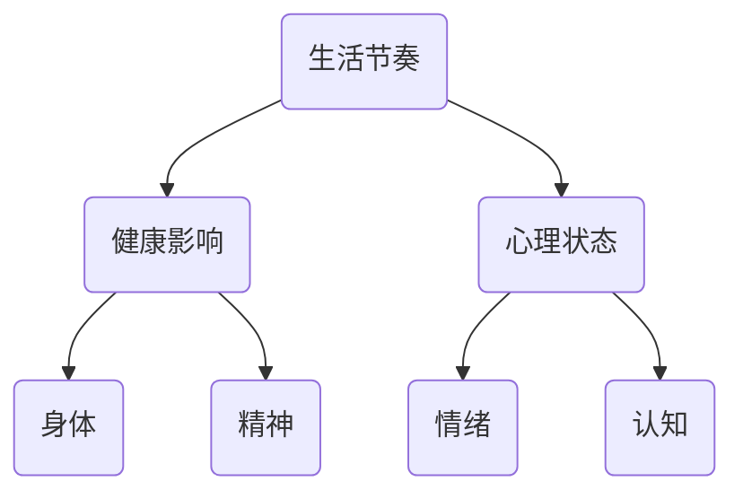

                 

**文章标题**：生命的旋律：创造个人独特的生活节奏

**关键词**：生活节奏、健康影响、心理状态、时间管理、优化

**摘要**：
本文将深入探讨生活节奏的重要性，探讨其对健康和心理状态的影响，并通过具体案例和算法原理，指导读者如何自我评估与调整生活节奏，创造个人独特的生活旋律。文章将分为三个部分：理解生活节奏、创造个人生活节奏、以及应对生活节奏变化。通过这些探讨，希望读者能够更好地掌握时间管理技巧，优化个人生活节奏，实现身心健康和高效生活。

----------------------------------------------------------------

**第一部分：理解生活节奏**

### 第1章：生活节奏的重要性

#### 1.1 生活节奏的定义与类型

生活节奏是指人们在日常生活中所遵循的规律性活动安排。根据活动性质和频率，生活节奏可以分为以下几种类型：

1. **固定生活节奏**：每天按时起床、工作、吃饭、休息，生活规律且稳定。
2. **灵活生活节奏**：根据个人需求和外界环境变化，灵活调整生活安排，保持一定的弹性。
3. **快节奏生活**：工作繁忙，生活紧凑，时间观念强，高效率完成任务。
4. **慢节奏生活**：注重休闲和放松，生活节奏较慢，追求生活质量。

#### 1.2 生活节奏对健康的影响

生活节奏与身体健康密切相关。研究表明，生活节奏的不规律可能导致以下健康问题：

1. **心血管疾病**：快节奏生活可能导致高血压、心脏病等心血管疾病。
2. **消化系统疾病**：长时间紧张工作可能导致胃肠功能紊乱，引发消化系统疾病。
3. **免疫力下降**：生活节奏的不稳定会影响免疫系统，降低抵抗力。
4. **心理问题**：快节奏生活可能导致焦虑、抑郁等心理问题。

#### 1.3 生活节奏与心理状态的关系

生活节奏对心理状态有重要影响。适当的节奏能够带来积极的心理体验，而过快或过慢的节奏可能导致负面情绪。研究表明：

1. **积极节奏**：有助于提高自我效能感，增强自信心。
2. **消极节奏**：可能导致压力过大，影响心理健康。

为了更好地理解生活节奏的重要性，我们可以使用以下 Mermaid 流程图来展示核心概念之间的关系：

通过这个流程图，我们可以清晰地看到生活节奏对健康和心理状态的直接和间接影响。

### 第2章：自我评估与节奏调整

#### 2.1 自我评估方法

要了解自己的生活节奏，首先需要进行自我评估。以下是一些常用的自我评估方法：

1. **日记法**：记录每天的生活内容和时间安排，分析生活节奏。
2. **问卷调查**：通过填写相关问卷，评估生活节奏的稳定性和适应性。
3. **心理测试**：通过专业心理测试，了解自己的生活节奏和心理健康状况。

#### 2.2 识别并改变不健康的节奏习惯

不健康的节奏习惯会影响身体健康和心理状态。以下是一些常见的不健康节奏习惯：

1. **长时间熬夜**：影响生物钟，导致免疫力下降。
2. **饮食不规律**：导致消化系统问题，影响身体健康。
3. **缺乏运动**：影响身体健康，增加患病风险。

为了改变不健康的节奏习惯，可以采取以下策略：

1. **逐步调整**：逐步调整生活节奏，避免突然改变导致身体不适。
2. **建立规律**：建立健康的生活规律，如按时作息、饮食。
3. **增加运动**：定期进行运动，提高身体健康水平。

#### 2.3 调整生活节奏的策略

调整生活节奏需要综合考虑个人需求和外界环境。以下是一些有效的调整策略：

1. **时间管理**：合理安排时间，提高工作效率，减少无效时间。
2. **设置优先级**：将任务按照重要性和紧急性进行分类，优先处理重要且紧急的任务。
3. **休息与放松**：适当安排休息时间，避免长时间过度劳累。
4. **寻求支持**：与他人分享生活节奏调整经验，寻求专业建议。

通过自我评估和调整，我们可以更好地适应生活节奏，提高身心健康水平。

----------------------------------------------------------------

**第二部分：创造个人生活节奏**

### 第3章：生活方式与生活节奏的匹配

#### 3.1 工作与生活节奏的平衡

工作与生活节奏的平衡是创造个人独特生活旋律的关键。以下是一些建议：

1. **合理规划工作时间**：制定详细的工作计划，合理安排工作时间，避免加班。
2. **弹性工作制度**：争取实行弹性工作制度，如远程办公、灵活作息等。
3. **休息与放松**：确保每天有足够的休息时间，进行适当的放松活动，如瑜伽、阅读等。

#### 3.2 休闲活动与生活节奏的融合

休闲活动是生活节奏的重要组成部分。以下是一些建议：

1. **多样化休闲活动**：尝试不同的休闲活动，如旅游、运动、艺术等，丰富生活内容。
2. **合理安排休闲时间**：确保休闲活动与工作节奏相协调，避免过度劳累。
3. **家庭与朋友关系**：与家人和朋友共度美好时光，增进人际关系，提高生活质量。

#### 3.3 家庭与生活节奏的和谐

家庭是生活节奏的重要支撑。以下是一些建议：

1. **家庭沟通**：与家人保持良好沟通，共同制定家庭生活规划。
2. **共同参与**：鼓励家庭成员共同参与家庭事务，提高家庭凝聚力。
3. **家庭活动**：定期组织家庭活动，如家庭聚餐、旅游等，增进家庭关系。

通过平衡工作与生活节奏、融合休闲活动与生活节奏、以及建立和谐的家庭生活节奏，我们可以创造个人独特的生活旋律。

### 第4章：时间管理技巧

#### 4.1 设定目标与计划

时间管理的第一步是设定目标和制定计划。以下是一些建议：

1. **明确目标**：设定清晰、具体、可行的目标，如“每天锻炼30分钟”。
2. **分解任务**：将大目标分解为小任务，便于逐步实现。
3. **制定计划**：根据目标制定详细的计划，包括任务、时间、责任人等。

#### 4.2 时间管理工具与方法

时间管理工具可以帮助我们更好地管理时间。以下是一些建议：

1. **日程表**：使用日程表记录每天的任务和时间安排，确保按时完成任务。
2. **提醒工具**：设置提醒工具，如手机提醒、电子邮件提醒等，确保不会错过重要事项。
3. **待办事项清单**：将任务列出待办事项清单，优先处理重要且紧急的任务。

#### 4.3 避免拖延与提高效率

拖延是影响时间管理的重要因素。以下是一些建议：

1. **分解任务**：将大任务分解为小任务，降低任务的难度，避免因任务过于庞大而产生畏惧心理。
2. **设立截止日期**：为任务设立明确的截止日期，增加紧迫感，提高工作效率。
3. **避免干扰**：在工作时避免干扰，如关闭社交媒体、手机等，集中精力完成任务。

通过设定目标与计划、使用时间管理工具、避免拖延和提高效率，我们可以更好地管理时间，创造个人独特的生活节奏。

### 第5章：建立健康的生活节奏

#### 5.1 睡眠质量与生活节奏

睡眠质量是健康生活节奏的重要组成部分。以下是一些建议：

1. **保持规律作息**：尽量保持每天同一时间入睡和起床，建立稳定的生物钟。
2. **改善睡眠环境**：保持睡眠环境安静、舒适、黑暗，有利于提高睡眠质量。
3. **减少刺激性物质**：晚上避免摄入刺激性物质，如咖啡、茶、烟草等，避免影响睡眠。

#### 5.2 饮食习惯与生活节奏

饮食习惯对生活节奏有重要影响。以下是一些建议：

1. **合理饮食结构**：保持饮食均衡，摄入足够的蛋白质、碳水化合物、脂肪等营养成分。
2. **定时进食**：尽量按时进食，避免暴饮暴食或过度饥饿，影响身体健康。
3. **减少外卖次数**：减少外卖次数，尽量自己烹饪，确保饮食健康。

#### 5.3 锻炼与生活节奏

定期锻炼对保持健康生活节奏至关重要。以下是一些建议：

1. **选择适合自己的锻炼方式**：根据个人喜好和身体状况，选择适合自己的锻炼方式，如跑步、游泳、瑜伽等。
2. **定期锻炼**：保持每周至少三次的锻炼，每次锻炼时间不少于30分钟。
3. **锻炼与休息相结合**：锻炼后适当休息，避免过度劳累，确保身体得到充分恢复。

通过关注睡眠质量、改善饮食习惯和定期锻炼，我们可以建立健康的生活节奏，提高生活质量。

### 第三部分：应对生活节奏变化

#### 第6章：适应生活变化

#### 6.1 变化中的生活节奏

生活节奏可能会因个人发展、职业变化、家庭状况等因素而发生变化。适应这些变化，保持身心健康，是每个人都需要面对的挑战。

#### 6.2 应对生活压力的方法

生活节奏的变化往往伴随着压力的增加。以下是一些应对生活压力的方法：

1. **情绪管理**：学会控制情绪，避免负面情绪对身心健康的影响。
2. **寻求支持**：与家人、朋友或专业人士交流，分享压力和困惑，寻求支持和建议。
3. **自我调节**：通过冥想、瑜伽、深呼吸等方式，缓解压力，保持内心的平静。

#### 6.3 积极面对生活变化

积极面对生活变化，有助于更好地适应新的生活节奏。以下是一些建议：

1. **保持乐观态度**：对生活保持乐观态度，相信自己有能力应对变化和挑战。
2. **持续学习**：不断学习新知识、新技能，提高自己的适应能力和竞争力。
3. **设定新目标**：在适应新的生活节奏后，设定新的目标，为自己的人生增添动力。

通过适应生活变化、应对生活压力和积极面对生活变化，我们可以更好地应对生活节奏的变化，保持身心健康。

#### 第7章：危机管理

#### 7.1 危机对生活节奏的影响

危机可能对生活节奏造成严重影响，如失业、疾病、家庭变故等。这些危机往往使人们的生活节奏发生剧烈变化，影响身心健康。

#### 7.2 危机应对策略

以下是一些危机应对策略：

1. **冷静分析**：在危机发生时，保持冷静，分析问题的根源，找出解决方案。
2. **寻求帮助**：及时寻求家人、朋友或专业人士的帮助，共同应对危机。
3. **调整生活节奏**：在危机期间，根据实际情况调整生活节奏，确保身心健康。

#### 7.3 从危机中恢复生活节奏

危机过后，恢复生活节奏是重要的任务。以下是一些建议：

1. **逐步恢复**：在危机后，逐步恢复正常的作息和生活方式，避免过度劳累。
2. **积极调整**：积极调整心态，重新设定生活目标，为自己的人生增添动力。
3. **保持乐观**：对生活保持乐观态度，相信自己有能力克服困难，恢复生活节奏。

通过冷静分析、寻求帮助、调整生活节奏和逐步恢复，我们可以从危机中走出来，恢复健康的生活节奏。

#### 第8章：持续优化生活节奏

#### 8.1 定期反思与调整

持续优化生活节奏的关键是定期反思与调整。以下是一些建议：

1. **每周反思**：每周对自己的生活节奏进行反思，总结优点和不足，寻找改进的方向。
2. **每月调整**：每月根据反思结果，调整生活节奏，确保适应新的生活环境和需求。
3. **每年规划**：每年制定新的生活目标和规划，为自己的人生增添新的动力。

#### 8.2 持续成长与进步

持续优化生活节奏需要不断成长与进步。以下是一些建议：

1. **学习新知识**：不断学习新知识、新技能，提高自己的综合素质。
2. **拓展人际关系**：积极参加社交活动，拓展人际关系，为自己的人生增添新的机会。
3. **积极面对挑战**：勇敢面对生活中的挑战，从中学习和成长。

#### 8.3 保持生活节奏的灵活性

生活节奏的灵活性是适应变化和应对危机的关键。以下是一些建议：

1. **灵活调整计划**：在面对变化时，灵活调整计划，确保生活节奏适应新的情况。
2. **培养适应能力**：通过不断面对变化，提高自己的适应能力，更好地应对生活中的挑战。
3. **保持乐观心态**：对生活保持乐观心态，相信自己有能力应对各种变化和挑战。

通过定期反思与调整、持续成长与进步、以及保持生活节奏的灵活性，我们可以不断优化生活节奏，实现身心健康和高效生活。

### 附录

#### 附录A：生活节奏调整工具与资源

#### A.1 时间管理应用程序推荐

1. **Trello**：一款简单易用的任务管理工具，适合个人和组织使用。
2. **Asana**：一款功能强大的项目管理工具，支持团队协作和任务分配。
3. **Google Calendar**：一款免费的日历应用程序，可以帮助用户更好地管理时间。

#### A.2 健康生活指南

1. **《健康生活手册》**：一本全面介绍健康生活方式的书籍，包括饮食、运动、心理等方面的内容。
2. **世界卫生组织（WHO）**：官方网站提供丰富的健康生活指南和资源，帮助人们保持健康。

#### A.3 节奏调整书籍推荐

1. **《时间管理的艺术》**：一本经典的时间管理书籍，详细介绍了时间管理的原理和技巧。
2. **《高效能人士的七个习惯》**：一本关于个人成长和效能提升的书籍，涵盖了时间管理、人际关系、目标设定等方面的内容。

通过使用这些工具和资源，我们可以更好地调整生活节奏，实现身心健康和高效生活。

### 作者信息

**作者：AI天才研究院/AI Genius Institute & 禅与计算机程序设计艺术 /Zen And The Art of Computer Programming**

感谢您的阅读，希望本文能够帮助您更好地理解生活节奏的重要性，学会如何自我评估和调整生活节奏，创造个人独特的生活旋律。祝您生活愉快，身心健康！

