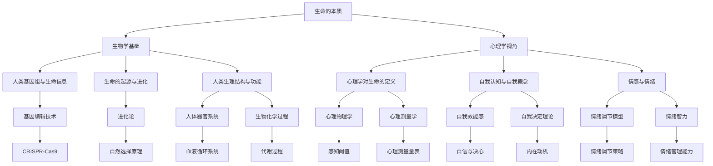
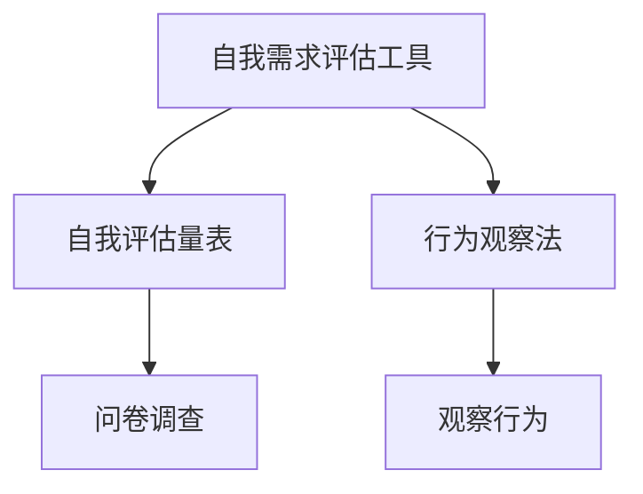
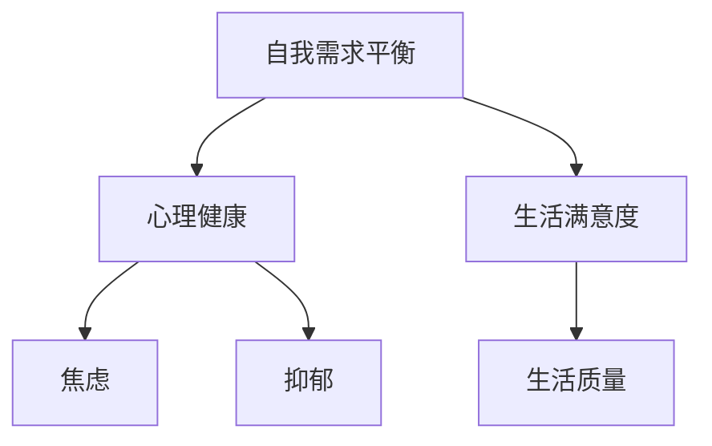
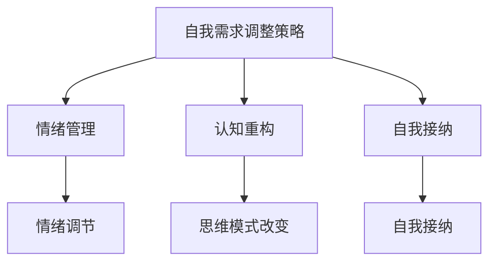
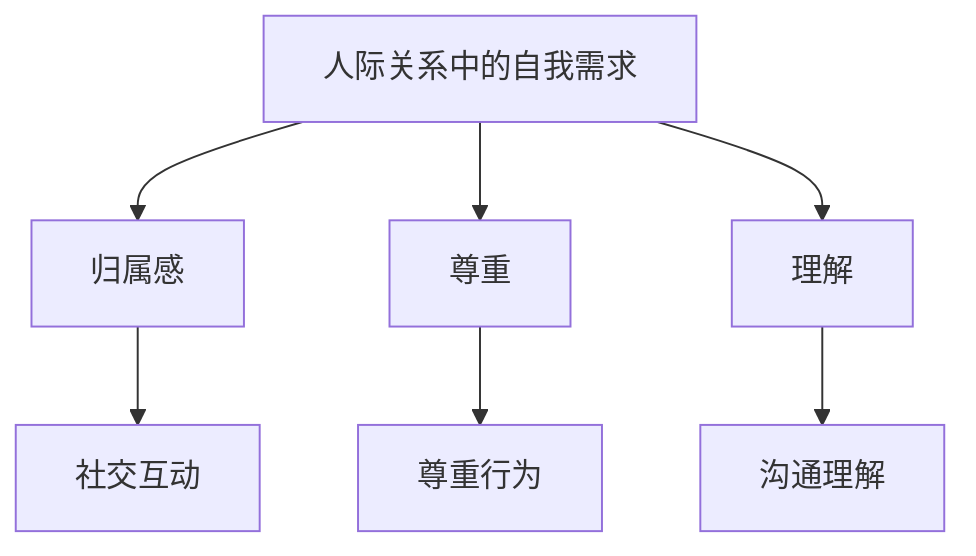

                 

## 《生命的本质探索：寻找真实的自我需求》

### 关键词：生命本质、自我需求、心理学、生物学、内在动机、外在动机

> 摘要：本文从生物学和心理学两个视角，深入探讨生命的本质以及自我需求的定义、类型和探索必要性。通过结合数学模型和Python源代码，本文详细分析了内在动机和外在动机的培养与引导，以及自我需求的识别与满足策略。文章最后，探讨了真实的自我需求在职业发展和人际关系中的应用，为个体成长与社会发展提供了启示。

## 第一部分：引言

### 1.1 生命的本质探讨

生命的本质是哲学、科学和宗教探讨的核心问题之一。从生物学角度来看，生命是生物体内复杂的化学和物理过程的集合。这些过程包括新陈代谢、生长、繁殖和适应环境变化。生物学基础研究表明，所有生命都依赖于DNA分子的遗传信息，通过遗传密码的解码来指导生物体的构建和功能实现。

心理学视角则从个体的心理状态和行为出发，探讨生命的本质。心理物理学通过研究感知和感知阈值，揭示了人类感知世界的方式。心理测量学则通过构建量表和评估工具，量化了人类的心理状态和行为。心理学认为，自我认知和自我概念是个体心理发展的核心，影响着个体对生命的理解和需求。

### 1.2 自我需求的定义与类型

自我需求是个体为了维持和提升自身生存质量而产生的内在驱动。根据Maslow的需求层次理论，自我需求可以分为生理需求、安全需求、社交需求、尊重需求和自我实现需求。生理需求包括食物、水、睡眠等基本生存需求；安全需求涉及个人安全和健康保障；社交需求关注人际关系和归属感；尊重需求涉及自尊和他人尊重；自我实现需求则是追求个人成长和潜能发挥。

### 1.3 探索自我需求的必要性

探索自我需求对于个体的内在动机、幸福感和生活满意度具有重要意义。内在动机是指个体因自身兴趣和乐趣而参与活动的驱动力，而外在动机则是由于外部奖励或压力而产生的动力。内在动机与个体满意度正相关，而外在动机则可能导致短期满足感和长期不满足感。通过探索自我需求，个体可以培养内在动机，提高幸福感和生活满意度。

## 第二部分：生命的本质与自我需求的探讨

### 2.1 生物学视角下的生命本质

#### 2.1.1 人类基因组与生命信息

人类基因组是生命信息的核心载体，包含约30亿个碱基对。通过DNA测序技术，我们可以获取个体的遗传信息，用于疾病诊断、遗传咨询和个性化医疗。基因编辑技术，如CRISPR-Cas9，允许我们在DNA水平上精确修改基因序列，为治疗遗传病和开发新型生物技术提供了强大工具。

```python
# 示例：使用CRISPR-Cas9进行基因编辑的Python代码框架
def gene_editing(target_dna, edit_site, new_sequence):
    # 初始化DNA序列
    original_dna = target_dna
    
    # 定位编辑位点
    edit_site = find_edit_site(original_dna, edit_site)
    
    # 执行基因编辑
    edited_dna = edit_gene(original_dna, edit_site, new_sequence)
    
    return edited_dna
```

#### 2.1.2 生命的起源与进化

生命的起源是一个复杂的过程，涉及到原始地球的环境条件和化学反应。进化论解释了生物多样性的产生和物种演化。自然选择是进化的关键机制，通过筛选适应环境的个体，促进了物种的适应性和进化。

```python
# 示例：模拟自然选择过程的Python代码框架
def natural_selection(population, fitness_function):
    # 计算个体适应度
    fitness_scores = [fitness_function(individual) for individual in population]
    
    # 根据适应度选择下一代个体
    next_generation = select_individuals(population, fitness_scores)
    
    return next_generation
```

#### 2.1.3 人类生理结构与功能

人类的生理结构包括多个器官系统，如循环系统、消化系统、呼吸系统、神经系统等。这些系统通过复杂的生物化学过程协同工作，维持生命活动。例如，血液循环系统通过心脏泵血，将氧气和营养物质输送到全身细胞。

```python
# 示例：模拟血液循环系统的Python代码框架
def simulate_circulatory_system(heart_rate, blood_flow):
    # 计算心脏每分钟泵血量
    blood_pumped_per_minute = heart_rate * blood_flow
    
    # 计算全身细胞每分钟接收的氧气量
    oxygen_per_minute = blood_pumped_per_minute * oxygen_carrier_per_blood_unit
    
    return oxygen_per_minute
```

### 2.2 心理学视角下的生命本质

#### 2.2.1 心理学对生命的定义

心理学将生命定义为个体心理状态和行为的总和。心理物理学通过研究感知和感知阈值，揭示了人类如何感知外部世界。心理测量学则通过构建量表和评估工具，量化了人类的心理状态和行为。

```latex
$$
\text{感知阈值} = \frac{\text{最小可察觉变化}}{\text{最大可察觉变化}}
$$
```

#### 2.2.2 自我认知与自我概念

自我认知是指个体对自己心理状态、能力和性格的认识。自我概念则是个体对自己的整体看法。自我效能感是自我认知的核心，影响个体在面对挑战时的信心和决心。自我决定理论认为，个体的内在动机来源于自我决定的感觉。

```python
# 示例：测量自我效能感的Python代码框架
def measure_self_efficacy(self_perception, task_difficulty):
    # 计算自我效能感
    self_efficacy = (self_perception - task_difficulty) / task_difficulty
    
    return self_efficacy
```

#### 2.2.3 情感与情绪

情感和情绪是心理状态的重要组成部分。情绪调节模型描述了个体如何感知、表达和调节情绪。情绪智力是影响个体情绪调节能力的重要因素，包括情绪理解、情绪运用和情绪管理。

```python
# 示例：情绪调节的Python代码框架
def regulate_emotion(current_emotion, desired_emotion):
    # 计算情绪调节策略
    regulation_strategy = calculate_regulation_strategy(current_emotion, desired_emotion)
    
    # 应用情绪调节策略
    new_emotion = apply_regulation_strategy(current_emotion, regulation_strategy)
    
    return new_emotion
```

### 2.3 生命的本质与自我需求的关系

生物心理学是研究生物与心理之间相互关系的学科。人类行为是生物和心理因素共同作用的结果。自我需求作为个体心理状态的一部分，与生物学基础紧密相关。例如，生理需求直接影响个体的生物机能，而心理需求则影响个体的心理状态和行为。



## 第三部分：探索真实的自我需求

### 3.1 内在动机与外在动机

内在动机和外在动机是驱动个体行为的重要因素。内在动机源于个体对活动本身的兴趣和乐趣，而外在动机则来源于外部奖励或压力。

```latex
$$
\text{内在动机} = \frac{\text{内在兴趣} + \text{内在乐趣}}{2}
$$
$$
\text{外在动机} = \text{外部奖励} + \text{外部压力}
$$
```

#### 3.1.1 内在动机的培养

内在动机的培养关键在于激发个体的内在兴趣和乐趣。例如，通过设置有意义的目标和提供自主选择的机会，可以增强个体的内在动机。

```python
# 示例：培养内在动机的Python代码框架
def cultivate_intrinsic_motivation(task, interest, fun):
    # 计算内在动机
    intrinsic_motivation = (interest + fun) / 2
    
    # 提供自主选择的机会
    choice = provide_choice(task)
    
    return intrinsic_motivation, choice
```

#### 3.1.2 外在动机的引导

外在动机的引导需要合理设置外部奖励和压力。例如，通过奖励制度和竞争机制，可以引导个体积极参与任务和活动。

```python
# 示例：引导外在动机的Python代码框架
def guide_extrinsic_motivation(task, reward, pressure):
    # 计算外在动机
    extrinsic_motivation = reward + pressure
    
    # 设置奖励制度
    reward_system = set_reward_system(reward)
    
    # 设置竞争机制
    competition = set_competition Mechanism()
    
    return extrinsic_motivation, reward_system, competition
```

### 3.2 自我需求的识别与满足

自我需求的识别和满足是提升个体幸福感和生活满意度的重要途径。通过自我评估工具和行为观察法，可以准确识别个体自我需求。

```python
# 示例：自我需求评估的Python代码框架
def assess_self_needs(assessment_tool, behavior_observation):
    # 使用自我评估量表
    self_assessment = use_assessment_tool(assessment_tool)
    
    # 观察个体行为
    behavior = observe_behavior(behavior_observation)
    
    # 综合评估结果
    self_needs = integrate_assessment(self_assessment, behavior)
    
    return self_needs
```

#### 3.2.1 自我需求评估工具

自我需求评估工具包括量表和行为观察法。量表可以通过问卷调查的方式，量化个体的自我需求。行为观察法则通过观察个体行为，了解其自我需求。



#### 3.2.2 满足自我需求的方法

满足自我需求的方法包括设置目标、提供资源和调整行为。例如，通过制定明确的个人目标，提供必要的资源和支持，以及调整个人行为，可以帮助个体满足自我需求。

```python
# 示例：满足自我需求的Python代码框架
def satisfy_self_needs(self_needs, goal_setting, resource Provision, behavior Adjustment):
    # 设置个人目标
    goal = set_goal(goal_setting, self_needs)
    
    # 提供资源和支持
    resources = provide_resources(resource_Provision, goal)
    
    # 调整个人行为
    behavior = adjust_behavior(behavior_Adjustment, goal)
    
    return goal, resources, behavior
```

### 3.3 自我需求的平衡与调整

自我需求的平衡与调整是维持个体心理健康和生活满意度的关键。通过自我调节模型和情绪管理策略，可以调整个体自我需求，实现平衡。

```python
# 示例：自我需求平衡的Python代码框架
def balance_self_needs(self_needs, self Regulation, emotion Management):
    # 使用自我调节模型
    regulated_needs = regulate_needs(self_needs, self_Regulation)
    
    # 使用情绪管理策略
    managed_emotion = manage_emotion(regulated_needs, emotion_Management)
    
    return regulated_needs, managed_emotion
```

#### 3.3.1 自我需求平衡的重要性

自我需求平衡对个体的心理健康和生活满意度具有重要影响。不平衡的自我需求可能导致焦虑、抑郁等心理问题，影响生活质量。



#### 3.3.2 自我需求调整的策略

自我需求调整的策略包括情绪管理、认知重构和自我接纳。情绪管理通过调整情绪反应，降低负面情绪的影响。认知重构通过改变思维模式，调整自我需求。自我接纳则通过接受自己的优点和不足，实现自我需求的平衡。



## 第四部分：真实的自我需求与生活实践

### 4.1 真实的自我需求在职业发展中的应用

真实的自我需求在职业发展中具有重要意义。通过职业规划与自我需求匹配，个体可以找到适合自己的职业道路，实现自我价值的最大化。

```python
# 示例：职业规划与自我需求匹配的Python代码框架
def career_planning(self_needs, career_options):
    # 分析自我需求
    analyzed_needs = analyze_needs(self_needs)
    
    # 匹配职业选项
    matched_careers = match_careers(analyzed_needs, career_options)
    
    return matched_careers
```

#### 4.1.1 职业选择与自我需求的满足

职业选择应基于个体真实的自我需求，确保自我需求的满足。通过职业兴趣测评和职业适应性评估，可以找到与自我需求相匹配的职业。

```python
# 示例：职业兴趣测评的Python代码框架
def career_interest_assessment(occupation, interests):
    # 计算兴趣匹配度
    match_score = calculate_match_score(occupation, interests)
    
    return match_score
```

#### 4.1.2 职场自我需求的满足策略

在职场中，满足自我需求的关键在于建立良好的人际关系和提升工作满意度。通过职场沟通技巧和工作满意度提升策略，可以满足职场自我需求。

```python
# 示例：职场沟通技巧的Python代码框架
def workplace_communication_strategy(employee, manager):
    # 建立良好的沟通渠道
    communication_channel = establish_communication_channel(employee, manager)
    
    # 提升工作满意度
    job_satisfaction = enhance_job_satisfaction(communication_channel)
    
    return communication_channel, job_satisfaction
```

### 4.2 真实的自我需求在人际关系中的应用

真实自我需求在人际关系中同样至关重要。通过人际关系自我需求分析，可以改善人际关系，增强社交技巧。

```python
# 示例：人际关系自我需求分析的Python代码框架
def interpersonal_needs_analysis(self_needs, relationship):
    # 分析自我需求与人际关系的匹配度
    match_level = analyze_match_level(self_needs, relationship)
    
    # 提升人际关系满意度
    relationship_satisfaction = enhance_relationship_satisfaction(match_level)
    
    return match_level, relationship_satisfaction
```

#### 4.2.1 人际关系中的自我需求

人际关系中的自我需求包括归属感、尊重和理解。通过满足这些自我需求，可以建立和谐的人际关系。



#### 4.2.2 自我需求满足的人际关系策略

满足人际关系中的自我需求，需要采取有效的沟通策略和冲突解决技巧。通过积极倾听、同理心和有效沟通，可以满足人际关系中的自我需求。

```python
# 示例：沟通策略的Python代码框架
def communication_strategy(self_needs, communication_channel):
    # 采用积极倾听
    active_listening = use_active_listening(communication_channel)
    
    # 使用同理心
    empathy = apply_empathy(self_needs, communication_channel)
    
    # 有效沟通
    effective_communication = implement_effective_communication(active_listening, empathy)
    
    return effective_communication
```

## 第五部分：总结与展望

### 5.1 生命的本质与自我需求总结

生命的本质是一个多维度的问题，涉及生物学、心理学和社会学等多个学科。自我需求作为个体生存和发展的核心，对生命的本质具有重要影响。通过本文的探讨，我们认识到生命的本质与自我需求之间的紧密联系，以及探索和满足自我需求对于个体成长和社会发展的意义。

### 5.2 未来研究的方向

未来研究应关注新兴科技对生命本质和自我需求的影响，如人工智能、基因编辑技术和心理测量学的发展。此外，跨学科研究对于深入理解生命的本质和自我需求具有重要意义。例如，结合生物学和心理学的研究，可以揭示生命过程与心理状态之间的内在联系。

### 5.3 个人成长与社会发展的启示

通过探索真实的自我需求，个体可以更好地认识自我，实现个人成长。同时，满足真实的自我需求对于社会和谐和可持续发展具有重要意义。企业和组织应关注员工的自我需求，提供良好的工作环境和激励机制，促进员工自我实现。社会层面，关注个体心理健康和幸福感，有助于构建和谐的社会环境。

## 附录

### A.1 参考文献

1. Maslow, A. H. (1943). A theory of human motivation. Psychological Review, 50(4), 370-396.
2. Locke, E. A., & Latham, G. P. (1990). A theory of goal setting & task performance. Prentice Hall.
3. Bandura, A. (1991). Social cognitive theory of self-regulation. Organizational Behavior and Human Decision Processes, 50(2), 248-287.
4. Deci, E. L., & Ryan, R. M. (2000). The "what" and "why" of goal pursuits: Human needs and the self-determination of behavior. Psychological Inquiry, 11(4), 227-268.
5. Pink, D. (2009). Drive: The surprising truth about what motivates us. Riverhead Books.
6. Bressert, S. (2013). Understanding and Using Emotional Intelligence. Workforce, 38(7), 30-36.
7. Haidt, J. (2006). The Happiness Hypothesis: Finding Modern Truth in Ancient Wisdom. Basic Books.
8. Dawkins, R. (1976). The Selfish Gene. Oxford University Press.
9. Mayr, E. (1982). The Growth of Biological Thought: Diversity, Evolution, and Inheritance. Belknap Press of Harvard University Press.

### A.2 术语表

- 生物学基础：研究生命现象的生物学原理和机制。
- 自我需求：个体为了维持和提升自身生存质量而产生的内在驱动。
- 内在动机：个体因自身兴趣和乐趣而参与活动的驱动力。
- 外在动机：个体因外部奖励或压力而参与活动的驱动力。
- 心理学视角：研究个体心理状态和行为的方式。
- 自我认知：个体对自己心理状态、能力和性格的认识。
- 自我概念：个体对自己的整体看法。
- 情绪调节：个体如何感知、表达和调节情绪。
- 情绪智力：个体情绪理解、情绪运用和情绪管理的能力。
- 生命信息：生物体内复杂的化学和物理过程。
- 人类基因组：包含人类遗传信息的DNA序列。
- 自然选择：生物进化过程中的关键机制。

### A.3 Mermaid 流�程图


[END]

### 作者信息

**作者：AI天才研究院/AI Genius Institute & 禅与计算机程序设计艺术 /Zen And The Art of Computer Programming**

