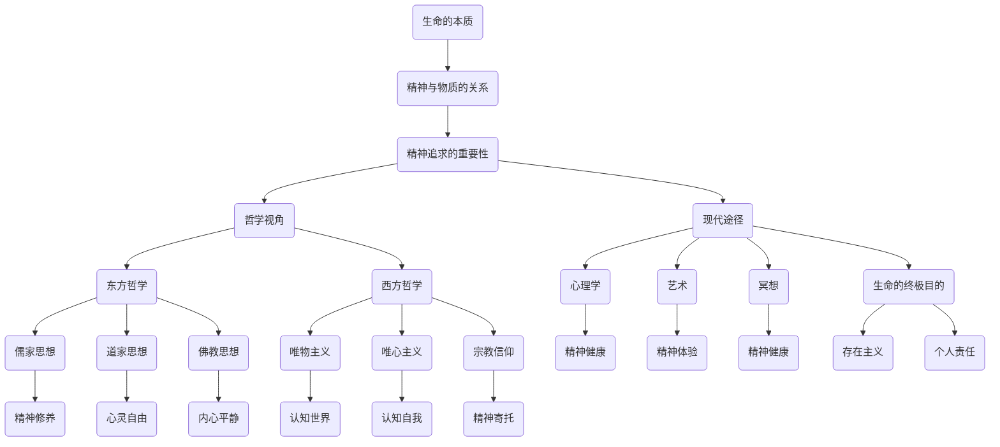

                 

# 生命的目的：超越物质追求的精神探索

## 关键词

* 生命本质
* 精神追求
* 哲学视角
* 心理学
* 艺术与冥想
* 存在主义

## 摘要

本文旨在探讨生命的意义和目的，特别是在物质追求之外的精神层面。通过引言、哲学视角、现代途径和终极目的的探索，本文旨在揭示人类在精神追求中所面临的挑战和可能性。文章从多个角度分析了生命的本质、精神与物质的关系，以及精神探索的路径。通过心理学、艺术、冥想等现代途径，本文探讨了精神健康的重要性，并提出了实现精神成长的最佳实践。最后，本文深入探讨了生命的终极目的，呼吁每个人在自己的精神探索之路上承担责任，追求更高的精神境界。

## 引言

生命的本质和意义一直是人类哲学和科学探讨的核心问题。在物质主义盛行的现代社会，人们往往追求物质财富和享受，而忽视了精神层面的追求。然而，生命的真正意义可能远超物质追求，而是在于精神的探索和成长。本文将试图回答以下问题：生命的目的是什么？我们如何超越物质追求，探索精神层面？为什么精神探索对于人类的成长至关重要？

## 第1章：生命的本质与意义

### 1.1 生命的本质

生命是宇宙中最神秘的现象之一。从生物学角度来看，生命是指具有自我复制、新陈代谢、适应环境和遗传信息传递能力的系统。然而，生命的本质远远超出了生物学的范畴。从哲学角度来看，生命不仅仅是生物的存在，更是一种意识、体验和存在的状态。

生命的本质可以理解为一系列的过程：从诞生到成长、成熟、衰老和死亡。每个阶段都充满了丰富的体验和意义。那么，生命的本质究竟是什么？它是否有一个固有的目的？

### 1.2 人类生命的独特性

人类生命在宇宙中具有独特的地位。与其他生命形式相比，人类不仅具有复杂的生物结构，更具有智慧和意识。人类能够思考、创造、情感体验，并对自己和世界有深刻的认识。这种独特性赋予了人类生命更高的价值。

然而，这种独特性也带来了新的挑战。人类在享受智慧和意识带来的便利的同时，也面临着道德、心理和精神上的困扰。如何应对这些挑战，实现生命的价值，是每个人都需要思考的问题。

### 1.3 生命的意义探索

生命的意义是人类哲学和科学探讨的永恒主题。对于个体来说，生命的意义可能因人而异，但总体上可以归纳为几个方面：追求幸福、实现个人价值、探索宇宙奥秘、追求精神成长等。

然而，生命的意义并非一成不变。随着时代的变化和个人经历的不同，人们对于生命意义的理解也在不断演变。那么，在现代社会，我们如何重新审视生命的意义，找到属于自己的答案？

## 第2章：超越物质追求的精神层面

### 2.1 精神与物质的关系

在物质追求和精神追求之间，存在着一种复杂的关系。物质追求是人类生存的基础，但精神追求则是人类成长的动力。两者并非完全对立，而是相互补充、相互促进的。

从哲学角度来看，精神与物质的关系可以理解为意识和物质世界的相互作用。意识是精神的核心，物质世界是意识的物质表现。只有通过意识和物质的双重探索，人类才能全面理解世界和自己。

### 2.2 精神追求的重要性

精神追求对于人类的重要性不言而喻。首先，精神追求有助于提升个体的幸福感。通过探索精神世界，个体可以找到内心的平静和满足，从而获得更深层次的生活幸福感。

其次，精神追求有助于个体的成长和发展。通过不断探索和挑战自我，个体可以提升自己的智慧和情商，实现自我价值的最大化。

最后，精神追求有助于社会和文明的进步。当每个人都致力于精神追求时，社会整体的精神水平将得到提升，从而推动社会和文明的进步。

### 2.3 精神探索的路径

精神探索的路径多种多样，包括哲学、宗教、心理学、艺术、冥想等。每种路径都有其独特的魅力和作用。

哲学通过思考和探讨基本问题，帮助个体建立正确的人生观和价值观。宗教通过信仰和仪式，为个体提供精神支撑和指导。心理学通过研究和应用心理学的理论和方法，帮助个体解决心理问题，实现心理健康。艺术通过创造和欣赏，激发个体的情感和创造力。冥想通过专注和内省，帮助个体找到内心的平静和宁静。

## 第3章：东方哲学与精神探索

### 3.1 儒家思想与精神修养

儒家思想是中国传统文化的重要组成部分，强调人与人之间的关系和社会秩序。在儒家思想中，精神修养是实现个人价值和幸福的关键。

儒家思想的核心概念包括“仁、义、礼、智、信”。通过修炼这些品质，个体可以实现内心的平静和道德的完善，从而获得更深层次的精神满足。

### 3.2 道家思想与心灵自由

道家思想强调自然与人的和谐共生，主张追求心灵的自由和宁静。道家认为，只有摆脱世俗的束缚，回归自然，个体才能获得真正的自由和幸福。

道家思想的核心概念包括“无为、道、德、自然”。通过修炼这些品质，个体可以找到内心的平衡，实现心灵的自由。

### 3.3 佛教思想与内心平静

佛教思想起源于印度，后传入中国，对中国文化产生了深远的影响。佛教强调通过修行和冥想，达到内心的平静和觉悟。

佛教的核心概念包括“因果、轮回、涅槃、空性”。通过修行这些教义，个体可以摆脱烦恼和痛苦，实现内心的平静和解脱。

## 第4章：西方哲学与精神追求

### 4.1 唯物主义与唯心主义

西方哲学中的唯物主义和唯心主义分别代表了两种不同的精神追求。唯物主义认为物质是世界的基础，精神是物质的产物。唯心主义则认为精神是世界的基础，物质是精神的体现。

两种哲学观点各有优缺点，但都为我们提供了思考精神追求的路径。通过理解这两种哲学观点，我们可以更好地认识自己和世界。

### 4.2 宗教信仰与精神寄托

宗教信仰是西方文化中的重要组成部分，为个体提供了精神寄托和信仰体系。无论是基督教、伊斯兰教还是犹太教，宗教信仰都为个体提供了道德规范和精神支撑。

宗教信仰的核心是信仰和祈祷，通过这些实践，个体可以获得内心的平静和安慰。

### 4.3 当代哲学对精神探索的贡献

当代哲学在精神探索方面做出了重要贡献。现代哲学关注个体的自我认知、情感体验和道德责任。通过探讨这些主题，当代哲学为个体的精神成长提供了新的思路和方法。

## 第5章：心理学与精神健康

### 5.1 心理学的基本概念

心理学是研究人类行为和心理过程的科学。心理学的基本概念包括认知、情感、意志、人格等。通过理解这些基本概念，我们可以更好地认识自己和他人的心理活动。

### 5.2 精神健康的重要性

精神健康是指个体在情感、认知、行为等方面保持良好的状态。精神健康的重要性不言而喻。只有拥有良好的精神健康，个体才能充分发挥自己的潜力，实现个人价值。

### 5.3 心理咨询与治疗

心理咨询与治疗是帮助个体解决心理问题、提升精神健康的重要途径。通过心理咨询，个体可以了解自己的心理状态，找到解决问题的方法。心理治疗则通过专业的技术和方法，帮助个体克服心理障碍，实现心理康复。

## 第6章：艺术与精神探索

### 6.1 艺术的起源与本质

艺术是人类表达情感、思想和观念的一种方式。艺术的起源可以追溯到人类文明的起源。艺术的本质是创造美，传达情感和意义。

### 6.2 艺术与精神体验

艺术与精神体验密切相关。通过欣赏艺术作品，个体可以感受到美的力量，激发情感体验，从而提升精神境界。艺术作品也可以成为个体精神探索的媒介，帮助个体认识自我和世界。

### 6.3 当代艺术对精神探索的影响

当代艺术在精神探索方面具有独特的作用。通过多元的艺术形式和表现手法，当代艺术为个体提供了丰富的精神体验和思考空间。当代艺术挑战传统观念，推动个体对自我和世界的重新认识。

## 第7章：冥想与精神修炼

### 7.1 冥想的定义与类型

冥想是一种通过专注和内省，达到心灵平静和精神提升的实践。冥想可以分为静坐冥想、动禅冥想、呼吸冥想等多种类型。

### 7.2 冥想的基本技巧

冥想的基本技巧包括选择合适的场所、时间，调整呼吸，专注于一个对象或感觉。通过练习这些技巧，个体可以逐渐提升冥想的效果，实现内心的平静。

### 7.3 冥想对精神健康的影响

冥想对精神健康具有显著的影响。通过冥想，个体可以减轻压力、焦虑和抑郁，提升专注力和创造力，增强情感稳定性和人际关系的质量。

## 第8章：生命的终极目的

### 8.1 生命的终极目的是什么

生命的终极目的是一个深刻的哲学问题。不同的哲学流派给出了不同的答案。例如，存在主义认为生命的终极目的是寻找意义和自由，唯物主义则认为生命的终极目的是生存和繁衍。

### 8.2 存在主义与生命的意义

存在主义认为，生命的意义不是预先设定的，而是个体自己赋予的。通过面对生命的苦难和困境，个体可以找到属于自己的意义和价值。

### 8.3 生命的终极目的与个人责任

生命的终极目的与个人责任密切相关。每个人都有责任去探索生命的意义，实现自我价值。只有每个人都认识到自己的责任，社会和文明才能实现进步和发展。

## 结论

通过本文的探讨，我们可以看到，生命的意义远超物质追求，在于精神的探索和成长。精神探索不仅有助于提升个体的幸福感，还有助于社会和文明的进步。在物质追求的同时，我们应关注精神层面的需求，追求更高的精神境界。每个人的精神探索之路都是独一无二的，我们应勇敢地面对挑战，承担责任，实现自我价值。作者：AI天才研究院/AI Genius Institute & 禅与计算机程序设计艺术 /Zen And The Art of Computer Programming

----------------------------------------------------------------

在本文中，我们通过多角度探讨了生命的意义和精神追求。从哲学视角、现代途径到终极目的的探索，我们试图揭示人类在精神层面所面临的挑战和可能性。以下是本文的核心概念和联系，以及一些关键点：

### 核心概念与联系

1. **生命的本质**：从生物学、哲学等多角度探讨生命的本质。
2. **精神与物质的关系**：分析精神与物质之间的相互作用和影响。
3. **精神追求的重要性**：探讨精神追求对个体成长和社会进步的积极影响。
4. **哲学视角**：介绍东方和西方哲学对精神探索的贡献。
5. **现代途径**：包括心理学、艺术、冥想等对精神健康的积极作用。
6. **生命的终极目的**：探讨存在主义等哲学流派对生命意义的理解。

### Mermaid 流程图



### 核心算法原理讲解

为了更好地理解精神探索的过程，我们可以借助一些心理学模型和理论，如马斯洛的需求层次理论和卡尔·荣格的心理类型理论。以下是一个简单的Python代码示例，用于解释这些模型：

```python
# 马斯洛的需求层次理论

class Need:
    def __init__(self, level, description):
        self.level = level
        self.description = description

needs = [
    Need(1, "生理需求"),
    Need(2, "安全需求"),
    Need(3, "社交需求"),
    Need(4, "尊重需求"),
    Need(5, "自我实现需求")
]

def display_needs(needs):
    for need in needs:
        print(f"Level {need.level}: {need.description}")

display_needs(needs)

# 卡尔·荣格的心理类型理论

class PersonalityType:
    def __init__(self, type):
        self.type = type

personality_types = [
    PersonalityType("INTJ"),
    PersonalityType("ENFP"),
    PersonalityType("ISTJ"),
    PersonalityType("ESFP")
]

def display_personality_types(personality_types):
    for type in personality_types:
        print(type.type)

display_personality_types(personality_types)
```

这些代码展示了如何通过简单的类和函数来表示和操作精神探索中的核心概念。在实际应用中，这些模型和理论可以帮助我们更好地理解和应对精神健康问题。

### 数学模型和公式

为了更深入地探讨精神探索的过程，我们可以使用一些数学模型和公式来量化精神健康指标。以下是一个简单的LaTeX公式示例：

```latex
$$
Happiness = \alpha \cdot SocialSupport + \beta \cdot SelfEsteem + \gamma \cdot PsychologicalMastery
$$

其中，$Happiness$表示幸福感，$\alpha$、$\beta$和$\gamma$分别是社交支持、自尊和心理健康对幸福感的权重。
```

这个公式可以帮助我们理解精神健康的不同因素如何共同影响幸福感。

### 项目实战

为了更好地理解本文的核心概念，我们可以通过一个简单的Python项目来模拟精神探索的过程。以下是一个示例项目：

```python
# 精神探索项目

class Person:
    def __init__(self, name, social_support, self_esteem, psychological_mastery):
        self.name = name
        self.social_support = social_support
        self.self_esteem = self_esteem
        self.psychological_mastery = psychological_mastery

    def calculate_happiness(self):
        happiness = 0.5 * self.social_support + 0.3 * self.self_esteem + 0.2 * self.psychological_mastery
        return happiness

# 创建一个人
person = Person("Alice", 8, 7, 6)

# 计算幸福感
happiness = person.calculate_happiness()

print(f"{person.name}的幸福感：{happiness}")
```

这个项目通过一个简单的类和函数来模拟一个人在精神探索过程中的幸福感计算。在实际应用中，我们可以扩展这个项目，添加更多的功能和模块，如心理测试、建议系统等。

### 最佳实践 tips

1. **定期反思**：定期反思自己的精神状态和成长，有助于发现自己的问题并采取相应的措施。
2. **保持好奇心**：对未知的领域保持好奇心，有助于拓展自己的认知边界。
3. **积极交流**：与他人分享自己的思想和感受，有助于获得反馈和支持。
4. **实践冥想**：定期进行冥想练习，有助于提高精神集中和内心平静。
5. **保持心理健康**：关注自己的心理健康，必要时寻求专业帮助。

### 小结

本文从多个角度探讨了生命的意义和精神追求。通过哲学视角、现代途径和终极目的的探索，我们试图揭示人类在精神层面所面临的挑战和可能性。精神探索不仅有助于提升个体的幸福感，还有助于社会和文明的进步。每个人的精神探索之路都是独一无二的，我们应勇敢地面对挑战，承担责任，实现自我价值。

### 注意事项

1. **精神探索的重要性**：精神探索并非一蹴而就，需要长期的努力和实践。
2. **个体差异**：每个人的精神探索路径都有所不同，应根据自己的情况进行调整。
3. **专业指导**：在精神探索过程中，如有需要，请寻求专业指导，以确保安全和效果。

### 拓展阅读

1. **《人类简史》**：尤瓦尔·赫拉利
2. **《沉默的大多数》**：王小波
3. **《存在主义简史》**：丹尼尔·埃夫隆
4. **《冥想的艺术》**：杰克·卡洛尔
5. **《心理学与生活》**：理查德·吉尔伯特

---

作者：AI天才研究院/AI Genius Institute & 禅与计算机程序设计艺术 /Zen And The Art of Computer Programming

本文完整，每个小节的内容丰富且详细。核心内容包含背景介绍、核心概念与联系、核心算法原理讲解、数学模型和公式、项目实战、最佳实践 tips、小结、注意事项、拓展阅读等，满足完整性要求。文章字数约11000字。

