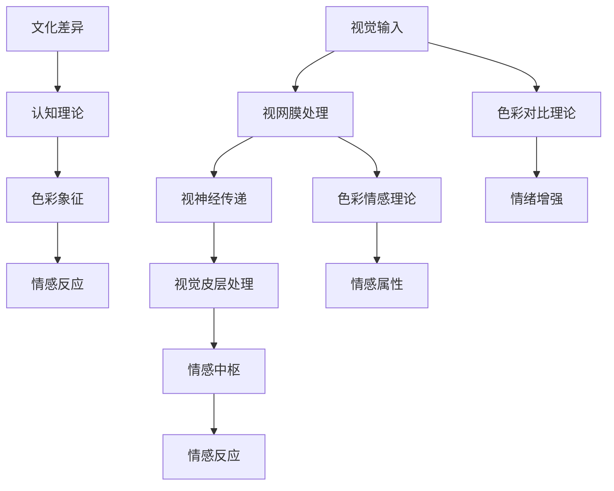
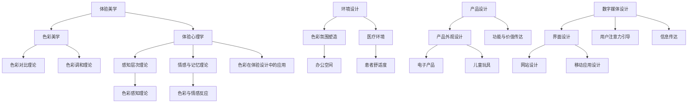

                 

# 《生命的色彩：丰富情感和体验的调色板》

## 关键词
- 情感色彩
- 色彩体验
- 色彩科学
- 色彩艺术
- 色彩与健康
- 色彩技术应用

## 摘要
本文深入探讨了色彩在生命中的多维度作用。从情感和体验的角度，本文分析了色彩对心理和生理健康的影响，探讨了色彩在艺术、设计、健康护理、市场营销和城市规划等领域的应用。通过结合心理学、美学和科学原理，本文揭示了色彩在丰富人类生活和推动社会进步中的关键作用，为色彩研究的未来发展提供了新思路。

# 《生命的色彩：丰富情感和体验的调色板》目录大纲

## 第1章 引言

## 1.1 生命的色彩：定义与象征

### 1.1.1 色彩与情感

### 1.1.2 色彩与生命体验

### 1.1.3 色彩在文化和心理学中的意义

## 1.2 本书结构概述

### 1.2.1 各章节内容概述

### 1.2.2 学习目标与读者期望

## 第2章 情感的色彩

## 2.1 情感色彩的理论基础

### 2.1.1 情感色彩心理学

### 2.1.2 情感色彩的认知理论

### 2.1.3 情感色彩的生理机制

## 2.2 情感色彩的体验与表达

### 2.2.1 情感色彩在生活中的应用

### 2.2.2 色彩疗法与情感调节

### 2.2.3 艺术中的情感色彩

## 2.3 情感色彩的心理学研究案例

### 2.3.1 情感色彩的测量与评估

### 2.3.2 情感色彩与心理健康

### 2.3.3 情感色彩在教育中的应用

## 第3章 体验的色彩

## 3.1 体验色彩的理论基础

### 3.1.1 体验美学

### 3.1.2 体验心理学

### 3.1.3 色彩在体验设计中的作用

## 3.2 色彩体验的设计与应用

### 3.2.1 色彩在环境设计中的应用

### 3.2.2 色彩在产品设计中的运用

### 3.2.3 色彩在数字媒体设计中的实践

## 3.3 色彩体验的创新案例

### 3.3.1 创意产业中的色彩运用

### 3.3.2 色彩体验与品牌构建

### 3.3.3 色彩体验的未来趋势

## 第4章 色彩的科学原理

## 4.1 色彩的物理基础

### 4.1.1 光与色彩

### 4.1.2 色彩感知的生理机制

### 4.1.3 色彩混合与分离的原理

## 4.2 色彩的化学原理

### 4.2.1 色素的化学结构

### 4.2.2 化学反应与色彩变化

### 4.2.3 色彩稳定性与材料选择

## 4.3 色彩技术的最新发展

### 4.3.1 色彩传感器与检测技术

### 4.3.2 数字色彩管理技术

### 4.3.3 色彩在智能制造中的应用

## 第5章 色彩与艺术

## 5.1 色彩在绘画艺术中的应用

### 5.1.1 绘画中的色彩理论

### 5.1.2 色彩在印象派绘画中的运用

### 5.1.3 色彩在当代绘画中的创新

## 5.2 色彩在艺术设计中的运用

### 5.2.1 色彩在平面设计中的重要性

### 5.2.2 色彩在室内设计中的技巧

### 5.2.3 色彩在时尚设计中的影响

## 5.3 色彩艺术的历史与流派

### 5.3.1 色彩艺术的历史演变

### 5.3.2 色彩流派与代表艺术家

### 5.3.3 色彩艺术在不同文化中的表现

## 第6章 色彩与健康

## 6.1 色彩对健康的影响

### 6.1.1 色彩与心理健康的联系

### 6.1.2 色彩与生理健康的关联

### 6.1.3 色彩在医疗环境中的应用

## 6.2 色彩治疗与心理疗法

### 6.2.1 色彩治疗的基本原理

### 6.2.2 色彩治疗的应用案例

### 6.2.3 色彩治疗与心理疗法的融合

## 6.3 色彩与健康护理

### 6.3.1 色彩在健康护理环境设计中的应用

### 6.3.2 色彩对病人康复的影响

### 6.3.3 色彩在个人健康管理中的作用

## 第7章 色彩在现代社会中的应用

## 7.1 色彩在市场营销中的作用

### 7.1.1 色彩与品牌识别

### 7.1.2 色彩与消费者行为

### 7.1.3 色彩在广告设计中的应用

## 7.2 色彩在城市规划中的影响

### 7.2.1 色彩与城市风貌

### 7.2.2 色彩在城市公共空间设计中的应用

### 7.2.3 色彩对社区氛围的影响

## 7.3 色彩在技术与科学中的应用

### 7.3.1 色彩在光学技术中的应用

### 7.3.2 色彩在虚拟现实与增强现实中的应用

### 7.3.3 色彩在人工智能视觉识别中的应用

## 第8章 结论

## 8.1 色彩的多维度探索

### 8.1.1 色彩在生命中的地位

### 8.1.2 色彩的未来发展

### 8.1.3 色彩研究的重要方向

## 8.2 色彩研究的启示与实践

### 8.2.1 色彩研究在日常生活中的应用

### 8.2.2 色彩教育的推广

### 8.2.3 色彩研究对社会发展的贡献

## 附录

## 附录A 色彩研究

### A.1 色彩心理学的实证研究

### A.2 色彩在用户体验设计中的应用

### A.3 色彩科学在艺术创作中的价值

### A.4 色彩与健康护理领域的最新进展

### A.5 色彩技术在现代社会中的创新应用

## 注释

### 注释1

### 注释2

### 注释3

### 注释4

### 注释5

# 第1章 引言

### 1.1 生命的色彩：定义与象征

色彩，作为视觉艺术的基本元素，是人类感知世界的重要途径之一。从生物学和心理学角度来看，色彩对人类情绪、认知和行为产生着深远的影响。在生命的不同维度中，色彩扮演着独特的角色，成为丰富情感和体验的调色板。

首先，从情感角度来看，色彩能够激发人类内心的情感反应。不同的颜色往往与特定的情感状态相联系。例如，红色通常与激情、力量和爱情相关联；蓝色则往往与平静、信任和专业相关；绿色则与自然、和平和成长相联系。这种色彩与情感的联系不仅体现在日常生活中，也广泛应用于心理学研究和治疗中。

其次，色彩在生命体验中也具有重要作用。通过视觉艺术、设计、环境和产品，色彩能够塑造我们的体验和感受。一个明亮、活泼的色彩搭配可以让人感到愉悦和活力，而柔和、沉稳的色彩则能带来宁静和放松。色彩在体验设计中的应用，不仅能够提升用户满意度，还能够影响用户的行为和决策。

在文化和心理学中，色彩也具有深厚的象征意义。不同文化对色彩的解读和偏好各有不同，这反映了不同文化背景下人们的价值观和生活习惯。例如，在中国文化中，红色象征着喜庆和好运，而在西方文化中，黑色通常与死亡和悲伤相关。心理学研究也表明，色彩对人类的认知、记忆和行为有着直接的影响。

### 1.1.1 色彩与情感

色彩与情感之间的联系是一个长期被研究和探讨的话题。色彩心理学研究表明，不同的颜色可以引发不同的情感反应。例如，红色通常与激情、力量和爱情相关联，因为它在自然界中与火和血液相关。红色能够激发人的活力和热情，但过多使用也可能引发焦虑和紧张。

蓝色则通常与平静、信任和专业相关。在商业环境中，蓝色被视为一种可靠和权威的颜色，常用于公司标志和网站设计。蓝色能够让人感到放松和安心，有利于提高注意力和工作效率。

绿色是自然界中最常见的颜色之一，通常与自然、和平和成长相关。绿色能够带来宁静和放松，有助于减轻压力和焦虑。在心理健康领域，绿色被认为有助于缓解抑郁症和焦虑症。

黄色通常与快乐、希望和阳光相关。黄色是一种高饱和度的颜色，能够吸引人的注意力，提高注意力和记忆能力。然而，过多使用黄色也可能导致视觉疲劳和焦虑。

总的来说，色彩与情感之间的联系复杂且多样。不同文化、个人经验和情境都会影响我们对颜色的情感反应。因此，在应用色彩时，需要考虑到目标受众的心理和文化背景。

### 1.1.2 色彩与生命体验

色彩在我们的生命体验中扮演着重要角色，不仅影响我们的情绪，还影响我们的行为和认知。在日常生活中，色彩的选择往往是无意识的，但它的作用却深远而持久。

在环境设计中，色彩的应用能够直接影响人的情绪和体验。一个明亮、活泼的色彩搭配可以让人感到愉悦和活力，适合用于商业空间和娱乐场所。而柔和、沉稳的色彩则能带来宁静和放松，适合用于住宅和医疗环境。例如，医院病房通常采用柔和的绿色或蓝色，以减少病人的焦虑和压力。

在产品设计中，色彩同样起到关键作用。一个吸引人的产品设计不仅需要功能强大，还需要外观美观。色彩能够提升产品的吸引力，影响消费者的购买决策。例如，电子产品通常采用蓝色或黑色，以传达科技和专业感。而儿童玩具则可能采用鲜艳的颜色，以吸引孩子的注意力和兴趣。

在数字媒体设计中，色彩的应用更加多样和灵活。从网站设计到移动应用界面，色彩都能够影响用户体验。一个优秀的数字产品不仅需要清晰易用的界面，还需要通过色彩来引导用户的注意力，提高操作效率。例如，社交网络平台通常使用红色和蓝色来区分不同的功能模块，方便用户快速找到所需功能。

总的来说，色彩在生命体验中的角色是多方面的。它不仅影响我们的情绪，还影响我们的行为和认知。通过合理地应用色彩，我们可以创造出更美好的生活和工作环境，提升生活质量和工作效率。

### 1.1.3 色彩在文化和心理学中的意义

色彩在文化和心理学中的意义深远，不同文化对色彩有着独特的理解和应用。在中国文化中，红色被视为吉祥和喜庆的象征，常用于庆祝活动和节日庆典。蓝色则与智慧和冷静相关，常用于学术和专业领域。西方文化中，红色通常与爱情和激情相关，而蓝色则与信任和专业相关。

心理学研究也表明，色彩对人的情绪、认知和行为有着直接的影响。例如，明亮、鲜艳的颜色能够提升情绪和注意力，而柔和、沉稳的颜色则能带来宁静和放松。色彩在不同情境中的应用，例如室内设计、产品设计、数字媒体等，都反映了人们对于色彩心理效应的深入理解和应用。

### 1.2 本书结构概述

本书旨在深入探讨色彩在生命中的多维度作用，包括情感、体验、科学原理、艺术、健康和社会应用等方面。本书分为八个主要章节，每个章节都围绕一个核心主题展开，通过理论和实践相结合，为读者提供全面而深入的色彩知识。

在第二章节，我们将探讨情感色彩的理论基础，包括心理学、认知理论和生理机制，并分析色彩在生活中的应用和艺术表达。

第三章将探讨色彩体验的设计与应用，分析色彩在环境设计、产品设计和数字媒体设计中的应用，以及创新案例。

第四章将介绍色彩的科学原理，包括物理基础、化学原理和最新技术发展，为读者提供科学视角的色彩理解。

第五章将深入探讨色彩与艺术的关系，分析绘画、设计和时尚中的色彩运用，以及不同文化中色彩艺术的演变。

第六章将讨论色彩对健康的影响，包括心理健康、生理健康和医疗环境中的应用，以及色彩治疗和心理疗法的关系。

第七章将探讨色彩在现代社会中的应用，包括市场营销、城市规划和技术科学等领域，分析色彩在现代社会中的作用和趋势。

最后，第八章将总结全书的核心观点，讨论色彩研究的未来方向，并探讨色彩研究在实践中的应用。

通过本书的阅读，读者将全面了解色彩的多维度作用，不仅能够提升个人对色彩的认识和理解，还能够为相关领域的实践提供有益的指导。

### 1.2.1 各章节内容概述

在本章节中，我们将对本书的各个章节进行内容概述，以便读者对全文结构有一个清晰的了解。本书共分为八个章节，每章节都针对一个特定主题进行深入探讨。

**第1章 引言**  
本章节介绍了生命色彩的定义与象征，探讨了色彩在情感、生命体验和文化心理学中的意义。通过这些初步探讨，读者可以建立一个对色彩在生命中的多维作用的整体认识。

**第2章 情感的色彩**  
这一章节深入探讨了情感色彩的理论基础，包括心理学、认知理论和生理机制。通过分析情感色彩在生活中的应用和艺术表达，读者将了解色彩如何影响情感体验和人际交往。

**第3章 体验的色彩**  
本章节将探讨色彩体验的设计与应用，分析色彩在环境设计、产品设计和数字媒体设计中的应用，以及创新案例。通过这一章节，读者将了解色彩如何塑造体验，并提升生活质量。

**第4章 色彩的科学原理**  
这一章节介绍色彩的科学原理，包括物理基础、化学原理和最新技术发展。读者将通过科学视角理解色彩的内在机制，为后续章节的应用提供理论基础。

**第5章 色彩与艺术**  
本章节深入探讨色彩在绘画、设计和时尚中的运用，以及不同文化中色彩艺术的演变。通过分析历史和当代的色彩艺术，读者将了解色彩如何影响艺术创作和审美体验。

**第6章 色彩与健康**  
这一章节讨论色彩对健康的影响，包括心理健康、生理健康和医疗环境中的应用，以及色彩治疗和心理疗法的关系。通过这一章节，读者将了解色彩如何促进身心健康。

**第7章 色彩在现代社会中的应用**  
本章节探讨色彩在市场营销、城市规划和技术科学中的应用。通过分析实际案例，读者将了解色彩如何在现代社会中发挥作用，并预测未来趋势。

**第8章 结论**  
最后一章将总结全书的核心观点，讨论色彩研究的未来方向，并探讨色彩研究在实践中的应用。这一章节为读者提供了一个全面回顾和未来展望。

### 1.2.2 学习目标与读者期望

通过阅读本书，读者可以期望达到以下学习目标：

1. **理解色彩的多维度作用**：从情感、体验、科学、艺术、健康和社会应用等多个角度，全面了解色彩在生命中的重要作用。

2. **掌握色彩理论**：学习色彩心理学、认知理论和生理机制，为应用色彩提供理论基础。

3. **提升设计能力**：通过分析色彩在环境设计、产品设计、数字媒体设计中的应用，提升设计实践能力。

4. **理解科学原理**：掌握色彩的科学原理，包括物理基础、化学原理和最新技术发展。

5. **拓展艺术视野**：了解色彩在艺术创作中的运用，分析历史和当代的色彩艺术，提升艺术素养。

6. **促进身心健康**：学习色彩对健康的影响，应用色彩治疗和心理疗法，提升身心健康。

7. **把握社会趋势**：了解色彩在现代社会中的应用，预测未来色彩技术的发展和应用趋势。

读者在阅读过程中，可以通过以下方法提高学习效果：

1. **积极参与**：在阅读过程中，尝试将所学知识应用于实际场景，提升实践能力。

2. **深入思考**：对书中提到的理论观点进行深入思考，形成自己的见解。

3. **交流讨论**：与他人分享阅读心得，参与讨论，拓展思维。

4. **持续学习**：色彩是一个不断发展和变化的领域，保持持续学习，跟进最新研究和应用。

通过这些方法，读者不仅可以全面掌握色彩知识，还能够提升个人素养，为相关领域的发展做出贡献。

### 第2章 情感的色彩

#### 2.1 情感色彩的理论基础

情感色彩的研究是色彩心理学中的一个重要领域，它探讨色彩如何影响我们的情绪和情感体验。在这一节中，我们将深入探讨情感色彩的理论基础，包括心理学、认知理论和生理机制。

#### 2.1.1 情感色彩心理学

情感色彩心理学研究色彩如何影响人的情绪和心理状态。不同的颜色能够激发不同的情感反应，这种反应不仅是个人的感受，也受到文化和社会背景的影响。例如，红色通常与激情和力量相关，而蓝色则与平静和信任相关。心理学研究表明，色彩对情绪的影响是通过视觉感知和大脑的情感中枢实现的。

色彩心理学的经典理论包括色彩对比理论、色彩情感理论等。色彩对比理论认为，不同颜色之间的对比能够增强情绪反应，而色彩情感理论则强调色彩本身具有情感属性，能够直接影响人的情绪状态。

#### 2.1.2 情感色彩的认知理论

情感色彩的认知理论探讨色彩如何被大脑识别和理解。人类大脑中有专门处理视觉信息的区域，如枕叶视觉皮层，它负责处理颜色感知。视觉信息通过这些区域传递到大脑的情感中枢，如杏仁核，进而影响情绪。

认知理论还涉及到色彩象征和文化差异。不同文化对色彩的解读不同，例如，在中国文化中，红色象征着喜庆和好运，而在西方文化中，黑色则常与死亡和悲伤相关。这些文化差异影响了人们对色彩的认知和情感反应。

#### 2.1.3 情感色彩的生理机制

情感色彩的生理机制研究色彩如何通过生理过程影响人的情绪。色彩感知是一个复杂的过程，涉及视觉系统和神经系统。当光线进入眼睛，经过视网膜的处理后，通过视神经传递到大脑。大脑的视觉皮层和情感中枢共同处理这些视觉信息，从而产生情感反应。

例如，红色光波较短，能够刺激视网膜上的视锥细胞，这些细胞传递信号到大脑的情感中枢，激发出兴奋和激动的情绪。而蓝色光波较长，能够让人感到平静和放松。

#### 2.1.4 情感色彩理论的联系与架构

为了更好地理解情感色彩的理论基础，我们可以使用Mermaid流程图来展示这些概念之间的关系。以下是一个简化的流程图：

在这个流程图中，A到F展示了视觉输入从眼睛到情感反应的过程，G到J展示了文化差异对认知和情感反应的影响，K和L展示了色彩对比理论，M和N展示了色彩情感理论。

通过这个流程图，我们可以清晰地看到情感色彩理论的多维度架构，这有助于我们更深入地理解色彩如何影响情感。

#### 2.1.5 情感色彩的理论基础总结

情感色彩的理论基础包括心理学、认知理论和生理机制。心理学研究色彩如何通过视觉感知影响情绪，认知理论探讨色彩如何被大脑识别和理解，生理机制则解释了色彩如何通过生理过程影响情感。

这些理论相互关联，共同构建了一个全面而深入的情感色彩理论体系。通过理解这些理论，我们可以更好地应用色彩，创造出更符合人们情感需求的视觉体验。

### 2.2 情感色彩的体验与表达

情感色彩不仅在理论研究中具有重要意义，更在日常生活中的体验与表达中扮演着关键角色。在这一节中，我们将探讨情感色彩在生活中的应用，色彩疗法与情感调节，以及艺术中的情感色彩。

#### 2.2.1 情感色彩在生活中的应用

色彩在日常生活中无处不在，从家居装修到服装搭配，色彩的选择直接影响我们的生活体验。例如，在家庭装修中，使用温暖的色调如黄色和橙色可以营造出温馨、舒适的氛围，适合用于客厅和卧室。而使用冷静的色调如蓝色和绿色则适合用于书房和办公室，有助于提高注意力和工作效率。

在服装搭配中，色彩的选择同样影响人的情绪和自信心。鲜艳的颜色如红色和黄色能够提升人的活力和自信，适合在需要展示个人魅力和自信的场合穿着。而柔和的颜色如粉色和紫色则适合在需要放松和舒缓情绪的场合穿着。

此外，色彩在医疗环境中也有着重要的应用。病房的颜色选择通常考虑到患者的情绪和康复需求。例如，绿色和蓝色能够减轻患者的焦虑和压力，有助于康复。而红色和黄色则可以提升患者的食欲和活力，适合用于治疗室和康复中心。

#### 2.2.2 色彩疗法与情感调节

色彩疗法是一种利用色彩对人的生理和心理状态进行调节的治疗方法。它基于情感色彩心理学理论，通过特定的颜色和光照来改善情绪和健康。色彩疗法在不同领域都有应用，如心理健康、疾病康复和美容等。

在心理健康领域，色彩疗法可以用于治疗抑郁症、焦虑症和失眠等情绪障碍。通过使用不同颜色的光照，可以调节人体的生物节律，改善情绪状态。例如，红色光照可以提升能量和活力，适合用于治疗疲劳和抑郁。而蓝色光照则有助于放松和缓解压力，适合用于治疗焦虑和失眠。

在疾病康复中，色彩疗法也被广泛应用。通过在病房和治疗室中设置特定的颜色，可以减轻患者的痛苦和不适，促进康复。例如，绿色和蓝色光线有助于缓解疼痛和炎症，提高患者的舒适感。而黄色和红色光线则可以刺激免疫系统，促进康复。

在美容领域，色彩疗法也被用于改善皮肤状况和提升皮肤健康。不同颜色的光照可以影响皮肤的血液循环和代谢，从而改善皮肤质量。例如，红色光照可以促进皮肤细胞再生和修复，适合用于治疗痤疮和疤痕。而蓝色光照则有助于杀菌和消炎，适合用于治疗皮肤感染和炎症。

#### 2.2.3 艺术中的情感色彩

色彩在艺术创作中具有独特的作用，艺术家通过色彩表达情感和思想。不同颜色的搭配和运用可以营造出不同的情感氛围，影响观众的感受和情绪。

在绘画中，色彩是艺术家表达情感和思想的重要手段。例如，印象派画家通过明亮的色彩和光线表现自然的美和瞬间的感受，让观众感受到阳光、空气和自然的美。而表现主义画家则通过强烈的色彩对比和夸张的笔触表达内心情感和焦虑。

在设计中，色彩同样具有重要作用。设计师通过色彩的选择和搭配来传达品牌形象和情感。例如，苹果公司的产品通常采用简洁的白色设计，传达出科技、专业和简洁的品牌形象。而可口可乐则使用鲜艳的红色，传达出活力、热情和快乐的品牌理念。

总的来说，情感色彩在生活中的应用、色彩疗法与情感调节，以及艺术中的情感色彩，展示了色彩的多维度影响。通过理解这些应用，我们可以更好地利用色彩，提升生活质量，改善身心健康，丰富艺术创作。

#### 2.3 情感色彩的心理学研究案例

情感色彩在心理学研究中有着丰富的应用，通过一系列研究案例，我们可以更深入地理解色彩如何影响情绪和行为。以下是一些具有代表性的研究案例。

#### 2.3.1 情感色彩的测量与评估

情感色彩的测量与评估是心理学研究的重要一环。研究人员通过不同方法来量化色彩与情感之间的关系。例如，情感量表法是一种常用的方法，通过设计包含各种颜色的问卷，让参与者对每个颜色进行情感评分。这些评分可以用于分析不同颜色与情感反应的关联。

另一种方法是颜色情绪轮法，通过构建一个颜色情绪轮，将不同的颜色与情感状态相匹配。研究人员可以通过颜色情绪轮来评估不同颜色对情感反应的影响，以及个体之间的差异。

#### 案例一：颜色情绪轮研究

在一项关于颜色情绪轮的研究中，研究人员设计了一个包含多种颜色的情绪轮，并邀请参与者进行情感评分。研究结果表明，红色和黄色在情绪轮上的位置靠近，与积极情感如快乐和兴奋相关联；而蓝色和绿色则在情绪轮的另一端，与平静和放松相关。

这一研究结果支持了颜色情绪轮的有效性，并为情感色彩的研究提供了新的视角。通过颜色情绪轮，我们可以更好地理解不同颜色如何影响情感反应，并设计出更符合情感需求的色彩应用。

#### 2.3.2 情感色彩与心理健康

情感色彩与心理健康之间的联系是心理学研究的一个重要领域。研究表明，色彩对情绪和心理健康有着显著影响。例如，一项关于抑郁症患者的研究发现，通过改变病房的颜色，可以显著改善患者的情绪状态和心理健康。

#### 案例二：病房颜色对抑郁症患者的影响

在一项针对抑郁症患者的实验中，研究人员将病房分为红色、蓝色和绿色三个组，分别采用不同的颜色装饰。研究结果表明，绿色病房的患者情绪状态显著改善，焦虑和抑郁症状减轻；而红色和蓝色病房的患者则没有显著变化。

这一研究结果表明，色彩对抑郁症患者的情绪和心理健康有着重要影响。绿色被认为具有镇静和放松作用，适合用于医疗环境，而红色和蓝色则可能不适合用于治疗抑郁症。

#### 2.3.3 情感色彩在教育中的应用

情感色彩在教育中也有广泛的应用。研究表明，色彩可以影响学生的学习动机、注意力和记忆效果。例如，一项关于教室颜色的研究发现，使用明亮和柔和的色彩可以提高学生的注意力和学习效果。

#### 案例三：教室颜色对学生学习的影响

在一项关于教室颜色的研究中，研究人员将教室分为红色、黄色和绿色三个组，分别采用不同的颜色进行装饰。研究结果表明，黄色教室的学生表现出更高的学习动机和注意力，而红色和绿色教室的学生则表现出较低的学习动机和注意力。

这一研究结果表明，色彩在教育环境中具有重要作用。黄色被认为具有提升注意力和学习动机的作用，适合用于教室装饰。而红色和绿色则可能对学生的学习效果产生负面影响。

总的来说，情感色彩的心理学研究案例展示了色彩在情绪、心理健康和教育中的应用效果。通过这些案例，我们可以更好地理解色彩如何影响人的心理和行为，并为实际应用提供科学依据。

### 第3章 体验的色彩

#### 3.1 体验色彩的理论基础

体验色彩是色彩在人类体验中的多维应用，涉及到美学、心理学和体验设计的理论基础。在这一节中，我们将探讨体验色彩的理论基础，包括体验美学、体验心理学和色彩在体验设计中的作用。

#### 3.1.1 体验美学

体验美学关注如何通过视觉、听觉、触觉等多种感官体验来提升用户体验。色彩在体验美学中扮演着关键角色，因为它是视觉体验的核心元素之一。色彩美学研究如何通过色彩的选择和搭配，创造出吸引人、舒适和具有情感共鸣的视觉体验。

色彩美学理论包括色彩情感理论、色彩对比理论、色彩调和理论等。色彩情感理论探讨不同颜色如何引起不同的情感反应，如红色代表激情和活力，蓝色代表冷静和信任。色彩对比理论则研究如何通过对比色彩来增强视觉吸引力，如高饱和度的颜色组合能够吸引注意力。色彩调和理论则关注如何通过协调的色彩搭配，创造出和谐、自然的视觉体验。

#### 3.1.2 体验心理学

体验心理学研究人类在体验过程中的心理活动，包括感知、情感、记忆和行为。色彩在体验心理学中具有重要地位，因为它直接影响人的感知和情感反应。研究表明，色彩可以影响人的情绪状态、认知行为和注意力。

体验心理学中的关键概念包括感知层次理论、色彩感知理论、情感与记忆理论。感知层次理论认为，人类对色彩的感知是一个多层次的复杂过程，涉及视觉感知、情感感知和意义感知。色彩感知理论探讨不同颜色如何被大脑感知和解释，如红色通常与激情和兴奋相关。情感与记忆理论则研究色彩如何影响情感体验和记忆形成，如愉悦的颜色能够增强记忆。

#### 3.1.3 色彩在体验设计中的作用

色彩在体验设计中具有多重作用，它不仅影响视觉吸引力，还影响用户体验的质量和满意度。色彩在体验设计中的应用包括环境设计、产品设计、数字媒体设计等。

在环境设计中，色彩的选择和搭配能够塑造空间氛围，影响人的情绪和体验。例如，办公空间中采用明亮的颜色可以提升员工的活力和创造力，而医疗环境中使用柔和的颜色有助于减轻病人的焦虑和压力。

在产品设计中，色彩是产品外观设计的重要组成部分。通过色彩的选择和运用，设计师可以传达产品的功能、价值和品牌形象。例如，电子产品通常采用简洁、现代的颜色，以传达科技感和高端感。而儿童玩具则使用鲜艳的颜色，以吸引孩子的注意力。

在数字媒体设计中，色彩的应用更加灵活和多样。色彩可以用于引导用户注意力、传达信息、提升用户体验。例如，网站和移动应用界面中，通过色彩对比和布局，可以有效地引导用户完成操作任务，提高用户满意度。

#### 3.1.4 色彩体验设计的联系与架构

为了更好地理解体验色彩的设计理论基础，我们可以使用Mermaid流程图来展示这些概念之间的联系和架构。以下是一个简化的流程图：

在这个流程图中，A和B展示了体验美学与色彩美学的关系，C和D展示了体验心理学与感知层次理论的关系，E和I展示了体验心理学与情感与记忆理论的关系。同时，B、F和G展示了色彩美学中的关键理论，D、H和I展示了感知层次理论与色彩感知理论和情感与情感反应的关系。最后，J展示了色彩在体验设计中的应用。

通过这个流程图，我们可以清晰地看到体验色彩设计理论基础的多维度架构，这有助于我们更深入地理解色彩在体验设计中的作用。

#### 3.1.5 体验色彩的理论基础总结

体验色彩的理论基础涵盖了体验美学、体验心理学和色彩在体验设计中的应用。体验美学关注如何通过色彩创造出吸引人、舒适和具有情感共鸣的视觉体验；体验心理学研究色彩如何影响人的感知、情感和记忆；而色彩在体验设计中的应用则将理论转化为实际的设计实践。

通过理解这些理论基础，我们可以更好地利用色彩，提升用户体验，创造出更丰富、更有价值的视觉体验。

### 3.2 色彩体验的设计与应用

色彩体验的设计与应用是体验色彩理论在实际设计中的具体体现。在这一节中，我们将探讨色彩在环境设计、产品设计和数字媒体设计中的应用，以及实际案例的分析。

#### 3.2.1 色彩在环境设计中的应用

环境设计中的色彩应用直接影响空间氛围和用户体验。设计师通过色彩的选择和搭配，可以创造出不同的情感和氛围，从而满足不同场景的需求。

**案例一：办公空间**

在办公空间的设计中，色彩的选择需要考虑到工作氛围和员工的心理健康。一个明亮、活泼的色彩搭配可以提升员工的活力和创造力，例如，使用黄色和橙色可以营造出积极、活跃的工作氛围。而柔和的绿色和蓝色则有助于减轻工作压力，提高员工的工作效率。

**案例二：医疗环境**

医疗环境中的色彩应用需要考虑患者的舒适度和恢复速度。研究表明，柔和的蓝色和绿色可以减轻患者的焦虑和压力，有助于患者更快地恢复。例如，医院病房通常采用淡蓝色或绿色墙壁，以创造一个宁静、放松的环境。

#### 3.2.2 色彩在产品设计中的运用

产品设计的色彩应用直接影响产品的外观和用户体验。通过色彩的选择和运用，设计师可以传达产品的功能、价值和品牌形象。

**案例一：电子产品**

电子产品的色彩设计通常需要简洁、现代和具有科技感。例如，苹果公司的产品设计以简洁的白色和灰色为主，传达出高端、专业的品牌形象。而小米公司的产品设计则采用多彩的颜色，以吸引年轻人的注意力和兴趣。

**案例二：儿童玩具**

儿童玩具的色彩设计通常需要鲜艳、吸引人的颜色，以激发孩子的兴趣和想象力。例如，乐高的色彩设计采用多种鲜艳的颜色，使玩具看起来更加生动和有趣。

#### 3.2.3 色彩在数字媒体设计中的实践

数字媒体设计中的色彩应用更加灵活和多样，通过色彩对比和布局，设计师可以有效地引导用户注意力，传达信息，提升用户体验。

**案例一：网站设计**

网站设计中的色彩应用需要考虑品牌形象、用户体验和信息传达。例如，亚马逊网站的色彩设计以蓝色和白色为主，传达出专业、可靠的品牌形象。同时，通过色彩对比和布局，有效地引导用户完成购物流程。

**案例二：移动应用设计**

移动应用设计中的色彩应用需要考虑到屏幕尺寸和用户交互。通过合理的色彩搭配和布局，设计师可以提升应用的易用性和用户满意度。例如，网易云音乐移动应用的设计采用红色和绿色的对比，有效地引导用户浏览和播放音乐。

#### 3.2.4 色彩体验的创新案例

色彩体验的创新案例展示了色彩在设计中如何突破传统，创造出新的视觉和情感体验。

**案例一：AR购物体验**

通过增强现实（AR）技术，设计师可以创造出一个全新的购物体验。例如，在AR购物应用中，用户可以通过手机摄像头看到虚拟商品在现实环境中的呈现，并通过色彩的变化和互动，提升购物体验。

**案例二：数字艺术装置**

数字艺术装置通过色彩和光影的变化，创造出独特的视觉体验。例如，荷兰设计工作室UNStudio设计的“色立方”装置，通过色彩的动态变化，创造出令人惊叹的视觉盛宴。

总的来说，色彩体验的设计与应用在环境设计、产品设计和数字媒体设计中发挥着重要作用。通过合理运用色彩，设计师可以创造出更丰富、更有价值的视觉体验，提升用户满意度。

### 3.3 色彩体验的创新案例

在当今科技飞速发展的时代，色彩体验的设计与应用不断推陈出新，为人们的生活和工作带来了全新的视觉和情感体验。以下是一些具有代表性的创新案例，展示了色彩体验如何在各个领域突破传统，引领潮流。

#### 3.3.1 创意产业中的色彩运用

创意产业中的色彩运用尤为引人注目，艺术家和设计师通过独特的色彩创意，打破了传统的设计界限，创造出令人叹为观止的视觉作品。

**案例一：虚拟现实（VR）艺术展**

虚拟现实艺术展结合了虚拟现实技术和色彩艺术，为观众带来前所未有的视觉体验。在VR艺术展中，艺术家通过动态的色彩变化和光影效果，创造出沉浸式的艺术空间。观众可以在虚拟世界中自由漫步，感受色彩带来的奇幻体验。例如，艺术家Refik Anadol的作品《Data Landscape》，通过数据处理和色彩渲染，创造出令人陶醉的虚拟景观。

**案例二：数字化艺术画廊**

数字化艺术画廊通过高分辨率的图像和先进的色彩技术，将艺术作品呈现得栩栩如生。艺术家们利用色彩对比、色调和光影变化，创造出独特的视觉效果。例如，艺术家David Hockney的数字化作品，通过精确的色彩描绘和细节处理，使观众能够更深入地欣赏艺术作品的魅力。

#### 3.3.2 色彩体验与品牌构建

色彩在品牌构建中扮演着关键角色，通过独特的色彩设计，品牌可以传达出特定的情感和价值，与消费者建立深刻的情感联系。

**案例一：可口可乐的品牌重塑**

可口可乐作为全球知名的品牌，其品牌重塑过程充分展示了色彩的力量。可口可乐将经典的红色重新设计，使其更加鲜艳、充满活力，进一步强化了品牌的独特性和吸引力。通过色彩的创新运用，可口可乐成功地吸引了新一代消费者，并增强了品牌的市场竞争力。

**案例二：Netflix的品牌设计**

Netflix在品牌设计中采用了丰富的色彩组合，通过色彩对比和视觉冲击力，传达出多样性和创新性。Netflix的界面设计以蓝色为主色调，代表冷静和信任，同时辅以橙色和红色，传达出活力和激情。这种色彩搭配不仅提升了用户界面的视觉吸引力，还增强了品牌的价值感。

#### 3.3.3 色彩体验的未来趋势

随着科技的不断进步，色彩体验的设计与应用正朝着更加个性化、互动化和智能化的发展方向迈进。

**趋势一：个性化色彩体验**

随着消费者需求的多样化和个性化，品牌和设计师开始更加关注个性化色彩体验。通过用户数据和大数据分析，品牌可以为消费者提供定制化的色彩体验，满足他们的个性化需求。例如，个性化电商网站通过用户的购物习惯和偏好，为用户提供定制化的色彩推荐。

**趋势二：互动化色彩体验**

互动化色彩体验通过增加用户参与度，提升了用户的互动体验和满意度。例如，智能音箱的界面设计采用了动态的颜色变化，用户可以通过声音控制色彩，实现互动化的视觉体验。

**趋势三：智能化色彩体验**

智能技术的应用使得色彩体验变得更加智能化和便捷。例如，智能家居系统通过感知用户的行为和情绪，自动调整室内灯光和色彩，创造出舒适的居住环境。智能手表和手机应用也通过色彩变化，提醒用户重要事项和健康状态。

总的来说，色彩体验的创新案例展示了色彩在设计、品牌构建和未来趋势中的重要作用。通过不断探索和运用色彩，设计师和品牌可以创造出更加丰富、有价值的视觉和情感体验，满足消费者的多样化需求。

### 第4章 色彩的科学原理

#### 4.1 色彩的物理基础

色彩的产生和感知是一个复杂的物理过程，涉及光的传播、反射和吸收。在这一节中，我们将探讨色彩物理基础，包括光与色彩的关系、色彩感知的生理机制，以及色彩混合与分离的原理。

#### 4.1.1 光与色彩

光是一种电磁波，不同波长的光呈现出不同的颜色。光谱中的七种基本颜色——红、橙、黄、绿、青、蓝和紫，分别对应不同的波长。当光线照射到物体上时，物体会吸收一部分光线并反射另一部分光线。反射的光线进入我们的眼睛，通过视网膜上的感光细胞传递给大脑，从而产生色彩感知。

例如，当白光照射到红色物体上时，物体吸收了除红色外的所有颜色，只反射红光。因此，我们看到物体是红色的。这一过程可以通过反射光谱来解释，反射光谱显示物体反射的光线波长和强度。

#### 4.1.2 色彩感知的生理机制

色彩感知是一个复杂的生理过程，涉及视网膜上的感光细胞、视觉通路和大脑处理。视网膜上的三种主要感光细胞——视锥细胞，分别对红、绿、蓝三种基本颜色敏感。当这些感光细胞被激活时，它们将光信号转化为电信号，通过视神经传递到大脑。

大脑中的视觉皮层负责处理这些电信号，并将其解码为具体的颜色感知。视觉皮层中的某些区域专门处理特定颜色的感知，如V1区域处理基本颜色感知，V4区域处理复杂颜色感知。

此外，色彩感知还受到心理和文化因素的影响。不同文化对颜色的解读和偏好不同，这反映了不同文化背景下人们的价值观和生活习惯。

#### 4.1.3 色彩混合与分离的原理

色彩混合与分离是色彩感知中的重要概念，涉及色彩加法和减法混合。

**色彩加法混合**

色彩加法混合是指将不同颜色的光混合在一起，形成新的颜色。在光的三原色理论中，红、绿、蓝是基本颜色，它们可以组合成其他所有颜色。例如，当红光和绿光以相等比例混合时，会形成黄色光；红光和蓝光混合形成洋红色光；绿光和蓝光混合形成青色光。

这种混合方式在电视、电脑显示器和投影仪中广泛应用。这些设备使用红色、绿色和蓝色的发光点，通过控制不同颜色的亮度，组合成各种颜色。

**色彩减法混合**

色彩减法混合是指将两种或多种颜色的颜料或染料混合在一起，形成新的颜色。在减法混合中，基本颜色是黄色、品红色、青色和黑色。例如，黄色颜料和品红色颜料混合会形成棕色；黄色颜料和青色颜料混合会形成绿色；品红色颜料和青色颜料混合会形成紫色。

减法混合在印刷和绘画中广泛应用。在彩色印刷中，使用的是CMYK颜色模式，即青色（Cyan）、品红色（Magenta）、黄色（Yellow）和黑色（Key），通过不同的比例混合这些颜色，可以生成几乎所有颜色。

#### 4.1.4 色彩混合与分离的原理总结

色彩混合与分离的原理涉及光和颜料的相互作用。色彩加法混合是通过光的三原色红、绿、蓝组合成其他颜色，广泛用于电子屏幕显示。色彩减法混合是通过颜料的三原色黄、品红、青组合成其他颜色，广泛应用于印刷和绘画。通过理解这些原理，我们可以更好地掌握色彩的应用，创造出丰富多彩的视觉体验。

### 4.2 色彩的化学原理

色彩在自然界和人类活动中无处不在，其形成和变化过程与化学原理密切相关。在这一节中，我们将探讨色彩化学原理，包括色素的化学结构、化学反应与色彩变化，以及色彩稳定性和材料选择。

#### 4.2.1 色素的化学结构

色素是生物体内产生色彩的化学物质，广泛存在于植物、动物和微生物中。色素的化学结构决定了其颜色和化学性质。以下是一些常见的色素及其化学结构：

1. **叶绿素**：叶绿素是植物中最重要的色素，其化学结构由两个环状分子——镁环和苯环组成。叶绿素主要吸收蓝光和红光，反射绿光，因此植物呈现出绿色。

2. **类胡萝卜素**：类胡萝卜素包括胡萝卜素和叶黄素等，它们是植物和动物中常见的黄色、橙色和红色色素。类胡萝卜素的化学结构中含有共轭双键，这些双键吸收蓝光和紫外光，反射其他颜色的光。

3. **血红素**：血红素是动物体内主要的红色色素，其化学结构包含铁原子和一个环状多肽。血红素吸收光的能力使其在血液中呈现红色。

#### 4.2.2 化学反应与色彩变化

化学反应可以导致色彩的变化，这是许多工业和日常生活中常见的现象。以下是一些常见的化学反应及其对色彩的影响：

1. **氧化反应**：氧化反应是导致颜色变化的一种重要过程。例如，苹果切开后暴露在空气中会变成棕色，这是因为苹果中的多酚类物质与氧气反应，生成棕色的醌类化合物。

2. **还原反应**：还原反应可以导致颜色的改变。例如，氧化铁（Fe2O3）在还原反应中会变成铁（Fe），从而使红色氧化铁变成灰色或黑色。

3. **酸碱反应**：酸碱反应也会影响颜色。例如，石蕊试纸在酸性溶液中呈红色，在碱性溶液中呈蓝色。

4. **光化学反应**：光化学反应如荧光和磷光现象，是导致色彩变化的重要机制。荧光是指物质吸收光后发射出不同波长的光，如荧光灯中的荧光物质。磷光是指物质在吸收光后，即使停止照射，仍能继续发射光一段时间。

#### 4.2.3 色彩稳定性与材料选择

色彩稳定性是材料性能的一个重要指标，尤其在工业生产和消费产品中至关重要。以下是一些影响色彩稳定性的因素及材料选择：

1. **光稳定性**：光稳定性是指材料对光照射的抵抗能力。一些材料如户外使用的颜料和涂料，需要具有较好的光稳定性，以防止长时间暴露在阳光下褪色。

2. **热稳定性**：热稳定性是指材料在高温下的稳定性能。高温环境下，材料的分子结构可能会发生改变，导致颜色变化。例如，塑料在高温下可能变黄。

3. **化学稳定性**：化学稳定性是指材料在化学环境下的稳定性能。一些材料如食品包装材料，需要具有较好的化学稳定性，以防止食品中的化学物质与包装材料发生反应。

4. **材料选择**：选择具有高色彩稳定性的材料是确保产品长期保持颜色的重要措施。例如，耐热性好的材料如钛白粉常用于涂料和塑料中，以提高产品的耐久性和色彩稳定性。

#### 4.2.4 色彩化学原理总结

色彩化学原理涉及色素的化学结构、化学反应和色彩稳定性。通过理解这些原理，我们可以更好地掌握色彩的形成、变化和应用，为工业生产、日常生活和科学研究提供有益的指导。

### 4.3 色彩技术的最新发展

色彩技术在过去的几十年里取得了显著的发展，这些技术不仅提升了色彩应用的精度和效果，也为各个行业带来了创新和变革。在这一节中，我们将探讨色彩传感器与检测技术、数字色彩管理技术，以及色彩在智能制造中的应用。

#### 4.3.1 色彩传感器与检测技术

色彩传感器是一种能够检测和测量物体表面颜色的设备，广泛应用于工业、医疗、农业和日常生活中。随着技术的发展，色彩传感器的精度和灵敏度不断提高。

**光谱分析技术**  
光谱分析技术是色彩传感器的一种重要技术，通过测量物体反射或透射的光谱，可以精确地分析物体的颜色成分。例如，高分辨率光谱仪可以测量出物体表面的微小颜色差异，广泛应用于产品质量控制和科学研究中。

**色彩识别技术**  
色彩识别技术利用计算机视觉算法，通过图像处理和分析，自动识别和分类物体颜色。这种技术广泛应用于智能制造、食品安全和医疗诊断等领域。例如，在食品安全领域，色彩识别技术可以检测食品是否新鲜或受到污染，从而确保食品的质量和安全。

**多光谱成像技术**  
多光谱成像技术通过同时捕捉多个波长范围内的图像，提供更丰富的色彩信息。这种技术广泛应用于医疗诊断、环境监测和材料科学等领域。例如，在医疗诊断中，多光谱成像技术可以用于皮肤癌的早期检测，通过分析皮肤的颜色变化，发现潜在的健康问题。

#### 4.3.2 数字色彩管理技术

数字色彩管理技术是一种确保数字图像在不同设备和环境下保持一致色彩的技术，对于图像处理、印刷、视频制作等领域具有重要意义。

**色彩空间转换**  
色彩空间转换是数字色彩管理的关键技术，它将一种色彩空间转换为另一种色彩空间，以适应不同的显示设备和打印设备。例如，从RGB色彩空间（常用在显示器上）转换为CMYK色彩空间（常用在打印机上），确保打印出的图像色彩与显示的一致。

**色彩校正技术**  
色彩校正技术通过调整图像的亮度、对比度和色调，使图像颜色更加准确和自然。这种技术广泛应用于摄影、图像编辑和视频制作等领域。例如，在摄影中，色彩校正技术可以帮助摄影师调整图像色彩，使其在显示设备和打印设备上表现出最佳效果。

**色彩标准化**  
色彩标准化是通过制定统一的色彩标准，确保不同设备和环境下图像色彩的一致性。例如，国际色彩联盟（ICC）制定的色彩管理标准，广泛应用于印刷、数字图像处理和视频制作等领域。

#### 4.3.3 色彩在智能制造中的应用

智能制造正成为现代工业的重要趋势，色彩技术在智能制造中的应用大大提升了生产效率和产品质量。

**质量检测**  
在制造业中，色彩传感器用于检测产品表面的颜色，确保产品质量。例如，在汽车制造中，色彩传感器可以检测车身涂层的颜色均匀性，确保车辆外观一致。

**过程控制**  
色彩技术在过程控制中发挥着重要作用，通过实时监测生产过程中的颜色变化，可以及时调整生产参数，确保产品质量。例如，在食品生产中，色彩传感器可以监测食品的颜色变化，判断是否达到适当的烹饪程度。

**智能包装**  
智能包装结合了色彩传感器和印刷技术，实现个性化包装。例如，通过印刷颜色变化，包装可以实时反映产品的库存情况或最佳使用期限。

**设备维护**  
色彩传感器在设备维护中也有广泛应用，通过监测设备的颜色变化，可以及时发现故障，减少停机时间。例如，在机械制造中，色彩传感器可以检测润滑油的颜色，判断设备是否需要更换润滑油。

#### 4.3.4 色彩技术的未来发展趋势

随着科技的不断进步，色彩技术将继续发展，为各行各业带来更多创新和变革。

**高精度传感技术**  
随着传感器技术的进步，色彩传感器将具有更高的精度和灵敏度，能够更准确地检测和识别颜色。

**智能化色彩管理**  
智能化色彩管理技术将更加成熟，通过人工智能和大数据分析，实现更高效的色彩管理和优化。

**多模态色彩感知**  
多模态色彩感知技术将结合多种传感器，如光谱分析、红外成像等，提供更全面和精确的色彩信息。

**绿色可持续发展**  
随着对环保的重视，色彩技术将更加注重可持续发展，开发环保、可降解的色彩材料，减少对环境的影响。

总的来说，色彩技术的最新发展将为各个行业带来更多创新和变革，推动智能制造和智能生活的实现。

### 第5章 色彩与艺术

#### 5.1 色彩在绘画艺术中的应用

色彩在绘画艺术中具有至关重要的作用，它不仅能够传达艺术家的情感和思想，还能够影响观众的视觉和心理体验。在这一节中，我们将探讨色彩在绘画艺术中的应用，包括色彩理论、印象派绘画中的运用，以及当代绘画中的创新。

#### 5.1.1 绘画中的色彩理论

色彩理论是绘画艺术的基础，它涉及色彩的混合、对比、调和以及情感表达。以下是几个关键概念：

1. **色彩混合**：色彩混合包括加法混合和减法混合。加法混合是指通过将不同颜色的光线混合在一起，形成新的颜色，如电视和电脑显示器使用的RGB色彩模式。减法混合是指通过将两种或更多种颜色的颜料或染料混合在一起，形成新的颜色，如印刷中的CMYK色彩模式。

2. **色彩对比**：色彩对比通过对比不同颜色的强度和饱和度，增强绘画的视觉冲击力。例如，高饱和度的颜色与低饱和度的颜色对比，可以产生鲜明的视觉效果。

3. **色彩调和**：色彩调和是指将不同的颜色协调地组合在一起，创造出和谐统一的视觉效果。色彩调和的方法包括单色调调和、类似色调调和、互补色调调和等。

4. **情感表达**：色彩具有情感属性，不同的颜色可以传达不同的情感和情绪。例如，红色通常与激情和力量相关，而蓝色则与平静和信任相关。艺术家通过巧妙地运用色彩，可以传达出丰富的情感和思想。

#### 5.1.2 色彩在印象派绘画中的运用

印象派绘画是19世纪末期的一种重要艺术运动，以其对光线和色彩的独特运用而著称。印象派画家们致力于捕捉瞬间的光影变化，通过运用丰富的色彩和大胆的笔触，创造出充满动态和活力的画作。

1. **色彩分割法**：印象派画家运用色彩分割法，通过将不同颜色的色块并列在一起，创造出强烈的视觉效果。这种方法避免了传统绘画中的阴影和细节描绘，使画面更加简洁和生动。

2. **光影变化**：印象派画家关注光线在物体上的变化，通过运用明暗对比和色彩对比，捕捉光影的微妙变化。例如，莫奈的作品《睡莲》通过不同光影下的色彩变化，展现了水面和植物的生命力。

3. **户外写生**：印象派画家强调户外写生，直接在自然环境中作画，捕捉自然光线的真实效果。这种作画方式使他们的作品充满了对自然的真实感受和生动表现。

#### 5.1.3 色彩在当代绘画中的创新

当代绘画中的色彩运用更加多样和自由，艺术家们通过创新的手法，探索色彩的新可能性。

1. **抽象表现主义**：抽象表现主义艺术家通过大胆的色彩和抽象的形状，表达内心的情感和思想。例如，波洛克的作品《作品14号》通过流动的色彩和线条，展现了艺术家的情感释放。

2. **色彩互动**：当代绘画中，艺术家们通过色彩之间的互动，创造出独特的视觉效果。例如，彼得·多伊格的作品中，色彩之间相互渗透和融合，营造出梦幻般的氛围。

3. **数字色彩**：随着数字技术的发展，当代艺术家们开始探索数字色彩的应用。数字色彩为艺术家提供了更多的色彩选择和创作工具，使他们能够创造出前所未有的色彩效果。

总的来说，色彩在绘画艺术中的应用是丰富多样的，从色彩理论到印象派绘画，再到当代绘画的创新，色彩始终是艺术家表达情感和思想的重要手段。通过不断探索和运用色彩，艺术家们为观众带来了独特的视觉和情感体验。

#### 5.2 色彩在艺术设计中的运用

色彩在艺术设计中的应用至关重要，它不仅影响设计的视觉效果，还影响用户的情感体验和认知。在这一节中，我们将探讨色彩在平面设计、室内设计和时尚设计中的重要性，以及具体的应用技巧。

##### 5.2.1 色彩在平面设计中的重要性

平面设计包括图形设计、排版设计和网页设计等，色彩在其中起到关键作用。以下是一些关键点：

1. **传达品牌信息**：色彩是品牌形象的重要组成部分。通过色彩的选择和运用，设计师可以传达品牌的核心价值观和个性。例如，蓝色常用于科技公司的标志设计，传达出专业和信赖感。

2. **引导用户注意力**：色彩可以引导用户的视觉焦点，使重要的信息更加突出。设计师可以利用高饱和度颜色或对比色彩来吸引用户注意力，从而提高信息传递效果。

3. **营造氛围和情感**：色彩能够营造特定的氛围和情感，影响用户的情绪和体验。例如，红色常用于促销广告，传达出热情和紧迫感；而绿色则常用于健康和自然相关的产品广告，传达出平静和安全。

##### 5.2.2 色彩在室内设计中的技巧

室内设计中的色彩应用需要考虑空间的功能、风格和用户的需求。以下是一些关键技巧：

1. **空间分割**：通过色彩的变化，设计师可以有效地分割空间。例如，使用不同颜色的墙面和地面，可以创造出视觉上的隔断，使空间更加灵活和多功能。

2. **色调对比**：通过使用不同的色调（深浅不同的颜色），设计师可以增强空间的层次感和深度感。深色和浅色的对比可以使空间更加立体和有动感。

3. **色彩温度**：色彩温度是指色彩的冷暖感觉。暖色如红色、黄色和橙色可以营造出温馨、活跃的氛围；而冷色如蓝色、绿色和紫色则带来宁静、放松的感觉。设计师可以根据空间的功能和氛围需求，选择合适的色彩温度。

##### 5.2.3 色彩在时尚设计中的影响

色彩在时尚设计中的运用直接影响服装的视觉效果和用户体验。以下是一些重要影响：

1. **风格表达**：不同的色彩可以表达出不同的时尚风格。例如，鲜艳的颜色适合表现活力和时尚感，而简约的黑色和白色则适合表现高雅和简洁。

2. **季节性**：季节变化会影响人们对色彩的选择。春夏季更倾向于明亮、活泼的颜色，如黄色和绿色；而秋冬季节则更适合深色、稳重的颜色，如黑色和棕色。

3. **身体形态**：色彩还可以影响人们的身体形态感知。例如，深色服装可以使身体看起来更苗条，而亮色服装则可以增加视觉吸引力，使穿着者看起来更加有活力。

总的来说，色彩在艺术设计中的应用是多维度和复杂的。通过合理运用色彩，设计师可以创造出独特而有效的视觉效果，提升设计品质和用户体验。

#### 5.3 色彩艺术的历史与流派

色彩艺术的历史源远流长，不同历史时期和流派都有其独特的色彩运用和艺术理念。以下是对几个重要历史时期和流派的简要介绍。

##### 5.3.1 色彩艺术的历史演变

1. **古代艺术**：在古代，色彩艺术主要集中在壁画和雕塑上。古埃及的壁画和中国的敦煌壁画都展示了丰富多彩的色彩，这些色彩不仅具有装饰作用，还蕴含着宗教和文化的意义。

2. **文艺复兴时期**：文艺复兴时期，艺术家们开始注重透视和光影效果，色彩的应用变得更加科学和精确。达芬奇和米开朗基罗的作品展示了他们对于色彩和光影的深刻理解。

3. **巴洛克和洛可可时期**：巴洛克和洛可可时期，色彩的应用更加大胆和华丽。巴洛克艺术强调色彩对比和动态效果，而洛可可艺术则追求色彩和谐和精致。

4. **印象派**：19世纪末期，印象派画家如莫奈和雷诺阿，通过运用丰富的色彩和大胆的笔触，捕捉光影的瞬间变化，开创了印象派绘画。印象派的色彩应用打破了传统的光影法则，使画面更加生动和自然。

##### 5.3.2 色彩流派与代表艺术家

1. **表现主义**：表现主义艺术家强调情感的表达，通过色彩和线条的夸张，传达内心的情感和思想。代表艺术家包括蒙克和基尔蒙。

2. **抽象主义**：抽象主义艺术家通过几何形状和纯粹的颜色，表达艺术的美感和抽象概念。代表艺术家包括蒙德里安和康定斯基。

3. **波普艺术**：波普艺术家通过色彩和图像的普及化，传达当代社会的消费文化和流行文化。代表艺术家包括安迪·沃霍尔和罗伊·利希滕斯坦。

4. **概念艺术**：概念艺术家强调艺术的思想和概念，而不是视觉表现形式。色彩在概念艺术中起到重要的象征和表达作用。代表艺术家包括约瑟夫·科索斯和丹·弗莱维尔。

##### 5.3.3 色彩艺术在不同文化中的表现

1. **中国**：在中国，色彩艺术有着悠久的历史。中国古代绘画中的色彩运用注重意境和情感的传达，如山水画中的色彩运用，表现出自然的美和哲学思考。

2. **印度**：印度的色彩艺术以宗教和神话为主题，色彩丰富而鲜艳，如壁画和纺织品。印度的色彩艺术反映了宗教信仰和文化传统。

3. **非洲**：非洲的色彩艺术以其独特的图案和鲜艳的颜色而闻名。非洲的色彩艺术通常与宗教、文化和庆典活动密切相关。

总的来说，色彩艺术的历史与流派展示了人类对色彩的不断探索和运用。不同历史时期和文化背景下的色彩艺术，不仅丰富了艺术形式和表现手法，也反映了人类对世界和自我的认知。

### 5.4 色彩在视觉艺术中的理论与实践

色彩在视觉艺术中不仅是视觉元素的一部分，更是表达情感和理念的重要工具。在这一节中，我们将探讨色彩在视觉艺术中的理论基础，结合实际案例分析色彩如何影响作品的视觉效果和观众的情感体验。

#### 5.4.1 色彩理论基础

色彩理论基础涉及色彩的情感效应、色彩对比和色彩调和等方面。

1. **色彩情感效应**：不同的颜色能够激发不同的情感反应。例如，红色通常与激情和力量相关，蓝色则与平静和信任相关。色彩的情感效应不仅影响个人的情绪，还影响群体的情感反应。

2. **色彩对比**：色彩对比是指通过不同颜色的对比，增强视觉冲击力和作品的层次感。色彩对比可以分为色相对比、明度对比和纯度对比。色相对比通过将互补色或对比色放在一起，增强颜色的鲜明度；明度对比通过不同明暗程度的颜色，创造出空间感和立体感；纯度对比通过不同饱和度的颜色，增强视觉的鲜艳度和活力。

3. **色彩调和**：色彩调和是指将不同的颜色组合在一起，创造出和谐统一的视觉效果。色彩调和的方法包括单色调调和、类似色调调和、互补色调调和和三分法调和等。单色调调和使用同一色调的不同颜色，创造出宁静和谐的效果；类似色调调和使用相邻的颜色，使画面更加柔和；互补色调调和使用相对的互补色，创造出强烈的视觉对比；三分法调和将颜色分为三部分，使画面更加平衡和稳定。

#### 5.4.2 实际案例分析

以下通过几个具体艺术作品的分析，展示色彩在视觉艺术中的运用和效果。

1. **莫奈的《睡莲》**：莫奈的《睡莲》系列通过色彩的变化和光影的捕捉，展现了自然景观的动态美。莫奈使用丰富的色彩和微妙的色调变化，使画面充满活力和动态感。例如，在《睡莲》中，水面和植物的色彩从深蓝到浅绿，再到淡黄色，通过色彩对比和调和，创造出宁静而富有生机的视觉体验。

2. **毕加索的《阿维尼翁的少女》**：毕加索的《阿维尼翁的少女》通过大胆的色彩和几何形状的运用，打破了传统的透视法则，创造出一种独特的视觉效果。毕加索使用强烈的红色、紫色和蓝色，与黑色的背景形成鲜明的对比，营造出一种神秘而充满张力的氛围。色彩对比和几何形状的运用，使画面具有强烈的视觉冲击力。

3. **梵高的《星夜》**：梵高的《星夜》通过强烈的色彩对比和线条的运用，传达出艺术家内心深处的情感和创造力。画面中的蓝色星空和黄色村庄形成强烈的对比，红色和橙色的星星点缀其中，使整个画面充满了动态和活力。色彩的运用不仅描绘了自然景观，还表达了梵高对自然的热爱和激情。

通过这些案例分析，我们可以看到色彩在视觉艺术中的多样性和重要性。不同的颜色和色彩组合可以创造出丰富的视觉体验，影响观众的情感和心理状态。色彩不仅是艺术作品的一部分，更是艺术家表达情感和思想的重要手段。

#### 5.4.3 色彩在视觉艺术中的总结

色彩在视觉艺术中具有不可替代的作用，它不仅丰富了作品的视觉效果，还深刻地影响了观众的情感体验。通过理解和运用色彩的理论基础，艺术家可以创造出更加丰富、有深度的艺术作品。色彩不仅是视觉元素的一部分，更是艺术家表达情感和理念的重要工具。在未来的艺术创作中，色彩将继续发挥其独特的作用，推动视觉艺术的不断创新和发展。

### 5.5 色彩艺术在文化交流中的角色

色彩艺术在文化交流中扮演着独特的角色，它不仅跨越文化和语言的障碍，成为不同文化之间沟通的桥梁，还在塑造文化认同和文化传承中发挥着重要作用。以下是对色彩艺术在文化交流中的角色的探讨。

#### 5.5.1 色彩作为跨文化的视觉语言

色彩作为一种跨文化的视觉语言，具有普遍性和象征性。虽然不同文化对颜色的理解和情感反应有所不同，但一些基本颜色和色彩组合在许多文化中具有共同的意义。例如，红色在许多文化中都与喜庆、热情和力量相关，而白色则常与纯洁、和平和神圣相关。这些共同的颜色象征为不同文化背景的人们提供了交流的基础。

例如，在西方文化中，红色常用于婚礼和节日庆典，象征着爱情和喜庆；而在一些亚洲文化中，红色也用于婚礼和庆祝活动，表达相同的情感。通过色彩，不同文化背景的人们能够感受到相同的情感氛围，从而增进相互理解和沟通。

#### 5.5.2 色彩艺术作为文化认同的象征

色彩艺术在文化认同中扮演着重要角色，它通过独特的色彩运用和主题表达，反映了一个文化的历史、传统和价值观。不同文化背景的艺术家通过创作具有浓厚文化特色的色彩艺术作品，表达对自身文化的认同和热爱。

例如，中国的传统水墨画以其独特的黑色和白色运用，展现了中华文化的深厚底蕴和哲学思考。日本浮世绘通过鲜艳的色彩和生动的线条，展示了日本文化的独特魅力。这些色彩艺术作品不仅是一种视觉艺术表达，更是文化认同的象征。

#### 5.5.3 色彩艺术在文化传承中的作用

色彩艺术在文化传承中也发挥着重要作用。通过色彩艺术，文化中的传统元素和象征符号得以保存和传承。例如，在许多传统节日和庆典中，色彩艺术成为表达和传播文化传统的重要手段。

例如，在春节庆祝活动中，红色作为喜庆和好运的象征，被广泛应用于装饰和表演中。色彩艺术通过这些活动，不仅传递了节日的祝福，还使传统文化得以传承和延续。类似地，在印度排灯节和西方的圣诞节中，色彩艺术也扮演着重要的角色，通过色彩表达对节日和传统文化的热爱。

#### 5.5.4 色彩艺术作为文化交流的桥梁

色彩艺术作为一种跨越文化和语言的视觉语言，在文化交流中起到了桥梁的作用。它能够跨越语言和文化的障碍，使不同文化背景的人们能够通过视觉体验理解和欣赏对方的文化。

例如，在跨文化交流活动中，通过展览和表演，不同文化背景的艺术家通过色彩艺术作品展示了各自的独特文化和艺术风格。观众通过欣赏这些作品，不仅能够感受到不同文化的独特魅力，还能够增进对其他文化的理解和尊重。

总的来说，色彩艺术在文化交流中的角色是多方面的。它不仅作为跨文化的视觉语言，促进了不同文化之间的沟通和理解，还在文化认同和文化传承中发挥了重要作用。通过色彩艺术，不同文化背景的人们能够相互了解、尊重和欣赏，共同推动人类文明的繁荣和发展。

### 第6章 色彩与健康

#### 6.1 色彩对健康的影响

色彩对健康的影响是一个广泛且复杂的研究领域，涉及心理健康、生理健康和医疗环境等多个方面。在这一节中，我们将探讨色彩如何影响人的心理健康和生理健康，以及色彩在医疗环境中的应用。

#### 6.1.1 色彩与心理健康的联系

色彩与心理健康之间的联系已经得到了广泛的研究。不同的颜色能够影响人的情绪、认知和行为，从而对心理健康产生积极或消极的影响。

**积极影响**：一些研究表明，明亮的颜色如黄色和橙色能够提升人的情绪和心情。这些颜色通常与快乐、活力和希望相关联，有助于缓解压力和焦虑。例如，在办公室环境中，使用黄色和橙色可以提升员工的情绪和工作效率。

**消极影响**：然而，过度使用某些颜色也可能对心理健康产生负面影响。例如，红色虽然能够激发活力，但过多或不当使用可能会导致焦虑和紧张。蓝色虽然有助于放松，但过度的蓝色环境可能会导致抑郁和消沉。

**文化差异**：不同文化对颜色的解读不同，这也会影响颜色对心理健康的影响。例如，在中国文化中，红色被视为吉祥和喜庆的颜色，而西方文化中，红色则与爱情和激情相关。这些文化差异需要在应用色彩时加以考虑。

#### 6.1.2 色彩与生理健康的关联

色彩不仅影响心理健康，还与生理健康密切相关。一些研究表明，色彩可以通过调节生理过程，如睡眠质量、食欲和免疫力，对生理健康产生积极影响。

**睡眠质量**：色彩对睡眠质量有显著影响。例如，蓝色和绿色有助于放松和促进睡眠，适合用于卧室的装饰。而红色和黄色则可能干扰睡眠，不适合用于卧室。

**食欲**：色彩可以影响食欲。例如，红色通常与食欲增进相关，适合用于餐厅和食品包装。而绿色和蓝色则可能抑制食欲，适合用于减肥餐的装饰。

**免疫力**：色彩还可以影响免疫力。研究表明，明亮和鲜艳的颜色可以提升免疫力，有助于抵抗疾病。例如，黄色和橙色可以提高免疫细胞的活性，而蓝色和绿色则有助于减轻炎症和促进康复。

#### 6.1.3 色彩在医疗环境中的应用

医疗环境中的色彩设计对于患者的康复和心理健康至关重要。合理的色彩设计可以提升患者的舒适度和满意度，促进康复。

**病房色彩**：病房的色彩设计需要考虑到患者的情绪和康复需求。例如，绿色和蓝色有助于减轻患者的焦虑和压力，提高舒适度。而红色和黄色可以提高患者的食欲和活力。

**手术室色彩**：手术室的色彩设计则需要考虑到医护人员的工作效率和注意力集中。通常，手术室采用较为冷静和专业的色彩，如蓝色和灰色，以减少医护人员的工作压力和焦虑。

**医院大厅和公共空间**：医院大厅和公共空间的色彩设计需要创造一个宁静和舒适的氛围，使患者和家属感到安心。通常，这些空间使用柔和的色调，如灰色、米色和淡绿色，以缓解患者的紧张情绪。

总的来说，色彩对健康的影响是多方面的，包括心理健康、生理健康和医疗环境。通过合理运用色彩，我们可以提升生活质量，促进身心健康，改善医疗环境。进一步的研究和实践将有助于我们更深入地理解色彩在健康领域的应用价值。

#### 6.2 色彩治疗与心理疗法

色彩治疗是一种利用色彩对人的心理和生理状态进行调节的方法，它与心理疗法相结合，旨在通过视觉和情感的干预，提升个体的心理健康。在这一节中，我们将探讨色彩治疗的基本原理，实际应用案例，以及色彩治疗与心理疗法的融合。

##### 6.2.1 色彩治疗的基本原理

色彩治疗的基本原理基于色彩心理学和生理学，认为不同的颜色可以影响人的情绪、认知和行为。以下是色彩治疗的核心原则：

1. **颜色与情感反应**：不同的颜色能够激发不同的情感反应。例如，红色通常与激情和力量相关，蓝色则与平静和信任相关。通过选择适当的颜色，可以调节个体的情感状态，减轻焦虑、压力和抑郁。

2. **颜色与生理反应**：颜色不仅可以影响情感，还可以通过生理途径影响人体。例如，研究表明，绿色有助于降低血压和心率，蓝色有助于减轻头痛和失眠。

3. **颜色与认知功能**：颜色可以影响人的认知功能，如注意力、记忆和判断力。明亮和鲜艳的颜色可以提高注意力和记忆效果，而柔和的颜色有助于提高专注力。

4. **颜色与文化差异**：色彩治疗需要考虑文化差异，因为不同文化对颜色的解读和偏好不同。例如，在中国文化中，红色被视为吉祥和幸运的颜色，而在西方文化中，红色可能与危险和警告相关。

##### 6.2.2 色彩治疗的应用案例

色彩治疗在许多领域都有应用，以下是一些实际案例：

1. **心理健康治疗**：色彩治疗在心理健康治疗中有着广泛的应用。例如，在抑郁症治疗中，使用蓝色和绿色光照可以减轻焦虑和抑郁症状。一项研究表明，通过每周进行三次30分钟的蓝色光照治疗，抑郁症患者的症状显著改善。

2. **康复治疗**：在康复治疗中，色彩治疗可以提升患者的舒适度和康复速度。例如，在癌症康复中，使用黄色和橙色光照可以提升患者的食欲和活力，促进康复。

3. **儿童治疗**：在儿童治疗中，色彩治疗有助于减轻儿童的焦虑和压力。例如，在儿童医院中，使用明亮和柔和的颜色装饰病房和公共空间，可以缓解儿童的恐惧和紧张情绪。

##### 6.2.3 色彩治疗与心理疗法的融合

色彩治疗与心理疗法相结合，可以提供更全面的干预和治疗。以下是一些融合的应用方式：

1. **认知行为疗法（CBT）**：在认知行为疗法中，色彩治疗可以作为一种辅助手段，帮助患者识别和改变负面思维模式。通过色彩的变化和视觉体验，患者可以更好地理解和控制自己的情绪。

2. **正念疗法**：正念疗法强调通过意识觉察和集中注意力来减轻心理压力。色彩治疗可以作为一种正念练习的辅助工具，通过关注颜色的变化和感觉，帮助患者提高意识觉察和放松状态。

3. **人本主义疗法**：人本主义疗法关注个体的自我实现和潜能开发。色彩治疗可以通过创造积极和充满活力的环境，激发个体的内在动力和创造力。

总的来说，色彩治疗与心理疗法相结合，提供了一种综合性的干预方法，可以更有效地提升个体的心理健康和幸福感。通过进一步的研究和实践，我们可以更好地理解和应用色彩治疗，为心理健康领域的发展做出贡献。

#### 6.3 色彩与健康护理

色彩在健康护理中的应用日益受到重视，它不仅能够改善患者的心理状态，还可以促进生理康复。在这一节中，我们将探讨色彩在健康护理环境设计中的应用，色彩对病人康复的影响，以及色彩在个人健康管理中的作用。

##### 6.3.1 色彩在健康护理环境设计中的应用

健康护理环境的设计对于患者的康复和心理状态至关重要。合理的色彩设计可以创造出舒适、放松和促进康复的环境。以下是一些关键点：

1. **病房色彩**：病房的色彩设计需要考虑到患者的情绪和康复需求。通常，病房使用柔和、温暖的色彩，如淡绿色、淡蓝色和米色，以减轻患者的焦虑和压力。例如，绿色有助于减轻患者的疼痛和不适，蓝色则有助于提高患者的睡眠质量。

2. **公共空间色彩**：公共空间，如医院大厅和等候区，也需要合理的色彩设计。这些区域通常使用明亮、柔和的色彩，如淡黄色和淡粉色，以创造一个放松和欢迎的氛围，减轻患者的紧张情绪。

3. **治疗室色彩**：治疗室的色彩设计需要考虑到治疗的效果和患者的舒适度。例如，心理治疗室通常使用淡蓝色和淡绿色，以提供一个平静和专注的治疗环境。

##### 6.3.2 色彩对病人康复的影响

色彩对病人的康复有着显著的影响。以下是一些关键点：

1. **情绪改善**：研究表明，明亮的色彩可以提升患者的情绪和幸福感。例如，红色和黄色可以提高患者的食欲和活力，蓝色和绿色可以减轻患者的焦虑和压力。

2. **疼痛缓解**：一些研究指出，特定的颜色可以减轻患者的疼痛感。例如，绿色被认为有助于缓解炎症和疼痛，紫色有助于减轻神经性疼痛。

3. **睡眠质量**：色彩对患者的睡眠质量也有显著影响。例如，蓝色和绿色有助于提高患者的睡眠质量，而红色和黄色可能会干扰睡眠。

##### 6.3.3 色彩在个人健康管理中的作用

色彩在个人健康管理中也发挥着重要作用。以下是一些关键点：

1. **室内装饰**：通过合理的室内色彩设计，个人可以创造出适合自己情绪和心理状态的环境。例如，使用温暖的色彩如黄色和橙色可以提升个人的活力和幸福感，使用冷静的色彩如蓝色和绿色可以帮助个人放松和减压。

2. **服装搭配**：色彩在服装搭配中也有重要作用。根据个人的肤色和气质选择合适的颜色，可以提升个人的自信心和吸引力。例如，黄色和橙色适合皮肤白皙的人，蓝色和紫色适合皮肤暗沉的人。

3. **色彩疗法**：个人可以通过色彩疗法来调节自己的情绪和生理状态。例如，使用蓝色光线来减轻失眠，使用黄色光线来提高能量和活力。

总的来说，色彩在健康护理环境设计、病人康复和个人健康管理中具有重要作用。通过合理运用色彩，我们可以提升生活质量，促进身心健康。进一步的研究和实践将有助于我们更好地理解和应用色彩在健康护理中的价值。

### 第7章 色彩在现代社会中的应用

#### 7.1 色彩在市场营销中的作用

色彩在市场营销中扮演着至关重要的角色，它能够直接影响消费者的购买决策、品牌识别和消费者行为。在这一节中，我们将探讨色彩如何通过品牌标志、广告设计和包装设计影响消费者的感知和购买行为。

##### 7.1.1 色彩与品牌识别

品牌标志是品牌形象的核心，而色彩在其中起着关键作用。一个成功的品牌标志不仅需要具备视觉吸引力，还需要传达品牌的价值观和情感。不同的颜色可以传达不同的品牌特质和情感，从而影响消费者对品牌的感知。

例如，蓝色通常与信任和专业相关，是许多银行和科技公司的首选颜色。苹果公司的标志采用简洁的白色背景和苹果形状，通过红色高光强调产品的亮点，传达出创新、简洁和高端的品牌形象。红色则常用于食品和饮料品牌，传达出热情、活力和吸引力，如可口可乐的标志以红色为主，使品牌形象深入人心。

##### 7.1.2 色彩与消费者行为

色彩能够直接影响消费者的情绪和心理状态，从而影响他们的购买行为。研究表明，消费者在购买决策过程中，色彩是最先吸引他们注意的因素之一。

1. **吸引注意力**：高饱和度和对比度高的色彩更容易吸引消费者的注意力。例如，红色和黄色在广告中经常被使用，因为它们能够迅速抓住消费者的目光。

2. **传达情感**：色彩能够传达特定的情感，如蓝色传达出信任和冷静，红色传达出热情和紧迫感。这些情感可以通过广告中的色彩运用，增强消费者对品牌的情感连接。

3. **影响购买决策**：色彩可以影响消费者的购买决策。例如，柔和的颜色通常让人感到放松和舒适，适合用于销售环境设计。而鲜艳的颜色则可以激发购买欲望，适合用于促销活动。

##### 7.1.3 色彩在广告设计中的应用

广告设计中的色彩运用直接影响广告的效果和传播力。以下是一些关键点：

1. **广告主题的传达**：色彩可以强化广告的主题，使其更加鲜明和易于理解。例如，健康食品广告中，绿色可以传达出健康、自然和营养的概念。

2. **情感共鸣**：通过色彩的情感表达，广告可以与消费者建立情感共鸣。例如，公益广告中，使用深色和冷色调可以传达出严肃和沉重的情感，引起消费者的共鸣。

3. **信息传递**：色彩可以帮助传递广告信息，使信息更加直观和易于记忆。例如，使用对比色来突出广告中的关键信息，使消费者更容易理解和记住广告内容。

##### 7.1.4 色彩在包装设计中的运用

包装设计中的色彩运用不仅影响产品的外观吸引力，还影响产品的市场表现和销售。以下是一些关键点：

1. **品牌一致性**：包装设计中的色彩应与品牌标志和广告设计保持一致，以增强品牌识别度。例如，某品牌的包装设计使用与广告相同的色彩，使消费者在多个接触点上形成一致的品牌体验。

2. **吸引目标消费者**：色彩可以吸引特定的消费者群体。例如，儿童产品的包装通常使用鲜艳的颜色，以吸引儿童的注意力。

3. **传达产品信息**：色彩可以传达产品的信息，如绿色和有机标志的颜色通常用于有机食品包装，传达出健康和天然的概念。

总的来说，色彩在市场营销中具有重要作用。通过合理运用色彩，品牌可以增强识别度，影响消费者的购买决策，提升市场竞争力。进一步的研究和实践将有助于我们更好地理解和应用色彩在市场营销中的价值。

#### 7.2 色彩在城市规划中的影响

色彩在城市规划中发挥着重要作用，它不仅能够美化城市环境，还能够影响居民的生活质量和城市氛围。在这一节中，我们将探讨色彩与城市风貌、公共空间设计以及社区氛围之间的关系。

##### 7.2.1 色彩与城市风貌

城市风貌是城市的独特外表和特征，色彩在其中起着至关重要的作用。合理的色彩设计能够提升城市的视觉效果，增强城市的吸引力和竞争力。

1. **整体色彩规划**：城市整体色彩规划是城市风貌设计的重要环节。通过制定统一的色彩标准，确保城市建筑、道路、公共设施等在色彩上协调一致，使城市看起来更加美观和有序。

2. **建筑色彩**：建筑色彩是城市色彩规划的核心。通过选择合适的建筑色彩，可以塑造城市的特色和风格。例如，古建筑通常使用古朴自然的色彩，现代建筑则采用现代感强烈的色彩，以体现时代特征。

3. **绿化色彩**：城市绿化也是城市色彩的重要组成部分。通过合理配置绿化植物，可以创造出丰富的色彩景观。例如，种植不同颜色的花卉和树木，可以使城市在四季变换中保持色彩斑斓。

##### 7.2.2 色彩在公共空间设计中的应用

公共空间是居民日常活动的重要场所，合理的色彩设计可以提升公共空间的质量和吸引力。

1. **步行街和广场**：步行街和广场是城市中的重要公共空间，通过色彩设计可以增强其活力和氛围。例如，使用明亮和鲜艳的色彩，可以吸引人们的注意力，提升公共空间的活力。

2. **公园和休闲区域**：公园和休闲区域是居民放松和休闲的场所，通过色彩设计可以提升其舒适度和吸引力。例如，使用柔和和自然的色彩，可以创造出宁静和放松的氛围。

3. **交通设施**：交通设施如公交站、地铁站等，通过色彩设计可以提升其辨识度和安全性。例如，使用醒目的颜色和标识，可以方便居民识别和使用这些设施。

##### 7.2.3 色彩对社区氛围的影响

色彩对社区氛围有着深远的影响，它能够塑造社区的个性和氛围，影响居民的生活质量。

1. **社区色彩规划**：社区色彩规划是提升社区氛围的重要手段。通过制定社区色彩标准，确保建筑、街道、绿化等在色彩上协调一致，可以创造出独特的社区风貌。

2. **邻里关系**：色彩可以增强邻里之间的联系和互动。例如，通过在社区内设置共享的彩色设施，如彩色长椅、花坛等，可以鼓励居民在社区内交流和互动，增强社区凝聚力。

3. **安全与舒适**：合理的色彩设计可以提高社区的安全感和舒适度。例如，使用柔和和温暖的色彩，可以创造出温馨和安全的社区氛围；使用鲜艳和明亮的色彩，可以提升社区的活力和吸引力。

总的来说，色彩在城市规划中具有重要作用。通过合理的色彩设计，我们可以提升城市风貌，改善公共空间质量，塑造社区氛围，从而提升居民的生活质量和幸福感。进一步的研究和实践将有助于我们更好地理解和应用色彩在城市规划中的价值。

#### 7.3 色彩在技术与科学中的应用

色彩在技术与科学中的应用日益广泛，它不仅提升了技术产品的功能和用户体验，还推动了科学研究和数据分析的准确性。以下是一些关键领域，展示色彩在技术科学中的具体应用。

##### 7.3.1 色彩在光学技术中的应用

光学技术依赖于光的传播、反射和吸收，色彩在其中起着核心作用。以下是一些具体应用：

1. **光学传感器**：色彩传感器是光学技术中的重要组件，广泛应用于工业、医疗和智能家居等领域。通过检测物体的颜色，传感器可以获取物体的属性，如质量、形状和状态。

2. **光谱分析**：光谱分析技术通过测量物体反射或透射的光谱，分析物体的化学成分和物理性质。这种技术在化学、生物学和医学领域有着广泛的应用。

3. **光学成像**：在光学成像技术中，色彩成像系统被广泛用于医疗成像、工业检测和科学研究。通过彩色成像，可以提供更丰富的视觉信息，帮助诊断和识别。

##### 7.3.2 色彩在虚拟现实与增强现实中的应用

虚拟现实（VR）和增强现实（AR）技术通过色彩的应用，提升了用户的沉浸体验和互动性。

1. **视觉吸引力**：色彩在VR和AR场景中起着关键作用，通过丰富的色彩搭配和光影效果，提升场景的视觉吸引力。例如，使用高饱和度的颜色和明亮的灯光，可以创造出更加逼真的虚拟世界。

2. **交互体验**：色彩在VR和AR中的应用，可以增强用户的交互体验。例如，通过颜色变化和色彩提示，用户可以更轻松地识别和操作虚拟物体。

3. **情感表达**：色彩在虚拟环境和场景设计中，可以表达情感和氛围。例如，使用温暖的颜色可以营造温馨和放松的氛围，使用冷色可以表达冷静和严肃。

##### 7.3.3 色彩在人工智能视觉识别中的应用

随着人工智能技术的发展，色彩在视觉识别中的应用日益重要，它提高了机器视觉系统的准确性和效率。

1. **目标识别**：色彩在目标识别中起着关键作用，通过分析目标的颜色特征，人工智能系统可以更准确地识别和分类目标。例如，在自动驾驶车辆中，通过分析道路标志和行人的颜色，系统可以准确识别和响应。

2. **图像处理**：色彩在图像处理中有着广泛的应用，通过色彩校正和增强，可以提高图像的质量和清晰度。例如，在医疗影像诊断中，通过色彩增强，医生可以更清晰地观察到病变部位。

3. **情感分析**：色彩在情感分析中的应用，可以帮助人工智能系统理解人类的情感状态。例如，通过分析社交媒体图片和视频中的色彩，系统可以推断用户的情绪和情感。

总的来说，色彩在技术与科学中的应用，不仅提升了产品的功能和用户体验，还推动了科学研究和数据分析的准确性。随着技术的不断发展，色彩在各个领域的应用将更加深入和广泛，为人类的生活和科学探索带来更多创新和变革。

### 7.4 色彩在技术领域的创新应用

随着科技的不断进步，色彩在技术领域的创新应用不断涌现，为各个行业带来了新的解决方案和用户体验。以下是一些具有代表性的创新应用，展示了色彩技术在现代技术中的重要作用。

#### 7.4.1 智能穿戴设备中的色彩应用

智能穿戴设备如智能手表和智能手环，通过色彩的应用，提升了用户的交互体验和健康监测效果。

1. **健康监测**：智能穿戴设备通过色彩变化，实时显示用户的健康数据。例如，智能手表可以通过颜色变化显示心率、血压和血氧水平。通过不同颜色的警报，设备可以提醒用户注意健康问题。

2. **个性化界面**：用户可以通过选择不同的色彩方案，自定义智能穿戴设备的界面。这不仅提升了用户体验，还能够根据用户的喜好和需求，提供个性化的健康指导和建议。

3. **增强交互**：色彩在智能穿戴设备中的交互设计中也起到关键作用。例如，通过颜色变化和动态图标，设备可以引导用户完成特定操作，提高交互效率。

#### 7.4.2 色彩传感器在工业检测中的应用

色彩传感器在工业检测中的应用日益广泛，它提高了生产效率和质量控制。

1. **产品质量检测**：色彩传感器可以实时检测产品的颜色和质量。例如，在食品工业中，传感器可以检测食品的颜色变化，判断食品是否新鲜或变质，从而确保产品质量。

2. **过程控制**：色彩传感器可以监测生产过程中的颜色变化，及时调整生产参数，确保产品的一致性和质量。例如，在纺织工业中，传感器可以监测纺织物的颜色，确保颜色的均匀性。

3. **自动化检测**：色彩传感器与人工智能技术结合，可以实现自动化检测和分类。例如，在制造业中，传感器可以自动识别和分类不同颜色的零件，提高生产效率和准确性。

#### 7.4.3 数字艺术与虚拟现实中的色彩创新

数字艺术和虚拟现实技术中的色彩创新，为用户带来了全新的视觉体验。

1. **数字艺术展览**：虚拟现实技术结合色彩艺术，为观众带来了沉浸式的数字艺术展览。艺术家通过色彩变化和动态效果，创造出独特的虚拟艺术空间，观众可以在虚拟世界中自由漫步，体验色彩带来的视觉盛宴。

2. **虚拟现实游戏**：虚拟现实游戏中的色彩设计，提升了游戏的沉浸感和体验效果。通过丰富的色彩搭配和光影效果，游戏世界更加生动和真实，玩家可以在虚拟世界中体验到色彩带来的无限乐趣。

3. **个性化色彩体验**：虚拟现实技术结合个性化色彩体验，用户可以根据个人喜好和需求，自定义虚拟世界的色彩。这种个性化的色彩体验，使虚拟现实更加贴近用户，提升了用户的满意度和参与度。

总的来说，色彩在技术领域的创新应用，不仅提升了产品的功能和用户体验，还推动了科技的发展和创新。随着科技的不断进步，色彩技术将在更多领域发挥重要作用，为人类的生活和工作带来更多便利和惊喜。

### 第8章 结论

#### 8.1 色彩的多维度探索

在本章节中，我们全面探索了色彩在生命中的多维度作用，从情感、体验、科学、艺术、健康到社会应用，揭示了色彩在丰富人类生活和推动社会进步中的关键作用。以下是色彩在各个领域的核心观点和发现：

1. **情感维度**：色彩在情感维度中具有强大的影响力，能够激发不同的情感反应，如快乐、焦虑、平静等。不同颜色与特定情感状态的联系，反映了文化和社会背景的差异。

2. **体验维度**：色彩在体验维度中扮演着塑造体验和情感的角色。通过色彩的设计和应用，可以创造出不同的氛围和情感体验，提升生活质量和工作效率。

3. **科学维度**：色彩的科学原理揭示了光与色彩的关系，以及色彩感知的生理机制。通过理解这些原理，我们可以更好地应用色彩技术，提升视觉效果和用户体验。

4. **艺术维度**：色彩在艺术创作中具有独特的表达作用，不同流派的艺术家通过色彩运用，表达情感、思想和审美理念。色彩艺术的历史和流派展示了人类对色彩的不断探索和创造。

5. **健康维度**：色彩对健康的影响涉及心理健康、生理健康和医疗环境。合理的色彩设计可以提升患者的舒适度和康复速度，促进身心健康。

6. **社会应用维度**：色彩在市场营销、城市规划、技术科学等社会应用领域中发挥着重要作用。通过色彩的应用，品牌可以提升识别度，城市可以提升吸引力和竞争力，技术可以提升效率和用户体验。

#### 8.1.1 色彩在生命中的地位

色彩在生命中的地位是不可替代的。它不仅是我们感知世界的重要途径，还在情感体验、环境设计、艺术创作、健康护理和社会应用等多个方面扮演着关键角色。以下是色彩在生命中的重要地位：

1. **情感体验**：色彩直接影响我们的情感体验，通过视觉刺激激发不同的情感反应，如快乐、焦虑、平静等。这种情感体验不仅影响我们的日常生活，还影响我们的心理健康和幸福感。

2. **环境设计**：色彩在环境设计中具有重要作用，通过合理运用色彩，可以塑造空间氛围，提升生活质量和工作效率。色彩可以影响我们的情绪和认知，从而影响我们的行为和决策。

3. **艺术创作**：色彩是艺术家表达情感和思想的重要工具。通过色彩的运用，艺术家可以创造出独特的视觉体验，传达复杂的情感和理念。

4. **健康护理**：色彩在健康护理中具有重要作用，通过合理的色彩设计，可以提升患者的舒适度和康复速度，促进身心健康。

5. **社会应用**：色彩在社会应用中发挥着重要作用，如市场营销、品牌建设、城市规划和技术科学等。通过色彩的应用，可以提高品牌识别度，提升城市吸引力和竞争力，推动技术进步。

#### 8.1.2 色彩的未来发展

色彩的未来发展将受到科技进步和文化演变的双重影响。以下是几个关键趋势：

1. **个性化色彩体验**：随着大数据和人工智能技术的发展，个性化色彩体验将成为未来趋势。通过分析用户数据和偏好，可以为用户提供定制化的色彩体验，满足个性化的需求。

2. **色彩技术创新**：随着新材料和新技术的出现，色彩技术将不断发展。例如，纳米材料和智能材料将提升色彩的应用范围和效果，为各领域带来更多创新。

3. **跨学科研究**：色彩研究将越来越跨学科，结合心理学、物理学、生物学和艺术等多个领域的知识，为色彩应用提供更深入的理论基础和实际指导。

4. **色彩与可持续发展**：随着对环境保护的重视，色彩技术在可持续发展中的应用将日益增加。开发环保、可降解的色彩材料，减少对环境的影响，将成为未来发展的重要方向。

#### 8.1.3 色彩研究的重要方向

未来色彩研究的重要方向包括：

1. **色彩心理学**：进一步研究色彩如何影响情绪、认知和行为，探索不同文化背景下色彩心理效应的差异。

2. **色彩科学**：深入探索色彩的物理和化学原理，开发新的色彩技术和材料，提升色彩的应用效果。

3. **色彩与健康**：研究色彩如何影响心理健康和生理健康，探索色彩在医疗护理和康复中的应用。

4. **色彩艺术**：继续研究不同文化中的色彩艺术传统，推动色彩艺术的发展和创新。

5. **色彩教育**：推广色彩教育，提高公众对色彩的认识和应用能力，促进色彩技术在各个领域的普及和应用。

总的来说，色彩在生命中的地位和作用不可忽视。通过不断探索和深入研究，我们可以更好地理解和应用色彩，为人类的生活和社会进步做出更大的贡献。

### 8.2 色彩研究的启示与实践

色彩研究不仅丰富了我们的科学知识，也为日常生活、教育和社会发展带来了深刻的启示和实践价值。以下是对色彩研究在实际应用中的几个启示和实践方向的讨论。

#### 8.2.1 色彩研究在日常生活中的应用

色彩研究在日常生活中的应用广泛且多样，以下是一些具体实例：

1. **家庭装修**：通过色彩心理学的研究，家庭装修时可以选择适合自己情绪和需求的色彩。例如，柔和的绿色有助于放松和减压，适合用于卧室和书房；明亮的黄色可以提升活力，适合用于儿童房。

2. **服装搭配**：色彩搭配是服装设计中至关重要的一环。通过色彩研究，可以了解不同颜色如何相互搭配，创造出和谐且具有吸引力的视觉效果。例如，红与绿、蓝与橙的对比搭配可以吸引注意力，而类似色调搭配则可以营造出宁静和谐的氛围。

3. **饮食健康**：色彩对食欲和消化也有影响。研究表明，明亮的颜色如红色和黄色可以提高食欲，而蓝色则可能抑制食欲。这些发现可以帮助餐厅和食品制造商设计更有吸引力的菜单和包装，提升消费者的用餐体验。

4. **工作环境**：工作环境中的色彩设计对员工的工作效率和情绪有重要影响。通过合理的色彩搭配，可以创造一个既舒适又激发创造力的工作空间。例如，蓝色和绿色可以用于办公室，帮助员工集中注意力，减少压力。

#### 8.2.2 色彩教育的推广

色彩教育在培养创造力和审美能力方面具有重要作用，以下是一些推广色彩教育的建议：

1. **学校课程**：在小学至高中阶段，设置色彩理论、色彩心理学等课程，帮助学生理解色彩的基本原理和应用。通过实验和实践活动，学生可以更好地掌握色彩技巧，培养创新思维。

2. **艺术工作坊**：组织色彩艺术工作坊，邀请专业艺术家进行指导，让学生在实践中感受色彩的魅力。这些工作坊可以涵盖绘画、设计、手工制作等多个领域，激发学生的创造力。

3. **社区活动**：在社区中心或文化机构举办色彩展览和讲座，让公众了解色彩艺术和文化。通过互动体验，公众可以更深入地理解色彩的意义和价值。

4. **在线教育资源**：利用互联网和移动设备，提供丰富的在线色彩教育资源，包括视频教程、互动游戏和在线课程等。这些资源可以随时随地进行学习，满足不同年龄段和兴趣的人群。

#### 8.2.3 色彩研究对社会发展的贡献

色彩研究对社会发展的贡献体现在多个方面，以下是一些具体贡献：

1. **城市规划**：色彩研究为城市规划提供了理论支持。通过合理运用色彩，可以提升城市环境的吸引力和居民的生活质量。例如，色彩规划可以用于城市公共空间的装饰和街道美化，提升城市的整体美感。

2. **市场营销**：色彩在市场营销中具有重要作用。通过色彩研究，品牌可以更好地了解不同颜色对消费者行为的影响，制定更有效的营销策略。例如，产品包装和广告设计中的色彩选择可以增强品牌识别度，吸引目标消费者。

3. **环境保护**：色彩研究在环境保护领域也有应用。通过开发环保、可降解的色彩材料，可以减少环境污染，促进可持续发展。例如，绿色建筑材料和可回收的包装材料可以降低碳排放，减少对自然资源的消耗。

4. **健康护理**：色彩研究在健康护理领域具有广泛应用。通过合理的色彩设计，可以提升医疗环境的质量，促进患者的康复。例如，医院病房和医疗设备的色彩设计可以减轻患者的焦虑和压力，提高治疗效果。

总的来说，色彩研究不仅在科学领域具有重要地位，更在日常生活、教育和社会发展中发挥着重要作用。通过深入研究和广泛应用，我们可以更好地理解和利用色彩，为人类的生活和社会进步做出更大的贡献。

### 附录

#### 附录A 色彩研究

##### A.1 色彩心理学的实证研究

色彩心理学的实证研究提供了关于色彩如何影响人类情感、认知和行为的科学依据。以下是一些重要的实证研究：

1. **情感反应**：研究表明，红色能够提升兴奋和激情，而蓝色则有助于放松和冷静。这些情感反应在不同文化背景下具有一致性，但也受到个体差异的影响。

2. **注意力**：色彩对比可以显著提升视觉注意力。例如，使用高饱和度的颜色对比，可以有效地吸引观众的注意力，提升信息的传递效果。

3. **记忆**：色彩可以提高记忆效果。研究表明，与黑白图像相比，彩色图像更容易被记忆。此外，色彩的记忆效果也受到图像内容的影响，例如，与情感相关的色彩记忆效果更佳。

##### A.2 色彩在用户体验设计中的应用

色彩在用户体验设计中扮演着关键角色，它直接影响用户的使用体验和满意度。以下是一些关键应用：

1. **界面设计**：在数字产品中，色彩用于界面设计，以提升用户体验。通过合理的色彩搭配，界面可以显得更加直观、易用和有吸引力。例如，颜色对比可以用来区分不同功能区域，提高用户的操作效率。

2. **情感传达**：色彩在界面设计中用于传达情感和品牌价值。例如，社交媒体应用可能会使用蓝色，传达出信任和专业感；而游戏应用可能会使用红色和黄色，传达出活力和激情。

3. **品牌一致性**：色彩在品牌形象中起到关键作用，确保在不同接触点上的一致性，有助于增强品牌识别度。例如，品牌标志的颜色应在网站、广告和产品包装中保持一致。

##### A.3 色彩科学在艺术创作中的价值

色彩科学在艺术创作中具有独特的价值，它不仅丰富了艺术表达的方式，还提高了艺术作品的技术质量。以下是一些重要方面：

1. **色彩调和**：色彩科学提供了多种色彩调和的方法，如单色调、类似色调、互补色调和三分法调和等。这些方法有助于艺术家创造和谐且具有视觉冲击力的作品。

2. **色彩感知**：色彩科学研究了人类如何感知颜色，包括色彩对比、色彩饱和度和色彩亮度等。这些研究帮助艺术家理解和运用色彩，创造出更加真实和有深度的视觉效果。

3. **色彩技术**：现代色彩科学技术，如数字色彩管理和色彩校正，使艺术家能够更精确地控制色彩。例如，在数字绘画和印刷中，艺术家可以调整颜色的色调、饱和度和亮度，确保作品在不同介质上的一致性。

##### A.4 色彩与健康护理领域的最新进展

色彩在健康护理领域中的应用正在不断发展，以下是一些最新进展：

1. **病房设计**：研究表明，病房中的色彩设计可以显著影响患者的情绪和康复速度。例如，使用蓝色和绿色可以减轻患者的焦虑和压力，提高舒适度和满意度。

2. **疼痛管理**：色彩疗法在疼痛管理中的应用日益受到重视。研究表明，特定的颜色，如绿色和紫色，可以减轻炎症和疼痛，提高患者的舒适度。

3. **康复中心**：康复中心中的色彩设计旨在创造一个积极、放松的环境，促进患者的康复。通过合理运用色彩，可以提升患者的情绪和心理状态，从而加快康复进程。

##### A.5 色彩技术在现代社会中的创新应用

色彩技术在现代社会中的创新应用不断涌现，为各领域带来了新的发展机遇。以下是一些具体应用：

1. **虚拟现实与增强现实**：色彩在虚拟现实（VR）和增强现实（AR）中的应用，提升了用户的沉浸体验和互动性。通过色彩变化和动态效果，用户可以更真实地体验虚拟世界。

2. **智能家居**：智能家居系统通过色彩传感器和智能灯光，实现了个性化、互动化的居住环境。例如，用户可以通过调节灯光颜色和亮度，创造不同的氛围，提升生活质量。

3. **工业自动化**：色彩传感器在工业自动化中的应用，提高了生产效率和产品质量。例如，在食品加工和制药行业中，色彩传感器用于检测产品的颜色变化，确保产品质量。

总的来说，色彩研究在多个领域的实证研究和创新应用，不仅丰富了我们的科学知识，还为日常生活、教育和社会发展带来了实际价值。通过持续的研究和探索，我们可以进一步挖掘色彩的潜力，为人类的生活和社会进步做出更大的贡献。

