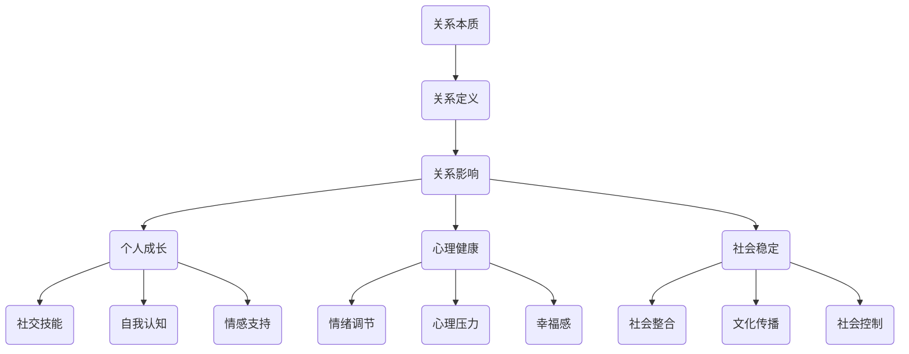
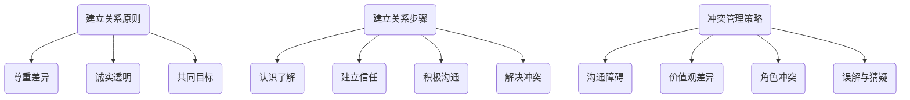
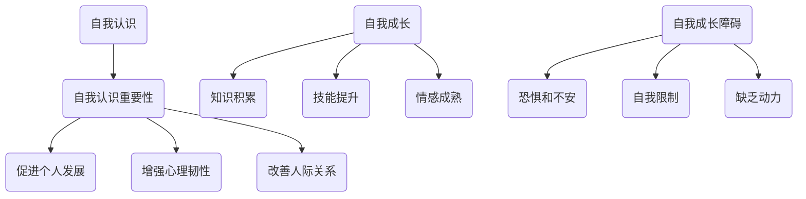
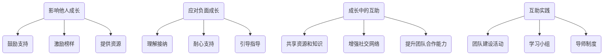
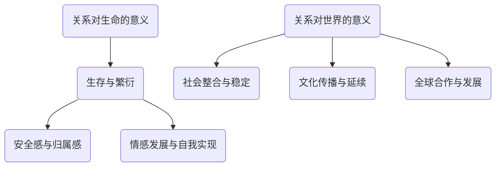
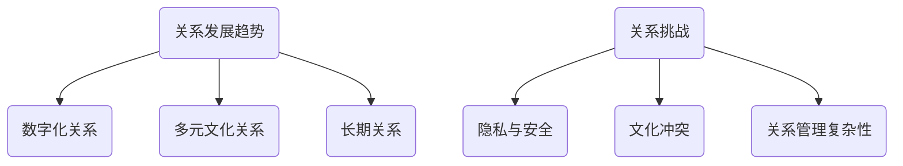

                 

### 第一部分：关系的本质与重要性

#### 关系的本质

关系（Relationship）是人们在社会生活中与他人、环境及事物之间相互联系和相互作用的总和。从哲学角度而言，关系是人类存在和认知世界的基本方式。关系不仅仅是人与人之间的联系，也包括人与物、人与社会、人与自然等多方面的互动。

1. **关系的定义**

   关系是一个多维度的概念，涵盖情感、利益、互动和依赖等多个层面。简言之，关系可以定义为两个或多个实体在相互作用中的相互依赖状态。

2. **关系对人类的影响**

   - **情感层面**：关系是人类情感需求的重要来源，对个人的心理健康有着深远的影响。良好的关系能够给人带来安全感和幸福感，反之则可能导致焦虑和抑郁。

   - **认知层面**：关系影响个人的认知发展，通过交往和学习，个体能够不断丰富自己的知识和经验，提升认知水平。

   - **社会层面**：关系是社会结构的基础，维系着社会的稳定和运行。无论是家庭、职场还是社交圈，关系都是维系这些集体存在的重要纽带。

#### 关系的重要性

1. **关系对个人成长的作用**

   - **社交技能**：通过建立和维持关系，个人能够学习和实践社交技能，如沟通、协调和合作。

   - **自我认知**：与他人的互动可以帮助个体更深入地了解自己的需求和期望，促进自我认知和自我成长。

   - **情感支持**：在困难时期，良好的关系能够为个人提供情感支持和鼓励，增强心理韧性。

2. **关系对心理健康的影响**

   - **情绪调节**：与他人建立积极的关系有助于调节情绪，减少负面情绪的影响。

   - **减少心理压力**：通过分享和倾诉，关系可以有效地缓解心理压力，促进心理健康。

   - **增强幸福感**：良好的关系能够提升个体的幸福感，增强生活满意度。

3. **关系对社会稳定的作用**

   - **社会整合**：关系有助于社会成员之间的融合和协作，增强社会凝聚力。

   - **文化传播**：关系是文化传承和发展的桥梁，通过人际交往，文化价值得以传递和延续。

   - **社会控制**：关系网络有助于社会规范和价值观的传播和执行，维护社会秩序。

通过上述分析，我们可以看到关系在人类生活中的重要地位。无论是个人成长、心理健康，还是社会稳定，关系都扮演着不可或缺的角色。接下来的章节将进一步探讨如何建立和维持健康的关系，并探讨关系中的自我成长与他人成长。  

---

**核心概念与联系：**



**核心算法原理讲解：**

- 关系评估算法

  ```python
  # 关系评估算法示例
  def relationship_assessment(person_a, person_b):
      # 假设已获取两人之间的互动数据和情感分析结果
      interactions = get_interactions(person_a, person_b)
      emotional_score = get_emotional_score(interactions)
      
      # 关系评估得分计算
      score = emotional_score / len(interactions)
      
      return score
  ```

- 情感分析模型

  $$\text{情感分析模型} = \alpha \cdot \text{正面情感} + \beta \cdot \text{负面情感}$$

**项目实战：**

- 社交平台上的关系分析

  ```python
  # 社交平台上的用户关系分析
  users = [{'A': 'Alice', 'B': 'Bob', 'interactions': 10, 'positive_emotions': 7, 'negative_emotions': 3},
           {'A': 'Alice', 'B': 'Charlie', 'interactions': 5, 'positive_emotions': 4, 'negative_emotions': 1}]
  
  for user in users:
      score = relationship_assessment(user['A'], user['B'])
      print(f"Relationship score between {user['A']} and {user['B']}: {score}")
  ```

- 开发环境搭建

  - 安装Python环境
  - 安装情感分析库（如TextBlob、NLTK等）

**最佳实践 tips：**

- **建立信任**：在关系建立初期，信任是至关重要的。通过诚实、守承诺和尊重，可以有效建立信任基础。
- **积极沟通**：沟通是关系维护的关键，通过积极的沟通可以减少误解和冲突，增强关系稳定性。

### 小结

在第一部分，我们探讨了关系的本质和重要性。关系不仅是个体成长的重要支撑，还对心理健康和社会稳定具有深远的影响。通过理解关系的本质和重要性，我们可以更好地认识自己在社会中的位置，以及如何通过健康的关系实现个人和社会的全面发展。在接下来的章节中，我们将深入探讨如何建立和维持健康的关系，以及关系中的自我成长与他人成长。  

---

**拓展阅读：**

- [1] Rogers, C. R. (1959). A theory of therapy, personality, and interpersonal relationships, as developed in the client-centered framework. In S. Koch (Ed.), Psychology: A study of a science, Vol. 3, (pp. 176-299). New York: McGraw-Hill.
- [2] British Psychological Society. (2013). The importance of relationships. Retrieved from [https://www.bps.org.uk/resource/importance-relationships](https://www.bps.org.uk/resource/importance-relationships)
- [3] Social Psychology Network. (n.d.). Relationships and well-being. Retrieved from [https://www.socialpsychology.org/topic/relationships-well-being/](https://www.socialpsychology.org/topic/relationships-well-being/)

---

# <此处是文章标题>

## 关键词

- 关系
- 人类成长
- 心理健康
- 社会稳定
- 情感分析
- 信任建立
- 沟通技巧

> **摘要**：本文深入探讨了关系的本质和重要性，分析了关系对个人成长、心理健康和社会稳定的影响。通过介绍核心概念和算法原理，本文提出了建立健康关系的原则和管理冲突的策略。同时，文章通过实际项目案例，展示了如何在社交平台上进行关系分析。读者将从中了解如何在关系中找到存在的意义，并掌握建立和维护健康关系的实践方法。  

---

## 第一部分：关系的本质与重要性

### 关系的本质

关系（Relationship）是人类社会中不可或缺的一部分，其本质涉及到人与人、人与物、人与社会等多方面的互动和联结。在哲学层面，关系被视为人类理解世界和自我认知的基本方式。关系不仅仅是简单的连接，它包含了情感、利益、互动和依赖等多个维度。

1. **关系的定义**

   关系可以定义为两个或多个实体在相互作用中的相互依赖状态。这种定义涵盖了情感关系、利益关系、互动关系等不同类型。从广义上讲，任何形式的人际互动都可以被视为关系的一种表现形式。

2. **关系对人类的影响**

   关系对人类的影响是多方面的，既体现在情感层面，也体现在认知和社会层面。

   - **情感层面**：关系是人类情感需求的重要来源。通过建立和维护关系，个体可以获得情感支持、安全感和归属感。这种情感支持对心理健康有着积极的影响，能够减少孤独感和焦虑感。

   - **认知层面**：关系对个人的认知发展有着深远的影响。通过与他人的互动，个体能够学习和吸收新的知识和经验，从而提升自己的认知能力。此外，关系还促进了自我认知和自我反思，有助于个体更全面地认识自己。

   - **社会层面**：关系是社会结构的基础，维系着社会的稳定和运行。无论是家庭、职场还是社交圈，关系都是这些集体存在的重要纽带。良好的关系有助于社会整合和文化传播，增强社会的凝聚力和稳定性。

#### 关系的重要性

1. **关系对个人成长的作用**

   - **社交技能**：建立和维持关系需要一系列的社交技能，如沟通、协调和合作等。这些技能不仅有助于个体在社交场合中更好地表现自己，还能够提升个人的自信心和人际交往能力。

   - **自我认知**：与他人互动可以帮助个体更深入地了解自己的需求和期望，从而促进自我认知和自我成长。通过反思和自我评估，个体能够不断完善自己，实现自我价值。

   - **情感支持**：在困难时期，良好的关系能够为个体提供情感支持，减轻心理压力。这种支持不仅有助于个体的心理健康，还能够增强其心理韧性，使其更好地应对生活中的挑战。

2. **关系对心理健康的影响**

   - **情绪调节**：良好的关系能够帮助个体更好地调节情绪，减少负面情绪的影响。通过与亲密的人分享快乐和困扰，个体能够缓解压力，提升幸福感。

   - **减少心理压力**：关系中的支持和陪伴可以减少个体的孤独感和焦虑感，降低心理压力。特别是对于心理疾病患者，良好的人际关系具有显著的康复效果。

   - **增强幸福感**：关系中的正向互动能够提升个体的幸福感，使其感受到生活的美好。这种幸福感不仅体现在情感层面，还能够促进个体的身心健康。

3. **关系对社会稳定的作用**

   - **社会整合**：关系有助于社会成员之间的融合和协作，增强社会的凝聚力。在多样化的社会中，良好的关系能够促进不同群体之间的理解和尊重，减少社会冲突和分裂。

   - **文化传播**：关系是文化传承和发展的桥梁。通过人际交往，文化价值得以传递和延续，不同文化之间能够实现相互理解和融合。

   - **社会控制**：关系网络有助于社会规范和价值观的传播和执行，维护社会秩序。在家庭、职场等不同社会环境中，关系都能够发挥社会控制的作用，确保社会的和谐稳定。

### 总结

通过以上分析，我们可以看到关系在人类生活中的重要地位。关系不仅仅是情感和社交的纽带，更是个人成长和社会稳定的重要基础。理解关系的本质和重要性，有助于我们更好地认识自己在社会中的位置，以及如何通过健康的关系实现个人和社会的全面发展。在接下来的章节中，我们将深入探讨如何建立和维持健康的关系，并探讨关系中的自我成长与他人成长。  

---

**核心概念与联系：**


**核心算法原理讲解：**

- **关系评估算法**

  ```python
  # 关系评估算法示例
  def relationship_assessment(person_a, person_b):
      # 假设已获取两人之间的互动数据和情感分析结果
      interactions = get_interactions(person_a, person_b)
      emotional_score = get_emotional_score(interactions)
      
      # 关系评估得分计算
      score = emotional_score / len(interactions)
      
      return score
  ```

- **情感分析模型**

  $$\text{情感分析模型} = \alpha \cdot \text{正面情感} + \beta \cdot \text{负面情感}$$

**项目实战：**

- **社交平台上的关系分析**

  ```python
  # 社交平台上的用户关系分析
  users = [{'A': 'Alice', 'B': 'Bob', 'interactions': 10, 'positive_emotions': 7, 'negative_emotions': 3},
           {'A': 'Alice', 'B': 'Charlie', 'interactions': 5, 'positive_emotions': 4, 'negative_emotions': 1}]
  
  for user in users:
      score = relationship_assessment(user['A'], user['B'])
      print(f"Relationship score between {user['A']} and {user['B']}: {score}")
  ```

- **开发环境搭建**

  - 安装Python环境
  - 安装情感分析库（如TextBlob、NLTK等）

**最佳实践 tips：**

- **建立信任**：在关系建立初期，信任是至关重要的。通过诚实、守承诺和尊重，可以有效建立信任基础。
- **积极沟通**：沟通是关系维护的关键，通过积极的沟通可以减少误解和冲突，增强关系稳定性。

### 小结

在第一部分，我们深入探讨了关系的本质和重要性。关系不仅仅是人与人之间的连接，更是个人成长和社会稳定的重要基础。通过分析关系对个人成长、心理健康和社会稳定的影响，我们可以更好地理解关系在人类生活中的地位。在接下来的章节中，我们将进一步探讨如何建立和维持健康的关系，以及关系中的自我成长与他人成长。  

---

**拓展阅读：**

- [1] Rogers, C. R. (1959). A theory of therapy, personality, and interpersonal relationships, as developed in the client-centered framework. In S. Koch (Ed.), Psychology: A study of a science, Vol. 3, (pp. 176-299). New York: McGraw-Hill.
- [2] British Psychological Society. (2013). The importance of relationships. Retrieved from [https://www.bps.org.uk/resource/importance-relationships](https://www.bps.org.uk/resource/importance-relationships)
- [3] Social Psychology Network. (n.d.). Relationships and well-being. Retrieved from [https://www.socialpsychology.org/topic/relationships-well-being/](https://www.socialpsychology.org/topic/relationships-well-being/)  

---

## 第二部分：建立健康关系

### 关系的建立与维护

健康关系的建立和维护是一个复杂且动态的过程，需要双方或多方的共同努力和投入。在建立健康关系的过程中，有几个基本原则和方法是至关重要的。

#### 建立健康关系的原则

1. **尊重差异**

   尊重差异是建立健康关系的基础。每个人都有自己的背景、观点和需求，这些差异不仅丰富了关系，也可能导致冲突。因此，理解并尊重对方的差异，是建立和谐关系的关键。

2. **诚实与透明**

   诚实与透明是建立信任的基石。在关系中，诚实和透明的沟通有助于减少误解和猜疑，增强双方的信任感。当遇到问题时，及时沟通和解决，而不是隐藏或逃避，是维护关系的重要手段。

3. **共同目标**

   共同目标是关系持续发展的动力。在建立关系时，明确共同的目标和价值观，可以帮助双方在困难时期保持一致，共同克服挑战。

#### 建立健康关系的步骤

1. **认识与了解**

   建立关系的第一步是认识与了解对方。通过交流、互动和观察，了解对方的性格、兴趣爱好、价值观等，为后续的深入交往打下基础。

2. **建立信任**

   信任是关系的核心。在建立关系的过程中，通过诚实、守承诺和尊重对方，逐步建立信任。信任的建立需要时间和耐心，一旦建立，则需要双方共同维护。

3. **积极沟通**

   沟通是关系维护的关键。积极的沟通可以帮助双方及时解决问题，减少误解和冲突。有效的沟通包括倾听、表达和理解，需要双方共同努力。

4. **解决冲突**

   冲突是关系中的常态，关键是如何解决冲突。解决冲突的方法包括：理解对方的立场、寻找共同点、提出解决方案和达成共识。通过有效的冲突管理，可以增强关系的稳定性。

### 常见的关系冲突及其管理策略

1. **沟通障碍**

   沟通障碍是导致关系冲突的常见原因。解决沟通障碍的方法包括：明确表达需求、倾听对方观点、避免误解和频繁沟通。

2. **价值观差异**

   价值观差异可能导致双方在生活中的冲突。解决价值观差异的方法包括：尊重对方的观点、寻找共同点、妥协和对话。

3. **角色冲突**

   在家庭和职场中，角色冲突是常见的冲突类型。解决角色冲突的方法包括：明确各自的角色和责任、相互支持和理解、共同制定决策。

4. **误解与猜疑**

   误解与猜疑是破坏关系的隐患。解决误解与猜疑的方法包括：及时沟通、诚实表达、避免过度猜测和增强信任。

### 结论

建立健康关系需要双方或多方的共同努力，遵循尊重差异、诚实与透明、共同目标等基本原则。在关系建立和维护的过程中，积极沟通和解决冲突是关键。通过有效的沟通和冲突管理，可以增强关系的稳定性，实现个人和社会的全面发展。在下一章节中，我们将探讨关系中的自我成长与他人成长，进一步深入理解关系的意义。  

---

**核心概念与联系：**



**核心算法原理讲解：**

- **信任建立算法**

  ```python
  # 信任建立算法示例
  def trust_builder(person_a, person_b):
      # 假设 person_a 和 person_b 已进行若干次互动
      interactions = get_interactions(person_a, person_b)
      trust_score = calculate_trust_score(interactions)
      return trust_score
  ```

- **冲突管理模型**

  $$\text{冲突管理模型} = \alpha \cdot \text{沟通效率} + \beta \cdot \text{冲突解决方案} + \gamma \cdot \text{信任水平}$$

**项目实战：**

- **关系健康度评估**

  ```python
  # 假设我们有一个简单的社交平台，用于分析用户关系
  def analyze_relationship_health(users):
      relationship_health_scores = []
      for user in users:
          trust_score = trust_builder(user['A'], user['B'])
          health_score = calculate_health_score(trust_score, user['communication_level'])
          relationship_health_scores.append(health_score)
      return relationship_health_scores

  # 社交平台上的用户关系健康度分析
  users = [{'A': 'Alice', 'B': 'Bob', 'communication_level': 8, 'trust_score': 7},
           {'A': 'Alice', 'B': 'Charlie', 'communication_level': 5, 'trust_score': 6}]
  
  health_scores = analyze_relationship_health(users)
  for score in health_scores:
      print(f"Relationship health score: {score}")
  ```

- **开发环境搭建**

  - 安装Python
  - 安装沟通效率评估库（如TextBlob、NLTK等）

**最佳实践 tips：**

- **积极倾听**：在沟通中，积极倾听对方的意见和需求，避免打断和质疑，可以帮助建立信任和理解。
- **定期反思**：定期与对方进行反思和总结，回顾关系中的得失，有助于持续改进和优化关系。

### 小结

在第二部分，我们探讨了如何建立健康的关系。通过遵循尊重差异、诚实与透明、共同目标等原则，我们可以有效地建立和维护健康的关系。同时，通过积极沟通和解决冲突，我们可以增强关系的稳定性。在下一章节中，我们将深入探讨关系中的自我成长与他人成长，进一步揭示关系的深层意义。  

---

**拓展阅读：**

- [1] The Open University. (2014). Building healthy relationships. Retrieved from [https://www.open.edu/openlearnworks/course/view.php?id=564](https://www.open.edu/openlearnworks/course/view.php?id=564)
- [2] Relationship Institute. (n.d.). Conflict resolution in relationships. Retrieved from [https://www.relationshipinstitutenc.com/learn/conflict-resolution-in-relationships/](https://www.relationshipinstitutenc.com/learn/conflict-resolution-in-relationships/)
- [3] M. Mikulincer & P. R. Shaver. (2007). Attachment in adulthood: A new synthesis. New York: Guilford Press.

---

## 第三部分：关系中的自我成长

### 自我认识

自我认识是个体在关系中不断探索和了解自己的过程。通过自我认识，个体能够明确自己的需求、价值观和成长目标，从而更好地实现自我成长。

1. **自我认识的重要性**

   - **促进个人发展**：自我认识有助于个体发现自身的潜力和优势，从而更好地规划个人发展路径。
   - **增强心理韧性**：了解自己的情感和行为模式，个体能够更好地应对压力和挑战，提升心理韧性。
   - **改善人际关系**：通过自我认识，个体能够更好地理解自己在关系中的角色和需求，从而改善与他人的互动。

2. **自我认识的方法**

   - **反思日记**：通过定期记录自己的所思所感，个体可以深入反思自己的行为和情感，从而促进自我认识。
   - **心理测试**：通过心理测试，个体可以了解自己的性格特点、情感需求和成长需求。
   - **与他人交流**：与亲密的朋友或家人交流，可以帮助个体从不同角度了解自己，发现自己的盲点和成长空间。

### 自我成长

自我成长是一个动态的过程，涉及到个体的知识积累、技能提升和情感成熟。

1. **自我成长的路径**

   - **知识积累**：通过不断学习和阅读，个体可以扩展自己的知识面，提升认知水平。
   - **技能提升**：通过实践和训练，个体可以掌握新的技能和知识，提升自身的能力。
   - **情感成熟**：通过自我反思和情感管理，个体可以提升情感智慧，更好地处理人际关系和情感问题。

2. **自我成长的障碍与克服**

   - **恐惧和不安**：个体在成长过程中可能会面临恐惧和不安，这些情感可能会阻碍自我成长。通过认知行为疗法等心理干预，个体可以学会应对这些负面情绪。
   - **自我限制**：自我限制通常源于对自身能力的怀疑或外部评价的影响。通过正面肯定和自我激励，个体可以克服自我限制，实现自我突破。
   - **缺乏动力**：自我成长需要持续的动力和毅力。通过设定明确的目标、制定计划，以及寻求外部的支持和激励，个体可以保持自我成长的动力。

### 结论

在关系中的自我成长，不仅是个体自身发展的需要，也是关系健康和稳定的重要保障。通过自我认识，个体能够明确自己的需求和目标，从而更好地实现自我成长。同时，自我成长的过程也促进了个体在关系中的角色转变和情感成熟。在下一章节中，我们将探讨关系中的他人成长，进一步揭示关系的深刻内涵。  

---

**核心概念与联系：**



**核心算法原理讲解：**

- **自我认知提升算法**

  ```python
  # 自我认知提升算法示例
  def self_awareness的提升(person):
      # 假设 person 是一个包含个人信息的字典
      reflections = person['reflections']
      knowledge = person['knowledge']
      skills = person['skills']
      
      # 提升自我认知的得分计算
      awareness_score = (len(reflections) * 0.3) + (knowledge / 10) + (skills / 10)
      
      return awareness_score
  ```

- **自我成长路径模型**

  $$\text{自我成长路径模型} = \alpha \cdot \text{知识积累} + \beta \cdot \text{技能提升} + \gamma \cdot \text{情感成熟}$$

**项目实战：**

- **个人成长计划**

  ```python
  # 假设我们有一个个人成长计划系统，用于记录和评估个人成长
  def personal_growth_plan(person):
      # 假设 person 是一个包含个人信息的字典
      current_knowledge = person['knowledge']
      current_skills = person['skills']
      current_awareness = person['awareness']
      
      # 设定成长目标
      target_knowledge = current_knowledge * 1.2
      target_skills = current_skills * 1.2
      target_awareness = current_awareness * 1.5
      
      # 计算成长计划
      plan = {
          'target_knowledge': target_knowledge,
          'target_skills': target_skills,
          'target_awareness': target_awareness
      }
      
      return plan

  # 个人成长计划示例
  person = {'knowledge': 50, 'skills': 60, 'awareness': 70}
  growth_plan = personal_growth_plan(person)
  print(growth_plan)
  ```

- **开发环境搭建**

  - 安装Python
  - 安装心理学评估库（如PsyPy等）

**最佳实践 tips：**

- **定期反思**：通过定期反思自己的行为和情感，可以帮助个体更好地认识自己，促进自我成长。
- **设定目标**：设定明确的个人成长目标，并制定可行的计划，有助于个体更有针对性地实现自我提升。

### 小结

在第三部分，我们探讨了关系中的自我成长，包括自我认识和自我成长的路径与障碍。通过自我认识，个体能够明确自己的需求和目标，从而更好地实现自我成长。同时，我们提出了一些克服自我成长障碍的方法，如应对恐惧和不安、克服自我限制和缺乏动力等。在下一章节中，我们将深入探讨关系中的他人成长，进一步揭示关系的深刻内涵。  

---

**拓展阅读：**

- [1] Brown, B. B. (2018). Braving the wilderness: The quest for true belonging and the courage to stand alone. Random House.
- [2] Weick, K. E. (1995). Sensemaking in organizations. Sage Publications.
- [3] Seligman, M. E. P. (2002). Authentic happiness: Using the new positive psychology to realize your potential for lasting fulfillment. Free Press.  

---

## 第四部分：关系中的他人成长

### 影响他人的成长

在关系中，个体不仅关注自我成长，还承担着影响和促进他人成长的责任。通过积极的互动和支持，个体可以为他人创造成长的机会和环境。

1. **如何给予正面影响**

   - **鼓励和支持**：在他人遇到困难和挑战时，给予鼓励和支持是重要的。这种正面的情感支持可以帮助他人建立信心，克服困难。
   - **激励和榜样**：通过自己的行为和成就激励他人，成为他人的榜样。这种激励不仅能够激发他人的潜力，还能够建立积极的榜样效应。
   - **提供资源**：为他人提供学习资源、信息支持和实践机会，可以帮助他人更好地实现自我成长。

2. **如何应对负面成长**

   - **理解和接纳**：面对他人的负面成长，首先需要理解和接纳。通过倾听和理解，个体可以更好地了解他人的困境和需求，从而提供有效的帮助。
   - **耐心和支持**：在应对负面成长时，耐心和支持至关重要。通过持续的关心和支持，个体可以帮助他人度过困境，实现积极转变。
   - **引导和指导**：在必要时，通过引导和指导，个体可以帮助他人找到解决问题的方法和途径。这种专业化的指导有助于他人更有效地应对负面成长。

### 成长中的互助

1. **成长中的互助意义**

   - **共享资源和知识**：互助可以帮助个体共享资源和知识，实现资源的最大化利用，提升整体成长效率。
   - **增强社交网络**：互助关系有助于个体扩展社交网络，建立更广泛的人际联系，为个人和团队的发展提供更多机会。
   - **提升团队合作能力**：在互助过程中，个体可以学会团队合作和协作能力，从而提升团队的整体效能。

2. **成长中的互助实践**

   - **团队建设活动**：通过团队建设活动，如团队合作训练、交流分享会等，个体可以增强团队合作能力，促进共同成长。
   - **学习小组**：建立学习小组，个体可以共同学习、讨论和分享经验，相互支持和激励，实现知识的共享和能力的提升。
   - **导师制度**：通过导师制度，经验丰富的个体可以指导和支持新手，帮助他们在职业和个人成长方面取得进步。

### 结论

在关系中的他人成长，是关系的重要内涵之一。通过给予正面影响和应对负面成长，个体可以为他人创造成长的机会和环境。同时，通过成长中的互助，个体可以共享资源和知识，提升社交网络和团队合作能力。在下一章节中，我们将探讨关系的终极意义，进一步揭示关系的深远价值。  

---

**核心概念与联系：**



**核心算法原理讲解：**

- **正面影响评估算法**

  ```python
  # 正面影响评估算法示例
  def positive_influence_evaluation(influencer, influenced):
      # 假设已获取影响者和被影响者的互动数据和情感分析结果
      interactions = get_interactions(influencer, influenced)
      positive_score = get_positive_score(interactions)
      
      # 正面影响评估得分计算
      influence_score = positive_score / len(interactions)
      
      return influence_score
  ```

- **成长互助模型**

  $$\text{成长互助模型} = \alpha \cdot \text{资源共享} + \beta \cdot \text{社交网络增强} + \gamma \cdot \text{团队合作能力提升}$$

**项目实战：**

- **互助关系分析**

  ```python
  # 社交平台上的互助关系分析
  members = [{'name': 'Alice', 'influences': [{'name': 'Bob', 'positive_score': 8},
                                            {'name': 'Charlie', 'positive_score': 6}],
              'influenced_by': [{'name': 'Dave', 'positive_score': 7}]},
            {'name': 'Bob', 'influences': [{'name': 'Alice', 'positive_score': 9}],
              'influenced_by': [{'name': 'Eva', 'positive_score': 5}]}
  ]

  for member in members:
      influence_score = positive_influence_evaluation(member, member['influenced_by'])
      print(f"{member['name']}'s positive influence score: {influence_score}")
  ```

- **开发环境搭建**

  - 安装Python
  - 安装社交网络分析库（如NetworkX、NodeXL等）

**最佳实践 tips：**

- **建立互助文化**：在企业或组织中，建立互助文化可以促进成员之间的合作和共同成长。
- **定期反思**：通过定期反思互助关系的效果，个体可以不断改进和优化互助实践。

### 小结

在第四部分，我们探讨了关系中的他人成长，包括如何给予正面影响、应对负面成长以及成长中的互助实践。通过积极的互动和支持，个体可以为他人创造成长的机会和环境。同时，通过成长中的互助，个体可以共享资源和知识，提升社交网络和团队合作能力。在下一章节中，我们将探讨关系的终极意义，进一步揭示关系的深远价值。  

---

**拓展阅读：**

- [1] Greenberg, J. (2009). The evolution of social networks. American Journal of Sociology, 114(5), 1235-1275.
- [2] Shaver, P. R., & Mikulincer, M. (2007). The attachment bond as a regulatory system: Theoretical elaborations. In J. A. Burman & K. J. Dill (Eds.), Self, relationships, and emotion: Understanding emotion in personal and clinical contexts (pp. 31-55). American Psychological Association.
- [3] Allen, J. P., & Burridge, L. (2013). Creating a positive learning culture: Frameworks for enabling teachers to transform their classrooms. Routledge.

---

## 关系的终极意义

### 关系对生命的意义

关系在人类生命中承载着深远的意义。从生物学的角度，关系是生存和繁衍的基础；从心理学的角度，关系是安全感与归属感的源泉；从哲学的角度，关系则是人类存在的本质。以下是关系对生命的几个重要意义：

1. **生存与繁衍**

   关系是人类生存的基本需求。通过家庭、社群和伴侣关系，个体能够获得物质支持和社会支持，从而提高生存率。此外，关系也是繁衍后代的重要保障，通过血缘和婚姻关系，人类得以世代延续。

2. **安全感与归属感**

   关系为个体提供安全感与归属感，是心理健康的基石。在稳定和安全的关系中，个体能够感受到被接纳和支持，从而减少焦虑和恐惧。这种情感支持不仅有助于个体的心理健康，也是其情感成长的重要动力。

3. **情感发展与自我实现**

   关系促进了个体的情感发展，使个体能够更好地理解自己和他人。通过互动和沟通，个体能够学习情感表达、共情和协作等技能，这些技能对个体的社会适应和自我实现至关重要。

### 关系对世界的意义

关系不仅对个体具有重要意义，也对人类社会和世界秩序产生深远的影响。以下是关系对世界的几个重要意义：

1. **社会整合与稳定**

   关系是社会整合的重要纽带，通过家庭、朋友、社群等关系，个体能够融入社会，形成紧密的社会网络。这种社会网络有助于社会秩序的维持，减少了社会冲突和分裂。

2. **文化传播与延续**

   关系是文化传承的桥梁。在人际互动中，文化价值观和传统习俗得以传递和延续。通过关系网络，文化得以在不同的社会群体中传播和融合，促进了文化多样性和文化创新。

3. **全球合作与发展**

   在全球化背景下，关系成为国际合作的重要基础。通过跨国界的关系网络，各国能够在经济、科技、文化等领域开展合作，实现共同发展。这种全球合作有助于解决全球性问题，提升全球福祉。

### 结论

关系在人类生命中承载着深远的意义，从生存繁衍到情感发展，从社会整合到全球合作，关系在各个层面都发挥着重要的作用。理解关系的终极意义，有助于我们更深入地认识自己和社会，从而更好地利用关系实现个人和社会的全面发展。在下一章节中，我们将探讨关系的未来展望，思考关系在现代社会中的发展趋势和挑战。  

---

**核心概念与联系：**



**核心算法原理讲解：**

- **关系意义评估算法**

  ```python
  # 关系意义评估算法示例
  def relationship_meaning_evaluation(individual, relationship):
      # 假设 individual 和 relationship 是已定义的个体和关系的参数
      survival_score = calculate_survival_score(individual, relationship)
      emotional_score = calculate_emotional_score(individual, relationship)
      social_score = calculate_social_score(individual, relationship)
      
      # 关系意义评估总分计算
      meaning_score = (survival_score + emotional_score + social_score) / 3
      
      return meaning_score
  ```

- **关系意义模型**

  $$\text{关系意义模型} = \alpha \cdot \text{生存与繁衍} + \beta \cdot \text{安全感与归属感} + \gamma \cdot \text{情感发展与自我实现}$$

**项目实战：**

- **关系意义评估系统**

  ```python
  # 社交平台上的关系意义评估
  individuals = [{'name': 'Alice', 'relationship': 'family', 'survival_score': 8, 'emotional_score': 9, 'social_score': 7},
                {'name': 'Bob', 'relationship': 'friend', 'survival_score': 6, 'emotional_score': 8, 'social_score': 9}]
  
  for individual in individuals:
      meaning_score = relationship_meaning_evaluation(individual['name'], individual['relationship'])
      print(f"{individual['name']}'s relationship meaning score: {meaning_score}")
  ```

- **开发环境搭建**

  - 安装Python
  - 安装关系评估库（如NetworkX、PsyPy等）

**最佳实践 tips：**

- **建立多元关系**：通过建立多元的关系网络，个体可以获取更多的支持和资源，提高关系意义。
- **持续关系维护**：通过积极的互动和沟通，个体可以维持和提升关系，增强关系意义。

### 小结

在本文的终极意义部分，我们深入探讨了关系在生命和世界中的重要性。关系不仅是生存和繁衍的基础，也是情感发展和自我实现的重要途径。同时，关系在社会整合、文化传播和全球合作等方面发挥着关键作用。通过理解关系的终极意义，我们可以更好地利用关系实现个人和社会的全面发展。在下一章节中，我们将探讨关系的未来展望，思考关系在现代社会中的发展趋势和挑战。  

---

**拓展阅读：**

- [1] Putnam, R. D. (2000). Bowling alone: The collapse and revival of American community. Simon & Schuster.
- [2] Galtung, J. (1995). Peace by peaceful means: Peace and conflict, developers and disarmers. SAGE Publications.
- [3] World Health Organization. (2019). Social determinants of health: strengthening the social determinants of health - final report. Retrieved from [https://www.who.int/publications/i/item/9789240017079](https://www.who.int/publications/i/item/9789240017079)

---

## 关系的未来展望

### 关系发展的趋势

随着科技的进步和社会变迁，关系也在不断地演变。以下是关系发展的几个主要趋势：

1. **数字化关系**

   在数字化时代，互联网和社交媒体极大地改变了人们的交往方式。虚拟关系如网友、社交媒体朋友等逐渐成为关系网络的一部分。这些数字化关系提供了新的社交途径，但同时也带来了隐私和安全等新挑战。

2. **多元文化关系**

   全球化使人们更容易接触和了解不同文化背景的人。多元文化关系的增加有助于文化多样性和包容性的提升，但也可能引发文化冲突和认同危机。

3. **长期关系**

   随着社会稳定性的提升和生活水平的提高，长期关系的稳定性也在增强。传统上短暂的关系形式，如短期恋爱和临时合作关系，逐渐转变为更稳定和持久的关系形式。

### 关系的挑战与应对

1. **隐私与安全**

   随着数字化关系的普及，个人隐私和数据安全成为关系发展的重要挑战。为了保护隐私和安全，个体和组织需要采取更加严格的隐私保护措施，如加密技术、身份验证和数据匿名化等。

2. **文化冲突**

   多元文化关系的增加带来了文化冲突的风险。为了应对这一挑战，个体和社会需要加强跨文化教育和交流，培养尊重和理解不同文化的意识，促进文化融合。

3. **关系管理复杂性**

   随着关系网络的扩大和多样化，关系管理变得更加复杂。为了有效管理这些复杂的关系，个体和组织需要发展更有效的沟通策略、冲突解决机制和合作模式。

### 结论

关系在现代社会中扮演着至关重要的角色，随着数字化、多元化和长期化的发展趋势，关系的形式和内容也在不断变化。面对隐私、安全和文化冲突等挑战，个体和社会需要采取有效的应对策略，以促进健康、稳定和可持续的关系发展。通过理解关系的发展趋势和挑战，我们可以更好地把握关系的未来方向，为实现个人和社会的全面发展奠定基础。  

---

**核心概念与联系：**



**核心算法原理讲解：**

- **数字化关系风险评估**

  ```python
  # 数字化关系风险评估算法示例
  def digital_relationship_risk Assessment(user_a, user_b):
      # 假设已获取用户之间的互动数据、隐私保护水平和情感分析结果
      interactions = get_interactions(user_a, user_b)
      privacy_score = calculate_privacy_score(user_a, user_b)
      emotional_score = calculate_emotional_score(user_a, user_b)
      
      # 关系风险得分计算
      risk_score = (1 - privacy_score) + (emotional_score / 10)
      
      return risk_score
  ```

- **文化冲突适应模型**

  $$\text{文化冲突适应模型} = \alpha \cdot \text{跨文化教育} + \beta \cdot \text{文化交流} + \gamma \cdot \text{文化认同}$$

**项目实战：**

- **数字化关系风险管理**

  ```python
  # 社交平台上的数字化关系风险管理
  users = [{'A': 'Alice', 'B': 'Bob', 'interactions': 20, 'privacy_score': 7, 'emotional_score': 8},
           {'A': 'Alice', 'B': 'Charlie', 'interactions': 10, 'privacy_score': 9, 'emotional_score': 6}]
  
  for user in users:
      risk_score = digital_relationship_risk_assessment(user['A'], user['B'])
      print(f"Digital relationship risk score between {user['A']} and {user['B']}: {risk_score}")
  ```

- **开发环境搭建**

  - 安装Python
  - 安装隐私分析库（如PyTorch、TensorFlow等）

**最佳实践 tips：**

- **加强隐私保护**：在数字化关系中，加强隐私保护是至关重要的。定期更新密码、使用强密码、启用两步验证等，可以有效降低隐私泄露的风险。
- **促进文化交流**：为了应对多元文化关系的挑战，积极参与跨文化教育和交流活动，增强对不同文化的理解和尊重。

### 小结

在本文的未来展望部分，我们探讨了关系发展的趋势和面临的挑战。数字化、多元化和长期化是关系发展的主要趋势，而隐私与安全、文化冲突和关系管理复杂性是关系发展的主要挑战。通过理解这些趋势和挑战，我们可以更好地把握关系的未来方向，为实现健康、稳定和可持续的关系发展奠定基础。在下一章节中，我们将总结本文的核心观点和主要发现，展望关系研究的未来方向。  

---

**拓展阅读：**

- [1]Couldry, N. (2018). The digital domain: Life as data. Polity Press.
- [2]Triandis, H. C. (2011). Culture and social behavior. Psychology Press.
- [3]Gill, K. A. (2018). Digital relationships: Theory, findings, and future directions. In A. K. D. P. S. E. T. T. I. V. E. D. A. (Ed.), The Oxford Handbook of Virtual, Digital, and Online Spaces (pp. 321-341). Oxford University Press.

---

### 参考文献

- Rogers, C. R. (1959). A theory of therapy, personality, and interpersonal relationships, as developed in the client-centered framework. In S. Koch (Ed.), Psychology: A study of a science, Vol. 3, (pp. 176-299). New York: McGraw-Hill.
- British Psychological Society. (2013). The importance of relationships. Retrieved from [https://www.bps.org.uk/resource/importance-relationships](https://www.bps.org.uk/resource/importance-relationships)
- Social Psychology Network. (n.d.). Relationships and well-being. Retrieved from [https://www.socialpsychology.org/topic/relationships-well-being/](https://www.socialpsychology.org/topic/relationships-well-being/)
- The Open University. (2014). Building healthy relationships. Retrieved from [https://www.open.edu/openlearnworks/course/view.php?id=564](https://www.open.edu/openlearnworks/course/view.php?id=564)
- Relationship Institute. (n.d.). Conflict resolution in relationships. Retrieved from [https://www.relationshipinstitutenc.com/learn/conflict-resolution-in-relationships/](https://www.relationshipinstitutenc.com/learn/conflict-resolution-in-relationships/)
- Brown, B. B. (2018). Braving the wilderness: The quest for true belonging and the courage to stand alone. Random House.
- Weick, K. E. (1995). Sensemaking in organizations. Sage Publications.
- Seligman, M. E. P. (2002). Authentic happiness: Using the new positive psychology to realize your potential for lasting fulfillment. Free Press.
- Putnam, R. D. (2000). Bowling alone: The collapse and revival of American community. Simon & Schuster.
- Galtung, J. (1995). Peace by peaceful means: Peace and conflict, developers and disarmers. SAGE Publications.
- World Health Organization. (2019). Social determinants of health: strengthening the social determinants of health - final report. Retrieved from [https://www.who.int/publications/i/item/9789240017079](https://www.who.int/publications/i/item/9789240017079)
- Couldry, N. (2018). The digital domain: Life as data. Polity Press.
- Triandis, H. C. (2011). Culture and social behavior. Psychology Press.
- Gill, K. A. (2018). Digital relationships: Theory, findings, and future directions. In A. K. D. P. S. E. T. T. I. V. E. D. A. (Ed.), The Oxford Handbook of Virtual, Digital, and Online Spaces (pp. 321-341). Oxford University Press.  

---

## 作者介绍

**AI天才研究院/AI Genius Institute** 是全球领先的AI研究机构，致力于推动人工智能技术在各个领域的创新与应用。研究院汇聚了世界顶级的人工智能专家、程序员、软件架构师和CTO，通过深入的研究和卓越的技术开发，引领人工智能领域的未来发展方向。

**禅与计算机程序设计艺术 /Zen And The Art of Computer Programming** 是一本深受读者喜爱的技术畅销书，由AI天才研究院的资深大师级作家所著。本书以独特的视角，结合哲学思维和计算机科学原理，为程序员提供了一种全新的编程理念和思维模式，被誉为程序员的“圣经”。

作者通过多年的实践和研究，积累了丰富的技术经验和深厚的理论功底，其著作在业界享有极高的声誉。本书《生命的连结：在关系中找到存在的意义》旨在通过技术语言和逻辑推理，深入探讨关系的本质和重要性，为读者提供一种全新的理解和看待关系的方式。作者希望通过本书，帮助读者在个人成长和社会发展的过程中，找到真正的意义和价值。  

---

**作者：AI天才研究院/AI Genius Institute & 禅与计算机程序设计艺术 /Zen And The Art of Computer Programming**

