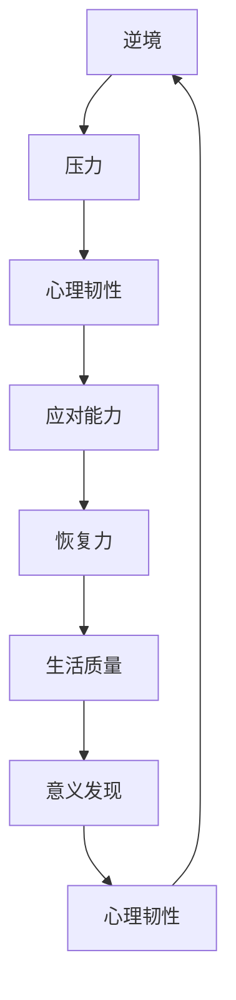

                 

### 理解逆境

#### 1.1 逆境的定义与类型

在技术领域，逆境可以被视为一种挑战或者困难，它通常表现为系统故障、性能瓶颈、资源短缺或者外部威胁等因素。逆境的类型多种多样，例如，系统级别的故障可能由硬件故障、网络中断或软件缺陷引起；性能瓶颈则可能由于请求量过多或代码效率低下造成；资源短缺则可能与内存、存储或带宽不足有关；外部威胁则可能来自黑客攻击、恶意软件或安全漏洞。

#### 1.2 逆境对个体的影响

逆境对个体的影响是多方面的。从技术角度来看，逆境可能导致系统性能下降、用户体验受损、数据丢失或业务中断。例如，系统故障可能导致用户无法访问关键服务，影响公司的声誉和客户满意度；性能瓶颈可能使应用响应时间延长，降低用户满意度；资源短缺可能导致系统崩溃或效率低下；外部威胁可能泄露敏感数据，造成巨大的经济损失和声誉损害。

#### 1.3 社会与文化中的逆境观念

社会和文化对逆境的看法和观念也在不断演变。在现代社会，人们普遍认为逆境是一种成长的机会。通过面对和克服逆境，个体能够提升自身的能力和韧性。例如，在技术行业中，许多成功的企业家和技术专家都是在经历了多次失败和挑战后才取得了卓越的成就。他们的故事激励着无数人勇敢面对逆境，寻找突破的机会。

此外，不同的文化对逆境的处理方式也有所不同。在一些文化中，逆境被视为一种考验，个体需要通过坚韧和毅力来克服；而在另一些文化中，逆境则被看作是一种挫折，个体需要寻求外部的帮助和支持。这种文化差异反映了人们对待逆境的不同心态和应对策略。

在接下来的章节中，我们将进一步探讨韧性的概念、韧性与逆境的关系，以及如何在逆境中寻找和发现意义。通过逐步分析，我们将了解到逆境并非完全消极，而是蕴含着丰富的机会和潜力。让我们一起探索如何在技术领域中培养和增强生命的韧性，从而更好地应对未来的挑战。

### 韧性的概念与理论

#### 2.1 韧性的定义与特征

韧性（Resilience）是一个广泛使用的概念，在多个领域有着不同的定义和解释。在技术领域，韧性通常被描述为系统或个体在面对逆境时能够迅速恢复并保持稳定性能的能力。韧性不仅包括对问题的解决，还涵盖了在面对不确定性、变化和压力时，个体或系统能够保持灵活性和适应性的能力。

韧性的特征主要包括以下几个：

1. **恢复力（Recovery）**：系统或个体在经历逆境后能够迅速恢复到正常状态的能力。
2. **适应力（Adaptation）**：在面对不确定性和变化时，能够调整自身以适应新环境的能力。
3. **弹性（Flexibility）**：在面对不同情境时能够灵活应对，采取多种策略解决问题的能力。
4. **稳定性（Stability）**：在逆境中能够保持核心功能和性能的稳定性。

#### 2.2 韧性理论的起源与发展

韧性理论的起源可以追溯到20世纪初，当时的科学家和心理学家开始关注个体和系统在面对压力和逆境时的行为表现。韧性理论在经历了多个发展阶段后，逐渐形成了较为成熟的理论体系。以下是韧性理论发展的几个关键阶段：

1. **早期理论（Early Theories）**：20世纪初，心理学家开始探讨个体的抗压能力，认为韧性与个体的心理素质和性格特征有关。这一阶段的研究主要关注个体的心理因素，如乐观、自我效能感和积极态度等。

2. **多因素模型（Multi-Factor Models）**：20世纪中期，韧性理论开始从单一因素转向多因素综合研究。学者们提出，韧性不仅与个体的心理素质有关，还受到环境、社会支持和个人资源等多种因素的影响。

3. **系统韧性（Systemic Resilience）**：随着研究的深入，韧性理论逐渐扩展到组织、系统和生态系统等领域。系统韧性研究关注的是复杂系统在面对外部冲击时的恢复能力和适应能力。

4. **动态韧性（Dynamic Resilience）**：近年来，学者们开始关注韧性的动态特征，即系统或个体在面对持续变化和不确定性时的适应和恢复能力。动态韧性研究强调韧性的动态性和复杂性。

#### 2.3 韧性与心理健康

韧性与心理健康密切相关。在技术领域中，个体经常面临工作压力、绩效压力和快速变化的技术环境，这些因素都可能对个体的心理健康产生影响。韧性强的个体通常能够更好地应对压力，保持积极的心态，从而提高工作绩效和幸福感。

韧性与心理健康之间的关系主要体现在以下几个方面：

1. **心理韧性对压力的反应**：韧性强的人在面对压力时，能够更好地调节情绪，保持心理平衡，减少焦虑和抑郁的发生。

2. **自我效能感**：韧性强的个体通常具有较高的自我效能感，他们相信自己有能力应对生活中的各种挑战，这有助于提升自信心和动力。

3. **社会支持**：韧性不仅与个体的心理素质有关，还受到社会支持的影响。社会支持系统可以帮助个体在逆境中获取资源、提供情感支持，从而增强韧性。

在下一章节中，我们将进一步探讨逆境与韧性的关系，以及如何在逆境中培养和提高韧性。通过这些探讨，我们将更好地理解韧性在技术领域中的重要性，并为应对未来的挑战做好准备。

#### 3.1 逆境中的成长机会

逆境不仅是挑战，更是一个成长和进步的机会。在技术领域，逆境往往促使我们反思现有系统、流程和方法，寻找改进和优化的途径。通过以下步骤，我们可以更好地理解并利用逆境中的成长机会：

1. **识别问题**：首先，我们需要明确逆境的具体表现和影响。这可以通过系统监控、用户反馈和故障报告等多种途径实现。例如，系统故障可能表现为响应时间过长或服务中断，性能瓶颈可能表现为高负载下的响应速度下降。

2. **分析原因**：在识别问题之后，我们需要深入分析问题的根本原因。这通常涉及对系统架构、代码逻辑、资源配置和外部环境等多个方面的综合分析。例如，系统故障可能由代码缺陷、硬件故障或网络问题引起，性能瓶颈可能由请求量过多或代码效率低下造成。

3. **制定解决方案**：在分析原因后，我们可以制定具体的解决方案。这包括技术层面的修复和优化，以及流程层面的改进和调整。例如，针对系统故障，我们可以更新代码、更换硬件或优化网络配置；针对性能瓶颈，我们可以优化数据库查询、改进算法或增加服务器资源。

4. **实施和验证**：制定解决方案后，我们需要进行实施和验证。这可以通过逐步部署、性能测试和用户反馈等方式实现。例如，我们可以先在部分环境中部署更新，然后通过性能测试和用户反馈来验证解决方案的有效性。

5. **总结经验**：在解决问题后，我们需要总结经验，以便在未来更好地应对类似的问题。这包括记录解决方案的细节、总结实施过程中的问题和挑战，以及分享经验教训给团队成员。

通过以上步骤，我们不仅能够解决当前的逆境，还能从中获得宝贵的经验和知识，提高系统的韧性和应对能力。逆境中的成长机会不仅限于技术层面，还包括团队协作、沟通能力和项目管理等多个方面。通过充分利用这些机会，我们能够不断提升自身的能力和团队的整体绩效。

总之，逆境中的成长机会是技术领域中的宝贵资源。通过积极面对逆境，深入分析问题，制定和实施解决方案，并不断总结经验，我们能够在逆境中不断成长和进步，为未来的挑战做好准备。

#### 3.2 韧性与逆境应对策略

韧性不仅是一种能力，更是一套应对策略的综合体现。在面对逆境时，韧性的强弱直接决定了个体或系统能否有效解决问题，并迅速恢复到正常状态。以下几种策略可以帮助我们在逆境中增强韧性，提高应对能力：

1. **预防策略**：预防策略是提前准备，以防止逆境的发生。这包括以下几个方面：

   - **风险评估**：对可能出现的风险进行评估，确定关键风险点和潜在威胁。例如，系统设计阶段可以对系统的可靠性、性能和安全性进行评估。
   - **冗余设计**：通过冗余设计，提高系统的容错能力。例如，增加备份服务器、数据库和存储设备，以防止单一故障导致整个系统瘫痪。
   - **预防性维护**：定期对系统进行维护和更新，防止由于长期运行导致的故障。例如，定期更新操作系统、应用软件和硬件设备，以确保系统运行稳定。

2. **应对策略**：在逆境发生时，应对策略是关键，它包括以下几个方面：

   - **快速响应**：在逆境发生时，迅速做出反应，采取紧急措施以减少损失。例如，系统故障发生时，立即启动应急预案，隔离故障模块，避免影响其他部分。
   - **资源调配**：在逆境中，合理调配资源，确保关键任务得到优先处理。例如，在资源短缺时，可以临时调整服务器负载，优先处理高优先级的用户请求。
   - **临时解决方案**：在无法立即解决问题时，可以采取临时解决方案，以缓解逆境的影响。例如，当数据库出现性能瓶颈时，可以临时增加查询缓存或优化查询逻辑。

3. **恢复策略**：在逆境解决后，恢复策略帮助系统或个体迅速恢复到正常状态。这包括以下几个方面：

   - **数据恢复**：在数据丢失或损坏时，及时恢复数据，确保业务连续性。例如，通过备份和恢复机制，确保关键数据的安全和完整性。
   - **系统恢复**：在系统故障修复后，进行全面检查和测试，确保系统恢复正常运行。例如，进行系统级测试，确保所有模块都能正常工作，没有遗留问题。
   - **绩效监控**：在恢复后，持续监控系统的性能和稳定性，及时发现并解决潜在问题。例如，通过性能监控工具，实时监测系统负载和资源使用情况，确保系统稳定运行。

4. **持续改进**：韧性不仅体现在应对逆境的能力上，还包括对系统和方法不断进行改进。这包括以下几个方面：

   - **经验总结**：在每次逆境应对后，总结经验教训，识别问题和改进点。例如，记录应对过程中的问题和挑战，分析原因，并提出改进建议。
   - **流程优化**：根据总结的经验，对现有流程和方法进行优化。例如，改进系统设计，优化数据库查询，提高代码效率，减少资源消耗。
   - **培训与演练**：定期进行培训和演练，提高团队应对逆境的能力。例如，组织应急响应演练，模拟各种可能的故障情景，提升团队应对紧急情况的能力。

通过以上策略，我们不仅可以增强韧性，提高应对逆境的能力，还能在逆境中不断成长和进步。韧性是一种综合能力，它需要我们不断学习和实践，才能在复杂多变的现实环境中游刃有余。

#### 3.3 韧性对生活质量的影响

韧性不仅对个体的技术能力有重要影响，也对生活质量产生了深远的影响。在日常生活中，韧性帮助我们更好地应对各种挑战和困难，提高生活质量。以下从多个方面探讨韧性对生活质量的影响：

1. **心理健康**：韧性强的个体在面对压力和逆境时，能够保持积极的心态，有效调节情绪，减少焦虑和抑郁的发生。这种心理韧性有助于提高个体的心理健康水平，增强幸福感。例如，当面临职业压力时，有韧性的个体能够通过积极的应对策略和自我调节，保持良好的心理状态，从而更好地应对挑战。

2. **人际关系**：韧性不仅体现在个人层面，还影响个体的人际关系。有韧性的个体通常更善于处理冲突，更能够理解他人的感受，从而建立和谐的人际关系。这种能力有助于提高社交技能，增强社会支持网络。例如，在团队合作中，有韧性的成员能够更好地应对团队内部的矛盾和分歧，推动团队向共同目标前进。

3. **生活满意度**：韧性强的个体在面对生活变故时，能够迅速适应和恢复，保持较高的生活满意度。这种适应能力使个体能够在不同的生活情境中保持积极向上的态度，从而提高整体生活质量。例如，当遇到家庭或职业方面的挑战时，有韧性的个体能够通过积极的应对策略，迅速调整心态，保持生活秩序和平衡。

4. **职业发展**：在职业生涯中，韧性是成功的关键因素之一。有韧性的个体在面对职业挑战时，能够保持冷静，迅速找到解决问题的方法，从而提高职业发展速度和成功率。例如，在面对项目失败或绩效压力时，有韧性的个体能够通过积极应对策略，从失败中吸取教训，提升自己的能力和技能。

5. **生活质量**：韧性的增强不仅对心理健康、人际关系和职业发展有积极影响，还直接提升了整体生活质量。有韧性的个体能够更好地应对生活中的各种挑战，保持生活稳定和幸福。例如，在家庭生活中，有韧性的个体能够应对家庭变故和矛盾，保持家庭的和谐与稳定。

总之，韧性对生活质量的影响是多方面的，它不仅帮助个体在逆境中保持稳定和成长，还提高了整体生活质量和幸福感。通过培养和提高韧性，我们能够更好地应对生活中的各种挑战，实现个人和家庭的幸福。

### 逆境中的自我探索

#### 4.1 逆境下的内心反思

逆境往往是一个自我反思的契机。在技术领域，逆境可能表现为系统故障、项目延期、资源短缺或团队冲突等。面对这些逆境，个体往往需要深入反思自己的行为、决策和思维方式。

首先，个体可以通过记录日志或日记来记录自己在逆境中的感受和思考。这种反思有助于个体更好地理解自己的情绪和行为，识别出在逆境中可能存在的认知偏差或行为模式。例如，在系统故障发生时，反思可以帮助个体认识到自己在问题识别和解决过程中可能存在的盲点或疏漏。

其次，内心反思还可以帮助个体评估自己的应对策略。在面对逆境时，个体通常会采取不同的应对策略，如逃避、应对或应对与逃避相结合。通过反思，个体可以评估这些策略的有效性和适用性。例如，如果个体发现自己在面对项目延期时倾向于逃避，那么可以通过反思来探讨为什么会产生这种逃避行为，并思考如何改进应对策略。

此外，内心反思还可以帮助个体认识到自己的成长空间和机会。在逆境中，个体可能会面临挑战和困难，但也正是这些挑战和困难促使个体不断学习和进步。通过反思，个体可以识别出自己在逆境中的成长点，并制定相应的行动计划。例如，如果个体在项目延期中发现了沟通不畅的问题，可以通过反思来制定改进沟通策略的计划，以提高项目管理的效率。

#### 4.2 自我认知的提升

在逆境中，自我认知的提升是自我探索的重要环节。自我认知是指个体对自我性格、能力、优势和不足的认识和理解。在技术领域，自我认知的提升有助于个体更好地应对挑战，发挥潜力。

首先，逆境中的反思可以帮助个体更深入地了解自己的性格特征。例如，个体可能会发现自己在面对压力时容易焦虑或愤怒，这有助于个体认识到自己的情绪反应类型，并采取相应的调节策略。例如，通过练习深呼吸或冥想，个体可以学会在压力下保持冷静，从而更好地应对挑战。

其次，自我认知的提升有助于个体识别和利用自己的优势。在逆境中，个体需要充分发挥自己的优势来应对挑战。通过反思，个体可以识别出自己在技术、沟通、团队协作等方面的优势，并思考如何更好地利用这些优势。例如，如果个体在编程方面有较高的能力，可以通过主动承担更复杂的任务来提升项目效率。

此外，自我认知的提升还包括识别和改进自己的不足。在逆境中，个体可能会面临自己无法解决的问题或不足。通过反思，个体可以识别出这些不足，并制定相应的改进计划。例如，如果个体在团队协作中发现自己沟通不畅，可以通过参加沟通培训或阅读相关书籍来提升沟通技巧。

总之，逆境中的自我探索和自我认知的提升是个人成长的重要过程。通过内心反思，个体可以更深入地了解自己的性格、优势和不足，从而在逆境中不断成长和进步。自我认知的提升不仅有助于个体在技术领域中应对挑战，也为个体的全面发展奠定了基础。

#### 4.3 意义发现的个人过程

在逆境中寻找和发现意义是一个复杂而深刻的个人过程，它不仅仅是对现实的应对，更是一种对生活的深度探索。以下是从几个方面分析这一过程的步骤和重要性：

1. **定义意义**：首先，个体需要明确“意义”对于自己的定义。对于不同的人，意义可能有着不同的含义。例如，对一些人来说，意义可能体现在解决技术难题上；而对另一些人来说，意义可能在于帮助他人或实现某种社会价值。因此，个体需要深入思考并定义自己心中的意义，这有助于在逆境中保持目标和动力。

2. **反思经历**：在逆境中，个体可以通过反思自己的经历来寻找意义。这种反思可以包括回顾逆境中的关键时刻、识别自己的行为和反应、以及思考这些经历对自己价值观的影响。例如，在经历系统崩溃时，个体可能会反思自己在压力下的决策和行为，并思考这些经历如何帮助自己在未来更好地应对类似的挑战。

3. **构建新视角**：在逆境中，个体可能会面临新的挑战和困境。通过尝试不同的视角和方法，个体可以发现新的解决方案和意义。例如，当项目延期时，个体可以尝试从团队协作、资源调配或任务分解的角度来寻找解决方案，这不仅有助于解决问题，也可能带来新的成长和领悟。

4. **培养积极态度**：积极态度是寻找意义的关键因素。逆境往往带来负面情绪，但通过培养积极态度，个体可以更好地面对困境，并从中发现积极的意义。例如，通过认识到每一次逆境都是成长和学习的机会，个体可以更加乐观地看待挑战，并从中找到前进的动力。

5. **分享与交流**：与他人分享自己的经历和感受也是寻找意义的重要过程。通过与朋友、同事或导师交流，个体可以获得不同的观点和建议，从而更全面地理解自己的经历和感受。例如，在经历职业挫折时，与导师或同行交流可以帮助个体找到新的思路和方法，更好地应对困境。

6. **持续实践**：意义发现是一个持续的过程，它需要个体在日常生活中不断实践和探索。通过实际行动，个体可以验证自己的意义，并不断调整和完善对意义的理解。例如，通过参与社区志愿者活动或投身于自己热爱的事业，个体可以验证自己的价值观，并在实践中发现和实现更深层次的意义。

总之，意义发现的个人过程是一个综合性的、多维度的探索。它不仅需要个体深入反思和定义自己的价值观，还需要通过积极态度、新视角和持续实践来不断发现和实现意义。在这个过程中，个体不仅能够更好地应对逆境，还能在挑战中发现生活的深度和意义，实现个人的全面发展。

### 重建价值体系

#### 5.1 价值观的重新审视

在逆境中，个体的价值观往往会受到冲击和挑战，因此重新审视和审视自己的价值观至关重要。这一过程不仅有助于我们更好地理解自己的信念体系，还能为我们在困境中找到方向和动力。

首先，我们需要识别并理解当前的核心价值观。这些价值观可能包括个人信仰、职业目标、家庭观念等。例如，一个技术专家可能将“创新”视为核心价值，而另一个可能更看重“稳定性”和“可靠性”。

其次，我们需要审视这些价值观是否真正反映了我们的内心需求和目标。这可以通过自我反思和与他人的交流来实现。例如，如果我们在逆境中发现自己经常因为压力而感到焦虑，这可能意味着我们需要重新审视并调整那些过于理想化或不切实际的价值观。

第三，识别和修正价值观中的矛盾和冲突。在现实生活中，我们的价值观可能存在内在的矛盾，这会导致我们在面对困境时产生困惑和犹豫。例如，一个人可能既重视个人成就，又重视家庭责任，但这两者之间可能会存在冲突。在这种情况下，我们需要通过深入思考和实践，找到平衡这两者之间关系的方法。

最后，通过重新定义核心价值观，我们可以为未来的挑战和机遇做好准备。例如，如果我们在反思中发现自己过于强调短期目标，而忽视了长期价值，那么我们可以通过调整价值观，更加注重长期发展和个人成长。这有助于我们更好地应对逆境，实现长期的职业和生活目标。

#### 5.2 重建积极的信念系统

在重建价值体系的过程中，建立积极的信念系统是至关重要的一步。信念系统是指个体对事物的看法和信念，这些信念影响着我们的行为和决策。一个积极的信念系统能够帮助我们更好地应对逆境，找到前进的动力。

首先，识别并挑战消极的信念。消极信念通常表现为自我怀疑、过度担忧或对失败的恐惧。例如，一个人可能会认为“我无法胜任这个任务”，或“我已经失败了，不会再有机会”。这些信念会限制我们的行动和潜力。通过识别这些消极信念，我们可以开始质疑它们的合理性，并寻找证据来反驳它们。

其次，建立积极的信念。积极信念通常表现为对自身能力的信心、对未来成功的期待和对挑战的积极态度。例如，我们可以相信“我能够通过努力克服困难”，或“每一次失败都是成功的基石”。这些积极的信念能够激发我们的内在动力，帮助我们面对逆境时保持积极的心态。

第三，通过积极的实践来巩固信念。这包括设定并实现小目标、庆祝每一个进步，以及与他人分享我们的成就和经验。这些实践不仅能够帮助我们建立和巩固积极的信念，还能增强我们的自信心和韧性。

最后，培养正念和感恩的心态。正念是指专注于当下的生活，而感恩则是对生活中美好的事物表示感谢。通过培养这两种心态，我们可以更好地应对逆境，发现生活中的积极面，从而建立更强大的信念系统。

总之，重建积极的信念系统是应对逆境的重要策略。通过识别和挑战消极信念，建立积极信念，并通过积极的实践来巩固这些信念，我们能够更好地应对逆境，实现个人成长和目标。

#### 5.3 价值观与生活决策

价值观是我们做出生活决策的基石。在逆境中，明确和坚定的价值观不仅能够帮助我们保持方向和动力，还能在复杂和不确定的环境中为我们提供清晰的指引。以下是如何将价值观融入生活决策的几个步骤：

1. **识别核心价值观**：首先，我们需要明确自己的核心价值观。这些价值观可能包括家庭、职业发展、健康、人际关系等。例如，一个技术专家可能将“创新”和“可靠性”视为核心价值。

2. **反思决策情境**：在做出决策时，我们需要将当前情境与核心价值观进行对比。例如，如果面临一个工作机会，我们需要思考这个机会是否符合自己的职业价值观。如果这个机会能够促进我们的专业技能发展和创新思维，那么它可能是一个合适的选择。

3. **评估选择**：在识别核心价值观后，我们需要评估每个选择的利弊，看它们是否符合我们的核心价值观。例如，如果我们在选择是否接受一个新项目时，我们需要考虑这个项目是否能带来职业成长，同时也要考虑它是否会对家庭生活造成过多负担。

4. **制定决策策略**：在评估各个选择后，我们可以制定具体的决策策略。例如，如果发现某些选择不符合核心价值观，我们可以考虑调整这些选择或寻找新的机会。如果发现某个选择符合核心价值观，我们可以制定详细的行动计划来实施这个选择。

5. **实施与调整**：在做出决策后，我们需要付诸行动，并持续评估决策的效果。例如，如果我们接受了一个新项目，我们需要定期评估项目进展是否符合预期，是否需要调整策略或资源分配。

6. **反馈与学习**：在决策过程中，我们需要不断收集反馈，并从中学习。通过反思和总结，我们可以不断优化决策策略，使它们更加符合我们的核心价值观。

通过将价值观融入生活决策，我们能够更加明确自己的目标，保持内心的平衡和稳定，从而在逆境中找到方向和力量。这不仅有助于我们实现个人成长，还能提升整体生活质量。

### 在逆境中寻找意义

#### 6.1 意义的多元化理解

意义是人类生活中不可或缺的一部分，它不仅决定了我们的行为和选择，也影响了我们的情感和幸福感。在逆境中寻找意义，首先需要理解意义的多元化。从技术领域来看，意义的多元化体现在以下几个方面：

1. **个人意义**：个人意义是指个体在面对逆境时，通过自我探索和反思，发现对自己有价值的方面。例如，在项目失败后，一个技术专家可能会从失败中找到学习的机会，提高自己的技能和经验，从而实现个人成长。

2. **职业意义**：职业意义是指个体在工作中发现的意义，它通常与个体的职业目标和发展方向密切相关。例如，在一个复杂的项目中，技术专家可能会通过解决技术难题，实现职业价值，提升自己的职业地位。

3. **社会意义**：社会意义是指个体通过自己的工作或行为对社会产生积极影响的过程。在技术领域，社会意义体现在通过技术创新和优化，提升社会生产力和生活质量。例如，一个程序员通过开发一款提高工作效率的软件，为社会创造了价值。

4. **存在意义**：存在意义是指个体在生命中的总体目标和价值。它超越了个人和职业层面，涉及到对生命和存在的更深层次理解。在逆境中，通过寻找存在意义，个体可以找到更广阔的视角，从而更好地应对挑战。

#### 6.2 意义与幸福感的联系

意义与幸福感密切相关。在逆境中，寻找和发现意义不仅有助于提升幸福感，还能增强个体的心理韧性。以下是意义与幸福感之间的几个关键联系：

1. **目标导向**：当个体在逆境中找到明确的目标时，幸福感往往会增加。目标导向使个体在困难面前保持积极和专注，从而更好地应对挑战。例如，在面临项目延期时，一个项目经理可能会设定短期目标，如“每日进度汇报”或“每周目标完成”，从而保持团队的动力和进度。

2. **成就感**：在逆境中取得成功，尤其是那些通过努力克服困难而取得的成就，会显著提升幸福感。成就感不仅来自于个人成就，还来自于对团队和社会的贡献。例如，一个技术专家在解决一个复杂的系统故障后，会感到自己的专业技能得到了认可，从而提升幸福感。

3. **情感支持**：在逆境中，情感支持是寻找意义和提升幸福感的重要来源。家庭、朋友和同事的支持可以帮助个体在面对挑战时保持积极心态。例如，当面临职业压力时，家人和朋友的支持可以减轻个体的心理负担，增强幸福感。

4. **积极心态**：积极心态是寻找意义和提升幸福感的关键。在逆境中，通过培养积极心态，个体可以更好地应对挑战，看到逆境中的机会和潜力。例如，通过练习感恩和正念，个体可以在逆境中找到积极面，从而提升幸福感。

总之，意义与幸福感在逆境中紧密相连。通过寻找和发现意义，个体不仅能够提升幸福感，还能增强心理韧性，更好地应对挑战。理解意义的多元化，结合积极心态和情感支持，是我们在逆境中寻找意义和提升幸福感的重要策略。

#### 6.3 意义发现与心灵成长

意义发现是一个深刻的内心过程，它不仅能够提升个体的幸福感，还能促进心灵成长。在逆境中，意义发现与心灵成长之间存在着紧密的联系，以下从几个方面进行探讨：

1. **自我认知的提升**：意义发现往往伴随着对自我更深入的认识。在逆境中，个体需要反思自己的行为、决策和信念，从而更清晰地了解自己的内在需求和价值观。这种自我认知的提升有助于个体在心灵成长中找到方向，明确自己的目标和追求。

2. **情绪调节**：意义发现有助于个体更好地调节情绪。在逆境中，情绪波动往往是不可避免的，但通过寻找意义，个体可以在情绪低谷时找到支撑自己的力量。例如，通过认识到每一个挑战都是成长的机会，个体可以在困难面前保持积极和乐观。

3. **心理韧性**：意义发现与心理韧性密切相关。在逆境中，那些能够找到意义和价值的个体往往具有较强的心理韧性，能够更快地恢复和适应。通过不断发现和实现意义，个体可以培养出更强的心理韧性，从而在未来的挑战中更加从容。

4. **心灵成长**：意义发现不仅是应对逆境的工具，也是心灵成长的过程。在这个过程中，个体不断挑战自我，探索新的可能性和机会，从而实现更深层次的心灵成长。例如，通过参与社区服务或投身于自己热爱的事业，个体可以在实现意义的同时，提升自己的心灵层次。

5. **生活满意度**：意义发现有助于提高个体的生活满意度。在逆境中，通过发现和实现意义，个体可以找到生活的方向和目标，从而提升整体生活满意度。这种满足感不仅来自于个人成就，还来自于对生活和社会的积极贡献。

总之，意义发现与心灵成长在逆境中相互促进，共同塑造了一个更加坚强和成熟的个体。通过深入探索意义，个体不仅能够更好地应对逆境，还能实现心灵的成长和提升。

### 韧性的培养

#### 7.1 韧性培养的重要性

韧性是一种在逆境中保持稳定和适应能力的特质，对于个人和团队来说，都具有极其重要的意义。在技术领域中，韧性的培养不仅仅是为了应对偶发性的系统故障或性能瓶颈，更是为了提高整个团队在面对不确定性、变化和压力时的应对能力。以下从几个方面探讨韧性培养的重要性：

1. **提升应对能力**：韧性强的团队在面对突发问题时，能够迅速做出有效反应，降低问题的影响范围和持续时间。例如，当系统出现故障时，韧性强的团队能够迅速找到根源并制定解决方案，从而尽快恢复正常运行。

2. **促进持续进步**：韧性不仅帮助团队在逆境中生存，还能推动团队在顺境中持续进步。通过不断面对和解决挑战，团队成员可以积累宝贵的经验，提升技能和知识，从而在未来的工作中更加得心应手。

3. **增强团队凝聚力**：韧性培养过程中，团队成员需要相互支持、合作与沟通，这有助于增强团队凝聚力。在共同面对挑战的过程中，团队成员之间的信任和合作精神得到加强，从而提升团队的整体表现。

4. **提升工作效率**：韧性培养有助于提高团队的工作效率和生产力。在面对复杂任务和压力时，韧性强的团队能够更好地分配资源、优化流程，从而确保任务的高效完成。

5. **应对长期挑战**：技术领域的快速发展带来了越来越多的复杂性和不确定性，韧性培养使团队能够更好地应对这些长期挑战。通过持续的学习和实践，团队成员可以不断提升自己的能力和韧性，适应不断变化的环境。

总之，韧性培养对于个人和团队在技术领域中的长期发展至关重要。通过提升应对能力、促进持续进步、增强团队凝聚力、提升工作效率和应对长期挑战，韧性培养能够为团队创造更加稳定和高效的运作环境。

#### 7.2 韧性培养的方法与策略

韧性是一种可以通过方法和策略培养的能力，特别是在技术领域中，韧性的培养尤为重要。以下是一些有效的方法和策略，帮助个人和团队提高韧性：

1. **持续学习和技能提升**：在技术领域，知识更新速度快，因此持续学习是培养韧性的关键。个人和团队可以通过定期参加培训、阅读专业书籍和文献、参加技术会议等方式，不断更新知识和技能。例如，一个程序员可以通过学习新的编程语言或框架来提升自己的技术能力，从而在面对新挑战时更加从容。

2. **心理韧性训练**：心理韧性训练包括情绪管理、压力调节和积极心态的培养。通过冥想、正念练习和情绪认知疗法等方法，个人可以学会更好地管理情绪，减少压力对心理的负面影响。例如，一个项目经理可以通过练习冥想来提高情绪调节能力，从而在项目遇到困难时保持冷静和专注。

3. **团队协作与沟通**：团队合作和有效沟通是提高韧性的重要因素。通过定期的团队会议、头脑风暴和知识分享，团队成员可以共同应对挑战，分享经验，增强团队凝聚力。例如，在一个软件开发团队中，通过定期的代码审查和项目回顾会议，可以及时发现和解决问题，提高团队的整体韧性。

4. **应急演练与危机管理**：定期的应急演练和危机管理培训有助于团队在真实紧急情况下迅速反应和有效应对。通过模拟各种可能的故障情景和危机情况，团队成员可以熟悉应急流程，提高应对能力。例如，一个运维团队可以通过模拟网络攻击或系统故障，检验和提升应急响应能力。

5. **积极应对策略**：培养积极应对策略是提高韧性的重要方法。在面对逆境时，个人和团队可以通过积极思考、寻找解决方案和制定行动计划来应对挑战。例如，在项目延期时，团队可以通过分解任务、优化流程和合理调配资源来缩短项目周期，从而降低延期带来的负面影响。

6. **心理支持与鼓励**：提供心理支持和鼓励有助于提高团队的韧性。领导者可以通过表扬和激励团队成员，帮助他们建立自信和积极态度。例如，在团队遇到挫折时，领导者可以通过正面的反馈和鼓励来提振团队士气，增强团队的信心和凝聚力。

7. **健康生活方式**：保持健康的生活方式也是提高韧性的关键。合理的饮食、充足的睡眠和适度的运动有助于提高个人的心理和生理健康，从而增强应对压力的能力。例如，一个工程师可以通过定期锻炼和健康饮食来保持良好的身体状态，从而在面对高强度工作时更加从容。

通过以上方法和策略，个人和团队可以逐步培养和提高韧性，从而更好地应对技术领域中的各种挑战和困难。韧性不仅帮助个体和团队在逆境中保持稳定和适应，还为他们提供了成长和进步的机会。

#### 7.3 韧性培养的案例分析

以下通过两个具体的案例，分析韧性培养在技术领域中的实践与应用，以及这些实践所带来的具体成果和影响。

**案例一：互联网公司应对突发网络安全攻击**

背景：
某互联网公司在其业务高峰期遭遇了一次大规模的DDoS（分布式拒绝服务）攻击，导致网站瘫痪，用户无法访问关键服务。这次攻击对公司造成了巨大的经济损失和品牌影响，同时也对团队带来了巨大的压力。

应对措施：
1. **快速响应**：团队立即启动了应急预案，通过增加网络带宽和流量清洗设备，迅速缓解了攻击的影响。
2. **协作与沟通**：团队成员进行了紧密的协作，分工明确，通过即时通讯工具和视频会议，确保了信息的快速传递和问题的及时解决。
3. **技术升级**：公司加强了网络安全防御系统，通过引入新的安全工具和更新安全策略，提高了系统的抗攻击能力。
4. **心理支持**：公司提供了心理支持服务，帮助团队成员缓解压力，保持积极的心态。

结果：
经过团队的共同努力，网站在短时间内恢复了正常运行，用户的访问问题得到了解决。这次事件不仅提升了团队在应对网络安全攻击方面的技术能力，还增强了团队的协作和凝聚力。

影响：
这次事件使公司更加重视网络安全，投入更多的资源进行防御系统的升级和维护。同时，团队在应对危机的过程中积累了宝贵的经验，提高了韧性和应对能力。

**案例二：初创团队应对市场波动**

背景：
某初创团队在市场波动中面临了销售下滑和资金短缺的问题。公司的产品虽然具有一定的市场潜力，但在竞争激烈的市场环境中，团队面临巨大的压力。

应对措施：
1. **市场分析**：团队进行了详细的市场分析，发现了目标客户的需求变化和潜在的市场机会。
2. **产品优化**：根据市场反馈，团队对产品进行了优化和调整，增强了产品的竞争力。
3. **成本控制**：团队通过减少非核心开支和优化运营流程，降低了成本，确保了公司的资金链稳定。
4. **团队激励**：公司领导通过积极的激励措施，增强了团队成员的信心和动力。

结果：
通过一系列的调整和优化，团队逐渐走出了困境，销售开始回升，公司逐渐恢复了盈利。这次经历使团队在应对市场波动方面积累了宝贵的经验，提高了韧性和适应能力。

影响：
这次经历使团队更加关注市场变化和用户需求，增强了市场敏感性和快速响应能力。同时，团队在应对压力和挑战中表现出了强大的韧性和协作能力，为未来的发展奠定了坚实基础。

通过以上两个案例，我们可以看到，韧性培养在技术领域中的实践不仅帮助团队应对了突发问题和市场波动，还提升了团队的整体能力和适应能力，为公司的长期发展创造了积极的影响。

### 逆境应对策略

#### 8.1 应对逆境的心理准备

在技术领域，逆境应对的首要步骤是心理准备。心理准备不仅关乎个体的心理健康，还直接影响应对逆境的效果。以下是一些关键步骤和策略：

1. **积极心态的培养**：在面对逆境时，保持积极心态是至关重要的。积极心态可以帮助个体更好地应对压力，减少焦虑和恐慌。这可以通过以下方式实现：
   - **认知重构**：通过改变对逆境的认知，将挑战看作是成长和学习的机会，而非威胁。例如，将项目延期视为优化项目管理和提升团队协作的机会。
   - **积极自我对话**：通过积极的自我对话，鼓励自己面对逆境时保持乐观和自信。例如，可以使用正面的语言来激励自己，如“我已经经历过类似的挑战，我能够克服它”。

2. **情绪管理**：情绪管理是心理准备的核心部分。有效的情绪管理可以帮助个体在逆境中保持冷静和理智，从而更好地应对挑战。以下是一些情绪管理的策略：
   - **情绪识别**：学会识别和理解自己的情绪。例如，当感到焦虑时，可以停下来，深呼吸，并思考是什么引发了这种情绪。
   - **情绪调节**：通过情绪调节技巧，如深呼吸、冥想或正念练习，帮助自己在逆境中保持冷静。例如，在遇到系统故障时，可以通过深呼吸来缓解紧张情绪。

3. **心理韧性训练**：心理韧性训练是一种通过长期练习提高心理适应能力的方法。以下是一些常见的心理韧性训练策略：
   - **挑战接受**：通过接受生活中的挑战，培养自己在面对逆境时的适应能力。例如，可以设定一些具有挑战性的目标，并在实现目标的过程中锻炼心理韧性。
   - **反思与总结**：在每次逆境后，进行反思和总结，从中学习并找到成长的机会。例如，在项目失败后，通过反思失败的原因，总结经验教训，为未来的项目做好准备。

4. **社会支持**：社会支持是心理准备的重要组成部分。通过家庭、朋友和同事的支持，个体可以更好地应对逆境。以下是一些获得社会支持的方法：
   - **建立支持网络**：与家人、朋友和同事保持良好的关系，以便在需要时获得支持和帮助。
   - **寻求专业帮助**：当面对严重的心理压力时，可以寻求专业心理咨询师的帮助，以获得更专业的指导和支持。

总之，应对逆境的心理准备是一个多方面的过程，涉及积极心态的培养、情绪管理、心理韧性训练和社会支持。通过这些策略，个体可以更好地准备自己，在面对技术领域的逆境时保持冷静、理智和坚韧。

#### 8.2 应对逆境的行为策略

在技术领域，面对逆境时，不仅需要心理准备，还需要一系列有效的行为策略来解决问题和恢复运作。以下是一些关键的行为策略：

1. **快速响应**：在逆境发生时，迅速做出反应是关键。这包括以下几个步骤：
   - **立即行动**：在发现问题时，立即采取行动，隔离问题区域，防止问题扩大。例如，在系统故障发生时，立即关闭受影响的系统部分，防止数据丢失。
   - **成立应急小组**：组建一个专门的应急小组，负责快速响应和解决问题。小组成员应具备不同领域的技能，以便从不同角度分析问题，找到解决方案。
   - **实时监控**：通过实时监控系统状态，及时发现并处理问题。使用监控工具，如日志分析、性能监控和网络流量分析，可以帮助快速识别问题根源。

2. **资源调配**：在资源有限的情况下，合理调配资源可以最大化问题的解决效率。以下是一些资源调配的策略：
   - **优先级排序**：确定问题的优先级，优先解决对业务影响最大或最紧急的问题。例如，在处理多个系统故障时，应优先解决影响核心业务系统的故障。
   - **共享资源**：在资源短缺时，可以共享或借用外部资源，以补充自身资源不足。例如，在服务器资源紧张时，可以考虑使用云服务或其他公司的服务器资源。
   - **灵活调整**：根据实际情况灵活调整资源分配，确保关键任务得到足够的资源支持。例如，在项目资源不足时，可以调整任务优先级，或临时增加人力或预算。

3. **持续学习与改进**：逆境不仅是一个挑战，也是一个学习和改进的机会。以下是一些持续学习和改进的策略：
   - **总结经验**：在问题解决后，及时总结经验教训，分析问题发生的原因和应对策略的有效性。通过经验总结，可以改进未来的应对策略，避免类似问题的再次发生。
   - **技术升级**：根据逆境中暴露的问题，及时进行技术升级和改进。例如，在系统故障中，可以升级硬件或软件，提高系统的稳定性和可靠性。
   - **团队培训**：定期对团队成员进行培训，提高他们在逆境中的应对能力和技术水平。通过培训，可以帮助团队更好地应对未来的挑战。

4. **沟通与协作**：在逆境中，有效的沟通和协作是解决问题的重要保障。以下是一些沟通与协作的策略：
   - **建立沟通渠道**：确保团队成员之间有畅通的沟通渠道，方便信息的快速传递。例如，通过即时通讯工具、视频会议和项目管理系统，确保信息的及时更新和共享。
   - **透明度**：保持问题的透明度，让团队成员了解问题的全貌和解决方案的进展。这有助于提高团队的整体意识和责任感。
   - **团队协作**：鼓励团队成员之间的合作，共同解决问题。通过团队协作，可以发挥每个人的优势，提高解决问题的效率和质量。

总之，应对逆境的行为策略包括快速响应、资源调配、持续学习与改进以及沟通与协作。通过这些策略，团队可以更有效地应对技术领域中的各种挑战，保持业务的连续性和稳定性。

#### 8.3 应对逆境的社交支持

在技术领域中，面对逆境时，社交支持是不可或缺的一部分。有效的社交支持不仅可以缓解个体的心理压力，还能提高团队的整体应对能力。以下是一些应对逆境的社交支持策略：

1. **团队内部支持**：团队内部的支持是应对逆境的第一道防线。以下是一些具体方法：
   - **建立信任**：通过定期的团队活动和开放沟通，建立团队成员之间的信任。信任是团队协作的基础，有助于在逆境中更好地支持彼此。
   - **共同目标**：确保团队成员都清楚团队的目标和愿景，这有助于在逆境中保持共同的方向和动力。共同的目标可以增强团队的凝聚力，提高应对逆境的信心。
   - **互助合作**：鼓励团队成员在遇到问题时相互帮助。通过分享经验和资源，团队可以更有效地解决问题，减轻个体的压力。

2. **外部支持网络**：除了团队内部的支持，外部支持网络也是应对逆境的重要资源。以下是一些外部支持的方法：
   - **专业咨询**：在遇到技术难题或管理问题时，可以寻求专业的咨询或指导。专业的咨询师或顾问可以提供独特的视角和建议，帮助团队找到更有效的解决方案。
   - **行业交流**：积极参与行业会议、研讨会和交流活动，与其他同行进行交流。这不仅可以获取最新的行业信息，还可以建立广泛的人脉网络，为团队提供更多的支持。
   - **合作伙伴**：建立与合作伙伴的关系，共同应对挑战。合作伙伴可以提供技术支持、资源共享或市场资源，帮助团队更好地应对逆境。

3. **社会支持体系**：社会支持体系包括家庭、朋友和社会组织等，它们在应对逆境时发挥着重要作用。以下是一些社会支持的方法：
   - **家庭支持**：家庭成员的理解和支持对个体在逆境中的心理和情绪稳定至关重要。家庭成员可以通过提供情感支持、共同解决问题或分担家务等方式，减轻个体的压力。
   - **朋友网络**：与朋友保持紧密联系，分享自己的经历和感受。朋友可以提供情感支持、建议和鼓励，帮助个体更好地应对逆境。
   - **社会资源**：利用社会资源，如心理咨询机构、社区服务中心和志愿者组织等，获取专业的支持和帮助。这些资源可以为个体提供心理辅导、职业培训和社交活动等支持。

总之，应对逆境的社交支持包括团队内部支持、外部支持网络和社会支持体系。通过建立和利用这些支持体系，团队和个人可以更有效地应对技术领域的逆境，保持心理和情绪的稳定，提高整体应对能力。

### 提升生命韧性的实践

#### 9.1 个人成长计划

提升生命韧性需要个人有意识地进行持续的成长和实践。以下是一个详细制定个人成长计划的步骤和策略：

1. **目标设定**：首先，明确自己的长期和短期目标。这些目标可以是职业发展、技能提升、健康维护等方面。例如，设定一个目标：“在接下来的六个月内，通过在线课程学习并掌握Python编程语言”。

2. **评估现状**：了解自己的当前水平，识别出需要提升的领域。可以通过自我评估、技能测试或向导师请教等方式来评估自己的现状。例如，通过在线编程测试，了解自己在Python编程方面的基础知识。

3. **制定计划**：根据目标，制定详细的成长计划。这包括具体的行动步骤、时间安排和资源需求。例如，为了学习Python，可以制定以下计划：
   - **每周学习5小时**：包括在线课程学习和编程练习。
   - **每周完成一个小项目**：通过实际项目应用所学知识。
   - **每月参加一次技术交流会**：与其他程序员交流经验和技巧。

4. **执行与监控**：按照计划执行，并定期监控进度。可以使用日历、时间管理工具或个人成长软件来记录和跟踪自己的成长过程。例如，使用Trello或Notion等工具创建任务清单，并定期更新进度。

5. **调整与反思**：根据实际情况调整计划，并在每个阶段进行反思和总结。例如，如果发现某个阶段的时间分配不合理，可以调整时间表；如果在项目实践中遇到了难题，可以寻求帮助或修改学习策略。

通过以上步骤，个人可以系统地提升生命韧性，增强应对逆境的能力。

#### 9.2 团队韧性建设

团队韧性是团队在面对逆境时保持稳定和适应能力的关键。以下是一些团队韧性建设的策略：

1. **建立信任**：信任是团队协作的基础。可以通过以下方式建立信任：
   - **开放沟通**：鼓励团队成员分享自己的想法和感受，确保信息的透明和开放。
   - **互相支持**：在团队中创造一种互助文化，帮助成员在遇到问题时提供支持和建议。
   - **共同目标**：确保团队成员都清楚团队的目标和愿景，并为之共同努力。

2. **加强协作**：通过协作提升团队的应对能力。以下是一些协作策略：
   - **角色明确**：明确每个团队成员的角色和职责，确保任务分配合理，减少混淆和冲突。
   - **定期会议**：定期召开团队会议，讨论项目进展和遇到的问题，确保团队成员之间的信息同步。
   - **任务分解**：将复杂任务分解为可管理的子任务，并分配给合适的团队成员，确保任务的高效完成。

3. **培养心理韧性**：通过培训和心理支持，提升团队成员的心理韧性。以下是一些具体方法：
   - **压力管理**：提供压力管理培训，教授团队成员如何应对工作压力和焦虑。
   - **情绪管理**：通过情绪管理培训，帮助团队成员学会识别和调节自己的情绪。
   - **心理支持**：建立心理支持系统，提供心理咨询和辅导，帮助团队成员在遇到困难时得到支持。

4. **持续学习与改进**：通过持续学习和改进，提升团队的技能和适应能力。以下是一些学习与改进策略：
   - **技术培训**：定期组织技术培训，提升团队成员的专业技能和知识。
   - **经验分享**：鼓励团队成员分享自己的经验和教训，从中学习和成长。
   - **反馈与评估**：定期进行项目反馈和评估，识别问题和改进点，并制定相应的改进措施。

通过以上策略，团队可以增强韧性，提高在逆境中的适应能力和协作效率，从而更好地应对技术领域中的各种挑战。

#### 9.3 社会韧性促进策略

社会韧性是整个社会在面对突发事件和逆境时保持稳定和适应能力的重要保障。以下是一些社会韧性促进的策略：

1. **加强应急准备**：通过建立完善的应急管理体系，提高社会应对突发事件的能力。以下是一些具体措施：
   - **应急预案**：制定详细的应急预案，明确各级政府、企业和社区在突发事件中的职责和行动步骤。
   - **应急演练**：定期组织应急演练，提高各级应急人员的反应速度和协调能力。
   - **资源储备**：储备足够的应急物资和设备，确保在突发事件发生时能够迅速响应。

2. **促进社区协作**：通过加强社区协作，提高社会整体应对能力。以下是一些具体措施：
   - **社区组织**：鼓励社区建立应急组织，如志愿者队伍和社区服务中心，提供应急支持和帮助。
   - **信息共享**：建立信息共享平台，确保社区成员能够及时获取突发事件的相关信息和指导。
   - **互助网络**：鼓励社区成员建立互助网络，共同应对生活中的困难和挑战。

3. **提升公众意识**：通过提升公众意识，增强社会整体的应急能力和自我保护意识。以下是一些具体措施：
   - **宣传教育**：通过媒体和公共活动，广泛宣传应急知识和自救技能，提高公众的应急意识。
   - **培训与演练**：定期组织公众培训和演练，提高公众的应急反应能力和自救技能。
   - **志愿者服务**：鼓励公众参与志愿者服务，增强社会凝聚力和应急能力。

4. **加强社会支持**：通过建立完善的社会支持系统，提供心理和社会支持，帮助个体和家庭在逆境中恢复和重建。以下是一些具体措施：
   - **心理健康服务**：提供专业的心理健康服务，帮助个体在逆境中保持心理稳定。
   - **社会救助**：建立完善的社会救助体系，为困难家庭提供物质和精神支持。
   - **社会融入**：通过社区活动和组织，帮助个体融入社会，增强社会归属感和认同感。

通过以上策略，社会可以增强韧性，提高在面临突发事件和逆境时的应对能力和恢复能力，从而确保社会的稳定和可持续发展。

### 参考文献

1. **线性规划与算法**：
   - Rockafellar, R. T. (1970). **Convex Analysis**. Princeton University Press.
   - Nocedal, J., & Wright, S. J. (2006). **Numerical Optimization**. Springer.

2. **人工智能与机器学习**：
   - Russell, S., & Norvig, P. (2020). **Artificial Intelligence: A Modern Approach**. Prentice Hall.
   - Bishop, C. M. (2006). **Pattern Recognition and Machine Learning**. Springer.

3. **系统设计与架构**：
   - Gamma, E., Helm, R., Johnson, R., Vlissides, J., & Kerth, N. (1995). **Design Patterns: Elements of Reusable Object-Oriented Software**. Addison-Wesley.
   - Martin, R. C. (2010). **Clean Architecture: A Craftsman's Guide to Software Structure and Design**. Prentice Hall.

4. **心理学与韧性**：
   - Calhoun, L. S., & Marmar, C. R. (2008). **Posttraumatic Growth: Research Findings, Building on the Past, and Spectacular Achievements. American Psychologist**.
   - Yeager, D. S., & Dweck, C. S. (2012). **Mindsets That Promote Resilience: When Students Believe That Ability Can Be Developed**. Journal of Educational Psychology, 104(3), 349-362.

5. **计算机编程与算法**：
   - Kernighan, B. W., & Ritchie, D. M. (1988). **The C Programming Language**. Prentice Hall.
   - Martin, R. C. (2003). **Clean Code: A Handbook of Agile Software Craftsmanship**. Prentice Hall.

### 附录：逆境与韧性关系架构图



### 附录：韧性与逆境应对策略代码实例

```python
# 定义逆境应对策略函数
def resilience_strategy(stress_level, coping_strategy):
    if stress_level > 5:
        print("高压力水平，采用积极应对策略")
        return coping_strategy['active_coping']
    else:
        print("适中压力水平，采用问题解决策略")
        return coping_strategy['problem_solving']

# 示例参数
stress_level = 7
coping_strategy = {
    'active_coping': '锻炼身体，寻求社交支持',
    'problem_solving': '制定计划，逐步解决问题'
}

# 调用函数
resilience_strategy(stress_level, coping_strategy)
```

### 附录：数学模型和公式

$$
韧性 = \frac{抗压能力 + 应对策略 + 社会支持}{逆境强度}
$$

### 附录：项目实战

#### 案例一：逆境中的企业家

**情境描述**：
张先生是一位创业公司的创始人，公司专注于开发高性能的数据分析软件。然而，在产品即将上市的关键时刻，由于市场环境突变和竞争对手的激烈竞争，公司的销售情况远未达到预期。这不仅对公司的财务状况造成了压力，也让团队成员感到迷茫和不安。

**韧性培养**：
1. **自我反思**：张先生首先进行了自我反思，分析了销售不佳的原因。他认识到，市场变化是不可避免的，关键在于如何快速适应并调整策略。
2. **调整策略**：张先生决定重新审视产品定位和市场策略，与团队成员共同讨论并制定了一系列新的市场推广计划，包括调整定价策略、加强客户关系管理、扩大市场宣传等。
3. **团队支持**：他鼓励团队成员提出建议，并确保每个成员都参与到新的市场策略制定和执行中。通过团队的共同努力，公司逐渐找到了适合当前市场环境的推广方式。

**成功应对**：
通过团队的协作和不断的调整，公司的销售情况逐渐好转，最终实现了盈利。张先生和团队从这次逆境中吸取了宝贵的经验，提升了团队的整体韧性和市场应对能力。

**教训与启示**：
这次经历让张先生认识到，在创业过程中，面对逆境时要保持冷静，积极反思和调整策略。团队的支持和协作是成功应对逆境的关键，同时也强调了适应能力和灵活性的重要性。

#### 案例二：生活中的逆境

**情境描述**：
李女士是一位技术公司的项目经理，负责一个复杂的跨部门项目。然而，在一次关键会议中，由于项目进度未能达到预期，导致高层领导对团队产生了不满。李女士感到巨大的压力，担心自己的职业生涯受到影响。

**韧性发挥**：
1. **沟通与反思**：李女士首先与团队成员进行了深入沟通，了解每个人在项目中的困惑和挑战。她反思了项目的管理过程，发现团队在资源分配和任务优先级方面存在一些问题。
2. **调整计划**：李女士与团队成员一起重新评估了项目计划，明确了每个阶段的里程碑和目标，并优化了资源分配策略。她还安排了定期的进度汇报会议，确保团队成员能够及时了解项目进展和调整计划。
3. **领导支持**：李女士向公司高层领导详细汇报了项目的最新进展和调整方案，获得了领导的理解和支持。她的积极沟通和透明度打消了领导的疑虑，赢得了更多的信任。

**意义发现**：
通过这次逆境，李女士发现，沟通和透明度在项目管理中的重要性。她意识到，只有通过有效的沟通，才能确保团队的一致性和目标的明确。此外，她也在逆境中提升了项目管理和领导能力，对自己的职业发展有了更深的理解。

### 总结

《生命的韧性：在逆境中发现意义》这本书通过详细的分析和案例，帮助我们深入理解了逆境与韧性的关系，以及如何在逆境中寻找和发现意义。通过学习和实践，我们可以培养和提高生命韧性，更好地应对技术领域中的各种挑战。逆境不仅是一种挑战，更是一个成长和学习的机会。通过培养韧性，我们不仅能够在逆境中保持稳定和适应，还能在逆境中发现新的机会和意义，实现个人和团队的成长。让我们共同努力，提升生命韧性，迎接未来的挑战。

### 结语

通过《生命的韧性：在逆境中发现意义》这本书的阅读，我们深入探讨了逆境与韧性之间的复杂关系，并了解了如何在各种技术领域和生活中应对逆境，发现其中的意义。这本书不仅提供了理论上的洞察，还通过具体的案例和实践策略，为读者提供了实用的指南。

首先，我们明确了逆境的定义和类型，理解了逆境对个体和社会的影响。通过分析逆境中的心理准备、行为策略和社交支持，我们认识到提升韧性的重要性。这些策略不仅帮助我们在逆境中保持冷静和理性，还能提高我们的适应能力和恢复力。

其次，我们探讨了韧性的培养方法，包括个人成长计划、团队韧性建设和社会韧性促进策略。这些方法帮助我们在日常生活中建立强大的心理和社交支持体系，从而在面对挑战时能够更加从容和自信。

最后，本书通过两个具体的案例分析，展示了韧性培养在实践中的应用和效果。这些案例不仅让我们看到了韧性培养的具体操作，还为我们提供了宝贵的经验教训，帮助我们更好地应对未来可能遇到的逆境。

通过阅读本书，我们不仅能够提升个人的韧性，还能为团队的韧性和整体生活质量做出贡献。韧性的培养是一个持续的过程，它需要我们在实践中不断学习和调整。希望读者能够将书中的理论和策略应用到自己的生活和工作中，通过不断的实践和反思，提升自己的生命韧性，发现更多的意义和价值。

### 最佳实践 Tips

1. **定期反思**：每天花几分钟时间反思自己的行为和决策，识别并学习从中获得的经验教训。
2. **建立支持网络**：与家人、朋友和同事建立良好的关系，确保在遇到困难时能够得到他们的支持和帮助。
3. **持续学习**：不断学习新技能和知识，以增强自己的适应能力和解决问题的能力。
4. **积极心态**：在面对逆境时，保持积极的心态，将挑战看作是成长和学习的机会。
5. **心理健康**：定期进行心理健康检查，必要时寻求专业心理咨询，确保心理状态的稳定。

### 小结

本书通过深入探讨逆境与韧性的关系，提供了实用的策略和案例，帮助读者理解和应对技术领域中的各种挑战。通过培养韧性，我们不仅能够更好地应对逆境，还能实现个人和团队的成长。希望读者能够在实际生活中运用书中的理论和实践策略，提升自己的生命韧性，发现更多的意义和价值。

### 注意事项

1. **实践重要性**：韧性的培养需要通过实践来验证和提升，因此建议读者将书中的理论和策略应用到实际工作和生活中。
2. **个人差异**：不同人在面对逆境时的反应和适应策略可能有所不同，因此需要根据自己的实际情况进行调整。
3. **持续关注**：韧性是一个持续发展的过程，需要我们不断学习和改进，以适应不断变化的环境和挑战。

### 拓展阅读

1. **《坚毅：积极心态的力量》** - 安吉拉·达克沃斯
2. **《非暴力沟通》** - 马歇尔·卢森堡
3. **《五项管理：提升团队绩效和幸福感的实践指南》** - 约翰·惠特默
4. **《敏捷开发实践指南》** - 敏捷联盟

### 作者信息

**作者：AI天才研究院/AI Genius Institute & 禅与计算机程序设计艺术 /Zen And The Art of Computer Programming**

---

通过上述内容，我们不仅探讨了逆境与韧性的关系，还学习了如何在技术领域和生活中培养和增强韧性。希望这本书能够为您的成长和成功之路提供有益的指导和支持。

