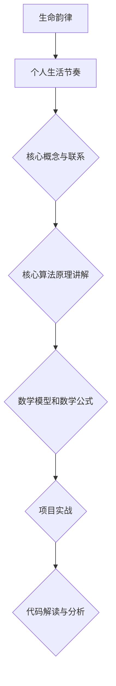

                 

### 《生命的韵律：创造个人独特的生活节奏》

> 关键词：生命韵律、个人生活节奏、生物节律、时间管理、心理健康、生活平衡

> 摘要：本文深入探讨了生命的韵律及其与个人生活节奏的关系。通过分析自然界和人类生活的生物节律，我们揭示了维持健康生活节奏的重要性。本文旨在帮助读者理解个人生物节律的原理，识别生活节奏失衡的迹象，并指导如何建立和调整个人生活节奏，以实现工作与生活的平衡，促进心理健康和持续成长。

## 第一部分：理解生命的韵律

### 第1章：生命的韵律概述

#### 1.1 生命的韵律是什么

生命的韵律是自然界和人类生活中周期性变化的规律。从宏观的宇宙运动到微观的生物活动，韵律无处不在。在自然界中，天文周期的韵律影响着季节变化，生物节律则决定了动植物的生存和繁衍。在人类生活中，生物节律同样扮演着重要角色，影响着我们的睡眠、情绪、认知和日常行为。

#### 1.2 生命韵律的重要性

生命韵律是我们身心健康的基础。它不仅影响我们的情绪和行为，还直接影响我们的身体健康。例如，睡眠-觉醒周期的节律影响我们的精神状态和认知能力，而饮食习惯和运动习惯的节律则影响我们的体重和心血管健康。理解并遵循生命韵律有助于提高生活质量，减少慢性疾病的风险。

#### 1.3 生命的韵律与个人生活节奏的关系

个人生活节奏是生命韵律在个人生活中的具体体现。个人生活节奏包括日常活动的规律、工作与休息的时间安排、饮食习惯和运动习惯等。一个良好的生活节奏有助于保持生物节律的平衡，从而提高生活质量和工作效率。

### 第2章：探索自然界的韵律

#### 2.1 自然界的韵律

自然界的韵律是宇宙和地球物理现象的周期性变化。天文周期的韵律包括地球自转、公转，以及太阳、月亮的周期性运动。这些天文周期对地球气候、生物节律和人类社会生活都有深远的影响。例如，地球的公转导致了季节变化，影响了植物的生长周期和动物的迁徙。

#### 2.1.1 天文周期的韵律

天文周期的韵律包括：

- 地球自转：一天24小时的周期，影响我们的睡眠和觉醒。
- 地球公转：一年365天的周期，导致季节变化。
- 月亮周期：大约29.5天的周期，影响潮汐和人类的情绪。
- 太阳周期：大约11年的周期，影响太阳活动，进而影响地球气候。

#### 2.1.2 季节变化的韵律

季节变化是地球公转引起的现象，对生物节律和人类生活有直接影响。例如，冬季的短日照和低温会影响动物的冬眠行为，夏季的长时间日照和高温则促进植物的光合作用。

#### 2.1.3 生物节律的例子

生物节律是指生物体内部生理和心理活动的周期性变化。以下是一些生物节律的例子：

- 昼夜节律：生物体根据光照和黑暗周期调整其生理和行为活动。
- 月亮节律：一些生物活动受到月亮周期的调节，例如潮汐性生物和夜行动物。
- 季节节律：某些动物在特定季节进行繁殖、迁徙或冬眠。

### 第3章：了解个人生物节律

#### 3.1 个人生物节律的原理

个人生物节律是指个体内部生理和心理活动的周期性变化。这些节律由大脑中的生物钟调控，生物钟是一个复杂的神经回路，能够感知环境和内部信号，调节个体的睡眠-觉醒周期、体温、激素分泌等。

#### 3.1.1 生理节律

生理节律包括睡眠-觉醒周期、体温周期和激素分泌周期等。这些节律共同作用于个体的生理功能，影响其健康状态。

- 睡眠-觉醒周期：大约24小时的周期，影响个体的睡眠质量和认知能力。
- 体温周期：大约24小时的周期，影响个体的代谢速率和身体功能。
- 激素分泌周期：如甲状腺激素、性激素等，影响个体的情绪和生理状态。

#### 3.1.2 心理节律

心理节律影响个体的情绪、认知和行为。例如，情绪波动的周期性变化可能导致个体的情绪起伏，而认知能力的周期性变化则影响个体的决策和反应速度。

#### 3.1.3 社会节律

社会节律是指个体在社会环境中的活动规律，如工作时间表、社交活动等。社会节律与个人生物节律相互作用，影响个体的生活质量。

### 第4章：识别个人生活节奏的失衡

#### 4.1 生活节奏失衡的迹象

生活节奏失衡可能导致一系列不良后果，包括：

- 疲劳和倦怠：长期生活节奏失衡可能导致身体和心理的疲劳，降低工作效率和生活质量。
- 情绪波动：生物节律失衡可能导致情绪不稳定，增加焦虑和抑郁的风险。
- 身体健康问题：生活节奏失衡可能导致慢性疾病的风险增加，如心血管疾病、肥胖等。

#### 4.1.1 疲劳和倦怠

疲劳和倦怠是生活节奏失衡的常见迹象。长期疲劳可能导致注意力不集中、反应迟钝，影响工作和生活效率。

#### 4.1.2 情绪波动

情绪波动是生物节律失衡的重要信号。情绪不稳定可能导致焦虑、抑郁等心理健康问题，影响生活质量。

#### 4.1.3 身体健康问题

生活节奏失衡可能导致一系列健康问题。例如，不规律的作息可能导致睡眠障碍，影响免疫力；长期的压力可能导致心血管疾病和肥胖。

### 第5章：建立个人生命韵律

#### 5.1 个性化生活节奏的设定

建立个性化生活节奏是保持身心健康的关键。以下步骤可以帮助设定个人生活节奏：

- **测量个人生物节律**：通过记录睡眠、饮食和活动习惯，了解自己的生物节律。
- **设定个人生活节奏目标**：根据个人需求和生物节律特点，设定合理的生活节奏目标。
- **实现目标的步骤**：制定具体的生活规划，逐步调整生活习惯，实现个人生活节奏的设定。

#### 5.1.1 个人生物节律的测量

测量个人生物节律的方法包括：

- **睡眠监测**：使用睡眠追踪器记录睡眠质量，分析睡眠周期。
- **饮食记录**：记录饮食习惯，分析营养摄入和代谢节奏。
- **活动日志**：记录日常活动，分析活动强度和频率。

#### 5.1.2 设定个人生活节奏的目标

设定个人生活节奏的目标应考虑以下因素：

- **个人需求**：根据个人工作、学习、生活需求设定合理的节奏目标。
- **生物节律特点**：结合个人生物节律特点，设定符合自身特点的节奏目标。
- **可持续性**：确保生活节奏目标具有可执行性和可持续性。

#### 5.1.3 实现目标的步骤

实现个人生活节奏目标的步骤包括：

- **制定生活规划**：根据目标设定详细的生活规划，包括作息时间、活动安排、饮食计划等。
- **逐步调整**：根据生活规划，逐步调整生活习惯，确保目标的实现。
- **持续监控**：定期评估生活节奏的执行情况，根据反馈进行调整。

## 第6章：平衡工作与生活的韵律

#### 6.1 工作生活的节奏调整

平衡工作与生活的节奏是现代生活中的一项重要任务。以下策略可以帮助实现工作与生活的平衡：

- **工作时间管理**：合理安排工作时间，避免加班和过度工作，确保充足的休息时间。
- **假期和休息时间安排**：充分利用假期和休息时间，放松身心，恢复精力。
- **工作与个人时间的平衡**：确保工作与个人时间的平衡，避免工作侵占个人时间，影响生活质量。

### 6.1.1 工作时间管理

工作时间管理是平衡工作与生活的重要环节。以下策略可以帮助提高工作效率，减少工作时间：

- **任务优先级**：根据任务的重要性和紧急程度，合理安排任务顺序，确保高效完成。
- **时间块安排**：将工作时间划分为不同的时间块，每个时间块专注于一项任务，提高专注力。
- **避免干扰**：在工作时避免不必要的干扰，如关闭手机、电子邮件等，集中精力完成任务。

### 6.1.2 假期和休息时间安排

合理安排假期和休息时间对于保持身心健康至关重要。以下策略可以帮助充分利用假期和休息时间：

- **规划假期**：提前规划假期，确保假期安排合理，避免工作压力。
- **放松身心**：在假期中放松身心，参与喜欢的活动，如旅行、阅读、运动等。
- **家庭和社交活动**：利用假期与家人和朋友共度时光，增强社交关系，提高生活质量。

### 6.1.3 工作与个人时间的平衡

工作与个人时间的平衡是现代生活中的一大挑战。以下策略可以帮助实现工作与个人时间的平衡：

- **设定工作边界**：明确工作时间和个人时间的边界，避免工作侵占个人时间。
- **合理规划时间**：合理安排工作和个人时间，确保两者相互平衡。
- **自我激励**：通过设定目标和奖励，激励自己在工作和个人时间之间找到平衡。

### 第7章：培养健康的生活节奏

#### 7.1 健康生活方式的养成

健康生活方式是保持身心健康的基础。以下策略可以帮助养成健康的生活方式：

- **健康饮食**：均衡饮食，摄入足够的营养素，避免过量摄入高热量食物。
- **适度运动**：定期进行适度的运动，增强身体素质，提高免疫力。
- **心理健康的重要性**：关注心理健康，保持积极的心态，应对压力和挑战。

### 7.1.1 健康饮食

健康饮食是保持身体健康的关键。以下策略可以帮助养成健康的饮食习惯：

- **多样化饮食**：摄入多种食物，确保营养均衡，避免单一食物摄入过多。
- **控制热量摄入**：根据个人需求控制热量摄入，避免过量摄入导致肥胖。
- **减少加工食品**：减少加工食品的摄入，选择新鲜、自然的食物。

### 7.1.2 适度运动

适度运动是保持身体健康的重要因素。以下策略可以帮助养成适度的运动习惯：

- **定期锻炼**：每周至少进行150分钟的中等强度运动，如快走、游泳、骑自行车等。
- **多样化运动**：结合有氧运动和力量训练，提高身体素质，增强肌肉力量。
- **适应个人情况**：根据个人身体状况和兴趣爱好选择适合自己的运动方式。

### 7.1.3 心理健康的重要性

心理健康是保持身心健康的重要组成部分。以下策略可以帮助维护心理健康：

- **积极心态**：保持积极的心态，面对挑战和压力，增强心理韧性。
- **有效应对压力**：学会有效应对压力，如通过冥想、放松技巧、与朋友交流等方式。
- **心理支持**：寻求心理支持和帮助，如咨询心理医生、参加心理辅导等。

## 第二部分：实现个人独特的生命韵律

### 第8章：探索个性化生活方式

#### 8.1 个人化生活的定义

个人化生活是指根据个人的需求、兴趣和价值观，量身定制的生活方式。它强调个体的独特性，鼓励人们根据自己的实际情况和需求，选择适合自己的生活模式。

#### 8.2 个人化生活的重要性

个人化生活的重要性体现在以下几个方面：

- **提高生活质量**：个人化生活有助于满足个体的独特需求，提高生活质量。
- **增强个人幸福感**：通过定制适合自己的生活方式，个体能够获得更高的幸福感和满足感。
- **促进自我实现**：个人化生活鼓励个体追求自己的梦想和目标，实现自我价值。

#### 8.3 如何实现个人化生活

实现个人化生活需要以下步骤：

- **自我认知**：了解自己的需求、兴趣、价值观和目标，为个人化生活奠定基础。
- **目标设定**：根据自我认知，设定个人生活目标，明确自己想要实现的生活方式。
- **行动计划**：制定具体的行动计划，逐步实现个人化生活目标。
- **持续调整**：根据生活反馈和变化，不断调整个人化生活方式，确保其持续符合个人需求。

### 第9章：构建个人生活节奏的策略

#### 9.1 制定个人生活计划

制定个人生活计划是实现个人化生活的重要步骤。以下策略可以帮助制定有效的个人生活计划：

- **目标明确**：明确个人生活目标，包括长期目标和短期目标。
- **时间规划**：合理安排时间，确保工作、学习和休息的时间得到充分保障。
- **任务分配**：将任务按照优先级进行分配，确保重要任务得到优先处理。
- **灵活调整**：根据实际情况和变化，灵活调整生活计划，确保其适应个人需求。

#### 9.1.1 短期目标与长期目标的设定

短期目标和长期目标是制定个人生活计划的重要环节。以下策略可以帮助设定短期和长期目标：

- **短期目标**：设定可量化、可实现的目标，如学习新技能、完成某个项目等。
- **长期目标**：设定具有挑战性、可持久的目标，如职业发展、财富积累等。
- **目标分解**：将长期目标分解为短期目标，逐步实现。
- **定期评估**：定期评估目标完成情况，根据反馈进行调整。

#### 9.1.2 日常活动的时间管理

日常活动的时间管理是实现个人化生活的重要方面。以下策略可以帮助提高时间管理效率：

- **任务优先级**：根据任务的重要性和紧急程度，合理安排任务顺序。
- **时间块安排**：将时间划分为不同的时间块，每个时间块专注于一项任务。
- **避免拖延**：设定明确的截止日期，避免拖延，确保任务按时完成。
- **时间反思**：定期反思时间管理效果，根据反馈进行调整。

#### 9.1.3 适应性调整的策略

适应性调整是实现个人化生活的重要策略。以下策略可以帮助个体适应环境变化，保持生活节奏：

- **灵活应对**：面对环境变化，灵活调整生活计划，确保其适应个人需求。
- **学习新技能**：不断学习新技能，提高适应能力，应对变化。
- **心态调整**：保持积极的心态，面对挑战和变化，增强心理韧性。
- **定期反思**：定期反思生活节奏和适应策略，根据反馈进行调整。

### 第10章：生命韵律与心理健康的关系

#### 10.1 心理健康与生活节奏

心理健康与生活节奏密切相关。一个良好的生活节奏有助于维持心理平衡，减少心理压力。以下策略可以帮助维持心理健康：

- **规律的作息时间**：保持规律的作息时间，确保充足的睡眠和休息。
- **合理安排工作与休息**：合理安排工作与休息，避免过度劳累和压力积累。
- **积极应对压力**：学会积极应对压力，如通过冥想、放松技巧、与朋友交流等方式。
- **保持良好的心态**：保持积极的心态，面对挑战和困难，增强心理韧性。

#### 10.1.1 心理健康的重要性

心理健康是指个体在情感、认知和行为方面的健康状态。心理健康的重要性体现在以下几个方面：

- **提高生活质量**：心理健康有助于提高生活质量，享受健康、快乐的生活。
- **增强社会功能**：心理健康有助于增强个体的社会功能，如沟通能力、人际交往能力等。
- **预防心理疾病**：心理健康有助于预防心理疾病，如抑郁症、焦虑症等。

#### 10.1.2 生命韵律与心理健康的关系

生命韵律与心理健康密切相关。良好的生命韵律有助于维持心理平衡，减少心理压力。以下关系说明生命韵律与心理健康之间的关联：

- **睡眠-觉醒周期**：良好的睡眠-觉醒周期有助于维持心理平衡，提高情绪稳定性。
- **饮食和运动习惯**：规律的饮食和运动习惯有助于调节情绪，提高心理健康水平。
- **工作和生活平衡**：良好的工作和生活平衡有助于减少工作压力，提高心理健康。

#### 10.1.3 心理健康维护的建议

以下建议可以帮助维护心理健康：

- **保持规律的作息时间**：确保充足的睡眠和休息，避免熬夜和过度劳累。
- **合理安排工作与休息**：合理安排工作与休息，避免过度劳累和压力积累。
- **积极参与社交活动**：积极参与社交活动，增强社交支持，提高心理健康水平。
- **学习放松技巧**：学习放松技巧，如冥想、深呼吸、瑜伽等，帮助缓解心理压力。
- **寻求专业帮助**：在遇到心理问题时，及时寻求专业帮助，如咨询心理医生、参加心理辅导等。

### 第11章：家庭与社会的生命韵律

#### 11.1 家庭生活节奏的协调

家庭生活节奏的协调对家庭成员的心理健康和生活质量至关重要。以下策略可以帮助协调家庭生活节奏：

- **共同制定家庭计划**：家庭成员共同制定家庭计划，确保家庭活动的协调和有序。
- **尊重个人需求**：尊重每个家庭成员的需求和习惯，确保家庭生活节奏适应个人需求。
- **合理安排家庭活动**：合理安排家庭活动，确保家庭成员有充足的休息和娱乐时间。
- **增强家庭沟通**：加强家庭成员之间的沟通，提高家庭凝聚力和生活质量。

#### 11.1.1 家庭成员的角色与责任

在家庭生活中，每个成员都扮演着不同的角色和责任。以下策略可以帮助明确家庭成员的角色和责任：

- **明确家庭目标**：家庭成员共同明确家庭目标，确保家庭生活有明确的方向。
- **分担家庭责任**：家庭成员分担家庭责任，确保家庭事务得到妥善处理。
- **培养家庭意识**：培养家庭意识，增强家庭成员之间的合作和沟通。
- **尊重家庭成员**：尊重家庭成员的意见和需求，营造和谐的家庭氛围。

#### 11.1.2 家庭时间表的制定

制定家庭时间表有助于协调家庭生活节奏，确保家庭成员有充足的时间和精力。以下策略可以帮助制定家庭时间表：

- **规划家庭活动**：根据家庭成员的需求和兴趣，规划家庭活动，确保家庭活动丰富多彩。
- **合理安排时间**：合理安排家庭成员的时间，确保家庭生活有序进行。
- **弹性安排**：根据实际情况和变化，灵活调整家庭时间表，确保其适应家庭需求。
- **沟通与协商**：家庭成员共同沟通和协商，确保家庭时间表的制定和执行。

#### 11.1.3 家庭生活节奏的调整

家庭生活节奏的调整是保持家庭和谐和成员幸福的重要环节。以下策略可以帮助调整家庭生活节奏：

- **适应变化**：面对家庭变化和挑战，灵活调整家庭生活节奏，确保家庭和谐。
- **积极沟通**：家庭成员之间积极沟通，分享感受和需求，增强家庭凝聚力。
- **共同成长**：家庭成员共同成长，提高家庭生活质量和幸福感。
- **寻求专业帮助**：在遇到家庭问题时，及时寻求专业帮助，如家庭咨询、心理辅导等。

#### 11.2 社会生活中的节奏感

在社会生活中，节奏感是指个体对时间感知和应对社会环境变化的能力。以下策略可以帮助培养社会生活中的节奏感：

- **适应社会环境**：了解社会环境的变化，适应不同的社会节奏，提高社会适应能力。
- **合理安排时间**：合理安排工作和休息时间，确保有足够的时间应对社会生活中的挑战。
- **提高自我调节能力**：学会自我调节，缓解社会压力，提高生活质量。
- **积极参与社会活动**：积极参与社会活动，增强社交技能，提高社会地位和幸福感。

#### 11.2.1 社交活动与生活节奏

社交活动对个体的生活节奏有重要影响。以下策略可以帮助协调社交活动与生活节奏：

- **合理安排社交活动**：合理安排社交活动，确保社交活动不影响工作和生活。
- **选择适合自己的社交活动**：选择适合自己的社交活动，提高社交活动的质量。
- **保持社交活动节奏**：保持社交活动节奏，避免过度参与或过度忽视社交活动。
- **平衡社交活动与个人时间**：平衡社交活动与个人时间，确保有足够的时间用于自我提升和发展。

#### 11.2.2 社会责任与生活节奏

社会责任与生活节奏密切相关。以下策略可以帮助平衡社会责任与个人生活节奏：

- **明确社会责任**：明确个人社会责任，确保社会责任与个人生活节奏相协调。
- **合理安排时间**：合理安排时间，确保有足够的时间履行社会责任。
- **提高工作效率**：提高工作效率，减少工作对生活节奏的影响。
- **寻求社会支持**：寻求社会支持，如志愿者组织、社会组织等，帮助履行社会责任。

#### 11.2.3 社会节奏对个人生活的影响

社会节奏对个人生活有深远影响。以下因素可以帮助了解社会节奏对个人生活的影响：

- **工作压力**：社会节奏加快，工作压力增大，影响个人生活质量和心理健康。
- **时间观念**：社会节奏对时间观念有深刻影响，提高对时间的管理和利用能力。
- **生活方式**：社会节奏影响个体的生活方式，如饮食习惯、运动习惯等。
- **心理健康**：社会节奏对心理健康有直接影响，提高心理健康水平有助于应对社会节奏带来的压力。

### 第12章：生命的韵律与持续成长

#### 12.1 个人成长与生命韵律

个人成长与生命韵律密切相关。良好的生命韵律有助于促进个人成长，提高自我认知和能力。以下策略可以帮助促进个人成长：

- **自我反思**：定期进行自我反思，了解自己的优势和不足，制定个人成长计划。
- **持续学习**：保持持续学习，提高知识和技能，适应社会环境的变化。
- **积极应对挑战**：积极应对挑战，锻炼自己的能力和心理韧性。
- **建立支持系统**：建立支持系统，如家人、朋友、导师等，帮助个人成长。

#### 12.1.1 成长与自我认知

个人成长与自我认知密切相关。以下策略可以帮助提高自我认知：

- **自我观察**：观察自己的行为、思维和情绪，了解自己的内心世界。
- **接受反馈**：接受他人的反馈，了解自己的优点和不足，制定改进计划。
- **定期评估**：定期评估个人成长情况，根据评估结果进行调整。
- **培养自我认知能力**：通过阅读、学习、反思等方式，培养自我认知能力。

#### 12.1.2 不断调整与适应

个人成长需要不断调整与适应。以下策略可以帮助不断调整与适应：

- **灵活应对变化**：面对环境变化，灵活调整自己的思维和行为。
- **保持开放心态**：保持开放心态，接受新的观念和知识，不断拓展自己的视野。
- **培养适应能力**：通过实践和锻炼，提高适应能力，应对各种挑战。
- **不断学习**：不断学习新知识、新技能，提高自己的竞争力和适应能力。

#### 12.1.3 持续成长的动力

持续成长需要强大的动力。以下策略可以帮助保持持续成长的动力：

- **明确目标**：明确个人成长目标，激发内在动力。
- **设定阶段性目标**：将长期目标分解为阶段性目标，逐步实现，保持动力。
- **奖励自己**：设定奖励机制，为自己实现目标提供奖励。
- **与他人分享**：与他人分享成长经验和成果，获得支持与鼓励。

### 第13章：总结与反思

#### 13.1 生命的韵律：个人生活的艺术

生命的韵律是个人生活的核心，它不仅影响着我们的身体健康，还影响着我们的心理状态和社交关系。通过理解和遵循生命的韵律，我们可以更好地管理时间、提高生活质量，实现个人成长和幸福。

#### 13.2 生命韵律的重要性

生命韵律的重要性体现在它对身心健康、生活质量和个人成长的影响。良好的生命韵律有助于提高身体免疫力、改善心理健康、增强社会功能，从而提高整体生活质量。

#### 13.3 如何保持生命的韵律

保持生命的韵律需要我们从以下几个方面着手：

- **了解自己的生物节律**：通过自我观察和记录，了解自己的生物节律特点，为个人生活节奏的设定提供依据。
- **设定合理的生活节奏**：根据个人生物节律特点，设定合理的生活节奏，确保工作、学习和休息的平衡。
- **养成良好的生活习惯**：培养健康的生活方式，如规律的作息时间、健康的饮食习惯、适度的运动等，维持良好的生命韵律。
- **持续调整与适应**：面对环境变化和个人需求的变化，持续调整生活节奏，保持生命的韵律。

### 附录

#### 附录 A：生命韵律相关资源

**A.1 书籍推荐**

1. 《生物节律：时间、睡眠与健康的秘密》
2. 《生命的节奏：探索人类生物钟的奥秘》
3. 《时间管理：如何高效利用时间，提升生活质量》

**A.2 网络资源**

1. 网易云课堂 - 《时间管理大师：如何高效利用时间》
2. TED演讲 - 《如何掌控你的时间？》
3. 心理学家彼得·希夫 - 《生物钟：生命的秘密》

**A.3 生命韵律的实践与应用**

1. 睡眠监测应用程序：如“华为健康”、“小米运动”等，帮助用户了解自己的睡眠质量。
2. 健康生活方式应用程序：如“薄荷健康”、“MyFitnessPal”等，帮助用户制定健康饮食和运动计划。
3. 个人生活管理工具：如“滴答清单”、“Google 日历”等，帮助用户管理日常活动和时间。

# Mermaid 流程图：生命韵律与个人生活节奏的关系



# Python源代码示例：个人生活节奏分析

```python
import pandas as pd

# 假设我们有一个个人活动时间记录的DataFrame
activity_data = pd.DataFrame({
    'Date': ['2023-01-01', '2023-01-02', '2023-01-03'],
    'Activity': ['工作', '运动', '休息'],
    'Duration(hours)': [8, 2, 6]
})

# 计算每天活动的总时长
total_duration = activity_data['Duration(hours)'].sum()

# 输出总时长
print(f"总活动时长：{total_duration}小时")

# 计算活动类型占比
activity_duration = activity_data.groupby('Activity')['Duration(hours)'].sum()
activity_percentage = (activity_duration / total_duration) * 100

# 输出活动类型占比
print("活动类型占比：")
print(activity_percentage)

# 计算每天的平均活动时长
average_duration = total_duration / len(activity_data)

# 输出每天的平均活动时长
print(f"每天的平均活动时长：{average_duration}小时")
```

## 结论

通过本文的探讨，我们深刻理解了生命的韵律与个人生活节奏之间的关系。生命的韵律是自然界和人类生活中的周期性变化规律，它对身心健康、生活质量和个人成长具有重要影响。理解并遵循生命的韵律，有助于我们更好地管理时间、提高生活质量，实现个人成长和幸福。

在未来的生活和工作中，让我们以本文的探讨为基础，深入探索生命的韵律，努力建立和维持个人独特的生命韵律，以实现身心健康、生活平衡和个人成长。同时，也让我们不断学习和实践，将生命韵律的理念融入日常生活，为自身和他人的幸福贡献力量。

最后，感谢您阅读本文，希望本文能够帮助您更好地理解生命的韵律，创造个人独特的生活节奏。如果您有任何问题或建议，欢迎在评论区留言，让我们共同探讨和进步。作者：AI天才研究院/AI Genius Institute & 禅与计算机程序设计艺术 /Zen And The Art of Computer Programming。

