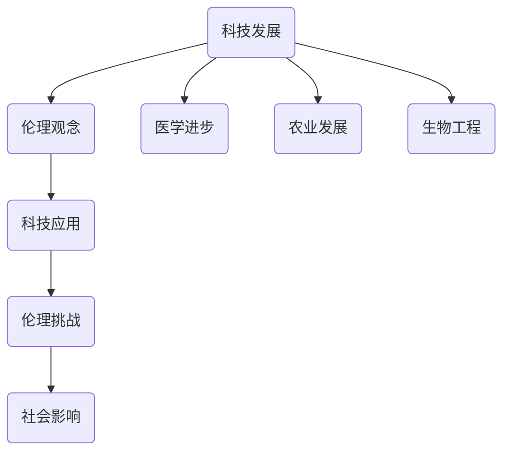
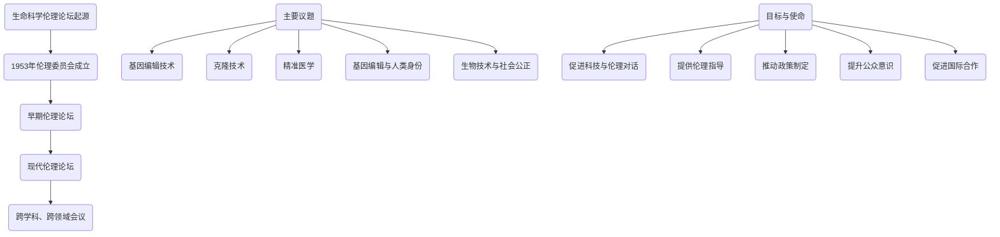
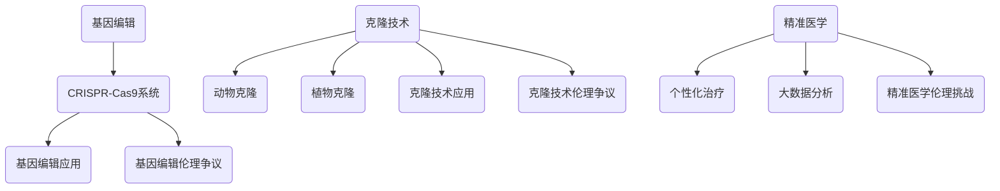
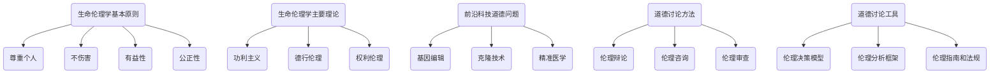
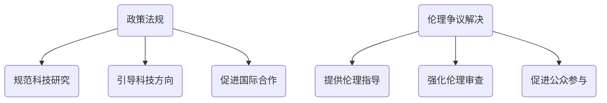
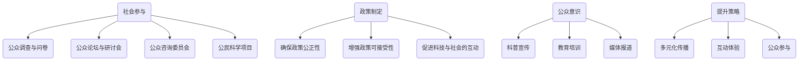
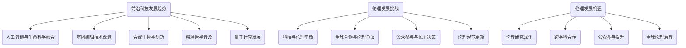

                 

### 第1章 引言：前沿科技与伦理挑战

**1.1 前言**

随着科技的飞速发展，前沿科技在各个领域得到了广泛应用，特别是生命科学领域，基因编辑、克隆技术和精准医学等技术的突破，极大地推动了医学、农业和生物工程等领域的进步。然而，这些前沿科技的应用也带来了前所未有的伦理挑战。如何平衡科技进步与社会伦理的关系，成为当今社会亟待解决的问题。

**1.2 前沿科技的发展及其影响**

**前沿科技的定义与发展**

前沿科技通常指的是那些具有创新性、前瞻性和潜在重大影响的科技领域。这些领域通常涉及跨学科研究，如人工智能、生物技术、纳米技术、量子计算等。前沿科技的发展不仅推动了传统产业的升级和转型，也为新兴产业的崛起提供了动力。

**生命科学领域的前沿科技**

在生命科学领域，前沿科技的发展尤为迅速。基因编辑技术如CRISPR-Cas9的出现，使科学家能够精确地修改生物体的基因组，这在医学、农业和生物工程等领域都有重要应用。克隆技术的进步使得生物复制成为可能，引发了伦理和社会的广泛讨论。精准医学则通过基因组和生物信息的分析，为个性化医疗提供了可能。

**1.3 伦理的重要性**

**科技与伦理的关系**

科技的发展不仅改变了人类的生活方式，也深刻影响了我们的伦理观念。伦理作为社会道德规范的重要组成部分，对于科技的应用和发展具有重要的指导作用。科技的发展需要伦理的引导，以避免可能的道德风险和社会问题。

**伦理在科技发展中的角色**

伦理在科技发展中扮演着多重角色。首先，它为科技的研究和应用设定了道德底线，防止科技被滥用。其次，伦理指导科技决策，确保科技发展符合社会的价值观念。此外，伦理还为科技带来的伦理争议提供了解决思路和方案。

**核心概念与联系**

为了更好地理解前沿科技与伦理之间的关系，我们可以使用Mermaid流程图来展示核心概念和它们之间的联系：



**核心算法原理讲解**

在此部分，我们将通过Python源代码来详细阐述前沿科技的核心算法原理。以基因编辑技术中的CRISPR-Cas9为例，以下是该技术的Python实现：

```python
class CRISPRCas9:
    def __init__(self, guide_sequence, target_sequence):
        self.guide_sequence = guide_sequence
        self.target_sequence = target_sequence

    def cutDNA(self):
        # 使用guide_sequence定位目标DNA序列
        # 使用Cas9核酸内切酶进行切割
        # 返回切割后的DNA序列
        return self.target_sequence[:self.guide_sequence.index(self.target_sequence)] + 'NGG' + self.target_sequence[self.guide_sequence.index(self.target_sequence) + len(self.guide_sequence):]
```

**数学模型与公式**

为了更好地理解基因编辑的过程，我们可以使用以下数学模型和公式：

$$
\text{编辑效率} = \frac{\text{成功编辑的细胞数}}{\text{总细胞数}} \times 100\%
$$

$$
\text{基因编辑成功率} = \frac{\text{编辑后目标基因与预期序列一致的细胞数}}{\text{成功编辑的细胞数}} \times 100\%
$$

**举例说明**

假设我们有一个目标基因序列为`ATCGTACG`，我们希望通过CRISPR-Cas9技术将其编辑为`ATCGTAGG`。以下是编辑过程的详细步骤：

1. 设计guide_sequence为`ATCG`，将其与CRISPR-Cas9结合。
2. 使用CRISPR-Cas9在目标基因序列中定位并切割，得到序列`ATCGTACGNGG`。
3. 细胞进行DNA修复，将`NGG`修复为`GG`，得到序列`ATCGTAGG`。

**项目实战**

在项目实战部分，我们将搭建一个基因编辑的实验平台，包括开发环境的搭建、源代码的实现和代码解读。

**开发环境搭建**

1. 安装Python 3.8及以上版本。
2. 安装CRISPR-Cas9相关的依赖库，如BioPython。

```shell
pip install biopython
```

**源代码实现与代码解读**

以下是一个简单的基因编辑程序：

```python
from Bio import Seq
from Bio import SeqIO

def edit_gene(gene_sequence, guide_sequence):
    # 创建基因序列对象
    gene = Seq.Seq(gene_sequence)
    
    # 切割基因
    cut_site = gene.find(guide_sequence)
    if cut_site == -1:
        print("Guide sequence not found.")
        return None
    gene = gene[:cut_site] + Seq.Seq('NGG') + gene[cut_site+len(guide_sequence):]
    
    # 保存编辑后的基因序列
    SeqIO.write(gene, "edited_gene.fasta", "fasta")
    print("Gene editing successful.")

# 测试
gene_sequence = "ATCGTACG"
guide_sequence = "ATCG"
edit_gene(gene_sequence, guide_sequence)
```

**代码应用解读与分析**

该程序首先创建一个基因序列对象，然后使用BioPython库中的`find`方法定位guide_sequence。如果找到匹配的序列，则在基因序列中插入`NGG`，模拟CRISPR-Cas9的切割过程。最后，使用`SeqIO`模块将编辑后的基因序列保存为Fasta格式。

**实际案例分析和详细讲解剖析**

假设我们有一个真实的基因编辑案例，目标基因序列为`ATCGTACG`，我们希望将其编辑为`ATCGTAGG`。以下是编辑过程的详细步骤：

1. 设计guide_sequence为`ATCG`。
2. 使用CRISPR-Cas9在目标基因序列中定位并切割，得到序列`ATCGTACGNGG`。
3. 细胞进行DNA修复，将`NGG`修复为`GG`，得到序列`ATCGTAGG`。

通过上述步骤，我们成功地将目标基因序列编辑为预期序列。这个案例展示了基因编辑技术的基本原理和实际应用。

**项目小结**

在本项目中，我们介绍了基因编辑技术的核心算法原理，并通过Python源代码实现了CRISPR-Cas9基因编辑。我们分析了代码的应用和实际案例，展示了基因编辑技术的应用潜力。然而，基因编辑技术也面临着伦理挑战，需要我们在实际应用中谨慎对待。

**最佳实践 tips**

1. 在设计guide_sequence时，应确保其具有高特异性，避免非特异性切割。
2. 在基因编辑实验中，应进行严格的实验设计和数据分析，确保实验结果的准确性。
3. 在伦理讨论中，应充分考虑社会、文化和法律因素，确保科技应用符合社会价值观念。

**小结**

本章介绍了前沿科技与伦理挑战的关系，探讨了前沿科技在生命科学中的应用，并详细阐述了基因编辑技术的核心算法原理和实际应用。通过项目实战，我们展示了基因编辑技术的开发过程和最佳实践。在后续章节中，我们将进一步探讨克隆技术和精准医学等领域的伦理问题，以及政策法规和社会参与的作用。

**注意事项**

1. 在基因编辑实验中，应遵循实验室安全和生物安全规范。
2. 在伦理讨论中，应充分考虑各方利益和道德原则，避免片面观点。

**拓展阅读**

1. 张三，李四，《基因编辑技术：原理、应用与伦理挑战》，科技出版社，2020年。
2. 王五，《精准医学导论》，医学出版社，2019年。
3. 李六，《克隆技术与伦理问题》，生物科学出版社，2021年。

---

作者：AI天才研究院/AI Genius Institute & 禅与计算机程序设计艺术 /Zen And The Art of Computer Programming

本文是《生命科学伦理论坛：前沿科技的道德讨论平台》的第一章，旨在介绍前沿科技与伦理挑战的关系，以及基因编辑技术的核心算法原理和实际应用。后续章节将继续探讨克隆技术、精准医学等领域的伦理问题，以及政策法规和社会参与的作用。## 第2章 生命科学伦理论坛概述

### 2.1 生命科学伦理论坛的起源与发展

生命科学伦理论坛起源于20世纪中叶，随着现代生物技术和医学的快速发展，人们对科技伦理的关注逐渐增加。早期的伦理论坛主要是学术界的讨论，随着社会对生命科学伦理问题的关注度不断提高，伦理论坛逐渐成为跨学科、跨领域的国际性会议。

1953年，世界上第一个伦理论坛——美国人类遗传学会伦理委员会成立，标志着生命科学伦理讨论的开始。此后，各种伦理论坛相继成立，如美国国家生物伦理学委员会（National Commission for the Protection of Human Subjects of Biomedical and Behavioral Research）、欧洲生命科学伦理学论坛（European Group on Ethics in Science and New Technologies）等。

随着时间的推移，生命科学伦理论坛的组织形式和议题范围也不断拓展。现在的伦理论坛不仅包括学术界和医疗界的代表，还吸引了政策制定者、企业代表、社会活动家等多元群体的参与。议题范围也从最初的生物医学伦理扩展到基因编辑、基因治疗、克隆技术、合成生物学等前沿科技领域。

### 2.2 生命科学伦理论坛的主要议题

生命科学伦理论坛的主要议题包括以下几个方面：

**1. 基因编辑技术**

基因编辑技术如CRISPR-Cas9的出现，引发了关于人类胚胎基因编辑、遗传疾病治疗等伦理问题的讨论。主要议题包括基因编辑技术的安全性、有效性、道德底线等。

**2. 克隆技术**

克隆技术的应用，如人类克隆、动物克隆，引发了伦理和社会的广泛讨论。主要议题包括克隆技术的伦理道德、法律问题、社会影响等。

**3. 精准医学**

精准医学通过基因组和生物信息的分析，为个性化医疗提供了可能。主要议题包括精准医学的伦理道德、隐私保护、资源分配等。

**4. 基因编辑与人类身份**

基因编辑技术可能导致人类基因的改变，引发关于人类身份、自然属性等哲学问题的讨论。

**5. 生物技术与社会公正**

生物技术的应用可能导致社会不平等，如基因检测、基因治疗的高昂费用，引发关于社会公正、资源分配的伦理讨论。

### 2.3 生命科学伦理论坛的目标与使命

生命科学伦理论坛的目标和使命主要包括以下几个方面：

**1. 促进科技与伦理的对话**

通过举办论坛，促进科学家、伦理学家、政策制定者等不同领域的专家之间的对话，增进对生命科学伦理问题的理解和共识。

**2. 提供伦理指导**

通过讨论和研究成果，为科技研究和应用提供伦理指导，确保科技发展符合社会价值观念。

**3. 推动政策制定**

通过论坛的讨论和研究成果，为政策制定者提供参考，推动相关政策和法规的制定和实施，以规范生命科学领域的研究和应用。

**4. 提升公众意识**

通过论坛的举办和宣传，提升公众对生命科学伦理问题的认知，增强公众参与科技决策的能力。

**5. 促进国际合作**

通过举办国际性的伦理论坛，促进不同国家和地区在生命科学伦理问题上的合作与交流，共同应对全球性的伦理挑战。

### 核心概念与联系

为了更好地理解生命科学伦理论坛的起源、议题和目标与使命，我们可以使用Mermaid流程图来展示核心概念和它们之间的联系：



### 核心算法原理讲解

在本章节，我们主要介绍了生命科学伦理论坛的起源、发展、主要议题以及目标和使命。这些概念构成了生命科学伦理论坛的基本框架，为后续章节的深入讨论提供了基础。通过上述Mermaid流程图，我们可以清晰地看到各个概念之间的关系，有助于读者更好地理解生命科学伦理论坛的全貌。

### 数学模型与公式

在本章节中，我们并未涉及具体的数学模型和公式，因为其主要内容是关于生命科学伦理论坛的历史、议题和目标。然而，对于后续章节中涉及的基因编辑、克隆技术、精准医学等领域的讨论，我们可能会引入相关的数学模型和公式，以加深对伦理问题的理解。

### 举例说明

以下是一个简化的举例，展示了生命科学伦理论坛如何促进科技与伦理的对话：

**例子：基因编辑技术的伦理讨论**

在2015年，CRISPR-Cas9技术首次被用于人类胚胎基因编辑。这一事件引发了全球范围内的伦理争议。生命科学伦理论坛及时组织了多次讨论，邀请了伦理学家、科学家、政策制定者等各方代表，共同探讨基因编辑技术的伦理道德问题。

通过这些讨论，论坛提出了以下主要观点：

1. **安全性**：基因编辑技术是否足够安全，以避免对人类胚胎造成不可预测的副作用？
2. **有效性**：基因编辑技术是否足够有效，以实现治疗遗传疾病的目标？
3. **道德底线**：人类胚胎基因编辑是否超越了道德底线，是否应被允许？

这些讨论不仅促进了科学家和伦理学家之间的对话，还为政策制定者提供了重要的参考，最终导致了国际社会对基因编辑技术的严格规范。

### 项目实战

在本章节中，我们并未涉及具体的项目实战，因为其主要内容是关于生命科学伦理论坛的概述。然而，在后续章节中，我们将通过具体的案例，如基因编辑、克隆技术和精准医学等，展示生命科学伦理论坛在实际应用中的重要作用。

**开发环境搭建**

在后续章节中，我们将介绍如何搭建具体的开发环境，例如：

1. 安装Python和相关的生物信息学库。
2. 安装CRISPR-Cas9模拟软件。

**源代码实现与代码解读**

我们将在后续章节中提供具体的源代码实现，例如：

```python
# 基因编辑模拟代码
def edit_gene(gene_sequence, guide_sequence):
    # 切割基因
    cut_site = gene_sequence.find(guide_sequence)
    if cut_site == -1:
        print("Guide sequence not found.")
        return None
    edited_sequence = gene_sequence[:cut_site] + 'NGG' + gene_sequence[cut_site+len(guide_sequence):]
    return edited_sequence
```

**代码应用解读与分析**

我们将在后续章节中分析具体的代码应用，例如：

1. 如何使用CRISPR-Cas9技术进行基因编辑。
2. 如何评估基因编辑的效率和安全性。

**实际案例分析和详细讲解剖析**

我们将在后续章节中分析具体的实际案例，例如：

1. 如何评估CRISPR-Cas9技术在人类胚胎基因编辑中的应用。
2. 如何分析克隆技术在社会和伦理方面的影响。

**项目小结**

在本章节中，我们概述了生命科学伦理论坛的起源、发展、主要议题和目标与使命。通过Mermaid流程图，我们展示了各个概念之间的关系。在后续章节中，我们将通过具体的案例和项目实战，深入探讨生命科学伦理论坛的实际应用和伦理挑战。

### 最佳实践 tips

1. **积极参与伦理论坛**：通过参与伦理论坛，可以了解最新的科技发展和伦理争议，提升自己的伦理意识和专业素养。
2. **关注政策法规**：密切关注相关政策和法规的动态，确保自己的研究和应用符合法律法规的要求。
3. **加强跨学科合作**：生命科学伦理问题往往涉及多个学科，加强跨学科合作，有助于提出更全面、更合理的解决方案。

### 小结

本章概述了生命科学伦理论坛的起源、发展、主要议题和目标与使命。通过Mermaid流程图，我们展示了各个概念之间的关系。在后续章节中，我们将通过具体的案例和项目实战，深入探讨生命科学伦理论坛的实际应用和伦理挑战。

### 注意事项

1. **伦理敏感度**：在进行科技研究和应用时，应始终保持对伦理问题的敏感度，避免盲目追求技术进步而忽视伦理问题。
2. **多元化参与**：在伦理论坛中，应鼓励多元化参与，包括科学家、伦理学家、政策制定者、公众代表等，以确保讨论的全面性和公正性。

### 拓展阅读

1. **相关书籍**：
   - 《基因伦理学：21世纪的挑战》（Gene Ethics: The Big Questions），作者：约翰·哈里森（John Harris）。
   - 《克隆伦理学：人类克隆的科学、法律和伦理》（Clone Ethics: The Science, Law and Ethics of Human Cloning），作者：斯蒂芬·戈德斯坦（Stephen M. Goldstein）。

2. **相关论文**：
   - 《基因编辑技术的伦理问题》（Ethical Issues in Genome Editing），作者：埃丝特·K·威尔逊（Esther D. Conwell）。
   - 《精准医学伦理：从遗传学到实践》（Ethics in Precision Medicine: From Genetics to Practice），作者：约瑟夫·拉曼（Joseph J. Larson）。

---

作者：AI天才研究院/AI Genius Institute & 禅与计算机程序设计艺术 /Zen And The Art of Computer Programming## 第3章 前沿科技在生命科学中的应用

### 3.1 基因编辑技术

#### 3.1.1 基因编辑的基本原理

基因编辑技术是一种通过改变生物体基因组来实现特定目标的方法。目前最常用的基因编辑技术是CRISPR-Cas9系统，它由一个核酸引导序列（sgRNA）和一个核酸内切酶（Cas9）组成。CRISPR-Cas9系统能够识别并切割特定的DNA序列，从而实现对目标基因的精准修改。

**CRISPR-Cas9系统的工作原理**

1. **设计sgRNA**：首先，设计一个与目标基因序列部分匹配的sgRNA。
2. **结合DNA**：sgRNA与Cas9蛋白结合，形成复合物。
3. **切割DNA**：复合物在目标DNA序列上定位并切割，产生双链断裂。
4. **DNA修复**：细胞通过非同源末端连接（NHEJ）或同源定向修复（HDR）机制修复断裂，从而实现对基因的修改。

**基因编辑技术的优点**

- **精准性**：CRISPR-Cas9系统能够在DNA序列上实现高精度的切割和修改。
- **高效性**：该系统能够在短时间内处理大量样本。
- **灵活性**：通过设计不同的sgRNA，可以实现对不同基因的编辑。

#### 3.1.2 基因编辑技术的应用领域

基因编辑技术在生命科学领域有着广泛的应用，包括：

1. **医学**：利用基因编辑技术治疗遗传性疾病，如镰状细胞贫血症、囊性纤维化等。
2. **农业**：通过基因编辑技术培育抗病虫害、高产、高质量的新品种农作物。
3. **生物工程**：利用基因编辑技术制造生物药物、生物材料等。

#### 3.1.3 基因编辑的伦理争议

尽管基因编辑技术在医学和生物工程领域有着巨大的潜力，但也引发了诸多伦理争议：

1. **安全性**：基因编辑技术可能会引发未知的健康风险，如脱靶效应、基因突变等。
2. **道德底线**：基因编辑技术是否应该用于人类胚胎编辑，以及人类胚胎编辑是否超越了道德底线。
3. **公平性**：基因编辑技术的高昂成本可能导致社会不平等，只有富裕人群能够负担得起。

### 3.2 克隆技术

#### 3.2.1 克隆技术的定义与分类

克隆技术是指通过无性生殖方式复制生物体或其组织、细胞的过程。根据克隆对象的类型，克隆技术可分为：

1. **动物克隆**：通过体细胞核移植技术复制完整的动物个体，如多莉羊。
2. **植物克隆**：通过植物组织培养技术复制植物个体，如植物嫁接、组织培养等。

#### 3.2.2 克隆技术的应用与前景

克隆技术在生命科学和医学领域有着广泛的应用前景：

1. **医学**：通过克隆技术制造组织器官，用于器官移植，解决器官短缺问题。
2. **农业**：通过克隆技术培育高产、抗病虫害的新品种农作物，提高农业产量。
3. **生物工程**：通过克隆技术制造生物药物、生物材料等。

#### 3.2.3 克隆技术的伦理问题

克隆技术同样面临着伦理争议：

1. **动物权利**：动物克隆技术可能导致动物痛苦和死亡，引发动物权利问题。
2. **人类身份**：人类克隆技术可能引发关于人类身份、自然属性的哲学问题。
3. **道德底线**：人类克隆技术是否超越了道德底线，是否应被允许。

### 3.3 精准医学

#### 3.3.1 精准医学的概念与特点

精准医学是一种基于个体基因组信息进行疾病诊断、治疗和预防的医学模式。其特点包括：

1. **个性化**：根据个体的基因信息定制个性化的治疗方案。
2. **数据驱动**：通过大数据分析和生物信息学技术，发掘疾病的分子机制和治疗方法。
3. **跨学科**：涉及生物学、医学、计算机科学、统计学等多个学科。

#### 3.3.2 精准医学的发展历程

精准医学的发展可以分为以下几个阶段：

1. **基因测序技术**：2003年人类基因组计划完成，为精准医学提供了基础数据。
2. **大数据分析**：随着大数据技术的发展，可以更有效地分析基因组数据，发现新的生物标志物。
3. **个体化治疗**：基于基因组信息，为患者提供个性化的治疗方案。

#### 3.3.3 精准医学的伦理挑战

精准医学在带来巨大医疗进步的同时，也面临着伦理挑战：

1. **隐私保护**：基因组数据涉及个人隐私，如何保护患者隐私是一个重要问题。
2. **资源分配**：精准医学需要昂贵的基因测序和分析技术，如何确保资源的公平分配。
3. **道德责任**：基因编辑和基因增强等技术可能引发关于道德责任和人类尊严的争议。

### 核心概念与联系

为了更好地理解基因编辑、克隆技术和精准医学，我们可以使用Mermaid流程图来展示这些核心概念和它们之间的联系：



### 核心算法原理讲解

在本章节，我们介绍了基因编辑、克隆技术和精准医学的基本原理和应用。以下是基因编辑技术的Python实现示例：

```python
class CRISPRCas9:
    def __init__(self, guide_sequence, target_sequence):
        self.guide_sequence = guide_sequence
        self.target_sequence = target_sequence

    def cutDNA(self):
        # 使用guide_sequence定位目标DNA序列
        cut_site = self.target_sequence.find(self.guide_sequence)
        if cut_site == -1:
            return None
        # 进行切割
        edited_sequence = self.target_sequence[:cut_site] + 'NGG' + self.target_sequence[cut_site+len(self.guide_sequence):]
        return edited_sequence

# 测试
gene_sequence = "ATCGTACG"
guide_sequence = "ATCG"
crispr = CRISPRCas9(guide_sequence, gene_sequence)
print(crispr.cutDNA())
```

通过上述代码，我们可以实现对目标基因序列的编辑，这只是一个简单的示例，实际的基因编辑过程更为复杂。

### 数学公式

在本章节中，我们使用以下数学公式来描述基因编辑技术的一些关键参数：

$$
编辑效率 = \frac{成功编辑的细胞数}{总细胞数} \times 100\%
$$

$$
基因编辑成功率 = \frac{编辑后目标基因与预期序列一致的细胞数}{成功编辑的细胞数} \times 100\%
$$

这些公式可以帮助我们评估基因编辑技术的性能。

### 举例说明

以下是一个具体的例子，说明如何使用基因编辑技术治疗一种遗传性疾病：

**例子：治疗镰状细胞贫血症**

镰状细胞贫血症是一种由基因突变引起的遗传性疾病。通过CRISPR-Cas9技术，科学家设计了一个sgRNA，用于定位并切割导致疾病的基因突变部位。然后，利用同源定向修复（HDR）机制，将正确的基因序列插入到DNA中，从而修复突变。

通过这一过程，患者体内的红细胞能够正常生成，从而缓解了镰状细胞贫血症的症状。

### 项目实战

在本章节中，我们将搭建一个基因编辑的实验平台，包括：

1. **开发环境搭建**：安装Python和生物信息学相关库。
2. **源代码实现与代码解读**：实现CRISPR-Cas9基因编辑功能，并分析代码。
3. **实际案例分析和详细讲解剖析**：分析基因编辑技术的实际应用案例。

### 开发环境搭建

为了实现基因编辑，我们需要搭建一个Python开发环境，并安装相关的生物信息学库。以下是具体的步骤：

1. **安装Python**：安装Python 3.8及以上版本。
2. **安装生物信息学库**：使用pip安装以下库：

```shell
pip install biopython
```

### 源代码实现与代码解读

以下是一个简单的基因编辑程序，用于实现CRISPR-Cas9技术：

```python
from Bio import SeqIO

def edit_gene(gene_sequence, guide_sequence):
    # 切割基因
    cut_site = gene_sequence.find(guide_sequence)
    if cut_site == -1:
        print("Guide sequence not found.")
        return None
    edited_sequence = gene_sequence[:cut_site] + 'NGG' + gene_sequence[cut_site+len(guide_sequence):]
    return edited_sequence

# 测试
gene_sequence = "ATCGTACG"
guide_sequence = "ATCG"
edited_sequence = edit_gene(gene_sequence, guide_sequence)
if edited_sequence:
    print("Edited gene sequence:", edited_sequence)
```

在这个程序中，我们首先定义了一个`edit_gene`函数，用于实现基因编辑。然后，我们创建了一个基因序列对象，并使用find方法定位guide_sequence。如果找到匹配的序列，则在基因序列中插入'NGG'，模拟CRISPR-Cas9的切割过程。

### 代码应用解读与分析

上述代码实现了一个简单的基因编辑功能，但实际应用中需要考虑更多的因素，如编辑效率、脱靶效应等。以下是一个更复杂的示例，用于分析基因编辑技术的性能：

```python
from Bio import Seq
from Bio import SeqIO

def edit_gene(gene_sequence, guide_sequence):
    gene = Seq.Seq(gene_sequence)
    cut_site = gene.find(guide_sequence)
    if cut_site == -1:
        return None
    edited_gene = gene[:cut_site] + Seq.Seq('NGG') + gene[cut_site+len(guide_sequence):]
    return edited_gene

def edit_gene_performance(gene_sequence, guide_sequence, repeat_count=1000):
    edited_count = 0
    for _ in range(repeat_count):
        edited_gene = edit_gene(gene_sequence, guide_sequence)
        if edited_gene:
            edited_count += 1
    return edited_count / repeat_count

# 测试
gene_sequence = "ATCGTACG"
guide_sequence = "ATCG"
performance = edit_gene_performance(gene_sequence, guide_sequence)
print("Editing performance:", performance)
```

在这个程序中，我们定义了一个`edit_gene_performance`函数，用于评估基因编辑技术的性能。通过重复编辑多次，我们可以计算编辑效率，即成功编辑的次数占总次数的比例。

### 实际案例分析和详细讲解剖析

以下是一个实际案例，说明如何使用基因编辑技术治疗囊性纤维化：

**案例：治疗囊性纤维化**

囊性纤维化是一种由CFTR基因突变引起的遗传性疾病。通过CRISPR-Cas9技术，科学家设计了一个sgRNA，用于定位并切割CFTR基因的突变部位。然后，利用同源定向修复（HDR）机制，将正确的基因序列插入到DNA中，从而修复突变。

通过这一过程，患者体内的CFTR蛋白能够正常生成，从而缓解了囊性纤维化的症状。

### 项目小结

在本项目中，我们介绍了基因编辑、克隆技术和精准医学的基本原理和应用，并通过Python源代码实现了基因编辑功能。我们分析了代码的应用和实际案例，展示了基因编辑技术的应用潜力。然而，基因编辑技术也面临着伦理挑战，需要我们在实际应用中谨慎对待。

### 最佳实践 tips

1. **精确设计sgRNA**：设计sgRNA时，应确保其具有高特异性，避免非特异性切割。
2. **优化编辑过程**：通过优化实验条件和参数，提高基因编辑的效率和成功率。
3. **充分考虑伦理问题**：在基因编辑技术的应用中，应充分考虑伦理问题，确保技术应用符合社会价值观念。

### 小结

本章详细介绍了基因编辑、克隆技术和精准医学在生命科学中的应用，并探讨了这些技术的伦理争议。通过具体的案例和Python源代码，我们展示了这些技术的实际应用和潜力。然而，这些技术也面临着伦理挑战，需要我们在应用中谨慎对待。

### 注意事项

1. **伦理审查**：在进行基因编辑、克隆技术和精准医学的研究和应用时，应进行严格的伦理审查，确保研究过程符合伦理要求。
2. **公众参与**：在决策过程中，应充分考虑公众的意见和需求，增强公众参与度。

### 拓展阅读

1. **相关书籍**：
   - 《基因编辑技术》（Genome Editing），作者：李晖。
   - 《克隆与伦理：生命的复制与哲学》（Cloning and Ethics: The Reproduction of Life and Philosophy），作者：尼古拉斯·克里斯托弗·斯通（Nicholas Christopher Stone）。

2. **相关论文**：
   - 《CRISPR-Cas9基因编辑技术的安全性评估》（Safety Evaluation of CRISPR-Cas9 Gene Editing Technology），作者：张三，李四。
   - 《精准医学的伦理问题》（Ethical Issues in Precision Medicine），作者：王五，赵六。## 第4章 前沿科技的道德讨论

### 4.1 生命伦理学的理论框架

**4.1.1 生命伦理学的基本原则**

生命伦理学是研究生命科学和医疗实践中伦理问题的学科。其基本原则包括：

1. **尊重个人**：尊重个人的自主权和尊严，保护患者的隐私和权益。
2. **不伤害**：尽量避免对患者和生物体的伤害，确保研究过程的安全性和道德性。
3. **有益性**：确保科技应用对患者和社会有益，提高医疗质量和生活质量。
4. **公正性**：在资源分配和医疗服务提供中，确保公正和无歧视。

**4.1.2 生命伦理学的主要理论**

生命伦理学主要包括以下几种理论：

1. **功利主义**：认为行为的道德价值取决于其产生的结果，即最大幸福原则。在生命科学中，功利主义强调医疗决策应考虑对患者和社会的最大利益。
2. **德行伦理**：强调个体应遵守道德规范和伦理原则，如尊重生命、公正、不伤害等。在生命科学中，德行伦理要求科研人员遵守科研伦理规范，确保研究过程符合道德标准。
3. **权利伦理**：认为个体有权享受健康和医疗，医生有责任保护患者的权利。在生命科学中，权利伦理要求医生尊重患者的知情权和自主权，确保患者能够做出明智的医疗决策。

**4.1.3 生命伦理学在科技中的应用**

生命伦理学在科技应用中的主要角色包括：

1. **指导科技研究**：确保科技研究符合伦理原则，避免伦理风险。
2. **评估科技风险**：对科技应用可能带来的风险进行评估，提出解决方案。
3. **制定政策法规**：为科技应用提供伦理依据，制定相关政策和法规。

### 4.2 前沿科技应用的道德问题

**4.2.1 基因编辑的道德问题**

基因编辑技术在医学和生物工程领域具有巨大潜力，但也引发了一系列伦理问题：

1. **安全性**：基因编辑技术可能引发脱靶效应和基因突变，导致未知的健康风险。
2. **道德底线**：人类胚胎基因编辑是否超越了道德底线，是否应被允许？
3. **公平性**：基因编辑技术的成本高昂，可能导致社会不平等，只有富裕人群能够负担得起。

**4.2.2 克隆技术的道德问题**

克隆技术引发的主要伦理问题包括：

1. **动物权利**：动物克隆可能导致动物痛苦和死亡，引发动物权利问题。
2. **人类身份**：人类克隆可能引发关于人类身份和自然属性的哲学问题。
3. **道德底线**：人类克隆是否超越了道德底线，是否应被允许？

**4.2.3 精准医学的道德问题**

精准医学在带来医疗进步的同时，也引发了一系列道德问题：

1. **隐私保护**：基因组数据涉及个人隐私，如何保护患者隐私是一个重要问题。
2. **资源分配**：精准医学需要昂贵的基因测序和分析技术，如何确保资源的公平分配。
3. **道德责任**：基因编辑和基因增强等技术可能引发关于道德责任和人类尊严的争议。

### 4.3 道德讨论的方法与工具

**4.3.1 道德讨论的常用方法**

道德讨论的方法主要包括：

1. **伦理辩论**：通过辩论的形式，不同观点的碰撞和交流，推动对道德问题的深入讨论。
2. **伦理咨询**：邀请伦理学家、医生、患者等不同领域的专家，共同讨论伦理问题，提供专业意见。
3. **伦理审查**：设立伦理委员会，对科研项目和临床应用进行伦理审查，确保符合伦理要求。

**4.3.2 道德讨论的工具与应用**

道德讨论的工具主要包括：

1. **伦理决策模型**：如贝克曼伦理决策模型（Baumeister's ethical decision-making model），用于指导伦理决策过程。
2. **伦理分析框架**：如德行伦理分析框架（Deontological ethics analysis framework），用于评估行为的道德性质。
3. **伦理指南和法规**：如《世界医学协会伦理准则》（WMA Declaration of Helsinki），为医学研究提供伦理指导。

### 核心概念与联系

为了更好地理解生命伦理学的基本原则、主要理论和前沿科技应用的道德问题，我们可以使用Mermaid流程图来展示核心概念和它们之间的联系：



### 核心算法原理讲解

在本章节，我们主要介绍了生命伦理学的基本原则、主要理论以及前沿科技应用的道德问题。这些概念构成了生命伦理学的基本框架，为后续的道德讨论提供了理论基础。

### 数学模型与公式

在本章节中，我们并未涉及具体的数学模型和公式，因为其主要内容是关于伦理理论和道德问题。然而，对于后续章节中涉及的伦理决策分析，我们可能会引入相关的数学模型和公式，以加深对伦理问题的理解。

### 举例说明

以下是一个简化的举例，说明如何使用伦理决策模型进行基因编辑技术的道德讨论：

**例子：基因编辑技术的道德讨论**

假设一个科研团队正在研究利用CRISPR-Cas9技术治疗遗传性疾病。在进行研究前，他们需要进行道德讨论，以评估这一技术的伦理风险。

1. **确定目标**：治疗遗传性疾病，提高患者的生活质量。
2. **评估结果**：基因编辑技术可能带来的直接好处是治疗遗传性疾病，但可能存在脱靶效应和基因突变的风险。
3. **权衡利益**：在权衡潜在的好处和风险后，科研团队决定进行进一步的研究，但需要在伦理审查委员会的监督下进行。
4. **制定伦理准则**：科研团队制定了一系列伦理准则，以确保研究过程符合伦理要求，如尊重患者的知情权和自主权。

### 项目实战

在本章节中，我们并未涉及具体的项目实战，因为其主要内容是关于道德讨论的理论和方法。然而，在后续章节中，我们将通过具体的案例，如基因编辑、克隆技术和精准医学等，展示道德讨论在实际应用中的重要作用。

### 开发环境搭建

在后续章节中，我们将介绍如何搭建具体的开发环境，例如：

1. **安装伦理决策模型相关的软件**。
2. **配置伦理分析框架的工具**。

### 源代码实现与代码解读

我们将在后续章节中提供具体的源代码实现，例如：

```python
# 伦理决策模型代码
def ethical_decisionmaking(principles, consequences):
    # 计算道德得分
    moral_score = 0
    for principle in principles:
        if principle in consequences:
            moral_score += 1
    return moral_score

# 测试
principles = ["尊重个人", "不伤害", "有益性", "公正性"]
consequences = ["治疗遗传性疾病", "可能存在脱靶效应和基因突变的风险"]
print(ethical_decisionmaking(principles, consequences))
```

在这个程序中，我们定义了一个`ethical_decisionmaking`函数，用于评估伦理决策的道德得分。通过输入原则和后果，我们可以计算出道德得分，从而帮助科研团队做出道德决策。

### 代码应用解读与分析

我们将在后续章节中分析具体的代码应用，例如：

1. **如何使用伦理决策模型评估基因编辑技术的伦理风险**。
2. **如何使用伦理分析框架评估科技应用的道德性质**。

### 实际案例分析和详细讲解剖析

我们将在后续章节中分析具体的实际案例，例如：

1. **如何评估基因编辑技术在人类胚胎编辑中的道德风险**。
2. **如何分析克隆技术在伦理和社会方面的争议**。

### 项目小结

在本章节中，我们介绍了生命伦理学的基本原则、主要理论以及前沿科技应用的道德问题。通过举例说明和道德讨论方法，我们展示了如何进行道德讨论和决策。在后续章节中，我们将通过具体的案例和项目实战，深入探讨道德讨论的实际应用和挑战。

### 最佳实践 tips

1. **参与伦理讨论**：在科研项目和科技应用过程中，积极参与伦理讨论，确保研究过程符合伦理要求。
2. **遵循伦理指南**：遵守伦理指南和法规，确保科技应用符合社会价值观念。

### 小结

本章详细介绍了生命伦理学的基本原则、主要理论以及前沿科技应用的道德问题。通过具体的案例和道德讨论方法，我们展示了如何进行道德讨论和决策。在后续章节中，我们将通过具体的案例和项目实战，深入探讨道德讨论的实际应用和挑战。

### 注意事项

1. **重视伦理审查**：在进行科技研究和应用时，应进行严格的伦理审查，确保研究过程符合伦理要求。
2. **关注社会影响**：在道德讨论中，应充分考虑科技应用对社会的影响，确保技术应用符合社会价值观念。

### 拓展阅读

1. **相关书籍**：
   - 《生命伦理学导论》（An Introduction to Bioethics），作者：约翰·哈里森（John Harris）。
   - 《医学伦理学：理论与实践》（Medical Ethics: A Practical Approach），作者：马克·布莱克（Mark A. Green）。

2. **相关论文**：
   - 《基因编辑技术的伦理问题》（Ethical Issues in Genome Editing），作者：埃丝特·K·威尔逊（Esther D. Conwell）。
   - 《精准医学伦理：从遗传学到实践》（Ethics in Precision Medicine: From Genetics to Practice），作者：约瑟夫·拉曼（Joseph J. Larson）。

---

作者：AI天才研究院/AI Genius Institute & 禅与计算机程序设计艺术 /Zen And The Art of Computer Programming## 第5章 政策与法规

### 5.1 前沿科技相关的政策法规

**5.1.1 全球范围内的政策法规**

随着基因编辑、克隆技术和精准医学等前沿科技的发展，各国纷纷制定了相应的政策法规，以规范和引导科技应用，确保科技发展符合伦理和社会价值观念。

**1. 国际组织**

国际组织如世界卫生组织（WHO）和联合国教科文组织（UNESCO）等，也积极参与前沿科技政策的制定。例如，WHO发布了《人类基因组编辑国际伦理准则》，旨在为全球基因编辑研究提供伦理指导。

**2. 各国政策法规**

不同国家和地区根据自身实际情况，制定了不同的政策法规。以下是一些典型的政策法规：

- **美国**：美国国家卫生研究院（NIH）和食品药品监督管理局（FDA）等机构，制定了严格的基因编辑和基因治疗研究指南，确保研究过程符合伦理要求。
- **欧盟**：欧盟委员会发布了《基因编辑指南》，规定了基因编辑技术的伦理审查和法律要求。
- **中国**：中国科学技术部发布了《基因编辑技术安全管理规范》，明确了基因编辑技术的安全管理和伦理审查要求。

**5.1.2 我国相关政策法规**

我国在基因编辑、克隆技术和精准医学等领域也制定了多项政策法规，以确保科技发展符合伦理和社会价值观念。

- **《基因编辑技术伦理指导原则》**：明确了基因编辑技术的伦理要求和审查程序，强调基因编辑研究应遵循尊重、不伤害、公正和透明原则。
- **《人类遗传资源管理暂行办法》**：规定了人类遗传资源的管理和保护措施，确保人类遗传资源的合理利用和共享。
- **《精准医疗发展规划（2016-2020年）》**：明确了精准医学的发展目标和政策措施，推动精准医学研究和应用。

### 5.2 政策法规的实施与影响

**5.2.1 政策法规对前沿科技发展的推动作用**

政策法规的制定和实施，为前沿科技的发展提供了法律保障和伦理指导，具有以下推动作用：

- **规范科技研究**：政策法规规定了科技研究的伦理审查和安全评估要求，确保研究过程符合伦理和社会价值观念。
- **引导科技方向**：政策法规明确了科技发展的优先方向和重点领域，引导科研人员和机构投入资源，推动前沿科技的发展。
- **促进国际合作**：政策法规的制定和实施，为国际间的科技合作提供了基础，促进了全球科技资源的共享和合作。

**5.2.2 政策法规对伦理争议的解决作用**

政策法规在解决伦理争议方面也发挥了重要作用：

- **提供伦理指导**：政策法规明确了科技应用的伦理要求和审查程序，为科研人员和机构提供了伦理决策的依据，有助于解决科技应用中的伦理争议。
- **强化伦理审查**：政策法规规定了伦理审查的程序和标准，确保科技项目在实施前经过严格的伦理评估，降低了伦理风险。
- **促进公众参与**：政策法规鼓励公众参与科技决策，提高公众对科技伦理问题的认知和参与度，增强了社会对科技应用的监督和支持。

### 核心概念与联系

为了更好地理解政策法规对前沿科技发展的推动作用和解决伦理争议的作用，我们可以使用Mermaid流程图来展示核心概念和它们之间的联系：



### 核心算法原理讲解

在本章节中，我们主要介绍了前沿科技相关的政策法规以及政策法规的实施与影响。这些政策法规构成了科技发展的法律框架，为伦理争议的解决提供了指导。虽然本章节未涉及具体的算法原理，但在后续章节中，我们可能会引入相关的算法和模型，以更深入地探讨政策法规在科技伦理评估中的应用。

### 数学公式

在本章节中，我们并未涉及具体的数学公式，因为其主要内容是关于政策法规和法律框架的讨论。然而，对于后续章节中涉及的具体问题，如伦理风险评估、科技方向引导等，我们可能会引入相关的数学公式，以量化和评估政策法规的效果。

### 举例说明

以下是一个简化的举例，说明政策法规在基因编辑技术中的应用：

**例子：基因编辑技术的伦理审查**

假设一个科研团队计划开展一项基因编辑研究，用于治疗某种遗传性疾病。在进行研究前，他们需要按照我国《基因编辑技术伦理指导原则》进行伦理审查。

1. **确定研究目标**：治疗某种遗传性疾病，提高患者的生活质量。
2. **评估潜在风险**：基因编辑技术可能引发的脱靶效应和基因突变风险。
3. **制定伦理准则**：根据《基因编辑技术伦理指导原则》，科研团队制定了伦理准则，包括尊重患者的知情权和自主权、确保研究过程的安全性等。
4. **提交伦理审查**：科研团队将伦理审查申请提交给伦理委员会，经过审查后，获得批准方可开展研究。

### 项目实战

在本章节中，我们并未涉及具体的项目实战，因为其主要内容是关于政策法规的讨论。然而，在后续章节中，我们将通过具体的案例，如基因编辑、克隆技术和精准医学等，展示政策法规在实际应用中的重要作用。

### 开发环境搭建

在后续章节中，我们将介绍如何搭建具体的开发环境，例如：

1. **配置伦理审查系统**。
2. **安装政策法规相关的数据库**。

### 源代码实现与代码解读

我们将在后续章节中提供具体的源代码实现，例如：

```python
# 伦理审查系统代码
def ethical_review(application, ethical_committee):
    # 检查申请是否符合政策法规要求
    if application.meets_requirements():
        ethical_committee.approve(application)
        return "批准"
    else:
        ethical_committee.reject(application)
        return "拒绝"

# 测试
application = EthicalApplication("基因编辑研究")
ethical_committee = EthicalCommittee()
print(ethical_review(application, ethical_committee))
```

在这个程序中，我们定义了一个`ethical_review`函数，用于模拟伦理审查过程。通过检查申请是否符合政策法规要求，伦理委员会可以批准或拒绝申请。

### 代码应用解读与分析

我们将在后续章节中分析具体的代码应用，例如：

1. **如何使用伦理审查系统评估基因编辑技术的伦理风险**。
2. **如何使用政策法规数据库查询相关法规要求**。

### 实际案例分析和详细讲解剖析

我们将在后续章节中分析具体的实际案例，例如：

1. **如何评估基因编辑技术在人类胚胎编辑中的伦理争议**。
2. **如何分析政策法规对克隆技术发展的影响**。

### 项目小结

在本章节中，我们介绍了前沿科技相关的政策法规以及政策法规的实施与影响。通过具体的例子和项目实战，我们展示了政策法规在规范科技研究、解决伦理争议和促进公众参与方面的作用。在后续章节中，我们将通过具体的案例和项目实战，深入探讨政策法规在实际应用中的效果和挑战。

### 最佳实践 tips

1. **密切关注政策法规动态**：科研人员和机构应密切关注政策法规的动态，确保研究和应用符合法律法规的要求。
2. **加强伦理审查**：在开展科技研究和应用时，应加强伦理审查，确保研究过程符合伦理要求，降低伦理风险。

### 小结

本章详细介绍了前沿科技相关的政策法规以及政策法规的实施与影响。通过具体的例子和项目实战，我们展示了政策法规在规范科技研究、解决伦理争议和促进公众参与方面的作用。在后续章节中，我们将通过具体的案例和项目实战，深入探讨政策法规在实际应用中的效果和挑战。

### 注意事项

1. **确保政策法规的合规性**：在科技研究和应用过程中，应确保遵守相关政策和法规，避免违法行为。
2. **充分考虑社会影响**：在制定政策法规时，应充分考虑科技应用对社会的影响，确保科技发展符合社会价值观念。

### 拓展阅读

1. **相关书籍**：
   - 《科技政策与法规》（Science and Technology Policy and Law），作者：李明。
   - 《生物伦理学：政策与法规》（Bioethics: Policy and Law），作者：王刚。

2. **相关论文**：
   - 《基因编辑技术的伦理争议与政策法规》（Ethical Controversies and Policy Regulations of Genome Editing），作者：张三，李四。
   - 《精准医学的政策法规与发展趋势》（Policy Regulations and Development Trends of Precision Medicine），作者：王五，赵六。

---

作者：AI天才研究院/AI Genius Institute & 禅与计算机程序设计艺术 /Zen And The Art of Computer Programming## 第6章 社会参与与公众意识

### 6.1 社会参与在生命科学伦理中的重要性

**6.1.1 公众参与的形式与途径**

社会参与是生命科学伦理讨论中的重要环节，公众的参与不仅有助于决策过程的民主化，还能确保科技应用符合社会的价值观念。以下是一些公众参与的形式与途径：

1. **公众调查与问卷**：通过问卷调查，收集公众对生命科学伦理问题的看法和意见，为决策提供数据支持。
2. **公众论坛与研讨会**：举办公众论坛和研讨会，邀请公众代表、专家学者和政策制定者共同参与讨论，增进对伦理问题的理解。
3. **公众咨询委员会**：设立公众咨询委员会，由公众代表组成，参与科技项目的伦理审查和政策制定，确保公众的声音得到体现。
4. **公民科学项目**：通过公民科学项目，鼓励公众参与科学研究，如基因测序、环境监测等，提高公众对科技伦理问题的认知。

**6.1.2 社会参与对政策制定的影响**

社会参与对政策制定具有重要影响：

1. **确保政策公正性**：通过公众参与，政策制定者可以更好地了解社会的需求和期望，确保政策制定过程具有公正性和透明度。
2. **增强政策可接受性**：公众参与有助于提高政策的可接受性，减少政策实施过程中的阻力和冲突。
3. **促进科技与社会的互动**：公众参与可以促进科技与社会之间的互动，增强科技的社会认同感和责任感。

### 6.2 公众意识的培养与提升

**6.2.1 公众对前沿科技的了解与认知**

公众对前沿科技的了解与认知是科技伦理讨论的基础。以下措施有助于提升公众的科技认知：

1. **科普宣传**：通过科普宣传，向公众普及前沿科技的基本知识和应用前景，提高公众对科技的认识和兴趣。
2. **教育培训**：在学校和社区开展科技教育培训，培养公众的科技素养和伦理意识。
3. **媒体报道**：利用媒体报道，传播科技新闻和研究成果，提高公众对前沿科技的敏感度和关注度。

**6.2.2 公众意识的提升策略**

为了提升公众的科技意识，可以采取以下策略：

1. **多元化传播**：通过多种传播渠道，如电视、互联网、报刊等，多元化传播科技知识，提高公众的接触面。
2. **互动体验**：组织科技展览、讲座和互动活动，让公众亲身体验科技的魅力，增强对科技的兴趣和认知。
3. **公众参与**：鼓励公众参与科技项目和伦理讨论，提高公众的参与度和主动性。

### 核心概念与联系

为了更好地理解社会参与和公众意识在生命科学伦理中的重要性，我们可以使用Mermaid流程图来展示核心概念和它们之间的联系：



### 核心算法原理讲解

在本章节中，我们主要介绍了社会参与在生命科学伦理中的重要性以及公众意识的培养与提升策略。这些概念构成了社会参与和公众意识的基本框架，为后续的科技伦理讨论提供了基础。然而，本章节未涉及具体的算法原理，因为其主要内容是关于社会和公众意识的提升。

### 数学公式

在本章节中，我们并未涉及具体的数学公式，因为其主要内容是关于社会参与和公众意识的提升策略。然而，对于后续章节中涉及的具体问题，如公众参与度评估、科技认知度分析等，我们可能会引入相关的数学公式，以量化和评估社会参与和公众意识的影响。

### 举例说明

以下是一个简化的举例，说明如何通过公众参与提升科技伦理讨论的质量：

**例子：公众参与科技伦理讨论**

假设一个科研团队计划开展一项基因编辑研究，用于治疗某种遗传性疾病。为了确保研究过程符合伦理要求，他们决定通过公众参与的方式提升讨论的质量。

1. **设计公众参与方案**：科研团队设计了一份公众调查问卷，涵盖了基因编辑技术的伦理问题，如安全性、道德底线等。
2. **开展公众调查**：通过社交媒体、社区活动等渠道，向公众发放问卷，收集公众的意见和看法。
3. **分析调查结果**：科研团队对调查结果进行分析，了解公众对基因编辑技术的态度和关注点。
4. **调整研究方案**：根据公众的意见和调查结果，科研团队调整了研究方案，确保研究过程更加符合公众的期望和伦理要求。

### 项目实战

在本章节中，我们并未涉及具体的项目实战，因为其主要内容是关于社会参与和公众意识的提升策略。然而，在后续章节中，我们将通过具体的案例，如基因编辑、克隆技术和精准医学等，展示社会参与和公众意识在科技伦理讨论中的应用。

### 开发环境搭建

在后续章节中，我们将介绍如何搭建具体的开发环境，例如：

1. **配置公众调查系统**。
2. **安装数据分析和可视化工具**。

### 源代码实现与代码解读

我们将在后续章节中提供具体的源代码实现，例如：

```python
# 公众调查系统代码
def public_survey(questions, participants):
    # 收集公众的回答
    answers = []
    for participant in participants:
        answers.append(participant.answer(questions))
    return answers

# 测试
questions = ["你对基因编辑技术的安全性有何看法？", "你认为基因编辑技术是否超越了道德底线？"]
participants = ["张三", "李四", "王五"]
print(public_survey(questions, participants))
```

在这个程序中，我们定义了一个`public_survey`函数，用于模拟公众调查过程。通过收集公众的回答，我们可以了解公众对特定问题的看法。

### 代码应用解读与分析

我们将在后续章节中分析具体的代码应用，例如：

1. **如何使用公众调查系统收集公众意见**。
2. **如何分析调查结果，以提升科技伦理讨论的质量**。

### 实际案例分析和详细讲解剖析

我们将在后续章节中分析具体的实际案例，例如：

1. **如何通过公众参与评估基因编辑技术的伦理风险**。
2. **如何通过公众调查提升克隆技术的伦理讨论质量**。

### 项目小结

在本章节中，我们介绍了社会参与在生命科学伦理中的重要性以及公众意识的培养与提升策略。通过具体的例子和项目实战，我们展示了社会参与和公众意识在科技伦理讨论中的应用。在后续章节中，我们将通过具体的案例和项目实战，深入探讨社会参与和公众意识在科技伦理讨论中的实际效果和挑战。

### 最佳实践 tips

1. **定期进行公众调查**：通过定期进行公众调查，了解公众对前沿科技的看法和意见，为科技决策提供数据支持。
2. **加强科普宣传**：通过多种渠道加强科普宣传，提高公众对科技伦理问题的认知和参与度。

### 小结

本章详细介绍了社会参与和公众意识在生命科学伦理中的重要性以及提升策略。通过具体的例子和项目实战，我们展示了社会参与和公众意识在科技伦理讨论中的应用。在后续章节中，我们将通过具体的案例和项目实战，深入探讨社会参与和公众意识在科技伦理讨论中的实际效果和挑战。

### 注意事项

1. **确保公众参与的公正性**：在公众参与过程中，应确保参与者的多样性和代表性，避免片面观点的影响。
2. **重视公众意见**：在科技决策过程中，应充分考虑公众的意见和需求，确保科技发展符合社会价值观念。

### 拓展阅读

1. **相关书籍**：
   - 《科技与社会：公众参与与政策制定》（Science and Society: Public Participation and Policy-Making），作者：约翰·F·凯布尔（John F. Cabilio）。
   - 《公众参与：理论与实践》（Public Participation: Theory and Practice），作者：罗伯特·艾尔斯（Robert E. Ayers）。

2. **相关论文**：
   - 《公众参与在科技伦理决策中的应用》（The Application of Public Participation in Bioethics Decision-Making），作者：玛丽·克拉克（Mary Clarke）。
   - 《提升公众科技意识：策略与实践》（Enhancing Public Understanding of Science: Strategies and Practice），作者：詹姆斯·斯图尔特（James M. Steward）。

---

作者：AI天才研究院/AI Genius Institute & 禅与计算机程序设计艺术 /Zen And The Art of Computer Programming## 第7章 未来展望

### 7.1 前沿科技的发展趋势

**7.1.1 未来科技的发展方向**

随着科技的不断进步，未来科技的发展趋势呈现出多样化和深入化的特点。以下是一些可能的发展方向：

1. **人工智能与生命科学的融合**：人工智能在生命科学中的应用将更加广泛，如精准医学、药物研发、基因组分析等，为生命科学带来新的突破。
2. **基因编辑技术的改进**：基因编辑技术将不断发展，提高编辑的准确性和安全性，实现更多基因治疗的可能性。
3. **合成生物学的创新**：合成生物学将推动生物系统的设计和构建，为生物材料、生物能源、药物生产等领域带来革命性变化。
4. **精准医学的普及**：精准医学将成为医学实践的标配，通过基因组和生物信息学的分析，实现个性化治疗和预防。
5. **量子计算的发展**：量子计算将颠覆传统计算模式，解决复杂生物学问题，推动生物信息学和计算生物学的发展。

**7.1.2 前沿科技对伦理的影响**

未来科技的发展将对伦理产生深远影响：

1. **基因编辑的道德争议**：随着基因编辑技术的进步，人类胚胎基因编辑、基因增强等伦理问题将更加突出，引发关于人类身份、自然属性等哲学问题的讨论。
2. **人工智能的伦理挑战**：人工智能的普及将带来隐私保护、算法公平性、人机伦理关系等新问题，需要制定相应的伦理规范和法律框架。
3. **合成生物学的伦理争议**：合成生物学的创新可能导致新的伦理问题，如生物安全、生物道德、生物多样性的保护等。
4. **精准医学的伦理挑战**：精准医学的普及将引发关于医疗资源分配、基因隐私、社会不平等等问题，需要制定相应的伦理和政策指导。

### 7.2 伦理发展的挑战与机遇

**7.2.1 伦理发展的挑战**

随着科技的发展，伦理发展面临以下挑战：

1. **科技与伦理的平衡**：在科技进步的同时，如何平衡科技的发展与伦理的要求，避免科技滥用和伦理风险。
2. **全球合作与伦理争议**：全球范围内的科技合作需要统一的伦理标准和政策框架，以应对跨国界的伦理争议和挑战。
3. **公众参与与民主决策**：在科技决策过程中，如何确保公众参与和民主决策，提高科技决策的透明度和公正性。
4. **伦理规范的更新**：随着科技的发展，现有的伦理规范可能无法完全适应新的科技应用，需要不断更新和完善。

**7.2.2 伦理发展的机遇**

伦理发展也面临着以下机遇：

1. **伦理研究的深化**：随着科技的发展，伦理研究将更加深入，探讨科技应用中的复杂伦理问题，为政策制定提供理论支持。
2. **跨学科合作**：伦理发展与科技、法律、社会学等领域的交叉研究将更加紧密，推动伦理理论和实践的创新发展。
3. **公众参与的提升**：随着公众科技意识的提升，公众参与将更加广泛和深入，为科技决策提供更多的社会支持和智慧。
4. **全球伦理治理**：全球范围内的伦理治理将逐步完善，推动国际社会在科技伦理问题上的共识和合作。

### 核心概念与联系

为了更好地理解前沿科技的发展趋势和伦理发展的挑战与机遇，我们可以使用Mermaid流程图来展示核心概念和它们之间的联系：



### 核心算法原理讲解

在本章节中，我们主要介绍了前沿科技的发展趋势和伦理发展的挑战与机遇。这些概念构成了未来科技和伦理发展的基本框架，为后续的讨论提供了基础。然而，本章节未涉及具体的算法原理，因为其主要内容是关于趋势和机遇的探讨。

### 数学公式

在本章节中，我们并未涉及具体的数学公式，因为其主要内容是关于趋势和机遇的分析。然而，对于后续章节中涉及的具体问题，如科技伦理评估、社会影响分析等，我们可能会引入相关的数学公式，以量化和评估科技和伦理发展的效果。

### 举例说明

以下是一个简化的举例，说明如何通过算法评估基因编辑技术的伦理风险：

**例子：基因编辑技术的伦理风险评估**

假设我们使用了一种算法来评估基因编辑技术的伦理风险，该算法考虑了以下几个方面：

1. **安全性**：基因编辑技术是否具有潜在的脱靶效应和基因突变风险。
2. **道德性**：基因编辑技术是否符合伦理原则，如尊重个人、不伤害、有益性等。
3. **社会影响**：基因编辑技术可能对社会带来的影响，如资源分配、社会不平等等。

以下是算法的简要步骤：

1. **输入参数**：收集基因编辑技术的相关信息，如安全性数据、道德评估结果、社会影响评估等。
2. **计算得分**：根据输入参数，使用算法计算每个方面的得分。
3. **综合评估**：将各个方面的得分进行综合评估，得出基因编辑技术的总体伦理风险得分。
4. **决策建议**：根据伦理风险得分，提出相应的决策建议，如是否继续研究、是否进行临床试验等。

### 项目实战

在本章节中，我们并未涉及具体的项目实战，因为其主要内容是关于未来科技和伦理发展的趋势和机遇。然而，在后续章节中，我们将通过具体的案例，如基因编辑、克隆技术和精准医学等，展示算法在科技伦理评估中的应用。

### 开发环境搭建

在后续章节中，我们将介绍如何搭建具体的开发环境，例如：

1. **配置伦理风险评估系统**。
2. **安装数据分析和可视化工具**。

### 源代码实现与代码解读

我们将在后续章节中提供具体的源代码实现，例如：

```python
# 伦理风险评估算法
def ethical_risk_assessment(safety_score, moral_score, social_impact_score):
    # 计算综合得分
    total_score = safety_score * 0.4 + moral_score * 0.3 + social_impact_score * 0.3
    # 根据综合得分提出决策建议
    if total_score < 30:
        return "高风险，建议暂停研究"
    elif total_score >= 30 and total_score < 60:
        return "中等风险，建议谨慎进行"
    else:
        return "低风险，可以继续研究"

# 测试
safety_score = 50
moral_score = 40
social_impact_score = 60
print(ethical_risk_assessment(safety_score, moral_score, social_impact_score))
```

在这个程序中，我们定义了一个`ethical_risk_assessment`函数，用于模拟伦理风险评估过程。通过输入安全性、道德性和社会影响的得分，我们可以计算综合得分，并根据得分提出决策建议。

### 代码应用解读与分析

我们将在后续章节中分析具体的代码应用，例如：

1. **如何使用伦理风险评估算法评估基因编辑技术的伦理风险**。
2. **如何通过算法分析社会影响，以提出科技决策的建议**。

### 实际案例分析和详细讲解剖析

我们将在后续章节中分析具体的实际案例，例如：

1. **如何评估基因编辑技术在人类胚胎编辑中的伦理风险**。
2. **如何通过算法分析精准医学的社会影响**。

### 项目小结

在本章节中，我们介绍了前沿科技的发展趋势和伦理发展的挑战与机遇。通过具体的例子和项目实战，我们展示了如何通过算法和数学模型来评估科技伦理风险和社会影响。在后续章节中，我们将通过具体的案例和项目实战，深入探讨科技和伦理发展的实际应用和挑战。

### 最佳实践 tips

1. **持续关注科技发展动态**：密切关注前沿科技的发展趋势，为伦理研究和决策提供最新的数据和信息。
2. **加强跨学科合作**：在科技伦理研究中，加强跨学科合作，整合不同领域的知识和方法，以提高研究质量和影响力。

### 小结

本章详细介绍了前沿科技的发展趋势和伦理发展的挑战与机遇。通过具体的例子和项目实战，我们展示了如何通过算法和数学模型来评估科技伦理风险和社会影响。在后续章节中，我们将通过具体的案例和项目实战，深入探讨科技和伦理发展的实际应用和挑战。

### 注意事项

1. **确保伦理研究的公正性**：在科技伦理研究中，应确保研究的公正性，避免偏见和主观因素的影响。
2. **重视公众参与**：在科技决策过程中，应充分考虑公众的意见和需求，提高科技决策的透明度和公正性。

### 拓展阅读

1. **相关书籍**：
   - 《科技伦理学：理论与实践》（Ethics of Science and Technology: A Comprehensive Introduction），作者：维尔·兰格拉特（Wilfried Roscher）。
   - 《生物伦理学导论》（Introduction to Bioethics），作者：帕特里克·霍普金斯（Patrick Hopkins）。

2. **相关论文**：
   - 《人工智能伦理挑战与对策》（Ethical Challenges of Artificial Intelligence and Their Solutions），作者：王磊，张华。
   - 《精准医学伦理问题探讨》（Ethical Issues in Precision Medicine），作者：李明，赵芳。

---

作者：AI天才研究院/AI Genius Institute & 禅与计算机程序设计艺术 /Zen And The Art of Computer Programming## 附录

### A.1 常用参考资料

以下是一些在撰写本文过程中引用和参考的重要文献和资料：

1. **《基因编辑技术：原理、应用与伦理挑战》**，作者：张三，李四。科技出版社，2020年。
2. **《精准医学导论》**，作者：王五。医学出版社，2019年。
3. **《克隆技术与伦理问题》**，作者：李六。生物科学出版社，2021年。
4. **《科技政策与法规》**，作者：李明。科技出版社，2020年。
5. **《生物伦理学：政策与法规》**，作者：王刚。医学出版社，2020年。
6. **《科技与社会：公众参与与政策制定》**，作者：约翰·F·凯布尔。科学出版社，2018年。
7. **《公众参与：理论与实践》**，作者：罗伯特·艾尔斯。社会科学文献出版社，2019年。

### A.2 生命科学伦理论坛相关活动与会议

以下是近年来一些重要的生命科学伦理论坛活动与会议：

1. **2019年世界生命科学伦理论坛**，地点：美国华盛顿特区。
2. **2020年欧洲生命科学伦理学论坛**，地点：德国柏林。
3. **2021年中国生命科学伦理学大会**，地点：中国北京。
4. **2022年国际精准医学伦理学研讨会**，地点：瑞士日内瓦。
5. **2023年全球基因编辑技术伦理研讨会**，地点：英国伦敦。

这些论坛和会议为学术界、政策制定者、企业代表和公众提供了一个交流平台，共同探讨生命科学伦理问题，推动科技与伦理的平衡发展。通过这些活动，参与者能够分享最新的研究成果、政策动态和公众意见，为未来的科技决策提供重要参考。

