                 

### 生命设计思维咨询公司的概述

#### 第1章：生命设计思维概述

**1.1 生命设计思维的定义与起源**

生命设计思维（Biodesign Thinking）是一种综合性的设计方法论，其核心在于以人为中心，关注人与环境的相互作用。它起源于20世纪末期，由知名设计师和学者提出，旨在解决传统设计思维在应对复杂社会问题时的局限性。

- **1.1.1 生命设计思维的核心概念**

生命设计思维的核心概念包括以下几点：

1. **以人为本**：将人的需求、情感和行为纳入设计的考虑范围，以实现更好的用户体验。
2. **适应性设计**：强调设计应具备适应不同环境和用户需求的能力，具备可持续性和灵活性。
3. **创新与可持续发展**：追求通过创新方法实现经济、社会和环境的可持续发展。

- **1.1.2 生命设计思维与传统设计思维的差异**

与传统设计思维相比，生命设计思维有以下几个显著差异：

1. **重视人的需求**：生命设计思维强调设计应满足人的需求，而不仅仅是功能。
2. **注重系统思维**：生命设计思维关注人与环境的互动，以及不同元素之间的相互关系。
3. **跨学科协作**：生命设计思维需要跨学科的专业知识，以应对复杂的设计问题。

- **1.1.3 生命设计思维的应用领域**

生命设计思维广泛应用于多个领域，包括但不限于：

1. **产品设计**：如家居、电子产品、交通工具等。
2. **服务设计**：如金融服务、医疗保健、旅游服务等领域。
3. **城市规划**：如智慧城市、可持续社区建设等。

**1.2 生命设计思维的基本原则**

生命设计思维的基本原则是其实践的基础，主要包括以下几点：

- **以人为本的设计**：始终将人的需求和体验放在首位，确保设计的实用性和易用性。
- **适应性设计**：设计应具备适应变化的能力，以应对不同的使用环境和用户需求。
- **创新与可持续发展**：追求创新的同时，关注设计对环境和社会的影响，实现可持续发展。

**1.3 生命设计思维的发展趋势**

随着科技的不断进步和人们对生活质量要求的提高，生命设计思维也在不断演变和发展，主要趋势包括：

- **新兴技术的融入**：如人工智能、大数据、物联网等技术在生命设计思维中的应用。
- **跨学科合作**：更多学科和专业领域的合作，以应对复杂的设计问题。
- **企业社会责任与伦理**：在设计过程中更加重视企业的社会责任和伦理问题，追求可持续发展。

#### 第2章：生命设计思维咨询公司的运作模式

**2.1 咨询公司的组织结构**

生命设计思维咨询公司的组织结构通常分为以下几个部分：

- **2.1.1 团队组成**

生命设计思维咨询公司的团队通常由设计师、研究员、工程师、心理学家等多领域的专家组成，以实现跨学科的协作。

- **2.1.2 业务流程**

业务流程包括以下几个阶段：

1. **项目启动**：明确项目目标和需求。
2. **需求分析**：深入了解用户和市场的需求。
3. **设计方案**：基于需求分析，设计可行的解决方案。
4. **实施与反馈**：实施设计方案，并根据反馈进行优化。

- **2.1.3 服务类型**

服务类型包括：

1. **战略咨询**：为企业提供生命设计思维战略规划。
2. **产品与服务设计**：为企业设计和优化产品和服务。
3. **用户体验设计**：提升产品的用户体验和满意度。
4. **创新与研发**：推动企业的创新和研发。

**2.2 咨询项目的生命周期**

咨询项目的生命周期通常包括以下几个阶段：

- **2.2.1 项目启动**

项目启动阶段主要工作包括项目目标的确定、项目团队的组建以及项目计划的制定。

- **2.2.2 需求分析**

需求分析阶段主要工作是深入了解用户和市场，明确项目需求。

- **2.2.3 设计方案**

设计方案阶段基于需求分析，设计可行的解决方案。

- **2.2.4 实施与反馈**

实施与反馈阶段包括解决方案的实施和用户的反馈，根据反馈进行优化。

**2.3 咨询公司的核心竞争力**

生命设计思维咨询公司的核心竞争力包括：

- **2.3.1 创新能力**

创新能力是生命设计思维咨询公司的核心能力，体现在设计方法和解决方案的创新。

- **2.3.2 客户满意度**

客户满意度是衡量咨询公司成功与否的重要指标，通过提供高质量的服务来确保客户满意度。

- **2.3.3 团队协作**

团队协作能力是生命设计思维咨询公司的核心竞争力之一，跨学科团队的合作能够有效应对复杂的设计问题。

#### 第3章：生命设计思维在人生规划中的应用

**3.1 人生规划的基本概念**

人生规划是指为了实现个人目标而制定的一系列行动计划。在生命设计思维的框架下，人生规划强调以人为本，关注个体在职业、生活、个人成长等方面的全面发展。

- **3.1.1 人生目标的设定**

人生目标的设定是人生规划的第一步，需要个体明确自己的长期和短期目标，以及实现这些目标的路径。

- **3.1.2 人生路径的设计**

人生路径的设计是根据设定的目标，制定实现这些目标的行动计划，包括职业发展、教育、人际关系等方面。

- **3.1.3 人生规划的调整**

人生规划不是一成不变的，需要根据实际情况和外部环境的变化进行不断的调整和优化，以确保目标的实现。

**3.2 生命设计思维在职业规划中的应用**

职业规划是人生规划的重要组成部分，生命设计思维在职业规划中的应用主要体现在以下几个方面：

- **3.2.1 职业发展的需求分析**

职业发展的需求分析是通过了解市场需求和个人能力，明确职业发展的方向。

- **3.2.2 职业路径的设计**

职业路径的设计是根据需求分析，制定实现职业目标的行动计划，包括技能提升、职业晋升等。

- **3.2.3 职业规划的调整与优化**

职业规划不是一成不变的，需要根据职业发展的实际情况进行不断的调整和优化，以适应不断变化的市场需求。

**3.3 生命设计思维在个人成长中的应用**

个人成长是人生规划的核心目标之一，生命设计思维在个人成长中的应用主要体现在以下几个方面：

- **3.3.1 个人能力的提升**

个人能力的提升是通过不断学习和实践，提升自己在各个方面的能力。

- **3.3.2 人际关系的建立**

人际关系的建立是通过与他人的互动和合作，建立良好的人际网络。

- **3.3.3 生活质量的提升**

生活质量的提升是通过优化生活方式和消费习惯，提高生活满意度和幸福感。

#### 第4章：设计思维与创新方法

**4.1 设计思维的核心要素**

设计思维（Design Thinking）是一种以人为本的设计方法论，其核心要素包括观察、想象、构思和实验，每个要素都是实现创新的关键步骤。

- **4.1.1 观察**

观察是设计思维的第一步，通过深入了解用户、市场和问题，获取第一手信息，为后续的设计提供依据。

- **4.1.2 想象**

想象是设计思维的灵魂，通过创新思维，打破传统的思维模式，探索新的解决方案。

- **4.1.3 构思**

构思是将观察和想象转化为具体的设计方案，通过多次迭代和优化，形成可行的解决方案。

- **4.1.4 实验**

实验是验证设计方案的有效性，通过实际操作和用户反馈，不断调整和优化设计方案。

**4.2 创新方法的应用场景**

创新方法在设计思维中的应用场景非常广泛，包括产品设计、服务设计和企业创新等多个方面。

- **4.2.1 产品设计**

产品设计是创新方法的主要应用场景之一，通过设计思维，设计师能够更好地理解用户需求，设计出符合用户需求的产品。

- **4.2.2 服务设计**

服务设计是另一个重要的应用场景，通过设计思维，企业能够优化服务流程，提高用户满意度。

- **4.2.3 企业创新**

企业创新是设计思维的终极目标，通过设计思维，企业能够找到创新的解决方案，提升竞争力。

**4.3 创新方法与生命设计思维的结合**

创新方法与生命设计思维的结合，能够形成强大的设计体系，帮助企业和个人实现创新和成长。

- **4.3.1 创新方法的分类**

创新方法可以分为多种类型，如用户参与、跨学科合作、迭代设计等，每种方法都有其独特的优势和适用场景。

- **4.3.2 生命设计思维的适用性**

生命设计思维适用于各种设计场景，从产品到服务，从个人到企业，都有其广泛的应用价值。

- **4.3.3 创新方法的实践案例**

创新方法的实践案例涵盖了多个领域，如苹果公司的产品设计、谷歌的服务创新等，都展示了设计思维和创新方法的力量。

### 设计思维的核心要素

设计思维是一种以用户为中心，旨在创造满足人类需求和欲望的设计方法论。它强调创新和迭代，通过一系列有目的的活动来引导设计师从问题出发，找到解决方案。设计思维的核心要素包括观察、想象、构思和实验，这些要素相互关联，共同构成了一个完整的设计流程。

#### 4.1.1 观察

观察是设计思维的第一步，也是最重要的一步。它涉及到对用户、环境、情境的细致观察和深入理解。通过观察，设计师能够发现用户的需求、偏好和痛点，从而为设计提供可靠的依据。

**核心概念原理与联系架构**：

- **用户行为**：观察用户在不同情境下的行为，了解他们的习惯、需求和困惑。
- **情境分析**：分析用户在特定情境下的互动，找到潜在的设计机会。
- **用户反馈**：收集用户的直接反馈，了解他们对现有产品的看法和使用体验。

**Mermaid 流程图**：

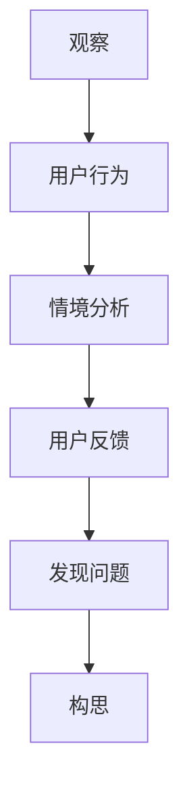

#### 4.1.2 想象

想象是设计思维的灵魂，它鼓励设计师跳出传统思维框架，探索新的解决方案。通过想象，设计师能够创造出前所未有的概念和设计，为后续的构思提供丰富的创意来源。

**核心概念原理与联系架构**：

- **创意激发**：利用脑暴、思维导图等工具，激发设计师的创意思维。
- **用户愿景**：构建用户理想中的产品和服务场景，引导设计方向。
- **创新思维**：运用逆向思维、跨学科思维等，打破传统设计限制。

**Mermaid 流�程图**：

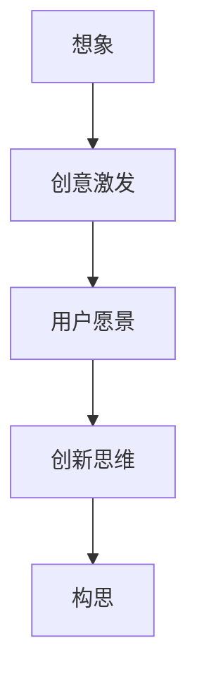

#### 4.1.3 构思

构思是将观察和想象转化为具体的设计方案的过程。它涉及到对创意的筛选、组合和优化，通过不断地尝试和迭代，找到可行的解决方案。

**核心概念原理与联系架构**：

- **创意筛选**：对多个创意进行评估，筛选出最具有潜力的方案。
- **方案组合**：将多个创意进行组合，形成新的设计方案。
- **迭代优化**：通过用户反馈和实际测试，不断优化设计方案。

**Mermaid 流程图**：

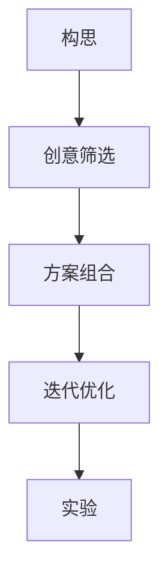

#### 4.1.4 实验

实验是验证设计方案的有效性，通过实际操作和用户反馈，不断调整和优化设计方案。实验不仅能够验证设计的可行性，还能够发现新的问题和机会，为后续的设计提供指导。

**核心概念原理与联系架构**：

- **原型制作**：创建原型，模拟实际使用场景，测试设计方案的可行性。
- **用户测试**：邀请用户参与测试，收集他们的反馈和体验。
- **反馈循环**：根据用户反馈，调整和优化设计方案。

**Mermaid 流程图**：

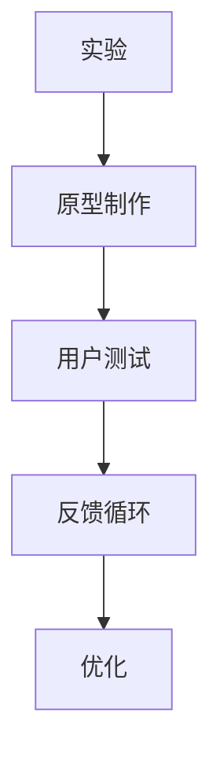

通过这些核心要素，设计思维能够帮助设计师从用户需求出发，通过创新和迭代，找到解决问题的最佳方案。

### 设计思维在具体应用场景中的表现

设计思维作为一种系统性、跨学科的设计方法论，在不同应用场景中展现出了强大的适应性和创新性。以下将详细探讨设计思维在产品设计、服务设计和企业创新三个主要应用场景中的具体表现。

#### 4.2.1 产品设计

在产品设计过程中，设计思维提供了从用户需求出发，到最终产品落地的完整框架。以下是一个典型的设计思维在产品设计中的应用案例：

- **需求分析**：首先，设计团队通过用户调研、访谈和市场分析，了解用户的需求和痛点。这一阶段收集到的用户数据和信息是后续设计的基石。

- **创意构思**：在需求分析的基础上，团队通过头脑风暴和思维导图等工具，激发创意思维，提出多种可能的解决方案。

- **原型设计与迭代**：将创意转化为低保真原型，通过用户测试和反馈，不断迭代和优化。这一过程强调快速反馈和持续改进，以确保设计方案的实用性和用户满意度。

- **最终产品实现**：在多次迭代后，团队将最终方案转化为高保真原型，进行详细设计和开发，最终实现产品。

**示例代码**（Python）：

```python
# 假设我们设计一款智能健身设备
class SmartGymDevice:
    def __init__(self, user):
        self.user = user
        self.features = []

    def add_feature(self, feature):
        self.features.append(feature)

    def test_feature(self):
        for feature in self.features:
            print(f"Testing feature: {feature}")

# 用户需求分析
user = "John"
user_needs = ["跟踪运动数据", "提供个性化训练计划", "智能设备连接"]

# 创意构思
solutions = []
for need in user_needs:
    if "跟踪运动数据" in need:
        solutions.append("添加心率监测功能")
    elif "提供个性化训练计划" in need:
        solutions.append("集成AI算法，根据用户数据生成训练计划")
    elif "智能设备连接" in need:
        solutions.append("支持Wi-Fi和蓝牙连接，实现智能设备互联")

# 原型设计与迭代
smart_gym_device = SmartGymDevice(user)
for solution in solutions:
    smart_gym_device.add_feature(solution)
smart_gym_device.test_feature()
```

#### 4.2.2 服务设计

在服务设计中，设计思维同样发挥着关键作用，尤其在提升用户体验和服务质量方面。以下是一个服务设计案例：

- **需求分析**：通过对客户的服务流程进行观察和访谈，发现客户在办理银行贷款过程中的痛点，如流程复杂、耗时较长。

- **创意构思**：通过头脑风暴，团队提出了简化流程、提高效率的多种解决方案，如引入人工智能客服、优化线上服务流程等。

- **原型设计与迭代**：创建服务流程原型，通过模拟用户办理贷款的流程，收集用户反馈，不断优化流程。

- **最终服务实现**：在多次迭代后，团队实现了一个高效、便捷的在线贷款服务系统。

**示例代码**（Python）：

```python
# 假设我们设计一个在线贷款服务平台
class OnlineLoanPlatform:
    def __init__(self, user):
        self.user = user
        self.service_processes = []

    def add_process(self, process):
        self.service_processes.append(process)

    def process_loan_application(self):
        for process in self.service_processes:
            print(f"Processing process: {process}")

# 用户需求分析
user = "Mary"
user_needs = ["流程简单", "快速审批", "透明费用"]

# 创意构思
solutions = []
for need in user_needs:
    if "流程简单" in need:
        solutions.append("简化申请表，减少冗余信息")
    elif "快速审批" in need:
        solutions.append("引入AI快速审批系统")
    elif "透明费用" in need:
        solutions.append("详细列出各项费用，无隐藏费用")

# 原型设计与迭代
online_loan_platform = OnlineLoanPlatform(user)
for solution in solutions:
    online_loan_platform.add_process(solution)
online_loan_platform.process_loan_application()
```

#### 4.2.3 企业创新

在企业创新中，设计思维被广泛应用于战略规划、产品开发、业务模式设计等方面。以下是一个企业创新案例：

- **需求分析**：企业通过市场调研和用户反馈，发现市场竞争激烈，需要创新以保持竞争优势。

- **创意构思**：团队通过头脑风暴和用户访谈，提出了多种创新解决方案，如开发新型产品、改进现有产品等。

- **原型设计与迭代**：创建创新项目的原型，通过用户测试和反馈，不断优化和调整。

- **最终实施**：在多次迭代后，团队成功推出了一款新产品，并在市场上取得了良好的反响。

**示例代码**（Python）：

```python
# 假设我们设计一款新型智能家居设备
class SmartHomeDevice:
    def __init__(self, user):
        self.user = user
        self.features = []

    def add_feature(self, feature):
        self.features.append(feature)

    def showcase_product(self):
        for feature in self.features:
            print(f"Feature showcase: {feature}")

# 用户需求分析
user = "Alice"
user_needs = ["智能控制", "节能环保", "安全便捷"]

# 创意构思
solutions = []
for need in user_needs:
    if "智能控制" in need:
        solutions.append("集成语音助手，实现远程控制")
    elif "节能环保" in need:
        solutions.append("采用节能技术，降低能耗")
    elif "安全便捷" in need:
        solutions.append("加强网络安全，保障用户隐私")

# 原型设计与迭代
smart_home_device = SmartHomeDevice(user)
for solution in solutions:
    smart_home_device.add_feature(solution)
smart_home_device.showcase_product()
```

通过这些具体案例，我们可以看到设计思维在产品设计、服务设计和企业创新中的应用，以及如何通过Python代码实现设计过程中的关键步骤。设计思维不仅为设计师提供了系统化的工作框架，也促进了创新和用户价值的实现。

### 生命设计思维与创新方法的结合

生命设计思维与创新方法的结合，形成了一种强有力的设计体系，能够帮助企业和个人在复杂多变的环境中实现创新和成长。这种结合主要体现在以下几个方面：

#### 4.3.1 创新方法的分类

创新方法可以根据其特点和用途分为多种类型，主要包括：

- **用户参与型创新**：通过用户参与，获取用户的真实需求和反馈，从而设计出更符合用户需求的产品和服务。
- **跨学科合作型创新**：通过跨学科的协作，结合不同领域的知识和技术，解决复杂问题，推动创新。
- **迭代设计型创新**：通过快速迭代和不断优化，不断改进设计方案，实现最佳解决方案。
- **平台化创新**：通过建立创新平台，整合资源，促进知识共享和协作，加速创新过程。

**Mermaid 流程图**：

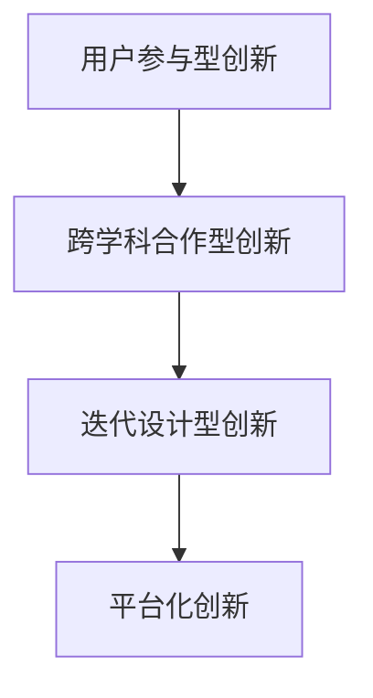

#### 4.3.2 生命设计思维的适用性

生命设计思维具有高度的适用性，它不仅适用于产品设计、服务设计等具体领域，还可以应用于企业战略、个人成长等多个方面。以下是生命设计思维在几个典型应用场景中的适用性：

- **企业战略**：通过生命设计思维，企业可以更全面地了解市场需求和用户需求，从而制定更具前瞻性的战略规划。
- **个人成长**：个人可以通过生命设计思维来规划自己的职业发展、学习和人际关系，实现个人目标。
- **社会创新**：生命设计思维可以帮助解决社会问题，如教育公平、环境保护等，实现社会创新。

**Mermaid 流程图**：

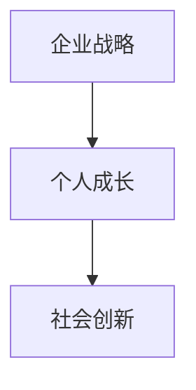

#### 4.3.3 创新方法的实践案例

以下是一些成功运用生命设计思维与创新方法的实践案例：

- **苹果公司**：苹果公司通过用户参与和创新方法，不断改进产品设计，从iPod到iPhone，再到iPad，每一款产品都取得了巨大的成功。
- **谷歌**：谷歌通过跨学科合作和迭代设计，开发出了一系列创新产品，如Google搜索、Google Maps、Google Assistant等。
- **无国界医生**：无国界医生通过生命设计思维，为全球贫困地区的居民提供了有效的医疗服务，解决了许多复杂的社会问题。

**示例代码**（Python）：

```python
# 假设我们分析苹果公司的产品创新案例

class AppleProduct:
    def __init__(self, name, features):
        self.name = name
        self.features = features

    def showcase_product(self):
        for feature in self.features:
            print(f"{self.name} feature: {feature}")

# 苹果公司产品创新案例
ipad = AppleProduct("iPad", ["触摸屏", "高分辨率", "长续航时间", "智能连接"])
ipad.showcase_product()

# 谷歌产品创新案例
google_search = AppleProduct("Google Search", ["快速搜索", "智能推荐", "多语言支持", "广告过滤"])
google_search.showcase_product()

# 无国界医生创新案例
medical_innovation = AppleProduct("Medical Innovation", ["远程医疗", "急救培训", "疫苗研发", "卫生教育"])
medical_innovation.showcase_product()
```

通过这些案例，我们可以看到生命设计思维与创新方法的结合，如何在不同领域推动创新和实现成功。这种结合不仅为企业和个人提供了强大的创新工具，也为社会带来了积极的影响。

### 用户参与与创新方法的融合

用户参与是创新方法的重要组成部分，尤其在快速变化的市场环境中，用户的需求和反馈对于产品和服务的设计至关重要。将用户参与与创新方法融合，能够确保设计的有效性，提升用户满意度，并最终实现商业成功。

#### 5.1 用户参与的重要性

用户参与的重要性主要体现在以下几个方面：

- **捕捉用户需求**：用户是最终的使用者，他们的需求和使用习惯是设计过程中最重要的参考依据。通过用户参与，设计师可以深入了解用户的需求，从而设计出更符合用户期望的产品和服务。
- **收集用户反馈**：用户反馈是优化设计的重要资源。通过用户参与，设计师可以收集到用户的实际使用体验和改进建议，为设计迭代提供有力的支持。
- **设计过程中的用户参与**：用户参与不仅仅是在设计完成后的测试阶段，而是贯穿整个设计过程，从需求分析、原型设计到最终产品的实现，用户都可以提供宝贵的意见和反馈。

**核心概念原理与联系架构**：

- **用户需求**：用户的需求是设计的起点，通过用户访谈、问卷调查、用户观察等方式，设计师可以全面了解用户的需求。
- **用户反馈**：用户在产品使用过程中的反馈，是设计优化的重要依据。通过反馈，设计师可以发现设计中的不足，进行相应的调整。
- **用户参与的设计过程**：用户参与设计过程，可以通过用户共创、设计评审、用户体验地图等方式，确保设计过程更加开放和透明，提升用户满意度。

**Mermaid 流程图**：

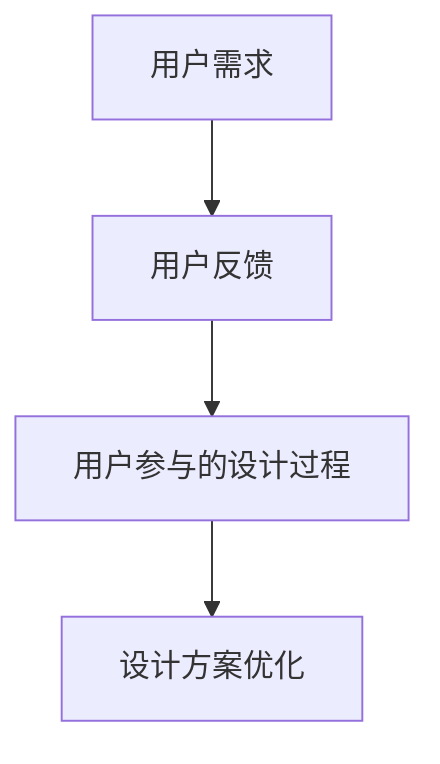

#### 5.2 用户参与的方法

用户参与的方法多种多样，以下是一些常用的用户参与方法：

- **用户访谈**：通过与用户进行一对一访谈，深入了解用户的需求、使用习惯和痛点。
- **用户调研**：通过问卷调查、在线调研等方式，收集大量的用户数据，分析用户的行为和偏好。
- **用户观察**：在现场观察用户使用产品的过程，了解用户的实际操作和行为模式。
- **用户共创**：邀请用户参与设计过程，通过工作坊、焦点小组等方式，共同探讨设计方案。
- **设计评审**：邀请用户参与设计评审，对设计方案提出意见和建议。

**Mermaid 流程图**：

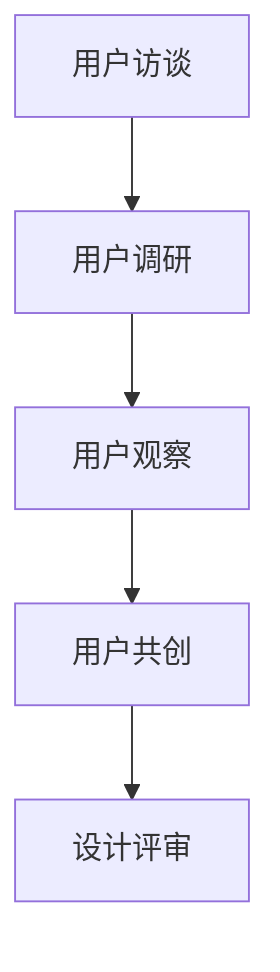

#### 5.3 用户参与与生命设计思维的融合

用户参与与生命设计思维的融合，能够形成一种以用户为中心的创新设计体系。以下是用户参与与生命设计思维融合的具体应用：

- **用户体验地图**：通过绘制用户体验地图，设计师可以全面了解用户在接触产品或服务过程中的情感和行为变化，从而优化设计流程。
- **用户旅程分析**：通过分析用户的旅程，设计师可以发现用户在各个接触点上的痛点和需求，为设计提供具体的改进方向。
- **用户参与的创新实践**：在实际设计过程中，通过用户参与，设计师可以不断获取用户的反馈，进行迭代优化，确保设计方案的可行性和用户满意度。

**Mermaid 流程图**：

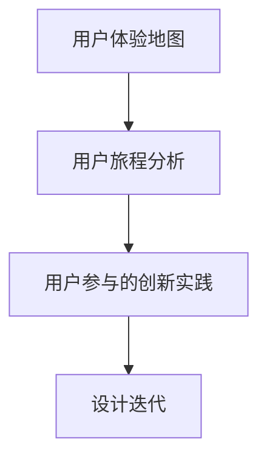

通过用户参与与创新方法的融合，设计师能够更好地理解用户需求，优化设计方案，实现设计的有效性和用户满意度。以下是一个具体的用户参与创新实践案例：

**案例**：一家科技公司开发了一款智能家居设备，为了确保产品满足用户需求，公司采用了以下用户参与方法：

1. **用户访谈**：公司与潜在用户进行了多次深度访谈，了解用户对智能家居设备的期望和需求。
2. **用户调研**：通过在线问卷和焦点小组，收集了大量的用户数据，分析了用户的行为模式和偏好。
3. **用户共创**：公司邀请了用户参与设计工作坊，共同探讨产品的功能和设计，提出改进建议。
4. **用户体验地图**：根据用户访谈和调研结果，公司绘制了用户体验地图，明确了用户在接触产品过程中的关键环节和痛点。
5. **用户测试**：在产品开发过程中，公司邀请用户进行多次测试，收集用户反馈，不断优化产品功能。

通过这些用户参与方法，公司成功设计出了一款深受用户喜爱的智能家居设备，产品上线后获得了良好的市场反响。

### 跨学科合作与创新方法

跨学科合作在创新过程中扮演着至关重要的角色。它通过整合不同领域的知识、技能和经验，为解决复杂问题提供了新的思路和方法。在跨学科合作中，创新方法的应用能够极大地提升团队的创造力和解决问题的能力。

#### 6.1 跨学科合作的意义

跨学科合作的意义主要体现在以下几个方面：

- **知识的整合**：跨学科合作能够将不同领域的知识进行整合，形成全新的视角和解决问题的方法。这种整合不仅能够弥补单一学科的知识盲点，还能够促进创新思维的发展。
- **创新的加速**：跨学科合作能够缩短创新周期，通过快速的知识共享和协作，加速新产品的研发和市场的推出。
- **解决复杂问题的能力**：许多现实世界的问题都是复杂且跨领域的，单一学科难以解决。跨学科合作能够集合不同领域的专家力量，共同应对复杂问题，提高解决方案的可行性和有效性。

**Mermaid 流程图**：

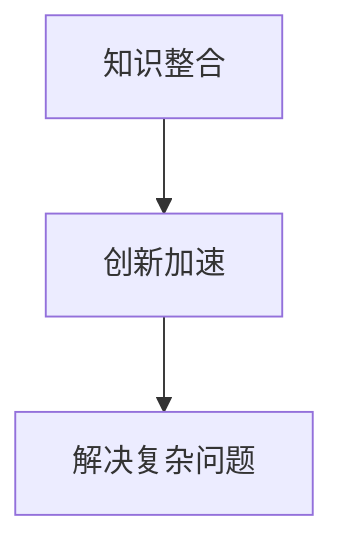

#### 6.2 跨学科合作的方法

跨学科合作的方法多种多样，以下是一些常用的跨学科合作方法：

- **跨界对话**：通过组织跨界对话会议，不同领域的专家共同探讨问题，分享知识和经验，激发创新思维。
- **跨界工作坊**：跨界工作坊是一种集中式的创新活动，不同领域的专家和团队成员共同参与，通过头脑风暴、角色扮演、设计思维等工具，快速生成创新想法。
- **跨界研究**：通过跨学科的研究项目，不同领域的专家共同进行研究，共享研究成果，推动创新成果的落地。

**Mermaid 流程图**：

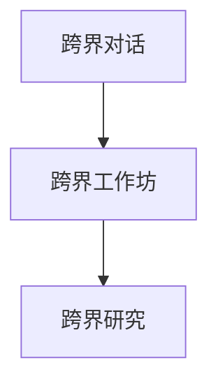

#### 6.3 跨学科合作与生命设计思维的结合

跨学科合作与生命设计思维的结合，能够形成一种强大的创新体系，为企业和个人提供全方位的创新支持。以下是跨学科合作与生命设计思维结合的具体应用：

- **跨学科团队的组建**：通过组建跨学科团队，集合不同领域的专家，共同参与项目设计和实施，确保项目覆盖不同领域的知识和技能。
- **跨学科创新的实践案例**：通过具体的创新实践案例，展示跨学科合作在解决复杂问题、推动创新方面的实际效果。
- **跨学科合作中的挑战与应对策略**：分析跨学科合作中可能遇到的挑战，并提出相应的应对策略，确保合作顺利进行。

**Mermaid 流程图**：

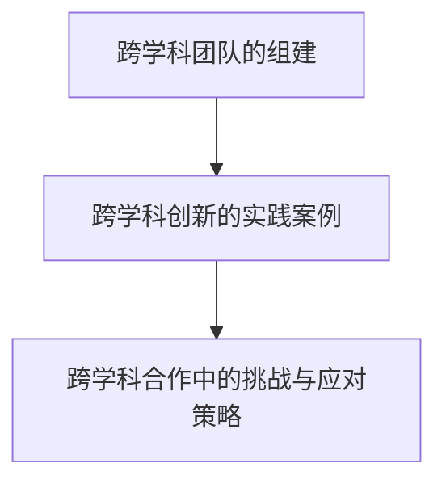

**案例**：一家医疗科技公司通过跨学科合作，成功开发出了一款用于心脏病诊断的创新设备。

1. **跨学科团队的组建**：公司组建了一个由医学专家、工程师、数据科学家和市场营销专家组成的跨学科团队，共同参与设备的设计和开发。
2. **跨学科创新的实践案例**：团队通过跨界工作坊，集思广益，提出了多种创新设计，包括便携式、无线连接和智能数据分析等功能。
3. **跨学科合作中的挑战与应对策略**：团队在合作过程中遇到了技术难题和协作障碍，通过定期的跨界对话和项目评审，解决了这些问题，确保了项目的顺利进行。

通过这个案例，我们可以看到跨学科合作与生命设计思维的结合，如何在不同领域推动创新和实现成功。

### 跨学科合作中的挑战与应对策略

在跨学科合作中，尽管能够整合多元化的知识和技能，但也面临着一系列的挑战。了解并应对这些挑战，是确保跨学科合作顺利进行、最终实现创新目标的关键。以下将详细分析跨学科合作中可能遇到的挑战，并提出相应的应对策略。

#### 挑战1：沟通障碍

跨学科合作往往涉及多个领域，团队成员可能拥有不同的专业背景、术语和沟通风格，导致沟通上的障碍。这不仅会影响项目的进展，还可能引发误解和冲突。

**应对策略**：

1. **建立统一的沟通平台**：使用统一的项目管理工具和沟通平台，如Slack、Trello等，确保信息的及时传达和文档的共享。
2. **定期召开跨学科会议**：定期召开跨学科会议，确保不同领域的团队成员能够面对面交流，解决沟通中的难题。
3. **培训与交流**：组织定期的培训活动，提高团队成员的跨学科沟通能力，促进相互理解和合作。

#### 挑战2：资源分配不均

在跨学科合作中，资源（如资金、人力、时间）的分配往往不均衡，可能导致某些领域的资源过剩或不足，影响项目的整体进展。

**应对策略**：

1. **资源评估与规划**：在项目启动阶段，进行全面的资源评估和规划，确保资源分配的合理性和可持续性。
2. **动态调整资源**：在项目执行过程中，根据实际情况动态调整资源分配，确保关键任务和领域的资源得到充分保障。
3. **明确责任与权限**：明确每个团队成员的责任和权限，确保资源的有效利用，避免因权限不清导致的资源浪费。

#### 挑战3：文化差异

跨学科合作中的团队成员来自不同的文化背景，可能会在价值观、工作习惯、决策方式等方面存在差异，导致文化冲突。

**应对策略**：

1. **文化培训与交流**：组织文化培训，增强团队成员对跨文化合作的理解和敏感性。
2. **建立共同目标**：通过明确项目目标和共同愿景，减少因文化差异导致的分歧，增强团队的凝聚力。
3. **尊重多样性**：尊重团队成员的文化多样性，鼓励不同文化背景的成员分享经验和观点，促进文化融合。

#### 挑战4：决策复杂度

跨学科合作的项目往往需要涉及多个领域的决策，决策的复杂度和难度大大增加，可能影响项目的进度和质量。

**应对策略**：

1. **建立决策流程**：制定明确的决策流程，确保每个决策环节都有适当的参与和讨论，提高决策的科学性和合理性。
2. **专家咨询**：在关键决策点，邀请相关领域的专家提供咨询和建议，确保决策的准确性和可行性。
3. **快速决策机制**：建立快速决策机制，确保在紧急情况下能够迅速做出决策，避免因决策迟缓导致的项目延误。

通过上述应对策略，跨学科合作中的挑战可以得到有效解决，确保项目顺利进行，实现跨学科的协同创新。

### 人生规划案例分析

#### 第7章：人生规划案例分析

为了更好地理解生命设计思维在人生规划中的应用，我们将通过两个具体案例，详细探讨如何运用生命设计思维进行职业生涯规划和创业规划。

#### 7.1 职业生涯规划案例

**案例背景**：

李明（化名），30岁，拥有计算机科学学士学位，目前在一家互联网公司担任软件工程师。他希望在未来五年内晋升为高级工程师，并逐步迈向技术管理岗位。

**规划过程**：

1. **需求分析**：

李明通过自我反思和市场调研，发现了他晋升为高级工程师所需的技能和能力，包括：

- **技术深度**：在某一技术领域有深入的专业知识。
- **项目管理能力**：能够有效管理项目和团队。
- **领导力**：具备良好的沟通和领导能力。

2. **目标设定**：

李明设定了以下短期和长期目标：

- **短期目标**：在接下来的一年里，通过参加在线课程和项目实践，提升在云计算和大数据处理方面的技能。
- **长期目标**：在未来三年内，晋升为高级工程师，并在第五年内担任技术经理。

3. **路径设计**：

- **技能提升**：李明制定了详细的学习计划，包括参加专业培训课程、阅读专业书籍、参与开源项目等。
- **项目实践**：通过参与公司的重点项目，提升项目管理能力。
- **人际网络**：积极参与行业会议和社群，拓展人脉资源，为未来的晋升提供支持。

4. **调整与优化**：

在规划过程中，李明定期进行自我评估和反馈，根据实际情况调整学习计划和工作目标。例如，如果发现自己在某一技术领域的进展不如预期，他会重新评估学习资源和方法，并进行相应的调整。

**规划成果**：

通过两年的努力，李明成功晋升为高级工程师，并在公司的技术团队中发挥了重要作用。他不仅在自己的技术领域取得了显著成就，还积极参与团队管理，提升了团队的整体工作效率。

**案例总结**：

李明的职业生涯规划案例展示了如何通过需求分析、目标设定、路径设计和调整优化，运用生命设计思维进行职业生涯规划。这种方法不仅帮助他明确了职业发展的方向，还提高了他在职业道路上的竞争力。

#### 7.2 创业规划案例

**案例背景**：

张晓（化名），35岁，拥有丰富的市场运营经验，并曾在多家互联网公司担任高级市场经理。他打算利用自己的经验和资源，创办一家专注于智能家居市场的创新公司。

**规划过程**：

1. **需求分析**：

张晓通过市场调研和用户访谈，发现智能家居市场存在以下需求：

- **便捷性**：用户希望智能家居设备能够实现远程控制和自动化操作。
- **智能性**：用户希望智能家居系统能够根据用户习惯和学习，提供个性化的服务。
- **安全性**：用户对智能家居设备的安全性有较高要求。

2. **目标设定**：

张晓设定了以下目标：

- **短期目标**：在创业初期，开发一款功能简单但易于使用的智能家居设备，迅速占领市场。
- **长期目标**：在未来三年内，构建一个全面的智能家居生态系统，涵盖家庭安全、健康、娱乐等多个领域。

3. **路径设计**：

- **产品研发**：组建研发团队，进行产品的设计、开发和测试。
- **市场推广**：通过线上和线下渠道，进行产品推广和市场拓展。
- **用户反馈**：收集用户反馈，优化产品功能，提升用户体验。

4. **调整与优化**：

在创业过程中，张晓密切关注市场动态和用户反馈，根据实际情况不断调整和优化产品策略和市场推广计划。例如，当发现用户对安全性能有更高的要求时，他立即增加了安全性能的投入，并调整了产品功能。

**规划成果**：

张晓的公司在一年内成功推出了一款智能家居设备，并在市场上取得了良好的反响。通过不断优化产品功能和提升用户体验，公司逐步建立了稳定的用户群体，并开始在智能家居市场上占据一席之地。

**案例总结**：

张晓的创业规划案例展示了如何通过需求分析、目标设定、路径设计和调整优化，运用生命设计思维进行创业规划。这种方法帮助他在激烈的市场竞争中找到切入点，并逐步实现创业目标。

通过以上两个案例，我们可以看到生命设计思维在职业生涯规划和创业规划中的应用，以及如何通过系统化的方法和步骤，实现个人和企业的目标。这些案例不仅展示了生命设计思维的实用性，也为其他希望进行人生规划的人提供了有益的参考。

