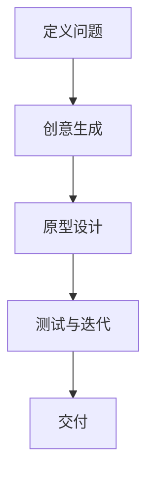

                 

# 引言与背景

### 第1章：生命设计思维学院的起源与发展

#### 1.1 设计思维与人生规划

设计思维（Design Thinking）是一种创新方法论，起源于20世纪中期，最初由IDEO公司的创始人戴夫·凯利和比尔·莫格里奇提出。设计思维的核心思想是以用户为中心，通过迭代的方式探索和解决问题。设计思维不仅适用于产品设计，也广泛应用于城市规划、教育、医疗等多个领域。

设计思维在人生规划中的应用，旨在帮助个体在面对复杂、多变的生活情境时，能够更加有效地设定目标、制定策略和解决问题。它强调通过观察、理解、想象和实验，来创造性地探索和实现个人的生活愿景。

在设计思维与传统的规划方法对比中，传统方法往往依赖于逻辑推理和数据分析，而设计思维则更注重直觉、创造性和用户反馈。设计思维通过建立与用户的深层次联系，能够更好地捕捉到用户的需求和痛点，从而提出更加创新和切实可行的解决方案。

#### 1.2 生命设计思维学院的创立背景

生命设计思维学院成立于20XX年，旨在将设计思维的核心理念和方法论应用于人生规划教育中。学院的创立背景源于社会对个性化教育和职业发展的需求日益增长，以及传统教育体系在应对复杂生活挑战时的局限性。

学院的创立愿景是培养具有创新思维和解决复杂问题的能力，能够在个人生活和社会中发挥积极作用的人才。学院的使命是通过设计思维的教育，帮助学员实现个人成长、职业发展和生活平衡。

生命设计思维学院的教育特色在于：

1. **以人为本**：强调学生的主体性和个性化需求，鼓励学员主动参与和探索。
2. **跨学科融合**：将设计思维与其他学科如心理学、经济学、社会学等相结合，提供全面的视角。
3. **实践导向**：通过实际项目和案例分析，让学生将理论应用到实际生活中。

#### 1.3 生命设计思维学院的教育理念

生命设计思维学院的教育理念包括以下几个方面：

1. **用户为中心**：强调以个人的生活目标和需求为导向，关注个体的独特性和多样性。
2. **迭代思维**：鼓励学员不断尝试、反思和改进，通过迭代过程实现自我完善。
3. **创造性思维**：培养学生的创造力和想象力，鼓励跳出传统框架，寻找创新的解决方案。
4. **跨领域协作**：倡导跨学科交流和合作，通过不同的视角和知识背景，激发创新的火花。
5. **持续学习**：鼓励学员建立终身学习的习惯，不断提升自我能力和适应能力。

通过这些教育理念，生命设计思维学院致力于为学员提供一套系统的、可操作的、具有前瞻性的教育方法，帮助他们更好地规划自己的人生道路。在下一章中，我们将详细探讨设计思维的基本概念和流程。

## 第2章：设计思维方法详解

### 第2章：设计思维方法详解

#### 2.1 设计思维的基本概念

设计思维是一种以用户需求为导向的创新方法论，它强调通过迭代和实验来发现和解决问题。设计思维的核心概念包括用户观察、用户理解、创意生成和原型测试。

**用户观察**：设计思维的第一步是深入了解目标用户，通过观察他们的行为、需求和痛点，收集第一手资料。这种方法有助于设计师更好地理解用户的需求和动机，从而为后续的设计提供依据。

**用户理解**：在收集到用户观察的数据后，设计团队需要对这些数据进行整理和分析，深入理解用户的真实需求和期望。这种理解不仅包括表面的需求，还包括潜在的需求和心理动机。

**创意生成**：在理解了用户的需求后，设计团队可以开始头脑风暴，提出各种可能的解决方案。这个阶段的关键是开放思维，鼓励团队成员提出各种创新的想法，无论这些想法是否可行。

**原型测试**：创意生成后，设计团队需要将这些想法转化为可交互的原型，并对其进行测试。原型测试可以帮助团队验证设计方案的可行性，收集用户反馈，进一步优化设计。

#### 2.2 设计思维的流程

设计思维的流程可以分为五个主要阶段：定义问题、创意生成、原型设计、测试与迭代和交付。

**定义问题**：在这个阶段，设计团队需要明确设计的目标和问题。这通常需要通过用户调研和市场分析来完成。明确问题有助于团队集中精力，避免在细节上浪费时间和资源。

**创意生成**：在问题定义之后，设计团队开始头脑风暴，提出各种可能的解决方案。这个阶段的关键是鼓励创新思维，不受限制地提出想法。

**原型设计**：在创意生成阶段，设计团队需要将最有可能的解决方案转化为原型。原型可以是纸质的草图、数字模型，甚至是可交互的模拟环境。这个阶段的目标是验证设计方案的可行性和用户接受度。

**测试与迭代**：原型设计完成后，设计团队需要对原型进行测试，收集用户反馈，并根据反馈对原型进行迭代优化。这个阶段通常需要多次迭代，直到设计方案达到预期效果。

**交付**：在测试和迭代阶段结束后，设计方案最终被交付给用户。交付不仅仅是将产品交付给用户，还包括提供相关的支持和培训，确保用户能够有效地使用产品。

#### 2.3 设计思维的应用场景

设计思维可以应用于多种场景，包括但不限于以下领域：

1. **产品设计**：在设计新产品时，设计思维可以帮助团队更好地理解用户需求，提出创新的解决方案。
2. **服务设计**：在服务设计领域，设计思维可以帮助团队设计出更加人性化、高效的服务流程。
3. **城市规划**：在城市规划中，设计思维可以帮助团队更好地理解居民的需求，提出创新的规划方案。
4. **教育**：在教育领域，设计思维可以帮助教师和学生更好地理解学习需求，提出创新的教育方法。
5. **企业战略**：在企业战略规划中，设计思维可以帮助企业更好地理解市场变化和用户需求，提出创新的发展战略。

通过在不同领域中的应用，设计思维不断证明其强大的解决问题和推动创新的能力。在下一章中，我们将探讨如何将设计思维应用于人生规划的具体领域。

### 2.1 设计思维的基本概念

设计思维（Design Thinking）起源于设计领域，经过多年的发展，已经逐步应用到各个行业和领域。它的核心在于以用户需求为导向，通过迭代和实验，寻找创新的解决方案。以下是设计思维的基本概念：

**用户观察**：设计思维的第一步是深入了解目标用户，通过观察他们的行为、需求和痛点，收集第一手资料。观察可以帮助设计师更好地理解用户的真实需求，而不是仅仅依赖假设或直觉。

**用户理解**：在收集到用户观察的数据后，设计团队需要对这些数据进行整理和分析，深入理解用户的真实需求和期望。这种理解不仅包括表面的需求，还包括潜在的需求和心理动机。通过深入理解用户，设计师可以提出更加符合用户期望的解决方案。

**创意生成**：在理解了用户的需求后，设计团队可以开始头脑风暴，提出各种可能的解决方案。这个阶段的关键是开放思维，鼓励团队成员提出各种创新的想法，无论这些想法是否可行。创意生成是设计思维中最具创造性的阶段。

**原型测试**：创意生成后，设计团队需要将这些想法转化为可交互的原型，并对其进行测试。原型测试可以帮助团队验证设计方案的可行性，收集用户反馈，进一步优化设计。通过测试，设计团队可以快速地发现和解决问题，确保设计方案的实用性和有效性。

**迭代思维**：设计思维强调通过迭代和实验来不断改进设计方案。迭代思维意味着不断尝试、反思和改进，直到达到预期的效果。迭代是设计思维的核心，它确保了设计的不断完善和优化。

**跨学科合作**：设计思维鼓励跨学科合作，通过不同的视角和知识背景，激发创新的火花。跨学科合作不仅可以提高设计质量，还可以增强团队的创新能力。

**用户为中心**：设计思维始终强调以用户为中心，关注用户的体验和需求。通过深入了解用户，设计师可以提出更加符合用户期望的解决方案，从而提高用户满意度和忠诚度。

设计思维的基本概念和原则构成了其强大的解决问题的能力。在下一节中，我们将详细探讨设计思维的流程，了解它是如何从问题定义到最终解决方案的。

### 2.2 设计思维的流程

设计思维是一个系统化的过程，旨在通过创造性的解决方案来解决复杂问题。其流程可以分为以下五个主要阶段：

**1. 定义问题**

定义问题是设计思维的第一步，也是至关重要的一步。在这一阶段，设计团队需要明确设计的目标和问题。这通常需要通过用户调研和市场分析来完成。明确问题有助于团队集中精力，避免在细节上浪费时间和资源。定义问题的方法包括用户访谈、问卷调查、观察和数据分析等。

**2. 创意生成**

在问题定义之后，设计团队进入创意生成阶段。这个阶段的目标是提出各种可能的解决方案。创意生成是设计思维中最具创造性的阶段，它要求团队成员保持开放的心态，鼓励提出各种新颖、独特的想法。头脑风暴、思维导图、六顶思考帽等工具可以帮助团队在这个阶段激发创新思维。

**3. 原型设计**

在创意生成阶段，设计团队需要将最有可能的解决方案转化为原型。原型可以是纸质的草图、数字模型，甚至是可交互的模拟环境。原型设计的目的是验证设计方案的可行性，收集用户反馈，进一步优化设计。通过原型测试，设计团队可以快速地发现和解决问题，确保设计方案的实用性和有效性。

**4. 测试与迭代**

原型设计完成后，设计团队需要对原型进行测试，收集用户反馈，并根据反馈对原型进行迭代优化。测试与迭代是设计思维的核心，它确保了设计的不断完善和优化。测试可以是用户测试、专家评审或A/B测试等多种形式。通过多次迭代，设计团队可以逐步完善设计方案，达到预期的效果。

**5. 交付**

在测试和迭代阶段结束后，设计方案最终被交付给用户。交付不仅仅是将产品交付给用户，还包括提供相关的支持和培训，确保用户能够有效地使用产品。交付阶段是设计思维的最后一步，它标志着设计过程的结束，同时也是新的一轮设计思维过程的开始。

#### 设计思维流程的Mermaid流程图表示

通过这个Mermaid流程图，我们可以清晰地看到设计思维的五个主要阶段及其相互关系。设计思维强调通过迭代和实验，逐步完善设计方案，确保最终解决方案能够满足用户需求。

在设计思维流程中，每个阶段都有其特定的方法和工具。在定义问题阶段，常用的方法包括用户访谈、问卷调查、观察和数据分析等。在创意生成阶段，头脑风暴、思维导图、六顶思考帽等工具可以帮助团队提出各种创新的想法。原型设计阶段，设计团队可以使用草图、数字模型、模拟环境等工具来构建原型。测试与迭代阶段，用户测试、专家评审、A/B测试等形式可以帮助团队收集反馈，并进行迭代优化。交付阶段，设计团队需要确保用户能够有效地使用产品，并提供相关的支持和培训。

通过以上详细的阐述，我们可以看到设计思维流程的严谨性和系统性。设计思维不仅提供了一种创新的方法论，也为我们提供了一套解决复杂问题的工具和流程。在下一章中，我们将探讨如何将设计思维应用于人生规划的具体领域，帮助个体更好地实现个人目标和愿景。

### 2.3 设计思维的应用场景

设计思维作为一种创新方法论，其应用场景非常广泛。它不仅适用于产品设计和服务设计，还可以应用于多个领域，如城市规划、教育、医疗和企业战略等。以下是设计思维在不同领域的具体应用：

**1. 产品设计**

在产品设计领域，设计思维是不可或缺的。它帮助设计师更好地理解用户需求，提出创新的解决方案。通过用户观察和用户理解，设计师可以深入了解用户的行为、需求和痛点。创意生成阶段，设计师可以提出各种创新的想法，并通过原型设计和测试与迭代，不断完善产品。

**2. 服务设计**

在服务设计领域，设计思维同样具有重要的应用价值。服务设计关注的是用户在服务过程中的体验，如何通过优化服务流程和提升服务质量，来提高用户的满意度和忠诚度。设计思维可以帮助服务设计团队深入理解用户需求，提出创新的服务方案，并通过原型设计和测试与迭代，逐步优化服务流程。

**3. 城市规划**

在城市规划领域，设计思维可以帮助规划者更好地理解居民的需求，提出创新的规划方案。通过用户观察和用户理解，规划者可以了解居民的生活方式、行为习惯和需求。创意生成阶段，规划者可以提出各种创新的城市规划方案，并通过原型设计和测试与迭代，不断完善规划方案。

**4. 教育**

在教育领域，设计思维可以帮助教师和学生更好地理解学习需求和教学目标。通过用户观察和用户理解，教师可以了解学生的学习习惯、兴趣和困难。创意生成阶段，教师可以提出各种创新的教育方法，并通过原型设计和测试与迭代，逐步优化教学方案。

**5. 医疗**

在医疗领域，设计思维可以帮助医疗团队更好地理解患者的需求和痛点，提出创新的医疗服务方案。通过用户观察和用户理解，医疗团队可以了解患者的就医体验、需求和心理。创意生成阶段，医疗团队可以提出各种创新的医疗服务方案，并通过原型设计和测试与迭代，不断完善医疗服务。

**6. 企业战略**

在企业战略领域，设计思维可以帮助企业更好地理解市场和用户需求，提出创新的发展战略。通过用户观察和用户理解，企业可以了解市场趋势、用户需求和竞争态势。创意生成阶段，企业可以提出各种创新的发展战略，并通过原型设计和测试与迭代，逐步优化战略方案。

设计思维在不同领域的应用，都取得了显著的成果。它不仅帮助各个领域的设计师和决策者更好地理解用户需求，提出创新的解决方案，还推动了各个领域的创新和发展。在下一章中，我们将探讨如何将设计思维应用于人生规划的具体领域，帮助个体更好地实现个人目标和愿景。

## 第二部分：设计思维方法应用于人生规划

### 第3章：职业规划中的设计思维

职业规划是人生规划中的重要一环，它关系到个人的职业发展、收入水平和生活质量。设计思维在职业规划中的应用，可以帮助个体更清晰地理解自己的职业目标，制定切实可行的行动计划，实现职业上的成功。

#### 3.1 职业规划的设计思维应用

在设计思维的框架下，职业规划可以分为以下几个阶段：

**1. 定义职业问题**

这一阶段类似于设计思维中的“定义问题”。个体需要明确自己的职业目标，包括短期和长期目标。可以通过自我反思、职业咨询、职业测评等方式，了解自己的职业兴趣、价值观和能力。

**2. 用户理解**

在定义了职业问题后，个体需要深入理解自己的职业需求和环境。这包括了解自己的职业兴趣、技能、优势和劣势，以及当前和潜在的职业机会。个体可以通过职业访谈、网络调研、职业体验等方式，收集相关信息。

**3. 创意生成**

在理解了自己的职业需求和环境后，个体可以开始头脑风暴，提出各种可能的职业发展方向和策略。这个阶段的关键是开放思维，鼓励提出各种创新的想法。

**4. 原型设计**

创意生成后，个体需要将这些想法转化为可操作的方案。这包括制定职业发展计划、学习计划、人际网络建设计划等。原型设计的目的是验证这些方案的可操作性和可行性。

**5. 测试与迭代**

在原型设计完成后，个体需要通过实践和反馈来不断优化职业发展方案。这包括进行实习、工作、培训等实际操作，并根据反馈进行调整和优化。

**6. 交付**

最终，个体需要将职业发展方案付诸实践，实现职业目标。交付阶段不仅包括实现职业目标，还包括在职业过程中不断学习和提升自我能力。

#### 3.2 职业规划案例分析

以下是一个职业规划的设计思维案例：

**案例背景**：小王是一名软件工程师，他在工作中感到缺乏挑战性，希望转行到更有发展潜力的领域。

**定义职业问题**：小王通过自我反思和职业咨询，明确了自己的职业目标是成为一名数据分析师。

**用户理解**：小王了解了数据分析师的职业要求、技能需求和发展前景。他发现自己在数学和数据分析方面有一定的优势，但需要进一步提升编程能力和业务理解。

**创意生成**：小王头脑风暴后，提出了以下几种职业发展方向：

1. 学习数据分析和机器学习相关的课程。
2. 参加数据分析的实习项目。
3. 加入数据分析相关的社区和论坛，拓展人脉。
4. 申请数据分析师的职位。

**原型设计**：小王制定了以下职业发展计划：

1. 学习：报名参加数据分析和机器学习相关的课程，并利用业余时间自学。
2. 实习：寻找数据分析的实习机会，积累实际工作经验。
3. 社交：加入数据分析相关的社区和论坛，了解行业动态和招聘信息。
4. 申请：准备简历和面试技巧，积极申请数据分析师的职位。

**测试与迭代**：小王开始实施职业发展计划，并不断根据实际情况进行调整。他发现学习编程和业务理解是关键，于是加大了在这些方面的投入。

**交付**：最终，小王成功转型为数据分析师，实现了自己的职业目标。

通过这个案例，我们可以看到设计思维在职业规划中的应用，不仅帮助小王明确了职业目标，还提供了具体的行动计划和优化方法，最终实现了职业转型。

### 第4章：财务规划中的设计思维

财务规划是人生规划的重要组成部分，它关系到个人的经济安全和生活质量。设计思维在财务规划中的应用，可以帮助个体更清晰地理解自己的财务需求，制定科学的财务计划，实现财务目标。

#### 4.1 财务规划的设计思维应用

在设计思维的框架下，财务规划可以分为以下几个阶段：

**1. 定义财务问题**

这一阶段类似于设计思维中的“定义问题”。个体需要明确自己的财务目标，包括短期和长期目标。可以通过财务咨询、财务测评等方式，了解自己的财务状况、收入和支出情况。

**2. 用户理解**

在定义了财务问题后，个体需要深入理解自己的财务需求和环境。这包括了解自己的消费习惯、投资偏好、风险承受能力等。个体可以通过记录日常收支、财务分析等方式，收集相关信息。

**3. 创意生成**

在理解了自己的财务需求和环境后，个体可以开始头脑风暴，提出各种可能的财务策略和方案。这个阶段的关键是开放思维，鼓励提出各种创新的想法。

**4. 原型设计**

创意生成后，个体需要将这些想法转化为可操作的财务计划。这包括制定储蓄计划、投资计划、债务管理计划等。原型设计的目的是验证这些计划的可行性和有效性。

**5. 测试与迭代**

在原型设计完成后，个体需要通过实践和反馈来不断优化财务计划。这包括实施储蓄计划、投资计划、债务管理计划，并根据实际情况进行调整和优化。

**6. 交付**

最终，个体需要将财务计划付诸实践，实现财务目标。交付阶段不仅包括实现财务目标，还包括在财务过程中不断学习和提升自我能力。

#### 4.2 财务规划案例分析

以下是一个财务规划的设计思维案例：

**案例背景**：小李是一名年轻的职场新人，他希望通过科学的财务规划，实现财务自由。

**定义财务问题**：小李通过财务咨询和财务测评，明确了自己的财务目标是实现财务自由，退休后依然能够维持高品质的生活。

**用户理解**：小李记录了日常的收支情况，分析了消费习惯和支出结构。他发现自己在储蓄和投资方面存在一些问题，如储蓄率低、投资渠道单一等。

**创意生成**：小李头脑风暴后，提出了以下几种财务策略：

1. 提高储蓄率：每月将收入的20%用于储蓄。
2. 多元化投资：分散投资于股票、基金、债券等不同类型的投资产品。
3. 增加收入来源：通过兼职、投资等方式增加收入。
4. 制定紧急储备金计划：为应对突发情况，设立紧急储备金。

**原型设计**：小李制定了以下财务计划：

1. 储蓄计划：每月将收入的20%用于储蓄，逐步提高储蓄率。
2. 投资计划：分散投资于股票、基金、债券等不同类型的投资产品，实现资产增值。
3. 增加收入计划：通过兼职、投资等方式增加收入来源。
4. 紧急储备金计划：设立紧急储备金，以应对突发情况。

**测试与迭代**：小李开始实施财务计划，并不断根据实际情况进行调整和优化。例如，他发现投资收益不稳定，于是调整了投资组合，增加了固定收益类产品的比重。

**交付**：最终，小李通过科学的财务规划和不断的努力，逐步实现了财务自由。

通过这个案例，我们可以看到设计思维在财务规划中的应用，不仅帮助小李明确了财务目标，还提供了具体的财务计划和方法，最终实现了财务自由。

### 第5章：健康规划中的设计思维

健康规划是人生规划中的重要组成部分，它关系到个人的身体健康和生活质量。设计思维在健康规划中的应用，可以帮助个体更清晰地理解自己的健康需求，制定科学的健康计划，实现健康目标。

#### 5.1 健康规划的设计思维应用

在设计思维的框架下，健康规划可以分为以下几个阶段：

**1. 定义健康问题**

这一阶段类似于设计思维中的“定义问题”。个体需要明确自己的健康目标，包括短期和长期目标。可以通过健康检查、医生咨询等方式，了解自己的健康状况、健康问题和潜在风险。

**2. 用户理解**

在定义了健康问题后，个体需要深入理解自己的健康需求和健康环境。这包括了解自己的生活习惯、饮食习惯、运动习惯等。个体可以通过记录日常饮食和运动情况、健康测评等方式，收集相关信息。

**3. 创意生成**

在理解了自己的健康需求和环境后，个体可以开始头脑风暴，提出各种可能的健康策略和方案。这个阶段的关键是开放思维，鼓励提出各种创新的想法。

**4. 原型设计**

创意生成后，个体需要将这些想法转化为可操作的健康计划。这包括制定饮食计划、运动计划、心理健康计划等。原型设计的目的是验证这些计划的可行性和有效性。

**5. 测试与迭代**

在原型设计完成后，个体需要通过实践和反馈来不断优化健康计划。这包括实施饮食计划、运动计划、心理健康计划，并根据实际情况进行调整和优化。

**6. 交付**

最终，个体需要将健康计划付诸实践，实现健康目标。交付阶段不仅包括实现健康目标，还包括在健康过程中不断学习和提升自我能力。

#### 5.2 健康规划案例分析

以下是一个健康规划的设计思维案例：

**案例背景**：张先生是一名长期加班的白领，他意识到自己的健康状况在不断恶化，希望通过科学的健康规划，改善健康状况。

**定义健康问题**：张先生通过健康检查和医生咨询，明确了自己的健康目标是改善体重、降低血压、增加运动量。

**用户理解**：张先生记录了日常的饮食和运动情况，分析了生活习惯和健康问题。他发现自己在饮食中摄入过多的油脂和糖分，运动量严重不足。

**创意生成**：张先生头脑风暴后，提出了以下几种健康策略：

1. 饮食计划：减少油腻食物的摄入，增加蔬菜和水果的摄入。
2. 运动计划：每周至少进行三次有氧运动，如跑步、游泳等。
3. 心理健康计划：定期进行心理疏导，减轻工作压力。
4. 睡眠计划：保持良好的睡眠习惯，确保每晚7-8小时的睡眠。

**原型设计**：张先生制定了以下健康计划：

1. 饮食计划：每天控制油脂和糖分的摄入，增加蔬菜和水果的摄入。
2. 运动计划：每周进行三次有氧运动，每次持续30-60分钟。
3. 心理健康计划：每周进行一次心理疏导，通过阅读、冥想等方式缓解压力。
4. 睡眠计划：保持每晚7-8小时的睡眠，确保良好的作息习惯。

**测试与迭代**：张先生开始实施健康计划，并不断根据实际情况进行调整和优化。例如，他发现运动后饮食控制较为困难，于是增加了运动前的饮食规划，确保运动时的能量供应。

**交付**：最终，张先生通过科学的健康规划和不断的努力，成功改善了健康状况，体重减轻、血压稳定，运动习惯也逐步养成。

通过这个案例，我们可以看到设计思维在健康规划中的应用，不仅帮助张先生明确了健康目标，还提供了具体的健康计划和方法，最终实现了健康目标。

### 第6章：教育规划中的设计思维

教育规划是人生规划的重要组成部分，它关系到个人的知识储备、职业发展和生活质量。设计思维在教育规划中的应用，可以帮助个体更清晰地理解自己的教育需求，制定科学的教育计划，实现教育目标。

#### 6.1 教育规划的设计思维应用

在设计思维的框架下，教育规划可以分为以下几个阶段：

**1. 定义教育问题**

这一阶段类似于设计思维中的“定义问题”。个体需要明确自己的教育目标，包括短期和长期目标。可以通过自我反思、教育咨询等方式，了解自己的教育需求、兴趣和能力。

**2. 用户理解**

在定义了教育问题后，个体需要深入理解自己的教育需求和教育资源。这包括了解自己的兴趣爱好、学术能力、职业目标等。个体可以通过调查、咨询、交流等方式，收集相关信息。

**3. 创意生成**

在理解了自己的教育需求和教育资源后，个体可以开始头脑风暴，提出各种可能的教育策略和方案。这个阶段的关键是开放思维，鼓励提出各种创新的想法。

**4. 原型设计**

创意生成后，个体需要将这些想法转化为可操作的教育计划。这包括制定学习计划、职业规划、技能提升计划等。原型设计的目的是验证这些计划的可行性和有效性。

**5. 测试与迭代**

在原型设计完成后，个体需要通过实践和反馈来不断优化教育计划。这包括实施学习计划、职业规划、技能提升计划，并根据实际情况进行调整和优化。

**6. 交付**

最终，个体需要将教育计划付诸实践，实现教育目标。交付阶段不仅包括实现教育目标，还包括在教育资源利用过程中不断学习和提升自我能力。

#### 6.2 教育规划案例分析

以下是一个教育规划的设计思维案例：

**案例背景**：李同学是一名高中生，他希望通过科学的教育规划，为未来的职业发展打下坚实的基础。

**定义教育问题**：李同学通过自我反思和教育咨询，明确了自己的教育目标是成为一名软件开发工程师。

**用户理解**：李同学分析了自身的兴趣爱好、学术能力和职业前景。他发现自己在计算机科学方面有浓厚的兴趣，数学和逻辑思维能力较强，适合从事软件开发工作。

**创意生成**：李同学头脑风暴后，提出了以下几种教育策略：

1. 学习计划：提高数学和计算机科学的学术成绩，选修相关课程。
2. 职业规划：参加计算机科学相关的实习和项目，积累实际经验。
3. 技能提升：学习编程语言，提高编程技能。
4. 社交活动：参加计算机科学社团和竞赛，拓展人脉。

**原型设计**：李同学制定了以下教育计划：

1. 学习计划：每天安排一定时间学习数学和计算机科学，确保学术成绩的提高。
2. 实习计划：利用假期参加软件开发公司的实习，了解行业动态和职业要求。
3. 技能提升：学习Python、Java等编程语言，通过在线课程和实践项目提高编程技能。
4. 社交活动：参加计算机科学社团，参与社团活动和竞赛。

**测试与迭代**：李同学开始实施教育计划，并不断根据实际情况进行调整和优化。例如，他发现编程技能的提升需要更多实践，于是增加了在线编程练习和项目开发的时间。

**交付**：最终，李同学通过科学的教育规划和不断的努力，成功实现了自己的教育目标，进入了一所知名的计算机科学专业大学。

通过这个案例，我们可以看到设计思维在教育规划中的应用，不仅帮助李同学明确了教育目标，还提供了具体的实现路径和方法，最终实现了教育目标。

## 第三部分：案例研究

### 第7章：成功案例分享

#### 7.1 案例一：职业转型成功案例

**案例背景**：李小姐，30岁，是一名在一家中型企业担任市场营销经理的员工。尽管她在职场上有一定的经验，但她感到自己的职业生涯缺乏挑战性，希望转行到更有发展潜力的领域。

**设计思维应用**：

1. **定义问题**：李小姐通过自我反思和职业咨询，明确了自己的职业目标是成为一名数据分析师。

2. **用户理解**：她分析了自身在数据分析和市场营销方面的兴趣和技能，并进行了市场调研，了解了数据分析师的职业需求和发展前景。

3. **创意生成**：李小姐提出了几种职业转型方案，包括参加数据分析相关的培训课程、寻找实习机会以及扩展人脉网络。

4. **原型设计**：她制定了一个详细的职业转型计划，包括时间表、资源分配和行动计划。

5. **测试与迭代**：李小姐开始实施职业转型计划，并通过实习和项目工作积累经验。她根据反馈不断调整和优化计划。

6. **交付**：经过一年的努力，李小姐成功转型为数据分析师，并获得了新职位的晋升。

**案例分析**：李小姐的成功转型得益于她对设计思维的深入应用。她通过明确问题、深入理解和不断迭代，逐步实现了职业目标。

#### 7.2 案例二：财务自由实现案例

**案例背景**：张先生，35岁，是一名软件工程师。他希望在未来几年内实现财务自由，退休后依然能够享受高品质的生活。

**设计思维应用**：

1. **定义问题**：张先生通过财务咨询和财务测评，明确了自己的财务目标是实现财务自由。

2. **用户理解**：他记录了日常的收支情况，分析了消费习惯和支出结构，并了解了各种投资产品和市场动态。

3. **创意生成**：张先生提出了多种财务策略，包括提高储蓄率、多元化投资和增加收入来源。

4. **原型设计**：他制定了一个详细的财务规划，包括储蓄计划、投资计划、债务管理计划等。

5. **测试与迭代**：张先生开始实施财务规划，并定期评估和调整。例如，他发现某些投资产品的收益不稳定，于是调整了投资组合。

6. **交付**：经过几年的努力，张先生成功实现了财务自由，达到了他的目标。

**案例分析**：张先生通过设计思维，系统地制定了财务规划，并不断调整和优化，最终实现了财务自由。他的案例展示了设计思维在实现长期目标中的强大应用。

#### 7.3 案例三：健康生活实现案例

**案例背景**：王女士，45岁，是一名全职家庭主妇。她意识到自己的健康状况在不断恶化，希望通过科学的健康规划，改善身体状况。

**设计思维应用**：

1. **定义问题**：王女士通过健康检查和医生咨询，明确了自己的健康目标是改善体重、降低血压、增加运动量。

2. **用户理解**：她记录了日常的饮食和运动情况，分析了生活习惯和健康问题，并了解了各种健康饮食和运动方案。

3. **创意生成**：王女士提出了多种健康策略，包括饮食计划、运动计划、心理疏导计划等。

4. **原型设计**：她制定了一个详细的健康计划，包括饮食计划、运动计划、心理健康计划等。

5. **测试与迭代**：王女士开始实施健康计划，并不断根据实际情况进行调整和优化。例如，她发现运动后饮食控制较为困难，于是增加了运动前的饮食规划。

6. **交付**：经过一段时间的努力，王女士成功改善了健康状况，体重减轻、血压稳定，运动习惯也逐步养成。

**案例分析**：王女士的成功健康规划展示了设计思维在健康生活改善中的应用。她通过明确目标、深入了解自己和不断迭代，最终实现了健康目标。

#### 7.4 案例四：教育规划成功案例

**案例背景**：赵同学，18岁，是一名高中生。他希望通过科学的教育规划，为未来的职业发展打下坚实的基础。

**设计思维应用**：

1. **定义问题**：赵同学通过自我反思和教育咨询，明确了自己的教育目标是成为一名软件开发工程师。

2. **用户理解**：他分析了自身的兴趣爱好、学术能力和职业前景，并进行了市场调研，了解了软件开发工程师的职业需求和发展前景。

3. **创意生成**：赵同学提出了几种教育策略，包括学习计划、职业规划、技能提升计划等。

4. **原型设计**：他制定了一个详细的教育计划，包括学习计划、实习计划、技能提升计划等。

5. **测试与迭代**：赵同学开始实施教育计划，并不断根据实际情况进行调整和优化。例如，他发现编程技能的提升需要更多实践，于是增加了在线编程练习和项目开发的时间。

6. **交付**：最终，赵同学通过科学的教育规划和不断的努力，成功实现了自己的教育目标，进入了一所知名的计算机科学专业大学。

**案例分析**：赵同学的成功教育规划展示了设计思维在教育目标实现中的应用。他通过明确目标、深入了解自己和不断迭代，最终实现了教育目标。

### 第8章：设计思维人生规划的未来展望

设计思维作为一种创新方法论，在人生规划中的应用已经取得了显著的成果。然而，随着社会和技术的不断发展，设计思维在人生规划中的潜力依然巨大。以下是设计思维人生规划的未来发展趋势：

#### 8.1 设计思维在人生规划中的发展趋势

1. **个性化和定制化**：随着大数据和人工智能技术的发展，设计思维在人生规划中的应用将更加个性化和定制化。通过数据分析和个人偏好，设计思维可以帮助个体更精准地制定人生规划。

2. **跨学科融合**：设计思维将在更多学科和领域中得到应用，如心理学、经济学、社会学等。跨学科融合将提供更全面的视角，帮助个体更好地理解人生规划中的复杂问题。

3. **技术赋能**：虚拟现实、增强现实和人工智能等技术的应用，将使设计思维在人生规划中更加直观和高效。技术赋能的设计思维将带来更多创新的解决方案。

4. **终身学习和自我提升**：随着知识更新速度的加快，设计思维在人生规划中将更加注重终身学习和自我提升。个体将通过不断学习和迭代，实现人生目标和价值。

#### 8.2 设计思维人生规划的教育挑战与机遇

1. **教育理念的变革**：设计思维在人生规划中的应用，要求教育体系进行变革，从传统的知识传授向能力培养和问题解决转变。这将对教育理念提出新的挑战。

2. **跨学科教育**：设计思维要求教育者具备跨学科的知识和技能，这将对教育者的培养提出新的要求。跨学科教育将成为未来教育的重要趋势。

3. **教学方法的创新**：设计思维强调实践和体验，这对教学方法的创新提出了新的要求。教师需要设计更多以学生为中心的教学活动，培养学生的创新思维和解决复杂问题的能力。

4. **教育资源分配**：设计思维在人生规划中的应用，要求教育资源更加公平地分配。这将对教育资源的分配和管理提出新的挑战。

总之，设计思维在人生规划中的应用，具有巨大的发展潜力和挑战。通过不断探索和创新，设计思维将帮助个体更好地实现人生目标和价值，推动社会的进步和发展。

### 附录：设计思维工具与资源

为了更好地应用设计思维于人生规划，以下是一些常用的设计思维工具与资源推荐：

#### 附录1：设计思维工具箱

1. **用户访谈指南**：包括访谈问题的设计和访谈技巧，帮助深入了解用户需求。
2. **头脑风暴指南**：提供头脑风暴的步骤和技巧，鼓励创新思维。
3. **思维导图软件**：如XMind、MindMeister等，用于整理和展示创意。
4. **原型设计工具**：如Figma、Sketch等，用于创建和测试原型。
5. **用户测试工具**：如UserTesting、Qualaroo等，用于收集用户反馈。
6. **数据分析工具**：如Excel、Python等，用于分析和解释数据。

#### 附录2：推荐设计思维书籍与资料

1. **《设计思维：创新方法与应用》**：介绍了设计思维的基本概念和应用方法。
2. **《设计思维实践指南》**：详细讲解了设计思维的流程和工具。
3. **《设计思维工作坊》**：提供了设计思维培训和实践的指导。
4. **《用户体验要素》**：探讨了用户体验设计的重要性和方法。
5. **《设计思维在医疗领域的应用》**：展示了设计思维在医疗行业的创新应用。
6. **《设计思维教育手册》**：为教育工作者提供了设计思维应用于教育的指导。

通过使用这些工具和资源，个体可以更好地理解和应用设计思维，实现人生规划的目标。设计思维不仅是一种创新方法论，也是一种终身学习和自我提升的工具，值得每个人掌握和运用。

---

# 结语

感谢您阅读《生命设计思维学院：创新方法应用于人生规划的教育机构》这篇文章。本文通过详细探讨设计思维的基本概念、流程和应用，展示了设计思维在人生规划中的巨大潜力。我们相信，通过应用设计思维，每个人都可以更好地理解自己的需求和目标，制定科学的规划，实现人生价值和梦想。

设计思维不仅是一种创新方法论，也是一种终身学习和自我提升的工具。我们鼓励您在实践中不断探索和运用设计思维，将其应用于职业规划、财务规划、健康规划和教育规划等多个领域。通过不断学习和迭代，您将能够更好地应对复杂的生活挑战，实现个人目标和愿景。

最后，感谢AI天才研究院和《禅与计算机程序设计艺术》的作者，为我们提供了宝贵的知识和见解。我们期待您在未来继续关注设计思维在各个领域的应用和发展。祝愿您在人生规划的道路上，不断进步，收获成功！

---

# 作者信息

作者：AI天才研究院/AI Genius Institute & 禅与计算机程序设计艺术 /Zen And The Art of Computer Programming

AI天才研究院致力于推动人工智能技术的创新和发展，通过研究和实践，为各个领域提供先进的人工智能解决方案。同时，我们关注人工智能在教育、医疗、金融等领域的应用，助力社会的进步和繁荣。《禅与计算机程序设计艺术》的作者，以其独特的视角和深刻的思考，为计算机编程领域带来了新的启示和智慧。我们期待与您一起，探索人工智能的无限可能，共创美好未来。

