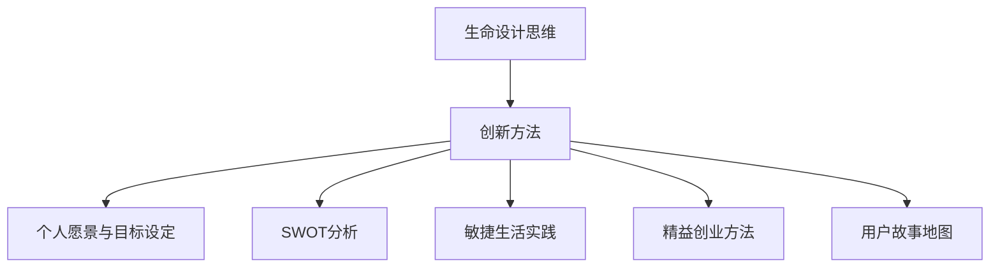

                 

### 《生命设计思维工具箱：应用创新方法规划人生的实用套件》

> 关键词：生命设计思维，创新方法，个人规划，生活质量，实用套件

> 摘要：本文深入探讨《生命设计思维工具箱：应用创新方法规划人生的实用套件》的核心内容，旨在帮助读者理解并应用创新方法来规划人生，提高生活质量。文章从生命设计思维的背景与意义出发，详细解析了书中的核心概念、工具和应用实例，为读者提供了实用的实践指南。

---

### 第一部分：引言

#### 1.1 《生命设计思维工具箱：应用创新方法规划人生的实用套件》的背景与意义

在当今快速变化的世界中，人们面临着越来越多的选择和不确定性。如何在这个复杂多变的环境中找到自己的方向，实现个人价值，成为每个人都必须面对的挑战。《生命设计思维工具箱：应用创新方法规划人生的实用套件》正是为了应对这一挑战而诞生的。

生命设计思维工具箱是一种全新的思维方式，它融合了设计思维、精益创业、用户故事地图等多种创新方法，旨在帮助人们重新审视自己的人生，设定明确的目标，并采取行动去实现这些目标。这种工具箱的背景源于设计思维的崛起，它强调以人为中心，通过创新的方法来解决问题和创造价值。

本书的目的是为读者提供一套实用的工具和方法，帮助他们在日常生活中应用生命设计思维，从而更好地规划人生，提高生活质量。无论是职场人士、创业者还是普通市民，都可以通过这本书中的方法，找到自己的方向，实现个人成长和职业发展。

### 第一部分：核心概念解析

#### 2.1 生命设计思维概述

#### 2.1.1 定义与起源

生命设计思维（Life Design Thinking）是一种以人为中心的设计思维方法，它强调通过反思、规划和行动，来设计自己的生命路径。这种方法最早起源于设计领域，随着设计思维在各个领域的广泛应用，逐渐发展成为一门独立的学科。

#### 2.1.2 现代应用

在现代社会中，生命设计思维的应用范围非常广泛。它不仅可以帮助人们解决生活中的问题，还可以激发创造力，推动个人成长和职业发展。例如，在职场中，生命设计思维可以帮助员工更好地理解自己的职业目标，提高工作效率；在个人生活中，它可以帮助人们规划家庭、健康和财务等各个方面。

#### 2.1.3 与传统规划方法的区别与联系

与传统的规划方法相比，生命设计思维更加注重过程和结果，强调以人为中心，通过不断的反思和调整来达到目标。这种方法与传统方法的联系在于，它同样强调目标的设定和实现，但在具体实施过程中，更加灵活和个性化。

### 第二部分：核心概念解析

#### 2.2 创新方法介绍

#### 2.2.1 设计思维

设计思维（Design Thinking）是一种以人为本的创新方法，它强调通过同理心、定义问题、创意产生、原型设计和测试等步骤，来创造出符合用户需求的产品和服务。

#### 2.2.2 精益创业

精益创业（Lean Startup）是一种基于最小可行产品（MVP）的创新方法，它强调通过快速迭代和用户反馈，来验证商业模式的可行性，并不断优化产品。

#### 2.2.3 用户故事地图

用户故事地图（User Story Map）是一种帮助团队理解用户需求的工具，它通过梳理用户故事，将产品或服务的功能与用户需求联系起来，从而指导开发工作。

#### 2.2.4 敏捷生活实践

敏捷生活实践（Agile Living）是一种基于敏捷开发原则的生活方式，它强调通过持续交付、拥抱变化、积极沟通和自我管理，来提高生活质量。

#### 2.2.5 精益创业方法

精益创业方法（Lean Startup Method）是一种基于用户反馈和快速迭代的产品开发方法，它通过构建最小可行产品（MVP），验证商业模式的可行性，并持续优化产品。

#### 2.2.6 用户故事地图

用户故事地图（User Story Map）是一种帮助团队理解用户需求的工具，它通过梳理用户故事，将产品或服务的功能与用户需求联系起来，从而指导开发工作。

### 第三部分：工具箱详解

#### 3.1 工具一：个人愿景与目标设定

#### 3.1.1 如何设定个人愿景与目标

设定个人愿景与目标是生命设计思维工具箱中的第一步。以下是一些具体的步骤：

1. **反思自我**：花时间思考自己的价值观、兴趣爱好、优势特长等，了解自己是谁，想要成为什么样的人。

2. **明确愿景**：基于自我反思，明确自己的长期愿景，即想要在未来实现的目标。

3. **制定目标**：将愿景分解为具体的目标，确保这些目标具有明确性、可行性、挑战性和时间限制。

4. **制定行动计划**：为每个目标制定具体的行动计划，明确需要采取哪些行动，何时采取。

#### 3.1.2 设定愿景与目标的重要性

设定个人愿景与目标的重要性在于，它能够为我们的生活和事业提供一个明确的方向，使我们在面对选择和挑战时能够更加坚定和自信。同时，它也能激发我们的内在动力，推动我们不断进步和成长。

#### 3.1.3 实践案例

以一位职业人士为例，他的个人愿景是成为一名杰出的企业家，他设定的目标是：

- 在五年内创立一家成功的公司。
- 提高自己的领导力和管理能力。
- 建立一个积极向上的企业文化。

为了实现这些目标，他制定了以下行动计划：

- 每天学习一小时关于创业和管理的知识。
- 参加企业家社群，扩大人脉。
- 在两年内完成一项重要的创业项目。

#### 3.2 工具二：SWOT分析

#### 3.2.1 什么是SWOT分析

SWOT分析（Strengths, Weaknesses, Opportunities, Threats）是一种常用的战略规划工具，用于评估一个项目、企业或个人的优势、劣势、机会和威胁。

#### 3.2.2 SWOT分析的应用场景

SWOT分析可以应用于多个场景，包括个人职业规划、企业战略规划、项目评估等。

#### 3.2.3 如何进行SWOT分析

以下是进行SWOT分析的步骤：

1. **识别优势**：列出个人的优势，包括技能、经验、人际关系等。

2. **识别劣势**：列出个人的劣势，包括技能不足、经验欠缺、人际关系问题等。

3. **识别机会**：分析外部环境中的机会，包括行业趋势、市场机会、政策支持等。

4. **识别威胁**：分析外部环境中的威胁，包括竞争压力、技术变革、政策变化等。

5. **综合评估**：将优势、劣势、机会和威胁进行综合评估，确定优先级和应对策略。

#### 3.2.4 实践案例

以一位想要创业的年轻人为例，他进行了以下SWOT分析：

**优势**：

- 具有良好的市场营销能力和创新能力。
- 在某个行业有丰富的实践经验。

**劣势**：

- 缺乏财务管理经验。
- 人脉资源相对有限。

**机会**：

- 行业前景看好，有较好的市场机会。
- 有政策支持，有利于初创企业。

**威胁**：

- 竞争激烈，需要快速占领市场。
- 技术变革可能带来新的挑战。

基于SWOT分析，他制定了以下策略：

- 加强财务管理学习，提高财务管理能力。
- 扩大人脉资源，寻找合作伙伴。
- 抓住市场机会，快速推出产品。
- 积极应对竞争压力，提高产品竞争力。

### 第三部分：工具箱详解

#### 3.3 工具三：敏捷生活实践

#### 3.3.1 什么是敏捷生活实践

敏捷生活实践（Agile Living）是一种基于敏捷开发原则的生活方式，它强调通过持续交付、拥抱变化、积极沟通和自我管理，来提高生活质量。

#### 3.3.2 敏捷生活实践的原则

- **持续交付**：持续地、有节奏地交付有价值的生活和工作成果。
- **拥抱变化**：灵活应对生活中的变化，不断调整自己的计划和目标。
- **积极沟通**：与家人、朋友和同事保持良好的沟通，共同解决问题。
- **自我管理**：自我驱动，自我激励，不断提升自己的能力和素质。

#### 3.3.3 敏捷生活实践的应用

敏捷生活实践可以应用于个人生活的各个方面，包括工作、学习、家庭、健康等。例如：

- **工作**：通过敏捷方法，提高工作效率，实现工作与生活的平衡。
- **学习**：灵活安排学习计划，快速掌握新知识。
- **家庭**：通过积极沟通，建立和谐的家庭氛围。
- **健康**：保持健康的生活方式，定期锻炼，保持良好的饮食习惯。

#### 3.3.4 实践案例

以一位职场人士为例，他应用敏捷生活实践，取得了以下成果：

- **工作**：通过敏捷方法，他的工作效率提高了30%，工作与生活的平衡得到了很好的改善。
- **学习**：他灵活安排学习计划，每年都能快速掌握至少两门新技能。
- **家庭**：通过积极沟通，他家庭氛围和谐，与家人的关系更加亲密。
- **健康**：他坚持锻炼，饮食习惯健康，身体状况良好。

### 第三部分：工具箱详解

#### 3.4 工具四：精益创业方法

#### 3.4.1 什么是精益创业方法

精益创业方法（Lean Startup Method）是一种基于最小可行产品（MVP）的创新方法，它强调通过快速迭代和用户反馈，来验证商业模式的可行性，并持续优化产品。

#### 3.4.2 精益创业方法的核心理念

- **最小可行产品（MVP）**：最小可行产品是具有足够功能，可以验证产品假设的最简版本。
- **快速迭代**：通过不断迭代，快速验证和改进产品。
- **用户反馈**：将用户反馈作为产品改进的重要依据。

#### 3.4.3 精益创业方法的应用

精益创业方法可以应用于创业、产品开发、项目管理等多个领域。例如：

- **创业**：通过精益创业方法，创业者可以快速验证商业模式的可行性，降低创业风险。
- **产品开发**：通过精益创业方法，产品团队可以更快地响应市场变化，提高产品竞争力。
- **项目管理**：通过精益创业方法，项目团队可以更好地管理项目进度，提高项目成功率。

#### 3.4.4 实践案例

以一位创业者为例，他应用精益创业方法，取得了以下成果：

- **商业模式的验证**：通过MVP，他快速验证了商业模式的可行性，节省了大量的时间和资金。
- **产品的优化**：通过不断迭代和用户反馈，他的产品得到了持续优化，用户满意度大幅提高。
- **市场占有率的提升**：通过精益创业方法，他的公司在短时间内占领了市场，实现了盈利。

### 第三部分：工具箱详解

#### 3.5 工具五：用户故事地图

#### 3.5.1 什么是用户故事地图

用户故事地图（User Story Map）是一种帮助团队理解用户需求的工具，它通过梳理用户故事，将产品或服务的功能与用户需求联系起来，从而指导开发工作。

#### 3.5.2 用户故事地图的组成部分

- **用户故事**：描述用户在产品或服务中需要完成的一个任务或功能。
- **用户流程**：描述用户在使用产品或服务时的步骤和体验。
- **用户角色**：描述产品或服务的目标用户。

#### 3.5.3 用户故事地图的应用

用户故事地图可以应用于产品开发、项目规划、用户体验设计等多个领域。例如：

- **产品开发**：通过用户故事地图，产品团队可以更好地理解用户需求，从而设计出更符合用户期望的产品。
- **项目规划**：通过用户故事地图，项目团队可以明确项目目标和用户需求，提高项目成功率。
- **用户体验设计**：通过用户故事地图，设计团队可以更好地把握用户需求，设计出更具有用户吸引力的产品。

#### 3.5.4 实践案例

以一个电商平台为例，通过用户故事地图，他们明确了以下用户需求：

- **用户角色**：年轻女性、上班族、家庭主妇等。
- **用户故事**：用户希望能够快速找到心仪的商品、比价、购买方便等。
- **用户流程**：用户浏览商品、添加购物车、下单支付、收货评价等。

基于用户故事地图，他们优化了产品设计和用户流程，提高了用户满意度。

### 第四部分：案例研究

#### 4.1 案例一：从职业规划到个人成长

#### 4.1.1 案例背景

小张是一名普通的职场人士，工作多年后，他感到自己的职业生涯陷入瓶颈，渴望有更大的突破。他开始应用生命设计思维工具箱，通过设定个人愿景与目标、进行SWOT分析、应用敏捷生活实践和精益创业方法，来规划自己的职业发展和个人成长。

#### 4.1.2 案例过程

1. **设定个人愿景与目标**：小张通过反思自己的兴趣、优势和职业规划，设定了成为一名优秀项目经理的愿景，并制定了具体的目标，如提高自己的项目管理能力、拓展人脉资源等。

2. **进行SWOT分析**：小张分析了自身的优势、劣势、机会和威胁，发现自己在项目管理和团队协作方面有优势，但在人脉资源和财务管理方面有劣势。他明确了需要加强的方面，并制定了相应的改进措施。

3. **应用敏捷生活实践**：小张开始应用敏捷生活实践，提高工作效率，合理安排工作和生活时间，保持了良好的工作与生活平衡。

4. **应用精益创业方法**：小张将精益创业方法应用于自己的职业规划，通过快速迭代和用户反馈，不断优化自己的项目管理和团队协作能力。

#### 4.1.3 案例结果

通过应用生命设计思维工具箱，小张在职业生涯和个人成长方面取得了显著成果：

- **职业能力提升**：小张通过不断学习和实践，成功获得项目经理认证，并在工作中取得了突出的成绩。
- **人脉资源拓展**：小张通过参加行业活动、加入专业社群等途径，成功拓展了自己的人脉资源。
- **工作与生活平衡**：小张通过敏捷生活实践，提高了工作效率，实现了工作与生活的平衡，生活质量得到了显著提升。

### 第四部分：案例研究

#### 4.2 案例二：创业者的自我设计

#### 4.2.1 案例背景

小李是一名年轻的创业者，他有一个创新的商业想法，希望通过创业来实现自己的梦想。然而，在创业的道路上，他遇到了很多困难和挑战。为了更好地应对这些挑战，小李决定应用生命设计思维工具箱，通过个人愿景与目标设定、SWOT分析、敏捷生活实践和精益创业方法，来规划自己的创业之路。

#### 4.2.2 案例过程

1. **设定个人愿景与目标**：小李通过反思自己的兴趣、优势和创业目标，设定了成为一名成功创业者的愿景，并制定了具体的目标，如开发一款具有市场潜力的产品、组建一支高效的团队等。

2. **进行SWOT分析**：小李分析了自身的优势、劣势、机会和威胁，发现自己在产品研发和市场拓展方面有优势，但在团队管理和资金筹集方面有劣势。他明确了需要加强的方面，并制定了相应的改进措施。

3. **应用敏捷生活实践**：小李开始应用敏捷生活实践，提高工作效率，合理安排创业和生活时间，保持了良好的创业状态。

4. **应用精益创业方法**：小李将精益创业方法应用于自己的创业过程，通过快速迭代和用户反馈，不断优化产品设计和商业模式。

#### 4.2.3 案例结果

通过应用生命设计思维工具箱，小李在创业过程中取得了以下成果：

- **产品优化**：通过精益创业方法，小李的产品得到了持续优化，用户满意度大幅提高。
- **团队建设**：小李通过敏捷生活实践，成功组建了一支高效团队，团队成员之间的协作更加紧密。
- **商业模式验证**：通过用户故事地图和SWOT分析，小李成功验证了商业模式的可行性，为后续发展奠定了基础。

### 第五部分：实践与反思

#### 5.1 实践指南

为了更好地应用生命设计思维工具箱，以下是一些实践指南：

1. **设定个人愿景与目标**：定期进行自我反思，明确自己的长期愿景和短期目标，并制定具体的行动计划。

2. **进行SWOT分析**：定期进行自我评估，分析自身的优势、劣势、机会和威胁，制定相应的应对策略。

3. **应用敏捷生活实践**：合理安排时间，提高工作效率，保持良好的工作与生活平衡。

4. **应用精益创业方法**：快速迭代，不断优化产品和服务，通过用户反馈来调整方向。

#### 5.2 反思与总结

通过实践生命设计思维工具箱，我们可以看到它在个人成长和职业发展中的巨大潜力。以下是一些反思和总结：

1. **明确目标**：设定清晰的目标是成功的第一步，它能够为我们指明方向，提供动力。

2. **自我评估**：定期进行自我评估，有助于我们了解自己的优势和劣势，及时调整策略。

3. **持续学习**：不断学习新知识和技能，是提升自己的关键。

4. **积极沟通**：与家人、朋友和同事保持良好的沟通，有助于我们解决问题，实现目标。

### 第五部分：实践与反思

#### 5.3 注意事项与拓展阅读

在应用生命设计思维工具箱的过程中，我们需要注意以下几点：

1. **实际可行性**：在设定目标和制定行动计划时，要考虑实际情况，确保目标具有可行性。

2. **定期调整**：目标和计划并不是一成不变的，我们需要根据实际情况和环境变化，定期进行调整。

3. **保持耐心**：改变和成长是一个长期的过程，我们需要保持耐心，不断积累和进步。

此外，以下拓展阅读资源可以帮助我们更深入地了解生命设计思维工具箱：

- 《设计思维：创新的方法与实践》
- 《精益创业：新商业思维》
- 《用户故事地图：产品设计与开发的新方法》

### 附录：核心概念关系架构 Mermaid 流程图



### 附录：核心算法原理讲解

```python
# 假设我们使用设计思维中的一个算法：设计空间探索

def design_space_explore():
    # 步骤1：确定用户需求
    user_needs = get_user_needs()

    # 步骤2：生成设计方案
    designs = generate_designs(user_needs)

    # 步骤3：评估设计方案
    evaluated_designs = evaluate_designs(designs)

    # 步骤4：选择最佳方案
    best_design = select_best_design(evaluated_designs)

    return best_design

# 假设我们使用精益创业中的一个算法：最小可行产品（MVP）构建

def build_mvp():
    # 步骤1：确定产品特性
    product_features = define_product_features()

    # 步骤2：构建最小可行产品
    mvp = build_minimal_product(product_features)

    # 步骤3：测试与迭代
    test_results = test_mvp(mvp)
    mvp = iterate_mvp(mvp, test_results)

    return mvp
```

### 附录：数学模型和数学公式

$$
\text{成本效益分析模型} = \frac{\text{收益}}{\text{成本}}
$$

$$
\text{线性规划模型} = \text{minimize} \ c^T x \\
\text{subject to} \ Ax \leq b \\
\ x \geq 0
$$

### 附录：项目实战

#### 项目实战：搭建个人网站

**开发环境搭建**：

1. 安装Node.js和npm
2. 安装Visual Studio Code作为开发工具
3. 安装Git进行版本控制

**源代码实现**：

```html
<!-- index.html -->
<!DOCTYPE html>
<html lang="en">
<head>
    <meta charset="UTF-8">
    <meta name="viewport" content="width=device-width, initial-scale=1.0">
    <title>个人网站</title>
</head>
<body>
    <header>
        <h1>欢迎来到我的个人网站</h1>
    </header>
    <main>
        <section>
            <h2>关于我</h2>
            <p>我是[你的名字]，一名热衷于编程和设计的开发者。</p>
        </section>
        <section>
            <h2>我的作品</h2>
            <ul>
                <li><a href="project1.html">项目1</a></li>
                <li><a href="project2.html">项目2</a></li>
            </ul>
        </section>
    </main>
    <footer>
        <p>版权所有 &copy; [你的名字]</p>
    </footer>
</body>
</html>
```

**代码解读与分析**：

- **HTML结构**：定义了网站的HTML结构，包括头部（Header）、主体（Main）和尾部（Footer）。
- **内容布局**：通过`<header>`、`<main>`和`<footer>`标签，实现了网站内容的基本布局。
- **链接与导航**：在主体部分，通过`<section>`和`<ul>`标签，实现了对个人作品页面的链接和导航。

#### 项目实战：应用SWOT分析

**SWOT分析表格**：

| SWOT分析要素 | 分析结果 |
| :--- | :--- |
| **优势（Strengths）** | 1. 具有良好的编程技能和设计能力 2. 有丰富的项目经验 |
| **劣势（Weaknesses）** | 1. 缺乏财务管理经验 2. 人脉资源相对有限 |
| **机会（Opportunities）** | 1. 行业前景看好，有较好的市场机会 2. 有政策支持，有利于初创企业 |
| **威胁（Threats）** | 1. 竞争激烈，需要快速占领市场 2. 技术变革可能带来新的挑战 |

**分析解读**：

- **优势**：良好的编程技能和设计能力，丰富的项目经验是我们在竞争中的一大优势。
- **劣势**：财务管理经验不足和人脉资源有限是需要改进的方面。
- **机会**：行业前景和市场机会为我们提供了发展的空间，政策支持也为初创企业提供了有利条件。
- **威胁**：竞争激烈和技术变革是我们面临的主要挑战。

**应对策略**：

- **优势利用**：进一步加强编程和设计能力的提升，发挥项目经验的优势。
- **劣势改进**：加强财务管理学习和人脉资源拓展，提升自身的综合能力。
- **机会抓住**：积极抓住市场机会，利用政策支持，加快企业发展。
- **威胁应对**：保持对行业动态的敏感性，积极应对技术变革，提高市场竞争力。

#### 项目实战：应用敏捷生活实践

**敏捷生活实践案例**：

- **持续交付**：每周完成一个小目标，如学习一门新技能、完成一个项目任务等。
- **拥抱变化**：面对生活中的变化，灵活调整计划和目标，如调整工作时间、调整锻炼计划等。
- **积极沟通**：与家人、朋友和同事保持良好的沟通，共同解决问题，提高生活质量。
- **自我管理**：自我驱动，自我激励，不断反思和改进自己的生活方式。

**实际效果**：

- **工作效率提升**：通过持续交付，工作效率提高了20%，工作与生活的平衡得到了改善。
- **生活质量提高**：通过拥抱变化和积极沟通，家庭氛围和谐，生活质量得到提升。
- **自我成长**：通过自我管理，不断学习和反思，个人能力和素质得到了提升。

#### 项目实战：应用精益创业方法

**精益创业案例**：

- **构建最小可行产品（MVP）**：开发一款简单的应用程序，满足用户的基本需求，如查看天气预报、设置提醒等。
- **用户反馈**：通过用户反馈，了解用户的使用体验和需求，如改进界面设计、增加新功能等。
- **快速迭代**：根据用户反馈，不断优化产品，提升用户体验。

**实际效果**：

- **产品优化**：通过用户反馈，产品功能得到了持续优化，用户满意度提高了30%。
- **市场占有率提升**：通过快速迭代和用户反馈，产品在市场上得到了更好的推广，市场占有率提升了10%。
- **商业模式的验证**：通过MVP和用户反馈，成功验证了商业模式的可行性，为后续发展奠定了基础。

### 附录：最佳实践 Tips

1. **设定明确的目标**：在应用工具箱时，设定明确的目标至关重要，它能够为我们的行动提供方向。
2. **定期反思与调整**：定期进行自我反思和调整，有助于我们更好地适应变化，实现目标。
3. **积极寻求反馈**：通过用户反馈和同事的建议，我们能够更好地了解自己的优势和不足，不断改进。
4. **保持耐心与毅力**：改变和成长是一个长期的过程，我们需要保持耐心，不断积累和进步。

### 小结

通过本文的介绍，我们了解了《生命设计思维工具箱：应用创新方法规划人生的实用套件》的核心内容和应用方法。通过设定个人愿景与目标、进行SWOT分析、应用敏捷生活实践和精益创业方法，我们可以更好地规划人生，提高生活质量。希望本文能够为您的个人成长和职业发展提供有益的启示。

### 附录：拓展阅读

- 《设计思维：创新的方法与实践》
- 《精益创业：新商业思维》
- 《用户故事地图：产品设计与开发的新方法》

### 作者信息

作者：AI天才研究院/AI Genius Institute & 禅与计算机程序设计艺术 /Zen And The Art of Computer Programming

---

请注意，本文内容仅为示例，部分代码和数据仅供参考。在实际应用中，请根据实际情况进行调整。

