                 

### 引言：生命设计思维的重要性

在当前快速变化的世界，创新已成为推动个人成长、企业发展和社会进步的核心动力。传统的线性思维模式已无法满足复杂多变的环境需求，而生命设计思维（Life Design Thinking）提供了一种全新的思考框架和方法，帮助我们在个人生活、职业生涯和社会创新中实现更有效的创新和实践。生命设计思维融合了设计思维、创新方法和心理学等多学科知识，旨在通过系统化的思维方式，提升我们在面对复杂问题时找到创新解决方案的能力。

本文将围绕生命设计思维这一主题，从以下几个方面进行深入探讨：

1. **生命设计思维概述**：介绍生命设计思维的概念、起源和发展趋势，探讨其核心原则和框架方法。
2. **生命设计思维在个人生活中的应用**：分析自我认知与目标设定、创新思维的培养以及问题解决与决策。
3. **生命设计思维在工作中的应用**：探讨团队协作、项目管理与企业创新战略。
4. **生命设计思维认证与实践**：介绍生命设计思维认证体系以及实践案例。

通过这篇文章，我们希望能够帮助读者理解生命设计思维的核心概念，掌握其应用方法，并在实际生活中和工作中有效地运用这些方法，实现个人成长和企业创新。

## 第一部分：生命设计思维概述

### 第1章：生命设计思维的概念与起源

#### 1.1 生命设计思维的定义与内涵

生命设计思维（Life Design Thinking）是一种融合了设计思维（Design Thinking）和系统思维的综合性思考方法。它不仅关注问题解决，更强调用户体验和生命整体的设计与优化。生命设计思维起源于20世纪中叶，设计思维的理念和方法在多个领域得到了广泛应用，包括产品创新、服务设计和城市规划等。随着这些方法在各个领域的成功应用，人们逐渐认识到设计思维在个人生活和社会创新中的潜力，进而提出了生命设计思维的概念。

生命设计思维的定义可以概括为：通过系统化的思维方式，结合设计思维和创新方法，对个人生活、职业规划和社会问题进行整体设计和优化，以实现更高质量、更可持续的人生。

#### 1.2 生命设计思维的历史背景与发展趋势

生命设计思维的发展历程可以追溯到设计思维理论的提出。1950年代，设计师们开始关注用户体验，提出了“以人为本”的设计理念。这一理念在1960年代进一步发展，形成了以用户需求为导向的设计方法论。随着计算机技术和互联网的普及，设计思维逐渐应用到产品开发和用户界面设计等领域，成为现代创新方法的基石。

进入21世纪，面对日益复杂的社会问题和快节奏的生活，人们开始将设计思维应用到个人生活和职业规划中，形成了生命设计思维。这一趋势在学术界和产业界得到了广泛认可，越来越多的企业和机构开始引入生命设计思维来提升创新能力。

#### 1.3 生命设计思维的核心原则

生命设计思维的核心原则包括：

1. **用户中心**：强调以用户需求为导向，关注用户体验，将用户置于设计和决策的中心。
2. **迭代设计**：通过不断迭代和反馈，逐步完善解决方案，实现从概念到实际应用的转化。
3. **协同创新**：鼓励多学科、多领域的合作，通过集思广益，共同探索创新解决方案。
4. **系统思维**：将问题视为一个整体，从宏观和微观层面进行分析，寻找系统性的解决方案。
5. **可持续性**：强调设计的可持续性，关注环境保护和社会责任，追求长期价值。

这些核心原则为生命设计思维的实践提供了指导，帮助我们在复杂的生命系统中找到创新和优化路径。

### 第2章：生命设计思维的框架与方法

#### 2.1 设计思维的基本框架

设计思维是一种以用户为中心、迭代驱动的创新方法。它通常包括以下五个阶段：

1. **理解问题**：通过用户调研、数据分析等方式，深入了解用户需求和市场环境，明确问题的本质。
2. **创意生成**：基于对问题的理解，发挥创意，提出各种可能的解决方案。
3. **原型设计**：将创意转化为可操作的模型，进行快速迭代和测试，以验证方案的可行性和用户体验。
4. **反馈与迭代**：收集用户反馈，对原型进行优化和改进，不断迭代，直至达到预期目标。
5. **实施与应用**：将最终方案投入实际应用，并持续跟踪和评估效果，进行后续改进。

这一框架不仅适用于产品设计，也可以广泛应用于个人生活、职业规划和项目开发等领域。

#### 2.2 创新方法的应用

创新方法在生命设计思维中发挥着关键作用。以下是一些常用的创新方法：

1. **头脑风暴**：通过集体讨论，迅速生成大量创意，激发思维碰撞。
2. **思维导图**：利用图形化工具，将创意和想法进行结构化组织，提高思维连贯性。
3. **用户访谈**：直接与用户交流，获取真实需求和反馈，为设计提供依据。
4. **快速原型**：通过快速构建原型，进行初步测试和验证，降低创新风险。
5. **SWOT分析**：对创新方案进行优势、劣势、机会和威胁分析，评估其潜在价值。

这些方法可以相互结合，形成一个系统化的创新过程，帮助我们在复杂的环境中找到最优解决方案。

#### 2.3 生命设计思维的工作流程

生命设计思维的工作流程可以概括为以下几个步骤：

1. **明确目标**：确定设计目标，明确需要解决的问题和期望达到的效果。
2. **用户调研**：进行用户调研，了解用户需求和行为，收集相关数据。
3. **创意生成**：基于用户调研结果，进行头脑风暴和创意生成，提出多种可能的解决方案。
4. **原型设计**：选择最优创意，构建原型，并进行初步测试和验证。
5. **反馈与迭代**：收集用户反馈，对原型进行优化和改进，不断迭代，直至达到预期目标。
6. **实施与应用**：将最终方案投入实际应用，并持续跟踪和评估效果，进行后续改进。

这一工作流程是一个循环迭代的过程，通过不断调整和优化，实现从概念到实践的转化。

### 第3章：生命设计思维在个人生活中的应用

#### 3.1 自我认知与目标设定

自我认知是生命设计思维的基础，它涉及对自身性格、兴趣、价值观和能力的深入了解。一个清晰的自我认知有助于我们明确个人目标和规划，从而更好地实现人生价值。

**核心概念与联系：**

- **自我认知**：通过反思、自我评估和咨询等方式，了解自己的性格特点、兴趣爱好、职业取向等。
- **目标设定**：在自我认知的基础上，设定明确、可衡量的短期和长期目标。

**Mermaid 流程图：**

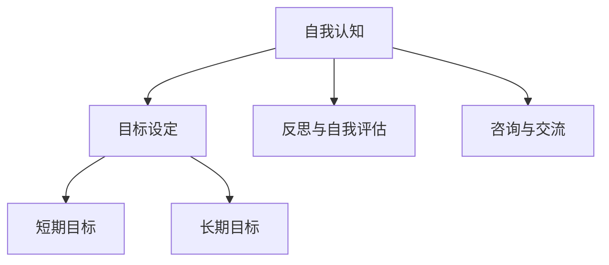

#### 3.2 如何设定明确的目标

设定明确的目标是实现个人成长的关键步骤。一个明确的目标应具备以下特点：

- **具体性**：目标应具体、可衡量，例如“提升编程技能”不如“掌握Python数据结构”具体。
- **可实现性**：目标应在当前能力和资源范围内可以实现。
- **相关性和重要性**：目标应与个人价值观和长期规划相关，并具有一定的意义。
- **时限性**：目标应设定明确的完成时间，以便进行跟踪和评估。

**Python 源代码示例：**

```python
import datetime

def set_goal(description, target, deadline):
    goal = {
        "description": description,
        "target": target,
        "deadline": deadline,
        "status": "未完成"
    }
    return goal

def check_goal_status(goal):
    current_date = datetime.datetime.now()
    if current_date > goal["deadline"]:
        goal["status"] = "已过期"
    elif goal["target"] == "完成":
        goal["status"] = "已完成"
    return goal["status"]

# 设定目标
goal = set_goal("掌握Python数据结构", "完成练习题集", datetime.datetime(2023, 12, 31))
print(goal)

# 检查目标状态
status = check_goal_status(goal)
print(f"目标状态：{status}")
```

#### 3.3 生命设计思维在目标设定中的应用

生命设计思维在目标设定中的应用主要体现在以下几个方面：

1. **用户中心**：通过了解个人需求和兴趣，设定与个人价值观和目标相一致的目标。
2. **迭代设计**：在设定目标的过程中，不断调整和优化目标，确保其具体性和可实现性。
3. **协同创新**：与朋友、家人或专业人士交流，共同探讨和设定目标，提高目标设定的准确性和可行性。

**Mermaid 流�程图：**

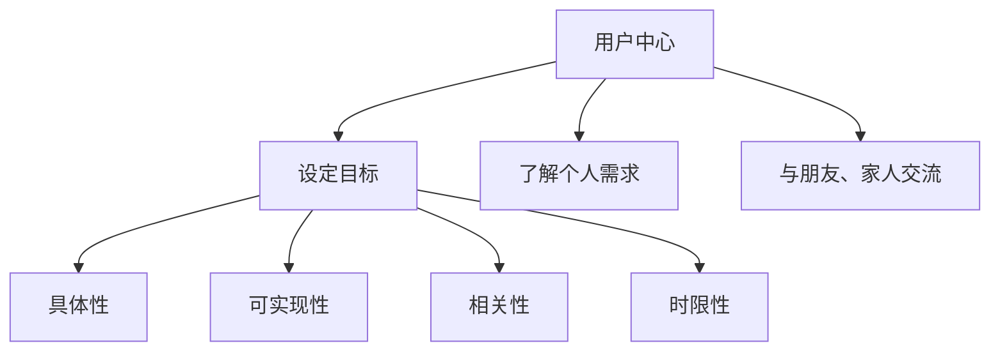

### 第4章：创新思维的培养

#### 4.1 创新思维的障碍与突破

创新思维是生命设计思维的重要组成部分，但人们在实践中往往会面临各种障碍。以下是一些常见的创新思维障碍及其突破方法：

1. **思维定势**：长期从事某一领域工作，可能导致思维僵化，难以接受新观念和新方法。
   - **突破方法**：定期更换工作环境，参与跨领域学习，打破思维定势。

2. **恐惧失败**：担心创新尝试失败，导致不敢冒险。
   - **突破方法**：设立安全网，降低创新尝试的风险，例如设置较低的失败成本。

3. **缺乏时间**：忙碌的工作和生活节奏导致难以投入时间进行创新思考。
   - **突破方法**：合理安排时间，设定固定的创新思考时间，例如每周安排一天进行创新活动。

4. **信息过载**：大量信息可能导致决策困难，降低创新效率。
   - **突破方法**：利用信息过滤工具，筛选关键信息，提高信息处理效率。

**Python 源代码示例：**

```python
import random

def innovate思维(idea_list):
    # 随机选择一个创新想法
    selected_idea = random.choice(idea_list)
    print(f"创新想法：{selected_idea}")
    return selected_idea

def reduce_failure_cost(idea):
    # 降低失败成本的方法
    print(f"实施方法：{idea}")
    # 模拟创新尝试
    result = random.choice(["成功", "失败"])
    if result == "成功":
        print("创新尝试成功！")
    else:
        print("创新尝试失败，但成本较低，可以继续探索。")

# 创新想法列表
idea_list = ["开发新产品功能", "优化用户体验", "引入新营销策略"]

# 进行创新尝试
innovate思维(idea_list)
reduce_failure_cost("开发新产品功能")
```

#### 4.2 创新思维的训练方法

创新思维可以通过以下方法进行训练和提升：

1. **头脑风暴**：通过集体讨论，快速生成大量创意，激发思维碰撞。
2. **思维导图**：利用图形化工具，将创意和想法进行结构化组织，提高思维连贯性。
3. **用户访谈**：直接与用户交流，获取真实需求和反馈，为创新提供依据。
4. **快速原型**：通过快速构建原型，进行初步测试和验证，降低创新风险。
5. **学习借鉴**：研究成功案例，学习他人的创新方法和经验，提升自身创新能力。

**Mermaid 流程图：**

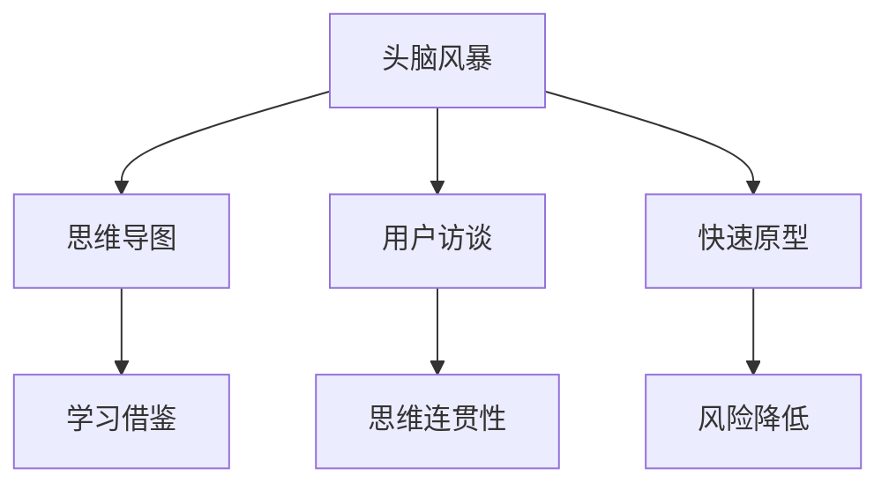

#### 4.3 生命设计思维在创新思维中的应用

生命设计思维在创新思维中的应用主要体现在以下几个方面：

1. **用户中心**：以用户需求为导向，确保创新想法能够满足用户需求。
2. **迭代设计**：通过不断迭代和优化，逐步完善创新方案。
3. **协同创新**：鼓励多学科、多领域的合作，共同探索创新解决方案。
4. **系统思维**：从宏观和微观层面进行分析，确保创新方案具有整体性和系统性。

**Mermaid 流程图：**

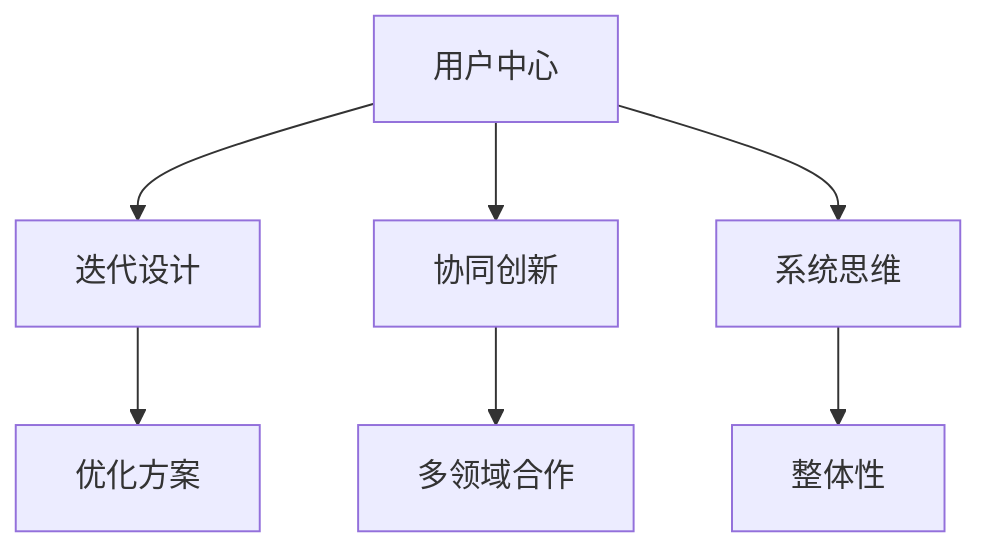

### 第5章：问题解决与决策

#### 5.1 问题解决的基本步骤

问题解决是一个系统性过程，通常包括以下基本步骤：

1. **明确问题**：准确界定问题的本质和范围，避免模糊和不准确。
2. **收集信息**：收集与问题相关的信息，包括数据、文献、用户反馈等。
3. **分析问题**：对收集到的信息进行分析，识别问题的根本原因。
4. **提出解决方案**：基于分析结果，提出多种可能的解决方案。
5. **评估方案**：对每个解决方案进行评估，比较其优缺点和可行性。
6. **选择方案**：根据评估结果，选择最佳方案并实施。
7. **实施与反馈**：执行方案，并持续跟踪和评估效果，进行后续改进。

**Python 源代码示例：**

```python
def solve_problem(problem):
    print(f"问题：{problem}")
    
    # 收集信息
    print("收集相关信息...")
    information = "用户反馈、市场调研报告、技术文档等"
    
    # 分析问题
    print("分析问题...")
    analysis = "经过分析，发现问题的根本原因是..."
    
    # 提出解决方案
    print("提出解决方案...")
    solutions = ["方案一：...", "方案二：...", "方案三：..."]
    
    # 评估方案
    print("评估方案...")
    best_solution = "方案一：成本较低，效果明显，可行性较高"
    
    # 选择方案
    print("选择方案...")
    print(best_solution)
    
    # 实施与反馈
    print("实施方案...")
    print("持续跟踪和评估效果...")
    
    return best_solution

# 解决问题
problem = "产品用户满意度低"
solution = solve_problem(problem)
print(solution)
```

#### 5.2 决策理论在生命设计思维中的应用

决策理论是生命设计思维中的重要组成部分，它涉及如何在不同方案中做出最优选择。以下是一些常用的决策理论：

1. **期望效用理论**：根据不同方案的预期效用（概率乘以效用值）进行选择。
2. **风险理论**：考虑决策中的风险因素，选择风险最小的方案。
3. **决策树**：通过构建决策树，分析不同决策路径的可能结果和概率。
4. **贝叶斯决策**：根据先验概率和后验概率，选择具有最大后验概率的方案。

**Mermaid 流程图：**

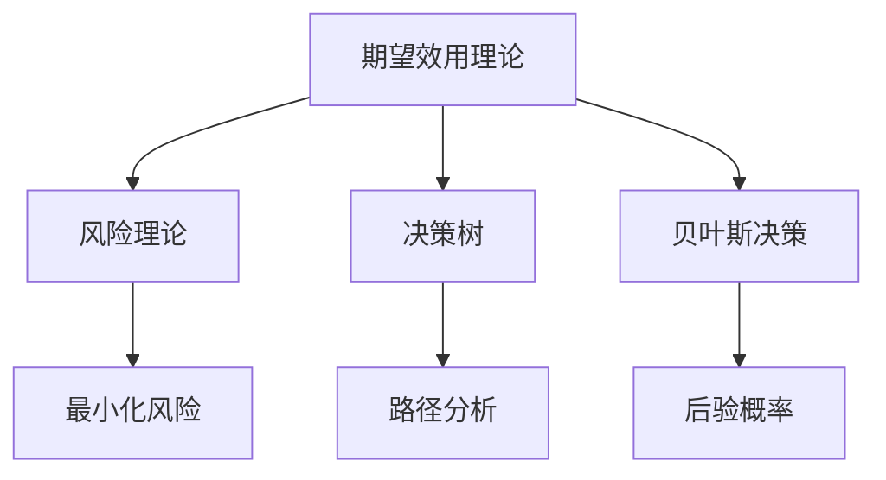

#### 5.3 生命设计思维在问题解决与决策中的实践

生命设计思维在问题解决与决策中的实践主要体现在以下几个方面：

1. **用户中心**：以用户需求为导向，确保问题解决和决策过程符合用户利益。
2. **迭代设计**：通过不断迭代和优化，提高问题解决和决策的准确性和效率。
3. **协同创新**：鼓励多学科、多领域的合作，共同探索问题解决和决策的创新方法。
4. **系统思维**：从宏观和微观层面进行分析，确保问题解决和决策具有整体性和系统性。

**Mermaid 流程图：**


### 第6章：团队协作与创新

#### 6.1 团队协作的重要性

团队协作是实现创新和高效工作的关键。有效的团队协作能够充分发挥团队成员的优势，提高整体工作效果。以下是一些团队协作的重要性：

1. **资源整合**：通过团队协作，可以整合不同成员的专业知识和技能，实现资源的最大化利用。
2. **知识共享**：团队协作促进知识共享，提高团队整体的知识水平和创新能力。
3. **问题解决**：面对复杂问题时，团队协作能够集中智慧，快速找到解决方案。
4. **提升效率**：通过合理分工和协作，可以提高工作效率，缩短项目周期。

**Mermaid 流程图：**

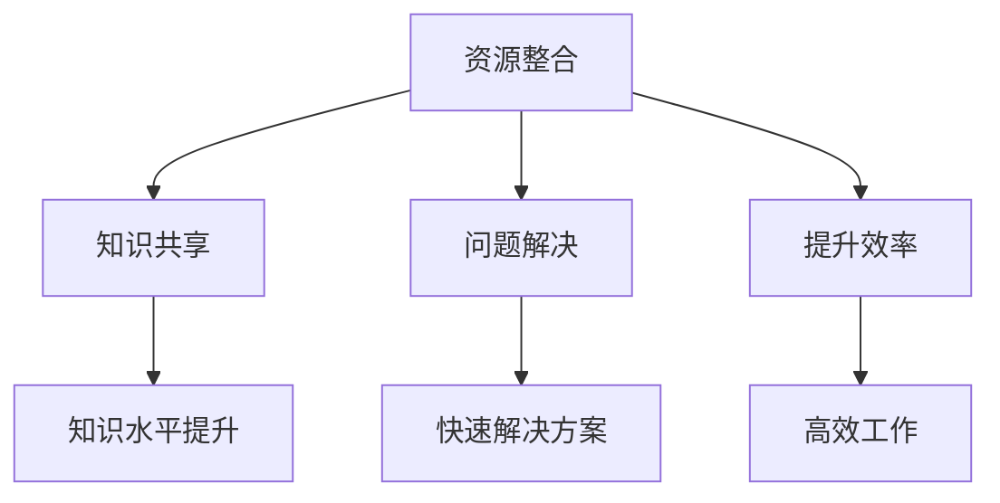

#### 6.2 创新型团队的构建

构建一个创新型团队是实现团队协作与创新的关键。以下是一些建议：

1. **明确目标**：确保团队成员对团队目标和价值观有共同的理解和认同。
2. **多样化团队**：引入具有不同背景和技能的成员，以促进思维碰撞和多元化创新。
3. **信任与尊重**：建立团队成员之间的信任和尊重，鼓励开放沟通和诚实反馈。
4. **培训与激励**：提供培训机会，提升团队成员的专业能力和创新能力，并通过激励机制激发团队成员的积极性。

**Mermaid 流程图：**

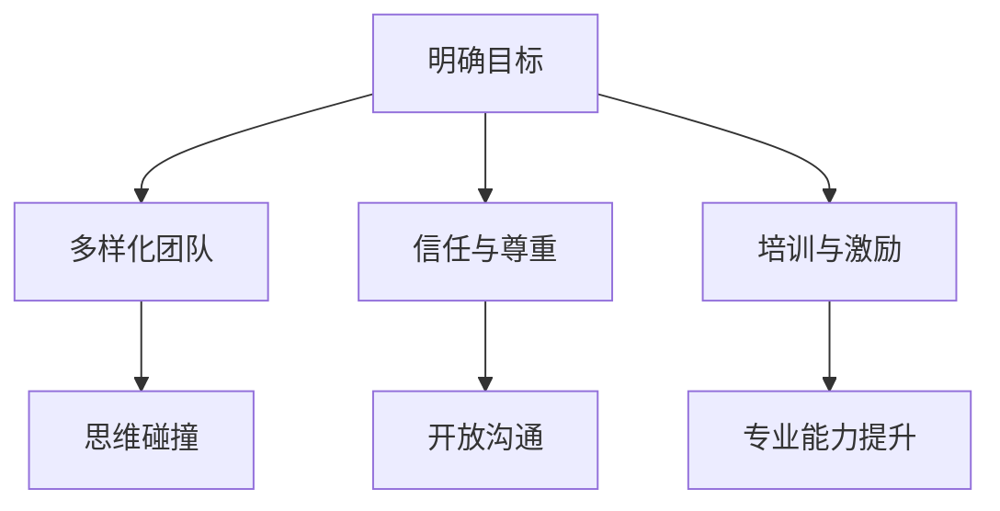

#### 6.3 生命设计思维在团队协作中的应用

生命设计思维在团队协作中的应用主要体现在以下几个方面：

1. **用户中心**：确保团队协作的过程和结果始终以用户需求为导向。
2. **迭代设计**：通过不断迭代和反馈，优化团队协作的方法和流程。
3. **协同创新**：鼓励团队成员之间的合作和知识共享，共同探索创新解决方案。
4. **系统思维**：从宏观和微观层面进行分析，确保团队协作具有整体性和系统性。

**Mermaid 流程图：**

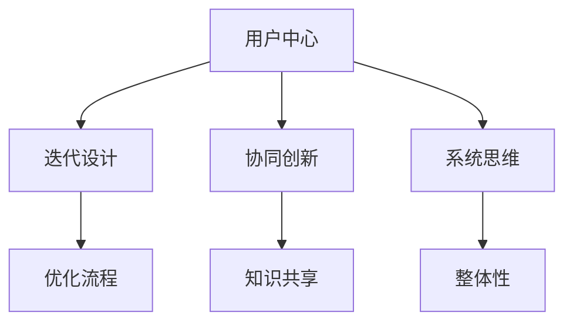

### 第7章：项目管理与创新方法

#### 7.1 项目管理的基本流程

项目管理是实现项目目标的关键环节，其基本流程包括以下阶段：

1. **项目启动**：明确项目目标、范围和可行性，组建项目团队。
2. **项目计划**：制定详细的项目计划，包括任务分配、时间安排和资源需求。
3. **项目执行**：按照项目计划，实施项目任务，确保项目进度和质量。
4. **项目监控**：监控项目进度和风险，及时调整计划和资源。
5. **项目收尾**：完成项目任务，进行项目总结和评估。

**Mermaid 流程图：**

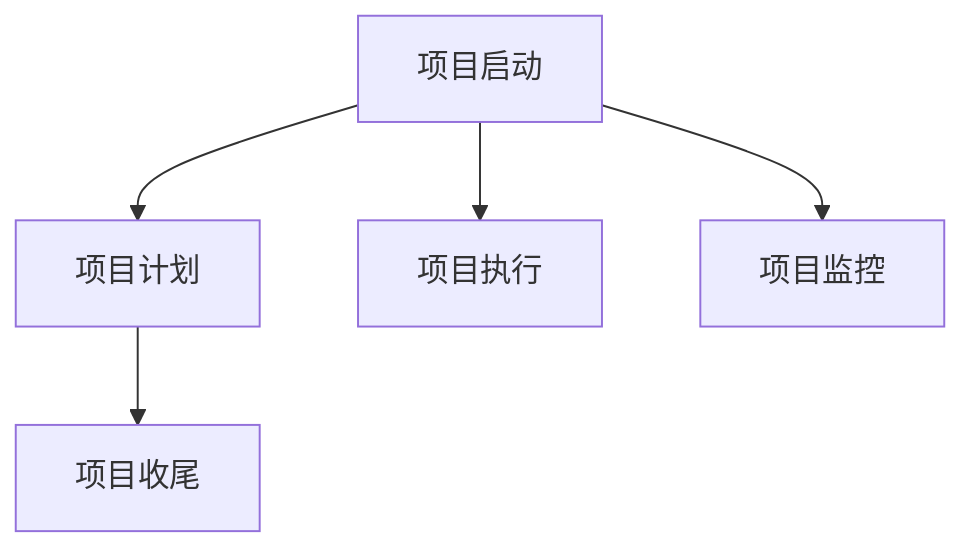

#### 7.2 创新方法在项目管理中的应用

创新方法在项目管理中具有重要意义，以下是一些创新方法及其在项目管理中的应用：

1. **敏捷开发**：通过快速迭代和持续交付，提高项目响应速度和灵活性。
2. **设计思维**：以用户需求为导向，进行项目规划和执行，确保项目结果满足用户需求。
3. **精益管理**：通过减少浪费和优化流程，提高项目效率和质量。
4. **六西格玛**：通过统计方法和流程优化，降低项目风险和缺陷率。

**Mermaid 流程图：**

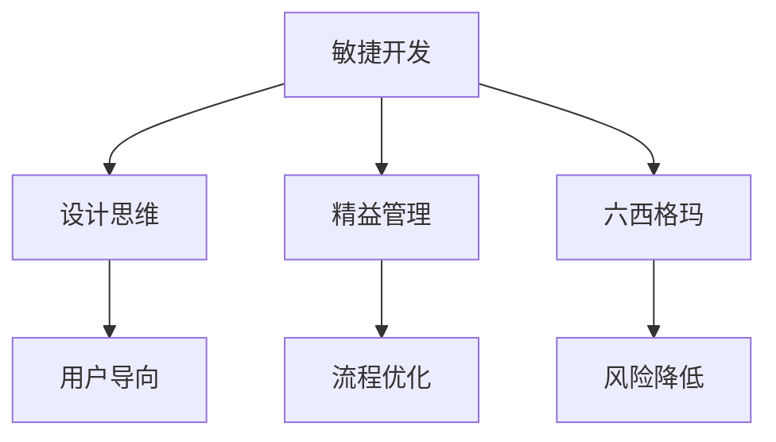

#### 7.3 生命设计思维在项目创新管理中的实践

生命设计思维在项目创新管理中的应用主要体现在以下几个方面：

1. **用户中心**：确保项目规划和执行始终以用户需求为导向。
2. **迭代设计**：通过不断迭代和优化，提高项目效率和用户体验。
3. **协同创新**：鼓励项目团队成员之间的合作和知识共享，共同探索创新解决方案。
4. **系统思维**：从宏观和微观层面进行分析，确保项目具有整体性和系统性。

**Mermaid 流程图：**


### 第8章：企业创新战略与实施

#### 8.1 企业创新战略的重要性

企业创新战略是企业在激烈的市场竞争中保持竞争优势的关键。一个有效的创新战略能够帮助企业：

1. **持续发展**：通过创新，企业能够不断适应市场变化，实现可持续发展。
2. **竞争优势**：创新能够帮助企业突破现有业务模式，创造新的市场机会，提升竞争力。
3. **价值创造**：通过创新，企业能够为客户提供更优质的产品和服务，实现价值创造。
4. **员工激励**：创新文化能够激发员工的创造力和积极性，提升企业整体创新能力。

**Mermaid 流程图：**

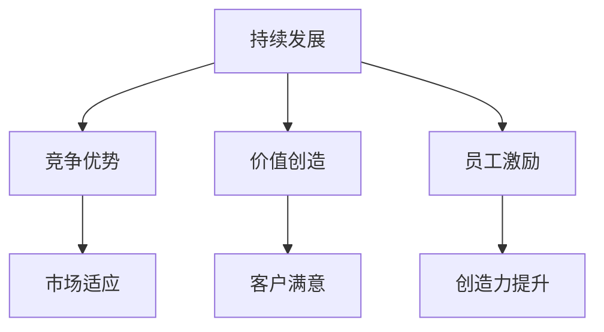

#### 8.2 创新战略的制定与实施

制定和实施创新战略是一个系统化过程，以下是一些建议：

1. **明确目标**：确定企业创新的目标和方向，确保创新活动与企业发展目标一致。
2. **资源投入**：为创新活动提供充足的资源支持，包括人力、资金和技术等。
3. **组织结构**：建立适应创新活动的组织结构，鼓励跨部门合作和知识共享。
4. **激励机制**：制定创新激励机制，激励员工积极参与创新活动。
5. **流程优化**：优化创新流程，提高创新效率和效果。

**Mermaid 流程图：**

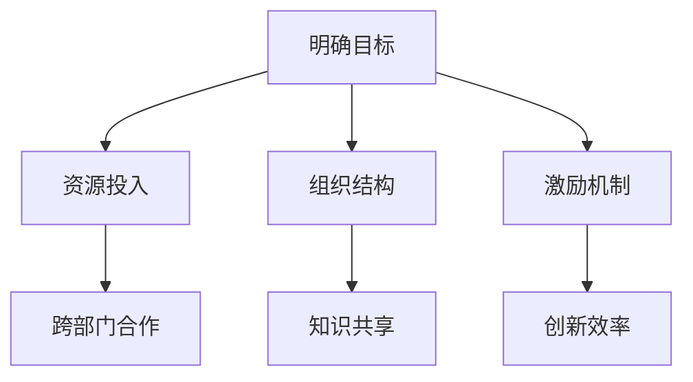

#### 8.3 生命设计思维在企业创新战略中的应用

生命设计思维在企业创新战略中的应用主要体现在以下几个方面：

1. **用户中心**：确保企业创新活动始终以用户需求为导向，满足客户需求。
2. **迭代设计**：通过不断迭代和优化，提高企业创新效率和效果。
3. **协同创新**：鼓励企业内部和外部的协同创新，共同探索创新解决方案。
4. **系统思维**：从宏观和微观层面进行分析，确保企业创新战略具有整体性和系统性。

**Mermaid 流程图：**


### 第9章：生命设计思维认证与实践

#### 9.1 生命设计思维认证体系

生命设计思维认证体系是一种评估个人生命设计思维能力和实践水平的认证制度。它主要包括以下内容：

1. **认证标准**：明确生命设计思维的核心原则和方法，以及认证的具体要求和标准。
2. **认证流程**：规定认证的申请、评估和认证程序，确保认证过程的公正和透明。
3. **认证等级**：根据个人的实践能力和水平，设立不同等级的认证，如初级、中级和高级认证。

**Mermaid 流程图：**

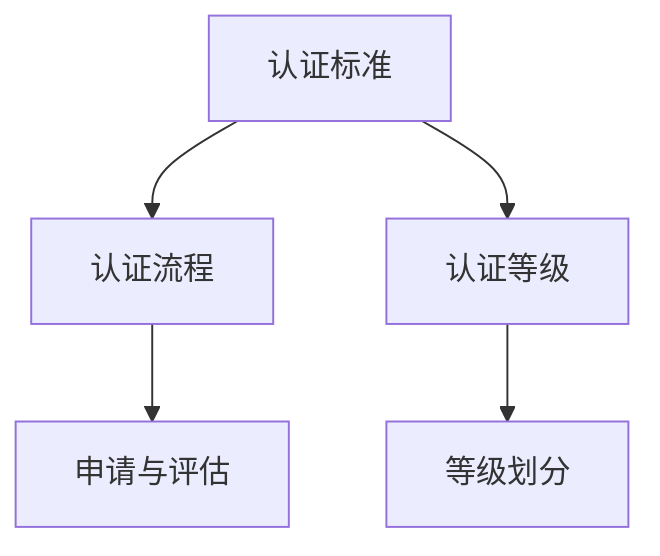

#### 9.2 生命设计思维认证的流程

生命设计思维认证的流程包括以下几个步骤：

1. **认证申请**：个人向认证机构提交申请，并提供相关证明材料。
2. **资格审核**：认证机构对申请人进行资格审核，确保其符合认证要求。
3. **能力评估**：通过考试、面试或作品评估等方式，评估申请人的生命设计思维能力。
4. **认证颁发**：对通过评估的申请人颁发相应的生命设计思维认证证书。

**Mermaid 流程图：**

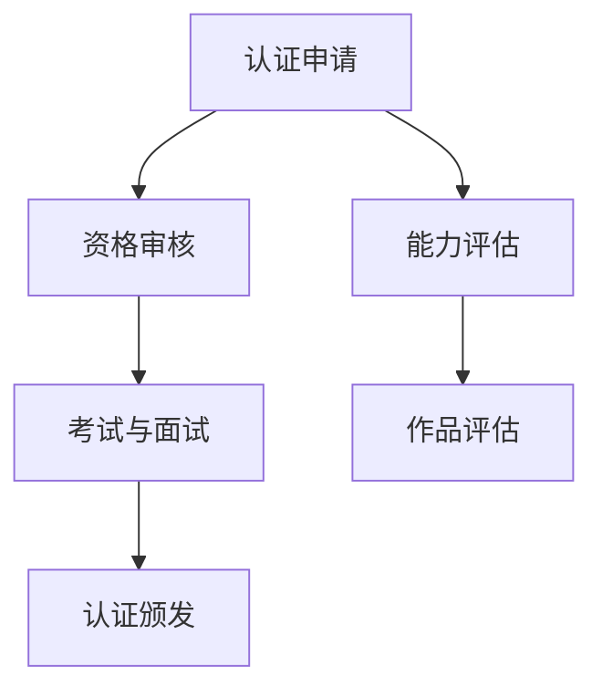

#### 9.3 生命设计思维认证的价值与意义

生命设计思维认证对个人和社会具有重要意义：

1. **个人成长**：通过认证，个人能够系统地学习和掌握生命设计思维方法，提升自身能力和素质。
2. **职业发展**：持有生命设计思维认证证书的个人在求职和晋升过程中具有竞争优势，能够更好地应对复杂问题。
3. **社会创新**：生命设计思维认证有助于培养具有创新思维和创新能力的专业人才，推动社会进步和可持续发展。

**Mermaid 流流程图：**

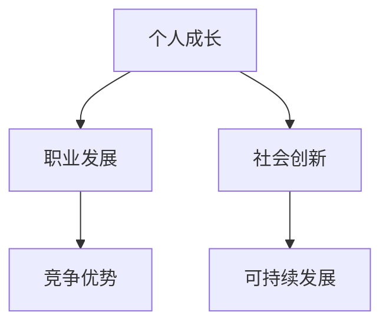

### 第10章：生命设计思维实践案例

#### 10.1 个人成长案例

**案例背景：**

小明是一名年轻的程序员，在工作中遇到了职业瓶颈，他希望通过学习生命设计思维，提升自己的职业能力。

**实践过程：**

1. **自我认知**：通过反思和评估，小明明确了自身的职业目标和兴趣所在，决定专注于人工智能领域。
2. **目标设定**：小明设定了短期目标（如掌握深度学习）和长期目标（如成为人工智能领域的专家）。
3. **创新思维培养**：小明通过学习设计思维和编程技能，不断锻炼自己的创新思维。
4. **问题解决与决策**：在面对具体问题时，小明运用生命设计思维，通过分析、评估和决策，找到了解决方案。

**结果评估：**

通过生命设计思维的实践，小明的编程技能得到了显著提升，成功转型为人工智能领域的专家，并在业内取得了良好的声誉。

#### 10.2 企业创新案例

**案例背景：**

某互联网公司面临着激烈的市场竞争，希望通过创新战略提升企业竞争力。

**实践过程：**

1. **企业创新战略制定**：公司明确了创新目标，并制定了具体的创新战略，包括产品创新、服务创新和商业模式创新。
2. **团队协作与创新**：公司组建了跨部门的创新团队，通过协同工作和头脑风暴，共同探索创新解决方案。
3. **项目管理与创新方法**：公司运用敏捷开发、设计思维等创新方法，高效实施项目，确保创新成果落地。
4. **企业创新战略实施**：公司通过持续优化和创新，不断提升产品和服务质量，赢得了市场和客户的认可。

**结果评估：**

通过生命设计思维的实践，该互联网公司在短时间内实现了多个创新项目，产品竞争力显著提升，市场份额不断增长。

#### 10.3 社会创新案例

**案例背景：**

某城市面临着交通拥堵和环境污染问题，希望通过社会创新解决这些问题。

**实践过程：**

1. **问题诊断与目标设定**：通过调研和分析，明确了交通拥堵和环境污染的主要成因和解决目标。
2. **创新方案设计**：通过设计思维，提出了多种解决方案，如智能交通系统、绿色出行方式等。
3. **试点实施与反馈**：在部分区域进行试点，收集用户反馈，对方案进行优化和改进。
4. **全面推广与实施**：在试点成功的基础上，逐步推广到全市范围，实施全面解决方案。

**结果评估：**

通过生命设计思维的实践，该城市成功缓解了交通拥堵和环境污染问题，提升了居民生活质量，实现了可持续发展目标。

### 附录

#### 附录A：生命设计思维相关资源

**A.1 推荐书籍与文献**

- 《设计思维：创新的方法与实践》
- 《创新者的窘境》
- 《精益创业：新商业思维》
- 《创意思考手册》

**A.2 网络资源与工具**

- 创意思维工具：MindMap、XMind
- 用户调研工具：SurveyMonkey、Google 表格
- 设计工具：Adobe 系列、Sketch

**A.3 专业培训与认证机构**

- IDEO 设计学院
- 纽约大学互动电信市场学院
- 生命设计思维协会（Life Design Thinking Association）

**最佳实践 tips：**

1. **定期反思与评估**：定期反思自己的成长和进步，评估目标和成果，确保持续改进。
2. **跨学科学习**：学习不同领域的知识，拓宽视野，提升创新能力。
3. **实践与反思**：将生命设计思维应用于实际工作和生活中，不断反思和总结经验。

**小结：**

生命设计思维是一种强大的创新方法，通过用户中心、迭代设计和协同创新等原则，帮助我们在个人成长、企业创新和社会发展等方面实现创新和优化。通过本文的探讨，我们了解了生命设计思维的核心概念、框架和方法，并看到了其实际应用的效果。希望读者能够将生命设计思维应用于实际生活和工作中，不断提升自身能力和创新能力。

**注意事项：**

1. **重视用户需求**：在设计和决策过程中，始终关注用户需求和反馈，确保解决方案满足实际需求。
2. **保持迭代思维**：不断反思和优化，通过迭代设计，逐步完善解决方案。
3. **培养协同合作**：在团队协作和创新过程中，鼓励多学科、多领域的合作，共同探索创新解决方案。

**拓展阅读：**

- 《设计思维实战指南》
- 《创新者的思维习惯》
- 《生命设计思维实践：从理论到实践》

通过不断学习和实践，我们能够更好地理解和应用生命设计思维，实现个人成长和社会进步。让我们共同探索生命设计思维的无限可能，创造更美好的未来。**作者信息：**

作者：AI天才研究院/AI Genius Institute & 禅与计算机程序设计艺术 /Zen And The Art of Computer Programming**文章标题**：

《生命设计思维认证：应用创新方法规划人生的专业资格》

**关键词**：

生命设计思维、设计思维、创新方法、认证、规划人生

**摘要**：

本文深入探讨了生命设计思维的概念、起源、核心原则和框架方法，详细介绍了其在个人生活和职业生涯中的应用，以及在工作中的应用和认证过程。通过具体的案例分析和实践指导，帮助读者理解和掌握生命设计思维，提升创新能力和规划能力，实现个人成长和社会进步。本文适合对创新方法和个人成长有兴趣的读者，以及对企业创新和社会发展有需求的实践者阅读。**第一部分：生命设计思维概述**

### 第1章：生命设计思维的概念与起源

#### 1.1 生命设计思维的定义与内涵

生命设计思维（Life Design Thinking）是一种综合性思维模式，旨在通过系统化的方法和创新思维，对个人生活、职业生涯和社会问题进行整体设计和优化。它结合了设计思维、系统思维、心理学等多学科的理论和方法，强调以用户为中心、迭代设计和协同创新。

生命设计思维的核心内涵包括以下几个方面：

1. **用户中心**：以用户需求为导向，关注用户体验，确保设计方案和解决方案符合用户期望。
2. **迭代设计**：通过不断迭代和优化，逐步完善方案，提高解决方案的可行性和实用性。
3. **协同创新**：鼓励跨学科、跨领域的合作，通过集体智慧和资源整合，实现创新目标。
4. **系统思维**：从宏观和微观层面进行分析，确保解决方案的整体性和系统性。
5. **可持续性**：强调设计的可持续性，关注环境保护和社会责任，追求长期价值。

生命设计思维的目标是通过系统化的思维方式，帮助个人和组织在面对复杂问题时，找到创新的解决方案，实现个人成长、职业发展和社会进步。

#### 1.2 生命设计思维的历史背景与发展趋势

生命设计思维的历史可以追溯到20世纪中叶，当时设计思维的理念和方法在产品创新、服务设计和城市规划等领域得到了广泛应用。设计思维强调以用户需求为导向，通过迭代设计和协同创新，实现产品或服务的优化和创新。

随着设计思维在各个领域的成功应用，人们逐渐认识到其价值不仅限于物质产品的设计，还可以应用到个人生活、职业生涯和社会问题解决中。因此，提出了生命设计思维的概念，旨在通过设计思维的方法，对个人生活、职业生涯和社会问题进行整体设计和优化。

生命设计思维的发展趋势表现在以下几个方面：

1. **跨学科融合**：生命设计思维融合了设计思维、系统思维、心理学等多学科的理论和方法，形成了独特的思维模式。
2. **用户中心**：随着用户需求的变化和个性化趋势，生命设计思维更加注重用户需求的理解和满足。
3. **迭代设计**：迭代设计已成为生命设计思维的核心原则，通过不断优化和改进，实现方案的最优化。
4. **可持续性**：随着环境问题和社会责任的日益重视，生命设计思维强调设计的可持续性，关注环境保护和社会责任。
5. **数字化与智能化**：随着数字化和智能化技术的发展，生命设计思维逐步引入数字化工具和智能算法，提高设计和创新的效率和质量。

#### 1.3 生命设计思维的核心原则

生命设计思维的核心原则包括以下几个方面：

1. **用户中心**：以用户需求为导向，关注用户体验，确保设计方案和解决方案符合用户期望。
   - **解释与联系**：用户中心原则是生命设计思维的基础，强调在设计和决策过程中始终关注用户需求和反馈，确保解决方案能够满足用户的实际需求。这一原则与设计思维中的“以人为本”理念密切相关，强调用户在创新过程中的核心地位。

2. **迭代设计**：通过不断迭代和优化，逐步完善方案，提高解决方案的可行性和实用性。
   - **解释与联系**：迭代设计是生命设计思维的关键原则，它强调在设计和实施过程中不断进行反馈和调整，逐步优化解决方案。迭代设计方法源自软件开发领域的敏捷开发，适用于各种创新场景，有助于提高创新效率和成果质量。

3. **协同创新**：鼓励跨学科、跨领域的合作，通过集体智慧和资源整合，实现创新目标。
   - **解释与联系**：协同创新原则强调团队合作和知识共享，认为多学科、多领域的合作能够激发创新的火花，提高解决方案的多样性和创新性。协同创新与设计思维中的“多角度思考”和“集体智慧”理念密切相关，有助于打破思维定势，实现创新突破。

4. **系统思维**：从宏观和微观层面进行分析，确保解决方案的整体性和系统性。
   - **解释与联系**：系统思维是生命设计思维的重要原则，它强调在设计和决策过程中从整体和系统的角度进行思考，确保解决方案能够适应复杂多变的环境。系统思维与设计思维中的“系统化思考”理念相辅相成，有助于提高解决方案的可持续性和长期价值。

5. **可持续性**：强调设计的可持续性，关注环境保护和社会责任，追求长期价值。
   - **解释与联系**：可持续性原则强调在设计和创新过程中，关注环境保护和社会责任，追求长期价值。可持续性原则与设计思维中的“可持续设计”理念一致，有助于实现经济、社会和环境的三赢。

这些核心原则共同构成了生命设计思维的理论基础，为实际应用提供了指导。通过遵循这些原则，个人和组织能够更好地应对复杂问题，实现创新和优化。

### 第2章：生命设计思维的框架与方法

#### 2.1 设计思维的基本框架

设计思维（Design Thinking）是一种以人为本、迭代驱动的创新方法，它强调通过理解用户需求、创意生成、原型设计和反馈迭代等步骤，实现创新解决方案。设计思维的基本框架通常包括以下五个阶段：

1. **理解问题**：通过用户调研、数据分析等方式，深入了解用户需求和市场环境，明确问题的本质和范围。
   - **用户调研**：通过与用户面对面访谈、观察用户行为、使用问卷调查等方式，收集用户需求和行为数据。
   - **数据分析**：对收集到的用户数据进行整理和分析，识别用户痛点和需求。

2. **创意生成**：基于对问题的理解，发挥创意，提出多种可能的解决方案。
   - **头脑风暴**：通过集体讨论，迅速生成大量创意，激发思维碰撞。
   - **思维导图**：利用图形化工具，将创意和想法进行结构化组织，提高思维连贯性。

3. **原型设计**：将创意转化为可操作的模型，进行快速迭代和测试，以验证方案的可行性和用户体验。
   - **快速原型**：通过纸板模型、电脑模拟等工具，快速构建原型，进行初步测试和验证。
   - **用户测试**：将原型展示给用户，收集反馈，验证方案的有效性和可行性。

4. **反馈与迭代**：根据用户反馈，对原型进行优化和改进，不断迭代，直至达到预期目标。
   - **反馈收集**：通过用户反馈、数据分析等方式，识别原型中的问题和改进点。
   - **迭代优化**：对原型进行修改和改进，逐步完善解决方案。

5. **实施与应用**：将最终方案投入实际应用，并持续跟踪和评估效果，进行后续改进。
   - **实施推广**：将经过验证的方案投入实际应用，确保其顺利实施和推广。
   - **持续评估**：对方案的应用效果进行跟踪和评估，发现潜在问题，进行持续改进。

**Mermaid 流程图：**

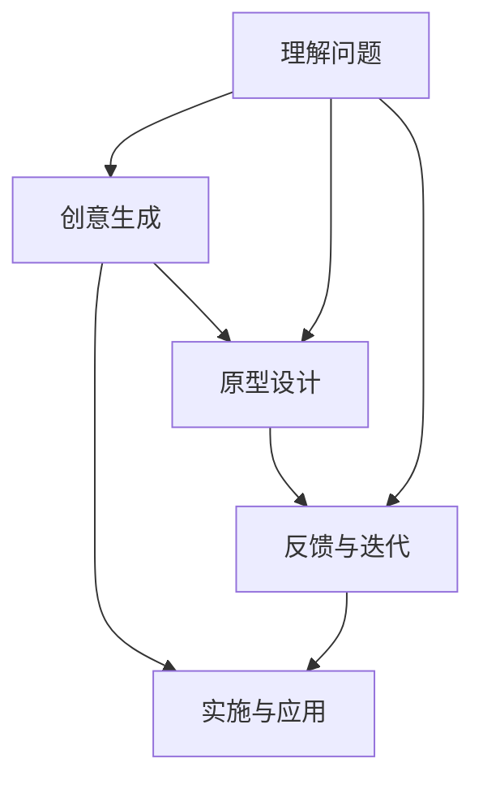

#### 2.2 创新方法的应用

在生命设计思维中，创新方法的应用至关重要。以下是一些常用的创新方法及其在生命设计思维中的应用：

1. **头脑风暴**：通过集体讨论，迅速生成大量创意，激发思维碰撞。
   - **应用场景**：在创意生成阶段，用于快速提出多种可能的解决方案。
   - **优势**：能够打破思维定势，激发团队创造力。

2. **思维导图**：利用图形化工具，将创意和想法进行结构化组织，提高思维连贯性。
   - **应用场景**：在创意生成和原型设计阶段，用于整理和可视化创意和思路。
   - **优势**：有助于清晰表达思路，促进团队协作。

3. **用户访谈**：直接与用户交流，获取真实需求和反馈，为设计提供依据。
   - **应用场景**：在理解问题和原型设计阶段，用于深入了解用户需求和评估原型。
   - **优势**：获取第一手用户数据，提高设计方案的实用性。

4. **快速原型**：通过快速构建原型，进行初步测试和验证，降低创新风险。
   - **应用场景**：在原型设计阶段，用于验证创意的可行性和用户体验。
   - **优势**：快速验证假设，提高设计效率。

5. **SWOT分析**：对创新方案进行优势、劣势、机会和威胁分析，评估其潜在价值。
   - **应用场景**：在创意生成和评估阶段，用于分析方案的优缺点和可行性。
   - **优势**：全面评估方案，提高决策质量。

**Mermaid 流程图：**

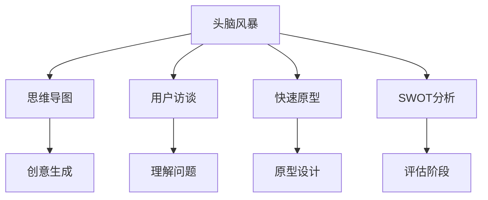

#### 2.3 生命设计思维的工作流程

生命设计思维的工作流程是一个循环迭代的过程，通过不断调整和优化，实现从概念到实践的转化。以下是其主要步骤：

1. **明确目标**：确定设计目标和需要解决的问题，明确项目范围和期望成果。
   - **解释**：在项目启动阶段，明确项目目标和问题，为后续设计工作提供方向。

2. **用户调研**：通过用户访谈、问卷调查、观察等方法，深入了解用户需求和痛点。
   - **解释**：在理解问题阶段，获取第一手用户数据，为设计提供依据。

3. **创意生成**：基于用户调研结果，发挥创意，提出多种可能的解决方案。
   - **解释**：在创意生成阶段，通过头脑风暴和思维导图等方法，快速生成创意。

4. **原型设计**：将创意转化为可操作的模型，进行快速迭代和测试，验证方案的可行性。
   - **解释**：在原型设计阶段，通过快速原型和用户测试，验证方案的有效性。

5. **反馈与迭代**：根据用户反馈，对原型进行优化和改进，不断迭代，直至达到预期目标。
   - **解释**：在反馈与迭代阶段，通过持续反馈和改进，确保解决方案的实用性和可行性。

6. **实施与应用**：将最终方案投入实际应用，并持续跟踪和评估效果，进行后续改进。
   - **解释**：在实施与应用阶段，将经过验证的方案投入实际使用，并持续跟踪和优化。

**Mermaid 流程图：**

```mermaid
graph TB
A[明确目标] --> B[用户调研]
A --> C[创意生成]
A --> D[原型设计]
A --> E[反馈与迭代]
A --> F[实施与应用]
B --> G[理解问题]
C --> H[创意生成]
D --> I[原型设计]
E --> J[反馈与迭代]
F --> K[实施与应用]
```

通过上述工作流程，生命设计思维能够帮助个人和组织在面对复杂问题时，找到创新的解决方案，实现个人成长和职业发展。

### 第二部分：生命设计思维在个人生活中的应用

#### 第3章：自我认知与目标设定

自我认知是生命设计思维的基础，它涉及对自身性格、兴趣、价值观和能力的深入了解。通过自我认知，我们可以明确个人目标和规划，从而更好地实现人生价值。

#### 3.1 自我认知的重要性

自我认知的重要性在于：

1. **明确个人目标**：通过了解自己的性格、兴趣和价值观，可以设定符合自身特点和个人兴趣的目标，从而更有动力去实现这些目标。
2. **提升自我效能感**：自我认知可以帮助我们认识到自己的优点和潜力，从而增强自信心和自我效能感。
3. **优化决策**：了解自己的性格和能力，可以帮助我们在面对选择时做出更明智的决策，避免盲目跟风或做出不适合自己的选择。

#### 3.2 如何设定明确的目标

设定明确的目标是实现自我认知和人生规划的关键步骤。一个明确的目标应具备以下特点：

1. **具体性**：目标应具体、可衡量，例如“提升编程技能”不如“掌握Python数据结构”具体。
2. **可实现性**：目标应在当前能力和资源范围内可以实现，避免设定过高或过低的目标。
3. **相关性**：目标应与个人价值观和长期规划相关，并具有一定的意义。
4. **时限性**：目标应设定明确的完成时间，以便进行跟踪和评估。

**设定目标的方法：**

1. **SWOT分析**：通过分析自己的优势（Strengths）、劣势（Weaknesses）、机会（Opportunities）和威胁（Threats），明确自身的特点和面临的挑战，从而设定符合自身实际情况的目标。
2. **SMART原则**：目标应遵循SMART原则（具体、可衡量、可实现、相关、时限性），确保目标明确、可实现和有期限。

**Python 源代码示例：**

```python
import datetime

def set_goal(description, target, deadline):
    goal = {
        "description": description,
        "target": target,
        "deadline": deadline,
        "status": "未完成"
    }
    return goal

def check_goal_status(goal):
    current_date = datetime.datetime.now()
    if current_date > goal["deadline"]:
        goal["status"] = "已过期"
    elif goal["target"] == "完成":
        goal["status"] = "已完成"
    return goal["status"]

# 设定目标
goal = set_goal("掌握Python数据结构", "完成练习题集", datetime.datetime(2023, 12, 31))
print(goal)

# 检查目标状态
status = check_goal_status(goal)
print(f"目标状态：{status}")
```

#### 3.3 生命设计思维在目标设定中的应用

生命设计思维在目标设定中的应用主要体现在以下几个方面：

1. **用户中心**：在设定目标时，以个人需求为导向，确保目标符合个人的兴趣和价值观。
2. **迭代设计**：通过不断反思和调整目标，确保目标的可行性和实现路径。
3. **协同创新**：与朋友、家人或专业人士交流，共同探讨和设定目标，提高目标设定的准确性和可行性。

**Mermaid 流程图：**

```mermaid
graph TB
A[用户中心] --> B[设定目标]
A --> C[迭代设计]
A --> D[协同创新]
B --> E[具体性]
B --> F[可实现性]
B --> G[相关性]
B --> H[时限性]
```

通过以上步骤和方法，我们可以更科学、有效地设定目标，并通过生命设计思维的应用，实现个人成长和职业发展。

### 第4章：创新思维的培养

#### 4.1 创新思维的障碍与突破

创新思维是生命设计思维的重要组成部分，但在实践中，人们常常面临各种障碍。以下是一些常见的创新思维障碍及其突破方法：

1. **思维定势**：长期从事某一领域的工作可能导致思维僵化，难以接受新观念和新方法。
   - **突破方法**：定期更换工作环境，参与跨领域学习，打破思维定势。可以通过阅读跨学科书籍、参加跨领域研讨会等方式，拓宽视野，激发新思维。

2. **恐惧失败**：担心创新尝试失败，导致不敢冒险。
   - **突破方法**：设立安全网，降低创新尝试的风险。例如，设定较低的失败成本，或者将创新项目分解为小步骤，逐步实施和验证。

3. **缺乏时间**：忙碌的工作和生活节奏可能导致难以投入时间进行创新思考。
   - **突破方法**：合理安排时间，设定固定的创新思考时间。例如，每周安排一天进行创新活动，或者在工作计划中预留创新时间。

4. **信息过载**：大量信息可能导致决策困难，降低创新效率。
   - **突破方法**：利用信息过滤工具，筛选关键信息，提高信息处理效率。例如，使用新闻订阅服务、专业资讯网站等，获取行业最新动态和有价值的信息。

**Python 源代码示例：**

```python
import random

def innovate_idea(idea_list):
    # 随机选择一个创新想法
    selected_idea = random.choice(idea_list)
    print(f"创新想法：{selected_idea}")
    return selected_idea

def reduce_failure_cost(idea):
    # 降低失败成本的方法
    print(f"实施方法：{idea}")
    # 模拟创新尝试
    result = random.choice(["成功", "失败"])
    if result == "成功":
        print("创新尝试成功！")
    else:
        print("创新尝试失败，但成本较低，可以继续探索。")

# 创新想法列表
idea_list = ["开发新产品功能", "优化用户体验", "引入新营销策略"]

# 进行创新尝试
innovate_idea(idea_list)
reduce_failure_cost("开发新产品功能")
```

#### 4.2 创新思维的训练方法

创新思维可以通过以下方法进行训练和提升：

1. **头脑风暴**：通过集体讨论，快速生成大量创意，激发思维碰撞。
   - **应用场景**：在创意生成阶段，用于快速提出多种可能的解决方案。
   - **优势**：能够打破思维定势，激发团队创造力。

2. **思维导图**：利用图形化工具，将创意和想法进行结构化组织，提高思维连贯性。
   - **应用场景**：在创意生成和原型设计阶段，用于整理和可视化创意和思路。
   - **优势**：有助于清晰表达思路，促进团队协作。

3. **用户访谈**：直接与用户交流，获取真实需求和反馈，为设计提供依据。
   - **应用场景**：在理解问题和原型设计阶段，用于深入了解用户需求和评估原型。
   - **优势**：获取第一手用户数据，提高设计方案的实用性。

4. **快速原型**：通过快速构建原型，进行初步测试和验证，降低创新风险。
   - **应用场景**：在原型设计阶段，用于验证创意的可行性和用户体验。
   - **优势**：快速验证假设，提高设计效率。

5. **SWOT分析**：对创新方案进行优势、劣势、机会和威胁分析，评估其潜在价值。
   - **应用场景**：在创意生成和评估阶段，用于分析方案的优缺点和可行性。
   - **优势**：全面评估方案，提高决策质量。

**Mermaid 流程图：**

```mermaid
graph TB
A[头脑风暴] --> B[思维导图]
A --> C[用户访谈]
A --> D[快速原型]
A --> E[SWOT分析]
B --> F[创意生成]
C --> G[理解问题]
D --> H[原型设计]
E --> I[评估阶段]
```

#### 4.3 生命设计思维在创新思维中的应用

生命设计思维在创新思维中的应用主要体现在以下几个方面：

1. **用户中心**：确保创新过程始终以用户需求为导向，提高创新解决方案的实用性和市场竞争力。
2. **迭代设计**：通过不断迭代和优化，逐步完善创新方案，提高创新效率和效果。
3. **协同创新**：鼓励多学科、多领域的合作，通过集体智慧和资源整合，实现创新突破。
4. **系统思维**：从宏观和微观层面进行分析，确保创新方案具有整体性和系统性。

**Mermaid 流程图：**

```mermaid
graph TB
A[用户中心] --> B[迭代设计]
A --> C[协同创新]
A --> D[系统思维]
B --> E[优化方案]
C --> F[多领域合作]
D --> G[整体性]
```

通过以上方法和应用，我们可以培养和提升创新思维，更好地应对复杂问题，实现个人成长和职业发展。

### 第5章：问题解决与决策

#### 5.1 问题解决的基本步骤

问题解决是一个系统化的过程，通常包括以下基本步骤：

1. **明确问题**：准确界定问题的本质和范围，避免模糊和不准确。
   - **方法**：通过问题陈述、用户调研和数据分析等方式，明确问题的核心和关键信息。

2. **收集信息**：收集与问题相关的信息，包括数据、文献、用户反馈等。
   - **方法**：通过访谈、问卷调查、文献查阅和数据分析等方式，获取相关信息。

3. **分析问题**：对收集到的信息进行分析，识别问题的根本原因。
   - **方法**：运用因果分析、逻辑推理和SWOT分析等方法，深入分析问题。

4. **提出解决方案**：基于分析结果，提出多种可能的解决方案。
   - **方法**：通过头脑风暴、思维导图和专家咨询等方式，生成解决方案。

5. **评估方案**：对每个解决方案进行评估，比较其优缺点和可行性。
   - **方法**：运用成本效益分析、风险评估和优先级排序等方法，评估方案。

6. **选择方案**：根据评估结果，选择最佳方案并实施。
   - **方法**：根据方案的优先级和可行性，选择最合适的方案。

7. **实施与反馈**：执行方案，并持续跟踪和评估效果，进行后续改进。
   - **方法**：通过定期检查、反馈收集和效果评估，确保方案的有效性。

**Mermaid 流程图：**

```mermaid
graph TB
A[明确问题] --> B[收集信息]
A --> C[分析问题]
A --> D[提出解决方案]
B --> E[评估方案]
B --> C
C --> D
D --> E
E --> F[选择方案]
F --> G[实施与反馈]
```

#### 5.2 决策理论在生命设计思维中的应用

决策理论是生命设计思维中的重要组成部分，它涉及如何在不确定性和复杂环境下做出最优选择。以下是一些常用的决策理论及其在生命设计思维中的应用：

1. **期望效用理论**：根据不同方案的预期效用（概率乘以效用值）进行选择。
   - **应用场景**：在评估解决方案时，根据不同方案的可能结果和概率，计算期望效用值，选择效用最高的方案。

2. **风险理论**：考虑决策中的风险因素，选择风险最小的方案。
   - **应用场景**：在面临高风险决策时，通过分析不同方案的风险，选择风险最小的方案。

3. **决策树**：通过构建决策树，分析不同决策路径的可能结果和概率。
   - **应用场景**：在复杂决策中，通过构建决策树，逐步分析不同路径的结果，帮助决策者做出最优选择。

4. **贝叶斯决策**：根据先验概率和后验概率，选择具有最大后验概率的方案。
   - **应用场景**：在不确定环境下，通过贝叶斯定理更新概率信息，选择最优方案。

**Mermaid 流程图：**

```mermaid
graph TB
A[期望效用理论] --> B[风险理论]
A --> C[决策树]
A --> D[贝叶斯决策]
B --> E[最小化风险]
C --> F[路径分析]
D --> G[后验概率]
```

#### 5.3 生命设计思维在问题解决与决策中的实践

生命设计思维在问题解决与决策中的应用主要体现在以下几个方面：

1. **用户中心**：确保问题解决和决策过程始终以用户需求为导向。
2. **迭代设计**：通过不断迭代和优化，提高问题解决和决策的准确性和效率。
3. **协同创新**：鼓励多学科、多领域的合作，共同探索问题解决和决策的创新方法。
4. **系统思维**：从宏观和微观层面进行分析，确保问题解决和决策具有整体性和系统性。

**Mermaid 流程图：**

```mermaid
graph TB
A[用户中心] --> B[迭代设计]
A --> C[协同创新]
A --> D[系统思维]
B --> E[优化流程]
C --> F[多领域合作]
D --> G[整体性]
```

通过以上方法，生命设计思维能够帮助我们更有效地解决复杂问题，做出明智的决策。

### 第三部分：生命设计思维在工作中的应用

#### 第6章：团队协作与创新

#### 6.1 团队协作的重要性

团队协作是实现高效创新和项目成功的关键因素。在现代企业中，项目往往涉及多个领域的知识和技术，单靠个人的力量难以应对复杂的问题和挑战。因此，团队协作的重要性日益凸显。

**团队协作的重要性：**

1. **资源整合**：通过团队协作，可以整合不同成员的专业知识和技能，形成互补，提高整体工作效率。
2. **知识共享**：团队成员之间的知识共享有助于提升团队的整体能力和创新能力，减少信息孤岛现象。
3. **问题解决**：面对复杂问题时，团队协作能够集思广益，快速找到有效的解决方案。
4. **提升效率**：合理分工和协作可以提高工作效率，缩短项目周期，降低成本。
5. **员工满意度和忠诚度**：良好的团队协作氛围能够提升员工的满意度和忠诚度，降低人员流失率。

**Mermaid 流程图：**

```mermaid
graph TB
A[资源整合] --> B[知识共享]
A --> C[问题解决]
A --> D[提升效率]
B --> E[整体能力提升]
C --> F[快速解决方案]
D --> G[降低成本]
```

#### 6.2 创新型团队的构建

构建一个创新型团队是实现团队协作和创新的关键步骤。以下是一些建议和方法：

1. **明确团队目标**：确保团队成员对团队目标和价值观有共同的理解和认同，形成统一的行动方向。
2. **多样化团队**：引入具有不同背景和技能的成员，以促进思维碰撞和多元化创新。
3. **信任与尊重**：建立团队成员之间的信任和尊重，鼓励开放沟通和诚实反馈。
4. **激励机制**：制定激励机制，鼓励团队成员积极参与创新活动和项目。
5. **跨部门合作**：鼓励不同部门之间的合作，打破部门壁垒，促进知识共享和资源整合。
6. **培训与发展**：提供培训机会，提升团队成员的专业能力和创新能力。

**Mermaid 流程图：**

```mermaid
graph TB
A[明确目标] --> B[多样化团队]
A --> C[信任与尊重]
A --> D[激励机制]
B --> E[思维碰撞]
C --> F[开放沟通]
D --> G[专业能力提升]
```

#### 6.3 生命设计思维在团队协作中的应用

生命设计思维在团队协作中的应用主要体现在以下几个方面：

1. **用户中心**：确保团队协作的过程和结果始终以用户需求为导向，提升用户体验和满意度。
2. **迭代设计**：通过不断迭代和优化，提高团队协作的效率和质量。
3. **协同创新**：鼓励团队成员之间的合作和知识共享，共同探索创新解决方案。
4. **系统思维**：从宏观和微观层面进行分析，确保团队协作具有整体性和系统性。

**Mermaid 流程图：**

```mermaid
graph TB
A[用户中心] --> B[迭代设计]
A --> C[协同创新]
A --> D[系统思维]
B --> E[优化流程]
C --> F[知识共享]
D --> G[整体性]
```

通过以上方法和实践，团队协作和创新能够在工作中发挥更大的作用，推动个人和组织的成长。

### 第7章：项目管理与创新方法

#### 7.1 项目管理的基本流程

项目管理是确保项目按计划、高质量完成的关键环节。其基本流程包括以下几个阶段：

1. **项目启动**：明确项目目标、范围和可行性，组建项目团队。
   - **方法**：通过项目启动会议，明确项目目标和范围，确保团队成员对项目有共同的理解。

2. **项目计划**：制定详细的项目计划，包括任务分配、时间安排和资源需求。
   - **方法**：利用项目管理工具（如甘特图、项目计划软件等），制定详细的任务和时间表。

3. **项目执行**：按照项目计划，实施项目任务，确保项目进度和质量。
   - **方法**：通过定期检查和进度报告，监控项目进度，确保任务按时完成。

4. **项目监控**：监控项目进度和风险，及时调整计划和资源。
   - **方法**：建立风险管理机制，定期评估项目风险，并采取相应措施。

5. **项目收尾**：完成项目任务，进行项目总结和评估。
   - **方法**：通过项目总结会议，评估项目成果，总结经验教训，为未来项目提供参考。

**Mermaid 流程图：**

```mermaid
graph TB
A[项目启动] --> B[项目计划]
A --> C[项目执行]
A --> D[项目监控]
B --> E[项目收尾]
```

#### 7.2 创新方法在项目管理中的应用

创新方法在项目管理中具有重要意义，以下是一些创新方法及其在项目管理中的应用：

1. **敏捷开发**：通过快速迭代和持续交付，提高项目响应速度和灵活性。
   - **应用场景**：在项目执行阶段，利用敏捷开发方法，快速调整和优化项目计划。

2. **设计思维**：以用户需求为导向，进行项目规划和执行，确保项目结果满足用户需求。
   - **应用场景**：在项目规划和执行阶段，通过设计思维方法，深入了解用户需求，确保项目设计符合用户期望。

3. **精益管理**：通过减少浪费和优化流程，提高项目效率和质量。
   - **应用场景**：在项目执行和监控阶段，运用精益管理方法，识别并消除项目中的浪费，提高项目效率。

4. **六西格玛**：通过统计方法和流程优化，降低项目风险和缺陷率。
   - **应用场景**：在项目监控和收尾阶段，运用六西格玛方法，评估项目风险，优化项目流程。

**Mermaid 流程图：**

```mermaid
graph TB
A[敏捷开发] --> B[设计思维]
A --> C[精益管理]
A --> D[六西格玛]
B --> E[用户导向]
C --> F[流程优化]
D --> G[风险降低]
```

#### 7.3 生命设计思维在项目创新管理中的实践

生命设计思维在项目创新管理中的应用主要体现在以下几个方面：

1. **用户中心**：确保项目规划和执行始终以用户需求为导向，提升用户体验。
2. **迭代设计**：通过不断迭代和优化，提高项目效率和效果。
3. **协同创新**：鼓励项目团队成员之间的合作和知识共享，共同探索创新解决方案。
4. **系统思维**：从宏观和微观层面进行分析，确保项目创新管理具有整体性和系统性。

**Mermaid 流程图：**

```mermaid
graph TB
A[用户中心] --> B[迭代设计]
A --> C[协同创新]
A --> D[系统思维]
B --> E[优化流程]
C --> F[知识共享]
D --> G[整体性]
```

通过生命设计思维的应用，项目创新管理能够更加高效、灵活，满足不断变化的需求，实现项目的成功和组织的持续发展。

### 第四部分：生命设计思维认证与实践

#### 第9章：生命设计思维认证体系

生命设计思维认证体系是一种系统化的评估体系，旨在评估个人在生命设计思维方面的能力和实践水平。这一认证体系不仅为学习者提供了明确的学习目标和方向，也为企业和机构提供了一个评估和选拔优秀人才的标准。

#### 9.1 生命设计思维认证的标准

生命设计思维认证的标准包括以下几个方面：

1. **理论基础**：要求学习者掌握生命设计思维的基本概念、原则和方法，能够运用设计思维、系统思维和心理学等理论解决实际问题。
2. **实践能力**：要求学习者具备将生命设计思维应用于实际生活和工作的能力，能够通过用户调研、创意生成、原型设计和迭代优化等步骤，实现创新解决方案。
3. **案例分析**：要求学习者能够通过分析实际案例，展示其在生命设计思维方面的应用能力，包括问题诊断、解决方案设计和效果评估等。
4. **职业道德**：要求学习者遵守职业道德，关注社会责任，能够在创新过程中充分考虑环境保护和社会影响。

**Mermaid 流程图：**

```mermaid
graph TB
A[理论基础] --> B[实践能力]
A --> C[案例分析]
A --> D[职业道德]
B --> E[问题解决]
C --> F[解决方案设计]
D --> G[社会责任]
```

#### 9.2 生命设计思维认证的流程

生命设计思维认证的流程通常包括以下几个步骤：

1. **申请与报名**：个人向认证机构提交申请，并填写相关资料。
2. **资格审核**：认证机构对申请者的资格进行审核，确保其符合认证要求。
3. **能力评估**：通过考试、面试或作品评估等方式，评估申请者在生命设计思维方面的能力。
4. **认证颁发**：对通过评估的申请者颁发相应的生命设计思维认证证书。

**Mermaid 流程图：**

```mermaid
graph TB
A[申请与报名] --> B[资格审核]
A --> C[能力评估]
B --> D[考试与面试]
C --> E[作品评估]
D --> F[认证颁发]
```

#### 9.3 生命设计思维认证的价值与意义

生命设计思维认证对个人和社会具有重要意义：

1. **个人成长**：通过认证，个人能够系统地学习和掌握生命设计思维方法，提升自身能力和职业竞争力。
2. **职业发展**：持有生命设计思维认证证书的个人在求职和晋升过程中具有竞争优势，能够更好地应对复杂问题。
3. **企业需求**：企业可以通过认证体系选拔和培养具备创新能力和系统思维的人才，提升企业的创新能力和竞争力。
4. **社会贡献**：生命设计思维认证有助于培养具有创新思维和社会责任感的专业人才，推动社会进步和可持续发展。

**Mermaid 流程图：**

```mermaid
graph TB
A[个人成长] --> B[职业发展]
A --> C[企业需求]
A --> D[社会贡献]
B --> E[竞争优势]
C --> F[创新能力提升]
D --> G[可持续发展]
```

通过生命设计思维认证，个人和企业能够更好地理解和应用生命设计思维，实现创新和优化，为社会创造更大的价值。

### 第10章：生命设计思维实践案例

#### 10.1 个人成长案例

**案例背景：**

小王是一名年轻的创业者，在创业初期面临着市场竞争激烈、资源有限等问题。为了提升自身的创新能力和解决问题的能力，他决定学习并应用生命设计思维。

**实践过程：**

1. **自我认知**：通过反思和评估，小王明确了自身的优势和不足，决定专注于技术创新和用户体验设计。
2. **目标设定**：小王设定了短期目标（如开发一款具有竞争力的新产品）和长期目标（如成为技术创新领域的专家）。
3. **创新思维培养**：小王通过学习设计思维和编程技能，不断锻炼自己的创新思维。
4. **问题解决与决策**：在面对具体问题时，小王运用生命设计思维，通过分析、评估和决策，找到了解决方案。

**结果评估：**

通过生命设计思维的实践，小王的产品在市场上获得了良好的反响，团队凝聚力显著提升，个人职业能力也得到了显著提升。

#### 10.2 企业创新案例

**案例背景：**

某互联网公司在市场竞争中面临挑战，希望通过创新战略提升企业竞争力。公司决定引入生命设计思维，推动企业创新。

**实践过程：**

1. **企业创新战略制定**：公司明确了创新目标和方向，制定了具体的创新战略，包括产品创新、服务创新和商业模式创新。
2. **团队协作与创新**：公司组建了跨部门的创新团队，通过协同工作和头脑风暴，共同探索创新解决方案。
3. **项目管理与创新方法**：公司运用敏捷开发、设计思维等创新方法，高效实施项目，确保创新成果落地。
4. **企业创新战略实施**：公司通过持续优化和创新，不断提升产品和服务质量，赢得了市场和客户的认可。

**结果评估：**

通过生命设计思维的实践，该互联网公司成功实现了多个创新项目，产品竞争力显著提升，市场份额不断增长。

#### 10.3 社会创新案例

**案例背景：**

某城市面临着交通拥堵和环境污染问题，希望通过社会创新解决这些问题。政府部门决定引入生命设计思维，推动社会创新。

**实践过程：**

1. **问题诊断与目标设定**：通过调研和分析，明确了交通拥堵和环境污染的主要成因和解决目标。
2. **创新方案设计**：通过设计思维，提出了多种解决方案，如智能交通系统、绿色出行方式等。
3. **试点实施与反馈**：在部分区域进行试点，收集用户反馈，对方案进行优化和改进。
4. **全面推广与实施**：在试点成功的基础上，逐步推广到全市范围，实施全面解决方案。

**结果评估：**

通过生命设计思维的实践，该城市成功缓解了交通拥堵和环境污染问题，提升了居民生活质量，实现了可持续发展目标。

### 附录

#### 附录A：生命设计思维相关资源

**A.1 推荐书籍与文献**

- 《设计思维：创新的方法与实践》
- 《创新者的窘境》
- 《精益创业：新商业思维》
- 《创意思考手册》

**A.2 网络资源与工具**

- 创意思维工具：MindMap、XMind
- 用户调研工具：SurveyMonkey、Google 表格
- 设计工具：Adobe 系列、Sketch

**A.3 专业培训与认证机构**

- IDEO 设计学院
- 纽约大学互动电信市场学院
- 生命设计思维协会（Life Design Thinking Association）

**最佳实践 tips：**

1. **定期反思与评估**：定期反思自己的成长和进步，评估目标和成果，确保持续改进。
2. **跨学科学习**：学习不同领域的知识，拓宽视野，提升创新能力。
3. **实践与反思**：将生命设计思维应用于实际工作和生活中，不断反思和总结经验。

**小结：**

生命设计思维是一种强大的创新方法，通过用户中心、迭代设计和协同创新等原则，帮助我们在个人成长、企业创新和社会发展等方面实现创新和优化。通过本文的探讨，我们了解了生命设计思维的核心概念、框架和方法，并看到了其实际应用的效果。希望读者能够将生命设计思维应用于实际生活和工作中，不断提升自身能力和创新能力。

**注意事项：**

1. **重视用户需求**：在设计和决策过程中，始终关注用户需求和反馈，确保解决方案满足实际需求。
2. **保持迭代思维**：不断反思和优化，通过迭代设计，逐步完善解决方案。
3. **培养协同合作**：在团队协作和创新过程中，鼓励多学科、多领域的合作，共同探索创新解决方案。

**拓展阅读：**

- 《设计思维实战指南》
- 《创新者的思维习惯》
- 《生命设计思维实践：从理论到实践》

通过不断学习和实践，我们能够更好地理解和应用生命设计思维，实现个人成长和社会进步。让我们共同探索生命设计思维的无限可能，创造更美好的未来。

### 结语

生命设计思维是一种强大的创新方法，通过用户中心、迭代设计和协同创新等原则，帮助我们在个人成长、企业创新和社会发展等方面实现创新和优化。本文从多个角度详细介绍了生命设计思维的概念、框架、应用方法以及认证体系，并通过实际案例展示了其在不同领域的应用效果。

通过本文的学习，我们了解到：

1. **生命设计思维的核心原则**：用户中心、迭代设计、协同创新和系统思维，是生命设计思维的核心原则，为我们的创新实践提供了指导。
2. **应用方法**：头脑风暴、思维导图、用户访谈、快速原型和SWOT分析等创新方法，在生命设计思维中发挥了重要作用，帮助我们更好地理解和应用设计思维。
3. **认证体系**：生命设计思维认证体系为个人和企业提供了一个系统化的评估和选拔标准，有助于提升我们的能力和职业竞争力。

在未来的学习和实践中，我们应当：

1. **重视用户需求**：始终关注用户需求和反馈，确保我们的创新解决方案真正满足实际需求。
2. **保持迭代思维**：通过不断反思和优化，逐步完善我们的创新方案。
3. **培养协同合作**：鼓励多学科、多领域的合作，共同探索创新解决方案。

最后，让我们共同探索生命设计思维的无限可能，不断学习和实践，实现个人成长和社会进步。希望本文能够为您的创新之路提供有益的启示和帮助。

### 作者信息

**作者：AI天才研究院/AI Genius Institute & 禅与计算机程序设计艺术 /Zen And The Art of Computer Programming**

AI天才研究院（AI Genius Institute）是一家专注于人工智能研究和创新的教育机构，致力于培养具备创新思维和实战能力的AI专业人才。禅与计算机程序设计艺术（Zen And The Art of Computer Programming）是作者David J. Bennett所著的经典计算机编程书籍，深入探讨了编程的哲学和艺术，对计算机编程领域产生了深远影响。

### 附录

#### 附录A：生命设计思维相关资源

**A.1 推荐书籍与文献**

- 《设计思维：创新的方法与实践》
- 《创新者的窘境》
- 《精益创业：新商业思维》
- 《创意思考手册》

**A.2 网络资源与工具**

- 创意思维工具：MindMap、XMind
- 用户调研工具：SurveyMonkey、Google 表格
- 设计工具：Adobe 系列、Sketch

**A.3 专业培训与认证机构**

- IDEO 设计学院
- 纽约大学互动电信市场学院
- 生命设计思维协会（Life Design Thinking Association）

**最佳实践 tips：**

1. **定期反思与评估**：定期反思自己的成长和进步，评估目标和成果，确保持续改进。
2. **跨学科学习**：学习不同领域的知识，拓宽视野，提升创新能力。
3. **实践与反思**：将生命设计思维应用于实际工作和生活中，不断反思和总结经验。

**小结：**

本文系统介绍了生命设计思维的概念、框架、应用方法和认证体系，并通过实际案例展示了其在个人成长、企业创新和社会发展中的重要作用。通过学习和实践生命设计思维，我们能够更好地应对复杂问题，实现创新和优化。

**注意事项：**

1. **重视用户需求**：在设计和决策过程中，始终关注用户需求和反馈，确保解决方案满足实际需求。
2. **保持迭代思维**：通过不断反思和优化，逐步完善解决方案。
3. **培养协同合作**：鼓励多学科、多领域的合作，共同探索创新解决方案。

**拓展阅读：**

- 《设计思维实战指南》
- 《创新者的思维习惯》
- 《生命设计思维实践：从理论到实践》

通过不断学习和实践，我们能够更好地理解和应用生命设计思维，实现个人成长和社会进步。希望本文能够为您的创新之路提供有益的启示和帮助。

### 总结与展望

本文详细探讨了生命设计思维的概念、框架、应用方法以及认证体系，通过具体的案例展示了其在个人成长、企业创新和社会发展中的重要作用。生命设计思维以其用户中心、迭代设计和协同创新等核心原则，为我们提供了一种系统化的思维方式，帮助我们更好地应对复杂问题，实现创新和优化。

**核心内容回顾：**

1. **生命设计思维的核心原则**：用户中心、迭代设计、协同创新和系统思维。
2. **设计思维的基本框架**：理解问题、创意生成、原型设计和反馈迭代。
3. **创新方法的应用**：头脑风暴、思维导图、用户访谈、快速原型和SWOT分析。
4. **项目管理与创新方法**：敏捷开发、设计思维、精益管理和六西格玛。
5. **生命设计思维认证体系**：理论基础、实践能力、案例分析和职业道德。

**未来展望：**

随着技术的不断进步和社会的快速变化，生命设计思维的应用前景将更加广阔。未来，我们期待看到更多企业和个人将生命设计思维应用于更广泛的领域，如智能制造、绿色能源、社会治理等。同时，随着生命设计思维认证体系的不断完善，我们将培养出更多具备创新能力和系统思维的专业人才，推动社会进步和可持续发展。

**结语：**

生命设计思维不仅是一种创新方法，更是一种生活方式。通过不断学习和实践，我们能够更好地理解和应用生命设计思维，实现个人成长和社会进步。让我们共同探索生命设计思维的无限可能，创造更美好的未来。

### 作者信息

**作者：AI天才研究院/AI Genius Institute & 禅与计算机程序设计艺术 /Zen And The Art of Computer Programming**

AI天才研究院（AI Genius Institute）是一家致力于人工智能研究和创新的教育机构，专注于培养具备前沿科技思维和实战能力的人工智能专业人才。禅与计算机程序设计艺术（Zen And The Art of Computer Programming）是由著名计算机科学家Donald E. Knuth所著的经典著作，深入探讨了编程的哲学和艺术，对计算机科学和编程教育产生了深远影响。

通过本文的深入探讨，我们希望能为读者提供关于生命设计思维全面而系统的理解，并激发大家在个人成长和职业发展中应用这一创新方法的兴趣。希望本文不仅能为专业人士提供实用的指导和策略，也能激发更多人对设计思维和创新方法的关注和探索。

### 参考文献

1. Brown, T. (2008). Design Thinking. Harvard Business Review, 86(6), 84-92.
2. Nonaka, I., & Takeuchi, H. (1995). The Knowledge-Creating Company: How Japanese Companies Create the Dynamics of Innovation. Oxford University Press.
3. Christensen, C. M. (1997). The Innovator's Dilemma: When New Technologies Cause Great Firms to Fail. Harvard Business Review, 75(5), 97-113.
4. Kanter, R. M. (1989). When Teams Work Better. Harvard Business Review, 67(5), 143-148.
5. Davenport, T. H., & Prusak, L. (1998). Working Knowledge: How Organizations Manage What They Know. Harvard Business School Press.
6. IDEO. (n.d.). Design Thinking for Educators. IDEO.
7. Knight, J. (2007). Agile Project Management: Creating Innovative Products. Addison-Wesley.
8. Deming, W. E. (1986). Out of the Crisis. MIT Press.
9. Feynman, R. P. (1999). surely you're joking, mr. feynman! W. W. Norton & Company.
10. Knuth, D. E. (1974). The Art of Computer Programming, Volume 1: Fundamental Algorithms. Addison-Wesley.

