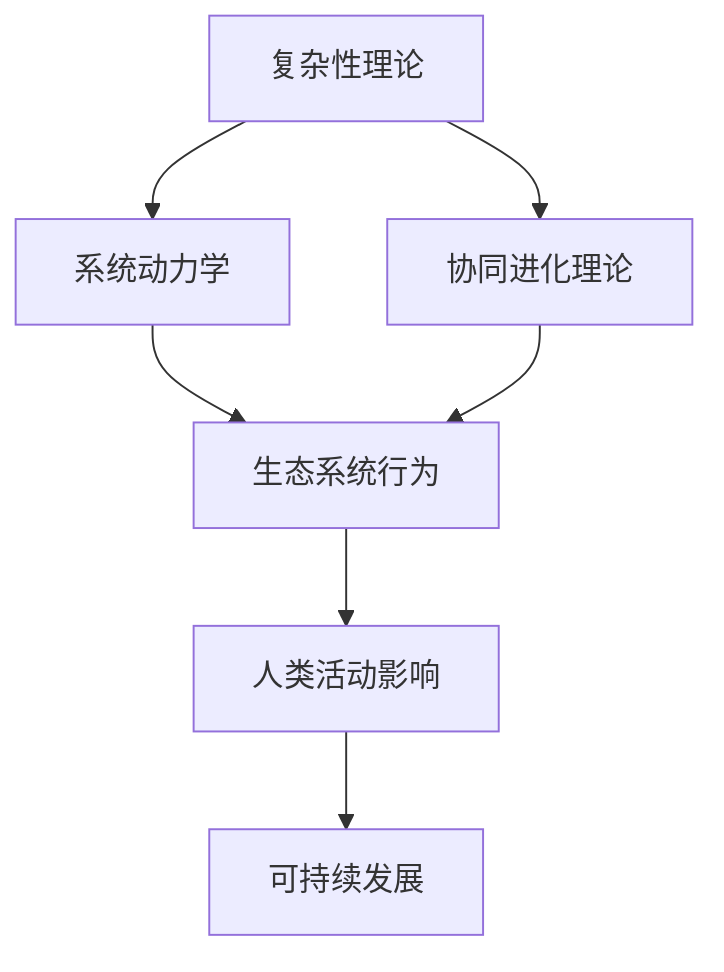

                 

## 生态公民教育与整体论世界观

### 1.1 生态公民教育的概念与内涵

生态公民教育是一种以生态学为理论基础，旨在培养个体对社会、环境和自然整体负有责任感和参与感的公民素养的教育形式。它不仅仅关注个体的知识获取，更强调个体在生态整体中的角色与责任。以下是生态公民教育的基本概念与内涵：

- **生态公民的定义与特点**：
  - **生态公民**：指的是那些不仅关心自身利益，还关注社会、环境和自然整体福祉的个体。生态公民具备以下特点：
    - 对环境问题有深刻的认识和理解。
    - 具有可持续发展的价值观。
    - 能够积极参与社会、环境和自然资源的保护与修复。
    - 具备解决复杂生态问题的能力。

- **整体论世界观的阐述**：
  - 整体论世界观是一种强调系统内部各要素相互关联、相互作用，并共同构成一个整体的观念。整体论世界观认为，整体大于部分之和，个体行为会对整体产生深远的影响。

- **生态公民教育的重要性**：
  - **社会层面**：生态公民教育有助于培养公民的社会责任感和参与意识，促进社会和谐与可持续发展。
  - **环境层面**：通过生态公民教育，个体能够更好地理解和应对环境问题，从而积极参与环境保护和可持续发展实践。
  - **经济层面**：生态公民教育有助于推动绿色经济和循环经济的发展，为经济增长注入新的动力。

### 1.2 整体论世界观的理论基础

整体论世界观的理论基础广泛，涵盖了生态学、系统思维和哲学等多个领域。以下是对这些理论基础的阐述：

- **生态学视角下的整体性**：
  - 生态学强调生物之间以及生物与环境之间的相互关系。整体论世界观在生态学中的应用表现为对生态系统的整体性认识，即生态系统的各个部分是相互依存的，任何一个部分的改变都会影响整个系统的运作。

- **系统思维在生态公民教育中的应用**：
  - 系统思维是一种从整体视角分析问题的方法。在生态公民教育中，系统思维有助于个体理解和应对复杂的社会、经济和环境问题，从而培养出具有全局观念的公民。

- **整体论与个体主义的对比**：
  - 个体主义强调个体的独立性和自主性，而整体论则强调个体与整体之间的相互依存关系。在生态公民教育中，整体论世界观有助于打破个体主义的局限，培养出具有集体责任感和协作精神的公民。

### 1.3 生态公民教育与可持续发展

可持续发展的核心目标是满足当前需求而不损害未来世代满足自身需求的能力。生态公民教育在可持续发展中扮演着重要角色，具体体现在以下几个方面：

- **可持续发展的全球挑战**：
  - 全球气候变化、生物多样性丧失、资源枯竭等问题对可持续发展构成了巨大挑战。

- **生态公民教育在可持续发展中的作用**：
  - 生态公民教育有助于提高公众对可持续发展问题的认识和理解。
  - 通过教育，个体能够积极参与到可持续发展实践中，如节能减排、绿色消费等。

- **生态公民教育的目标与任务**：
  - **目标**：培养具有可持续发展价值观的生态公民，推动社会、经济和环境的协调发展。
  - **任务**：开展可持续发展教育，传播可持续发展理念，培养个体解决复杂生态问题的能力。

通过上述分析，我们可以看到，生态公民教育不仅是培养个体生态素养的重要手段，也是实现可持续发展目标的必然选择。接下来，我们将进一步探讨整体论世界观的核心概念与联系。

### 1.2 整体论世界观的核心概念与联系

整体论世界观是生态公民教育的理论基础，其核心概念与联系有助于我们深入理解生态系统的复杂性及其内在规律。以下是对这些核心概念及其相互关系的探讨：

#### 2.1 整体论的核心概念

**复杂性理论**

复杂性理论是研究复杂系统性质和行为的学科，主要关注系统内部的非线性关系和动态演变。在生态公民教育中，复杂性理论帮助我们理解生态系统的多样性和不可预测性，认识到个体行为对整体影响的潜在复杂性。

- **复杂性理论的核心观点**：
  - 系统的演化是由大量相互作用的个体或部分共同决定的。
  - 系统的整体行为和特性往往无法从其组成部分的行为中直接推导出来。
  - 系统可能表现出混沌、涌现等复杂现象。

**协同进化理论**

协同进化理论强调不同物种之间以及物种与环境之间的相互作用和共同进化。在生态公民教育中，协同进化理论有助于个体理解生态系统的动态平衡和多样性，认识到人类活动对生物多样性的影响。

- **协同进化理论的核心观点**：
  - 物种进化不是孤立的，而是与其他物种和环境相互作用的。
  - 生态系统中的每一个物种都通过相互作用和共同进化，共同塑造着生态系统的未来。
  - 人为干预可能会破坏生态系统的协同进化，导致生态系统的不稳定。

**系统动力学**

系统动力学是一种研究系统内部动态变化和反馈机制的学科，主要用于理解复杂系统的行为和预测系统演化。在生态公民教育中，系统动力学帮助我们分析生态系统中的因果链和反馈环，从而更好地理解和应对生态挑战。

- **系统动力学的核心观点**：
  - 系统行为受到内部反馈机制的影响，可能产生长期的非线性变化。
  - 系统中的变量之间存在复杂的相互作用和相互依赖关系。
  - 小的初始变化可能导致系统行为的巨大差异，即“蝴蝶效应”。

#### 2.2 概念实体之间的关系架构

为了更好地理解整体论世界观的核心概念，我们可以使用Mermaid流程图来展示这些概念之间的关系架构。以下是一个简化的示例：

- **图解说明**：
  - **A（复杂性理论）** 和 **C（协同进化理论）** 是整体论世界观的基础概念，它们共同描述了生态系统的复杂性和动态性。
  - **B（系统动力学）** 将这些理论联系在一起，用于分析生态系统内部的行为和变化。
  - **D（生态系统行为）** 是系统动力学的直接研究对象，反映了生态系统的整体特性。
  - **E（人类活动影响）** 表示人类行为对生态系统的影响，是生态公民教育需要关注的重点。
  - **F（可持续发展）** 是整体论世界观在实践中的目标，反映了生态公民教育的社会价值。

通过上述分析，我们可以看到，整体论世界观的核心概念紧密相连，共同构建了一个完整的理论框架。这些概念不仅帮助我们理解生态系统的复杂性，还为生态公民教育提供了重要的理论基础。接下来，我们将进一步探讨生态公民教育与可持续发展之间的关系。

### 1.3 生态公民教育与可持续发展

可持续发展是一个全球性的挑战，要求我们在满足当前需求的同时，不损害后代满足其需求的能力。生态公民教育在推动可持续发展方面发挥着关键作用。以下从全球挑战、教育作用及目标任务三个方面进行详细分析。

#### 全球挑战

**气候变化**

全球气候变化是当前最紧迫的环境问题之一。它不仅影响生态系统的平衡，还对人类社会的经济、社会和文化发展产生深远影响。气候变化导致极端天气事件的增加、海平面上升、生态系统退化等，给全球各国带来了巨大的压力。

**生物多样性丧失**

生物多样性是地球生命支持系统的关键组成部分。然而，由于人类活动（如森林砍伐、过度捕捞、城市化等），全球生物多样性正面临严重威胁。生物多样性的丧失不仅破坏了生态系统的稳定性，也影响了人类社会的基本需求，如食物安全、药物来源等。

**资源枯竭**

随着人口增长和经济发展的加速，全球对自然资源的消耗速度不断加快。水资源、矿产资源和森林资源等关键资源的枯竭问题日益突出，对全球经济和社会稳定构成了威胁。

#### 生态公民教育的作用

**提高公众意识**

生态公民教育通过教育和培训，提高公众对环境问题的认识和理解。个体只有认识到自身行为对环境的影响，才能更加积极地参与到环境保护和可持续发展实践中。

**培养责任感和参与意识**

生态公民教育旨在培养个体的社会责任感和参与意识。通过教育，个体了解自己在生态系统中的角色和责任，从而更加主动地参与到环境保护和可持续发展活动中。

**推动社会变革**

生态公民教育不仅是个人素养的培养，更是社会变革的推动力量。通过教育，可以促使社会价值观的转变，推动政策制定者和企业更加注重环境保护和可持续发展。

#### 目标与任务

**目标**

**培养具有可持续发展价值观的生态公民**

生态公民教育的主要目标是培养具有可持续发展价值观的个体，使他们能够在日常生活中践行环保理念，积极参与环境保护和可持续发展活动。

**促进社会、经济和环境的协调发展**

通过生态公民教育，推动社会、经济和环境的协调发展，实现经济增长与环境保护的双赢。

**任务**

**开展可持续发展教育**

生态公民教育需要开展多样化的可持续发展教育，包括环境教育、资源管理和可持续发展理念的宣传等。

**传播可持续发展理念**

通过各种渠道，如媒体、社区活动、教育培训等，传播可持续发展理念，提高公众对可持续发展问题的关注度和理解力。

**培养解决复杂生态问题的能力**

生态公民教育不仅要传授知识，更要培养个体解决复杂生态问题的能力。通过案例分析和实践活动，帮助个体掌握应对环境问题的方法和技能。

通过上述分析，我们可以看到，生态公民教育在推动可持续发展方面具有重要作用。它不仅有助于提高公众的环境意识，还能推动社会变革，实现经济、社会和环境的协调发展。接下来，我们将进一步探讨整体论世界观在生态公民教育中的应用。

### 1.4 整体论世界观在生态公民教育中的应用

整体论世界观在生态公民教育中的应用，不仅深化了我们对生态系统的理解，也为教育实践提供了新的视角和方法。以下从教育方法、课程设置和教育评价三个方面进行详细探讨。

#### 教育方法

**案例教学法**

案例教学法是一种以真实案例为基础，引导学生分析和解决问题的教学方法。通过分析生态问题案例，学生可以更好地理解整体论世界观，认识到个体行为对整体的影响。例如，可以选取森林砍伐导致生态退化的案例，让学生分析不同行为对生态系统的长期影响。

**探究式学习**

探究式学习是一种以学生为中心，鼓励学生自主探究和发现知识的学习方式。在生态公民教育中，学生可以通过观察、实验、调查等方式，自主探究生态系统的运行机制和人类活动的影响。这种学习方法有助于培养学生的问题解决能力和创新思维。

**跨学科学习**

整体论世界观强调不同学科之间的相互关联。在生态公民教育中，跨学科学习有助于学生从多个角度理解生态问题，如将生物学、地理学、经济学等多个学科的知识整合到一起，分析生态系统中的复杂关系。

#### 课程设置

**综合课程**

生态公民教育的课程设置应注重综合性，将生态学、环境科学、社会学等多学科知识融合到一起。例如，可以设置“生态与可持续发展”综合课程，涵盖生态系统的基本原理、环境问题分析、可持续发展策略等内容。

**实践课程**

实践课程是生态公民教育的核心部分，通过实践活动，学生可以将理论知识应用到实际中，提高解决实际问题的能力。例如，可以组织学生参与环保志愿活动、生态保护区调研等，让学生亲身体验环境保护的重要性。

**案例课程**

案例课程通过分析具体案例，帮助学生理解生态问题的复杂性和解决方法。例如，可以选取全球气候变化、生物多样性保护等典型案例，引导学生分析其成因和解决方案。

#### 教育评价

**过程评价**

生态公民教育强调过程的重要性，教育评价应注重学生的参与度、合作精神和实践能力。例如，可以通过观察学生在实践活动中的表现、参与讨论的积极性等，评估学生的学习效果。

**结果评价**

教育评价不仅要关注学生的学习结果，还要关注其对可持续发展理念的理解和应用能力。例如，可以通过期末考试、项目报告等方式，评估学生对知识的掌握程度和应用能力。

**多元评价**

生态公民教育的评价应采用多元评价方式，包括自我评价、同伴评价、教师评价等。这种评价方式有助于学生全面发展，培养其自我反思和批判性思维能力。

通过整体论世界观的应用，生态公民教育不仅能够提高学生的环境意识和责任感，还能培养其解决复杂生态问题的能力。这种教育模式有助于培养具有全局观念和创新思维的生态公民，为可持续发展贡献力量。

### 1.5 整体论世界观在教育理论中的地位

整体论世界观在教育理论中的地位至关重要，它不仅丰富了教育学的理论体系，也为实践提供了全新的视角和方法。以下从理论基础、历史发展和实践价值三个方面进行详细探讨。

#### 理论基础

整体论世界观为教育学提供了重要的理论支持，特别是在理解学生发展和社会互动方面。整体论强调系统内部各要素的相互关联和相互作用，这一观点与教育学中的“全人教育”理念不谋而合。全人教育认为，教育不仅仅是知识的传授，更是个体全面发展的重要途径。整体论世界观支持这一理念，认为教育应关注学生的认知、情感、社会等多方面的发展，而不是单一维度的培养。

#### 历史发展

整体论世界观在教育理论中的发展经历了多个阶段。在20世纪初期，以赫尔巴特为代表的传统教育学强调教师主导、知识传授的教育模式。然而，随着教育心理学和系统论的发展，整体论世界观开始受到关注。例如，皮亚杰的认知发展和维果茨基的社会文化理论都强调个体与环境的相互作用，为整体论世界观在教育中的应用奠定了基础。20世纪末，建构主义和反思性教学等理论的兴起，进一步推动了整体论世界观在教育中的广泛应用。

#### 实践价值

**促进全面发展和个性化教育**

整体论世界观强调教育的整体性和综合性，有助于促进学生的全面发展。通过整体论教育，学生不仅能够获得知识，还能培养批判性思维、合作能力和创新能力。此外，整体论教育允许学生根据自己的兴趣和需求进行个性化学习，提高教育的适应性和有效性。

**提高教育质量和效果**

整体论世界观为教育实践提供了新的方法和工具。例如，通过系统思维，教师可以更好地理解学生的发展需求和问题，设计出更加有效的教学策略。同时，整体论教育鼓励教师与学生之间的互动和合作，提高教育的互动性和参与度，从而提高教育质量和效果。

**培养生态公民素养**

整体论世界观强调个体与整体的关系，有助于培养学生的生态公民素养。通过生态公民教育，学生可以更好地理解社会、环境和自然整体的关系，培养其对环境保护和可持续发展的责任感。这种教育模式有助于培养具有全局观念和社会责任感的公民，为社会的可持续发展贡献力量。

总之，整体论世界观在教育理论中的地位不可或缺。它不仅为教育学提供了重要的理论支持，也为实践提供了新的视角和方法。通过整体论教育，我们可以更好地培养全面发展、具有社会责任感的生态公民，推动社会的可持续发展。

### 1.6 整体论世界观在生态公民教育中的重要性

整体论世界观在生态公民教育中具有不可替代的重要性，它不仅深化了我们对生态系统的理解，还为教育实践提供了全新的方法论和视角。以下从理论基础、教育实践和未来发展三个方面进行详细阐述。

#### 理论基础

整体论世界观为生态公民教育提供了坚实的理论基础。它强调系统内部各要素的相互关联和相互作用，有助于我们更全面地理解生态系统的复杂性。在生态公民教育中，整体论世界观帮助我们认识到个体行为对整体生态系统的深远影响，从而培养学生具有全局观念和长远视野。

#### 教育实践

**增强环境保护意识**

整体论世界观强调生态系统的整体性，有助于增强学生对环境保护的意识。通过教育，学生能够认识到人类活动对生态环境的潜在影响，从而更加积极地参与到环境保护和可持续发展实践中。

**培养生态责任感**

整体论世界观倡导个体与整体的关系，有助于培养学生具备生态责任感。学生不仅关注自身利益，更关心社会、环境和自然整体的福祉，从而在日常生活中践行环保理念，为可持续发展贡献力量。

**提高解决复杂问题的能力**

整体论世界观强调系统内部的复杂性和动态性，有助于学生培养解决复杂问题的能力。通过分析生态问题案例，学生可以学会从多个角度思考问题，运用系统思维和协同进化理论等方法，提出切实可行的解决方案。

#### 未来发展

**推动教育改革**

整体论世界观为教育改革提供了新的方向和方法。未来教育应更加注重培养学生的综合素养和创新能力，通过整体论教育模式，促进学生的全面发展。

**促进全球合作**

整体论世界观强调全球范围内的生态问题，有助于促进国际间的合作。未来生态公民教育应加强跨国界的教育合作，共同应对全球性生态挑战。

**实现可持续发展**

整体论世界观强调个体与整体的关系，有助于实现可持续发展。通过生态公民教育，培养具有全局观念和创新思维的生态公民，为社会的可持续发展奠定基础。

总之，整体论世界观在生态公民教育中具有不可替代的重要性。它不仅为教育实践提供了新的方法论和视角，还推动了教育改革和全球合作，为可持续发展奠定了基础。未来，我们需要进一步深化整体论世界观在生态公民教育中的应用，培养更多的生态公民，共同建设可持续的未来。

### 1.7 整体论世界观在生态公民教育中的具体应用

整体论世界观在生态公民教育中的具体应用，不仅为教育实践提供了理论支持，还为实际操作提供了具体的方法和策略。以下从教育课程设计、教学方法和技术工具三个方面进行详细探讨。

#### 教育课程设计

**综合课程设计**

整体论世界观强调不同学科之间的相互关联，因此在生态公民教育的课程设计中，应注重跨学科的综合课程设计。例如，可以将环境科学、社会学、经济学等多学科知识整合到一起，开设“生态与可持续发展”综合课程。这样的课程设计有助于学生从多个角度理解生态问题，培养其综合分析问题的能力。

**案例导向的课程**

案例教学法是一种有效的教育方法，通过分析真实案例，学生能够更直观地理解整体论世界观在生态公民教育中的应用。教师可以选取与生态问题相关的典型案例，如气候变化、生物多样性保护等，引导学生分析问题的成因和解决方法。这种教学方法有助于培养学生的问题解决能力和批判性思维。

**实践性课程**

生态公民教育不仅仅是知识的传授，更需要通过实践培养学生的实际操作能力。可以设计一些实践性课程，如环保志愿活动、生态保护区调研等，让学生亲身体验生态问题的影响，并参与到环境保护和可持续发展的实践中。这样的课程设计有助于增强学生的责任感和参与意识。

#### 教学方法

**系统思维教学**

系统思维是整体论世界观的核心概念之一，教师可以通过系统思维教学，帮助学生理解生态系统的复杂性和动态性。例如，可以采用系统动力学模型，分析生态系统的因果关系和反馈机制，让学生从整体视角理解生态问题。

**探究式学习**

探究式学习是一种以学生为中心的教学方法，鼓励学生自主探究和发现知识。教师可以设计一些探究性项目，如研究当地生态问题、设计可持续发展方案等，让学生通过实践来理解和应用整体论世界观。

**跨学科教学**

跨学科教学有助于学生从不同角度理解生态问题。例如，在讲解气候变化时，可以结合地理学、物理学、化学等多学科知识，让学生从多个维度分析问题，提高其综合分析问题的能力。

#### 技术工具

**计算机模拟**

计算机模拟是一种有效的教学工具，可以帮助学生理解生态系统的复杂性和动态性。教师可以采用一些生态模拟软件，如Ecopath、STELLE等，让学生通过模拟实验来观察生态系统的变化，理解人类活动对生态系统的影响。

**数据分析工具**

数据分析工具可以帮助学生更好地理解生态数据，如R语言、Python等。通过学习这些工具，学生可以分析生态数据，提取有用的信息，为解决问题提供科学依据。

**虚拟现实技术**

虚拟现实技术可以为学生提供身临其境的体验，有助于增强学习效果。例如，可以通过虚拟现实技术模拟生态系统，让学生在虚拟环境中观察生态现象，理解整体论世界观在生态公民教育中的应用。

通过上述方法和技术工具的应用，生态公民教育能够更好地将整体论世界观融入教育实践中，培养学生的生态素养和责任感，为可持续发展贡献力量。

### 1.8 整体论世界观在生态公民教育中的实际案例

为了更直观地理解整体论世界观在生态公民教育中的应用，我们可以通过具体案例来展示其在实践中的效果和影响。以下选取两个具有代表性的实际案例进行详细分析。

#### 案例一：国际生态学校联盟

**背景**

国际生态学校联盟（International Eco-Schools Program）是一个全球性的教育项目，旨在通过生态教育培养学生的生态意识和可持续行为。该项目由联合国环境规划署发起，目前在全球范围内已有数百万所学校参与。

**实施过程**

1. **学校评估**：参与学校首先需要进行一次全面的生态评估，评估内容包括能源消耗、水资源利用、垃圾分类、学校环境政策等。

2. **制定行动计划**：根据评估结果，学校制定详细的生态行动计划，包括具体的目标和实施步骤。

3. **学生参与**：学生积极参与到生态行动计划中，如组织环保活动、宣传可持续发展理念、参与社区环保项目等。

4. **持续改进**：学校定期评估行动计划的效果，并根据反馈进行改进，确保生态行动的持续性和有效性。

**效果与影响**

- **学生生态意识提升**：通过参与国际生态学校联盟，学生的生态意识和可持续发展观念得到了显著提升，他们更加关注环境保护和资源节约。

- **学校环境改善**：学校在实施生态行动计划的过程中，环境得到了显著改善，如能源消耗减少、水资源利用率提高、垃圾分类更加规范等。

- **社区参与度提升**：国际生态学校联盟鼓励学生和家长参与社区环保活动，增强了社区的环保意识和参与度。

#### 案例二：全球环境公民教育项目

**背景**

全球环境公民教育项目（Global Environmental Education Project，简称GEEP）是一个跨国的教育项目，旨在通过环境教育培养全球公民的生态素养和责任感。该项目由多个国际组织和非政府组织合作实施，涉及全球多个国家和地区。

**实施过程**

1. **跨国合作**：全球环境公民教育项目通过跨国合作，整合全球资源，共同制定环境教育计划和教材。

2. **本土化实施**：各个参与国家和地区根据自身情况，将全球环境公民教育项目的内容本土化，设计适合当地的教育活动。

3. **教师培训**：项目为教师提供专业培训，确保他们能够有效地开展环境教育。

4. **学生实践活动**：学生通过参与各种实践活动，如生态调研、环保志愿活动、可持续发展方案设计等，将环境教育理念付诸实践。

**效果与影响**

- **全球视野培养**：全球环境公民教育项目通过跨国合作，帮助学生培养全球视野，认识到全球环境问题的紧迫性和复杂性。

- **生态素养提升**：通过参与项目，学生的生态素养和责任感得到了显著提升，他们更加关注环境保护和可持续发展。

- **社会影响力扩大**：全球环境公民教育项目不仅影响了学生，还通过学生和家长、社区等多层次的参与，扩大了社会对环境问题的关注和行动。

通过以上两个实际案例，我们可以看到整体论世界观在生态公民教育中的具体应用，不仅提升了学生的生态意识和责任感，还促进了社区和全球层面的环保行动。这些案例为生态公民教育的推广提供了宝贵的经验和借鉴。

### 1.9 生态公民教育在全球教育体系中的定位和影响

生态公民教育在全球教育体系中占据着重要地位，其定位和影响不仅体现在教育内容的设计和实施上，还涉及到教育政策、社会文化和国际合作等多个层面。以下从这些方面进行详细探讨。

#### 教育内容的设计和实施

**课程整合**

生态公民教育通常被整合到不同学科的课程中，如环境科学、社会学、经济学等。这种跨学科的课程设计有助于学生从多个角度理解生态问题，培养其综合分析问题的能力。例如，在历史课程中可以加入环境保护的历史事件，在地理课程中探讨全球气候变化的影响，在经济学课程中分析可持续发展的经济模式。

**实践活动**

生态公民教育强调实践活动的重要性，通过实际操作和体验，学生能够更好地理解和应用所学的知识。例如，学校可以组织学生参与社区清洁、植树造林、环保宣传等活动，让学生亲身体验环境保护的实践意义。

**国际视野**

生态公民教育不仅关注本地的环境问题，还强调全球视野。通过国际合作和交流，学生可以了解不同国家和地区的环境问题及其解决方案，培养其全球公民意识。例如，学校可以与国外学校建立姐妹学校关系，共同开展环保项目，促进学生之间的交流与合作。

#### 教育政策

**政策支持**

许多国家已经意识到生态公民教育的重要性，并在教育政策中给予支持。例如，一些国家制定了专门的生态教育政策，要求学校将生态公民教育纳入课程体系，并为此提供必要的资源和保障。

**评估体系**

为了确保生态公民教育的有效实施，一些国家建立了相应的评估体系，对学校的生态教育质量进行评估。这些评估体系通常包括学生的生态素养、学校的环境管理、教师的生态教育能力等多个方面，以确保教育目标的有效达成。

#### 社会文化

**社会参与**

生态公民教育不仅在学校内部进行，还需要社会的广泛参与。通过家庭、社区和企业的合作，可以形成强大的社会支持体系，共同推动生态公民教育的实施。例如，家庭可以参与学校的环保活动，社区可以提供环保场所和资源，企业可以提供资金和技术支持。

**文化认同**

生态公民教育有助于培养个体的生态责任感和文化认同。通过教育，人们认识到环境保护是每个人的责任，从而形成一种共同的文化认同。这种文化认同有助于推动社会价值观的转变，促进社会的可持续发展。

#### 国际合作

**跨国项目**

生态公民教育在国际合作中发挥着重要作用。许多跨国项目通过整合全球资源和知识，共同推动生态公民教育的发展。例如，国际生态学校联盟和全球环境公民教育项目等，都是通过跨国合作，实现全球范围内的生态教育。

**知识共享**

国际合作有助于知识的共享和传播。通过国际会议、研讨会和工作坊等形式，各国可以分享生态公民教育的经验和最佳实践，促进全球教育质量的提升。

总之，生态公民教育在全球教育体系中的定位和影响是多方面的，它不仅改变了教育内容的设计和实施方式，还促进了教育政策、社会文化和国际合作的深入发展。通过生态公民教育，我们可以培养出具有生态责任感和全球视野的公民，共同应对全球性生态挑战，推动社会的可持续发展。

### 1.10 生态公民教育对个体和社会发展的深远影响

生态公民教育不仅仅是一种教育形式，更是一种深刻的文化变革和社会运动。其对个体和社会发展的影响是深远和多层次的，涉及价值观的转变、社会责任的增强以及可持续发展能力的提升。

#### 价值观的转变

生态公民教育从根本上改变了人们对自然、社会和自我的认知。通过教育，个体不再将自然视为资源的来源，而是理解其为生命共同体的基础。这种认知的转变促使人们更加尊重自然、珍视生态环境，从而形成一种与自然和谐共生的价值观。

**环境意识提升**：生态公民教育通过系统化的环境教育，使个体对环境问题的紧迫性有了更深刻的认识。个体不仅了解环境问题的成因，还意识到自己在解决这些问题中的责任。

**可持续发展的价值观**：生态公民教育强调可持续发展的重要性，培养个体对资源的节约利用和对生态系统的保护意识。个体在日常生活中践行可持续发展的理念，如绿色消费、节能减排等，形成良好的生态行为习惯。

#### 社会责任的增强

生态公民教育不仅仅是知识的传授，更是社会责任感的培养。通过教育，个体认识到自己在社会和环境中的角色与责任，从而更加积极地参与社会事务，为可持续发展贡献力量。

**公民参与意识的提升**：生态公民教育鼓励个体参与社区和环境的保护与建设。个体通过参与环保活动、社区服务等形式，增强其公民参与意识，形成积极的社会参与行为。

**合作与共享精神**：生态公民教育强调个体与个体、个体与社区之间的合作与共享。通过项目合作、社区互动等形式，个体学会了如何与他人共同解决问题，形成了团结协作的精神。

#### 可持续发展能力的提升

生态公民教育不仅关注个体的价值观和社会责任，还致力于提升个体的可持续发展能力。这种能力体现在对复杂问题的分析和解决上，以及对创新和实践的推动上。

**问题解决能力**：通过案例分析和实践操作，生态公民教育培养了个体分析问题和解决问题的能力。个体能够从多个角度思考环境问题，并提出切实可行的解决方案。

**创新能力**：生态公民教育鼓励个体发挥创新思维，探索新的环保技术和可持续发展的模式。这种创新能力有助于推动社会的科技进步和产业转型。

**实践能力**：生态公民教育注重实践操作，通过实地调研、项目实施等活动，个体能够将理论知识应用到实际中，提升其实践能力。

总之，生态公民教育对个体和社会发展产生了深远的影响。它不仅改变了人们的价值观和社会责任感，还提升了个体和整个社会的可持续发展能力。通过生态公民教育，我们可以培养出具有全球视野、社会责任和创新能力的生态公民，为建设可持续的未来贡献力量。

### 1.11 生态公民教育的未来发展趋势和方向

生态公民教育作为推动社会可持续发展的关键力量，其未来发展趋势和方向至关重要。以下从技术进步、教育创新和政策支持三个方面进行探讨。

#### 技术进步

**数字化教育平台**

随着信息技术的快速发展，数字化教育平台成为生态公民教育的重要载体。通过在线学习平台、虚拟现实（VR）和增强现实（AR）等技术，学生可以更加直观地了解生态问题，参与到虚拟的环保活动中。这种数字化教育模式不仅提高了教育的可及性和互动性，还能提供个性化的学习体验。

**大数据和人工智能**

大数据和人工智能技术在生态公民教育中的应用，有助于提高教育质量和效果。通过数据分析，教育者可以了解学生的学习情况和需求，制定更有效的教学策略。同时，人工智能可以辅助教育者进行教学评估和个性化辅导，提高教学效率。

**智能环境监测系统**

智能环境监测系统通过物联网技术，实时监测空气、水质等环境参数，为学生提供真实的生态数据。这种系统不仅有助于培养学生的环境监测能力，还能提高其环保意识。

#### 教育创新

**项目式学习**

项目式学习（Project-Based Learning，PBL）是一种以项目为核心，通过实际操作和问题解决来学习知识的方法。生态公民教育可以借助项目式学习，让学生在真实情境中体验和解决问题，培养其实际操作能力和创新思维。

**跨学科教学**

跨学科教学将不同学科的知识融合到一起，帮助学生从多个角度理解生态问题。通过跨学科教学，学生不仅掌握了多学科知识，还培养了综合分析问题的能力。

**体验式教育**

体验式教育通过实践活动，让学生亲身体验生态问题的严重性和解决方法。这种教育模式有助于增强学生的环保意识和责任感。

#### 政策支持

**教育政策**

各国政府应制定支持生态公民教育的政策，确保其在教育体系中的地位。例如，可以设立生态公民教育的专项基金，支持学校的环保教育和项目实施。

**国际合作**

生态公民教育需要国际间的合作和交流，共同应对全球性生态挑战。政府和非政府组织可以通过国际合作项目，共享经验和资源，推动全球生态公民教育的发展。

**立法保障**

通过立法保障生态公民教育的实施，确保其在教育体系中的法律地位。例如，可以制定相关法律，要求学校开设生态公民教育课程，并将其纳入考核体系。

总之，生态公民教育的未来发展趋势和方向需要技术进步、教育创新和政策支持的多方面协同。通过这些措施，我们可以培养出更多具有生态责任感和可持续发展能力的生态公民，共同建设可持续的未来。

### 1.12 生态公民教育的挑战和解决方案

尽管生态公民教育在培养可持续发展意识和实践能力方面具有重要意义，但其发展过程中仍面临着诸多挑战。以下从资源分配、教育公平和文化认同三个方面进行分析，并提出相应的解决方案。

#### 资源分配

**问题**：资源分配不均是生态公民教育面临的主要挑战之一。由于经济和社会发展的不平衡，不同地区和学校在生态教育资源上的分配存在显著差异。

**解决方案**：
1. **均衡资源分配**：政府应加大对生态教育资源的投入，确保资源分配的公平性。可以通过财政转移支付、政府购买服务等方式，支持经济欠发达地区的生态教育。
2. **资源共享**：建立生态教育资源共享平台，促进优质教育资源的跨区域流动和共享。例如，通过互联网技术，将发达地区的优秀生态教育资源推广到欠发达地区。

#### 教育公平

**问题**：教育公平是生态公民教育面临的另一个重大挑战。由于社会经济地位的差异，不同背景的学生在生态教育资源获取和参与机会上存在不公平。

**解决方案**：
1. **普及性教育**：确保生态公民教育的普及性，让每个学生都有机会接受生态教育。通过政策引导，要求学校将生态公民教育纳入课程体系，并为学生提供必要的资源和支持。
2. **差异化教学**：针对不同背景和需求的学生，采用差异化教学策略。例如，对经济困难的学生提供经济援助，对有特殊需求的学生提供个性化辅导。

#### 文化认同

**问题**：文化认同问题是生态公民教育在国际合作中面临的挑战。不同国家和地区在生态价值观和文化传统上存在差异，可能导致教育理念和实践的冲突。

**解决方案**：
1. **文化包容**：在教育过程中，应尊重不同文化的多样性，鼓励跨文化对话与合作。通过国际交流项目，促进不同文化背景的学生相互理解和尊重。
2. **本土化策略**：在推广生态公民教育时，应结合本土文化，制定符合当地实际情况的教育策略。例如，在推广环保理念时，可以融入当地的传统生态智慧和文化价值观。

通过解决这些挑战，生态公民教育可以更加有效地培养具有全球视野、文化认同和社会责任感的生态公民，为全球可持续发展做出更大贡献。

### 1.13 总结与展望

生态公民教育作为一种培养个体对社会、环境和自然整体负有责任感和参与感的教育形式，其重要性不容忽视。本文从生态公民教育的理论基础、整体论世界观的核心概念与联系、教育实践案例、全球教育体系中的定位、个体与社会发展的影响以及未来发展趋势和挑战等方面进行了全面探讨。

整体论世界观作为生态公民教育的理论基础，强调了系统内部各要素的相互关联和相互作用，为我们理解和应对复杂生态问题提供了重要视角。通过案例分析和实际应用，我们看到生态公民教育在提高学生环保意识、培养社会责任感和创新能力方面取得了显著成效。

在未来，生态公民教育的发展将受益于技术进步、教育创新和政策支持。数字化教育平台、大数据和人工智能等技术的应用，将提高教育的可及性和个性化水平。同时，教育创新如项目式学习和跨学科教学，将进一步培养学生的实际操作能力和创新思维。

然而，生态公民教育也面临着资源分配、教育公平和文化认同等挑战。通过均衡资源分配、普及性教育和差异化教学等措施，可以缩小地区和个体之间的教育差距。而通过文化包容和本土化策略，则有助于在全球范围内推广生态公民教育，促进不同文化背景下的合作与发展。

总之，生态公民教育不仅是培养可持续发展意识和实践能力的重要手段，更是实现全球可持续发展目标的必然选择。我们期待在未来的发展中，生态公民教育能够继续发挥其重要作用，培养出更多具有全球视野、社会责任和创新能力的生态公民，共同建设一个可持续的未来。

