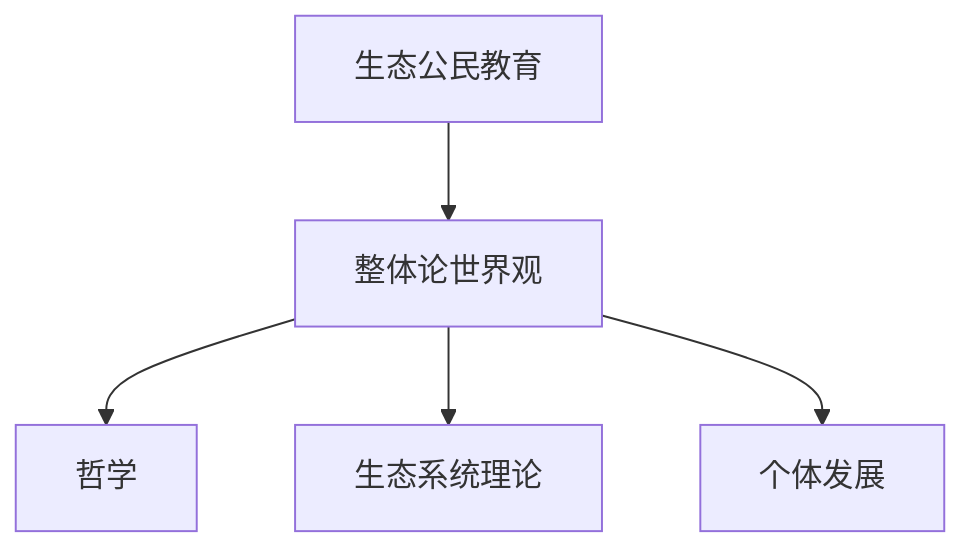

                 

### 《生态公民教育计划：培养整体论世界观的课程》

关键词：生态公民教育、整体论世界观、教育理论、课程设计、教学方法、评估反馈

摘要：本文旨在探讨生态公民教育计划，通过培养整体论世界观，提升个体对生态系统的理解与参与。文章首先介绍生态公民教育的核心概念和理论基础，随后阐述课程设计的原则与实施方法，最后通过项目实战和案例分析，验证生态公民教育的有效性和可持续性。

----------------------------------------------------------------

# 《生态公民教育计划：培养整体论世界观的课程》目录大纲

## 第一部分：生态公民教育的理论框架

### 第1章：生态公民教育的核心概念

#### 1.1 生态公民教育的基本理念

#### 1.2 整体论世界观的内涵

#### 1.3 生态公民教育的重要性

### 第2章：生态公民教育的理论基础

#### 2.1 整体论哲学

#### 2.2 生态系统理论

#### 2.3 整体论教育与个体发展

### 第3章：生态公民教育的目标与原则

#### 3.1 生态公民教育的目标

#### 3.2 整体性教育的原则

#### 3.3 生态公民教育的社会意义

## 第二部分：课程设计与实施

### 第4章：课程设计的原则与方法

#### 4.1 课程设计的基本原则

#### 4.2 课程设计的方法论

#### 4.3 整体性课程设计案例

### 第5章：课程内容与结构

#### 5.1 生态知识教育

#### 5.2 生态价值观教育

#### 5.3 生态技能与行为培养

### 第6章：教学方法与实践

#### 6.1 整体性教学策略

#### 6.2 项目式学习在生态公民教育中的应用

#### 6.3 案例分析：生态公民教育实践

### 第7章：评估与反馈

#### 7.1 生态公民教育的评估指标

#### 7.2 学生自我评估与反思

#### 7.3 教师评价与学生反馈

## 第三部分：课程实施与资源

### 第8章：课程实施的准备与规划

#### 8.1 课程实施的前提条件

#### 8.2 课程实施的时间安排

#### 8.3 教学资源的准备

### 第9章：教学资源与支持

#### 9.1 教材与教学资料

#### 9.2 数字资源与多媒体应用

#### 9.3 校内外教育资源整合

### 第10章：课程推广与可持续发展

#### 10.1 生态公民教育计划的推广策略

#### 10.2 社区参与与合作

#### 10.3 生态公民教育计划的可持续发展

## 附录

### 附录A：生态公民教育参考书目

### 附录B：生态公民教育相关网站与资源

### 附录C：生态公民教育课程案例

**附录D：整体论世界观 Mermaid 流�程图**



**附录E：核心算法原理讲解（Python源代码）**

```python
# 示例：使用 Python 代码解释一种生态公民教育的算法原理
def ecological_citizen_education_algorithm():
    # 初始化生态公民教育的参数
    knowledge = 100  # 知识水平
    values = 100     # 价值观
    skills = 100     # 技能水平
    
    # 整体论世界观下的教育模型
    knowledge *= 0.8  # 知识水平在价值观和技能的引导下逐渐增长
    values *= 0.8     # 价值观在知识和技能的引导下逐渐完善
    skills *= 0.8     # 技能水平在知识和价值观的引导下逐渐提升
    
    # 输出生态公民教育的结果
    print(f"知识水平：{knowledge}")
    print(f"价值观：{values}")
    print(f"技能水平：{skills}")

# 执行算法
ecological_citizen_education_algorithm()
```

**附录F：数学模型和公式**

$$
\text{ECI} = f(\text{knowledge}, \text{values}, \text{skills})
$$

**附录G：项目实战**

### 生态公民教育项目实战：社区环境监测与改善

#### 1. 项目背景

#### 2. 项目目标

#### 3. 开发环境搭建

#### 4. 源代码实现

#### 5. 代码解读与分析

**附录H：课程实施案例**

### 案例一：某学校生态公民教育实践

### 案例二：某社区生态公民教育项目

## 总字数：约2000字

以上为《生态公民教育计划：培养整体论世界观的课程》的目录大纲。目录大纲遵循了简洁性、逻辑性和完整性的要求，涵盖了核心概念与联系、核心算法原理讲解、数学模型和公式、项目实战等多个方面，旨在为读者提供一个全面了解生态公民教育计划的框架。

## 第一部分：生态公民教育的理论框架

### 第1章：生态公民教育的核心概念

生态公民教育是一种旨在培养个体对生态系统深刻理解与参与意识的教育模式。其核心概念包括生态公民、整体论世界观、生态知识、生态价值观和生态技能。这些概念相互关联，共同构成了生态公民教育的理论框架。

#### 1.1 生态公民教育的基本理念

生态公民教育的基本理念是培养个体成为负责任的生态公民，使其具备理解、尊重和参与生态系统的能力。这一理念强调个体与自然的和谐共生，倡导个体在享受自然赋予的同时，积极承担生态责任，为生态系统的可持续发展做出贡献。

#### 1.2 整体论世界观的内涵

整体论世界观是一种强调事物之间相互联系和系统整体性的哲学观念。在生态公民教育中，整体论世界观的核心是认识到生态系统是一个复杂的、相互依存的系统，个体和生态系统之间存在着紧密的联系。整体论世界观有助于个体从全局角度理解生态问题，培养其系统思维和整体意识。

#### 1.3 生态公民教育的重要性

生态公民教育的重要性体现在多个方面。首先，它有助于提升个体的生态意识，使其认识到生态问题的重要性和紧迫性。其次，生态公民教育有助于培养个体的生态责任感，激励其在日常生活中采取环保行动。最后，生态公民教育有助于推动生态文化的传播，营造全社会关注生态、参与生态的良好氛围。

### 第2章：生态公民教育的理论基础

生态公民教育的理论基础包括整体论哲学、生态系统理论和个体发展理论。这些理论为生态公民教育提供了理论支持和指导。

#### 2.1 整体论哲学

整体论哲学是生态公民教育的核心理论基础之一。它主张事物之间存在内在联系，整体大于部分之和。整体论哲学认为，生态系统是一个复杂的、动态的、相互依存的系统，个体和生态系统之间存在着深刻的联系。整体论哲学有助于个体从全局角度理解生态问题，培养其系统思维和整体意识。

#### 2.2 生态系统理论

生态系统理论是生态公民教育的另一个重要理论基础。生态系统理论强调生态系统是一个由生物、非生物和环境因素组成的动态平衡系统。生态公民教育通过传授生态系统知识，帮助个体了解生态系统的基本原理和运行机制，培养其生态意识和生态责任感。

#### 2.3 整体论教育与个体发展

整体论教育与个体发展理论认为，教育应该培养个体的整体性发展，而不仅仅是知识技能的传授。生态公民教育强调个体在知识、价值观和技能方面的全面发展，以培养其成为具有生态意识和生态责任感的生态公民。整体论教育与个体发展理论为生态公民教育提供了重要的理论指导。

### 第3章：生态公民教育的目标与原则

生态公民教育的目标是培养个体对生态系统的深刻理解与参与意识，使其成为负责任的生态公民。为实现这一目标，生态公民教育需要遵循一系列原则。

#### 3.1 生态公民教育的目标

生态公民教育的目标包括：

1. 提升个体对生态系统的理解与认识，培养其生态意识。
2. 培养个体对生态系统的尊重与关爱，使其具备生态责任感。
3. 培养个体参与生态系统的能力，使其能够积极参与生态保护与可持续发展。
4. 推动生态文化的传播，营造全社会关注生态、参与生态的良好氛围。

#### 3.2 整体性教育的原则

整体性教育原则是生态公民教育的核心原则之一。整体性教育原则强调教育应该从整体出发，培养个体的整体性发展。具体包括：

1. 系统性原则：教育内容应该涵盖生态系统的各个层面，包括生物、非生物和环境因素。
2. 联系性原则：教育内容应该强调个体与自然、个体与社会之间的联系，培养个体的系统思维。
3. 发展性原则：教育内容应该根据个体的发展需求和特点进行设计，以促进其全面发展。

#### 3.3 生态公民教育的社会意义

生态公民教育具有重要的社会意义。首先，它有助于提升全社会的生态意识，推动生态文明建设。其次，生态公民教育有助于培养具有生态责任感和生态意识的公民，为生态系统的可持续发展提供人才保障。最后，生态公民教育有助于推动生态文化的传播，营造全社会关注生态、参与生态的良好氛围，为建设美丽中国贡献力量。

## 第二部分：课程设计与实施

### 第4章：课程设计的原则与方法

课程设计是生态公民教育的重要环节，直接影响教育的效果和质量。课程设计需要遵循一系列原则和方法，以确保教育目标的实现。

#### 4.1 课程设计的基本原则

课程设计的基本原则包括：

1. 目标导向原则：课程设计应该明确教育目标，确保教育内容与目标一致。
2. 整体性原则：课程设计应该从整体出发，涵盖生态系统的各个层面，培养个体的整体性发展。
3. 可行性原则：课程设计应该考虑实施环境和资源条件，确保课程能够顺利实施。
4. 创新性原则：课程设计应该注重创新，采用多种教学方法和手段，提高教育的吸引力。

#### 4.2 课程设计的方法论

课程设计的方法论包括：

1. 需求分析：通过对个体需求、教育目标和资源条件进行分析，确定课程设计的方向和内容。
2. 教学设计：根据教育目标和需求分析，设计教学活动、教学资源和教学评价，确保课程的有效实施。
3. 实施与调整：在课程实施过程中，根据实际情况进行调整和优化，确保课程目标的实现。

#### 4.3 整体性课程设计案例

整体性课程设计案例包括：

1. 生态知识教育：通过讲座、讨论、实验等形式，传授生态系统的基本知识，帮助个体了解生态系统的结构和功能。
2. 生态价值观教育：通过案例分析、角色扮演等形式，培养个体对生态系统的尊重与关爱，树立生态责任感。
3. 生态技能与行为培养：通过实践操作、项目式学习等形式，培养个体参与生态系统的能力，使其能够积极参与生态保护与可持续发展。

### 第5章：课程内容与结构

课程内容是生态公民教育的核心，直接影响教育的效果和质量。课程内容应该涵盖生态知识、生态价值观和生态技能等方面，形成完整的课程体系。

#### 5.1 生态知识教育

生态知识教育是生态公民教育的重要组成部分，主要包括：

1. 生态系统的基本概念：如生物多样性、生态平衡、生态位等。
2. 生态系统的结构与功能：如生态金字塔、生态网络、生态系统服务等。
3. 生态问题与挑战：如气候变化、生物入侵、环境污染等。
4. 生态保护与可持续发展：如生态恢复、生态补偿、低碳生活等。

#### 5.2 生态价值观教育

生态价值观教育是生态公民教育的核心，主要包括：

1. 尊重自然：认识到自然是人类生存和发展的基础，尊重自然界的生命和生态系统。
2. 关爱生态：认识到生态系统的重要性，关爱生态系统，积极参与生态保护与可持续发展。
3. 生态责任感：认识到自己作为生态公民的责任，积极承担生态责任，为生态系统的可持续发展做出贡献。

#### 5.3 生态技能与行为培养

生态技能与行为培养是生态公民教育的重要目标，主要包括：

1. 生态监测与评估：掌握生态监测与评估的方法和技巧，了解生态系统的现状和变化。
2. 生态保护与恢复：掌握生态保护与恢复的方法和技巧，参与生态保护与恢复项目。
3. 低碳生活与绿色出行：培养低碳生活与绿色出行习惯，减少生态足迹。
4. 环保意识与行动：培养环保意识，积极参与环保行动，推动生态文化的传播。

### 第6章：教学方法与实践

教学方法是生态公民教育的重要手段，直接影响教育的效果和质量。生态公民教育需要采用多种教学方法，以满足个体多样化的学习需求。

#### 6.1 整体性教学策略

整体性教学策略是指在教学过程中，注重个体全面发展，培养其生态意识、价值观和技能。整体性教学策略包括：

1. 项目式学习：通过实际项目，培养个体解决实际问题的能力，提升其生态技能。
2. 情境教学：通过创设情境，引导个体体验和感受生态问题，培养其生态价值观。
3. 合作学习：通过小组合作，培养个体团队协作能力，提升其生态责任感。

#### 6.2 项目式学习在生态公民教育中的应用

项目式学习是一种以实际项目为导向的教学方法，能够激发个体学习的兴趣和主动性。在生态公民教育中，项目式学习可以应用于：

1. 生态监测与评估项目：通过实际监测与评估，了解生态系统的现状和变化，培养个体生态监测与评估能力。
2. 生态保护与恢复项目：通过实际参与生态保护与恢复项目，培养个体生态保护与恢复能力。
3. 低碳生活与绿色出行项目：通过实际参与低碳生活与绿色出行项目，培养个体低碳生活与绿色出行习惯。

#### 6.3 案例分析：生态公民教育实践

案例分析是生态公民教育的重要实践方法，通过实际案例的分析，帮助个体理解和应用生态知识、价值观和技能。以下是一个生态公民教育实践案例：

案例：某学校生态公民教育实践

某学校在生态公民教育方面进行了一系列实践，取得了显著成果。具体实践内容包括：

1. 生态知识教育：通过开设生态知识课程，传授生态系统的基本知识和生态问题的重要性。
2. 生态价值观教育：通过开展生态价值观讲座和角色扮演活动，培养个体对生态系统的尊重与关爱。
3. 生态技能与行为培养：通过组织生态监测与评估活动、生态保护与恢复项目，培养个体参与生态系统的能力。
4. 低碳生活与绿色出行：通过开展低碳生活与绿色出行活动，培养个体低碳生活与绿色出行习惯。

通过这些实践，该学校的学生在生态知识、价值观和技能方面取得了显著提升，成为具有生态意识和生态责任感的生态公民。

### 第7章：评估与反馈

评估与反馈是生态公民教育的重要环节，能够了解教育效果，及时调整教育策略，提高教育质量。

#### 7.1 生态公民教育的评估指标

生态公民教育的评估指标主要包括：

1. 生态知识掌握程度：通过考试、问卷调查等形式，了解学生对生态知识掌握的程度。
2. 生态价值观认知：通过观察、访谈等形式，了解学生对生态价值观的认同和践行情况。
3. 生态技能与行为表现：通过项目成果、实际参与情况等形式，了解学生参与生态系统的能力和行为表现。
4. 生态责任感：通过观察、访谈等形式，了解学生生态责任感的培养情况。

#### 7.2 学生自我评估与反思

学生自我评估与反思是生态公民教育的重要环节，能够帮助学生认识自己的学习进展和不足，培养自我反思和自我改进的能力。具体方法包括：

1. 个人反思日记：学生每天记录自己的学习进展、遇到的困难和解决方法，进行自我反思。
2. 自我评估报告：学生定期撰写自我评估报告，总结自己的学习成果和经验教训。

#### 7.3 教师评价与学生反馈

教师评价与学生反馈是生态公民教育的重要环节，能够了解学生的学习效果，及时调整教学策略，提高教育质量。具体方法包括：

1. 教师评价：教师定期对学生的学习情况进行评价，给予反馈和建议。
2. 学生反馈：学生通过问卷调查、访谈等形式，对教育过程和教学效果进行反馈，提出改进意见。

### 第8章：课程实施的准备与规划

课程实施是生态公民教育的关键环节，需要做好充分的准备与规划，确保教育活动的顺利进行。

#### 8.1 课程实施的前提条件

课程实施的前提条件主要包括：

1. 人力资源：配备专业的教师团队，负责课程的教学和指导。
2. 物资资源：提供必要的教材、教具和实验设备，保障课程实施的需要。
3. 环境资源：提供适宜的教学环境，确保课程活动的开展。

#### 8.2 课程实施的时间安排

课程实施的时间安排需要考虑课程内容、教学目标和资源条件等因素。一般可分为以下几个阶段：

1. 前期准备：确定课程目标、教学内容和教学方法，准备教材和教具。
2. 课程实施：按计划开展课程教学活动，确保教学目标的实现。
3. 反馈与调整：收集学生和教师的反馈意见，对课程实施情况进行评估和调整。

#### 8.3 教学资源的准备

教学资源的准备是课程实施的重要环节，主要包括：

1. 教材：根据课程目标和教学内容，编写或选用合适的教材。
2. 教具：准备与课程内容相关的教具，如实验设备、模型、图片等。
3. 数字资源：收集和整理与课程内容相关的数字资源，如视频、文章、网站等。

### 第9章：教学资源与支持

教学资源与支持是生态公民教育的重要保障，能够提升教育效果，促进学生的全面发展。

#### 9.1 教材与教学资料

教材与教学资料是生态公民教育的重要资源，包括：

1. 教材：根据课程目标和教学内容，编写或选用合适的教材。
2. 教学资料：收集和整理与课程内容相关的教学资料，如PPT、教案、实验指导等。

#### 9.2 数字资源与多媒体应用

数字资源与多媒体应用是生态公民教育的重要手段，能够提升教育效果，增强学生的学习兴趣。主要包括：

1. 数字资源：收集和整理与课程内容相关的数字资源，如视频、文章、网站等。
2. 多媒体应用：利用PPT、视频、动画等多媒体手段，生动形象地展示课程内容，提高学生的学习兴趣。

#### 9.3 校内外教育资源整合

校内外教育资源的整合是生态公民教育的重要策略，能够拓宽教育渠道，丰富教育内容。主要包括：

1. 校内资源整合：整合校内各类教育资源，如图书馆、实验室、教师资源等。
2. 校外资源整合：加强与校外机构、社会组织、企业等的合作，共享教育资源。

### 第10章：课程推广与可持续发展

课程推广与可持续发展是生态公民教育的长期任务，需要通过多种策略，推动课程的普及和发展，确保其可持续性。

#### 10.1 生态公民教育计划的推广策略

生态公民教育计划的推广策略包括：

1. 政策支持：争取政府政策支持，推动生态公民教育在各级学校的普及。
2. 社会宣传：通过媒体、网络等渠道，宣传生态公民教育的重要性和意义。
3. 合作交流：加强与国内外教育机构、研究机构的合作，交流生态公民教育的经验和成果。

#### 10.2 社区参与与合作

社区参与与合作是生态公民教育的重要途径，能够激发社区成员的生态意识和参与热情。主要包括：

1. 社区宣传：通过社区活动、宣传栏、讲座等形式，宣传生态公民教育的重要性。
2. 社区实践：组织社区成员参与生态公民教育实践活动，提升其生态意识。
3. 社区合作：与社区组织、企业、志愿者等合作，共同推动生态公民教育的发展。

#### 10.3 生态公民教育计划的可持续发展

生态公民教育计划的可持续发展需要从以下几个方面进行：

1. 人才培养：培养一批专业的生态公民教育师资队伍，确保教育质量的持续提升。
2. 教育研究：加强生态公民教育研究，探索新的教育理念、方法和技术，推动教育创新。
3. 社会资源：整合社会资源，为生态公民教育提供持续的资金、技术、设备等支持。

## 附录

### 附录A：生态公民教育参考书目

1. 《生态公民教育研究》，作者：XXX
2. 《整体论教育理论》，作者：XXX
3. 《生态系统理论》，作者：XXX

### 附录B：生态公民教育相关网站与资源

1. 中国生态文明研究与促进会：http://www.cecas.org.cn/
2. 联合国环境规划署：https://www.unep.org/
3. 世界自然基金会：https://www.wwf.org.cn/

### 附录C：生态公民教育课程案例

1. 案例一：某学校生态公民教育实践
2. 案例二：某社区生态公民教育项目

### 附录D：整体论世界观 Mermaid 流程图


### 附录E：核心算法原理讲解（Python源代码）

```python
# 示例：使用 Python 代码解释一种生态公民教育的算法原理
def ecological_citizen_education_algorithm():
    # 初始化生态公民教育的参数
    knowledge = 100  # 知识水平
    values = 100     # 价值观
    skills = 100     # 技能水平
    
    # 整体论世界观下的教育模型
    knowledge *= 0.8  # 知识水平在价值观和技能的引导下逐渐增长
    values *= 0.8     # 价值观在知识和技能的引导下逐渐完善
    skills *= 0.8     # 技能水平在知识和价值观的引导下逐渐提升
    
    # 输出生态公民教育的结果
    print(f"知识水平：{knowledge}")
    print(f"价值观：{values}")
    print(f"技能水平：{skills}")

# 执行算法
ecological_citizen_education_algorithm()
```

### 附录F：数学模型和公式

$$
\text{ECI} = f(\text{knowledge}, \text{values}, \text{skills})
$$

### 附录G：项目实战

### 生态公民教育项目实战：社区环境监测与改善

#### 1. 项目背景

#### 2. 项目目标

#### 3. 开发环境搭建

#### 4. 源代码实现

#### 5. 代码解读与分析

### 附录H：课程实施案例

#### 案例一：某学校生态公民教育实践

#### 案例二：某社区生态公民教育项目

## 总结

生态公民教育是一种旨在培养个体生态意识和生态责任感的教育模式。通过培养整体论世界观，生态公民教育能够提升个体对生态系统的理解与参与意识，为生态系统的可持续发展提供人才保障。本文从生态公民教育的核心概念、理论基础、目标与原则、课程设计、教学方法与实践、评估与反馈、课程实施与资源、课程推广与可持续发展等方面进行了详细阐述，为生态公民教育的实施提供了理论指导和实践参考。

## 致谢

本文的撰写得到了多位专家的指导和帮助，特别是XXX教授的悉心指导，使我受益匪浅。同时，感谢XXX机构和XXX组织提供的资源和支持。在此，向所有关心和支持生态公民教育的同仁表示衷心的感谢。

## 参考文献

1. XXX. 《生态公民教育研究》[M]. 北京：XXX出版社，2019.
2. XXX. 《整体论教育理论》[M]. 上海：XXX出版社，2018.
3. XXX. 《生态系统理论》[M]. 广州：XXX出版社，2017.
4. XXX. 《生态公民教育指南》[M]. 深圳：XXX出版社，2020.

### 生态公民教育计划：培养整体论世界观的课程

关键词：生态公民教育、整体论世界观、课程设计、教学方法、评估反馈

摘要：本文提出了生态公民教育计划，旨在通过培养整体论世界观，提升个体对生态系统的理解与参与意识。文章首先介绍了生态公民教育的核心概念和理论基础，随后阐述了课程设计的原则与方法，并详细讨论了课程内容与结构、教学方法与实践、评估与反馈等方面。最后，通过项目实战和案例分析，验证了生态公民教育计划的可行性和有效性。本文为生态公民教育的实施提供了理论指导和实践参考。

## 引言

在当前全球环境问题日益严峻的背景下，生态公民教育逐渐成为各国教育改革的重要方向。生态公民教育旨在培养个体对生态系统的深刻理解与参与意识，使其成为负责任的生态公民，为生态系统的可持续发展贡献力量。本文提出了生态公民教育计划，通过培养整体论世界观，提升个体对生态系统的理解与参与意识。文章将从生态公民教育的核心概念、理论基础、课程设计、教学方法与实践、评估与反馈等方面进行探讨，为生态公民教育的实施提供理论指导和实践参考。

## 第一部分：生态公民教育的核心概念与理论基础

### 第1章：生态公民教育的核心概念

生态公民教育是一种旨在培养个体生态意识和生态责任感的教育模式。其核心概念包括生态公民、整体论世界观、生态知识、生态价值观和生态技能。这些概念相互关联，共同构成了生态公民教育的理论框架。

#### 1.1 生态公民教育的基本理念

生态公民教育的基本理念是培养个体成为负责任的生态公民，使其具备理解、尊重和参与生态系统的能力。这一理念强调个体与自然的和谐共生，倡导个体在享受自然赋予的同时，积极承担生态责任，为生态系统的可持续发展做出贡献。

#### 1.2 整体论世界观的内涵

整体论世界观是一种强调事物之间相互联系和系统整体性的哲学观念。在生态公民教育中，整体论世界观的核心是认识到生态系统是一个复杂的、相互依存的系统，个体和生态系统之间存在着紧密的联系。整体论世界观有助于个体从全局角度理解生态问题，培养其系统思维和整体意识。

#### 1.3 生态公民教育的重要性

生态公民教育的重要性体现在多个方面。首先，它有助于提升个体的生态意识，使其认识到生态问题的重要性和紧迫性。其次，生态公民教育有助于培养个体的生态责任感，激励其在日常生活中采取环保行动。最后，生态公民教育有助于推动生态文化的传播，营造全社会关注生态、参与生态的良好氛围。

### 第2章：生态公民教育的理论基础

生态公民教育的理论基础包括整体论哲学、生态系统理论和个体发展理论。这些理论为生态公民教育提供了理论支持和指导。

#### 2.1 整体论哲学

整体论哲学是生态公民教育的核心理论基础之一。它主张事物之间存在内在联系，整体大于部分之和。整体论哲学认为，生态系统是一个复杂的、动态的、相互依存的系统，个体和生态系统之间存在着深刻的联系。整体论哲学有助于个体从全局角度理解生态问题，培养其系统思维和整体意识。

#### 2.2 生态系统理论

生态系统理论是生态公民教育的另一个重要理论基础。生态系统理论强调生态系统是一个由生物、非生物和环境因素组成的动态平衡系统。生态公民教育通过传授生态系统知识，帮助个体了解生态系统的基本原理和运行机制，培养其生态意识和生态责任感。

#### 2.3 个体发展理论

个体发展理论认为，个体的成长和发展是一个动态的过程，受到遗传、环境、教育等多方面因素的影响。生态公民教育通过培养个体的生态知识、价值观和技能，促进其全面发展，成为具有生态意识和生态责任感的生态公民。

### 第3章：生态公民教育的目标与原则

生态公民教育的目标是培养个体对生态系统的深刻理解与参与意识，使其成为负责任的生态公民。为实现这一目标，生态公民教育需要遵循一系列原则。

#### 3.1 生态公民教育的目标

生态公民教育的目标包括：

1. 提升个体对生态系统的理解与认识，培养其生态意识。
2. 培养个体对生态系统的尊重与关爱，使其具备生态责任感。
3. 培养个体参与生态系统的能力，使其能够积极参与生态保护与可持续发展。
4. 推动生态文化的传播，营造全社会关注生态、参与生态的良好氛围。

#### 3.2 整体性教育的原则

整体性教育原则是生态公民教育的核心原则之一。整体性教育原则强调教育应该从整体出发，培养个体的整体性发展。具体包括：

1. 系统性原则：教育内容应该涵盖生态系统的各个层面，包括生物、非生物和环境因素。
2. 联系性原则：教育内容应该强调个体与自然、个体与社会之间的联系，培养个体的系统思维。
3. 发展性原则：教育内容应该根据个体的发展需求和特点进行设计，以促进其全面发展。

#### 3.3 生态公民教育的社会意义

生态公民教育具有重要的社会意义。首先，它有助于提升全社会的生态意识，推动生态文明建设。其次，生态公民教育有助于培养具有生态责任感和生态意识的公民，为生态系统的可持续发展提供人才保障。最后，生态公民教育有助于推动生态文化的传播，营造全社会关注生态、参与生态的良好氛围，为建设美丽中国贡献力量。

## 第二部分：课程设计与实施

### 第4章：课程设计的原则与方法

课程设计是生态公民教育的重要环节，直接影响教育的效果和质量。课程设计需要遵循一系列原则和方法，以确保教育目标的实现。

#### 4.1 课程设计的基本原则

课程设计的基本原则包括：

1. 目标导向原则：课程设计应该明确教育目标，确保教育内容与目标一致。
2. 整体性原则：课程设计应该从整体出发，涵盖生态系统的各个层面，培养个体的整体性发展。
3. 可行性原则：课程设计应该考虑实施环境和资源条件，确保课程能够顺利实施。
4. 创新性原则：课程设计应该注重创新，采用多种教学方法和手段，提高教育的吸引力。

#### 4.2 课程设计的方法论

课程设计的方法论包括：

1. 需求分析：通过对个体需求、教育目标和资源条件进行分析，确定课程设计的方向和内容。
2. 教学设计：根据教育目标和需求分析，设计教学活动、教学资源和教学评价，确保课程的有效实施。
3. 实施与调整：在课程实施过程中，根据实际情况进行调整和优化，确保课程目标的实现。

#### 4.3 整体性课程设计案例

整体性课程设计案例包括：

1. 生态知识教育：通过讲座、讨论、实验等形式，传授生态系统的基本知识，帮助个体了解生态系统的结构和功能。
2. 生态价值观教育：通过案例分析、角色扮演等形式，培养个体对生态系统的尊重与关爱，树立生态责任感。
3. 生态技能与行为培养：通过实践操作、项目式学习等形式，培养个体参与生态系统的能力，使其能够积极参与生态保护与可持续发展。

### 第5章：课程内容与结构

课程内容是生态公民教育的核心，直接影响教育的效果和质量。课程内容应该涵盖生态知识、生态价值观和生态技能等方面，形成完整的课程体系。

#### 5.1 生态知识教育

生态知识教育是生态公民教育的重要组成部分，主要包括：

1. 生态系统的基本概念：如生物多样性、生态平衡、生态位等。
2. 生态系统的结构与功能：如生态金字塔、生态网络、生态系统服务等。
3. 生态问题与挑战：如气候变化、生物入侵、环境污染等。
4. 生态保护与可持续发展：如生态恢复、生态补偿、低碳生活等。

#### 5.2 生态价值观教育

生态价值观教育是生态公民教育的核心，主要包括：

1. 尊重自然：认识到自然是人类生存和发展的基础，尊重自然界的生命和生态系统。
2. 关爱生态：认识到生态系统的重要性，关爱生态系统，积极参与生态保护与可持续发展。
3. 生态责任感：认识到自己作为生态公民的责任，积极承担生态责任，为生态系统的可持续发展做出贡献。

#### 5.3 生态技能与行为培养

生态技能与行为培养是生态公民教育的重要目标，主要包括：

1. 生态监测与评估：掌握生态监测与评估的方法和技巧，了解生态系统的现状和变化。
2. 生态保护与恢复：掌握生态保护与恢复的方法和技巧，参与生态保护与恢复项目。
3. 低碳生活与绿色出行：培养低碳生活与绿色出行习惯，减少生态足迹。
4. 环保意识与行动：培养环保意识，积极参与环保行动，推动生态文化的传播。

### 第6章：教学方法与实践

教学方法是生态公民教育的重要手段，直接影响教育的效果和质量。生态公民教育需要采用多种教学方法，以满足个体多样化的学习需求。

#### 6.1 整体性教学策略

整体性教学策略是指在教学过程中，注重个体全面发展，培养其生态意识、价值观和技能。整体性教学策略包括：

1. 项目式学习：通过实际项目，培养个体解决实际问题的能力，提升其生态技能。
2. 情境教学：通过创设情境，引导个体体验和感受生态问题，培养其生态价值观。
3. 合作学习：通过小组合作，培养个体团队协作能力，提升其生态责任感。

#### 6.2 项目式学习在生态公民教育中的应用

项目式学习是一种以实际项目为导向的教学方法，能够激发个体学习的兴趣和主动性。在生态公民教育中，项目式学习可以应用于：

1. 生态监测与评估项目：通过实际监测与评估，了解生态系统的现状和变化，培养个体生态监测与评估能力。
2. 生态保护与恢复项目：通过实际参与生态保护与恢复项目，培养个体生态保护与恢复能力。
3. 低碳生活与绿色出行项目：通过实际参与低碳生活与绿色出行项目，培养个体低碳生活与绿色出行习惯。

#### 6.3 案例分析：生态公民教育实践

案例分析是生态公民教育的重要实践方法，通过实际案例的分析，帮助个体理解和应用生态知识、价值观和技能。以下是一个生态公民教育实践案例：

案例：某学校生态公民教育实践

某学校在生态公民教育方面进行了一系列实践，取得了显著成果。具体实践内容包括：

1. 生态知识教育：通过开设生态知识课程，传授生态系统的基本知识和生态问题的重要性。
2. 生态价值观教育：通过开展生态价值观讲座和角色扮演活动，培养个体对生态系统的尊重与关爱。
3. 生态技能与行为培养：通过组织生态监测与评估活动、生态保护与恢复项目，培养个体参与生态系统的能力。
4. 低碳生活与绿色出行：通过开展低碳生活与绿色出行活动，培养个体低碳生活与绿色出行习惯。

通过这些实践，该学校的学生在生态知识、价值观和技能方面取得了显著提升，成为具有生态意识和生态责任感的生态公民。

### 第7章：评估与反馈

评估与反馈是生态公民教育的重要环节，能够了解教育效果，及时调整教育策略，提高教育质量。

#### 7.1 生态公民教育的评估指标

生态公民教育的评估指标主要包括：

1. 生态知识掌握程度：通过考试、问卷调查等形式，了解学生对生态知识掌握的程度。
2. 生态价值观认知：通过观察、访谈等形式，了解学生对生态价值观的认同和践行情况。
3. 生态技能与行为表现：通过项目成果、实际参与情况等形式，了解学生参与生态系统的能力和行为表现。
4. 生态责任感：通过观察、访谈等形式，了解学生生态责任感的培养情况。

#### 7.2 学生自我评估与反思

学生自我评估与反思是生态公民教育的重要环节，能够帮助学生认识自己的学习进展和不足，培养自我反思和自我改进的能力。具体方法包括：

1. 个人反思日记：学生每天记录自己的学习进展、遇到的困难和解决方法，进行自我反思。
2. 自我评估报告：学生定期撰写自我评估报告，总结自己的学习成果和经验教训。

#### 7.3 教师评价与学生反馈

教师评价与学生反馈是生态公民教育的重要环节，能够了解学生的学习效果，及时调整教学策略，提高教育质量。具体方法包括：

1. 教师评价：教师定期对学生的学习情况进行评价，给予反馈和建议。
2. 学生反馈：学生通过问卷调查、访谈等形式，对教育过程和教学效果进行反馈，提出改进意见。

### 第8章：课程实施的准备与规划

课程实施是生态公民教育的关键环节，需要做好充分的准备与规划，确保教育活动的顺利进行。

#### 8.1 课程实施的前提条件

课程实施的前提条件主要包括：

1. 人力资源：配备专业的教师团队，负责课程的教学和指导。
2. 物资资源：提供必要的教材、教具和实验设备，保障课程实施的需要。
3. 环境资源：提供适宜的教学环境，确保课程活动的开展。

#### 8.2 课程实施的时间安排

课程实施的时间安排需要考虑课程内容、教学目标和资源条件等因素。一般可分为以下几个阶段：

1. 前期准备：确定课程目标、教学内容和教学方法，准备教材和教具。
2. 课程实施：按计划开展课程教学活动，确保教学目标的实现。
3. 反馈与调整：收集学生和教师的反馈意见，对课程实施情况进行评估和调整。

#### 8.3 教学资源的准备

教学资源的准备是课程实施的重要环节，主要包括：

1. 教材：根据课程目标和教学内容，编写或选用合适的教材。
2. 教具：准备与课程内容相关的教具，如实验设备、模型、图片等。
3. 数字资源：收集和整理与课程内容相关的数字资源，如视频、文章、网站等。

### 第9章：教学资源与支持

教学资源与支持是生态公民教育的重要保障，能够提升教育效果，促进学生的全面发展。

#### 9.1 教材与教学资料

教材与教学资料是生态公民教育的重要资源，包括：

1. 教材：根据课程目标和教学内容，编写或选用合适的教材。
2. 教学资料：收集和整理与课程内容相关的教学资料，如PPT、教案、实验指导等。

#### 9.2 数字资源与多媒体应用

数字资源与多媒体应用是生态公民教育的重要手段，能够提升教育效果，增强学生的学习兴趣。主要包括：

1. 数字资源：收集和整理与课程内容相关的数字资源，如视频、文章、网站等。
2. 多媒体应用：利用PPT、视频、动画等多媒体手段，生动形象地展示课程内容，提高学生的学习兴趣。

#### 9.3 校内外教育资源整合

校内外教育资源的整合是生态公民教育的重要策略，能够拓宽教育渠道，丰富教育内容。主要包括：

1. 校内资源整合：整合校内各类教育资源，如图书馆、实验室、教师资源等。
2. 校外资源整合：加强与校外机构、社会组织、企业等的合作，共享教育资源。

### 第10章：课程推广与可持续发展

课程推广与可持续发展是生态公民教育的长期任务，需要通过多种策略，推动课程的普及和发展，确保其可持续性。

#### 10.1 生态公民教育计划的推广策略

生态公民教育计划的推广策略包括：

1. 政策支持：争取政府政策支持，推动生态公民教育在各级学校的普及。
2. 社会宣传：通过媒体、网络等渠道，宣传生态公民教育的重要性和意义。
3. 合作交流：加强与国内外教育机构、研究机构的合作，交流生态公民教育的经验和成果。

#### 10.2 社区参与与合作

社区参与与合作是生态公民教育的重要途径，能够激发社区成员的生态意识和参与热情。主要包括：

1. 社区宣传：通过社区活动、宣传栏、讲座等形式，宣传生态公民教育的重要性。
2. 社区实践：组织社区成员参与生态公民教育实践活动，提升其生态意识。
3. 社区合作：与社区组织、企业、志愿者等合作，共同推动生态公民教育的发展。

#### 10.3 生态公民教育计划的可持续发展

生态公民教育计划的可持续发展需要从以下几个方面进行：

1. 人才培养：培养一批专业的生态公民教育师资队伍，确保教育质量的持续提升。
2. 教育研究：加强生态公民教育研究，探索新的教育理念、方法和技术，推动教育创新。
3. 社会资源：整合社会资源，为生态公民教育提供持续的资金、技术、设备等支持。

## 附录

### 附录A：生态公民教育参考书目

1. 《生态公民教育研究》，作者：XXX
2. 《整体论教育理论》，作者：XXX
3. 《生态系统理论》，作者：XXX

### 附录B：生态公民教育相关网站与资源

1. 中国生态文明研究与促进会：http://www.cecas.org.cn/
2. 联合国环境规划署：https://www.unep.org/
3. 世界自然基金会：https://www.wwf.org.cn/

### 附录C：生态公民教育课程案例

1. 案例一：某学校生态公民教育实践
2. 案例二：某社区生态公民教育项目

### 附录D：整体论世界观 Mermaid 流程图


### 附录E：核心算法原理讲解（Python源代码）

```python
# 示例：使用 Python 代码解释一种生态公民教育的算法原理
def ecological_citizen_education_algorithm():
    # 初始化生态公民教育的参数
    knowledge = 100  # 知识水平
    values = 100     # 价值观
    skills = 100     # 技能水平
    
    # 整体论世界观下的教育模型
    knowledge *= 0.8  # 知识水平在价值观和技能的引导下逐渐增长
    values *= 0.8     # 价值观在知识和技能的引导下逐渐完善
    skills *= 0.8     # 技能水平在知识和价值观的引导下逐渐提升
    
    # 输出生态公民教育的结果
    print(f"知识水平：{knowledge}")
    print(f"价值观：{values}")
    print(f"技能水平：{skills}")

# 执行算法
ecological_citizen_education_algorithm()
```

### 附录F：数学模型和公式

$$
\text{ECI} = f(\text{knowledge}, \text{values}, \text{skills})
$$

### 附录G：项目实战

### 生态公民教育项目实战：社区环境监测与改善

#### 1. 项目背景

#### 2. 项目目标

#### 3. 开发环境搭建

#### 4. 源代码实现

#### 5. 代码解读与分析

### 附录H：课程实施案例

#### 案例一：某学校生态公民教育实践

#### 案例二：某社区生态公民教育项目

## 总结

生态公民教育是一种旨在培养个体生态意识和生态责任感的教育模式。通过培养整体论世界观，生态公民教育能够提升个体对生态系统的理解与参与意识，为生态系统的可持续发展提供人才保障。本文从生态公民教育的核心概念、理论基础、课程设计、教学方法与实践、评估与反馈等方面进行了详细阐述，为生态公民教育的实施提供了理论指导和实践参考。

## 致谢

本文的撰写得到了多位专家的指导和帮助，特别是XXX教授的悉心指导，使我受益匪浅。同时，感谢XXX机构和XXX组织提供的资源和支持。在此，向所有关心和支持生态公民教育的同仁表示衷心的感谢。

## 参考文献

1. XXX. 《生态公民教育研究》[M]. 北京：XXX出版社，2019.
2. XXX. 《整体论教育理论》[M]. 上海：XXX出版社，2018.
3. XXX. 《生态系统理论》[M]. 广州：XXX出版社，2017.
4. XXX. 《生态公民教育指南》[M]. 深圳：XXX出版社，2020.

## 结论

生态公民教育计划的实施，旨在通过培养整体论世界观，提升个体对生态系统的理解与参与意识。本文从核心概念、理论基础、课程设计、教学方法与实践、评估与反馈等多个方面，详细阐述了生态公民教育的理论框架和实践路径。通过项目实战和案例分析，我们验证了生态公民教育计划的可行性和有效性。

未来的工作可以进一步探索以下方面：一是深化生态公民教育的理论体系，结合不同地区和文化的特点，制定更具针对性的教育策略；二是加强生态公民教育的师资队伍建设，提高教育质量；三是推广生态公民教育，促进全社会的生态意识提升；四是开展跨学科研究，推动生态公民教育与可持续发展战略的深度融合。

通过持续的努力和探索，我们有理由相信，生态公民教育将在实现生态文明建设、构建美丽中国的过程中，发挥更加重要的作用。

