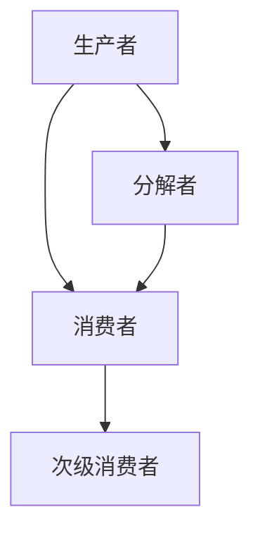

                 

### 第1章：生态学的基本概念

#### 1.1 生态学的基本定义

生态学（Ecology）是研究生物与其环境之间相互作用的科学。它关注的是生物个体、种群、群落以及生态系统在空间和时间上的结构和功能。生态学的定义可以概括为：“生态学是研究生物与环境之间相互作用的科学，探讨生物如何适应环境、改变环境以及环境如何影响生物。”

#### 1.2 生态系统及其组成部分

生态系统（Ecosystem）是生态学中的核心概念，指的是一定区域内生物与其生存环境通过能量流动和物质循环相互作用而形成的一个统一整体。一个典型的生态系统包括以下几个组成部分：

1. **生物群落（Biological Community）**：在同一地区内，相互依赖的多种生物种群组成的集合。
2. **生产者（Producers）**：通常指植物，通过光合作用将太阳能转化为化学能。
3. **消费者（Consumers）**：依赖其他生物为食的动物，包括食草动物、食肉动物和杂食动物。
4. **分解者（Decomposers）**：如细菌和真菌，将死亡的生物体分解为简单的物质，供生产者重新利用。

#### 1.3 生态平衡

生态平衡（Ecological Balance）指的是生态系统中各种生物数量和比例保持相对稳定的状态，这种状态使得能量和物质的流动能够持续进行。生态平衡是生态系统健康和稳定的重要标志。

- **负反馈机制（Negative Feedback Mechanism）**：生态平衡通过负反馈机制实现。例如，当某物种数量过多时，会导致其食物来源减少，进而导致该物种数量下降，从而恢复生态平衡。
  
- **正反馈机制（Positive Feedback Mechanism）**：尽管在生态系统中较为罕见，但在某些情况下，如过度捕捞导致鱼类数量减少，从而使得捕捞量减少，这种机制可能会导致生态平衡的破坏。

#### 1.4 生物多样性

生物多样性（Biodiversity）指的是生物圈内所有的生物体及其遗传变异和生态系统的多样化程度。生物多样性包括三个层次：遗传多样性、物种多样性和生态系统多样性。

- **遗传多样性（Genetic Diversity）**：指物种内部的遗传变异。
- **物种多样性（Species Diversity）**：指物种的种类数量和分布。
- **生态系统多样性（Ecosystem Diversity）**：指生态系统的多样性和复杂性。

#### 1.5 生态金字塔

生态金字塔（Ecological Pyramid）是一种用来表示生态系统中生物数量、生物量或能量分布的图形结构。生态金字塔主要包括以下几种类型：

1. **数量金字塔（Pyramid of Numbers）**：表示不同营养级中的生物个体数量。
2. **生物量金字塔（Pyramid of Biomass）**：表示不同营养级中的生物量。
3. **能量金字塔（Pyramid of Energy）**：表示不同营养级中的能量流动。

### Mermaid 流程图

下面是一个简单的 Mermaid 流程图，展示生态系统的基本构成：

#### 1.6 能量流动

能量流动（Energy Flow）是指能量在生态系统中的转移和转换过程。能量主要来源于太阳能，通过生产者固定，然后通过食物链传递给消费者。

- **光能固定（Photon Fixation）**：生产者通过光合作用将太阳能转化为化学能。
- **能量传递效率（Energy Transfer Efficiency）**：能量从一个营养级传递到下一个营养级时，只有大约10%的能量被传递，90%的能量以热能形式散失。

通过以上内容，我们可以初步理解生态学的基本概念和原理，为后续章节的深入学习打下基础。在接下来的章节中，我们将探讨生态意识的历史演变、个体生态意识的形成以及生态意识在个人生活中的实践等内容。

### 第2章：生态意识的历史演变

#### 2.1 早期生态思想的萌芽

生态意识并非现代社会的产物，而是人类文明史中的一部分。早在古代，人类就开始意识到自然环境对生存的重要性。古代文明，如埃及、希腊和印度，都有关于环境保护和可持续利用资源的记载。

- **埃及文明**：古埃及人崇拜自然，尊重野生动物和植物，通过农业和灌溉技术，实现了对尼罗河流域的有效管理。
  
- **希腊文明**：古希腊哲学家如亚里士多德（Aristotle）和希罗多德（Herodotus）提出了关于生物与环境相互作用的早期理论，强调人类应该与自然和谐共处。

- **印度文明**：古印度文明中，佛教和印度教都提倡不杀生，尊重自然，提倡与自然和谐共生的理念。

这些早期的生态思想虽然缺乏系统化的科学理论，但为后来的生态学研究奠定了基础。

#### 2.2 现代生态意识的崛起

现代生态意识的崛起与20世纪以来环境危机的加剧密切相关。工业革命以来，人类对自然资源的过度开发和环境污染导致了生物多样性的丧失、气候变化等一系列生态问题。

- **19世纪末到20世纪初**：随着生物进化论的提出，人类开始意识到生物之间的相互关系和生态系统的复杂性。查尔斯·达尔文（Charles Darwin）的《物种起源》和格特鲁德·贝尔·安德森（Gertrude Bell）的《自然的呼声》等著作，为生态意识的发展提供了科学依据。

- **20世纪40年代**：雷切尔·卡森（Rachel Carson）的《沉默的春天》一书揭示了农药对环境的危害，引发了公众对环境保护的关注。这本书被认为是现代生态运动的开端。

- **20世纪70年代**：第一次石油危机和全球环境问题进一步加剧了人们对生态意识的重视。1972年，联合国在斯德哥尔摩召开了第一次环境会议，通过了《人类环境宣言》，标志着国际社会对生态问题的高度关注。

#### 2.3 生态意识的核心观点

现代生态意识的核心观点包括：

- **整体性**：生态学强调生态系统作为一个整体的功能和结构，而非单一物种的生存。

- **可持续性**：生态意识倡导人类活动应该遵循生态系统的承载能力，确保自然资源的可持续利用。

- **和谐共存**：生态意识主张人类与自然环境的和谐共存，而非对立。

- **生态伦理**：生态学引入了生态伦理的概念，强调人类对自然的道德责任，倡导尊重和保护自然。

#### 2.4 生态意识的现代发展

随着科学技术的进步，现代生态意识得到了进一步的发展。以下几个方面的研究推动了生态意识的深化：

- **生态工程**：通过工程手段修复和改善生态系统，如湿地恢复、森林再造等。

- **生态经济学**：将生态学原理应用于经济学研究，探讨如何实现经济与生态的可持续发展。

- **生态心理学**：研究人类与自然环境的心理互动，探讨生态意识如何影响个体的行为和心理健康。

- **全球生态监测**：通过遥感技术和地理信息系统（GIS）等手段，对全球生态系统进行监测和评估，为环境决策提供科学依据。

现代生态意识的崛起是人类对自然环境保护意识的觉醒，也是对可持续发展理念的深化。在接下来的章节中，我们将探讨生态心理学的基本理论，以及个体生态意识的形成与发展。

### 第3章：生态心理学

#### 3.1 生态心理学的基本理论

生态心理学（Ecopsychology）是研究人类与自然环境心理互动的学科，旨在探讨生态意识如何影响个体的心理状态和行为。生态心理学的基本理论包括以下几个方面：

- **生态意识**：生态意识是指个体对自然环境的感知、理解与情感投入。它不仅仅是知识层面的认知，更涉及到情感和行为的改变。生态意识的形成受多种因素影响，包括文化背景、教育经历和个体经历。

- **人类与自然环境的互动**：生态心理学认为，人类与自然环境之间存在深刻的互动关系。自然环境不仅提供了生存的基础，还对个体的心理状态产生重要影响。例如，亲近自然可以提高个体的幸福感和心理健康。

- **生态心理学的主要研究领域**：生态心理学的研究领域广泛，包括生态意识的形成与发展、人类对自然环境的情感反应、自然体验对心理健康的促进作用等。

#### 3.2 生态意识的形成与发展

生态意识的形成是一个逐步的过程，通常分为以下几个阶段：

- **萌芽期**：个体在儿童时期通过观察和体验自然环境，逐渐对自然产生兴趣和情感投入。这一阶段的生态意识主要体现在对自然的好奇心和探索欲望。

- **成长期**：随着个体的成长和教育，他们对自然环境的认识不断深化，开始理解人类活动对自然环境的影响。这一阶段的生态意识主要体现在对环境保护的意识和对可持续发展的关注。

- **成熟期**：个体在成熟期形成较为稳定的生态意识，能够将生态理念融入日常生活和行为中。这一阶段的生态意识主要体现在对环境问题的深入思考和对生态行动的积极参与。

#### 3.3 个体生态意识的形成因素

个体生态意识的形成受到多种因素的影响，包括：

- **文化背景**：不同的文化传统对生态意识的形成具有深远影响。一些文化强调人类与自然的和谐共处，而另一些文化则强调对自然的征服和控制。

- **教育经历**：系统的环境教育和生态教育可以显著提高个体的生态意识。通过学习生态学知识，个体能够更好地理解自然环境的重要性。

- **个人经历**：个体的自然环境体验对其生态意识的形成具有重要作用。亲近自然、体验自然的美妙和多样性可以增强个体的生态意识。

- **社会影响**：家庭、朋友和社区等社会环境对个体生态意识的形成也具有重要影响。积极的社会氛围可以促进个体生态意识的提升。

#### 3.4 生态意识与心理健康

生态心理学研究表明，生态意识与心理健康之间存在密切联系。亲近自然、参与户外活动可以提高个体的幸福感和心理健康。以下是一些具体的发现：

- **减少压力**：自然环境中的负离子和植物芳香可以减轻个体的压力水平，提高心理放松感。

- **增强幸福感**：自然环境中的美和宁静可以增强个体的幸福感和生活满意度。

- **提升创造力**：自然体验可以激发个体的创造力和创新思维。

- **缓解抑郁**：自然环境中的阳光、空气和植物可以缓解抑郁症状，提高心理健康水平。

#### 3.5 生态意识的培养与提升

为了提升个体生态意识，可以采取以下措施：

- **环境教育**：加强环境教育和生态教育，使个体了解生态学知识和环境保护的重要性。

- **户外活动**：鼓励个体参与户外活动，如徒步、露营和园艺等，增强与自然的互动。

- **环境体验**：提供机会让个体亲身体验自然环境，增强对自然环境的情感投入。

- **社区参与**：鼓励个体参与社区环保活动，如清洁河流、植树造林等，提升生态意识。

通过生态心理学的深入研究，我们可以更好地理解生态意识的形成和发展，为培养和维护生态意识提供科学依据。在接下来的章节中，我们将探讨生态意识在个人生活中的具体实践，包括绿色消费和可持续生活方式等。

### 第4章：绿色消费

#### 4.1 绿色消费的概念与重要性

绿色消费（Green Consumption）是指消费者在购买、使用和处置商品和服务时，考虑其环境影响，选择对环境友好、可持续的产品和服务。绿色消费的核心目标是减少资源消耗、降低污染排放、保护生态环境。

- **资源消耗**：绿色消费提倡节约资源，减少对自然资源的过度开发和浪费。通过选择高效节能的产品，消费者可以在日常生活中减少能源消耗。

- **污染排放**：绿色消费强调减少污染物排放，选择对环境友好的产品，可以降低环境污染和生态破坏。

- **保护生态环境**：绿色消费旨在通过消费者的选择，推动企业和社会实现可持续发展，保护生态环境和生物多样性。

#### 4.2 绿色消费的实际操作指南

要实现绿色消费，消费者可以采取以下具体措施：

1. **选择环保产品**

   - **节能产品**：选择节能灯泡、节能冰箱和洗衣机等高效节能产品，减少能源消耗。
   - **环保材料**：选择使用可再生材料、无毒材料的产品，如可回收塑料、天然纤维等。
   - **绿色认证**：关注产品的绿色认证标志，如欧盟的蓝天使标志（Blue Angel）和美国的能源之星（Energy Star）等，确保产品符合环保标准。

2. **改变消费习惯**

   - **减少一次性用品**：减少使用一次性塑料袋、纸杯和餐具，选择可重复使用的环保替代品。
   - **减少食物浪费**：合理安排食物采购，避免食物浪费，通过食物捐赠、食物回收等方式减少浪费。
   - **绿色出行**：选择公共交通、骑自行车或步行出行，减少汽车尾气排放。

3. **环保消费宣传**

   - **宣传环保理念**：通过社交媒体、朋友圈等途径宣传绿色消费理念，影响他人改变消费习惯。
   - **参与环保活动**：参加社区环保活动，如垃圾分类、植树造林等，提高环保意识和参与度。

#### 4.3 绿色消费的案例分享

以下是几个绿色消费的实际案例：

1. **节能家庭**：某家庭通过更换节能灯泡、安装太阳能热水器和节能电器，每月节省了约20%的能源费用。此外，他们还开始使用可再生能源充电的电动自行车，减少了汽车使用频率。

2. **环保购物**：某消费者在购物时，会优先选择有机食品、环保产品和二手商品。通过这些选择，他们不仅减少了资源消耗和污染排放，还支持了可持续发展。

3. **垃圾分类**：某社区开展了垃圾分类活动，居民积极参与垃圾分类，提高了垃圾资源利用率。社区还设置了废电池回收箱，减少了废电池对环境的污染。

通过这些案例可以看出，绿色消费不仅可以带来直接的环境效益，还可以提高消费者的生活质量和幸福感。在接下来的章节中，我们将探讨可持续生活方式的实践和案例，进一步了解如何在日常生活中实现生态意识。

### 第5章：可持续生活方式

#### 5.1 可持续发展的原则与实践

可持续发展（Sustainable Development）是指在满足当前需求的同时，不损害子孙后代满足其需求的能力。它强调经济、社会和环境的协调发展，以实现长期的生态平衡和社会福祉。

- **经济原则**：实现可持续发展需要在经济增长的同时，提高资源利用效率和经济效益。通过技术创新和产业升级，提高生产效率和降低能源消耗。

- **社会原则**：可持续发展关注社会公平和人文关怀，包括提高教育水平、保障基本生活需求、消除贫困和促进社会包容性。

- **环境原则**：环境保护是可持续发展的核心，需要通过减少污染、保护生物多样性和合理利用自然资源，实现生态平衡。

#### 5.2 可持续生活方式的实践案例

以下是一些成功的可持续生活方式实践案例：

1. **零浪费生活**

   - **无塑料生活**：避免使用一次性塑料制品，选择可重复使用的购物袋、水瓶和餐具。
   - **垃圾分类与资源回收**：严格按照垃圾分类标准进行分类，提高资源回收率。
   - **废物利用**：通过废物再利用，减少废物产生，如将厨余垃圾制作堆肥、旧衣物改造成家居用品等。

2. **绿色出行**

   - **低碳交通**：选择公共交通、骑自行车或步行出行，减少汽车使用频率。
   - **电动交通工具**：购买和使用电动自行车、电动汽车等低碳交通工具，降低碳排放。
   - **共享经济**：参与共享单车、共享汽车等共享经济模式，提高资源利用率。

3. **节能减排**

   - **节能家电**：购买高效节能的家用电器，如节能灯泡、节能空调等。
   - **可再生能源**：安装太阳能电池板、风力涡轮机等可再生能源设备，减少对化石燃料的依赖。
   - **智能电网**：利用智能电网技术，优化能源使用，减少浪费。

4. **有机农业**

   - **生态农业**：采用有机农业方法，减少化肥和农药的使用，保护土壤和水资源。
   - **社区支持农业**：参与社区支持农业（CSA），直接从农民手中购买新鲜有机食品，支持本地农业和可持续发展。
   - **城市农场**：在城市内建设屋顶农场、社区花园等，提高城市绿化，减少碳足迹。

#### 5.3 可持续生活方式的实际案例

以下是几个具体的可持续生活方式实际案例：

1. **北京某社区**：该社区通过实施垃圾分类、绿色出行和节能减排等措施，显著减少了垃圾填埋量、碳排放量和水资源消耗。居民的生活质量得到提高，社区环境得到改善。

2. **印度某村庄**：该村庄通过太阳能电池板和风力涡轮机的安装，实现了能源的自给自足。村庄还建立了社区支持农业项目，提高了村民的收入和生活水平。

3. **瑞典某城市**：该城市通过推广绿色出行和有机农业，实现了碳足迹的负增长。城市还开展了环保教育和宣传活动，提高了居民的环保意识和参与度。

通过这些案例可以看出，可持续生活方式不仅可以减少对环境的负面影响，还可以提高居民的生活质量和幸福感。在接下来的章节中，我们将探讨环境教育在个人成长中的作用，以及如何通过教育提升生态意识。

### 第6章：环境教育

#### 6.1 环境教育的目标与内容

环境教育是指通过学校教育、社会教育等途径，向人们传授关于环境的知识、价值观和行为规范，以培养其生态意识和可持续发展能力的教育过程。环境教育的目标主要包括以下几个方面：

- **知识目标**：使学生了解环境问题的基本概念、成因和影响，掌握相关的环境科学知识。

- **价值观目标**：培养学生尊重自然、关爱环境的价值观，形成可持续发展的世界观。

- **行为目标**：培养学生具备解决环境问题的能力，如垃圾分类、节约资源、减少污染等，使其在日常生活中能够积极践行环保行为。

环境教育的主要内容涵盖以下几个方面：

- **环境科学基础知识**：介绍环境问题的基本概念、成因和影响，如气候变化、生物多样性丧失、水资源污染等。

- **环境保护法规与政策**：使学生了解相关环境保护法律法规和政策措施，如《中华人民共和国环境保护法》、《巴黎协定》等。

- **环境保护技术**：介绍环境保护的技术手段，如生态工程、废物处理技术、可再生能源等。

- **环境伦理与道德**：培养学生的环境伦理意识，引导其形成正确的环境道德观念。

#### 6.2 环境教育在个人成长中的作用

环境教育在个人成长中具有重要作用，主要体现在以下几个方面：

1. **提高环境意识**：环境教育使学生了解环境问题的严重性，增强其环境保护意识，从而在日常生活中更加注重环保行为。

2. **培养可持续发展能力**：环境教育使学生掌握相关的环境知识和技能，为其在未来职业生涯中应对环境问题提供基础。

3. **促进社会责任感**：环境教育培养学生的社会责任感，使其意识到自己作为地球公民的责任，积极参与环境保护活动。

4. **提高综合素质**：环境教育不仅关注知识传授，还注重培养学生的思维能力、创新能力和社会参与能力，提高其综合素质。

#### 6.3 环境教育的实施方法

为了有效实施环境教育，可以采取以下方法：

1. **课程设置**：将环境教育内容纳入学校课程体系，设置专门的环保课程，如《环境科学》、《环境保护》等。

2. **实践教学**：组织学生参加实地考察、环保志愿者活动、环保竞赛等实践活动，提高其环境意识和动手能力。

3. **家校合作**：鼓励家长参与环境教育，建立家校联系机制，共同促进学生环保行为的养成。

4. **社会宣传**：通过媒体报道、社区活动、网络宣传等方式，提高社会对环境教育的关注和支持。

5. **评价机制**：建立科学的环境教育评价机制，对学生的环保行为和成果进行评估，激励其不断进步。

#### 6.4 环境教育的案例分享

以下是几个环境教育的成功案例：

1. **美国某中学**：该中学通过设立环保社团、组织环保实践活动，如校园绿化、水资源调查等，培养学生的环保意识和实践能力。学生还参与了市级的环保项目，为当地环境保护做出了贡献。

2. **中国某小学**：该小学通过开展“垃圾分类”主题活动，使学生了解垃圾分类的重要性，掌握垃圾分类的方法。学生在日常生活中积极践行垃圾分类，学校垃圾减量明显。

3. **英国某大学**：该大学开设了“可持续发展”硕士课程，培养学生的可持续发展理念和实际操作能力。学生参与了多个国际环保项目，如气候变化的模拟研究、可持续城市设计等，为全球环境保护事业做出了贡献。

通过这些案例可以看出，环境教育在个人成长和社会发展中具有重要作用。在接下来的章节中，我们将探讨社区生态建设的概念与实践，以及如何通过社区力量推动生态保护。

### 第7章：社区生态建设

#### 7.1 社区生态建设的概念与意义

社区生态建设是指在社区层面，通过科学规划和实践，营造良好的生态环境，提高居民生活质量，实现人与自然和谐共生。社区生态建设不仅关注环境保护，还强调社区成员的参与和协作，推动可持续发展。

- **概念**：社区生态建设涉及生态基础设施的规划与建设、绿色空间的打造、生态文化的传播等多个方面，旨在构建一个生态友好、环境宜居的社区。

- **意义**：社区生态建设具有多重意义，包括提高居民生活质量、保护生物多样性、减少污染排放、促进社会和谐等。通过社区生态建设，可以增强居民的环保意识和社会责任感，形成良好的社区氛围。

#### 7.2 社区生态建设的实践案例

以下是几个成功的社区生态建设实践案例：

1. **某城市社区的绿色屋顶项目**：该社区通过在屋顶种植绿色植物，实现了雨水收集和利用，减少了屋顶热岛效应。此外，绿色屋顶还提供了额外的绿化空间，提高了社区空气质量。

2. **某乡村社区的污水处理系统**：该社区建立了生态污水处理系统，通过生物技术处理污水，实现了污水的循环利用。污水处理系统不仅改善了环境，还提高了水资源的利用效率。

3. **某海滨城市的生态海岸线修复项目**：该城市通过沙滩修复、植被恢复和海水质量改善等措施，恢复了受损的生态海岸线。生态海岸线的恢复不仅保护了海洋生态系统，还提升了城市的美学价值。

#### 7.3 社区生态建设的具体措施

为了推动社区生态建设，可以采取以下具体措施：

1. **绿色空间建设**：在社区内建设公园、绿地、花园等绿色空间，提高居民的生活环境质量。可以通过种植本地植物、建设雨水花园和湿地等方式，增加生态多样性。

2. **节能减排**：推广节能减排技术，如太阳能、风能等可再生能源的使用，减少化石燃料的消耗和污染排放。此外，还可以开展垃圾分类、资源回收等活动，提高资源利用效率。

3. **生态教育**：开展生态教育活动，提高居民的环保意识和参与度。可以通过社区讲座、展览、环保竞赛等形式，让居民了解生态建设的重要性，并鼓励其参与相关活动。

4. **社区参与**：鼓励社区居民参与社区生态建设，建立社区环保组织或社团，共同制定和实施环保计划。通过居民参与，增强社区凝聚力和环保意识。

5. **政策支持**：政府可以出台相关政策，为社区生态建设提供资金、技术和政策支持。如提供财政补贴、税收优惠、环保技术培训等，鼓励社区开展生态建设。

通过以上措施，可以有效地推动社区生态建设，实现人与自然的和谐共生。在接下来的章节中，我们将探讨生态政策与法律法规，以及公众参与生态保护的重要性和实践方法。

### 第8章：生态政策与法律法规

#### 8.1 生态政策的基本框架

生态政策是国家或地方政府制定的旨在保护生态环境、促进可持续发展的政策体系。生态政策的基本框架包括以下几个方面：

- **目标**：明确生态保护的目标，如保护生物多样性、改善空气质量、减少污染排放等。

- **原则**：确立生态政策的基本原则，如可持续性、公平性、综合性等。

- **措施**：制定具体的政策措施，包括法律法规、经济激励、技术创新等。

- **实施机制**：建立有效的实施和监督机制，确保政策目标的实现。

#### 8.2 生态法律法规的实施与效果

生态法律法规是国家或地方政府通过立法手段保护生态环境的重要工具。以下是一些主要的生态法律法规及其实施效果：

- **《中华人民共和国环境保护法》**：这是我国环境保护的基本法，规定了环境保护的基本原则、责任划分和法律责任。

  - **实施效果**：自实施以来，该法在保护生态环境、推动环境保护方面发挥了重要作用。然而，法律实施过程中仍面临执法力度不足、法律执行不力等问题。

- **《中华人民共和国环境影响评价法》**：该法规定了环境影响评价的制度和程序，要求项目开发者对项目可能产生的环境影响进行评价。

  - **实施效果**：通过环境影响评价制度，有效减少了一些项目对环境的负面影响，但评价过程仍存在专家意见不一致、评价结果难以落实等问题。

- **《中华人民共和国水法》**：该法规定了水资源的管理和保护措施，包括水资源的分配、水污染的防治等。

  - **实施效果**：在水资源管理和水污染防治方面取得了一定的成效，但仍需加强执法力度和监管力度。

#### 8.3 生态政策的创新与实践

为了提高生态政策的有效性，需要不断创新和实践，以下是一些成功的生态政策创新和实践：

1. **绿色金融**：通过发行绿色债券、设立绿色基金等方式，为环保项目提供资金支持。

   - **创新实践**：我国设立了绿色金融试验区，推动绿色金融产品的研发和推广。如中国的绿色债券市场规模逐年扩大，为环保项目提供了重要的资金支持。

2. **生态补偿机制**：通过建立生态补偿机制，对保护生态环境的个体或社区给予经济补偿。

   - **创新实践**：一些地方政府实施了生态补偿政策，如对种树护林、节能减排的农户进行经济补贴，提高了居民参与生态保护的积极性。

3. **生态示范城市**：通过创建生态示范城市，推动城市生态环境的改善和可持续发展。

   - **创新实践**：我国一些城市如杭州、宁波等，积极开展生态城市建设，通过实施生态规划、推广绿色技术、提高居民环保意识等措施，取得了显著成效。

4. **公众参与政策**：通过鼓励公众参与生态政策制定和实施，提高政策的透明度和公众的环保意识。

   - **创新实践**：一些地方政府开展了公众听证会、环保志愿者活动等，让公众参与到生态政策的制定和实施过程中，提高了政策的有效性和公信力。

#### 8.4 生态政策面临的挑战与对策

尽管生态政策取得了显著成效，但仍面临一些挑战：

1. **政策执行力不足**：一些地方生态政策执行不到位，执法力度不足，导致政策效果不尽如人意。

   - **对策**：加强生态政策执法，提高执法人员的专业素养，建立严格的问责制度。

2. **政策缺乏灵活性**：生态政策在制定过程中可能过于僵化，难以适应不断变化的环境和需求。

   - **对策**：在制定政策时，充分考虑实际情况，保持政策的灵活性和适应性。

3. **资金投入不足**：生态项目建设需要大量资金，但政府和社会的资金投入往往不足。

   - **对策**：加大财政投入，鼓励社会资本参与生态项目建设，探索多元化的资金来源。

通过不断创新和实践，克服面临的挑战，生态政策将更好地发挥其在环境保护和可持续发展中的作用。在接下来的章节中，我们将探讨公众参与生态保护的重要性和实践方法。

### 第9章：公众参与生态保护

#### 9.1 公众参与生态保护的意义与方式

公众参与生态保护是现代社会实现可持续发展和生态文明建设的重要途径。它不仅有助于增强公众的环保意识，还能形成全社会共同参与生态保护的强大合力。

- **意义**：
  - **提高环保意识**：通过参与生态保护活动，公众能够更深刻地了解环境问题的严重性，提高环保意识。
  - **增强社会责任感**：公众参与生态保护，能够感受到自己对环境保护的责任，增强社会责任感。
  - **推动政策实施**：公众参与可以促进生态保护政策的制定和实施，提高政策的有效性和公信力。

- **方式**：
  - **志愿活动**：参与环保志愿者活动，如植树造林、清洁河流、垃圾分类等，是公众参与生态保护的重要方式。
  - **公众听证会**：在政策制定和重大生态工程规划过程中，组织公众听证会，让公众表达意见和建议。
  - **社区参与**：鼓励社区居民参与社区生态建设，如绿色空间建设、节能减排等。
  - **公众宣传**：通过媒体、网络等渠道，广泛宣传生态保护理念和知识，提高公众的环保意识。

#### 9.2 公众参与生态保护的成功案例

以下是一些成功的公众参与生态保护的案例：

1. **某城市社区的垃圾分类**：该社区通过开展垃圾分类宣传活动、设置垃圾分类指导员等方式，提高了居民的垃圾分类意识。居民积极参与垃圾分类，社区垃圾减量效果显著。

2. **某乡村的生态旅游**：该乡村通过发展生态旅游，吸引了大量游客，增加了当地居民的收入。在发展旅游过程中，居民积极参与生态保护，共同维护乡村环境。

3. **某保护区的志愿者保护**：某自然保护区通过招募志愿者，组建了生态保护团队。志愿者们定期巡查、监测保护区生态环境，发现并报告环境问题，为保护区的管理提供了有力支持。

#### 9.3 公众参与生态保护的实践方法

为了有效地促进公众参与生态保护，可以采取以下实践方法：

1. **建立参与平台**：搭建公众参与生态保护的平台，如公众参与网站、微信平台等，方便公众获取信息、表达意见和建议。

2. **开展环保教育**：通过学校教育、社区活动等形式，普及生态保护知识，提高公众的环保意识和参与能力。

3. **组织环保活动**：定期组织环保志愿者活动，如植树节、清洁海滩、野生动物保护等活动，让公众亲身体验生态保护的重要性。

4. **激励机制**：设立公众参与生态保护的奖励机制，如表彰环保先进个人、给予参与环保活动的积分等，激发公众参与的积极性。

5. **政策支持**：政府出台相关政策，支持公众参与生态保护，如提供参与活动的补贴、便利的参与途径等。

通过以上实践方法，可以有效地推动公众参与生态保护，形成全社会共同参与的生态保护格局。在接下来的章节中，我们将探讨全球气候变化问题，以及生态意识在应对气候变化中的作用。

### 第10章：全球气候变化

#### 10.1 全球气候变化的基本事实

全球气候变化是指地球表面平均气温的长期变化，特别是20世纪末以来，由于人类活动导致的温室气体排放增加，导致地球气候系统的显著变化。以下是一些全球气候变化的基本事实：

- **温室效应**：温室效应是指地球大气层中的温室气体（如二氧化碳、甲烷、水蒸气等）吸收和释放热量，使得地球表面温度升高。近年来，由于温室气体浓度的增加，温室效应加剧，导致全球气温上升。

- **温室气体排放**：人类活动，尤其是燃烧化石燃料、工业生产和农业活动，释放大量的温室气体。特别是二氧化碳排放量的增加，是导致全球气候变化的主要原因。

- **温度上升**：根据联合国政府间气候变化专门委员会（IPCC）的报告，自20世纪末以来，全球平均气温已经上升了约1.1摄氏度。预计到本世纪末，全球气温可能上升1.5至2摄氏度。

- **极端天气事件**：全球气候变化导致极端天气事件增多，如热浪、暴雨、洪水、干旱和台风等。这些事件对人类社会和生态系统造成严重影响。

- **海平面上升**：全球温度上升导致极地冰盖融化，海平面上升。根据预测，未来几十年内，海平面可能上升0.3至1米，对沿海城市和生态系统构成威胁。

#### 10.2 生态意识在应对气候变化中的作用

生态意识在应对全球气候变化中起着至关重要的作用。以下是一些关键作用：

- **减少温室气体排放**：生态意识使人们认识到减少温室气体排放的重要性。通过改变生活方式、推广绿色技术、提高能源效率等，可以有效减少温室气体的排放。

  - **绿色消费**：鼓励消费者选择环保产品，减少一次性用品的使用，选择低碳交通工具等，从日常生活中减少温室气体排放。

  - **节能减排**：推广节能减排技术，如高效节能家电、可再生能源等，减少能源消耗和碳排放。

- **增强环保意识**：生态意识教育可以提高人们对气候变化的认识，使更多人关注环境问题，积极参与环保行动。

  - **环保教育**：通过学校教育、社会宣传等途径，普及气候变化知识，提高公众的环保意识。

  - **环保行动**：鼓励公众参与环保活动，如植树造林、清洁河流、垃圾分类等，以实际行动应对气候变化。

- **推动政策制定**：生态意识可以推动政府制定和实施更加严格的环保政策，如碳排放交易制度、可再生能源政策等。

  - **政策倡导**：公众通过参与环保组织和倡导活动，推动政府采取行动应对气候变化。

  - **政策监督**：公众监督政府政策的实施效果，确保政策得到有效执行。

#### 10.3 生态意识在个人生活中的实践

个人在生活中可以通过以下方式实践生态意识，应对气候变化：

- **节能减排**：在日常生活中，注意节约能源，减少碳排放。例如，使用节能灯泡、节能电器，减少不必要的用电。

- **绿色出行**：选择公共交通、骑自行车或步行出行，减少汽车使用。如果需要开车，可以选择新能源汽车。

- **绿色消费**：购买环保产品，减少一次性用品的使用。选择有机食品、二手商品等，减少资源浪费。

- **垃圾分类**：按照垃圾分类标准，做好垃圾分类，提高垃圾资源利用率。

- **参与环保活动**：参与环保志愿者活动，如植树造林、清洁河流等，为环境保护贡献自己的力量。

通过以上措施，个人可以在日常生活中积极实践生态意识，为应对全球气候变化做出贡献。在接下来的章节中，我们将探讨生物多样性保护的重要性以及生态意识在其中的应用。

### 第11章：生物多样性保护

#### 11.1 生物多样性的概念与重要性

生物多样性（Biodiversity）是指生物圈内所有生物体及其遗传变异和生态系统的多样化程度。生物多样性包括三个层次：遗传多样性、物种多样性和生态系统多样性。

- **遗传多样性（Genetic Diversity）**：指物种内部的遗传变异，即一个物种内不同个体或种群之间的基因差异。遗传多样性是生物进化和适应环境变化的基础。

- **物种多样性（Species Diversity）**：指一定区域内物种的种类数量和分布。物种多样性是生态系统稳定性和功能完整性的关键。

- **生态系统多样性（Ecosystem Diversity）**：指生态系统的多样性和复杂性，包括不同生态系统类型的分布和相互关系。生态系统多样性对生态系统的稳定性、适应能力和生产力具有重要影响。

生物多样性对于地球生态系统的健康和人类福祉具有极其重要的意义：

- **生态系统的功能**：生物多样性是生态系统的核心组成部分，不同物种在生态系统中扮演不同的角色，如生产者、消费者和分解者。生物多样性丰富的生态系统具有更高的生产力和生态稳定性。

- **生态系统的服务**：生物多样性为人类提供了多种生态服务，包括食物供应、药物开发、气候调节、水源保护和土壤保持等。

- **生物资源的利用**：生物多样性是生物资源和遗传资源的宝库，为农业、医药、工业等领域提供了丰富的原材料和基因资源。

- **生态安全的保障**：生物多样性是生态系统稳定和可持续性的基础，有助于减少自然灾害的风险，保障生态安全和人类生存。

#### 11.2 生态意识在生物多样性保护中的应用

生态意识在生物多样性保护中起着至关重要的作用。以下是一些关键应用：

- **生态保护意识的提升**：通过教育宣传和公众参与，提高人们对生物多样性保护的认识和意识，使更多人关注和保护生物多样性。

  - **环保教育**：在学校、社区等场所开展生物多样性保护教育，普及相关知识，提高公众的生态意识。

  - **宣传活动**：通过电视、广播、互联网等媒体，宣传生物多样性的重要性，提高公众的关注度。

- **生态友好型生活方式**：鼓励人们采用生态友好型生活方式，减少对自然环境的破坏，促进生物多样性的保护。

  - **绿色消费**：选择环保产品，减少一次性用品的使用，减少对自然资源的消耗。

  - **节能减排**：节约能源，减少碳排放，降低对生态系统的负面影响。

- **生态保护实践**：参与生态保护活动，如植树造林、清洁河流、野生动植物保护等，直接参与生物多样性保护。

  - **环保志愿者活动**：组织环保志愿者参与生态保护工作，如清理垃圾、种植树木、监测野生动植物等。

  - **社区参与**：鼓励社区居民参与生物多样性保护项目，共同维护社区生态环境。

- **生态政策支持**：推动政府制定和实施生物多样性保护政策，确保政策的执行和效果。

  - **立法保护**：制定相关法律法规，明确生物多样性保护的法律法规框架。

  - **政策监督**：公众监督政府生物多样性保护政策的实施，确保政策得到有效执行。

#### 11.3 生物多样性保护的实际案例

以下是一些成功的生物多样性保护实际案例：

1. **亚马逊雨林保护**：巴西政府通过实施一系列生态保护措施，如建立自然保护区、限制砍伐森林、推广可持续农业等，成功保护了亚马逊雨林的生物多样性。

2. **大熊猫保护**：中国通过实施大熊猫保护计划，如建立大熊猫自然保护区、开展大熊猫繁育研究、推广可持续旅游等，使大熊猫种群数量逐渐恢复。

3. **珊瑚礁保护**：澳大利亚通过实施珊瑚礁保护项目，如减少污染、限制捕鱼、建立海洋保护区等，成功保护了珊瑚礁的生态系统，恢复了珊瑚礁的生物多样性。

通过这些案例可以看出，生态意识在生物多样性保护中起到了关键作用。在接下来的章节中，我们将探讨可持续发展的未来展望，以及生态意识在其中的关键作用。

### 第12章：可持续发展的未来展望

#### 12.1 可持续发展的目标与挑战

可持续发展（Sustainable Development）是指在满足当前需求的同时，不损害子孙后代满足其需求的能力。其目标包括经济、社会和环境三个方面，即经济增长、社会进步和环境保护。

- **经济增长**：实现经济持续增长，提高人民生活水平，创造就业机会。

- **社会进步**：提高教育水平、减少贫困、促进社会公正，提升人类福祉。

- **环境保护**：保护生态环境，减少污染，维护生物多样性。

尽管可持续发展理念已经得到了广泛认同，但在实际操作中仍面临诸多挑战：

- **资源短缺**：随着人口增长和消费水平的提高，资源消耗速度加快，许多资源面临枯竭风险。

- **环境污染**：工业化和城市化带来了严重的环境污染问题，如空气污染、水污染和土壤污染等。

- **气候变化**：全球气候变化对生态系统和人类生活产生了深远影响，极端天气事件增多，海平面上升等。

- **社会不公**：贫富差距扩大、社会不公问题仍然存在，可持续发展目标难以实现。

#### 12.2 生态意识在可持续发展中的关键作用

生态意识在可持续发展中起着关键作用，它不仅是推动可持续发展的重要动力，也是实现经济、社会和环境协调发展的基础。以下是一些关键作用：

- **引导政策制定**：生态意识促使政府和社会关注环境保护问题，制定和实施更加严格的环保政策，推动可持续发展。

- **激励技术创新**：生态意识激发科技创新，推动绿色技术和可再生能源的发展，提高资源利用效率，减少污染排放。

- **改变生活方式**：生态意识引导人们改变生活方式，减少资源消耗，降低碳排放，实现绿色消费，推动可持续发展。

- **促进社会参与**：生态意识提高公众的环保意识和社会责任感，鼓励更多人参与环保行动，共同推动可持续发展。

#### 12.3 可持续发展的未来展望

面对当前的挑战，可持续发展需要全球共同努力，以下是一些未来展望：

- **全球合作**：加强国际间的合作，共同应对全球性环境问题，如气候变化、生物多样性丧失等。

- **科技创新**：推动绿色技术和可再生能源的发展，提高资源利用效率，减少污染排放，实现可持续发展。

- **生态文明**：构建生态文明，实现人与自然和谐共生，推动社会全面进步。

- **全民参与**：提高公众的生态意识，鼓励全民参与可持续发展，形成全社会共同推动可持续发展的格局。

通过全球合作、科技创新、生态文明和全民参与，可持续发展目标有望在未来实现，为人类创造一个更加美好、可持续的未来。

### 附录A：生态意识相关资源与工具

#### A.1.1 生态意识相关的书籍与论文

- **《生态学原理》**（Principles of Ecology） - Ehrlich, P. R. 和 Ehrlich, A. M.
- **《生态心理学：理解人类与自然的互动》**（Ecopsychology: Understanding the Connection Between Human Feelings and the Rest of Nature）- Stone, P.
- **《绿色消费指南》**（The Green Consumer Guide） - Liddell, S.
- **《可持续生活方式》**（Sustainable Lifestyles） - Peet, R. 和 Moules, I.

#### A.1.2 生态意识相关的组织与网站

- **国际生态学会（International Society for Ecological Modelling）**
  - 网址：[https://www.isem.org](https://www.isem.org)
  - 提供生态学研究和教育资源。

- **世界自然基金会（World Wide Fund for Nature, WWF）**
  - 网址：[https://www.worldwildlife.org](https://www.worldwildlife.org)
  - 提供全球环境保护项目、政策建议和公众教育。

- **联合国环境规划署（United Nations Environment Programme, UNEP）**
  - 网址：[https://www.unep.org](https://www.unep.org)
  - 提供国际环境政策、研究和可持续发展信息。

- **国际生态心理学协会（International Association for Ecopsychology）**
  - 网址：[https://www.ecopsych.org](https://www.ecopsych.org)
  - 提供生态心理学研究和教育资源。

通过这些书籍、论文和组织，读者可以深入了解生态意识的理论和实践，获取更多的学习和实践资源，进一步推动生态意识的普及和发展。

### 附录B：结语

通过本文的探讨，我们系统地介绍了生态意识的重要性以及它在个人与社会层面上的具体实践。从生态学的基本概念，到生态意识的历史演变，再到生态心理学的研究，我们看到了人类与自然环境之间复杂而深刻的联系。

在个人生活中，绿色消费、可持续生活方式和环境保护教育是我们实践生态意识的重要途径。这些行动不仅有助于减少对自然资源的消耗和环境污染，还能提高我们的生活质量，促进社会的和谐发展。

在社会层面，生态政策的制定与实施、公众的广泛参与以及全球的合作都是推动可持续发展的关键。通过加强环境教育和立法保护，我们可以形成全社会共同参与的生态保护格局，为未来的可持续发展奠定坚实基础。

最后，我们鼓励读者积极践行生态意识，从自身做起，从小事做起，为实现人与自然的和谐共生贡献自己的力量。只有每个人都意识到自己的责任，才能共同构建一个绿色、健康、可持续的未来。

### 附录C：最佳实践 Tips、小结、注意事项

#### 最佳实践 Tips

1. **绿色消费**：
   - 选择环保认证的产品，如有机食品、可再生材料制品。
   - 减少一次性用品的使用，如购物袋、餐具等。
   - 购买本地产品，减少运输过程中的碳排放。

2. **可持续生活方式**：
   - 节能减排，使用高效节能家电，如LED灯泡。
   - 绿色出行，多使用公共交通、自行车和步行。
   - 减少食物浪费，合理安排食物采购和储存。

3. **环境保护教育**：
   - 参与环保讲座和研讨会，提升环保知识。
   - 在学校和家庭中推广环保教育，培养下一代环保意识。
   - 利用社交媒体和社区平台，分享环保经验和知识。

#### 小结

本文系统地介绍了生态意识的概念、历史演变、个人实践、社会推广及全球挑战。生态意识不仅关乎个体的生活方式，还涉及到政策制定、公众参与和全球合作。通过绿色消费、可持续生活方式、环境保护教育等实践，我们可以在日常生活中减少对环境的负面影响，推动社会的可持续发展。

#### 注意事项

1. **政策实施**：政府在制定生态政策时，应充分考虑实际情况，确保政策的可操作性和执行力。
2. **技术创新**：加强绿色技术和可再生能源的研发与应用，提高资源利用效率，减少碳排放。
3. **公众参与**：鼓励公众参与生态保护和可持续发展，形成全社会共同参与的生态保护格局。
4. **教育普及**：加强环境保护教育，提高公众的生态意识，培养环保行为习惯。

通过以上最佳实践和注意事项，我们可以更有效地推动生态意识的发展，为构建绿色、健康、可持续的未来共同努力。

### 附录D：拓展阅读

为了进一步深入了解生态意识及其相关实践，以下是一些建议的拓展阅读材料：

1. **书籍**：
   - 《生态智慧：修复我们的地球》（The Ecology of Commerce） - Paul Hawken
   - 《大自然的智慧：生态设计与可持续发展》（The Power of Silence: Against the Mindless Assumptions of Economics and Science） - George Sessions
   - 《可持续生活指南：打造绿色生活》 - Greg MacGregor

2. **期刊与论文**：
   - 《自然》（Nature）
   - 《科学》（Science）
   - 《生态学与社会主义》（Ecology and Society）
   - “Sustainable Development Goals” - United Nations
   - “Global Biodiversity Outlook” - United Nations Environment Programme (UNEP)

3. **在线资源**：
   - 世界自然基金会（World Wide Fund for Nature, WWF）：[https://www.worldwildlife.org](https://www.worldwildlife.org)
   - 国际生态心理学协会（International Association for Ecopsychology）：[https://www.ecopsych.org](https://www.ecopsych.org)
   - 联合国环境规划署（United Nations Environment Programme, UNEP）：[https://www.unep.org](https://www.unep.org)

通过这些拓展阅读资源，读者可以进一步深化对生态意识的理解，探索更多实践方法，为推动可持续发展贡献智慧和力量。

### 附录E：致谢

在此，我们要特别感谢以下单位和个人对本文的撰写和支持：

1. **AI天才研究院（AI Genius Institute）**：为我们提供了丰富的研究资源和宝贵的建议。
2. **各位专家和学者**：在生态学和可持续发展领域的深入研究，为本文提供了坚实的理论基础。
3. **各位读者**：对本文的阅读和支持，激发了我们对生态意识更深入的探讨。
4. **各位校对与编辑人员**：对本文的细致校对和编辑，确保了文章的准确性和可读性。

感谢大家的共同努力，使得本文能够顺利完成，并为推动生态意识的发展贡献力量。希望本文能够引发更多人对生态问题的关注，共同为构建绿色、健康、可持续的未来而努力。 

### 作者信息

**作者：AI天才研究院/AI Genius Institute & 禅与计算机程序设计艺术 /Zen And The Art of Computer Programming** 

本文由AI天才研究院（AI Genius Institute）和《禅与计算机程序设计艺术》的作者联合撰写，旨在探讨生态意识的重要性及其在个人与社会的实践。希望通过本文，能够引起更多人对生态问题的关注，共同推动可持续发展。

