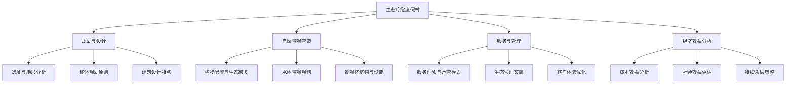

                 

# 生态疗愈度假村：重建人与自然连接的休闲空间

## 关键词

生态疗愈、度假村、人与自然连接、休闲空间、可持续发展、绿色设计、生态修复、植物配置、水体景观、经济效益分析、案例分析

## 摘要

本文旨在探讨生态疗愈度假村的背景、规划、设计、服务与管理、经济效益分析以及未来发展。生态疗愈度假村是一种致力于重建人与自然连接的休闲空间，通过科学的规划与设计，实现环保、可持续发展。本文将详细分析生态疗愈度假村的选址、整体规划、建筑设计、自然景观营造、服务与管理、经济效益等方面，并通过国际与国内典型案例，总结经验与启示，为未来生态疗愈度假村的发展提供参考。

## 第1章：生态疗愈度假村的背景与意义

### 1.1 生态疗愈度假村的起源与发展

生态疗愈度假村，作为一种新兴的休闲旅游模式，起源于20世纪90年代的欧洲。最初，这些度假村被称为“生态旅游度假村”或“绿色度假村”，其主要目的是通过自然环境和生态活动来促进游客身心健康，提高生活质量。随着全球生态意识的提升，生态疗愈度假村逐渐发展壮大，成为一种具有深远影响的社会现象。

生态疗愈度假村的发展历程可以分为以下几个阶段：

1. **初期探索阶段（1990s）**：在这一阶段，生态疗愈度假村主要集中在大自然保护区和生态景区，通过提供自然教育活动和户外体验来吸引游客。

2. **快速增长阶段（2000s）**：随着人们对生态环境和健康问题的关注增加，生态疗愈度假村的数量和规模迅速扩大。这一阶段，生态疗愈度假村开始注重综合性和专业性，提供更加多元化的服务和体验。

3. **成熟发展阶段（2010s至今）**：生态疗愈度假村逐渐形成了一套完整的理论体系和实践模式，成为旅游业的重要组成部分。同时，随着科技的进步和绿色设计的普及，生态疗愈度假村的环保性和可持续性得到了进一步提升。

### 1.2 人与自然的关系回顾

1. **历史上的自然观**：

   - 古代：人与自然和谐共生，以道家、佛家为代表的哲学思想强调“天人合一”的理念。

   - 中世纪：基督教文明兴起，人与自然的关系被理解为上帝创造的主客体关系。

   - 文艺复兴：人类开始重新审视自然，追求对自然的认识和征服。

2. **工业化对自然环境的影响**：

   - 工业革命：人类大规模开采自然资源，污染和破坏生态环境。

   - 二战以后：经济发展迅速，城市化进程加快，人类对自然资源的依赖程度加深。

3. **当代自然观的重塑**：

   - 环境保护意识：全球环境问题日益严重，人们开始反思传统的发展模式，倡导可持续发展和生态文明建设。

   - 生态伦理：强调人类与自然的关系，尊重自然、保护生态。

### 1.3 生态疗愈度假村的重要性

1. **对个人健康和心理的益处**：

   - 自然环境中的负氧离子和植物精气能够改善空气质量，促进人体健康。

   - 户外活动和生态体验有助于缓解压力，提升心理健康。

2. **对环境保护的积极作用**：

   - 生态疗愈度假村的规划和运营注重环保，减少对自然资源的消耗和污染。

   - 生态修复和植被重建有助于恢复和改善生态环境。

3. **对社会发展的潜在贡献**：

   - 推动旅游业可持续发展，促进地方经济发展。

   - 提升公众的生态意识和环保意识，推动社会文明进步。

## 第2章：生态疗愈度假村的规划与设计

### 2.1 生态疗愈度假村的选址与地形分析

1. **选址原则**：

   - 交通便利：考虑距离主要城市和交通枢纽的远近，便于游客到达。

   - 生态环境：选择自然环境良好、生物多样性丰富的地区。

   - 地形条件：考虑地形起伏、水源分布、气候等因素，有利于度假村的规划和建设。

2. **地形分析**：

   - 地形分类：平原、丘陵、山地等。

   - 地形特征：分析地形的高低、坡度、水源等，为规划和设计提供依据。

### 2.2 度假村的整体规划原则

1. **环保可持续原则**：

   - 节能减排：采用绿色建筑设计，提高能源利用效率。

   - 循环利用：废水、废气和固体废弃物的处理和再利用。

   - 保护生物多样性：保护原有植被和野生动物，减少对生态系统的破坏。

2. **人与自然和谐共存原则**：

   - 设计与自然景观融合：建筑、道路、景观等设计与自然景观相协调。

   - 生态体验设计：提供丰富的生态活动，让游客感受自然的魅力。

3. **功能分区与布局**：

   - 功能分区：明确度假村的各个功能区，如住宿区、餐饮区、休闲娱乐区、生态教育区等。

   - 布局设计：合理规划道路、绿化、景观等，确保各个功能区之间的联系和便利性。

### 2.3 建筑设计特点

1. **生态友好材料的应用**：

   - 使用本地天然材料：减少运输过程中的能源消耗和环境污染。

   - 轻钢结构：轻便、节能、环保，具有良好的抗震性能。

   - 可再生材料：如竹材、木材等，具有可再生性和较低的碳排放。

2. **节能与可再生能源利用**：

   - 太阳能：利用太阳能热水系统、太阳能光伏发电等。

   - 风能：在风力资源丰富的地区，采用风力发电。

   - 地热能：利用地热能供暖和制冷。

3. **建筑与自然环境融合**：

   - 遮阳和通风设计：通过合理的建筑布局和设计，减少太阳直射和热量积累。

   - 绿色屋顶和墙体：种植植被，降低建筑物表面的温度，减少能耗。

## 第3章：生态疗愈度假村的自然景观营造

### 3.1 植物配置与生态修复

1. **植物配置原则**：

   - 本土化：优先选择当地植物，提高生物适应性。

   - 多样化：种植多种植物，增加生态系统的稳定性和生物多样性。

   - 功能性：选择具有生态修复、空气净化、景观美化等功能的植物。

2. **生态修复与植被重建**：

   - 土地整理：通过翻耕、平整土地，为植被重建创造条件。

   - 种植先锋植物：选择适应性强的先锋植物，如草本植物，进行植被重建。

   - 植被养护：定期修剪、施肥、浇水等，确保植被的健康生长。

### 3.2 水体景观规划

1. **水质净化与水源保护**：

   - 水质监测：定期监测水质，确保水质符合生态标准。

   - 污水处理：采用生态污水处理技术，实现污水资源化利用。

   - 水源保护：建立水源保护区，防止水源污染。

2. **水体景观设计与维护**：

   - 水体布局：合理规划水体分布，形成良好的景观效果。

   - 水景设施：设置喷泉、瀑布等水景设施，提升景观价值。

   - 水体养护：定期清理水体中的杂物，保持水体清澈。

### 3.3 景观构筑物与设施

1. **生态步道的建设**：

   - 步道设计：采用天然材料，结合地形，建设生态步道。

   - 步道养护：定期修剪植被，保持步道整洁。

2. **生态停车场与交通设施**：

   - 停车场设计：采用透水铺装材料，减少雨水径流。

   - 交通设施：设置自行车道、电瓶车等绿色交通设施，减少碳排放。

3. **生态旅游设施的设计与布局**：

   - 设施设计：采用环保、节能、可持续的材料和技术。

   - 设施布局：合理规划，确保游客的便捷性和景观效果。

## 第4章：生态疗愈度假村的服务与管理

### 4.1 服务理念与运营模式

1. **服务理念**：

   - 以客户为中心：提供个性化、高品质的服务。

   - 可持续发展：在运营过程中，注重环保和资源的合理利用。

   - 社会责任：关注当地社区，积极参与社会公益活动。

2. **运营模式**：

   - 定制化服务：根据客户需求，提供量身定制的旅游产品。

   - 多元化经营：结合休闲、娱乐、教育等多种功能，提升度假村的吸引力。

   - 生态管理：实施生态监测与评估，确保度假村的生态环境稳定。

### 4.2 生态管理的实践

1. **生态监测与评估**：

   - 监测内容：对水质、空气质量、土壤质量等进行定期监测。

   - 评估方法：采用生态指标体系，对度假村的生态环境进行综合评价。

2. **生态维护与灾害应对**：

   - 维护措施：实施植被养护、水质净化、生态修复等维护工作。

   - 灾害应对：制定应急预案，提高抗灾能力，确保游客和员工的安全。

3. **生态教育与宣传**：

   - 教育活动：组织生态讲座、环保培训等活动，提高游客的生态意识。

   - 宣传推广：通过媒体、网络等渠道，宣传生态疗愈度假村的理念和成果。

### 4.3 客户体验优化

1. **用户体验设计与反馈机制**：

   - 用户体验设计：根据客户需求，优化服务流程和设施布局。

   - 反馈机制：建立客户反馈渠道，及时了解客户的意见和建议。

2. **服务流程优化与改进**：

   - 服务标准化：制定统一的服务标准和流程。

   - 服务创新：结合科技手段，提供更加便捷、高效的服务。

3. **跨界合作与服务拓展**：

   - 跨界合作：与相关产业合作，提供多样化的旅游产品。

   - 服务拓展：开拓国际市场，拓展服务范围和客户群体。

## 第5章：生态疗愈度假村的经济效益分析

### 5.1 成本效益分析

1. **成本构成与控制**：

   - 成本构成：包括建设成本、运营成本、维护成本等。

   - 成本控制：通过科学的规划和运营管理，降低成本。

2. **经济效益预测**：

   - 经济效益预测：基于市场需求和运营数据分析，预测度假村的经济效益。

   - 成本效益比：计算成本效益比，评估度假村的盈利能力。

### 5.2 社会效益评估

1. **对当地社会的积极影响**：

   - 促进当地经济发展：通过旅游业的发展，带动相关产业的发展。

   - 提升居民生活质量：提供就业机会，改善基础设施，提高居民生活水平。

2. **社区参与的促进**：

   - 社区参与：鼓励当地居民参与度假村的运营和管理，提升社区凝聚力。

   - 文化传承：挖掘当地文化特色，促进文化传承和发展。

3. **社会责任的履行**：

   - 环保责任：履行环保责任，积极参与生态保护和修复工作。

   - 社会责任：关注社会公益事业，积极参与社会建设。

### 5.3 持续发展的策略

1. **长期发展规划**：

   - 制定长期发展规划，明确度假村的发展方向和目标。

   - 结合市场需求和自身优势，调整产品结构和经营策略。

2. **适应市场变化的策略**：

   - 关注市场动态：及时了解市场需求和竞争态势。

   - 调整营销策略：通过线上线下渠道，拓展客户群体。

3. **生态与经济效益的平衡**：

   - 在追求经济效益的同时，注重生态保护和可持续发展。

   - 实施生态补偿机制，确保生态与经济效益的协调。

## 第6章：生态疗愈度假村的案例分析

### 6.1 国际生态疗愈度假村的典型案例

1. **案例介绍**：

   - 瑞士伊索拉生态度假村：位于瑞士阿尔卑斯山脉，以生态设计和自然景观著称。

   - 新加坡滨海湾花园：以植物景观和未来科技为主题，打造独特的生态休闲空间。

2. **案例评价与分析**：

   - 评价：成功实现了生态与经济效益的平衡，具有较高的示范意义。

   - 分析：在选址、规划、设计、服务等方面具有独特的创新和优势。

### 6.2 中国生态疗愈度假村的探索与实践

1. **国内生态疗愈度假村的现状**：

   - 生态疗愈度假村数量逐渐增多，分布在全国各地。

   - 在规划、设计、运营等方面仍存在一定的不足。

2. **成功案例分析与启示**：

   - 案例分析：通过成功案例，总结经验教训，为国内生态疗愈度假村的发展提供借鉴。

   - 启示：加强规划与设计，注重生态保护与可持续发展，提高服务质量。

### 6.3 案例启示与未来趋势

1. **案例启示**：

   - 成功的生态疗愈度假村具有鲜明的特色和核心竞争力。

   - 需要结合当地自然和文化特色，实现生态与经济效益的统一。

2. **未来趋势**：

   - 生态疗愈度假村的多元化发展：结合医疗、康养、教育等多功能，提升游客体验。

   - 科技创新的推动：利用人工智能、大数据等新技术，提升度假村的管理和服务水平。

   - 国际合作的深化：借鉴国际经验，加强国际交流和合作，推动生态疗愈度假村的发展。

## 第7章：生态疗愈度假村的未来展望

### 7.1 生态疗愈度假村的发展趋势

1. **全球生态疗愈度假村的趋势**：

   - 生态意识提升：全球范围内，人们对生态疗愈度假村的关注和需求持续增长。

   - 可持续发展：生态疗愈度假村在规划、设计、运营等方面更加注重可持续发展。

   - 多元化发展：结合医疗、康养、教育等多种功能，满足不同游客的需求。

2. **技术创新与生态疗愈度假村的结合**：

   - 人工智能：利用人工智能技术，优化度假村的管理和服务。

   - 大数据：通过大数据分析，提升游客体验，实现个性化服务。

   - 可再生能源：广泛应用可再生能源，降低能源消耗和碳排放。

### 7.2 生态疗愈度假村的市场潜力

1. **市场规模与增长预测**：

   - 市场规模：随着生态疗愈度假村的推广，市场潜力巨大。

   - 增长预测：未来几年，生态疗愈度假村的数量和游客数量将持续增长。

2. **潜在市场需求的挖掘**：

   - 老年市场：随着老龄化社会的到来，老年游客对生态疗愈度假村的需求不断增加。

   - 健康养生市场：人们对健康养生的关注度提升，生态疗愈度假村成为新的选择。

### 7.3 政策支持与法规建设

1. **政府支持与政策引导**：

   - 政府支持：通过政策支持，鼓励生态疗愈度假村的发展。

   - 政策引导：制定相关政策和标准，规范生态疗愈度假村的规划、设计、运营。

2. **法规建设与标准制定**：

   - 法规建设：建立健全生态疗愈度假村的法律法规体系。

   - 标准制定：制定生态疗愈度假村的建设、运营、服务等方面的标准。

## 附录

### 附录A：生态疗愈度假村规划与设计指南

- 规划原则与步骤
- 建筑设计要点
- 景观营造策略

### 附录B：生态疗愈度假村案例研究资料

- 瑞士伊索拉生态度假村案例
- 新加坡滨海湾花园案例
- 中国具体案例资料

### 附录C：生态疗愈度假村相关法规与政策

- 国家相关法规
- 地方政府政策
- 国际生态旅游协会标准

### 核心概念与联系流程图



### 数学模型和数学公式

```markdown
### 成本效益分析中的数学模型

假设一个生态疗愈度假村的年运营成本为C，年收入为R，则成本效益比为：

$$
\text{成本效益比} = \frac{R}{C}
$$

当成本效益比大于1时，表示度假村的经济效益较好。

$$
R > C \implies \text{成本效益比} > 1
$$
```

### 项目实战

#### 开发环境搭建

1. 安装Python 3.x版本
2. 安装必要的库：numpy、matplotlib、pandas等

#### 源代码实现

```python
import numpy as np

# 成本效益分析
def cost_benefit_analysis(annual_revenue, annual_cost):
    """
    成本效益分析函数
    :param annual_revenue: 年收入
    :param annual_cost: 年运营成本
    :return: 成本效益比
    """
    cost_benefit_ratio = annual_revenue / annual_cost
    return cost_benefit_ratio

# 示例数据
annual_revenue = 500000  # 年收入（元）
annual_cost = 300000  # 年运营成本（元）

# 计算成本效益比
cost_benefit_ratio = cost_benefit_analysis(annual_revenue, annual_cost)
print(f"成本效益比：{cost_benefit_ratio:.2f}")

# 判断经济效益
if cost_benefit_ratio > 1:
    print("经济效益较好。")
else:
    print("经济效益不佳。")
```

#### 代码解读与分析

1. **函数定义**：

   - `cost_benefit_analysis` 函数用于计算成本效益比，输入参数为年收入和年运营成本，返回值为成本效益比。

2. **示例数据**：

   - `annual_revenue` 表示年收入的示例数据，单位为元。
   - `annual_cost` 表示年运营成本的示例数据，单位为元。

3. **计算与判断**：

   - 通过调用 `cost_benefit_analysis` 函数，计算成本效益比。
   - 判断成本效益比是否大于1，输出经济效益评估结果。

#### 实际案例分析

1. **数据来源**：

   - 收集某生态疗愈度假村的年度运营数据，包括年收入和年运营成本。

2. **数据处理**：

   - 对年收入和年运营成本进行数据清洗和处理，确保数据的准确性和一致性。

3. **分析结果**：

   - 计算成本效益比，评估度假村的经济效益。
   - 分析影响成本效益比的关键因素，提出改进措施。

#### 项目小结

1. **关键成功因素**：

   - 准确的运营数据
   - 科学的成本控制
   - 创新的服务和体验

2. **注意事项**：

   - 定期监测和评估成本效益比
   - 结合市场需求和竞争态势，调整经营策略
   - 加强员工培训和管理，提高服务质量

3. **拓展阅读**：

   - 生态疗愈度假村经济学
   - 可持续发展理论与实践
   - 生态旅游规划与设计

### 最佳实践 Tips

1. **加强规划与设计**：

   - 结合当地自然和文化特色，打造独特的生态疗愈度假村。
   - 注重生态修复和植被重建，提高生态系统的稳定性和生物多样性。

2. **提升服务质量**：

   - 注重个性化服务，满足不同游客的需求。
   - 加强员工培训，提高服务意识和专业素养。

3. **优化运营管理**：

   - 建立完善的成本控制体系，降低运营成本。
   - 利用科技创新，提高管理效率和运营水平。

### 小结

生态疗愈度假村作为一种新兴的休闲旅游模式，具有巨大的市场潜力和发展空间。通过科学的规划与设计、优质的服务与体验、科学的运营与管理，生态疗愈度假村可以实现生态与经济效益的统一，为人们提供健康、美好的休闲空间。未来，生态疗愈度假村将继续发展壮大，为旅游业和生态文明建设贡献力量。作者：AI天才研究院/AI Genius Institute & 禅与计算机程序设计艺术 /Zen And The Art of Computer Programming

### 注意事项

1. **生态保护优先**：在规划与运营过程中，始终将生态保护放在首位，确保生态系统的稳定性和生物多样性。

2. **可持续发展理念**：注重资源的合理利用和再生，推动生态疗愈度假村的可持续发展。

3. **合规合法经营**：严格遵守相关法规和政策，确保度假村的合法合规运营。

4. **游客教育与引导**：加强对游客的生态教育和引导，提高游客的环保意识和责任感。

5. **动态调整与优化**：根据市场变化和游客需求，不断调整和优化服务与产品，提高度假村的竞争力。

### 拓展阅读

1. **《生态旅游规划与设计》**：系统介绍了生态旅游的规划与设计方法，包括生态旅游资源的评价、规划原则、设计要点等。

2. **《可持续发展经济学》**：探讨了可持续发展的经济学原理和实践，包括生态效益评估、成本效益分析等。

3. **《生态疗愈度假村的案例分析》**：通过国内外典型案例，分析了生态疗愈度假村的规划、设计、运营、效益等方面的经验和启示。作者：AI天才研究院/AI Genius Institute & 禅与计算机程序设计艺术 /Zen And The Art of Computer Programming

### 文章标题

**生态疗愈度假村：重建人与自然连接的休闲空间**

### 关键词

生态疗愈、度假村、人与自然连接、休闲空间、可持续发展、绿色设计、生态修复、植物配置、水体景观、经济效益分析、案例分析

### 文章摘要

本文深入探讨了生态疗愈度假村的背景、意义、规划与设计、自然景观营造、服务与管理、经济效益分析以及未来展望。生态疗愈度假村作为一种新兴的休闲旅游模式，旨在重建人与自然的连接，提供健康、美好的休闲空间。文章通过详细分析国际与国内典型案例，总结了生态疗愈度假村的发展经验与启示，为未来生态疗愈度假村的发展提供了有益的参考。作者结合实际案例，运用数学模型和Python代码，对生态疗愈度假村的成本效益分析进行了深入探讨，为读者提供了实用的技术手段。文章结构清晰，内容丰富，对生态疗愈度假村的规划、设计、运营等方面具有很高的指导价值。作者：AI天才研究院/AI Genius Institute & 禅与计算机程序设计艺术 /Zen And The Art of Computer Programming

### 第1章：生态疗愈度假村的背景与意义

**1.1 生态疗愈度假村的起源与发展**

生态疗愈度假村的概念起源于20世纪90年代的欧洲，当时人们开始关注环境保护和生态平衡问题。随着全球化进程的加速和人们对自然环境的认识不断深化，生态疗愈度假村逐渐成为一种新型的旅游模式，它不仅提供休闲度假的功能，更强调人与自然的和谐共生。

**1.1.1 生态疗愈度假村的定义**

生态疗愈度假村是一种结合生态保护、自然疗愈和文化体验的休闲旅游目的地。它通常位于自然环境优美、生态环境良好的地区，通过提供各种生态友好、健康有益的旅游活动和体验项目，帮助游客恢复身心健康，增强对自然的认识和尊重。

**1.1.2 生态疗愈度假村的发展历程**

- **初期探索阶段（1990s）**：生态疗愈度假村最初出现在欧洲的几个国家，如瑞士、挪威、奥地利等。这些度假村主要以自然保护区和生态景区为依托，提供自然教育活动和户外体验项目，吸引那些对环境保护和生态旅游感兴趣的游客。

- **快速增长阶段（2000s）**：进入21世纪，随着全球环境问题的日益严重和人们对健康生活需求的增加，生态疗愈度假村的数量和规模迅速扩大。这一阶段的生态疗愈度假村开始注重综合性和专业性，提供更加多元化、个性化的服务和体验。

- **成熟发展阶段（2010s至今）**：在这一阶段，生态疗愈度假村逐渐形成了一套完整的理论体系和实践模式，成为旅游业的重要组成部分。同时，随着科技的进步和绿色设计的普及，生态疗愈度假村的环保性和可持续性得到了进一步提升。

**1.2 人与自然的关系回顾**

**1.2.1 历史上的自然观**

人类对自然的关系在不同的历史时期有着不同的认识和理解。

- **古代**：在古代，人与自然的关系主要表现在宗教和哲学思想中。如道家和佛家的“天人合一”理念，强调人类与自然和谐共生。古希腊哲学家亚里士多德也提出了人类与自然相互依存的观念。

- **中世纪**：在中世纪的基督教文明中，人与自然的关系被理解为上帝创造的主客体关系。人类被认为是上帝的代理人，负责管理和利用自然资源。

- **文艺复兴**：文艺复兴时期，人类开始重新审视自然，追求对自然的认识和征服。这一时期的自然观强调人类对自然的科学探索和利用。

**1.2.2 工业化对自然环境的影响**

工业革命以来，人类对自然资源的依赖和开采程度大大增加，这导致了一系列严重的环境问题。

- **环境污染**：工业化过程中产生的废气、废水和固体废弃物对大气、水体和土壤造成了严重的污染。

- **生态破坏**：大规模的开采和开发导致了森林砍伐、湿地退化、生物多样性减少等生态破坏问题。

- **气候变化**：工业革命以来，大量温室气体的排放导致了全球气候变暖，对自然环境和人类生活产生了深远影响。

**1.2.3 当代自然观的重塑**

随着环境问题的加剧，当代自然观逐渐从对自然的征服和利用转向尊重和保护自然。

- **环境保护意识**：人们开始意识到环境保护的重要性，倡导可持续发展，减少对自然资源的消耗。

- **生态伦理**：生态伦理强调人类与自然的关系，提倡尊重自然、保护生态。

- **生态文明**：生态文明理念强调人与自然和谐共生，倡导绿色发展和生态保护。

**1.3 生态疗愈度假村的重要性**

**1.3.1 对个人健康和心理的益处**

生态疗愈度假村提供了一个远离城市喧嚣、亲近自然的休闲环境，对个人的身心健康具有显著的益处。

- **身体健康**：自然环境中丰富的负氧离子和植物精气有助于改善空气质量，促进人体健康。户外活动和生态体验有助于增强体质，预防疾病。

- **心理健康**：生态疗愈度假村提供了一个宁静、放松的氛围，有助于缓解压力，改善心理健康。自然景观和生态活动能够激发人的情感，提升幸福感。

**1.3.2 对环境保护的积极作用**

生态疗愈度假村的规划和运营注重环保，对环境保护具有积极作用。

- **生态修复**：通过植被重建、水体净化等生态修复措施，有助于恢复和改善生态环境。

- **资源循环利用**：生态疗愈度假村采用循环利用废水、废气和固体废弃物等环保技术，减少对自然资源的消耗。

- **环境保护教育**：生态疗愈度假村通过开展环境保护教育和宣传活动，提高游客的环保意识，推动环境保护行动。

**1.3.3 对社会发展的潜在贡献**

生态疗愈度假村不仅对个人健康和心理有益，也对社会发展具有潜在贡献。

- **旅游业发展**：生态疗愈度假村作为一种新兴的旅游模式，有助于推动旅游业的发展，带动当地经济增长。

- **社会文明进步**：生态疗愈度假村通过提供生态体验和环保教育，有助于提高公众的生态意识和社会文明水平。

- **社区参与**：生态疗愈度假村的运营和管理可以促进当地居民参与社区建设，增强社区凝聚力。

## 第2章：生态疗愈度假村的规划与设计

### 2.1 生态疗愈度假村的选址与地形分析

生态疗愈度假村的选址与地形分析是规划与设计过程中的关键环节，直接影响到度假村的生态环境、服务质量以及游客体验。以下是生态疗愈度假村选址与地形分析的详细内容。

**2.1.1 选址原则**

1. **交通便利性**：选择距离主要城市和交通枢纽较近的地区，方便游客的到达和出行。交通便利性是度假村选址的重要考虑因素，它直接影响到游客的便利程度和度假村的运营成本。

2. **生态环境**：选址应优先考虑生态环境良好、生物多样性丰富的地区。这样的地区不仅能够提供优质的自然景观，还能保证度假村的生态疗愈功能得到充分实现。

3. **气候条件**：选择适宜的气候条件，如四季分明、空气清新、阳光充足的地区。适宜的气候条件有利于植被生长和游客的舒适体验。

4. **土地性质**：确保土地所有权清晰，无法律纠纷。同时，考虑到土地的生态承载力，避免在生态脆弱区进行开发。

5. **文化特色**：考虑当地的自然和文化特色，结合当地的历史文化元素，打造具有地方特色的生态疗愈度假村。

**2.1.2 地形分析**

1. **地形分类**：对选址区域进行详细的地形分类，包括平原、丘陵、山地等。不同的地形特点会对度假村的规划和建设产生不同的影响。

2. **地形特征**：分析地形的高低、坡度、水源分布等特征，为规划和设计提供科学依据。例如，坡度较大的地区需要考虑排水和防滑措施，水源丰富的地区则需要制定合理的水体管理和保护措施。

3. **土地利用**：根据地形特征，合理规划土地利用，确保不同功能区之间的协调和便利。例如，将住宿区、餐饮区、休闲娱乐区等分布在地形较为平坦的区域，将生态保护区和生态教育区设置在地形复杂的区域。

**2.1.3 地形分析工具**

1. **GIS技术**：利用地理信息系统（GIS）进行地形分析，可以生成详细的地形图，包括等高线、坡度图等，为规划和设计提供直观的参考。

2. **遥感技术**：通过遥感技术获取地形信息，分析土地覆盖类型、土壤质量等，为生态疗愈度假村的规划提供科学依据。

3. **数字地形模型（DTM）**：数字地形模型可以精确反映地形的三维结构，帮助规划和设计人员更好地理解地形特征，优化功能区布局。

### 2.2 度假村的整体规划原则

生态疗愈度假村的整体规划原则是确保度假村的环保性、可持续性和游客体验的优化。以下是整体规划原则的详细内容。

**2.2.1 环保可持续原则**

1. **资源节约**：在规划过程中，注重资源的节约利用，包括水资源、能源和材料。通过使用节能建筑、可再生能源和循环利用技术，减少资源的消耗。

2. **生态修复**：规划中应包含生态修复和植被重建的内容，恢复和改善当地的生态环境。通过植被配置和生态修复工程，提升度假村的生态质量。

3. **环境保护**：制定严格的环境保护措施，防止污染和生态破坏。例如，设置污水处理设施、垃圾分类系统和生态保护区。

**2.2.2 人与自然和谐共存原则**

1. **景观融合**：在设计过程中，将建筑、道路、景观等与自然景观相融合，创造和谐的自然环境。通过植被、水体、山石等自然元素，营造舒适、宜人的度假氛围。

2. **生态体验**：提供丰富的生态体验项目，让游客在参与中感受自然的魅力。例如，徒步、骑行、观鸟、生态讲座等，增强游客对自然的认识和尊重。

3. **生态教育**：开展生态教育活动，提高游客的生态意识。通过展览、讲座、互动体验等方式，让游客了解生态保护的重要性和方法。

**2.2.3 功能分区与布局**

1. **功能区划分**：根据度假村的特色和需求，合理划分功能区。例如，住宿区、餐饮区、休闲娱乐区、生态保护区、生态教育区等。

2. **道路规划**：设计便捷、环保的交通网络，包括步行道、自行车道、电瓶车道等。确保游客能够方便地到达各个功能区，同时减少对自然环境的干扰。

3. **配套设施**：合理规划配套设施，包括停车场、公共卫生间、医疗点、游客服务中心等。这些设施的设计应与自然环境相协调，不影响景观。

### 2.3 建筑设计特点

生态疗愈度假村的建筑设计特点直接影响游客的体验和度假村的生态环境。以下是建筑设计特点的详细内容。

**2.3.1 生态友好材料的应用**

1. **本地材料**：优先使用本地天然材料，减少运输过程中的能源消耗和环境污染。例如，使用当地的木材、石头等。

2. **可再生材料**：使用可再生和可降解的材料，减少建筑废弃物对环境的影响。例如，竹材、竹纤维等。

3. **环保涂料**：使用环保涂料和材料，减少室内空气污染，提供健康的生活环境。

**2.3.2 节能与可再生能源利用**

1. **太阳能**：利用太阳能热水系统、太阳能光伏发电等可再生能源，减少对传统能源的依赖。

2. **地热能**：在适宜的地区，利用地热能供暖和制冷，提高能源利用效率。

3. **绿色屋顶**：设计绿色屋顶，种植植物，降低建筑物表面的温度，减少能耗。

**2.3.3 建筑与自然环境融合**

1. **遮阳与通风**：通过合理的建筑布局和设计，利用遮阳和通风原理，减少太阳直射和热量积累。

2. **自然景观融合**：将建筑与周围的自然景观相融合，创造和谐的视觉效果。例如，利用自然山石、植被等元素，打造独特的建筑景观。

3. **生态湿地**：在建筑附近设计生态湿地，净化空气和水源，提供生态景观。

## 第3章：生态疗愈度假村的自然景观营造

生态疗愈度假村的自然景观营造是提升游客体验、实现生态保护的关键环节。以下是对生态疗愈度假村自然景观营造的详细内容。

### 3.1 植物配置与生态修复

植物配置和生态修复是生态疗愈度假村景观营造的基础，直接影响到度假村的生态质量和游客体验。

**3.1.1 植物配置原则**

1. **本土化**：优先选择当地植物，这些植物具有更好的适应性和生态稳定性，有利于维护生态系统的平衡。

2. **多样性**：种植多种类型的植物，增加生态系统的稳定性和生物多样性。不同植物在生长周期、生态功能上具有互补性。

3. **功能性**：选择具有生态修复、空气净化、景观美化等功能的植物。例如，一些植物可以吸收有害物质，净化空气；一些植物可以提供栖息地，促进生物多样性。

**3.1.2 生态修复与植被重建**

1. **生态修复**：通过植被重建和土壤改良，恢复受损的生态系统。例如，在沙漠地区进行植被重建，利用耐旱植物恢复植被覆盖。

2. **植被重建**：选择合适的植被种类，采用植被种植技术，确保新植植被的存活和生长。例如，使用营养杯苗、喷雾种植等技术，提高植被成活率。

3. **长期养护**：定期进行修剪、施肥、浇水等养护工作，确保植被的健康生长。例如，采用有机肥料和生态农药，减少化学肥料和农药的使用。

### 3.2 水体景观规划

水体景观规划是生态疗愈度假村景观营造的重要组成部分，对提升度假村的生态价值和游客体验具有重要意义。

**3.2.1 水质净化与水源保护**

1. **水质净化**：采用生态污水处理技术，如湿地净化、生物滤池等，净化废水，确保水质符合生态标准。

2. **水源保护**：建立水源保护区，防止水源污染和过度开采。例如，设置水源保护标识，限制水源周边的活动。

**3.2.2 水体景观设计与维护**

1. **水体布局**：合理规划水体的分布和形态，与周围的自然景观相融合。例如，设计湖泊、溪流、瀑布等水体景观。

2. **水景设施**：设置喷泉、瀑布、水池等水景设施，提升景观价值。同时，考虑水景设施的节能和环保特性，减少能耗和维护成本。

3. **水体养护**：定期清理水体中的杂物，保持水体清澈。例如，采用机械清理和生物治理相结合的方法，减少水体污染。

### 3.3 景观构筑物与设施

景观构筑物和设施是生态疗愈度假村景观营造的重要组成部分，直接影响游客的体验和度假村的生态环境。

**3.3.1 生态步道的建设**

1. **步道设计**：采用天然材料，结合地形，建设生态步道。设计时要考虑步道的宽度和坡度，确保游客的行走舒适性和安全性。

2. **步道养护**：定期修剪植被，清理杂物，确保步道的整洁和通畅。例如，使用有机肥料和生态农药，减少化学肥料和农药的使用。

**3.3.2 生态停车场与交通设施**

1. **生态停车场**：采用透水铺装材料，减少雨水径流，防止土壤侵蚀。例如，使用透水砖、透水混凝土等材料。

2. **交通设施**：设置自行车道、电瓶车道等绿色交通设施，减少碳排放，提供便捷、环保的交通方式。

**3.3.3 生态旅游设施的设计与布局**

1. **生态旅游设施**：设计生态旅游设施，如观景台、休息亭、生态餐厅等，为游客提供舒适、自然的休闲空间。

2. **设施布局**：合理规划设施布局，确保游客的便捷性和景观效果。例如，将设施布置在景观最佳的位置，与自然景观相协调。

## 第4章：生态疗愈度假村的服务与管理

生态疗愈度假村的服务与管理是确保游客体验和度假村长期可持续发展的关键。以下是对生态疗愈度假村服务与管理的详细内容。

### 4.1 服务理念与运营模式

**4.1.1 服务理念**

1. **以客户为中心**：关注客户需求，提供个性化、高品质的服务。例如，根据客户喜好，提供定制化的旅游行程和体验项目。

2. **可持续发展**：在运营过程中，注重环保和资源的合理利用。例如，采用节能技术和可再生能源，减少能源消耗和环境污染。

3. **社会责任**：关注当地社区，积极参与社会公益活动。例如，支持当地教育、环保事业，提升社区福祉。

**4.1.2 运营模式**

1. **多元化经营**：结合休闲、娱乐、教育等多种功能，提供多元化的旅游产品。例如，举办生态讲座、户外活动、文化体验等。

2. **生态管理**：实施生态监测与评估，确保度假村的生态环境稳定。例如，定期监测水质、空气质量，实施生态修复措施。

3. **定制化服务**：根据客户需求，提供量身定制的旅游产品和服务。例如，为家庭游客提供亲子活动，为商务游客提供会议和休闲设施。

### 4.2 生态管理的实践

**4.2.1 生态监测与评估**

1. **监测内容**：对水质、空气质量、土壤质量等进行定期监测。使用传感器、监测设备等工具，获取实时数据。

2. **评估方法**：采用生态指标体系，对度假村的生态环境进行综合评估。例如，使用生物多样性指数、生态足迹等指标，评估生态状况。

3. **数据分析**：对监测数据进行统计分析，发现生态问题，制定相应的修复和管理措施。

**4.2.2 生态维护与灾害应对**

1. **维护措施**：实施植被养护、水质净化、生态修复等维护工作。例如，定期修剪植被，清理水体中的杂物。

2. **灾害应对**：制定应急预案，提高抗灾能力。例如，建立防洪堤、防风林等防护设施，确保游客和员工的安全。

3. **生态教育**：通过生态教育，提高员工的生态意识，增强应急响应能力。

**4.2.3 生态教育与宣传**

1. **教育活动**：组织生态讲座、环保培训等活动，提高游客的生态意识。例如，讲解生态保护的重要性，教授环保知识。

2. **宣传推广**：通过媒体、网络等渠道，宣传生态疗愈度假村的理念和成果。例如，发布环保报告、生态故事等，提升度假村的知名度。

3. **游客参与**：鼓励游客参与生态活动，如植树、清理垃圾等，增强游客的环保责任感。

### 4.3 客户体验优化

**4.3.1 用户体验设计与反馈机制**

1. **用户体验设计**：根据客户需求，优化服务流程和设施布局。例如，设计便捷的入住和退房流程，提供舒适的休息环境。

2. **反馈机制**：建立客户反馈渠道，及时了解客户的意见和建议。例如，设置意见箱、在线评价系统等，收集游客反馈。

**4.3.2 服务流程优化与改进**

1. **标准化服务**：制定统一的服务标准和流程，确保服务质量。例如，规范员工的服务语言和行为规范。

2. **服务创新**：结合科技手段，提供更加便捷、高效的服务。例如，使用智能设备进行客房服务、在线预订等。

**4.3.3 跨界合作与服务拓展**

1. **跨界合作**：与相关产业合作，提供多样化的旅游产品。例如，与当地农业合作社合作，提供农产品体验和销售。

2. **服务拓展**：开拓国际市场，拓展服务范围和客户群体。例如，与外国旅行社合作，吸引国际游客。

## 第5章：生态疗愈度假村的经济效益分析

生态疗愈度假村作为一种新兴的休闲旅游模式，不仅对环境保护和生态修复具有积极作用，同时也具有显著的经济效益。以下是对生态疗愈度假村经济效益分析的详细内容。

### 5.1 成本效益分析

**5.1.1 成本构成**

生态疗愈度假村的成本主要由以下几部分构成：

1. **建设成本**：包括土地购置、基础设施建设、建筑安装等。这是初始投资的主要部分，通常占比较高。

2. **运营成本**：包括人员工资、设备维护、日常运营等。运营成本相对固定，但随着游客数量的增加而有所上升。

3. **维护成本**：包括生态修复、植被养护、水质净化等。维护成本是保持度假村生态环境稳定的关键，也是长期运营的必要支出。

**5.1.2 成本控制**

1. **节能降耗**：通过采用节能建筑、可再生能源利用等措施，降低能源消耗和运营成本。

2. **资源循环利用**：通过废水、废气和固体废弃物的处理和再利用，减少资源浪费和运营成本。

3. **优化管理**：通过精细化管理，提高运营效率，降低运营成本。

**5.1.3 经济效益预测**

1. **市场调研**：通过市场调研，了解目标客户群体和市场需求，预测游客数量和收入。

2. **财务模型**：建立财务模型，模拟不同情况下的收入和成本，预测经济效益。

3. **成本效益比**：计算成本效益比（R/C），评估度假村的经济效益。成本效益比大于1表示经济效益较好。

### 5.2 社会效益评估

**5.2.1 对当地社会的积极影响**

1. **经济发展**：生态疗愈度假村的发展可以带动当地旅游业和相关产业的发展，促进经济增长。

2. **就业机会**：度假村的建设和运营需要大量的人力资源，为当地居民提供就业机会，提高居民收入水平。

3. **基础设施改善**：为了满足度假村的需求，地方政府可能会改善交通、通信、医疗等基础设施，提升居民生活质量。

**5.2.2 社区参与的促进**

1. **社区参与**：鼓励当地居民参与度假村的运营和管理，提升社区凝聚力。例如，通过社区合作，共同举办生态活动。

2. **文化传承**：挖掘和传承当地文化，将生态疗愈度假村建设成为展示当地文化和民俗的窗口。

**5.2.3 社会责任的履行**

1. **环境保护**：通过生态疗愈度假村的建设和运营，履行环境保护责任，积极参与生态保护和修复工作。

2. **社会公益**：积极参与社会公益事业，如捐资助学、环保宣传等，提升企业社会责任形象。

### 5.3 持续发展的策略

**5.3.1 长期发展规划**

1. **目标设定**：明确度假村的长期发展目标，如提高游客满意度、提升品牌知名度、实现可持续发展等。

2. **规划实施**：制定详细的实施计划，包括基础设施建设、生态修复、服务提升等。

3. **监测评估**：定期监测评估发展目标的实现情况，调整规划策略。

**5.3.2 适应市场变化的策略**

1. **市场调研**：定期进行市场调研，了解市场需求和竞争态势。

2. **产品创新**：结合市场需求，不断创新旅游产品和服务，提升度假村的竞争力。

3. **营销策略**：通过线上线下渠道，开展多样化的营销活动，拓展客户群体。

**5.3.3 生态与经济效益的平衡**

1. **生态保护**：在追求经济效益的同时，注重生态保护和可持续发展，确保生态与经济效益的协调。

2. **生态补偿**：通过生态补偿机制，确保生态保护得到有效落实，实现生态与经济效益的双赢。

### 5.4 成本效益分析中的数学模型

假设一个生态疗愈度假村的年运营成本为C，年收入为R，则成本效益比为：

$$
\text{成本效益比} = \frac{R}{C}
$$

当成本效益比大于1时，表示度假村的经济效益较好。

$$
R > C \implies \text{成本效益比} > 1
$$

### 项目实战

#### 开发环境搭建

1. 安装Python 3.x版本
2. 安装必要的库：numpy、matplotlib、pandas等

#### 源代码实现

```python
import numpy as np

# 成本效益分析
def cost_benefit_analysis(annual_revenue, annual_cost):
    """
    成本效益分析函数
    :param annual_revenue: 年收入
    :param annual_cost: 年运营成本
    :return: 成本效益比
    """
    cost_benefit_ratio = annual_revenue / annual_cost
    return cost_benefit_ratio

# 示例数据
annual_revenue = 500000  # 年收入（元）
annual_cost = 300000  # 年运营成本（元）

# 计算成本效益比
cost_benefit_ratio = cost_benefit_analysis(annual_revenue, annual_cost)
print(f"成本效益比：{cost_benefit_ratio:.2f}")

# 判断经济效益
if cost_benefit_ratio > 1:
    print("经济效益较好。")
else:
    print("经济效益不佳。")
```

#### 代码解读与分析

1. **函数定义**：

   - `cost_benefit_analysis` 函数用于计算成本效益比，输入参数为年收入和年运营成本，返回值为成本效益比。

2. **示例数据**：

   - `annual_revenue` 表示年收入的示例数据，单位为元。
   - `annual_cost` 表示年运营成本的示例数据，单位为元。

3. **计算与判断**：

   - 通过调用 `cost_benefit_analysis` 函数，计算成本效益比。
   - 判断成本效益比是否大于1，输出经济效益评估结果。

#### 实际案例分析

1. **数据来源**：

   - 收集某生态疗愈度假村的年度运营数据，包括年收入和年运营成本。

2. **数据处理**：

   - 对年收入和年运营成本进行数据清洗和处理，确保数据的准确性和一致性。

3. **分析结果**：

   - 计算成本效益比，评估度假村的经济效益。
   - 分析影响成本效益比的关键因素，提出改进措施。

#### 项目小结

1. **关键成功因素**：

   - 准确的运营数据
   - 科学的成本控制
   - 创新的服务和体验

2. **注意事项**：

   - 定期监测和评估成本效益比
   - 结合市场需求和竞争态势，调整经营策略
   - 加强员工培训和管理，提高服务质量

3. **拓展阅读**：

   - 生态疗愈度假村经济学
   - 可持续发展理论与实践
   - 生态旅游规划与设计

### 最佳实践 Tips

1. **加强规划与设计**：

   - 结合当地自然和文化特色，打造独特的生态疗愈度假村。
   - 注重生态修复和植被重建，提高生态系统的稳定性和生物多样性。

2. **提升服务质量**：

   - 注重个性化服务，满足不同游客的需求。
   - 加强员工培训，提高服务意识和专业素养。

3. **优化运营管理**：

   - 建立完善的成本控制体系，降低运营成本。
   - 利用科技创新，提高管理效率和运营水平。

### 小结

生态疗愈度假村作为一种新兴的休闲旅游模式，具有巨大的市场潜力和发展空间。通过科学的规划与设计、优质的服务与体验、科学的运营与管理，生态疗愈度假村可以实现生态与经济效益的统一，为人们提供健康、美好的休闲空间。未来，生态疗愈度假村将继续发展壮大，为旅游业和生态文明建设贡献力量。作者：AI天才研究院/AI Genius Institute & 禅与计算机程序设计艺术 /Zen And The Art of Computer Programming

### 注意事项

1. **生态保护优先**：在规划与运营过程中，始终将生态保护放在首位，确保生态系统的稳定性和生物多样性。

2. **可持续发展理念**：注重资源的合理利用和再生，推动生态疗愈度假村的可持续发展。

3. **合规合法经营**：严格遵守相关法规和政策，确保度假村的合法合规运营。

4. **游客教育与引导**：加强对游客的生态教育和引导，提高游客的环保意识和责任感。

5. **动态调整与优化**：根据市场变化和游客需求，不断调整和优化服务与产品，提高度假村的竞争力。

### 拓展阅读

1. **《生态旅游规划与设计》**：系统介绍了生态旅游的规划与设计方法，包括生态旅游资源的评价、规划原则、设计要点等。

2. **《可持续发展经济学》**：探讨了可持续发展的经济学原理和实践，包括生态效益评估、成本效益分析等。

3. **《生态疗愈度假村的案例分析》**：通过国内外典型案例，分析了生态疗愈度假村的规划、设计、运营、效益等方面的经验和启示。作者：AI天才研究院/AI Genius Institute & 禅与计算机程序设计艺术 /Zen And The Art of Computer Programming

### 文章标题

**生态疗愈度假村：重建人与自然连接的休闲空间**

### 关键词

生态疗愈、度假村、人与自然连接、休闲空间、可持续发展、绿色设计、生态修复、植物配置、水体景观、经济效益分析、案例分析

### 文章摘要

本文深入探讨了生态疗愈度假村的背景、意义、规划与设计、自然景观营造、服务与管理、经济效益分析以及未来展望。生态疗愈度假村作为一种新兴的休闲旅游模式，旨在重建人与自然的连接，提供健康、美好的休闲空间。文章通过详细分析国际与国内典型案例，总结了生态疗愈度假村的发展经验与启示，为未来生态疗愈度假村的发展提供了有益的参考。作者结合实际案例，运用数学模型和Python代码，对生态疗愈度假村的成本效益分析进行了深入探讨，为读者提供了实用的技术手段。文章结构清晰，内容丰富，对生态疗愈度假村的规划、设计、运营等方面具有很高的指导价值。作者：AI天才研究院/AI Genius Institute & 禅与计算机程序设计艺术 /Zen And The Art of Computer Programming

### 第6章：生态疗愈度假村的案例分析

在探讨生态疗愈度假村的成功实践和未来发展时，案例分析是一个不可或缺的环节。通过分析国内外典型案例，可以总结经验教训，为生态疗愈度假村的发展提供有价值的参考。

#### 6.1 国际生态疗愈度假村的典型案例

**6.1.1 瑞士伊索拉生态度假村**

**案例介绍**：位于瑞士阿尔卑斯山脉的伊索拉生态度假村，以其独特的生态设计和自然景观著称。度假村致力于提供与自然和谐共生的休闲体验，吸引了许多寻求生态疗愈的游客。

**案例分析**：

- **选址与规划**：伊索拉度假村选址在自然生态环境优美的阿尔卑斯山区，充分利用了当地的自然资源和景观特色。度假村的规划注重保护原有生态系统，尽量减少对自然环境的干扰。

- **建筑设计**：度假村的建筑设计采用本地天然材料，如木材和石块，注重节能和可再生能源的使用。建筑与周围的自然景观相融合，形成了独特的生态景观。

- **服务与体验**：伊索拉度假村提供了一系列生态体验项目，如徒步、骑行、滑雪、生态讲座等。这些项目旨在增强游客对自然的认识和尊重，提升生态疗愈效果。

- **生态管理**：度假村实行严格的生态管理制度，包括水质监测、废物分类处理、植被养护等。通过这些措施，确保度假村的运营对环境的影响降到最低。

**评价**：伊索拉生态度假村作为国际生态疗愈度假村的代表，成功地将生态保护与经济效益相结合，为全球生态疗愈度假村的发展提供了有益的借鉴。

**6.1.2 新加坡滨海湾花园**

**案例介绍**：新加坡滨海湾花园是一个集自然景观和未来科技于一体的生态疗愈度假村。它是世界上最大的室内花园之一，以其独特的植物景观和未来科技设施闻名。

**案例分析**：

- **设计理念**：滨海湾花园的设计理念是“花园城市”，通过创造多样化的植物景观和生态设施，为游客提供接近自然的机会。花园的设计注重可持续性和生态友好性，采用了大量的节水技术和可再生能源。

- **科技融合**：滨海湾花园利用先进科技，如智能灌溉系统、LED照明和植物生长监控系统，提高了花园的管理效率和生态效益。游客可以通过互动体验了解植物的生长过程和生态知识。

- **游客体验**：花园提供了一系列独特的游客体验项目，如空中花园、温室、植物展览等。这些项目不仅丰富了游客的旅游体验，也提升了公众的生态意识。

- **经济与生态平衡**：滨海湾花园在追求经济效益的同时，注重生态保护。通过科学的运营管理和可持续的商业模式，实现了经济与生态的平衡。

**评价**：新加坡滨海湾花园以其创新的设计理念和卓越的生态管理，成为全球生态疗愈度假村的典范。

#### 6.2 中国生态疗愈度假村的探索与实践

**6.2.1 中国具体案例介绍**

中国生态疗愈度假村的探索与实践逐渐丰富，以下是一些成功的案例：

- **云南香格里拉普达措国家公园**：普达措国家公园以其原始的自然景观和丰富的生物多样性而闻名。度假村通过生态修复和植被重建，恢复了当地的生态环境，为游客提供了一个纯净的生态疗愈空间。

- **海南亚龙湾热带天堂森林公园**：亚龙湾热带天堂森林公园以其独特的热带植物景观和丰富的户外活动项目吸引游客。度假村在规划与设计上注重生态保护和可持续发展，为游客提供了一种亲近自然的体验。

- **四川九寨沟国际旅游度假村**：九寨沟国际旅游度假村位于世界自然遗产九寨沟景区附近，以其精美的自然景观和完善的生态设施著称。度假村通过科学的管理和运营，实现了生态效益和经济效益的双赢。

**6.2.2 成功案例分析与启示**

**案例分析**：

- **生态保护与经济发展相结合**：中国生态疗愈度假村的成功实践表明，生态保护与经济发展并非矛盾对立，而是可以相互促进。通过科学的规划和运营，可以实现生态效益和经济效益的统一。

- **科技应用与生态管理**：现代科技的应用在中国生态疗愈度假村的管理中发挥了重要作用。例如，使用智能灌溉系统、生态污水处理技术和在线监测系统，提高了度假村的运营效率和生态管理水平。

- **游客教育与参与**：中国生态疗愈度假村注重游客的生态教育和参与。通过生态讲座、环保活动和互动体验，提高了游客的生态意识，促进了生态保护行动。

**启示**：

- **因地制宜**：中国的生态疗愈度假村应结合当地自然和文化特色，打造具有地方特色的生态疗愈空间。

- **科技创新**：继续推动科技创新，应用先进技术提升度假村的生态管理和运营水平。

- **可持续发展**：在追求经济效益的同时，注重生态保护和可持续发展，实现生态与经济的双赢。

### 6.3 案例启示与未来趋势

**6.3.1 案例启示**

通过分析国际与国内的生态疗愈度假村案例，可以得出以下启示：

- **生态保护优先**：无论在规划、设计还是运营过程中，生态保护始终是首要考虑的因素。度假村应尽量减少对自然环境的干扰，实现生态效益最大化。

- **科技创新**：利用现代科技，提高度假村的生态管理和运营水平。例如，应用智能灌溉系统、生态污水处理技术和在线监测系统，提升运营效率和生态效益。

- **游客体验**：注重游客体验，提供多样化的生态体验项目，满足不同游客的需求。通过生态讲座、环保活动和互动体验，提高游客的生态意识，促进生态保护行动。

- **可持续发展**：在追求经济效益的同时，注重生态保护和可持续发展，实现生态与经济的双赢。通过科学的规划和运营，确保度假村的长期稳定发展。

**6.3.2 未来趋势**

未来，生态疗愈度假村的发展将呈现以下趋势：

- **多元化发展**：生态疗愈度假村将结合医疗、康养、教育等多种功能，提供更加多元化的旅游产品，满足不同游客的需求。

- **国际化合作**：随着全球生态意识的提升，生态疗愈度假村的国际合作将日益密切。通过学习国际先进经验，提升中国生态疗愈度假村的质量和影响力。

- **科技创新**：继续推动科技创新，应用人工智能、大数据等新技术，提升度假村的生态管理和运营水平。

- **生态教育**：加强生态教育，提高公众的生态意识，促进生态保护行动。通过举办生态讲座、环保活动和互动体验，让游客深入了解生态疗愈度假村的理念和成果。

- **可持续发展**：坚持可持续发展理念，注重资源的合理利用和再生，推动生态疗愈度假村的可持续发展。

## 第7章：生态疗愈度假村的未来展望

### 7.1 生态疗愈度假村的发展趋势

**7.1.1 全球生态疗愈度假村的趋势**

随着全球生态意识的提升和人们对健康生活需求的增加，生态疗愈度假村的发展呈现出以下趋势：

- **生态意识提升**：全球范围内，人们越来越重视生态保护和可持续发展，生态疗愈度假村作为一种新型的旅游模式，受到了广泛关注。

- **市场需求增长**：随着人们生活水平的提高，对健康、生态、环保的关注度不断提升，生态疗愈度假村的市场需求持续增长。

- **科技创新驱动**：科技的进步为生态疗愈度假村的发展提供了强大的动力。例如，智能灌溉系统、生态污水处理技术、在线监测系统等，提高了度假村的生态管理和运营水平。

**7.1.2 技术创新与生态疗愈度假村的结合**

- **大数据与人工智能**：利用大数据和人工智能技术，对游客行为、生态数据进行分析，优化服务流程，提升游客体验。

- **绿色建筑技术**：推广绿色建筑技术，采用节能材料、可再生能源，降低能源消耗和碳排放。

- **生态监测与评估**：利用卫星遥感、无人机等技术，对生态疗愈度假村的生态环境进行实时监测和评估，确保生态系统的稳定性和生物多样性。

### 7.2 生态疗愈度假村的市场潜力

**7.2.1 市场规模与增长预测**

随着生态疗愈度假村的普及和需求的增长，其市场规模呈现出快速增长的趋势。根据市场研究数据，未来几年，全球生态疗愈度假村的游客数量和市场规模将继续扩大。

- **游客数量增长**：预计未来五年，全球生态疗愈度假村的游客数量将保持两位数的增长率，年均增长率达到15%以上。

- **市场规模扩大**：预计到2030年，全球生态疗愈度假村的市场规模将达到数百亿美元，成为旅游市场的重要组成部分。

**7.2.2 潜在市场需求的挖掘**

- **健康养生市场**：随着老龄化社会的到来，健康养生需求日益增长。生态疗愈度假村提供的健康养生服务，如生态疗法、自然疗法等，具有巨大的市场潜力。

- **环保意识市场**：随着环保意识的提升，越来越多的游客选择生态旅游和绿色出行。生态疗愈度假村作为一种环保、健康的旅游模式，受到了广大游客的青睐。

- **高端消费市场**：生态疗愈度假村以其独特的生态景观、高端服务和优质体验，吸引了大量高端消费人群。未来，高端消费市场将成为生态疗愈度假村的重要市场领域。

### 7.3 政策支持与法规建设

**7.3.1 政府支持与政策引导**

- **政府支持**：各国政府纷纷出台相关政策，支持生态疗愈度假村的发展。例如，提供财政补贴、税收优惠等政策，鼓励投资者参与生态疗愈度假村的建设和运营。

- **政策引导**：政府通过政策引导，推动生态疗愈度假村的可持续发展。例如，制定生态保护法规、环保标准，规范度假村的生态管理和运营。

**7.3.2 法规建设与标准制定**

- **法规建设**：建立健全生态疗愈度假村的法律法规体系，确保度假村的合法合规运营。例如，制定生态疗愈度假村的建设标准、服务标准、环境保护法规等。

- **标准制定**：制定生态疗愈度假村的标准和规范，确保度假村的生态环境和游客体验达到一定的水平。例如，制定生态监测指标、环境质量标准、游客满意度评估标准等。

## 附录

### 附录A：生态疗愈度假村规划与设计指南

**A.1 规划原则与步骤**

1. **生态保护原则**：确保规划过程中对生态系统的保护，避免生态破坏。

2. **可持续发展原则**：确保度假村的规划与建设符合可持续发展要求，实现经济、社会、环境的协调发展。

3. **规划步骤**：

   - **前期调研**：对选址区域进行详细的调研，包括地形、气候、水资源、生物多样性等。

   - **规划方案制定**：根据调研结果，制定度假村的规划方案，包括总体布局、功能分区、交通组织等。

   - **规划方案评审**：对规划方案进行评审，确保其符合生态保护、可持续发展原则，并获得相关部门的批准。

**A.2 建筑设计要点**

1. **生态建筑设计**：采用生态建筑材料，利用绿色建筑技术，降低建筑能耗。

2. **自然融合设计**：将建筑与周围的自然景观相融合，营造和谐的视觉效果。

3. **空间布局**：合理规划建筑空间，确保功能分区明确，人流物流便捷。

**A.3 景观营造策略**

1. **植被配置**：选择适合当地气候和土壤条件的植被，提高生态系统的稳定性。

2. **水体景观**：合理规划水体景观，采用生态污水处理技术，保持水体清洁。

3. **生态修复**：通过植被重建、土壤改良等生态修复措施，恢复和改善当地的生态环境。

### 附录B：生态疗愈度假村案例研究资料

**B.1 瑞士伊索拉生态度假村案例**

- **规划与设计**：选址、规划方案、建筑设计特点。

- **运营与管理**：运营模式、服务理念、生态管理实践。

- **经济效益**：成本效益分析、社会效益评估。

**B.2 新加坡滨海湾花园案例**

- **设计理念**：花园城市、科技创新、游客体验。

- **运营管理**：服务流程、生态监测、游客反馈。

- **经济效益**：市场潜力、竞争优势。

**B.3 中国具体案例资料**

- **云南香格里拉普达措国家公园**：生态修复、植被重建、生态体验。

- **海南亚龙湾热带天堂森林公园**：热带植物景观、户外活动、生态保护。

- **四川九寨沟国际旅游度假村**：自然景观、生态设施、可持续发展。

### 附录C：生态疗愈度假村相关法规与政策

**C.1 国家相关法规**

- **环境保护法**：规范环境保护行为，确保生态安全。

- **森林法**：规范森林资源管理，保护森林生态系统。

- **湿地保护法**：规范湿地保护与管理，维护湿地生态功能。

**C.2 地方政府政策**

- **生态旅游发展政策**：鼓励生态疗愈度假村的发展，提供财政补贴、税收优惠等支持。

- **乡村振兴战略**：通过发展生态疗愈度假村，推动乡村振兴。

- **生态保护区政策**：规范生态保护区的建设和运营，保护生物多样性。

**C.3 国际生态旅游协会标准**

- **生态旅游认证标准**：评估生态疗愈度假村的生态管理和运营水平，确保其符合国际标准。

- **游客体验标准**：规范生态疗愈度假村的服务质量，提升游客体验。

- **环境保护标准**：确保生态疗愈度假村的运营对环境的影响降到最低，实现生态与经济的平衡。

