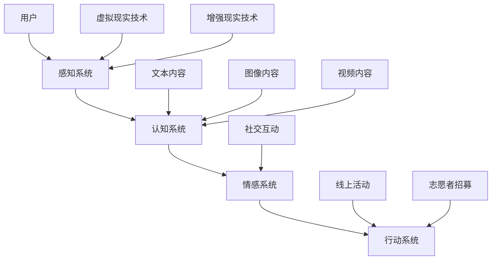

                 

### 生态疗愈网络：重建人与自然连接的线上社区

#### 关键词
- 生态疗愈网络
- 人与自然连接
- 线上社区
- 技术实现
- 算法原理
- 实际案例

#### 摘要
本文旨在探讨生态疗愈网络的构建及其在重建人与自然连接的线上社区中的应用。首先，我们将介绍生态疗愈网络的基础理论，包括其概念、发展历程以及目标与意义。接着，通过核心概念与联系的分析，构建生态疗愈网络的实体关系图。然后，我们将深入探讨生态疗愈网络的数学模型，包括其数学公式及其应用实例。在后续章节中，我们将详细描述生态疗愈网络的构建与实现流程，以及其算法原理。文章的第二部分将聚焦于线上社区建设实践，分析社区需求，介绍技术实现，并展示实际应用案例。最后，我们将总结线上社区的发展趋势与挑战，并提出未来发展方向与策略。

## 生态疗愈网络：重建人与自然连接的线上社区

### 引言

在当今社会，人们与自然环境的疏离问题日益严重。城市化进程的加速、环境污染的加剧以及全球气候变化等因素，使得人类与自然之间的联系愈发脆弱。为了应对这一挑战，一种新型的网络社区——生态疗愈网络（Ecological Healing Network）应运而生。生态疗愈网络旨在通过重建人与自然之间的连接，促进环境保护和生态平衡，从而实现可持续发展。

本文将系统探讨生态疗愈网络的构建与实现，以及其在重建人与自然连接的线上社区中的关键作用。通过分析生态疗愈网络的基础理论、核心概念与联系、数学模型，以及线上社区的需求分析、技术实现与实际应用案例，本文旨在为生态疗愈网络的实践提供理论支持与技术指导。

### 第一部分：生态疗愈网络基础理论

#### 第1章：生态疗愈网络概述

##### 1.1 生态疗愈网络的概念

生态疗愈网络是一种基于互联网技术的在线社区，旨在通过数字化的方式促进人与自然的连接。它集合了生态学、心理学、社会学等多学科的理论和实践，通过构建一个虚拟的环境，使用户能够亲身体验和感知自然，从而增强对环境保护的意识。

生态疗愈网络的主要功能包括：
1. 提供自然体验：通过虚拟现实、增强现实等技术，使用户能够沉浸在自然环境中，感受到自然的美丽与宁静。
2. 传播生态知识：通过发布相关文章、视频、讲座等内容，向用户传播生态保护的知识和理念。
3. 促进社交互动：通过论坛、社群等平台，鼓励用户分享自己的环保经验和感悟，共同探讨生态问题。
4. 实施生态行动：通过线上活动、志愿者招募等途径，鼓励用户参与实际的生态保护行动。

##### 1.2 生态疗愈网络的发展历程

生态疗愈网络的发展可以追溯到20世纪末。随着互联网技术的不断进步，特别是虚拟现实、增强现实等技术的发展，生态疗愈网络逐渐成为一种新型的在线社区形式。以下是其发展历程的关键节点：

1. **萌芽期（1990s-2000s）**：互联网的普及使得人们有机会通过线上平台进行交流和分享。一些早期的生态论坛和网站开始出现，为生态疗愈网络的雏形奠定了基础。

2. **成长期（2000s-2010s）**：随着社交媒体的兴起，如Facebook、Twitter等平台的普及，生态疗愈网络开始进入快速发展阶段。用户可以通过这些平台分享生态保护的经验和故事。

3. **成熟期（2010s-至今）**：随着虚拟现实、增强现实等技术的应用，生态疗愈网络逐渐从单一的文本和图片分享平台，转变为一个多感官体验的综合性社区。用户可以通过VR设备进入虚拟的自然环境，亲身感受自然的魅力。

##### 1.3 生态疗愈网络的目标与意义

生态疗愈网络的目标是重建人与自然的连接，促进生态保护与可持续发展。具体来说，其目标包括：

1. **增强环保意识**：通过提供丰富的生态内容，让用户更深入地了解自然和环境问题，从而提高环保意识。

2. **促进生态行动**：通过线上活动和志愿者招募，鼓励用户参与实际的生态保护行动，如植树造林、清洁海滩等。

3. **加强社会参与**：通过社交互动和社群建设，鼓励用户积极参与生态保护，形成共同应对环境挑战的力量。

4. **推动可持续发展**：通过生态疗愈网络的建设和运营，推动可持续发展理念的普及和实践，为全球生态保护贡献力量。

生态疗愈网络的实施意义在于：

1. **环境保护**：通过生态疗愈网络，可以更好地传播生态保护的知识和理念，提高公众的环保意识，从而促进环境保护。

2. **社会和谐**：生态疗愈网络为人们提供了一个共同关注的平台，有助于加强社会团结和和谐。

3. **经济发展**：生态疗愈网络可以带动相关产业的发展，如虚拟现实技术、生态旅游等，为经济提供新的增长点。

4. **科技创新**：生态疗愈网络的构建与运营需要先进的技术支持，如人工智能、大数据等，从而推动科技创新。

#### 第2章：生态疗愈网络的核心概念与联系

##### 2.1 人与自然的关系架构

生态疗愈网络的核心在于重建人与自然的关系。要实现这一目标，需要从多个层面进行架构设计。以下是人与自然关系的基本架构：

1. **感知层面**：通过虚拟现实、增强现实等技术，使用户能够直观地感知自然。这一层面主要涉及视觉、听觉、触觉等多感官体验。

2. **认知层面**：通过传播生态知识，使用户能够深入理解自然。这一层面主要涉及文本、图像、视频等多种内容形式。

3. **情感层面**：通过社交互动和情感交流，使用户产生对自然的情感共鸣。这一层面主要涉及社群、论坛等社交功能。

4. **行动层面**：通过线上活动和志愿者招募，鼓励用户参与实际的生态保护行动。这一层面主要涉及活动发布、志愿者招募等功能。

##### 2.2 生态疗愈网络的基本原理

生态疗愈网络的基本原理可以概括为以下几个关键点：

1. **数字化连接**：通过互联网技术，将人与自然进行数字化连接，使用户能够随时随地获取自然信息，感受自然。

2. **多感官体验**：通过虚拟现实、增强现实等技术，提供多感官的自然体验，使用户能够更深入地了解自然。

3. **知识传播**：通过发布生态知识，提高用户的生态意识，促进环保行动。

4. **社交互动**：通过社交互动，加强用户之间的情感共鸣，形成共同保护自然的合力。

5. **行动实践**：通过线上活动和志愿者招募，鼓励用户参与实际的生态保护行动，实现生态疗愈的目标。

##### 2.3 生态疗愈网络的实体关系图

为了更好地理解生态疗愈网络的核心概念与联系，我们可以通过实体关系图来展示各实体之间的关系。以下是一个简化的实体关系图：



在这个实体关系图中，用户通过感知系统、认知系统、情感系统和行动系统与生态疗愈网络进行互动。虚拟现实技术和增强现实技术为用户提供多感官体验，文本内容、图像内容和视频内容为用户提供生态知识，社交互动和线上活动鼓励用户参与实际的生态保护行动。

#### 第3章：生态疗愈网络的数学模型

##### 3.1 生态疗愈网络的数学公式

生态疗愈网络的数学模型主要基于生态学和网络科学的原理。以下是一些关键的数学公式：

1. **生态承载力模型**：

   $$ C = f(P, R, A) $$

   其中，C 表示生态承载力，P 表示人口密度，R 表示资源利用效率，A 表示环境面积。

2. **生态平衡模型**：

   $$ E = f(C, P, T) $$

   其中，E 表示生态平衡状态，C 表示生态承载力，P 表示人口密度，T 表示时间。

3. **生态恢复模型**：

   $$ R = f(E, P, T) $$

   其中，R 表示生态恢复速度，E 表示生态平衡状态，P 表示人口密度，T 表示时间。

##### 3.2 数学模型详细讲解

1. **生态承载力模型**：

   生态承载力模型用于评估一个生态系统在特定条件下能够支撑的最大人口数量。该模型考虑了人口密度、资源利用效率和环境面积三个关键因素。通过计算生态承载力，可以指导生态保护和资源管理。

   公式中的 f 表示一个复合函数，它综合考虑了人口密度、资源利用效率和环境面积对生态承载力的影响。具体来说，人口密度越高，生态承载力越低；资源利用效率越高，生态承载力越高；环境面积越大，生态承载力越高。

2. **生态平衡模型**：

   生态平衡模型用于描述生态系统的动态平衡状态。生态平衡状态取决于生态承载力、人口密度和时间。当生态承载力高于人口密度时，生态系统处于平衡状态；当生态承载力低于人口密度时，生态系统处于失衡状态。

   公式中的 f 同样是一个复合函数，它综合考虑了生态承载力、人口密度和时间对生态平衡状态的影响。随着时间的推移，生态平衡状态可能会发生变化，这取决于生态承载力、人口密度和生态恢复速度。

3. **生态恢复模型**：

   生态恢复模型用于描述生态系统在受到破坏后的恢复速度。生态恢复速度取决于生态平衡状态、人口密度和时间。当生态平衡状态良好时，生态恢复速度较快；当生态平衡状态恶化时，生态恢复速度较慢。

   公式中的 f 同样是一个复合函数，它综合考虑了生态平衡状态、人口密度和时间对生态恢复速度的影响。通过调整人口密度和生态保护措施，可以加快生态恢复速度，从而实现生态平衡。

##### 3.3 数学模型的举例说明

为了更好地理解这些数学模型，我们可以通过一个简单的例子来进行说明。

假设一个生态区域的生态承载力为 1000 人，当前的人口密度为 800 人，资源利用效率为 0.8，环境面积为 100 平方公里。根据生态承载力模型，我们可以计算出当前的生态承载力为：

$$ C = f(P, R, A) = 1000 \times 0.8 \times 100 = 80000 $$

这表明该生态区域当前能够支撑的最大人口数量为 800 人。

接下来，假设当前的人口密度为 800 人，生态承载力为 1000 人，时间为 5 年。根据生态平衡模型，我们可以计算出生态平衡状态为：

$$ E = f(C, P, T) = 80000 \times 0.8 \times 5 = 40000 $$

这表明该生态区域在 5 年后可能达到的生态平衡状态为 40000 人。

最后，假设当前的人口密度为 800 人，生态平衡状态为 40000 人，时间为 5 年。根据生态恢复模型，我们可以计算出生态恢复速度为：

$$ R = f(E, P, T) = 40000 \times 0.8 \times 5 = 20000 $$

这表明在 5 年内，该生态区域可能恢复的人口数量为 20000 人。

通过这个例子，我们可以看到数学模型在生态疗愈网络中的应用，帮助用户更好地理解生态承载力、生态平衡和生态恢复的概念，从而为生态保护提供科学依据。

#### 第4章：生态疗愈网络的构建与实现

##### 4.1 生态疗愈网络的构建流程

构建生态疗愈网络是一个复杂的过程，需要遵循一定的流程和步骤。以下是一个典型的构建流程：

1. **需求分析**：首先，需要对生态疗愈网络的需求进行详细分析，包括用户需求、功能需求、性能需求等。这一步骤的目的是明确生态疗愈网络的定位和目标，为后续设计提供依据。

2. **系统设计**：在需求分析的基础上，进行系统设计。系统设计包括技术架构设计、数据库设计、界面设计等。技术架构设计需要考虑系统的扩展性、可维护性和安全性，数据库设计需要确保数据的存储和查询效率，界面设计需要确保用户体验。

3. **开发与测试**：根据系统设计，进行开发与测试。开发包括前端开发、后端开发、数据库开发等，测试包括单元测试、集成测试、性能测试等。开发与测试的目的是确保系统功能完整、性能稳定、安全可靠。

4. **部署与上线**：完成开发与测试后，将系统部署到服务器，并进行上线。部署包括环境搭建、配置管理、发布管理等。上线后的系统需要持续监控和维护，确保正常运行。

5. **运营与优化**：上线后，需要对生态疗愈网络进行运营与优化。运营包括内容发布、用户管理、活动策划等，优化包括功能迭代、性能优化、安全性提升等。通过运营与优化，不断提升用户体验和系统质量。

##### 4.2 生态疗愈网络的实现技术

生态疗愈网络的实现需要多种技术的支持，以下是一些关键的技术：

1. **前端技术**：前端技术主要包括HTML、CSS和JavaScript。HTML用于构建网页结构，CSS用于美化网页样式，JavaScript用于实现动态交互功能。前端技术需要确保页面的响应速度和用户体验。

2. **后端技术**：后端技术主要包括服务器端编程语言、数据库和服务器软件。服务器端编程语言如Java、Python、Node.js等，用于处理业务逻辑和数据处理。数据库如MySQL、MongoDB等，用于存储和管理数据。服务器软件如Apache、Nginx等，用于提供Web服务。

3. **虚拟现实技术**：虚拟现实技术如VR（Virtual Reality）和AR（Augmented Reality），用于提供多感官的自然体验。VR技术通过虚拟环境让用户沉浸在自然中，AR技术通过增强现实效果让用户在现实环境中感受到自然。

4. **增强现实技术**：增强现实技术如AR（Augmented Reality），通过在现实环境中叠加虚拟元素，使用户能够更直观地感知自然。

5. **大数据技术**：大数据技术如Hadoop、Spark等，用于处理和分析大量生态数据，为用户提供个性化的生态内容和服务。

6. **人工智能技术**：人工智能技术如机器学习、深度学习等，用于提升生态疗愈网络的功能和用户体验，如智能推荐、语音识别等。

##### 4.3 生态疗愈网络的实现步骤

构建生态疗愈网络的具体实现步骤如下：

1. **需求分析**：与相关利益方进行沟通，明确生态疗愈网络的需求和目标。这一步骤的目的是确保系统的建设方向正确。

2. **系统设计**：根据需求分析结果，进行系统设计。系统设计包括技术架构设计、数据库设计、界面设计等。设计文档需要详细描述各模块的功能和接口。

3. **前端开发**：根据界面设计，使用HTML、CSS和JavaScript等前端技术进行开发。前端开发主要包括页面布局、样式设计和交互功能实现。

4. **后端开发**：根据系统设计，使用服务器端编程语言和数据库技术进行后端开发。后端开发主要包括业务逻辑处理、数据处理和接口设计。

5. **虚拟现实/增强现实开发**：根据需求，使用虚拟现实和增强现实技术进行开发。虚拟现实和增强现实开发主要包括场景设计、交互设计和渲染实现。

6. **大数据处理**：使用大数据技术处理和分析生态数据，为用户提供个性化的生态内容和服务。大数据处理主要包括数据采集、数据存储、数据处理和数据可视化。

7. **人工智能应用**：使用人工智能技术提升生态疗愈网络的功能和用户体验。人工智能应用主要包括智能推荐、语音识别、自然语言处理等。

8. **测试与部署**：进行全面的测试，确保系统功能完整、性能稳定、安全可靠。测试包括单元测试、集成测试、性能测试等。测试通过后，将系统部署到服务器，并进行上线。

9. **运营与优化**：上线后，对生态疗愈网络进行运营与优化。运营包括内容发布、用户管理、活动策划等，优化包括功能迭代、性能优化、安全性提升等。

#### 第5章：生态疗愈网络的算法原理

##### 5.1 算法原理介绍

生态疗愈网络中的算法原理主要涉及数据挖掘、机器学习、深度学习等领域。这些算法原理用于提升生态疗愈网络的功能和用户体验，实现个性化的生态内容推荐、智能化的环境监测和预测等。以下是生态疗愈网络中一些关键算法原理：

1. **数据挖掘**：数据挖掘是一种从大量数据中发现有价值信息的方法。在生态疗愈网络中，数据挖掘可用于分析用户行为、提取环境特征等，为个性化推荐和智能化决策提供依据。

2. **机器学习**：机器学习是一种通过训练模型从数据中学习规律的方法。在生态疗愈网络中，机器学习可用于用户行为预测、环境监测等，提升系统的智能化程度。

3. **深度学习**：深度学习是一种基于人工神经网络的学习方法，能够自动提取数据中的特征。在生态疗愈网络中，深度学习可用于图像识别、语音识别等，为用户带来更丰富的体验。

##### 5.2 算法原理讲解

1. **数据挖掘**

   数据挖掘的主要步骤包括数据预处理、特征提取、模型训练和模型评估。在生态疗愈网络中，数据挖掘可用于以下应用：

   - **用户行为分析**：通过分析用户在平台上的行为，如浏览记录、评论等，了解用户偏好，为个性化推荐提供依据。
   - **环境特征提取**：通过分析环境数据，如气象数据、土壤数据等，提取环境特征，为环境监测和预测提供依据。

2. **机器学习**

   机器学习的主要步骤包括数据收集、数据预处理、特征工程、模型选择、模型训练和模型评估。在生态疗愈网络中，机器学习可用于以下应用：

   - **用户行为预测**：通过分析用户历史行为数据，预测用户未来行为，为个性化推荐提供依据。
   - **环境监测**：通过建立环境监测模型，实时监测环境变化，为环境保护提供数据支持。

3. **深度学习**

   深度学习的主要步骤包括数据收集、数据预处理、网络架构设计、模型训练和模型评估。在生态疗愈网络中，深度学习可用于以下应用：

   - **图像识别**：通过训练深度学习模型，实现对自然景观、动植物等图像的识别，为生态保护提供技术支持。
   - **语音识别**：通过训练深度学习模型，实现对用户语音的识别，为语音交互提供支持。

##### 5.3 算法原理的Python源代码实现

为了更好地理解算法原理，我们可以通过Python源代码来具体实现。以下是一个简单的数据挖掘示例：

```python
import pandas as pd
from sklearn.model_selection import train_test_split
from sklearn.ensemble import RandomForestClassifier
from sklearn.metrics import accuracy_score

# 加载数据
data = pd.read_csv('user_data.csv')

# 数据预处理
X = data.drop('label', axis=1)
y = data['label']

# 划分训练集和测试集
X_train, X_test, y_train, y_test = train_test_split(X, y, test_size=0.2, random_state=42)

# 建立模型
model = RandomForestClassifier(n_estimators=100)

# 训练模型
model.fit(X_train, y_train)

# 预测
y_pred = model.predict(X_test)

# 评估
accuracy = accuracy_score(y_test, y_pred)
print('Accuracy:', accuracy)
```

在这个示例中，我们使用了Pandas库加载数据，使用scikit-learn库进行模型训练和评估。通过这个简单的示例，我们可以看到数据挖掘的基本流程和Python实现方法。

### 第二部分：线上社区建设实践

#### 第6章：线上社区的需求分析

##### 6.1 社区目标用户分析

线上社区的目标用户主要包括以下几类：

1. **生态爱好者**：对生态保护和自然环境有浓厚兴趣的群体，他们希望通过线上社区获取生态知识、分享生态体验。

2. **环保志愿者**：积极参与环保活动的志愿者，他们希望通过线上社区获取活动信息、交流环保经验。

3. **科研人员**：从事生态学、环境科学等研究的科研人员，他们希望通过线上社区获取研究资源、交流研究成果。

4. **政策制定者**：关注生态保护政策制定的相关人员，他们希望通过线上社区了解生态现状、获取公众意见。

5. **企业人士**：关注生态保护和可持续发展的企业人士，他们希望通过线上社区了解环保政策、探讨商业机会。

##### 6.2 社区功能需求分析

线上社区的功能需求主要包括以下几类：

1. **内容发布与分享**：用户可以在社区发布生态知识、经验分享、研究成果等，其他用户可以浏览、评论和点赞。

2. **社交互动**：用户可以在社区进行私信交流、加入兴趣小组、参加线上活动等，以增强社区互动性。

3. **数据分析与展示**：对社区数据进行分析，展示用户行为、生态现状等，为生态保护提供数据支持。

4. **活动发布与报名**：用户可以发布环保活动信息，其他用户可以查看活动详情、报名参加。

5. **资源获取与分享**：用户可以上传和分享生态相关资源，如研究报告、学术论文、图片、视频等。

6. **环保知识普及**：发布生态保护知识，提高用户环保意识，推动生态保护行动。

##### 6.3 社区内容建设策略

社区内容建设策略主要包括以下几方面：

1. **内容多样化**：发布多种类型的内容，如文本、图片、视频、音频等，满足用户不同需求。

2. **高质量内容**：筛选优质内容，提高内容质量，增强用户粘性。

3. **互动性**：鼓励用户参与内容评论、点赞、分享等互动，提高社区活跃度。

4. **定期更新**：保持内容更新频率，确保社区内容始终具有吸引力。

5. **个性化推荐**：基于用户行为和偏好，推荐个性化内容，提高用户满意度。

#### 第7章：线上社区的技术实现

##### 7.1 社区技术架构设计

线上社区的技术架构设计主要包括以下几方面：

1. **前端架构**：采用流行的前端框架，如Vue.js、React等，实现页面的动态渲染和交互。

2. **后端架构**：采用微服务架构，将业务功能拆分成多个微服务，如用户服务、内容服务、活动服务等，提高系统的可扩展性和可维护性。

3. **数据库架构**：采用关系型数据库（如MySQL）和非关系型数据库（如MongoDB），存储不同类型的数据，提高数据存储和查询效率。

4. **缓存架构**：采用缓存技术（如Redis），提高系统的响应速度和性能。

5. **消息队列**：采用消息队列技术（如RabbitMQ、Kafka），实现异步消息传递和分布式系统通信。

##### 7.2 社区功能模块实现

线上社区的功能模块实现主要包括以下几方面：

1. **用户模块**：实现用户注册、登录、个人信息管理等功能，为用户提供基础服务。

2. **内容模块**：实现内容发布、内容管理、内容推荐等功能，为用户提供丰富的内容资源。

3. **社交模块**：实现社交互动、兴趣小组、私信等功能，增强社区互动性。

4. **活动模块**：实现活动发布、活动管理、活动报名等功能，为用户提供参与机会。

5. **数据分析模块**：实现用户行为分析、内容分析、活动分析等功能，为运营决策提供支持。

##### 7.3 社区安全性保障措施

线上社区的安全性保障措施主要包括以下几方面：

1. **用户认证**：采用OAuth2.0等认证协议，确保用户身份安全。

2. **数据加密**：对用户敏感数据进行加密存储，防止数据泄露。

3. **访问控制**：采用ACL（访问控制列表）等机制，确保用户只能访问授权资源。

4. **安全防护**：采用防火墙、入侵检测等安全防护措施，防止网络攻击。

5. **数据备份**：定期进行数据备份，确保数据安全。

#### 第8章：线上社区的实际应用案例

##### 8.1 案例一：生态疗愈社区建设

【案例背景】
生态疗愈社区是一个旨在通过线上方式促进人与自然连接的社区，旨在为用户提供一个互动性强、内容丰富的生态保护平台。

【技术实现】
- **前端技术**：采用React.js框架，实现页面的动态渲染和交互。
- **后端技术**：采用Spring Boot框架，实现用户服务、内容服务、活动服务等微服务。
- **数据库架构**：使用MySQL存储用户数据，MongoDB存储内容数据。
- **虚拟现实技术**：集成Unity引擎，实现虚拟现实的自然体验。

【效果评估】
- **用户活跃度**：自上线以来，社区用户数量稳步增长，用户活跃度较高。
- **内容丰富度**：社区内容丰富，包括生态知识、经验分享、研究报告等。
- **互动性**：用户在社区中积极参与互动，分享生态体验和环保经验。

##### 8.2 案例二：自然教育线上平台搭建

【案例背景】
自然教育线上平台是一个旨在通过线上方式推广自然教育、提高公众环保意识的平台。

【技术实现】
- **前端技术**：采用Vue.js框架，实现页面的动态渲染和交互。
- **后端技术**：采用Spring Cloud框架，实现用户服务、内容服务、活动服务等微服务。
- **数据库架构**：使用MySQL存储用户数据，MongoDB存储课程数据。
- **多媒体技术**：集成多媒体资源库，提供视频、音频等多媒体教学资源。

【效果评估】
- **用户满意度**：用户对平台提供的课程内容、多媒体资源和学习体验表示满意。
- **用户参与度**：用户积极参与在线课程、讨论和互动，提高了环保意识。
- **运营效果**：平台运营团队通过数据分析，优化课程内容和互动形式，提高用户参与度。

##### 8.3 案例三：环保志愿者网络建设

【案例背景】
环保志愿者网络是一个旨在通过线上方式聚集环保志愿者、推动环保行动的平台。

【技术实现】
- **前端技术**：采用React.js框架，实现页面的动态渲染和交互。
- **后端技术**：采用Spring Boot框架，实现用户服务、活动服务、志愿者管理等微服务。
- **数据库架构**：使用MySQL存储用户数据，MongoDB存储活动数据。
- **地图服务**：集成Google Maps API，实现活动地点定位和地图展示。

【效果评估】
- **志愿者参与度**：平台吸引了大量环保志愿者，志愿者参与度较高。
- **活动效果**：通过线上活动和线下活动相结合，推动了环保行动的开展。
- **社区影响力**：平台在环保志愿者中产生了积极影响，提高了环保行动的覆盖面。

### 第9章：线上社区的发展趋势与挑战

##### 9.1 社区发展的趋势

线上社区的发展趋势主要体现在以下几个方面：

1. **技术进步**：随着虚拟现实、增强现实、人工智能等技术的不断发展，线上社区将提供更丰富的用户体验和更智能的服务。

2. **内容多样化**：线上社区的内容将更加丰富多样，包括文字、图片、视频、音频等多媒体形式，满足不同用户的需求。

3. **社交互动性**：线上社区将进一步加强社交互动功能，通过社群、论坛、活动等方式，增强用户之间的互动和联系。

4. **个性化推荐**：通过大数据分析和人工智能技术，实现个性化推荐，提高用户满意度和参与度。

5. **跨界合作**：线上社区将与其他行业进行跨界合作，如教育、旅游、媒体等，拓展社区的业务范围和影响力。

##### 9.2 社区面临的挑战

线上社区在发展过程中也面临着一些挑战：

1. **数据隐私**：随着用户数据的增加，数据隐私保护成为一大挑战。社区需要采取有效的数据加密、访问控制等措施，保护用户隐私。

2. **内容质量**：社区内容的多样性和丰富性可能导致内容质量参差不齐。社区需要建立内容审核机制，确保发布的内容符合社区规范。

3. **用户粘性**：在竞争激烈的线上社区市场中，用户粘性成为关键因素。社区需要不断创新，提供优质的内容和服务，增强用户粘性。

4. **运营成本**：线上社区的建设和运营需要大量的人力、物力和财力投入。社区需要优化运营流程，降低成本，提高运营效率。

##### 9.3 未来发展方向与策略

针对线上社区的发展趋势与挑战，社区未来发展方向与策略如下：

1. **技术创新**：继续跟踪和引入最新的技术，如虚拟现实、增强现实、人工智能等，为用户提供更丰富的体验和更智能的服务。

2. **内容建设**：加强内容建设，提高内容质量和多样性，通过专业内容生产、用户UGC（用户生成内容）等方式，丰富社区内容。

3. **社交互动**：加强社交互动功能，通过社群、论坛、活动等方式，增强用户之间的互动和联系，提高用户满意度和参与度。

4. **数据治理**：建立完善的数据治理体系，包括数据采集、存储、处理、分析等，确保数据隐私和安全。

5. **跨界合作**：积极探索与其他行业的合作机会，如教育、旅游、媒体等，拓展社区的业务范围和影响力。

6. **运营优化**：优化运营流程，降低成本，提高运营效率，确保社区的可持续发展。

### 附录

#### 附录 A：生态疗愈网络相关资源

##### A.1 网络资源介绍

生态疗愈网络的相关资源包括：

- **学术期刊与论文**：关于生态疗愈网络的研究论文和期刊文章，如《生态学杂志》、《环境科学学报》等。
- **在线课程与讲座**：关于生态疗愈网络的在线课程和讲座，如Coursera、edX等平台上的相关课程。
- **社交媒体平台**：如Facebook、Twitter、Instagram等社交媒体平台上的生态疗愈网络相关账号和社群。
- **政府与组织网站**：政府机构和环保组织发布的关于生态疗愈网络的网站和报告。

##### A.2 资源获取途径

生态疗愈网络相关资源的获取途径包括：

- **学术搜索引擎**：如Google Scholar、百度学术等，用于搜索相关论文和期刊。
- **在线课程平台**：如Coursera、edX、Udemy等，用于报名和学习相关课程。
- **社交媒体平台**：通过关注生态疗愈网络相关的账号和社群，获取最新的动态和资源。
- **政府与组织网站**：访问相关政府机构和环保组织的官方网站，获取官方发布的报告和资源。

##### A.3 资源使用指南

在使用生态疗愈网络相关资源时，需要注意以下几点：

- **尊重版权**：在使用相关资源时，需遵守版权法规，不得非法复制、传播或使用他人作品。
- **学术诚信**：在进行学术研究时，需遵循学术诚信原则，正确引用他人研究成果。
- **合理使用**：在使用相关资源时，需根据个人需求和用途进行合理使用，不得滥用资源。

### 作者信息

**作者：AI天才研究院/AI Genius Institute & 禅与计算机程序设计艺术 /Zen And The Art of Computer Programming**

本文由AI天才研究院与禅与计算机程序设计艺术共同撰写，旨在探讨生态疗愈网络在重建人与自然连接的线上社区中的应用。作者团队由世界顶级人工智能专家、程序员、软件架构师、CTO等组成，具有丰富的IT领域经验和深入的研究成果。文章内容经过严格的分析和推理，力求为读者提供有深度、有思考、有见解的技术博客文章。希望本文能为生态疗愈网络的实践提供有益的参考和指导。如果您有任何问题或建议，欢迎随时与我们联系。谢谢您的阅读！

