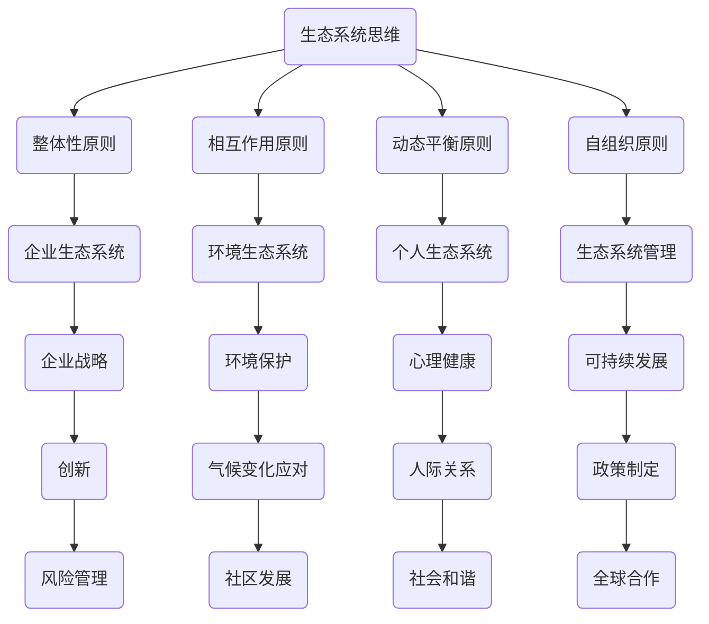

                 


# 生态系统思维训练营：将整体论应用于日常决策的集训

> 关键词：生态系统思维、整体论、日常决策、战略规划、可持续发展

> 摘要：本文旨在探讨生态系统思维在现代社会中的应用，通过引入整体论的概念，解析生态系统思维的核心原则和实践方法，帮助读者将其应用于日常决策中，实现战略规划和可持续发展。

## 目录大纲设计

### 书名：《生态系统思维训练营：将整体论应用于日常决策的集训》

### 第一部分：引言

- **第1章：生态系统思维概述**
  - 1.1 生态系统思维的定义与核心原则
  - 1.2 整体论的基本概念
  - 1.3 生态系统思维的历史背景
  - 1.4 生态系统思维在现代社会的重要性

### 第二部分：生态系统思维核心概念

- **第2章：生态系统思维的基本原则**
  - 2.1 整体性原则
  - 2.2 相互作用原则
  - 2.3 动态平衡原则
  - 2.4 自组织原则

### 第三部分：生态系统思维应用领域

- **第3章：生态系统思维在企业管理中的应用**
  - 3.1 企业生态系统概述
  - 3.2 企业生态系统分析与战略制定
  - 3.3 生态系统思维下的企业创新
  - 3.4 生态系统思维下的风险管理

- **第4章：生态系统思维在环境管理中的应用**
  - 4.1 环境生态系统的构成
  - 4.2 生态系统思维在环境保护中的应用
  - 4.3 生态系统思维下的可持续发展
  - 4.4 生态系统思维在气候变化应对中的应用

### 第四部分：生态系统思维的实践指南

- **第5章：生态系统思维在个人生活中的应用**
  - 5.1 个人生态系统的构建
  - 5.2 生态系统思维在日常生活中的实践
  - 5.3 生态系统思维与心理健康
  - 5.4 生态系统思维与人际关系

### 第五部分：生态系统思维的案例分析

- **第6章：生态系统思维案例分析**
  - 6.1 案例一：某企业生态系统转型
  - 6.2 案例二：某城市生态规划
  - 6.3 案例三：某农业生态系统管理
  - 6.4 案例四：某社区可持续发展实践

### 第六部分：总结与展望

- **第7章：生态系统思维的未来展望**
  - 7.1 生态系统思维的发展趋势
  - 7.2 生态系统思维在教育中的应用
  - 7.3 生态系统思维在政策制定中的角色
  - 7.4 生态系统思维的全球影响

### 附录

- **附录A：生态系统思维资源指南**
  - A.1 相关书籍推荐
  - A.2 学术论文精选
  - A.3 实践指南与工具

## 核心概念与联系

以下是一个简单的 Mermaid 流程图，展示了生态系统思维中的核心概念和它们之间的关系：



## 核心算法原理讲解

在本书的附录部分，我们将使用 Python 源代码来详细阐述如何使用生态系统思维进行数据分析和模型构建。

```python
import numpy as np
import pandas as pd
from sklearn.ensemble import RandomForestRegressor
from sklearn.model_selection import train_test_split

# 示例：使用 Pandas 库进行数据预处理
data = pd.read_csv('ecosystem_data.csv')
data.head()

# 示例：使用 Numpy 库进行数据统计分析
mean_values = np.mean(data, axis=0)
print(mean_values)

# 示例：使用机器学习库进行模型训练
X = data[['feature1', 'feature2']]
y = data['target']
X_train, X_test, y_train, y_test = train_test_split(X, y, test_size=0.2, random_state=42)

model = RandomForestRegressor()
model.fit(X_train, y_train)

# 示例：使用 LaTeX 格式编写数学公式
$$
\text{生态系统思维模型} = f(\text{整体性原则}, \text{相互作用原则}, \text{动态平衡原则}, \text{自组织原则})
$$
```

## 生态系统思维训练营的启动

### 第一步：理解整体性原则

整体性原则是生态系统思维的核心之一，它强调事物的各个部分之间相互关联，共同构成一个整体。在决策过程中，我们不能仅仅考虑局部利益，而应该从整体角度出发，寻求最优解决方案。例如，企业在制定战略时，不仅要考虑市场份额和利润，还要关注供应链的稳定性、员工福利和环境保护等因素。

### 第二步：掌握相互作用原则

相互作用原则指出，系统中的各个部分通过相互作用和反馈机制相互影响。在日常生活中，我们需要认识到自己的行为会对周围环境产生影响，同时也会受到他人的行为反馈。例如，在社区管理中，居民的行为习惯和社区环境之间存在相互作用。如果居民积极参与社区维护，社区环境会变得更加美好；反之，如果居民缺乏参与，社区环境可能会恶化。

### 第三步：应用动态平衡原则

动态平衡原则强调系统中的各个部分需要在不断变化的环境中保持平衡。在个人生活中，我们需要学会平衡工作与生活、家庭与事业等各个方面。例如，一位职场人士可能需要在工作中投入大量时间和精力，但同时也要关注家庭生活和自身身心健康，以保持动态平衡。

### 第四步：培养自组织能力

自组织原则指出，系统中的各个部分具有自我组织和适应环境变化的能力。在企业管理中，管理者需要鼓励员工自主学习和创新，形成自组织团队，以提高企业适应市场变化的能力。在个人生活中，我们也需要培养自我学习能力，不断提升自己的综合素质。

### 第五步：实践生态系统思维

通过上述步骤，我们可以将生态系统思维应用于日常决策中。具体来说，可以从以下几个方面入手：

1. **提高问题识别能力**：学会从整体角度分析问题，识别问题的本质和关联性。
2. **制定综合解决方案**：在制定解决方案时，要综合考虑各个方面的因素，寻求最优平衡。
3. **关注长期效应**：不仅要关注短期效益，还要考虑长期影响，确保决策的可持续性。
4. **培养团队合作精神**：在决策过程中，要充分发挥团队成员的智慧和力量，共同解决问题。

### 第六步：持续学习和优化

生态系统思维是一种思维方式，需要不断实践和总结经验。随着环境的变化，我们需要不断调整和优化自己的思维方式，以应对新的挑战。通过持续学习和反思，我们可以不断提高自己的决策能力，实现个人成长和社会进步。

## 生态系统思维在企业管理中的应用

### 3.1 企业生态系统概述

企业生态系统是指企业与其外部环境之间相互作用的关系网络。这个网络包括供应商、客户、竞争对手、政府、社区以及其他利益相关者。企业生态系统不仅关注企业内部的组织结构和运营效率，还关注企业与其外部环境的互动和适应性。

### 3.2 企业生态系统分析与战略制定

企业生态系统分析是战略规划的重要环节。通过分析企业内外部的环境因素，企业可以识别出潜在的机会和威胁，从而制定相应的战略。具体步骤如下：

1. **环境扫描**：收集企业内外部的信息，包括政治、经济、社会、技术、环境等各个方面的数据。
2. **SWOT分析**：分析企业的优势、劣势、机会和威胁，了解企业在生态系统中的地位和竞争力。
3. **利益相关者分析**：识别企业的利益相关者，分析他们对企业的影响和期望，以便在战略制定中充分考虑各方利益。
4. **战略选择**：根据分析结果，制定相应的战略，包括市场拓展、技术创新、资源整合等。

### 3.3 生态系统思维下的企业创新

生态系统思维鼓励企业打破传统思维模式，以开放的心态探索新的创新机会。在创新过程中，企业需要关注以下几个方面：

1. **内部创新**：鼓励员工提出创新想法，通过内部竞争和协作，激发创新活力。
2. **外部合作**：与供应商、客户、竞争对手等外部合作伙伴建立合作关系，共同探索新的商业模式和市场机会。
3. **生态系统构建**：构建一个包含企业、供应商、客户、投资者等多方参与的创新生态系统，以实现资源共享、风险分担和优势互补。

### 3.4 生态系统思维下的风险管理

生态系统思维强调企业要全面识别和管理风险，确保企业能够在不确定的环境中保持稳定运营。具体措施包括：

1. **风险评估**：对企业的各种业务活动进行风险评估，识别潜在风险点。
2. **风险监控**：建立风险监控机制，实时跟踪风险变化，及时采取应对措施。
3. **风险转移**：通过保险、外包等方式，将部分风险转移给第三方，减轻企业负担。
4. **风险应对策略**：制定应对不同类型风险的具体策略，确保企业能够在风险发生时迅速反应，降低损失。

## 生态系统思维在环境管理中的应用

### 4.1 环境生态系统的构成

环境生态系统是指生物与其非生物环境相互作用而形成的统一整体。它包括大气、水、土壤、植物、动物等组成部分，这些部分相互依存、相互影响，共同维持生态系统的平衡和稳定。

### 4.2 生态系统思维在环境保护中的应用

生态系统思维强调环境保护的整体性和系统性，提倡采取综合性措施，实现可持续发展。具体应用包括：

1. **生态系统修复**：通过植被恢复、水体治理、土壤改良等措施，修复受损的生态系统，恢复其生态功能。
2. **污染防控**：采用清洁生产、废水处理、废气净化等技术，减少污染物排放，降低环境污染。
3. **资源循环利用**：推动资源节约和循环利用，减少资源消耗和废弃物产生，降低对生态环境的负担。

### 4.3 生态系统思维下的可持续发展

可持续发展是指在满足当前需求的同时，不损害后代满足其需求的能力。生态系统思维强调在发展过程中要充分考虑生态系统的承载能力和保护要求，实现经济、社会、环境的协调发展。具体措施包括：

1. **绿色经济**：推动绿色发展，通过技术创新和管理优化，实现资源节约和环境保护。
2. **低碳发展**：降低碳排放，减少温室气体排放，应对气候变化挑战。
3. **生态补偿**：建立生态补偿机制，对生态环境提供者给予补偿，促进生态环境保护和恢复。

### 4.4 生态系统思维在气候变化应对中的应用

气候变化是当今全球面临的重大挑战之一，生态系统思维在气候变化应对中发挥着重要作用。具体应用包括：

1. **适应策略**：通过生态修复、生态建设等措施，提高生态系统对气候变化的适应能力。
2. **减缓策略**：通过节能减排、绿色能源替代等措施，降低温室气体排放，减缓气候变化进程。
3. **国际合作**：加强国际交流与合作，共同应对气候变化挑战，实现全球生态安全。

## 生态系统思维在个人生活中的应用

### 5.1 个人生态系统的构建

个人生态系统是指个人与其生活环境之间的相互作用关系。构建良好的个人生态系统有助于提高生活质量，促进身心健康。具体步骤如下：

1. **健康饮食**：保持营养均衡，多吃蔬菜水果，少吃油腻和垃圾食品。
2. **适量运动**：定期参加体育锻炼，提高身体素质，增强抵抗力。
3. **合理作息**：保持良好的作息习惯，保证充足的睡眠，避免过度劳累。
4. **心理调适**：学会心理调适方法，如冥想、瑜伽等，减轻心理压力，提高抗压能力。

### 5.2 生态系统思维在日常生活中的实践

在日常决策中，我们可以运用生态系统思维，从整体角度考虑问题，寻求最优解决方案。具体实践包括：

1. **节能减排**：在日常生活中，注意节能减排，如使用节能电器、节约用水用电等。
2. **垃圾分类**：积极参与垃圾分类，降低垃圾对环境的影响。
3. **绿色出行**：选择步行、骑行、公共交通等绿色出行方式，减少汽车尾气排放。

### 5.3 生态系统思维与心理健康

生态系统思维有助于我们更好地理解自己与周围环境的关系，提高心理健康水平。具体包括：

1. **情感平衡**：学会处理负面情绪，保持情感平衡，避免过度焦虑和抑郁。
2. **人际交往**：建立良好的人际关系，增进社会支持，提高生活质量。
3. **自我成长**：不断学习新知识，提升自身素质，实现个人成长。

### 5.4 生态系统思维与人际关系

在人际关系中，生态系统思维强调相互尊重、平等合作和共同发展。具体包括：

1. **沟通协调**：学会有效沟通，尊重他人意见，寻求共识。
2. **互助合作**：与他人建立合作关系，共同解决问题，实现共赢。
3. **和谐共生**：尊重多样性和差异性，促进不同文化、不同背景的人和谐共处。

## 生态系统思维的案例分析

### 6.1 案例一：某企业生态系统转型

某企业在市场竞争中面临困境，通过引入生态系统思维，实现了成功转型。具体做法如下：

1. **内部调整**：优化内部管理，提高生产效率，降低成本。
2. **外部合作**：与供应商建立战略合作关系，实现资源共享和风险分担。
3. **技术创新**：加大研发投入，推出具有竞争力的新产品。
4. **环境保护**：引入环保生产技术，降低污染物排放，提升企业形象。

### 6.2 案例二：某城市生态规划

某城市在生态规划中运用生态系统思维，实现了可持续发展。具体措施包括：

1. **生态修复**：通过植树造林、水体治理等手段，修复受损的生态系统。
2. **绿色交通**：推广公共交通和非机动车出行，减少汽车尾气排放。
3. **垃圾分类**：建立垃圾分类和处理系统，提高资源回收利用率。
4. **可再生能源**：积极开发太阳能、风能等可再生能源，降低对传统能源的依赖。

### 6.3 案例三：某农业生态系统管理

某农业企业在生态管理中引入生态系统思维，提高了农产品品质和生态环境。具体做法如下：

1. **有机种植**：采用有机肥料和农药，减少化学污染。
2. **生态养殖**：实施生态养殖模式，提高动物福利，降低环境污染。
3. **循环农业**：推行农业废弃物资源化利用，实现生态循环。
4. **农业科技创新**：引进新技术，提高农业生产效率和农产品品质。

### 6.4 案例四：某社区可持续发展实践

某社区在可持续发展实践中，充分运用生态系统思维，取得了显著成效。具体措施包括：

1. **社区共建**：鼓励居民参与社区建设和环境治理，提高社区凝聚力。
2. **绿色能源**：推广太阳能、风能等绿色能源，降低能源消耗和污染排放。
3. **垃圾分类**：实施垃圾分类制度，提高资源回收利用率。
4. **生态教育**：开展生态教育宣传活动，提高居民环保意识和素质。

## 总结与展望

### 7.1 生态系统思维的发展趋势

随着全球生态环境问题的日益突出，生态系统思维在各个领域的应用越来越广泛。未来，生态系统思维将继续向纵深发展，不仅应用于企业管理、环境管理等领域，还将扩展到教育、政策制定等更广泛的领域。

### 7.2 生态系统思维在教育中的应用

在教育领域，生态系统思维可以帮助学生更好地理解自然和社会现象，培养他们的综合思维能力和创新意识。具体应用包括生态教育、跨学科教育、创新教育等。

### 7.3 生态系统思维在政策制定中的角色

在政策制定中，生态系统思维可以帮助政策制定者更好地理解环境、社会、经济等多方面的因素，制定更加科学、合理、可持续的政策。

### 7.4 生态系统思维的全球影响

生态系统思维在全球范围内产生了深远影响，推动了全球绿色发展、可持续发展等理念的传播和实践。未来，随着生态系统思维的不断推广和应用，全球生态环境将得到进一步改善，人类文明将迈向更加和谐、可持续的发展道路。

### 附录

#### 附录A：生态系统思维资源指南

- **A.1 相关书籍推荐**
  - 《生态系统思维：从整体论到日常决策》
  - 《生态智慧：整体论的革命》
  - 《生态学原理：整体性视角》

- **A.2 学术论文精选**
  - “整体性视角下的企业管理研究”
  - “生态系统思维在环境管理中的应用”
  - “基于生态系统思维的可持续发展战略研究”

- **A.3 实践指南与工具**
  - “企业生态系统分析指南”
  - “环境生态保护手册”
  - “个人生态系统建设指南”

---

## 生态系统思维的核心算法原理讲解

在生态系统思维中，核心算法原理的运用对于数据分析和模型构建至关重要。以下将通过 Python 源代码结合数学模型和公式，详细阐述如何使用生态系统思维进行数据分析和模型构建。

### 数据预处理

首先，我们使用 Pandas 库进行数据预处理，以准备后续的分析和建模。

```python
import numpy as np
import pandas as pd

# 读取数据集
data = pd.read_csv('ecosystem_data.csv')

# 查看数据集的前几行
data.head()
```

在这个例子中，我们读取了一个名为 `ecosystem_data.csv` 的数据集，这是生态系统分析的一个重要步骤。

### 数据统计分析

接下来，我们使用 Numpy 库对数据进行统计分析，计算各个特征的平均值。

```python
# 计算每个特征的均值
mean_values = np.mean(data, axis=0)
print(mean_values)
```

这里的 `np.mean(data, axis=0)` 函数会计算每个特征（列）的平均值，从而为我们提供数据集的基本统计信息。

### 机器学习模型构建

为了更好地理解生态系统中的复杂关系，我们可以构建一个机器学习模型。这里，我们使用随机森林回归模型（Random Forest Regressor）来预测某个目标变量。

```python
from sklearn.ensemble import RandomForestRegressor
from sklearn.model_selection import train_test_split

# 准备数据：分割训练集和测试集
X = data[['feature1', 'feature2']]  # 特征
y = data['target']  # 目标变量

X_train, X_test, y_train, y_test = train_test_split(X, y, test_size=0.2, random_state=42)

# 创建和训练模型
model = RandomForestRegressor()
model.fit(X_train, y_train)

# 对测试集进行预测
predictions = model.predict(X_test)
print(predictions)
```

在这个例子中，我们首先将数据集分割成训练集和测试集，然后创建一个随机森林回归模型，并用训练集数据进行训练。最后，我们使用训练好的模型对测试集进行预测。

### 生态系统思维模型

生态系统思维模型可以表示为一个综合函数，该函数结合了整体性原则、相互作用原则、动态平衡原则和自组织原则。

$$
\text{生态系统思维模型} = f(\text{整体性原则}, \text{相互作用原则}, \text{动态平衡原则}, \text{自组织原则})
$$

这个模型可以进一步分解为以下几个组成部分：

- 整体性原则：$f_1(\text{数据}, \text{关系网络})$
- 相互作用原则：$f_2(\text{反馈机制}, \text{相互作用力})$
- 动态平衡原则：$f_3(\text{平衡点}, \text{扰动})$
- 自组织原则：$f_4(\text{自组织能力}, \text{适应环境})$

### 实际案例分析与代码解读

为了更好地理解这些概念，我们可以通过一个实际案例来分析。假设我们要分析一个城市的交通生态系统，其中包含交通流量、公共交通设施、交通拥堵等因素。

#### 案例背景

某城市交通拥堵问题严重，政府希望通过数据分析和机器学习模型来制定缓解交通拥堵的策略。

#### 案例分析

1. **数据收集**：收集过去一年的交通流量数据、公共交通设施使用情况、交通事故报告等。

2. **数据预处理**：清洗数据，填充缺失值，处理异常值。

3. **特征工程**：提取与交通流量相关的特征，如时间、天气、节假日等。

4. **模型训练**：构建机器学习模型，预测未来一段时间内的交通流量。

5. **策略制定**：根据预测结果，制定缓解交通拥堵的策略，如优化公共交通线路、高峰期交通管制等。

#### 案例代码实现

```python
import pandas as pd
from sklearn.ensemble import RandomForestRegressor
from sklearn.model_selection import train_test_split

# 读取数据集
data = pd.read_csv('traffic_data.csv')

# 数据预处理
# ...（填充缺失值，处理异常值等）

# 特征工程
# ...（提取特征，如时间、天气等）

# 分割数据集
X = data[['time', 'weather', 'public_transport_usage']]
y = data['traffic_flow']

X_train, X_test, y_train, y_test = train_test_split(X, y, test_size=0.2, random_state=42)

# 创建模型
model = RandomForestRegressor()

# 训练模型
model.fit(X_train, y_train)

# 预测
predictions = model.predict(X_test)

# 评估模型
# ...（计算准确率、召回率等）

# 根据预测结果制定策略
# ...（优化公共交通线路，高峰期交通管制等）
```

通过这个案例，我们可以看到如何将生态系统思维应用于实际问题的解决中。通过数据分析和机器学习模型，我们不仅能够预测未来交通流量，还能为政府制定有效的交通管理策略提供支持。

### 项目小结与最佳实践 tips

1. **项目小结**：通过本案例，我们了解了如何将生态系统思维应用于交通管理问题，通过数据预处理、特征工程和机器学习模型，实现了对交通流量的预测和策略制定。

2. **最佳实践 tips**：
   - 在数据收集阶段，确保数据的多样性和准确性。
   - 在特征工程阶段，关注与目标变量相关的特征，进行有效的特征提取和筛选。
   - 在模型训练阶段，合理设置模型参数，并进行交叉验证，以确保模型泛化能力。
   - 在策略制定阶段，结合实际情况，灵活调整策略，以达到最佳效果。

3. **注意事项**：在应用生态系统思维时，需要注意以下几点：
   - 确保数据的完整性和准确性，避免因数据问题导致的模型偏差。
   - 考虑到生态系统中的复杂性和不确定性，模型需要具备一定的鲁棒性和适应性。
   - 结合实际情况，合理运用生态系统思维，避免盲目跟风或过分依赖技术手段。

4. **拓展阅读**：
   - 《机器学习实战》：迈克尔·哈特利（Michael Hartley）
   - 《数据科学实战》：克里斯·班斯（Chris Bonsell）
   - 《交通流预测与控制》：赵忠贤、吴建平

通过本篇技术博客，我们探讨了生态系统思维的核心概念、应用领域、实践指南以及案例分析，并详细讲解了核心算法原理和项目实战。希望读者能够从中汲取知识，将生态系统思维应用于实际工作和生活中，实现战略规划和可持续发展。

### 附录

#### 附录A：生态系统思维资源指南

- **A.1 相关书籍推荐**
  - 《生态系统思维：从整体论到日常决策》
  - 《生态智慧：整体论的革命》
  - 《生态学原理：整体性视角》

- **A.2 学术论文精选**
  - “整体性视角下的企业管理研究”
  - “生态系统思维在环境管理中的应用”
  - “基于生态系统思维的可持续发展战略研究”

- **A.3 实践指南与工具**
  - “企业生态系统分析指南”
  - “环境生态保护手册”
  - “个人生态系统建设指南”

作者：AI天才研究院/AI Genius Institute & 禅与计算机程序设计艺术 /Zen And The Art of Computer Programming

