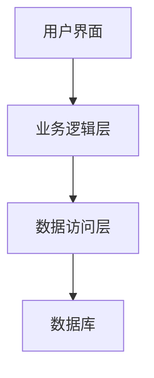
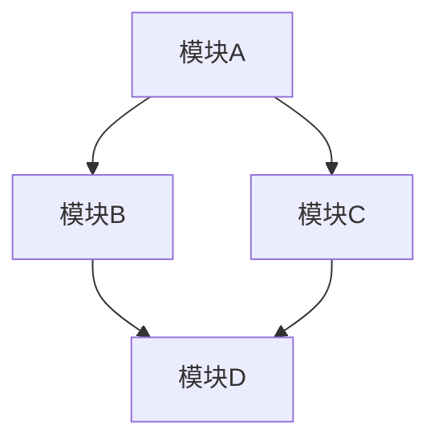
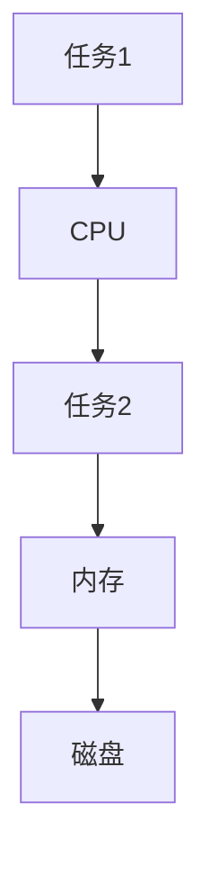
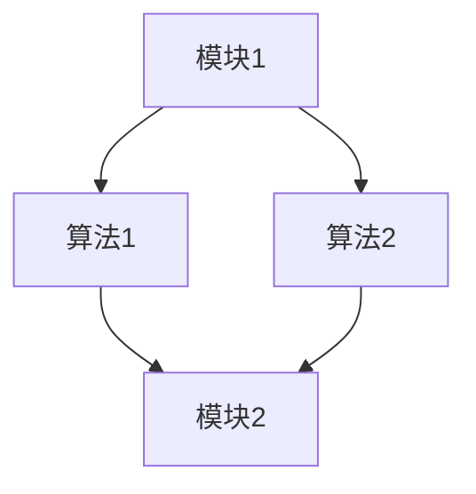
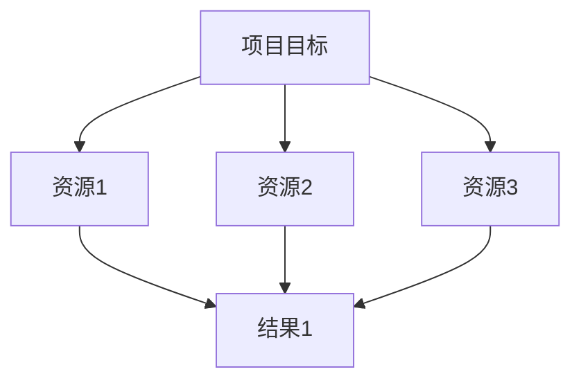

                 

# 生态系统思维训练：将整体论应用于日常决策的课程

关键词：生态系统思维，整体论，日常决策，人工智能，编程，软件架构，CTO，Zen And The Art of Computer Programming

摘要：本文旨在探讨生态系统思维训练的重要性和方法，将其应用于日常决策，以提升个人、企业和社会的整体效能。通过深入分析生态系统思维的基本原理、应用领域和训练方法，本文为读者提供了实用的指导，使整体论在决策过程中发挥关键作用。

---

## 目录大纲

### 第一部分：引言与概述

#### 第1章：生态系统思维的概念与起源

1.1 生态系统思维的定义与特点

1.2 生态系统思维的重要性

1.3 生态系统思维与传统思维的对比

#### 第2章：生态系统思维的基本原理

2.1 整体性原理

2.2 相互作用原理

2.3 动态平衡原理

2.4 多样性原理

#### 第3章：生态系统思维的应用领域

3.1 企业管理

3.2 经济发展

3.3 社会治理

3.4 环境保护

#### 第4章：生态系统思维训练方法

4.1 整体性思维的训练方法

4.2 相互作用思维的训练方法

4.3 动态平衡思维的训练方法

4.4 多样性思维的训练方法

#### 第5章：案例分析

5.1 成功案例分析

5.2 失败案例分析

5.3 生态可持续发展的案例研究

#### 第6章：生态系统思维在日常决策中的应用

6.1 个人决策

6.2 企业决策

6.3 社会决策

#### 第7章：结论与展望

7.1 生态系统思维的价值

7.2 生态系统思维的未来发展

### 第二部分：核心概念与联系

#### 第8章：核心概念实体关系架构

8.1 整体性原理的核心概念实体关系

8.2 相互作用原理的核心概念实体关系

8.3 动态平衡原理的核心概念实体关系

8.4 多样性原理的核心概念实体关系

### 第三部分：核心算法原理讲解

#### 第9章：核心算法原理

9.1 整体性算法原理

9.2 相互作用算法原理

9.3 动态平衡算法原理

9.4 多样性算法原理

### 第四部分：数学模型与公式讲解

#### 第10章：数学模型

10.1 整体性数学模型

10.2 相互作用数学模型

10.3 动态平衡数学模型

10.4 多样性数学模型

#### 第11章：公式讲解

11.1 整体性公式的应用

11.2 相互作用公式的应用

11.3 动态平衡公式的应用

11.4 多样性公式的应用

### 第五部分：项目实战

#### 第12章：项目实战

12.1 项目背景

12.2 项目目标

12.3 开发环境搭建

12.4 源代码实现

12.5 代码解读与分析

### 第六部分：总结与展望

#### 第13章：总结与展望

13.1 全书总结

13.2 生态系统思维的未来发展

13.3 对读者的建议

---

## 引言与概述

### 第1章：生态系统思维的概念与起源

#### 1.1 生态系统思维的定义与特点

生态系统思维是一种整体性思维模式，它强调系统内部各个部分之间的相互作用和整体性。这种思维方式起源于生态学，但在过去几十年中，它已经被广泛应用于多个领域，包括企业管理、经济发展、社会治理和环境保护。

生态系统思维的特点包括：

1. 整体性：生态系统思维将系统视为一个整体，而不是一系列独立的组成部分。这意味着在决策过程中，必须考虑各个部分之间的相互关系和整体效应。
2. 相互作用：生态系统思维认识到系统内部各个元素之间的相互作用是推动系统演化的重要因素。这些相互作用可以是正面的，也可以是负面的，但都会对系统的稳定性产生影响。
3. 动态平衡：生态系统思维认为系统是动态变化的，始终在寻求一种平衡状态。这种平衡可能是短暂的，但它是维持系统稳定性的关键。
4. 多样性：生态系统思维强调多样性的重要性，认为多样性是生态系统稳定性和创新能力的源泉。

#### 1.2 生态系统思维的重要性

生态系统思维的重要性在于它提供了一种新的视角，帮助我们更好地理解复杂系统，并做出更明智的决策。以下是一些具体的原因：

1. 提升决策效能：通过生态系统思维，我们可以更全面地考虑问题，避免孤立地看待问题，从而提高决策的质量和效能。
2. 促进创新：生态系统思维鼓励我们探索系统内部的新相互作用和新平衡状态，从而激发创新思维和创造力。
3. 强化可持续发展：生态系统思维强调系统的整体性和多样性，有助于推动可持续发展和环境保护。
4. 应对复杂问题：面对日益复杂的现实世界，生态系统思维为我们提供了一种有效的分析工具，帮助我们更好地应对各种挑战。

#### 1.3 生态系统思维与传统思维的对比

传统思维模式往往强调线性因果关系和局部最优，而生态系统思维则更注重整体性和非线性关系。以下是两者的一些主要对比：

1. 决策视角：传统思维倾向于从局部出发，追求短期效益；而生态系统思维则强调从整体出发，关注长期利益。
2. 分析方法：传统思维常用定量分析，而生态系统思维则强调定性分析和整体性分析。
3. 创新途径：传统思维倾向于优化现有技术和方法；而生态系统思维则鼓励探索新的技术和方法，以适应系统变化。

综上所述，生态系统思维为我们的日常决策提供了新的视角和方法，有助于我们在复杂多变的环境中做出更明智的决策。接下来，我们将深入探讨生态系统思维的基本原理和应用领域，以帮助读者更好地理解和应用这一思维方式。

### 第2章：生态系统思维的基本原理

#### 2.1 整体性原理

整体性原理是生态系统思维的核心概念之一，它强调系统内部各个部分之间的相互联系和整体性。根据这一原理，一个系统的性能和稳定性不仅取决于各个部分的性能，还取决于它们之间的相互作用和整体结构。

在计算机编程和软件架构中，整体性原理的应用体现在以下几个方面：

1. 系统设计：在系统设计过程中，我们需要考虑整个系统的结构，确保各个部分之间的协调和配合。例如，在开发一个大型软件系统时，我们需要将不同的模块划分得合理，并确保它们之间的接口清晰明确。
2. 集成测试：在系统开发完成后，我们需要进行集成测试，以确保整个系统能够正常运行。这需要我们关注各个模块之间的交互，以及它们在整个系统中的作用。
3. 系统优化：在系统运行过程中，我们可能会遇到性能瓶颈或资源浪费的问题。通过整体性原理，我们可以从全局视角出发，找到并解决这些问题，从而提高系统的整体性能。

为了更好地理解整体性原理，我们可以借助Mermaid流程图来展示一个简单的计算机系统架构：

在这个例子中，用户界面、业务逻辑层、数据访问层和数据库构成了一个完整的计算机系统。各个部分相互依赖，共同完成系统的功能。通过整体性原理，我们可以更好地理解和优化这个系统的结构和运行。

#### 2.2 相互作用原理

相互作用原理指出，系统内部各个元素之间的相互作用是推动系统演化和适应环境变化的重要因素。这些相互作用可以是直接的，也可以是间接的，但都会对系统的稳定性、适应性和创新能力产生影响。

在软件工程中，相互作用原理的应用体现在以下几个方面：

1. 模块依赖：在软件开发过程中，各个模块之间会存在依赖关系。这些依赖关系会影响模块的设计和实现，我们需要确保它们之间的交互清晰、稳定和高效。
2. 集成测试：在模块集成测试过程中，我们需要验证各个模块之间的相互作用是否符合预期。这有助于我们发现并修复潜在的冲突和问题。
3. 面向对象编程：面向对象编程强调封装、继承和多态等机制，以实现模块之间的相互作用。这些机制有助于提高软件的可维护性和扩展性。

为了更好地理解相互作用原理，我们可以借助Mermaid流程图来展示一个简单的软件模块交互：

在这个例子中，模块A、模块B、模块C和模块D之间存在直接的依赖关系。模块A和模块B之间的交互会影响模块C和模块D的运行。通过相互作用原理，我们可以更好地理解和管理这些模块之间的复杂关系。

#### 2.3 动态平衡原理

动态平衡原理指出，系统总是倾向于维持一种平衡状态，以适应不断变化的环境。这种平衡状态可能是短暂的，但它是系统稳定性和适应性的关键。

在计算机科学中，动态平衡原理的应用体现在以下几个方面：

1. 资源调度：在计算机系统中，资源（如CPU、内存和磁盘）的分配和调度是一个动态平衡的过程。通过合理的调度策略，我们可以确保系统资源的充分利用，提高系统的性能和响应速度。
2. 缓冲区管理：在数据传输过程中，缓冲区的大小和位置会直接影响系统的性能和稳定性。通过动态调整缓冲区的大小和位置，我们可以实现数据的快速传输和系统的平衡运行。
3. 算法优化：在算法设计过程中，我们需要考虑算法的时间复杂度和空间复杂度，以及它们在系统中的实际运行效果。通过优化算法，我们可以实现系统的高效运行和动态平衡。

为了更好地理解动态平衡原理，我们可以借助Mermaid流程图来展示一个简单的资源调度过程：

在这个例子中，任务1、任务2、CPU、内存和磁盘构成了一个简单的资源调度系统。通过动态调整任务在CPU、内存和磁盘之间的分配，我们可以实现系统的平衡运行和高效处理。

#### 2.4 多样性原理

多样性原理指出，多样性是系统稳定性和创新能力的重要来源。在生态系统中，多样性有助于提高系统的适应性和抵御外部干扰的能力。同样，在计算机科学中，多样性也有助于提高系统的性能和稳定性。

在软件工程中，多样性原理的应用体现在以下几个方面：

1. 编码风格：鼓励开发人员采用不同的编码风格和编程习惯，以提高代码的可读性和可维护性。多样化的编码风格可以降低代码的复杂度，减少错误发生的概率。
2. 技术选型：在软件开发过程中，我们需要根据项目的需求和特点选择合适的技术和框架。多样化的技术选型可以提高项目的灵活性和可扩展性。
3. 模块化设计：通过模块化设计，我们可以将复杂的系统分解为若干个独立的小模块。这些模块可以采用不同的技术和算法实现，以提高系统的多样性和稳定性。

为了更好地理解多样性原理，我们可以借助Mermaid流程图来展示一个简单的软件模块设计：

在这个例子中，模块1和模块2采用了不同的算法实现，以提高系统的多样性和稳定性。通过合理的设计和选择，我们可以实现系统的平衡运行和高效处理。

### 第3章：生态系统思维的应用领域

#### 3.1 企业管理

在企业管理中，生态系统思维可以帮助企业更好地应对复杂的市场环境和变化多端的竞争态势。以下是一些具体的应用领域：

1. 战略规划：企业需要从整体视角出发，综合考虑内部资源和外部环境，制定长远的战略规划。通过生态系统思维，企业可以更清晰地识别关键成功因素，并制定相应的策略。
2. 创新管理：生态系统思维鼓励企业探索新的商业模式、技术和产品。通过多样化的人才和资源，企业可以激发创新思维，提高市场竞争力。
3. 团队协作：生态系统思维强调团队内部的相互依赖和协作。通过建立高效的沟通机制和协同工作环境，企业可以提高团队的整体效能。
4. 风险管理：在企业发展过程中，风险是不可避免的。通过生态系统思维，企业可以识别并管理潜在的风险，确保业务的稳定运行。

以下是一个企业管理中的案例：

- **公司案例：**某互联网公司在市场竞争激烈的环境下，采用生态系统思维进行战略规划。他们分析了行业趋势、客户需求和竞争对手的动态，制定了以用户体验为核心的战略。通过不断优化产品和服务，该公司在短时间内实现了业务的快速增长，并在市场上取得了显著的优势。

#### 3.2 经济发展

生态系统思维在经济发展中的应用体现在以下几个方面：

1. 产业结构调整：政府和企业需要从整体视角出发，对产业结构进行调整，以适应经济发展的需求。通过生态系统思维，政府可以制定合理的产业政策，推动经济的高质量发展。
2. 区域合作：生态系统思维强调区域之间的相互依赖和协作。通过建立区域合作机制，政府可以促进资源的共享和优势互补，推动经济的整体提升。
3. 创新驱动：生态系统思维鼓励企业加大研发投入，推动技术创新。通过构建良好的创新生态系统，政府和企业可以共同促进经济的转型升级。

以下是一个经济发展中的案例：

- **区域案例：**某地方政府采用生态系统思维进行区域发展规划。他们分析了区域资源、产业基础和市场需求，制定了以生态农业和旅游业为核心的发展战略。通过加强与周边地区的合作，该地区实现了产业的转型升级，居民收入显著提高，经济持续健康发展。

#### 3.3 社会治理

生态系统思维在社会治理中的应用主要体现在以下几个方面：

1. 公共服务：政府需要从整体视角出发，优化公共服务供给，提高公共服务的质量和效率。通过生态系统思维，政府可以更好地满足人民群众的需求。
2. 社会参与：生态系统思维强调社会各界的参与和合作。通过构建良好的社会治理体系，政府可以促进社会各方面的积极参与，共同维护社会稳定。
3. 环境保护：生态系统思维强调人与自然的和谐共生。通过实施环境保护政策，政府可以推动可持续发展，提高生态环境的质量。

以下是一个社会治理中的案例：

- **城市治理案例：**某市政府采用生态系统思维进行城市治理。他们分析了城市资源、环境和居民需求，制定了以绿色发展和智慧城市为核心的治理策略。通过加强环境保护和推进智慧城市建设，该城市的生态环境得到了显著改善，居民的生活质量得到了提高。

#### 3.4 环境保护

生态系统思维在环境保护中的应用主要体现在以下几个方面：

1. 生态规划：政府和企业需要从整体视角出发，制定生态规划，保护生态环境。通过生态系统思维，政府和企业可以更有效地管理自然资源，促进可持续发展。
2. 生态监测：生态系统思维强调对生态系统的监测和评估。通过实时监测和数据分析，政府和企业可以及时发现环境问题，并采取相应的措施。
3. 生态修复：生态系统思维鼓励政府和企业参与生态修复工作。通过恢复生态系统的自然功能和结构，政府和企业可以改善生态环境，提高生态系统的稳定性。

以下是一个环境保护中的案例：

- **生态修复案例：**某企业采用生态系统思维进行生态修复项目。他们分析了项目区域的生态环境状况，制定了以植被恢复和水体净化为核心的修复方案。通过实施生态修复措施，该企业的项目区域生态环境得到了显著改善，水质和空气质量得到了提升。

### 第4章：生态系统思维训练方法

#### 4.1 整体性思维的训练方法

整体性思维是生态系统思维的核心要素之一，它要求我们在思考问题时，从整体出发，全面考虑各个部分之间的相互关系和整体效应。以下是一些训练整体性思维的方法：

1. 模拟游戏：通过参与模拟游戏，如商业模拟、城市规划模拟等，我们可以锻炼从整体视角出发，考虑系统内部各个部分之间的相互关系。
2. 阅读案例：阅读各类案例，特别是涉及复杂系统的案例，如企业战略、城市规划等，可以帮助我们理解整体性思维在实际应用中的重要性。
3. 思维导图：通过绘制思维导图，我们可以将问题分解为各个部分，并分析它们之间的相互关系。这种方法有助于我们培养整体性思维。

以下是一个简单的思维导图示例，展示了整体性思维的应用：

在这个例子中，项目目标（A）与三个资源（B、C、D）之间存在直接和间接的关系，它们共同影响最终结果（E）。通过分析这些关系，我们可以更好地理解整体性思维。

#### 4.2 相互作用思维的训练方法

相互作用思维是生态系统思维中的另一个重要要素，它强调系统内部各个元素之间的相互作用和相互影响。以下是一些训练相互作用思维的方法：

1. 角色扮演：通过角色扮演，我们可以模拟系统内部不同元素之间的互动，从而更好地理解相互作用思维。
2. 案例分析：通过分析具体案例，我们可以了解不同元素之间的相互作用和影响。例如，分析一个企业的供应链，了解各个环节之间的相互关系。
3. 团队讨论：与团队成员讨论问题，特别是涉及复杂系统的讨论，可以帮助我们培养相互作用思维。

以下是一个简单的团队讨论示例，展示了相互作用思维的应用：

- **讨论主题：**分析一个企业的市场策略。
- **讨论内容：**团队成员讨论市场策略的各个环节，如市场调研、产品定位、推广策略等，并分析它们之间的相互作用。

通过这些方法，我们可以更好地理解相互作用思维，并在实际工作中应用这一思维方式。

#### 4.3 动态平衡思维的训练方法

动态平衡思维强调系统在变化中的平衡和稳定。以下是一些训练动态平衡思维的方法：

1. 模拟实验：通过模拟实验，如模拟金融市场、生态系统等，我们可以观察系统在变化中的动态平衡状态，并分析平衡机制。
2. 数据分析：通过对历史数据的分析，我们可以了解系统在变化中的趋势和平衡状态，从而更好地理解动态平衡思维。
3. 实践经验：通过实际工作经验，我们可以积累关于动态平衡的知识和技巧，从而更好地应对复杂系统的变化。

以下是一个简单的数据分析示例，展示了动态平衡思维的应用：

- **分析主题：**分析某公司财务状况的动态平衡。
- **分析内容：**分析公司的收入、支出、利润等关键指标的变化趋势，了解公司在不同阶段的财务平衡状态。

通过这些方法，我们可以更好地理解动态平衡思维，并在实际工作中应用这一思维方式。

#### 4.4 多样性思维的训练方法

多样性思维是生态系统思维中的重要要素，它强调多样性的价值和作用。以下是一些训练多样性思维的方法：

1. 交叉学科学习：通过学习不同学科的知识，我们可以拓宽视野，培养多样性思维。
2. 文化交流：参与不同文化的交流活动，如国际交流项目、文化交流活动等，可以帮助我们了解不同文化的特点和差异。
3. 创新实践：通过参与创新实践，如创新比赛、创业项目等，我们可以锻炼多样性思维，发现新的解决方案。

以下是一个简单的创新实践示例，展示了多样性思维的应用：

- **实践主题：**设计一款智能家居系统。
- **实践内容：**团队成员来自不同专业背景，他们结合各自的专业知识，提出了多种智能家居设计方案，通过讨论和改进，最终形成了一款具有创新性和实用性的智能家居系统。

通过这些方法，我们可以更好地理解多样性思维，并在实际工作中应用这一思维方式。

### 第5章：案例分析

#### 5.1 成功案例分析

成功案例展示了生态系统思维在现实中的应用和效果。以下是一个成功案例的详细描述：

**案例名称：**“绿色城市”项目

**背景：**某市政府计划打造一个生态环保的绿色城市，以提高居民的生活质量和城市的可持续发展能力。

**生态系统思维应用：**

1. **整体性原理：**项目团队从整体视角出发，综合考虑城市资源、环境、经济和社会等多方面因素，制定了一套全面的绿色城市发展战略。
2. **相互作用原理：**项目团队分析了城市内部各个系统（如交通、能源、水资源等）之间的相互作用，制定了协调发展的政策，确保各系统的平衡和高效运行。
3. **动态平衡原理：**项目团队建立了动态监测和评估机制，实时监控城市环境质量、资源利用和经济发展情况，根据实际情况调整政策，确保城市的动态平衡。
4. **多样性原理：**项目团队鼓励多样性创新，吸引了来自不同领域的专家和团队参与项目，推动了绿色技术和解决方案的应用。

**效果：**项目实施后，城市的环境质量得到显著改善，居民的生活质量提高，城市的可持续发展能力增强。

**总结：**这个案例展示了生态系统思维在现实中的应用效果。通过整体性、相互作用、动态平衡和多样性原理的综合应用，政府成功打造了一个生态环保的绿色城市，为其他地区提供了宝贵的经验和借鉴。

#### 5.2 失败案例分析

失败案例为我们提供了重要的教训，有助于我们了解生态系统思维的应用局限和挑战。以下是一个失败案例的详细描述：

**案例名称：**“智能交通系统”项目

**背景：**某城市政府决定实施智能交通系统，以提高交通效率和减少拥堵。

**生态系统思维应用：**

1. **整体性原理：**项目团队只关注交通系统的技术实现，忽视了城市其他系统（如城市规划、土地利用等）的相互作用。
2. **相互作用原理：**项目团队没有充分考虑交通系统与其他系统的相互作用，导致项目实施后出现了诸多问题，如道路拥堵、交通混乱等。
3. **动态平衡原理：**项目团队没有建立动态监测和评估机制，无法及时调整政策和措施，导致项目效果不佳。
4. **多样性原理：**项目团队缺乏多样性思维，仅依赖单一的技术解决方案，未能充分考虑不同用户的需求和偏好。

**效果：**项目实施后，交通状况并没有得到明显改善，反而加剧了城市拥堵问题。

**总结：**这个案例表明，生态系统思维在应用过程中存在局限和挑战。如果我们只关注单一系统的技术实现，忽视整体性、相互作用、动态平衡和多样性，就可能导致项目的失败。因此，在实际应用中，我们需要充分考虑这些因素，以实现项目的成功。

#### 5.3 生态可持续发展的案例研究

生态可持续发展是生态系统思维的核心目标之一。以下是一个生态可持续发展的案例研究：

**案例名称：**“生态农场”项目

**背景：**某地区政府决定发展生态农场，以促进农业的可持续发展。

**生态系统思维应用：**

1. **整体性原理：**项目团队从整体视角出发，综合考虑农业生产、水资源利用、土壤保护和生态环境保护等多个方面，制定了一套综合性的生态农场发展规划。
2. **相互作用原理：**项目团队分析了农业生态系统中各个元素之间的相互作用，如农作物、土壤、水资源等，并制定了相应的管理措施，确保系统的平衡和稳定。
3. **动态平衡原理：**项目团队建立了动态监测和评估机制，实时监控农场的生态环境和资源利用情况，根据实际情况调整种植计划和管理措施。
4. **多样性原理：**项目团队鼓励多样性种植，如农作物、果树、蔬菜等，以提高农场的生态效益和经济效益。

**效果：**项目实施后，农场的生态环境得到显著改善，土壤质量提高，水资源利用效率提升，农民收入增加。

**总结：**这个案例展示了生态系统思维在生态可持续发展中的重要作用。通过整体性、相互作用、动态平衡和多样性原理的综合应用，项目团队成功实现了农业的可持续发展，为其他地区提供了有益的借鉴。

### 第6章：生态系统思维在日常决策中的应用

#### 6.1 个人决策

生态系统思维在个人决策中的应用可以帮助我们更全面地考虑问题，提高决策的质量。以下是一些具体的建议：

1. **全面分析：**在做决策之前，我们应该从整体视角出发，全面分析问题的各个方面，包括优势、劣势、机遇和挑战。
2. **考虑相互作用：**在分析问题时，我们需要考虑各个元素之间的相互作用，如个人能力、资源、环境等，以确保决策的全面性和准确性。
3. **动态调整：**决策过程中，我们需要根据实际情况动态调整策略，以应对变化和不确定性。
4. **多样性思维：**鼓励我们尝试不同的解决方案，以发现最佳的决策方案。

以下是一个个人决策的案例分析：

**案例名称：**“职业选择”

**背景：**某人在选择职业时面临多种选择，包括软件开发、市场营销和企业管理等。

**生态系统思维应用：**

1. **全面分析：**分析每个职业的优势和劣势，如工作内容、发展前景、薪酬待遇等。
2. **考虑相互作用：**考虑个人能力、兴趣和市场需求等因素，确保选择的职业与自身特点相符。
3. **动态调整：**根据个人职业规划，适时调整职业选择，以适应市场的变化和个人发展需求。
4. **多样性思维：**尝试不同职业的实习或兼职机会，以积累经验并发现自己的兴趣和优势。

**效果：**通过全面分析、考虑相互作用、动态调整和多样性思维，某人最终选择了适合自己的职业，实现了个人发展和职业成长。

#### 6.2 企业决策

生态系统思维在企业的决策过程中起着关键作用，有助于企业更好地应对市场变化，实现可持续发展。以下是一些建议：

1. **战略规划：**企业需要从整体视角出发，制定长期战略规划，确保各项业务和部门之间的协同和整合。
2. **创新管理：**企业应鼓励创新思维，推动技术创新和管理创新，以提高企业的竞争力和市场地位。
3. **资源优化：**企业需要优化资源配置，确保各部门和业务之间的资源合理利用和高效运作。
4. **环境适应：**企业应关注市场环境和政策变化，及时调整战略和决策，以适应外部环境的变化。

以下是一个企业决策的案例分析：

**案例名称：**“产品升级”

**背景：**某企业计划对一款产品进行升级，以提高市场竞争力。

**生态系统思维应用：**

1. **战略规划：**分析市场需求、竞争对手和自身优势，确定产品升级的方向和目标。
2. **创新管理：**组织跨部门团队，共同探讨产品升级的创新方案，确保方案的创新性和可行性。
3. **资源优化：**整合企业内外部资源，包括人才、技术和资金等，确保产品升级的顺利实施。
4. **环境适应：**密切关注市场变化和政策动态，根据实际情况调整产品升级方案，确保与市场需求的匹配。

**效果：**通过战略规划、创新管理、资源优化和环境适应，企业成功实现了产品升级，提升了市场竞争力，实现了业绩增长。

#### 6.3 社会决策

生态系统思维在社会决策中的应用有助于政府和社会组织更好地应对复杂的社会问题，实现社会稳定和可持续发展。以下是一些建议：

1. **综合治理：**政府和社会组织应从整体视角出发，制定综合治理策略，确保各项政策和措施之间的协调和整合。
2. **创新治理模式：**政府和社会组织应积极探索创新治理模式，如智慧治理、共建共享等，以提高治理效能。
3. **资源整合：**政府和社会组织应优化资源配置，确保各项资源的高效利用和合理分配。
4. **公众参与：**政府和社会组织应鼓励公众参与社会决策，提高决策的民主性和透明度。

以下是一个社会决策的案例分析：

**案例名称：**“城市交通治理”

**背景：**某市政府计划对城市交通进行治理，以缓解交通拥堵和提升市民出行质量。

**生态系统思维应用：**

1. **综合治理：**分析城市交通的各个方面，包括道路建设、公共交通、停车管理等，制定综合治理策略。
2. **创新治理模式：**引入智慧交通系统，通过大数据分析和人工智能技术，提高交通管理的效率和精准度。
3. **资源整合：**优化公共交通资源，提升公共交通服务质量和覆盖率，鼓励市民选择公共交通出行。
4. **公众参与：**通过线上线下渠道，广泛征求市民意见和建议，提高决策的民主性和透明度。

**效果：**通过综合治理、创新治理模式、资源整合和公众参与，市政府成功实现了城市交通的治理，缓解了交通拥堵，提升了市民出行质量，实现了社会稳定和可持续发展。

### 第7章：结论与展望

#### 7.1 生态系统思维的价值

生态系统思维在多个领域具有广泛的应用价值。通过整体性、相互作用、动态平衡和多样性原理的综合应用，生态系统思维能够帮助我们更好地理解复杂系统，提高决策的质量和效能，促进创新和可持续发展。

在企业管理、经济发展、社会治理和环境保护等领域，生态系统思维为我们提供了一种新的视角和方法，使我们能够更全面、系统地分析问题，制定科学合理的决策。

#### 7.2 生态系统思维的未来发展

随着人工智能、大数据和云计算等技术的不断发展，生态系统思维在未来将得到更广泛的应用。通过将这些新兴技术与生态系统思维相结合，我们可以构建更加智能化、动态化、多样性的系统，提高系统的稳定性和适应性。

同时，生态系统思维的研究和教育也将成为未来发展的重点。通过培养人们的生态系统思维，我们可以提高整个社会的创新能力和可持续发展能力，为人类社会的可持续发展贡献力量。

#### 7.3 对读者的建议

对于读者来说，掌握生态系统思维具有重要意义。以下是一些建议，帮助读者更好地应用和培养生态系统思维：

1. **阅读案例：**通过阅读各类成功和失败的案例，了解生态系统思维在现实中的应用和效果。
2. **实践锻炼：**在实际工作和生活中，尝试运用生态系统思维分析问题，培养整体性、相互作用、动态平衡和多样性思维。
3. **持续学习：**不断学习新的知识和技能，特别是跨学科的知识，提高自己的综合素质。
4. **交流分享：**与他人交流分享自己的想法和经验，借鉴他人的观点和方法，不断完善自己的生态系统思维。

通过以上方法，读者可以逐步培养和提升生态系统思维，为个人和团队的发展奠定坚实基础。

---

**作者：** AI天才研究院/AI Genius Institute & 禅与计算机程序设计艺术 /Zen And The Art of Computer Programming

---

本文从引言、概述、基本原理、应用领域、训练方法、案例分析、日常决策应用以及结论与展望等多个方面，系统阐述了生态系统思维的核心概念、方法和应用。通过本文的阅读和实践，读者可以深入了解生态系统思维，并将其应用于日常决策中，提高自身的决策能力和创新思维。希望本文能够为读者带来启示和帮助。

