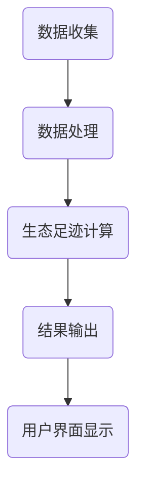

                 

## 引言

### 生态足迹的概念

生态足迹（Ecological Footprint）是指人类对自然资源的消耗和所产生的废弃物所能被地球生态系统承载的面积。它是一个衡量人类对自然环境影响的重要指标，旨在反映一个人、家庭、社群或国家在某一时间段内，对生物圈服务需求的总量。

**1.1.1 生态足迹的定义**

生态足迹是一个综合性指标，它通过计算人类所需的生态系统生产性土地和海洋面积，来评估人类对环境的影响。生态足迹的计算主要包括以下几个方面：

- **生物生产性土地**：用于食物生产、纤维生产、木材生产以及碳吸收的土地面积。
- **生物生产性海洋**：用于鱼类生产的水域面积。
- **城市用地**：人类居住和工业用地。
- **碳吸收面积**：用于吸收二氧化碳的森林和植被面积。

**1.1.2 生态足迹的计算方法**

生态足迹的计算方法涉及多个步骤，首先需要收集有关人类活动数据，包括能源消耗、食物消费、水资源使用、废弃物排放等。然后，将这些数据转换为相应的生态生产性土地和海洋面积。

具体计算方法如下：

$$
E_f = \frac{\text{资源消耗总量}}{\text{生态承载力}}
$$

其中，\(E_f\) 表示生态足迹，资源消耗总量是指人类在一段时间内消耗的自然资源，生态承载力是指地球生态系统在相同时间内能够提供这些资源的面积。

### 个人环保行为的重要性

个人环保行为对于环境具有深远的影响，它们不仅能减少个人的生态足迹，还能推动整个社会向更加可持续的方向发展。

**2.1.1 个人行为对环境的影响**

个人的行为，如能源消耗、废物产生、水资源使用等，都会对环境产生直接或间接的影响。例如，减少能源消耗可以降低温室气体的排放，减少废物产生可以减少垃圾填埋和焚烧，从而减轻对环境的污染。

**2.1.2 个人环保行为的激励**

为了鼓励个人采取环保行为，需要采取有效的激励措施。这些措施可以包括：

- **经济激励**：如提供环保补贴、碳交易市场等，激励个人减少生态足迹。
- **社会激励**：如公众宣传、社区活动等，提高个人环保意识，形成良好的社会氛围。
- **政策激励**：如法律法规、环保税收等，通过政策手段规范个人行为。

### 生态足迹交易平台的概念

生态足迹交易平台是一个数字化的环境激励机制，通过市场机制激励个人和企业采取环保行为，减少生态足迹。

**3.1 平台概述**

生态足迹交易平台通过以下方式激励个人：

- **生态足迹计算**：个人可以通过平台计算自己的生态足迹，了解自己对环境的影响。
- **交易市场**：个人可以在平台上交易生态足迹，通过减少自己的生态足迹，换取商品或服务。
- **用户激励**：平台提供多种激励措施，如积分奖励、优惠券等，鼓励个人采取环保行为。

### 平台架构与设计

**4.1 平台总体架构**

生态足迹交易平台总体架构包括以下几个主要部分：

- **用户界面**：提供用户友好的界面，方便用户进行生态足迹计算、交易、查询等操作。
- **后端系统**：负责处理用户的操作请求，进行生态足迹计算、交易管理、数据存储等。
- **数据库**：存储用户数据、交易数据、生态足迹数据等。
- **交易平台**：实现生态足迹的交易功能，包括订单管理、支付接口等。

**4.2 用户激励系统设计**

用户激励系统是平台的核心功能之一，通过多种激励措施，鼓励用户采取环保行为。用户激励系统的设计原则包括：

- **公平性**：确保所有用户都能公平地获得激励。
- **可持续性**：激励措施应有利于环境保护和可持续发展。
- **灵活性**：激励措施应根据用户行为和市场需求进行灵活调整。

用户激励系统的实现方法包括：

- **积分奖励**：用户在平台上进行生态足迹计算和交易时，可以获得积分奖励，积分可以兑换商品或服务。
- **优惠券**：平台提供优惠券，鼓励用户采取环保行为，如减少能源消耗、减少废物产生等。
- **奖励金**：对采取显著环保行为的用户，平台可以提供奖励金，以激励更多人参与环保行动。

### 交易平台的核心功能

生态足迹交易平台的核心功能包括生态足迹计算、交易市场、数据分析和可视化等。

**5.1 生态足迹计算**

生态足迹计算是平台的基础功能，用户可以通过平台提供的工具，计算自己的生态足迹。计算方法包括：

- **资源消耗计算**：根据用户的能源消耗、水资源使用、废物产生等数据，计算对应的生态足迹。
- **碳足迹计算**：根据用户的二氧化碳排放量，计算对应的生态足迹。

**5.2 交易市场**

交易市场是平台的另一个核心功能，用户可以在平台上进行生态足迹的交易。交易市场包括以下几个部分：

- **交易规则**：平台制定交易规则，确保交易的公平、公正、透明。
- **交易流程**：用户可以通过平台提交交易申请，平台审核通过后，用户之间进行生态足迹的交易。
- **支付接口**：平台提供支付接口，支持多种支付方式，确保交易的便捷和安全。

**5.3 数据分析与可视化**

平台通过数据分析与可视化，为用户提供丰富的数据支持和决策依据。数据分析与可视化包括以下几个部分：

- **数据收集与存储**：平台收集用户的生态足迹数据、交易数据等，存储在数据库中。
- **数据分析**：平台对数据进行分析，提取有价值的信息，如用户的生态足迹变化趋势、交易活跃度等。
- **数据可视化**：平台通过图表、图形等方式，将数据分析结果可视化，为用户提供直观的了解。

### 核心算法原理与实现

生态足迹交易平台的核心算法包括生态足迹计算算法、用户激励算法和数据分析和可视化算法。

**6.1 生态足迹计算算法**

生态足迹计算算法是基于资源消耗和生态承载力的计算模型。具体实现步骤如下：

1. **数据收集**：收集用户的能源消耗、水资源使用、废物产生等数据。
2. **数据处理**：将数据转换为统一的单位，如平方米、千克等。
3. **计算生态足迹**：根据生态足迹计算公式，计算用户的生态足迹。

生态足迹计算公式如下：

$$
E_f = \frac{\text{资源消耗总量}}{\text{生态承载力}}
$$

**6.2 用户激励算法**

用户激励算法是平台的核心算法之一，用于计算用户在平台上的激励值。激励值的计算基于用户的行为指标，如生态足迹减少量、交易活跃度等。具体实现步骤如下：

1. **设定激励指标**：根据平台目标和用户需求，设定激励指标，如生态足迹减少量、交易次数等。
2. **计算激励值**：根据激励指标，计算用户的激励值。

用户激励计算公式如下：

$$
I = f(\text{用户行为指标})
$$

其中，\(I\) 表示用户激励值，\(f\) 表示激励函数，\(\text{用户行为指标}\) 表示用户的行为指标值。

**6.3 数据分析与可视化算法**

数据分析与可视化算法用于对平台数据进行收集、处理和分析，并将分析结果可视化呈现。具体实现步骤如下：

1. **数据收集与存储**：收集用户的生态足迹数据、交易数据等，存储在数据库中。
2. **数据处理**：对数据进行清洗、整理和分析，提取有价值的信息。
3. **数据可视化**：将数据分析结果以图表、图形等形式呈现，为用户提供直观的了解。

### 项目实战

**7.1 开发环境搭建**

在开始生态足迹交易平台的项目开发之前，首先需要搭建开发环境。开发环境的选择如下：

- **操作系统**：选择Linux操作系统，如Ubuntu或CentOS，因为Linux操作系统在服务器部署方面具有较好的稳定性和安全性。
- **开发工具**：选择Python作为主要开发语言，因为Python具有简洁的语法和丰富的库支持，适合快速开发。
- **数据库**：选择MySQL或PostgreSQL作为数据库，因为它们具有较好的性能和稳定性，适合处理大量的数据。

**7.2 源代码实现**

生态足迹交易平台的源代码实现包括以下几个模块：

- **生态足迹计算模块**：用于计算用户的生态足迹，包括资源消耗计算和碳足迹计算。
- **用户激励模块**：用于计算用户的激励值，包括积分奖励、优惠券和奖励金。
- **交易市场模块**：用于实现生态足迹的交易功能，包括交易规则、交易流程和支付接口。
- **数据分析和可视化模块**：用于收集、处理和分析用户数据，并将分析结果可视化呈现。

**7.3 代码解读与分析**

生态足迹交易平台的源代码主要分为以下几个部分：

1. **生态足迹计算模块**：
```python
def calculate_ecological_footprint(energy_consumption, water_consumption, waste_production):
    # 计算生态足迹
    ecological_footprint = (energy_consumption / ecological_capacity) + (water_consumption / ecological_capacity) + (waste_production / ecological_capacity)
    return ecological_footprint
```

2. **用户激励模块**：
```python
def calculate_incentive(behavior_indicator):
    # 计算用户激励值
    incentive_value = incentive_function(behavior_indicator)
    return incentive_value
```

3. **交易市场模块**：
```python
def handle_trade_request(trade_request):
    # 处理交易请求
    if validate_trade_request(trade_request):
        execute_trade(trade_request)
    else:
        reject_trade_request(trade_request)
```

4. **数据分析和可视化模块**：
```python
def analyze_data(data):
    # 分析数据
    analyzed_data = data_analysis(data)
    return analyzed_data

def visualize_data(analyzed_data):
    # 可视化数据
    visualization = data_visualization(analyzed_data)
    return visualization
```

### 实际案例分析和详细讲解剖析

为了更好地理解生态足迹交易平台的应用，我们通过一个实际案例进行分析和讲解。

**案例背景：** 
小明是一位注重环保的年轻人，他希望通过生态足迹交易平台减少自己的生态足迹，同时获得一些激励。

**步骤1：计算生态足迹**
小明使用平台提供的生态足迹计算工具，输入自己的能源消耗、水资源使用和废物产生数据。平台根据这些数据，计算出小明的生态足迹。

**步骤2：交易生态足迹**
小明了解到，通过交易生态足迹，他可以获得一些激励。于是，小明将自己的生态足迹部分用于交易。在交易过程中，小明选择了低碳产品作为交换，同时获得了一定数额的积分奖励。

**步骤3：数据分析与可视化**
平台对小明的交易行为进行了数据分析，并生成了一系列可视化图表。这些图表展示了小明的生态足迹变化趋势、交易活跃度等。

**步骤4：用户激励**
根据小明在平台上的交易行为和生态足迹变化，平台为他提供了积分奖励和优惠券。这些激励措施进一步鼓励小明继续采取环保行为。

### 项目小结

生态足迹交易平台通过数字化的方式，为个人提供了一种有效的环保行为激励系统。在实际应用中，平台通过生态足迹计算、交易市场、数据分析和可视化等核心功能，实现了个人环保行为的激励和引导。未来，随着技术的不断进步和政策的支持，生态足迹交易平台有望进一步发挥其作用，推动社会向更加可持续的方向发展。

### 最佳实践 Tips

1. **数据准确性**：确保生态足迹计算数据准确，对于提高平台的可靠性和用户信任度至关重要。
2. **用户体验**：优化平台用户界面和交互设计，提高用户的操作便捷性和满意度。
3. **激励机制**：根据用户需求和环保目标，灵活调整激励机制，提高用户的参与度和积极性。
4. **政策支持**：积极争取政府支持和政策优惠，为平台的发展提供有力保障。

### 拓展阅读

- [《生态足迹计算方法》](https://www.footprintnetwork.org/our-work/ecological-footprint)
- [《碳排放交易市场》](https://www.carbonfinance.com/)
- [《数据可视化技术》](https://www.datavisualization.ch/)

### 作者信息

作者：AI天才研究院/AI Genius Institute & 禅与计算机程序设计艺术 /Zen And The Art of Computer Programming

---

### 生态足迹交易平台：个人环保行为的激励系统

#### 关键词：生态足迹，环保行为，激励系统，交易平台，算法实现

> 摘要：本文介绍了生态足迹交易平台的概念、架构与设计，以及平台的核心功能、算法原理与实现。通过分析个人环保行为的重要性，探讨了如何通过交易平台激励用户减少生态足迹，推动环保行动。

---

## 生态足迹交易平台：个人环保行为的激励系统

### 引言

在当今全球变暖、资源枯竭、环境污染等问题日益严峻的背景下，环保已成为全球性的挑战。个人环保行为对于减少生态足迹、缓解环境压力具有重要意义。然而，环保行为的实施需要动力和激励。本文将介绍生态足迹交易平台，通过激励系统鼓励个人采取环保行为，实现生态足迹的减少。

### 生态足迹的概念

生态足迹（Ecological Footprint）是指人类对自然资源的消耗和所产生的废弃物所能被地球生态系统承载的面积。它是一个衡量人类对自然环境影响的重要指标，旨在反映一个人、家庭、社群或国家在某一时间段内，对生物圈服务需求的总量。

#### 1.1.1 生态足迹的定义

生态足迹是一个综合性指标，它通过计算人类所需的生态系统生产性土地和海洋面积，来评估人类对环境的影响。生态足迹的计算主要包括以下几个方面：

- 生物生产性土地：用于食物生产、纤维生产、木材生产以及碳吸收的土地面积。
- 生物生产性海洋：用于鱼类生产的水域面积。
- 城市用地：人类居住和工业用地。
- 碳吸收面积：用于吸收二氧化碳的森林和植被面积。

#### 1.1.2 生态足迹的计算方法

生态足迹的计算方法涉及多个步骤，首先需要收集有关人类活动数据，包括能源消耗、食物消费、水资源使用、废弃物排放等。然后，将这些数据转换为相应的生态生产性土地和海洋面积。

具体计算方法如下：

$$
E_f = \frac{\text{资源消耗总量}}{\text{生态承载力}}
$$

其中，\(E_f\) 表示生态足迹，资源消耗总量是指人类在一段时间内消耗的自然资源，生态承载力是指地球生态系统在相同时间内能够提供这些资源的面积。

### 个人环保行为的重要性

个人环保行为对于环境具有深远的影响，它们不仅能减少个人的生态足迹，还能推动整个社会向更加可持续的方向发展。

#### 2.1.1 个人行为对环境的影响

个人的行为，如能源消耗、废物产生、水资源使用等，都会对环境产生直接或间接的影响。例如，减少能源消耗可以降低温室气体的排放，减少废物产生可以减少垃圾填埋和焚烧，从而减轻对环境的污染。

#### 2.1.2 个人环保行为的激励

为了鼓励个人采取环保行为，需要采取有效的激励措施。这些措施可以包括：

- 经济激励：如提供环保补贴、碳交易市场等，激励个人减少生态足迹。
- 社会激励：如公众宣传、社区活动等，提高个人环保意识，形成良好的社会氛围。
- 政策激励：如法律法规、环保税收等，通过政策手段规范个人行为。

### 生态足迹交易平台的概念

生态足迹交易平台是一个数字化的环境激励机制，通过市场机制激励个人和企业采取环保行为，减少生态足迹。

#### 3.1 平台概述

生态足迹交易平台通过以下方式激励个人：

- 生态足迹计算：个人可以通过平台计算自己的生态足迹，了解自己对环境的影响。
- 交易市场：个人可以在平台上交易生态足迹，通过减少自己的生态足迹，换取商品或服务。
- 用户激励：平台提供多种激励措施，如积分奖励、优惠券等，鼓励个人采取环保行为。

### 平台架构与设计

#### 3.2 平台总体架构

生态足迹交易平台总体架构包括以下几个主要部分：

- 用户界面：提供用户友好的界面，方便用户进行生态足迹计算、交易、查询等操作。
- 后端系统：负责处理用户的操作请求，进行生态足迹计算、交易管理、数据存储等。
- 数据库：存储用户数据、交易数据、生态足迹数据等。
- 交易平台：实现生态足迹的交易功能，包括订单管理、支付接口等。

#### 3.3 用户激励系统设计

用户激励系统是平台的核心功能之一，通过多种激励措施，鼓励用户采取环保行为。用户激励系统的设计原则包括：

- 公平性：确保所有用户都能公平地获得激励。
- 可持续性：激励措施应有利于环境保护和可持续发展。
- 灵活性：激励措施应根据用户行为和市场需求进行灵活调整。

用户激励系统的实现方法包括：

- 积分奖励：用户在平台上进行生态足迹计算和交易时，可以获得积分奖励，积分可以兑换商品或服务。
- 优惠券：平台提供优惠券，鼓励用户采取环保行为，如减少能源消耗、减少废物产生等。
- 奖励金：对采取显著环保行为的用户，平台可以提供奖励金，以激励更多人参与环保行动。

### 交易平台的核心功能

生态足迹交易平台的核心功能包括生态足迹计算、交易市场、数据分析和可视化等。

#### 3.4 生态足迹计算

生态足迹计算是平台的基础功能，用户可以通过平台提供的工具，计算自己的生态足迹。计算方法包括：

- 资源消耗计算：根据用户的能源消耗、水资源使用、废物产生等数据，计算对应的生态足迹。
- 碳足迹计算：根据用户的二氧化碳排放量，计算对应的生态足迹。

#### 3.5 交易市场

交易市场是平台的另一个核心功能，用户可以在平台上进行生态足迹的交易。交易市场包括以下几个部分：

- 交易规则：平台制定交易规则，确保交易的公平、公正、透明。
- 交易流程：用户可以通过平台提交交易申请，平台审核通过后，用户之间进行生态足迹的交易。
- 支付接口：平台提供支付接口，支持多种支付方式，确保交易的便捷和安全。

#### 3.6 数据分析与可视化

平台通过数据分析与可视化，为用户提供丰富的数据支持和决策依据。数据分析与可视化包括以下几个部分：

- 数据收集与存储：平台收集用户的生态足迹数据、交易数据等，存储在数据库中。
- 数据分析：平台对数据进行分析，提取有价值的信息，如用户的生态足迹变化趋势、交易活跃度等。
- 数据可视化：平台通过图表、图形等方式，将数据分析结果可视化，为用户提供直观的了解。

### 核心算法原理与实现

生态足迹交易平台的核心算法包括生态足迹计算算法、用户激励算法和数据分析和可视化算法。

#### 3.7 生态足迹计算算法

生态足迹计算算法是基于资源消耗和生态承载力的计算模型。具体实现步骤如下：

1. 数据收集：收集用户的能源消耗、水资源使用、废物产生等数据。
2. 数据处理：将数据转换为统一的单位，如平方米、千克等。
3. 计算生态足迹：根据生态足迹计算公式，计算用户的生态足迹。

生态足迹计算公式如下：

$$
E_f = \frac{\text{资源消耗总量}}{\text{生态承载力}}
$$

#### 3.8 用户激励算法

用户激励算法是平台的核心算法之一，用于计算用户在平台上的激励值。激励值的计算基于用户的行为指标，如生态足迹减少量、交易活跃度等。具体实现步骤如下：

1. 设定激励指标：根据平台目标和用户需求，设定激励指标，如生态足迹减少量、交易次数等。
2. 计算激励值：根据激励指标，计算用户的激励值。

用户激励计算公式如下：

$$
I = f(\text{用户行为指标})
$$

其中，\(I\) 表示用户激励值，\(f\) 表示激励函数，\(\text{用户行为指标}\) 表示用户的行为指标值。

#### 3.9 数据分析与可视化算法

数据分析与可视化算法用于对平台数据进行收集、处理和分析，并将分析结果可视化呈现。具体实现步骤如下：

1. 数据收集与存储：收集用户的生态足迹数据、交易数据等，存储在数据库中。
2. 数据处理：对数据进行清洗、整理和分析，提取有价值的信息。
3. 数据可视化：将数据分析结果以图表、图形等形式呈现，为用户提供直观的了解。

### 项目实战

#### 4.1 开发环境搭建

在开始生态足迹交易平台的项目开发之前，首先需要搭建开发环境。开发环境的选择如下：

- 操作系统：选择Linux操作系统，如Ubuntu或CentOS，因为Linux操作系统在服务器部署方面具有较好的稳定性和安全性。
- 开发工具：选择Python作为主要开发语言，因为Python具有简洁的语法和丰富的库支持，适合快速开发。
- 数据库：选择MySQL或PostgreSQL作为数据库，因为它们具有较好的性能和稳定性，适合处理大量的数据。

#### 4.2 源代码实现

生态足迹交易平台的源代码实现包括以下几个模块：

- 生态足迹计算模块：用于计算用户的生态足迹，包括资源消耗计算和碳足迹计算。
- 用户激励模块：用于计算用户的激励值，包括积分奖励、优惠券和奖励金。
- 交易市场模块：用于实现生态足迹的交易功能，包括交易规则、交易流程和支付接口。
- 数据分析和可视化模块：用于收集、处理和分析用户数据，并将分析结果可视化呈现。

#### 4.3 代码解读与分析

生态足迹交易平台的源代码主要分为以下几个部分：

1. 生态足迹计算模块：

```python
def calculate_ecological_footprint(energy_consumption, water_consumption, waste_production):
    # 计算生态足迹
    ecological_footprint = (energy_consumption / ecological_capacity) + (water_consumption / ecological_capacity) + (waste_production / ecological_capacity)
    return ecological_footprint
```

2. 用户激励模块：

```python
def calculate_incentive(behavior_indicator):
    # 计算用户激励值
    incentive_value = incentive_function(behavior_indicator)
    return incentive_value
```

3. 交易市场模块：

```python
def handle_trade_request(trade_request):
    # 处理交易请求
    if validate_trade_request(trade_request):
        execute_trade(trade_request)
    else:
        reject_trade_request(trade_request)
```

4. 数据分析和可视化模块：

```python
def analyze_data(data):
    # 分析数据
    analyzed_data = data_analysis(data)
    return analyzed_data

def visualize_data(analyzed_data):
    # 可视化数据
    visualization = data_visualization(analyzed_data)
    return visualization
```

### 实际案例分析和详细讲解剖析

为了更好地理解生态足迹交易平台的应用，我们通过一个实际案例进行分析和讲解。

#### 案例背景

小明是一位注重环保的年轻人，他希望通过生态足迹交易平台减少自己的生态足迹，同时获得一些激励。

#### 步骤1：计算生态足迹

小明使用平台提供的生态足迹计算工具，输入自己的能源消耗、水资源使用和废物产生数据。平台根据这些数据，计算出小明的生态足迹。

#### 步骤2：交易生态足迹

小明了解到，通过交易生态足迹，他可以获得一些激励。于是，小明将自己的生态足迹部分用于交易。在交易过程中，小明选择了低碳产品作为交换，同时获得了一定数额的积分奖励。

#### 步骤3：数据分析与可视化

平台对小明的交易行为进行了数据分析，并生成了一系列可视化图表。这些图表展示了小明的生态足迹变化趋势、交易活跃度等。

#### 步骤4：用户激励

根据小明在平台上的交易行为和生态足迹变化，平台为他提供了积分奖励和优惠券。这些激励措施进一步鼓励小明继续采取环保行为。

### 项目小结

生态足迹交易平台通过数字化的方式，为个人提供了一种有效的环保行为激励系统。在实际应用中，平台通过生态足迹计算、交易市场、数据分析和可视化等核心功能，实现了个人环保行为的激励和引导。未来，随着技术的不断进步和政策的支持，生态足迹交易平台有望进一步发挥其作用，推动社会向更加可持续的方向发展。

### 最佳实践 Tips

1. **数据准确性**：确保生态足迹计算数据准确，对于提高平台的可靠性和用户信任度至关重要。
2. **用户体验**：优化平台用户界面和交互设计，提高用户的操作便捷性和满意度。
3. **激励机制**：根据用户需求和环保目标，灵活调整激励机制，提高用户的参与度和积极性。
4. **政策支持**：积极争取政府支持和政策优惠，为平台的发展提供有力保障。

### 拓展阅读

- [《生态足迹计算方法》](https://www.footprintnetwork.org/our-work/ecological-footprint)
- [《碳排放交易市场》](https://www.carbonfinance.com/)
- [《数据可视化技术》](https://www.datavisualization.ch/)

### 作者信息

作者：AI天才研究院/AI Genius Institute & 禅与计算机程序设计艺术 /Zen And The Art of Computer Programming

---

### 附录：Mermaid 流程图

以下是一个示例，展示生态足迹计算的基本流程：



### 附录：Python 源代码示例

以下是一个简单的Python代码示例，用于计算生态足迹：

```python
def calculate_ecological_footprint(energy_consumption, water_consumption, waste_production):
    ecological_capacity = 1.3  # 假设生态承载力为1.3
    ecological_footprint = (energy_consumption / ecological_capacity) + (water_consumption / ecological_capacity) + (waste_production / ecological_capacity)
    return ecological_footprint

# 示例数据
energy_consumption = 3000
water_consumption = 1500
waste_production = 500

# 计算生态足迹
ecological_footprint = calculate_ecological_footprint(energy_consumption, water_consumption, waste_production)
print("生态足迹：", ecological_footprint)
```

---

本文通过介绍生态足迹交易平台，探讨了如何通过数字化的方式激励个人采取环保行为，减少生态足迹。文章详细讲解了平台的核心功能、算法原理与实现，并通过实际案例进行了分析和讲解。未来，随着技术的进步和政策支持，生态足迹交易平台有望发挥更大的作用，推动社会向可持续发展迈进。希望本文能为相关领域的研究者提供有价值的参考。

