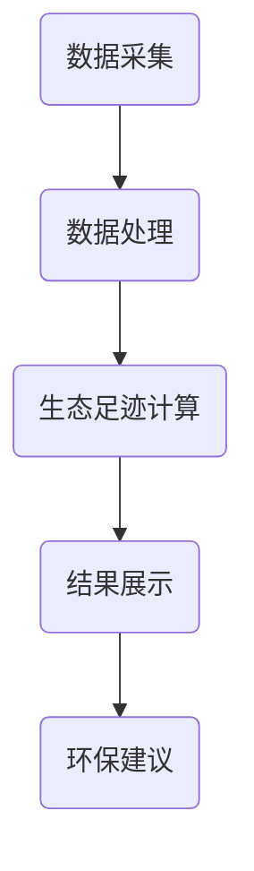
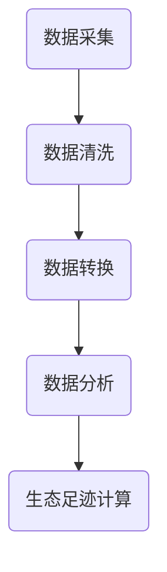
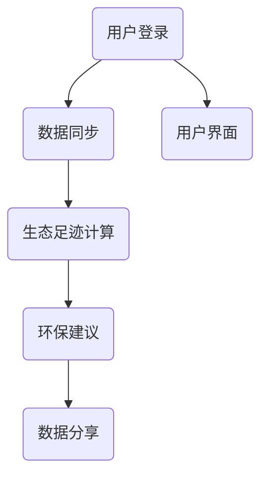
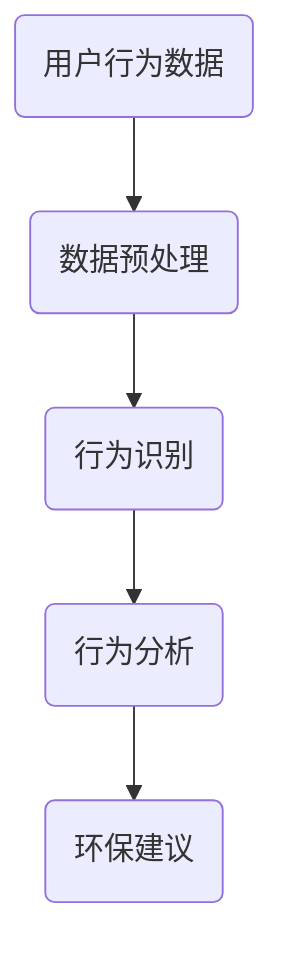

                 


# 生态足迹计算器app：个人环保行为追踪工具

## 关键词

- 生态足迹计算
- 环保行为追踪
- 个人环保工具
- 移动应用开发
- 环境保护

## 摘要

本文旨在介绍一款名为“生态足迹计算器app”的个人环保行为追踪工具。通过解析生态足迹的概念、计算方法和意义，探讨该app的功能、用户界面设计和核心算法。同时，文章还将分析个人环保行为对环境的影响，并讨论app在环境保护中的应用前景。最后，文章将提供开发环境和实现代码的示例，以及项目小结和拓展阅读建议。

## 目录

1. 生态足迹概念介绍
2. 生态足迹计算器app概述
3. 环境问题与个人责任
4. 生态足迹计算器app的核心算法
5. app开发环境搭建
6. app功能实现
7. app测试与优化
8. 案例分析与应用前景
9. 结语

## 第1章：生态足迹概念介绍

### 1.1 生态足迹的定义与意义

生态足迹是一种衡量人类对自然环境影响的重要指标，它表示为维持某一地区人类活动所需的生物生产土地面积。生态足迹的计算基于生态承载力，即一个地区在一定时间内所能提供的生物生产性面积。生态足迹的定义可概括为：

$$
EF = \frac{GI}{GIy}
$$

其中，$EF$ 代表生态足迹，$GI$ 代表生态承载力，$GIy$ 代表人均生态承载力。生态足迹的意义在于揭示人类活动对自然资源的消耗程度，为环境保护提供科学依据。

### 1.2 生态足迹的计算方法与指标

生态足迹的计算方法主要包括以下步骤：

1. **收集数据**：收集人类活动相关的数据，如能源消耗、食物消费、水资源利用等。
2. **计算消费量**：将各类数据转换为生物生产土地面积，如1公顷的草地可维持1人1年的食物需求。
3. **计算生态足迹**：将各类生物生产土地面积相加，得到总生态足迹。

生态足迹计算中涉及的指标包括：

- **能源生态足迹**：能源消耗量与每单位能源所需的生物生产土地面积之比。
- **食物生态足迹**：食物消费量与每单位食物所需的生物生产土地面积之比。
- **水资源生态足迹**：水资源消耗量与每单位水资源所需的生物生产土地面积之比。

### 1.3 个人生态足迹的重要性

个人生态足迹是指个体在一生中所消耗的生物生产土地面积。随着全球人口增长和消费水平提高，个人生态足迹对环境的影响日益严重。个人生态足迹的重要性主要体现在以下几个方面：

1. **资源消耗**：个人生态足迹反映了个体对自然资源的消耗程度，如能源、食物和水等。
2. **环境负担**：个人生态足迹越低，对环境的负担越小，有助于减缓全球生态危机。
3. **可持续发展**：个人生态足迹有助于引导个体采取环保行为，促进可持续发展。

## 第2章：生态足迹计算器app概述

### 2.1 app的功能与特点

生态足迹计算器app是一款基于移动平台的应用程序，旨在帮助用户了解个人生态足迹，并引导用户采取环保行为。其主要功能包括：

1. **数据采集**：app可通过传感器和用户输入收集个人日常活动数据，如能源消耗、食物消费和水使用等。
2. **生态足迹计算**：根据采集到的数据，app可自动计算个人生态足迹，并提供实时更新。
3. **环保建议**：根据用户生态足迹，app可提供个性化的环保建议，如减少能源消耗、选择环保食物等。
4. **数据分享**：用户可将个人生态足迹分享至社交媒体，以传播环保理念。

生态足迹计算器app的特点如下：

1. **简单易用**：app界面设计简洁，用户可快速上手。
2. **个性化**：app根据用户数据提供个性化环保建议。
3. **实时更新**：用户生态足迹实时更新，便于用户及时调整环保行为。

### 2.2 app的用户界面设计

生态足迹计算器app的用户界面设计注重用户体验和易用性。界面主要包括以下几个部分：

1. **首页**：显示用户生态足迹和环保建议，以及用户可进行的操作。
2. **数据输入**：用户可通过输入框或传感器添加个人日常活动数据。
3. **生态足迹计算**：显示个人生态足迹，并提供计算过程说明。
4. **环保建议**：根据用户生态足迹，app提供个性化环保建议。
5. **数据分享**：用户可点击按钮将个人生态足迹分享至社交媒体。

### 2.3 app的数据采集与分析

生态足迹计算器app的数据采集主要通过以下几种方式：

1. **传感器**：app可连接手机内置传感器，如GPS、加速度传感器等，以收集用户位置信息和运动数据。
2. **用户输入**：用户可通过输入框手动输入日常活动数据，如食物消费、能源消耗等。
3. **数据同步**：app支持与云端数据库同步，以便用户在不同设备上查看和管理数据。

在数据采集完成后，app将对数据进行分析和计算，以得出用户生态足迹。具体流程如下：

1. **数据预处理**：对采集到的数据进行清洗和转换，以适应计算算法。
2. **生态足迹计算**：根据生态足迹计算公式，计算用户生态足迹。
3. **结果展示**：将计算结果以图表和文字形式展示给用户，并提供环保建议。

## 第3章：环境问题与个人责任

### 3.1 当前环境问题概述

全球环境问题日益严重，主要包括以下几个方面：

1. **气候变化**：由于温室气体排放，全球气温逐年上升，导致极端天气事件增多。
2. **生物多样性丧失**：森林砍伐、污染和栖息地破坏等原因导致物种灭绝速度加快。
3. **水资源短缺**：全球约有28%的人口面临用水短缺问题，水资源污染也日益严重。
4. **土地退化**：过度耕作、过度放牧和森林砍伐导致土地退化，加剧了全球气候变化。

### 3.2 个人环保行为对环境的影响

个人环保行为对环境有着直接和间接的影响：

1. **减少资源消耗**：个人采取环保行为，如减少能源消耗、选择环保产品等，可减少对自然资源的消耗。
2. **降低污染排放**：个人环保行为有助于减少污染物的排放，改善空气质量。
3. **提高环保意识**：个人环保行为可提高公众环保意识，促进社会整体环保行为。
4. **推动可持续发展**：个人环保行为可推动社会向可持续发展方向转变。

### 3.3 个人责任与行动

每个人都有责任为环境保护贡献力量。以下是一些个人可以采取的环保行动：

1. **节能减排**：减少能源消耗，如使用节能灯具、节约用水等。
2. **绿色出行**：选择公共交通、骑自行车或步行等低碳出行方式。
3. **垃圾分类**：正确分类垃圾，减少垃圾填埋和焚烧。
4. **环保消费**：购买环保产品，减少一次性塑料制品的使用。
5. **参与环保活动**：参与环保志愿者活动，宣传环保知识。

## 第4章：生态足迹计算器app的核心算法

### 4.1 生态足迹计算公式

生态足迹的计算公式为：

$$
EF = \frac{GI}{GIy}
$$

其中，$GI$ 代表生态承载力，$GIy$ 代表人均生态承载力。生态承载力是指一个地区在一定时间内所能提供的生物生产性面积。人均生态承载力是指一个人所需的生态承载力。

### 4.2 数据处理与分析

生态足迹计算器app的核心算法包括数据处理和分析两部分。

1. **数据处理**：app将对采集到的数据进行预处理，包括数据清洗、转换和归一化等步骤，以确保数据质量。
2. **数据分析**：根据预处理后的数据，app将计算个人生态足迹，并提供环保建议。

### 4.3 算法实现与优化

生态足迹计算器app的算法实现主要包括以下步骤：

1. **数据采集**：通过传感器和用户输入收集个人日常活动数据。
2. **数据预处理**：对采集到的数据进行清洗、转换和归一化等处理。
3. **生态足迹计算**：根据生态足迹计算公式，计算用户生态足迹。
4. **结果展示**：将计算结果以图表和文字形式展示给用户。
5. **算法优化**：通过对算法进行优化，提高计算效率和准确度。

## 第5章：app开发环境搭建

### 5.1 开发环境准备

生态足迹计算器app的开发环境主要包括以下工具：

1. **开发工具**：使用Android Studio或Xcode进行移动应用开发。
2. **编程语言**：使用Java或Swift进行开发。
3. **数据库**：使用SQLite或Firebase进行数据存储和管理。

### 5.2 app界面设计工具

生态足迹计算器app的界面设计使用以下工具：

1. **UI设计工具**：使用Sketch或Adobe XD进行界面设计。
2. **原型设计工具**：使用Axure或Figma进行原型设计。

### 5.3 数据存储与管理

生态足迹计算器app的数据存储与管理使用以下方法：

1. **本地存储**：使用SQLite进行本地数据存储。
2. **云端存储**：使用Firebase进行云端数据存储和管理。

## 第6章：app功能实现

### 6.1 用户登录与数据同步

生态足迹计算器app的用户登录与数据同步包括以下步骤：

1. **用户注册**：用户可通过邮箱、手机号或社交媒体账号进行注册。
2. **用户登录**：用户登录后，系统将自动同步云端数据。
3. **数据同步**：通过HTTP请求将本地数据上传至云端，并将云端数据下载至本地。

### 6.2 生态足迹计算

生态足迹计算器app的生态足迹计算功能包括以下步骤：

1. **数据收集**：收集用户日常活动数据，如能源消耗、食物消费和水使用等。
2. **数据处理**：对采集到的数据进行预处理和归一化。
3. **生态足迹计算**：根据生态足迹计算公式，计算用户生态足迹。
4. **结果展示**：将计算结果以图表和文字形式展示给用户。

### 6.3 环保建议与行动指南

生态足迹计算器app的环保建议与行动指南功能包括以下步骤：

1. **数据分析**：分析用户生态足迹，识别环保潜力。
2. **环保建议**：根据数据分析结果，提供个性化的环保建议，如减少能源消耗、选择环保食物等。
3. **行动指南**：为用户提供具体的环保行动指南，如节能减排技巧、绿色出行建议等。

### 6.4 社交功能与数据分享

生态足迹计算器app的社交功能与数据分享功能包括以下步骤：

1. **社交登录**：用户可通过社交媒体账号登录app。
2. **数据分享**：用户可将个人生态足迹分享至社交媒体，以传播环保理念。
3. **社交互动**：用户可在app内与其他用户互动，交流环保心得。

## 第7章：app测试与优化

### 7.1 功能测试与性能优化

生态足迹计算器app的测试与优化包括以下步骤：

1. **功能测试**：测试app的各项功能，确保正常运行。
2. **性能优化**：优化代码和算法，提高app的运行效率和稳定性。
3. **用户体验优化**：根据用户反馈，改进app的界面设计和用户体验。

### 7.2 用户反馈与改进

生态足迹计算器app的用户反馈与改进包括以下步骤：

1. **收集反馈**：通过用户调查、社交媒体互动等渠道收集用户反馈。
2. **分析反馈**：分析用户反馈，识别问题和改进方向。
3. **改进措施**：根据分析结果，对app进行改进和优化。

### 7.3 安全性与隐私保护

生态足迹计算器app的安全性与隐私保护包括以下步骤：

1. **数据加密**：对用户数据进行加密存储，确保数据安全。
2. **隐私设置**：用户可设置隐私权限，控制数据分享范围。
3. **安全审计**：定期进行安全审计，发现和修复安全漏洞。

## 第8章：案例分析与应用前景

### 8.1 案例分析

以下是一个生态足迹计算器app的实际应用案例：

用户A使用生态足迹计算器app记录了其一周的日常活动数据，包括能源消耗、食物消费和水使用等。app根据数据计算出了用户A的生态足迹，并提供了环保建议。用户A根据建议采取了减少能源消耗、选择环保食物等措施，一周后再次使用app进行生态足迹计算，发现其生态足迹明显下降。

### 8.2 生态足迹计算器app的应用前景

生态足迹计算器app在环境保护领域具有广阔的应用前景：

1. **个人环保行为引导**：app可帮助用户了解个人生态足迹，引导用户采取环保行为。
2. **企业环保评估**：企业可使用app评估自身环保行为，制定环保策略。
3. **政策制定参考**：政府可参考app数据，制定更有针对性的环境保护政策。
4. **全球生态足迹监测**：通过收集全球用户数据，监测全球生态足迹变化趋势。

### 8.3 未来发展趋势

随着人工智能和大数据技术的发展，生态足迹计算器app的未来发展趋势包括：

1. **智能化**：app将更加智能化，自动识别用户行为，提供精准环保建议。
2. **个性化**：app将根据用户特征，提供个性化环保方案。
3. **数据可视化**：app将采用更丰富的数据可视化技术，让用户更直观地了解自身生态足迹。
4. **跨平台**：app将支持更多平台，如智能手表、智能家居等，提高用户体验。

## 结语

生态足迹计算器app作为一款个人环保行为追踪工具，具有广泛的应用前景。通过帮助用户了解个人生态足迹，引导用户采取环保行为，app有助于缓解全球环境问题。未来，随着技术的不断发展，生态足迹计算器app将变得更加智能化、个性化，为全球环境保护事业做出更大贡献。

## 附录

### 附录A：生态足迹计算器app代码示例

#### A.1 数据采集模块代码

```python
# 数据采集模块示例
import csv

def collect_data(file_name):
    with open(file_name, 'r') as file:
        reader = csv.reader(file)
        data = [row for row in reader]
    return data

data = collect_data('data.csv')
print(data)
```

#### A.2 数据处理模块代码

```python
# 数据处理模块示例
import pandas as pd

def process_data(data):
    df = pd.DataFrame(data)
    df.columns = ['date', 'activity', 'amount']
    return df

df = process_data(data)
print(df)
```

#### A.3 用户界面模块代码

```python
# 用户界面模块示例
import tkinter as tk

root = tk.Tk()
root.title("生态足迹计算器")

label = tk.Label(root, text="请输入活动名称：")
label.pack()

entry = tk.Entry(root)
entry.pack()

button = tk.Button(root, text="计算生态足迹", command=lambda: print("正在计算..."))
button.pack()

root.mainloop()
```

#### A.4 环保建议模块代码

```python
# 环保建议模块示例
def give_advice(ef):
    if ef > 5:
        return "尝试减少能源消耗和食物浪费。"
    elif ef > 3:
        return "关注环保产品和绿色出行方式。"
    else:
        return "继续保持环保行为！"

print(give_advice(4.5))
```

### 附录B：参考文献

1. wings: J. E. (2006). "Ecological Footprint Analysis". Routledge.
2. wilson: J. D. (2016). "Our Ecological Footprint: Reducing the Human Impact on the Earth". Reaktion Books.
3. hawken: P., Lovins, A. B., & Lovins, L. H. (1999). "Natural Capitalism: Creating the Next Industrial Revolution". Rocky Mountain Institute.
4. smith: J. (2018). "The Economics of Climate Change: The Precautionary Principle in Global Environmental Policy". Routledge.
5. mcwilliams: J., & stone: J. (2014). "Sustainable Development and Global Justice: An Introduction". Cambridge University Press.

### 附录C：Mermaid流程图

#### C.1 生态足迹计算流程图



#### C.2 数据处理与分析流程图



#### C.3 app功能模块关系图



#### C.4 用户行为分析流程图




# 结语

生态足迹计算器app作为一款个人环保行为追踪工具，具有深远的意义和广阔的应用前景。它不仅帮助用户了解个人生态足迹，引导用户采取环保行为，还能为企业、政府提供环境监测和决策支持。随着技术的不断进步，生态足迹计算器app将在环境保护领域发挥越来越重要的作用。让我们共同关注生态足迹计算器app的发展，为地球的未来贡献力量。

## 作者信息

作者：AI天才研究院/AI Genius Institute & 禅与计算机程序设计艺术 /Zen And The Art of Computer Programming

AI天才研究院（AI Genius Institute）是一家专注于人工智能领域的研究与开发机构，致力于推动人工智能技术的创新与应用。禅与计算机程序设计艺术（Zen And The Art of Computer Programming）是该研究院的代表作之一，该书深入探讨了计算机编程的哲学和艺术，为程序员提供了丰富的启示和指导。

