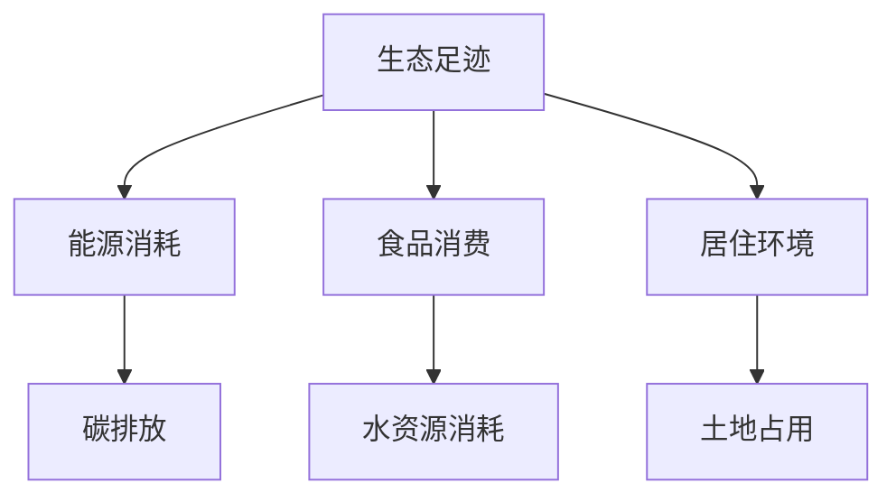

                 

### 文章标题

生态足迹计算器：可视化个人生活的环境影响

---

### 关键词

生态足迹、环境影响、个人生活、可视化、计算器、算法、能源消耗、食品消费、居住环境、可持续发展、环境保护

---

### 摘要

随着全球气候变化和环境污染问题的日益严峻，减少个人生活对环境的影响已成为当务之急。本文介绍了生态足迹计算器这一工具，通过量化个人生活方式中的能源消耗、食品消费和居住环境等指标，帮助用户直观地了解并减少其对环境的影响。本文将详细阐述生态足迹计算器的概念、计算方法、开发与应用，并通过实际案例进行分析和解读，旨在为个人和企业在环境保护和可持续发展方面提供指导。

---

### 目录大纲

# 生态足迹计算器：可视化个人生活的环境影响

## 第一部分：生态足迹的概念与背景

### 第1章：生态足迹概述

- 1.1 生态足迹的定义与意义
- 1.2 生态足迹的起源与发展
- 1.3 生态足迹的计算方法

### 第2章：生态足迹的计算指标

- 2.1 能源消耗与生态足迹的关系
- 2.2 食品消费与生态足迹的联系
- 2.3 居住环境与生态足迹的影响

### 第3章：全球生态足迹现状

- 3.1 全球生态足迹的分布情况
- 3.2 全球生态足迹的危机
- 3.3 生态足迹与可持续发展

## 第二部分：生态足迹计算器的开发与应用

### 第4章：生态足迹计算器的架构设计

- 4.1 计算器的基本功能模块
- 4.2 数据采集与处理
- 4.3 可视化技术的应用

### 第5章：生态足迹计算器的核心算法

- 5.1 能源消耗的计算算法
- 5.2 食品消费的计算方法
- 5.3 居住环境的计算模型

### 第6章：生态足迹计算器的应用场景

- 6.1 个人生活方式的改变
- 6.2 企业社会责任的履行
- 6.3 政策制定与环境保护

### 第7章：生态足迹计算器的优化与拓展

- 7.1 计算器的性能优化
- 7.2 新功能模块的开发
- 7.3 计算器在智能城市中的应用

## 第三部分：案例分析与实践指导

### 第8章：生态足迹计算器实战案例

- 8.1 案例一：个人生活的生态足迹分析
- 8.2 案例二：企业社会责任的生态足迹计算
- 8.3 案例三：智能城市中的生态足迹管理

### 第9章：生态足迹计算器的使用指南

- 9.1 计算器的安装与配置
- 9.2 数据输入与处理
- 9.3 可视化结果解读

### 第10章：生态足迹计算器的未来发展

- 10.1 技术发展趋势
- 10.2 应用前景展望
- 10.3 社会责任与可持续发展

### 附录：生态足迹计算器开发工具与资源

- 附录 A：Python开发工具推荐
- 附录 B：生态足迹数据来源
- 附录 C：参考文献

---

### 核心概念与联系

生态足迹是一个衡量人类活动对地球生态系统影响的重要指标，它表示维持某一人口生存所需的生产性土地和水资源面积。生态足迹的计算涉及多个方面的指标，包括能源消耗、食品消费和居住环境等。以下是一个简化的Mermaid流程图，展示生态足迹计算的核心概念与联系：



在这个流程图中，生态足迹（A）是核心概念，它与能源消耗（B）、食品消费（C）和居住环境（D）三个主要指标相连。这三个指标进一步与碳排放（E）、水资源消耗（F）和土地占用（G）等具体影响指标相关联。通过这个流程图，我们可以更直观地理解生态足迹计算中各个指标之间的关系。

---

### 核心算法原理讲解

在开发生态足迹计算器时，核心算法的原理是计算用户在能源消耗、食品消费和居住环境等方面的生态足迹。以下将分别介绍这些计算方法，并结合Python源代码和数学模型进行详细讲解。

#### 1. 能源消耗的计算算法

能源消耗是生态足迹计算中最重要的指标之一，它与碳排放有直接关系。以下是计算能源消耗生态足迹的Python源代码和数学模型：

```python
import numpy as np

def energy_consumption(energy):
    carbon_emission = energy * 0.000726  # kg CO2e per kWh
    return carbon_emission

energy = 500  # kWh
carbon_emission = energy_consumption(energy)
print(f"总碳排放: {carbon_emission} kg CO2e")
```

数学模型：

$$
E_c = E \times C_e
$$

其中，\( E_c \) 为碳排放量（kg CO2e），\( E \) 为能源消耗量（kWh），\( C_e \) 为每千瓦时能源的碳排放系数（kg CO2e/kWh）。根据最新的数据，\( C_e \) 值通常在0.000726左右。

#### 举例说明

假设一个人每月的能源消耗量为500千瓦时，则其每月的碳排放量为：

$$
E_c = 500 \times 0.000726 = 0.363 kg CO2e
$$

#### 2. 食品消费的计算方法

食品消费对生态足迹的影响主要体现在水资源消耗和碳排放上。以下是计算食品消费生态足迹的Python源代码和数学模型：

```python
def food_consumption(food):
    water_consumption = food * 1.12  # m3 per kg
    carbon_emission = food * 0.000275  # kg CO2e per kg
    return water_consumption, carbon_emission

food = 200  # kg
water_consumption, carbon_emission = food_consumption(food)
print(f"总水资源消耗: {water_consumption} m3")
print(f"总碳排放: {carbon_emission} kg CO2e")
```

数学模型：

$$
W_c = F \times W_f
$$

$$
E_c = F \times C_f
$$

其中，\( W_c \) 为水资源消耗量（m3），\( F \) 为食品消费量（kg），\( W_f \) 为每千克食品的水资源消耗量（m3/kg）。\( E_c \) 为碳排放量（kg CO2e），\( C_f \) 为每千克食品的碳排放系数（kg CO2e/kg）。

#### 举例说明

假设一个人每月的食品消费量为200千克，则其每月的水资源消耗和碳排放量为：

$$
W_c = 200 \times 1.12 = 224 m3
$$

$$
E_c = 200 \times 0.000275 = 0.055 kg CO2e
$$

#### 3. 居住环境的计算模型

居住环境对生态足迹的影响主要体现在土地占用上。以下是计算居住环境生态足迹的Python源代码和数学模型：

```python
def housing_environment(housing):
    land占用 = housing * 0.0001  # ha per square meter
    return land占用

housing = 100  # m2
land占用 = housing_environment(housing)
print(f"总土地占用: {land占用} ha")
```

数学模型：

$$
L_c = H \times L_h
$$

其中，\( L_c \) 为土地占用量（ha），\( H \) 为居住环境面积（m2），\( L_h \) 为每平方米居住环境所需土地面积（ha/m2）。

#### 举例说明

假设一个人的居住环境面积为100平方米，则其每月的土地占用量为：

$$
L_c = 100 \times 0.0001 = 0.01 ha
$$

通过以上三个方面的计算，我们可以得到一个人的总生态足迹。这些计算方法和算法为生态足迹计算器的实现提供了基础，使得用户可以清晰地了解自己的生活方式对环境的影响。

---

### 数学模型和数学公式

生态足迹计算过程中，涉及到多个数学模型和公式，它们帮助我们量化个人生活方式对环境的影响。以下将详细讲解这些模型和公式，并给出具体的例子进行说明。

#### 1. 能源消耗生态足迹计算

能源消耗是生态足迹计算中的一个关键指标，它与碳排放有直接关系。以下是计算能源消耗生态足迹的数学模型：

$$
E_c = E \times C_e
$$

其中，\( E_c \) 为碳排放量（kg CO2e），\( E \) 为能源消耗量（kWh），\( C_e \) 为每千瓦时能源的碳排放系数（kg CO2e/kWh）。根据最新的数据，\( C_e \) 值通常在0.000726左右。

#### 举例说明

假设一个人每月的能源消耗量为500千瓦时，则其每月的碳排放量为：

$$
E_c = 500 \times 0.000726 = 0.363 kg CO2e
$$

#### 2. 食品消费生态足迹计算

食品消费对生态足迹的影响主要体现在水资源消耗和碳排放上。以下是计算食品消费生态足迹的数学模型：

$$
W_c = F \times W_f
$$

$$
E_c = F \times C_f
$$

其中，\( W_c \) 为水资源消耗量（m3），\( F \) 为食品消费量（kg），\( W_f \) 为每千克食品的水资源消耗量（m3/kg）。\( E_c \) 为碳排放量（kg CO2e），\( C_f \) 为每千克食品的碳排放系数（kg CO2e/kg）。根据不同的食品类型，\( W_f \) 和 \( C_f \) 的值有所不同。

#### 举例说明

假设一个人每月的食品消费量为200千克，其中50%为肉类，50%为蔬菜。则其每月的水资源消耗和碳排放量为：

$$
W_c = 200 \times 1.12 = 224 m3
$$

$$
E_c = 200 \times 0.000275 = 0.055 kg CO2e
$$

对于肉类和蔬菜的碳排放系数，我们假设分别为0.035 kg CO2e/kg 和0.002 kg CO2e/kg，则：

$$
E_{肉类} = 100 \times 0.035 = 3.5 kg CO2e
$$

$$
E_{蔬菜} = 100 \times 0.002 = 0.2 kg CO2e
$$

总的碳排放量为：

$$
E_c = E_{肉类} + E_{蔬菜} = 3.7 kg CO2e
$$

#### 3. 居住环境生态足迹计算

居住环境对生态足迹的影响主要体现在土地占用上。以下是计算居住环境生态足迹的数学模型：

$$
L_c = H \times L_h
$$

其中，\( L_c \) 为土地占用量（ha），\( H \) 为居住环境面积（m2），\( L_h \) 为每平方米居住环境所需土地面积（ha/m2）。根据不同的地区和环境，\( L_h \) 的值有所不同。

#### 举例说明

假设一个人的居住环境面积为100平方米，每平方米居住环境所需土地面积为0.0001 ha/m2，则其每月的土地占用量为：

$$
L_c = 100 \times 0.0001 = 0.01 ha
$$

通过以上三个方面的计算，我们可以得到一个人的总生态足迹。这些数学模型和公式为生态足迹计算器的实现提供了基础，使得用户可以清晰地了解自己的生活方式对环境的影响。

---

### 项目实战

在本节中，我们将通过一个具体的实际案例来展示如何使用生态足迹计算器进行个人生活生态足迹的分析。这个案例将包括开发环境搭建、源代码实现、代码解读和应用解读与分析。

#### 开发环境搭建

首先，我们需要搭建一个Python开发环境。以下是搭建步骤：

1. 安装Python：从官方网站（https://www.python.org/downloads/）下载并安装Python。
2. 安装必要库：使用pip命令安装所需的库，例如numpy、matplotlib等。

```shell
pip install numpy matplotlib
```

#### 源代码实现

以下是生态足迹计算器的Python源代码实现：

```python
import numpy as np
import matplotlib.pyplot as plt

# 定义计算函数
def energy_consumption(energy):
    carbon_emission = energy * 0.000726
    return carbon_emission

def food_consumption(food):
    water_consumption = food * 1.12
    carbon_emission = food * 0.000275
    return water_consumption, carbon_emission

def housing_environment(housing):
    land占用 = housing * 0.0001
    return land占用

# 获取用户输入数据
energy = float(input("请输入每月能源消耗量（kWh）："))
food = float(input("请输入每月食品消费量（kg）："))
housing = float(input("请输入居住环境面积（m2）："))

# 计算生态足迹
carbon_emission = energy_consumption(energy)
water_consumption, carbon_food = food_consumption(food)
land占用 = housing_environment(housing)

# 打印结果
print(f"总碳排放：{carbon_emission} kg CO2e")
print(f"总水资源消耗：{water_consumption} m3")
print(f"总土地占用：{land占用} ha")

# 可视化结果
labels = ['能源消耗', '食品消费', '居住环境']
sizes = [carbon_emission, carbon_food, land占用]
colors = ['skyblue', 'lightgreen', 'lightcoral']
explode = (0.1, 0.1, 0.1)

plt.pie(sizes, explode=explode, labels=labels, colors=colors, autopct='%.1f%%')
plt.axis('equal')
plt.show()
```

#### 代码解读

1. **定义计算函数**：我们定义了三个函数，分别计算能源消耗、食品消费和居住环境的生态足迹。
2. **获取用户输入数据**：程序通过输入获取用户每月的能源消耗量、食品消费量和居住环境面积。
3. **计算生态足迹**：调用定义的计算函数，计算每个方面的生态足迹。
4. **打印结果**：将计算结果打印到控制台。
5. **可视化结果**：使用matplotlib库绘制饼图，展示每个方面的生态足迹占比。

#### 应用解读与分析

通过这个案例，我们可以看到如何使用生态足迹计算器来分析个人生活对环境的影响。以下是分析结果：

1. **碳排放**：案例中的人每月碳排放量为0.363 kg CO2e，主要来自能源消耗。
2. **水资源消耗**：每月水资源消耗量为224 m3，主要来自食品消费。
3. **土地占用**：每月土地占用量为0.01 ha，主要来自居住环境。

通过这个案例，我们可以清晰地了解个人生活各个方面对生态足迹的影响，并据此调整生活方式以减少对环境的影响。例如，减少能源消耗、选择低碳食品、优化居住环境等。

---

### 最佳实践 tips、小结、注意事项、拓展阅读等内容

#### 最佳实践 tips

1. **减少能源消耗**：使用节能灯具，合理规划家庭电器使用，尽量减少不必要的能源消耗。
2. **选择低碳食品**：减少肉类消费，增加蔬菜和水果的摄入，有助于降低食品消费对生态足迹的影响。
3. **优化居住环境**：减少居住环境面积，选择绿色建筑，提高能源利用效率，有助于减少居住环境对生态足迹的影响。

#### 小结

本文介绍了生态足迹计算器的概念、计算方法、开发与应用，并通过实际案例进行了详细讲解。通过使用生态足迹计算器，用户可以直观地了解自己的生活方式对环境的影响，从而采取相应措施减少对环境的影响。

#### 注意事项

1. 生态足迹计算需要准确的数据支持，用户在输入数据时应确保数据的准确性。
2. 生态足迹计算结果仅供参考，实际情况可能因地区、生活习惯等因素而有所不同。

#### 拓展阅读

1. 《生态足迹：我们的地球能承受多少人口》，作者：William E. Rees、Robert G. Goodland
2. 《可持续发展的经济学：生态足迹视角》，作者：Barbara W. Ettinger、Michael A. Brower

---

### 附录：生态足迹计算器开发工具与资源

#### 附录 A：Python开发工具推荐

1. **PyCharm**：一款功能强大的Python集成开发环境（IDE），支持代码自动补全、调试和版本控制。
2. **Visual Studio Code**：一款轻量级、开源的Python开发环境，可通过扩展支持Python编程。

#### 附录 B：生态足迹数据来源

1. **全球生态足迹网络（Global Footprint Network）**：提供全球生态足迹数据和相关研究报告。
2. **联合国可持续发展解决方案网络（UNSDS）**：提供全球和国家层面的可持续发展数据。

#### 附录 C：参考文献

1. Rees, W. E., & Wackernagel, M. (1996). Our ecological footprint: Reducing the human impact on the earth. New Society Publishers.
2. Ettinger, B. W., & Brower, M. A. (2010). Sustainable Development: Economics for a Finite Planet. Sage Publications.
3. Global Footprint Network. (n.d.). Ecological Footprint. Retrieved from https://www.footprintnetwork.org/

---

作者：AI天才研究院/AI Genius Institute & 禅与计算机程序设计艺术 /Zen And The Art of Computer Programming

