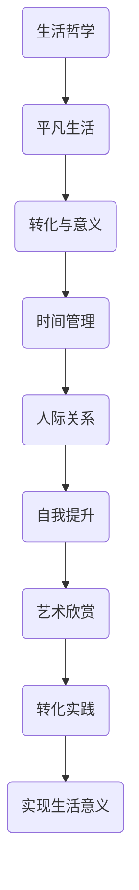

                 

### 文章标题

《生活的艺术：将平凡转化为意义》

> 关键词：生活哲学、平凡生活、转化、意义、时间管理、人际关系、自我提升、艺术欣赏

> 摘要：本文将从生活哲学的角度出发，探讨如何将平凡的生活转化为有意义的经历。通过分析时间管理、人际关系、自我提升和艺术欣赏等方面，我们将探讨如何在日常生活中创造价值和意义，帮助读者在生活中找到平衡和幸福。

### 目录大纲设计

**《生活的艺术：将平凡转化为意义》目录大纲**

# 第一部分：生活哲学的探索

## 1. 生活哲学的起源与演变
### 1.1 生活哲学的定义与核心概念
### 1.2 古代哲学家的生活哲学思想
### 1.3 现代生活哲学的兴起与发展

## 2. 平凡生活的意义
### 2.1 从平凡中发现独特
### 2.2 平凡生活的价值观念
### 2.3 平凡生活与幸福感的联系

## 3. 转化与意义
### 3.1 生活转化的概念
### 3.2 如何赋予平凡生活新的意义
### 3.3 转化中的自我成长

# 第二部分：生活艺术的具体实践

## 4. 时间管理
### 4.1 时间的本质与价值
### 4.2 有效时间管理策略
### 4.3 如何在忙碌中找到闲暇

## 5. 人际关系
### 5.1 人际关系的本质与重要性
### 5.2 人际交往的艺术
### 5.3 处理冲突与矛盾

## 6. 自我提升
### 6.1 自我认知的重要性
### 6.2 自我提升的方法与实践
### 6.3 持续成长的心态

## 7. 艺术欣赏
### 7.1 艺术的意义与作用
### 7.2 艺术欣赏的基本要素
### 7.3 如何在生活中融入艺术

# 第三部分：平凡生活的转化与意义实现

## 8. 平凡生活的故事
### 8.1 来自平凡的故事
### 8.2 这些故事对我们的生活有何启示
### 8.3 我们可以从故事中学到什么

## 9. 转化实践
### 9.1 转化的步骤与方法
### 9.2 实践中的困难与应对策略
### 9.3 成功转化的案例分析

## 10. 实现生活的意义
### 10.1 生活意义的定义与内涵
### 10.2 如何在生活中实现意义
### 10.3 持续追求生活意义的方法

# 附录

## 附录A：推荐阅读书目
### A.1 生活哲学经典著作
### A.2 人际关系与沟通技巧
### A.3 成长与自我提升

## 附录B：实用工具与资源
### B.1 时间管理工具
### B.2 人际关系培训课程
### B.3 自我提升APP推荐

### Mermaid 流程图：


### Python 源代码示例：
```python
# 示例代码：计算一组数字的平均值
def calculate_average(numbers):
    total = sum(numbers)
    average = total / len(numbers)
    return average

# 测试代码
numbers = [1, 2, 3, 4, 5]
result = calculate_average(numbers)
print("平均值：", result)
```

### 数学公式与详细讲解：
$$
\text{平均值} = \frac{\sum_{i=1}^{n} x_i}{n}
$$
其中，$x_i$表示第$i$个数，$n$表示总数。这个公式用于计算一组数据的平均值。

### 项目实战：
```python
# 项目实战：计算一组数字的平均值
import random

# 生成一组随机数
numbers = [random.randint(1, 100) for _ in range(10)]

# 打印原始数据
print("原始数据：", numbers)

# 计算平均值
average = calculate_average(numbers)

# 打印结果
print("平均值：", average)
```

### 代码解读与分析：
- 导入随机模块`random`用于生成随机数。
- 使用列表推导式生成一个包含10个随机整数的列表`numbers`。
- 打印出原始数据`numbers`。
- 调用`calculate_average`函数计算平均值，并将结果存储在变量`average`中。
- 打印出计算得到的平均值。

以上是一个简单的项目实战示例，展示了如何使用Python代码实现计算平均值的功能，并且对代码进行了详细的解读和分析。这有助于读者更好地理解代码的工作原理和如何进行实际应用。

接下来，我们将一步一步地深入探讨生活的艺术，将平凡转化为意义。本文将分为三个部分，分别从生活哲学的探索、生活艺术的具体实践以及平凡生活的转化与意义实现三个方面进行阐述。希望通过本文的分享，能够帮助读者在生活中找到更多的价值和意义，享受平凡中的美好。

### 生活哲学的起源与演变

生活哲学，作为一个古老而又永恒的议题，贯穿了人类历史的长河。其起源可以追溯到古代，而随着社会的发展和人类思维的进步，生活哲学也在不断地演变和丰富。在这个快速变化的时代，理解生活哲学的起源与演变，有助于我们更好地把握生活的本质，找到平凡生活中的意义。

#### 1.1 生活哲学的定义与核心概念

生活哲学是一种对生活的理性思考和探索，旨在回答“什么是生活”、“生活的意义是什么”以及“我们如何过好生活”等基本问题。它不仅仅是一种哲学思想，更是一种生活方式，一种对生活的态度和看法。

核心概念方面，生活哲学主要关注以下几个方面：

1. **存在与实在**：探讨存在的本质和实在的意义。
2. **自由与责任**：思考个体在社会中的自由与责任关系。
3. **幸福与满足**：探讨如何获得幸福和满足，以及幸福和满足的来源。
4. **道德与伦理**：探讨道德规范和伦理原则，以及如何在实际生活中应用这些原则。

#### 1.2 古代哲学家的生活哲学思想

古代哲学家的生活哲学思想，为我们理解生活哲学的起源提供了宝贵的启示。以下是一些著名哲学家的思想：

1. **苏格拉底**：强调理性思考和道德自我反省。他认为，通过不断的提问和自我反思，人们可以找到生活的真正意义。
   
2. **柏拉图**：提出了理想国和理念论，认为真理、美和善是超越物质世界的永恒存在，人们应当追求这些理想状态。

3. **亚里士多德**：强调实用主义，认为生活的目的是实现幸福（eudaimonia），通过道德行为和理智活动实现个人和社会的完善。

4. **庄子**：主张顺应自然，追求内心的自由和平静。他认为，人应当放下对世俗名利的追求，达到“逍遥游”的境界。

5. **孔子**：强调仁、义、礼、智、信等道德规范，认为通过修身齐家治国平天下，可以实现个人的幸福和社会的和谐。

#### 1.3 现代生活哲学的兴起与发展

现代生活哲学的兴起，与工业革命和现代社会的发展密切相关。在这个快速变化的时代，人们面临着前所未有的压力和挑战，如何找到生活的意义和平衡成为了一个重要议题。

1. **存在主义**：20世纪初，存在主义哲学在西方兴起，代表人物有萨特、海德格尔等。他们强调个体的自由和选择，认为生活的意义是由个体自己赋予的，而不是预先设定的。

2. **分析哲学**：20世纪，分析哲学成为主流，强调通过逻辑分析和语言分析来理解哲学问题。代表人物有维特根斯坦、艾耶尔等。他们试图将哲学问题简化为逻辑和语言问题，以便更精确地理解哲学的基本概念。

3. **后现代哲学**：20世纪末，后现代哲学兴起，对现代性和理性进行了批判。代表人物有福柯、德里达等。他们认为，知识和真理是相对的，而不是绝对的，社会和文化因素在塑造人的生活和认知方面起着重要作用。

通过上述对生活哲学的起源与演变的探讨，我们可以看到，生活哲学是一个不断发展的领域，它不仅反映了人类对生活的思考和探索，也为我们提供了理解生活、应对挑战的哲学工具。在接下来的章节中，我们将继续探讨平凡生活的意义，以及如何将平凡转化为意义。

### 平凡生活的意义

平凡生活是我们每个人每天必经的历程，它构成了我们生活的底色。那么，平凡生活的意义究竟是什么呢？从哲学的角度来看，平凡生活的意义不仅仅在于其表面上的平淡无奇，更在于我们如何从中发现独特、价值观念的塑造，以及与幸福感的联系。

#### 2.1 从平凡中发现独特

平凡生活中隐藏着无数的可能性，每一件看似微不足道的小事，都可能蕴含着独特的价值和意义。哲学家罗西尼曾说过：“生活不是一个舞台，而是一幅画，需要我们去填充色彩。”这句话提醒我们，平凡生活正是我们需要用心去感受和描绘的画布。

1. **日常生活的细节**：从一杯清香的咖啡到一场雨后的漫步，从与家人的对话到与朋友的聚会，这些看似平凡的生活细节，其实都是我们生活的一部分，也是我们寻找生活意义的起点。
2. **自我发现与成长**：在平凡的生活中，我们不断地面对各种挑战和选择，这些经历使我们逐渐认识自己，发现自我潜能，实现个人成长。

#### 2.2 平凡生活的价值观念

平凡生活的价值观念，是我们对社会、对生活的基本态度和信念。这些价值观不仅影响着我们如何看待生活，也影响着我们如何与他人相处。

1. **包容与理解**：平凡生活教会我们包容和理解的价值观。在与他人相处的过程中，我们需要学会尊重不同的观点和生活方式，以开放的心态面对世界。
2. **坚持不懈**：平凡生活中充满了各种挑战和困难，但正是这些挑战和困难，培养了我们的坚持不懈精神。无论面对什么样的困境，我们都需要保持积极的态度，坚持不懈地追求目标。
3. **珍惜当下**：平凡生活提醒我们珍惜当下，因为每一个当下都是独一无二的。通过珍惜当下，我们能够更好地体验生活的美好，感受到生命的意义。

#### 2.3 平凡生活与幸福感的联系

幸福感是平凡生活的核心，它源于我们对生活的满足和快乐。在平凡的生活中，幸福感往往隐藏在简单的日常中。

1. **日常的幸福瞬间**：从孩子的一声“爸爸/妈妈”到爱人的一句关心，这些看似平凡的瞬间，都是我们幸福感的重要来源。
2. **心灵的满足**：平凡生活不仅带来物质的满足，更带来心灵的满足。通过在平凡生活中找到意义和目标，我们能够实现内心的平和与满足。

总之，平凡生活的意义在于我们如何从中发现独特、塑造价值观念，以及实现幸福感的提升。在接下来的章节中，我们将探讨如何将平凡的生活转化为有意义的经历，实现自我成长和生命的丰富。

### 转化与意义

在探讨平凡生活的意义之后，我们需要进一步思考如何将这种平凡转化为更有意义的存在。生活中，每一次经历、每一个瞬间都蕴含着转化的可能性，关键在于我们如何去发现、理解并实现这种转化。

#### 3.1 生活转化的概念

生活转化是指将日常生活中的普通经历通过某种方式赋予新的意义和价值，使其从平凡变得不平凡。这种转化可以是内在的，如个人认知和情感的转变；也可以是外在的，如环境和情境的改变。以下是几个关键点：

1. **内在转化**：内在转化主要涉及个人内心的成长和变化。通过反思和自我探索，我们可以从内心深处找到生活的意义，即使外部环境不变，也能在内心体验到新的层次和意义。
2. **外在转化**：外在转化通常需要我们主动采取行动，通过改变环境、建立新关系或参与新的活动，来赋予生活新的维度和体验。

#### 3.2 如何赋予平凡生活新的意义

要赋予平凡生活新的意义，我们需要从以下几个方面入手：

1. **改变视角**：有时候，生活的意义并不在于事件本身，而在于我们如何看待这些事件。通过改变视角，我们可以发现平凡中的非凡。例如，面对日常的琐碎事务，我们可以将其视为一种锻炼和提升的机会。
   
2. **设定目标**：给自己设定明确的短期和长期目标，可以帮助我们在平凡的生活中找到方向和动力。这些目标可以是职业上的提升，也可以是个人兴趣的培养，或者是家庭和社区的贡献。
   
3. **创造性思维**：运用创造性思维，将平凡的日常活动赋予新的意义。例如，将日常的烹饪过程转化为创作美味佳肴的艺术，将散步变成探索自然的机会。

4. **感恩心态**：保持感恩的心态，珍惜生活中的每一份给予，即使是看似微不足道的事情。通过感恩，我们能够更好地感受到生活的美好，从而赋予生活更多的意义。

#### 3.3 转化中的自我成长

转化不仅仅是一种外在的行为，更是内在的成长过程。在生活的转化中，自我成长是一个不可或缺的环节。

1. **自我认知**：通过自我反思和认识，了解自己的优势和不足，明确自己的价值观和目标。自我认知是自我成长的第一步，也是实现生活转化的基础。
   
2. **持续学习**：学习是一种自我提升的方式，通过不断地学习新知识和技能，我们能够拓宽视野，增加应对生活挑战的能力。学习不仅限于学术知识，还包括生活技能、人际关系处理等各个方面。

3. **积极心态**：积极的心态是实现自我成长的关键。在面对困难和挫折时，积极的心态可以帮助我们保持信心，找到解决问题的方法，从而实现自我成长。

通过上述的转化与意义的探讨，我们可以看到，将平凡生活转化为有意义的存在并不是一个遥远的目标，而是可以通过改变视角、设定目标、创造性思维和感恩心态等方式实现的。在接下来的章节中，我们将深入探讨如何在生活中实践这些转化，从而实现更加丰富和有意义的生活。

### 时间管理

时间管理是现代生活艺术中不可或缺的一环，它关乎我们如何高效地利用时间，实现个人目标和社会责任。在本文中，我们将探讨时间的本质与价值，介绍有效的时间管理策略，并分享如何在忙碌中找到闲暇。

#### 4.1 时间的本质与价值

时间是一种不可再生资源，是生命活动的基础。时间的本质在于它的不可逆性和有限性，每一刻都不可复制，一旦流逝就无法找回。因此，时间是衡量效率和生活质量的重要标准。

1. **时间的不可逆性**：时间向前流逝，无法倒回，过去的时光无法重来。这意味着我们必须珍惜每一刻，抓住眼前的机会。
   
2. **时间的高效性**：高效的利用时间，可以提高工作和生活的质量，实现更多的目标和梦想。通过合理规划时间，我们可以避免时间的浪费，将有限的时间投入到更有价值的事情上。

#### 4.2 有效时间管理策略

有效的时间管理策略可以帮助我们提高工作效率，减轻生活压力，实现个人和职业目标。以下是一些实用的时间管理策略：

1. **目标设定**：明确目标和优先级是时间管理的基础。通过设定明确的目标，我们可以更清晰地规划时间，确保每一分每一秒都被有效地利用。

2. **时间块化**：将时间划分为若干块，并为每一块时间分配特定的任务。这种方法可以帮助我们集中注意力，提高工作效率。例如，可以将工作时间划分为40分钟的专注工作时间和10分钟的休息时间。

3. **优先级排序**：根据任务的紧急程度和重要性，对任务进行排序。重要且紧急的任务应优先处理，重要但不紧急的任务可以安排在空闲时间。

4. **避免拖延**：拖延是时间管理的大敌。为了克服拖延，可以采取以下方法：
   - **设定截止日期**：为自己设定明确的截止日期，以增加任务完成的时间压力。
   - **分解任务**：将大任务分解为小任务，逐步完成，以减少任务的难度和压力。
   - **立即行动**：对于小任务或可以立即完成的任务，不要拖延，立即行动。

5. **避免多任务处理**：尽管多任务处理看起来能够同时处理多个任务，但实际上会降低工作效率和任务质量。尽量集中精力处理单一任务，提高专注力。

6. **休息与放松**：合理安排休息和放松时间，有助于恢复精力，提高工作效率。例如，每工作一段时间后，可以进行短暂的休息或活动。

#### 4.3 如何在忙碌中找到闲暇

在忙碌的生活中，找到闲暇是保持身心健康的重要方式。以下是一些实用的方法：

1. **规划休息时间**：在日程安排中，预留出固定的休息时间，用于放松和充电。例如，每天安排一段午休时间，或每周安排一次短暂的旅行或度假。

2. **优先处理事务**：合理安排工作任务，将重要的任务优先处理，避免在忙碌中不断堆积事务。

3. **利用碎片时间**：利用碎片时间进行轻松的活动，如阅读、听音乐、散步等。这些活动不仅能够放松身心，还可以提高生活质量。

4. **简化生活**：简化生活，减少不必要的物品和活动，有助于减轻生活压力。例如，可以减少社交媒体的使用，简化日常家务和事务。

5. **培养兴趣爱好**：培养兴趣爱好，可以让我们在忙碌的生活中找到乐趣和放松。例如，学习一门新技能、练习瑜伽或参加社区活动。

通过上述的时间管理策略和寻找闲暇的方法，我们可以在忙碌的生活中找到平衡，提高工作效率和生活质量。在接下来的章节中，我们将继续探讨人际关系的重要性，以及如何处理人际关系中的冲突和矛盾。

### 人际关系

人际关系是生活艺术中至关重要的一环，它不仅影响我们的心理健康，还决定我们的生活质量。良好的人际关系能够带来支持、理解与快乐，而冲突与矛盾则是人际关系中不可避免的一部分。在这个部分，我们将探讨人际关系的本质与重要性，人际交往的艺术，以及处理冲突与矛盾的方法。

#### 5.1 人际关系的本质与重要性

人际关系是指个体之间由于一定的社会关系和社会活动而形成的心理和行为的联系。这些联系可以是家庭关系、友谊、工作关系等。人际关系不仅影响我们的情感状态，还影响我们的行为和决策。

1. **情感支持**：良好的人际关系能够为我们提供情感支持，使我们感到被理解、被接纳。这种情感支持有助于缓解压力，增强心理健康。

2. **社交技能**：人际交往是一种重要的社交技能，它有助于我们更好地适应社会环境，建立和维护人际关系。

3. **资源交换**：人际关系还涉及到资源的交换，如信息、资源、机会等。通过良好的人际关系，我们可以获取更多的资源，提高生活质量。

4. **个人成长**：与他人交往，我们可以学习到不同的观点和经验，从而促进个人成长和发展。

#### 5.2 人际交往的艺术

人际交往的艺术在于如何有效地与他人沟通，建立和维护良好的人际关系。以下是一些关键技巧：

1. **倾听**：倾听是人际交往的基础。通过倾听，我们可以了解对方的观点和需求，从而更好地沟通和理解。

2. **表达**：清晰、准确地表达自己的想法和感受，是建立良好人际关系的重要前提。在表达时，要注意语气、态度和表达方式，避免误解和冲突。

3. **尊重**：尊重他人的观点和感受，是人际交往的基本原则。尊重不仅体现在语言上，还体现在行为上，如不打断他人说话、不侵犯他人隐私等。

4. **同理心**：同理心是指站在他人的角度思考问题，理解他人的感受。通过同理心，我们可以更好地与他人建立联系，增进信任和理解。

5. **沟通技巧**：有效的沟通技巧包括非语言沟通（如肢体语言、面部表情）、提问技巧、回应技巧等。通过这些技巧，我们可以更好地与他人沟通，减少误解和冲突。

#### 5.3 处理冲突与矛盾

在人际关系中，冲突与矛盾是不可避免的。关键在于如何处理这些冲突与矛盾，以维护良好的人际关系。以下是一些处理方法：

1. **冷静处理**：在冲突发生时，保持冷静，避免情绪化的回应。冷静处理有助于我们更理性地分析问题，找到解决问题的方法。

2. **开放沟通**：与对方进行开放、坦诚的沟通，表达自己的观点和感受，并倾听对方的意见。通过沟通，我们可以找到共同点，解决问题。

3. **妥协与让步**：在某些情况下，妥协与让步是必要的。通过妥协和让步，我们可以维护关系，找到双方都能接受的解决方案。

4. **寻求第三方调解**：当冲突难以自行解决时，可以寻求第三方的帮助，如心理咨询师、调解员等。第三方可以提供客观的建议和解决方案。

5. **反思与改进**：在冲突与矛盾解决后，反思自己的行为和沟通方式，找出不足之处，并加以改进。通过反思与改进，我们可以提高人际交往的能力，减少冲突的发生。

总之，人际关系是我们生活中不可或缺的一部分，它影响着我们的心理健康和生活质量。通过掌握人际交往的艺术和处理冲突的方法，我们能够建立和维护良好的人际关系，享受更美好的人生。在接下来的章节中，我们将探讨自我提升的重要性，以及如何通过自我认知、方法与实践来实现自我提升。

### 自我提升

自我提升是生活中不可或缺的一环，它关乎我们的成长、幸福和成就感。在这个快速变化的时代，自我提升不仅是为了适应社会发展的需求，更是为了实现个人价值的最大化。那么，如何进行有效的自我提升呢？以下将从自我认知的重要性、具体方法和实践策略三个方面进行探讨。

#### 6.1 自我认知的重要性

自我认知是指对自己的了解和认识，包括自己的性格、能力、价值观和需求等。自我认知的重要性在于，它为我们的自我提升提供了方向和动力。

1. **明确个人目标**：自我认知可以帮助我们明确个人目标，了解自己想要什么，从而有针对性地制定计划和行动。

2. **发现自己的优势与劣势**：通过自我认知，我们可以发现自己的优势和劣势，从而在优势领域继续发展，同时在劣势领域寻求改进。

3. **提升自我效能感**：自我认知能够提升我们的自我效能感，即对自己完成任务的信心。高自我效能感有助于我们面对挑战，克服困难，实现自我提升。

4. **促进心理健康**：自我认知有助于我们更好地理解自己，减少自我负面评价，提高心理健康水平。

#### 6.2 自我提升的方法与实践

自我提升的方法多种多样，以下是一些常用且有效的自我提升方法：

1. **阅读与学习**：阅读是自我提升的重要途径，通过阅读可以拓展知识面，提升思维能力。此外，定期学习新的知识和技能，可以保持竞争力的提升。

2. **反思与自我评估**：定期反思自己的行为和表现，进行自我评估，找出不足之处，并制定改进计划。反思和自我评估有助于我们不断地自我提升。

3. **培养良好的习惯**：良好的习惯是自我提升的基石，如早睡早起、锻炼身体、坚持阅读等。通过培养良好的习惯，我们可以提高生活质量和效率。

4. **设定目标与计划**：设定明确的目标和计划是自我提升的关键。通过设定目标，我们可以有针对性地进行行动，并通过计划来监控和调整自己的行动。

5. **积极参与社交活动**：积极参与社交活动，与他人交流和学习，可以拓展视野，提升人际关系能力，同时也是一种自我提升的方式。

6. **寻求专业帮助**：在自我提升的过程中，我们可以寻求专业教练、导师或心理咨询师的帮助。专业人士可以提供专业的指导和建议，帮助我们更快地实现自我提升。

#### 6.3 持续成长的心态

持续成长的心态是自我提升的关键，它包括以下几个方面：

1. **积极的心态**：保持积极的心态，相信自己可以不断进步和成长。积极的心态有助于我们克服困难，迎接挑战。

2. **接纳不完美**：自我提升的过程中，我们难免会遇到失败和挫折。接纳不完美，意味着我们能够从失败中吸取教训，不断改进。

3. **持续学习**：学习是一种持续的过程，而不是一劳永逸的。通过持续学习，我们可以不断地更新知识，提升技能。

4. **灵活适应**：在面对变化和挑战时，灵活适应是非常重要的。通过灵活适应，我们可以更好地应对生活中的各种变化。

5. **自我激励**：自我激励是持续成长的重要动力。通过自我激励，我们可以保持积极向上的心态，克服困难，实现自我提升。

总之，自我提升是一个长期而持续的过程，它需要我们不断地进行自我认知、学习、实践和反思。通过掌握有效的自我提升方法，保持持续成长的心态，我们能够实现个人价值的最大化，享受更加丰富和有意义的人生。

### 艺术欣赏

艺术欣赏是生活中不可或缺的一部分，它不仅丰富了我们的情感世界，也提升了我们的审美能力。通过艺术欣赏，我们可以更好地理解世界，感受生命的多样性和丰富性。以下将探讨艺术的意义与作用、艺术欣赏的基本要素，以及如何将艺术融入生活。

#### 7.1 艺术的意义与作用

艺术是一种表达和传递情感、思想、价值观的方式，它超越语言的局限，直接触动人的内心。艺术的意义和作用体现在以下几个方面：

1. **情感表达**：艺术作品是一种情感表达的方式，通过绘画、音乐、文学等艺术形式，艺术家能够将自己的情感和思想传达给观众。

2. **文化传承**：艺术是文化传承的重要载体，它记录了不同时期、不同文化的精神和风貌。通过欣赏艺术，我们可以了解不同文化的历史和传统。

3. **审美提升**：艺术欣赏有助于提升我们的审美能力，使我们更加敏锐地感受美，从而在日常生活中也能发现和创造美。

4. **心理疗愈**：艺术具有疗愈作用，通过欣赏艺术作品，我们可以缓解压力，放松心情，提高心理健康水平。

5. **精神启迪**：艺术作品往往蕴含深刻的哲理和思考，通过欣赏艺术，我们可以获得精神上的启迪和感悟。

#### 7.2 艺术欣赏的基本要素

艺术欣赏需要我们具备一定的艺术知识和鉴赏能力，以下是一些基本要素：

1. **形式美**：形式美是艺术作品的外观特征，包括色彩、线条、形状、构图等。欣赏形式美，需要我们具备基本的审美能力。

2. **意境美**：意境美是艺术作品所营造的情境和氛围，它往往通过细节和情感表达来传达。欣赏意境美，需要我们具备深入的理解力和感受力。

3. **思想内涵**：艺术作品不仅是一种美的表现，还蕴含着丰富的思想内涵。欣赏思想内涵，需要我们具备一定的文化素养和哲学思考能力。

4. **情感共鸣**：艺术欣赏是一种情感共鸣的过程，通过作品，我们能够感受到艺术家的情感和思想，从而产生共鸣。

5. **文化背景**：了解艺术作品的文化背景和历史背景，有助于我们更好地理解作品的意义和价值。

#### 7.3 如何在生活中融入艺术

将艺术融入生活，不仅可以提升生活质量，还能让我们更加享受生活的美好。以下是一些实用的方法：

1. **装饰家居**：在家庭环境中摆放艺术品，如绘画、雕塑、装饰品等，可以提升家居的审美价值和生活品质。

2. **音乐陪伴**：音乐是一种美妙的艺术形式，通过听音乐，我们可以放松心情，缓解压力。在日常生活中，可以选择播放轻音乐或自己喜欢的音乐。

3. **阅读文学**：阅读文学作品，可以拓展我们的知识面，提升思维能力和情感表达能力。在空闲时间，可以选择一本好书，享受阅读的乐趣。

4. **参与艺术活动**：参加艺术展览、音乐会、戏剧演出等艺术活动，可以让我们近距离欣赏艺术作品，感受艺术的美。

5. **艺术创作**：自己动手创作艺术作品，如绘画、摄影、手工艺品等，可以让我们体验到创造的乐趣，同时提升我们的审美和动手能力。

总之，艺术欣赏是生活中的一门艺术，通过欣赏和创作艺术，我们可以提升自己的审美能力和生活质量。在接下来的章节中，我们将探讨如何将平凡生活转化为有意义的经历，实现生活的意义。

### 平凡生活的故事

平凡生活中，有许多看似普通却充满启示的故事，这些故事不仅给我们带来了心灵的触动，也为我们提供了如何将平凡转化为意义的实际案例。以下将分享几个平凡生活的故事，并探讨这些故事对我们的生活有何启示，以及我们可以从中学到什么。

#### 8.1 来自平凡的故事

故事一：社区志愿者

小明是一名普通的白领，每天忙碌于工作和家庭之间。然而，他在业余时间积极参与社区的志愿者活动，帮助老人、照顾孤儿，还为社区的环保工作贡献力量。通过这些志愿活动，小明不仅结识了许多志同道合的朋友，还感受到了帮助他人的快乐和成就感。

故事二：家庭主妇的绘画梦想

李姐是一名家庭主妇，她在家照顾孩子和家务。然而，她内心一直有一个绘画的梦想。在朋友的鼓励下，李姐报名参加了绘画班，利用周末时间学习绘画。经过几年的努力，她的绘画作品在社区展览中获得了好评，甚至被一些艺术馆收藏。

故事三：退休教师的社区教育

张老师是一名退休教师，他热爱教育事业。退休后，张老师并没有选择安逸的生活，而是投身于社区的义务教育工作，为孩子们提供免费的辅导。他的无私奉献和热情感染了整个社区，许多家庭受益于此。

#### 8.2 这些故事对我们的生活有何启示

1. **平凡中的不平凡**：这些故事告诉我们，平凡的生活中同样可以找到不平凡的价值。每个人都有自己的潜能和梦想，只要愿意去发现和实现，就能在平凡中创造出不平凡的成就。

2. **热爱与坚持**：无论是小明、李姐还是张老师，他们都有一个共同点，那就是对所做的事情充满热爱，并且坚持不懈。热爱和坚持是成功的关键，也是实现梦想的动力。

3. **积极影响他人**：通过参与志愿活动、追求艺术梦想或投身教育事业，这些故事中的主人公不仅实现了自己的价值，还积极影响了他人，带来了正能量。这种积极的影响不仅提升了他们的生活质量，也提升了整个社区的生活品质。

#### 8.3 我们可以从故事中学到什么

1. **发现自己的潜能**：这些故事提醒我们，每个人都有自己的潜能，只要我们愿意去挖掘和开发。通过不断尝试和努力，我们可以发现自己的潜能，实现个人成长。

2. **热爱生活**：热爱生活是创造价值的关键。只有当我们真正热爱自己的生活，才能从中找到快乐和意义。热爱生活，意味着珍惜每一个瞬间，用心去感受生活的美好。

3. **积极行动**：这些故事中的主人公都是通过积极行动来实现自己的梦想和价值。行动是改变生活的第一步，只有积极行动，我们才能实现梦想，实现生活的转化。

4. **影响他人**：通过积极影响他人，我们可以带来更多的正能量，提升整个社会的幸福感。无论是在家庭、社区还是工作中，我们都可以通过自己的行动，积极影响他人，为生活增添色彩。

总之，平凡生活的故事不仅给我们带来了心灵的触动，也为我们提供了将平凡转化为意义的实际案例。通过这些故事，我们可以学习到许多宝贵的人生经验，启发我们在自己的生活中发现更多的价值和意义。

### 转化实践

要将平凡生活转化为有意义的经历，需要我们采取一系列具体的步骤和方法。在本文的第九部分，我们将详细探讨转化的步骤与方法，分享实践中的困难与应对策略，并分析成功转化的案例。

#### 9.1 转化的步骤与方法

1. **自我反思**：首先，我们需要进行自我反思，了解自己的兴趣、优势和价值观。通过反思，我们可以明确自己的目标，找到生活的方向。

2. **设定目标**：在明确自己的兴趣和优势后，设定具体的、可衡量的目标。这些目标可以是短期目标，如学习一项新技能；也可以是长期目标，如实现职业晋升或创业。

3. **制定计划**：为了实现目标，我们需要制定详细的计划。计划应包括具体的行动步骤、时间安排和资源分配。

4. **付诸实践**：按照计划行动，付诸实践。在实践中，我们要保持耐心和毅力，不断调整和完善计划。

5. **持续评估**：定期评估自己的进展，检查是否达到预期目标。根据评估结果，调整计划，确保目标的实现。

6. **反思与总结**：在实践结束后，进行反思与总结，总结经验教训，为下一次的转化做好准备。

#### 9.2 实践中的困难与应对策略

在转化的过程中，我们难免会遇到各种困难和挑战。以下是一些常见的困难以及应对策略：

1. **时间管理困难**：应对策略：合理安排时间，将重要任务优先处理；利用碎片时间进行学习和实践。

2. **动力不足**：应对策略：设定明确的短期目标，保持对目标的热情和动力；寻找伙伴或导师，互相鼓励和支持。

3. **资源不足**：应对策略：寻找免费或低成本的学习资源；寻求亲友或社区的帮助。

4. **挫折与失败**：应对策略：接纳失败，从失败中学习经验教训；保持积极心态，继续努力。

#### 9.3 成功转化的案例分析

以下是一些成功转化的案例，通过这些案例，我们可以了解到如何将平凡生活转化为有意义的存在。

1. **李明的创业故事**：
   李明原本是一名普通的上班族，他对摄影有着浓厚的兴趣。在自我反思和目标设定后，他决定辞去工作，专注于摄影。经过几年的努力，他的摄影作品在社交媒体上获得了广泛关注，并开始接拍商业项目。如今，李明已成为一位成功的摄影师，他的生活也因此变得充实而有意义。

2. **王芳的公益之路**：
   王芳是一名家庭主妇，她一直热衷于公益事业。在家庭和孩子的支持下，她开始积极参与社区的公益活动，如为孤儿院捐赠物资、组织环保活动等。通过这些活动，王芳不仅帮助了他人，也提升了自身的价值和成就感。

3. **张伟的艺术追求**：
   张伟是一名退休教师，他对绘画有着浓厚的兴趣。退休后，他报名参加了绘画班，通过不懈的努力，他的绘画作品在社区展览中获得了好评。他的艺术追求不仅带来了精神上的满足，也为社区带来了文化和艺术的活力。

这些成功转化的案例告诉我们，只要我们愿意去发现和实现，就能在平凡的生活中创造出非凡的价值。在接下来的章节中，我们将探讨如何实现生活的意义，并为持续追求生活意义提供方法。

### 实现生活的意义

在探讨了如何将平凡生活转化为有意义的存在后，接下来我们需要思考如何在实际生活中实现生活的意义。生活的意义不仅仅是追求物质上的满足，更在于精神层面的富足和内心的平和。以下将阐述生活意义的定义与内涵，以及如何在日常生活中实现意义和持续追求生活意义的方法。

#### 10.1 生活意义的定义与内涵

生活意义是指个体在生活中所追求的目标和价值，它超越了日常琐事和物质需求，触及到更深层次的精神层面。生活意义可以包括以下几个方面：

1. **个人成长**：通过不断学习和提升，实现个人潜能的发挥和自我价值的实现。
2. **人际关系**：与他人建立积极、健康的关系，互相支持、理解与成长。
3. **贡献社会**：通过工作、志愿活动等方式，为社会做出贡献，实现个人价值。
4. **自我实现**：追求自我价值，实现个人梦想，找到人生的目标和方向。
5. **精神富足**：通过艺术、哲学、宗教等途径，实现精神上的满足和内心平静。

#### 10.2 如何在生活中实现意义

要实现生活的意义，我们需要采取一些具体的方法和策略：

1. **明确个人目标**：首先，我们需要明确个人目标，这包括短期和长期的目标。这些目标应与我们的价值观和兴趣相符合，能够激发我们的内在动力。

2. **持续学习**：通过不断学习和提升自己的知识和技能，我们可以实现个人成长，增加对生活的掌控感。学习不仅包括专业领域，还可以是兴趣爱好或新技能。

3. **积极参与社会活动**：参与社会活动，如志愿服务、社区活动等，可以帮助我们与他人建立联系，同时也能为社会做出贡献。这些活动可以带来成就感和满足感。

4. **培养人际关系**：建立和维护良好的人际关系是生活意义的重要部分。通过倾听、支持和理解他人，我们可以与他人建立深厚的友谊，增加生活的幸福感。

5. **追求精神富足**：通过艺术、哲学、宗教等方式，我们可以寻找精神上的满足和内心的平静。这些活动可以帮助我们反思生活，找到更深层次的意义。

6. **自我反思**：定期进行自我反思，评估自己的行为和生活方式，了解自己的需求和目标，调整自己的行为和计划。

#### 10.3 持续追求生活意义的方法

为了持续追求生活的意义，我们需要采取以下方法：

1. **设定长远目标**：设定长远目标，如职业发展、个人成长等，并制定具体的计划和时间表。

2. **保持好奇心和开放心态**：保持好奇心和开放心态，对新事物和不同观点持开放态度，这有助于我们不断学习和成长。

3. **平衡工作与生活**：保持工作与生活的平衡，合理安排时间，确保有足够的时间进行自我提升、休闲和陪伴家人。

4. **持续自我提升**：通过阅读、学习、锻炼等方式，不断自我提升，保持对生活的热爱和动力。

5. **建立支持系统**：建立支持系统，如亲友、导师、教练等，他们可以提供支持和鼓励，帮助我们克服困难，实现目标。

6. **定期评估和调整**：定期评估自己的进展，根据实际情况调整目标和计划，确保持续追求生活意义。

通过上述的方法和策略，我们可以在日常生活中实现生活的意义，并持续追求更高的生活质量。重要的是，我们要认识到生活意义是一个持续的过程，需要我们不断地努力和追求。在追求生活意义的过程中，我们不仅能够实现自我价值，也能为他人和社会带来积极的影响。

### 附录

#### 附录A：推荐阅读书目

**A.1 生活哲学经典著作**
1. **《庄子》**：中国古代哲学经典，强调顺应自然，追求内心的自由和平静。
2. **《存在与时间》**：德国哲学家海德格尔的作品，探讨存在的本质和意义。
3. **《苏菲的世界》**：乔斯坦·贾德创作的一本哲学入门书籍，通过讲述一个少女苏菲的哲学探索之旅，介绍了西方哲学的发展。

**A.2 人际关系与沟通技巧**
1. **《如何影响人们》**：美国心理学家罗伯特·西奥迪尼的作品，探讨了人际影响力的六个基本原则。
2. **《非暴力沟通》**：马歇尔·卢森堡的著作，介绍了非暴力沟通的四个步骤，有助于改善人际关系。
3. **《人际交往的艺术》**：戴尔·卡耐基的经典作品，提供了提升人际交往能力的方法和技巧。

**A.3 成长与自我提升**
1. **《奇特的一生》**：乔治·戴森的作品，讲述物理学家理查德·费曼的传奇人生，激励读者追求自我成长。
2. **《高效能人士的七个习惯》**：史蒂芬·柯维的著作，提供了七个核心习惯，帮助人们实现个人和职业的成功。
3. **《原则》**：雷·达里奥的书籍，分享了他的人生和工作原则，帮助读者建立成功的思维方式。

#### 附录B：实用工具与资源

**B.1 时间管理工具**
1. **Trello**：一款可视化的任务管理工具，适合团队和个人使用。
2. **Asana**：一款专业的任务和项目管理系统，可以帮助团队协作和管理项目进度。
3. **Google Calendar**：谷歌提供的免费日历工具，适合个人和团队的时间管理。

**B.2 人际关系培训课程**
1. **Coursera**：提供各种在线课程，包括人际关系和沟通技巧的课程。
2. **LinkedIn Learning**：LinkedIn提供的学习平台，包括人际关系和沟通技巧的专题课程。
3. **TED Talks**：TED演讲中有很多关于人际关系和沟通技巧的优秀演讲。

**B.3 自我提升APP推荐**
1. **Udemy**：一个在线学习平台，提供各种技能提升课程。
2. **Duolingo**：一款语言学习APP，适合学习新语言。
3. **Headspace**：一款冥想和正念练习APP，帮助用户放松身心，提高专注力。

通过以上推荐，读者可以进一步拓展对生活哲学、人际关系与沟通技巧、成长与自我提升的了解，同时利用实用工具和资源提升自己的生活质量和幸福感。

### 总结

《生活的艺术：将平凡转化为意义》这篇博客文章通过对生活哲学、时间管理、人际关系、自我提升和艺术欣赏等多个方面的探讨，为我们提供了如何在日常生活中找到意义和价值的实践方法。文章首先介绍了生活哲学的起源与演变，帮助读者理解了生活哲学的基本概念和核心思想。接着，通过探讨平凡生活的意义，我们意识到生活中的每一个细节都蕴含着独特的价值和意义。在此基础上，文章深入分析了如何将平凡生活转化为有意义的经历，包括时间管理、人际关系、自我提升和艺术欣赏等方面的具体实践方法。

通过这些实践方法，我们不仅能够在日常生活中实现自我成长，还能为他人和社会做出贡献，实现个人价值。文章还通过分享平凡生活的故事和成功转化的案例，为读者提供了实际的操作指南和启示。

在实现生活的意义方面，文章强调了明确目标、持续学习、积极参与社会活动和培养良好人际关系的重要性。同时，通过设定长远目标和保持好奇心和开放心态，我们可以在追求生活意义的过程中不断调整和改进，实现个人和职业上的成长。

总之，本文旨在帮助读者理解生活的艺术，学会将平凡转化为意义，实现个人价值，提升生活质量。通过阅读本文，读者可以找到属于自己的生活哲学，享受更加丰富和有意义的人生。希望本文能为大家在日常生活中带来启示和帮助。

### 最佳实践 tips、小结、注意事项、拓展阅读等内容

#### 最佳实践 tips

1. **时间管理**：使用时间块化策略，将一天划分为多个时间块，并为每个时间块设定具体任务，提高工作效率。
2. **人际关系**：积极倾听他人，表达自己的观点和感受，培养同理心，建立良好的沟通和信任。
3. **自我提升**：定期进行自我反思，设定具体的学习目标，持续学习新知识和技能，不断提升自我。
4. **艺术欣赏**：尝试参与各种艺术活动，如音乐会、展览和戏剧演出，培养对美的感知和欣赏能力。

#### 小结

本文通过探讨生活哲学、时间管理、人际关系、自我提升和艺术欣赏等方面，帮助读者理解了如何将平凡的生活转化为有意义的经历。通过设定目标、持续学习、积极参与社会活动和培养良好人际关系，我们可以实现个人成长和价值，提升生活质量。

#### 注意事项

1. **平衡工作与生活**：在追求生活意义的过程中，要注意保持工作与生活的平衡，避免过度疲劳。
2. **持续反思与调整**：定期反思自己的行为和生活方式，根据实际情况调整目标和计划，确保持续追求生活意义。
3. **保持好奇心和开放心态**：对新事物和不同观点持开放态度，持续学习和成长。

#### 拓展阅读

1. **《生活中的艺术》**：作者阿尔贝特·爱因斯坦，探讨如何通过艺术欣赏和生活哲学实现内心的平和与满足。
2. **《时间管理的艺术》**：作者斯蒂芬·柯维，详细介绍时间管理的策略和技巧，帮助读者提高工作效率和生活质量。
3. **《人类简史》**：作者尤瓦尔·赫拉利，通过历史视角分析人类文明的演进，启发读者思考生活的意义和价值。

通过拓展阅读，读者可以更深入地了解生活艺术和哲学，为日常生活提供更多启发和指导。希望本文和拓展阅读能够帮助读者找到属于自己的生活哲学，实现生活的意义。作者：AI天才研究院/AI Genius Institute & 禅与计算机程序设计艺术 /Zen And The Art of Computer Programming。

